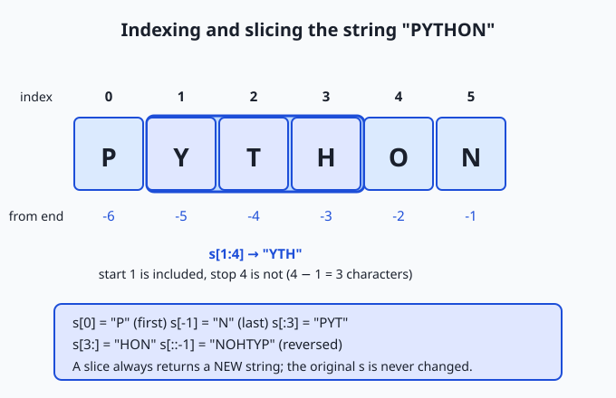

## Why this matters

Almost everything you will ever say to an AI system, and almost everything it says back, is a string of text. A prompt is a string. A model's reply is a string. The instructions you write, the documents you feed in for context, the labels on your training data, the configuration you paste into a terminal — all strings. Long before a model does anything clever with language, plain, ordinary code has to build that text, clean it, cut it apart, and stitch it back together. If you cannot do that fluently, everything downstream is harder than it needs to be.

The practical consequences are immediate. When you assemble a prompt from a template — a fixed frame with a few blanks filled in from your data — you are doing string formatting, and a single misplaced quote or a stray newline can change the answer you get. When you load a dataset of customer reviews or scraped web pages, most of your effort is not modelling at all; it is *text cleaning* — stripping whitespace, fixing inconsistent capitalization, splitting fields, throwing away junk. Practitioners often repeat that data preparation is the majority of real machine-learning work, and the majority of data preparation is string work. Even the way a model reads your prompt starts with a step called tokenization, which chops a string into pieces before any mathematics happens.

Today you learn how Python represents and manipulates text: strings as immutable sequences of characters, how to slice them, the handful of methods you will use every day, the three styles of formatting (and which one to reach for), and how text becomes the bytes that travel over a network or sit on a disk. By the end you will read and write string code without hesitation — the quiet skill underneath every noisy demo.

## The idea in plain language

A **string** in Python is a piece of text: a sequence of characters in a fixed order. You write one by putting characters between quotes — `"hello"` or `'hello'` — and Python stores it as an object you can inspect and copy from, but never change in place. That last part is the single most important idea in this lesson: strings are **immutable**. Once a string exists, its characters are settled. Every operation that looks like it "changes" a string actually builds and hands back a brand-new string, leaving the original exactly as it was. This is the same idea of immutability you began meeting when you studied Python's types on Day 44, now applied to text.

Because a string is a *sequence*, it has positions, and you can reach into it the way you reached into a list: `s[0]` is the first character, `s[-1]` is the last. You can also take a run of characters — a **slice** — with `s[start:stop]`, and Python hands you a new, smaller string. On top of positions, strings carry a rich set of **methods**: named actions you call with a dot, like `s.lower()` to get a lower-cased copy or `s.split()` to break the text into a list of words. And when you need to build a sentence out of values — a name, a count, a price — you use **string formatting** to drop those values into a template, with **f-strings** being the modern, readable way to do it.

Hold three facts in mind and the rest follows: a string is an ordered sequence you can index and slice; a string never changes, so methods return new strings; and formatting is how you weave data into text. Everything else in this lesson is detail hung on those three hooks.

## Historical background

Text handling is older than Python by decades, and its history explains why Python does things the way it does. In the earliest computers there were only numbers; text was bolted on by agreeing that particular numbers would *stand for* particular characters. The most influential such agreement, **ASCII**, was standardized in 1963 and assigned the numbers 0 through 127 to the English letters, digits, punctuation, and a few control codes — so the capital letter `A` became the number 65, exactly the convention you met on Day 5 when you learned how a computer represents data. The word "string" itself — a "string of characters" — has been standard computing vocabulary since those early years.

ASCII's 128 slots covered American English and almost nothing else. As computing spread across languages, a tangle of incompatible encodings grew up, each mapping the bytes above 127 to different accented letters or scripts, so text that looked fine on one machine turned to garbage on another. The fix was **Unicode**: a single catalogue that gives every character in every writing system its own number, or *code point*. The Unicode Consortium was founded in 1991 to steward it. A companion invention, **UTF-8**, designed by Ken Thompson and Rob Pike in 1992, encodes those code points into bytes efficiently and has become the dominant text encoding of the internet.

Python grew up alongside Unicode and eventually embraced it fully. The release of **Python 3.0 in December 2008** made a decisive change: an ordinary string (`str`) became a sequence of Unicode characters, while raw bytes got their own separate type (`bytes`). This clean split — text is one thing, bytes are another, and you convert deliberately between them — is why Python 3 handles the world's languages so gracefully, and why the `encode`/`decode` pair you will meet below matters. The last piece of the modern picture arrived with **Python 3.6 in December 2016**, which introduced **f-strings** through PEP 498 (authored by Eric V. Smith): a concise, fast, readable syntax for embedding values directly inside string literals. Every technique in this lesson sits on that history.

## What it is — and what it is not

A Python string is an immutable sequence of Unicode characters, represented by the built-in type `str`. Every word is load-bearing. *Immutable*: you cannot alter a character in place. *Sequence*: it has an order and a length, so indexing, slicing, iteration, and `len()` all work. *Unicode characters*: each element is a full character — a letter, a digit, an emoji, a Chinese ideograph — not a raw byte, so `len("café")` is 4 regardless of how many bytes that would take to store.

It helps to be equally clear about what a string is not. A string is not a `bytes` object: `"hello"` (text) and `b"hello"` (bytes) are different types, and mixing them raises errors on purpose. A string is not mutable like a list, so `s[0] = "H"` is not allowed and never will be. A string is not a number, even when it looks like one: `"42"` is text, and adding it to `8` is an error until you convert it with `int("42")`. And a string method never edits the original — a frequent beginner trap is calling `s.upper()` and expecting `s` to change, when in fact you must capture the returned value: `s = s.upper()`.

| Misconception | The reality |
| --- | --- |
| "`s.upper()` changes the string." | It returns a **new** upper-cased string; the original is untouched. You must assign the result. |
| "`len(s)` counts bytes." | It counts characters (code points). `"café"` has length 4 even though UTF-8 stores it in 5 bytes. |
| "Single and double quotes mean different things." | They are interchangeable; pick whichever avoids escaping the quote inside your text. |
| "`\n` is two characters, a backslash and an n." | It is one character, a newline. The backslash is an escape that Python reads as a single control character. |
| "You need a regex to do any text work." | Most everyday tasks are simpler and clearer with plain string methods; regex is for genuinely complex patterns (Day 38). |

## Why it was created and what problems it solves

Strings exist because computers compute on numbers, but humans think in words, names, sentences, and files full of prose. Some layer has to bridge that gap, letting a program hold "the customer's last name" or "the first line of the file" as a single, manipulable value. Without a string type you would juggle bare arrays of character-numbers by hand, tracking lengths and boundaries yourself — exactly the error-prone drudgery that older languages forced on programmers and that caused a long history of bugs and security holes.

The *immutability* of Python strings solves a subtler set of problems. Because a string can never change underneath you, it is safe to share: you can pass a string to a function, use it as a dictionary key, or hand the same string to ten different parts of a program, all without worrying that one of them will secretly rewrite it and surprise the others. Immutable text is predictable text. The cost — that "editing" a string means building a new one — is real but usually cheap, and Python's design bets, correctly, that safety and simplicity are worth more than in-place edits for the vast majority of programs. The rich library of string methods and the evolution toward f-strings then solve the everyday problem of *ergonomics*: making the common tasks — clean this up, split that apart, format this nicely — short, readable, and hard to get wrong.

## How it works

Let's build the picture from the ground up: how you create strings, how you reach into them, the methods you will lean on, how you format output, and how text turns into bytes.

### Creating strings

You write a string literal between single or double quotes, and the two are interchangeable — choose the one that lets you avoid escaping:

```python
a = 'She said hello'
b = "It's a fine day"     # double quotes so the apostrophe needs no escape
```

For text that spans several lines, use **triple quotes**, which preserve the line breaks inside:

```python
poem = """the river and the reader
a river starts as a thin trickle"""
```

Some characters cannot be typed directly, so Python uses **escape sequences**: a backslash followed by a code. The important ones are `\n` (newline), `\t` (tab), `\\` (a literal backslash), and `\"` or `\'` (a quote that would otherwise end the string). Each escape is a *single* character in the resulting string, even though you typed two symbols. When you want the backslashes to stay literal — most commonly for Windows file paths or regular-expression patterns — prefix the string with `r` to make a **raw string**, where `r"C:\new"` really is a backslash, an `n`, an `e`, and a `w`, rather than a newline.

### Indexing and slicing

Because a string is a sequence, each character has a position, counted from `0` at the left. Negative positions count from the right, so `-1` is the last character. A **slice** `s[start:stop]` copies the run from `start` up to *but not including* `stop`, returning a new string of `stop - start` characters. Omit an end to run to the edge (`s[:3]`, `s[3:]`), and add a third number — the step — to skip characters or, with `-1`, walk backwards: `s[::-1]` reverses the whole string.



The diagram traces the word `"PYTHON"`. Reading it fixes the two rules people most often stumble over: the start index is *included* and the stop index is *excluded* (so `s[1:4]` gives three characters, `"YTH"`), and negative indices let you reach the end without knowing the length. Because slicing returns a fresh string, none of this ever disturbs the original — immutability again.

### Essential methods

A string method is an action you call with a dot after the string. Because strings are immutable, every method that transforms text returns a *new* string; the original stays put. These few cover the great majority of real work:

| Method | What it does | Example → result |
| --- | --- | --- |
| `s.lower()` / `s.upper()` | Return a copy in lower or upper case | `"River".lower()` → `"river"` |
| `s.strip()` | Remove leading/trailing whitespace (or given characters) | `"  hi \n".strip()` → `"hi"` |
| `s.split(sep)` | Break into a list; default splits on any whitespace | `"a b c".split()` → `["a", "b", "c"]` |
| `sep.join(list)` | Join a list of strings with `sep` between them | `"-".join(["a","b"])` → `"a-b"` |
| `s.replace(old, new)` | Replace every occurrence of one substring with another | `"a.b.c".replace(".", "/")` → `"a/b/c"` |
| `s.find(sub)` | Position of the first match, or `-1` if absent | `"banana".find("na")` → `2` |
| `s.startswith(p)` / `s.endswith(p)` | Test the beginning or end; returns `True`/`False` | `"report.txt".endswith(".txt")` → `True` |
| `s.count(sub)` | How many non-overlapping times `sub` appears | `"banana".count("a")` → `3` |

The pair `split` and `join` are the workhorses of text processing: `split` turns a line into a list of fields you can examine, and `join` turns a list of pieces back into one string. Notice that `join` is a method *on the separator*, which reads oddly at first (`", ".join(names)`) but is exactly right — the separator is what goes *between* the pieces.

### String formatting: three styles

Formatting means weaving values into text. Python has three styles, added over its history, and knowing when to use each is part of A13's tool literacy — all three are built into the language, entirely free, with no package to install.

The oldest is the **`%` operator**, borrowed from the C language: `"Total: %.2f" % price`. The second is the **`str.format()` method**: `"Total: {:.2f}".format(price)`, using `{}` placeholders. The newest and now the default is the **f-string**: put an `f` before the opening quote and write the value directly inside braces — `f"Total: {price:.2f}"`. Inside those braces you can place any expression, not just a variable, and after a colon you can add a **format spec** that controls how the value is displayed.



The diagram takes `f"Total: {price * qty:.2f}"` apart. Python keeps the literal text `Total: ` as-is, *evaluates the expression* `price * qty` first, then applies the format spec `.2f` — "a floating-point number with two decimal places" — to display the result. With `price = 5.0` and `qty = 5`, the whole f-string produces `Total: 25.00`. Format specs are a small language of their own: `:>10` right-aligns a value in a field ten characters wide, `:<10` left-aligns it, `:^10` centres it, `:,` inserts thousands separators, and `:.1%` shows a fraction as a percentage. You will use alignment specs to line up columns in a table, exactly as today's lab does.

| Style | Looks like | Use it when |
| --- | --- | --- |
| f-string | `f"Hi {name}, {n:,} items"` | Almost always — most readable, fastest, expressions inline (Python 3.6+) |
| `str.format()` | `"Hi {}, {:,} items".format(name, n)` | The template and its values are far apart, or you build the template dynamically |
| `%` operator | `"Hi %s, %d items" % (name, n)` | Reading old code, or a codebase that already uses it; avoid in new code |

### Unicode and encoding in Python

A `str` is a sequence of Unicode characters — abstract letters, independent of how they are stored. But files and networks deal in **bytes**, so at the boundary you must convert. Turning text into bytes is **encoding** (`s.encode("utf-8")`), and turning bytes back into text is **decoding** (`b.decode("utf-8")`). This is the same idea you met on Day 5, now with names: an encoding like UTF-8 is the agreed rule for which bytes represent which characters.

```python
text = "café"
data = text.encode("utf-8")   # b'caf\xc3\xa9'  — 5 bytes
back = data.decode("utf-8")   # "café"          — 4 characters
```

Notice that the four-character string takes five bytes, because UTF-8 stores the accented `é` in two bytes. This is why `len()` on a string counts characters, not storage. The one firm rule: always name the encoding explicitly when you read or write text, rather than relying on the platform default, which differs between operating systems and is a classic source of the dreaded `UnicodeDecodeError`. Today's lab passes `encoding="utf-8"` for exactly this reason.

### A nod to regular expressions

When a pattern is genuinely complex — "any sequence of digits," "an email-shaped token," "whitespace of any kind" — plain methods stop being enough, and you reach for **regular expressions** (regex), Python's `re` module, which you met on Day 38. Regex is powerful but harder to read, so the professional habit is to prefer simple string methods for simple jobs and escalate to regex only when the pattern truly demands it. We return to this trade-off below.

## An everyday analogy

Picture a label-maker that prints words onto a strip of tape — a printed ribbon of characters. Each character sits in its own little cell along the ribbon, in a fixed order, and that is your string.

Reading the ribbon is easy and safe: you can point at the first cell (`s[0]`), the last cell (`s[-1]`), or count in from either end. You can take scissors and cut out a run of cells to get a shorter piece — but here is the crucial detail that makes the analogy honest: your "cut" is really a *photocopy* of that run. The original ribbon is never damaged; slicing hands you a fresh copy and leaves the source intact. That is immutability. You physically cannot re-ink a single cell on an existing ribbon; if you want a different message, the machine prints a new ribbon. So when you "change" a string — upper-case it, strip its edges, replace a word — the label-maker is quietly printing a new tape and handing it to you, while the old one still sits on the desk exactly as before.

The methods are the machine's buttons. One button copies the ribbon in all capitals; another trims the blank tape off the ends; another cuts the ribbon at every space to give you a little pile of word-strips; another glues a pile of strips back into one ribbon with a chosen separator between them. And formatting is the template mode: you set up a ribbon with blanks in it — "Total: ____" — and the machine fills each blank with a value, formatted just so, printing the finished tape. Keep the printed ribbon in mind and the rules stop feeling arbitrary: you can read any cell, copy any run, and press buttons to print new ribbons, but you can never re-ink a cell in place.

## Examples in practice

Start with the technical heart of today's lab: counting words in a block of text using only splitting and a dictionary.

```python
text = "a river runs, a river rests, a river runs on"
counts = {}
for token in text.split():             # ["a", "river", "runs,", ...]
    word = token.strip(".,").lower()   # tidy the edges, normalize case
    counts[word] = counts.get(word, 0) + 1
# counts == {"a": 3, "river": 3, "runs": 2, "rests": 1, "on": 1}
```

Read it slowly. `text.split()` cuts the line into tokens on whitespace. For each token, `strip(".,")` peels commas and periods off the ends and `lower()` folds case, so `"runs,"` and `"runs"` count as the same word — a tiny but typical piece of *text cleaning*. The dictionary tallies each word, and `counts.get(word, 0)` supplies a starting count of `0` the first time a word appears. This exact pattern — split, normalize, tally in a dict — recurs constantly whenever you summarize text.

Now formatting, building an aligned row for a report:

```python
label, value = "Words", 105
print(f"{label:<20}{value:>10}")   # 'Words                      105'
```

The `:<20` left-aligns the label in a 20-character field and `:>10` right-aligns the number in a 10-character field, so a column of such rows lines up neatly no matter how long each label is. Change `value` to `1234567` and the number still sits flush against the right edge. This is precisely how today's lab prints its statistics table.

A few more everyday tasks, each a one-liner:

```python
"  ready\n".strip()                       # "ready"        — clean whitespace
"first,last,email".split(",")             # ['first', 'last', 'email']  — parse a CSV row
"/".join(["usr", "local", "bin"])         # "usr/local/bin"  — build a path
"report_2026.txt".endswith(".txt")        # True            — check a file type
"the river".replace("river", "sea")       # "the sea"       — substitute a word
"Hello, World"[7:]                         # "World"         — slice off a prefix
```

Each of these — cleaning, parsing, building, checking, substituting, slicing — is a routine step in preparing text, and together they cover a surprising share of the code you will write when wrangling data.

## Implications: security, privacy, performance, scalability, and cost

**Security.** The great classical vulnerabilities are string-handling failures: building a database query or a shell command by pasting untrusted text straight into a template lets an attacker inject their own commands. The lesson for your own code is to keep untrusted input as *data*, never splicing it blindly into something that will be executed, and to use the safe, parameterized tools your libraries provide rather than hand-built string concatenation for queries and commands.

**Privacy.** Text is where sensitive information lives — names, addresses, messages, health details. Because a string is easy to copy, log, and print, personal data can leak simply by being written to a log file or echoed in an error message. When you clean and process text, be deliberate about what you retain and what you print; a stray `print` of a whole record is a real privacy incident.

**Performance.** Immutability has a cost: building a big string by repeatedly adding to it (`result = result + piece` in a loop) creates a new string every time and can turn a fast job slow. The idiomatic fix leans on the very methods in this lesson — collect the pieces in a list and `"".join(them)` once at the end, which builds the final string in a single pass. Knowing this one pattern spares you a common performance trap.

**Scalability.** When text grows from a line to a multi-gigabyte file, you cannot always hold it all in memory as one string. The scalable habit is to process text a line or a chunk at a time — iterating over a file yields one line at a time — so memory use stays flat no matter how large the input. The string operations are identical; you simply apply them to a stream of pieces rather than one giant string.

**Cost.** In systems that price work by the amount of text — including the language models you will use, which meter usage by tokens — the length and cleanliness of your strings translate directly into money and speed. Trimming needless whitespace, removing boilerplate, and sending only the text that matters are not just tidy habits; they reduce cost and latency. Efficient text handling is efficient spending.

## Alternatives: free, open source, and commercial

Every tool in this lesson ships inside Python itself, at no cost, so "alternatives" means the different *built-in* approaches and the standard-library modules that extend them — not paid products.

| Approach | Type | What it offers | Cost |
| --- | --- | --- | --- |
| f-strings (`str` and its methods) | Built into Python | The default for creating and formatting text; readable and fast | Free |
| `str.format()` and `%` | Built into Python | Older formatting styles you will meet in existing code | Free |
| `re` (regular expressions) | Standard library | Pattern matching for complex text (Day 38) | Free |
| `string` module | Standard library | Constants like `string.punctuation`; `Template` for simple `$name` substitution | Free |
| `textwrap` | Standard library | Wrapping and filling paragraphs to a width | Free |
| `unicodedata` | Standard library | Look up and normalize Unicode characters | Free |
| `pandas` string methods (`.str`) | Open-source library | Apply string operations across whole columns of a table | Free/open source |

For the work in this course you will spend almost all your time with `str` methods and f-strings, reach for `re` when a pattern is genuinely complex, and later meet `pandas` string methods when you clean tabular data at scale. There is no paid tier to any of this; text processing in Python is free all the way down.

## Comparison with related concepts

| Concept A | Concept B | Key difference |
| --- | --- | --- |
| `str` (text) | `bytes` (raw bytes) | `str` is Unicode characters for humans; `bytes` is storage/transmission. Convert with `encode`/`decode`. |
| String methods | Regular expressions (`re`) | Methods are simple and readable for fixed substrings; regex handles complex, variable patterns at the cost of readability. |
| f-string | `str.format()` | Same power; f-strings embed the expression inline and read better, so they are the default for new code. |
| Slicing `s[a:b]` | Indexing `s[i]` | Indexing returns one character; slicing returns a new (possibly empty) substring, `b - a` characters long. |
| String (immutable) | List (mutable) | You can reassign a whole string but not edit one character in place; a list can be changed element by element. |
| `split` | `join` | Inverse operations: `split` turns one string into a list of pieces; `join` turns a list of pieces into one string. |

## When to use it — and when not to

Reach for plain string methods whenever the task is describable with fixed substrings and simple structure: trimming whitespace, changing case, splitting on a known separator, checking a prefix or suffix, replacing a literal word. This is the overwhelming majority of text work, and methods keep it short and obvious. Reach for f-strings whenever you build output for a person or a template for a machine — reports, messages, prompts, file names — because they are the clearest way to weave values into text. Reach for `encode`/`decode` precisely at the boundary where text meets a file, a socket, or any raw-byte world, and name the encoding every time.

Know when to escalate and when to stop. When a pattern becomes genuinely variable — matching any run of digits, any whitespace, an email-shaped token — stop stretching string methods into knots and switch to a regular expression (Day 38), which was built for exactly that. Conversely, do not reach for regex when a one-line `replace` or `split` would do; a regex is harder to read and easier to get subtly wrong, and reviewers will thank you for the simpler code. And when performance matters, do not build a large string by repeated concatenation in a loop — collect pieces and `join` them once. The professional instinct is to use the simplest tool that clearly expresses the task, and to escalate only when the task, measured honestly, demands it.

The AI thread ties all of this together. When you engineer a prompt, you are formatting a string — often an f-string template with your data dropped into the blanks. When you prepare training or evaluation data, you spend most of your time on string cleaning: stripping, splitting, normalizing case, removing junk. When a model reads your input, the very first step is tokenization, which operates on the string you hand it, so the exact characters — every stray space and newline — matter. And when you send text to any service that charges by length, tidy strings are cheaper strings. The fluency you build today is not a preliminary to the interesting work; in AI practice, careful text handling *is* a large part of the work.

## Knowledge check

Try these from memory before looking back:

1. Explain in one sentence why `s.upper()` does not change `s`, and what you must do to keep the upper-cased result.
2. Given `s = "PYTHON"`, state the values of `s[0]`, `s[-1]`, `s[1:4]`, and `s[::-1]`, and say how many characters `s[1:4]` contains and why.
3. Write an f-string that prints a name left-aligned in 12 columns followed by a price right-aligned in 8 columns with two decimal places.
4. Describe the difference between `str` and `bytes`, and name the two operations that convert between them in each direction.
5. You must decide between a string method and a regular expression for a task: give one task where each is the right choice, and justify both.

## Hands-on exercise

Time to process real text. In the Day 45 lab you will build a small program, `text_report.py`, that reads a fixed block of sample text and produces a clean report using only the tools from this lesson: a title-cased heading, counts of lines, words, characters, and unique words, the single most common word (found with `split` plus a dictionary), and a neatly aligned statistics table built with f-string format specs. The full solution lives in the lab's `examples/` directory; a starter with five numbered exercises is in `starter/`.

To see the finished report first, then start your own version, run these from the lab directory:

```bash
python3 examples/text_report.py
python3 starter/text_report.py
```

The first command prints the complete report from the committed sample; the second runs your working copy, which begins with the five exercises unfinished. Each exercise names the exact method or expression to use — read the file, build the heading with `.strip().title()`, count words into a dict, find the most common, and print the table with alignment specs.

### Expected output

Running the completed reference program on the committed sample prints exactly this (the sample never changes, so your numbers must match):

```text
============================================
          The River And The Reader          
============================================

Preview:  the river and the reader A river starts ...
Heading reversed:  redaeR ehT dnA reviR ehT
First / last body word:  'river' / 'you'

Statistic                Value
------------------------------
Lines                        9
Words                      105
Characters                 556
Unique words                66

Most common word:  "river" (11 times, 10.5% of words)
```

The heading is the first line of the sample fed through `.title()`; the reversed line is `heading[::-1]`; the table rows use `:<20` and `:>10` to align; and the final line reports the word your counting dictionary found most often.

### Validate your work

You are done when you can check every box:

- [ ] `python3 examples/text_report.py` prints the report above without error.
- [ ] Your finished `starter/text_report.py` prints the same four counts: 9 lines, 105 words, 556 characters, 66 unique words.
- [ ] The most common word line reads `"river" (11 times, 10.5% of words)`.
- [ ] `bash tests/run_tests.sh` ends with `9 checks, 0 failure(s).`
- [ ] You can explain, in one sentence each, what `split`, `strip`, `.title()`, and `[::-1]` did in your program.

### Troubleshooting

- **`UnicodeDecodeError` when reading the sample.** You omitted or mismatched the encoding. Read with `encoding="utf-8"` and, if you edited the sample, restore it with `git checkout -- examples/sample.txt`.
- **`SyntaxError` inside an f-string, usually about quotes.** A double-quoted f-string cannot contain an unescaped double quote in its `{...}`; use single quotes inside, or put the literal quote in the text part. The lab's troubleshooting file has worked examples.
- **`IndexError: list index out of range`.** `lines[0]` failed because the text was empty — Exercise 1 did not actually read the file into `text`.
- **The table columns do not line up.** The alignment comes from the format specs `:<20` and `:>10`; a label longer than 20 characters pushes the number across. Keep labels short or widen the field.

### Common mistakes

- **Expecting a method to change the string.** `s.strip()` returns a new string; if you do not assign it (`s = s.strip()`), nothing appears to happen. This is immutability biting.
- **Off-by-one in a slice.** `s[a:b]` includes `a` but stops before `b`, so `"River"[0:3]` is `"Riv"`, not `"Rive"`. When in doubt, remember the slice length is `b - a`.
- **Forgetting to normalize before counting.** If you skip `strip` and `lower`, then `"River,"`, `"river"`, and `"River"` count as three different words and your tallies are wrong.
- **Reaching for `%` formatting in new code.** It still works, but f-strings are the modern default; prefer `f"..."` unless you are matching an existing style.

## Practice assignment

Complete the strings worksheet in the lab's `starter/` directory and finish all five exercises in `starter/text_report.py` so it reproduces the expected report exactly. Then extend the program in one small way of your choosing and write two or three sentences in the worksheet about what you added: for example, print the *longest* line and its length using `max(lines, key=len)` and an f-string, or print the top three words instead of only the most common by sorting `counts.items()` and slicing `[:3]`. Record in the worksheet the sample's word count, one slice expression with its result, and one f-string you wrote yourself that uses both an embedded expression and a format spec. Keep the worksheet; a later lesson on input and output builds directly on today's formatting.

## Extension challenge

Go one layer deeper into the text-versus-bytes distinction that underlies all of this. In a Python shell, take a string that contains a non-ASCII character — `s = "café"` — and compare `len(s)` with `len(s.encode("utf-8"))`. Explain in writing why the two differ, which one counts characters and which counts bytes, and what would happen if you tried to `decode` those bytes with the wrong encoding. Then measure the performance point from the lesson: build a 100,000-character string two ways — once by repeated concatenation in a loop (`result = result + "x"`) and once by collecting the pieces in a list and calling `"".join(pieces)` — and time both with Python's `timeit`. Write two or three sentences on which was faster and why immutability explains the difference. You will have connected today's abstract idea — strings are immutable Unicode sequences — to concrete facts about memory, speed, and encoding that working practitioners reason about every day.
