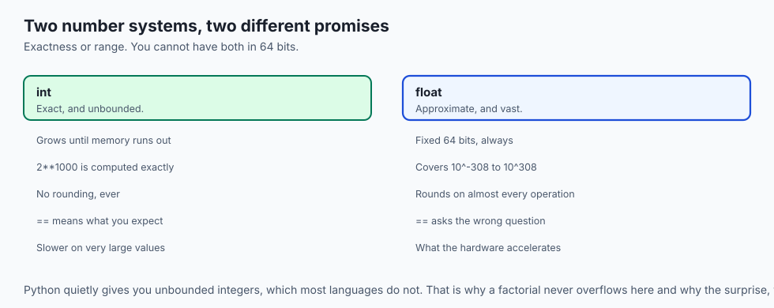
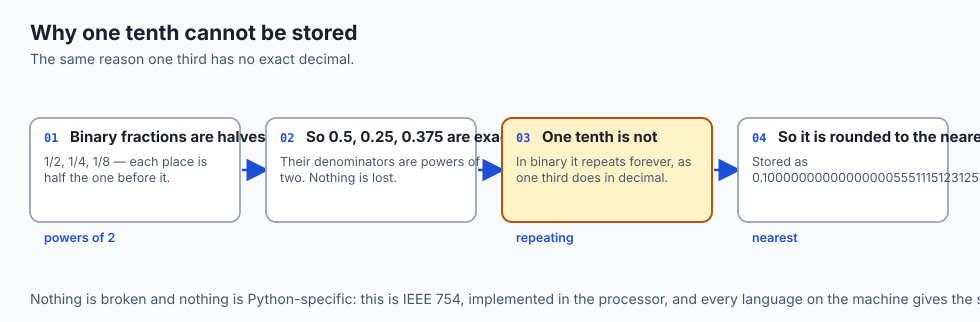
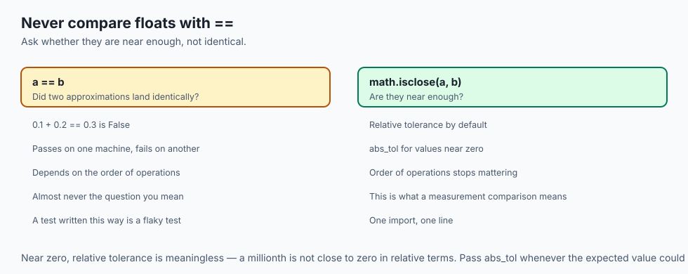
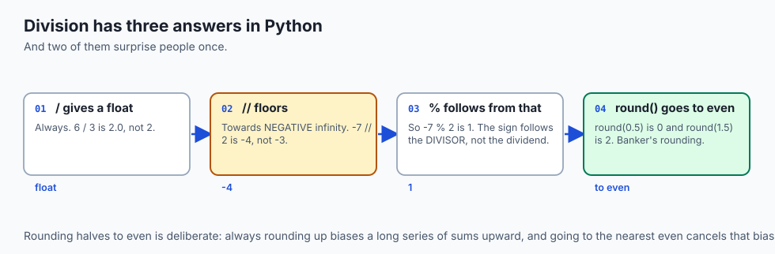
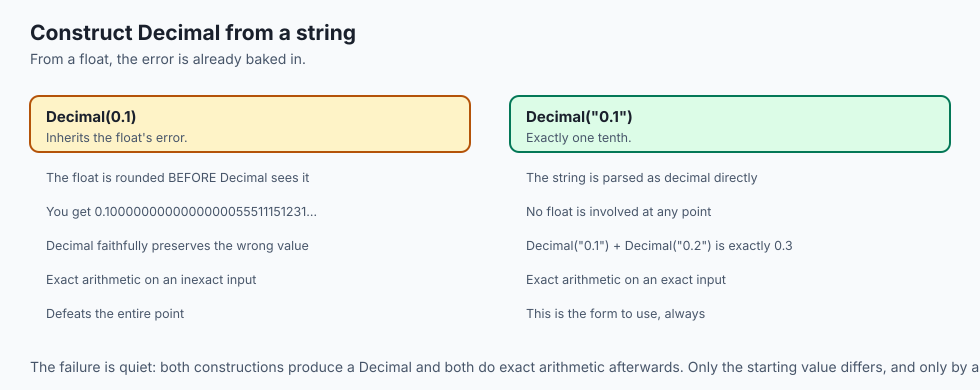
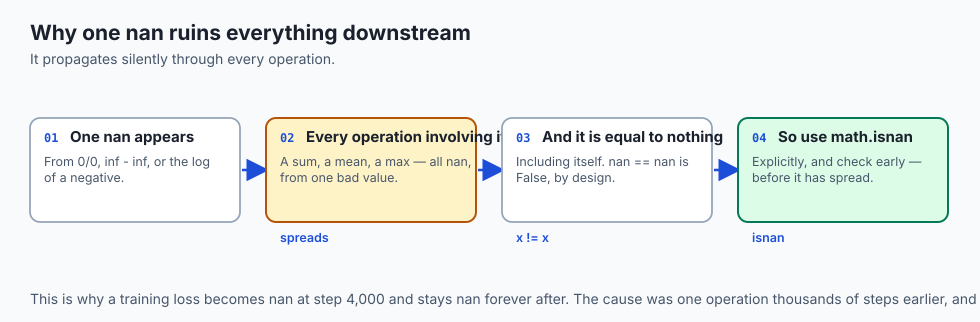
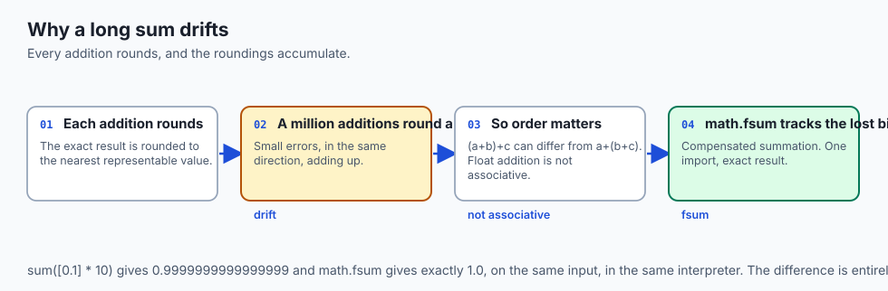
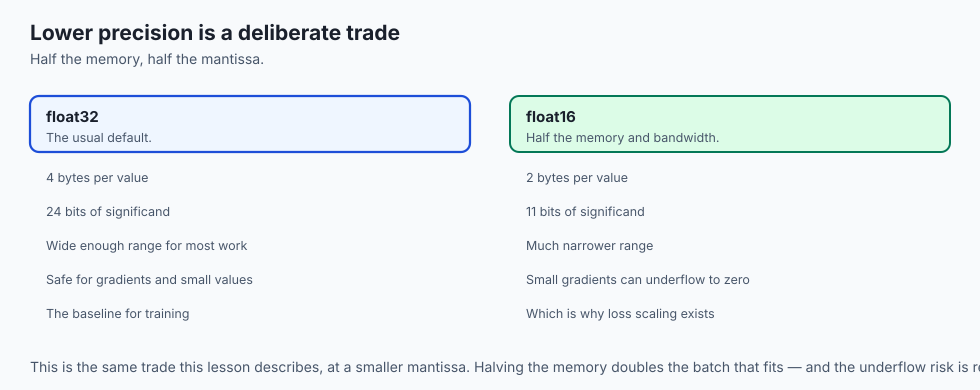
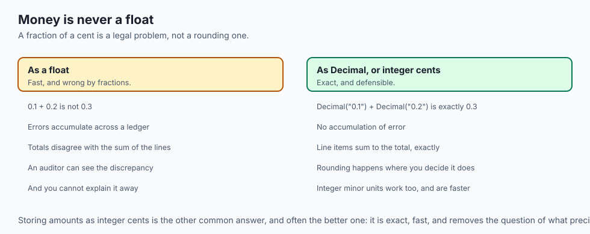

## Why this matters

- **`0.1 + 0.2 != 0.3`** is not a Python quirk. It is how every language on every
  machine stores fractions, and today is where you meet it.
- **Every model weight is a float**, and every training run accumulates the
  rounding this lesson describes.
- **`nan` in your loss** is almost always an overflow, a division by zero, or a
  log of zero — all of them number problems.
- **Money must never be a float**, and knowing why saves a class of bug that is
  expensive in the literal sense.
- **Comparing floats with `==` is a bug**, and the correct alternative takes one
  line.

---

## The idea in plain language



- **Integers in Python are exact and unbounded.** They grow until memory runs out.
- **Floats are approximations.** They trade exactness for range and speed.
- **Most decimal fractions cannot be stored exactly in binary**, the way one third
  cannot be written exactly in decimal.
- **So arithmetic accumulates tiny errors**, and comparing two floats for equality
  asks the wrong question.
- **`Decimal` and `Fraction` exist for when exactness matters** more than speed.

---

## Historical background

- **Early machines each had their own float format**, so the same program gave
  different answers on different hardware.
- **IEEE 754, published in 1985**, standardised the layout and the rounding rules,
  and essentially every processor has implemented it since.
- **That is why the same rounding error appears in every language.** It is the
  hardware's arithmetic, not Python's.
- **The standard also defined `inf` and `nan`** as values rather than errors, so a
  computation could continue past an overflow.
- **Python's integers became arbitrary-precision in Python 3**, unifying the old
  `int` and `long` — which is why factorials do not overflow here.
- **`Decimal` arrived to serve money and accounting**, where a fraction of a cent
  is a legal problem rather than a rounding one.

---

## What it is — and what it is not

**A float is:**

- A fixed-width approximation: sign, exponent and mantissa in 64 bits.
- Exact for integers up to 2^53, and for fractions whose denominator is a power of
  two.
- Fast, because the processor implements it directly.

**It is not:**

- **Not a decimal.** It stores binary fractions, and most decimal fractions are
  not among them.
- **Not exact.** `0.1` is stored as the nearest representable value, which is not
  `0.1`.
- **Not associative.** `(a + b) + c` can differ from `a + (b + c)`, which matters
  when summing many numbers.
- **Not suitable for money.** Any system that adds fractions of a currency unit
  wants `Decimal`.

---

## Why it was created and what problems it solves

- **Range.** A float covers roughly 10^-308 to 10^308 in 64 bits, which no
  fixed-point format of that size can.
- **Speed.** The hardware does it directly, which is why every numerical library
  is built on it.
- **A single portable standard**, so the same program gives the same answer
  everywhere.
- **Graceful overflow.** `inf` and `nan` let a computation continue and be
  inspected rather than aborting at the first problem.
- **The trade is exactness**, and Python provides `Decimal` and `Fraction` for
  when that trade is the wrong one.

---

## How it works

### How a float is stored




- **Three fields in 64 bits**: one sign bit, eleven exponent bits, fifty-two
  mantissa bits.
- **The value is the mantissa scaled by two to the exponent** — a binary fraction,
  not a decimal one.
- **A fraction is exact only if its denominator is a power of two.** One half,
  one quarter and three eighths are fine.
- **One tenth is not.** In binary it repeats forever, exactly as one third repeats
  in decimal, so it is stored as the nearest representable value.
- **`0.1 + 0.2` gives `0.30000000000000004`** because two approximations were
  added and the result was rounded again.
- **Integers are exact up to 2^53.** Beyond that, consecutive integers stop being
  representable, which is Day 24's big-identifier problem.

### Comparing floats



```python
0.1 + 0.2 == 0.3            # False
math.isclose(0.1 + 0.2, 0.3)  # True
```

- **`==` asks whether two approximations landed on the same value**, which is
  rarely the question you mean.
- **`math.isclose` asks whether they are near enough**, with both a relative and
  an absolute tolerance.
- **Use an absolute tolerance near zero.** Relative tolerance is meaningless when
  the expected value is `0`.

### Integer division, modulo, and rounding



- **`/` always gives a float**, even for `6 / 3`. `//` gives the floor.
- **Floor division rounds towards negative infinity**, so `-7 // 2` is `-4`, not
  `-3`.
- **`%` follows from that**, so `-7 % 2` is `1` — the sign follows the divisor.
- **`round()` uses banker's rounding**: halves go to the nearest *even* number, so
  `round(0.5)` is `0` and `round(1.5)` is `2`.
- **That is deliberate.** Always rounding halves up biases a long series of sums
  upwards; going to even cancels out.

### When exactness matters




| Type | Exact? | Speed | Use it for |
| --- | --- | --- | --- |
| `int` | Yes, unbounded | Fast | Counting, indexing, identifiers |
| `float` | No | Fastest | Measurement, science, anything with a tolerance |
| `Decimal` | Yes, decimal | Slow | Money, and anything audited |
| `Fraction` | Yes, rational | Slowest | Exact ratios, symbolic work |

- **`Decimal("0.1") + Decimal("0.2")` is exactly `Decimal("0.3")`.**
- **Construct `Decimal` from a string, not a float.** `Decimal(0.1)` inherits the
  float's error before `Decimal` ever sees it.
- **`Fraction(1, 3)` is exactly one third**, and stays exact through arithmetic.

### Special values



- **`inf` results from overflow** and from dividing a non-zero float by zero in
  some libraries.
- **`nan` means "not a number"** — the result of `0/0`, `inf - inf`, or the log of
  a negative.
- **`nan` is not equal to anything, including itself.** That is by design, and it
  is why `x != x` is a valid test for it.
- **Use `math.isnan`** rather than that trick in code anyone else will read.
- **`nan` propagates.** One in a dataset poisons every sum and mean computed from
  it, silently.

---

## An everyday analogy

A ruler with finite markings.

| Measuring | Floats |
| --- | --- |
| The finest marking on the ruler | The mantissa's precision |
| Reading to the nearest marking | Rounding to the nearest representable value |
| A length that falls between markings | A fraction with no exact representation |
| Adding many measured lengths | Accumulated error |
| "Within a millimetre" | `math.isclose` |
| A tape measure that reaches further, less finely | The exponent trading precision for range |

- **The ruler is not wrong.** It has finite markings, and every reading is to the
  nearest one.
- **Adding twenty readings adds twenty roundings**, which is why a long sum drifts.
- **Asking whether two measurements are exactly equal** is asking the wrong
  question about a measured thing.

---

## Examples in practice



- **A test asserting `total == 0.3`** that fails on a machine where it passed
  before.
- **A running total that drifts** after summing a million values, fixed by
  `math.fsum`.
- **A price computed as `0.1 * 3`** and billed as `0.30000000000000004`.
- **A loss that becomes `nan` at step 4,000** and stays `nan` forever after, because
  it propagates.
- **`round(2.5)` giving `2`**, which is banker's rounding working as designed.

---

## Implications: security, privacy, performance, scalability, and cost

- **Security: float comparison in a permission check is a bug.** Thresholds
  computed differently on two paths can disagree.
- **Integer overflow does not exist in Python**, which removes a whole class of
  vulnerability present in C — at the cost of speed on very large values.
- **Performance: floats are what hardware accelerates.** `Decimal` is roughly two
  orders of magnitude slower and is the right answer anyway when money is
  involved.
- **Accumulated error grows with the number of operations**, which is why summing
  a large array in a naive loop is less accurate than a pairwise or compensated
  sum.
- **Cost: `nan` is expensive because it is silent.** A poisoned value propagates
  through an entire training run before anyone notices the metric.
- **Cost: a currency bug is a legal and financial problem**, not a rounding one.

---

## Alternatives: free, open source, and commercial



| Tool | Type | Where it fits |
| --- | --- | --- |
| `math.isclose` | Free, standard library | Comparing floats, always |
| `decimal.Decimal` | Free, standard library | Money, invoices, anything audited |
| `fractions.Fraction` | Free, standard library | Exact ratios |
| `math.fsum` | Free, standard library | An accurate sum of many floats |
| NumPy | Free, open source | Arrays, and explicit control of precision |
| `float32` / `float16` | Free, in NumPy and frameworks | Half the memory, half the precision |

- **`math.fsum` is worth knowing today.** It sums without accumulating the usual
  error, and it costs one import.
- **Lower precision is a deliberate AI trade-off**, not a mistake: `float16` halves
  memory and bandwidth, at real risk of underflow.

---

## Comparison with related concepts

| Term | What it actually is |
| --- | --- |
| **Mantissa** | The significant digits |
| **Exponent** | The scale they are multiplied by |
| **Precision** | How many digits are kept |
| **Range** | How large and small a value can be |
| **`inf`** | Overflow, as a value rather than an error |
| **`nan`** | Not a number; unequal to everything, including itself |
| **Banker's rounding** | Halves go to the nearest even |

---

## When to use it — and when not to



- **Use `int` whenever the quantity is countable.** Counts, indices and
  identifiers are never floats.
- **Use `float` for measurement**, where a tolerance is meaningful anyway.
- **Use `Decimal` for money**, constructed from strings.
- **Use `math.isclose` for every float comparison**, with an absolute tolerance
  near zero.
- **Do not compare floats with `==`.**
- **Do not construct `Decimal` from a float.** The error is already baked in.
- **Do not accumulate a large sum naively** when accuracy matters. `math.fsum`
  exists.

---

## The AI connection

- **Every model weight is a float**, and every training run accumulates the
  rounding error this lesson describes.
- **`float32` versus `float16` is the same trade** at a smaller mantissa: half the
  memory, half the precision, and a real risk of underflow.
- **Loss going to `nan`** is usually this — an overflow, a division by zero, or a
  log of zero, propagating through every subsequent operation.
- **Never compare floats with `==`** in a training loop or a test. Use a tolerance,
  which is what `math.isclose` and `torch.allclose` are for.
- **Money is not a float.** Anything you bill for wants `Decimal`, and that rule
  survives into every system you will build.

## Knowledge check

```yaml
quiz:
  question: "A test asserts that 0.1 + 0.2 equals 0.3 and fails. What is the correct fix?"
  options:
    - "Compare with a tolerance, using math.isclose, because binary floats cannot represent either operand exactly"
    - "Round both sides to one decimal place before comparing them"
    - "Use Decimal(0.1) + Decimal(0.2) so the arithmetic is exact"
    - "Increase the float precision by using a 128-bit type"
  answer_index: 0
  explanation: "Neither 0.1 nor 0.2 has an exact binary representation, so their sum is the nearest representable value to 0.3 rather than 0.3 itself. Rounding hides the issue rather than addressing it, and Decimal(0.1) inherits the float's error before Decimal sees it — the string form would be needed. A tolerance asks the question that actually makes sense about approximations."
```

---

## Hands-on exercise

See the error, measure it, then eliminate it where it matters. Worked through fully
in the Day 46 lab directory.

| What you are doing | Command |
| --- | --- |
| See the classic result | `0.1 + 0.2` |
| See what is really stored | `format(0.1, '.20f')` |
| Compare properly | `math.isclose(0.1 + 0.2, 0.3)` |
| Find the integer limit | `2**53 == 2**53 + 1` |
| Use exact decimals | `Decimal("0.1") + Decimal("0.2")` |
| See the float trap | `Decimal(0.1)` |
| Sum accurately | `sum([0.1]*10)` against `math.fsum([0.1]*10)` |

### Expected output

```text
0.30000000000000004
0.10000000000000000555
True
True
0.3
0.1000000000000000055511151231257827021181583404541015625
0.9999999999999999   1.0
```

- **`2**53 + 1` equals `2**53`** as a float — the integer is no longer
  representable.
- **`Decimal(0.1)` shows the float's actual value**, which is why the string form
  matters.
- **`fsum` got exactly `1.0`** where the naive sum did not.

### Validate your work

- [ ] You saw the stored value of `0.1` to twenty decimal places
- [ ] You replaced a `==` comparison with `math.isclose`
- [ ] You found where consecutive integers stop being representable as floats
- [ ] You demonstrated that `Decimal(0.1)` and `Decimal("0.1")` differ
- [ ] You compared `sum` with `math.fsum` on a case where they disagree
- [ ] `bash tests/run_tests.sh` reports 0 failures

### Troubleshooting

- **`isclose` still returns `False` near zero.** Relative tolerance is meaningless
  there. Pass `abs_tol`.
- **`Decimal` arithmetic raises.** You mixed it with a float. Convert explicitly.
- **`round()` surprises you.** Banker's rounding. `round(0.5)` is `0`.
- **Your `nan` check with `==` never fires.** `nan` is not equal to itself. Use
  `math.isnan`.

### Common mistakes

- **Comparing floats with `==`.**
- **`Decimal(0.1)` instead of `Decimal("0.1")`.**
- **Using a float for money.**
- **Assuming `nan` will raise.** It propagates silently instead.

---

## Practice assignment

- **Find three decimal fractions that are exact in binary** and three that are
  not, and explain the pattern.
- **Write a currency calculation twice**, with `float` and with `Decimal`, and
  find an input where they disagree by a cent.
- **Accumulate a million small floats** and compare `sum`, `math.fsum` and a
  running `Decimal` for accuracy and speed.
- **Introduce a `nan` into a list** and trace how far it propagates through a mean,
  a max and a sort.

---

## Extension challenge

- **Reproduce non-associativity**: find three floats where `(a+b)+c` differs from
  `a+(b+c)`, and explain which rounding caused it.
- **Find the smallest float greater than 1.0** using `math.nextafter`, and relate
  it to the 52-bit mantissa.
- **Compare `float32` and `float64`** on the same computation in NumPy, and find an
  input where the difference is visible.
- **Implement compensated summation** yourself and compare it with `math.fsum`.

---

