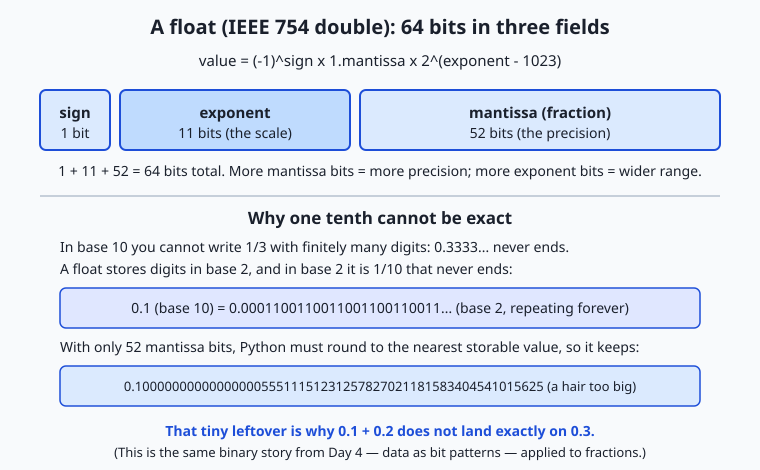
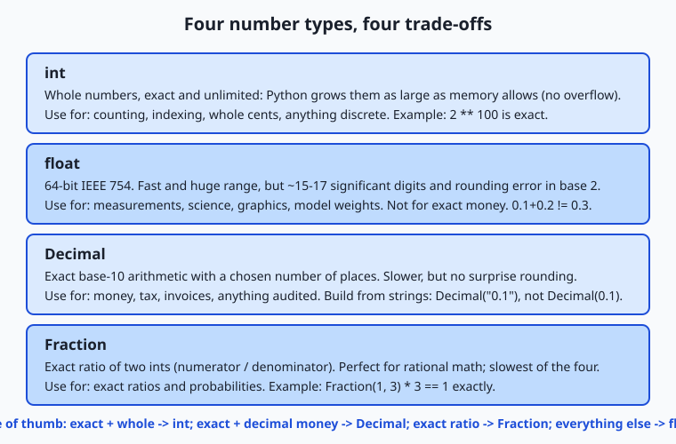

## Why this matters

Every program you will write leans on numbers, and Python makes numbers look effortless: you type `0.1 + 0.2` and expect `0.3`. Run it, though, and Python answers `0.30000000000000004`. That trailing `...4` is not a bug in Python, a fault in your machine, or a rounding you can switch off — it is the single most important fact about how computers store fractions, and today you learn exactly why it happens and what to do about it.

This matters the moment your programs touch anything real. If you total a shopping cart in the wrong number type, the invoice can be a cent off, and a cent that reconciles wrong at the end of the month is a support ticket, an audit finding, or a lost customer's trust. If you compare two computed prices with `==` and they differ by an invisible `0.0000000000001`, your "these should be equal" check fails and your code takes the wrong branch. And when you reach the machine-learning sections of this course, the numbers only get sharper-edged: models store their millions of parameters as floats with a deliberately chosen number of bits — `float32`, `float16`, `bfloat16` — and that single choice trades memory against speed against accuracy. Understanding the limits of a float is what lets you later read a sentence like "we quantized the model to 8 bits" and know precisely what was given up and what was gained.

Numbers also touch cost and correctness at the same time. Choosing `float` where you needed exact decimal math produces bugs that hide for months and surface at the worst moment; choosing the slow, exact type everywhere wastes memory and time you did not need to spend. By the end of this lesson you will know Python's numeric types, the operators that combine them, the precision traps built into floating-point, and the exact tools — `round`, `math.isclose`, and the `decimal` module — that keep your arithmetic honest.

## The idea in plain language

Python gives you a small family of number types, and picking the right one is most of the skill. There are two you will use constantly. An **integer** (`int`) is a whole number — `0`, `42`, `-7` — and Python's integers are *exact* and have *no size limit*: they grow as large as your memory allows, so `2 ** 100` gives the full 31-digit answer with no overflow. A **floating-point number** (`float`) is a number with a decimal point — `3.14`, `0.1`, `-2.5` — and it is stored in a fixed 64 bits, which makes it fast and able to represent enormous and tiny magnitudes, but only to *limited precision*. That precision limit is where the famous `0.1 + 0.2` surprise lives.

The reason a float cannot hold `0.1` exactly is the same reason you cannot write one third exactly in ordinary decimal. Try: one third is `0.3333...`, and no matter how many threes you write, you never quite arrive. Decimal notation, with its finite string of digits, simply has no exact spelling for one third. A float stores numbers in *binary* (base 2, the on/off world of Day 4), and in binary it is *one tenth* that has no exact spelling: it becomes `0.0001100110011...` repeating forever. Since a float has only a fixed number of binary digits, Python rounds `0.1` to the nearest value it *can* store — a value a whisker larger than one tenth — and every later calculation carries that whisker along.

So the plan of the day is this: meet the number types and the arithmetic operators (`+ - * / // % **`), understand where floats round and how to compare them safely, learn the exact types (`Decimal` for money, `Fraction` for ratios) for when rounding is unacceptable, and pick up the standard-library toolkits — `math`, `random`, and a peek at `statistics` — that do the heavy lifting. Through it all, hold one picture in mind: a number type is a notebook with a fixed number of boxes per number, and the trouble starts whenever the number you want does not fit the boxes.

## Historical background

The trouble with fractions on computers is older than Python by decades. Early machines each invented their own way of storing non-whole numbers, and the incompatibility was a real problem: a calculation that ran correctly on one manufacturer's computer could give subtly different answers on another's, because they rounded differently, handled overflow differently, and disagreed about the edges. Portable numerical software was nearly impossible.

The fix was a standard. In 1985 the Institute of Electrical and Electronics Engineers published **IEEE 754**, the standard for binary floating-point arithmetic, driven substantially by the mathematician William Kahan, who won the 1989 Turing Award in part for this work. IEEE 754 pinned down exactly how a floating-point number is laid out in bits, how arithmetic on it must round, and how special values (infinity, and "not a number") behave — so that the same program produces the same answer on any conforming hardware. The standard defined a 32-bit "single precision" format and a 64-bit "double precision" format; it was revised in 2008 and 2019, adding smaller and larger formats, but the core layout has been stable for forty years. When Python evaluates `0.1 + 0.2`, it is following IEEE 754 double precision to the letter — the `...4` is not Python improvising, it is Python obeying a global standard.

The *exact* side of the family has its own lineage. The idea of computing in base 10 to avoid the binary-fraction problem goes back to business machines that always worked in decimal because money is decimal. Python's `decimal` module implements the IBM-authored General Decimal Arithmetic specification, a modern descendant of that tradition, and it has shipped in Python's standard library since 2004 (Python 2.4). So the two halves of today's lesson — fast-but-approximate binary floats and slow-but-exact decimals — are not Python quirks; they are two long-standing engineering answers to the same question: how do you write a number that does not fit in a finite box?

## What it is — and what it is not

A Python number is a value of a specific numeric *type*, and the type determines both what the value can represent and how arithmetic behaves. `int` is exact whole-number arithmetic with unlimited size. `float` is IEEE 754 double-precision binary floating-point: fast, wide-ranging, and *approximate for most decimal fractions*. `Decimal` is exact base-10 arithmetic to a chosen precision. `Fraction` is an exact ratio of two integers. `complex` is a number with a real and an imaginary part, written like `3 + 4j`. Each is a different notebook with different rules.

It helps to be clear about what floating-point is *not*. A float is **not** broken or random: `0.1 + 0.2` gives the same answer every time, on every conforming machine, forever — it is deterministic, just not exactly one tenth plus two tenths. A float is **not** "accurate to a few decimal places and then garbage": a double carries roughly 15 to 17 significant decimal digits of precision, which is plenty for most measurements and science. And the error is **not** something you remove by rounding once at the start; rounding is a tool you apply deliberately at the *end*, when you present or compare results. Finally, `Decimal` is **not** "the correct type you should always use." It is slower and heavier than `float`, and for measurements, physics, graphics, and machine learning, `float` is exactly right. The skill is matching the type to the job, not treating one type as universally superior.

## Why it was created and what problems it solves

Floating-point exists to solve a genuinely hard problem: representing a vast range of magnitudes — from the size of an atom to the distance between galaxies — in a fixed, small amount of memory, fast enough to do billions of operations per second. Whole numbers cannot express `3.14`; fixed-point schemes (a whole-number count of, say, thousandths) waste bits and cap the range. The floating-point trick is to store a number the way scientists write it: a handful of significant digits (the *mantissa*) times a power of the base (set by the *exponent*), so the decimal point "floats" to wherever it is needed. That is how a mere 64 bits can hold both `0.0000001` and `100000000000.0`. The price of that range and speed is precision: only a fixed number of significant digits fit, so most values are stored as the nearest representable neighbour.

The exact types exist to solve the opposite problem. Sometimes "nearest neighbour" is unacceptable. Money is the classic case: a bank cannot answer "is this balance exactly zero?" with "close enough." Tax calculations, invoices, and anything that must reconcile to the cent need arithmetic that behaves exactly like the base-10 math a human does on paper — which is precisely what `Decimal` provides. `Fraction` solves a third problem: keeping ratios exact so that `1/3` really is one third and `1/3 * 3` is exactly `1`, never `0.9999...`. Each type was created because no single representation can be simultaneously fast, compact, wide-ranging, *and* exact — so Python gives you the whole toolbox and lets you choose.

## How it works

Start with the star of the show, the 64-bit float. A double-precision float divides its 64 bits into three fields: **1 sign bit** (positive or negative), **11 exponent bits** (the scale — which power of two), and **52 mantissa bits** (the significant binary digits, also called the fraction). The value is, in effect, `(sign) × 1.mantissa × 2^(exponent − 1023)`. The 11 exponent bits give the enormous range (up to about `1.8 × 10^308`); the 52 mantissa bits give the precision (about 15–17 decimal digits). This is the Day 4 idea — everything is bit patterns — applied to fractions.



Now the crucial mechanism. To store `0.1`, Python must express one tenth as `1.something × 2^n` using only 52 mantissa bits. But one tenth in binary is `0.00011001100110011...`, repeating forever, so it cannot fit in 52 bits. Python rounds to the nearest value that *does* fit, which happens to be very slightly larger than one tenth — its exact stored value is `0.1000000000000000055511151231257827021181583404541015625`. Store `0.2` and you get another tiny error; add them and the errors combine into a sum stored as `0.3000000000000000444...`, which is not the value stored for the literal `0.3`. Hence `0.1 + 0.2 == 0.3` is `False`. Nothing went wrong — three separate roundings simply did not cancel.

The arithmetic operators are the other half of "how it works." Python has seven you will use daily, and two of them — `/` and `//` — are easy to confuse:

| Operator | Name | Example | Result | Notes |
| --- | --- | --- | --- | --- |
| `+` | Addition | `7 + 2` | `9` | |
| `-` | Subtraction | `7 - 2` | `5` | |
| `*` | Multiplication | `7 * 2` | `14` | |
| `/` | True division | `7 / 2` | `3.5` | **Always returns a `float`**, even for `4 / 2` → `2.0` |
| `//` | Floor division | `7 // 2` | `3` | Divides and rounds *down* to a whole number |
| `%` | Modulo (remainder) | `7 % 2` | `1` | What is left over after floor division |
| `**` | Exponentiation | `7 ** 2` | `49` | `2 ** 10` → `1024` |

The `/` versus `//` distinction is the one to burn in. In Python 3, `/` is *true division* and always produces a float: `10 / 5` is `2.0`, not `2`. `//` is *floor division*: it divides and throws away the fractional part, rounding toward negative infinity, so `7 // 2` is `3` and `-7 // 2` is `-4`. The companion operator `%` gives the remainder, so that `(a // b) * b + (a % b)` always reconstructs `a`. Together `//` and `%` are how you split a quantity into whole units and leftovers — pages of items, rows of a grid, or coins of change — without ever touching a float, and therefore without any rounding error at all.

For the exact types, the mechanism is different. A `Decimal` stores a number as a whole-number sequence of decimal digits plus a base-10 exponent, so `Decimal("0.1")` holds exactly one tenth, and `Decimal("0.1") + Decimal("0.2")` is exactly `Decimal("0.3")`. The one rule you must respect: build a `Decimal` from a **string** (`Decimal("0.1")`), never from a float (`Decimal(0.1)`), because `Decimal(0.1)` faithfully copies the float's *error* — it stores `0.1000000000000000055...`. A `Fraction` stores a numerator and denominator as two integers and keeps them reduced, so `Fraction(1, 3)` is exactly one third and `Fraction(1, 3) * 3` is exactly `1`.

Two standard-library toolkits round out the picture. The `math` module holds the mathematical functions that do not belong to any one number — `math.sqrt(2)` (`1.4142135623730951`), `math.floor(3.7)` (`3`), `math.ceil(3.2)` (`4`), constants like `math.pi`, and, most useful today, `math.isclose(a, b)`, which reports whether two floats are equal *within a small tolerance* — the right way to compare floats. The `random` module produces pseudo-random numbers — `random.random()`, `random.randint(1, 6)`, `random.choice(seq)` — for simulations, samples, and shuffles. One warning that belongs right here: `random` is fast and statistically good but **predictable**, so it must never be used for passwords, tokens, or anything that has to be unguessable; for that, Python has the `secrets` module.

## An everyday analogy

Think of each number type as a **notebook with a fixed number of little boxes per number**, and a rule about what base the boxes count in.

The `float` notebook is a working scientist's field book. Every number is written in scientific notation — a few significant digits and a separate power to say where the decimal point sits — and there is a fixed number of boxes for those digits. That fixed box count is what makes the notebook fast to write in and able to record both the mass of an electron and the distance to the sun on the same page. But because the boxes count in *binary* and there are only so many of them, some perfectly ordinary numbers do not fit. Writing "one tenth" is like being asked to write "one third" in a notebook that only allows a fixed number of decimal boxes: you write `0.3333` and stop, knowing it is a hair off. The scientist does not panic — a hair off is fine for a measurement — but they never claim two such jottings are *exactly* equal.

The `int` notebook is an accountant's ledger for whole tallies. It has a beautiful property the field book lacks: when a number needs more boxes, you simply glue on another column. There is no size limit and never any rounding — every whole number is written exactly, however enormous. But it refuses to record anything with a decimal point.

The `Decimal` notebook is a shop till's tape. It counts in *tenths and hundredths* — base 10, the way money works — and it, too, gives you as many exact boxes as you ask for. "One tenth" fits perfectly, because a base-10 notebook has an exact spelling for it. It is a little slower to write in than the field book, and overkill for jotting down a temperature, but when the number is money you reach for the till tape every time. Keep this one notebook picture through the whole lesson: the question is always *how many boxes does this notebook give each number, and in what base* — and every precision trap is just a number that did not fit the boxes.

## Examples in practice

First, watch the trap and its fix, exactly as you would type them into Python:

```python
>>> 0.1 + 0.2
0.30000000000000004
>>> 0.1 + 0.2 == 0.3
False
>>> import math
>>> math.isclose(0.1 + 0.2, 0.3)
True
>>> round(0.1 + 0.2, 2) == round(0.3, 2)
True
```

The bare sum reveals the stored error; `==` therefore reports `False`; and `math.isclose` — comparing within a tolerance — reports the `True` you expected. Rounding both sides to two places also works when you know how many places matter. Note one subtlety you will meet: Python's `round` uses *banker's rounding* (round half to even), so `round(2.5)` is `2` and `round(3.5)` is `4`; this reduces bias when you round many numbers, and is worth knowing before it surprises you.

Now the money example, the heart of today's lab. Suppose a cart holds items priced `19.99, 5.99, 2.50, 0.10, 0.20`. Total them two ways:

```python
>>> prices = [19.99, 5.99, 2.50, 0.10, 0.20]
>>> sum(prices)
28.779999999999998            # float: subtly wrong
>>> from decimal import Decimal
>>> sum(Decimal(str(p)) for p in prices)
Decimal('28.78')              # Decimal: exactly right
```

The float total is `28.779999999999998` — off by a hair, and if you print it as a price it can display as `$28.78` while comparing unequal to `28.78`, the kind of mismatch that breaks a payment check. The `Decimal` total, built from the string form of each price, is exactly `28.78`. This is why financial code uses `Decimal` (or integer cents), never bare floats.

Next, floor division and modulo making change, with no float in sight. A customer is owed `725` cents; break it into coins:

```python
>>> change = 725
>>> change // 100        # whole dollars
7
>>> change % 100         # cents left after the dollars
25
>>> 25 // 25             # whole quarters in the remainder
1
```

Working in whole cents as integers means the arithmetic is *exact* — `//` peels off the whole units, `%` keeps the remainder, and no rounding error can creep in. Finally, a taste of the `math` module and the exact `Fraction`:

```python
>>> import math
>>> math.sqrt(2)
1.4142135623730951
>>> math.floor(3.7), math.ceil(3.2)
(3, 4)
>>> from fractions import Fraction
>>> Fraction(1, 3) * 3
Fraction(1, 1)               # exactly one, where float 1/3 * 3 may not be
```

Every number here can be re-derived by typing it yourself — which is the point: precision behaviour is deterministic, so you can always check it.

## Implications: security, privacy, performance, scalability, and cost

**Security.** The sharpest security lesson in this topic is about `random`. Python's default `random` module uses a Mersenne Twister generator: excellent for simulations, but *predictable* — observe enough outputs and its entire future can be reconstructed. Using it to generate passwords, session tokens, password-reset links, or one-time codes is a real vulnerability. For anything that must be unguessable, use the `secrets` module (`secrets.token_urlsafe(32)`, `secrets.randbelow(n)`), which draws from the operating system's cryptographically secure source. "Which random do I need?" — statistical or unguessable — is a security decision, not a style preference.

**Privacy and correctness.** Silent floating-point error in the wrong place is a data-integrity problem. Financial records, billing systems, and anything audited must use exact arithmetic so that totals reconcile and balances are provably correct; a fraction-of-a-cent drift that accumulates over millions of transactions is both a correctness bug and, potentially, a compliance and trust failure. Choosing `Decimal` for money is engineering the correctness in, not decorating the code.

**Performance.** The type you pick has real speed costs. `float` arithmetic runs directly on hardware floating-point units and is extremely fast; `Decimal` and `Fraction` are implemented in software and are markedly slower. This is exactly the trade-off: reach for exact types where correctness demands it, and stay with `float` where speed and range matter and small rounding is harmless — measurements, physics, graphics, and machine learning.

**Scalability and cost.** At scale, the *width* of your numbers is a budget. This is where today's topic meets machine learning head-on: a model with billions of parameters stores each as a floating-point number, and the choice between 32-bit (`float32`), 16-bit (`float16`), and 16-bit-with-wide-range (`bfloat16`) directly sets how much memory the model occupies, how much data moves per calculation, and how fast it runs. Halving the bits per number roughly halves the memory and the bandwidth cost. The catch is precision: fewer mantissa bits mean coarser numbers and more rounding, which can degrade accuracy or cause numerical instability during training. The whole practice of *quantization* — storing weights in 8 or even 4 bits — is this lesson's box-counting trade-off, applied at enormous scale to save memory and money.

## Alternatives: free, open source, and commercial

The tools for numbers in Python are, happily, almost all free and built in. Here is how the leading options compare and when to reach for each.

| Tool | What it is | When to choose it | Cost |
| --- | --- | --- | --- |
| Built-in `int` / `float` | The core numeric types | Everyday counting and measurement; the default for almost all code | Free, built in |
| `decimal` module | Exact base-10 arithmetic | Money, tax, invoices, anything that must reconcile exactly | Free, built in |
| `fractions` module | Exact rational numbers | Exact ratios and probabilities where no rounding is tolerable | Free, built in |
| `math` module | Scalar math functions and constants | Square roots, floor/ceil, `isclose`, trigonometry on single numbers | Free, built in |
| `statistics` module | Mean, median, standard deviation | Quick statistics on small data without any install | Free, built in |
| `random` / `secrets` | Pseudo-random / secure random | Simulations and sampling (`random`); tokens and passwords (`secrets`) | Free, built in |
| NumPy | Fast arrays of numbers | Large numerical arrays, matrices, and the foundation of scientific Python | Free, open source (install with `pip`) |

The one non-built-in tool worth previewing is **NumPy**, which you meet properly in Course 3. Where a Python `list` of floats is flexible but slow for math, a NumPy array stores numbers in a compact block and does arithmetic on the whole array at once, far faster — and it exposes exactly the precision choices (`float32`, `float16`) that matter for machine learning. For today, know that when your numbers become large arrays, NumPy is where you will go; for single values and money, the built-in types above are all you need, and none of them costs a cent.

## Comparison with related concepts

The four numeric families are best understood side by side: what each guarantees, and what it gives up.



| Type | Exact? | Range / size | Speed | Use it for |
| --- | --- | --- | --- | --- |
| `int` | Exact (whole numbers) | Unlimited — grows with memory | Fast | Counting, indexing, whole cents, discrete quantities |
| `float` | Approximate (binary) | Huge (to ~1.8 × 10³⁰⁸) but ~15–17 digits | Fastest for decimals | Measurements, science, graphics, model weights |
| `Decimal` | Exact (base 10) | Chosen precision | Slower (software) | Money, tax, invoices, audited totals |
| `Fraction` | Exact (rational) | Limited by memory | Slowest | Exact ratios and probabilities |

Read the table as a decision tree. Is the quantity whole? Use `int` — exact and unbounded. Is it money or must it reconcile exactly in decimal? Use `Decimal`, built from strings. Is it an exact ratio? Use `Fraction`. Is it a measurement, a scientific value, or a model parameter, where speed and range beat the last digit? Use `float`. The related distinction to keep straight is `/` versus `//`: true division always yields a `float` (and so inherits float's approximation), while floor division on integers stays in the exact integer world — which is why money and change are computed in integer cents with `//` and `%`, not in floats.

## When to use it — and when not to

Reach for `float` as your default for any real-valued measurement: sensor readings, physics, geometry, graphics, statistics, and — later — the weights and activations of machine-learning models, where its speed and range are exactly what you want and its tiny rounding is harmless. Reach for `int` whenever the quantity is whole and you want it exact forever: counts, indices, loop counters, and money expressed in the smallest unit (cents, satoshis, milliseconds). Reach for `Decimal` the instant real money in decimal form is involved and the total must reconcile — billing, tax, accounting, invoicing. Reach for `Fraction` when you need exact ratios and any rounding at all would be wrong.

Know equally when *not* to use each. Do not use `float` for money — its base-2 rounding is precisely wrong for base-10 currency. Do not compare computed floats with `==`; use `math.isclose` or round to the places you care about. Do not build a `Decimal` from a float literal (`Decimal(0.1)`); build it from a string (`Decimal("0.1")`), or you import the very error you were trying to avoid. Do not reach for `Decimal` or `Fraction` in hot numerical loops or large arrays where their software-level slowness will dominate — that is `float` (and NumPy) territory. And never use `random` for secrets; that is what `secrets` is for. The professional habit is simple: name the property you actually need — exactness, range, speed, or unguessability — and let that name pick the type.

## Knowledge check

Try these from memory before looking back:

1. Explain, in terms of binary and a fixed number of mantissa bits, why `0.1 + 0.2` is not exactly `0.3` in Python. What is the base-10 analogy?
2. You need to check whether two computed floats are "the same." Why is `==` the wrong tool, and what should you use instead?
3. What is the difference between `/` and `//` in Python 3? Give the result of `7 / 2`, `7 // 2`, and `7 % 2`.
4. A colleague writes `Decimal(0.1)` and is surprised it is not exactly one tenth. What did they do wrong, and what should they have written?
5. Name the four exact-vs-approximate numeric types and give one task each is the right choice for.
6. Why must you never use the `random` module to generate a password or session token, and what should you use instead?

## Hands-on exercise

Time to make the trap and its fixes concrete at the keyboard. In the Day 46 lab directory you will run a small Python program, `precision_demo.py`, that reproduces `0.1 + 0.2`, shows the exact stored value, compares floats safely with `math.isclose`, totals a shopping cart in `float` (wrong) and `Decimal` (exact), and makes change with `//` and `%`. Then you complete a starter version yourself.

From the lab directory, first run the finished reference so you know the target:

```bash
python3 examples/precision_demo.py
```

Then open `starter/precision_demo.py` in any editor and complete its five numbered exercises — showing the float error, using `math.isclose`, computing an exact `Decimal` total, and using `//` and `%` — each one labelled with the exact expression to fill in. Run your version as you go:

```bash
python3 starter/precision_demo.py
```

### Expected output

The reference program is pure arithmetic on fixed numbers, so its output is identical on every standard Python build. Its first two sections look like this:

```text
============================================================
1. The float trap: 0.1 + 0.2 != 0.3
============================================================
0.1 + 0.2        = 0.30000000000000004
Is it exactly 0.3? False
0.1 stored as    = 0.1000000000000000055511151231257827021181583404541015625
0.1 + 0.2 stored = 0.3000000000000000444089209850062616169452667236328125

============================================================
2. Comparing floats safely with math.isclose
============================================================
total == 0.3               -> False
math.isclose(total, 0.3)   -> True
round(total, 2) == 0.3     -> True
```

Line by line: the bare sum shows the stored error; `Decimal(0.1)` reveals the exact value the 64 bits actually hold; `== 0.3` is `False` because three roundings did not cancel; and `math.isclose` and `round` both recover the answer you meant. The shopping-cart section then prints a `float` total of `28.779999999999998` against an exact `Decimal` total of `28.78`, and the change section hands out `7 x dollar` and `1 x quarter` for `725` cents.

### Validate your work

You are done when you can check every box:

- [ ] You ran `examples/precision_demo.py` and saw `0.1 + 0.2` print as `0.30000000000000004`.
- [ ] You can explain why `Is it exactly 0.3?` prints `False`.
- [ ] Your completed `starter/precision_demo.py` prints the exact `Decimal` cart total of `28.78`.
- [ ] Your starter uses `//` to get `7` whole dollars and `%` to get `25` leftover cents from `725`.
- [ ] `bash tests/run_tests.sh` prints `9 checks, 0 failure(s).` and exits `0`.

### Troubleshooting

- **"`0.1 + 0.2 == 0.3` is `False` — is my Python broken?"** No. That is IEEE 754 double precision behaving exactly as specified. Compare with `math.isclose` instead of `==`.
- **`Decimal(0.1)` is not exact.** You built a `Decimal` from a float, which copies the float's error. Build from a string: `Decimal("0.1")`.
- **`7 / 2` gave `3.5` when you wanted `3`.** `/` is true division and always returns a float; use `//` (floor division) for whole-number results.
- **`ModuleNotFoundError` for `math` or `decimal`.** A file in your directory is probably named `math.py` or `decimal.py`, shadowing the standard library — rename it.

### Common mistakes

- **Comparing floats with `==`.** The single most common numeric bug. Always compare computed floats with `math.isclose` or by rounding to a chosen number of places.
- **Using `float` for money.** Base-2 floats cannot represent base-10 cents exactly. Use `Decimal` (built from strings) or integer cents.
- **Confusing `/` and `//`.** True division (`/`) yields a float and its approximation; floor division (`//`) stays exact on integers. Pick deliberately.

## Practice assignment

Open `starter/numbers-worksheet.md` in the lab and fill it in completely from your own runs: record exactly what `0.1 + 0.2` prints, the exact stored value of `0.1`, the `float` and `Decimal` cart totals, the amount the customer is charged, and the results of `725 / 100`, `725 // 100`, and `725 % 100`. Then write one short paragraph (4–6 sentences) explaining, in your own words and using the base-10 "one third" analogy, why `0.1` cannot be stored exactly as a float, and stating the rule you will follow from now on for (a) comparing floats and (b) representing money. Keep the worksheet; it is your personal reference for every program you write that touches numbers.

## Extension challenge

Go one step deeper into exactness. First, demonstrate accumulation: in Python, add `0.1` to itself ten times in a loop with a `float` accumulator and print the result, then do the same with `Decimal("0.1")`, and observe that the float drifts from `1.0` while the `Decimal` lands exactly on `1.0`. Second, explore `Fraction`: show that `Fraction(1, 3) + Fraction(1, 3) + Fraction(1, 3)` is exactly `1`, then compare with `1/3 + 1/3 + 1/3` as floats. Finally, connect it to scale: a `float32` uses 23 mantissa bits and a `float16` only 10. Write two or three sentences explaining why storing a large model's parameters in `float16` instead of `float32` halves the memory but coarsens every number — and why practitioners nonetheless do it, and sometimes go further to 8-bit quantization, to fit bigger models into the same hardware. You have now reasoned about model precision from the same box-counting first principles you used on `0.1 + 0.2`.
