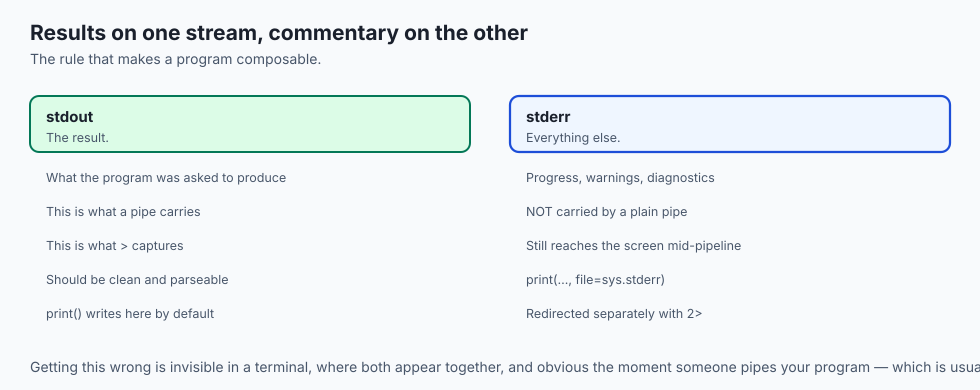
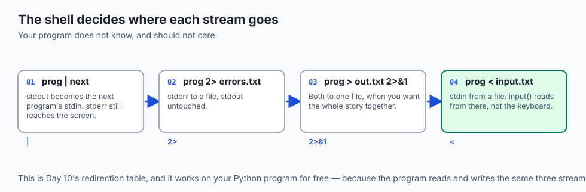
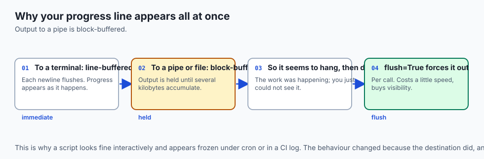
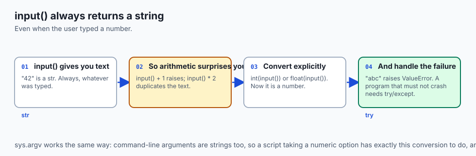
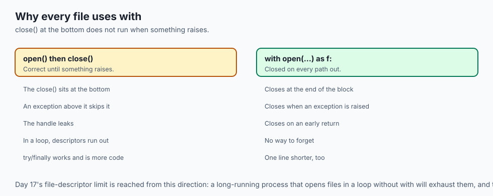
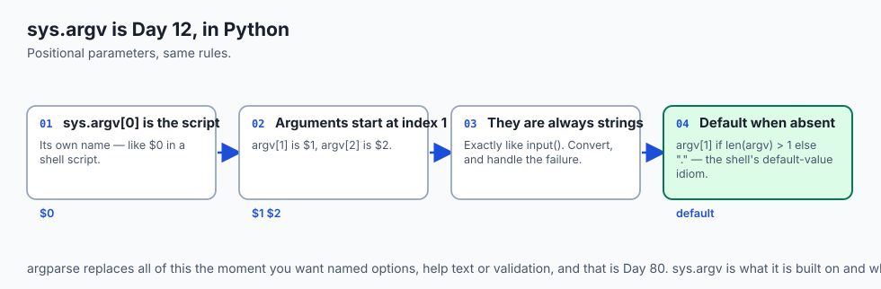
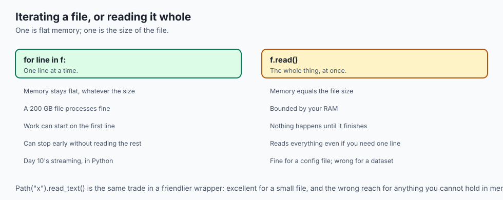
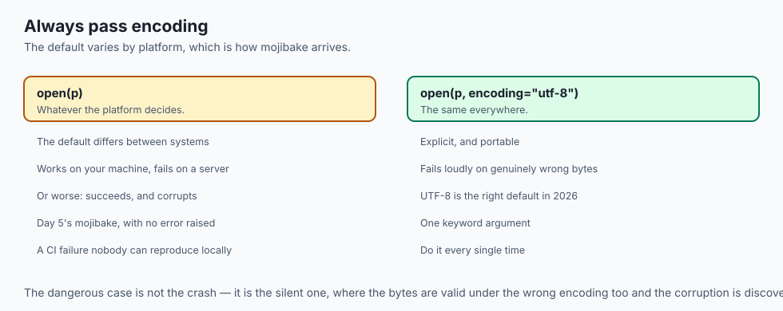
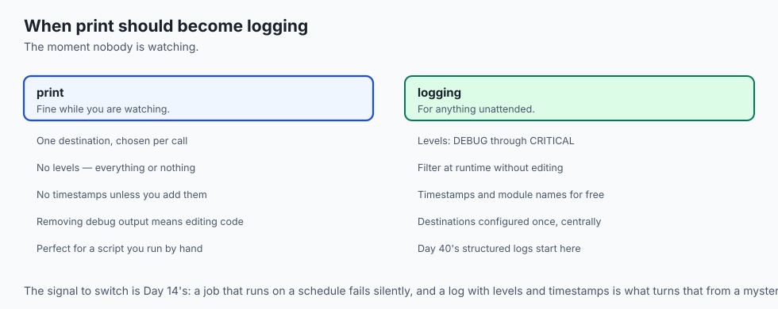

## Why this matters

- **Every program talks to the outside world** through these three streams, and
  Day 10's pipes depend on your using them correctly.

- **`input()` always returns a string**, and forgetting that is the most common
  first bug in Python.

- **f-strings format every number you will ever print** — a loss, a percentage, an
  elapsed time.

- **Writing progress to `stdout` corrupts a pipeline.** Progress belongs on
  `stderr`, and that separation is Day 10's, in Python.

- **`with open(...)` is how every dataset is read**, and the context manager is
  what closes the file when a run fails halfway.

---

## The idea in plain language



- **Three streams, from Day 6**: standard input, standard output, standard error.
- **`print()` writes to `stdout`**; `input()` reads from `stdin`.
- **Data goes to `stdout`; commentary goes to `stderr`.** That is the whole rule.
- **`input()` returns text, always.** Converting it is your job, and so is
  handling the conversion failing.

- **`with` guarantees the file closes**, whatever happens inside the block.

---

## Historical background

- **The three streams predate Python by decades** — they are Unix's, from the
  1970s, and Day 10 is where you met them.

- **Python inherited them unchanged**, which is why a Python program drops into a
  shell pipeline without adaptation.

- **`print` was a statement in Python 2** and became a function in Python 3, which
  was one of the most visible breaking changes of that migration.

- **Making it a function was right**: it can be passed around, its arguments can
  be keyword-controlled, and `sep`, `end`, `file` and `flush` become ordinary
  parameters rather than special syntax.

- **The `with` statement arrived in Python 2.5**, in 2006, to make cleanup
  automatic rather than remembered.

- **f-strings came in 3.6** and are now the only formatting syntax worth writing.

---

## What it is — and what it is not

**These streams are:**

- File-like objects your program is handed at startup, from Day 6.
- Redirectable by the shell, without the program knowing.
- The interface that makes a program composable.

**They are not:**

- **Not the terminal.** They may be a file, a pipe, or another program, and your
  code cannot assume.

- **Not interchangeable.** `stdout` carries the result; `stderr` carries
  everything else.

- **Not line-buffered when piped.** Output to a pipe is block-buffered, which is
  why long-running programs need `flush=True` to show progress.

- **Not typed.** Everything crossing them is text or bytes, so `input()` cannot
  give you a number.

---

## Why it was created and what problems it solves

- **Composition.** A program that reads `stdin` and writes `stdout` joins any
  pipeline, as Day 10 showed.

- **Separating results from commentary**, so errors do not contaminate data.
- **Redirection without cooperation.** The shell rewires the streams and the
  program is none the wiser.

- **Guaranteed cleanup.** `with` closes a file on the way out, including when an
  exception is raised — which a `close()` at the bottom of a function does not.

- **Readable formatting.** f-strings put the value where it appears rather than in
  a separate argument list.

---

## How it works

### The three streams




- **`print()` writes to `stdout`** by default.
- **`print(..., file=sys.stderr)` writes to `stderr`.**
- **`input()` reads a line from `stdin`**, stripped of its newline.
- **The shell decides where each one goes**, per Day 10's redirection table.

### print() in depth



```python
print("a", "b", sep="-", end="")   # a-b, with no newline
print("progress", file=sys.stderr, flush=True)
```

- **`sep`** goes between the arguments; the default is a single space.
- **`end`** goes after them; the default is a newline.
- **`file`** chooses the stream.
- **`flush=True`** forces the write out immediately. Without it, output to a pipe
  is block-buffered and appears in chunks — which is why a progress line seems to
  hang and then dump.

### input(), and the trap



```python
age = input("Age: ")        # always a str, even for "42"
age = int(input("Age: "))   # raises ValueError on "abc"
```

- **It always returns a string.** `input() + 1` raises; `input() * 2` duplicates
  the text rather than doubling a number.

- **Converting can fail**, so a program that must not crash needs `try`/`except`
  around it.

- **The prompt goes to `stdout`**, which means it is captured when you pipe the
  program — one reason interactive prompts and pipelines mix badly.

- **In a script that runs unattended, do not use `input()` at all.** Take an
  argument instead.

### f-strings for output


```python
f"{loss:.4f}"        # 0.0317
f"{acc:.1%}"         # 91.4%
f"{n:,}"             # 1,234,567
f"{name:>12}"        # right-aligned in twelve columns
f"{value=}"          # value=0.0317   — prints the expression too
```

- **The `=` form is the debugging one**, and it saves writing the label by hand.
- **Width does not truncate.** A longer value overflows its column rather than
  being cut.

### Files, and why `with`



```python
with open("data.csv", encoding="utf-8") as f:
    for line in f:
        ...
```

- **`with` closes the file on the way out**, including when an exception is
  raised inside the block.

- **Iterating a file yields lines**, one at a time, without loading the whole
  thing — which is Day 10's streaming, in Python.

- **Always pass `encoding`.** The default varies by platform, and Day 5's
  mojibake follows from leaving it to chance.

- **Text mode gives `str`; binary mode (`"rb"`) gives `bytes`.**

### Command-line arguments



```python
import sys
target = sys.argv[1] if len(sys.argv) > 1 else "."
```

- **`sys.argv[0]` is the script's own name**; the arguments start at index 1.
- **They are always strings**, exactly like `input()`.
- **This is Day 12's positional parameters**, in Python.
- **`argparse` is the real answer** for anything with options, and it is Day 80.

---

## An everyday analogy

A machine on a factory line.

| The line | The program |
| --- | --- |
| The input hopper | `stdin` |
| The output chute | `stdout` |
| The reject chute | `stderr` |
| The settings dial | Command-line arguments |
| Asking an operator a question | `input()` |
| The machine not caring what comes next | Redirection |
| Closing the hatch when you leave | `with` |

- **The machine does not know what feeds it or what it feeds.** That is what lets
  it be dropped into any line.

- **The reject chute is separate on purpose.** Mixing rejects into the output is
  how a whole batch gets contaminated.

- **Asking an operator a question** stops the line working unattended.

---

## Examples in practice



- **`TypeError: can only concatenate str`** after `input()`, which is the trap in
  its most common form.

- **A progress bar that appears all at once at the end**, because the output was
  block-buffered into a pipe.

- **A script whose progress messages end up in the data file**, because they went
  to `stdout`.

- **A file left open after an exception**, in code that called `close()` at the
  bottom of the function.

- **Mojibake reading a CSV**, because `encoding` was left to the platform default.

---

## Implications: security, privacy, performance, scalability, and cost



- **Security: never `eval()` what `input()` returned.** It is untrusted text, and
  evaluating it runs whatever was typed.

- **Do not build a shell command from an argument by concatenation** — Day 45's
  injection rule, arriving through a different door.

- **Privacy: prompting for a password with `input()` echoes it.** `getpass` exists
  precisely for that.

- **Performance: `print` in a tight loop is slow**, because each call may flush.
  Build a list and write once, or write to a buffered stream.

- **Iterating a file is streaming**; `f.read()` loads the whole thing. On a large
  file that is the difference between flat memory and none.

- **Cost: an unclosed file handle leaks.** A long-running process that opens files
  in a loop without `with` will eventually exhaust its descriptors — Day 17's
  limit, reached from a different direction.

---

## Alternatives: free, open source, and commercial



| Tool | Type | Where it fits |
| --- | --- | --- |
| `print` / `input` | Free, built in | Everything simple |
| `sys.stdout.write` | Free, built in | When you want no automatic newline at all |
| `argparse` | Free, standard library | Real command-line interfaces — Day 80 |
| `getpass` | Free, standard library | Reading a secret without echoing it |
| `pathlib` | Free, standard library | Paths, and `Path.read_text()` for small files |
| `logging` | Free, standard library | Anything long-running; levels and destinations |

- **Move from `print` to `logging` the moment a script runs unattended.** Day 40's
  argument: a job with no log is a job you cannot diagnose.

- **`pathlib` is the modern way to touch the filesystem**, and `Path("x").read_text()`
  is often all a small file needs.

---

## Comparison with related concepts

| Term | What it actually is |
| --- | --- |
| **`stdin`** | The stream a program reads from |
| **`stdout`** | Where its results go |
| **`stderr`** | Where its commentary goes |
| **Buffering** | Holding output until there is enough to write |
| **`flush`** | Forcing the buffer out now |
| **Context manager** | The object `with` sets up and tears down |
| **`sys.argv`** | The command line, as a list of strings |

---

## When to use it — and when not to

- **Write results to `stdout` and everything else to `stderr`.** Always.
- **Use `with` for every file**, without exception.
- **Pass `encoding="utf-8"` explicitly.**
- **Use `flush=True`** for progress that must appear as it happens.
- **Do not use `input()` in a script that runs unattended.** Take an argument.
- **Do not use `f.read()` on a file you cannot afford to hold in memory.**
- **Do not print in a tight loop** when you could accumulate and write once.

---

## The AI connection

- **Streaming a model's output is `print(..., flush=True)`** or writing to
  `stdout` directly — without the flush, tokens arrive in blocks rather than as
  they are generated.

- **`stdout` is for data and `stderr` is for progress.** A training script that
  logs progress to `stdout` corrupts anything piping its results.

- **Every training script takes command-line arguments**, and `sys.argv` is the
  raw form beneath every framework's argument parser.

- **`with open(...)` is how datasets are read**, and the context manager is what
  guarantees the handle closes when a run fails halfway.

- **f-strings format every metric you will print** — loss to four decimals,
  accuracy as a percentage, elapsed time with a thousands separator.

## Knowledge check

```yaml
quiz:
  question: "A script prints progress messages and its results, and works correctly when run in a terminal. Piped into another program, the downstream tool receives the progress lines mixed into its data. What is wrong?"
  options:
    - "The progress messages are written to stdout, which is the stream the pipe carries"
    - "The pipe merges stdout and stderr unless the program disables it"
    - "The script needs flush=True so the streams stay in order"
    - "print() cannot write to stderr, so progress must go to a file instead"
  answer_index: 0
  explanation: "A pipe carries stdout only, which is exactly why the separation exists. Progress written with a plain print() goes to stdout alongside the results; sending it to stderr with file=sys.stderr keeps it on screen and out of the data."
```

---

## Hands-on exercise

Separate the streams, then prove it with a pipe. Worked through fully in the Day
47 lab directory.

| What you are doing | Command |
| --- | --- |
| Write to both streams | `print("data")` and `print("note", file=sys.stderr)` |
| Prove the pipe carries one | `python3 s.py \| wc -l` |
| Send errors to a file | `python3 s.py 2> errors.txt` |
| See the input trap | `int(input())` with `abc` typed |
| Format numbers | `f"{0.03174:.4f}"`, `f"{0.914:.1%}"`, `f"{1234567:,}"` |
| Read a file safely | `with open(p, encoding="utf-8") as f:` |
| Take an argument | `sys.argv[1] if len(sys.argv) > 1 else "."` |

### Expected output

```text
data
note
1
ValueError: invalid literal for int() with base 10: 'abc'
0.0317   91.4%   1,234,567
```

- **`wc -l` counted 1**, not 2 — the note went to `stderr` and the pipe never saw
  it.

- **Both appeared on screen** when run directly, which is why the bug hides until
  the program is piped.

### Validate your work

- [ ] You wrote to both streams and proved a pipe carries only one
- [ ] You redirected `stderr` to a file separately
- [ ] You handled a failed `int(input())` without the program crashing
- [ ] You formatted a float, a percentage and a thousands-separated integer
- [ ] Every file you opened used `with` and an explicit `encoding`
- [ ] `bash tests/run_tests.sh` reports 0 failures

### Troubleshooting

- **Output appears only at the end.** Block buffering into a pipe. Add
  `flush=True`.

- **`input()` returns nothing under a pipe.** `stdin` is the pipe, not the
  keyboard. That is the point.

- **`UnicodeDecodeError` reading a file.** The encoding is not what you assumed.
  Day 5.

- **`IndexError` on `sys.argv[1]`.** No argument was given. Check `len` first.

### Common mistakes

- **Progress on `stdout`.**
- **Forgetting `input()` returns a string.**
- **`open()` without `with`.**
- **Leaving `encoding` to the platform default.**

---

## Practice assignment

- **Write a filter**: read `stdin`, transform each line, write `stdout`, report
  counts on `stderr`. Then use it in a pipeline with `grep` and `sort`.

- **Convert an interactive script to an argument-driven one**, and run it under
  `cron` per Day 14.

- **Format the same number six ways** — decimals, percentage, separators,
  alignment, width, and the `=` debug form.

- **Open a file without `with`**, raise an exception inside, and confirm the
  handle leaked.

---

## Extension challenge

- **Measure buffering.** Time a loop printing 100,000 lines with and without
  `flush=True`, to a terminal and to a pipe, and explain all four numbers.

- **Write a context manager of your own** with `contextlib.contextmanager`, and
  prove its cleanup runs when the block raises.

- **Read a file larger than memory** line by line and compute a statistic, then
  try `f.read()` on it and watch what happens.

- **Handle a broken pipe.** Pipe a long-running script into `head` and catch the
  resulting error rather than letting it traceback.

---

