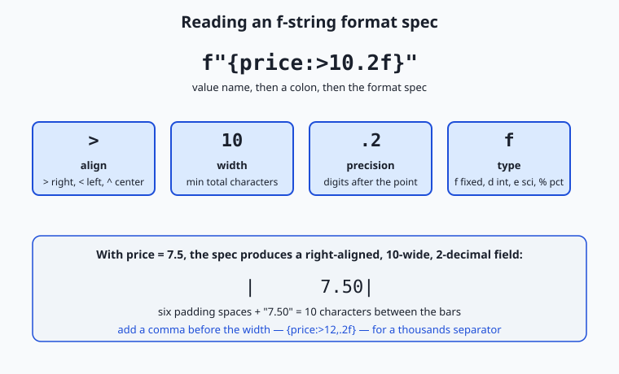

## Why this matters

A program that cannot talk to the outside world is a sealed box: it computes something and then keeps it forever. Everything you will build from here on — a script that summarizes a spreadsheet, a command-line tool that sends a prompt to a model and prints the reply, a data pipeline stitched together with the shell — earns its usefulness at exactly two seams: where information comes *in*, and where results go *out*. Today you learn to build both seams cleanly, and the difference between a tool people can use and a tool they abandon almost always lives right here.

The stakes are concrete. The single most common bug a new Python programmer hits is that `input()` hands you the text `"5"`, not the number `5`, so `input() + input()` glues two strings into `"57"` instead of adding to `12` — a bug that has cost countless beginners an afternoon. Get output wrong and a column of numbers becomes an unreadable ragged mess; get it right with one format specifier and the same numbers snap into a neat aligned table a human can scan in a second. And the moment your program is one stage in a shell pipeline (Day 10), the discipline of writing *data* to standard output and *errors* to standard error is the difference between a tool that composes with every other Unix program and one that silently poisons whatever it feeds.

This is also the layer where the tools that call AI models live. A command-line assistant reads your question from input, sends it off, and streams the model's answer back to your terminal token by token — and that streaming only looks smooth because the program forces each piece of text out immediately instead of letting it pile up in a buffer. Clean input handling, aligned output, and correctly separated error messages are not cosmetic; they are what make a tool trustworthy enough to put in a pipeline and run unattended. Today you learn the whole input/output surface of Python, and by the end you will have written a small command-line program that reads either an argument or a pipe, converts its input safely, and prints a formatted, aligned result.

## The idea in plain language

Every running program sits behind a service window with three channels. Through one channel, requests come *in*: a person typing at a keyboard, or a file being poured in by the shell. Through a second channel, finished results go *out*: onto the screen, or onto a conveyor belt feeding the next program. A third channel is reserved for problems — a separate slip that says "something went wrong" — kept deliberately apart from the finished work so a complaint never gets mixed in with the food going out the window.

In Python those three channels have names. **Standard input** (`stdin`) is where `input()` reads from. **Standard output** (`stdout`) is where `print()` writes by default. **Standard error** (`stderr`) is a second output channel for messages *about* the program — errors, warnings, progress notes — so they stay out of the real results. This separation is not Python's invention; it is a Unix convention every well-behaved command-line program follows, and honoring it is what lets your program slot into a pipeline.

Between reading and writing sits *formatting*: turning values into exactly the text you want a human to read. Python's tool for this is the **f-string** — a string prefixed with `f` in which anything inside curly braces is evaluated and dropped into the text. You met f-strings on Day 45 for simple interpolation; today you learn their *format specification*, the little mini-language after a colon (`{value:>10.2f}`) that controls alignment, width, decimal places, thousands separators, and more. Reading in, formatting, writing out: that is the whole shape of the day.

## Historical background

The three standard streams are older than Python by decades. They come from Unix, created at Bell Labs in the early 1970s by Ken Thompson and Dennis Ritchie. A guiding idea of Unix, articulated by Doug McIlroy — who invented the pipe in 1973 — was that programs should be small, do one thing well, and connect through a universal interface: text flowing from the output of one program into the input of the next. For that to work, every program needed a standard place to read from and a standard place to write to. The convention that settled in gives each program three streams open from the start, numbered 0 for input, 1 for output, and 2 for errors — the file descriptors you still see today when you type `2>` in a shell to redirect error messages.

Python's output side has its own smaller history. In Python 2, `print` was a statement with idiosyncratic syntax; Python 3, released in December 2008, turned it into an ordinary function, `print()`, which is why it takes keyword arguments like `sep` and `end`. Formatting evolved in parallel. The oldest style used the `%` operator borrowed from C's `printf`; Python 2.6 (2008) added `str.format()` with its `{}` placeholders and the format specification mini-language that is still in force. Finally, formatted string literals — f-strings — arrived in Python 3.6, released in December 2016, proposed in PEP 498 by Eric V. Smith. They kept the same format mini-language but let you write the expression right where it belongs, inside the braces, which is why they have become the default way Python programmers format text.

## What it is — and what it is not

Input and output in Python are a small set of ordinary tools, not a framework. `input()` is a built-in function that reads one line of text from standard input and returns it as a `str`, with the trailing newline stripped. `print()` is a built-in function that writes its arguments to a stream — standard output by default — converting each to text and adding a newline at the end. An f-string is a string literal that Python evaluates when it runs, substituting the value of each braced expression. `open()` is a built-in that gives you a file object you can read from or write to. None of these needs an import; they are all part of the language you already have.

It is worth being clear about what these tools are *not*. `input()` is not a way to read a number — it always returns text, and turning that text into a number is a separate, explicit step you must take. `print()` is not the right tool for a program's *diagnostic* messages once a program grows up; that job belongs to the `logging` module you met on Day 40, and we will draw the line carefully below. An f-string is not a template that gets filled in later — it is evaluated immediately, in place, using the variables in scope at that moment, so it cannot be stored as a reusable pattern the way a real template can. And standard error is not "a place for less important messages"; it is specifically the channel for text that is *about* the run rather than *part of* the result, which is a distinction of kind, not of importance.

## Why it was created and what problems it solves

Standard streams solve the problem of composition. Before a universal text interface, connecting two programs meant one knowing the intimate details of the other. With three standard streams, any program that reads stdin and writes stdout can be chained to any other, without either knowing the other exists — the shell wires them together with a pipe. The separate error stream solves a subtler problem that follows immediately: if a program wrote its complaints to the same channel as its results, those complaints would flow down the pipe and corrupt the data the next program tries to parse. Splitting errors onto stream 2 keeps the data channel clean, so `cat data.txt | python3 tool.py | sort` works even when `tool.py` needs to warn you about a bad row.

f-strings solve a different, humbler problem: making values readable. Raw conversion of a number to text gives you `7.5` or `0.1256` or `1234567.891` — technically correct, visually hostile. A person reading a receipt wants `$7.50`, a percentage wants `12.6%`, and a large count wants `1,234,568`. Doing that by hand — rounding, padding, inserting commas, aligning columns — is fiddly and error-prone. The format mini-language packs all of it into a few characters after a colon, so the intent ("right-aligned, ten wide, two decimals") lives in one readable place instead of scattered across string surgery. And `input()` and `open()` exist because a program that only ever works on values baked into its own source code is a program that solves exactly one problem forever; reading from the keyboard, a pipe, or a file is what lets one program solve a whole family of problems.

## How it works

Let's build up the toolkit one piece at a time, then combine them.

### print() in depth

`print()` does more than dump text. Its full signature is `print(*objects, sep=' ', end='\n', file=sys.stdout, flush=False)`, and each keyword argument is a lever worth knowing:

```python
print("a", "b", "c")               # a b c        (sep defaults to one space)
print("a", "b", "c", sep="")       # abc          (no separator)
print("2026", "07", "12", sep="-") # 2026-07-12   (join with dashes)
print("loading", end="")           # no newline; the next print continues the line
print("...done")                   # loading...done
```

`sep` is the text placed *between* arguments; `end` is the text placed *after* the last one, and it defaults to a newline `\n`, which is why each `print()` normally starts a fresh line. Setting `end=""` suppresses that newline — useful for building a line piece by piece, or for a progress dots animation.

`file` chooses the destination stream. By default it is `sys.stdout`; pass `file=sys.stderr` to send a message to the error channel instead:

```python
import sys
print("Result: 42")                       # goes to stdout — the data
print("Warning: using defaults", file=sys.stderr)  # goes to stderr — a note
```

`flush` controls *timing*. For efficiency, Python collects output in a buffer and writes it out in chunks; normally you never notice. But when you want each piece to appear the instant it is produced — a live progress bar, or text streaming in from elsewhere — pass `flush=True` to force the buffer out immediately. This is exactly what makes streamed model output appear smoothly character by character rather than in a sudden block at the end.

| `print()` argument | Default | What it controls | Example |
| --- | --- | --- | --- |
| `*objects` | — | The values to print; each is converted to text | `print(1, "two", 3.0)` |
| `sep` | `' '` (space) | Text inserted *between* the values | `print("a", "b", sep=", ")` → `a, b` |
| `end` | `'\n'` (newline) | Text added *after* the last value | `print("x", end="")` keeps the cursor on the line |
| `file` | `sys.stdout` | Which stream to write to | `print("oops", file=sys.stderr)` |
| `flush` | `False` | Force the buffer out immediately | `print(".", end="", flush=True)` |

### input() — and the trap that returns a string

`input()` reads one line from standard input and returns it as a string, without the newline. If you pass it an argument, that argument is printed first as a **prompt**:

```python
name = input("What is your name? ")   # prints the prompt, waits, returns what you typed
print("Hello,", name)
```

Here is the trap that catches nearly everyone. **`input()` always returns a `str`, even when the user types digits.** So this looks right and is wrong:

```python
a = input("First number: ")   # you type 5 → a is the string "5"
b = input("Second number: ")  # you type 7 → b is the string "7"
print(a + b)                  # prints 57, not 12 — string "+" glues, it doesn't add
```

To do arithmetic you must *convert* the text to a number, explicitly, with `int()` or `float()` (Day 46):

```python
a = int(input("First number: "))    # "5" → 5
b = int(input("Second number: "))   # "7" → 7
print(a + b)                        # 12 — now it adds
```

Conversion can fail: if the user types `hello`, `int("hello")` raises `ValueError`. A robust program checks for that rather than crashing — we will handle it properly in the lab. The key mental model: `input()` gives you *text*, and text becomes a number only when you say so.

### f-strings for output in depth

You met f-strings on Day 45 for simple substitution: `f"Hello, {name}"`. The power for *output* is in the format specification after a colon. The general shape is `{value:[fill][align][sign][#][0][width][,][.precision][type]}`, and while that looks dense, you rarely use all of it at once. The diagram below breaks a common spec into its parts.



Start with **alignment and width**. A width is a minimum number of characters; if the value is shorter, it is padded. The alignment character says which side gets the padding: `>` right, `<` left, `^` center.

```python
f"|{'cat':<8}|"   # '|cat     |'   left-aligned in 8
f"|{'cat':>8}|"   # '|     cat|'   right-aligned in 8
f"|{'cat':^8}|"   # '|  cat   |'   centered in 8
f"|{42:>8}|"      # '|      42|'   numbers right-align by default
```

Right-aligning numbers to a fixed width is how you get columns whose decimal points line up. Add **precision** for floats with `.n`, and a **type** letter to say how to render the value:

```python
f"{7.5:.2f}"       # '7.50'         fixed-point, 2 decimals
f"{7.5:>10.2f}"    # '      7.50'   right-aligned, width 10, 2 decimals
f"{1234567.891:,.2f}"  # '1,234,567.89'   comma thousands separator
f"{0.1256:.1%}"    # '12.6%'        percent: multiplies by 100, adds %
f"{255:08b}"       # '11111111'     binary, zero-padded to width 8
f"{255:#x}"        # '0xff'         hexadecimal with 0x prefix
f"{42:+}"          # '+42'          always show the sign
```

The braces can hold any **expression**, not just a bare name, and a handy debugging shortcut is `=`, which prints both the expression and its value:

```python
qty, price = 3, 2.5
f"{qty * price:.2f}"    # '7.50'    — arithmetic inside the braces
f"{qty=}"               # 'qty=3'   — the = self-documenting form
```

f-strings also format **dates** through the same colon mechanism, delegating to the object's own formatting rules:

```python
from datetime import date
f"{date(2026, 7, 12):%Y-%m-%d}"   # '2026-07-12'
f"{date(2026, 7, 12):%B %d, %Y}"  # 'July 12, 2026'
```

| Format field | Meaning | Example spec | Result for the value shown |
| --- | --- | --- | --- |
| `<` `>` `^` | Align left / right / center within the width | `f"{'hi':>6}"` | `'    hi'` |
| *number* | Minimum field width | `f"{42:5}"` | `'   42'` |
| `.n` | Precision: decimals for floats, max chars for strings | `f"{3.14159:.2f}"` | `'3.14'` |
| `,` | Thousands separator | `f"{1000000:,}"` | `'1,000,000'` |
| `0` | Pad numbers with leading zeros | `f"{7:03}"` | `'007'` |
| `+` | Always show the sign | `f"{5:+}"` | `'+5'` |
| `f` `e` `%` `d` `b` `x` | Type: fixed / scientific / percent / integer / binary / hex | `f"{0.5:.0%}"` | `'50%'` |

### Reading and writing the streams directly

`input()` and `print()` are friendly wrappers, but underneath, the streams are objects in the `sys` module that you can use directly — which matters the moment your program lives in a pipeline. `sys.stdin` is a file-like object you can loop over line by line, and reading all of it is how a program consumes piped input:

```python
import sys
data = sys.stdin.read()          # read everything piped in, as one string
for line in sys.stdin:           # or process it one line at a time
    print(line.strip().upper())
```

Writing works the same way, and the crucial discipline is *which stream gets what*: results to `sys.stdout` (or plain `print()`), diagnostics to `sys.stderr`. The architecture diagram shows the whole picture — and why the split matters inside a pipeline.



Because stderr is a separate channel, `cat data.txt | python3 tool.py | sort` sends only `tool.py`'s real output down the pipe to `sort`, while any error messages appear on your terminal without ever entering the data stream. Exiting with a non-zero code (`sys.exit(1)`) on failure completes the contract: the shell, and any script calling yours, can tell success from failure.

### A first look at files with open() and with

Files are the fourth place data comes from and goes to, and the full treatment is a later lesson — but the basic shape belongs here. You open a file with `open(path, mode)`, where mode is `"r"` to read, `"w"` to write (truncating), or `"a"` to append. The catch is that an open file is a resource that must be closed, and the clean way to guarantee that is the `with` statement — a **context manager** that closes the file automatically when the block ends, even if an error is raised inside it:

```python
with open("greeting.txt", "w") as f:   # opens the file; f is the file object
    f.write("Hello, file!\n")          # write returns; nothing lost
# here the file is guaranteed closed, error or not

with open("greeting.txt", "r") as f:
    contents = f.read()                # read the whole file into a string
print(contents)
```

The `with` block is the same pattern you will meet again for network connections and locks: acquire a resource, use it, release it reliably. For now, remember that `with open(...)` is the correct, safe way to touch a file, and that writing to a file is `print("text", file=f)` or `f.write("text")` — the very same output tools, aimed at a file instead of a stream.

### Command-line arguments with sys.argv

There is one more way input reaches a program: the words you type after its name on the command line. Python collects them in `sys.argv`, a list of strings. `sys.argv[0]` is the script's own name; the actual arguments start at index 1:

```python
import sys
# run as:  python3 greet.py Ada 30
print(sys.argv)          # ['greet.py', 'Ada', '30']
name = sys.argv[1]       # 'Ada'
age = int(sys.argv[2])   # 30  — again, convert; argv items are strings too
```

Like `input()`, `sys.argv` gives you *strings*, so numbers still need converting. Reading `sys.argv` by hand is perfect for one or two arguments. Once a tool grows options, flags, and help text, you graduate to the `argparse` module from the standard library, which parses `--flags`, generates a `--help` message, and reports bad usage for you — we preview it here and use it in full in a later lesson. Today's rule of thumb: a positional argument or two, read `sys.argv`; anything with flags, reach for `argparse`.

## An everyday analogy

Picture a busy diner with a single service window, and station yourself at it. Orders arrive at the window — that is **standard input**. Most of the time a customer stands there and speaks an order (you typing at the keyboard), but on a rush day the window opens onto a conveyor belt and orders slide in from the prep station upstream (a pipe feeding your program). Either way, one order arrives as a line of text, and — this is the trap — every order arrives *as words*, never as a quantity you can act on directly. "Table five wants three coffees" is a sentence; before you can ring it up you must read the "three" and turn it into the number 3. That translation step, from spoken words to a usable number, is exactly `int(input(...))`. Skip it and you try to add the sentence "3" to the sentence "7" and get the nonsense "37".

Finished plates go out the same window onto the pass — that is **standard output** — and a good line cook plates carefully: portions aligned, garnish square, the check printed with prices in a neat right-aligned column so the total is easy to read. That plating discipline is the f-string format spec; `{price:>8.2f}` is you lining up the decimal points so a human can scan the check in a glance. The conveyor belt runs *both* ways: your finished plates can slide onward to the next station downstream, which is what happens when your program's output pipes into another program.

And when something is wrong with an order — an item is out of stock, a request makes no sense — you do *not* put a complaint on a plate and send it down the belt to the next station, because they would try to serve it. You clip the complaint to a separate red rail that goes straight to the manager. That red rail is **standard error**: problems travel on their own channel, kept out of the food, so the line downstream only ever handles real plates. Keep this window in mind and every choice in the lesson — convert the words, plate the numbers neatly, send complaints down the red rail — becomes obvious.

## Examples in practice

Here is a complete small program that ties the pieces together — a receipt formatter that reads a quantity and a unit price and prints an aligned receipt:

```python
import sys

def make_receipt(qty: int, unit_price: float) -> str:
    subtotal = qty * unit_price
    tax = subtotal * 0.08
    total = subtotal + tax
    lines = [
        f"{'Item':<12}{'Qty':>5}{'Price':>10}",
        f"{'Widget':<12}{qty:>5}{unit_price:>10.2f}",
        "-" * 27,
        f"{'Subtotal':<17}{subtotal:>10.2f}",
        f"{'Tax (8%)':<17}{tax:>10.2f}",
        f"{'Total':<17}{total:>10.2f}",
    ]
    return "\n".join(lines)

qty = int(sys.argv[1])
price = float(sys.argv[2])
print(make_receipt(qty, price))
```

Run as `python3 receipt.py 3 2.5`, it prints:

```text
Item          Qty     Price
Widget          3      2.50
---------------------------
Subtotal               7.50
Tax (8%)               0.60
Total                  8.10
```

Trace the formatting: `{'Item':<12}` reserves twelve left-aligned characters for the label, then `{'Qty':>5}` and `{'Price':>10}` right-align the next two headers so the number columns beneath them line up. On the data rows, `{unit_price:>10.2f}` forces two decimals and right-aligns to width ten, which is why `2.50`, `7.50`, `0.60`, and `8.10` stack with their decimal points aligned. Change the quantity or price and the columns stay straight, because the widths are fixed by the spec, not by the values.

Now the pipeline version, showing input from *either* an argument or standard input:

```python
import sys

raw = sys.argv[1] if len(sys.argv) > 1 else sys.stdin.read()
try:
    numbers = [float(x) for x in raw.split()]
except ValueError:
    print("error: all inputs must be numbers", file=sys.stderr)
    sys.exit(1)

count = len(numbers)
total = sum(numbers)
mean = total / count
print(f"count={count}  sum={total:.2f}  mean={mean:.2f}")
```

This reads numbers from a command-line argument if given, otherwise from whatever is piped in — so both `python3 stats.py "5 7 9"` and `echo "5 7 9" | python3 stats.py` work, printing `count=3  sum=21.00  mean=7.00`. Bad input (`echo "5 x" | python3 stats.py`) writes `error: all inputs must be numbers` to stderr and exits with code 1, so a shell script can detect the failure. This is the exact skeleton of the lab, and the exact shape of a well-behaved command-line tool.

## Implications: security, privacy, performance, scalability, and cost

**Security.** The first rule of input is *never trust it*. The most dangerous mistake a beginner can make with `input()` is to feed it to `eval()` — a function that executes text as Python code. `eval(input())` lets whoever provides the input run *any* code on your machine, from deleting files to opening a network connection. There is almost never a good reason to `eval()` input; to turn text into a number, use `int()` or `float()`, which parse a value and nothing more. This principle scales all the way up: every injection vulnerability in software is, at bottom, input that was treated as instructions instead of as data.

**Privacy.** Input and output are where sensitive data enters and leaves a program, so they are where leaks happen. Printing a value for debugging is the classic way a password or key ends up in a log file or a terminal that someone is screen-sharing. Standard error is captured by logging systems just as readily as standard output, so "I only printed it to stderr" is no protection. The habit to build now is to think, before every `print()`, about *who can see this channel* and whether the value belongs there.

**Performance.** Output buffering, the reason `flush` exists, is a performance feature: writing to a terminal or file in large chunks is far faster than one character at a time. For bulk output — writing thousands of lines to a file — let the buffer do its job and do *not* flush after every line, or you throw the speed away. Flush only when timeliness matters more than throughput, such as a live progress indicator or streamed text a human is watching. Building large output by joining a list of strings once (`"\n".join(lines)`) is also markedly faster than concatenating with `+` in a loop, because each `+` on immutable strings (Day 45) builds a brand-new string.

**Scalability.** The stream model is what lets a small program handle data far larger than memory. Reading `sys.stdin` line by line, processing each, and printing as you go means a script can filter a hundred-gigabyte file while using only a few kilobytes of memory — the data streams through. A program that instead reads the whole input into a list first is capped by RAM. Designing tools to read and write incrementally is how Unix pipelines scale to enormous data on modest machines.

**Cost.** Cleanly separated streams and honest exit codes are what make a tool *automatable*, and automation is what removes recurring human cost. A script whose errors go to stderr and which exits non-zero on failure can be dropped into a pipeline, a cron job, or a larger workflow and trusted to signal trouble instead of failing silently. A tool that prints errors into its own data stream, or always exits zero, forces a human to babysit every run — the most expensive way to operate anything.

## Alternatives: free, open source, and commercial

Everything today is in the Python standard library and free; the meaningful comparison is *which built-in tool to reach for*.

| Tool | When to choose it | How you use it | Cost |
| --- | --- | --- | --- |
| f-strings (built-in) | Almost all output formatting in modern Python | `f"{value:>10.2f}"` inline where the text is built | Free (Python 3.6+) |
| `str.format()` (built-in) | When the template is separate from the data, or you must support Python < 3.6 | `"{:>10.2f}".format(value)` | Free |
| `%` formatting (built-in) | Legacy code; some logging patterns still use it | `"%.2f" % value` | Free |
| `print()` (built-in) | A program's actual output — the results a user or pipe consumes | `print(result)` / `print(msg, file=sys.stderr)` | Free |
| `logging` (built-in, Day 40) | Diagnostic messages: debug/info/warning/error, with levels and timestamps | `logging.warning("retrying")` | Free |
| `sys.argv` (built-in) | One or two positional command-line arguments | `sys.argv[1]` | Free |
| `argparse` (built-in) | Any tool with flags, options, or `--help` | `parser.add_argument("--count")` | Free |
| `rich` (open source, third-party) | Colored, tabled, styled terminal output for polished CLIs | `from rich import print` and rich markup | Free / open source |

For a beginner the guidance is simple: format with f-strings, send results with `print()`, send diagnostics with `logging`, read one or two arguments with `sys.argv`, and graduate to `argparse` the moment you need a flag. `rich` is a delightful next step once your tools have earned an audience, but nothing today requires it.

## Comparison with related concepts

| Concept A | Concept B | Key difference |
| --- | --- | --- |
| `print()` | `logging` (Day 40) | `print()` emits the program's *results*; `logging` emits *diagnostics* with levels, timestamps, and configurable destinations. Use print for output a user or pipe wants; use logging for messages about the run. |
| standard output | standard error | Both are output streams, but stdout carries the *data* (and flows down a pipe) while stderr carries *messages about the run* (and stays on the terminal). Separation keeps pipelines clean. |
| `input()` | `sys.argv` | `input()` reads *interactively* while the program runs; `sys.argv` reads arguments given *before* it ran. Interactive prompts block for a human; argv works unattended and in scripts. |
| `input()` | reading `sys.stdin` | `input()` reads one line and prompts a human; reading `sys.stdin` consumes a whole stream, ideal for piped data with no prompt. A pipeline tool reads stdin, not `input()`. |
| f-string | `str.format()` | Same format mini-language, different placement: an f-string evaluates expressions *in place*; `str.format()` keeps the template separate from the values, which is better when the template is reused or comes from elsewhere. |
| `int()` conversion | `eval()` | `int("5")` safely parses a number; `eval("5")` executes text as code and must never touch untrusted input. |

## When to use it — and when not to

Reach for `input()` when a human is genuinely sitting at the keyboard and the program is a small interactive script or a teaching exercise. Reach for `sys.argv` (or `argparse`) instead whenever the program should run unattended, be scriptable, or take its parameters up front — which is most real tools. Reach for reading `sys.stdin` directly when your program is a *filter* meant to sit in a pipeline, transforming a stream someone else produces. These three ways of getting input are not interchangeable: an interactive `input()` prompt will *hang forever* in an automated pipeline waiting for a human who is not there, which is a common and baffling failure until you know to look for it.

For output, use `print()` for the results your program exists to produce, format them with f-strings so a human can read them, and send anything that is a message *about* the run to `stderr` (or to `logging` once the program is more than a script). Do *not* use `print()` as your debugging tool of record in anything you will keep — scattered `print()` calls are noise you must later hunt down and remove, whereas `logging` can be turned up or down with one setting. And avoid `eval()` on input entirely; if you find yourself reaching for it to "just parse this," reach for `int()`, `float()`, or a proper parser instead. The through-line is intent: choose the input tool that matches *who* provides the data, and the output tool that matches *what* the text is for.

## Knowledge check

Try these from memory before looking back:

1. A learner writes `total = input("a: ") + input("b: ")`, types `5` then `7`, and is baffled that `total` is `57`. Explain exactly what went wrong and write the corrected line.
2. Name the three standard streams, their file-descriptor numbers, and what belongs on each. Why must a pipeline tool keep errors off standard output?
3. Predict the exact output of `print(f"|{3.5:>8.2f}|")` and of `print(f"{1234567:,}")`, and explain each character of the first result.
4. You are writing a program meant to run as `cat log.txt | python3 count.py`. Should it read its input with `input()` or by reading `sys.stdin`? What goes wrong if you choose the other one?
5. Why is `eval(input())` dangerous, and what should you use instead to turn the text `"42"` into the number `42`?

## Hands-on exercise

Work through this in the Day 47 lab directory, where every file below already exists. You will build a small command-line tool, `io_demo.py`, that reads two numbers either from a command-line argument or from standard input, converts them safely, and prints a neatly formatted, aligned result — writing an error to standard error and exiting non-zero if the input is bad.

The lab ships a working reference in `examples/io_demo.py`, a starter with five numbered exercises in `starter/io_demo.py`, and a test script. First, run the reference both ways to see the two input paths:

```bash
cd labs/sections/programming-with-python/day-047-input-output-and-f-strings
python3 examples/io_demo.py 5 7
echo "5 7" | python3 examples/io_demo.py
```

Then open `starter/io_demo.py` and complete its five exercises — read an argument, convert it, format the output with alignment and precision, handle bad input, and write the error to stderr — before running the tests:

```bash
bash tests/run_tests.sh
```

### Expected output

Running the reference with a good pair of numbers prints an aligned two-column report (your spacing will match exactly, because the widths are fixed by the format specs):

```text
$ python3 examples/io_demo.py 5 7
Input values
  a            5.00
  b            7.00
Results
  sum         12.00
  product     35.00
  mean         6.00
```

Feeding bad input sends a message to standard error and sets a non-zero exit code:

```text
$ echo "5 hello" | python3 examples/io_demo.py
error: both inputs must be numbers (got '5 hello')
$ echo $?
1
```

### Validate your work

You are done when you can check every box:

- [ ] `python3 examples/io_demo.py 5 7` and `echo "5 7" | python3 examples/io_demo.py` produce the same aligned report.
- [ ] Your completed `starter/io_demo.py` produces the same output as the reference.
- [ ] The numbers are right-aligned with exactly two decimal places, in a fixed-width column.
- [ ] Bad input prints an error to **stderr** (not stdout) and the program exits with a non-zero code (`echo $?` shows `1`).
- [ ] `bash tests/run_tests.sh` prints a final line reporting zero failures and exits 0.

### Troubleshooting

- **The numbers concatenate instead of adding** (`57` instead of `12`). You forgot to convert: `input()` and `sys.argv` items are strings. Wrap them in `float(...)` before doing arithmetic.
- **The error message shows up in the pipe / gets captured as data.** You printed the error to stdout. Add `file=sys.stderr` to that `print()` call so it travels on the error channel.
- **The program hangs with no output.** You called `input()` in a context with no keyboard — likely an automated test or a pipeline with nothing piped in. Read `sys.stdin` (or a `sys.argv` argument) instead of `input()` for non-interactive use.
- **`echo $?` shows `0` after bad input.** You printed an error but did not exit non-zero. Call `sys.exit(1)` after reporting the error.
- **The columns are ragged.** Your format spec is missing a width, or you mixed widths between rows. Give every value in a column the same `{value:>WIDTH.2f}` spec.

### Common mistakes

- **Treating `input()` output as a number.** It is always a string; convert explicitly. This is the single most common Day-1-of-Python bug.
- **No error handling around conversion.** `float("hello")` raises `ValueError` and crashes the program with a traceback. Wrap conversion in `try/except` and report a clean message.
- **Using `eval()` to "parse" input.** It executes arbitrary code — a serious security hole. Use `int()`/`float()` to turn text into numbers.
- **Sending errors to stdout.** In a pipeline this corrupts the data stream. Diagnostics go to `sys.stderr`; results go to `sys.stdout`.

## Practice assignment

Open `starter/io-worksheet.md` in the lab and fill it in completely as you work. Record three things from your own runs: (1) what `type(input("x: "))` reports and what value you get when you type `5` — proving to yourself that `input()` returns a `str`; (2) the exact format spec you used to right-align your numbers to two decimals, and why each part of it is there; and (3) the exact text your finished `io_demo.py` prints for the input `8 3`, copied from your terminal. Then write two or three sentences explaining, in your own words, why the program writes its error message to standard error instead of standard output — tying it back to how a shell pipeline would treat each channel. Keep the worksheet; a later lesson on files and argparse builds on it.

## Extension challenge

Extend `io_demo.py` into a small filter that works on *many* pairs of numbers streamed through a pipe. Instead of reading a single pair, read standard input line by line, treat each line as one `a b` pair, and print one formatted result line per input line — so that `printf '5 7\n2 3\n10 4\n' | python3 io_demo.py` prints three aligned result rows. Add a thousands separator to the sum column with the `,` format field so a line like `1000000 2000000` prints its sum as `3,000,000.00`, and make the program skip a malformed line with a warning to stderr *without* aborting the whole run (so one bad line does not lose the good ones). Finally, write two sentences on why this streaming, line-by-line design lets your tool process a file far larger than your computer's memory — connecting it back to the scalability point in the lesson. You have just built a real Unix filter: a small program that does one thing well and composes with every other tool through the standard streams.
