## Why this matters

- **You will read far more errors than you write code**, and the skill is
  learnable rather than innate.
- **A traceback names the file, the line and the reason.** Most people read only
  the last line and miss two thirds of it.
- **The error is frequently not where it says.** A crash reports where a bad value
  was *used*, not where it was *made*.
- **A systematic method beats intuition**, especially when you are tired and it is
  late.
- **Every framework you use will produce tracebacks through its own code**, and
  finding your line in them is the practical skill.

---

## The idea in plain language

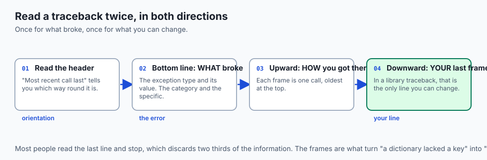

- **A traceback is a stack of frames**, printed oldest first and newest last.
- **Read it bottom to top**: the last line is the error, the lines above are how
  you got there.
- **Then read it top to bottom** to find the last line that is *yours*.
- **The exception type tells you the category**; the message tells you the
  specific value.
- **Debugging is a search**, and the method is to halve the space rather than to
  guess.

---

## Historical background

- **Early languages gave you a number.** A segmentation fault and an address, and
  the rest was yours to work out.
- **Structured exceptions arrived to carry context** — a type, a message, and the
  chain of calls that reached the failure.
- **Python's traceback prints the whole stack** rather than only the top, which is
  more information than most languages of its era offered.
- **Chained exceptions came in Python 3**: "During handling of the above
  exception, another occurred" preserves the original cause rather than losing it.
- **That chaining is why a traceback can be long.** Each section is a separate
  failure, and the first one is usually the real one.
- **The `raise ... from ...` form** lets you say deliberately which error caused
  which.

---

## What it is — and what it is not

**A traceback is:**

- The call stack at the moment the exception was raised, printed in full.
- Ordered oldest to newest, with the failing line last.
- A record of *where*, not necessarily of *why*.

**It is not:**

- **Not necessarily pointing at the bug.** It points at where the bad value was
  used.
- **Not only the last line.** The frames above are the context that makes the last
  line explicable.
- **Not always about your code.** Half the frames may be inside a library, and
  your job is to find the last frame that is yours.
- **Not a failure of the program in every case.** An exception can be caught and
  handled; a traceback means nothing caught it.

---

## Why it was created and what problems it solves

- **Locating a failure.** Without a stack, you know only that something broke.
- **Distinguishing categories.** A `KeyError` and a `TypeError` need entirely
  different investigations.
- **Preserving cause.** Chained exceptions keep the original failure when a second
  one happens during handling.
- **Making libraries debuggable.** You can see which of your calls entered the
  library, and with what.
- **Turning an error into a search.** A stack plus a value narrows the space from
  the whole program to a few lines.

---

## How it works

### Reading a traceback, bottom to top

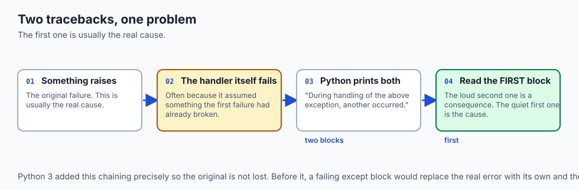


```text
Traceback (most recent call last):
  File "run.py", line 42, in <module>
    main()
  File "run.py", line 31, in main
    total = summarise(rows)
  File "report.py", line 18, in summarise
    return sum(r["amount"] for r in rows)
KeyError: 'amount'
```

- **The last line is the error**: type and value. `KeyError: 'amount'` means a
  dictionary was asked for a key it does not have.
- **The frame immediately above it is where it happened** — `report.py`, line 18.
- **The frames above that are how you got there**, oldest at the top.
- **"Most recent call last" is the header** telling you which way to read.
- **Now read downwards for the last line that is yours.** In a framework
  traceback, that line is the one you can actually change.

### The common exceptions

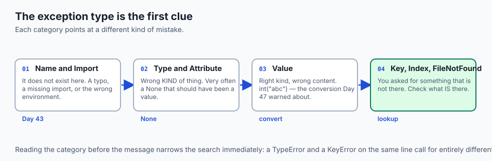

| Exception | What it really means |
| --- | --- |
| `NameError` | The name does not exist — usually a typo or an unimported module |
| `TypeError` | An operation on the wrong kind of thing — often a `None` where a value was expected |
| `ValueError` | The right type, the wrong value — `int("abc")` |
| `KeyError` | A dictionary key that is not there |
| `IndexError` | A sequence position that does not exist |
| `AttributeError` | `.something` on an object that has no such attribute — very often on `None` |
| `ImportError` | The module is not installed, or not on this path — Day 43 |
| `FileNotFoundError` | The path is wrong, or relative to the wrong directory |

- **`AttributeError: 'NoneType' object has no attribute ...`** is the most common
  Python error there is, and it always means the same thing: something returned
  `None` and you did not expect it.

### The systematic method

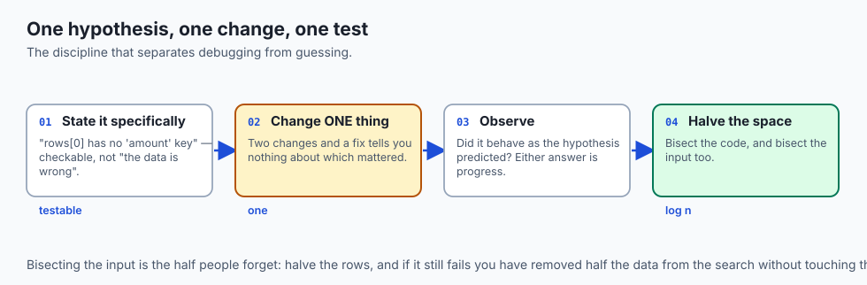


1. **Reproduce it reliably.** An intermittent bug is not yet a bug you can fix.
2. **Read the whole traceback**, not the last line.
3. **Find the last frame that is yours**, and look at the values there.
4. **Form one hypothesis** — a specific, checkable statement.
5. **Test that hypothesis**, changing one thing.
6. **Repeat, halving the space each time.**

- **Change one thing at a time.** Two changes and a fix tells you nothing about
  which mattered.
- **Bisect the input as well as the code.** Half the rows, and see whether it
  still fails.

### When the error is not where it says

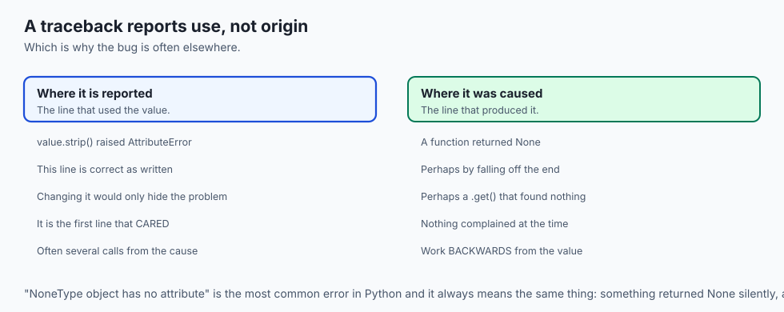

- **A crash reports where a bad value was used**, not where it was produced.
- **`None` is the classic case**: a function returned it silently, and the error
  appears three calls later.
- **Work backwards from the value**, not forwards from the line.
- **Rubber-duck debugging works** because explaining forces you to state the
  assumptions you have not checked.

---

## An everyday analogy

A delivery that arrived damaged.

| The delivery | The traceback |
| --- | --- |
| The damaged parcel | The exception |
| The last depot that handled it | The final frame |
| The full routing history | The frames above |
| "Crushed" versus "wet" | The exception type |
| Which depot actually damaged it | The real bug |
| Checking each handover | Bisecting |

- **The last depot reported the damage.** It is not necessarily where the damage
  happened.
- **The routing history is the useful part**, and most people read only the label
  on the front.
- **Working backwards from the damage** finds the depot; working forwards from the
  order does not.

---

## Examples in practice

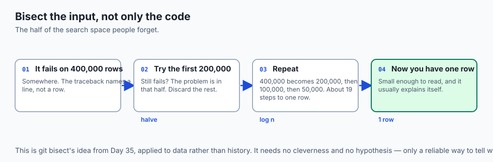

- **`AttributeError` on `None`** three functions away from the one that returned
  it.
- **`KeyError` on a column** that a rename upstream had already changed.
- **`FileNotFoundError` on a path that exists**, because the working directory was
  not what you assumed — Day 9.
- **`ImportError` for a package you just installed**, which is Day 43's
  environment mismatch.
- **A chained traceback** whose second failure is loud and whose first, quieter
  one is the actual cause.

---

## Implications: security, privacy, performance, scalability, and cost

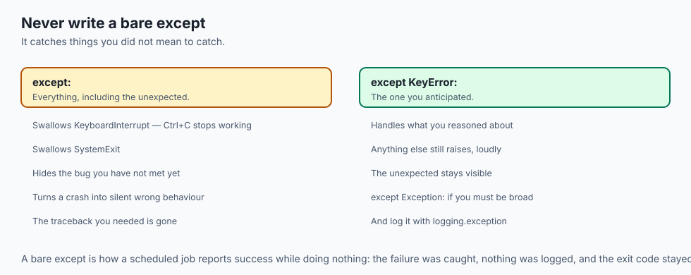

- **Security: never show a traceback to a user.** It reveals file paths, library
  versions and sometimes values — a map of your system.
- **Log the traceback, show an identifier**, so support can find it without the
  user seeing it.
- **Privacy: exception messages can contain data.** A `KeyError` prints the key; a
  `ValueError` may print the value. Both end up in logs.
- **Performance: exceptions are cheap to raise and expensive in a loop.** Using
  them for ordinary control flow over a million items is measurably slow.
- **A bare `except:` catches everything**, including the interrupt you press to
  stop the program. Catch specific exceptions.
- **Cost: an unhandled exception in a scheduled job is Day 14's silent failure**,
  unless something is logging and alerting.

---

## Alternatives: free, open source, and commercial

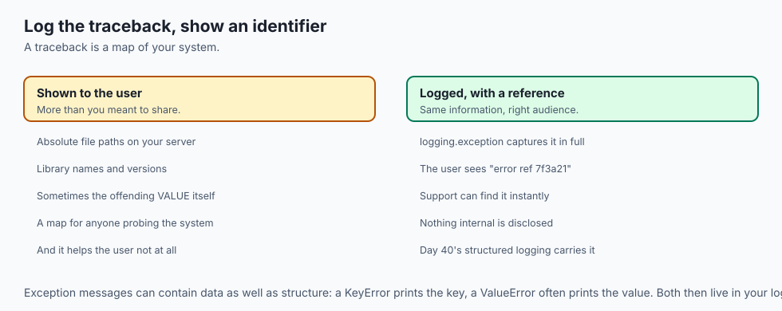

| Tool | Type | What it gives you |
| --- | --- | --- |
| `traceback` module | Free, standard library | Formatting and capturing tracebacks in code |
| `pdb` / `breakpoint()` | Free, built in | Stop and inspect — Day 37 |
| `logging.exception` | Free, standard library | The traceback, into your log, with context |
| `rich` / `better-exceptions` | Free, open source | Tracebacks with values shown inline |
| `pytest --pdb` | Free, open source | Drop into the debugger at the failing assertion |
| Sentry and similar | Commercial, free tier | Production tracebacks, grouped and searchable |

- **`breakpoint()` is built in since Python 3.7.** One word, and you are in the
  debugger at that line.
- **`logging.exception` inside an `except` block** records the whole traceback
  automatically, which is what you want in anything unattended.

---

## Comparison with related concepts

| Term | What it actually is |
| --- | --- |
| **Exception** | An object describing a failure |
| **Traceback** | The stack of frames at the moment it was raised |
| **Frame** | One function call, with its file and line |
| **Chained exception** | A second failure during the handling of a first |
| **`raise ... from ...`** | Stating the cause deliberately |
| **Bare `except:`** | Catching everything, including what you should not |

---

## When to use it — and when not to

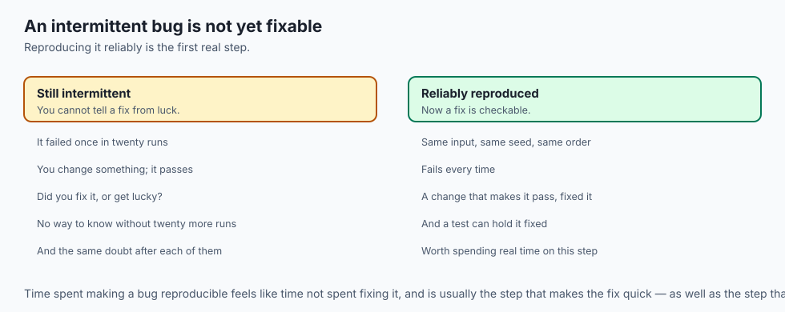

- **Read the whole traceback before changing anything.**
- **Find the last frame that is yours**, and start there.
- **Catch specific exceptions**, never bare `except:`.
- **Use `logging.exception` in anything that runs unattended.**
- **Do not show a traceback to a user.**
- **Do not use exceptions for ordinary control flow** in a hot loop.
- **Do not fix by guessing.** One hypothesis, one change, one test.

---

## The AI connection

- **A training run fails after twenty minutes**, and the traceback is the only
  record of why. Reading it well is the difference between one rerun and five.
- **Shape mismatches are the characteristic AI error**, and the traceback names
  the operation but rarely the reason. The bug is usually a transform several
  lines earlier.
- **`CUDA out of memory` is Day 7's OOM**, arriving from the GPU rather than the
  kernel — reduce the batch, or the model does not fit.
- **The error is often not where it says.** A `None` that reaches a layer was
  produced by a loader that quietly returned nothing.
- **Reproduce with one small batch on the CPU** before debugging anything on a
  GPU. The traceback is clearer and the loop is seconds rather than minutes.

## Knowledge check

```yaml
quiz:
  question: "A traceback ends with `AttributeError: 'NoneType' object has no attribute 'strip'` on a line that calls `value.strip()`. Where is the bug most likely to be?"
  options:
    - "Wherever value was produced, since something returned None and the failing line merely used it"
    - "On the failing line, which should call strip() on a different attribute"
    - "In the strip method, which does not handle a None receiver"
    - "In the frame at the top of the traceback, which is the oldest call"
  answer_index: 0
  explanation: "The traceback reports where the bad value was used, not where it was made. A function returned None — often by falling off the end without an explicit return — and the failure surfaces at the first line that treats it as a string, which may be several calls away."
```

---

## Hands-on exercise

Provoke each common exception, then debug one systematically. Worked through
fully in the Day 48 lab directory.

| What you are doing | Command |
| --- | --- |
| Read a full traceback | Run the lab's failing script |
| Provoke a `KeyError` | `{"a": 1}["b"]` |
| Provoke the `None` case | A function with no `return`, then `.strip()` on the result |
| Find your last frame | In a traceback that passes through a library |
| Stop and look | Add `breakpoint()` above the failing line |
| Log it properly | `logging.exception("failed")` inside `except` |
| Catch specifically | `except KeyError:` rather than bare `except:` |

### Expected output

```text
  File "report.py", line 18, in summarise
    return sum(r["amount"] for r in rows)
KeyError: 'amount'
> /project/report.py(18)summarise()
(Pdb) p rows[0].keys()
dict_keys(['id', 'total'])
```

- **The key is `total`, not `amount`** — renamed upstream, and the traceback could
  not have told you that.
- **One `p` in the debugger** answered what reading the code could not.

### Validate your work

- [ ] You read a traceback bottom to top and then found your last frame
- [ ] You can name what each of the eight common exceptions really means
- [ ] You debugged a `None` back to the function that produced it
- [ ] You used `breakpoint()` to inspect a value at the failure
- [ ] You replaced a bare `except:` with a specific one and can say why
- [ ] `bash tests/run_tests.sh` reports 0 failures

### Troubleshooting

- **The traceback is enormous.** Most of it is library frames. Search downward for
  your own filename.
- **Two tracebacks, one after the other.** A chained exception. The first is
  usually the real cause.
- **`breakpoint()` does nothing.** `PYTHONBREAKPOINT` is set to `0`, which
  disables it.
- **The error vanishes when you add a print.** Usually a timing or ordering issue,
  and worth taking seriously rather than leaving the print in.

### Common mistakes

- **Reading only the last line.**
- **Fixing the line the traceback names**, when the bug is upstream.
- **Bare `except:`.**
- **Changing two things at once.**

---

## Practice assignment

- **Collect one real example of each of the eight exceptions** and write down, for
  each, what the message told you and what it did not.
- **Debug a `None` bug backwards** to the function that produced it, without
  changing any code until you have found it.
- **Take a traceback through a library** and identify your last frame in under
  thirty seconds.
- **Convert three bare `except:` blocks** in code you have written into specific
  ones, and note what each was hiding.

---

## Extension challenge

- **Write a function that raises with `from`**, and compare the traceback with the
  same function raising without it.
- **Capture a traceback as a string** with the `traceback` module and log it,
  rather than letting it print.
- **Reproduce a bug by bisecting the input**: halve the dataset repeatedly until
  you have the smallest input that still fails.
- **Set `sys.excepthook`** to log unhandled exceptions before the program exits,
  and confirm a scheduled job now leaves a record rather than silence.

---

