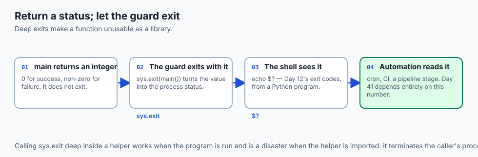
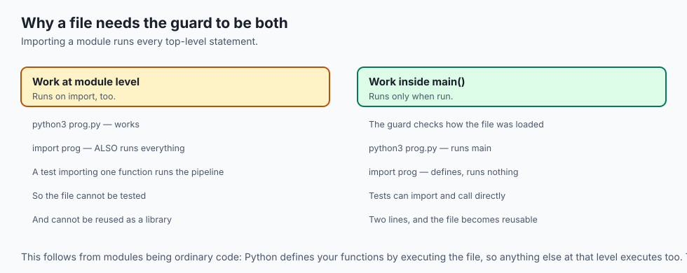
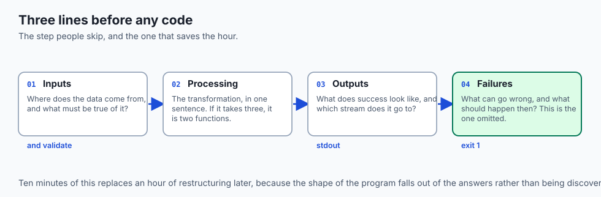
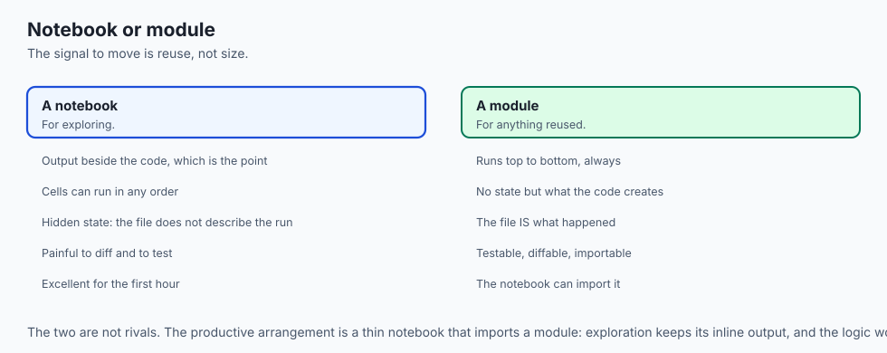
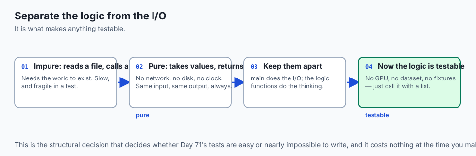
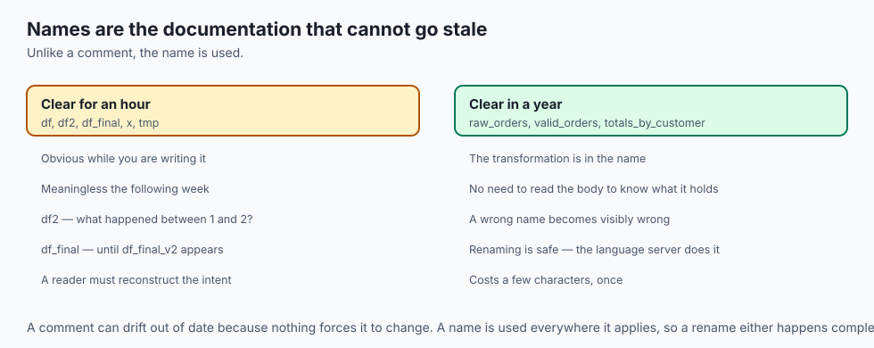
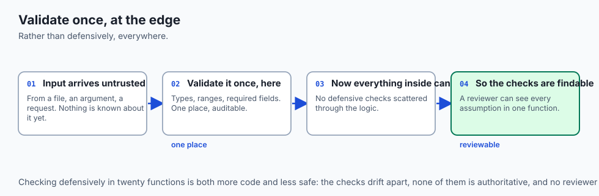
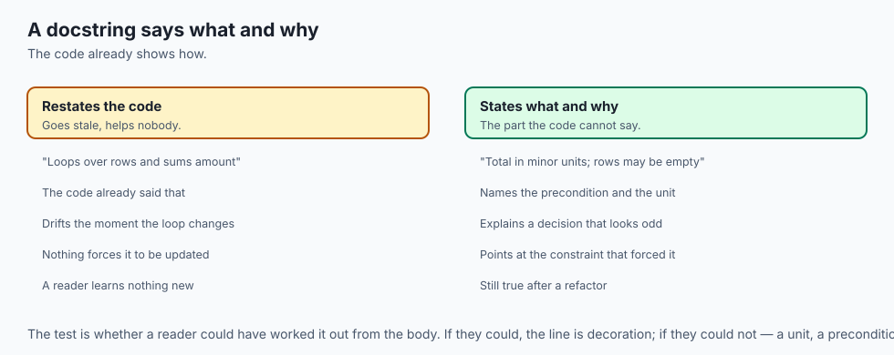
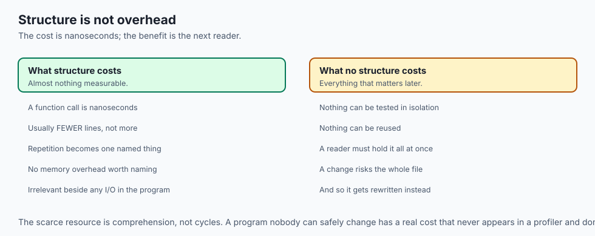

## Why this matters

- **This is where the week's pieces become a program** rather than a collection of
  snippets.

- **The shape you learn today is the shape of every script you will write** — for
  data, for training, for deployment.

- **The main guard is not decoration.** It is what makes a file both runnable and
  importable.

- **Readable code is a professional requirement**, because you will read it far
  more often than you wrote it.

- **A program that exits with a meaningful status** is a program automation can
  use, per Day 41.

---

## The idea in plain language

- **A program is not a pile of statements.** It has a shape: inputs, processing,
  outputs, and a way to fail.

- **Design before coding** — decide what goes in, what comes out, and what could go
  wrong.

- **Small named functions** are how a program stays readable and testable.
- **The main guard separates "run me" from "import me".**
- **Conventions are not taste.** PEP 8 exists so that every Python file looks
  familiar to every Python reader.

---

## Historical background

- **Structured programming was an argument, not an obvious truth.** Through the
  1960s, control flow jumped anywhere, and reading a program meant tracing it.

- **The case for functions and blocks** was that a reader could understand one
  piece without holding the whole in mind.

- **PEP 8, published in 2001**, applied the same reasoning to layout: consistency
  so that reading is automatic.

- **The main guard is Python-specific** and follows from modules being ordinary
  code — importing a file runs it, so anything that should not run on import goes
  inside the guard.

- **Notebooks arrived later** and reintroduced an old problem: cells run out of
  order, so the file no longer describes what happened.

- **The resolution is not to abandon notebooks** but to know which of the two you
  are in, and why.

---

## What it is — and what it is not

**A real program is:**

- Structured: inputs validated, work in named pieces, results reported.
- Importable, so its parts can be tested and reused.
- Explicit about failure, with a status a caller can read.

**It is not:**

- **Not longer.** Structure usually makes a program shorter, because repetition
  becomes a function.

- **Not a notebook.** A notebook has hidden state and no ordering guarantee.
- **Not finished when it works once.** It is finished when it fails clearly.
- **Not a matter of taste.** The conventions exist so a stranger can read it, and
  the stranger is usually you.

---

## Why it was created and what problems it solves

- **Comprehension.** A named function is a unit a reader can understand without
  the rest.

- **Testability.** Logic separated from side effects can be tested without a
  network, a file, or a GPU.

- **Reuse.** A file that is importable is a file another program can call.
- **Predictability.** Top-to-bottom execution means the file describes what
  happened, which a notebook does not.

- **Composability.** Arguments in, status out — the interface Day 41's automation
  expects.

---

## How it works

### The anatomy of a program




```python
'''One line saying what this does.'''
import sys


def parse_args(argv): ...
def process(rows): ...
def report(result): ...


def main(argv=None):
    args = parse_args(argv or sys.argv[1:])
    try:
        result = process(load(args.path))
    except FileNotFoundError as exc:
        print(f"error: {exc}", file=sys.stderr)
        return 1
    report(result)
    return 0


if __name__ == "__main__":
    sys.exit(main())
```

- **Imports at the top**, standard library first.
- **Small named functions**, each doing one thing.
- **`main` orchestrates** and returns a status rather than calling `exit` itself.
- **The guard runs it** only when the file is executed directly.

### The main-guard idiom, precisely



- **`__name__` is `"__main__"` when the file is run directly**, and the module's
  name when it is imported.

- **So the guard means "only when run, not when imported".**
- **Without it, importing the file runs everything** — which breaks tests, breaks
  reuse, and surprises anyone who imports one function from it.

- **`sys.exit(main())`** turns the return value into the process's exit status,
  which Day 41's pipeline reads.

### Designing before coding: inputs, processing, outputs



- **Write the inputs, outputs and failures down first**, in three lines, before
  any code.

- **Inputs**: where does the data come from, and what must be true of it?
- **Processing**: what is the transformation, in one sentence?
- **Outputs**: what does success look like, and where does it go?
- **Failures**: what can go wrong, and what should happen when it does?
- **Ten minutes here saves an hour of restructuring**, and it is the step people
  skip.


### Script, notebook, or package: three homes for code (A13)



| Home | When it is right | What it costs |
| --- | --- | --- |
| A notebook | Exploring, once, with output beside the code | Hidden state; painful to diff and test |
| A script | One task, run from a command line | Not importable as a library |
| A package | Reused, imported, versioned, distributed | Structure and packaging to maintain |

- **The signal to leave a notebook is reuse.** The moment you copy a cell, that
  code belongs in a file both places import.

- **The signal to become a package is a second consumer**, not size.

### Readability: names, small functions, and PEP 8



- **Names carry the meaning.** `rows`, `total_amount`, `is_valid` — not `x`, `d`,
  `tmp`.

- **A function should fit on a screen** and do one thing you can name.
- **PEP 8 is the shared convention**: four spaces, `snake_case`, imports at the
  top, two blank lines between top-level definitions.

- **Let a formatter do it**, per Day 37. The rules stop being something you think
  about.

- **A docstring says what and why**, not how — the code already shows how.

---

## An everyday analogy

A well-organised recipe, versus notes on the back of an envelope.

| Cooking | The program |
| --- | --- |
| The ingredients list | Inputs, validated up front |
| Numbered method steps | Named functions |
| "Serves four" at the top | The docstring |
| A sub-recipe referenced by name | A helper function |
| "If the sauce splits, do this" | Error handling |
| Notes scribbled out of order | A notebook |
| The published, tested version | A module |

- **Notes work for the person who wrote them, that evening.** They stop working a
  month later and they never worked for anyone else.

- **The numbered method is not more work.** It is the same content, arranged so it
  can be followed.

---

## Examples in practice



- **A script that runs its whole workload on import**, discovered when someone
  tries to import one function from it for a test.

- **A 300-line `main()`** that cannot be tested because every line touches the
  network.

- **A notebook that works top to bottom for its author** and not for anyone else,
  because cell 12 was run before cell 7.

- **A script that always exits zero**, so the pipeline calling it never notices a
  failure.

- **Variables named `df`, `df2` and `df_final`**, which was clear for an hour.

---

## Implications: security, privacy, performance, scalability, and cost



- **Security: validate inputs at the boundary**, once, rather than defensively
  everywhere. A single validated entry point is auditable.

- **Never interpolate an argument into a shell command** — Day 45's rule, and
  scripts are where it usually happens.

- **Privacy: what a program prints, it may log.** Decide deliberately what goes to
  `stdout` in something that runs unattended.

- **Performance: structure costs nothing measurable.** A function call is
  nanoseconds, and the readability is worth far more than it.

- **Scalability of understanding is the real constraint.** A program nobody can
  read cannot be safely changed, whatever its runtime.

- **Cost: the expensive code is the code that must be rewritten** because nobody
  can work out what it does.

---

## Alternatives: free, open source, and commercial



| Tool | Type | Where it fits |
| --- | --- | --- |
| A plain script | Free, built in | One task, run by hand or on a schedule |
| `argparse` | Free, standard library | Real options and help text — Day 80 |
| `pathlib` | Free, standard library | Paths, cleanly |
| Black + Ruff | Free, open source | Formatting and linting, per Day 37 |
| `pytest` | Free, open source | Testing what you made importable — Day 71 |
| Cookiecutter templates | Free, open source | A package skeleton, when you get there |

- **Adopt the formatter and linter on day one of a project.** They cost one line
  of configuration and remove a whole category of decision.

- **Do not start with a package.** Start with a script, and promote it when a
  second thing needs to import it.

---

## Comparison with related concepts

| Term | What it actually is |
| --- | --- |
| **Module** | A `.py` file, importable by name |
| **Script** | A module intended to be run |
| **Package** | A directory of modules, importable as a unit |
| **`__name__`** | `"__main__"` when run, the module name when imported |
| **Entry point** | The function the guard calls |
| **Exit status** | The integer the process returns — Day 41 reads it |
| **PEP 8** | The shared style convention |

---

## When to use it — and when not to



- **Use the guard in every file that can be run.** It costs two lines.
- **Return a status from `main`** rather than calling `sys.exit` deep inside the
  logic.

- **Keep functions small and named for what they do.**
- **Separate pure logic from input and output**, so the logic can be tested alone.
- **Do not put the workload at module level.** Importing should have no side
  effects.

- **Do not build a package for one script.**
- **Do not keep reusable code in a notebook.** Move it to a file the notebook
  imports.

---

## The AI connection

- **Every training script has this shape**: parse arguments, load data, run,
  report, exit with a status.

- **The main guard is what makes a module importable**, which is how a training
  script becomes something a test or a sweep can call.

- **Notebook to script is the transition that matters most in AI work.** A
  notebook explores; anything reused belongs in a file that both places import.

- **Separating pure logic from side effects** is what lets you test a metric
  calculation without a GPU, a network, or a dataset.

- **Exit codes are how a pipeline knows.** Day 41's automation reads that number,
  and a script that always exits zero is invisible to it.

## Knowledge check

```yaml
quiz:
  question: "A colleague imports one helper function from your script, and their program immediately runs your entire data pipeline. What is missing?"
  options:
    - "The top-level code should sit inside a function called from a main-guard block"
    - "The helper function should be marked private with a leading underscore"
    - "The script needs an __init__.py so Python treats it as an importable module"
    - "The import should have used importlib to avoid executing the module"
  answer_index: 0
  explanation: "Importing a module runs every statement at its top level - that is how Python defines the functions in it. Work placed at module level therefore runs on import too. The guard is what distinguishes run-me from import-me, and without it a file cannot safely be both."
```

---

## Hands-on exercise

Turn a working script into a program with a shape. Worked through fully in the
Day 49 lab directory.

| What you are doing | Command or step |
| --- | --- |
| Write the three lines first | inputs, processing, outputs — before any code |
| Add the guard | the `__name__` check calling `sys.exit(main())` |
| Prove it works | `python3 prog.py` runs; `import prog` does not |
| Return a status | `return 1` on failure, `0` on success |
| Check it from the shell | `python3 prog.py; echo $?` |
| Extract a pure function | One with no I/O, and call it from a test |
| Format and lint | `black .` and `ruff check .` |

### Expected output

```text
$ python3 prog.py data.csv
processed 142 rows, total 8134.50
$ echo $?
0
$ python3 prog.py missing.csv
error: [Errno 2] No such file or directory: 'missing.csv'
$ echo $?
1
$ python3 -c "import prog; print(prog.summarise([]))"
0
```

- **The exit status differs** between success and failure, which is what Day 41's
  automation reads.

- **Importing printed nothing**, which is the guard doing its job.

### Validate your work

- [ ] Your file runs when executed and stays silent when imported
- [ ] `main` returns a status, and the shell sees it in `$?`
- [ ] At least one function is pure and testable without I/O
- [ ] Errors are reported on `stderr`, per Day 47
- [ ] `black` and `ruff` both pass
- [ ] `bash tests/run_tests.sh` reports 0 failures

### Troubleshooting

- **Importing runs everything.** Work is at module level. Move it inside `main`.
- **`$?` is always 0.** `main` returns `None`, which becomes 0. Return an integer.
- **`sys.exit("message")` sets status 1** and prints the message to `stderr` —
  useful, and different from returning an integer.

- **The linter objects to your import order.** Let the formatter fix it rather than
  arguing.

### Common mistakes

- **No main guard.**
- **A `main()` that does everything**, so nothing can be tested.
- **Calling `sys.exit` deep inside a helper**, which makes it unusable as a
  library function.

- **Names that were clear for an hour.**

---

## Practice assignment

- **Take a script you already have** and restructure it: guard, `main`, small
  functions, a status.

- **Write the three design lines first** for your next script, and note afterwards
  whether the structure matched them.

- **Extract every pure function** from a program that mixes logic and I/O, and
  write one test for each.

- **Import your own script from another file** and confirm nothing happens.

---

## Extension challenge

- **Convert a notebook into a module plus a thin notebook** that imports it, and
  note how much of the notebook was reusable logic.

- **Add `argparse`** with `--help`, one option and one positional argument, and
  compare it with the `sys.argv` version from Day 47.

- **Make your program a package**: a directory, an `__init__.py`, and a console
  entry point. Day 83 does this properly.

- **Write a test that imports `main` and calls it with a crafted argument list**,
  asserting on the returned status rather than on printed output.

---

