## Why this matters

For six days you have been collecting parts. You installed Python and learned to keep projects isolated in a virtual environment; you met variables and types; you shaped text with strings; you did arithmetic and learned where floating-point numbers surprise you; you read input and printed formatted output with f-strings; and yesterday you learned to read an error message instead of fearing it. Every one of those was a piece. Today you assemble the pieces into something whole: a small program that a stranger could run, that does one useful job, that survives being fed nonsense, and that another person could read and change without asking you what it means.

That leap — from "a snippet that works when I run it in the right order" to "a program" — is the single most valuable habit you build in your first week of Python, and it pays off directly in the work ahead. Every serious system you will build or operate later is, structurally, this same shape scaled up: something reads input, validates it, does work, produces clear output, and fails gracefully when the input is wrong. A script that renames your files, a web service that answers requests, a data pipeline that cleans a dataset before a model trains on it, the code that loads a model and turns a user's question into an answer — all of them are "a small, well-structured program" wearing different clothes. Get the shape right on a forty-line converter today and the thousand-line service later will feel familiar instead of frightening.

There are concrete consequences to skipping this. Programs written as one long unbroken block are the ones that break silently in production, that nobody can test, and that cost hours to debug because there is no seam to look behind. Programs that trust their input crash on the first empty string or the first typo a real user makes. The discipline in this lesson — a `main` function, small named pieces, an entry-point guard, input validation, and a way to test it — is exactly what separates code that runs once on your machine from code that keeps running on someone else's.

## The idea in plain language

A "real" program is not defined by how many lines it has or how clever it is. It is defined by a handful of properties you can check off. It does one useful thing and does it well. It takes input from somewhere — the command line, a file, a person typing — and it produces clear output somewhere. It handles bad input without crashing or, worse, silently doing the wrong thing: if you feed it garbage, it tells you so plainly. It is readable, meaning another person (including you in three months) can open it and follow the story. And it is testable, meaning you can run it on a known input and check that it gives the expected answer, automatically, without a human squinting at the screen.

The way you get those properties is structure. Instead of one long block of statements, a real program is organized into small named functions, each doing one clear job, with a `main` function that ties them together and a single line at the bottom that says "if someone runs this file directly, start here." That last line — `if __name__ == "__main__":` — looks cryptic the first time you see it, but it does something simple and important: it lets your file be both a program you can run and a library another file can borrow functions from. That dual life is what makes your code testable, because a test can import your conversion function and check it without triggering the whole program.

Everything else in this lesson is in service of those properties. You design before you type, by writing down the inputs, the processing, and the outputs. You think about the edge cases — the empty input, the wrong type, the value that is physically impossible — before a user finds them for you. You give your functions and variables honest names and keep each function short. None of this is ceremony. Each habit removes a specific, predictable way that programs go wrong.

## Historical background

The idea that a program should be *structured* — broken into named, reusable pieces rather than written as one continuous ribbon of instructions with jumps — is younger than computing itself and was hard-won. Early programs, written in assembly and the first versions of languages like FORTRAN in the 1950s, leaned heavily on the `GOTO` statement, which let control jump to any labelled line. Programs grew into what practitioners came to call "spaghetti code": tangles of jumps that no one, sometimes not even the author, could follow.

The correction arrived in 1968, when Edsger W. Dijkstra published a short letter in *Communications of the ACM* under the title "Go To Statement Considered Harmful," arguing that unrestricted jumps made programs impossible to reason about and that code should instead be built from a few well-behaved control structures. That same period, roughly 1966 through the early 1970s, saw the rise of "structured programming," and the theoretical backbone came from Corrado Böhm and Giuseppe Jacopini, whose 1966 result showed that any program could be written using only sequence, selection, and iteration — no arbitrary jumps required. The function, or subroutine, as the basic unit of decomposition became the organizing idea of readable code.

Python arrived much later, first released by Guido van Rossum in 1991, and it absorbed these lessons into its very grammar. Functions are defined with a plain `def`; indentation, not braces, marks structure, which makes badly organized code look as bad as it is. The `if __name__ == "__main__":` idiom — the specific piece of Python plumbing at the heart of today's lesson — became the community's standard way to let a file serve as both an importable module and a runnable script. When you write that line today, you are not following a quirk; you are inheriting sixty years of the field learning, sometimes painfully, that programs must be built out of small comprehensible parts.

## What it is — and what it is not

A real program, for the purposes of this lesson, is a single small Python file that does one useful job end to end: it reads input, validates it, processes it, prints clear output, and exits cleanly — reporting an error and a non-zero exit code when the input is bad. It is organized into named functions with a `main` entry point, guarded by `if __name__ == "__main__":`, and it is written so that it can be both run and imported.

It is worth being precise about what this is *not*, because beginners often reach for the wrong bar. It is not necessarily large; forty well-organized lines is a real program, and ten thousand tangled ones may not be. It is not a single script that only works when you paste it line by line into an interactive session in the right order — that is a sequence of experiments, not a program. It is not a notebook cell that depends on three other cells having been run first in a particular sequence you no longer remember. And it is not code that "works" only because you happen to type sensible input every time; the moment it meets a real user, untested input becomes the rule, not the exception.

| Common misconception | The reality |
| --- | --- |
| "It runs, so it's done." | Running on your one lucky input is the start; a real program handles the inputs you did not think of and still behaves. |
| "Structure is for big projects." | The `main` function and small pieces pay off most in small programs, where they are cheap to add and make testing possible from day one. |
| "`if __name__ == '__main__'` is boilerplate to copy." | It has a precise job: run this code only when the file is executed directly, not when it is imported — which is what makes tests possible. |
| "Comments make code readable." | Good names make code readable; comments explain *why*, not *what*. A function named `fahrenheit_to_celsius` beats a comment over a mystery formula. |
| "Handling bad input is optional polish." | Input validation is the difference between a clear error message and a stack trace — or a silent wrong answer — in front of a real user. |

## Why it was created and what problems it solves

The habits in this lesson exist to solve problems that every programmer, given enough time, discovers the hard way. Consider what goes wrong without each one.

Without functions, a program is one long block, and every change risks breaking something far away because everything shares the same variables and runs top to bottom. You cannot reuse a calculation without copying it, and copied code drifts out of sync. Functions solve this by giving each job a name, its own local variables, and a single place to fix a bug. Without a `main` function and the entry-point guard, you cannot import your code to test it: the instant another file (or a test) imports your module, all your top-level statements run, printing and prompting and exiting. The guard solves this by drawing a clean line between "definitions the file offers" and "what to do when this file is the program being run."

Without input validation, your program trusts the world to be kind, and the world is not: users mistype, files are empty, numbers arrive as text. The program either crashes with a confusing traceback or, far more dangerously, computes something wrong from bad input and reports it confidently. Validation solves this by checking assumptions at the boundary and refusing bad input with a message a human can act on. And without a way to test — even a one-line assertion — you have no evidence your program is correct except that it looked right once. Testing solves this by letting you state, in code, what the answer should be, and check it every time you change anything. Each habit is a direct answer to a specific, recurring failure.

## How it works

A small program has an anatomy, and once you can name its parts you can build one deliberately instead of by accident.



Read the diagram top to bottom, because that is the order the file is written in. At the top sit the **imports**: the standard-library modules your program borrows, such as `sys` for reading command-line arguments and the exit code. Below them come the **functions**, each a small named unit with a **docstring** — a triple-quoted string on its first line that says what the function does. One function usually parses and validates input, one or more do the actual work, one formats the output. Then comes `main`, the function that orchestrates the others: it gathers input, calls the workers in order, prints the result, and returns an exit code. Finally, at the very bottom, the **entry-point guard**: `if __name__ == "__main__":`, which calls `main` only when the file is run directly.

### The main-guard idiom, precisely

Every Python file has a built-in variable called `__name__`. When you run a file directly — `python3 converter.py` — Python sets that file's `__name__` to the string `"__main__"`. But when another file imports yours — `import converter` — Python sets `__name__` to the module's name, `"converter"`, instead. So the line `if __name__ == "__main__":` is a question the file asks itself: "Am I the program being run, or am I being borrowed?" If run, it starts `main`; if imported, it stays quiet and simply offers its functions. This is what lets a test file do `from converter import celsius_to_fahrenheit` and check that function in isolation, without the whole program springing to life. It is the single most important structural line in the file.

### Designing before coding: inputs, processing, outputs

Before typing a single line, write the program on paper (or in a comment) as three lists. **Inputs**: what does it need, and from where? Our converter needs a number and a unit, taken from the command line. **Processing**: what does it do with them? Validate that the number is really a number and the unit is `C` or `F`, then apply the conversion formula. **Outputs**: what does it produce, and where? One clear line to standard output on success; an error message to standard error and a non-zero exit code on failure. This three-list design, small as it is, is the same discipline that scales to designing a data pipeline: know your inputs, name your processing steps, define your outputs and your failure behavior — *then* write code.



The flow diagram shows the runtime path the design produces. Input arrives; it is validated; if validation fails, the program takes the error branch — print a clear message, exit non-zero — and stops. If validation passes, the program processes the input, formats the result, prints it, and exits zero. Every real program, no matter its size, has this skeleton: a validated boundary, a processing core, two exits (success and failure). Sketching it before coding means you write the error branch on purpose, instead of discovering you forgot it when a user finds the crash.

### Script, notebook, or package: three homes for code (A13)

Python code lives in different structures depending on the job, and choosing well matters. A **script** is a single `.py` file you run from the terminal — exactly what you are building today. Choose it for a tool that does one job and is run start-to-finish; it is the most portable and the easiest to test and automate. A **notebook** (a `.ipynb` file, opened in Jupyter or a similar tool) interleaves code, output, and prose in runnable cells; choose it for exploration, teaching, and one-off analysis where you want to see results as you go. Its weakness is exactly its strength: cells can run out of order, so notebooks make poor homes for code that must run reliably and unattended. A **package** is a directory of multiple modules with an `__init__.py`, installable and importable as a unit; choose it when a program grows past one file and several people depend on it. You will meet packages properly later; today, know that they are the same principles — named functions, clear boundaries, the main guard — spread across many files.

The tooling matches these homes. You already run a script with `python3 converter.py`. You can also run it as a module with `python3 -m converter` (note: no `.py`), which runs the file the way Python runs installed tools and is the form you will use constantly once you meet packages. And you test a script the built-in way, before you ever learn a testing framework: import a function and assert its result. `python3 -c "from converter import celsius_to_fahrenheit; assert celsius_to_fahrenheit(100) == 212.0"` runs a one-line check from the shell and exits non-zero if the assertion fails. That is a genuine test — proper testing frameworks like `pytest` come later in this course, but the idea is here today: state the expected answer in code, and let the machine check it.

### Readability: names, small functions, and PEP 8

The last property, readability, is not decoration. Python even has an official style guide, **PEP 8**, that codifies the community's conventions: `lower_case_with_underscores` for functions and variables, four spaces per indentation level, a blank line between functions, lines that stay comfortably short. Beyond the mechanical rules, two habits do the heavy lifting. First, **meaningful names**: `fahrenheit_to_celsius(value)` tells the reader what happens; `f(x)` does not. Second, **small functions**: if a function does not fit on your screen, it is probably doing more than one job and should be split. A docstring on each function and a comment where — and only where — the *why* is not obvious complete the picture. Readable code is a gift to the next person who opens the file, and that person is usually you.

## An everyday analogy

Think of a vending machine. It is a small, real program made of metal.

It does one useful thing: it sells you a drink. It takes **input** — you insert coins and press a button — the way our program takes a number and a unit from the command line. It **validates** that input before doing anything: the coin mechanism rejects a foreign coin or a button push with no money, exactly as our program refuses `hot` where it expected a number and refuses `K` where it expected `C` or `F`. When validation fails, the machine does not seize up or dispense a random can; it lights up a clear message and returns your coins — the equivalent of our program printing `error: 'hot' is not a number` and exiting with a non-zero code instead of crashing. When validation passes, the internal **mechanism** does its work — the correct coil turns — and the machine delivers the result to the tray plainly and unambiguously, the way our program prints `100.0 C = 212.0 F` on success.

The structure inside matters too. A vending machine is not one welded lump; open the service panel and you find distinct modules — the coin validator, the selection logic, the dispensing mechanism — each doing one job, which is why a technician can repair the coin reader without touching the cooling system. Those modules are your **functions**. The front label that tells you what the machine sells and how to use it is your **docstring** and README. And the machine only vends when a customer actually uses it — it does not dispense drinks while sitting on the delivery truck. That is your **main guard**: the work happens when the program is run directly, not when it is merely being moved around or borrowed for parts. Keep this vending machine in mind and every part of a small program has a place you can point to.

## Examples in practice

Let us build the whole thing, end to end. The program converts a temperature between Celsius and Fahrenheit. Here is the design, as three lists: **inputs** — a number and a unit (`C` or `F`), from the command line; **processing** — validate them, then apply the right formula; **outputs** — one clear line on success, an error and non-zero exit on failure.

Start with the workers — the two conversion functions, each with a docstring:

```python
def celsius_to_fahrenheit(celsius):
    """Return the Fahrenheit equivalent of a Celsius temperature."""
    return celsius * 9 / 5 + 32


def fahrenheit_to_celsius(fahrenheit):
    """Return the Celsius equivalent of a Fahrenheit temperature."""
    return (fahrenheit - 32) * 5 / 9
```

You can verify these by hand, which is the whole point of small functions. Water boils at 100 °C: `100 * 9 / 5 + 32 = 180 + 32 = 212`, so `celsius_to_fahrenheit(100)` is `212.0`. Water freezes at 32 °F: `(32 - 32) * 5 / 9 = 0`, so `fahrenheit_to_celsius(32)` is `0.0`. Because these are pure functions — input in, value out, nothing else touched — they are trivially testable.

Next, the boundary: a function that turns raw command-line arguments into a clean, validated `(value, unit)` pair, raising a clear error on anything wrong. This is where edge cases live.

```python
ABSOLUTE_ZERO_C = -273.15


def parse_args(args):
    """Validate raw [value, unit] arguments and return (number, unit).

    Raises ValueError with a human-readable message on bad input.
    """
    if len(args) != 2:
        raise ValueError("expected 2 arguments: <value> <unit> (e.g. 100 C)")
    value_text, unit_text = args
    try:
        value = float(value_text)
    except ValueError:
        raise ValueError(f"'{value_text}' is not a number")
    unit = unit_text.strip().upper()
    if unit not in ("C", "F"):
        raise ValueError(f"unit must be C or F, not '{unit_text}'")
    limit = ABSOLUTE_ZERO_C if unit == "C" else celsius_to_fahrenheit(ABSOLUTE_ZERO_C)
    if value < limit:
        raise ValueError(f"{value} {unit} is below absolute zero")
    return value, unit
```

Notice the three edge cases handled deliberately: the wrong *number* of arguments, a value that is not a number, and a unit that is not `C` or `F`. There is even a physical edge case — a temperature below absolute zero (−273.15 °C, or −459.67 °F) is impossible, so the program refuses it rather than reporting a meaningless conversion. This is exactly the debugging mindset from Day 48 turned forward: instead of reading a traceback after the fact, you anticipate the bad input and convert it into a clear message.

Now the small pieces that select and format, and the `main` that ties everything together:

```python
def convert(value, unit):
    """Convert value from unit to the other unit; return (result, result_unit)."""
    if unit == "C":
        return celsius_to_fahrenheit(value), "F"
    return fahrenheit_to_celsius(value), "C"


def format_result(value, unit, result, result_unit):
    """Return the one-line human-readable result string."""
    return f"{value:.1f} {unit} = {result:.1f} {result_unit}"


def main(argv):
    """Entry point. Returns a process exit code: 0 on success, 1 on bad input."""
    try:
        value, unit = parse_args(argv[1:])
    except ValueError as err:
        print(f"error: {err}", file=sys.stderr)
        print("usage: python3 converter.py <value> <unit>   (unit is C or F)",
              file=sys.stderr)
        return 1
    result, result_unit = convert(value, unit)
    print(format_result(value, unit, result, result_unit))
    return 0
```

Two details earn their place. The error messages go to `sys.stderr`, not `stdout`, so a program that pipes the converter's output somewhere gets clean results on success and diagnostics separately. And `main` *returns* an exit code rather than calling `exit()` itself, which keeps it testable — a test can call `main(["converter.py", "100", "C"])` and check the return value. The `sys` import goes at the top, and the whole thing ends with the guard:

```python
import sys

# ... functions above ...

if __name__ == "__main__":
    sys.exit(main(sys.argv))
```

Run it and it behaves like a real tool:

```text
$ python3 converter.py 100 C
100.0 C = 212.0 F

$ python3 converter.py 32 F
32.0 F = 0.0 C

$ python3 converter.py hot C
error: 'hot' is not a number
usage: python3 converter.py <value> <unit>   (unit is C or F)

$ echo "exit code: $?"
exit code: 1
```

Forty lines, six small functions, one guard — and it reads input, validates it, does its job, prints clearly, and fails gracefully. That is a real program. The lab has you build this from a starter, exercise by exercise, and test it automatically.

## Implications: security, privacy, performance, scalability, and cost

### Security

The most important security habit in this lesson is a single rule: **validate input at the boundary, and never execute it**. Our converter turns text into a number with `float()`, which can only ever produce a number or raise an error — it cannot run code. The dangerous alternative, which beginners sometimes reach for to "evaluate" a user's input, is `eval()`, which executes whatever string it is given as Python. Feed `eval()` a malicious string and it will happily delete files or open a network connection. The rule is absolute for now: parse and validate input into safe types; never pass user input to `eval()` or `exec()`. This is the seed of a discipline that matters enormously at scale, where untrusted input arrives from strangers over a network.

### Privacy

A program's structure shapes what it does with data, and clear structure makes privacy auditable. When input handling lives in one small `parse_args` function and output in one `format_result` function, you can see at a glance exactly what data enters, what is computed, and what leaves — there is one place to check that a program is not quietly logging or leaking something it received. Tangled code hides its data flows; structured code exposes them. As your programs begin handling real people's data later in the course, this "one obvious place for each concern" property is what makes it possible to promise, and verify, what happens to that data.

### Performance

For a program this size, performance is not measured in microseconds but in human time: how fast can you understand it, change it, and be confident it still works? Small functions and tests are a performance feature in that sense — they let you move quickly without breaking things. There is also a real machine-performance point hiding in the structure: because the work lives in pure functions, if one conversion later needed to run on millions of values, you could call it in a tight loop or hand it to a faster library without rewriting the program's plumbing. Clean boundaries are what make later optimization possible; tangled code has to be untangled before it can be sped up.

### Scalability

The converter is forty lines, but its shape is the shape of large systems. Scaling up does not mean abandoning this structure; it means repeating it. Input validation becomes a layer that checks requests; the worker functions become a service; the main guard becomes a startup routine; the one-line assertion becomes a suite of tests. Nothing you learn today is thrown away when the program grows — which is precisely why building the small version *correctly* is worth the care. A well-structured small program is a large program's seed, and a tangled small program is a mess that only gets worse with size.

### Cost

Cost here is mostly the cost of your time and other people's. Code that is unreadable or untested is expensive: every change is slow and risky, bugs reach users, and fixing them costs far more than preventing them would have. The habits in this lesson are cheap to adopt now and save real money later — a validated boundary that costs five minutes to write prevents a class of production failures that could cost hours. In systems that run continuously, structure also translates to compute cost: code you can measure and optimize (because its pieces are separable) is code you can make cheaper to run.

## Alternatives: free, open source, and commercial

Everything you need to write, run, and test a real Python program is free and open source; the choices are about which tools help you work.

| Tool / resource | Type | What it offers | Cost |
| --- | --- | --- | --- |
| Python itself (`python3`) | Free, open source | Runs your script and imports your module; the `-m` flag and `-c` one-liners test it | Free |
| A plain text editor + terminal | Free | The minimal, portable setup used in this lab; runs anywhere | Free |
| VS Code + Python extension | Free (commercial vendor) | Editor with PEP 8 hints, running/debugging, and inline error checking | Free |
| PyCharm Community Edition | Free, open source | Full IDE: refactoring, structure view, run/test integration | Free; Professional edition is paid |
| Jupyter / JupyterLab | Free, open source | Notebook environment for exploratory code, a different home than scripts | Free |
| `pytest` | Free, open source | The standard testing framework you graduate to after one-line assertions | Free |
| Automate the Boring Stuff with Python | Free online book | Beginner-friendly worked programs in exactly this "small real program" spirit | Free to read online |

For this lesson, a text editor and the terminal are enough and keep the focus on structure. Reach for an editor like VS Code when you want PEP 8 warnings and a debugger at your elbow; reach for `pytest` once your one-line assertions grow into a real test suite.

## Comparison with related concepts

| Concept A | Concept B | Key difference |
| --- | --- | --- |
| Script | Notebook | A script is a `.py` file that runs start-to-finish and is easy to test and automate; a notebook interleaves code and output in cells that can run out of order — great for exploring, poor for reliable tools |
| Script | Package | A script is one file; a package is a directory of modules installed and imported as a unit — the same principles spread across many files as a program grows |
| Function | Whole-program block | A function is a named, reusable unit with its own local variables and one job; an unbroken block shares all state and cannot be reused or tested in isolation |
| `if __name__ == "__main__":` | Top-level code | Guarded code runs only when the file is executed directly; unguarded top-level code also runs on `import`, which breaks testing and reuse |
| Input validation | Trusting input | Validation checks assumptions at the boundary and refuses bad input with a clear message; trusting input yields crashes or silent wrong answers when reality disagrees |
| `float(text)` | `eval(text)` | `float` safely produces a number or an error; `eval` executes arbitrary code and must never touch untrusted input |

## When to use it — and when not to

Use the full structure of this lesson — a `main` function, small named pieces, the entry-point guard, input validation, and at least a one-line test — for anything you intend to run more than once, run unattended, hand to someone else, or import from another file. That covers essentially every tool, service, and pipeline you will build. The cost of the structure is a few minutes; the payoff is a program you can test, reuse, and debug, and it grows with the program's importance. When in doubt, add the structure: it is far cheaper to start structured than to untangle later.

There is a genuine time not to reach for all of it: a true throwaway. When you are exploring in an interactive session or a notebook — poking at a dataset, checking what a library does, trying a formula — you do not need a `main` guard or validation, because there is no user but you and no future but the next thirty seconds. That is what notebooks and the interactive prompt are for. The professional skill is telling the two situations apart honestly: exploration can be loose, but the moment code becomes a *tool* someone relies on, it deserves the structure. The failure mode to avoid is the opposite of over-engineering — it is letting a five-line experiment quietly grow into a load-bearing program that never got the structure it needed.

This is the last day of your first Python week, and the pieces now connect. On Day 43 you set up Python and virtual environments so your projects stay isolated; Day 44 gave you variables and types; Day 45, strings; Day 46, numbers and the precision traps in them; Day 47, input and output with f-strings; Day 48, reading error messages and debugging. Today those pieces become a whole program — inputs read, types checked, text formatted, numbers computed, errors handled, output printed. The week's project, the **Command-Line Calculator**, is the natural next step: it is exactly this shape — parse input, validate it, compute, print clearly, fail gracefully — with arithmetic expressions in place of a single conversion. Everything you built today is the scaffolding that project stands on.

Here is where it points. Every artificial-intelligence tool you will ever use or build begins its life as a small, well-structured program: something that reads input, validates it, does work, handles errors, and outputs clearly. The code that serves a model to users takes a request, checks it, runs the model, and returns a clean answer — the converter's shape, scaled. The data pipeline that prepares a dataset for training reads files, validates and cleans records, transforms them, and writes clear output — the converter's shape, scaled. The discipline you practice today on forty lines is not a beginner's exercise you will outgrow; it is the exact discipline that keeps model-serving code and data pipelines reliable, testable, and safe. Master the small program, and the large ones are within reach.

## Knowledge check

Try these from memory before looking back:

1. List the five properties that make a program "real," and give a one-sentence reason each matters.
2. Explain in your own words what `if __name__ == "__main__":` does, and why it is what makes your program testable.
3. Name the three-list design step you do *before* coding, and apply it to a program that tells you whether a year is a leap year.
4. The converter is asked to convert `abc` from `C`. Trace what happens: which function catches it, what is printed, to which stream, and what exit code the program returns.
5. Give one reason you must never pass a user's input to `eval()`, and what to use instead to turn text into a number.

## Hands-on exercise

Time to build a real program of your own. In the Day 49 lab you will assemble the temperature converter from a starter file, one exercise at a time, then run an automated test suite against it. Work in the lab directory; every command below is run from there.

First, read the finished reference so you know the target, then run it on a few inputs:

```bash
python3 examples/converter.py 100 C
python3 examples/converter.py 32 F
python3 examples/converter.py hot C
```

The first two print conversions; the third prints an error to standard error and exits non-zero. Now open `starter/converter.py` and complete its five numbered exercises — write a conversion function, add the main guard, validate the input, format the output, and handle an edge case — using the reference only when you are stuck. Run your version the same way:

```bash
python3 starter/converter.py 212 F
```

Finally, prove your program is importable and testable — the payoff of the main guard — by borrowing one function without running the whole program:

```bash
python3 -c "import sys; sys.path.insert(0, 'examples'); from converter import celsius_to_fahrenheit; print(celsius_to_fahrenheit(100))"
```

### Expected output

A correct run of the reference program looks exactly like this:

```text
$ python3 examples/converter.py 100 C
100.0 C = 212.0 F

$ python3 examples/converter.py 32 F
32.0 F = 0.0 C

$ python3 examples/converter.py hot C
error: 'hot' is not a number
usage: python3 converter.py <value> <unit>   (unit is C or F)

$ python3 examples/converter.py 100
error: expected 2 arguments: <value> <unit> (e.g. 100 C)
usage: python3 converter.py <value> <unit>   (unit is C or F)

$ python3 -c "import sys; sys.path.insert(0, 'examples'); from converter import celsius_to_fahrenheit; print(celsius_to_fahrenheit(100))"
212.0
```

The conversions print to standard output; the two error cases print to standard error and set a non-zero exit code; and the last line proves the module can be imported and its function used without the program running — because the main guard held the program back.

### Validate your work

You are done when you can check every box:

- [ ] `python3 examples/converter.py 100 C` prints `100.0 C = 212.0 F`.
- [ ] `python3 examples/converter.py 32 F` prints `32.0 F = 0.0 C`.
- [ ] A bad number (`python3 examples/converter.py hot C`) prints a clear error and exits non-zero (`echo $?` shows `1`).
- [ ] A bad unit (`python3 examples/converter.py 100 K`) is rejected with a message naming the allowed units.
- [ ] Your completed `starter/converter.py` passes the same checks as the reference.
- [ ] `bash tests/run_tests.sh` ends with `0 failure(s)` and exits `0`.

### Troubleshooting

- **`python: command not found`.** Use `python3` explicitly, as every command here does; on macOS and most Linux systems `python` alone may be missing.
- **`ModuleNotFoundError: No module named 'converter'` in the import test.** You must tell Python where the file is: the one-liner above inserts `examples` onto `sys.path` first. Run it from the lab directory, not from inside `examples/`.
- **Your starter runs the program even when you import it.** You either forgot the `if __name__ == "__main__":` guard or put code to run the program at the top level instead of inside `main`. Only the guarded call to `main` should trigger execution.
- **`echo $?` shows `0` after a bad input.** Your `main` is not returning `1` on the error path, or you are not passing its return value to `sys.exit()`. Check that the guard reads `sys.exit(main(sys.argv))`.
- **A conversion is off by a lot.** Re-check operator precedence in the formula: `celsius * 9 / 5 + 32`, not `celsius * 9 / (5 + 32)`. Verify by hand with a known value like 100 °C → 212 °F.

### Common mistakes

- **No main guard.** Without `if __name__ == "__main__":`, importing the file to test it runs the whole program. The guard is not optional decoration; it is what makes the file both runnable and importable.
- **No input validation.** Calling `float(sys.argv[1])` with no `try`/`except` gives a raw traceback on bad input instead of a clear message. Validate at the boundary and raise a readable `ValueError`.
- **One giant function.** Cramming parsing, converting, formatting, and printing into a single block makes the program impossible to test in pieces and hard to read. Give each job its own small function.

## Practice assignment

Design and build a *second* small program of your own, using the same structure, and keep it in your Day 49 lab folder. Choose a genuinely useful one-job tool — a currency-style unit converter (miles↔kilometers, pounds↔kilograms), a tip-and-split calculator that takes a bill and a number of people, or a simple "days until a date" counter. Before writing any code, fill in `starter/program-worksheet.md`: list the inputs and where they come from, the processing steps, the outputs, and at least three edge cases (empty input, wrong type, an out-of-range or impossible value). Then implement it with at least two named functions plus a `main`, the `if __name__ == "__main__":` guard, input validation that prints a clear error and exits non-zero, and clean f-string output. Finally, record in the worksheet what your program prints on one good input and one bad input, and prove it is importable by borrowing one of its functions with a `python3 -c` one-liner. Keep the file; the Command-Line Calculator project builds on exactly this shape.

## Extension challenge

Take your converter one step closer to a professional tool by adding a real test and a self-documenting interface. First, write a small `tests/test_converter.py` of your own that imports the conversion functions and asserts several known results — `celsius_to_fahrenheit(0) == 32.0`, `celsius_to_fahrenheit(100) == 212.0`, `fahrenheit_to_celsius(32) == 0.0` — and prints `all tests passed` only if every assertion holds; run it with `python3 tests/test_converter.py` and confirm it exits zero. (When you meet `pytest` later in the course, you will recognize this as exactly what a test file does, minus the framework.) Second, make the program explain itself: add a check so that running it with no arguments, or with `--help`, prints the usage line and the docstring instead of an error, and exits zero — the way real command-line tools behave. Finally, run your program as a module with `python3 -m converter 100 C` (from the directory containing the file) and confirm it behaves identically to running it by path; note in a comment why the `-m` form will matter once your code becomes a package. You have now written, validated, tested, and documented a real program — the foundation everything else in your programming path is built on.
