## Why this matters

- **Every program branches**, and the quality of its branching decides how
  readable it is.
- **Truthiness is Python-specific and catches everyone**, especially where zero or
  an empty container is a legitimate value.
- **Short-circuit evaluation is not an optimisation detail.** It is what makes
  `if x is not None and x.value` safe.
- **Deeply nested conditionals are the commonest readability failure** in
  beginner code, and guard clauses fix it mechanically.
- **`is` and `==` differ**, and using the wrong one produces bugs that pass in
  testing.

---

## The idea in plain language

- **A condition is any expression**, not just a comparison. Python asks whether it
  is truthy.
- **Comparisons chain** — `0 <= x < 10` reads as it looks and means what it reads.
- **`and` and `or` stop early**, and return one of their operands rather than a
  boolean.
- **`if`/`elif`/`else` picks exactly one branch**, and the first match wins.
- **A guard clause handles the exceptional case and returns**, leaving the main
  path unindented.

---

## Historical background

- **Early languages branched with jumps**, and a program's flow could go anywhere.
- **Structured programming replaced that with blocks**, so a reader could see the
  scope of a decision.
- **Python made blocks visible through indentation**, which is unusual and
  deliberate: the layout cannot disagree with the logic.
- **Truthiness came from a pragmatic tradition** — C treated zero as false — and
  Python extended it to empty containers.
- **`elif` exists because `else: if:` nests**, and a chain of a dozen conditions
  would march off the right of the screen.
- **The ternary expression arrived late**, in Python 2.5, and its unusual
  word order was chosen so the common value reads first.

---

## What it is — and what it is not

**A condition is:**

- Any expression, evaluated for truthiness.
- Short-circuiting when combined with `and` or `or`.
- Exactly one branch taken, in an `if`/`elif`/`else` chain.

**It is not:**

- **Not restricted to booleans.** `if items:` is idiomatic and asks about
  emptiness.
- **Not the same as `is`.** Identity and equality answer different questions —
  Day 44.
- **Not returning a boolean, for `and`/`or`.** They return one of their operands,
  which is what makes `x or default` work.
- **Not a good place for complex logic.** A condition that needs a comment wants a
  named function instead.

---

## Why it was created and what problems it solves

- **Choosing between paths**, which is what makes a program more than a sequence.
- **Readable emptiness tests.** `if items:` says what it means more directly than
  a length comparison.
- **Safe compound conditions.** Short-circuiting is what lets you check a
  precondition and use it in the same expression.
- **Flattening nesting.** Guard clauses turn a pyramid of indentation into a list
  of rejections followed by the real work.
- **Avoiding repetition.** A chain picks one branch, so the cases stay mutually
  exclusive by construction.

---

## How it works

### Booleans and truthiness

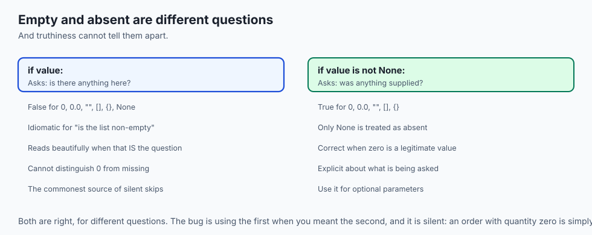

- **Falsy**: `False`, `None`, any zero, and any empty container — `""`, `[]`,
  `{}`, `()`, `set()`.
- **Everything else is truthy**, including `[0]` and `"0"`, which are not empty.
- **`if items:` is the idiom** for "if there is anything in it".
- **The sharp edge**: a value that is present but zero fails that test. Write
  `if value is not None:` when absent and empty must differ — Day 44's rule.

### Comparison operators

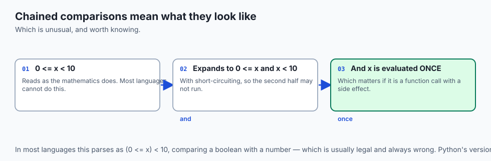

| Operator | Asks |
| --- | --- |
| `==` / `!=` | Equal value |
| `<` `<=` `>` `>=` | Ordering |
| `is` / `is not` | The same object — use only for `None` |
| `in` / `not in` | Membership |

- **Comparisons chain**: `0 <= x < 10` is one expression, and `x` is evaluated
  once.
- **That is not true in most languages**, where it would parse as
  `(0 <= x) < 10` and compare a boolean with a number.
- **Never compare floats with `==`** — Day 46.

### Logical operators and short-circuit evaluation

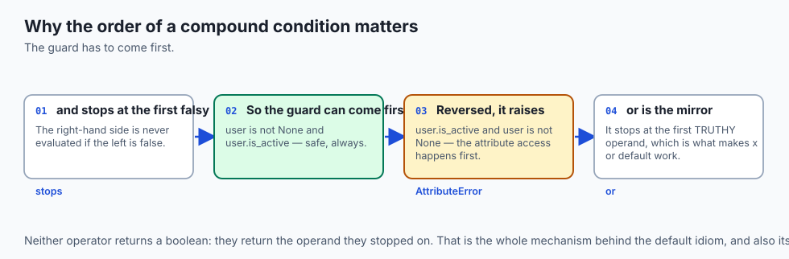


```python
if user is not None and user.is_active:   # safe
value = supplied or DEFAULT                # DEFAULT when supplied is falsy
```

- **`and` stops at the first falsy operand**; `or` stops at the first truthy one.
- **Neither returns a boolean.** They return the operand they stopped on, which is
  what makes `x or default` an idiom.
- **The order matters.** `user.is_active and user is not None` raises on `None`,
  because the guard came second.
- **`or` for defaults has the truthiness trap**: `count or 10` gives `10` when
  `count` is `0`.

### if / elif / else

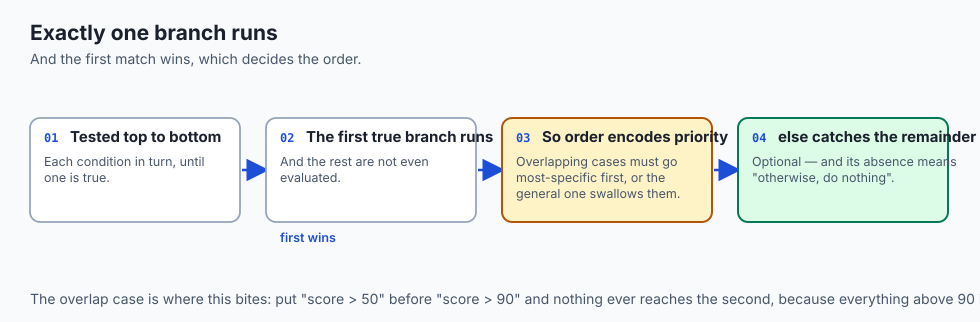

- **The first true branch runs**, and the rest are skipped.
- **`elif` is one keyword**, not a nested `else: if:`, which keeps a long chain
  flat.
- **`else` is optional**, and its absence means "otherwise do nothing".
- **Order the branches by likelihood** where they are independent, and by
  specificity where they overlap.

### The conditional expression

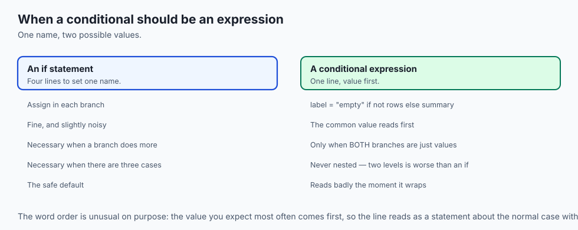

```python
label = "empty" if not rows else f"{len(rows)} rows"
```

- **The value comes first**, then the condition, then the alternative.
- **Use it when both branches produce a value** for one name.
- **Do not nest them.** Two levels is already less readable than an `if`.

### Guard clauses instead of deep nesting

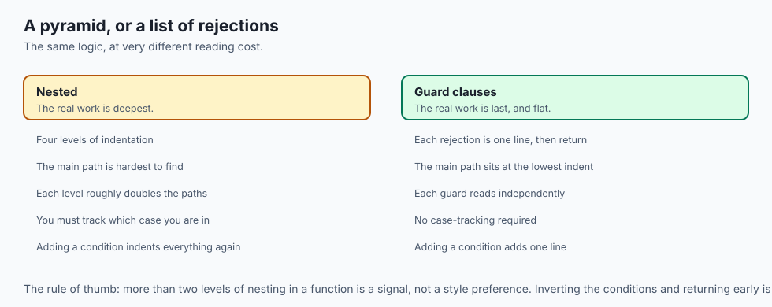

```python
def process(order):
    if order is None:
        return None
    if not order.items:
        return None
    if order.total <= 0:
        return None
    return summarise(order)     # the real work, unindented
```

- **Handle the exceptional cases first and return.**
- **The main path ends up at the lowest indentation**, where the eye expects it.
- **Each rejection is one line** and can be read independently.
- **The alternative is a pyramid** whose closing braces you have to count back
  through to know which case you are in.

---

## An everyday analogy

A doorman with a list.

| The door | The code |
| --- | --- |
| "Are you on the list?" | A condition |
| Turning someone away immediately | A guard clause |
| Checking the list only if they have ID | Short-circuit evaluation |
| One queue, first match wins | `if` / `elif` |
| "Anyone else, this way" | `else` |
| Someone with no bag at all | A falsy empty container |

- **The doorman rejects at the door**, rather than escorting everyone inside and
  deciding later. That is a guard clause.
- **There is no point checking the list** for someone with no identification, which
  is why the order of the two checks matters.

---

## Examples in practice


- **`if count:` skipping a legitimate zero**, which is truthiness in its most
  common failure.
- **`if x == None:`** where `is None` was meant, working by accident until a class
  defines `__eq__`.
- **A five-level nested `if`** that a reader cannot hold in mind, flattened to four
  guard clauses.
- **`name or "anonymous"`** returning `"anonymous"` for an empty string, which may
  or may not be intended.
- **A condition wrapped in a comment explaining it**, which is the signal it should
  be a named function.

---

## Implications: security, privacy, performance, scalability, and cost

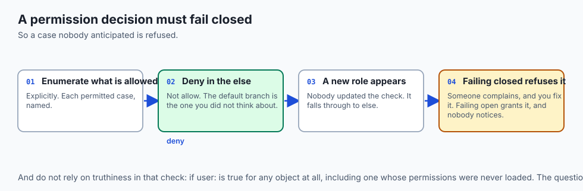

- **Security: an authorisation check must not rely on truthiness.** `if user:` is
  true for any object; `if user.is_admin:` is the question.
- **Fail closed.** The `else` branch of a permission decision should deny, so a
  new case is refused rather than allowed.
- **Short-circuiting is a timing signal.** Comparing secrets with `==` returns
  early on the first differing byte — Day 26's constant-time comparison.
- **Performance: order compound conditions cheapest first**, so the expensive one
  is often skipped.
- **A chain of twenty `elif`s is linear.** A dictionary lookup is not, and is
  usually clearer as well.
- **Cost: unreadable branching is where bugs hide.** Every nesting level roughly
  doubles the paths a reader must hold in mind.

---

## Alternatives: free, open source, and commercial

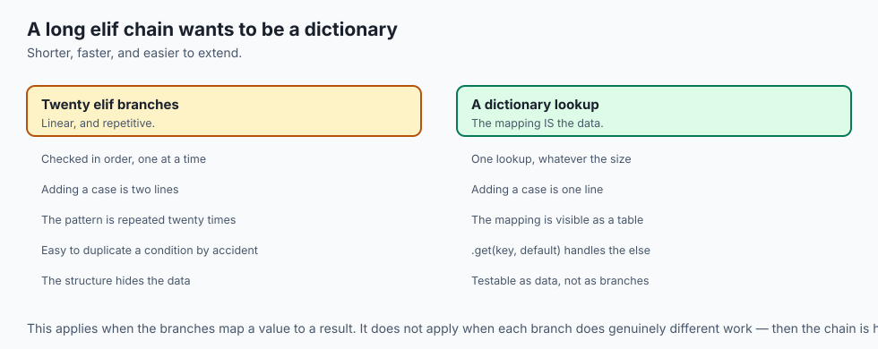

| Approach | Where it fits |
| --- | --- |
| `if` / `elif` / `else` | The default, for a handful of cases |
| A dictionary lookup | Mapping a value to a result, instead of a long chain |
| `match` / `case` | Structural patterns, from Python 3.10 |
| Guard clauses | Validation, and any function with several rejections |
| A named predicate function | When the condition needs a comment to explain it |
| Polymorphism | When the branch is really "what kind of thing is this" |

- **Replace a long `elif` chain that maps values to results with a dictionary.**
  It is shorter, faster, and adding a case is one line rather than two.
- **`match` is for structure**, not for replacing every `if`. Use it when you are
  destructuring, not when you are comparing.

---

## Comparison with related concepts

| Term | What it actually is |
| --- | --- |
| **Truthy / falsy** | How a non-boolean is judged in a condition |
| **Short-circuit** | Stopping evaluation once the answer is known |
| **Chained comparison** | `a < b < c`, evaluating `b` once |
| **Guard clause** | An early return handling an exceptional case |
| **Ternary** | A conditional that produces a value |
| **`is` vs `==`** | Same object versus equal value |

---

## When to use it — and when not to

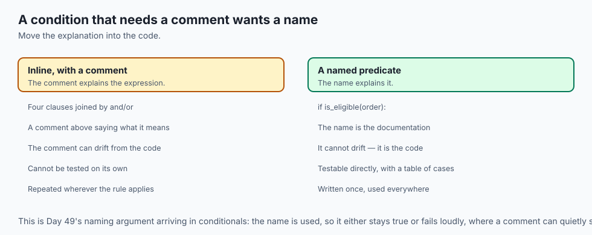

- **Use `if items:` for emptiness** and `is not None` for presence. They are
  different questions.
- **Use guard clauses** whenever a function has more than two levels of nesting.
- **Order compound conditions** so the cheap or protective one comes first.
- **Use a dictionary** rather than a long chain that maps values to results.
- **Do not use `==` on floats**, or `is` on values.
- **Do not nest ternaries.**
- **Do not write a condition that needs a comment.** Give it a name instead.

---

## The AI connection

- **Truthiness bites hardest on arrays and tensors.** An empty batch is falsy, and
  `if tensor:` raises rather than answering, because the truth of many elements is
  ambiguous.
- **Use `is None` for "not computed yet"**, which is the commonest optional value
  in model code — a cached activation, an optional mask, a lazily built index.
- **Short-circuit evaluation guards an expensive check**: `if cheap_test and
  expensive_check()` skips the second when the first fails.
- **Guard clauses suit data validation**, where most of the work is rejecting rows
  that cannot be processed.
- **A condition on a float is a comparison of approximations** — Day 46's rule,
  and `math.isclose` is the operator you actually want.

## Knowledge check

```yaml
quiz:
  question: "A function uses `if quantity:` to check that a quantity was supplied. Orders with a quantity of 0 are silently skipped. What is the correct check?"
  options:
    - "`if quantity is not None:`, because 0 is falsy but is a legitimate supplied value"
    - "`if quantity != False:`, to distinguish a numeric zero from a boolean"
    - "`if len(str(quantity)):`, so any provided value is treated as present"
    - "`if quantity >= 0:`, since quantities cannot be negative"
  answer_index: 0
  explanation: "Truthiness cannot distinguish absent from present-but-zero, because 0 and None are both falsy. When those two cases must behave differently, the test has to be about presence specifically, which is what `is not None` asks."
```

---

## Hands-on exercise

Flatten a nested conditional and meet the truthiness trap. Worked through fully in
the Day 50 lab directory.

| What you are doing | Command |
| --- | --- |
| Explore truthiness | `bool(0)`, `bool("")`, `bool([])`, `bool([0])` |
| Find the trap | `if 0:` versus `if 0 is not None:` |
| See short-circuiting | `False and print("ran")` — nothing prints |
| See what `or` returns | `0 or "default"` and `"" or None` |
| Chain a comparison | `0 <= x < 10` |
| Flatten with guards | Rewrite a 4-level nested function |
| Replace a chain | A 6-way `elif` becomes a dictionary lookup |

### Expected output

```text
False False False True
skipped
default None
True
```

- **`[0]` is truthy** because the list is not empty, whatever is in it.
- **`0 or "default"` returned the string**, which is the trap when zero is a
  legitimate value.

### Validate your work

- [ ] You found a case where `if x:` and `if x is not None:` disagree
- [ ] You demonstrated short-circuiting by putting a side effect on the right
- [ ] You showed that `and`/`or` return an operand, not a boolean
- [ ] You flattened a nested function into guard clauses
- [ ] You replaced an `elif` chain with a dictionary
- [ ] `bash tests/run_tests.sh` reports 0 failures

### Troubleshooting

- **`if x == True:` behaves oddly.** Compare truthiness directly with `if x:`, or
  identity with `is True` if you genuinely mean the object.
- **A chained comparison surprises you.** `a < b < c` is `a < b and b < c`, with
  `b` evaluated once.
- **`or` returned something unexpected.** It returns the first truthy operand, not
  `True`.
- **The linter objects to `== None`.** It is right; use `is None`.

### Common mistakes

- **Truthiness where presence was meant.**
- **Guard checks in the wrong order**, so the protective one runs second.
- **Nesting four levels deep** rather than returning early.
- **`== True`**, which is both redundant and subtly different.

---

## Practice assignment

- **Take a deeply nested function** from your own code and flatten it with guard
  clauses, then compare the two side by side.
- **Find three places** where `or` is used for a default and decide, for each,
  whether zero or empty would be handled correctly.
- **Convert an `elif` chain** of six or more branches into a dictionary lookup.
- **Write the truthiness table from memory**, then check it.

---

## Extension challenge

- **Demonstrate short-circuiting with a side effect** on the right-hand side, and
  use it to guard an expensive call.
- **Write a condition that is safe on `None`** and prove it raises when the two
  operands are reversed.
- **Use `match`/`case`** for a structural decision that an `if` chain handles
  awkwardly, and judge whether it earned its place.
- **Measure a 50-way `elif` chain against a dictionary lookup**, and explain the
  shape of the difference.

---

