## Why this matters

Almost nothing interesting in computing happens once. You rarely process a single number, a single file, or a single row of data — you process thousands, then millions. The tool that turns "do this to one thing" into "do this to every thing" is the loop, and it is the single most-used control structure you will ever write. Yesterday you learned to make a decision with `if`; today you learn to repeat, which is what makes a program do real work instead of a party trick.

This matters directly and immediately for where you are headed. Every artificial-intelligence system you will meet is, underneath, a loop over data. Training a model means passing over a dataset again and again — each full pass is called an *epoch*, and inside each epoch the data is walked in small groups called *batches* — which is nothing more than a loop inside a loop. Serving a model means looping over incoming requests. Preparing data means looping over records to clean, filter, and transform them before a model ever sees them. An AI agent that takes actions in a tool is running a step-loop: observe, act, check if done, repeat. If loops are shaky for you, every one of those topics will feel like magic; once loops are solid, they will feel like variations on a theme you already know.

There are concrete consequences to getting loops wrong, and they cost real time and money. A loop that never ends freezes your program and, in the cloud, quietly burns money until you notice. A loop that runs one time too few or too many — the classic *off-by-one* error — silently corrupts a total or skips the last record, and produces a wrong answer that looks plausible. A loop nested inside another loop can be fast on ten items and unbearably slow on ten thousand, because the work multiplies. By the end of today you will write loops that stop when they should, count correctly, and whose cost you can predict — the difference between code that works on your test input and code that survives real data.

## The idea in plain language

A loop is a way to tell the computer "keep doing this until I say stop." There are two shapes of loop, and choosing between them is the first thing to get right. A **for loop** is for when you already have a collection of things and want to visit each one: every item in a list, every character in a word, every line in a file, every number in a range. You do not manage the counting — the loop walks the collection for you and stops automatically when it runs out. A **while loop** is for when you do not know in advance how many times to repeat, and instead repeat *as long as some condition stays true*: keep asking the user until they type a valid answer, keep improving a guess until it is close enough, keep going until a signal says stop. You manage the condition; the loop trusts you to eventually make it false.

Underneath the for loop is a small, tidy idea worth naming now, because it explains a great deal later. Anything you can loop over is called an **iterable** — a list, a string, a range, a file. When a for loop starts, it asks the iterable for a helper called an **iterator**, a little bookmark that remembers where you are and hands back the next item each time the loop asks. When the items run out, the iterator says "done" and the loop ends. You do not usually see this machinery, but knowing it is there demystifies why a for loop works the same way over a list, a string, and a file: they are all iterables, and the loop only ever talks to the iterator.

Once you can repeat, a handful of *patterns* appear again and again, and recognizing them is most of the skill. You **accumulate**, building up a running total or count or list as you go. You **filter**, keeping only the items that pass a test. You **transform**, producing a new item from each old one. You **search**, scanning until you find what you want and then stopping early. And you handle the awkward middle of a loop with two small commands: **break** to leave the loop immediately, and **continue** to skip the rest of this round and move to the next item. Learn these five patterns and you have learned what most loops are actually doing.

## Historical background

Repetition is older than electronic computers. In 1843, Ada Lovelace, writing notes on Charles Babbage's proposed Analytical Engine, described how a "cycle of operations" could be repeated to compute a sequence of numbers — the idea of a loop, written down a century before a machine existed to run it. The word "loop" itself came from the physical reality of early programming: on machines that read instructions from punched paper tape, you could literally join the ends of a length of tape into a loop so the reader passed over the same instructions again and again.

The deeper story is about *taming* the loop. The earliest programming languages built repetition out of a raw jump instruction — `GOTO` — which let control leap to any labelled line. You could make a loop by jumping backward, but you could also make an incomprehensible tangle, because nothing said where a loop began or ended. In 1966 Corrado Böhm and Giuseppe Jacopini proved a foundational result: any program at all can be written using just three building blocks — running statements in sequence, choosing between them (selection), and repeating them (iteration) — with no arbitrary jumps required. Iteration, the loop, was one of the three pillars. Two years later Edsger Dijkstra's famous letter "Go To Statement Considered Harmful" pressed the point, and the *structured programming* movement gave loops the clear beginning-and-end forms — the `for` and `while` we still write — that make them readable.

Python, released by Guido van Rossum in 1991, inherited these lessons and made a distinctive choice. Its `for` loop is not the C-style "start at zero, count up, stop at a limit" counter; it is a `for each` that walks any iterable directly — `for item in things:` — because Python was designed around the iterable-and-iterator idea from the start. That is why looping over a list, a dictionary, a file, and a custom object all look identical, and why the counting machinery that trips up beginners in older languages is largely hidden. When you write a Python for loop today, you are using sixty years of the field's hard-won agreement that repetition should be a named, bounded, readable structure — not a jump into the dark.

## What it is — and what it is not

A loop is a control structure that runs a block of code repeatedly. A **for loop** repeats the block once for each item produced by an iterable and stops on its own when the items are exhausted; a **while loop** repeats the block as long as a condition evaluates to true and stops when it becomes false. Inside either, **break** ends the loop immediately, **continue** skips to the next repetition, and a loop may carry an **else** clause that runs only if the loop finished normally without ever hitting a break.

It helps to be clear about what a loop is *not*, because beginners misread it in predictable ways. A for loop is not a counter you must drive by hand: writing `for i in range(len(items)):` and then using `items[i]` is almost always the wrong instinct in Python — you loop over the items directly. A loop variable is not special or permanent; it is an ordinary name that is reassigned to the next item on each pass and simply holds the last item after the loop ends. A while loop's condition is not re-checked in the middle of the body — it is only tested at the top of each pass, so the body always runs to completion before the condition is looked at again. And a loop is not guaranteed to end: a while loop whose condition never becomes false runs forever, which is a bug, not a feature.

| Common misconception | The reality |
| --- | --- |
| "A for loop is for counting numbers." | A Python for loop walks any iterable — list, string, file, range. Counting is just one case, done with `range`. |
| "I need an index `i` to loop over a list." | You loop over the items directly: `for name in names:`. Reach for the index only when you truly need position — then use `enumerate`. |
| "`break` exits the whole program." | `break` exits only the innermost loop it is in; the program keeps running after that loop. |
| "`continue` skips the whole loop." | `continue` skips only the *rest of the current pass* and jumps to the next item; the loop continues. |
| "A while loop checks its condition constantly." | The condition is checked once at the top of each pass. The body always finishes before the next check. |
| "More lines in the loop body means a slower loop." | Loop cost is dominated by how many *times* the body runs, especially when loops are nested — not by the body's length. |

## Why it was created and what problems it solves

Loops exist to solve a problem that appears the moment a program does anything real: the same operation must be applied to many pieces of data, and writing it out by hand is impossible. Imagine summing a list of ten numbers without a loop — you could just add them. Now imagine summing ten thousand numbers, or a list whose length you will not know until the program runs because it comes from a file a user provides. Without a loop there is no way to write code that adapts to a quantity you cannot see in advance. The loop is the construct that lets one short block of code process a collection of *any* size, including sizes that did not exist when you wrote the program.

The two loop shapes solve two distinct versions of this problem, which is why both exist. The for loop solves *definite* iteration: you have a collection, you want to visit each member exactly once, and the number of repetitions is fixed by the collection's size. The while loop solves *indefinite* iteration: you do not know how many repetitions you need, only a condition that tells you when to stop — retry until success, refine until close enough, continue until interrupted. Trying to force a while loop to do a for loop's job (manually managing an index) invites off-by-one errors; trying to force a for loop to do a while loop's job (looping over a fixed range and breaking early) obscures the real stopping condition. Matching the loop to the problem is not style; it is what keeps the code correct and readable. And `break` and `continue` exist because real loops are messy in the middle: sometimes you find your answer before the end and should stop, and sometimes one item should be skipped without abandoning the rest.

## How it works

Let's build up the mechanics from the smallest piece to the full patterns.

### The for loop and the iteration model

A Python for loop reads almost like English: `for item in collection:` followed by an indented body. On each pass, the name `item` is bound to the next element of `collection`, the body runs, and then the loop asks for the next one. When there are no more, the loop ends. The magic is in what "asks for the next one" means.



Read the top half of the diagram left to right. Your collection is an **iterable**. When the for loop starts, it calls `iter()` on the iterable to get an **iterator** — a small object that remembers your position. Each pass, the loop calls `next()` on that iterator, which returns the next item; the loop body runs with that item; then it loops back and calls `next()` again. When the iterator has nothing left, it signals exhaustion and the loop stops cleanly. You almost never write `iter()` and `next()` yourself — the for loop does it for you — but this is why the same for loop works over a list, a string, a `range`, and a file: each is an iterable, and the loop only ever speaks to the iterator. (You will meet iterables and iterators in fuller depth on Day 55; today's picture is enough to make loops make sense.)

Three built-in helpers make for loops far more expressive, and you will use all three constantly:

- **`range(stop)`** produces the whole numbers `0, 1, …, stop − 1`. It is how you loop a fixed number of times: `for i in range(5):` runs five times with `i` taking `0` through `4`. `range(start, stop)` and `range(start, stop, step)` give you more control. Crucially, `range` is *lazy* — it produces each number as asked rather than building a giant list — so `range(1_000_000)` costs almost no memory.
- **`enumerate(items)`** pairs each item with its position, so you get both without managing a counter: `for index, value in enumerate(items):`. This is the right tool the moment you genuinely need to know *where* you are, and it replaces the error-prone `range(len(items))` pattern.
- **`zip(a, b)`** walks two (or more) iterables in lockstep, handing you one item from each per pass: `for name, score in zip(names, scores):`. It stops when the shortest runs out, which is usually what you want.

### The while loop

A while loop is written `while condition:` followed by an indented body. The condition is checked; if it is true, the body runs; then the condition is checked again; and so on until the condition is false, at which point the loop ends and the program continues below it. The bottom half of the iteration diagram shows this: check, run, update, check again.



The one responsibility a while loop places on you is **progress**: something inside the body must move the condition toward becoming false, or the loop never ends. `while count < 10:` requires that `count` grows; forget the `count += 1` and you have an *infinite loop*. Prefer a while loop when the number of repetitions is not known ahead of time — reading until end-of-input, retrying until something succeeds, or looping "forever" with `while True:` and leaving the loop from the inside with `break` when a stopping condition is met. That `while True` / `break` shape is common and perfectly idiomatic; the key is that a `break` is reachable.

### break, continue, and the loop-else clause

The flow diagram shows the three ways a loop's body can steer itself. **`break`** exits the loop immediately — no more items are visited, and control jumps to the first line after the loop. It is how you *search*: scan until you find what you want, then stop, because continuing would be wasted work. **`continue`** abandons only the current pass and jumps straight to the next item — useful for skipping items that do not qualify without wrapping the rest of the body in an `if`.

Python adds a feature many languages lack: a loop can have an **`else`** clause, and it runs only if the loop finished *without* hitting a `break`. Read `for … else` as "for each item … and if we never broke out, do this." It is precisely the tool for search-and-report: loop looking for something, `break` when found, and put the "not found" handling in the `else`. The diagram makes the rule visual — the arrow from a `break` leaps past the `else` block, while natural exhaustion flows into it.

### The five iteration patterns, in code

Almost every loop you write is one of these shapes. Here they are on a small list, `nums = [3, 1, 4, 1, 5, 9, 2, 6]`:

```python
nums = [3, 1, 4, 1, 5, 9, 2, 6]

# 1. Accumulate — build a running result
total = 0
for n in nums:
    total = total + n        # total ends at 31

# 2. Filter — keep the items that pass a test
big = []
for n in nums:
    if n > 4:
        big.append(n)        # big is [5, 9, 6]

# 3. Transform — make a new item from each old one
squares = []
for n in nums:
    squares.append(n * n)    # squares is [9, 1, 16, 1, 25, 81, 4, 36]

# 4. Search — scan, stop early, report with else
target = 5
for index, n in enumerate(nums):
    if n == target:
        print(f"found {target} at index {index}")
        break
else:
    print(f"{target} not found")   # runs only if no break happened

# 5. Nested — a loop inside a loop
for row in range(3):
    for col in range(3):
        pass                 # body runs 3 x 3 = 9 times
```

The accumulator (pattern 1) is the workhorse: `total` starts at a neutral value (0 for a sum, an empty list for a build) and each pass folds in one more item. Filtering and transforming are accumulators that build a list. Search adds an early `break` so you stop the moment you succeed. And the nested loop is where cost lives: the inner body runs `outer × inner` times, so a `1000 × 1000` nested loop runs a million times. That multiplication is the first thing to check when a program is mysteriously slow.

## An everyday analogy

Picture a parcel sorting line in a warehouse. A crate of parcels arrives — that crate is your **iterable**, the collection you are going to process. You do not grab the whole crate at once; a feeder mechanism lifts out one parcel at a time and places it on the belt in front of a worker. That feeder is the **iterator**: it remembers which parcel is next and hands them over one by one until the crate is empty. The worker's fixed routine — do the same thing to whatever parcel arrives — is the **loop body**. This is a **for loop**: the belt runs once per parcel and stops by itself when the crate runs dry. Nobody counts the parcels; the empty crate is the signal to stop.

The worker's routine covers every pattern. If the job is to add up the declared weights, the worker keeps a running tally on a clipboard and adds each parcel's weight as it passes — the **accumulator**. If the job is to pull out only the parcels over five kilograms, the worker sets the heavy ones aside and lets the rest go by — **filtering**. If the job is to slap a new label on each parcel, that is **transforming**. Now suppose the worker is looking for one specific tracking number: the moment it appears, there is no point checking the rest of the crate, so the worker stops the belt — that is **break**, the search pattern. If a parcel is damaged and should be ignored, the worker waves it past without processing and reaches for the next — that is **continue**. And the quality stamp at the end of the shift — "entire crate processed, nothing broke the line early" — is the **else** clause: it only gets applied if the worker never stopped the belt midway.

A **while loop** is a different station. Here there is no crate to empty; instead the worker keeps repackaging a parcel until it passes a drop-test — an unknown number of tries, repeated *as long as* the test fails. The danger is obvious and physical: if nothing the worker does ever lets the parcel pass, they repackage forever and the whole line jams. That is the **infinite loop**, and the fix is the same in the warehouse as in code — make sure each attempt actually changes something, and set a hard limit of tries after which you stop and raise the problem. Keep this sorting line in mind and every loop you write has a place you can point to.

## Examples in practice

Let's trace the accumulator completely, because seeing every step is how the pattern becomes yours. Summing `nums = [3, 1, 4, 1, 5, 9, 2, 6]`:

```text
start:      total = 0
n = 3   ->  total = 0 + 3  = 3
n = 1   ->  total = 3 + 1  = 4
n = 4   ->  total = 4 + 4  = 8
n = 1   ->  total = 8 + 1  = 9
n = 5   ->  total = 9 + 5  = 14
n = 9   ->  total = 14 + 9 = 23
n = 2   ->  total = 23 + 2 = 25
n = 6   ->  total = 25 + 6 = 31
loop ends (crate empty) -> total = 31
```

Eight passes, one per item, each folding the current number into a running total that starts at the neutral value 0. Counting is the same shape with `+ 1` instead of `+ n`, and building a filtered list is the same shape with `.append()` into a list that starts empty. Once you see that filtering, transforming, and totalling are all "start neutral, fold in one item per pass," you have seen the deep structure of most loops.

Now the search pattern with its early exit, which is where `break` earns its keep. Searching `nums` for `5`:

```text
index 0: nums[0] = 3, is it 5? no  -> keep going (comparison 1)
index 1: nums[1] = 1, is it 5? no  -> keep going (comparison 2)
index 2: nums[2] = 4, is it 5? no  -> keep going (comparison 3)
index 3: nums[3] = 1, is it 5? no  -> keep going (comparison 4)
index 4: nums[4] = 5, is it 5? YES -> print "found at index 4", break (comparison 5)
(the else clause is skipped because we broke out)
```

Five comparisons, then we stop — we never look at indices 5, 6, 7, because there is nothing to gain. On a long list this early exit is the difference between fast and slow. Had `5` not been present, the loop would have made all eight comparisons, never hit `break`, and flowed into the `else` clause to print "not found" — which is exactly why the else clause belongs to search.

Now the leading built-in helpers in real use (this is the A13 tour — each with when to reach for it and a concrete example). Use **`enumerate`** whenever you need position alongside value; use **`zip`** to march two related sequences together; use **`range`** to repeat a fixed number of times or to generate a sequence of numbers:

```python
names  = ["Ada", "Alan", "Grace"]
scores = [95, 88, 91]

# enumerate: numbered output without a hand-managed counter
for rank, name in enumerate(names, start=1):
    print(f"{rank}. {name}")          # 1. Ada / 2. Alan / 3. Grace

# zip: two lists in lockstep
for name, score in zip(names, scores):
    print(f"{name} scored {score}")   # Ada scored 95, ...

# range: a fixed number of repetitions, and a countdown with a step
for i in range(3):
    print("tick")                     # runs 3 times
for i in range(5, 0, -1):
    print(i)                          # 5, 4, 3, 2, 1
```

Finally, the AI-flavoured example that shows why all of this is worth mastering — a miniature training loop, which is just nested iteration over epochs and batches:

```python
data = [10, 20, 30, 40]          # stand-in for a dataset
batch_size = 2
for epoch in range(3):            # outer loop: 3 full passes over the data
    for start in range(0, len(data), batch_size):
        batch = data[start:start + batch_size]   # [10,20], then [30,40]
        # a real trainer would update the model from `batch` here
        print(f"epoch {epoch} batch {batch}")
```

Read it and the whole vocabulary of model training is already familiar: an epoch is one full pass over the data (the outer loop), a batch is a small group processed together (the inner loop's slice), and "train for more epochs" literally means "raise the outer loop's range." The trainer that adjusts billions of parameters has this exact skeleton — a loop inside a loop over data — with heavier work in the body.

## Implications: security, privacy, performance, scalability, and cost

### Security

The security story of loops is mostly the story of loops that do not stop. A loop driven by untrusted input — the length of a request, a value from a file, a counter a user controls — can be pushed into running far longer than you intended, and an attacker who can make your loop run "one more time" a billion times has a denial-of-service lever: your program hangs and stops serving everyone else. The defenses are simple and worth building as habits now: put an upper bound on loops that process external input (a maximum number of iterations, after which you stop and report), and never trust a stopping condition that depends entirely on data you did not generate. A bounded loop fails safely; an unbounded one fails open.

### Privacy

Loops are where data is actually touched, so they are where privacy is enforced or leaked. When you loop over records to build a report or a log, every field you read and every field you write is a decision about what is exposed. A filtering loop is the natural place to *drop* sensitive fields before data flows onward — remove the personal columns in the same pass that transforms the rest — and a well-structured loop makes that one obvious place to check. Tangled repetition hides what data is being handled; a clear filter-and-transform loop shows it plainly, which is what makes a data pipeline auditable when it later handles real people's information.

### Performance

Performance in loops comes down to one number: how many times does the body run? For a single loop that is the length of the collection. For a nested loop it is the *product* of the lengths, and that multiplication is the most common cause of code that is instant on small input and unusable on large input. A loop over a thousand items that, inside, loops over the same thousand items runs a million times; add a third level and it is a billion. This is why the first question about a slow loop is "how does the number of iterations grow as the input grows?" — you will meet this idea formally as time complexity later, but the intuition starts here: flatten nesting where you can, stop early with `break` when you have your answer, and be suspicious of a loop inside a loop over large data.

### Scalability

The loop that works on your laptop's test file is the same loop that must handle a dataset too big to fit in memory — and the iteration model is what lets it. Because a for loop only ever asks the iterator for the *next* item, it never needs the whole collection at once. Looping over a file line by line reads one line at a time, so a program can process a file far larger than its memory; the same is true of any *lazy* iterable like `range` or a generator (which you will meet soon). Writing loops that consume one item at a time, rather than building giant lists first, is the habit that lets the same code scale from a hundred rows to a hundred million.

### Cost

In the cloud, loops cost money in proportion to how long they run, and the two failure modes are expensive in opposite ways. An infinite or accidentally quadratic loop runs up a bill for compute you did not mean to buy — the runaway-loop story that surprises people on their first cloud invoice. On the other side, an inefficient loop that recomputes work it could have done once wastes a smaller amount continuously. Both are addressed by the same discipline: know how many times your loop runs, put bounds on loops fed by external input, and stop early when you can. For AI specifically, training loops are among the most expensive computations there are — every extra epoch is real electricity and rented hardware — so understanding that "more epochs" means "more loop iterations means more cost" is budgeting, not trivia.

## Alternatives: free, open source, and commercial

Every tool here ships with Python itself and is free and open source; the "alternatives" are different ways to express iteration, and choosing well is a readability and performance decision, not a cost one.

| Approach | When to choose it | Example | Cost |
| --- | --- | --- | --- |
| Plain `for` loop | The default; any per-item work, especially with side effects (printing, accumulating into several things, early `break`) | `for n in nums: total += n` | Free (built in) |
| `while` loop | Indefinite repetition — retry until success, loop until a signal, unknown count | `while not done: done = try_step()` | Free (built in) |
| List comprehension | Building one new list by filtering and/or transforming; more concise and often faster than the equivalent for loop | `squares = [n*n for n in nums]` | Free (built in) |
| `map` / `filter` | Applying one function across a sequence in a functional style | `list(map(str, nums))` | Free (built in) |
| `sum`, `min`, `max`, `any`, `all` | Common accumulations — do not hand-roll a loop to add or check a list | `total = sum(nums)` | Free (built in) |
| `itertools` module | Advanced iteration — infinite counters, grouping, combinations, chaining iterables lazily | `itertools.chain(a, b)` | Free (standard library) |
| NumPy / pandas vectorization | Numeric work over large arrays, where a Python-level loop is too slow | `arr * arr` (no loop) | Free, open source |

The guidance is practical. Reach for a **comprehension** when your loop is purely "build a list by filtering and/or transforming" — `[n*n for n in nums if n > 4]` says exactly that in one line, and it is the Pythonic default for that shape. Reach for **`sum`/`min`/`max`/`any`/`all`** instead of writing an accumulator by hand for those exact jobs; `sum(nums)` is clearer and faster than a for loop that adds. Reach for **`itertools`** when you need iteration cleverness — pairing, grouping, endless counters — without building huge intermediate lists. And once you are doing heavy numeric work, reach for **NumPy**, where an operation like squaring a million-element array runs in optimized C with no Python loop at all — the reason serious AI code pushes loops down into libraries rather than writing them in Python. But every one of these is a loop underneath; the plain `for` loop is the one you must understand first, because it is what the others are made of.

## Comparison with related concepts

| Concept A | Concept B | Key difference |
| --- | --- | --- |
| `for` loop | `while` loop | `for` visits each item of a collection a fixed number of times and stops on its own; `while` repeats as long as a condition holds and stops when you make it false |
| `break` | `continue` | `break` leaves the loop entirely; `continue` skips only the rest of the current pass and moves to the next item |
| `for … else` | plain `for` | The `else` clause runs only when the loop finished without a `break` — a built-in "we never found it / never stopped early" branch |
| Loop | Recursion | Both repeat work; a loop repeats by cycling a block, recursion by a function calling itself — loops are the everyday tool and are cheaper in Python |
| `for` loop | List comprehension | A for loop is general (side effects, several accumulators, early exit); a comprehension is a concise loop specialized for building one list |
| Iterable | Iterator | An iterable is anything you can loop over (a list, a string); an iterator is the one-use bookmark a loop gets from it to fetch items one at a time |

## When to use it — and when not to

Reach for a **for loop** whenever you have a collection and want to do something with each item — which is most of the time. Reach for a **while loop** when the number of repetitions is not known in advance and you have a condition that tells you when to stop: retrying an operation until it succeeds, reading until input runs out, or looping until an external signal says finish. Reach for `break` to stop a search the instant you succeed, `continue` to cleanly skip items that do not qualify, and the loop `else` to handle "we went through everything and never found it." These are the bread-and-butter decisions of everyday code, and matching the shape to the job keeps the code both correct and readable.

Know equally when *not* to write a raw loop. If you are building one list by filtering or transforming, a comprehension usually says it better. If you are summing, counting, finding a maximum, or asking "do any/all of these pass?", the built-ins `sum`, `min`, `max`, `any`, and `all` are clearer and faster than a hand-written accumulator — reaching for a manual loop there is reinventing a wheel that is already round. And if you are doing heavy numeric work over large arrays, a Python-level loop is the wrong tool entirely; push it into NumPy or pandas, which loop in optimized C. The professional instinct is to write the plain loop when it is the clearest expression of the logic, and to recognize the common shapes that a built-in or a library already does better.

Here is where today points. Every serious AI workload you will touch is loops all the way down, and you now have the vocabulary for it. The training loop that fits a model is a loop over epochs wrapping a loop over batches — nested iteration whose cost you can now reason about. The data pipeline that cleans a dataset before training is a filter-and-transform loop over records — the exact patterns you traced today, deciding what to keep, what to change, and what to drop. An AI agent taking steps in a tool runs a `while not done:` loop — observe, act, check, repeat — with a bound so it cannot run forever. And when you meet code that squares a million-element array with no visible loop, you will know the loop is still there, pushed down into a fast library for speed. Master the five patterns and the two shapes today, and none of that will be magic — it will be iteration wearing an AI costume.

## Knowledge check

Try these from memory before looking back:

1. In one sentence each, say when you would choose a `for` loop and when you would choose a `while` loop, and give the one responsibility a `while` loop places on you.
2. Explain the difference between `break` and `continue`, and describe exactly when a `for … else` clause's `else` block runs.
3. Trace the accumulator that sums `[2, 5, 3]`: give `total` before the loop and after each pass.
4. You have `names = ["Ada", "Alan"]` and `scores = [95, 88]` and want to print `"Ada: 95"` then `"Alan: 88"`. Which built-in pairs them, and write the loop.
5. A nested loop runs over a list of 1,000 items, and inside it loops over the same 1,000 items. Roughly how many times does the inner body run, and why does this matter as the list grows?

## Hands-on exercise

Time to build the loops yourself. In the Day 51 lab — the **Iteration Patterns Workbench** — you will complete a small program that demonstrates all five patterns on numbers read from the command line or standard input: accumulate a total, filter a sequence, transform each item, search with an early `break`, and build a small text histogram. Work in the lab directory; every command below is run from there.

First, see the finished reference in action, which needs no input of its own:

```bash
python3 examples/patterns.py demo
```

Then feed your own numbers to individual patterns through standard input:

```bash
echo "3 1 4 1 5 9 2 6" | python3 examples/patterns.py total
echo "3 1 4 1 5 9 2 6" | python3 examples/patterns.py filter 4
echo "3 1 4 1 5 9 2 6" | python3 examples/patterns.py search 5
echo "1 2 2 3 3 3"     | python3 examples/patterns.py histogram
```

Now open `starter/patterns.py` and complete its five numbered exercises — one per pattern — using the reference only when you are stuck. Then run the test suite:

```bash
bash tests/run_tests.sh
```

### Expected output

A correct run of the reference looks exactly like this (the `demo` command uses the built-in sample list `[3, 1, 4, 1, 5, 9, 2, 6]`):

```text
$ python3 examples/patterns.py demo
sample: [3, 1, 4, 1, 5, 9, 2, 6]
total    -> count=8 sum=31
filter>4 -> [5, 9, 6]
transform-> [9, 1, 16, 1, 25, 81, 4, 36]
search 5 -> found 5 at index 4 after 5 comparisons
histogram:
 1 | ##
 2 | #
 3 | #
 4 | #
 5 | #
 6 | #
 9 | #

$ echo "3 1 4 1 5 9 2 6" | python3 examples/patterns.py total
count=8 sum=31

$ echo "3 1 4 1 5 9 2 6" | python3 examples/patterns.py search 7 ; echo "exit: $?"
7 not found after 8 comparisons
exit: 1
```

The `demo` prints all five patterns at once; the piped commands run one pattern each. A successful search exits `0`; a search that finds nothing prints its report and exits non-zero, so another program can tell whether the value was present.

### Validate your work

You are done when you can check every box:

- [ ] `python3 examples/patterns.py demo` prints the five-pattern report above.
- [ ] `echo "3 1 4 1 5 9 2 6" | python3 examples/patterns.py total` prints `count=8 sum=31`.
- [ ] `echo "3 1 4 1 5 9 2 6" | python3 examples/patterns.py filter 4` prints `[5, 9, 6]`.
- [ ] A found search exits `0`; a not-found search prints `... not found ...` and exits non-zero.
- [ ] Bad input (a non-number token, or an unknown command) prints a clear error to standard error and exits non-zero.
- [ ] Your completed `starter/patterns.py` passes the same checks, and `bash tests/run_tests.sh` ends with `0 failure(s)` and exits `0`.

### Troubleshooting

- **The program seems to hang with no output.** It is waiting for input on standard input because you ran a data command (like `total`) without piping anything in. Either pipe data (`echo "1 2 3" | python3 examples/patterns.py total`) or press Ctrl-D to signal end-of-input. The `demo` command needs no input.
- **`ValueError` or an "is not a whole number" error.** One of your tokens is not an integer — check for stray letters or punctuation in the input. The program validates input at the boundary and reports the bad token rather than crashing.
- **`filter` or `search` says it is missing an argument.** Those commands need a number after them: `filter 4`, `search 5`. Running them bare is rejected with a usage message.
- **Your histogram bars are misaligned.** The value labels are right-aligned to the width of the largest value; re-check that you build each bar as `count` copies of `#` and pad the label, not the bar.
- **`echo $?` shows `0` after a not-found search.** Your search path is not returning a non-zero exit code. The found and not-found cases must end with different exit codes so callers can tell them apart.

### Common mistakes

- **Using `range(len(items))` to loop over a list.** Loop over the items directly with `for item in items:`, or use `enumerate` when you also need the index. The index-juggling version is where off-by-one errors breed.
- **Forgetting to make progress in a `while` loop.** If nothing in the body moves the condition toward false, the loop runs forever. Always ensure the counter advances or the stopping signal can be reached.
- **Not stopping a search early.** A search loop that keeps scanning after it found its answer wastes work; `break` the moment you succeed, and use the loop `else` for the not-found case.

## Practice assignment

Extend the Workbench with a sixth pattern of your own and record it in the lab. Choose a genuinely useful per-item loop — a **running maximum and its position** (scan the numbers, track the largest value seen so far and the index where it occurred, using the accumulator pattern), a **run-length summary** (loop once and report the longest streak of consecutive equal values), or a **two-list merge** (read two lines of numbers and use `zip` to pair and sum them position by position). Before coding, write in `starter/patterns-worksheet.md` which loop shape you will use (`for` or `while`), what your accumulator starts at, and at least two edge cases (empty input, and a single-item input). Then implement it as its own named function plus a new subcommand, validate input at the boundary so a bad token prints a clear error and exits non-zero, and record in the worksheet what your command prints on one normal input and one edge-case input. Keep the file — the collections you meet on Days 52-54 will give you richer things to iterate over with exactly these patterns.

## Extension challenge

Take the Workbench one step toward professional code by measuring and then eliminating a loop. First, add a `--count` option to the `search` command that reports how many comparisons it made, and run it searching for a value near the front of a long list and again for a value near the end (generate a long input with `python3 -c "print(' '.join(str(i) for i in range(10000)))"` piped in). Confirm from the comparison counts that an early `break` really does less work when the target is found early — you have just measured why searching stops as soon as it succeeds. Second, rewrite the `filter` and `transform` patterns as one-line **list comprehensions** (`[n for n in nums if n > threshold]` and `[n * n for n in nums]`) and confirm they produce identical output to the loops; note in a comment when you would keep the explicit loop instead (when the body does more than build a list — printing, several accumulators, or an early exit). Finally, write a comment explaining, in terms of the outer-times-inner rule, how many times the inner body of a two-level nested loop over your 10,000-item input would run, and why that number is the reason real numeric code pushes loops down into libraries like NumPy. You have now reasoned about iteration cost from first principles — the same reasoning that governs how fast a model trains.
