## Why this matters

Almost everything you will ever do in artificial intelligence arrives as a sequence: a dataset is a list of rows, a training run consumes the data in batches that are lists of examples, a language model reads and writes a list of tokens, and a single example is often a feature vector — an ordered list of numbers. The list is the container that all of this lives in first, before any of it becomes a fast numerical array.

If you understand lists deeply — how they are indexed, how they are sliced, and above all when an operation quietly changes the list you already have versus hands you a fresh one — you can read and write data code with confidence. If you do not, you will hit a specific and demoralising class of bug: the one where your data is silently wrong and nothing crashes.

That bug has a name in practice: mutation surprise. You pass a list into a function, the function changes it, and now some other part of your program that was still holding that list sees different data than it expected. No exception is raised. No red text appears. A model just trains on subtly corrupted inputs, or a metric comes out wrong, and you spend an afternoon hunting for a cause that turns out to be one missing copy. The single most valuable thing this lesson gives you is the reflex to know, for every list operation you write, whether it mutates in place or returns something new — and to copy before you mutate when it matters.

There are concrete consequences beyond correctness. Lists have a performance shape: appending to the end is cheap, but inserting or removing from the middle is not, and asking "is this value in the list?" gets slower the longer the list grows. When your dataset has ten million rows, the difference between an operation that is cheap and one that is expensive is the difference between a script that finishes in seconds and one that runs all night.

Lists are also the on-ramp to NumPy, the numerical-array library you meet in Course 03: NumPy exists precisely because plain Python lists, flexible as they are, are too slow and too memory-hungry for large-scale math. You cannot appreciate why NumPy is fast until you understand what a list actually is underneath. Today you find out.

## The idea in plain language

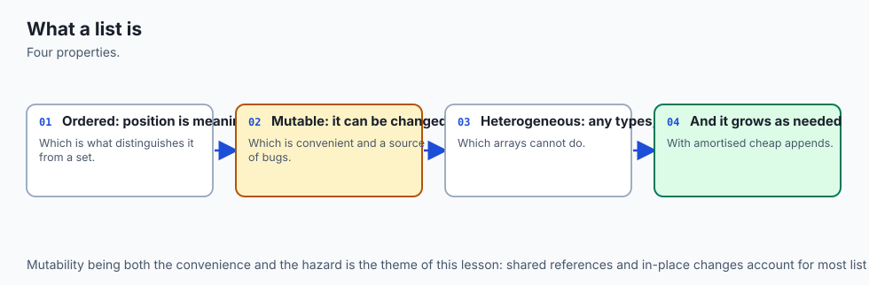

A list is an ordered collection of items that you can change. "Ordered" means every item has a position, counted from zero: the first item is at index `0`, the second at index `1`, and so on. You can also count from the end with negative numbers, so `-1` is the last item, `-2` the second-to-last. "Change" means a list is *mutable*: after you make it, you can add items, remove items, replace items, or reorder them, all without creating a new list.

You write a list with square brackets — `[10, 20, 30]` — and the items can be anything, including other lists, which is how you build a grid or matrix: a list of lists. You reach an item by its index with more square brackets, `nums[0]`, and you can grab a whole run of items at once with a *slice*, `nums[1:3]`, which gives you a new list of the items from index 1 up to (but not including) index 3.

The one idea that ties the whole lesson together, and the one beginners most often miss, is that a list variable does not *contain* its items — it *refers* to a list object that holds *references* to the items. When you write `b = a`, you do not copy the list; you give the same list a second name. Change it through one name and the change shows through the other, because there is only one list. To get a genuinely separate list you must copy it on purpose. Hold onto that sentence; nearly every list surprise unfolds from it.

## Historical background

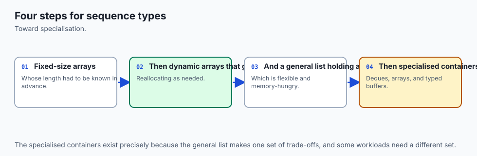

Lists are as old as Python itself. Guido van Rossum released the first version of Python in 1991, and the list — a general, growable, mutable sequence that can hold items of any type — was one of its founding built-in types, alongside strings and dictionaries. The design goal was a container that felt effortless to use for everyday programming: no fixed size to declare in advance, no single element type to commit to, just brackets and methods that read like plain instructions.

Underneath that friendly surface sits a classic data structure the field had understood for decades: the *dynamic array*, sometimes called a growable or resizable array. A plain array is a single contiguous block of memory of fixed size; it is fast to index but cannot grow. A dynamic array wraps that fixed block in a little bookkeeping so it can grow: when it fills up, it quietly allocates a bigger block, copies the existing references across, and carries on.

CPython — the standard Python you are running — implements every list this way. A list is a C-level array of pointers (references) to Python objects, and it deliberately over-allocates a little spare room at the end so that most appends are instant and only the occasional one triggers a resize.

Sorting has its own well-documented history inside Python. Since CPython 2.3, released in 2003, Python has sorted with an algorithm called Timsort, designed by the longtime core developer Tim Peters. Timsort is an adaptive, stable merge sort that is fast on the partly-ordered data that shows up constantly in real programs. Its stability — the guarantee that items comparing equal keep their original relative order — is a promise the Python language makes, not an accident of the current version, and you will lean on it today when you sort by a key. Both `list.sort()` and the built-in `sorted()` use it.

## What it is — and what it is not

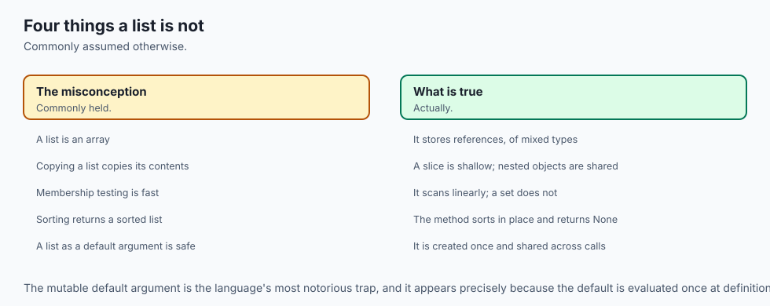

A list is a mutable, ordered sequence of references to objects, stored under the hood as a dynamic array. It is the default "put several things in order and work with them" container in Python, and it is the right first choice for a collection you will build up, index into, slice, sort, and change.

It is worth being precise about what a list is *not*, because several of its neighbours look similar and behave differently. A list is not a *tuple*: a tuple `(10, 20, 30)` is an ordered sequence too, but it is *immutable* — once made, it cannot be changed — which makes it the right choice for fixed records and for keys, and you meet it on Day 54. A list is not a *set*: a set `{10, 20, 30}` is an unordered collection of unique items with fast membership testing, and you meet it on Day 54 as well.

A list is not a NumPy array: an array stores raw numbers of one type packed tightly for fast math, while a list stores references to arbitrary Python objects; the array is faster and leaner for numerical work but far less flexible. And a list is not a copy of itself waiting to happen — assigning it to a new name does not duplicate it, a fact the misconceptions table below exists to hammer home.

| Common misconception | The reality |
| --- | --- |
| "`b = a` makes a copy of the list." | It makes a second *name* for the same list. Change one, the other changes too. To copy, write `a[:]`, `list(a)`, or `a.copy()`. |
| "`a.sort()` returns the sorted list." | `a.sort()` sorts *in place* and returns `None`. Use `sorted(a)` when you want a new sorted list and to keep the original. |
| "Slicing changes the original list." | A slice like `a[1:3]` builds and returns a *new* list; the original is untouched. |
| "Appending is basically free every time." | Appending is cheap *on average*, but occasionally a resize copies the whole list. Inserting or removing in the middle is always O(n). |
| "A copy protects nested lists too." | A shallow copy duplicates only the outer list. Inner lists are still shared; use `copy.deepcopy` for true independence. |
| "`in` is instant." | Membership on a list scans item by item — O(n). Sets and dictionaries are the tools for fast membership. |

## Why it was created and what problems it solves

The list exists to solve the most common need in all of programming: hold several things in a definite order and let me work with them. Before dynamic arrays became the default, a programmer using a plain fixed array had to guess the size up front and rewrite everything by hand when the guess was wrong. The list removes that burden. You start with `[]` and append as data arrives; the list grows itself. That single convenience — a sequence that manages its own size — is why lists are the workhorse container you reach for without thinking.

Each list feature answers a specific recurring problem. Indexing solves "give me the item at a known position." Slicing solves "give me a contiguous run — the first ten rows, every other sample, the last batch — as its own list I can work on without disturbing the original." Mutability and the in-place methods solve "grow, shrink, and reorder this collection cheaply as the program runs," which is exactly what you do when you read records one at a time and collect them, or filter a dataset down.

Nesting solves "represent a table or a grid" — a list of rows, each row a list of values. And the reference model, subtle as it is, solves a performance problem: because a list holds references rather than copies, passing a big list to a function is instant regardless of its size, since only the reference is passed. The catch — that the function can then change your list — is the price of that speed, and copying is how you buy safety back when you need it.

## How it works

A list has two layers, and keeping them separate in your mind explains almost every behaviour. The top layer is the list object: a dynamic array of *slots*, one per item, each slot holding a reference to a value. The bottom layer is the values themselves, which are separate objects the slots point at.


Read the diagram top to bottom. At the top, the name `nums` refers to a list object, and that object is a contiguous block of slots for indices `0`, `1`, `2`, with a little spare capacity reserved at the end. Each slot holds an arrow — a reference — to a value object (`10`, `20`, `30`), not the value itself.

This is the dynamic-array idea made visible: because the slots sit in one contiguous block, reaching `nums[2]` is instant — Python jumps straight to slot 2 — which is why indexing a list is O(1). Because there is spare capacity, `append` usually just drops a reference into the next free slot, also instant; only when the spare runs out does Python allocate a bigger block and copy the references across, and averaged over many appends that occasional cost is small, which is what "amortized O(1)" means.

The lower two panels show the reference model doing what surprises people. In the middle, `b = a` gives the one list a second name: both `a` and `b` are arrows to the *same* block, so `b.append(4)` changes the single shared list and `a` sees `[1, 2, 3, 4]` too. That is *aliasing*. At the bottom, `c = a[:]` builds a *second* list object with its own slots, so `c.append(4)` touches only `c` and `a` stays `[1, 2, 3]`. That is a *copy* — but note the caption's warning: a slice copy is *shallow*, meaning the new slots point at the very same value objects; if those values were themselves lists, both copies would still share them.

### Indexing and slicing

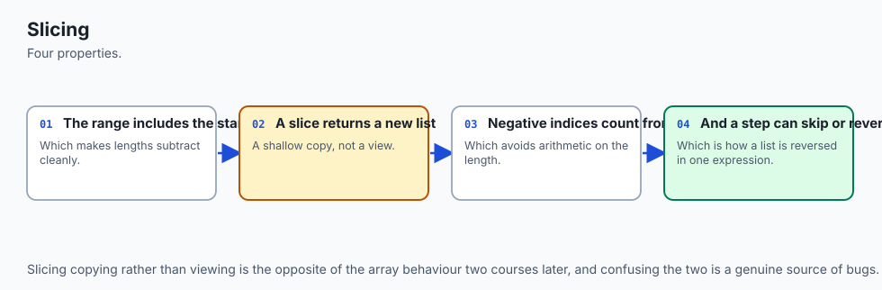

Indexing pulls one item out by position: `nums[0]` is the first, `nums[-1]` the last. Slicing pulls a run of items into a new list with the form `nums[start:stop:step]`. The `start` is included, the `stop` is excluded, and `step` is how far to jump each time. Every part is optional: `nums[:3]` is the first three, `nums[3:]` is everything from index 3 on, `nums[::2]` is every other item, and `nums[::-1]` is the whole list reversed. Because `stop` is excluded, `nums[1:3]` gives you exactly two items (indices 1 and 2) — a rule worth memorising, since off-by-one slips are the most common slicing mistake.

### In-place methods versus new-list functions

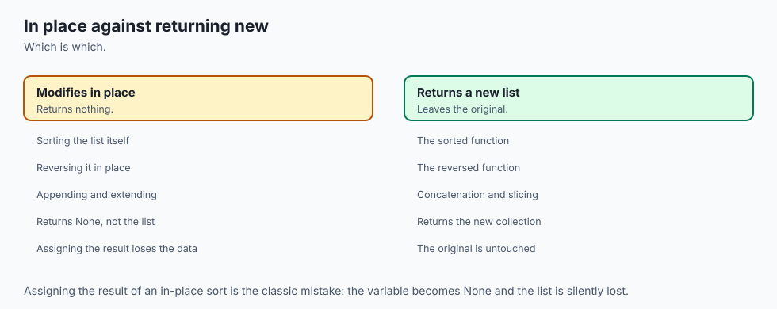

This is the heart of the lesson. Some operations change the list you call them on and return `None`; others leave your list alone and return a new one. Confusing the two is the mutation-surprise bug.


The pipeline in the diagram — build, slice, sort, transform — is the shape of most data code, and at its centre sits the one question you must answer for every step: does this change the list in place, or return a new one? The left branch holds the in-place methods: `a.sort()`, `a.append(x)`, `a.insert(i, x)`, `a.remove(x)`, `a.pop()`, `a.reverse()`, `a.extend(other)`.

Each *mutates* `a`, and the ones that are not obviously retrieving something return `None` — which is why `a = a.sort()` is a classic bug that throws your list away and leaves you holding `None`. The right branch holds the new-list operations: `sorted(a)`, `reversed(a)`, a slice `a[:]`, and a comprehension. Each leaves `a` untouched and hands back something new. The table makes the pairs explicit:

| In-place (mutates, returns `None`) | Returns a new list (original untouched) | What it does |
| --- | --- | --- |
| `a.sort()` | `sorted(a)` | Order the items (optionally by a `key`) |
| `a.reverse()` | `reversed(a)` / `a[::-1]` | Reverse the order |
| `a.append(x)` / `a.extend(b)` | `a + [x]` / `a + b` | Add items to the end |
| `a.insert(i, x)` | `a[:i] + [x] + a[i:]` | Add an item at position `i` |
| `a.remove(x)` / `a.pop(i)` | `[v for v in a if v != x]` | Take an item out |

Sorting deserves a closer look because of the `key` argument. `sorted(words, key=len)` sorts the words by their length: for each word, Python computes `len(word)` and orders by that number, without changing the words themselves. Any function can be a key. And because Timsort is stable, words of equal length keep the order they had — a property you can rely on to sort by two things in turn (sort by the minor key first, then by the major key).

## An everyday analogy

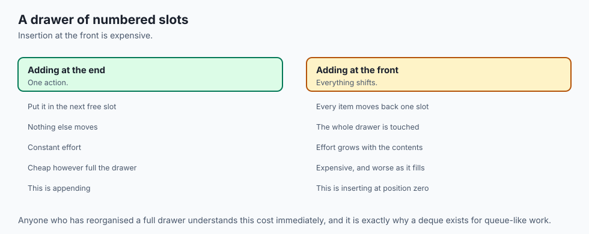

Picture a theatre cloakroom: a long wall of numbered lockers, numbered from zero at the left. This wall is a list, and it behaves exactly like one.

Each locker does not hold your coat directly — it holds a numbered claim ticket that points to where your coat actually hangs in the back. That is the reference model: the slot holds a reference, not the value. Reaching coat number 2 is instant because the lockers are numbered and in a row — the attendant walks straight to locker 2 — just as indexing a list is O(1). Counting from the right end ("the last locker, the second-to-last") is negative indexing. Taking a contiguous run of lockers — "give me lockers 3 through 7" — is slicing, and it produces a separate little rack of those tickets without disturbing the wall.

The cloakroom keeps a few empty lockers spare at the end. When one more coat arrives, the attendant drops its ticket in the next free locker — instant, no fuss. That is `append` into spare capacity. Only when the spare lockers run out must the whole cloakroom move to a bigger wall, carrying every ticket across; it happens rarely, so the *average* cost of checking in a coat stays low. That is amortized O(1), and the bigger wall is the dynamic array growing.

Squeezing a coat into the *middle* is a different story: every ticket after the gap has to shuffle down one locker to make room. That is why `insert` and `remove` in the middle are O(n) — everything after the change has to shift. And "is my coat here?" means the attendant walks the wall checking tickets one by one, which is slower the longer the wall — membership is O(n).

Now the part that catches everyone. Suppose you and a friend share one claim card that represents the whole cloakroom wall. If your friend checks in another coat, *you* see it too when you look, because there is only one wall — that is aliasing (`b = a`). To get your own independent wall, you must photocopy every ticket into a fresh set of lockers — that is copying (`a[:]`).

But here is the subtlety: the photocopied tickets still point at the *same coats* hanging in the back. If a ticket pointed to a bag that itself contained more tickets, both walls would still share that bag. That is shallow versus deep copy — and it is exactly why nested lists need `copy.deepcopy` to become truly independent.

## Examples in practice

Let us work the pipeline end to end with numbers you can re-derive by hand. Start by building and indexing a list of exam scores:

```python
scores = [88, 72, 95, 72, 60, 95, 81]
scores[0]     # 88   — first item
scores[-1]    # 81   — last item
scores[1:3]   # [72, 95]  — indices 1 and 2 (stop excluded)
scores[::2]   # [88, 95, 60, 81]  — every other item (indices 0, 2, 4, 6)
scores[-2:]   # [95, 81]  — the last two
```

Now sort — and watch the in-place-versus-new distinction bite. `sorted` gives a new list and leaves `scores` alone; `.sort()` changes `scores` itself:

```python
sorted(scores)          # [60, 72, 72, 81, 88, 95, 95]  — new list
scores                  # [88, 72, 95, 72, 60, 95, 81]  — unchanged
scores.sort()           # returns None; scores is now sorted in place
scores                  # [60, 72, 72, 81, 88, 95, 95]
```

To get the three highest scores, sort a copy descending and slice off the front — a "sort then slice" that returns a new list without disturbing the data:

```python
sorted(scores, reverse=True)[:3]   # [95, 95, 88]
```

Sorting by a *key* is where real datasets come alive. Given words, order them by length; because the sort is stable, `fig` and `fig` (both length 3) keep their input order, and so do the length-4 words:

```python
words = ["pear", "fig", "apple", "kiwi", "plum", "fig"]
sorted(words, key=len)  # ['fig', 'fig', 'pear', 'kiwi', 'plum', 'apple']
```

Removing duplicates while keeping order is a task lists handle with a short loop. You cannot just make a set, because a set loses the order; instead, keep a result list and add each item only if it is not already present:

```python
def dedupe(items):
    result = []
    for item in items:
        if item not in result:   # membership scan — O(n) per item
            result.append(item)
    return result

dedupe(words)   # ['pear', 'fig', 'apple', 'kiwi', 'plum']
```

Nesting builds a grid. A matrix is a list of rows, each a list of numbers; you iterate it with a loop inside a loop, and you flatten it by appending every inner item into one new list:

```python
matrix = [[1, 2, 3], [4, 5, 6]]
matrix[0][2]    # 3   — row 0, column 2
def flatten(m):
    result = []
    for row in m:
        for item in row:
            result.append(item)
    return result
flatten(matrix) # [1, 2, 3, 4, 5, 6]
```

Finally, the copy-before-mutate discipline, shown as the bug and the fix. The buggy version mutates the caller's list; the safe version copies first:

```python
def add_bad(items, value):
    items.append(value)     # BUG: changes the caller's list
    return items

def add_safe(items, value):
    result = items[:]       # copy first — the caller's list is protected
    result.append(value)
    return result

original = [10, 20, 30]
add_safe(original, 40)  # [10, 20, 30, 40]
original                # [10, 20, 30]  — untouched, because we copied
```

The lab, "List Toolkit," has you build exactly these five functions from a starter and run a test suite that proves, assertion by assertion, that `sorted` returns a new list while `.sort()` mutates, that assignment aliases while a slice copies, and that none of your functions change their input.

## Implications: security, privacy, performance, scalability, and cost

### Security

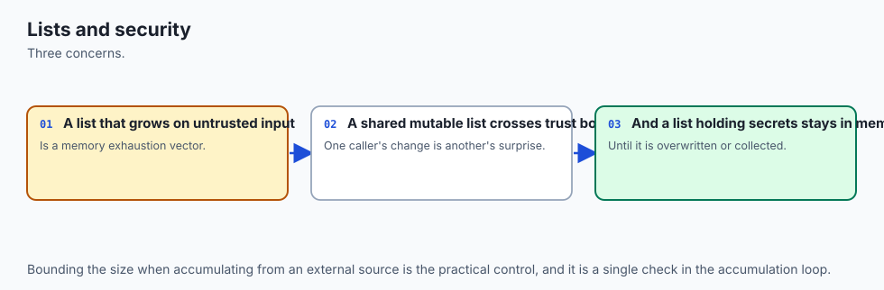

The security story for lists is mostly about integrity: code that mutates shared data without meaning to can corrupt state that other code trusts, and because no error is raised, the corruption is silent. Treating data you receive as read-only — copying before you change it — is a defensive habit that prevents a function from becoming an accidental back door that alters a caller's data.

There is also a well-known trap to avoid: never use a *mutable default argument* like `def f(items=[])`, because that one list is created once and shared across every call, so it accumulates data between calls in ways that look like a security or correctness bug; use `def f(items=None)` and create a fresh list inside instead.

### Privacy

When a list holds records about people, structure decides how auditable your handling is. If a copy of a dataset is passed around and quietly mutated in three places, it is hard to say what happened to whose data. If every transformation returns a new list and the original is treated as immutable, the data flow is a clean chain you can inspect: this list produced that list produced the next. Copy-before-mutate is not only a correctness habit; it is what makes a pipeline's treatment of personal data legible enough to reason about.

### Performance

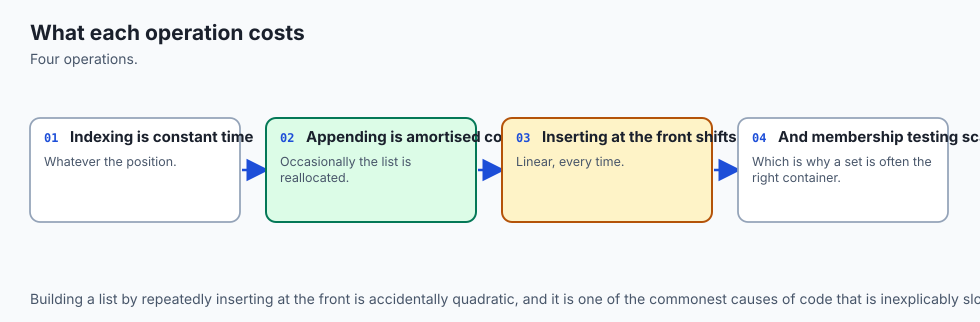

Lists have a precise performance shape, and knowing it is the difference between fast and slow data code. Indexing and appending are cheap; inserting, removing, and membership are not. The table is worth memorising:

| Operation | Cost | Why |
| --- | --- | --- |
| `a[i]` (index) | O(1) | Jump straight to a slot in the contiguous block |
| `a.append(x)` | O(1) amortized | Usually drops into spare capacity; occasionally resizes |
| `a.pop()` (end) | O(1) | Remove the last slot, nothing shifts |
| `a.insert(0, x)` / `a.pop(0)` | O(n) | Every later item shifts by one |
| `x in a` (membership) | O(n) | Scan item by item |
| `len(a)` | O(1) | The length is stored, not counted |

The practical lesson: build lists by appending to the end, not by inserting at the front; and if you find yourself doing many membership tests, a set or dictionary (fast membership) is the right tool. This is also the seed of *why NumPy exists*.

A Python list of a million numbers stores a million separate integer objects plus an array of a million references to them — heavy on memory and slow to do math on, because every operation goes through Python object machinery. A NumPy array stores the numbers themselves packed tightly in one block of one type, so math runs in fast compiled code over contiguous memory. Lists teach you the model; NumPy, in Course 03, makes it fast.

### Scalability

The shape stays the same as data grows, but the costs stop being negligible. An O(n) operation you run once per item becomes O(n²) — a hundred million steps on a ten-thousand-item list — which turns a fast script slow at scale. Choosing the right operation (append, not front-insert; set membership, not list scanning) is what keeps code that worked on a toy dataset working on a real one. And when even the right list operations are too slow or too memory-hungry, that is the signal to move numerical data into arrays.

### Cost

Cost here is compute time and memory, both of which translate to money when code runs on rented machines or over large data. Lists are memory-hungry compared with arrays because of all those separate objects and references; an accidental O(n²) loop is expensive in wall-clock time and therefore in cloud bills. The habits in this lesson — appending rather than inserting, copying deliberately rather than defensively everywhere, reaching for the right container — keep both bills down.

## Alternatives: free, open source, and commercial

Everything relevant here is free and open source; the "alternatives" are other containers and the array libraries you graduate to, each with a clear when-to-choose-it.

| Tool / type | When to choose it | How you use it | Cost |
| --- | --- | --- | --- |
| **`list`** (built-in) | Ordered, changeable collection you build, index, slice, and sort | `xs = []; xs.append(v); xs[1:3]; xs.sort()` | Free, built in |
| **`tuple`** (built-in) | Fixed record that must not change; safe as a dict key | `point = (3, 4)` — immutable, so it cannot be mutated by accident | Free, built in |
| **`set`** (built-in) | Fast membership and uniqueness, order not needed | `seen = set(); v in seen` is O(1), not O(n) | Free, built in |
| **`collections.deque`** | Fast adds/removes at *both* ends (a queue) | `from collections import deque; q.appendleft(v)` — O(1) at the front | Free, standard library |
| **`array.array`** | Many numbers of one type, tighter memory than a list | `from array import array; a = array('i', [1, 2, 3])` | Free, standard library |
| **NumPy `ndarray`** | Large-scale numerical work — vectors, matrices, tensors | `import numpy as np; np.array([1, 2, 3]) * 2` runs in fast compiled code | Free, open source (Course 03) |

For everyday "hold things in order and change them," the built-in list is the right and only tool you need today. Reach for a tuple when a sequence must be fixed, a set when you test membership a lot, a `deque` when you add and remove at the front, and NumPy when you do serious math on many numbers. There is no commercial product to buy here; the entire toolkit is free and open source, which is one of Python's quiet strengths for AI work.

## Comparison with related concepts

| Concept A | Concept B | Key difference |
| --- | --- | --- |
| List | Tuple | A list is mutable (change it after making it); a tuple is immutable (fixed once made) — so tuples are safe as dict keys and as records that must not change |
| List | Set | A list is ordered and allows duplicates; a set is unordered, unique, and tests membership in O(1) instead of O(n) |
| `a.sort()` | `sorted(a)` | `.sort()` mutates `a` in place and returns `None`; `sorted(a)` returns a new sorted list and leaves `a` untouched |
| `b = a` (alias) | `c = a[:]` (copy) | An alias is a second name for one list — changes show through both; a copy is a separate list — changes to one do not affect the other |
| Shallow copy (`a[:]`) | Deep copy (`copy.deepcopy(a)`) | A shallow copy duplicates the outer list but shares nested lists; a deep copy duplicates everything, all the way down |
| `append` at the end | `insert(0, x)` at the front | Appending is O(1) amortized; inserting at the front is O(n) because every existing item shifts by one |

## When to use it — and when not to

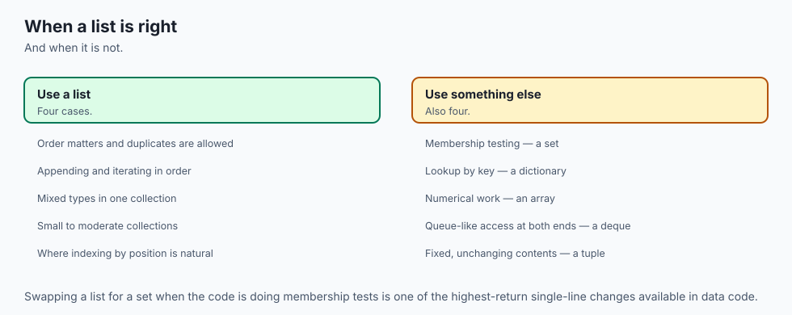

Use a list whenever you need an ordered collection you will change: build it up by appending as data arrives, index and slice it, sort it, and reorder it. That covers the great majority of "several things in order" needs in ordinary Python — reading records, collecting results, representing rows and grids, holding a batch. When you are working within the reference model, make the copy-or-not decision consciously: if a function must not disturb a list it was handed, copy at the boundary; if returning a new list is natural, prefer it, because immutable-by-habit data is easier to reason about.

Reach for something else when a list's shape fights your task. If a collection must never change — a fixed configuration, a coordinate pair, a dictionary key — use a tuple, whose immutability is a feature. If you test membership constantly or need uniqueness, use a set, and pay O(1) instead of O(n). If you add and remove at the front, use a `collections.deque`.

And when you are doing real numerical work on many values — the vectors, matrices, and tensors of machine learning — a Python list is the wrong tool for the final job: its per-element object overhead makes it slow and heavy, and you move the data into a NumPy array. The professional skill is matching the container to the access pattern, and lists are the default you deviate from only for a reason.

Here is where today points. Every dataset you load, every batch you feed a model, every sequence of tokens a language model consumes, and every feature vector you assemble begins life as a list. The reference model you learned today is what keeps those lists from being silently corrupted: knowing that a function can mutate a list you pass it, and copying before you mutate, is the difference between a data pipeline you can trust and one that quietly poisons a training run. The performance shape you learned — cheap append, expensive middle-insert, O(n) membership — is what tells you when a list is the right container and when it is time to reach for a set or an array.

And the whole picture is the on-ramp to NumPy in Course 03: NumPy is fast precisely because it drops the flexibility of a list of references in favour of a tight array of numbers, and you now understand exactly what trade it is making. Master the list, and the arrays, tensors, and datasets ahead are built on ground you already know.

## The AI connection

- **Lists are the default container**, and knowing their costs prevents accidentally quadratic
  code.
- **Insertion at the front is expensive and at the end is cheap**, which is a difference that
  matters at scale.
- **Slicing copies**, which is a source of both bugs and memory surprises.
- **Every batch of training examples is a list before it becomes a tensor**, so the mental
  model carries directly.
- **Mutable default arguments** are the most notorious trap in the language, and lists are
  where it usually appears.

## Knowledge check

Try these from memory before looking back:

1. Given `nums = [5, 10, 15, 20, 25]`, state the result of `nums[1:4]`, `nums[-1]`, `nums[::2]`, and `nums[::-1]`, and explain why `nums[1:4]` has three items, not four.
2. Explain the difference between `a.sort()` and `sorted(a)` in terms of what each returns and what happens to `a`. Why is `a = a.sort()` a bug?
3. After `a = [1, 2, 3]; b = a; b.append(4)`, what is `a`, and why? Rewrite the second line so that changing `b` does not affect `a`.
4. Define shallow copy and deep copy, and give one concrete case where a shallow copy is not enough.
5. Rank these by cost and say why: indexing `a[i]`, appending `a.append(x)`, inserting `a.insert(0, x)`, and testing `x in a`.
6. Explain in one sentence why a Python list is slower and heavier than a NumPy array for numerical work, using the words "reference" and "contiguous."

## Hands-on exercise

Time to build the toolkit. In the Day 52 lab you will assemble the "List Toolkit" from a starter file, one exercise at a time, then run an automated test suite that proves in-place versus new-list behaviour. Work in the lab directory; every command below is run from there.

First, read the finished reference so you know the target, then run its demo pipeline:

```bash
python3 examples/toolkit.py
```

It builds a list of scores and prints the results of slicing, sorting by a key, deduping, flattening, and safely copying. Now prove a single function is importable and reusable on its own — the payoff of the main guard from Day 49 — by calling one without running the whole program:

```bash
python3 -c "import sys; sys.path.insert(0, 'examples'); import toolkit; print(toolkit.dedupe([1, 1, 2, 1, 3]))"
```

Then open `starter/toolkit.py` and complete its five numbered exercises — `dedupe`, `flatten`, `sort_by_length`, `top_n`, and `with_appended` — using the reference only when stuck. Run your version and then the tests:

```bash
python3 starter/toolkit.py
bash tests/run_tests.sh
```

### Expected output

A correct run of the reference program looks exactly like this:

```text
$ python3 examples/toolkit.py
built:    [88, 72, 95, 72, 60, 95, 81]
top 3:    [95, 95, 88]
stride:   [88, 95, 60, 81]
last 2:   [95, 81]
by len:   ['fig', 'fig', 'pear', 'kiwi', 'plum', 'apple']
unique:   ['pear', 'fig', 'apple', 'kiwi', 'plum']
flat:     [1, 2, 3, 4, 5, 6]
grown:    [10, 20, 30, 40]
original: [10, 20, 30]
```

The last two lines are the point: `grown` gained a `40`, but `original` did not, because `with_appended` copied the list before appending. The output is deterministic — Python's stable sort guarantees the `by len:` order — so your numbers will match exactly.

### Validate your work

You are done when you can check every box:

- [ ] `python3 examples/toolkit.py` prints the pipeline above, with `original:` still `[10, 20, 30]`.
- [ ] The `python3 -c` import one-liner prints `[1, 2, 3]`.
- [ ] Your completed `starter/toolkit.py` prints the same output as the reference.
- [ ] `bash tests/run_tests.sh` ends with `0 failure(s)` and exits `0` (`echo $?` shows `0`).
- [ ] The test's `in-place vs new-list` check passes — proving `sorted` returns new while `.sort()` mutates, and a slice copies while assignment aliases.

### Troubleshooting

- **`python: command not found`.** Use `python3` explicitly, as every command here does; on macOS and most Linux systems bare `python` may be missing.
- **The starter raises `NotImplementedError`.** That is expected until you finish each exercise; replace the `raise NotImplementedError(...)` line with the real body described in the comment above it.
- **`ModuleNotFoundError: No module named 'toolkit'` in the import test.** Run it from the lab directory (the folder containing `examples/`); the one-liner inserts `examples` onto `sys.path` first.
- **Your `with_appended` changed the original list.** You appended to the input instead of a copy. Write `result = items[:]` first, then append to `result`, then return `result`.
- **`.sort()` gave you `None`.** That is correct — `.sort()` sorts in place and returns `None`. If you want a value to assign, use `sorted(items)` instead.

### Common mistakes

- **Assuming `b = a` copies.** It aliases. Every later "why did my original change?" bug traces back to a missing copy; use `a[:]`, `list(a)`, or `a.copy()`.
- **Mutating a list you were handed.** A function that calls `.append` or `.sort` on its argument changes the caller's data silently. Copy at the boundary when the caller must be protected.
- **Front-inserting in a loop.** `insert(0, x)` is O(n); doing it in a loop is O(n²). Append to the end and reverse once at the end if you need the other order.

## Practice assignment

Extend the toolkit with two more functions of your own, keeping every one pure — new list out, input untouched — and add a test for each. First, write `chunk(items, size)` that splits a list into a list of smaller lists of length `size`, so `chunk([1, 2, 3, 4, 5], 2)` returns `[[1, 2], [3, 4], [5]]`; this is exactly the operation that turns a dataset into training batches, so name the connection in a comment. Second, write `deep_flatten(nested)` that flattens *arbitrarily* nested lists (a list inside a list inside a list) into one flat list, and compare it with the one-level `flatten` from the lab on an input like `[1, [2, [3, 4]], 5]`.

For each function, add at least two assertions to a small test — one checking the returned value and one checking that the input list is unchanged after the call — and run them with a `python3 -c` one-liner or a short test file. Finally, write three sentences in a comment explaining, for one of your functions, whether it mutates or returns new, and how you know.

## Extension challenge

Make the reference model unmistakable by building a demonstration that shows shallow and deep copies diverging. Create a matrix `grid = [[1, 2], [3, 4]]`, then make three things from it: an alias `alias = grid`, a shallow copy `shallow = grid[:]`, and a deep copy `deep = copy.deepcopy(grid)` (import `copy` first). Now mutate one inner list — `grid[0].append(99)` — and print all four (`grid`, `alias`, `shallow`, `deep`). Predict each result before you run it, then explain what you see: the alias changes (same list), the deep copy does not (fully independent), and — the instructive part — the *shallow* copy also changes, because it duplicated only the outer list and still shares the inner lists.

Then add a second experiment that mutates the *outer* list instead (`grid.append([5, 6])`) and show that this time the shallow copy is unaffected, because the outer lists are now separate. Write a short paragraph tying the two experiments together into a single rule for when a shallow copy is enough and when you need a deep one — the rule you will apply every time you copy a batch of records or a matrix of features in the AI work ahead.