## Why this matters

Almost everything you will ever do with data in Python, and almost everything an AI system does when it talks to the outside world, is a lookup: given a name, find the thing. Given a user id, find their record. Given a word, find how many times it appeared. Given the key `"temperature"`, find the setting `0.7` you are about to send to a model.

The tool Python gives you for this exact job — store a thing under a label, then fetch it back instantly by that label — is the **dictionary**, and it is the most important collection type you will learn in this course. Lists came first because they are simple, but dictionaries are where real data work lives.

The reason to learn them *in depth*, rather than just enough to get by, is that the difference between using a dictionary well and using it badly is measured in real consequences: speed, correctness, and how often your program crashes on data you did not expect. A dictionary can find a value among a million keys in about the same time it takes to find one among ten — that is the "average O(1)" property this lesson will explain and that you will feel the moment you count words in a large file.

Reach for the wrong access pattern, though, and your program throws a `KeyError` and dies the first time a key is missing; reach for the right one and it handles the gap gracefully. Those are not academic distinctions. They are the difference between a data-cleaning script that finishes and one that halts halfway through your dataset.

Here is the direct line to your AI goal. When you call a model's API, you send it a **dictionary** of settings and receive a **dictionary** — a JSON payload — of results. A model's configuration is a dictionary. The vocabulary that turns words into the numbers a neural network eats is a dictionary mapping each token to an id.

The feature record you feed a classifier is a dictionary of field names to values. Word counts, the "hello world" of text processing that sits under everything from spam filters to search, are a dictionary. Learn dictionaries thoroughly today and the data-wrangling and model-I/O work ahead will feel like arranging tools you already own; skip the depth and you will fight the same three bugs for months.

## The idea in plain language

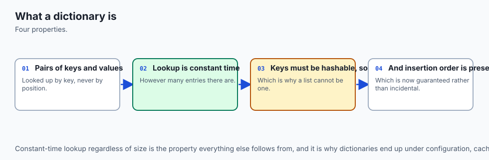

A dictionary is a collection that stores **pairs**: each pair has a **key** and a **value**, and the dictionary lets you look up the value by giving it the key. You have met this idea in the physical world your whole life. A real dictionary maps a word (the key) to its definition (the value). A phone's contacts map a name to a number. A coat-check ticket maps a number to your coat. In Python the syntax is a pair of braces with `key: value` pairs inside, separated by commas: `counts = {"cat": 4, "dog": 2}`. To get a value you write the key in square brackets: `counts["cat"]` gives back `4`.

What makes a dictionary different from a list is *how you find things*. In a list you find an item by its position — `scores[0]`, `scores[1]` — and to find a particular value you often have to walk through every item checking each one. In a dictionary you find a value by its key directly, and the dictionary jumps straight to it without checking the others.

The list is a numbered row of lockers; the dictionary is a set of lockers labelled with whatever names you choose, plus a way to go straight to the labelled locker you want. That "go straight to it" is the whole point, and it is why a dictionary is the right tool whenever your data is naturally *keyed* — organised by name, id, or label rather than by order.

Three operations cover most of what you will ever do: **put a value in** under a key (`counts["bird"] = 1`), **get a value out** by its key (`counts["bird"]`), and **ask whether a key is present** (`"bird" in counts`). Around those three sit a handful of safer and richer patterns — reading with a default when a key might be missing, updating many pairs at once, looping over all the pairs — that turn the basic idea into a genuinely powerful tool. The rest of this lesson is those patterns, plus the beautiful machine underneath that makes the lookups fast.

## Historical background

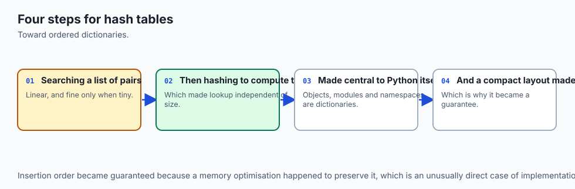

The idea a dictionary implements — the **associative array**, a collection indexed by arbitrary keys rather than by consecutive integers — is older than Python and predates most programming languages you have heard of. The technique that makes it fast, **hashing**, was invented at the very start of the computer era. The now-standard method of turning a key into an array position and handling clashes by chaining was described by Hans Peter Luhn, an engineer at IBM, in an internal memorandum in **January 1953** — one of the foundational ideas of computing, and still the beating heart of the dictionary you will use today.

Associative arrays became a first-class, built-in language feature over the following decades. The language **SNOBOL** in the 1960s and **AWK** in 1977 built tables of this kind directly into the language. When Guido van Rossum designed Python, first released in **1991**, he made the dictionary — internally called `dict` — one of the core built-in types and wove it through the language's own machinery: a Python object's attributes, a module's namespace, and the local variables in a function are, under the hood, dictionaries. Learning `dict` is therefore learning something Python itself is built out of.

One historical change matters enough to call out because it affects code you write today. For most of Python's life, dictionaries did **not** promise to remember the order you inserted keys in; iterating a dictionary could hand the pairs back in any order. That changed with **CPython 3.6** (2016), where insertion-order preservation appeared as an implementation detail, and **Python 3.7** (2018), which made it an official language guarantee: iterate a modern dictionary and you get the keys back in the order you added them.

Every version you will use in this course is 3.7 or newer, so you can rely on that order — but you should know it is a relatively recent promise, because older code and older tutorials sometimes reach for a separate `OrderedDict` type that ordinary dictionaries have now made unnecessary for this purpose.

## What it is — and what it is not

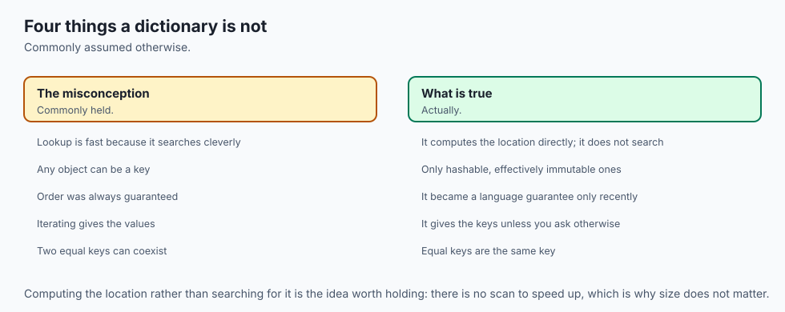

A dictionary is Python's built-in **mapping** type: a mutable collection of key–value pairs in which each key appears at most once and maps to exactly one value, with fast lookup, insertion, and deletion by key, and (in Python 3.7+) preserved insertion order. Its keys must be **hashable** — a property we will define precisely in a moment — while its values can be anything at all, including other dictionaries.

It helps to be clear about what a dictionary is *not*, because beginners routinely expect the wrong thing.

| Common misconception | The reality |
| --- | --- |
| "A dictionary is sorted by key." | It is not sorted. It preserves *insertion* order (3.7+), which is not the same as alphabetical or numeric order. Sort explicitly with `sorted()` when you need order. |
| "Any object can be a key." | Only **hashable** objects can. Strings, numbers, and tuples of those work; lists, dictionaries, and sets cannot be keys because they are mutable. |
| "Keys can repeat." | Keys are unique. Assigning to an existing key **overwrites** the old value rather than adding a second pair. |
| "`d[key]` is safe to read." | Reading a missing key with `[]` raises `KeyError` and stops the program. Use `.get()` or `in` when a key might be absent. |
| "Dictionaries and JSON objects are the same thing." | They are close cousins and convert cleanly, but JSON keys are always strings and JSON has no tuples; a `dict` is the in-memory Python object, JSON is the text format. |

A dictionary is also not a general "database." It lives in memory, disappears when your program ends, and offers exactly one way to find things: by exact key. If you need to find records by a *range* of values, by partial match, or persisted to disk with many simultaneous writers, you have outgrown a plain dictionary and want a real database — a distinction we return to when we discuss when *not* to use one.

## Why it was created and what problems it solves

To feel why dictionaries exist, try to live without one. Suppose you want to count how many times each word appears in a piece of text, using only a list. You would keep a list of `[word, count]` pairs, and for every word in the text you would walk the entire list looking for a matching entry, incrementing it if found and appending it if not. That search-the-whole-list step runs for every single word, so counting a document of *n* words against a vocabulary of *m* distinct words costs on the order of *n × m* operations. On a large file this is agonisingly slow, and the code is fiddly and easy to get wrong.

The dictionary solves exactly this. Because it finds a key directly instead of scanning, incrementing a word's count is a single fast step regardless of how many distinct words you have already seen. The whole count becomes roughly *n* operations instead of *n × m* — the difference between a script that finishes instantly and one you abandon. This is not a niche trick; "given a key, get or update its value quickly" is the shape of an enormous fraction of all data work, which is why the dictionary is built into the language and optimised heavily.

The second problem it solves is **clarity**. Data that is naturally labelled — a person's `name`, `email`, and `age` — is painful to carry in a list, where you must remember that position 0 is the name and position 2 is the age, and every reader of your code must remember it too. A dictionary lets you write `person["email"]`, which says what it means. Code built from dictionaries reads like the domain it models, and self-describing code has fewer bugs because the names check your intent. Speed and clarity together are why, once you have dictionaries, you will reach for them constantly.

## How it works

The magic is a data structure called a **hash table**, and its idea is worth understanding because it explains every rule about dictionaries you will otherwise have to memorise.


Follow the diagram left to right. When you write `counts["cat"]`, Python does not search. It first calls a built-in function `hash("cat")`, which runs the key through a fixed mathematical recipe and returns a large, seemingly random integer. It then reduces that integer down to one of a small number of slots — call them **buckets** — by taking the remainder when divided by the number of buckets (`hash("cat") % number_of_buckets`).

That remainder is an array index, and Python jumps *straight* to that bucket in memory and finds the stored pair. No scanning. One hash, one jump. Because the work does not grow as the dictionary grows, we say lookup is **O(1) on average** — "constant time" — which is the property that makes dictionaries so fast that a lookup among ten million keys costs about the same as a lookup among ten.

### Hashable keys, and why some objects cannot be keys

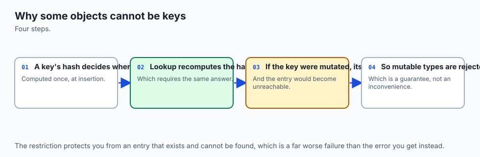

This machine only works if a key's hash never changes for as long as it sits in the dictionary. If `hash("cat")` gave one number when you stored the value and a different number when you looked it up, Python would compute the wrong bucket and never find the pair. That is the whole reason keys must be **hashable**: an object is hashable if it has a hash value that stays fixed over its lifetime (and if two equal objects share the same hash). Python's immutable built-ins qualify — strings, integers, floats, booleans, and tuples built out of those — so they make fine keys.

Mutable objects do not: a **list**, a **set**, or another **dictionary** can change after you create it, which would silently break the bucket it was filed under, so Python forbids them as keys and raises `TypeError: unhashable type` if you try. This single rule — keys must be immutable so their hash is stable — falls straight out of how the table works, rather than being an arbitrary restriction to memorise.

### Collisions, and what breaks the speed

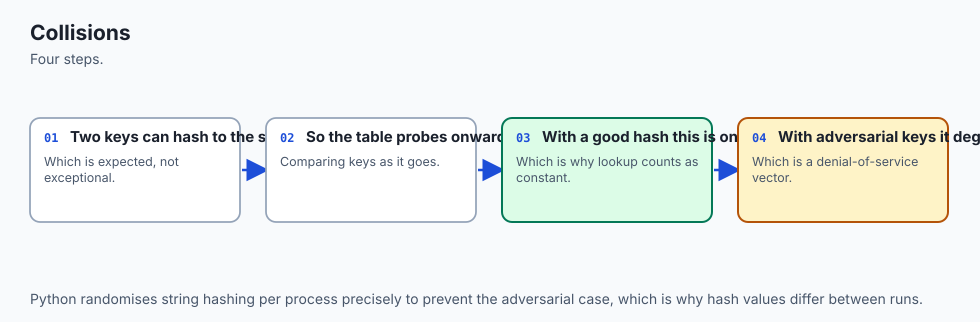

What if two different keys reduce to the same bucket? This is a **collision**, and it is unavoidable because there are far more possible keys than buckets. Python handles it gracefully: it stores more than one pair per bucket and, on lookup, checks the handful of pairs in that bucket one at a time using equality. Collisions are rare and cheap when the hash spreads keys evenly, so average lookup stays O(1). But the guarantee is only *average*: if a hash function sent every key to the same bucket, every lookup would degrade into scanning that one long bucket — O(n), the slow behaviour we were trying to escape.

Python's string hashing is good and even randomised per run to resist deliberate attacks, so you will not hit this by accident, but knowing that a pathological hash *can* ruin the speed is what turns "dictionaries are fast" from a magic incantation into an understood fact.

### Choosing an access pattern

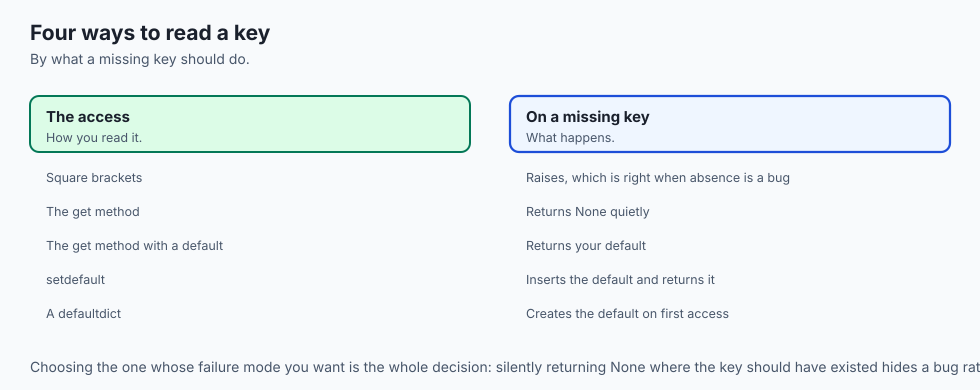

Once you trust the lookup, the day-to-day skill is choosing *how* to reach into the dictionary, because Python gives you several ways and they behave differently when a key is missing.


The flowchart captures the decision. Reading a key you are certain exists: use `d[key]` — it is the fastest and, crucially, it *raises `KeyError`* if the key is absent, which is exactly what you want when a missing key means a real bug you would rather hear about loudly. Reading a key that might be missing: use `d.get(key, default)`, which returns your chosen default (or `None` if you give none) instead of raising. Just asking whether a key is present: use `key in d`, which returns `True` or `False` and is itself an O(1) hash lookup.

Writing: `d[key] = value` adds the pair or overwrites an existing one, and `d.update(other)` merges many pairs from another dictionary at once. And the pattern that powers counting and grouping — `d.setdefault(key, [])` — installs a default value the *first* time a key is seen and returns whatever is there so you can build it up. We will see each in action next.

## An everyday analogy

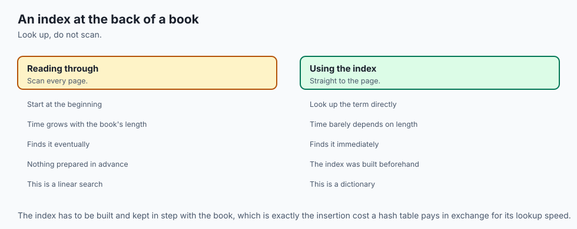

Picture a theatre cloakroom, but an unusually clever one. In an ordinary cloakroom the attendant hangs your coat on any free hook and hands you a numbered ticket; to get your coat back you return the ticket and the attendant walks the rack until they find hook 47. Our clever cloakroom is different: instead of a random ticket, the attendant runs your **name** through a fixed rule that instantly turns it into a hook number, and hangs your coat there. When you come back and say your name, the attendant runs the same rule, gets the same hook number, and walks *straight* to your coat. No searching the rack.

Every part of a dictionary has a home in this picture. Your **name** is the **key**; your **coat** is the **value**; the whole cloakroom is the **dictionary**. The attendant's name-to-number rule is the **hash function**, and the hooks are the **buckets**. Going straight to your hook instead of searching the rack is the **average O(1) lookup**. Because the rule must give the same number every time you visit, your name has to be something stable — this is exactly why keys must be **hashable and immutable**. You could not use "the coat I happen to be thinking of" as your identifier, because it changes; a mutable list fails as a key for the same reason.

Asking the attendant "is there anything under my name?" is **membership** (`key in d`). And once in a while two different names produce the same hook number — a **collision** — so the attendant keeps the few coats that share a hook together and glances at their tags to pick yours; rare, and quick, unless a broken rule dumped every coat on one hook, which is the O(n) worst case. Keep this cloakroom in mind and the rules of dictionaries stop being a list to memorise and become obvious consequences of how the room works.

## Examples in practice

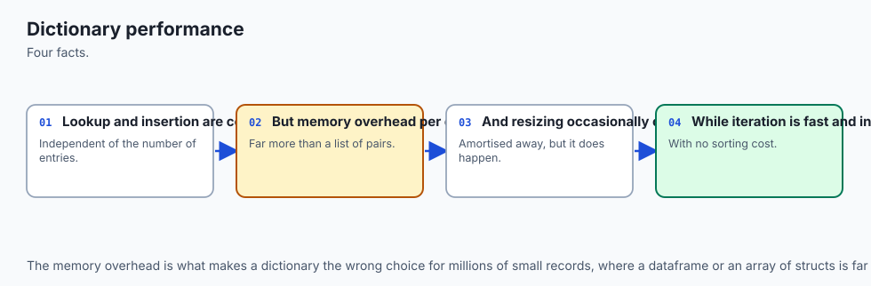

Let us build the patterns you will actually use, checking every result by hand. Start with creating and basic access:

```python
counts = {"cat": 4, "dog": 2}
print(counts["cat"])        # 4  — direct lookup by key
counts["bird"] = 1          # add a new pair
counts["dog"] = 3           # overwrite: keys are unique
print("cat" in counts)      # True — membership, an O(1) hash lookup
print(counts.get("fish"))       # None  — missing key, no crash
print(counts.get("fish", 0))    # 0     — supply your own default
```

Reading `counts["fish"]` would instead raise `KeyError: 'fish'` and stop the program, which is why `.get()` exists for the "might be missing" case. Now the single most useful idiom in all of text processing — **counting** — written two clean ways:

```python
text = "cat dog cat bird cat dog"
counts = {}
for word in text.split():
    counts[word] = counts.get(word, 0) + 1
print(counts)   # {'cat': 3, 'dog': 2, 'bird': 1}
```

Read the key line slowly: `counts.get(word, 0)` returns the running count for `word`, or `0` if this is the first time we have seen it; we add one and store it back. The first time `"cat"` appears, `get` returns `0`, we store `1`; the second time it returns `1`, we store `2`; the third, `3`. No key ever needs to be created "by hand," and there is no `KeyError` to guard against. **Grouping** is the same shape but collecting into lists, and this is where `setdefault` shines:

```python
words = ["apple", "avocado", "banana", "cherry", "blueberry"]
by_letter = {}
for word in words:
    by_letter.setdefault(word[0], []).append(word)
print(by_letter)   # {'a': ['apple', 'avocado'], 'b': ['banana', 'blueberry'], 'c': ['cherry']}
```

`setdefault(word[0], [])` says "give me the list stored under this first letter, creating an empty one if it is not there yet," and we immediately `.append()` to whatever it returns. The empty list is created exactly once per letter. Iterating a dictionary uses three views — `.keys()`, `.values()`, and the one you will reach for most, `.items()`, which hands back each pair:

```python
for word, n in counts.items():
    print(f"{word}: {n}")
# cat: 3
# dog: 2
# bird: 1     (order is insertion order — the order words first appeared)
```

A **dict comprehension** builds a new dictionary from an existing iterable in one expression, mirroring the list comprehensions you will meet nearby — here, keeping only the words that appear more than once:

```python
frequent = {word: n for word, n in counts.items() if n > 1}
print(frequent)   # {'cat': 3, 'dog': 2}
```

Finally, **nested dictionaries as records**: a dictionary whose values are themselves dictionaries is how you model a small table of structured data.

```python
people = {
    "u1": {"name": "Ada", "role": "engineer"},
    "u2": {"name": "Grace", "role": "admiral"},
}
print(people["u1"]["name"])   # Ada  — reach in by two keys
people["u1"]["role"] = "lead engineer"   # update a nested field
```

This is precisely the shape of a JSON API response and of a configuration file, which is why these five patterns — safe access, counting, grouping, comprehension, and nested records — are the entire backbone of the data work ahead.

## Implications: security, privacy, performance, scalability, and cost

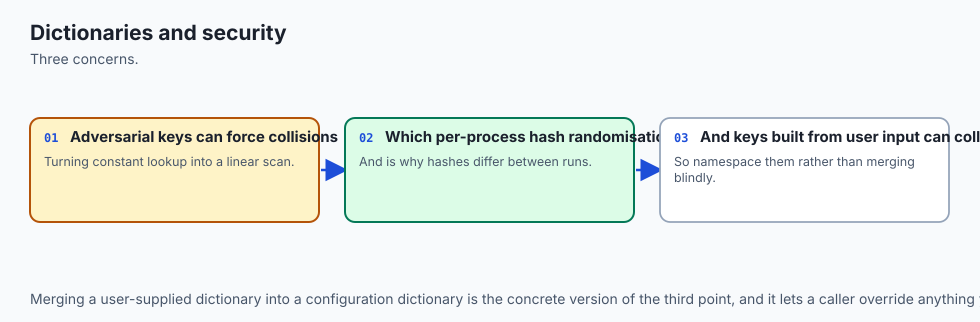

**Security.** The dictionary's own security story is small but real: because a naive hash could be exploited by an attacker who deliberately sends keys that all collide into one bucket (turning your fast O(1) lookups into a slow O(n) crawl and choking your program — a "hash-flooding" denial of service), Python **randomises string hashing** on each run by default.

You benefit from this for free; the lesson is simply not to disable that randomisation and not to rely on the exact numeric value of `hash()` across runs. More broadly, dictionaries built from untrusted input (a parsed JSON request) should have their keys and values validated at the boundary, exactly as you validated input on Day 49 — never trust that an incoming payload has the keys you expect; use `.get()` with defaults or check `in` first.

**Privacy.** Dictionaries are where structured personal data naturally lands — a `person` record with `name`, `email`, and more. Because the data is labelled, a dictionary makes it *easy to see and control* what you hold: you can loop the keys to redact sensitive fields, or build a new dictionary with a comprehension that drops the fields you must not log. Clear structure makes a privacy promise auditable in a way tangled data never is.

**Performance.** This is the dictionary's headline. Lookup, insertion, deletion, and membership are all **O(1) on average** — constant time, independent of size — where the same operations on a list are O(n) because a list must scan. The trade is memory: a hash table keeps spare empty buckets so collisions stay rare, so a dictionary uses more memory than a bare list of the same data. You are spending space to buy speed, which is almost always the right trade for keyed lookup.

**Scalability.** The constant-time property is exactly what lets dictionary-based code scale. A word counter written with a dictionary handles a document ten times larger in roughly ten times the work (linear in the text), not a hundred times; a list-based counter would blow up quadratically. When your data grows, the difference between an O(1) and an O(n) inner operation is the difference between a program that keeps up and one that falls over.

**Cost.** Cost here is compute time and memory, and the two pull opposite ways. Dictionaries turn slow scans into fast lookups, saving CPU time (and, in the cloud, money) on any keyed workload; they cost more memory than a list. For the sizes you meet in this course the memory is trivial and the speed is decisive, so the dictionary wins — but at extreme scale, where billions of tiny records must fit in RAM, engineers sometimes trade a dictionary's convenience for a more compact structure, a real engineering decision you should know exists.

## Alternatives: free, open source, and commercial

Everything here ships free with Python's standard library; the "alternatives" are specialised dictionaries and neighbouring tools, and the skill is knowing when each earns its place.

| Tool | What it offers | When to choose it | Cost |
| --- | --- | --- | --- |
| Built-in `dict` | The general mapping: fast keyed access, insertion order, any hashable key | The default for essentially all keyed data | Free (standard library) |
| `collections.Counter` | A dict subclass built for counting: `Counter(words)` counts in one call, and `.most_common(n)` ranks | Any tallying or frequency task | Free (standard library) |
| `collections.defaultdict` | A dict that auto-creates a default value for a missing key, so grouping needs no `setdefault` | Building lists/sets/counts per key in a loop | Free (standard library) |
| `collections.OrderedDict` | The historical ordered mapping, with a few order-specific methods | Rarely now — plain `dict` preserves order since 3.7 | Free (standard library) |
| `json` module | Converts between a `dict` and JSON text | Reading API payloads and config files into dicts | Free (standard library) |
| A real database (SQLite, PostgreSQL) | Persistent, queryable-by-range, multi-writer storage | When data must outlive the program or be queried richly | SQLite free; others free/commercial |

Two of these deserve a concrete look because you will use them constantly. `Counter` turns the whole counting idiom into one line — `from collections import Counter; Counter("cat dog cat".split())` gives `Counter({'cat': 2, 'dog': 1})`, and `.most_common(1)` returns `[('cat', 2)]`. `defaultdict` removes the `setdefault` ceremony from grouping: `from collections import defaultdict; groups = defaultdict(list)` lets you write `groups[word[0]].append(word)` directly, because a missing key auto-creates an empty list. Both are dict subclasses — everything you learn about `dict` applies unchanged — so they are refinements, not replacements. Learn the plain `dict` idioms first (this lesson), then reach for these when they make the code plainer.

## Comparison with related concepts

| Concept A | Concept B | Key difference |
| --- | --- | --- |
| Dictionary | List | A dict finds values by arbitrary key in O(1); a list finds by integer position and scans in O(n) to find a value. Choose a dict when data is keyed, a list when it is ordered/sequential |
| Dictionary key | Dictionary value | Keys must be unique and hashable (immutable); values may repeat and be any type at all, including lists or other dicts |
| `d[key]` | `d.get(key)` | `[]` raises `KeyError` on a missing key (loud, good when it must exist); `.get()` returns `None` or a default (safe, good when it might be absent) |
| `dict` | `set` | Both use a hash table for O(1) membership; a set stores only keys (unique values, no mapping), a dict maps each key to a value |
| `dict` | JSON object | A `dict` is the in-memory Python object with any hashable keys; JSON is text with string-only keys, the wire format that dicts convert to and from |
| Insertion order | Sorted order | A dict preserves the order keys were *added* (3.7+); it is not alphabetically or numerically sorted — use `sorted()` explicitly for that |

## When to use it — and when not to

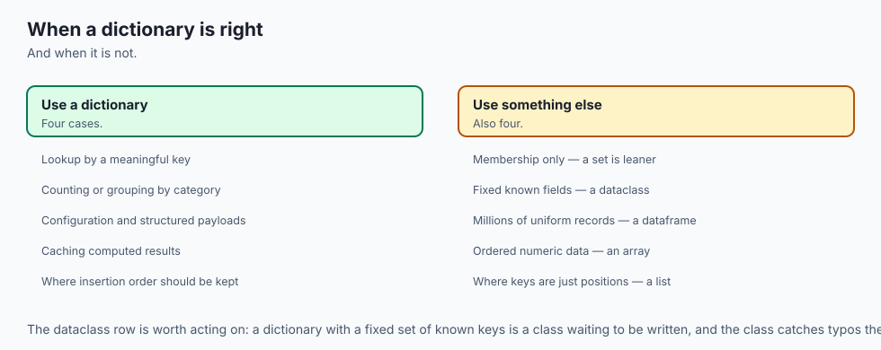

Reach for a dictionary whenever your data is naturally **keyed** — organised by a name, id, or label rather than by position — and whenever you need fast lookup, counting, grouping, or a record of labelled fields. That covers a huge share of everyday programming: configuration, counts, caches, lookups from an id to a record, any JSON you parse, and the feature and vocabulary structures of machine learning. If you catch yourself scanning a list to find an item by some field, that is almost always a signal to build a dictionary keyed by that field instead and turn an O(n) scan into an O(1) lookup.

There are honest cases where a dictionary is the wrong tool. When order and sequence are the point and you only ever process items front to back — a queue of jobs, a line-by-line log — a **list** is simpler and lighter. When you need to test membership fast but store no associated value, a **set** says what you mean. When you need to find records by a *range* ("all users older than 30"), by partial or fuzzy match, or sorted on demand, a dictionary's single exact-key door is not enough and you want a **database** or a sorted structure.

And when data must **persist** beyond one run or be written safely by several programs at once, a dictionary — which lives only in memory and vanishes when the program ends — is the wrong home; save it to a file or a database. The professional instinct is to match the structure to the access pattern: keyed and in-memory means dictionary; ordered means list; range-queried or persistent means database.

This connects directly to where you are heading. Every serious AI workflow is a pipeline of dictionaries. You will load a **configuration** dictionary of model settings; parse an incoming request into a **dictionary** and validate its keys; look up tokens in a **vocabulary** dictionary that maps each word or subword to an integer id the model can process; assemble a **feature** dictionary for a record you want classified; and read the model's answer back out of the **JSON dictionary** it returns.

The word-frequency counter you build in today's lab is not a toy — it is the exact machinery underneath text search, spam detection, and the term-frequency features that classical language models are built from. Master the dictionary and its access patterns now, and the data-wrangling and model-I/O work that fills the rest of this course becomes a matter of arranging tools you already understand.

## The AI connection

- **Dictionaries are the most used structure in Python**, and constant-time lookup is why.
- **Configuration, JSON responses and model outputs are all dictionaries**, which makes
  fluency here unavoidable.
- **Key ordering is now guaranteed**, which changed what can safely be relied on.
- **Hashing is what makes lookup fast**, and understanding it explains which types can be keys.
- **Every API payload and every model config** is a nested dictionary, so navigating them
  cleanly is a daily skill.

## Knowledge check

Try these from memory before looking back:

1. Explain, in terms of the hash table, why looking up a key in a dictionary is O(1) on average rather than O(n) like scanning a list.
2. Why can a list not be a dictionary key, but a tuple of numbers can? Tie your answer to what "hashable" means and why the hash must be stable.
3. You read `settings["timeout"]` and the program crashes with `KeyError`. Give two different ways to make this read safe, and say when you would prefer each.
4. Write the one-line counting idiom that tallies words from `text.split()` using `.get()`, and trace what it stores for the input `"a b a"`.
5. What does `d.setdefault(k, [])` do the first time key `k` is seen versus later times, and why is it the natural tool for grouping?
6. Name the guarantee Python 3.7 made about dictionary order, and one thing that guarantee does *not* mean (hint: it is not the same as sorted).

## Hands-on exercise

Time to make the ideas concrete. In the Day 53 lab you will build **Word Frequency & Records** — a program that counts word frequencies from text using the dictionary idioms above, then stores and queries small records as a list of dictionaries. Work in the lab directory; every command below is run from there.

First, read and run the finished reference so you know the target:

```bash
python3 examples/wordstats.py "the cat sat on the mat the cat"
python3 examples/wordstats.py --records
```

The first command prints each distinct word with its count and the most frequent word; the second demonstrates the records half — a list of dictionaries filtered and grouped with a dict comprehension. Now open `starter/wordstats.py` and complete its numbered exercises — build the counts dictionary with `.get()`, find the top word, group records with `setdefault`, and build a filtered view with a dict comprehension — using the reference only when stuck. Run your version the same way, then prove the counting function is importable and testable:

```bash
python3 starter/wordstats.py "one two two three three three"
python3 -c "import sys; sys.path.insert(0, 'examples'); from wordstats import count_words; print(count_words('a b a'))"
```

### Expected output

A correct run of the reference looks exactly like this:

```text
$ python3 examples/wordstats.py "the cat sat on the mat the cat"
the: 3
cat: 2
sat: 1
on: 1
mat: 1
most common: the (3)

$ python3 examples/wordstats.py --records
engineers: ['Ada', 'Alan']
admirals: ['Grace']
names A-M: ['Ada', 'Alan', 'Grace']

$ python3 -c "import sys; sys.path.insert(0, 'examples'); from wordstats import count_words; print(count_words('a b a'))"
{'a': 2, 'b': 1}
```

The counts print in **insertion order** — the order each word first appeared — which is why `the` comes first. The import line proves `count_words` can be borrowed and tested without running the whole program, the payoff of the main guard you learned on Day 49.

### Validate your work

You are done when you can check every box:

- [ ] `python3 examples/wordstats.py "a a b"` prints `a: 2` then `b: 1` and `most common: a (2)`.
- [ ] Counting is done with the `counts.get(word, 0) + 1` idiom, not by catching `KeyError`.
- [ ] `python3 examples/wordstats.py` with no text argument prints a clear usage error to standard error and exits non-zero.
- [ ] Your completed `starter/wordstats.py` produces the same output as the reference on the same inputs.
- [ ] `bash tests/run_tests.sh` ends with `0 failure(s)` and exits `0`.

### Troubleshooting

- **`KeyError` while counting.** You read `counts[word]` before the key exists. Use `counts.get(word, 0) + 1`, which supplies `0` for a first-seen word instead of raising.
- **`TypeError: unhashable type: 'list'`.** You tried to use a list as a dictionary key. Keys must be hashable (immutable) — use a string or a tuple instead.
- **Counts come out in the wrong order.** You are probably sorting when you should not, or vice versa. A plain dict preserves *insertion* order; if you want ranked-by-count output, sort explicitly with `sorted(..., key=..., reverse=True)`.
- **`most common` is wrong on ties.** With equal counts the "first seen" word should win; check that your max logic does not silently prefer a later key. The reference keeps the earliest.
- **The import one-liner says `No module named 'wordstats'`.** Run it from the lab directory and keep the `sys.path.insert(0, 'examples')` part, which tells Python where the file lives.

### Common mistakes

- **Guarding with `try/except KeyError` instead of `.get()`.** It works but is noisy; `.get(key, default)` is the idiomatic, readable counting tool.
- **Recreating the empty list every iteration.** Writing `by_key[k] = []` then appending overwrites the group each time. Use `setdefault(k, [])` (or a `defaultdict(list)`) so the list is created once.
- **Assuming `d[key]` is safe.** Reading a possibly-missing key with `[]` crashes on the first gap. Decide per access whether the key *must* exist (`[]`) or *might* be missing (`.get()`).

## Practice assignment

Extend the lab program into a small **text report tool** and keep it in your Day 53 lab folder. It should read a block of text and print: the number of distinct words; the top three words by count with their frequencies; and a grouping of the words by their first letter (a dictionary mapping each letter to the sorted list of words starting with it), built with `setdefault` or a `defaultdict`. Add a records feature that stores at least four people as a list of dictionaries with `name`, `role`, and `age` fields, then uses a **dict comprehension** to build a `{name: age}` mapping and prints the average age.

Validate input at the boundary as you did on Day 49 — an empty text or a missing field must produce a clear error and a non-zero exit code, never a `KeyError` or a traceback. Record one good run and one bad run in a short `NOTES.md`, and prove one of your functions is importable with a `python3 -c` one-liner. This is the same "parse, validate, compute, print, fail gracefully" shape you now know, with dictionaries doing the heavy lifting.

## Extension challenge

Take the tool two steps further. First, rewrite your counting and grouping using `collections.Counter` and `collections.defaultdict`, and confirm the output is identical — then write a short comment explaining what each standard-library helper removed from your hand-written version (Counter's `.most_common(3)` should replace your top-three logic entirely). Second, make the program **hash-table-aware**: add a tiny experiment that times counting the words in a large repeated string with a dictionary versus doing the same tally by scanning a list of `[word, count]` pairs, and record the two timings in your `NOTES.md` — you should see the list version grow far slower as the vocabulary grows, which is the O(1)-versus-O(n) difference made visible.

Finally, connect it to what is coming: build a toy **vocabulary** dictionary that maps each distinct word to a unique integer id (`{"the": 0, "cat": 1, ...}`) using a dict comprehension over your sorted words, then use it to turn a sentence into a list of ids — exactly the token-to-id step that turns text into the numbers a language model consumes. You will have built, in miniature, the data structure that sits under real natural-language AI.