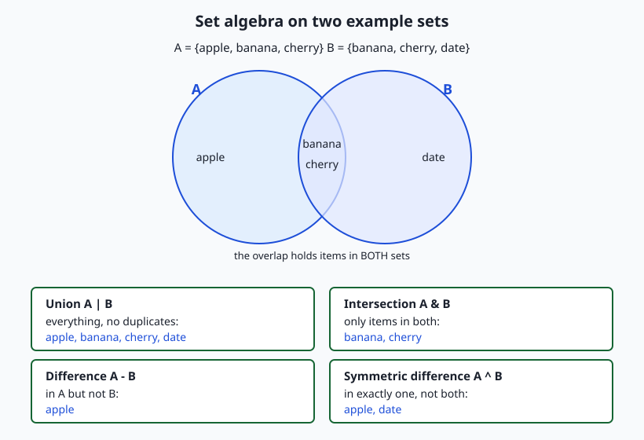

## Why this matters

Two days ago you met the list — an ordered, changeable row of items — and yesterday the dictionary, which looks a value up by a key. Those two carry most of the weight in everyday Python, but they are not the whole toolkit, and reaching for a list every single time is a quiet mistake that costs you later. Today you complete the core set of collections with the two that are missing — the **tuple** and the **set** — and, just as importantly, you learn how to *choose* among all four. Choosing well is not fussy perfectionism; it is one of the most direct levers you have over whether your code is fast, correct, and safe.

The consequences are concrete and they show up exactly where your AI work will live: in data pipelines. Suppose you scrape a hundred thousand web pages and want the unique URLs. Do it with a list and a `if url not in seen` check, and every check scans the whole list from the start — the work grows with the square of the input, and a job that should take a second takes minutes. Do it with a **set**, where membership is answered in roughly one step no matter how big the collection, and the same job stays fast as it scales. Or suppose a function needs to hand back a fixed record — a pair of coordinates, a colour, a name-and-age — that no caller should be allowed to scramble. Return a **tuple**, and the record is immutable: it cannot be changed by accident, and it can even be used as a dictionary key. Picking the right container is the difference between a pipeline that finishes and one that crawls, and between a record that stays trustworthy and one that a stray line of code silently corrupts.

By the end of today you will know what tuples and sets are, when each one beats a list or a dict, how to compute the classic set operations that power deduplication and filtering, and how to answer the everyday question "which collection should I use here?" with a short, reliable checklist instead of a shrug.

## The idea in plain language

A **tuple** is a list that has been sealed shut. It holds an ordered sequence of items, exactly like a list, and you reach into it by position the same way — but once it is created you cannot change it: no adding, no removing, no replacing an item. That single restriction, called **immutability**, turns out to be a feature, not a limitation. Because a tuple cannot change, it is safe to pass around without worrying that something will edit it behind your back, it makes a program's intent clear ("this is a fixed record, not a working list"), and — the technical payoff — it can be used as a dictionary key or a set member, which a list never can.

A **set** is a bag that automatically keeps only one of each thing. Drop the same item in twice and the set still holds it once; ask "is this item in here?" and the set answers almost instantly, no matter how many items it holds. A set does not remember order and does not let you reach in by position — those are the prices it pays — but in exchange it gives you two superpowers: **uniqueness** (duplicates vanish on their own) and **fast membership** (the "is it in there?" question is answered in roughly constant time). Sets also do algebra: given two sets you can ask for everything in both (**intersection**), everything across the two (**union**), what is in one but not the other (**difference**), or what is in exactly one of them (**symmetric difference**).

With lists and dicts from the last two days, that gives you four core collections, and each is the right tool for a different shape of problem. The whole second half of today is a simple framework for telling them apart: ask whether the data will change, whether order matters, whether duplicates must be removed, and whether you need to look items up by a key. Four questions, four collections — answer the questions and the choice makes itself.

## Historical background

The ideas here are far older than Python. The mathematical **set** — a collection of distinct objects with no order — was placed at the foundation of modern mathematics by Georg Cantor in the 1870s, and the operations you will use today (union, intersection, difference) are the ones set theory has used ever since; Python simply gives them a keyboard-friendly spelling. The **tuple** as a word comes from the same tradition: mathematicians speak of an ordered pair, triple, quadruple, and, generally, an *n*-tuple — a fixed-length ordered sequence — and that is precisely what a Python tuple is.

Programming languages absorbed these ideas over decades. Associative structures (the dict's ancestors) and fixed records (the tuple's) appear across the history of the field, and the idea that a language should offer several built-in container types, each with different trade-offs, was well established by the time Python arrived. Python, first released by Guido van Rossum in 1991, made an unusually deliberate choice: it built list, tuple, dict, and set (the set type was added as a built-in in Python 2.4, released in 2004) into the core language with clean, readable syntax, and it wove them together through a single unifying idea — **hashability**. A value that is hashable (roughly, a value that cannot change, so it can be reduced to a stable fingerprint) can serve as a set member or a dictionary key; a value that can change cannot. That is why tuples can be dict keys and lists cannot, and it is the quiet rule that connects all four collections. When you choose a tuple so you can use it as a key, you are using a design decision made for the language thirty years ago and rooted in a century of mathematics.

## What it is — and what it is not

A **tuple** is an ordered, immutable sequence, written with commas and usually parentheses: `(3, 4)`, `("Ada", 1815)`, or even `point = 3, 4` (the parentheses are optional; it is the commas that make a tuple). It supports indexing (`point[0]`), slicing, and iteration, just like a list — but not mutation. A **set** is an unordered collection of unique, hashable items, written with braces: `{"a", "b", "c"}`. Note the collision to watch for: `{}` is an empty *dictionary*, not an empty set — the empty set is written `set()`. A **frozenset** is a set that has itself been sealed shut: an immutable set, which (being immutable, hence hashable) can be a member of another set or a dictionary key.

It helps to be precise about what these are *not*. A tuple is not "a faster list you should always use" — it is a *fixed record*, and its value is the guarantee that it will not change, not a dramatic speed difference. A set is not an ordered collection: you must never rely on the order items come out of a set, because it is not defined and can differ between runs; if you need a stable order, you sort on the way out (which is exactly what today's lab does). A set is also not free of rules about its contents: every item must be **hashable**, so you can put strings, numbers, and tuples into a set, but not lists or dictionaries. And none of these replaces the dictionary: a set stores bare items, while a dict stores key-to-value pairs — a set is, in fact, very like "a dictionary with keys but no values."

| Common misconception | The reality |
| --- | --- |
| "A tuple is just a faster list." | A tuple is an *immutable record*. The point is the guarantee it will not change (so it can be a key, a safe return value), not raw speed. |
| "`{}` makes an empty set." | `{}` is an empty **dict**. The empty set is `set()`. A non-empty `{1, 2}` is a set; `{"a": 1}` is a dict. |
| "Sets remember the order I add items." | Sets are unordered. Never rely on iteration order; sort on the way out if you need a stable order. |
| "I can put anything in a set." | Only **hashable** (roughly, immutable) items: strings, numbers, tuples — yes; lists, dicts, other sets — no (use a `frozenset` if you need a set of sets). |
| "Checking `x in my_list` and `x in my_set` are about the same." | For big collections they are worlds apart: list membership scans every item (O(n)); set membership is roughly O(1). |

## Why it was created and what problems it solves

Each of these types exists because a list or a dict, used for the wrong job, causes a specific, recurring problem.

The **set** exists to solve two problems that lists handle badly. The first is **deduplication**: removing repeats from a list means either sorting and scanning or checking `if item not in result` for every item — the second approach re-scans the growing result each time, so the total work grows with the square of the input and becomes painfully slow on large data. Building a set does the same job in one pass, because the set itself refuses duplicates as you add them. The second problem is **membership testing**: asking "is this value present?" of a list means, in the worst case, looking at every element; asking it of a set takes roughly constant time regardless of size, because a set stores its items by their hash — a fingerprint that leads almost directly to the right spot. Any time you find yourself repeatedly asking "have I seen this before?" — filtering stop-words out of text, checking an allow-list, dropping duplicate records — a set is the answer.

The **tuple** exists to solve the problem of *records that should not change*. When a function returns several related values — a minimum and a maximum, an x and a y — you want to hand them back as one bundle that the caller cannot accidentally take apart or edit. A tuple does this, and Python leans into it with **tuple unpacking** and multiple return values (more on both below). Immutability also unlocks **hashability**: because a tuple cannot change, Python can compute a stable fingerprint for it, which lets a tuple be a dictionary key or a set member. That is why a coordinate pair `(row, col)` can key a dictionary of board positions, or an `(r, g, b)` colour can key a count of how often each colour appears in an image — jobs a list simply cannot do. The tuple turns "a small fixed group of values" into a first-class, safe, keyable thing.

## How it works

Start with the tuple. You create one with commas, seal-shut behaviour included:

```python
point = (3, 4)          # a 2-tuple; parentheses optional: point = 3, 4
x = point[0]            # indexing works, like a list -> 3
point[0] = 99           # TypeError: 'tuple' object does not support item assignment
```

The error on the last line is the whole point: the tuple refuses to change. Two features make tuples pleasant to use. The first is **tuple unpacking** — assigning a tuple's items to several names at once:

```python
row, col = (2, 5)       # row is 2, col is 5
a, b = b, a             # the clean Python swap: no temporary variable needed
```

The second is **multiple return values**, which is really just unpacking in disguise. A function that returns several values returns them as a tuple, and the caller unpacks it:

```python
def min_max(numbers):
    return min(numbers), max(numbers)   # returns a 2-tuple

low, high = min_max([4, 1, 9, 2])       # low is 1, high is 9
```

When a tuple's positions start to feel hard to remember — was it `(name, age)` or `(age, name)`? — reach for a **namedtuple**, a tuple with named fields that reads like a tiny record while staying a real, immutable tuple:

```python
from collections import namedtuple

City = namedtuple("City", ["name", "lat", "lon"])
paris = City("Paris", 48.85, 2.35)
paris.name        # "Paris"  — read by name, not position
paris[0]          # "Paris"  — still a tuple underneath
paris.lat = 0     # AttributeError — still immutable
```

Now the set. You build one from braces or from any sequence, and duplicates disappear on the way in:

```python
vocab = {"cat", "dog", "cat"}     # -> {"cat", "dog"} — one "cat"
seen = set()                       # the empty set (NOT {})
"cat" in vocab                     # True — membership is ~O(1)
```

The set operations are the heart of today's flow diagram. Given two sets, four operators combine them:



```python
a = {"apple", "banana", "cherry"}
b = {"banana", "cherry", "date"}

a | b     # union: everything, no duplicates -> {apple, banana, cherry, date}
a & b     # intersection: in both            -> {banana, cherry}
a - b     # difference: in a, not b          -> {apple}
b - a     # difference: in b, not a          -> {date}
a ^ b     # symmetric difference: exactly one -> {apple, date}
```

Read the diagram alongside the code: the two circles are the two sets, the overlap is the intersection, and each operator carves out a named region. These five lines are the engine of deduplication and comparison, and they are precisely what the lab program computes. One rule governs what a set may contain — every member must be **hashable** — which is why you can build `{(0, 0), (1, 2)}` (a set of tuples) but `{[0, 0]}` raises `TypeError: unhashable type: 'list'`. If you ever need a set that can itself be a member of another set, seal it with `frozenset({"a", "b"})`.

### Choosing among the four collections

With list, tuple, set, and dict in hand, the practical skill is choosing. Four questions decide almost every case, and you can ask them in order:



1. **Do you look a value up by a key?** If each item is naturally "this label points to that value" — a name to a phone number, a word to its count — use a **dict**.
2. **Do you need only unique items, or fast "is it in there?" checks?** If duplicates must vanish or membership must stay fast at scale, use a **set**.
3. **Will the collection change after you build it?** If you will add, remove, or reorder items, use a **list**.
4. **If none of the above** — a small fixed group of values you will not change — use a **tuple**.

The decision map draws this as a top-to-bottom flow: one question, one branch, one answer. Memorise the four questions and you will rarely reach for the wrong container again.

## An everyday analogy

Think of the containers in a kitchen. Each collection is a different kind of container, chosen for a different job.

A **list** is the **mixing bowl** on the counter. You keep adding to it, take things out, stir the order around; it is open, ordered by how you piled things in, and perfectly happy to hold two eggs or three identical spoons of sugar. That is a list: ordered, changeable, duplicates welcome. When you are actively working with a growing, shifting pile of items, you want the mixing bowl.

A **tuple** is a **factory-sealed tin** of tomatoes. The label is printed on, the contents are fixed, and you cannot re-open it and swap the tomatoes for beans without it becoming a different can entirely. Because it is sealed and unchanging, you can trust its label completely and even use that label as an index in your pantry catalogue — "the can whose label reads *(San Marzano, 400g)*." That trustworthy, unchangeable label is exactly why a tuple can be a dictionary key: it will still mean the same thing tomorrow. A tuple is a sealed record you pass around without fear.

A **set** is the **spice collection where you keep exactly one of each**. Buy cumin twice and you still have one cumin — the duplicate just merges in. And when a recipe asks "do you have cumin?", you know instantly, because each spice has its labelled spot; you do not tip the whole rack onto the table and read every jar. That instant "do I have this?" is set membership, and the "one of each" rule is uniqueness. What the spice collection does *not* give you is a remembered order — you would not say "the third spice I ever bought" — which is exactly the trade a set makes.

A **dict** is the **labelled spice rack** taken one step further: every slot has a name, and the name leads you straight to what is in it. "Reach me the jar labelled *paprika*" gets you the value behind that key in one motion. Keep the four containers in mind — mixing bowl, sealed tin, one-of-each collection, labelled rack — and the question "which collection?" becomes "which container fits this job?"

## Examples in practice

Here are the four collections doing the jobs they are built for, drawn from work you will actually do.

**Deduplicating scraped data with a set.** You have gathered a list of URLs with many repeats and want the unique ones:

```python
scraped = ["a.com", "b.com", "a.com", "c.com", "b.com"]
unique = set(scraped)          # {"a.com", "b.com", "c.com"} — repeats gone in one pass
print(len(scraped), "->", len(unique))   # 5 -> 3
```

One call to `set()` removes every duplicate, and it stays fast even if `scraped` has millions of entries. This is exactly the dedupe step in today's lab.

**Filtering stop-words with fast membership.** Before feeding text to a model you often strip common words. Put the stop-words in a set so each check is instant:

```python
STOP = {"the", "a", "an", "of", "to", "is"}     # a set: membership is ~O(1)
words = "the cat sat on the mat".split()
kept = [w for w in words if w not in STOP]      # ["cat", "sat", "on", "mat"]
```

Because `STOP` is a set, `w not in STOP` is fast no matter how many stop-words you have — a list here would slow down as the stop-word list grew.

**Comparing two collections with set algebra.** Which items do two lists share, and which are unique to each?

```python
monday = {"alice", "bob", "carol"}
tuesday = {"bob", "carol", "dave"}
both_days   = monday & tuesday    # {"bob", "carol"}
monday_only = monday - tuesday    # {"alice"}
changed     = monday ^ tuesday    # {"alice", "dave"} — came or went
```

This three-way split (common / only-in-A / only-in-B) is the core of the lab program, and it is how you diff two datasets, two vocabularies, or two lists of user IDs.

**Immutable records with a tuple (and namedtuple).** A function that returns a coordinate, and a colour used as a dictionary key:

```python
def bounds(points):
    xs = [p[0] for p in points]
    return min(xs), max(xs)         # a tuple: a fixed (low, high) record

low, high = bounds([(1, 9), (4, 2), (7, 5)])   # unpacked: low=1, high=7

pixel_counts = {}
for colour in [(255, 0, 0), (0, 255, 0), (255, 0, 0)]:
    pixel_counts[colour] = pixel_counts.get(colour, 0) + 1
# {(255,0,0): 2, (0,255,0): 1} — the (r,g,b) TUPLE is the key; a list could not be
```

The colour must be a tuple to serve as a dict key — a list would raise `unhashable type`. This pattern, counting occurrences of an immutable record, is everywhere in data work.

## Implications: security, privacy, performance, scalability, and cost

### Security

Sets are a genuine security primitive. An allow-list or a block-list — permitted file types, blocked hosts, banned tokens — is naturally a `set`, and `value in allowed` is a fast, clear check that stays fast as the list grows. Immutability adds a second guarantee: a **frozenset** or a **tuple** used as a configuration constant cannot be altered at runtime by a stray line of code, so a security-critical list of allowed values cannot be quietly mutated after it is set. As always, these collections turn input into *data*, never into code — you split strings and build sets; you never `eval()` what a user typed.

### Privacy

Deduplication with a set is a common privacy step: collapsing repeated records so a dataset holds one entry per subject, or reducing a stream of events to the unique identifiers seen, are set operations at heart. Because a set discards duplicates and order, it can also be a way to reduce what you retain — keeping the *set* of categories that appeared, rather than the full ordered log, stores less about individuals. Structure makes data flows auditable: when a function returns an immutable tuple record, you can see exactly what leaves it and know nothing downstream rewrote it.

### Performance

This is where the choice bites hardest. Membership in a list is O(n) — it may scan every element — while membership in a set or a dict key is roughly O(1). For a single check on ten items the difference is invisible; for millions of checks on a large collection it is the difference between milliseconds and minutes. Deduplication shows the same gap: the naive list approach is O(n²), the set approach O(n). Choosing a set for "have I seen this?" work is one of the highest-leverage single-line changes you can make to a data pipeline.

### Scalability

The right collection scales; the wrong one hits a wall. A dedupe or membership step built on a set keeps working as inputs grow from thousands to millions, because its cost per operation barely changes. The same step built on a list degrades quadratically and eventually dominates your runtime. When you design a pipeline, the collection choice at each stage is a scaling decision — made once, early, cheaply — that determines whether the pipeline still finishes when the data gets big.

### Cost

Compute costs money, and a pipeline that runs in one pass instead of scanning repeatedly finishes sooner and costs less to run — directly, on metered cloud machines. Immutable records lower a subtler cost: bugs. A record that cannot change cannot be corrupted by a distant line of code, which removes a whole class of hard-to-find defects, and finding and fixing those is where real engineering time and money go. Choosing the right container is cheap; the savings compound.

## Alternatives: free, open source, and commercial

Every collection discussed here ships with Python itself — free, open source, nothing to install. The "alternatives" are really the members of one free toolkit, each suited to a different job, plus a few specialised structures for scale.

| Tool / structure | Where it lives | When to choose it | Cost |
| --- | --- | --- | --- |
| `list` | Built in | An ordered, changeable sequence; duplicates allowed; reach by position | Free, open source |
| `tuple` | Built in | A small fixed record; a safe return value; a dict key or set member | Free, open source |
| `set` | Built in | Unique items and fast membership; deduplication; set algebra | Free, open source |
| `dict` | Built in | Look a value up by a key; count or map things | Free, open source |
| `frozenset` | Built in | An immutable set — as a dict key, a set member, or a fixed constant | Free, open source |
| `namedtuple` | `collections` (stdlib) | A tuple with named fields — a readable immutable record | Free, open source |
| `dataclass` | `dataclasses` (stdlib) | A richer record type (mutable by default; can be frozen) when a tuple is too bare | Free, open source |
| `Counter` | `collections` (stdlib) | Counting occurrences — a dict subclass tuned for tallies | Free, open source |
| `numpy` array / `pandas` | Third-party, open source | Millions of numbers or tabular data with fast vectorised operations | Free, open source (no paid tier needed) |

For today's work, the four built-ins plus `namedtuple` cover everything. Reach for `frozenset` when you need an immutable set (for example, a set used as a dictionary key). Reach for `namedtuple` or a `dataclass` when a tuple's positions get hard to remember. Reach for `numpy` or `pandas` — both free and open source, the workhorses of AI data work — when you move from a few items to millions and need vectorised speed. There is no paid tier gating any of this; the whole toolkit is free.

## Comparison with related concepts

| Concept A | Concept B | Key difference |
| --- | --- | --- |
| Tuple | List | Both are ordered sequences; a tuple is immutable (a fixed record, usable as a dict key or set member), a list is mutable (a working sequence you change) |
| Set | List | A set is unordered and holds unique items with ~O(1) membership; a list is ordered, allows duplicates, and has O(n) membership |
| Set | Dict | A set stores bare unique items; a dict stores key-to-value pairs — a set is like "a dict with keys but no values" |
| `tuple` | `namedtuple` | Same immutable tuple underneath; a namedtuple adds field names so you read `city.name` instead of `city[0]` |
| `set` | `frozenset` | Same operations; a `set` is mutable (you can add/remove), a `frozenset` is immutable and therefore hashable (usable as a key/member) |
| Hashable | Unhashable | Hashable values (strings, numbers, tuples) can be set members or dict keys; unhashable ones (lists, dicts, sets) cannot — immutability is what makes a value hashable |
| `x in a_set` | `x in a_list` | Same syntax, very different cost: ~O(1) for a set, O(n) for a list — decisive at scale |

## When to use it — and when not to

Use a **tuple** when you have a small, fixed group of values that belong together and should not change: a coordinate, an RGB colour, a database row, a function's multiple return values, or any record you want to use as a dictionary key. Do not force a tuple when the collection genuinely needs to grow or change item by item — that is a list's job, and fighting immutability with constant rebuilding is a smell. Reach for a **namedtuple** the moment the positions get hard to track.

Use a **set** whenever uniqueness or fast membership is the point: deduplicating data, testing an allow-list or block-list, filtering stop-words, or computing how two collections overlap with set algebra. Do not use a set when order matters or when you need duplicates preserved — a set forgets both — and remember that its members must be hashable, so a set of lists is impossible (use tuples, or a set of frozensets). If you need a stable order out of a set, sort on the way out, exactly as today's lab does.

Use a **list** for an ordered, changeable sequence where duplicates are fine, and a **dict** when each item is a key pointing to a value. The four-question checklist — key lookup? uniqueness or fast membership? will it change? otherwise a fixed record — resolves nearly every case in seconds. The one habit to build is asking those questions *before* you type, the same way you designed a program before coding on Day 49; the collection you pick shapes the speed, safety, and clarity of everything built on top of it.

This is where today points at your AI goal directly. The data pipelines that feed models are built out of exactly these choices: a **set** deduplicates scraped pages and filters stop-words and rare tokens in one fast pass; a **set** intersection compares a document's vocabulary against a model's known words; a **tuple** carries an immutable `(row, col)` or `(r, g, b)` record safely through a transformation and keys the dictionaries that count things; a **dict** maps tokens to counts or ids to embeddings. When a preprocessing job that should take seconds instead takes an hour, the cause is very often a list used where a set belonged. Learning to choose the right collection is not tidy housekeeping — it is one of the real performance levers you have over the systems you are here to build. Tomorrow you will meet comprehensions and iterator thinking, which let you build and transform all four of these collections with a single expressive line.

## Knowledge check

Try these from memory before looking back:

1. Name the four questions you ask to choose among list, tuple, set, and dict, and give the collection each one points to.
2. Explain in your own words why a tuple can be a dictionary key but a list cannot. What single word names the property that decides this?
3. Given `a = {1, 2, 3}` and `b = {2, 3, 4}`, write the value of `a & b`, `a - b`, `a | b`, and `a ^ b`.
4. You need to remove duplicates from a list of one million records and then repeatedly check "have I seen this one?" Which collection do you use, and why is a list a poor choice here?
5. What does `{}` create — an empty set or an empty dict — and how do you make the other one?

## Hands-on exercise

Time to put tuples and sets to work. In the Day 54 lab you will build **Choosing Collections** — a small program that dedupes items with a set, computes the set algebra between two lists (common, only-in-A, only-in-B, symmetric difference), and returns the results as immutable tuple records — then fill in a worksheet that has you justify a collection choice for eight real scenarios. Work in the lab directory; every command below is run from there.

First, read the finished reference so you know the target, then run it on good and bad input:

```bash
python3 examples/collections_tool.py "apple,banana,apple,cherry" "banana,cherry,date,date"
python3 examples/collections_tool.py "banana" "banana,cherry"
python3 examples/collections_tool.py "apple,banana"
```

The first two print a six-line report; the third prints an error to standard error and exits non-zero. Now open `starter/collections_tool.py` and complete its five numbered exercises — return an immutable tuple, dedupe with a set, compute the set algebra, format the report, and add the main guard — using the reference only when you are stuck. Run your version the same way:

```bash
python3 starter/collections_tool.py "apple,banana,apple" "banana,cherry"
```

Finally, prove your program is importable and testable — the payoff of the main guard — by borrowing one function without running the whole program:

```bash
python3 -c "import sys; sys.path.insert(0, 'examples'); from collections_tool import dedupe; print(dedupe(('a', 'a', 'b')))"
```

### Expected output

A correct run of the reference program looks exactly like this:

```text
$ python3 examples/collections_tool.py "apple,banana,apple,cherry" "banana,cherry,date,date"
List A: 4 items read, 3 unique after dedupe
List B: 4 items read, 3 unique after dedupe
Common (A & B): banana, cherry
Only in A (A - B): apple
Only in B (B - A): date
Symmetric difference (A ^ B): apple, date

$ python3 examples/collections_tool.py "apple,banana"   ; echo "exit: $?"
error: expected 2 arguments: "<list A>" "<list B>"
usage: python3 collections_tool.py "a,b,c" "b,c,d"
exit: 1

$ python3 -c "import sys; sys.path.insert(0, 'examples'); from collections_tool import dedupe; print(dedupe(('a', 'a', 'b')))"
('a', 'b')
```

The report prints to standard output; the error case prints to standard error and sets a non-zero exit code; and the last line proves the module can be imported and `dedupe` used without the program running — because the main guard held it back. Every group is sorted before printing, so your output matches exactly even though a set is unordered.

### Validate your work

You are done when you can check every box:

- [ ] The first command prints `List A: 4 items read, 3 unique after dedupe` and `Common (A & B): banana, cherry`.
- [ ] A one-argument run (`python3 examples/collections_tool.py "apple,banana"`) prints a clear error and exits non-zero (`echo $?` shows `1`).
- [ ] A list that is empty after cleaning (`" , ,"`) is rejected with a message about at least one item.
- [ ] Your completed `starter/collections_tool.py` matches the reference on the same inputs.
- [ ] You filled in `starter/collection-choice-worksheet.md` with a choice and a reason for each scenario.
- [ ] `bash tests/run_tests.sh` ends with `0 failure(s)` and exits `0`.

### Troubleshooting

- **`python: command not found`.** Use `python3` explicitly, as every command here does; on macOS and most Linux systems `python` alone may be missing.
- **My output items are in a different order.** You probably returned the raw `set` instead of `tuple(sorted(...))`. A set is unordered; the program sorts every group on the way out so its output is deterministic.
- **`TypeError: unhashable type: 'list'`.** A set member (or a dict key) must be hashable. Use tuples, not lists, for grouped values — that is why `parse_items` returns a tuple.
- **The two lists got split into extra arguments.** Wrap each list in quotes: `"apple,banana" "banana,cherry"`. Without quotes a space would start a new argument.
- **`AttributeError: 'tuple' object has no attribute 'common'`.** Your `compare` returned a plain tuple; return a `SetReport(common=..., only_in_a=..., only_in_b=..., symmetric=...)` so the caller can read `report.common`.

### Common mistakes

- **Using a list for membership or dedupe.** `if x not in big_list` scans the whole list every time and deduping that way is O(n²). Build a set — membership is ~O(1) and dedupe is one pass.
- **Relying on set order.** A set does not remember insertion order; never assume it does. If you need a stable order, `sorted()` it on output, as the lab does.
- **Returning a mutable list where an immutable record belongs.** A function's fixed result — a coordinate, a report — is safer as a tuple (or namedtuple) that a caller cannot accidentally edit.

## Practice assignment

Design and build a *second* small program of your own, in your Day 54 lab folder, that uses tuples and sets deliberately. Choose a genuinely useful one-job tool: a **tag comparer** that takes two comma-separated tag lists and reports shared and unique tags (set algebra); a **duplicate finder** that reads a comma-separated list and reports which items appeared more than once (a set of seen items, or a `Counter`); or a **coordinate logger** that reads several `x,y` pairs, stores each as an immutable `(x, y)` tuple, and reports the unique positions and the bounding box (min/max as a returned tuple). Before writing code, fill in the four-question checklist for each collection your program uses — is it mutable, ordered, unique, keyed? — and record why you chose it. Then implement it with at least two named functions plus a `main`, the `if __name__ == "__main__":` guard, input validation that prints a clear error and exits non-zero, and output that is sorted so it is deterministic. Finally, record one good-input run and one bad-input run, and prove the program is importable by borrowing one of its functions with a `python3 -c` one-liner. Keep the file; the Week 8 project combines all four collections in one small data task.

## Extension challenge

Take the lab program further and make it teach you something about performance. First, add a **union** line to the report using `a | b`, and verify by hand that for your inputs `len(union) == len(common) + len(symmetric)` — a small identity that holds for any two sets, and a good way to check your understanding of the four operations. Second, write a tiny timing experiment of your own (a separate script) that builds a list and an equal-sized set of, say, 100000 numbers, then times ten thousand membership checks against each using Python's `time` module; print both timings and confirm with your own eyes that the set is dramatically faster — this is the O(1)-versus-O(n) difference made concrete, and it is the single most convincing argument for choosing the right collection. Third, make one output group configurable: accept an optional third argument and, when it is `len`, sort each group by length then alphabetically instead of plain alphabetically, keeping the default unchanged and the program still deterministic. You will have turned a small comparison tool into a demonstration of *why* collection choice is a real performance lever — exactly the lesson that will save you hours when your data pipelines get big.
