## Why this matters

For the last four days you have been filling a toolbox: loops that repeat work, then lists, dictionaries, and sets to hold it. You can already write a `for` loop that walks a collection, builds up a new list with `append`, and filters out the items you do not want. Today you learn two things that change how that work reads and how much memory it costs — and both are everywhere in the AI code you are working toward. The first is the **comprehension**: a single expression that maps and filters a collection in one readable line. The second, deeper idea is **iterator thinking**: the realization that a `for` loop does not need the whole collection to exist at once, and that you can process a stream of data one item at a time, lazily, no matter how large it is.

The payoff is concrete and it is measured in memory. Every serious machine-learning workflow reads more data than fits in your computer's memory: a dataset of millions of images, a text corpus of billions of words, a log file that never stops growing. If you try to load all of it into a list first, your program dies with a `MemoryError` before it does any work. The tool that saves you is the **generator** — a lazy iterator that hands you one record at a time and forgets it before fetching the next. Data loaders, streaming tokenizers, and batch pipelines in every AI framework are built on exactly this mechanism. Learn it on six rows today and the million-row version later will be the same three functions.

The everyday half matters just as much. Comprehensions are the routine transform of data work — "take these records, pull out this field, keep the ones that qualify" — the shape of nearly every feature-building step before a model ever sees the data. Written as a comprehension, that step is one clear line a reader understands at a glance; written as a four-line loop, it is four lines to skim and a place for a bug to hide. Knowing when a comprehension improves readability, and when a plain loop is honestly clearer, is a judgment you build today and use for the rest of your programming life.

## The idea in plain language

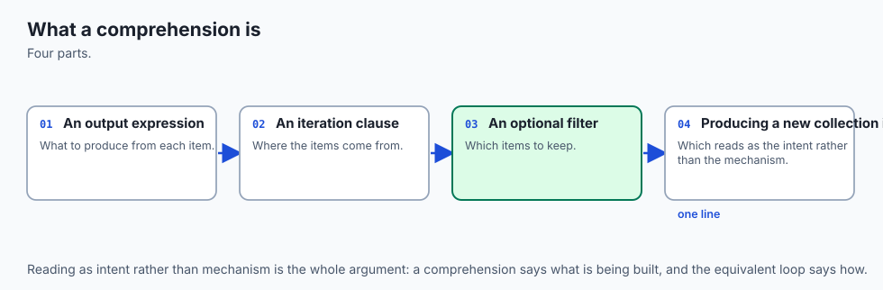

A **comprehension** is a compact way to build a new collection from an existing one by describing, in a single expression, what to do to each item and which items to keep. Instead of creating an empty list, looping, and appending, you write the answer directly: "the square of `n`, for each `n` in `numbers`, if `n` is even." That reads almost like the English sentence, and Python gives you one for each of the collections you met this week — a **list comprehension** in square brackets `[...]`, a **set comprehension** in curly braces `{...}`, and a **dict comprehension** in curly braces with a `key: value` pair `{k: v ...}`.

**Iterator thinking** is the mental shift underneath. When you write `for item in things:`, it feels like Python hands you the whole collection. It does not. Behind the scenes, `for` asks the collection for an **iterator** — a little bookmark object — and then repeatedly asks that bookmark, "what is the next item?" until the bookmark says "there are no more." Because the loop only ever asks for the *next* item, the items do not all have to exist yet. They can be produced on demand, one at a time, by a function that computes each one only when asked. That producer is a **generator**, and the property that makes it powerful is **lazy evaluation**: nothing is computed until something pulls on it, and only as much is computed as is actually consumed.

Put the two ideas together and you have the everyday transform (a comprehension) and the memory-safe transform (a generator) for the same job. A list comprehension builds the entire result in memory right now; a **generator expression** — the same syntax with round brackets `(...)` instead of square — describes the same result but produces it lazily, one item at a time, holding almost nothing. Choosing between them is choosing between "I need all the answers now" and "I will take them as they come."

## Historical background

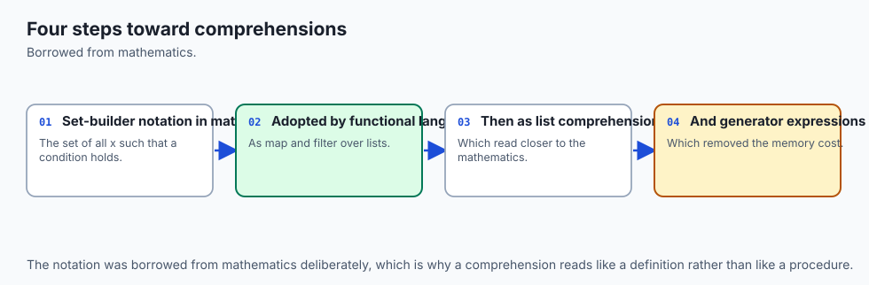

Comprehensions did not begin with Python; they begin in mathematics. **Set-builder notation** — writing a set as `{ x² | x ∈ ℕ, x < 10 }`, read "the set of x squared, for x in the natural numbers, where x is less than 10" — has been standard mathematical shorthand for over a century, and its three parts (an expression, a source, a condition) are exactly the three parts of a Python comprehension. In the 1970s the programming language **SETL**, designed by Jack Schwartz at New York University, brought set-builder notation into code. Functional languages **Miranda** and later **Haskell** popularized the "list comprehension" by name in the 1980s, and it was from Haskell that the feature came to Python.

Python, first released by Guido van Rossum in 1991, added **list comprehensions in version 2.0 in 2000**, formalized in the proposal PEP 202. The lazy machinery arrived over the next few years. **PEP 234 introduced the iterator protocol in Python 2.2 (2001)**, giving `for` its formal contract: any object that can produce an iterator can be looped over. In the same release, **PEP 255 added "simple generators"** — the `yield` keyword that lets an ordinary-looking function produce a lazy sequence. **PEP 289 added generator expressions in Python 2.4 (2004)**, the work of Raymond Hettinger, giving comprehension syntax a lazy sibling.

Hettinger also contributed the **`itertools`** module in Python 2.3, a toolbox of fast, lazy iterator building blocks inspired by APL and the functional languages. Finally, **dict and set comprehensions became part of the language in Python 3.0 (2008)** and were backported to Python 2.7. So the syntax you write today is the settled result of a decade of the language absorbing a much older mathematical idea, and every version of Python 3 you will ever run has all of it.

## What it is — and what it is not

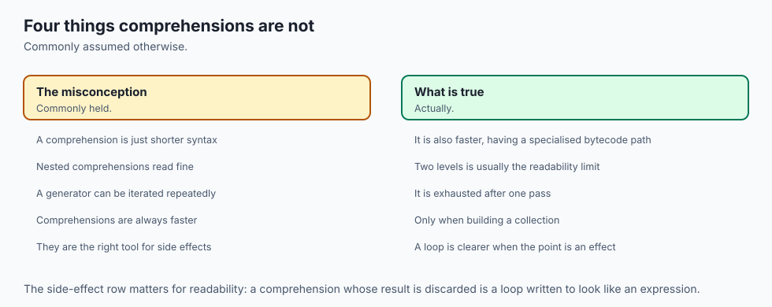

A comprehension is a single expression that produces a collection. It always has an **output expression** (what to build for each kept item) and at least one **for clause** (the source to iterate); it may have one or more **if clauses** (which items to keep) and, less often, more than one `for` clause (nesting). An **iterator** is any object with a `__next__` method that returns the next item or raises `StopIteration` when exhausted; an **iterable** is any object that can hand you a fresh iterator via `__iter__`. A **generator** is the easiest way to make an iterator: a function that uses `yield` instead of `return`, or a generator expression.

It is worth being precise about what these are *not*, because the compactness invites misuse. A comprehension is *not* a place to do everything — piling three `for` clauses and two `if` clauses into one line produces something no one can read, and a plain loop would be clearer. It is *not* faster by magic; it is usually a little faster than the equivalent `append` loop because the work happens in optimized internal code, but readability, not speed, is the reason to reach for it.

A generator is *not* a list: you cannot index it with `gen[0]`, you cannot ask its `len()`, and it is **single-use** — once you have iterated it to the end, it is exhausted and yields nothing more. And laziness is *not* free storage: a generator holds little memory precisely because it does not remember what it already produced, so if you need the data twice, you must either keep a list or rebuild the generator.

| Common misconception | The reality |
| --- | --- |
| "Comprehensions are always better than loops." | They win when the transform is simple and fits one readable line; a loop with side effects, several steps, or complex logic is clearer as a loop. |
| "A generator is just a small list." | A generator computes items on demand and forgets them; it has no length, no indexing, and is exhausted after one full pass. |
| "Comprehensions are mainly a performance trick." | The main gain is readability. The speed difference over an `append` loop is modest; choose them to say more with less, not to optimize. |
| "`for` needs the whole collection in memory." | `for` only ever asks for the *next* item, so it works identically over a lazy generator that never holds more than one item at a time. |
| "Nesting comprehensions is elegant." | One level (a flatten) is fine; two or more nested `for`/`if` clauses quickly become unreadable and belong in a named loop or helper. |

## Why it was created and what problems it solves

Each of today's tools answers a specific, recurring pain. Comprehensions were created to fix the **noise of the build-a-collection loop**. The pattern "make an empty list, loop, conditionally append" appears constantly, and written out it buries a simple intention under four lines of bookkeeping — the empty list, the loop header, the `if`, the `append`. Three of those four lines are pure ceremony that says nothing about *what* you are building. A comprehension deletes the ceremony and leaves the intention: the mapping and the filter, in the order you would say them aloud. Less code to read means fewer places for a bug and a faster grasp for the next person.

The iterator protocol and generators solve a harder problem: **how to process more data than fits in memory, without special-casing every data source**. Before a uniform protocol, every kind of sequence — a list, a file, a range of numbers — needed its own way to be walked. The iterator protocol gave them all one contract, so `for` works the same over a list, a file's lines, a dictionary's keys, or your own custom object. Generators then made *producing* such a stream trivial: instead of writing a class with `__iter__` and `__next__` by hand, you write a normal function and say `yield` where you would have collected a result.

That unlocks **lazy pipelines** — chains of transforms where each stage pulls one item from the stage before it — which is the only practical way to run a filter-then-map-then-aggregate over a dataset that would never fit in RAM as a list. The problem it solves is not academic; it is the difference between a program that runs and one that dies with `MemoryError`.

## How it works

Start with the comprehension, because its three parts map exactly onto the loop you already know.


Read the diagram left to right, because that is the order Python evaluates the clauses in your head, even though the output expression is written first. The **for clause** names the source and a variable for each item; the optional **if clause** decides whether to keep that item; and the **output expression**, written at the front, says what to build from each kept item. The comprehension `[n * n for n in numbers if n % 2 == 0]` is precisely the loop shown at the bottom of the diagram: create a result list, loop over `numbers`, skip the odd ones, and append `n * n` for the rest.

The three kinds differ only in the brackets and the output shape: `[expr for ...]` builds a **list**, `{expr for ...}` builds a **set** (so duplicates collapse and order is not kept), and `{key: value for ...}` builds a **dict**. Swap the square brackets for round ones — `(expr for ...)` — and you have a **generator expression** that produces the same items lazily instead of building them all at once.

### What a `for` loop really does

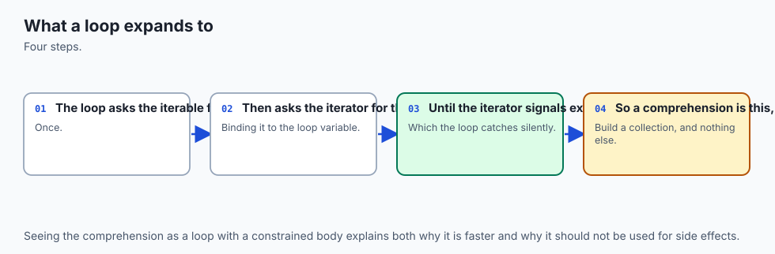

Now the machinery under the loop. When you write `for x in things:`, Python does three things. First it calls `iter(things)`, which asks the object for a fresh **iterator** by calling its `__iter__` method. Then, on each pass, it calls `next()` on that iterator, which runs the iterator's `__next__` method to get one item. When there are no more items, `__next__` raises the special exception **`StopIteration`**, and the `for` loop quietly catches it and ends. That is the whole protocol: `iter()` to begin, `next()` to advance, `StopIteration` to finish. You can drive it by hand to see it plainly:

```python
numbers = [10, 20]
it = iter(numbers)      # get an iterator (a bookmark into the list)
print(next(it))         # 10
print(next(it))         # 20
print(next(it))         # raises StopIteration — nothing left
```

An **iterable** is anything you can call `iter()` on (a list, a string, a dict, a file); an **iterator** is what you get back, and it is what actually remembers your place. This is why a `for` loop does not need the whole collection: it only ever calls `next()` for the *next* item, so the items can be produced on demand.

### Generators: producing items lazily

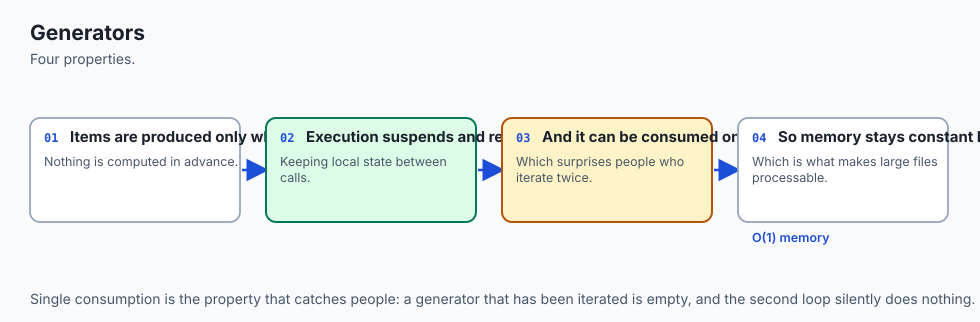

A **generator function** looks like an ordinary function but uses `yield` instead of `return`. Calling it does not run the body; it hands back a generator object — an iterator. Each time `next()` is called, the function runs until it hits a `yield`, hands that value out, and then **pauses**, remembering exactly where it was, including all its local variables. The next `next()` resumes right after the `yield`. When the function finally returns (or runs off the end), the generator raises `StopIteration`.

```python
def count_up_to(limit):
    n = 1
    while n <= limit:
        yield n          # hand out n, then pause here
        n += 1           # resume here on the next next()

for value in count_up_to(3):
    print(value)         # 1, then 2, then 3
```

Because the generator computes each value only when asked and keeps just its current state, it uses the same tiny amount of memory whether `limit` is 3 or 3 billion. That is **lazy evaluation** made practical.


The flow diagram shows why this scales. A **pipeline** stacks generators: a reader yields one parsed record, a filter yields it onward only if it qualifies, and a consumer (a `sum`, a `for`, a `next()`) pulls on the end. The pull travels leftward and a single item travels rightward; at no moment does more than one record exist in flight. Replace the reader's six rows with a file of six million and nothing else changes — the memory stays flat. When the source is exhausted, the reader raises `StopIteration`, which ripples through the pipeline and stops the consumer.

### A first look at `itertools`

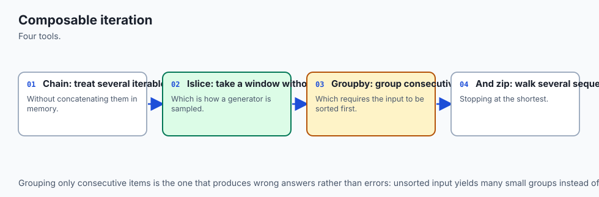

The standard-library module **`itertools`** ships ready-made lazy iterators so you rarely write the plumbing yourself. Three you will use immediately: **`chain(a, b)`** treats several iterables as one continuous stream without copying them into a combined list; **`islice(it, start, stop)`** takes a slice of an iterator lazily, the way `list[2:5]` slices a list, which is the safe way to peek at the first few items of an endless stream; and **`count(start)`** is an iterator that counts upward forever, the canonical infinite iterator you tame with `islice`. Because they are lazy, `itertools.islice(itertools.count(0), 5)` produces `0, 1, 2, 3, 4` without ever trying to build an infinite list.

## An everyday analogy

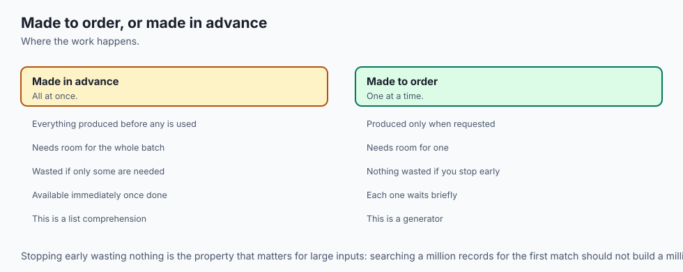

Think of a restaurant kitchen, and keep it in mind for the rest of the lesson.

A **comprehension** is the chef's shorthand on a prep card: *"dice each tomato that is ripe."* One line names the ingredient source (the tomatoes), the condition (ripe), and the action (dice), and it produces a full tray of diced tomatoes. That is a **list comprehension** — the whole tray is prepared at once and set on the counter. If the card instead said *"list every distinct herb we used,"* duplicates would collapse to one of each — that is a **set comprehension**. And *"pair each dish with its price"* is a **dict comprehension**, building a lookup rather than a plain pile.

Now the deeper idea. Cooking the entire banquet before a single guest arrives fills every counter in the kitchen — that is building a **list**, and it is fine for a dinner party of six but impossible for a stadium. A busy kitchen instead runs a **made-to-order line**, like a conveyor-belt sushi bar: a plate is prepared only when the next diner reaches for it, and the kitchen holds just the plate currently being made. That conveyor is a **generator**, and preparing one plate at a time on demand is **lazy evaluation**. The diner reaching out is a call to `next()`; the waiter who fetches a fresh conveyor for a new party is `__iter__`; and when the kitchen calls out *"that's all, we're out!"* it is raising **`StopIteration`** — the signal the diners (the `for` loop) take as their cue to stop.

The kitchen gadgets are **`itertools`**: `chain` splices two conveyors into one, `islice` says "give me only plates three through eight," and `count` is the endless ticket dispenser at the door. The analogy holds all the way down: a comprehension is a recipe that fills a tray now; a generator is a line that serves one plate at a time, forever if need be, on nothing but a plate's worth of counter space.

## Examples in practice

Start with the everyday transforms. Suppose you have parsed some records, each a small dictionary:

```python
records = [
    {"name": "alice", "team": "engineering", "score": 88},
    {"name": "bob",   "team": "design",      "score": 72},
    {"name": "carol", "team": "engineering", "score": 95},
]
```

A **list comprehension** maps and filters in one line — the names of high scorers, upper-cased:

```python
high = [r["name"].upper() for r in records if r["score"] >= 80]
# ['ALICE', 'CAROL']
```

A **dict comprehension** builds a lookup from name to score, and a **set comprehension** collects the distinct teams:

```python
by_name = {r["name"]: r["score"] for r in records}
# {'alice': 88, 'bob': 72, 'carol': 95}
teams = {r["team"] for r in records}
# {'engineering', 'design'}   (design appears once, though two records have it)
```

Compare the list comprehension to its honest loop equivalent and the readability case is clear:

```python
high = []
for r in records:
    if r["score"] >= 80:
        high.append(r["name"].upper())
```

Four lines of scaffolding versus one line that reads like its intention. Now **nesting and flattening**, the one nested form worth knowing. Given a list of rows, flatten it to a single list:

```python
grid = [[1, 2], [3, 4], [5, 6]]
flat = [value for row in grid for value in row]
# [1, 2, 3, 4, 5, 6]
```

Read the two `for` clauses left to right, exactly as you would nest them in a loop: for each `row` in `grid`, for each `value` in `row`. That single flatten is fine; a third `for` clause or a nested `if` on top of it is the point to stop and write a named loop instead — the caution against over-nesting is real.

Now the lazy half. Swap the brackets for round ones and you have a **generator expression** that never builds the whole list. Feeding it straight into an aggregator like `sum` is the idiom you will use constantly:

```python
total = sum(r["score"] for r in records)   # 255, and no intermediate list is built
```

Finally, a **generator function** and a small **pipeline**. Imagine the records arrive as raw text lines from a file far too large to load:

```python
def read_records(rows):
    """Yield one parsed record at a time — O(1) memory, however many rows."""
    for row in rows:
        name, team, score = row.split(",")
        yield {"name": name, "team": team, "score": int(score)}

def only_team(records, team):
    """Yield only the records for one team — still lazy."""
    for r in records:
        if r["team"] == team:
            yield r

rows = ["alice,engineering,88", "bob,design,72", "carol,engineering,95"]
pipeline = only_team(read_records(rows), "engineering")
average = sum(r["score"] for r in pipeline) / 2   # (88 + 95) / 2 = 91.5
```

Each record is read, filtered, and consumed one at a time; the program never holds more than a single record, whether `rows` has three entries or three million. And `itertools` supplies the ready-made pieces — take just the first two records of a possibly endless stream:

```python
import itertools
first_two = list(itertools.islice(read_records(rows), 2))
ids = list(itertools.islice(itertools.count(1000), 3))   # [1000, 1001, 1002]
```

The lab has you build exactly this shape — comprehensions for the transforms, a generator pipeline for the stream — and prove the lazy version returns the same answer as a plain loop.

## Implications: security, privacy, performance, scalability, and cost

### Security

The security note is the same rule you met with input handling, seen from a new angle: a comprehension's output expression runs real code for every item, so never build one whose expression evaluates untrusted text. There is no `eval()` hiding in a comprehension unless you put it there — so do not. Keep the output expression a plain transform (`r["name"].upper()`, `int(x)`), never a call that executes a string a user supplied. Generators add one operational caution: because they are lazy, an exception inside a generator surfaces *when you consume it*, not when you create it, so validate inputs where the data is pulled, and do not let a half-consumed generator swallow errors silently.

### Privacy

Laziness is quietly good for privacy. A generator pipeline touches each record exactly once and holds nothing after passing it along, so a filter that drops personal fields early means the sensitive data never accumulates anywhere in memory. Building a giant list first does the opposite: it materializes every record, including the fields you were about to discard. Streaming with a filter at the front is the structural way to minimize how much sensitive data your program is holding at any instant.

### Performance

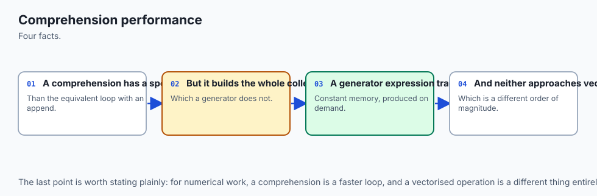

A comprehension is usually modestly faster than the equivalent `append` loop because the appending happens in optimized internal code rather than a Python-level method call each pass — but the honest reason to use one is readability, not speed. The larger performance story is the generator's: by trading storage for laziness, it turns an impossible job (build a billion-item list) into a routine one (stream a billion items through a pipeline) at flat memory cost. The trade is time-shaped: a generator recomputes on each pass and cannot be indexed, so if you need random access or multiple passes, a list is the right tool and paying the memory is correct.

### Scalability

This is where iterator thinking earns its place in AI work. The reason a data loader can train a model on a dataset larger than memory is that it is a lazy iterator: it yields one batch, the model consumes it, and only then is the next batch read from disk. Nothing about that pipeline changes as the dataset grows from thousands of rows to billions — the memory stays flat and only the running time grows. A pipeline built from generators scales by streaming; a pipeline built from lists scales until it hits your RAM ceiling and stops.

### Cost

Memory is money, directly. On a rented cloud machine you pay for RAM by the gigabyte-hour, and a program that streams a dataset through generators can run on a small, cheap instance where the list version would demand a large, expensive one — or would not run at all. Laziness also saves wasted compute: a lazy pipeline that stops early (you only needed the first ten matches) never computes the rest, whereas an eager list computes everything and throws most of it away. Choosing the lazy tool when the data is large is a choice that shows up on the bill.

## Alternatives: free, open source, and commercial

Everything today is part of Python itself and free; the choices are about which built-in tool fits the job. When the topic is "transform a collection," here are the leading options and when to reach for each.

| Tool / approach | When to choose it | How to use it | Cost |
| --- | --- | --- | --- |
| List comprehension `[...]` | You need the whole result now, it fits in memory, and the transform is one readable line | `[f(x) for x in xs if keep(x)]` | Free (built in) |
| Dict / set comprehension `{...}` | Building a lookup table or a set of distinct values in one line | `{k: v for ...}` / `{x for ...}` | Free (built in) |
| Generator expression `(...)` | The data is large or streamed, or you feed it straight into `sum`/`any`/`max` | `sum(f(x) for x in xs)` | Free (built in) |
| Generator function (`yield`) | A multi-step lazy producer, or logic too big for one expression | `def gen(...): ... yield item` | Free (built in) |
| A plain `for` loop | The body has side effects, several steps, or complex branching | `for x in xs: ...` | Free (built in) |
| `map()` / `filter()` | You already have a named function to apply; a functional style you prefer | `map(str.upper, names)` (returns a lazy iterator) | Free (built in) |
| `itertools` | Combining, slicing, grouping, or generating streams with tested building blocks | `itertools.islice(it, 5)` | Free (built in) |

The functional builtins `map` and `filter` deserve a word: `map(f, xs)` applies `f` to each item and `filter(pred, xs)` keeps items where `pred` is true, both returning lazy iterators in Python 3. They overlap heavily with comprehensions and generator expressions; most Python programmers prefer a comprehension for readability, reaching for `map`/`filter` only when a named function already exists and reads cleanly (`map(str.strip, lines)`). There is no commercial tier here — the entire toolkit ships with the language — which is exactly why these idioms are worth mastering: they cost nothing and appear in essentially every Python codebase, including every AI framework's data layer.

## Comparison with related concepts

| Concept A | Concept B | Key difference |
| --- | --- | --- |
| List comprehension | Generator expression | Same syntax, different brackets; the list builds every item now and is reusable, the generator produces items lazily and is single-use |
| Comprehension | `for` loop with `append` | The comprehension is one readable line for a simple map/filter; the loop is clearer for side effects, several steps, or complex logic |
| Iterable | Iterator | An iterable can *produce* an iterator via `iter()`; an iterator is the object that actually remembers your position and yields the next item via `next()` |
| Generator function | Regular function | A regular function runs to `return` and gives one result; a generator uses `yield`, pauses after each item, and produces a lazy sequence |
| Generator | List | A generator computes on demand, holds one item, has no length or indexing, and is exhausted after one pass; a list holds everything and is reusable and indexable |
| `map()` / `filter()` | Comprehension | Same effect; `map`/`filter` suit an existing named function, a comprehension is usually more readable and can map and filter together |

## When to use it — and when not to

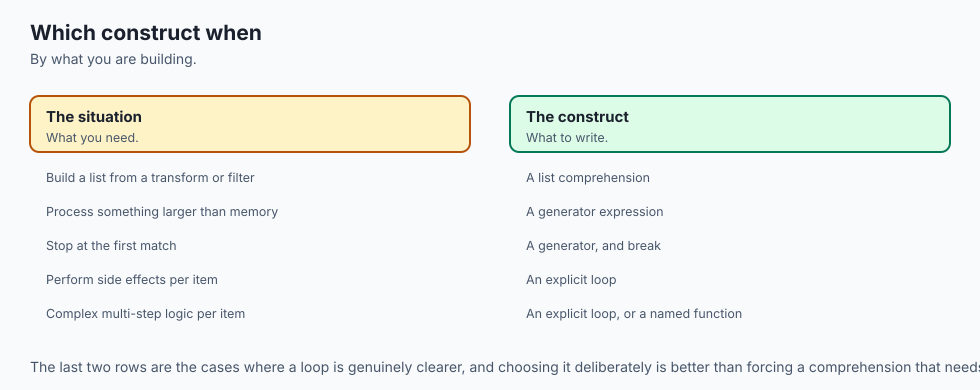

Reach for a **comprehension** when you are building a new collection by a simple transform of an existing one and the whole thing fits on one readable line — mapping a field out of each record, filtering to the items that qualify, building a lookup dict. That covers a large share of everyday data work, and the comprehension will be shorter and clearer than the loop. Reach for a **generator** — an expression or a `yield` function — when the data is large, streamed, or possibly endless, or when you are chaining transforms into a pipeline and want flat memory; and reach for a generator expression whenever you feed a transform straight into an aggregator like `sum`, `any`, `max`, or `min`, since building the intermediate list would be pure waste.

Do *not* force a comprehension when the work resists one line. If the loop body has side effects (printing, writing a file, updating several structures), needs several statements, or branches in complex ways, a plain `for` loop is the honest, readable choice — cramming it into a comprehension produces a line no one can maintain. Do not nest more than one `for` clause (a single flatten is the limit of good taste); beyond that, a named loop or a helper function wins.

And do not use a generator when you need the data more than once, need random access by index, or need its length — those are a list's job, and reaching for a generator there just means rebuilding it or converting it back with `list()` anyway. The skill is matching the tool to the shape of the work: comprehension for the compact transform, loop for the messy one, list when you need it all, generator when you must not hold it all.

Here is where this points for the work ahead. Every AI system you will build or operate reads more data than fits in memory, and the mechanism that makes that possible is the lazy iterator you learned today. A **data loader** that feeds a training run is a generator yielding one batch at a time from disk; a **streaming tokenizer** is a generator turning an endless stream of text into tokens on demand; a **batch inference pipeline** is a chain of generators pulling records through parse, transform, and predict stages at flat memory cost.

And the routine feature-building step — "take these records, extract this field, keep the ones that qualify" — is a comprehension, written once and read at a glance. Master the comprehension and the generator on six rows of records today, and the million-row data pipeline later is the same handful of functions, unchanged except for the size of the stream flowing through them.

## The AI connection

- **Comprehensions are the idiomatic way to transform data** in Python, and they read closer
  to intent than a loop.
- **Generator expressions stream rather than materialise**, which is what makes large-file
  processing possible.
- **Lazy evaluation is the same idea as a data loader**, computing each item only when it is
  needed.
- **A comprehension that needs a comment is usually too clever**, which is a useful readability
  test.
- **Iterator thinking underlies every data pipeline**, including the ones feeding model
  training.

## Knowledge check

Try these from memory before looking back:

1. Name the three parts of a comprehension and point to each in `[w.upper() for w in words if len(w) > 3]`.
2. Write the list comprehension `[n * n for n in numbers if n % 2 == 0]` as an equivalent `for` loop, then explain which is more readable and why.
3. Describe, step by step, what a `for` loop actually does under the hood — name the three things involving `iter()`, `next()`, and `StopIteration`.
4. What is the difference between a list comprehension `[...]` and a generator expression `(...)`? Give one situation where the generator is clearly the right choice.
5. Why can a generator pipeline process a file larger than your computer's memory when a list of the same data cannot? Explain in terms of what is held in memory at each moment.

## Hands-on exercise

Time to build both halves for real. In the Day 55 lab you will write comprehensions that transform and filter a small set of records, then build a lazy generator pipeline that streams those records one at a time and prove it returns the same answer as a plain loop. Work in the lab directory; every command below is run from there.

First, read the finished reference and run it to see the target:

```bash
python3 examples/pipeline.py
```

It prints the results of the list, dict, and set comprehensions, the average score computed two ways (a lazy generator pipeline and an explicit loop), and a line confirming the two match. Now open `starter/pipeline.py` and complete its five numbered exercises — a list comprehension, a dict comprehension, a set comprehension, a `yield`-based generator, and the assembled lazy pipeline — using the reference only when you are stuck. Run your version the same way:

```bash
python3 starter/pipeline.py
```

Finally, prove the laziness claim directly by importing the reader and pulling just one record from it without consuming the rest:

```bash
python3 -c "import sys; sys.path.insert(0, 'examples'); from pipeline import read_records, RECORDS; g = read_records(RECORDS); print(next(g))"
```

### Expected output

A correct run of the reference program looks exactly like this:

```text
$ python3 examples/pipeline.py
high scorers (list):   ['ALICE', 'CAROL', 'FRANK']
name -> score (dict):  {'alice': 88, 'bob': 72, 'carol': 95, 'dave': 60, 'erin': 79, 'frank': 84}
distinct teams (set):  ['design', 'engineering', 'marketing']
first 3 ids (itertools): [1000, 1001, 1002]
engineering average (lazy pipeline): 87.3
engineering average (loop baseline): 87.3
match: lazy pipeline == loop baseline
```

The set is printed sorted so the line is stable to compare. The two averages are identical because the lazy pipeline and the loop compute the same thing — that equivalence is the whole point. The final line confirms an `assert` inside the program passed.

### Validate your work

You are done when you can check every box:

- [ ] `python3 examples/pipeline.py` prints the three comprehension results, both averages, and `match: lazy pipeline == loop baseline`.
- [ ] Your completed `starter/pipeline.py` prints the same output as the reference.
- [ ] The `python3 -c "... next(g) ..."` one-liner prints a single record dict, proving the generator yields one item without building the rest.
- [ ] `bash tests/run_tests.sh` ends with `0 failure(s)` and exits `0`.
- [ ] You can explain, for your dict comprehension, what the key is and what the value is.

### Troubleshooting

- **`python: command not found`.** Use `python3` explicitly, as every command here does; on macOS and most Linux systems `python` alone may be missing.
- **The starter raises `NotImplementedError`.** That is expected until you finish each exercise. Replace each `raise NotImplementedError(...)` line with the real body described in the comment above it.
- **Your set line prints in a different order.** Sets are unordered, so print them via `sorted(...)` as the reference does; comparing raw set repr across runs is unreliable.
- **`TypeError: 'generator' object is not subscriptable`.** You tried `gen[0]` on a generator. Generators have no indexing; use `next(gen)` for one item or `list(gen)` to materialize them.
- **Your pipeline prints nothing or a wrong average.** A generator is single-use — if you consumed it once already (for example in a debug `list(pipeline)`), it is exhausted. Rebuild the pipeline before consuming it for the real computation.

### Common mistakes

- **Reusing an exhausted generator.** After one full pass a generator is empty. If you need the data twice, keep a `list(...)` or rebuild the generator; do not expect a second `for` to see anything.
- **Over-nesting a comprehension.** Two or more nested `for`/`if` clauses on one line become unreadable. A single flatten is fine; beyond that, write a named loop or a helper.
- **Building a list where a generator belongs.** `sum([f(x) for x in huge])` builds the whole list first; `sum(f(x) for x in huge)` streams it. Drop the brackets when you feed an aggregator.

## Practice assignment

Design and build a second small pipeline of your own, in your Day 55 lab folder, over a different set of records — a list of books (title, author, year, pages), transactions (id, amount, category), or songs (title, artist, seconds). Fill in `starter/pipeline-worksheet.md` first: write the records you will use, then plan one list comprehension (map + filter), one dict comprehension (a lookup), one set comprehension (distinct values), and a two-stage generator pipeline (a `yield` reader plus a filter) that computes one aggregate — a sum or an average — over the records that qualify.

Implement all five, print each result clearly, and include an `assert` that your lazy pipeline's aggregate equals the same value computed by a plain `for` loop, so the program proves its own correctness when it runs. Finally, use `itertools.islice` to print just the first two items of your reader generator, and record in the worksheet what your program printed. Keep the file — the Week 8 project, a Terminal Task Manager built on lists and dictionaries, uses exactly these transform-and-filter habits.

## Extension challenge

Take the pipeline one step further into how real data loaders behave. First, add **batching**: write a generator `batched(iterable, size)` that yields tuples of up to `size` items from any iterable — `batched(read_records(rows), 2)` should yield the records two at a time — and confirm it works on a stream without ever building the full list (this is the exact shape of a model's data loader). Second, prove **laziness with a side effect**: put a `print(f"reading {r['name']}")` inside your reader generator, then wrap it in `itertools.islice(reader, 2)` and consume only two items; you should see exactly two "reading" lines, demonstrating that the records beyond the second were never read.

Third, add a `chain` demonstration: use `itertools.chain` to splice two separate record streams into one and run a single comprehension over the combined stream, showing that the consumer neither knows nor cares that the data came from two sources. Note in a comment why this "one uniform stream over many sources" property is exactly what lets an AI data loader read from many shard files as if they were one dataset. You have now built, in miniature, the streaming machinery that every large-scale data pipeline is made of.