## Why this matters

For a week you have been gathering the raw materials of programs. You learned to make decisions with conditionals and to repeat work with loops; you met lists, dictionaries, sets, and tuples and learned when each one fits; and yesterday you learned to build new collections compactly with comprehensions. Each of those was a part. Today you assemble the parts into a whole of a specific, enormously useful shape: a **command-line tool** — a program someone runs by typing its name and some instructions, that reads structured data from a file, changes it, saves it back, and reports what it did. This is the capstone of the week, and it is the exact skeleton the Week 8 project, the Terminal Task Manager, stands on.

This shape matters far beyond a to-do list, and it matters directly for the AI work ahead. Almost every serious piece of software that runs without a graphical window is a command-line interface, or CLI: the tool that trains a model, the script that cleans a dataset before training, the program that downloads model weights, the agent you launch from a terminal. When you eventually want to wrap a model, a dataset, or an agent so that you — or a scheduled job, or a teammate — can run it with one clear command, you will reach for exactly the pattern in this lesson: parse the arguments, load some data, do the work, save the result, print a report, and exit with a code that says whether it worked. A clean CLI is the single most common way real AI tooling is shipped and automated, because a program that reads its instructions from arguments can be scripted, scheduled, tested, and chained with other tools — and a program that only works when a human sits and clicks cannot.

The concrete consequences are these. A tool that takes its input from arguments can be run a thousand times by a script; a tool that stops to ask questions on the keyboard cannot be automated at all. A tool that returns a proper exit code lets the next step in a pipeline know whether to continue or stop; a tool that always exits zero hides its own failures until they cost you a corrupted dataset or a wasted training run. And a tool that persists its data to a plain JSON file can be inspected, backed up, version-controlled, and read by any other program — while data trapped in a running program's memory vanishes the moment it exits. Get this shape right today on a small contacts tool, and the data pipelines and model-serving scripts later will feel like the same tool wearing bigger clothes.

## The idea in plain language

A data-driven CLI is a program with three defining traits. First, it is **driven by arguments**: you tell it what to do by typing words after its name, not by answering prompts while it runs. `records.py add --name Ada --email ada@example.com` says everything the program needs in one line. Second, it is **data-driven**: it keeps a collection of records in a file and its whole job is to read, change, search, and report on that collection. The file outlives any single run, so the tool remembers things between invocations. Third, it has **subcommands**: one program offers several distinct operations — `add`, `list`, `find`, `delete` — each with its own arguments, the way `git` offers `commit`, `push`, and `log` under one name.

The engine that reads the words you typed is Python's standard **`argparse`** module. You describe the arguments your tool accepts — which are required, which are optional flags, which belong to which subcommand — and `argparse` does the tedious, error-prone work of reading `sys.argv`, checking that required values are present, converting types, generating `--help` text, and rejecting nonsense with a clear message. You never write the parsing loop by hand.

The data lives as **JSON** — JavaScript Object Notation, a plain-text format for lists, objects, strings, and numbers that maps almost perfectly onto Python's lists and dictionaries. You model your records as a **list of dictionaries**: the whole collection is a list, and each record is a dictionary with named fields. Python's `json` module turns that list of dicts into text with `json.dump` and turns the text back into a list of dicts with `json.load`. Around these two pieces runs one repeating rhythm — the heart of the whole lesson: a command arrives, the tool **loads** the current data, **mutates** it (adds, changes, or removes a record), **saves** it back, and **reports** the result, ending with an exit code. Learn that loop and you have learned how a huge fraction of practical software is built.

## Historical background

The command line is older than almost everything else you use on a computer, and its conventions are old enough to be nearly universal. In the late 1960s and early 1970s, the developers of Unix at Bell Labs — Ken Thompson, Dennis Ritchie, and colleagues — built an operating system around a "shell" that read typed commands and ran small programs, each doing one thing well and connected by pipes so the output of one became the input of the next. That philosophy, later written down by Doug McIlroy as "write programs that do one thing and do it well; write programs to work together," is the reason CLIs share so many habits: arguments on the command line, results on standard output, errors on a separate standard error stream, and a numeric exit status where zero means success. Those conventions, formalized in the POSIX standard, still govern the tool you are building today.

The idea that a program reports success or failure with a small integer — the **exit code** — dates from this same era and is genuinely universal: the C `main` returns an `int`, the shell exposes it as `$?`, and every language, Python included, honors it. Zero for success and non-zero for failure is a convention so old and so widespread that pipelines, build systems, and schedulers everywhere rely on it.

JSON is far younger. It was specified by Douglas Crockford in the early 2000s, drawn from the object syntax of JavaScript, as a lightweight alternative to the heavier XML formats then common for exchanging data. It caught on precisely because it was simple and human-readable, and because its handful of types — objects, arrays, strings, numbers, booleans, and null — map cleanly onto the built-in data structures of nearly every language. Python's `json` module has shipped in the standard library since Python 2.6 (2008), and `argparse`, the modern argument parser, replaced the older `optparse` and arrived in the standard library in Python 3.2 (2011). Everything you use today is standard, stable, and decades-tested — no packages to install, no versions to chase.

## What it is — and what it is not

A data-driven CLI, for this lesson, is a single Python program that: accepts a global option and one of several **subcommands** through `argparse`; reads a collection of records from a **JSON file** into a list of dictionaries; performs the subcommand's job by loading, mutating, saving, and reporting; writes results to standard output and errors to standard error; and exits with a code that says whether it succeeded. It takes all of its input from arguments, so it can be run unattended and tested automatically.

It helps to be precise about what this is *not*, because beginners often reach for the wrong shape. It is not an **interactive prompt program** that stops and asks `Enter a name:` on the keyboard — that design cannot be scripted or tested, because a test has no one to type. It is not a program that keeps its data only in memory and forgets everything when it exits; the JSON file is what makes it *remember*. It is not a database server, and JSON is not a database — for one user and modest data it is perfect, but it does not handle many writers at once or millions of rows, and pretending otherwise causes real problems. And it is not defined by size: a hundred well-structured lines with four subcommands is a real tool, and a thousand tangled lines that only run when you type exactly the right thing are not.

| Common misconception | The reality |
| --- | --- |
| "A CLI should ask the user questions as it runs." | Prompting kills automation and testing. Take input from arguments; a tool driven by `sys.argv` can be scripted, scheduled, and tested without a human. |
| "Any exit is fine as long as it prints an error." | Callers read the *exit code*, not your prose. Return non-zero on failure so scripts and pipelines can detect it; always-zero hides failures. |
| "Errors and results can all go to the screen together." | Results go to standard output, diagnostics to standard error. Mixing them corrupts anything that pipes your output into another program. |
| "JSON is basically a database." | JSON is a plain-text file: perfect for one user and small data, but it has no concurrency control or indexing. Many simultaneous writers will lose data. |
| "`argparse` is optional boilerplate; I'll just read `sys.argv`." | Hand-parsing arguments re-implements — badly — validation, help text, type conversion, and error messages that `argparse` gives you for free. |

## Why it was created and what problems it solves

Each piece of this pattern exists to solve a specific problem that programmers, left to themselves, rediscover the hard way.

Without `argparse`, you read `sys.argv` by hand: you count the arguments, guess which is which by position, convert strings to numbers with your own `try`/`except`, write your own `--help`, and produce your own error messages when something is missing. This is tedious and, worse, inconsistent — every hand-rolled parser behaves a little differently, and none behaves like the tools users already know. `argparse` solves this by letting you *declare* what you accept and handling the parsing, validation, type conversion, help generation, and error reporting uniformly, exactly as thousands of standard tools do.

Without persistence, a program forgets. Everything it builds lives in memory and evaporates when the process exits, so a "contacts tool" that cannot remember a contact between runs is useless. Saving the records as JSON solves this: the data becomes a file that survives, that you can read with your own eyes, back up, put under version control, and hand to another program. Without the **load → mutate → save** discipline, changes are lost or half-written; with it, every command starts from the saved truth and ends by writing the new truth back. And without exit codes and a separate error stream, a tool cannot participate in the larger world of scripts and pipelines: a scheduler cannot tell whether last night's run succeeded, and a pipeline cannot stop when a step fails. The Unix conventions solve this by making success and failure machine-readable, and by keeping results and diagnostics on separate channels so each can be handled correctly.

## How it works

A data-driven CLI has an architecture, and once you can name its parts you can build one on purpose rather than by accident.



Follow the diagram left to right and then down. The words you type in the **terminal** reach **`argparse`**, which parses and validates them into a tidy object: the global `--store` path, which subcommand you chose, and that subcommand's own options. From there control reaches **command dispatch** — a small, elegant trick where each subcommand is associated with a function, and the program simply calls the one that matches. That function works on the **in-memory records**, which are a **list of dictionaries** loaded from the **JSON store** on disk. Read-only commands (`list`, `find`) just read; changing commands (`add`, `delete`) mutate the list and **save** it back. Finally the result leaves on standard output, any error leaves on standard error, and the program returns an **exit code**.

### Parsing arguments with argparse

You build a parser, add arguments to it, and let it read `sys.argv`. Three kinds of arguments cover almost everything. A **positional argument** is identified by its place (`records.py NAME`); an **option** (or **flag**) is identified by a name that starts with dashes (`--email ada@example.com`); and a **subcommand** is a named group with its own arguments, created with `add_subparsers`. Here is the skeleton, which you will recognize when you read the lab's `records.py`:

```python
import argparse

parser = argparse.ArgumentParser(description="Manage JSON-backed records.")
parser.add_argument("--store", default="records.json",
                    help="path to the JSON data file")
subparsers = parser.add_subparsers(dest="command", required=True)

add_parser = subparsers.add_parser("add", help="add a new record")
add_parser.add_argument("--name", required=True)
add_parser.add_argument("--email", required=True)
add_parser.set_defaults(func=cmd_add)
```

Two features earn special notice. `required=True` makes `argparse` reject a missing `--name` with a clear message and exit code 2 — its own convention for usage errors — before your code runs at all. And `set_defaults(func=cmd_add)` attaches a function to the subcommand; that is the setup for dispatch.

### Command dispatch: choosing what to do

Dispatch is the small idea that ties the tool together. Because each subparser stored a function under `args.func`, the top-level code does not need a long `if command == "add": ... elif command == "list": ...` ladder. It calls the function `argparse` selected:

```python
args = parser.parse_args(sys.argv[1:])
return args.func(args)
```

This is a **dispatch table** in miniature: the mapping from a name to the code that handles it lives in the parser itself, and adding a fifth subcommand means writing one more function and one more `add_parser` block — nothing in the dispatch changes. It is the same pattern, scaled down, that a web framework uses to route a URL to the code that answers it.

### JSON persistence and the command loop

The data is a list of dictionaries, and two standard-library functions move it between memory and disk. `json.load(file)` reads text and returns the list of dicts; `json.dump(data, file, indent=2)` writes the list of dicts back as readable text. Around them runs the loop the whole lesson is about — command, then load, mutate, save, report:



The flow diagram shows one command's runtime path. Arguments are parsed; the JSON store is loaded (a *missing* file is treated as an empty list, because the first run is not an error); then a validation decision. If the input is bad or the store is unreadable, the tool takes the error branch — print to standard error, return exit code 1 — and stops. Otherwise it mutates the records, saves them (read-only commands skip the save), prints a result, and returns zero. Every command in the tool follows this same skeleton, which is why, once you have written one, the others are variations on a theme. The load-and-save pair is deliberately whole-file: each command reads the entire list and writes the entire list back, which is simple and correct for one user, and is exactly the behavior you will carry into the Terminal Task Manager.

### Exit codes and the two output streams

A command-line tool speaks on two channels and ends with a number. **Standard output** carries results — the lines a user wants or another program will read. **Standard error** carries diagnostics — the "no record with id 99" messages — so that piping the tool's output somewhere keeps the results clean and the errors separate. You write to standard error with `print(..., file=sys.stderr)`. And every run ends with an **exit code**: your `main` returns an integer, `sys.exit(main(sys.argv))` hands it to the operating system, and the shell exposes it as `$?`. Zero means success; non-zero means failure. In this tool, `find` even returns 1 when nothing matched — not because it broke, but so a script can branch on "did we find anything?" That is exit codes used as designed: a machine-readable answer, not an afterthought.

## An everyday analogy

Picture the front desk of a small membership office, staffed by one careful clerk, with a single drawer of index cards behind the desk. Each **card** is a record — a member's name and contact on one card — and the **drawer** is your JSON file: the durable place the cards live between visits, so the office remembers its members even after the clerk goes home for the night.

You do not chat with the clerk or answer a stream of questions. You hand over a **written request slip** with everything filled in — "ADD: name Ada, email ada@example.com" — and that slip is your command-line arguments, complete in one handoff. The clerk reads the slip against a checklist (is this a known kind of request? is a required field blank?) — that is `argparse` validating your arguments — and refuses a malformed slip immediately, handing it back with a note rather than guessing. A valid slip routes to the right procedure: *add a card*, *read out the whole drawer*, *find the cards matching a name*, *pull a card by its number*. That routing from request type to procedure is **command dispatch**.

Every request follows the same careful rhythm. The clerk **opens the drawer** (load), makes the change on the cards (mutate), **closes the drawer** with the new state inside (save), and then tells you plainly what happened: "Added card #7" — or, when something is wrong, a separate spoken note, "No card numbered 99," kept distinct from the results so you never confuse the two. That separation is standard output versus standard error. And the clerk always ends with a clear yes-or-no you can act on — the request succeeded, or it did not — which is the **exit code**. Read-only requests, like reading out the drawer or finding a card, never change what is in it; they are safe to repeat as many times as you like. Keep this desk in mind and every part of the tool has a place you can point to: the drawer is the file, the slip is the arguments, the checklist is `argparse`, the routing is dispatch, and the spoken yes-or-no is the exit code.

## Examples in practice

Let us build and run the whole tool, end to end. The design, on paper first: the tool manages **contact records**, each a dictionary `{"id", "name", "email"}`; the collection is a list of those dictionaries; and it offers four subcommands over a JSON store chosen with a global `--store`. Here is the `add` command, which shows the load → mutate → save → report loop in full:

```python
def cmd_add(args):
    records = load_records(args.store)          # load
    validate_new(args.name, args.email)         # check at the boundary
    record = {
        "id": next_id(records),
        "name": args.name.strip(),
        "email": args.email.strip(),
    }
    records.append(record)                       # mutate
    save_records(args.store, records)            # save
    print(f"added #{record['id']}: {record['name']} <{record['email']}>")
    return 0                                      # report + success code
```

The `load_records` helper treats a missing file as an empty list — the first run is not an error — and refuses a file that is not valid JSON:

```python
def load_records(path):
    try:
        with open(path, "r", encoding="utf-8") as handle:
            data = json.load(handle)
    except FileNotFoundError:
        return []
    except json.JSONDecodeError as err:
        raise ValueError(f"{path} is not valid JSON ({err})")
    if not isinstance(data, list):
        raise ValueError(f"{path} does not hold a list of records")
    return data
```

Run the finished tool and it behaves like a real utility. Note that the global `--store` comes *before* the subcommand, because it belongs to the top-level parser:

```text
$ python3 records.py --store demo.json add --name "Ada Lovelace" --email ada@example.com
added #1: Ada Lovelace <ada@example.com>

$ python3 records.py --store demo.json add --name "Alan Turing" --email alan@example.com
added #2: Alan Turing <alan@example.com>

$ python3 records.py --store demo.json list
#1: Ada Lovelace <ada@example.com>
#2: Alan Turing <alan@example.com>

$ python3 records.py --store demo.json find --field name --query ada
#1: Ada Lovelace <ada@example.com>

$ python3 records.py --store demo.json find --field name --query zoe ; echo "exit: $?"
no records match name='zoe'
exit: 1

$ python3 records.py --store demo.json delete --id 99 ; echo "exit: $?"
error: no record with id 99
exit: 1
```

Every promise of the pattern shows up here. The two `add`s persist across separate runs, because each one saved to `demo.json`. The `list` reads the saved file back. The successful `find` prints a result and exits zero; the empty `find` prints to standard error and exits 1, so a script could write `if ! records.py ... find --query zoe; then ...`. And the missing-id `delete` reports the problem clearly and returns a non-zero code. Open `demo.json` and you would see the list of dictionaries in plain, indented text — data you can read, diff, and back up. The lab has you build this tool from a starter, one exercise at a time, then run an automated suite of 31 checks against your finished version.

## Implications: security, privacy, performance, scalability, and cost

**Security.** The central habit is the one from Day 49, now applied to files: *parse and validate input; never execute it*. You turn the store's text into data with `json.load`, which can only ever produce lists, dicts, strings, and numbers — it cannot run code. The dangerous alternative some beginners reach for, `eval()`, executes whatever string it is given as Python and must never touch a file's contents or a user's argument. Equally important, treat the store as untrusted when you read it: a JSON file can be edited by anyone with access, so the tool checks that it parses and that it holds a list, turning a corrupt file into a clear error rather than a crash. Validating at the boundary — a non-empty name, an email containing `@` — keeps bad records out before they are ever saved.

**Privacy.** A contacts file is personal data, and the tool's structure makes its data flow auditable: input enters through `argparse`, is validated in one place, and is written in one place, so you can see exactly what is stored and where. The store is a plain file with normal filesystem permissions — no more, no less protected than any file in that directory — which is worth stating honestly. As you handle real people's data later, "one obvious place for each concern" is what lets you promise, and check, what happens to it.

**Performance.** For a small file this is instant. But note the cost model built into the load-mutate-save loop: every command reads the *entire* file and writes the *entire* file back. For hundreds or thousands of records that is fine; for millions it is wasteful, because you rewrite everything to change one record. Recognizing that ceiling is the point — it is precisely where a real database, with its indexes and partial updates, earns its keep.

**Scalability.** The JSON-file design has a hard limit: it assumes a single writer. If two runs mutate the store at the same moment, the second save can overwrite the first — a lost update. That is acceptable for a personal tool and unacceptable for a shared service, which is why multi-user systems use databases with transactions and locking. Knowing where the file design stops scaling is as valuable as knowing how to build it.

**Cost.** The pattern is free in every sense: `argparse` and `json` ship with Python, so there is nothing to buy or install, and a tool driven by arguments is cheap to automate — a scheduler runs it unattended, and its exit code tells the scheduler whether to alert you. The expensive failure mode is the opposite: a tool that only works interactively must be babysat by a human every time, which is the real recurring cost that a good CLI eliminates.

## Alternatives: free, open source, and commercial

Argument parsing in Python has three leading tools, and all three are free and open source — the choice is about ergonomics and dependencies, not money.

| Tool | What it is | When to choose it | Cost |
| --- | --- | --- | --- |
| `argparse` | The standard-library parser (ships with Python) | Default for anything that must run on a plain Python install with zero dependencies — labs, scripts you share, tools inside larger projects | Free, open source, built in |
| `click` | A third-party library that builds commands from decorators | Larger tools where you want composable commands, prompts, and less boilerplate, and adding a dependency is acceptable | Free, open source (install with `pip`) |
| `typer` | A newer library that derives the CLI from function type hints | Modern tools where you like defining commands as plain typed functions and want automatic help from the types | Free, open source (install with `pip`) |

**`argparse` — how to use it, with an example.** You declare arguments on a parser and call `parse_args()`, exactly as this lesson's tool does. It is the right default because it needs nothing installed, so a script using it runs anywhere Python does:

```python
parser = argparse.ArgumentParser()
parser.add_argument("--name", required=True)
args = parser.parse_args()
print(f"hello {args.name}")
```

**`click` — how to use it, with an example.** `click` uses decorators to turn a function into a command, which removes much of the setup boilerplate at the price of a dependency:

```python
import click

@click.command()
@click.option("--name", required=True)
def greet(name):
    click.echo(f"hello {name}")
```

Choose `click` when a tool grows many subcommands and you want its composability and niceties (colored output, prompts, progress bars) and do not mind installing it.

**`typer` — how to use it, with an example.** `typer` (built on `click`) reads a function's type hints to build the interface, so the declaration *is* the function signature:

```python
import typer

def greet(name: str):
    print(f"hello {name}")

typer.run(greet)
```

Choose `typer` for a modern, type-hint-driven style with automatically generated help. For this course — where every lab must run on a plain Python install with nothing to download — `argparse` is the deliberate choice, and everything you learn with it transfers directly to `click` and `typer` when a project justifies the dependency.

## Comparison with related concepts

| Concept A | Concept B | Key difference |
| --- | --- | --- |
| CLI (arguments) | Interactive prompt (`input()`) | A CLI reads instructions from arguments, so it can be scripted, scheduled, and tested; a prompt program waits for a human to type and cannot be automated |
| Subcommand | Separate script per action | Subcommands group related actions under one program with shared parsing and help (`records.py add`); separate scripts duplicate that plumbing and drift apart |
| JSON file | In-memory data | A JSON file persists between runs and can be read, backed up, and shared; in-memory data vanishes when the program exits |
| Exit code | Printed message | An exit code is a machine-readable success/failure signal a caller can branch on; a printed message is for humans and is invisible to a script's control flow |
| standard output | standard error | Results go to stdout so they can be piped cleanly; diagnostics go to stderr so they do not corrupt the piped results |
| `json` parsing | `eval()` | `json.load` turns text into safe data and can never run code; `eval` executes the string as Python and must never touch untrusted input |

## When to use it — and when not to

Reach for this pattern — `argparse` subcommands over a JSON store, with the load-mutate-save loop and proper exit codes — whenever you are building a tool that does a few related jobs on a modest amount of data for one user, and that you want to run more than once, automate, or share. That covers an enormous range: personal utilities, project scripts, the wrappers you will later put around models and datasets, and the Week 8 project. The pattern's cost is small and its payoff — a tool that is scriptable, testable, and durable — is large.

There are honest limits. When many people or processes must write the same data at once, or the data grows past what fits comfortably in memory, or you need fast lookups by key across millions of rows, a JSON file is the wrong store and a real database is right — the file's single-writer, whole-file-rewrite model does not survive that world. When your program has no state to persist at all — a pure calculator, a formatter — you need the argument parsing but not the store. And when the interface truly must be a rich graphical or web experience for non-technical users, a CLI is not the delivery vehicle, though it very often still lives underneath as the engine the interface calls. The skill is matching the tool to the job: a data-driven CLI is the right answer for a strikingly large fraction of practical programming, which is exactly why it is worth building well today.

This is the last day of Week 8, and the pieces now connect into something whole. Day 50 gave you conditionals and boolean logic — the validation branches in every command; Day 51 gave you loops — the iteration inside `list` and `find`; Days 52 through 54 gave you lists, dictionaries, sets, and tuples — and here the records *are* a list of dictionaries; Day 55 gave you comprehensions — the one-line filter that powers `find`. The Week 8 project, the **Terminal Task Manager**, is this exact tool one job larger: `add`, `list`, `complete`, and `delete` over a JSON file of tasks, each task a dictionary. Everything you build today is the scaffolding that project stands on.

And here is where it points. The same `argparse` + JSON + dispatch skeleton is how real AI tooling is shipped and run. The script that fine-tunes a model takes a `--dataset` and a `--model` and an `--epochs`, loads data, does the work, writes a result, and exits with a code a scheduler reads. The tool that prepares a dataset reads records, validates and transforms them, and saves the cleaned set. The agent you launch from a terminal parses its instructions, loads its configuration, runs, and reports. A clean command-line interface — arguments in, structured data through, a clear report and an honest exit code out — is the most common way models, datasets, and agents are wrapped so that machines, not just people, can run them. Master this small contacts tool, and you have the shape of the tools that automate the whole field.

## Knowledge check

Try these from memory before looking back:

1. Name the three defining traits of a data-driven CLI, and give a one-sentence reason each matters for automation.
2. Describe the load → mutate → save → report loop, and say which two of the four subcommands (`add`, `list`, `find`, `delete`) skip the "save" step and why.
3. Explain the difference between a positional argument, an option/flag, and a subcommand, giving one example of each from the `records.py` tool.
4. A user runs `find --field name --query zoe` and nothing matches. What is printed, to which stream, and what exit code is returned — and why is that exit code a feature, not a bug?
5. Give one reason JSON is a good store for this tool and one situation where it is the wrong choice, naming what you would use instead.

## Hands-on exercise

Time to build a data-driven CLI of your own. In the Day 56 lab you assemble **Records CLI** — `add`, `list`, `find`, `delete` over a JSON store — from a starter, one exercise at a time, then run an automated test suite against it. Work in the lab directory; every command below is run from there.

First, read the finished reference so you know the target, then drive it through a short session (the global `--store` goes before the subcommand):

```bash
python3 examples/records.py --store demo.json add --name "Ada Lovelace" --email ada@example.com
python3 examples/records.py --store demo.json list
python3 examples/records.py --store demo.json find --field name --query ada
python3 examples/records.py --store demo.json delete --id 1
```

Now open `starter/records.py` and complete its five numbered exercises — load JSON, compute the next id, write the `add` command's load-mutate-save-report loop, write `find` with proper exit codes, and add the main guard — using the reference only when you are stuck. Run your version the same way:

```bash
python3 starter/records.py --store mine.json add --name "Grace Hopper" --email grace@example.com
```

Finally, prove one of your functions is importable and testable — the payoff of the main guard — by borrowing it without running the whole tool:

```bash
python3 -c "import sys; sys.path.insert(0, 'examples'); from records import next_id; print(next_id([{'id': 4}, {'id': 7}]))"
```

### Expected output

A correct session with the reference tool looks exactly like this:

```text
$ python3 examples/records.py --store demo.json add --name "Ada Lovelace" --email ada@example.com
added #1: Ada Lovelace <ada@example.com>

$ python3 examples/records.py --store demo.json list
#1: Ada Lovelace <ada@example.com>

$ python3 examples/records.py --store demo.json find --field name --query zoe ; echo "exit: $?"
no records match name='zoe'
exit: 1

$ python3 examples/records.py --store demo.json delete --id 99 ; echo "exit: $?"
error: no record with id 99
exit: 1

$ python3 -c "import sys; sys.path.insert(0, 'examples'); from records import next_id; print(next_id([{'id': 4}, {'id': 7}]))"
8
```

Successful commands print to standard output and exit zero; the empty `find` and the missing-id `delete` print to standard error and set exit code 1; and the last line proves the module can be imported and its function used without the tool running — because the main guard held it back.

### Validate your work

You are done when you can check every box:

- [ ] `add` on a fresh store prints `added #1: ...` and creates the JSON file (`cat demo.json` shows it).
- [ ] `list` prints every record; on an empty or absent store it prints `no records` and exits 0.
- [ ] `find` prints matches and exits 0; with no match it prints to standard error and exits 1 (`echo $?` shows `1`).
- [ ] `delete --id N` removes a record and exits 0; a missing id prints an error and exits 1.
- [ ] A bad email (`add --name X --email noatsign`) is rejected with a clear message and a non-zero exit code.
- [ ] Your completed `starter/records.py` passes the same checks as the reference.
- [ ] `bash tests/run_tests.sh` ends with `0 failure(s)` and exits `0`.

### Troubleshooting

- **`unrecognized arguments` when you pass `--store`.** The global `--store` must come *before* the subcommand, because it belongs to the top-level parser: `records.py --store demo.json add ...`, not `records.py add --store demo.json ...`.
- **`error: the following arguments are required: --email` (exit 2).** That is `argparse` rejecting a missing required option, and it exits with code 2 — its own convention for usage errors, distinct from the code 1 your tool uses for validation and data errors.
- **`find` printed nothing and `$?` is 1.** That is correct: `find` returns exit code 1 when nothing matches. Check the spelling and the `--field` you searched; the match is a case-insensitive substring.
- **`is not valid JSON`.** The store file exists but its contents are not valid JSON. Fix the file or delete it and start fresh — a missing store is treated as empty.
- **Your starter runs the tool when you import it.** You forgot the `if __name__ == "__main__":` guard, or wrote tool-running code at the top level. Only the guarded `sys.exit(main(sys.argv))` should trigger execution.

### Common mistakes

- **Prompting with `input()` instead of reading arguments.** A tool that asks questions on the keyboard cannot be tested or automated. Take every input from `argparse`, as the reference does.
- **Forgetting to save after a mutation.** `add` and `delete` must call `save_records`, or the change lives only in memory and is lost when the process exits. Load, mutate, *save*, report.
- **Ignoring the exit code.** Printing an error but returning 0 (or not passing `main`'s return value to `sys.exit`) tells callers you succeeded when you failed. Return non-zero on every error path and end with `sys.exit(main(sys.argv))`.

## Practice assignment

Design and build a *second* data-driven CLI of your own, using the same skeleton, and keep it in your Day 56 lab folder. Choose a genuinely useful one-collection tool — a bookmark manager (`add`/`list`/`find`/`delete` a URL and a title), a personal expense log (an amount, a category, a date), or a simple inventory (an item, a quantity). Before writing any code, fill in `starter/cli-worksheet.md`: name the tool and its record shape, list each subcommand with its arguments and exit codes, note at least three bad inputs it must reject and the message and code each produces, and mark which subcommands are idempotent and why. Then implement it with `argparse` subcommands over a JSON store, a `load_records`/`save_records` pair, validation at the boundary that prints to standard error and returns a non-zero exit code, and clean output on standard output. Finally, record in the worksheet one good run and one bad run (with its `echo $?`), and prove one function is importable with a `python3 -c` one-liner. Keep the tool; it is a direct rehearsal for the Terminal Task Manager.

## Extension challenge

Take your Records CLI one step closer to a professional tool. First, add an **`update` subcommand** that changes the email of a record found by its id, reusing `load_records`, `save_records`, and the same validation — and returning exit code 1 if the id does not exist. Second, make `delete` **idempotent** on request: add a `--force` flag under which deleting a missing id prints a notice to standard output and exits 0 (idempotent — the end state is "that id is absent" either way), while the default still errors and exits 1; write a comment explaining when each behavior is the right default for a tool that other scripts call. Third, add a global **`--format` option** (`plain` or `json`) so that `list` and `find` can emit machine-readable JSON on standard output with `json.dump`, ready to pipe into another program — the same output your future model and dataset tools will produce. Finally, write a small `tests/test_records.py` that imports `next_id`, `validate_new`, and `load_records` and asserts their behavior, printing `all tests passed` only if every assertion holds, and confirm it exits zero. You have now built, validated, tested, and extended a real command-line tool — the exact shape that ships and automates real AI systems.
