## Why this matters

Until now, every program you have written has been one long script: a list of statements the computer runs from top to bottom. That works for a page of code, but it stops working the moment a program grows, because the same few lines — clean this text, average these numbers, check this input — start appearing again and again, and a fix in one copy never reaches the others. Today you learn the single most important tool for organizing code that has ever been invented: the **function**, a named, reusable piece of a program that takes some inputs, does one job, and hands back a result. Learning to write good functions is the difference between a script you can barely follow after a week and a program you can grow, test, and trust for years.

This matters directly, and early, for the AI work ahead. Machine-learning code is not one long script; it is a pipeline of small, named steps — load the data, clean a column, compute a metric, call a model, format the answer — and every one of those steps is a function. When you write `accuracy(predictions, labels)` or `clean(text)` or `embed(document)`, you are writing a function with parameters and a return value. The reason a serious notebook or training pipeline is reproducible is that its work lives in functions you can call again with the same inputs and get the same outputs, and can test in isolation without running the whole thing. A tangle of top-level code that mixes loading, cleaning, and printing cannot be reused, cannot be tested, and cannot be trusted; a library of clean functions can be all three.

The concrete payoff is measured in the currency of programming: time, correctness, and sanity. A function written once and called ten times is one place to fix a bug, not ten. A function that **returns** its result instead of printing it can be fed into the next step of a pipeline, tested by a machine, and reused in a context its author never imagined — while a function that only prints is a dead end. And a function that keeps to itself — taking input only from its arguments and handing back a value without disturbing anything else — is one you can reason about completely by reading its few lines, which is exactly the property that lets large AI systems be built out of small pieces that compose without surprising each other. Get functions right today, and every later day of this course is easier.

## The idea in plain language

A function is a named recipe for a piece of work. You **define** it once — giving it a name, saying what inputs it expects, and writing the steps it performs — and from then on you **call** it by name whenever you want that work done, handing it the specific inputs for this occasion. The definition is the recipe card written and filed; the call is telling the cook "make this now, with these ingredients."

Three ideas make up the whole of today. The first is the **inputs**. When you write a function you list **parameters** — names that stand for the values the function will receive, like `numbers` or `name`. When you call the function you supply **arguments** — the actual values for this call, like `[2, 4, 6]` or `"Ada"`. Parameter is the name in the recipe ("the flour"); argument is the thing you actually hand over ("this bag of flour"). Python lets you pass arguments **by position** (in the order the parameters are listed), **by keyword** (naming which parameter each value is for, like `punctuation="."`), and lets parameters carry a **default** so a call can leave them out.

The second idea is the **output**. A function hands a result back to whoever called it with a **return** statement: `return count` sends `count` back so the caller can store it, print it, or pass it along. A function can return several results at once by returning a **tuple** — `return (count, total, mean)` — which the caller unpacks. And crucially, a function that never runs a `return` still hands something back: the special value `None`, Python's way of saying "nothing useful." Returning a value and printing a value are not the same thing, and confusing them is the most common beginner mistake: `print` shows a value on the screen and is gone; `return` hands the value back so the program can keep using it.

The third idea is **discipline**. A **docstring** — a short string just inside the function — says what the function returns and how to call it, so a reader (or you, next month) does not have to reverse-engineer it. A **pure function** takes its input only from its arguments and produces only a return value, changing nothing else in the program; a function that also changes the outside world — printing, writing a file, modifying a list it was handed — has a **side effect**. Pure functions are the easy ones to test, because a test just calls them and checks the answer. Threaded through all of this is one old, powerful rule: **DRY**, "don't repeat yourself" — when you notice the same lines in two places, factor them into a function and call it twice.

## Historical background

The function is nearly as old as programmable computers, and its invention was a genuine turning point. In the 1940s, programmers noticed that certain sequences of instructions — computing a square root, say — were needed over and over, and copying them by hand into every program was wasteful and error-prone. The idea of writing such a sequence once and "jumping" to it from anywhere that needed it became known as a **subroutine**. Working on the early British EDSAC computer around 1949, Maurice Wilkes, David Wheeler, and Stanley Gill built the first systematic **library** of reusable subroutines, and the mechanism Wheeler devised for calling a subroutine and returning to the right place afterward was so important it was long known as the "Wheeler jump." That library — reusable, named pieces of computation you could call — is the direct ancestor of everything in this lesson.

The vocabulary grew over the following decades. Early languages such as FORTRAN (1957) distinguished "subroutines" (which did work) from "functions" (which returned a value), a distinction some languages still keep. The idea that a function should take **parameters** and return a value in a clean, mathematical way was sharpened by languages like LISP (1958) and ALGOL (1960), and the notion that programs should be *built* out of small functions became a centerpiece of the "structured programming" movement of the late 1960s. Python, created by Guido van Rossum and first released in 1991, inherited all of this: its `def` keyword defines a function, its functions are ordinary values that return objects, and `None` — Python's "nothing" value — is what a function hands back when it does not return anything explicitly. The word "pure," for a function free of side effects, comes from the older tradition of mathematics, where a function is *only* a mapping from inputs to an output and cannot possibly change anything — the ideal that functional programming languages later made central. When you write a clean `def` today, you are standing on seventy-five years of accumulated craft.

## What it is — and what it is not

A function, in Python, is a named block of code defined with `def`, taking zero or more parameters, running its body when called, and handing back a value with `return` (or `None` if it never does). You call it by writing its name followed by parentheses containing the arguments. That is the whole mechanism — but around it beginners form several wrong pictures worth correcting directly.

A function is **not** the same as printing. `print(x)` puts text on the screen for a human and yields nothing the program can use; `return x` hands the value `x` back to the caller so the program can keep working with it. A function that computes a total and prints it is a dead end; a function that computes a total and returns it can be added to another total, saved, tested, or displayed — the caller decides. A function is also **not** required to take inputs or produce outputs, but the useful ones almost always take arguments and return a value; a function that takes nothing and returns nothing is usually just a side effect wearing a name.

A **parameter** is not an **argument**, and the difference is worth keeping straight: the parameter is the name in the definition (`def greet(name):` — `name` is the parameter), and the argument is the value at the call (`greet("Ada")` — `"Ada"` is the argument). And a function is not "just a way to make code shorter." Its real value is organization: a name for a piece of work, a boundary you can test across, and a single place a behavior lives. The following table clears up the misconceptions that cause the most trouble.

| Common misconception | The reality |
| --- | --- |
| "Printing a value and returning it are basically the same." | `print` shows text and returns `None`; `return` hands the value back to the caller to use. A function that prints its answer cannot be composed or tested on its return value. |
| "Parameter and argument mean the same thing." | A parameter is the name in the definition; an argument is the value supplied at the call. The definition has parameters; each call has arguments. |
| "A function with no `return` returns nothing." | It returns `None` — a real value. `x = my_func()` where `my_func` has no `return` sets `x` to `None`, which then surprises later code. |
| "`def greet(name, greeting='Hi')` — I should default a list with `def f(items=[])`." | A mutable default (`[]` or `{}`) is created once and shared across all calls, silently accumulating. Default to `None` and build a fresh one inside. |
| "Functions are just for making code shorter." | Their real value is a named boundary you can reuse, test in isolation, and fix in one place — organization, not merely brevity. |

## Why it was created and what problems it solves

Every part of the function exists to solve a problem that programmers, left without it, rediscover painfully. The oldest is **repetition**. Without functions, code that averages a list of numbers must be written out every place an average is needed, and the day you find a bug in it — you forgot to handle the empty list — you must find and fix every copy, and you will miss one. A function solves this by giving the computation a single home: write `mean(numbers)` once, call it everywhere, fix it in one place. This is the DRY principle made concrete, and it is the difference between code that rots as it grows and code that stays maintainable.

The second problem is **naming and abstraction**. A block of code that cleans and splits text is, to a reader, a puzzle to decode; a call to `normalize_whitespace(text)` says what it does in its name, letting the reader understand the whole without studying the parts. Functions let you build in layers: small functions do small jobs, larger functions call them, and at each level you read *names*, not implementations. This is how a program of thousands of lines stays comprehensible.

The third problem — the one that matters most for the work ahead — is **testability and reuse**, and it is solved specifically by the discipline of **returning values from pure functions**. A function that takes its input from arguments and hands back a return value, touching nothing else, can be called by a test with known inputs and checked against a known output, automatically, in a millisecond, a thousand times. It can be dropped into a new program without dragging its surroundings along. The alternative — logic tangled into a long script that reads from and writes to shared state — cannot be tested without running the whole thing and cannot be reused at all. When people say clean function boundaries are what make machine-learning pipelines reproducible and composable, this is precisely what they mean: results that come out of pure functions can be reproduced, and pieces that only communicate through arguments and return values can be composed.

## How it works

A function has an anatomy, and once you can name each part you can read and write functions on purpose rather than by imitation.



Read the diagram from the top. The **`def` keyword** begins a definition. After it comes the function's **name** — the label you will call it by — then, in parentheses, the **parameters**: names that will stand for the values passed in. A colon ends the header, and everything indented beneath it is the **body**. The first line of the body is, by good habit, the **docstring**: a triple-quoted string that says what the function returns. The body does the work, and a **`return`** statement hands a value back. Below the definition, the diagram shows a **call**: `result = summarize(data)` passes `data` as the argument, the function runs, and the returned tuple `(3, 12, 2, 6, 4.0)` flows back into `result`.

### Parameters, arguments, and how values are passed

When you call a function, Python matches your arguments to the parameters and runs the body with those bindings. There are three ways to supply arguments, and they combine. A **positional argument** is matched by its place: in `greet("Ada", "Welcome")`, `"Ada"` fills the first parameter and `"Welcome"` the second. A **keyword argument** names its target: `greet("Ada", punctuation=".")` sends `"."` to the `punctuation` parameter no matter its position, which is clearer at the call site and lets you skip earlier optional parameters. A **default argument** is a value written in the definition (`def clamp(value, low=0.0, high=1.0):`) that is used when the caller leaves that argument out, so `clamp(x)` works and `clamp(x, high=100)` overrides just one. The rule that ties them together: positional arguments come first, keyword arguments after, and a parameter with a default may be omitted.

```python
def greet(name, greeting="Hello", punctuation="!"):
    """Return a greeting line for name."""
    return f"{greeting}, {name}{punctuation}"

greet("Ada")                                  # 'Hello, Ada!'   (defaults used)
greet("Ada", "Welcome")                        # 'Welcome, Ada!' (positional)
greet("Ada", punctuation=".")                  # 'Hello, Ada.'   (keyword skips greeting)
```

### Return values, tuples, and the implicit None

A `return` statement does two things: it hands a value back to the caller and it ends the function immediately. The caller receives whatever was returned and can store it (`m = mean(xs)`), pass it on, or ignore it. To hand back **several results at once**, return a **tuple** — Python packs the values together and the caller unpacks them by writing the same number of names on the left:

```python
def summarize(numbers):
    """Return (count, total, minimum, maximum, mean)."""
    count = len(numbers)
    total = sum(numbers)
    return (count, total, min(numbers), max(numbers), total / count)

count, total, low, high, average = summarize([2, 4, 6])   # unpack five results
```

And the quiet rule that catches everyone once: a function that finishes without hitting a `return`, or whose `return` has no value, hands back **`None`**. That is why `x = print("hi")` sets `x` to `None` — `print` returns `None` — and why a function you meant to compute a value with, but forgot to `return` from, silently produces `None` that breaks later code with a confusing error far from the real mistake.

### The call-and-return flow, and what "pure" means

The flow of one call is a small round trip, and seeing it drawn makes the direction of data obvious.



The caller builds its arguments and makes the call; Python **binds** those arguments to the function's parameters and runs the body; a `return` hands a value back; and the caller uses it. A **pure** function is one where that round trip is the *whole* story: it reads only its arguments and affects the world only through its return value. It does not print, does not write files, does not change a list it was handed. `summarize` is pure — call it with `[2, 4, 6]` and you always get `(3, 12, 2, 6, 4.0)`, and the list you passed is untouched. A function with a **side effect** does something beyond returning: `print(x)` writes to the screen, `records.append(r)` changes a list, `save(data)` writes a file. Side effects are necessary somewhere — a program that never prints or saves is useless — but the craft is to keep them at the edges and make the core logic pure, because pure functions are the ones you can test by simply checking their return value.

### The mutable-default-argument trap

One sharp corner deserves its own treatment, because it surprises even experienced programmers. A default argument's value is created **once**, when the function is defined — not fresh on each call. For an immutable default like `0` or `"Hello"` that is harmless. But for a **mutable** default like `[]` or `{}`, that one object is shared by every call, so it accumulates:

```python
def bad_tally(item, counts={}):        # WRONG: {} is created once, shared forever
    counts[item] = counts.get(item, 0) + 1
    return counts

bad_tally("a")     # {'a': 1}
bad_tally("a")     # {'a': 2}  — the SAME dict, remembering the last call!
```

The fix is a fixed habit: default such a parameter to `None`, and build a fresh container inside the body.

```python
def tally(items, counts=None):
    """Return a frequency dict; a fresh one each call."""
    result = dict(counts) if counts is not None else {}
    for item in items:
        result[item] = result.get(item, 0) + 1
    return result
```

Now each call starts clean, and when a starting count is passed it is *copied* rather than mutated — which keeps the function pure. Whenever you reach for a list or dict as a default, reach for `None` instead.

## An everyday analogy

Picture a busy kitchen with a service window, staffed by cooks who each own a small **recipe card**. A recipe card is a **function definition**: it has a name at the top ("Vinaigrette"), a list of ingredients it needs ("oil, vinegar, salt"), and the steps to follow. Writing the card is *defining* the function; it just sits in the file until someone asks for it. When an order comes in, you hand the cook an **order slip** — "make Vinaigrette with this oil and this vinegar" — and that slip is the **call**, with its **arguments** the specific ingredients for this order. The ingredient names on the card are the **parameters**; the actual bottles you hand over are the arguments.

The cook follows the card and passes a finished dish back through the window — that dish is the **return value**, and you, the caller, decide what to do with it: plate it, combine it with another dish, send it back out. A cook who instead just *shouts the recipe across the room* and hands you nothing has printed, not returned: you heard something, but you have no dish to use. Some ingredients on the card have a **default** — "salt to taste, default a pinch" — so an order slip that says nothing about salt still works, and a slip that writes "salt: none" is passing a **keyword argument** that overrides the default by name rather than by position. A card that produces a **combo plate** — soup, salad, and bread together on one tray — is returning a **tuple**: several results handed back in one pass, which you separate at your end.

The analogy also shows what "pure" buys you. A good cook uses only the ingredients on the slip and hands back only the dish; they do not also rearrange the dining room or scribble on other cooks' cards. That is a **pure function**, and it is why you can *test* the vinaigrette by making it with known ingredients and tasting the result — nothing else in the kitchen changed, so the dish is the whole story. A cook who, while making your dressing, also empties a shared mixing bowl that the next order needed has caused a **side effect**, and now testing their work means watching the whole kitchen. Worst of all is the cook who keeps one **shared mixing bowl** and never washes it between orders — the second customer's soup carries traces of the first. That is the **mutable-default-argument trap** exactly: a container made once and reused across calls, remembering what it should have forgotten. And when three cooks all need to make vinaigrette, you write the card **once** and let them all follow it, rather than teaching each a slightly different version — that is **DRY**.

## Examples in practice

Let us build a small, real function library the way you will in the lab, watching each idea appear. Start with a pure text utility and its docstring:

```python
def normalize_whitespace(text):
    """Return text with runs of whitespace collapsed to one space, ends stripped.

    >>> normalize_whitespace("  hello   world  ")
    'hello world'
    """
    return " ".join(text.split())
```

`text` is the parameter; `text.split()` breaks the string on any whitespace and drops the empties; `" ".join(...)` rejoins with single spaces; and the value is **returned**, not printed, so a caller can use it. The docstring's first line says what it returns, and the `>>>` example shows a call and its result. Now a number utility that returns several results as a tuple:

```python
def summarize(numbers):
    """Return (count, total, minimum, maximum, mean) for numbers.

    Raises ValueError on an empty sequence.
    """
    if not numbers:
        raise ValueError("cannot summarize an empty sequence")
    count = len(numbers)
    total = sum(numbers)
    return (count, total, min(numbers), max(numbers), total / count)
```

Notice the boundary check: rather than dividing by zero on an empty list, it raises a clear error — a loud, catchable failure beats a silently wrong number. Now watch the caller *use* the return values, unpacking the tuple and passing keyword arguments to another function:

```python
readings = [7, 3, 9, 4, 6]
count, total, low, high, average = summarize(readings)   # one call, five results
print(f"{count} readings, mean {average}")               # 5 readings, mean 5.8
```

Run the lab's `demo.py`, which imports these functions and prints how it uses them, and you see the whole cast at work:

```text
$ python3 examples/demo.py
normalize_whitespace -> 'the quick brown fox'
word_count           -> 4
greet('Ada')                    -> 'Hello, Ada!'
greet('Alan', punctuation='.')  -> 'Hello, Alan.'
clamp(1.5)                      -> 1.0
clamp(42, high=100)             -> 42
summarize([7, 3, 9, 4, 6]) ->
    count=5 total=29 min=3 max=9 mean=5.8
tally(['a','b','a'])            -> {'a': 2, 'b': 1}
```

Every promise of the pattern is visible. `greet('Ada')` uses its default greeting; `greet('Alan', punctuation='.')` overrides one parameter by keyword. `clamp(1.5)` uses its default range and `clamp(42, high=100)` overrides part of it. `summarize` hands back a tuple the caller unpacks. And because every function is **pure**, the demo — the only place that prints — could compute all of these, save them, or test them instead, without changing a line inside the library. That separation, pure functions in the library and the printing in a thin caller, is the exact shape of well-built AI code: the metrics and transforms are pure functions, and a thin script or notebook calls them and shows the results.

## Implications: security, privacy, performance, scalability, and cost

**Security.** Pure functions have a small "attack surface": a function that only reads its arguments and returns a value cannot leak data, corrupt a file, or run a command, because it never touches the outside world. The dangerous shortcut to avoid is building behavior out of `eval()` or `exec()` — passing a user's string to be executed as Python — which turns a harmless-looking "formula" function into a way to run arbitrary code. Every function you write today does its work with ordinary operations on its arguments, which can never execute an attacker's input. Validating at the boundary (raising on an empty list, on a bad email) keeps bad data from flowing deeper into a system.

**Privacy.** Functions make data flow auditable. When a person's data enters a program through a function's arguments and leaves through its return value, you can point to exactly where it is read and what is produced, which is what lets you promise and check how personal data is handled. A pure function that computes a metric over user records and returns a number, without storing or transmitting anything, is far easier to reason about privately than logic smeared across a script.

**Performance.** Functions cost almost nothing — a function call in Python is cheap — and they can *save* time: a result computed once and returned can be reused rather than recomputed. The one thing to know is that returning a large object does not copy it; Python hands back a reference, so returning a big list is fast. The real performance win of pure functions is elsewhere: because they always give the same output for the same input, their results can be safely cached (memoized), a technique you will use to avoid repeating expensive model calls.

**Scalability.** As a program grows from a page to thousands of lines, functions are what keep it comprehensible: you read names at each layer instead of implementations, and you change behavior in one place. A codebase built from small, well-named, tested functions scales to a team and to years; one built from long top-level scripts does not, because no one can safely change what no one can isolate.

**Cost.** Functions are free — they are a language feature, nothing to install — and they lower the recurring cost of software: bugs fixed once instead of many times, behavior tested automatically instead of by hand, pieces reused instead of rewritten. The expensive path is the opposite: copy-pasted logic that must be fixed in every copy, and untestable code whose bugs are found only in production. A library of clean functions is the cheapest code to own over its life.

## Alternatives: free, open source, and commercial

"How should I package a reusable piece of behavior?" has several answers in Python, and — because they are all built into the language or its standard library — the choice is about fit, not money. Every option below is free and open source.

| Approach | What it is | When to choose it | Cost |
| --- | --- | --- | --- |
| `def` function | A named function defined with `def` | The default for any reusable piece of work — a computation, a transform, a check. What this lesson teaches. | Free, built in |
| `lambda` expression | A tiny, unnamed function written inline | A one-line function passed to another function (a sort key, a `map`), where naming it would be overkill | Free, built in |
| Method on a class | A function attached to an object, sharing its data | When several functions naturally operate on the same bundle of state (covered later in the course) | Free, built in |
| `functools` helpers | Standard-library tools that build on functions (`partial`, `reduce`, `lru_cache`) | When you want to preset an argument, fold a sequence, or cache a pure function's results | Free, built in |

**`def` — how to use it, with an example.** You define once and call by name; this is the workhorse and the right default because a named function is readable, reusable, and testable:

```python
def double(x):
    """Return x multiplied by two."""
    return x * 2

double(21)          # 42
```

**`lambda` — how to use it, with an example.** A `lambda` is a function without a name, useful where a full `def` would be noise — most often as an argument to another function:

```python
pairs = [("b", 2), ("a", 3), ("c", 1)]
pairs.sort(key=lambda pair: pair[1])     # sort by the second item -> [('c',1),('b',2),('a',3)]
```

Choose a `lambda` only for a short, throwaway function passed inline; the moment it needs a docstring, a name, or more than one expression, use `def`.

**`functools.lru_cache` — how to use it, with an example.** Because a **pure** function always returns the same output for the same input, its results can be remembered so a repeated call is free — exactly what `lru_cache` does, and exactly why purity matters in practice:

```python
from functools import lru_cache

@lru_cache
def slow_square(n):
    """Return n squared (pretend this is expensive)."""
    return n * n

slow_square(1000)    # computed once, then cached for repeat calls
```

For this course, plain `def` functions are the foundation everything else builds on, and every idea here — parameters, defaults, return values, purity — transfers directly to methods, lambdas, and the `functools` tools when a project calls for them.

## Comparison with related concepts

| Concept A | Concept B | Key difference |
| --- | --- | --- |
| `return` | `print` | `return` hands a value back to the caller to use; `print` shows text and returns `None`. Only a returned value can be composed or tested. |
| Parameter | Argument | A parameter is the name in the definition; an argument is the value passed at the call. Definitions have parameters; calls have arguments. |
| Positional argument | Keyword argument | A positional argument is matched by its place in the list; a keyword argument names its target, so it is order-independent and clearer at the call. |
| Pure function | Function with a side effect | A pure function affects the world only through its return value; a side-effecting function also prints, writes, or mutates. Pure ones are the testable ones. |
| Default argument | Required argument | A default lets the caller omit an argument (`clamp(x)`); a required one must be supplied or Python raises an error. |
| Returning a tuple | Returning one value | A tuple hands back several results in one call for the caller to unpack; a single value hands back one. |

## When to use it — and when not to

Reach for a function whenever a piece of work has a name you can give it, or whenever you notice the same lines appearing a second time. That covers almost everything: a computation you will do more than once, a transform you want to test, a check you want to reuse, a step in a pipeline you want to name. The cost of writing a function is a few lines; the payoff — a reusable, testable, named boundary and a single home for a bug fix — is out of all proportion to that cost. When in doubt, make it a function; a program of small, well-named functions is easier to read than one long script, even when a function is called only once, because its name documents its purpose.

There are honest limits and refinements. A function that does *too much* — loads data, cleans it, computes a metric, and prints a report all in one — is worse than no function, because it cannot be tested or reused in parts; the guideline "one function, one job" keeps them small. Not every function can or should be pure: the ones that print, save files, or call a network are necessarily side-effecting, and that is fine — the skill is to keep those at the edges and make the core logic pure, so most of your code is the testable kind. And you should not shatter a program into so many one-line functions that following it means chasing names forever; a function should capture a *meaningful* unit of work. The judgment you are building is where those lines fall, and it comes with practice.

This is the first day of Week 9, and it turns a corner. For eight weeks you have gathered the raw materials of programming — values, conditionals, loops, collections — and assembled them into scripts. From here on you build with **functions**: named, documented, testable pieces you compose into larger programs. Everything ahead in this course is made of them. The function that loads a dataset, the function that computes accuracy, the function that calls a model and returns its answer, the function that transforms one batch of data into another — each is a `def` with parameters and a return value, and the cleaner you make those boundaries, the more reproducible your notebooks and the more composable your pipelines become. When people say that clean function boundaries are what let machine-learning systems be built out of small pieces that fit together without surprising one another, they are describing exactly the craft you begin today: inputs in through arguments, one job done, a value handed back.

## Knowledge check

Try these from memory before looking back:

1. Explain the difference between a **parameter** and an **argument**, giving one example of each from `def greet(name, greeting="Hi")` and a call to it.
2. What does a function return if it has no `return` statement, and why can that value cause a confusing bug in code that calls the function?
3. Name the three ways to pass arguments (positional, keyword, default) and write one call to `greet` that uses a default and one that uses a keyword argument to skip it.
4. What makes a function **pure**, and why are pure functions the easy ones to test? Give one example of a **side effect**.
5. Describe the mutable-default-argument trap: why does `def f(items=[])` misbehave, and what should you write instead?

## Hands-on exercise

Time to build a function library of your own. In the Day 57 lab you assemble a small module of well-documented, **pure** functions — text and number utilities that each take arguments and return a value, one of them returning a **tuple** of several results — then run an assert-based test suite that calls each function and checks what it returns. Work in the lab directory; every command below is run from there.

First, drive the finished reference so you know the target — `demo.py` imports the library and uses each function's return value:

```bash
python3 examples/demo.py
python3 -c "import sys; sys.path.insert(0, 'examples'); from library import summarize; print(summarize([2, 4, 6]))"
python3 -c "import sys; sys.path.insert(0, 'examples'); from library import greet; print(greet('Ada', punctuation='.'))"
```

Now open `starter/library.py` and complete its six numbered exercises — return a value (`word_count`), build and return a string (`reverse_words`), one parameter and one return (`celsius_to_fahrenheit`), default arguments (`clamp`), return a tuple of several results (`summarize`), and avoid the mutable-default trap (`tally`) — giving each a docstring and using the reference only when stuck. Then test both:

```bash
bash tests/run_tests.sh
```

### Expected output

A correct run of the reference demo and the test suite looks like this (the suite reports 30 checks while your starter is unfinished, and 46 once all six exercises are done):

```text
$ python3 examples/demo.py
normalize_whitespace -> 'the quick brown fox'
word_count           -> 4
greet('Ada')                    -> 'Hello, Ada!'
clamp(42, high=100)             -> 42
summarize([7, 3, 9, 4, 6]) ->
    count=5 total=29 min=3 max=9 mean=5.8

$ bash tests/run_tests.sh
  ok: word_count returns 4
  ok: summarize returns a 5-tuple
  ok: tally does not leak across calls
  ok: all public functions documented
  ...
30 checks, 0 failure(s).
```

Each check calls a function and asserts on its **return value** — that is the whole point of returning values instead of printing them: a machine can verify the answer. The `tally` checks prove the mutable-default trap is avoided; the purity checks prove calling twice gives the same result and inputs are not mutated.

### Validate your work

You are done when you can check every box:

- [ ] `python3 examples/demo.py` runs and prints the block above without error.
- [ ] Each function you write **returns** its value (never just prints) and carries a docstring whose first line says what it returns.
- [ ] `word_count("the quick brown fox")` returns `4`; `summarize([2, 4, 6])` returns the tuple `(3, 12, 2, 6, 4.0)`.
- [ ] `clamp(1.5)` returns `1.0` using its defaults; `clamp(-3, low=-10, high=10)` returns `-3`.
- [ ] `tally(["a"]); tally(["b"])` — the second call returns `{'b': 1}`, proving no leaked state.
- [ ] `bash tests/run_tests.sh` ends with `0 failure(s)` and exits `0` (30 checks with the starter unfinished, 46 once complete).

### Troubleshooting

- **My function prints the answer but the test fails.** A test checks the **return value**, not printed text. A function that prints but does not `return` hands back `None`, so the assertion fails. Fix: `return` the value; let the caller print.
- **`celsius_to_fahrenheit(100)` gives a wrong integer.** You used `//` (floor division) instead of `/`. Use `celsius * 9 / 5 + 32`; the result is a float (`212.0`), which equals `212`.
- **`tally` remembers items from a previous call.** You wrote `counts={}` as the default. That dict is created once and shared. Use `counts=None` and build a fresh dict inside.
- **`ValueError: too many values to unpack`.** You unpacked `summarize`'s tuple into the wrong number of names. It returns five values: `count, total, low, high, average = summarize(data)`.
- **`ModuleNotFoundError: No module named 'library'`.** Run the import from the lab directory and add the folder to `sys.path` first, as the commands above do (`sys.path.insert(0, 'examples')`).

### Common mistakes

- **Printing instead of returning.** The single most common error. A function that prints its result cannot be composed, cached, or tested on its output. Return the value; print in the caller.
- **Forgetting the docstring.** A function without a docstring forces the next reader to decode it. One line saying what it returns is the minimum; the tests check that every public function has one.
- **A mutable default argument.** `def f(items=[])` or `def f(counts={})` shares one object across all calls. Default to `None` and build a fresh container inside — every time.

## Practice assignment

Design and build a *second* function library of your own, in your Day 57 lab folder, and keep it. Choose a small family of pure utilities — string helpers (slugify a title, count vowels, truncate with an ellipsis), number helpers (percentage, round to n places, running total), or date helpers — at least five functions. Before writing code, fill in `starter/design-worksheet.md`: name each function, list its parameters and their defaults, state exactly what it returns (type and meaning), confirm it is pure, and — for any function taking a list or dict — confirm its default is `None`, not `[]` or `{}`. Include at least one function that returns a **tuple** of several results and at least one that uses a **default argument**. Then implement each function with a docstring whose first line says what it returns, keeping every function pure (input from arguments, a return value, no printing inside). Finally, record in the worksheet one call and its returned value, one error case (a bad input and the exception raised), and one proof of purity (the same call twice giving the same value, or an input list unchanged after the call). This is direct rehearsal for building the metric and transform functions your later AI code is made of.

## Extension challenge

Take your library one step further. First, add a `median(numbers)` function that returns the middle value of a **sorted copy** of the input (or the mean of the two middle values for an even count) — the key discipline is to sort a *copy* (`sorted(numbers)`) so the caller's list is not mutated, keeping the function pure — and add asserts for it. Second, practice **DRY**: if two of your functions share a chunk of logic (splitting and rejoining words, say, or validating a non-empty sequence), factor that chunk into one small helper function and have both call it, and write a comment explaining what repetition you removed. Third, extend `summarize` to also return the range (`max - min`) as an extra tuple element, then update every caller and test that unpacks it — noticing how changing a function's return shape ripples out to everyone who called it, which is why return shapes are worth designing carefully. Finally, write a small `tests/test_library.py` that imports your functions and uses `assert` statements directly, printing `all tests passed` only if every assertion holds, and confirm it exits zero. You have now defined, documented, tested, and refactored a real library of pure functions — the building blocks every data pipeline and model wrapper in this course is assembled from.
