## Why this matters

Yesterday you learned to define functions, pass them arguments, and get values back. That is the skeleton of every program you will write. Today you add the muscles that make functions genuinely powerful and reusable: an exact understanding of **where a name lives and how Python finds it** (scope), how a function can **remember values from the place it was created** even after that place is gone (closures), and how a function can accept **any number of arguments** and **any set of named options** (`*args` and `**kwargs`). These are not exotic corners of the language. They are the machinery underneath almost every library you will ever call in your AI work.

Here is the direct payoff. Open the documentation for nearly any machine-learning or large-language-model library and you will see function signatures that end in `**kwargs` — `model.generate(prompt, **kwargs)`, `pipeline(task, **kwargs)`, `fit(X, y, **kwargs)`. That `**kwargs` is exactly the feature you learn today: it is how a library lets you pass configuration — the temperature of a text generation, the number of tokens to produce, the learning rate of a training run — without the library author having to list every possible option by hand.

When you later write `generate(prompt, temperature=0.2, max_tokens=500)`, you are handing keyword arguments into a `**kwargs` that some library function scoops up and forwards along. Understanding this today means those signatures stop being mysterious and start being obvious.

Closures matter just as concretely. A closure is a function that has captured some state from around it, and captured state is how callbacks, hooks, and decorators work — the small functions you register to run "when training finishes an epoch," "when a request arrives," "before this function is called." A learning-rate scheduler that remembers the current step, a rate limiter that remembers the last call time, a counter that hands out unique ids: each is a closure.

And scope — knowing whether a name is local to a function, borrowed from an enclosing one, shared across the whole module, or built into Python — is the difference between code whose behavior you can predict and code that mysteriously reads a stale value or clobbers something it should not have touched.

The concrete consequences are real: a global you mutated by accident corrupts every function that reads it; a closure you built in a loop that captured the wrong variable produces ten functions that all do the same thing. Get these three ideas straight today, and a whole layer of "why did it do that?" simply disappears.

## The idea in plain language

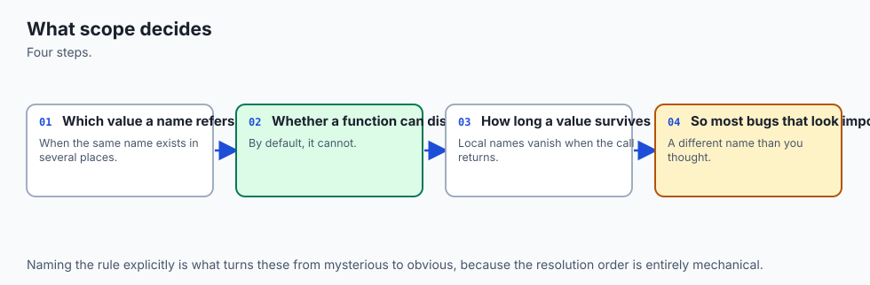

Start with **scope**: the region of your program where a name is visible. When Python meets a name like `count`, it does not search everywhere at once. It looks in a fixed order, from the most specific place outward, and stops at the first match. That order has a four-letter name, **LEGB**: **L**ocal (inside the function currently running), **E**nclosing (an outer function that wraps this one), **G**lobal (the top level of your file, the module), and **B**uilt-in (names Python always provides, like `print` and `len`). Search local, then enclosing, then global, then built-in; take the first hit; if nothing has the name, that is a `NameError`.

Assigning to a name inside a function normally creates a *new local* name — even if a global with the same name exists — which is a safety feature: a function cannot accidentally change a module-level variable just by using its name. When you genuinely need to reassign an outer name, you say so explicitly: the **`global`** keyword lets a function rebind a module-level name, and the **`nonlocal`** keyword lets an inner function rebind a variable in its enclosing function. Both are deliberately a little inconvenient, because reaching out to change outer state is exactly the thing that makes programs hard to reason about, and you should do it on purpose or not at all.

A **closure** is what you get when an inner function refers to variables from its enclosing function, and that inner function is then carried away and used elsewhere. Python keeps those captured variables alive for as long as the inner function exists, so the inner function *remembers* them.

This lets you build a **factory**: an outer function that manufactures customized inner functions — `make_multiplier(3)` returns a function that triples, `make_multiplier(10)` returns one that multiplies by ten, and each remembers its own factor. It lets you build **stateful helpers** like a counter that hands out `0, 1, 2, ...` across calls, keeping its count private. And it is the mechanism a **decorator** uses — a topic previewed here and met in full later — to wrap one function inside another.

Finally, **variadic parameters**. Sometimes you do not know in advance how many values a function will receive. Writing `def total(*numbers)` collects every positional argument into a tuple called `numbers`, so `total(2, 4, 6)` and `total(5)` both work. Writing `def build(**options)` collects every *named* argument into a dictionary called `options`, so `build(color="red", size=3)` arrives as `{"color": "red", "size": 3}`. The same two stars work at the **call site** to unpack: `total(*[2, 4, 6])` spreads a list into positional arguments, and `build(**{"color": "red"})` spreads a dictionary into keyword arguments. Put a bare `*` in a signature and every parameter after it becomes **keyword-only** — it *must* be passed by name — which makes options readable and hard to mix up.

## Historical background

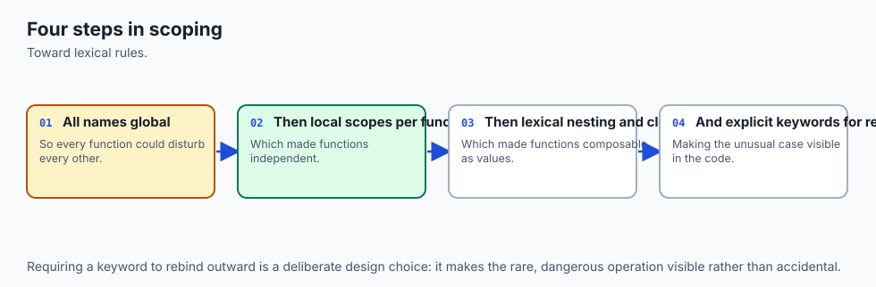

These features did not all arrive at once, and the order tells a small story about what programmers kept needing. Scope itself is as old as structured programming: the idea that a variable inside a procedure should not be visible outside it — **lexical scoping**, where a name's meaning is fixed by *where it is written* in the source, not by who calls it — was worked out in languages like Algol in the 1960s and became the default nearly everywhere. Python has used lexical scoping from the start, but its treatment of *nested* functions was refined over time.

Python 1.0 (1994) had local and global scope but did not truly support the enclosing scope: an inner function could not see the variables of the function around it, which made closures awkward. That gap was closed in **Python 2.1 and 2.2 (2001)** with the addition of nested (enclosing) scopes, described in Python Enhancement Proposal (PEP) 227 — the "E" in LEGB became real, and closures started working the way they do today.

The read side worked, but there was still no clean way for an inner function to *reassign* an enclosing variable; people resorted to tricks like wrapping the value in a list. That was fixed by the **`nonlocal`** keyword in **Python 3.0 (2008)**, specified in PEP 3104, giving the enclosing scope the same explicit "I mean to rebind this" statement that `global` had long given the module scope.

Variadic arguments have a longer pedigree. The idea of a function taking a variable number of arguments goes back to C's `printf` and earlier; Python has had `*args` and `**kwargs` since its early versions, and the specific convention — one star to gather positional arguments into a tuple, two stars to gather keyword arguments into a dictionary — has been stable for decades.

Keyword-only arguments, marked by a bare `*` in the signature, were added in **Python 3.0** via PEP 3102, precisely so that library authors could force important options to be passed by name rather than accidentally by position. The closure itself is an old idea from the Lisp and Scheme world of the 1970s, where the term "closure" describes a function together with the environment it closes over. Everything you use today is standard, stable, and battle-tested — no packages to install, no versions to chase.

## What it is — and what it is not

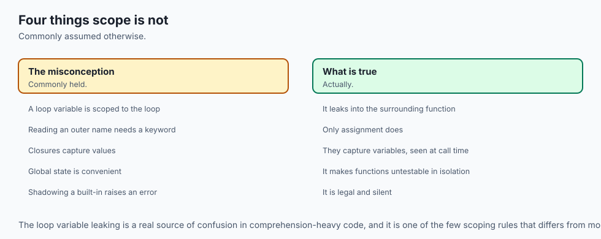

Precisely: **scope** is the set of rules Python uses to decide which variable a name refers to, resolved by the LEGB search. A **closure** is a nested function that has captured one or more variables from an enclosing scope, together with those captured variables, such that the function keeps working — and keeps seeing those variables — after the enclosing function has returned. **`*args`** is a parameter that collects extra *positional* arguments into a tuple; **`**kwargs`** is a parameter that collects extra *keyword* arguments into a dictionary; and a bare `*` in a signature marks the parameters after it as keyword-only.

It helps to be clear about what these are *not*, because each has a common misreading. Scope is *not* determined by where a function is called from — that would be "dynamic scoping," which Python does not use; a name's meaning is fixed by where the function is *written*. A closure is *not* a snapshot of values taken at creation time: it captures the *variable*, not a frozen copy, so if the enclosing variable changes later (before the inner function runs), the closure sees the new value — a subtlety that bites people who build closures in a loop.

`*args` is *not* a list — it is a tuple, and it holds only the *extra* positional arguments, after the named parameters are filled. And `**kwargs` is *not* a way to accept truly arbitrary anything — it accepts arbitrary *keyword* arguments only, and each key must be a valid identifier string. The names `args` and `kwargs` themselves are pure convention; the stars do the work, and `*items` or `**options` are equally valid and often clearer.

| Common misconception | The reality |
| --- | --- |
| "A function can see and change any variable it names." | Assigning inside a function makes a *local* by default; changing an outer name needs `global` or `nonlocal`, on purpose. |
| "Scope depends on who calls the function." | Python uses lexical scope: a name's meaning is fixed by where the function is written, not by the caller. |
| "A closure captures the value at creation time." | It captures the *variable*. If that variable changes before the inner function runs, the closure sees the new value. |
| "`*args` gives me a list of all arguments." | `*args` is a *tuple* of only the *extra positional* arguments, after the named parameters are bound. |
| "`**kwargs` accepts anything at all." | It accepts extra *keyword* arguments only, gathered into a dict; keys must be valid identifiers. |

## Why it was created and what problems it solves

Each of these features exists to remove a specific pain that programmers hit again and again.

Scope rules exist to make functions *isolated and reusable*. Without them, every variable would be visible everywhere, and a function that used a variable named `i` or `total` could silently collide with another function's `i` or `total` — the larger the program, the more certain the disaster. By defaulting new assignments to local, Python guarantees that a function's internal bookkeeping stays private, so you can drop a function into any program without fear that its variables will trample the host's.

The `global` and `nonlocal` keywords exist for the rarer, deliberate cases where you truly do want shared, mutable state — and by requiring you to *declare* that intent, they make those cases visible and searchable, which is exactly what you want for the code most likely to cause bugs.

Closures exist to solve *configuration and memory* elegantly. Often you want many functions that are the same except for a setting — twenty functions that each multiply by a different factor, a family of validators that each check a different threshold. Without closures you would pass that setting to every call, or store it in a global, or build a class.

A closure lets the outer function bake the setting in once and hand back a ready-made specialized function, keeping the setting private and tied to that function alone. And when a function needs to *remember* something between calls — a running count, the last value it saw — a closure gives it private, persistent state without a global variable and without the ceremony of a class.

Variadic parameters exist to solve *flexible, forwardable interfaces*. A function like `print` cannot know how many things you will hand it, so `*args` lets it accept any number. A library function that wraps another and wants to pass along whatever options the caller gave — without re-listing every one — uses `**kwargs` to gather them and `**` to forward them. This is the single most common reason `**kwargs` appears in AI libraries: a high-level helper accepts `**kwargs` and passes them straight down to the real model call, so new options work without the wrapper ever being updated. Keyword-only arguments solve a readability problem: `resize(image, 800, 600, True)` is a puzzle, while `resize(image, width=800, height=600, keep_aspect=True)` reads itself.

## How it works

Let us walk the machinery, from name lookup to closures to variadic calls.

### Name resolution and the LEGB rule

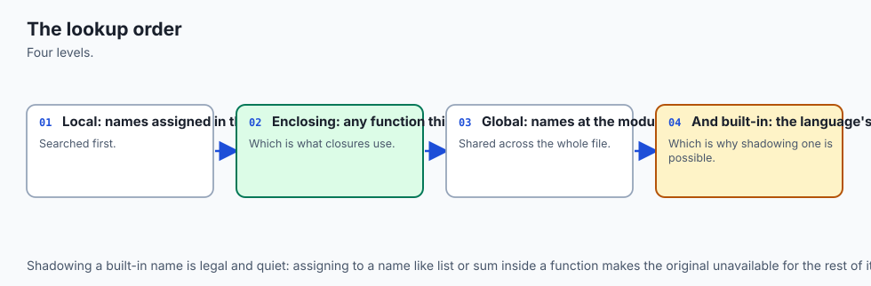

When your code uses a name, Python performs the LEGB search. The picture to hold in your head is a set of nested boxes.


Read the diagram from the inside. The **Local** box is the function currently running: its parameters and any names it assigns. The **Enclosing** box is an outer function that wraps it (only relevant for nested functions). The **Global** box is the top level of your file — the module. The **Built-in** box is the outermost, holding names Python always supplies: `print`, `len`, `sum`, `range`, and the rest. Python searches these boxes strictly outward and stops at the first that has the name. This is why a local variable "shadows" a global of the same name inside its function, and why you can use `len` anywhere without defining it — it lives in the built-in box that every search eventually reaches.

The rule for *reading* a name is pure LEGB. The rule for *assigning* is different and is the source of most confusion: an assignment `x = ...` inside a function creates or updates a **local** `x`, full stop — unless you have declared `x` as `global` or `nonlocal`. This is why the following surprises beginners:

```python
total = 0

def add(n):
    total = total + n   # ERROR: total is local here because we assign to it
    return total
```

Because `add` assigns to `total`, Python treats `total` as local throughout `add`, so `total + n` on the right tries to read a local that has no value yet — an `UnboundLocalError`. The fix is to say what you mean.

### The global and nonlocal keywords

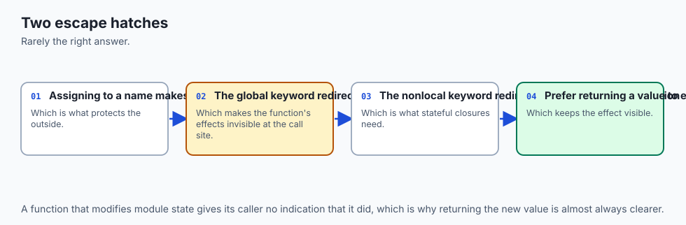

To *rebind* an outer name, declare it:

```python
count = 0

def bump():
    global count       # "count means the module-level count"
    count = count + 1  # now this reassigns the global

def make_counter():
    n = 0
    def step():
        nonlocal n     # "n means make_counter's n, not a new local"
        n += 1
        return n
    return step
```

`global count` tells `bump` that `count` refers to the module-level variable, so the assignment updates it. `nonlocal n` tells the inner `step` that `n` refers to the `n` in `make_counter`, so `step` can increment the enclosing counter rather than creating its own local. Use both sparingly. Mutating a global from many functions makes behavior depend on call order and hides data flow; the professional habit is to pass values in as arguments and return results out, reaching for `global` only for genuine module-wide constants-turned-state, and for `nonlocal` mainly inside closures where captured, private state is the whole point.

### Closures: capturing the enclosing scope

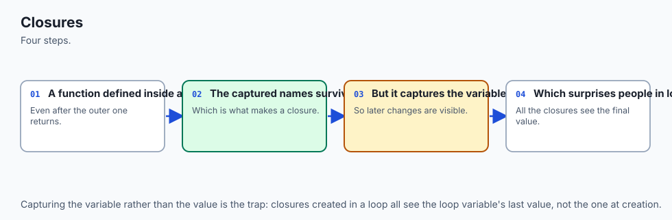

A closure forms when an inner function references enclosing variables and is then returned or otherwise carried out of its birthplace. The flow is worth seeing step by step.

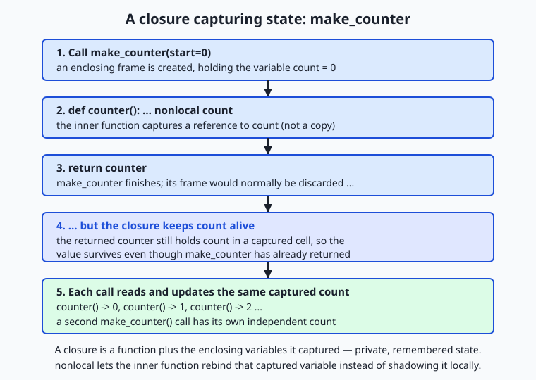

Trace it: calling `make_counter()` creates an enclosing frame holding `count`; the inner function `counter` captures a *reference* to `count`; `make_counter` returns `counter` and its frame would normally be discarded — but because `counter` still refers to `count`, Python keeps `count` alive in a captured cell. Every later call to the returned function reads and updates that same `count`, which is why a counter built this way remembers where it left off. Crucially, a *second* call to `make_counter()` builds a fresh, independent frame with its own `count`, so two counters never interfere. That independence — private state per closure — is the feature.

### Variadic parameters and unpacking

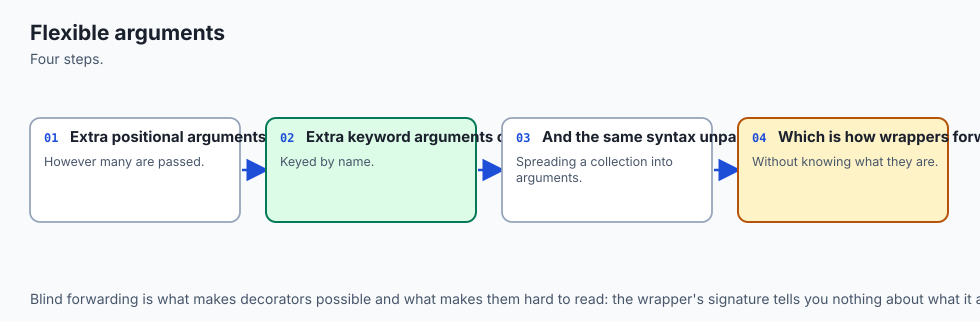

In a signature, `*args` gathers extra positional arguments into a tuple and `**kwargs` gathers extra keyword arguments into a dict. At a call site, the same stars *spread* a sequence or a mapping back out into arguments. The full order in a signature is: ordinary parameters, then `*args`, then keyword-only parameters (anything after the `*`), then `**kwargs`. A minimal tour:

```python
def demo(first, *args, sep="-", **kwargs):
    return first, args, sep, kwargs

demo(1, 2, 3, sep="+", color="red")
# first=1, args=(2, 3), sep="+", kwargs={"color": "red"}

nums = [10, 20, 30]
demo(*nums)               # spreads the list: first=10, args=(20, 30)

opts = {"sep": "|", "size": 4}
demo(1, **opts)           # spreads the dict: sep="|", kwargs={"size": 4}
```

The keyword-only `sep` sits after `*args`, so it can only be passed by name — you cannot supply it positionally, which keeps its meaning explicit. This gather-and-spread symmetry is the heart of forwarding: a wrapper writes `def wrap(*args, **kwargs): return real(*args, **kwargs)` and passes everything through untouched.

## An everyday analogy

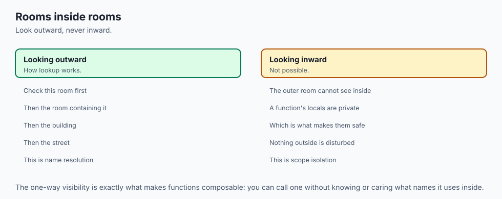

Picture a large office building where you are looking for a document or a tool. You search in a fixed order, from nearest to farthest, and stop the moment you find it. First you check the **drawer of your own desk** — that is the *local* scope, the names inside the running function. If it is not there, you check the **shared bench in your team's room** — the *enclosing* scope, the outer function that wraps you.

Still nothing? You go to the **building's central stockroom** — the *global* scope, the top level of your file. And if even the stockroom lacks it, you walk to the **public hardware store down the street that everyone in the city can use** — the *built-in* scope, the names Python always provides. You never search all four at once; you go outward and take the first hit. That is LEGB.

Now the permission slips. Anything you *make* at your own desk stays at your desk — that is why assigning a name inside a function creates a local by default, keeping your work private. To *change* what sits in the building stockroom, you need a signed **`global`** slip, filed openly so anyone can see who is altering shared supplies. To change your *team's* shared bench from your desk, you need a **`nonlocal`** slip. The slips are slightly annoying to fill out on purpose: changing shared things is exactly what causes mix-ups, so the building makes you declare it.

A **closure** is a contractor who finishes a job in your team's room and leaves the building — but on the way out packs a toolbox that still holds the team bench's shared supplies. The room may be locked behind them, yet the toolbox keeps those supplies alive and usable wherever the contractor goes. Hand two contractors their own packed toolboxes and each carries its own supplies; they never mix. That is a closure remembering enclosing variables, each instance private.

Finally, **`*args` and `**kwargs`** are an order form with two open-ended sections: "list any number of items" (the positional pile, `*args`) and "any number of labeled special instructions" (the named options, `**kwargs`). The clerk accepts however many you write, and if you already have the items on a printed list or the instructions on a sticky note, you can just clip them on — that is unpacking with `*` and `**`.

## Examples in practice

Let us build the real things this lesson is about and run them. First, a flexible aggregator using `*args` and a keyword-only option:

```python
def average(*numbers, ndigits=2):
    """Average any count of numbers; ndigits is keyword-only."""
    if not numbers:
        return 0.0
    return round(sum(numbers) / len(numbers), ndigits)

average(10, 20, 30)                 # 20.0
average(1, 2, 3, ndigits=4)         # 2.0
average(*[2, 4, 8], ndigits=1)      # 4.7  (spread a list, round to 1)
```

`*numbers` accepts however many values you pass and arrives as a tuple; `ndigits`, sitting after the star-gathered parameter, is keyword-only, so a stray number can never be mistaken for it. Next, the closure factories — a multiplier and a stateful counter:

```python
def make_multiplier(factor):
    def multiply(n):
        return n * factor        # captures 'factor' from the enclosing scope
    return multiply

triple = make_multiplier(3)
tenfold = make_multiplier(10)
triple(5)     # 15
tenfold(5)    # 50 — each closure remembers its own factor

def make_counter(start=0, step=1):
    count = start
    def counter():
        nonlocal count
        value = count
        count += step
        return value
    return counter

c = make_counter()
c(), c(), c()          # 0, 1, 2 — private state remembered across calls
d = make_counter(100)  # independent: d() -> 100, and c is unaffected
```

`triple` and `tenfold` are two closures over the same code, each holding a different captured `factor`. `c` and `d` are two counters, each with its own `count`; calling one never disturbs the other. Now the AI-flavored `**kwargs` pattern — merging caller options over defaults, exactly how a generation call takes configuration:

```python
DEFAULTS = {"temperature": 0.7, "max_tokens": 256, "model": "demo"}

def build_request(prompt, **kwargs):
    """Merge caller kwargs over the defaults — the ML config pattern."""
    config = {**DEFAULTS, **kwargs}     # spread both dicts; later wins
    return {"prompt": prompt, **config}

build_request("hello")
# {"prompt": "hello", "temperature": 0.7, "max_tokens": 256, "model": "demo"}

build_request("hello", temperature=0.2, max_tokens=500)
# temperature and max_tokens overridden; model still "demo"
```

The double-star in the signature gathers every keyword argument into `kwargs`; the double-stars in `{**DEFAULTS, **kwargs}` spread two dictionaries into one, with the caller's values winning because they come last. This four-line function is the shape of nearly every "pass generation settings" API you will meet: a helper takes `**kwargs` and merges or forwards them, so new options work without the helper changing. The Day 58 lab has you build and test every one of these — `total`, `average`, `make_counter`, `make_multiplier`, and `build_request` — proving the captured state and the kwargs behavior with real assertions.

## Implications: security, privacy, performance, scalability, and cost

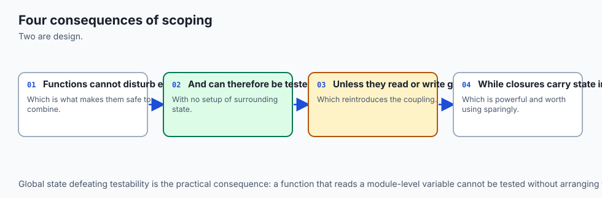

**Security.** The relevant habit is the one from earlier lessons, now applied to arguments: a function that forwards `**kwargs` blindly forwards *everything*, including options a caller should not be able to set. If a web handler passes user-supplied keyword arguments straight into a database or model call, a caller could set an option that was never meant to be exposed — a "mass assignment" bug.

The fix is to validate or allow-list the keys you forward, not to trust the whole `kwargs` dict. Closures help security in one nice way: state captured in a closure is *private* — there is no attribute a caller can reach in to modify — so a rate limiter or token bucket built as a closure keeps its counters out of reach.

**Privacy.** Closures give you genuine data hiding without a class: a captured variable is reachable only through the inner function, so secrets and running state stay encapsulated. The flip side is a gotcha worth stating: because a closure keeps its captured variables alive, a closure that captured a large object keeps that object in memory for as long as the closure exists. If you stash closures in a long-lived registry, be aware of what they are holding.

**Performance.** Name lookup follows LEGB every time, and local lookups are the fastest because they are found first; global and built-in lookups take a little longer. In tight numerical loops, this is a real, if small, effect — one classic micro-optimization is to bind a global or built-in to a local name before a hot loop. You will rarely need this, but it explains why heavily optimized library code sometimes writes `_len = len` at the top of a function. Closures themselves are cheap to create and call; the cost to watch is the memory a captured variable keeps alive, noted above.

**Scalability.** As programs grow, disciplined scope is what keeps them comprehensible. Code that mutates globals from many places scales badly: every new function that touches the shared state is another thing that can break the others, and the order of calls starts to matter in ways no one can track. Passing arguments in and returning values out — and using closures for the rare, genuinely stateful helper — keeps each function's effects local and testable, which is exactly what lets a codebase grow without collapsing under its own coupling.

**Cost.** These features are free in every sense: they are core language, nothing to install. The cost they *save* is developer time and bugs. A flexible `**kwargs` interface means a wrapper does not need updating every time the wrapped function gains an option, and a closure means you do not write a whole class for one remembered value. The expensive failure mode is the opposite — global-soup code where a change in one function silently breaks three others — which is precisely what disciplined scope prevents.

## Alternatives: free, open source, and commercial

These are language features, not products, so "alternatives" means other ways to achieve the same ends — remembered state, flexible arguments, and shared data — and when each is the better choice. All are part of Python itself; none costs anything.

| Approach | What it is | When to choose it | Cost |
| --- | --- | --- | --- |
| Closure (function factory) | An inner function capturing enclosing variables | One or two pieces of private, remembered state; a family of specialized functions | Free, built in |
| Class with `__init__` and methods | An object bundling state and behavior | Several pieces of state, many operations on them, or you need inheritance | Free, built in |
| `functools.partial` | Pre-fills some arguments of a function | You only need to fix arguments, not remember mutable state | Free, standard library |
| Default argument value | A parameter with a fallback value | A single fixed option; simpler than `**kwargs` when the set is known and small | Free, built in |
| `*args` / `**kwargs` | Gather or forward arbitrary arguments | Unknown-arity inputs, or wrappers that forward options they do not name | Free, built in |

**Closures — how to use them, with an example.** Reach for a closure when you need one small function that remembers a setting or a running value. `make_multiplier(3)` above is the whole pattern: bake the setting in, return the specialized function. It is lighter than a class and keeps the state private.

**Classes — how to use them, and when to prefer them.** When state grows past a value or two, or you need several methods over it, a class is clearer. A closure counter is elegant; a bank account with a balance, a history, and deposit/withdraw/statement methods wants a class. You meet classes in full in a later week; for today, know that a closure is the right tool for *small* remembered state and a class for *rich* state.

**`functools.partial` — how to use it, with an example.** When you only need to fix some arguments of an existing function — not remember mutable state — `partial` is the crisp choice:

```python
from functools import partial

def power(base, exponent):
    return base ** exponent

square = partial(power, exponent=2)
square(5)   # 25
```

`partial` and a closure overlap; prefer `partial` when you are simply pre-filling arguments, and a closure when you need captured, changing state or a computed inner function. For flexible arguments, `*args`/`**kwargs` are the only real answer, and the choice is qualitative: use them when arity is unknown or you are forwarding, and prefer explicit named parameters (with defaults) whenever the set of options is small and known, because explicit parameters document themselves and let tools check your calls.

## Comparison with related concepts

| Concept A | Concept B | Key difference |
| --- | --- | --- |
| Local scope | Global scope | A local name lives only inside its function and is searched first; a global lives at module level and is searched only if no local (or enclosing) name matches |
| `global` | `nonlocal` | `global` rebinds a *module-level* name from inside a function; `nonlocal` rebinds an *enclosing function's* name from inside a nested function |
| Closure | Class | A closure bundles one function with a little captured state; a class bundles rich state with many methods and supports inheritance |
| `*args` | `**kwargs` | `*args` gathers extra *positional* arguments into a tuple; `**kwargs` gathers extra *keyword* arguments into a dict |
| `*` in a signature | `*` at a call site | In a signature `*` gathers (or, bare, marks keyword-only); at a call site `*` spreads a sequence into positional arguments |
| Keyword-only argument | Ordinary parameter | A keyword-only argument (after a bare `*`) must be passed by name; an ordinary parameter may be passed by position or name |

## When to use it — and when not to

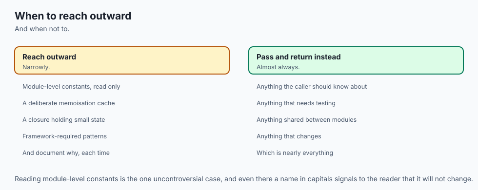

Reach for **closures** when you need a small amount of private, remembered state or a family of specialized functions: counters, accumulators, `make_multiplier`-style factories, simple decorators, and callbacks that must remember a little context. Reach for **`*args`** when a function should accept any number of positional inputs — an aggregator, a wrapper, a `print`-like tool. Reach for **`**kwargs`** when you are forwarding options you do not want to name one by one, or building a configurable interface in the AI-library style. Reach for **keyword-only arguments** whenever an option's meaning would be unclear as a bare positional value. And reach for **`global`/`nonlocal`** only when you have decided, deliberately, that shared or captured mutable state is truly what the design needs.

Know equally when *not* to. Do not use `global` as a convenient back door to pass data between functions — pass arguments and return values instead; globals mutated from many places are the classic source of unpredictable bugs. Do not reach for a closure when several pieces of state and many operations are involved — that is a class.

Do not sprinkle `**kwargs` on every function "just in case": it hides a function's real interface, defeats editor autocomplete and type checks, and makes typos silent (a misspelled `temprature` vanishes into `kwargs` instead of raising an error), so prefer explicit named parameters whenever the option set is small and known. The skill is matching the tool to the need: explicit parameters for known options, `**kwargs` for genuine flexibility and forwarding, closures for small remembered state, classes for rich state, and the `global`/`nonlocal` keywords as rare, declared exceptions rather than habits.

Here is where today points, straight at your AI work. When you call `model.generate(prompt, temperature=0.2, max_tokens=500)`, the keyword arguments you pass are gathered by a `**kwargs` inside the library and forwarded down to the real generation call — the exact pattern of `build_request` above. When you register a callback to run at the end of each training epoch, or a hook to fire before a layer computes, that callback is almost always a closure remembering the state it needs — the current step, a running average, a file to write to.

When a learning-rate scheduler advances its step, or a rate limiter remembers the last request time, closures and captured state are doing the remembering. And every time a function reads a value you did not expect, LEGB — local shadowing a global, or a closure capturing a variable that later changed — is the lens that explains it. You have just learned the argument-passing and state-capturing machinery that the whole ecosystem of training and serving code is built from.

## The AI connection

- **Scope decides which name refers to what**, and misunderstanding it produces bugs that look
  impossible.
- **Closures capture variables rather than values**, which surprises people in loops
  specifically.
- **Flexible argument passing is what makes decorators and wrappers possible**, which
  frameworks use everywhere.
- **Every framework callback relies on these mechanics**, including training hooks and
  middleware.
- **Explicit is better than clever** here, because dynamic argument handling is hard to read
  and harder to debug.

## Knowledge check

Try these from memory before looking back:

1. Name the four scopes of the LEGB rule in search order, with one sentence on what each contains.
2. Explain why `total = total + n` inside a function that has a module-level `total` raises an error, and give two different one-line fixes.
3. What is a closure? Describe what `make_counter()` captures and why two separate counters do not interfere with each other.
4. Given `def f(a, *args, sep="-", **kwargs)`, say what `a`, `args`, `sep`, and `kwargs` each receive when you call `f(1, 2, 3, sep="+", color="red")`.
5. Why does `**kwargs` appear at the end of so many machine-learning function signatures, and what is one risk of forwarding a whole `kwargs` dict without checking it?

## Hands-on exercise

Time to build flexible functions of your own. In the Day 58 lab you assemble **Flexible Functions** — a small module with variadic aggregators (`total`, `average`), two closure factories (`make_counter`, `make_multiplier`), and a `**kwargs` config merger (`build_request`) — from a starter, one exercise at a time, then run an automated suite that proves captured state and kwargs behavior. Work in the lab directory; every command below is run from there.

First, read and run the finished reference to see the target, then drive its demo:

```bash
python3 examples/flexible.py
```

Now open `starter/flexible.py` and complete its five numbered exercises — variadic `total`, keyword-only `average`, the `make_counter` closure with `nonlocal`, the `make_multiplier` factory, and the `build_request` kwargs merge — using the reference only when stuck. Run your version's demo the same way:

```bash
python3 starter/flexible.py
```

Finally, prove the closures keep independent state by importing them and exercising two instances without running the whole demo:

```bash
python3 -c "import sys; sys.path.insert(0, 'examples'); from flexible import make_counter; c = make_counter(); d = make_counter(100); print(c(), c(), d(), c())"
```

### Expected output

A correct run of the reference demo and the import check looks exactly like this:

```text
$ python3 examples/flexible.py
total() -> 0
total(2, 4, 6) -> 12
average(10, 20, 30) -> 20.0
average(1, 2, 3, ndigits=4) -> 2.0
counter: 0 1 2 3
second counter is independent: 100
triple(5) -> 15 ; tenfold(5) -> 50
build_request('hello') -> {'prompt': 'hello', 'temperature': 0.7, 'max_tokens': 256, 'model': 'demo'}
build_request('hello', temperature=0.2) -> temperature=0.2, model=demo

$ python3 -c "import sys; sys.path.insert(0, 'examples'); from flexible import make_counter; c = make_counter(); d = make_counter(100); print(c(), c(), d(), c())"
0 1 100 2
```

The counter prints `0 1 2 3` because its captured `count` survives between calls; the second counter starts at `100` untouched by the first; the two multipliers each remember their own factor; and `build_request` fills defaults and lets a keyword override just `temperature`. The final line — `0 1 100 2` — proves the two closures hold independent state: `c` advances 0, 1, 2 while `d` returns 100 in the middle.

### Validate your work

You are done when you can check every box:

- [ ] `total()` returns `0` and `total(2, 4, 6)` returns `12`.
- [ ] `average(10, 20, 30)` returns `20.0`, and `ndigits` can only be passed by name.
- [ ] `make_counter()` returns a function that yields `0, 1, 2, ...`, and two counters do not interfere.
- [ ] `make_multiplier(3)` returns a function that triples, independent of `make_multiplier(10)`.
- [ ] `build_request("hello")` fills all defaults; passing `temperature=0.2` overrides only that key.
- [ ] Your completed `starter/flexible.py` demo matches the reference demo output.
- [ ] `bash tests/run_tests.sh` ends with `0 failure(s)` and exits `0`.

### Troubleshooting

- **`UnboundLocalError: local variable 'count' referenced before assignment`.** Your inner `counter` assigns to `count` but is missing the `nonlocal count` declaration, so Python treats `count` as a brand-new local. Add `nonlocal count` as the first line of `counter`.
- **Both counters advance together.** You captured a *shared* or module-level variable instead of a per-call one. Each `make_counter` call must define its own `count` inside the function so every returned closure gets its own.
- **`average(1, 2, 3, 4)` changed the rounding.** You made `ndigits` an ordinary parameter, so the fourth number landed in it. Put `ndigits` *after* `*numbers` so it becomes keyword-only.
- **`build_request` ignores my overrides.** You merged in the wrong order. Write `{**DEFAULTS, **kwargs}` so the caller's `kwargs` come *last* and win; `{**kwargs, **DEFAULTS}` would let the defaults clobber the caller.
- **`TypeError: build_request() got an unexpected keyword argument`.** You forgot the `**kwargs` parameter in the signature, so extra keywords have nowhere to go. Add `**kwargs` as the last parameter.

### Common mistakes

- **Assigning to an outer name without `global`/`nonlocal`.** The assignment silently creates a local and the outer value never changes (or you get an `UnboundLocalError`). Declare your intent.
- **Believing a closure snapshots values.** It captures the *variable*. Building closures in a loop that all reference the loop variable is the classic trap — each ends up seeing the loop variable's final value. Bind it as a default argument or via a factory if you need the value frozen.
- **Overusing `**kwargs`.** A signature that is just `**kwargs` tells a reader nothing and turns typos into silent no-ops. Name the options you know; reserve `**kwargs` for real flexibility and forwarding.

## Practice assignment

Design and build a *second* flexible-functions module of your own, in your Day 58 lab folder, exercising each feature once. Include: (1) a variadic aggregator other than sum or average — for example `longest(*words)` returning the longest string, or `merge(**sections)` combining named lists — using `*args` or `**kwargs`; (2) a closure factory that captures state — for example `make_accumulator()` that returns a function adding each call's argument to a running total and returning the total, or `make_limiter(max_calls)` that returns a function reporting whether the limit is exceeded; and (3) a `**kwargs` configuration merger with a `DEFAULTS` dictionary, in the `build_request` style, that fills defaults and lets callers override.

Before writing code, fill in `starter/functions-worksheet.md`: name each function, its signature, what it captures or gathers, and one good call plus one edge case (empty input, an override) for each. Then implement them, add a short `if __name__ == "__main__":` demo that prints one call of each, and run it. Finally, write three `assert` lines — one proving your closure remembers state across two calls, one proving a keyword-only or override behaves correctly, and one proving an aggregator handles the empty case — and confirm the script exits zero. Keep the module; it rehearses the exact patterns the rest of the course leans on.

## Extension challenge

Take your flexible functions one step toward professional code. First, write a **minimal decorator** — the closure-powered pattern previewed in this lesson — called `logged` that wraps any function so that calling it prints the arguments it received and the value it returned, then returns the real result; make it forward arbitrary arguments with `def wrapper(*args, **kwargs): result = func(*args, **kwargs)`, so it works on `total`, `average`, and `build_request` alike.

Second, make `make_counter` richer: give the returned function an optional `reset` behavior by returning *two* closures from one factory — a `next_value` function and a `reset` function that both share the same captured `count` via `nonlocal` — and show that resetting through one is visible through the other, proving they close over the *same* variable.

Third, demonstrate the loop-capture trap and its fix: build a list of three functions in a loop that each should multiply by their index, show that the naive version makes all three behave identically (all capture the final loop value), then fix it with a default argument (`lambda n, i=i: n * i`) or a `make_multiplier(i)` factory, and write a comment explaining exactly why the naive version failed in terms of "captures the variable, not the value." You will have built a decorator, shared state across two closures, and diagnosed the single most famous closure bug — the machinery behind hooks, schedulers, and wrappers throughout real AI code.