## Why this matters

For two days you have been sharpening single functions — how they take arguments, return values, and hold their own private scope. But no real program is one function, and almost no real program is one file. The moment your code grows past a screen or two, you face a choice that quietly decides whether it will ever be reusable, testable, or shippable: do you keep piling everything into one enormous script, or do you split it into files that each do one job? Today is about doing the split well, because the difference is not cosmetic — it is the line between code you can build on and code you can only rewrite.

This matters directly, and early, for the AI work ahead. A serious machine-learning project is never a single file. It is a package with parts that have names and jobs: a module that loads and cleans data, a module that defines the model, a module that runs training, a module that serves predictions, and a folder of tests that check all of them. When you read an open-source AI project — a library that fine-tunes models, a framework that runs agents — you are reading a package of modules, and every line begins with `import`. If you cannot follow how one file pulls in another, the whole codebase is a locked room. Learn imports and layout, and the room opens.

The concrete consequences are the kind you feel in an afternoon. Code trapped in one giant file cannot be imported by a test, so it cannot be tested except by running the whole thing by hand — and untested code is where the expensive bugs hide. Code with no clear layout means every change risks breaking something unrelated, because everything can touch everything. And code that is one long script cannot be reused: the useful function you wrote for one project stays stuck there, uncopyable, instead of becoming a module you `import` into the next. A notebook that computes something once is a fine sketch; a package you can import, test, and run from a command is a tool. Today you turn a sketch into a tool.

## The idea in plain language

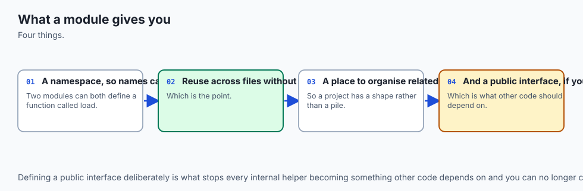

Start with the smallest unit. A **module** is just a single `.py` file. That is the whole definition: any file of Python — `tokens.py`, `stats.py` — is a module, and its name is the filename without the extension. When you write `import tokens`, you are asking Python to find that file, run it once, and hand you back an object through which you can reach everything it defined. The functions, classes, and variables at the top of `tokens.py` become `tokens.tokenize`, `tokens.normalize`, and so on. Splitting a program into modules is nothing more mysterious than splitting a long document into chapters, each about one thing.

A **package** is the next unit up: a *directory* of modules that Python treats as one importable name. A folder called `wordstats/` containing `tokens.py` and `stats.py` lets you write `import wordstats.tokens`. The folder becomes a package because it contains a special file, **`__init__.py`** — historically the marker that says "this directory is a package," and the natural place to declare the package's public face, so a user can write `from wordstats import tokenize` without knowing which file `tokenize` actually lives in.

There are three ways to pull names in, and you will use all of them. Plain **`import module`** brings in the module and makes you spell out `module.name` at every use — verbose but unambiguous. **`from module import name`** (a **from-import**) reaches inside and binds just the name you want, so you can write `name` directly. And **`import module as alias`** (an **import-as**) brings in the module under a shorter name — the reason nearly every data-science file starts `import numpy as np`. Around all of this sits one runtime idea you must understand: the `if __name__ == "__main__":` guard, which lets a single file be *both* a program you run and a module you import, doing its "run" behaviour only in the first case. Get these pieces — module, package, the three imports, and the guard — and you can organize a program of any size.

## Historical background

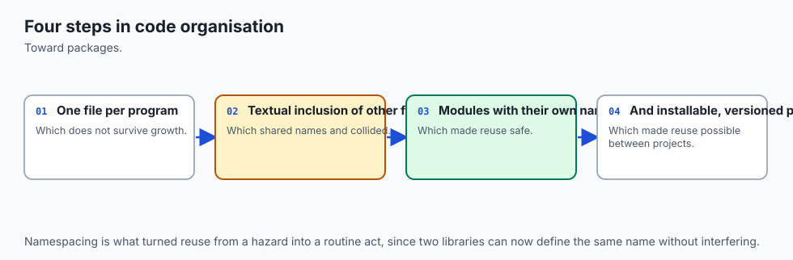

The idea that a program should be built from separate, named, reusable pieces is older than Python and is one of the load-bearing ideas of the whole field. In the late 1960s, as software projects grew large enough to collapse under their own weight (a crisis serious enough to earn the name "the software crisis"), researchers argued that the cure was **modular programming**: dividing a system into independent parts, each hiding its inner workings behind a small, stable interface. In a 1972 paper, "On the Criteria To Be Used in Decomposing Systems into Modules," David Parnas made the case that would guide the next fifty years — that modules should be organized around *hiding decisions that are likely to change*, so that a change stays contained inside one module instead of rippling across the whole program.

Every time you put "how we tokenize text" in one file and "how we count words" in another, you are applying Parnas's rule.

Python built these ideas in from the start. When Guido van Rossum released Python at the beginning of the 1990s, the module system — a file as a module, `import` to load it, a search path to find it — was already core, and the language shipped with a large standard library of modules precisely so that common jobs came pre-solved and importable ("batteries included," as the community put it). Packages — directories of modules marked by an `__init__.py` — followed as projects grew beyond what a flat pile of files could organize. The mechanism has been refined over the decades (Python 3.3, in 2012, even allowed packages without an `__init__.py` in some cases), but the shape you learn today is the shape professional Python has used for a generation, and it is the shape every AI library on the internet is built in.

## What it is — and what it is not

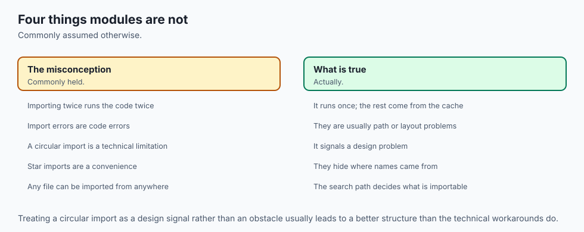

Concretely, for this lesson: a **module** is a `.py` file you can import; a **package** is a directory of modules, marked and given a public interface by an `__init__.py`; **importing** is the act of loading a module (running it once) and binding a name to reach its contents; and a **project layout** is the arrangement of those packages and modules — plus a `tests/` directory and an entry point — into a structure a stranger could navigate. The payoff is that each piece can be understood, reused, and tested on its own.

It helps to say what these are *not*, because the misconceptions cause real errors. An `import` is **not** like `#include` in C or copying and pasting text: it does not paste the file's source into yours. It *runs* the module once and gives you a reference to the resulting object — a distinction that explains why a variable changed in one module is seen the same everywhere, and why import-time side effects happen only once. A module is **not** reloaded every time you import it; the second `import` is nearly free because Python keeps a **module cache**.

A package is **not** just any folder of `.py` files you happen to have; it is a folder Python can find on its search path and treat as an importable unit. And splitting into modules is **not** about line count for its own sake — a well-split hundred-line package beats a tidy-looking thousand-line file, because the win is *separation of concerns*, not smallness.

| Common misconception | The reality |
| --- | --- |
| "`import` pastes the other file's code into mine." | It *runs* the module once and binds a name to the resulting object. Nothing is textually copied. |
| "Each `import` re-runs the file." | The first import runs and caches it in `sys.modules`; later imports reuse the cached module — its top-level code runs only once. |
| "A module and a package are the same thing." | A module is one `.py` file; a package is a directory of modules marked by `__init__.py`. |
| "`from module import *` is the clean way to import." | It floods your namespace with names you did not choose and hides where things come from. Import the specific names you need. |
| "More files always means better structure." | The goal is one responsibility per module and dependencies that point one way — not the largest possible number of files. |

## Why it was created and what problems it solves

Modules and packages exist to solve four problems that appear the instant a program grows, and each maps to something you will care about in AI work. The first is **reuse**: a function worth writing is worth using more than once, and a function stuck in a run-once script can only be copied, which means it drifts and rots. As a module, it is imported — one source of truth, used everywhere. The second is **testing**: a test is a program that imports your code and checks it, so code that cannot be imported cannot be tested automatically, and today's guard is precisely what makes your code importable.

The third is **navigability**: names create a map. When "load the data" lives in `data.py` and "define the model" in `model.py`, a newcomer — or you, six months later — can find things without reading everything. The fourth is **containment**: with clear module boundaries, a change to how one part works stays inside that part, exactly Parnas's argument, so you can improve the tokenizer without touching the counter.

There is a fifth problem, quieter but universal: **name collisions**. Two files can both define a function called `load`, and as long as they live in different modules there is no conflict, because each name lives inside its module's namespace — `data.load` and `model.load` are different names. Modules are Python's answer to "everyone wants to call their function `main`." Without them, every large program would be a shouting match of clashing names; with them, each module is a room where names are private until deliberately shared.

## How it works

Let's walk the machinery from the file up to the running program, in the order the pieces fit together.

### From a file to a package

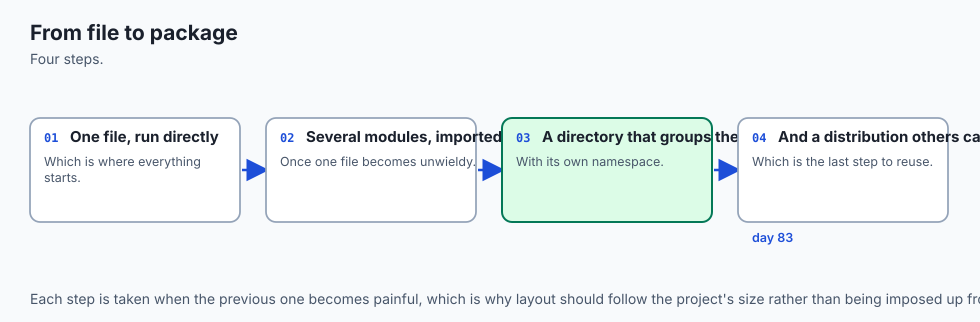

A single file, `tokens.py`, is already a module: `import tokens` runs it once and gives you `tokens.tokenize`. To group several modules, you put them in a directory and add an `__init__.py`. That file can be empty (its mere presence marks the package), but the professional habit is to use it as the package's front desk: it imports the useful names from the submodules and re-exports them, so users of your package write `from wordstats import tokenize` and never need to know the internal file layout. The diagram below shows the whole small-project shape at once — the package of responsibility modules, the `__init__.py`, the `__main__.py` entry point, and the `tests/` directory that sits outside the package and imports it.

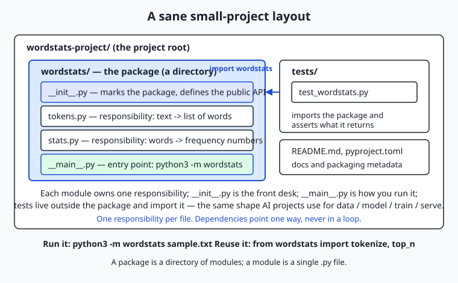

Read it as a set of nested boxes. The outermost is the project root — the folder you would put under version control. Inside it sits the `wordstats/` package. Inside *that* are the modules, each with one job: `tokens.py` turns text into words, `stats.py` turns words into counts, `__init__.py` declares the public API, and `__main__.py` is the runnable entry point. Alongside the package, not inside it, is `tests/`, whose files `import wordstats` and check what it returns. This is the same shape, scaled down, that an AI project uses to hold `data`, `model`, `train`, and `serve` as separate modules under one package.

### The three imports, and absolute versus relative

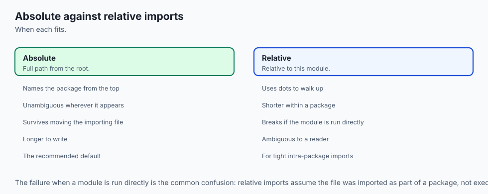

Inside `__main__.py` you will see `from .tokens import tokenize`. The leading dot makes it a **relative import**: "from the `tokens` module *in this same package*." Relative imports are how one part of a package refers to a sibling without naming the whole package, which keeps the package movable and rename-safe. From *outside* the package — in a test, or in another project — you use an **absolute import** instead: `from wordstats.tokens import tokenize`, the full path from the top. The rule of thumb is simple: use absolute imports from outside the package (they are explicit and unambiguous), and relative imports for siblings referring to each other inside it. Both `from`-imports here bind a single name; a plain `import wordstats.stats` would instead give you the whole module to call as `wordstats.stats.top_n`, and `import wordstats.stats as st` would shorten that to `st.top_n`.

### How Python finds a module, and the cache

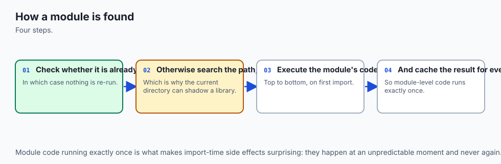

When you run `import wordstats.tokens`, Python does not scan your disk. It follows a precise procedure, drawn in the flowchart below. First it checks the **module cache**, a dictionary named `sys.modules` holding every module already imported in this process. If `wordstats.tokens` is there, Python hands back the cached object immediately — this is why importing a module a second time is nearly free and why a module's top-level code runs *only once*, no matter how many files import it. If it is not cached, Python searches **`sys.path`**, an ordered list of directories: for a `python3 -m` run the current directory comes first, followed by the standard library and installed-package locations. Python walks that list in order and imports the *first* match it finds. When it finds the file, it executes the module once, stores the result in `sys.modules`, and finally binds the name in your file.


Two consequences fall straight out of this procedure. The first is a whole class of bugs: if you name your own file `re.py` and it sits earlier on `sys.path` than the standard library, your file *shadows* the real `re` module and gets imported instead — which is why this lesson's tokenizer module is called `tokens.py`, not `tokenize.py` (there is a standard-library `tokenize`). The second is the meaning of the dreaded `ModuleNotFoundError`: it does not mean the file is missing from your disk, only that Python did not find it anywhere *on `sys.path`* — usually because you ran the command from the wrong directory.

### The run-or-import switch

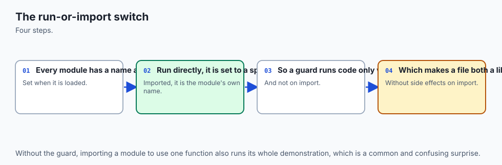

Every module has a built-in variable, **`__name__`**. When Python imports a module, it sets that module's `__name__` to the module's dotted name, such as `"wordstats.tokens"`. But when you run a file *directly* — `python3 -m wordstats`, or `python3 script.py` — Python sets `__name__` to the special string **`"__main__"`** for that file. The guard `if __name__ == "__main__":` reads this switch: the code inside it runs only when the file is the one you launched, and is skipped when the file is merely imported. That is the entire trick behind a file that is both a usable program and an importable library. Put the runnable behaviour — read a file, print a report, exit — behind the guard, and keep the reusable functions above it, and the same file serves both masters.

## An everyday analogy

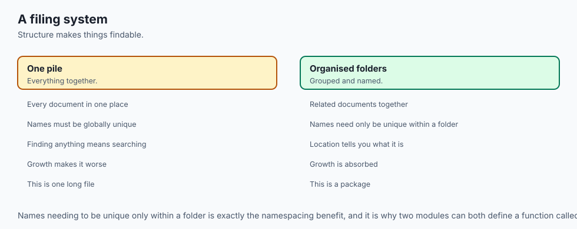

Think of a well-run library. A **module** is a single book: one `.py` file, one subject, with a spine label — its name. A **package** is a labeled shelf holding related books, and the little index card at the end of the shelf that lists "what's here and where" is the **`__init__.py`**: a reader can consult the shelf's card and find the right book without pulling down every volume. To **import** a book is to request it by its call number. When you ask for a book, the librarian does not run to the stacks blindly — she first checks the **reserved cart behind the desk** (the **module cache**): if this book was fetched earlier today, she hands you the same copy already sitting there, rather than making the long trip again.

Only if it is not on the cart does she consult the ordered list of rooms to search (**`sys.path`**), walk to the first room that has it, bring it back, and — importantly — place a copy on the reserved cart so the next request is instant.

The analogy carries the finer points too. An **absolute import** is a full call number from the library's master catalog; a **relative import** is "the book right next to this one on the same shelf" — shorter, and it still works if the whole shelf is moved to another room. The `__name__ == "__main__"` **guard** is a note inside a book that says *do the front-desk demonstration only if a reader checks this book out directly — not if another book merely cites you*.

And a circular import is two books that each open with "before reading me, go read that other book first," which each in turn says the same about the first: nobody can ever start. The librarian's fix is the programmer's fix — pull the shared passage out into a third book that both of the others cite, so neither depends on the other. Keep this library in mind and the whole import system stops feeling like magic.

## Examples in practice

Here is the whole idea in one small package, `wordstats`, that counts word frequencies. First, the "before" — everything crammed into one script, `single_file.py`, where the real work only happens when the file is run:

```python
import re, sys
from collections import Counter

if __name__ == "__main__":
    text = open(sys.argv[1]).read() if len(sys.argv) > 1 else sys.stdin.read()
    words = re.findall(r"[a-z0-9']+", text.lower())
    ordered = sorted(Counter(words).items(), key=lambda p: (-p[1], p[0]))
    print(f"{len(words)} words, {len(set(words))} unique")
    for rank, (word, count) in enumerate(ordered[:5], start=1):
        print(f"{rank}. {word}: {count}")
```

It runs, but nothing in it can be imported or tested — the logic is welded to the "run" path. Now the "after," split by responsibility. The tokenizing module, `wordstats/tokens.py`:

```python
import re
_WORD_RE = re.compile(r"[a-z0-9']+")

def tokenize(text):
    return _WORD_RE.findall(text.lower())
```

The counting module, `wordstats/stats.py`:

```python
from collections import Counter

def count_words(words):
    return dict(Counter(words))

def top_n(words, n=5):
    counts = count_words(words)
    return sorted(counts.items(), key=lambda p: (-p[1], p[0]))[:n]
```

The package's front desk, `wordstats/__init__.py`, using **relative** `from`-imports to define the public API:

```python
from .tokens import tokenize
from .stats import count_words, top_n
__version__ = "1.0.0"
```

And the entry point, `wordstats/__main__.py`, with the guard:

```python
import sys
from .tokens import tokenize
from .stats import top_n

def report(text, n=5):
    words = tokenize(text)
    lines = [f"{len(words)} words, {len(set(words))} unique"]
    for rank, (word, count) in enumerate(top_n(words, n), start=1):
        lines.append(f"{rank}. {word}: {count}")
    return "\n".join(lines)

def main(argv):
    text = open(argv[1]).read() if len(argv) > 1 else sys.stdin.read()
    print(report(text))
    return 0

if __name__ == "__main__":
    sys.exit(main(sys.argv))
```

Now watch what the split buys you. You can *run* it as a program — `python3 -m wordstats sample.txt` — and, because `report` is a pure function above the guard, you can also *import and test* it: `from wordstats.__main__ import report; report("a a b")` returns the report string without reading a file or launching anything. You can pull the public API straight in — `from wordstats import tokenize, top_n` — and reuse the pieces in a completely different program. Real AI libraries work exactly this way: you `from transformers import pipeline` or `import torch.nn as nn`, reaching into a large package for the one piece you need, precisely because their authors split responsibilities into modules and declared a public API. The lab has you perform this refactor yourself and prove, with tests that import your modules, that it worked.

## Implications: security, privacy, performance, scalability, and cost

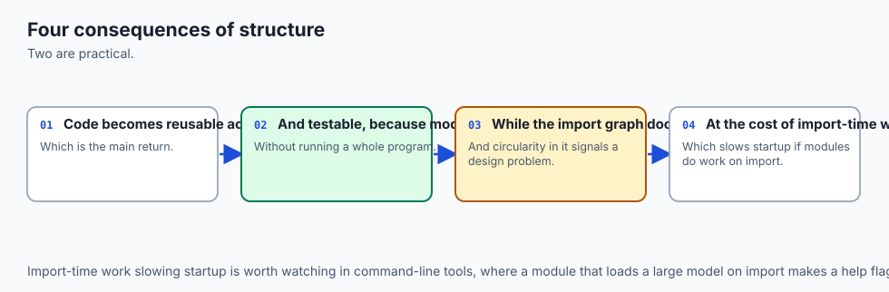

**Security.** An `import` is not passive: Python *executes* a module's top-level code the first time it is imported. Importing an untrusted module therefore runs untrusted code — one of the reasons supply-chain attacks target package repositories, slipping malicious code into a popular package's import path. Two habits follow: read what you import, and be deliberate about `sys.path`. Because the current directory is searched first for `python3 -m`, a hostile or careless file in your working directory can shadow a standard-library module (name a file `random.py` and watch imports of `random` break in confusing ways). Keep module names distinct from the standard library, and never add untrusted directories to the path.

**Privacy.** Modules give you a natural boundary for sensitive material. Secrets — API keys, credentials — belong in their own module or, better, in environment variables read by one small module, never scattered through the codebase or hard-coded where they can leak into logs, exports, or version control. A single "configuration" module is easy to audit and easy to keep out of a public release; secrets sprinkled across ten files are neither.

**Performance.** The module cache makes imports cheap after the first, so importing a module in a loop costs almost nothing — but the *first* import runs all of the module's top-level code, so heavy work at module top level (loading a large file, building a big table) makes every program that imports it slow to start. The professional habit is to keep top-level code light — definitions, not actions — and put real work inside functions that run only when called. This is the same instinct as the `__main__` guard: nothing expensive should happen merely because a file was imported.

**Scalability.** Clear module boundaries are what let a codebase grow without seizing up, and what let a *team* grow. When responsibilities are separated into modules with small interfaces, two people can work on the tokenizer and the counter at once without colliding, and a new module — a new responsibility — is added as one new file plus a couple of import lines, not a risky edit to a giant shared file. This is why every large AI framework is a deep tree of packages: it is the only structure that scales to hundreds of contributors.

**Cost.** Bad structure has a direct price, and it is paid in the most expensive currency in software: developer time. Untestable code (because it cannot be imported) ships more bugs; tangled code takes longer to change safely; unnavigable code makes every newcomer slow. The hours you save later by splitting responsibilities today dwarf the minutes the split costs. For AI specifically, code you can import and test is code you can put in a pipeline and automate; code you cannot is code a human must babysit.

## Alternatives: free, open source, and commercial

"Alternatives" here means the tools and layouts you will actually meet for organizing and importing Python code, and how to choose among them.

| Tool / approach | What it is | When to choose it | Cost |
| --- | --- | --- | --- |
| Standard `import` + packages | Python's built-in module system (this lesson) | Always — it is the foundation everything else builds on | Free, built in |
| A flat package (`pkg/` of modules) | One package directory, modules by responsibility | Small-to-medium projects and libraries; where you are today | Free, built in |
| The `src/` layout | Package under a top-level `src/` directory | Larger projects and distributable libraries; avoids importing the wrong copy during tests | Free (convention) |
| `pytest` | The standard third-party test runner | Once you have importable modules and want real tests | Free, open source |
| `pyproject.toml` + build tools | Standard packaging metadata and builders (e.g. `hatchling`, `setuptools`) | When you want to `pip install` or publish your package | Free, open source |
| Namespace packages | Packages without `__init__.py` (PEP 420) | Splitting one logical package across several installs | Free, built in |

The through-line: the plain `import` system and a package directory are all you need today, and everything commercial or advanced — test runners, build tools, monorepo layouts — sits *on top of* the same module-and-package foundation, not beside it. Learn the base well and the rest is configuration.

To use the leading options concretely: choosing a **flat package** means creating a directory, adding `__init__.py`, and splitting modules by responsibility — exactly the lab. Moving to the **`src/` layout** later means putting that package inside a `src/` folder so tests import the *installed* copy rather than accidentally importing the source directory; you adopt it when you start distributing the package. Adding **`pytest`** means writing `tests/test_*.py` files that `import` your package and call `assert` — trivial once your code is importable, impossible while it is one script. That progression, from flat package to tested, packaged project, is the same road every Python AI project travels.

## Comparison with related concepts

| Concept A | Concept B | Key difference |
| --- | --- | --- |
| Module | Package | A module is one `.py` file; a package is a directory of modules marked by `__init__.py` |
| `import module` | `from module import name` | The first binds the whole module (`module.name`); the second binds just `name` for direct use |
| Absolute import | Relative import | Absolute names the full path from the top (`wordstats.tokens`); relative uses a leading dot for a sibling (`.tokens`) |
| `__name__ == "__main__"` | a plain top-level statement | The guarded code runs only when the file is *run*; a plain statement runs on *every import* too |
| Module (namespace) | Function scope | Both create separate namespaces, but a module's namespace is shared across a whole file and reachable by importers; a function's scope is private and vanishes when it returns |
| `import` | `#include` (C) | `import` runs a module once and binds a reference; `#include` textually pastes a file's contents |

## When to use it — and when not to

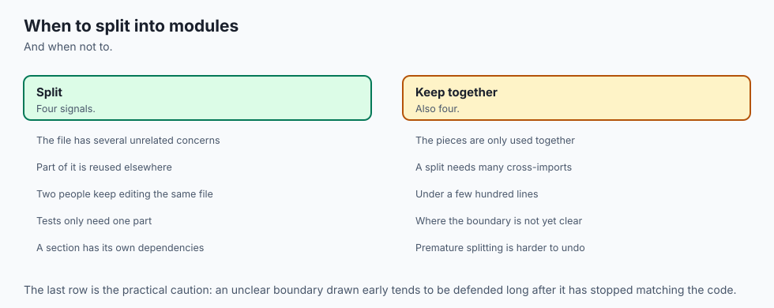

Reach for a module the moment a file starts doing two clearly different jobs, or the moment you want to reuse a function somewhere else, or the moment you want to test a piece in isolation — those three itches (mixed responsibilities, reuse, testability) are the signal to split. Reach for a *package* when you have several related modules that belong together and deserve a shared name and a public API. And add the `__main__` guard to any file you might ever both run and import, which in practice is almost every entry point you write.

Know equally when not to over-structure. A genuine ten-line throwaway script does not need a package, an `__init__.py`, and a `tests/` directory; that is ceremony without benefit, and premature structure is its own kind of mess. The judgment is to match the structure to the size: a sketch stays a file, a tool becomes a package, and you promote the sketch to a package the moment it earns it — when a second person, a second use, or a first test appears. The mistake beginners make is leaving a program in one file long *after* it has outgrown it; the mistake the freshly-taught make is wrapping a two-line snippet in three directories. Aim for the middle: one responsibility per module, dependencies pointing one way, and no more structure than the program has earned.

The AI thread ties back here. Every model you train, dataset you clean, and agent you launch will live in a project with a layout — and the projects whose layout you can read and extend are the ones you will learn from, contribute to, and build on. When you open a machine-learning repository and see `data/`, `models/`, `train.py`, and `tests/`, you are seeing today's lesson at production scale: modules by responsibility, imported into one another, run from an entry point, checked by tests that import them. The habit you build on a word-frequency package is the same habit that lets your AI code be reused, tested, and shipped — instead of living, and dying, in one giant notebook.

## The AI connection

- **Project layout determines whether code can be reused**, and getting it wrong makes
  everything after it harder.
- **Import errors are almost always path or layout problems**, not code problems.
- **A package is what makes work installable**, which is the difference between a script and a
  tool.
- **Every AI project has this structure underneath**, however elaborate its framework.
- **Circular imports signal a design problem**, not just a technical one.

## Knowledge check

Try these from memory before looking back:

1. In one sentence each, define *module* and *package*, and name the file that turns a directory into a package.
2. Explain the difference between `import stats`, `from stats import top_n`, and `import stats as st` — what name can you use after each?
3. A colleague says "every time I import my module its setup code runs again." Using the module cache, explain why that is not true and what actually happens on the second import.
4. You run `python3 -m wordstats` from the wrong directory and get `ModuleNotFoundError`. Using `sys.path`, explain what went wrong — and why the file is not actually missing.
5. What does `if __name__ == "__main__":` protect, and why does putting your "run" code behind it make the rest of the file testable?

## Hands-on exercise

Time to perform the split yourself. In the Day 59 lab you take a working single-file program — `starter/single_file.py`, a word-frequency tool with tokenizing, counting, reporting, and command-line handling all tangled together — and refactor it into the `wordstats/` package: `tokens.py` (one responsibility, text to words), `stats.py` (words to counts), an `__init__.py` that defines the public API with relative imports, and a `__main__.py` entry point with the `if __name__ == "__main__":` guard. Six numbered exercises walk you through it; a design worksheet has you plan the split first. Then you run a test suite that *imports* your modules and asserts what they return — proof that the refactor worked and the payoff of making code importable.

Two commands anchor the work. Run the finished reference as a program from the `examples/` directory:

```bash
cd examples
python3 -m wordstats sample.txt
```

and import its public API as a library:

```bash
python3 -c "import sys; sys.path.insert(0, 'examples'); from wordstats import tokenize, top_n; print(top_n(tokenize('a a b'), 2))"
```

The first runs the package through its `__main__.py`; the second reaches into it for two functions and uses them with no file and no terminal — the two abilities that the single-file version could never offer.

### Expected output

Running the reference tool on the bundled `sample.txt` (which holds "The cat sat on the mat." and two more lines) prints exactly:

```text
19 words, 10 unique
1. the: 6
2. cat: 2
3. dog: 2
4. on: 2
5. sat: 2
```

The import one-liner prints `[('a', 2), ('b', 1)]`. The package is deterministic — `top_n` breaks ties alphabetically — so your output will match on any machine. The full test suite prints `18 checks, 0 failure(s).` while the starter is unfinished, and `26 checks, 0 failure(s).` once you complete all six exercises.

### Validate your work

You are done when you can check every box:

- [ ] `cd examples && python3 -m wordstats sample.txt` prints the six lines above.
- [ ] `from wordstats import tokenize` succeeds and `tokenize('Hello, HELLO world!')` returns `['hello', 'hello', 'world']`.
- [ ] Your completed `starter/wordstats` runs as `python3 -m wordstats` from the `starter/` directory and matches the reference.
- [ ] `from wordstats import top_n` works from `starter/` (proof your `__init__.py` public API is done).
- [ ] `bash tests/run_tests.sh` ends with `0 failure(s).`
- [ ] You can point to one relative import, one from-import, one import-as, and the `__main__` guard in your finished package.

### Troubleshooting

- **`No module named wordstats`.** You ran `python3 -m wordstats` from the wrong place. The current directory is first on `sys.path`, so run it from the directory that *contains* the `wordstats/` folder (`cd examples` or `cd starter`).
- **`attempted relative import with no known parent package`.** You ran a file *inside* the package directly (`python3 wordstats/__main__.py`). Relative imports need package context — run the package with `python3 -m wordstats` instead.
- **`from wordstats import tokenize` fails in the starter.** Exercise 5 is not done: `starter/wordstats/__init__.py` does not yet re-export the name. Uncomment its two relative imports. (Importing straight from the submodule, `from wordstats.tokens import tokenize`, works even before that.)
- **A `NotImplementedError`.** That is a deliberate stub for an unfinished exercise — replace the `raise NotImplementedError(...)` line with the real body described in the comment above it.

### Common mistakes

- **Making the responsibility modules import each other.** If `tokens.py` imports `stats.py` and `stats.py` imports `tokens.py`, you get a circular import that Python cannot resolve. Keep dependencies pointing one way: the entry point imports the responsibility modules, never the reverse loop.
- **Naming a module after a standard-library one.** Calling the tokenizer `tokenize.py` can shadow the standard library's `tokenize`; this lab uses `tokens.py` on purpose. Check for a name clash before naming a module.
- **Doing real work at module top level.** Reading a file or printing at the top of a module runs on *every import*, surprising anyone who imports it and slowing startup. Put actions inside functions and behind the `__main__` guard; keep the top level to definitions.
- **Forgetting the guard.** Without `if __name__ == "__main__":`, importing your entry-point module runs its whole program (and a test would launch it). Guard the run behaviour so the file can be both imported and run.

## Practice assignment

Fill in `starter/module-layout-worksheet.md` for a *different* small program of your own — for example a tool that reads a file of numbers and prints their count, sum, and average, or one that reads lines and prints the longest. On paper first: name the program, list its distinct responsibilities and the module each will live in (one job per module), draw the import arrows and confirm they do not form a loop, and note where each import style (`import`, `from-import`, `import-as`, one relative and one absolute) will appear and which function stays pure so it can be tested.

Then build it as a real package — a directory with `__init__.py`, at least two responsibility modules, and a `__main__.py` entry point with the guard — run it with `python3 -m yourpackage`, and import one of its functions with a `python3 -c "from yourpackage import ..."` line. Record the good run and the import in the worksheet's final section. Keep it; a later lesson builds on this layout.

## Extension challenge

Prove to yourself that you understand the module cache and circular imports by making both visible. First, add a line at the very top of `tokens.py` that prints `loading tokens` (outside any function), then from the `examples/` directory run `python3 -c "import wordstats.tokens; import wordstats.tokens; import wordstats.tokens"`. You will see `loading tokens` printed exactly *once*, not three times — the second and third imports came from the `sys.modules` cache. Remove the print line afterward. Second, deliberately create a circular import: make `tokens.py` start with `from .stats import count_words` and `stats.py` start with `from .tokens import tokenize`, then run `python3 -m wordstats sample.txt`, read the `ImportError` carefully, and fix it by removing one of the two imports and restoring the one-way dependency.

Write three or four sentences explaining what the cache demonstration proved about when a module's top-level code runs, and what the circular import taught you about why package dependencies must point one way — the exact reasoning that keeps a real AI project's `data`, `model`, and `train` modules from tangling into a knot.