## Why this matters

For three days you have been building the parts of a program: functions that name a piece of work (Day 57), the modules that group those functions into files (Day 58), and the scope rules that decide which names are visible where (Day 59). Today you discover that Python already ships with hundreds of those modules written for you, tested by millions of people, and installed the moment Python is — a collection called the **standard library**. The Python community's slogan for this is "batteries included": the language arrives with the common tools already in the box, so a great deal of everyday work needs no download at all.

This matters for your AI goals in a very concrete, money-and-time way. The daily labor of machine learning is not the model — it is the glue around it: finding the data files on disk, reading and cleaning them, counting how many examples fall into each category, stamping every experiment with the date and time it ran, and writing a small results file you can compare against yesterday's. Every one of those jobs has a standard-library module built exactly for it. Reaching for them first keeps your project small, fast to set up, and reproducible: a script that uses only the standard library runs on any machine with Python and nothing else, today and in five years.

The opposite habit is expensive. A beginner who has not toured the standard library reinvents it badly — hand-writing a date formatter that breaks on the first leap year, or looping to count categories when one class does it correctly in a single line. Worse is over-installing: pulling in a heavyweight third-party package to do something Python already does, which bloats the environment, invites version conflicts, adds a security surface, and can break a teammate's setup. Every dependency is a promise you must keep maintained. The professional judgement you build today — **standard-library-first**, add a package only when it clearly pays — is the same judgement that later keeps your training environments lean and your results reproducible, before you ever add NumPy or pandas in Course 03.

## The idea in plain language

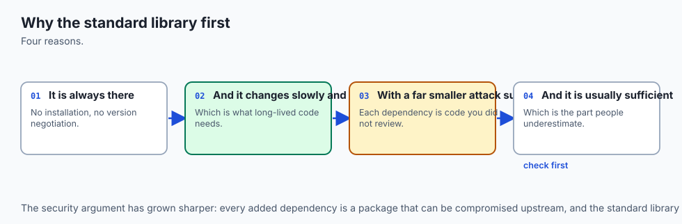

The standard library is the set of modules that come bundled with Python. You do not install them; you simply `import` them. When you write `import json` or `from pathlib import Path`, you are opening a drawer of ready-made, professionally built tools that were sitting in your toolbox all along.

There are hundreds of these modules, but you do not memorise them — you learn to **reach for the right one by the shape of your need**. Need to work with files and folders? That is `pathlib`. Need dates and times? `datetime`. Need to count things or group them? `collections`, which gives you `Counter`, `defaultdict`, and `namedtuple`. Need to read or write the ubiquitous data format? `json`. Need to combine and slice sequences lazily? `itertools`. Need randomness for a shuffle or a sample? `random`. Need an average or a standard deviation? `statistics` and `math`. Need to talk to the operating system — environment variables, command-line arguments, the exit code? `os` and `sys`. Learn the *map* — which drawer holds which kind of tool — and you can find the exact tool when the moment comes.

The second idea is a habit of judgement. Before you type `pip install` — the command that fetches a **third-party** package from the internet — ask three honest questions. Does the standard library already solve this? If so, which module? And only if the answer is genuinely no: does adding an outside **dependency** clearly pay for its cost in setup, size, and maintenance? That last phrase is the whole discipline. Some packages pay handsomely — NumPy for fast arrays, pandas for tabular data, requests for friendly HTTP. Many do not: a one-line convenience is not worth a permanent dependency. Today you learn both the map and the judgement, so you reach outside the box deliberately, not reflexively.


Read the flow as the question you run every time a need arises. Start at the task; ask whether the standard library already answers it; if yes, identify which module and use it with nothing to install; if no, ask honestly whether a package clearly pays before you add the dependency. Most everyday tasks stop at the first "yes."

## Historical background

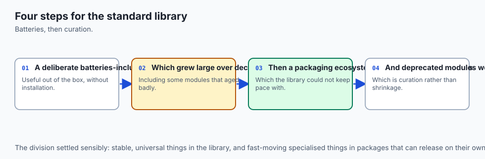

The "batteries included" philosophy is not an accident; it is a deliberate design choice as old as the language. Python was created by Guido van Rossum, who began work on it in December 1989 and released the first public version in 1991. From early on, the project's aim was a language whose standard distribution answered most common needs out of the box, so that a working programmer could sit down and be productive without hunting for external libraries. The phrase "batteries included" was popularised in the community and in Python's own documentation to capture exactly this: the language ships with the batteries so the toy works when you open it.

The individual modules on today's tour each have their own lineage. The `datetime` module was added in Python 2.3 (2003) to give the language first-class date and time objects instead of loose integers. The `collections` module arrived in Python 2.4 (2004) and grew over later releases: `defaultdict` came with it, `namedtuple` was added in 2.6 (2008), and `Counter` in 2.7 (2010). The `json` module — reflecting JSON's rise as the common data format of the web — joined the standard library in Python 2.6 (2008).

And `pathlib`, the modern object-oriented way to handle filesystem paths, is the youngest of the group, added in Python 3.4 (2014) to replace decades of string-fiddling with `os.path`. The point of these dates is not to memorise them but to see the pattern: as a kind of work became common enough, the Python developers built a stable, well-tested tool for it and put it in everyone's toolbox, once, forever.

## What it is — and what it is not

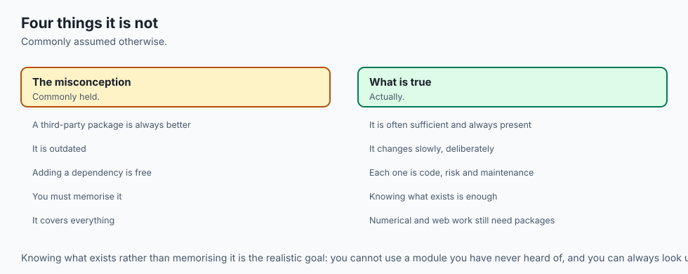

The standard library is the large collection of modules distributed with the Python interpreter itself. A **module** is a file of Python code you can import to reuse its functions and classes, exactly as you learned on Day 58 — the standard library is simply a vast set of such modules that the core developers wrote, documented, and ship to you pre-installed. Its documentation, "The Python Standard Library," is a single organised reference you will return to for the rest of your career.

It is important to be precise about what it is *not*, because beginners blur these lines. It is not the same as the third-party ecosystem on the Python Package Index (PyPI), the online repository from which `pip install` downloads packages like NumPy or pandas — those are outside the standard library and must be installed. It is not a single giant module you import all at once; you import the specific modules you need. It is not always the *best* tool for every job — for heavy numerical arrays, NumPy genuinely outpaces the built-in options — but it is the *default* tool, the one to try first because it costs nothing to reach.

And it is not frozen: modules are added, improved, and occasionally deprecated across Python versions, which is why the version of Python you run matters and why the online docs always state which version a feature appeared in.

| Common misconception | The reality |
| --- | --- |
| "I need to `pip install` something to read a JSON file." | `json` is in the standard library — `import json` and you are done, no install. |
| "The standard library is one big module." | It is hundreds of separate modules; you import only the ones you need, such as `pathlib` or `datetime`. |
| "More libraries always means a more capable program." | Every dependency adds size, setup, and a maintenance burden; fewer, well-chosen dependencies is usually healthier. |
| "`pathlib` and `os.path` are unrelated." | Both handle filesystem paths; `pathlib` is the modern object-oriented replacement, and either can do the job. |
| "If it is built in, it must be second-rate." | Standard-library modules are written and reviewed by expert maintainers and used by millions — they are production-grade. |

## Why it was created and what problems it solves

Every module on today's tour exists because, without it, programmers rediscovered the same painful problems one at a time. Consider dates. A date looks simple until you try to compute it: months have different lengths, leap years follow a fiddly rule, time zones shift, and "add thirty days" is genuinely hard to get right. Left to themselves, thousands of programmers wrote thousands of subtly broken date routines. The `datetime` module solves this once, correctly, for everyone: it knows the calendar so you never have to encode it again.

Counting is the same story. Tallying how many times each value appears in a list is a task you meet constantly — how many files of each type, how many labels of each class. You *can* write it with a plain dictionary and an `if key in counts` check every time, and it works, but it is four lines of boilerplate that is easy to get wrong. `collections.Counter` solves it in one line and does it faster. `pathlib` solves the endless bugs of building file paths by gluing strings together — a slash in the wrong place, a Windows backslash versus a Unix slash — by giving you real path *objects* that know how to join, split, and inspect themselves.

`json` solves the problem of moving structured data in and out of files and across programs in a format every language can read. In each case the module exists to turn a recurring, error-prone chore into a single reliable call — and because it lives in the standard library, that solution is available to you with nothing to install and nothing to break.

## How it works

You reach into the standard library with the same `import` you learned on Day 58, then call the module's functions and classes. Let's tour the everyday drawers, one small worked example each, so you know what lives where.

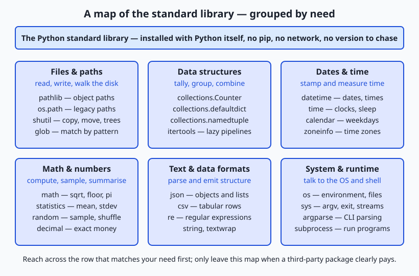

Read the map by need, left to right, top to bottom. Each card is a drawer of the toolbox; when a task arrives, you find the row that matches its shape and open that drawer.

### Files and paths: pathlib

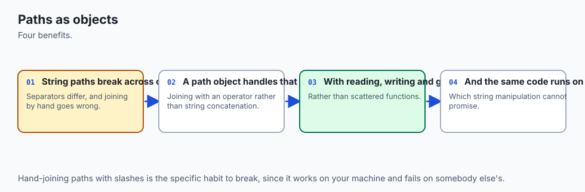

`pathlib` turns a filesystem path into an object you can inspect and combine, instead of a fragile string. You build a path with `Path`, join with the `/` operator, and ask it questions:

```python
from pathlib import Path

folder = Path("data")
report = folder / "results.json"     # joins correctly on any OS
print(report.name)                   # results.json
print(report.suffix)                 # .json
print(report.parent)                 # data
for item in folder.glob("*.csv"):    # every .csv in the folder
    print(item)
```

The `/` operator reads like a path and works on macOS, Linux, and Windows without you touching a slash. `.glob("*.csv")` walks the folder for matching files, and `.rglob("*.csv")` searches recursively into subfolders — the exact move a data-prep script makes to find every dataset on disk.

### Dates and time: datetime

`datetime` gives you real date and time objects that know the calendar. You stamp "now," format it as text, and do arithmetic across days:

```python
from datetime import datetime, timedelta

now = datetime.now()
print(now.isoformat(timespec="seconds"))   # 2026-07-13T09:15:00
print(now.strftime("%Y-%m-%d"))            # 2026-07-13
deadline = now + timedelta(days=7)          # one week later, correctly
```

`.isoformat()` produces a sortable, unambiguous timestamp — exactly what you want when logging when an experiment ran. `timedelta` does the calendar arithmetic so you never count days by hand.

### Data structures: collections

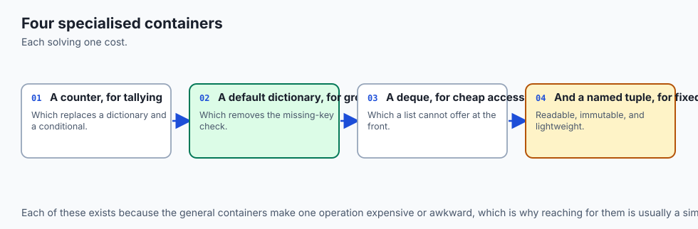

`collections` holds three tools you will use constantly. **`Counter`** tallies any iterable; **`defaultdict`** groups items without checking whether a key exists yet; **`namedtuple`** makes a tiny record type with named fields:

```python
from collections import Counter, defaultdict, namedtuple

votes = ["cat", "dog", "cat", "bird", "cat", "dog"]
tally = Counter(votes)
print(tally)                    # Counter({'cat': 3, 'dog': 2, 'bird': 1})
print(tally.most_common(1))     # [('cat', 3)]

groups = defaultdict(list)
for word in ["ant", "art", "bee"]:
    groups[word[0]].append(word)   # no "if key in groups" needed
print(dict(groups))             # {'a': ['ant', 'art'], 'b': ['bee']}

Point = namedtuple("Point", ["x", "y"])
p = Point(3, 4)
print(p.x, p.y)                 # 3 4
```

`Counter.most_common` even sorts the tally for you — the one-liner that answers "which category is largest?".

### Text and data: json (revisited)

You met `json` on Day 56. It converts between Python data and JSON text: `json.dump` writes, `json.load` reads. It is the standard way to save a small structured result:

```python
import json

result = {"files": 12, "biggest_type": ".py"}
text = json.dumps(result, indent=2)   # to a string, pretty-printed
print(text)
data = json.loads(text)               # back to a dict
print(data["files"])                  # 12
```

### Combining sequences: itertools (revisited)

`itertools` builds fast, memory-light pipelines over sequences. `chain` joins iterables end to end; `islice` takes a slice without building a list; `groupby` groups adjacent equal items:

```python
import itertools

joined = list(itertools.chain([1, 2], [3, 4]))   # [1, 2, 3, 4]
first3 = list(itertools.islice(range(1000), 3))  # [0, 1, 2] — no huge list
```

### Randomness and numbers: random, math, statistics

`random` samples and shuffles; `math` gives constants and functions; `statistics` summarises data:

```python
import random, math, statistics

random.seed(42)                       # reproducible randomness
print(random.choice(["a", "b", "c"])) # a deterministic pick after the seed
print(math.sqrt(144), math.floor(3.7))# 12.0 3
scores = [7, 8, 8, 9, 10]
print(statistics.mean(scores))        # 8.4
print(statistics.median(scores))      # 8
```

`random.seed` matters for AI: seeding makes a "random" split reproducible, so a teammate re-running your experiment gets the same shuffle.

### System and runtime: os and sys

`os` reaches the operating system (environment variables, the current directory); `sys` reaches the interpreter (command-line arguments, the exit code, the version):

```python
import os, sys

print(sys.version.split()[0])         # 3.14.0 — which Python is running
print(os.getcwd())                    # the current working directory
home = os.environ.get("HOME", "?")    # read an environment variable safely
```

### Reading the docs and asking Python itself

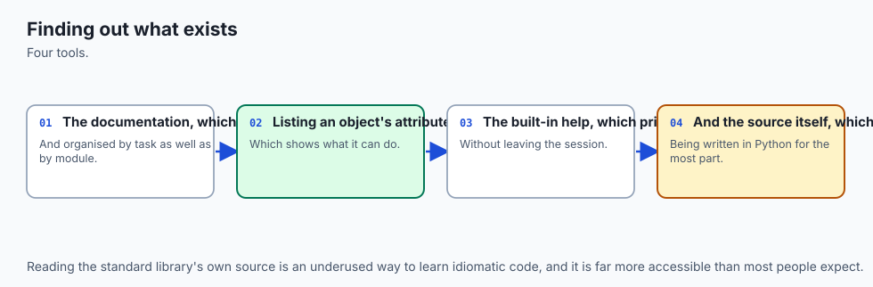

You will not remember every method, and you are not meant to. Two built-in habits find anything. `dir(obj)` lists the names available on a module or object; `help(obj)` prints its documentation right in the terminal:

```python
import datetime
print(dir(datetime))     # names inside the module
help(datetime.date)      # full documentation for the date class
```

Alongside these, "The Python Standard Library" reference online is organised by exactly the need-groups on the map. The skill is not memorising the library; it is knowing it is there and how to look things up quickly.

## An everyday analogy

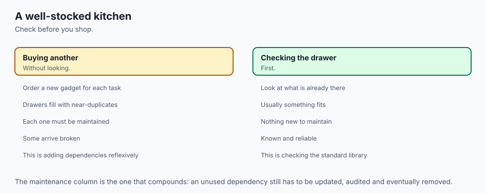

Picture inheriting a master craftsperson's **workshop** on your first day. Along one wall stands a tall toolbox with labelled drawers, already stocked: a drawer of files-and-paths tools, a drawer for measuring time, a drawer of counting and sorting jigs, a drawer of number tools, a drawer for reading and writing labelled forms. You did not buy or build any of it — it came with the workshop, the way the standard library comes with Python. Every drawer holds tools that experts made, sharpened, and tested over years.

When a job arrives, a wise apprentice does not immediately drive to the hardware store. First they look at the *shape* of the job and open the matching drawer. Need to sort screws by size and count each pile? The counting jig — `Counter` — is right there. Need to stamp today's date on the finished piece? The date tool — `datetime` — is in its drawer. Reaching into the toolbox costs nothing and takes a second, because the tools are already in the room.

The hardware store is the Python Package Index, and driving there is `pip install`. Sometimes the trip is worth it: the workshop's toolbox has no lathe, so if the job truly needs a lathe — the way real numerical work needs NumPy — you go and get one, and you are glad you did. But you do not drive across town to buy a screwdriver you already own, and you do not clutter the workshop with a specialty gadget you will use once.

Each new machine you bring in must be maintained, powered, and kept from conflicting with the others. The craftsperson's judgement — check the toolbox first, go to the store only when it clearly pays — is exactly the standard-library-first habit. Keep this workshop in mind and every choice on the tour has a place: the drawers are the modules, opening one is an `import`, and the drive to the store is a dependency you take on with your eyes open.

## Examples in practice

Let's do a real task the way a practitioner would — a small dataset audit that uses four drawers together, which is exactly what today's lab builds. The job: look at a folder of data files, count how many of each type there are, note the total, stamp the moment, and write a small JSON report you can compare against a later run.

```python
from pathlib import Path
from collections import Counter
from datetime import datetime
import json

folder = Path("data")
files = [p for p in folder.rglob("*") if p.is_file()]   # pathlib: walk
extensions = Counter(p.suffix.lower() or "(none)" for p in files)  # collections: tally

report = {
    "generated_at": datetime.now().isoformat(timespec="seconds"),   # datetime: stamp
    "total_files": len(files),
    "by_extension": dict(extensions.most_common()),                 # sorted tally
}
print(json.dumps(report, indent=2))                                 # json: emit
```

Every line reaches into a different drawer, and none of them needed installing. `rglob("*")` walks the folder tree and `.is_file()` filters out subdirectories; `Counter` over `p.suffix` tallies the extensions in one pass, with `most_common()` returning them largest-first; `datetime.now().isoformat()` produces a sortable timestamp; and `json.dumps` turns the whole result into readable, comparable text. On a folder holding, say, seven `.csv` files, three `.json` files, and two `.txt` files, the printed report reads:

```text
{
  "generated_at": "2026-07-13T09:15:00",
  "total_files": 12,
  "by_extension": {
    ".csv": 7,
    ".json": 3,
    ".txt": 2
  }
}
```

That is a genuine, useful tool — a reproducible inventory of a data directory — built entirely from the standard library in a dozen lines. This is the everyday glue of AI work: before you train anything, you must know what data you have, in what shapes, and be able to prove it did not change out from under you. A stdlib-only script like this runs anywhere Python does, needs no environment to recreate, and will still run untouched years from now.

## Implications: security, privacy, performance, scalability, and cost

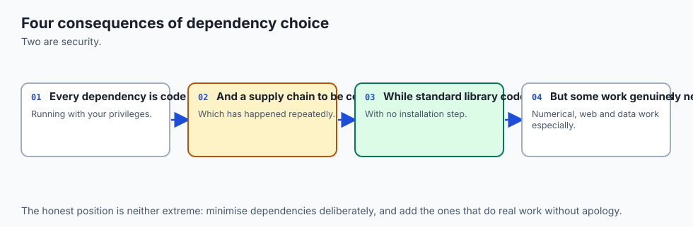

**Security.** Every third-party package you install is code from someone else that runs with your program's privileges, and the supply chain has been attacked through malicious or hijacked packages. Preferring the standard library shrinks this attack surface: standard-library code is maintained and reviewed as part of Python itself. When you *do* add a dependency, you take on responsibility to know what it is and keep it updated. Fewer, well-chosen dependencies is a security posture, not just a tidiness preference.

**Privacy.** The tour's data-glue modules touch real data: `pathlib` reads your folders, `json` serialises records that may hold personal information. Nothing here sends data anywhere — these modules are local and offline — but the same care applies as always: know what you are reading and writing, and where the file lands.

**Performance.** Standard-library tools written in C, like `Counter` and much of `itertools`, are typically faster than the hand-rolled Python loop a beginner would write, and they use memory carefully — `itertools` produces items lazily instead of building giant lists. The honest limit: for large numerical arrays the standard library is not the fastest option, which is exactly where NumPy earns its place. Reaching for the built-in tool first is usually a performance *win*, not a compromise.

**Scalability.** A standard-library-only program is trivially portable: it runs on any machine with the right Python version, with no environment to reproduce. That is a real scalability advantage for sharing scripts and for reproducibility. The ceiling is genuine capability — when the job outgrows what the built-ins do well (fast arrays, dataframes, HTTP with retries), a dependency is the right answer.

**Cost.** The standard library is free in every sense: nothing to buy, nothing to install, nothing to license. The hidden cost lives on the other side — every dependency is a recurring tax in setup time, image size, version conflicts, and maintenance. "Standard-library-first" is the cheapest default, and the discipline is spending a dependency only where it clearly buys more than it costs.

## Alternatives: free, open source, and commercial

Here "alternatives" means the third-party packages you might reach for *instead of* the standard library, and when each genuinely pays. All three below are free and open source; the choice is about capability versus the cost of a dependency.

| Tool | What it is | When to choose it over the standard library | Cost |
| --- | --- | --- | --- |
| The standard library | Modules shipped with Python (`pathlib`, `json`, `collections`, `datetime`, ...) | The default for everyday files, data glue, counting, dates, and small results — anything that must run on a plain Python install | Free, built in |
| NumPy | Fast numerical arrays and vectorised math | Heavy numeric work: large arrays, linear algebra, element-wise math at speed — the foundation of scientific Python | Free, open source (`pip install`) |
| pandas | Labelled tabular data (DataFrames) | Real tabular analysis: CSV/Excel wrangling, joins, grouping, time series at scale — far beyond `csv` and `Counter` | Free, open source (`pip install`) |
| requests | Ergonomic HTTP client | Non-trivial web requests where the built-in `urllib` is clumsy: sessions, retries, JSON bodies | Free, open source (`pip install`) |

**The standard library — how to use it, with an example.** You import the module and call it, as everywhere on this tour. It is the right default because a script using only built-ins runs anywhere Python does, with nothing to install:

```python
from collections import Counter
print(Counter("mississippi"))   # Counter({'s': 4, 'i': 4, 'p': 2, 'm': 1})
```

**NumPy — how to use it, with an example.** NumPy pays when you do bulk numeric math: its arrays are far faster than Python lists for element-wise work, which is why nearly all machine learning stands on it. You install it, then vectorise:

```python
import numpy as np
a = np.array([1, 2, 3])
print(a * 2)                    # [2 4 6] — no Python loop
```

Choose NumPy when the standard library's numeric tools are too slow for the array sizes you face — a threshold you will cross the moment real datasets arrive in Course 03.

**pandas — how to use it, with an example.** pandas pays for tabular data with named columns and mixed types, where `csv` plus dictionaries becomes unwieldy:

```python
import pandas as pd
df = pd.read_csv("data.csv")
print(df.groupby("label").size())   # counts per label, one line
```

Choose pandas when you are truly analysing tables — grouping, joining, filtering columns — not merely reading a file once. For this course's early work, where every lab must run on a plain Python install, the standard library is the deliberate choice, and everything you learn with it transfers directly to these packages when a project justifies the dependency.

## Comparison with related concepts

| Concept A | Concept B | Key difference |
| --- | --- | --- |
| Standard library | Third-party package (PyPI) | The standard library ships with Python and needs no install; a third-party package is downloaded with `pip` and must be maintained as a dependency |
| `pathlib` | `os.path` | Both handle filesystem paths; `pathlib` uses path *objects* and the `/` operator (modern, readable), `os.path` uses plain strings and functions (older, still common) |
| `Counter` | a plain `dict` for counting | `Counter` tallies any iterable in one call and offers `most_common`; a plain dict needs a manual "if key present" check on every item |
| `namedtuple` | a plain tuple | Both are immutable sequences; a `namedtuple` also gives its fields names (`p.x`), so the code reads by meaning rather than by position |
| `json` | Python `repr`/`eval` | `json` is a safe, cross-language text format read by `json.load`; `eval` executes text as Python and must never touch untrusted data |
| Standard library | Language built-ins | Built-ins (`len`, `print`, `dict`) are always available with no import; the standard library is imported per module (`import json`) but still ships with Python |

## When to use it — and when not to

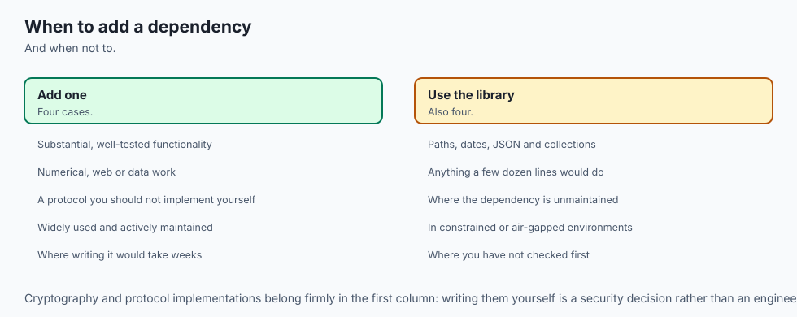

Reach for the standard library first, always. For the everyday glue of programming and AI work — locating and reading files, counting and grouping records, stamping and computing dates, writing small structured results, sampling and summarising numbers, reading command-line arguments — a built-in module is almost always the right tool, and trying it first costs you nothing. Make it a reflex: when a need arises, picture the map, find the drawer, and open it before you think about `pip`. This habit keeps your projects small, portable, and reproducible, which is worth more over a project's life than almost any single convenience a package offers.

Know equally when the built-in tool is the wrong one. When the job is heavy numerical computation over large arrays, use NumPy; when it is real tabular analysis, use pandas; when it is non-trivial web communication, use requests; when a mature package solves a genuinely hard problem you should not solve yourself — parsing dates from arbitrary human text, say, or scientific plotting — take the dependency, and take it deliberately: install it, pin its version, and be able to say in one sentence why it pays. The mistake to avoid in both directions is reflex — installing a package for something Python already does, or grinding out a hundred fragile lines to avoid a dependency that would genuinely earn its keep. The judgement is the skill: try the toolbox, measure the need honestly, and cross the room to the store only when the trip clearly pays.

This closes a four-day arc on program structure. Day 57 gave you functions, Day 58 gave you modules and imports, Day 59 gave you scope — and today you learned that Python hands you hundreds of expertly built modules for free, and the judgement to prefer them. That judgement is the quiet backbone of good AI engineering. The practitioners whose experiments others can actually reproduce are, again and again, the ones who kept their environments small and their dependencies few — who used `pathlib`, `json`, `collections`, and `datetime` for the glue and spent a dependency only where it truly bought speed or capability. Tour the standard library, learn its map, and you keep that power in reach before you ever install a thing.

## The AI connection

- **The standard library removes most reasons to add a dependency**, which is a security and
  maintenance benefit.
- **Knowing what already exists** is what prevents reimplementing solved problems badly.
- **Path handling, dates and JSON** are where hand-rolled code most often goes subtly wrong.
- **Fewer dependencies means a smaller attack surface**, which matters more in AI pipelines
  than most places.
- **The library is documentation worth browsing**, because you cannot use what you do not know
  exists.

## Knowledge check

Try these from memory before looking back:

1. What does "the standard library" mean, and how is it different from a package you install with `pip`?
2. Name the standard-library module you would reach for to (a) walk a folder of files, (b) count how many times each value appears, (c) stamp a report with the current time, and (d) write a small structured result to a file.
3. Explain the "standard-library-first" judgement in your own words, including the one question you ask before adding a third-party dependency.
4. Give one concrete advantage of a script that uses only the standard library over one that depends on three installed packages.
5. You need to work with a filesystem path. Name the two standard-library options and say which is the modern, object-oriented one.

## Hands-on exercise

Time to build a real tool from the standard library only. In the Day 60 lab you assemble **Stdlib Toolkit** — a small program that walks a directory with `pathlib`, tallies file extensions with `collections.Counter`, stamps the moment with `datetime`, and writes a JSON report with `json` — proving you solved a genuine task with nothing installed. Work in the lab directory; every command below is run from there.

First, run the finished reference against the bundled sample folder so you know the target:

```bash
python3 examples/toolkit.py --dir sample-data
python3 examples/toolkit.py --dir sample-data --out report.json
cat report.json
```

Now open `starter/toolkit.py` and complete its four numbered exercises — walk the directory, tally the extensions, build the stamped report, and write it as JSON — using the reference only when you are stuck. Run your version the same way:

```bash
python3 starter/toolkit.py --dir sample-data
```

Finally, prove one of your functions is importable and testable on its own — the payoff of the main guard from Day 57 — by calling it directly:

```bash
python3 -c "import sys; sys.path.insert(0, 'examples'); from toolkit import tally_extensions; print(tally_extensions(['a.csv', 'b.csv', 'c.txt']))"
```

### Expected output

A correct run against the sample folder prints a report like this (the `generated_at` timestamp will differ — that is expected, and the tests do not check it):

```text
{
  "generated_at": "2026-07-13T09:15:00",
  "directory": "sample-data",
  "total_files": 6,
  "by_extension": {
    ".csv": 3,
    ".json": 2,
    ".txt": 1
  }
}
```

The extensions are counted case-insensitively and returned largest-first; the total is the number of files found by walking the folder recursively; and the whole report is valid JSON you could write to a file and compare against a later run.

### Validate your work

You are done when you can check every box:

- [ ] `python3 examples/toolkit.py --dir sample-data` prints a JSON report with `total_files`, `directory`, and a `by_extension` tally.
- [ ] `--out report.json` writes the same report to a file (`cat report.json` shows it) and the file is valid JSON.
- [ ] The `by_extension` counts are sorted largest-first and are case-insensitive (`.CSV` and `.csv` count together).
- [ ] A file with no extension is counted under `(none)`, not dropped.
- [ ] Your completed `starter/toolkit.py` produces the same tally as the reference on the sample folder.
- [ ] `bash tests/run_tests.sh` ends with `0 failure(s)` and exits `0`.

### Troubleshooting

- **`No such file or directory` for the sample folder.** Run the commands from the lab directory (the folder that contains `examples/` and `sample-data/`), not from the repository root.
- **The timestamp differs from the expected output.** That is correct — `datetime.now()` returns the current time, so `generated_at` changes every run. The tests deliberately ignore it and check only the deterministic fields.
- **`NotImplementedError` when you run the starter.** That is expected until you finish the exercises; each stub raises it on purpose. Replace each `raise NotImplementedError(...)` with the real body described in the comment above it.
- **Counts split `.CSV` from `.csv`.** You forgot to lowercase the suffix. Tally `p.suffix.lower()` so case does not matter.
- **A file with no extension vanishes from the tally.** `Path("README").suffix` is an empty string; map the empty suffix to `"(none)"` so those files are still counted.

### Common mistakes

- **Installing a package for this.** Everything here is standard library — `pathlib`, `collections`, `datetime`, `json`. If you found yourself reaching for `pip`, stop: the toolbox already has these drawers.
- **Counting with a plain dictionary and a manual check.** It works, but `Counter` does it in one correct line. Use the tool built for tallying.
- **Asserting on the timestamp in a test.** A volatile value like "now" makes a test fail for no real reason. Make output deterministic by testing the stable fields and ignoring the clock.

## Practice assignment

Extend the Stdlib Toolkit into a slightly richer directory auditor, still using only the standard library, and keep it in your Day 60 lab folder. Add two facts to the report, each from a different drawer of the toolbox. First, using `pathlib`, record the **total size in bytes** of all files found (sum `p.stat().st_size` across the files) and add it to the report as `total_bytes`. Second, using `statistics`, compute and add the **mean file size** as `mean_bytes` (guard against an empty folder, where the mean is undefined — set it to `0`).

Before writing any code, note in a short comment at the top of your file which module supplies each new fact and why the standard library is enough for this task. Then run your tool against `sample-data`, confirm the two new fields appear and are correct (you can check `total_bytes` against `du -b sample-data` on Linux or by summing the files yourself), and save one example report to `my-report.json`. This is the real rhythm of data preparation: describe a directory precisely, with reproducible tools, before anything is trained on it.

## Extension challenge

Take the toolkit one step toward a professional tool, still standard-library only. First, add a `--top N` option (parsed with `argparse`, from the same drawer as `sys`) so the report includes a `top_extensions` list of only the N most common extensions, using `Counter.most_common(N)` — the exact shape of "show me the biggest categories" you will want on real datasets. Second, make the tool robust: if the directory given with `--dir` does not exist, print a clear message to standard error and exit with a non-zero code (reuse the exit-code discipline from Day 56), rather than crashing with a traceback. Third, add a second output format: a `--format` option (`json` or `text`) where `text` prints a small human-readable summary — one line per extension with its count, aligned — while `json` prints the machine-readable report as before.

Finally, write a tiny `tests/test_toolkit.py` that imports `tally_extensions` and asserts its behaviour on a hand-made list, including the case-insensitive and no-extension cases, printing `all tests passed` only if every assertion holds and exiting zero. You will have built, validated, tested, and extended a genuine command-line data tool — the everyday glue of AI work — from the batteries that came in the box.