## Why this matters

For four days you have been learning to build bigger things — functions, modules, project layout, the standard library. You can now make a program *work*. This lesson is about the other half of the job, the half that separates a script you throw away from software people trust: making a program *readable*. Readable code is code that another person — a teammate, a reviewer, or your own self six months from now — can understand and safely change without phoning you for an explanation.

This matters directly, and expensively, for the AI work ahead. A machine-learning experiment is only worth something if someone can reproduce it, and reproducing it means reading the code that prepared the data, set the hyperparameters, and logged the results. When a training run costs real money and hours of GPU time, a reviewer who cannot follow your data-cleaning script cannot catch the off-by-one that silently poisoned your dataset — and you will not catch it either, next quarter, when the code has gone cold in your memory. Unreadable code is where subtle, costly bugs hide, precisely because no human eye can rest on them long enough to see them.

There is a second, newer reason, and it will grow through this course. The AI coding assistants you will study later read your code the same way a colleague does: through its names, its structure, its docstrings, and its types. Feed them a tangle of one-letter variables and thousand-line functions and they help you badly, because there is nothing to grip.

Feed them small, well-named, typed, documented functions and they help you well, because the intent is on the surface where both humans and machines can find it. Readable code is the shared language of human and machine collaboration; sloppy code degrades both at once. Today you learn to write the language properly — and, just as important, to *refactor* code you already have into it, in small safe steps that never break what works.

## The idea in plain language

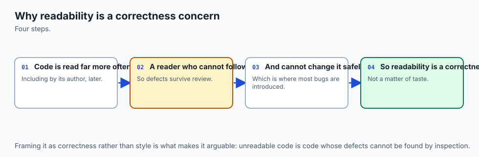

Think of your codebase as a workshop you share with a rotating crew: you today, a teammate next week, your future self next year, and — increasingly — an AI assistant looking over your shoulder. None of them can call you at 2 a.m. to ask what a variable means. Everything they need has to be visible in the shop itself. Readable code is a well-run workshop; unreadable code is a bench buried in unlabelled parts.

Making a workshop legible comes down to a handful of habits, and Python names them in short, free documents called PEPs — Python Enhancement Proposals. **PEP 8** is the style guide: how to name things, how much to indent, where to put spaces, how long a line should be, how to order your imports — the shop's rules for keeping benches square and aisles clear. **PEP 257** covers docstrings: the laminated card at each station saying what it is for. **PEP 20**, the Zen of Python, is a short list of guiding principles — "Readability counts", "Explicit is better than implicit", "Simple is better than complex" — the shop's philosophy, printed on the wall.

On top of those conventions sit a few practices that do the real work. You choose **meaningful names**, so a reader knows what a thing is without hunting for its definition. You write **small functions** that each do one job, so a station is easy to understand in isolation. You add **docstrings and comments** that explain *why*, not what — the note that says "this jig is fragile, don't force it", not one that says "this is a jig". You add **type hints**, labels stating what kind of value fits where, which document your intent and let tools check it.

And you lean on two kinds of automated helper: a **formatter**, which squares everything up the same way every time, and a **linter**, which walks the shop pointing at hazards. When you inherit a messy shop, you do not rebuild it overnight; you *refactor* — reorganise for clarity one small, tested step at a time, so the things it builds never change while it becomes a place a stranger could walk into and work.

## Historical background

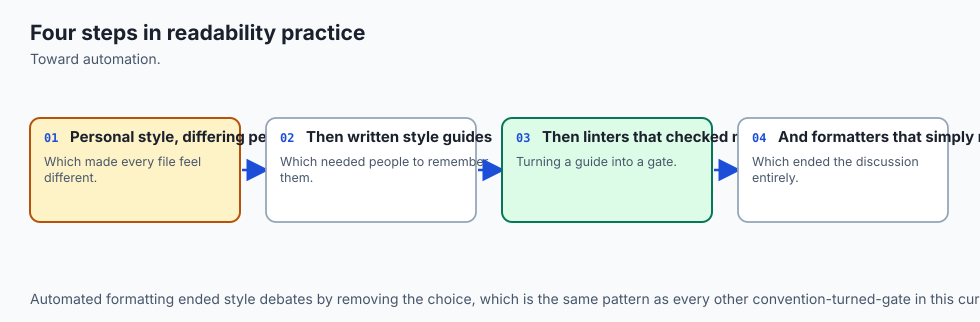

Python's readability culture is deliberate and old. When Guido van Rossum designed the language starting in 1989, he made significant whitespace — indentation as syntax — a defining choice, precisely so that code that *ran* correctly also *looked* consistent. That single decision is why Python programs from different authors resemble each other far more than, say, C or Perl programs do.

The written conventions came soon after the community grew. **PEP 8**, the Style Guide for Python Code, was authored by van Rossum, Barry Warsaw, and Nick Coghlan and introduced in 2001; **PEP 257**, the Docstring Conventions, was written by David Goodger and van Rossum in the same year. Both are living documents, still maintained today.

**PEP 20**, the Zen of Python, is a piece of gentle folklore: Tim Peters distilled the language's design philosophy into nineteen aphorisms, published as a PEP in 2004 and hidden in the interpreter as an easter egg — type `import this` at a Python prompt and it prints. It opens with "Beautiful is better than ugly" and includes the line that anchors this whole lesson: "Readability counts."

The tooling is much younger and has moved fast. Style checkers such as `pycodestyle` and the linter `flake8` were community staples through the 2010s. **Black**, an opinionated auto-formatter, arrived in 2018 and changed norms almost overnight by ending arguments about layout — it simply reformats your code to one standard, with barely any options to bicker over.

Type hints entered the language through **PEP 484** in 2014, and the standard-library `typing` module grew up around them, turning optional annotations into a checkable form of documentation. Most recently, **Ruff** — a linter and formatter written in Rust, released in 2022 — became popular by doing the work of several older tools at once, and fast enough to run on every keystroke. The conventions are decades old and stable; the robots that enforce them keep getting better.

## What it is — and what it is not

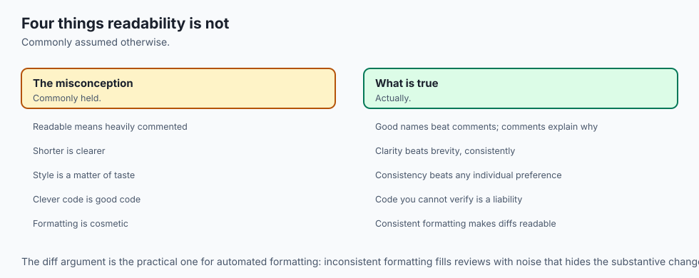

Readable code is code whose *intent* is easy to recover. A reader can tell, quickly and correctly, what a name refers to, what a function does and returns, why a surprising line is there, and what shape of value flows through each step. Readability is a property of the source as a document, judged by a human trying to understand or change it — not by whether it runs, and not by how clever it is.

It is worth being precise about what readability is *not*, because beginners often chase the wrong thing. It is **not** the same as short: a dense one-liner that packs five operations onto a line is usually *less* readable than the four plain lines it replaces. It is **not** heavy commenting: a comment on every line that merely restates the code is noise that goes stale and actively misleads. It is **not** blind obedience to PEP 8: the guide itself says "A Foolish Consistency is the Hobgoblin of Little Minds" and tells you to break a rule when following it would hurt readability.

And it is **not** a cosmetic finishing step you sprinkle on at the end — the names and structure *are* the design, chosen as you write. A formatter can square up your spacing, but no tool can rename `d` to `summarise_scores` for you, because only you know what `d` was for.

| Common misconception | The reality |
| --- | --- |
| "Readable means as few lines as possible." | Terseness often hurts readability. Clarity, not brevity, is the goal; four plain lines usually beat one clever one. |
| "More comments always help." | Comments that restate the code are noise and rot when the code changes. Comment the *why*, not the *what*, and let good names do the rest. |
| "Type hints make my code run faster or safer at runtime." | Python ignores hints at runtime by default. Their payoff is documentation and tool-checking, not speed or enforcement. |
| "A formatter like Black makes my code correct." | A formatter fixes layout only. It cannot fix bad names, bad structure, or a bug — it makes wrong code look tidy. |
| "Following PEP 8 to the letter is the point." | PEP 8 is guidance for readability, applied with judgement. It explicitly tells you to break a rule when obeying it would reduce clarity. |

## Why it was created and what problems it solves

Every habit in this lesson exists to solve a problem that programmers rediscover, painfully, when they skip it.

Without naming conventions and meaningful names, every reader — including you, later — must reconstruct meaning from scratch. A variable called `l` could be a list, a length, or a loop counter; the reader has to trace its whole life to be sure, and one confident wrong guess becomes a bug. Meaningful names, and PEP 8's convention of *which* style signals *which* kind of thing, let a reader know an identifier's role at a glance. Without small functions, logic piles into one giant block where everything can touch everything, so you cannot understand, test, or change any part without holding the whole in your head.

Decomposing into small single-purpose functions makes each piece understandable and testable on its own. Without docstrings and honest comments, the *why* of a decision lives only in the author's memory and is lost the moment they move on. Without type hints, the shape of data is invisible until it crashes — and crashes late, far from the mistake. And without a formatter and linter, teams burn real time arguing over spacing in code review and miss the substantive problems, because the trivial ones are still on the page. The tools automate the trivia so humans can spend review on what matters: correctness and design.

The deep problem all of this solves is *collaboration across time and people*. Code that only its author can read, on the day they wrote it, is a liability the moment anyone else — or a later, forgetful version of the same person — must touch it. Readability turns a private artifact into a shared one.

## How it works

Readable code rests on five pillars, each a habit you can practise deliberately. Picture them holding up a roof.

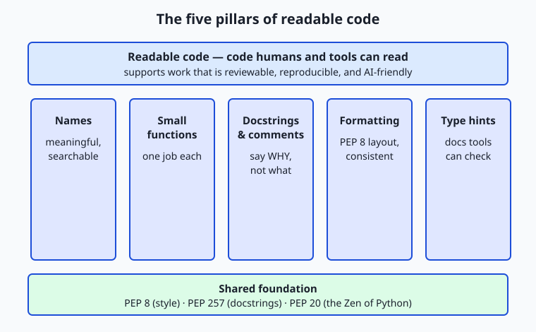

The five pillars — names, small functions, docstrings and comments, formatting, and type hints — all stand on one foundation: the shared conventions of PEP 8, PEP 257, and PEP 20. Let us take them in turn.

### Meaningful names and PEP 8 conventions

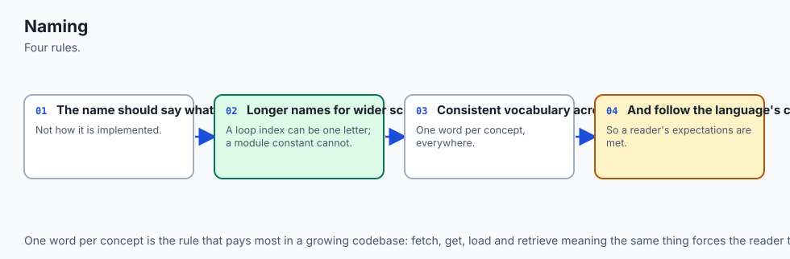

A name should say what a thing *is* or *does*, and its *form* should say what *kind* of thing it is. PEP 8's conventions do the second part for you: `snake_case` for variables and functions (`passing_rate`, `parse_scores`), `CapWords` for classes (`ScoreReport`), and `UPPER_CASE` for module-level constants (`PASS_MARK`). Follow them and a reader knows, before reading a single definition, that `PASS_MARK` is a fixed value and `parse_scores` is an action. Beyond convention, prefer names a reader can *search* for and *pronounce*: `average` over `m`, `scores` over `l`, `total` over `t`. Reserve single letters for tiny, conventional scopes — an `i` in a short index loop is fine; an `l` holding your program's central data is not.

PEP 8's other essentials are quickly stated: indent with 4 spaces (never tabs); put spaces around operators and after commas (`total += score`, not `total+=score`); keep lines to a sane width (PEP 8 says 79 characters; many teams relax this to about 88 or 100, the point being that very long lines are hard to scan); leave blank lines between functions; and order imports in three groups — standard library, third party, then your own — each group alphabetised. None of this is arbitrary fussiness: each rule removes a small friction between the reader's eye and the code's meaning.

| PEP 8 topic | The convention | Why it helps the reader |
| --- | --- | --- |
| Function / variable names | `snake_case` | Signals "this is a value or an action" at a glance |
| Class names | `CapWords` | Distinguishes a type from a value instantly |
| Constants | `UPPER_CASE` | Marks a fixed value you should not reassign |
| Indentation | 4 spaces, no tabs | Consistent structure; no invisible tab/space mixups |
| Spacing | Around operators, after commas | Groups sub-expressions so the eye parses them correctly |
| Imports | Grouped stdlib / third-party / local, alphabetised | A reader can find a dependency and judge it fast |

### Small, single-purpose functions

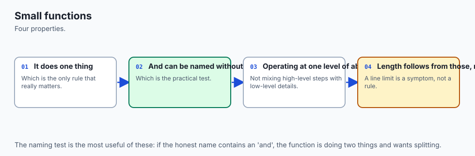

A function should do one job and be nameable by that job. If you find yourself wanting to write a comment like "now compute the median", that is usually a sign the block underneath it should be a function called `median`. Small functions are easier to read (you hold less in your head), easier to name (one job, one name), easier to test (feed inputs, check outputs), and easier to reuse.

The discipline is not about a magic line count; it is about a single responsibility. When one function parses input *and* computes statistics *and* formats output *and* prints, splitting it into `parse_scores`, `mean`, `median`, `format_report`, and a short `main` that coordinates them turns an opaque block into a table of contents.

### Docstrings and comments (say why, not what)

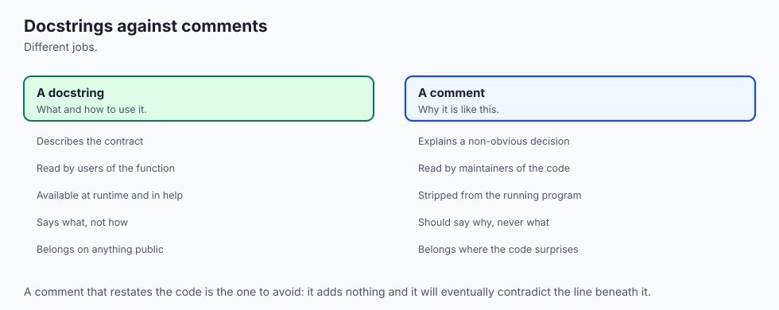

A **docstring** is a string literal as the first statement of a module, function, or class. PEP 257 asks for a one-line summary in the imperative mood ("Return the arithmetic mean..."), optionally followed by a blank line and more detail. Unlike a comment, a docstring is real data: it becomes the object's `__doc__`, and `help(mean)` prints it. That is why docstrings document the *interface* — what a function does, what it returns — for a caller who should not have to read the body.

A **comment** (a `#` line) is a note to whoever reads the source. The single most useful rule about comments is: explain *why*, not *what*. The code already shows what it does; a comment that restates it is noise that goes stale and lies. The valuable comment captures intent a reader cannot recover from the code — "a score at or above this mark counts as passing", or "we divide by n, not n-1, because these are the whole population". Say the surprising thing; delete the obvious one.

### Type hints as checkable documentation

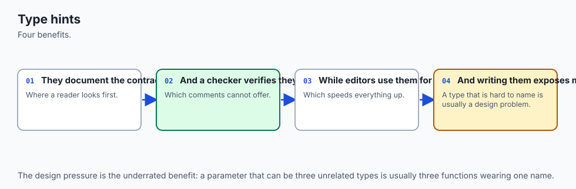

A **type hint** annotates the expected type of a parameter or return value: `def mean(scores: list[float]) -> float:`. By default Python does nothing with hints at runtime — it does not convert or enforce them — so they cost you no speed and no behaviour. Their payoff is twofold. First, they are documentation that cannot drift silently, because a reader sees exactly what `mean` consumes and produces.

Second, a separate **type checker** (a tool such as mypy or Pyright, or your editor) reads the hints and warns you *before* you run the code if you pass a string where a `list[float]` is expected, or forget that a function can return `None`. Hints turn a class of late, confusing runtime errors into early, obvious ones — and they are exactly the signal an AI assistant uses to understand your intent.

## An everyday analogy

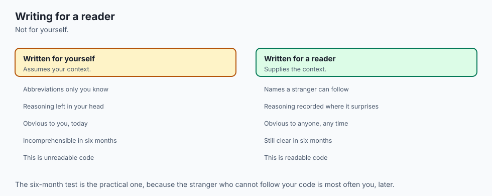

Return to the shared workshop, and every pillar has a place you can point to. The **names** are the labels on the drawers and tools: a drawer marked "10 mm sockets" tells the next person what is inside without opening it, while a drawer marked "stuff" forces them to rummage — that is `scores` versus `l`.

**Small functions** are single-purpose stations: a bench for cutting, a bench for sanding, a bench for finishing, each understandable on its own, instead of one chaotic table where every job happens on top of the last. The **docstring** is the laminated card bolted to each station — "Finishing station: applies two coats, sand between" — telling a newcomer what the station is for without making them reverse-engineer it.

A **comment** is the handwritten sticky note that captures a *why*: "this clamp is worn, tighten by hand only." **Formatting** is the shop rule that benches are squared and aisles kept clear, so nobody trips over clutter while trying to think. **Type hints** are the labels on the parts bins saying which fastener fits which slot, so you catch the wrong bolt before you strip a thread.

And the two robots have their place too. The **linter** is the safety inspector who walks through before a shift, pointing: "loose cable here, unlabelled bin there, this outlet is dead" — finding hazards but leaving the fixing to you. The **formatter** is the closing crew who squares up every bench the same way each night, so the shop looks identical no matter who worked in it. **Refactoring**, finally, is reorganising the shop for clarity — moving a station, relabelling drawers, splitting the chaotic table into single-purpose benches — *without changing what the shop builds*.

And the way you do that safely is to build one test piece before you start, then rebuild it after every small change, confirming the shop still turns out exactly the same product. Keep this workshop in mind and the abstract advice becomes concrete: every habit is just a way of making the shop legible to the next person who walks in.

## Examples in practice

Here is the transformation at the centre of today's lab. Start with a function that works but is a buried table — one job, `d`, doing everything, with names that reveal nothing:

```python
import sys
def d(a):
    l=[]
    for i in a:
        l.append(float(i))
    if len(l)==0:
        print("no data")
        return 1
    t=0
    for i in l: t=t+i
    m=t/len(l)
    # ... median, stdev, passing all inline, with 60 hard-coded ...
    return 0
```

It runs. Given `70 85 90 55 60` it prints `mean: 72.00`, `stdev: 13.64`, `passing: 80.0%`. But a reader cannot see the shape of the computation, cannot test the median in isolation, and cannot tell why `60` is special. Now refactor — in small, tested steps — into small named functions with docstrings and type hints, and a named constant for the magic number:

```python
PASS_MARK = 60.0  # a score at or above this counts as "passing"


def parse_scores(raw_values: list[str]) -> list[float]:
    """Convert the raw command-line strings into a list of floats."""
    return [float(value) for value in raw_values]


def mean(scores: list[float]) -> float:
    """Return the arithmetic mean of a non-empty list of scores."""
    return sum(scores) / len(scores)


def passing_rate(scores: list[float]) -> float:
    """Return the percentage of scores at or above PASS_MARK."""
    passing = sum(1 for score in scores if score >= PASS_MARK)
    return 100 * passing / len(scores)
```

The behaviour is *identical* — the lab proves it byte for byte with `diff` — but now a reader sees the table of contents at a glance, can test `mean([70, 85, 90, 55, 60])` on its own, and knows exactly why `60` matters because it has a name. That is readability: not a single number changed, yet the code went from opaque to obvious.

Now watch the automated tools do their part. A **formatter** applied to the cramped original squares up the spacing for you in one command:

```bash
black report.py
```

Black rewrites `t=t+i` to `total += score`-style spacing, normalises quotes, and wraps long lines — reformatting in place with no arguments to configure. A **linter** reads the code and reports what a formatter cannot fix. Ruff, run on the messy file, prints one finding per line in a compact form:

```text
messy.py:2:1: E302 expected 2 blank lines, found 0
messy.py:14:9: E701 multiple statements on one line (colon)
messy.py:3:5: F841 local variable 'l' is assigned but never used
```

Each line names the file, the line and column, a rule code, and a plain-English message — a to-do list you work down. The formatter handles the layout complaints; the linter's `F841`-style findings (a real logic smell, like an unused variable) are yours to fix by hand. Together they let you and your reviewer spend attention on design, not on spaces.

## Implications: security, privacy, performance, scalability, and cost

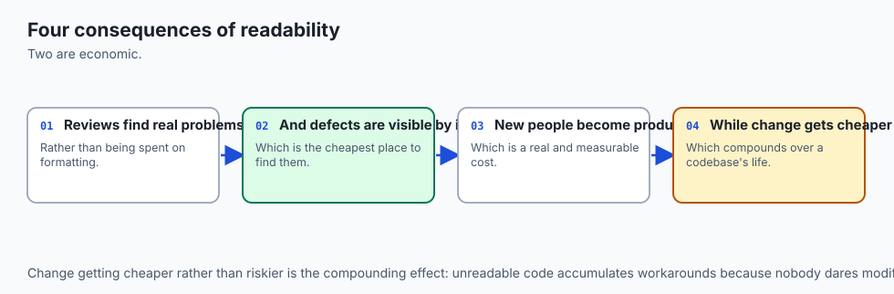

**Security.** Readable code is safer code, for a blunt reason: a reviewer can only catch a vulnerability they can *see*. A dangerous call — an `eval()` on user input, a shell command built from a string, a secret hard-coded in a variable — hides easily in a thousand-line function of single-letter names, and stands out immediately in a small, well-named one. Type hints add a second layer: a checker that knows a value is untrusted text can warn when it flows somewhere it should not. Clarity is a security control, not a nicety.

**Privacy.** When data is personal, you must be able to *audit* where it goes, and you can only audit code you can read. Named functions with clear boundaries — `load_records`, `anonymise`, `export` — let you point to exactly where private data enters, is transformed, and leaves. A tangle hides those flows, which is how personal data ends up logged, cached, or sent somewhere no one intended.

**Performance.** Readability and speed are usually allies, not rivals: clear code is easier to profile, and the real hotspot is easier to find and optimise when the structure is legible. The tools themselves are cheap — a formatter and linter run in well under a second on a normal file (Ruff, being compiled, runs in milliseconds), so there is no performance excuse to skip them. And type hints cost nothing at runtime by default.

**Scalability.** This is where readability pays the most. A one-file script you never share can be as scruffy as you like. But a codebase that grows to many files and many contributors *cannot* function without shared conventions — every author writing in their own style produces a shop no one can navigate. PEP 8, a formatter, and a linter are what let a large team's code read as though one careful person wrote it, which is the only way large software stays maintainable.

**Cost.** The dominant cost of software over its life is not writing it but *reading and changing* it — study after study puts maintenance well above initial development. Readable code attacks that dominant cost directly: less time spent decoding, fewer bugs from misunderstanding, faster onboarding, shorter reviews. Every tool in this lesson is free and open source, so the only investment is the habit.

## Alternatives: free, open source, and commercial

The tools that automate Python style are all free and open source; the choice is about ergonomics and how many jobs you want one tool to do, not about money. The two decisions you will actually make are *which formatter* and *which linter*.

**Formatter: Black versus autopep8.** Both reformat your code so you never argue about layout again. **Black** is *opinionated*: it imposes one consistent style with almost no configuration, reflowing whole constructs (it will rewrap your function calls and normalise your quotes). Choose Black when you want the argument over style to simply end — a whole team adopts it and every file looks the same forever. Use it with a bare command:

```bash
black report.py          # reformat in place
black --check report.py  # report whether it WOULD change anything (for CI)
```

**autopep8** is *conservative*: it changes only what is needed to satisfy PEP 8, leaving the rest of your layout as you wrote it. Choose autopep8 when you want to nudge an existing codebase toward PEP 8 without the larger visual churn Black introduces. Use it as `autopep8 --in-place report.py`. Black is the more common modern default precisely because its lack of options ends debate; autopep8 wins when minimal, targeted change matters more. Both are free and open source.

**Linter: Ruff versus flake8 + isort.** A linter reads your code without running it and reports problems and style violations. The classic setup was **flake8** (which bundles `pycodestyle` for PEP 8 and `pyflakes` for logic smells like unused imports) *plus* **isort** (a separate tool that sorts and groups your imports) — two tools, two configurations.

**Ruff** is a newer single tool, written in Rust, that does the work of flake8, isort, and many plugins at once, and does it fast enough to run on every keystroke. Choose Ruff for a new project or when speed and one-tool simplicity appeal; choose flake8 + isort when you are maintaining an existing project already built around them, or want a specific plugin from that ecosystem. Using each:

```bash
ruff check report.py          # lint (find issues; --fix auto-fixes a subset)
# versus the classic pair:
flake8 report.py              # lint for PEP 8 + logic smells
isort report.py               # sort and group imports
```

All of these are free and open source — there is no paid tier to any of them. Where money enters the picture is only in the *hosted* layer built on top: services that run these same open-source checks automatically on every pull request (continuous-integration platforms and code-review bots) may charge for private repositories or larger teams. The tools themselves cost nothing; you pay only if you want someone else to run them for you on a schedule.

## Comparison with related concepts

| Concept A | Concept B | Key difference |
| --- | --- | --- |
| Formatter (Black) | Linter (Ruff/flake8) | A formatter rewrites layout to one style; a linter reports likely problems and style violations, generally without rewriting |
| Docstring | Comment | A docstring is a runtime string documenting an object's interface (via `__doc__`/`help()`); a comment is source-only guidance, best used for *why* |
| Type hint | Runtime type check | A hint is documentation a tool checks before running; a runtime check (e.g. `isinstance`) actually tests a value while the program runs |
| Refactoring | Rewriting | Refactoring changes structure while preserving behaviour, verified by tests; rewriting starts over and may change behaviour |
| PEP 8 (style) | PEP 20 (Zen) | PEP 8 gives concrete rules for how code should look; PEP 20 gives high-level principles for choosing between designs |
| Readable code | Working code | Working code produces the right output; readable code also lets a human understand and safely change it — both matter |

## When to use it — and when not to

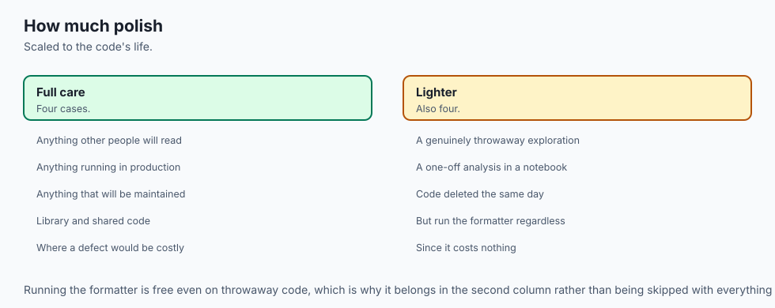

Reach for these habits essentially always, and reach for them *as you write*, not only at the end. Meaningful names and small functions cost nothing extra in the moment and save enormous time later; there is no project too small to deserve a decent variable name. Run a formatter and a linter on anything you will keep, share, or revisit — set your editor to format on save and the habit becomes invisible.

Add type hints to any function whose interface others (or tools, or you) will rely on; they are the cheapest documentation you will ever write. And refactor the moment code you must change has become hard to read: the best time to tidy a function is just before you extend it.

Know the honest limits, too, so you apply judgement rather than dogma. In a genuine ten-line throwaway — a one-off you will run once and delete — full docstrings and exhaustive hints can be ceremony that outweighs the benefit; clarity of names still helps, but you need not gold-plate. Do not let a linter's every complaint become law: PEP 8 itself says to break a rule when following it would hurt readability, and a good linter lets you silence a rule you have judged wrong, with a comment saying why.

And never treat a formatter's tidy output as proof of correctness — Black will happily make a buggy function beautifully spaced. The skill is proportion: invest readability effort in proportion to how long the code will live and how many people (and machines) will read it, which for almost everything you build in this course is "a while" and "more than you think".

This is where the day points at your future. The reproducible experiment, the reviewable pull request, the model-serving script a teammate can trust, the data pipeline whose privacy you can audit — every one of them rests on code someone other than its author can read. And the AI coding assistants ahead read exactly what a colleague reads: your names, your structure, your docstrings, your types. Write them clearly and both your human and your machine collaborators help you well; write them sloppily and you degrade both at once. Readable, typed, linted code is not a matter of taste. It is the substrate on which serious AI work is built.

## The AI connection

- **Code is read far more often than it is written**, including by the person who wrote it.
- **Naming is the highest-leverage readability decision**, and it is almost free to get right.
- **Consistency matters more than any individual convention**, which is why formatters win
  arguments.
- **AI-generated code needs review for readability** as much as for correctness.
- **Readable code is debuggable code**, which is what makes it a correctness concern rather
  than an aesthetic one.

## Knowledge check

Try these from memory before looking back:

1. Name the five pillars of readable code, and give a one-sentence reason each matters to a future reader.
2. A colleague writes `# add 1 to counter` above the line `counter += 1`. Explain what is wrong with the comment and what a *useful* comment there might say instead.
3. What does a type hint do at runtime by default, and what actually makes it valuable? Name the kind of tool that uses it.
4. Explain the difference between a formatter and a linter, naming one example of each and one thing each can do that the other cannot.
5. Describe the safe way to refactor a working function, and say what role the test suite plays in it.

## Hands-on exercise

Time to make messy code readable without breaking it. In the Day 61 lab you take `starter/messy.py` — a small program that works but is painful to read (one giant function `d`, single-letter names, no docstrings, no types, a hard-coded `60`) — and refactor it into clean, documented, type-hinted code that behaves *identically*, proven by a test suite. The clean target is shipped as `examples/report.py`. Work in the lab directory; every command below is run from there.

The whole method is captured in one picture: change one thing, run the tests, and only continue when they stay green.


First, see that the messy starter works and that the clean reference behaves identically:

```bash
python3 starter/messy.py 70 85 90 55 60
diff <(python3 starter/messy.py 70 85 90 55 60) <(python3 examples/report.py 70 85 90 55 60) && echo IDENTICAL
```

Establish your safety net *before* touching anything, then refactor in the five steps the worksheet names — rename, kill the magic number, decompose into small functions, document and type, format:

```bash
bash tests/run_tests.sh
```

Then edit `starter/messy.py` one step at a time, re-running the tests after each. If a step turns the tests red, undo that one change and try again smaller.

### Expected output

For the input `70 85 90 55 60`, both the messy starter and the clean reference print exactly this and exit 0:

```text
count: 5
mean: 72.00
median: 70.00
min: 55.00
max: 90.00
stdev: 13.64
passing: 80.0%
```

The test suite, with the starter still messy, ends with `10 checks, 0 failure(s), 2 skipped.` The two skips are the optional Black and Ruff/flake8 checks, which are not installed by default and are deliberately skipped rather than failed. Once you finish the refactor, the suite additionally holds your cleaned-up starter to the readability standard and ends with `14 checks, 0 failure(s), 2 skipped.`

### Validate your work

You are done when you can check every box:

- [ ] `python3 starter/messy.py 70 85 90 55 60` prints the seven summary lines and exits 0.
- [ ] `diff` between the starter and the reference on the same input prints nothing (they are identical), and `echo IDENTICAL` fires.
- [ ] `bash tests/run_tests.sh` reports `10 checks, 0 failure(s), 2 skipped.` before you refactor.
- [ ] After refactoring, your `starter/messy.py` has meaningful names, a `PASS_MARK` constant, several small functions, docstrings, and type hints.
- [ ] The tests stayed green after every single step — behaviour never changed.
- [ ] `bash tests/run_tests.sh` reports `14 checks, 0 failure(s), 2 skipped.` once the refactor is complete.

### Troubleshooting

- **The tests went red after a rename.** You changed behaviour, not just a name — likely renamed one use of a variable but not another. Undo the last single change, get back to green, and redo it more carefully. Small steps localise the mistake.
- **The `stdev` value changed.** You switched population standard deviation (divide by `n`) to sample (divide by `n - 1`). Readability refactoring must keep every number identical; only names and structure change.
- **The `black` / `ruff` checks say "skip".** That is expected: those tools are optional and not installed by default. The suite skips them and still passes. Install them with `python3 -m pip install black ruff` only if you want to try them.
- **`SyntaxError` mentioning `list[float]`.** You are on Python older than 3.9. Upgrade, or use `from typing import List` and `List[float]`.

### Common mistakes

- **Refactoring and "improving" behaviour at once.** Resist changing what the code does while you tidy it. Refactor first (behaviour identical, tests green), then change behaviour as a separate, separately tested step.
- **Comments that restate the code.** Writing `# loop over scores` above a `for` loop adds noise. Comment the *why* (why `60` is the pass mark), or say nothing and let the names carry it.
- **One giant change instead of small ones.** Renaming, decomposing, and typing all in a single edit means a red test tells you nothing about which change broke it. One change, one test run.

## Practice assignment

Take a piece of your *own* code — the Records CLI from Day 56, one of your Day 57–60 exercises, or any script you have written — and refactor it for readability using exactly the method from the lab, keeping a short log as you go. Before you start, write (or borrow) a handful of tests or a golden-output check that captures its current behaviour, so you have a safety net.

Then work the five steps in order: rename every unclear identifier following PEP 8; replace any magic numbers with named constants; split any function doing more than one job into small single-purpose functions; add a module docstring and a one-line docstring to each function that says *why*/what-it-returns (not a play-by-play); and add type hints to every function signature.

Run your behaviour check after each step and confirm it stays green. If you have Black and Ruff installed, finish by running `black` and `ruff check` and resolving or consciously justifying each finding; if not, format by hand to PEP 8. In your log, record one name you improved and why, one function you extracted and the single job it now does, and one comment you deleted because the code already said it. Keep the before and after — the contrast is the lesson.

## Extension challenge

Go deeper on the tools and the types. First, install a **type checker** — `python3 -m pip install mypy` — and run `mypy report.py` on the lab's clean reference; read its output, then deliberately introduce a type error (pass a string where a `list[float]` is expected) and watch mypy catch it *before* the code runs, proving the point that hints turn late runtime bugs into early static ones. Second, add a Ruff (or flake8) configuration to a project of your own that sets a line length and enables a useful extra rule, then run it and fix what it flags — experiencing how a linter's rules are chosen, not just accepted.

Third, read the actual Zen of Python by running `python3 -c "import this"`, pick three of its aphorisms, and write a short paragraph on each connecting it to a concrete choice you made while refactoring — "Explicit is better than implicit" when you named `PASS_MARK`, say, or "Simple is better than complex" when you split `d` into small functions. You will have used a formatter, a linter, and a type checker on real code, and connected the philosophy to the practice — exactly the toolkit that keeps AI work reproducible and reviewable.