## Why this matters

Yesterday's world was flat. A list is a line of items; a loop marches along it; a counter ticks up. But an enormous amount of the data and the algorithms you will meet in AI are not flat at all — they are **nested inside themselves**. A parse tree of a sentence has phrases inside phrases. A decision tree branches into smaller trees. A configuration file is a JSON object with objects inside it, several levels deep, with no fixed limit. A file system is folders inside folders. When the structure repeats itself at every level, the cleanest code repeats itself too: a function that handles one level and then calls *itself* to handle the level below. That is **recursion**, and it is today's subject.

Why does this matter concretely, in money and memory and debugging time? Because recursion is the natural — often the only clean — way to process data whose depth you do not know in advance. Try to flatten a JSON object nested to an unknown depth with a plain `for` loop and you will write a tangle of nested loops that still breaks on the next level down; the recursive version is six lines and handles any depth. But recursion also has a sharp edge that costs real people real outages: every call the function makes to itself consumes a slice of a limited resource called the **call stack**, and a function that forgets to stop — a missing **base case** — will exhaust that resource and crash with a `RecursionError`. Worse, a naive recursive solution to the wrong problem can be catastrophically slow: the classic naive Fibonacci makes over two and a half million function calls just to compute the thirtieth number, and grows exponentially from there. Today you learn both halves: how to write recursion that is correct and elegant, and how to recognize when it will blow up — and exactly how to fix it.

This is also a way of *thinking*, not just a Python trick. The move at the heart of recursion — "solve a big problem by assuming you can already solve a slightly smaller version of it, then combining" — is the same **divide and conquer** decomposition behind a huge family of algorithms, from sorting to searching to the tree traversals that walk a model's computation graph. Get comfortable with the base-case/recursive-case split today and you have a mental tool you will reuse for the rest of the course.

## The idea in plain language

Recursion is a function that calls itself. That sounds circular and slightly alarming the first time you meet it, so hold onto one image: a set of Russian nesting dolls. You open the biggest doll and find a smaller doll inside. You open that one and find a smaller one still. You keep going until you reach the smallest doll — the solid one that does not open. That final doll is where you *stop*. Recursion works exactly this way, and it always has two parts.

The first part is the **base case**: the smallest version of the problem, the one you can answer immediately without any more work. For the dolls, it is the solid doll that does not open. For adding up a list, it is the empty list, whose sum is plainly zero. For `factorial`, it is `factorial(1)`, which is just `1`. The base case is the brake that stops the recursion, and a recursive function *must* have one — without it, the function calls itself forever.

The second part is the **recursive case**: how to break the problem into a slightly smaller version of the *same* problem, solve that smaller version by calling yourself, and combine the answer. To compute `factorial(4)`, you say "`4` times `factorial(3)`" — you have reduced the problem to a smaller factorial, which you solve the same way. To sum a list, you say "the first number plus the sum of the rest of the list." The crucial discipline is that the smaller version must genuinely be *closer to the base case* on every call — a shorter list, a smaller number — because that shrinking is what guarantees the recursion eventually reaches the base case and stops. Two parts, then, every single time: a base case that stops, and a recursive case that shrinks the problem and combines. Miss either one and the recursion is broken.

## Historical background

Recursion is older than computers, and its roots are in mathematics and logic. The idea of defining something in terms of a smaller version of itself is ancient — the mathematician defining a sequence by saying "each term is built from the previous term" is using recursion — but the rigorous modern treatment arrived with the study of what is *computable*. In the 1930s, logicians including Kurt Gödel, Alonzo Church, and Stephen Kleene developed the theory of **recursive functions** as a precise definition of the functions a machine could, in principle, calculate. The word "recursive" in early computer science literally meant "computable," so central was the concept.

When the first high-level programming languages appeared, most could not express recursion at all: early Fortran, for instance, did not allow a function to call itself, because each function had a single fixed place to store its working data, and a second, nested call would overwrite the first. The breakthrough was the programming language **Lisp**, created by John McCarthy at MIT in 1958, which made recursion natural and central — and **Algol 60**, designed by an international committee around 1960, which introduced the machinery that made recursion work in general: a **call stack** that gives every call its own private storage. That single idea — a stack of independent frames, one per active call — is what lets a function call itself without the inner call trampling the outer one's data, and it is built into essentially every language you will ever use, Python included.

Two names worth knowing. The Fibonacci sequence, the standard example of tree recursion you will meet today, is named for **Leonardo of Pisa**, known as Fibonacci, who introduced it to European mathematics in his 1202 book *Liber Abaci* (as a puzzle about breeding rabbits). And **memoization** — the technique that rescues naive recursion from its exponential blow-up by remembering answers already computed — was named by the British researcher **Donald Michie** in 1968, from the Latin *memorandum*, "to be remembered." You will use a modern, one-line version of exactly Michie's idea today.

## What it is — and what it is not

Recursion, for this lesson, is a function whose definition includes a call to itself, structured as a base case that returns an answer directly and a recursive case that reduces the problem to a smaller instance, calls itself on that smaller instance, and combines the result. Each active call gets its own **stack frame** — its own private copy of its arguments and local variables — so the many simultaneous copies of the function do not interfere. When the base case is reached, the calls return one after another, and the results combine back up the chain to the final answer.

It helps to be precise about what recursion is *not*, because beginners tie themselves in knots over exactly these points. Recursion is **not** magic and it is not infinite: a correct recursive function always terminates, because every recursive call moves strictly closer to a base case. A function that calls itself with the *same* argument, or with one that does not shrink, is not "recursion" in any useful sense — it is a bug that crashes. Recursion is **not** always the right tool: for a flat sequence, a plain loop is usually simpler, clearer, and — in Python specifically — safer, because Python has no **tail-call optimization** (a trick some languages use to run certain recursions in constant stack space), so deep recursion in Python risks a `RecursionError` where a loop would sail through. And recursion is **not** automatically slow, nor automatically fast: `factorial` by recursion is perfectly efficient, while `fib` by naive recursion is a disaster — the difference is whether the recursive calls repeat work, which you will learn to spot.

| Common misconception | The reality |
| --- | --- |
| "A function that calls itself will loop forever." | Only if it lacks a correct base case or the argument does not shrink. A correct recursion always terminates because each call moves toward the base case. |
| "Recursion is always more elegant than a loop." | It is elegant for nested/tree-shaped data. For a flat sequence a loop is usually simpler and, in Python, safer against `RecursionError`. |
| "Recursion is inherently slow." | The recursive *shape* is cheap; slowness comes from **repeating work** (naive Fibonacci). Memoization fixes that without changing the shape. |
| "Python optimizes deep recursion like some languages do." | Python has **no tail-call optimization** and caps the stack (~1000 frames). Deep recursion raises `RecursionError`; use a loop or an explicit stack. |
| "The base case is optional if the input is usually small." | The base case is mandatory. Without it, one unexpected input recurses until the stack overflows. |

## Why it was created and what problems it solves

Recursion earns its place by solving a specific, recurring problem: processing data or computations that are **self-similar** — nested to a depth you do not know ahead of time. Consider flattening a list that may contain lists, which may themselves contain lists, with no fixed limit. With loops alone you cannot write this cleanly, because you would need one nested loop per level of depth, and you do not know how many levels there are. Recursion dissolves the problem: handle one level, and for any element that is itself a list, *call yourself* on it. The unknown depth is handled automatically, because the function goes as deep as the data does and no deeper.

The same shape solves a whole family of real problems. Walking a directory tree to find every file: process this folder, and recurse into each subfolder. Summing every number in a nested JSON configuration: add the numbers at this level, and recurse into each nested object or array. Traversing a parse tree, a decision tree, or the computation graph of a neural network: visit this node, then recurse into its children. In every case the data has the same structure at every level, so the code that handles one level, plus a call to itself for the level below, handles the whole thing. The base case — a plain value, an empty collection, a leaf node — is what tells the recursion where the nesting bottoms out.

The **call stack** was created to make this possible at all. Because each recursive call needs its own workspace (its own value of `n`, its own partial results) while it waits for the calls it spawned to finish, the language keeps a stack of frames: push a frame when you call, pop it when you return. That is why recursion works, and also why it is bounded — the stack is finite, so recursion depth is finite, which is the safety limit that turns a runaway recursion into a clean `RecursionError` instead of a machine that consumes all its memory and dies.

## How it works

Recursion has a mechanism you can see, and once you can picture the call stack, nothing about it is mysterious.

### The base case and the recursive case

Every recursive function is the same two-part shape. Here is `factorial`, the "hello world" of recursion:

```python
def factorial(n):
    if n <= 1:                   # base case — stop, return directly
        return 1
    return n * factorial(n - 1)  # recursive case — smaller problem, then combine
```

The `if n <= 1: return 1` line is the base case: the smallest problem, answered immediately, with no further calls. The `return n * factorial(n - 1)` line is the recursive case: it reduces `factorial(n)` to `factorial(n - 1)` — a strictly smaller problem — calls itself, and combines the smaller answer (multiplies by `n`). Because `n` decreases by one on every call, it is guaranteed to reach `1` and stop.



Read the flow diagram as the question every single call asks itself: *am I the base case?* If yes, return the base answer directly and you are done. If no, do the recursive case — call yourself on a smaller input, then combine that returned result with the current level (multiply by `n`, or add the first element) and return the combination. The panel on the right states the one rule you must never break: the input must get closer to the base case on every call, or the recursion never stops.

### The call stack: frames stack up, then unwind

When `factorial(4)` runs, it cannot finish until `factorial(3)` gives it an answer, which cannot finish until `factorial(2)` answers, and so on. So the calls pile up, each waiting on the one below, until the base case is reached — and only then do the answers flow back up.



Follow the diagram left to right. On the left, the calls **wind up**: `factorial(4)` pushes a frame and calls `factorial(3)`, which pushes a frame and calls `factorial(2)`, which calls `factorial(1)`. Each frame is a private workspace holding that call's own `n`, frozen mid-calculation, waiting. When `factorial(1)` hits the base case and returns `1`, the stack **unwinds** on the right: `factorial(2)` completes `2 * 1 = 2` and returns; `factorial(3)` completes `3 * 2 = 6`; `factorial(4)` completes `4 * 6 = 24` — the answer. Four frames existed at the deepest point, then popped off one by one. The bottom panel states the danger: the base case is the brake. Remove it, and the frames stack up forever until Python raises `RecursionError` — the language's guard against an unbounded stack, sometimes called a **stack overflow**. You can inspect and adjust the ceiling with `sys.getrecursionlimit()` and `sys.setrecursionlimit(n)`, but raising it recklessly can crash the interpreter itself, so the usual fix for genuinely deep problems is a loop, not a higher limit.

### Tree recursion and why naive Fibonacci explodes

Not all recursion is a single chain. When a recursive case makes **two or more** calls to itself, the calls branch into a *tree*, and the number of calls can explode. The Fibonacci sequence — each number the sum of the two before it — is the classic example:

```python
def fib(n):
    if n < 2:                    # base cases: fib(0)=0, fib(1)=1
        return n
    return fib(n - 1) + fib(n - 2)   # TWO recursive calls — a tree
```

This is correct, and for small `n` it is fine. But watch what it computes. `fib(5)` calls `fib(4)` and `fib(3)`. But `fib(4)` *also* calls `fib(3)`, so `fib(3)` is computed twice. And `fib(3)` calls `fib(2)`, which gets computed three times, and so on — the same subproblems are recomputed again and again, exponentially. The call counts are not a guess; they are exact and you will measure them in the lab:

| `fib(n)` | Result | Naive recursive calls | Memoized computations |
| --- | --- | --- | --- |
| `fib(10)` | 55 | 177 | 11 |
| `fib(25)` | 75025 | 242,785 | 26 |
| `fib(30)` | 832040 | 2,692,537 | 31 |

The naive call count is `2 × fib(n+1) − 1`, which grows exponentially; by `fib(30)` it is already 2.7 million calls to compute one small number, and `fib(50)` would take many billions. This is the cautionary half of recursion: the recursive *shape* is not the problem — the **repeated work** is.

### Memoization with `functools.lru_cache`

The fix does not change the shape at all. If the trouble is recomputing `fib(3)` many times, then *remember* the answer the first time and reuse it. That is **memoization**, and Python's standard library gives it to you as a single decorator:

```python
from functools import lru_cache

@lru_cache(maxsize=None)
def fib(n):
    if n < 2:
        return n
    return fib(n - 1) + fib(n - 2)
```

`lru_cache` ("least-recently-used cache") wraps the function so that each time it is called with an argument it has seen before, it returns the stored result instantly instead of running the body again. Now `fib(3)` is computed exactly once; every later request for it is a cache hit. The exponential tree collapses: `fib(30)` goes from 2.7 million calls to just 31 real computations (one for each of `fib(0)` through `fib(30)`) plus a handful of instant cache hits. You can even see the accounting — `fib.cache_info()` reports the hits and misses. One import and one decorator line turn a catastrophically slow function into a fast one, without touching the recursive logic. This is the single most important practical lesson about recursion: recognize repeated work, and memoize it.

## An everyday analogy

Keep the Russian nesting dolls — the *matryoshka* — in mind, because the whole of recursion is in them. You are handed the largest doll and asked, "how many dolls are in this set?" You cannot answer at a glance, but you know how to make progress: open this doll, and if there is a smaller doll inside, the answer is "one, plus however many are in *that* doll." So you set the outer shell aside (that is your frame, waiting), pick up the smaller doll, and ask the very same question of it. You keep going, each doll waiting on its opened partner, until you reach the smallest doll — the solid one that does not open. That solid doll is the **base case**: you can answer it immediately — it counts as one, and there is nothing inside. Now the answers flow back: the smallest is one; the doll around it is "one plus one," so two; the next is three; and so on back up to the doll in your hands. That flow back up is the stack **unwinding**.

Every part of recursion has a place in this picture. The recursive case is "open the doll and ask the same question of the smaller one inside." The requirement that the problem shrink is guaranteed because each doll is strictly smaller than the one around it — you cannot open forever. The base case is the solid doll that stops the process; a set of dolls with no solid one at the center could, in principle, be opened forever, and that is precisely the missing-base-case bug that overflows the stack. The pile of opened shells on your desk, each waiting for its inner doll's count, is the **call stack** — and if someone handed you a set with ten thousand dolls, your desk (the stack) would run out of room, which is `RecursionError`. Even memoization has a place: if you had already counted an identical set of dolls yesterday and written the total on a card, you would just read the card instead of opening them all again. Hold the dolls in your mind and no part of today's material can confuse you.

## Examples in practice

Let us work three examples completely, from the simple chain to the tree.

**Recursive sum of a list.** The base case is the empty list (sum zero); the recursive case is the first element plus the sum of the rest:

```python
def list_sum(numbers):
    if not numbers:                        # base case
        return 0
    return numbers[0] + list_sum(numbers[1:])   # recursive case
```

Trace `list_sum([3, 5, 2])` completely. `list_sum([3, 5, 2])` is `3 + list_sum([5, 2])`; that is `3 + (5 + list_sum([2]))`; that is `3 + (5 + (2 + list_sum([])))`; the empty list hits the base case and returns `0`; now the chain unwinds: `2 + 0 = 2`, then `5 + 2 = 7`, then `3 + 7 = 10`. Four frames stacked, then unwound to `10`.

**Flattening a nested list — recursion earning its keep.** This is the kind of problem a loop cannot handle cleanly, because the nesting depth is unknown:

```python
def flatten(items):
    result = []
    for item in items:
        if isinstance(item, list):
            result.extend(flatten(item))   # recursive case — dive into the sublist
        else:
            result.append(item)            # base case — a leaf value
    return result
```

Run `flatten([1, [2, [3, 4]], 5])` and it returns `[1, 2, 3, 4, 5]`. The `1` is a leaf, appended. The `[2, [3, 4]]` is a list, so `flatten` calls itself on it: inside, `2` is a leaf, and `[3, 4]` is a list, so it recurses once more to pull out `3` and `4`. The `5` is a leaf. However deep the nesting goes, the function follows it down and no further — the unknown depth is handled for free.

**Fibonacci, naive versus memoized.** Here is the whole point of the lab in miniature. The naive version, instrumented to count its calls:

```python
def fib_naive(n, counter):
    counter[0] += 1
    if n < 2:
        return n
    return fib_naive(n - 1, counter) + fib_naive(n - 2, counter)
```

Call `fib_naive(30, counter)` and `counter[0]` ends at **2,692,537** — nearly three million calls for one number. Now add `@lru_cache(maxsize=None)` to a plain `fib` and call `fib(30)`: it does **31** real computations and returns instantly, and `fib.cache_info()` confirms it (31 misses, the rest hits). Same answer, `832040`; same recursive logic; a hundred-thousand-fold difference in work. When you run the lab's `fib` command you will see these exact numbers printed side by side — the clearest possible demonstration that the enemy is repeated work, and memoization is the cure.

## Implications: security, privacy, performance, scalability, and cost

**Security.** Unbounded recursion is a genuine availability risk, not just a bug. A function that recurses on attacker-controlled input — parsing deeply nested JSON or XML, say — can be pushed past the stack limit by a maliciously deep payload, crashing the program. Python's recursion limit is a defense: it turns "consume all memory and take the machine down" into a catchable `RecursionError`. When you write recursion that touches untrusted input, treat depth as a resource to bound, and never raise `sys.setrecursionlimit` blindly to make an error "go away" — you may just be moving the crash from a clean exception to a hard interpreter stack overflow.

**Privacy.** Recursion itself is neutral about data, but the tree-walking recursions you write will often traverse structured personal data — a nested user profile, a directory of documents. The discipline that helps is the same one recursion encourages: one function, one clear responsibility per level, so you can see and control exactly what is read and what is emitted as you descend.

**Performance.** This is where recursion cuts both ways, and today's central lesson lives. The recursive *shape* costs a little — a function call per frame is slightly more expensive than a loop iteration, and each frame uses stack memory. But the shape is rarely the real cost; **repeated work** is, as naive Fibonacci shows. Memoization (`lru_cache`) turns exponential recomputation into linear work and is the first tool to reach for. And because Python has no tail-call optimization, a recursion whose depth scales with input size can hit the stack limit where an equivalent loop would not — so for deep-but-flat processing, an iterative version is often faster and always safer.

**Scalability.** Recursion depth does not scale indefinitely: the ~1000-frame default limit means a recursion that goes one level deep per data element will fail on inputs of a few thousand. Algorithms that recurse on *halves* of the data (depth grows like the logarithm of the size) scale beautifully — a million items is only about twenty levels deep. So recursion scales when the problem is divided, and struggles when it merely walks. Recognizing which you have is a real engineering judgment.

**Cost.** In direct money terms recursion is free — `lru_cache` and the recursion machinery ship with Python. The cost that bites is engineering time and compute waste: a naive exponential recursion shipped to production can burn enormous CPU (and cloud dollars) computing the same thing millions of times, and the fix — spotting the repeated work and adding a cache — is nearly free once you know to look. That habit of asking "am I recomputing anything?" is worth real money over a career.

## Alternatives: free, open source, and commercial

Recursion is a language feature, not a product, so "alternatives" means the other ways to solve the same problems — and the standard-library tools that support recursion in Python. All of these are free and built in.

| Approach / tool | What it is | When to choose it | Cost |
| --- | --- | --- | --- |
| Iteration (a `for`/`while` loop) | Repetition without self-calls | Flat sequences and any deep-but-simple traversal, where a loop is clearer and avoids `RecursionError` | Free, built in |
| Recursion with an explicit stack | A loop plus your own list used as a stack, replacing the call stack | Deep tree traversals that would overflow the call stack — you get recursion's power without its depth limit | Free, built in |
| `functools.lru_cache` | A decorator that memoizes a function's results | Any recursion (or pure function) that recomputes the same arguments — the fix for naive Fibonacci | Free, standard library |
| `functools.cache` | `lru_cache(maxsize=None)` under a shorter name (Python 3.9+) | The same job when you want an unbounded cache and are on a recent Python | Free, standard library |
| `sys.setrecursionlimit` | Adjusts the maximum recursion depth | Rarely — a genuinely deep-but-correct recursion that needs a little more headroom; use with care | Free, built in |

**Iteration — how to use it, with an example.** A loop is the right default for flat data. `list_sum` by recursion is elegant, but `sum_iter = 0; for x in numbers: sum_iter += x` is simpler, faster, and cannot overflow the stack. Reach for the loop when the data is a flat sequence.

**An explicit stack — how to use it, with an example.** When you must traverse something deep but do not want to risk `RecursionError`, replace the call stack with your own list: `stack = [root]; while stack: node = stack.pop(); ...; stack.extend(node.children)`. This is iterative code that does a recursive job, with depth bounded only by memory, not by the interpreter's limit.

**`lru_cache` — how to use it, with an example.** Import it and decorate: `from functools import lru_cache` then `@lru_cache(maxsize=None)` above your `def fib(n):`. That is the entire fix for exponential Fibonacci, and it works for any function whose output depends only on its arguments. For this course, `lru_cache` is the memoization tool you will reach for by default, because it needs nothing installed and turns a one-line problem into a one-line solution.

## Comparison with related concepts

| Concept A | Concept B | Key difference |
| --- | --- | --- |
| Recursion | Iteration (loops) | Recursion solves a problem via smaller copies of itself and uses the call stack; iteration repeats with explicit loop variables and constant stack. Recursion suits nested/tree data; loops suit flat sequences. |
| Base case | Recursive case | The base case stops the recursion by returning an answer directly; the recursive case continues it by calling itself on a smaller input and combining. Every recursive function needs both. |
| Linear recursion | Tree recursion | Linear recursion makes one self-call per step (a chain, like `factorial`); tree recursion makes two or more (a branching tree, like naive `fib`), where call counts can explode. |
| Naive recursion | Memoized recursion | Same recursive logic; memoization caches results so repeated subproblems are computed once, turning exponential work into linear work. |
| Recursion limit | Infinite recursion | The limit is Python's safety cap on stack depth; infinite recursion (a missing/wrong base case) is the bug that hits the cap and raises `RecursionError`. |

## When to use it — and when not to

Reach for recursion when the data or the algorithm is **self-similar** — the same shape repeats at every level and the depth is unknown or variable. Nested structures (JSON objects within objects, a directory tree, a parse tree, a decision tree) are the sweet spot: the recursive solution is short, matches the shape of the data exactly, and handles any depth without change. Reach for it, too, in **divide and conquer** algorithms that split the problem into smaller independent pieces — sorting, searching, and many tree and graph algorithms — where the recursion depth grows only logarithmically and the code reads almost like the mathematical definition of the algorithm.

Leave recursion in the toolbox when the data is a **flat sequence** and a loop would be just as clear — summing a list, filtering rows, formatting output. In Python specifically, be wary of any recursion whose **depth scales with the input size**, because with no tail-call optimization it will hit the ~1000-frame limit and raise `RecursionError` where a loop would not; convert it to a loop or an explicit stack. And always ask, before shipping a recursive function, "does this recompute the same subproblem?" — if it makes two or more self-calls (tree recursion), it very likely does, and it needs memoization or a rethink. The professional habit is to use recursion where it clarifies (nested and divided problems), use loops where they are simpler and safer (flat and deep-linear problems), and reach for `lru_cache` the moment you spot repeated work.

Here is where today points, straight at your AI goal. The structures that recursion handles are everywhere in machine learning and AI engineering: a language model's input can be parsed into a **parse tree**; classical models like **decision trees** and **random forests** are literally recursive tree structures, trained and queried by recursion; configuration and data interchange happen through **nested JSON** of arbitrary depth; and the computation of a neural network is a **graph** traversed recursively. Even the frontier tools you will build later — agents that plan by breaking a goal into sub-goals, retrieval systems that walk hierarchical documents — are the base-case/recursive-case decomposition wearing new clothes: solve the small piece directly, break the big piece into smaller pieces of the same kind, and combine. Master the two-part shape and the call stack today, learn to smell repeated work and kill it with a cache, and you have a way of thinking that the rest of this course, and the field, will ask of you again and again.

## Knowledge check

Try these from memory before looking back:

1. Name the two required parts of every recursive function, and say in one sentence what each one does and what goes wrong if it is missing.
2. Trace `factorial(4)` by hand: list the frames as they stack up, name the base case, and show the multiplications as the stack unwinds to the answer.
3. Explain why naive `fib(30)` makes millions of calls but the `lru_cache`-memoized version does only 31 computations. What repeated work does the cache eliminate?
4. Your recursive function crashes with `RecursionError` on a large input that a colleague's loop handles fine. Give the two most likely causes and, for each, the fix — and explain why Python is especially prone to this.
5. Give one problem where recursion is clearly the right tool and one where a plain loop is better, and justify each choice in terms of the data's shape.

## Hands-on exercise

Time to write recursion of your own. In the Day 62 lab you complete **Recursive Thinking** — five recursive functions (`factorial`, a recursive `list_sum`, a `flatten` of a nested list, a `tree_sum` that walks a nested dict/list, and a call-counting `fib_naive`) — from a starter, one exercise at a time, then run a `fib` command that compares naive recursion against an `lru_cache`-memoized version and prints the call counts. Work in the lab directory; every command below is run from there.

First, drive the finished reference so you know the target:

```bash
python3 examples/recursion.py factorial --n 5
python3 examples/recursion.py flatten --data "[1, [2, [3, 4]], 5]"
python3 examples/recursion.py treesum --data '{"a": 1, "b": {"c": 2, "d": [3, 4]}}'
python3 examples/recursion.py fib --n 30
```

Now open `starter/recursion.py` and complete its five numbered exercises — each names the base case and the recursive case to write — using the reference only when you are stuck. Run your version the same way:

```bash
python3 starter/recursion.py factorial --n 6
```

Finally, prove one of your functions is importable and testable — the payoff of the main guard — by borrowing it without running the whole tool:

```bash
python3 -c "import sys; sys.path.insert(0, 'examples'); from recursion import flatten; print(flatten([1, [2, [3, [4]]]]))"
```

### Expected output

A correct session with the reference tool looks exactly like this:

```text
$ python3 examples/recursion.py factorial --n 5
factorial(5) = 120

$ python3 examples/recursion.py flatten --data "[1, [2, [3, 4]], 5]"
flatten -> [1, 2, 3, 4, 5]

$ python3 examples/recursion.py fib --n 30
fib(30) = 832040
naive recursion: 2692537 calls
memoized (lru_cache): 31 computations, 28 cache hits
the naive version made 86856x more calls than the memoized version computed

$ python3 -c "import sys; sys.path.insert(0, 'examples'); from recursion import flatten; print(flatten([1, [2, [3, [4]]]]))"
[1, 2, 3, 4]
```

The `fib` command is the headline: same answer both ways, but the naive version made 2,692,537 calls while the memoized version did 31 computations — the exponential blow-up and its cure, side by side. The last line proves the module can be imported and one function used without the tool running, because the main guard held it back.

### Validate your work

You are done when you can check every box:

- [ ] `factorial --n 5` prints `factorial(5) = 120`; `factorial --n 0` prints `factorial(0) = 1` (you can name that as the base case).
- [ ] `sum --values 1,2,3,4,5` prints `= 15`; `sum --values ""` prints `sum([]) = 0` (the empty-list base case).
- [ ] `flatten --data "[1, [2, [3, 4]], 5]"` prints `flatten -> [1, 2, 3, 4, 5]`.
- [ ] `treesum --data '{"a": 1, "b": [2, 3]}'` prints `treesum -> 6`.
- [ ] `fib --n 10` prints `fib(10) = 55` with `naive recursion: 177 calls` and far fewer memoized computations.
- [ ] `factorial --n -3; echo $?` is rejected with a clear message and exits `1`.
- [ ] Your completed `starter/recursion.py` passes the same checks as the reference.
- [ ] `bash tests/run_tests.sh` ends with `0 failure(s)` and exits `0`.

### Troubleshooting

- **`RecursionError: maximum recursion depth exceeded`.** Your function never reaches its base case — either the base case is missing/wrong, or the recursive call does not shrink the input. Check that every call moves toward the base case (smaller `n`, a shorter list). This is the single most important recursion bug to recognize.
- **`fib --n 40` seems to hang.** That is naive recursion's exponential cost made visible — `fib_naive(40)` makes over 300 million calls. Press Ctrl+C, try a smaller `n`, and note that the memoized version returns instantly.
- **`error: --data is not valid JSON`.** The `--data` value is not valid JSON — usually an unclosed bracket or the shell eating your quotes. Wrap the whole JSON value in single quotes: `--data '{"a": 1}'`.
- **`error: the following arguments are required: --n` (exit 2).** That is argparse rejecting a missing required option, and it exits with code 2 — distinct from the code 1 the tool uses for its own validation errors.
- **The starter raises `NotImplementedError`.** That is expected until you finish each exercise; replace the `raise NotImplementedError(...)` line with the real body described in the comment above it.

### Common mistakes

- **Forgetting the base case, or writing one that is never reached.** The commonest recursion bug: the function calls itself forever and overflows the stack. Always write the base case first, then confirm every recursive call moves toward it.
- **Not shrinking the problem.** Calling `factorial(n)` again with `n` (instead of `n - 1`), or `list_sum(numbers)` with the whole list, recurses forever. The recursive call must be on a strictly smaller input.
- **Shipping tree recursion without memoization.** If your function makes two or more self-calls, it almost certainly recomputes subproblems. Add `@lru_cache` (for pure functions) or rethink — do not ship the exponential version.

## Practice assignment

Design and build a *new* recursive function of your own, and record your reasoning in the worksheet. First, fill in `starter/thinking-worksheet.md`: choose a problem whose data is nested or divided — good choices are the maximum nesting depth of a JSON structure, counting the leaves of a nested dict/list, computing a power `x ** n` by recursion, or reversing a string recursively. Before writing any code, write down the **base case** (when to stop and what to return) and the **recursive case** (the smaller subproblem and how you combine it), and answer the termination question: *why does every recursive call move closer to the base case?* Then implement it as a small function with clear base and recursive cases, drive it on at least three inputs including an edge case (an empty structure, a single element), and record one good run and one edge run in the worksheet. Finally, write two or three sentences comparing your recursive solution to how you would write it with a loop, and say which you would ship and why — referencing Python's lack of tail-call optimization if depth is a concern. Keep the function; recursive decomposition is a tool you will reuse constantly.

## Extension challenge

Take recursion one step deeper — literally. First, add a `depth` function that returns the maximum nesting depth of a JSON structure by recursion: a non-container has depth 0; a list or dict has depth `1 + max(depth of each child)` (define the depth of an empty container as 1). Test it on `[1, [2, [3, [4]]]]` and confirm it returns 4. Second, write your own memoized function from scratch: pick a problem with overlapping subproblems — the number of distinct paths through an `m × n` grid moving only right and down is a good one (`paths(m, n) = paths(m-1, n) + paths(m, n-1)`, with `paths(0, _) = paths(_, 0) = 1`) — implement it naively with a call counter, then add `@lru_cache(maxsize=None)`, and print both call counts to prove the reduction, exactly as the Fibonacci example does. Third, deliberately trigger and then fix a `RecursionError`: build a list nested a few thousand levels deep in a loop, watch your recursive `flatten` fail on it, then rewrite `flatten` iteratively with an explicit stack so it succeeds where the recursive version could not — and write a comment explaining why the iterative version has no depth limit. You will have built, measured, memoized, and hardened recursion — the full craft, on the day you learned it.
