## Why this matters

For a week you have been collecting the tools of program construction. You learned to define functions with clear arguments and return values; you learned about scope, closures, and how `*args` and `**kwargs` pass arguments along; you learned to split code across modules and import between them; you toured the standard library so you would stop reinventing it; you practised writing readable code; and yesterday you met recursion. Each of those is a technique.

Today is different: today you learn the *judgment* that decides which techniques to use and how to arrange them — how to take a vague wish like "summarize these numbers" and turn it into a small program that is clear, testable, and easy to change. This is the capstone of Week 9, and it is the exact discipline the Week 9 project, the Flashcard Study App, is built on.

This matters for your AI goal in a very concrete way. The systems you will build later are not single scripts; they are collections of parts — a piece that loads and cleans data, a piece that defines the model, a piece that trains it, a piece that serves predictions. When those parts are tangled together, nothing can be tested in isolation, a change to one breaks three others, and the whole thing collapses under its own weight the moment it grows.

When they are cleanly separated — each part with one job, the pure logic kept apart from the messy input and output — you can test the data cleaning without a model, swap the model without touching the training loop, and run the whole thing with confidence. Good design is precisely what lets a project grow without collapsing, and it is the difference between an experiment that dies in a notebook and a system that ships.

The concrete consequences are these. A program whose logic is tangled with its input and output can only be tested by running the whole thing and eyeballing the result — slow, unreliable, and impossible to automate. A program whose logic is a pure core, separate from the input/output shell, can be tested with a plain function call that takes a value and checks a value, in a millisecond, a thousand times over. A program built one working slice at a time, tested as you go, is never far from a state you can trust; a program written all at once, tested at the end, is a debugging nightmare where the bug could be anywhere.

And a program that does exactly what its spec asks — no speculative features "just in case" — is smaller, clearer, and cheaper to maintain than one gold-plated with machinery no one needed. Learn to design a small program well today, and every larger system you build later will be this same skill, repeated at scale.

## The idea in plain language

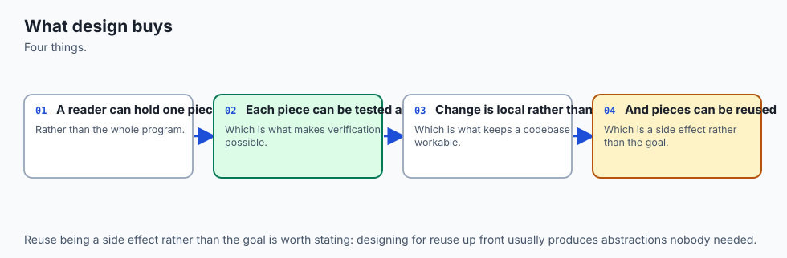

Designing a small program well is a handful of habits that reinforce each other.

**Start from the spec and examples, not the code.** Before you type a function body, write down what the program takes in, what it produces, and two or three concrete examples — including a bad one. A spec you can state in a sentence and check against examples is a target; a blank editor is not.

**Decompose into small, single-responsibility pieces.** Break the work into functions (and, when it grows, modules) that each do *one* thing and have a name that says what. A function that does one job is easy to name, easy to test, and easy to reuse. This is *separation of concerns*: each concern — parsing, computing, formatting, printing — lives in its own place. Good decomposition maximizes *cohesion* (the things inside one function belong together) and minimizes *coupling* (functions depend on each other as little as possible, through small, clear interfaces).

**Keep a functional core and an imperative shell.** Sort your functions into two kinds. The *pure* ones — values in, values out, no reading, no printing, no files — form the **functional core**, where all the real logic lives. The ones that touch the outside world — arguments, files, the screen, the clock, the network — form the **imperative shell**, kept thin and pushed to the edges. Because the core is pure, it is trivially testable; because the shell is thin, there is little in it that can go wrong.

**Design the interfaces before the bodies.** Decide each function's name, its parameters, what it returns, and what it promises — and write that promise as a docstring — *before* you write the code that fulfils it. This is docstring-driven design: the signature and docstring are the contract; the body is just keeping it.

**Grow incrementally, with tests as you go.** Make it work on the simplest possible case first, test that, then grow. Never write more than you can immediately check.

**Know when it is good enough.** Stop when the spec is met and the code is clear. Do not add configuration, options, or abstractions the problem has not asked for. This restraint has a name — *YAGNI*, "you aren't gonna need it" — and it is as much a part of good design as knowing what to build.

## Historical background

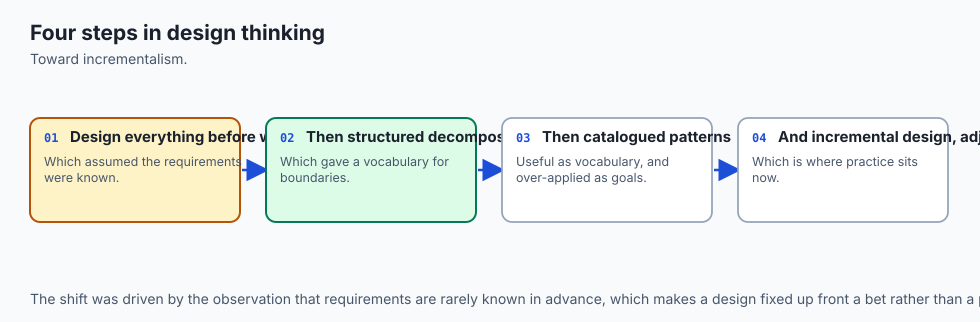

These habits are not fashions; they are hard-won lessons, some more than fifty years old. In 1972, David Parnas published "On the Criteria To Be Used in Decomposing Systems into Modules," arguing that a system should be split not by the steps it performs but by the *decisions* each part hides from the others — the principle of *information hiding*, and the intellectual root of the module boundary.

Around the same time, working on structured design, Larry Constantine (later with Edward Yourdon in the 1979 book *Structured Design*) named the two measures we still use to judge a decomposition: **cohesion**, how well the parts inside a module belong together, and **coupling**, how much modules depend on one another. Good design, they argued, means high cohesion and low coupling.

In 1974, Edsger Dijkstra, in an essay titled "On the role of scientific thought," described what he called "the separation of concerns" — focusing on one aspect of a problem at a time — as the only available technique for ordering one's thoughts effectively. The name stuck and became one of the field's guiding phrases. The Unix tradition, growing in parallel at Bell Labs, turned the same idea into a working culture: small programs that each do one thing well and combine through clean interfaces.

The phrase **single-responsibility principle** — the idea that a piece of code should have one, and only one, reason to change — was named by Robert C. Martin in his writing on object-oriented design around the turn of the millennium, distilling the older notion of cohesion into a memorable rule.

The idea of building only what you need now, captured as **YAGNI**, came out of the Extreme Programming movement of the late 1990s, associated with Kent Beck and Ron Jeffries, as a deliberate antidote to speculative over-engineering. And the specific framing you will use most today — the **functional core, imperative shell** — was crystallized by Gary Bernhardt in his 2012 talk "Boundaries," giving a crisp name to a way of separating pure logic from side effects that testable systems had been reaching for all along.

Python's own community wrote its design values into PEP 20, "The Zen of Python," by Tim Peters in 2004: "Simple is better than complex," "Flat is better than nested," "There should be one — and preferably only one — obvious way to do it." Everything in this lesson is one of these old ideas, applied to a program small enough to hold in your head.

## What it is — and what it is not

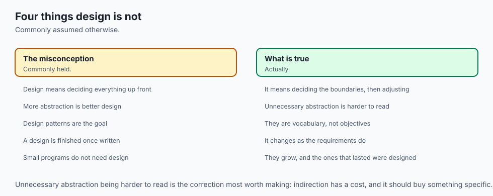

Designing a small program well, for this lesson, is the practice of turning a spec into a clear structure *before and during* coding: naming the pieces, giving each one responsibility, separating pure logic from input and output, designing signatures before bodies, growing the program in tested increments, and stopping when the spec is met. It is a way of thinking that produces code you can read, test, change, and reuse.

It helps to be precise about what this is *not*, because the failure modes are common. It is **not** big-design-up-front — you are not drawing elaborate diagrams for weeks; the design of a small program takes minutes and evolves as you build. It is **not** the same as writing clever or short code — a clever one-liner that fuses four concerns is worse designed than four plain functions.

It is **not** adding layers, options, and abstractions for a future that may never come; that is over-engineering, the opposite failure from tangled code, and just as costly. And it is **not** a style you apply only to big projects: the habits pay off most on the small programs you write every day, which is exactly why we practise them on a program you can read in one sitting.

| Common misconception | The reality |
| --- | --- |
| "Design is for big projects; small scripts just get written." | The habits — spec first, one job per function, pure core — cost minutes on a small program and save hours the moment it changes or needs a test. |
| "Good design means more classes, layers, and options." | Good design means the *least* structure that meets the spec clearly. Extra layers you do not need are over-engineering (YAGNI), a design flaw of their own. |
| "Get it working, then worry about structure." | Structure is what lets you *know* it works, incrementally. Tangled code written all at once is tested last and debugged blindly. |
| "Pure functions are an academic nicety." | Purity is practical: a function with no I/O can be tested with one call and one assertion, reused anywhere, and can never delete a file or make a network call by surprise. |
| "The design is the code." | The design is the *interfaces* — names, signatures, and contracts. Decide those first (as docstrings) and the bodies almost write themselves. |

## Why it was created and what problems it solves

Every habit here exists to defeat a specific way that programs rot.

Without decomposition, a program becomes one long function where everything touches everything. You cannot test a piece of it because there are no pieces; you cannot reuse a step because it is welded to its neighbours; and a change anywhere risks breaking anything. Splitting the work into small, single-responsibility functions solves this: each piece can be named, tested, understood, and reused on its own, and a change is contained to the one function responsible for that concern.

Without the functional-core/imperative-shell split, logic and I/O are interleaved, so the only way to test the logic is to run the program with real files and a real screen and inspect the output by hand — slow, brittle, and unautomatable. Pulling the pure logic into a core that takes values and returns values solves this: the logic is tested with plain function calls, and the thin shell that remains has almost nothing to test because it has almost no logic.

Without designing signatures first, you discover halfway through a body that the function needs a different shape, and you thrash. Deciding the name, parameters, return value, and docstring first solves this: you commit to a contract, and the body only has to keep it.

Without incremental development, you write a lot of untested code and then face a wall of bugs with no idea which line is at fault. Growing in small, tested slices solves this: you are never more than one change away from a version you trust. And without YAGNI, you drown a simple program in options and abstractions for needs that never arrive, paying for that complexity forever. Building only what the spec asks solves this: the program stays as small as the problem.

## How it works

Designing a small program well has a shape you can follow on purpose. It has two dimensions: how the finished program is *arranged* (its architecture), and the *process* by which you arrive there (the design loop).


The architecture diagram shows the arrangement. The **outside world** — a file, standard input, command-line arguments — enters through a thin **imperative shell**, the only part of the program that reads, writes, or otherwise causes side effects. Wrapped inside the shell sits the **functional core**: a small set of pure functions, each with a single responsibility, that take values and return values and touch nothing outside themselves.

Results leave through the shell as standard output, standard error, and an exit code. And crucially, the **tests** point straight at the core: because those functions are pure, a test calls one with an example and checks the return value — no files to set up, no output to capture. The shell is so thin there is little left to test in it.

### Separation of concerns: cohesion and coupling

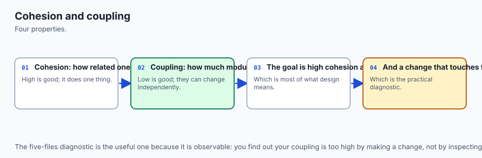

The first move is decomposition: name the distinct concerns and give each its own function. For a tool that summarizes numbers the concerns are obvious once you look — *parse* text into numbers, *compute* the statistics, *format* them for a human, and *read/print* (the I/O). Each becomes a function with one job.

You are aiming for high **cohesion** (everything inside `summarize` is about computing the summary, nothing else) and low **coupling** (`summarize` neither reads files nor prints; it just takes a list and returns a dict, so it depends on nothing but its inputs). A function you can describe with a single "it ..." sentence — "it turns text into a list of numbers" — has one responsibility. If your sentence needs an "and," you have found two functions.

### Functional core, imperative shell

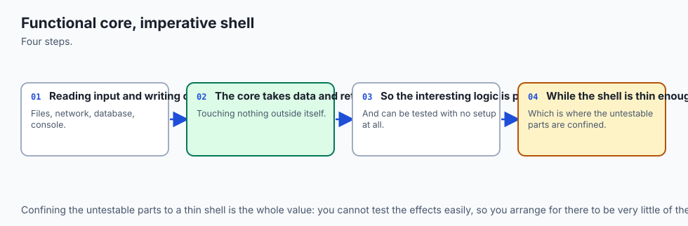

Now sort those functions into the two kinds. `parse_numbers`, `summarize`, and `format_summary` are **pure**: give them the same input and they return the same output, forever, with no trace left in the world. They are the core. `read_input` (which opens a file or reads standard input) and the printing and exit-code logic are **impure**: they touch the world. They are the shell. The rule is simple and powerful: push all side effects to the edges, and keep the middle pure. The payoff is testability — the entire logic of the program can be checked without ever running the program — and safety, because a function that cannot do I/O cannot do damage.

### Design the signatures first (docstring-driven design)

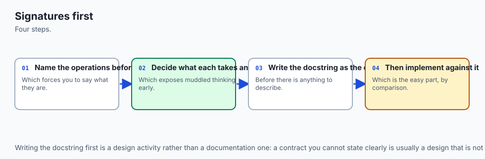

Before writing a single body, write each function's signature and docstring: its name, its parameters, what it returns, and what it promises about errors. `parse_numbers(text) -> list[float]`, "raises `ValueError` on a non-numeric token." `summarize(numbers) -> dict`, "raises `ValueError` on an empty list." Writing the contract first forces you to think about the *interface* — the seam between pieces — which is where design lives. Once the contracts are fixed, each body is a small, local puzzle with a clear target, and the pieces are guaranteed to fit because you designed the seams before the parts.

### Grow incrementally, and stop when it is good enough

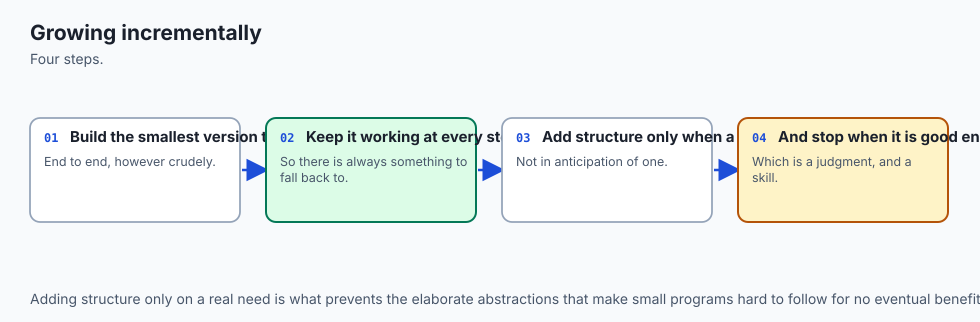

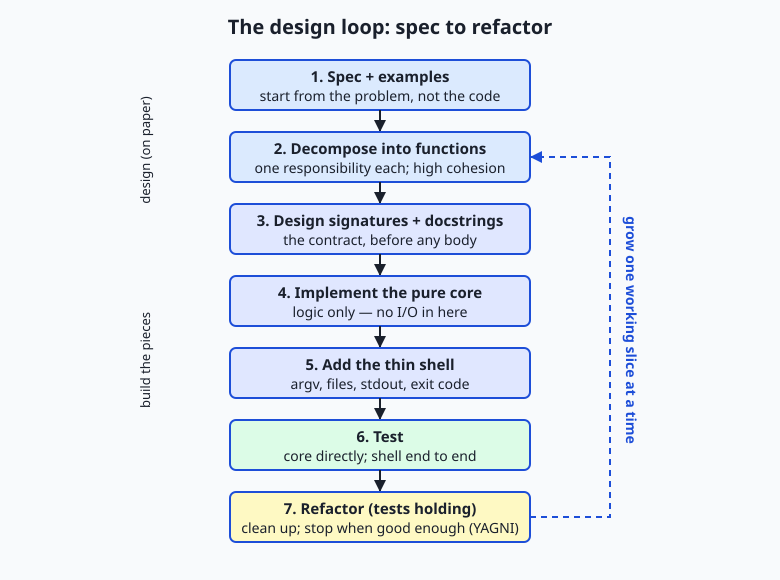

The flow diagram shows the process. Start from the **spec and examples**. **Decompose** into single-responsibility functions. **Design the signatures and docstrings**. **Implement the pure core** first — it is the part with the logic, and you can test it immediately, with no shell in the way. Only then **add the thin shell** that wires the core to files and the screen. **Test** the core directly and the shell end to end. Then **refactor** with the tests holding your back — rename, simplify, remove duplication — and loop back to grow the next slice the same way.

The loop is the point: you build a small program the way you climb stairs, one tested step at a time, never leaping. And you stop climbing when the spec is met and the code is clear. Adding a feature the spec did not ask for — an option nobody requested, an abstraction for a second use case that does not exist — is not diligence; it is **YAGNI**'s warning ignored, and it makes the program bigger and worse. Good enough, met cleanly, is done.

## An everyday analogy

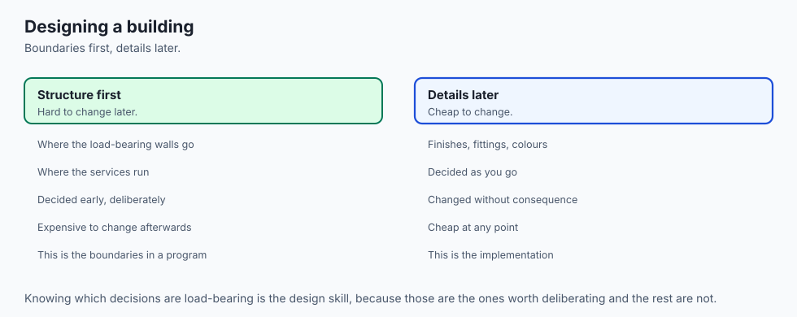

Picture a small craft workshop with a loading dock. The **loading dock** faces the street: trucks arrive at odd hours with boxes of raw material, the weather blows in, deliveries are late or wrong, and finished goods go out to be shipped. The dock is chaotic because the outside world is chaotic — and that is exactly the **imperative shell**: the thin edge of your program that deals with files, arguments, the screen, and everything unpredictable. You keep the dock small and simple, because the more that happens there, the more can go wrong with the weather blowing through.

Behind a sealed door is the **workshop** itself — clean, quiet, controlled. Here the actual craft happens, on materials already unpacked and checked. Nothing in the workshop deals with trucks or weather; it just takes good materials and produces good work. This is the **functional core**: pure logic, insulated from the mess, doing the real job. Because the workshop only ever sees clean inputs and produces clean outputs, you can test it with a tray of sample materials — you do not need a real truck to arrive to know the workshop works. That is why a pure core is so easy to test.

Inside the workshop, the benches are specialized: one station cuts, one shapes, one finishes. Each **station has a single responsibility**, and each does its own job so completely that the others do not need to know how — a cut piece is handed on without the shaping station caring how it was cut. Tight teamwork *within* a station (high **cohesion**), simple handoffs *between* stations (low **coupling**). Before anyone builds a bench, the shop foreman writes a card for each station saying what goes in and what comes out — the **signature and docstring**, decided before the tools are laid.

The shop is built and tested one station at a time (**incremental development**), and when a customer asks for exactly a chair, the foreman does not also build a machine for sofas the shop has never been asked to make — that is **YAGNI**, keeping the shop no bigger than the work.

Keep this workshop in mind and every part of good design has a place: the dock is your shell, the sealed workshop is your pure core, the benches are your single-responsibility functions, the cards are your signatures, and the closed door between dock and workshop is the boundary that keeps the mess out of the logic.

## Examples in practice

Let us design one small program end to end, exactly the way the lab has you do it. The **spec**, in one sentence: read a bunch of numbers from a file or standard input and print a summary — count, total, mean, minimum, maximum, and how many values are above the mean; reject non-numbers and empty input with a clear error and a non-zero exit code. Two **examples**: `10 20 30` summarizes with mean `20.00` and one value above the mean; `1 two 3` errors with `'two' is not a number`.

**Decompose and design signatures first.** Four concerns, so four functions, and we write their docstrings before any body:

```python
def parse_numbers(text):
    """Text -> list of floats. Commas/spaces/newlines separate.
    Empty text -> []. A non-number raises ValueError naming the token."""

def summarize(numbers):
    """Non-empty list of numbers -> dict of statistics
    (count, total, mean, minimum, maximum, above_mean).
    Empty list raises ValueError."""

def format_summary(summary):
    """A summary dict -> an aligned, human-readable string. Pure."""

def read_input(argv):
    """argv -> the raw text: from a named file, or from stdin. (Shell: does I/O.)"""
```

Three of those are pure (the core); one does I/O (the shell). **Implement the pure core first**, because it holds the logic and can be tested immediately:

```python
def summarize(numbers):
    if not numbers:
        raise ValueError("cannot summarize an empty list of numbers")
    count = len(numbers)
    total = sum(numbers)
    mean = total / count
    above_mean = sum(1 for value in numbers if value > mean)
    return {
        "count": count, "total": total, "mean": mean,
        "minimum": min(numbers), "maximum": max(numbers),
        "above_mean": above_mean,
    }
```

Notice it takes a list and returns a dict — no file, no print. That purity is what lets us test it in one line, with no program to run: `summarize([2, 4, 6, 8])` must return a dict whose `mean` is `5.0` and whose `above_mean` is `2` (the values 6 and 8). **Add the thin shell** last, and keep it thin — it does the I/O the core refuses to:

```python
import sys
import summary_core

def read_input(argv):
    if len(argv) > 1:
        with open(argv[1], "r", encoding="utf-8") as handle:
            return handle.read()
    return sys.stdin.read()

def main(argv):
    try:
        text = read_input(argv)
        numbers = summary_core.parse_numbers(text)
        summary = summary_core.summarize(numbers)
    except (ValueError, OSError) as err:
        print(f"error: {err}", file=sys.stderr)
        return 1
    print(summary_core.format_summary(summary))
    return 0

if __name__ == "__main__":
    sys.exit(main(sys.argv))
```

The shell is almost all wiring: read, call the core, print, choose an exit code. **Test** both halves — the core directly and the shell end to end:

```text
$ echo "10 20 30" | python3 summary.py
count      3
total      60.00
mean       20.00
minimum    10.00
maximum    30.00
above mean 1

$ echo "1 two 3" | python3 summary.py ; echo "exit: $?"
error: 'two' is not a number
exit: 1
```

And the core, with no shell at all:

```text
$ python3 -c "import summary_core as c; print(c.summarize([2, 4, 6, 8])['above_mean'])"
2
```

Finally, **refactor** with the tests holding: if `format_summary` repeats a label-and-width pattern on every line, factor it into one list; the tests confirm nothing broke. That is the whole discipline — spec, decompose, signatures, core, shell, test, refactor — walked once on a program small enough to hold in your head, and it is exactly the shape the lab and the Week 9 Flashcard project reuse.

## Implications: security, privacy, performance, scalability, and cost

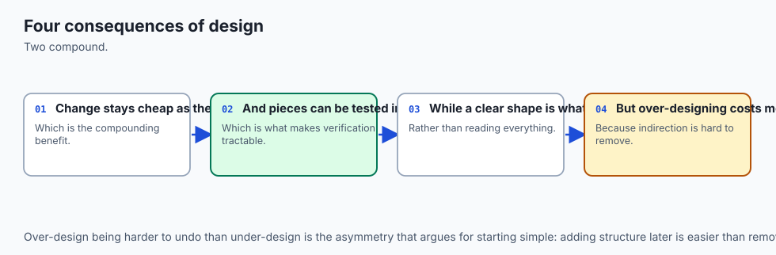

**Security.** The design *is* a security measure. Because the functional core does no I/O — no `open`, no network, no `subprocess` — its functions physically cannot delete a file, spend money, or leak data, whatever input they are handed. Every dangerous capability is confined to the thin shell, in one small place you can audit. Add the boundary habit from earlier weeks — validate input where it enters and convert it with safe tools like `float()`, never `eval()` — and the attack surface of the whole program shrinks to a few readable lines.

**Privacy.** A pure core makes data flow auditable. When logic has no side effects, you can see exactly where data comes in (the shell), how it is transformed (the core, deterministically), and where it goes out (the shell). Nothing secretly writes a log or phones home from the middle, because the middle cannot. As you handle real people's data in AI systems later, "all side effects live at the edges" is what lets you promise, and verify, what happens to that data.

**Performance.** Good design neither helps nor hurts raw speed much for a small program — and that is the point. The performance trap here is *over-engineering*: adding caches, abstractions, and configurability for imagined scale before you have measured a real problem. Premature optimization contorts code for gains you cannot show. Design for clarity first; when a measurement points to a real bottleneck, a well-decomposed program is far easier to optimize, because you can replace one pure function without disturbing the rest.

**Scalability.** This is where design earns its keep. A program that separates concerns can grow: adding a feature means adding or changing one small piece, not untangling a monolith. The same separation scales from this tiny tool to a real AI system, where data loading, model definition, training, and serving are separate, testable modules precisely so the system can grow and be worked on by many people without collapsing. Separation of concerns is the property that lets software scale in *size and team*, not just in throughput.

**Cost.** The dominant cost of software is not writing it but changing it, and design is what makes change cheap. A tangled program is expensive forever: every change is risky and slow. An over-engineered program is expensive too: you pay to build, understand, and maintain machinery no one needed. The sweet spot — the least structure that meets the spec clearly — is the cheapest to own. Time spent designing a small program well is not overhead; it is the cheapest insurance you will ever buy against the far larger cost of untangling it later.

## Alternatives: free, open source, and commercial

"Designing well" is a practice, but it leans on concrete, free tools for structuring and checking small programs. All of the following ship with Python or are free and open source; the choice is about fit, not money.

| Tool / approach | What it is | When to choose it | Cost |
| --- | --- | --- | --- |
| Plain functions + modules (standard library) | Small named functions in one or a few `.py` files, split into core and shell | The default for any small program — a script, a lab, the Week 9 project. Needs nothing installed | Free, built in |
| `unittest` | Python's built-in testing framework | When you want structured tests that ship with Python and run anywhere, with no dependency | Free, built in |
| `doctest` | Runs the examples written in your docstrings as tests | When your docstrings already show example calls (as ours do) and you want them checked for free | Free, built in |
| `dataclasses` | A concise way to define small record types with named fields | When a dict of fields grows into a real record with behaviour and you want a named type | Free, built in |
| `pytest` | A popular third-party test runner with terse assertions | Larger programs where you want less test boilerplate and rich failure output, and a dependency is fine | Free, open source (`pip`) |
| Type hints + `mypy` | Optional type annotations plus a checker that verifies them | When you want signatures machine-checked, catching a wrong argument before you run | Free, open source (`pip`) |

**Standard-library functions and modules — how, with an example.** You need nothing but Python: put pure logic in `summary_core.py`, the shell in `summary.py`, and import one from the other. This is the approach this course uses, because every lab must run on a plain Python install.

**`doctest` — how, with an example.** Because our core's docstrings already contain example calls, you can check them with one command — the docstring becomes an executable test:

```bash
python3 -m doctest summary_core.py -v
```

**`pytest` — how, with an example.** In a larger program you write `test_core.py` with plain `assert` statements and run `pytest`; it finds the tests, runs them, and prints readable failures:

```python
from summary_core import summarize
def test_above_mean():
    assert summarize([2, 4, 6, 8])["above_mean"] == 2
```

For today — one small, self-contained program — plain functions plus a shell test script are the deliberate choice, and everything you learn transfers directly to `pytest`, `mypy`, and `dataclasses` when a project grows enough to justify them.

## Comparison with related concepts

| Concept A | Concept B | Key difference |
| --- | --- | --- |
| Functional core | Imperative shell | The core is pure logic (values in, values out, no I/O); the shell does all the I/O and holds no logic. Keep the core big and tested, the shell thin |
| Cohesion | Coupling | Cohesion is how well the parts *inside* one function belong together (want it high); coupling is how much functions depend on *each other* (want it low) |
| Single responsibility | God function | A single-responsibility function does one nameable thing; a "god function" does many, so it cannot be named, tested, or reused cleanly |
| Design-first (signatures) | Code-first | Designing signatures and docstrings before bodies fixes the interfaces so the parts fit; coding first often forces rework when the shape turns out wrong |
| Incremental development | Big-bang development | Incremental builds and tests one small slice at a time, always near a trusted state; big-bang writes everything then debugs blindly at the end |
| YAGNI (build what is asked) | Speculative generality | YAGNI builds only what the spec needs now; speculative generality adds options and layers for futures that may never come, at permanent cost |

## When to use it — and when not to

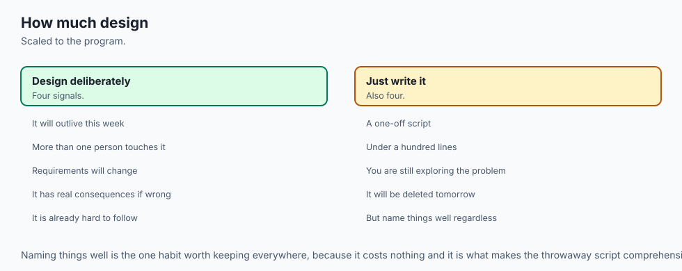

Reach for this discipline on essentially every program you write, because its cost scales with the program. For a five-line throwaway you will never run twice, the "design" is a moment's thought about the one function's name and return value — and that is enough. For anything you will run more than once, share, test, or grow — a lab, a project script, the wrappers you will put around models and datasets, the Week 9 Flashcard App — the full loop pays for itself immediately: spec first, one job per function, a pure core and thin shell, signatures before bodies, tested increments, and the restraint to stop. The larger and longer-lived the program, the more each habit returns.

There is a way to overdo it, and it is worth naming. Applying heavy structure to a genuinely tiny problem — three modules and an abstract base class for a script that prints today's date — is over-engineering, the YAGNI failure, and it makes simple things hard. The skill is proportion: match the amount of design to the size and lifespan of the problem. A pure core and a thin shell is almost always the right shape; a dozen layers of indirection almost never is on a small program. When you feel yourself adding machinery for a requirement no one has stated, stop — that instinct, resisted, is as much a mark of good design as any diagram.

This is the last day of Week 9, and the week's pieces now connect into a way of working. Day 57 gave you functions with clear arguments and returns — the units you decompose into; Day 58 gave you scope and argument passing — how those units communicate without leaking state; Day 59 gave you modules and imports — how the core and shell live in separate files; Day 60 gave you the standard library — so each function builds on solid parts instead of reinventing them; Day 61 gave you readable code — the local craft inside each function; and Day 62 gave you recursion — one more tool for a function's body.

Design is the judgment that arranges all of them. The Week 9 project, the **Flashcard Study App**, is exactly this lesson at one size larger: a spaced-repetition flashcard tool split into clean modules — a pure core for the scheduling logic, a thin shell for the commands and storage — with every function documented. Everything you design today is the scaffolding that project stands on.

And here is where it points. The functional-core/imperative-shell split and the single-responsibility habit are precisely how maintainable AI systems are built. A serious machine-learning project is not one script; it is separate, testable pieces — data loading and cleaning, model definition, the training loop, and serving — each with one responsibility, the pure logic kept apart from the I/O so every piece can be tested on its own and swapped without breaking the others.

The reason some AI projects grow into reliable products while others collapse into unmaintainable tangles is, more than any algorithm, this: whether they were designed well. Master it on a program you can read in one sitting, and you have the habit that carries all the way up.

## The AI connection

- **Design is what makes a program survive its second requirement**, and it is mostly about
  boundaries.
- **Separating concerns is what makes code testable**, which is why the two lessons sit
  together.
- **Naming the pieces before writing them** is the cheapest design activity available.
- **Every AI application has this structure**: input handling, orchestration, and the model
  call.
- **A design that resists change** is a design that will be worked around rather than
  extended.

## Knowledge check

Try these from memory before looking back:

1. Name the six design habits from "the idea in plain language," and give a one-sentence reason each matters.
2. Explain the difference between the functional core and the imperative shell, and say why a pure core is so easy to test.
3. Distinguish cohesion from coupling, and state which you want high and which you want low.
4. What is docstring-driven design, and what problem does designing the signature before the body prevent?
5. Give one example of over-engineering a small program, and name the principle (YAGNI) that warns against it.

## Hands-on exercise

Time to design a small program well, on purpose. In the Day 63 lab you build **summary** — a tiny numbers-summarizing tool split into a pure functional core (`summary_core.py`) and a thin imperative shell (`summary.py`) — from a starter whose signatures and docstrings are already written, then run a test suite that checks the pure core directly. Work in the lab directory; every command below is run from there.

First, drive the finished reference so you know the target, feeding it numbers on standard input and then from a file:

```bash
echo "10 20 30 40" | python3 examples/summary.py
printf "5, 7, 9, 11\n" > scores.txt
python3 examples/summary.py scores.txt
rm -f scores.txt
```

Now call the pure core directly, with no shell and no files, to see why the split matters:

```bash
PYTHONPATH=examples python3 -c "import summary_core as c; print(c.summarize([2, 4, 6, 8]))"
```

Then open `starter/summary_core.py` and complete its three numbered exercises — `parse_numbers`, `summarize`, and `format_summary` — using the docstrings as your contract and the reference only when stuck. Run your version through the provided shell:

```bash
echo "3 6 9" | python3 starter/summary.py
```

Finally, run the suite, which checks your core with plain function calls and the shell end to end:

```bash
bash tests/run_tests.sh
```

### Expected output

A correct session with the reference tool looks exactly like this:

```text
$ echo "10 20 30 40" | python3 examples/summary.py
count      4
total      100.00
mean       25.00
minimum    10.00
maximum    40.00
above mean 2

$ echo "1 two 3" | python3 examples/summary.py ; echo "exit: $?"
error: 'two' is not a number
exit: 1

$ PYTHONPATH=examples python3 -c "import summary_core as c; print(c.summarize([2, 4, 6, 8]))"
{'count': 4, 'total': 20, 'mean': 5.0, 'minimum': 2, 'maximum': 8, 'above_mean': 2}
```

Successful summaries print to standard output and exit 0; a bad token or empty input prints to standard error and exits 1; and the last line proves the pure core runs correctly with a plain list and no I/O at all — the payoff of the design.

### Validate your work

You are done when you can check every box:

- [ ] `echo "10 20 30 40" | python3 examples/summary.py` prints a six-line summary ending `above mean 2` and exits 0.
- [ ] `echo "1 two 3" | python3 examples/summary.py; echo $?` prints `error: 'two' is not a number` to standard error and then `1`.
- [ ] `printf "" | python3 examples/summary.py; echo $?` prints the empty-input error and then `1`.
- [ ] `PYTHONPATH=examples python3 -c "import summary_core as c; print(c.summarize([2,4,6,8])['above_mean'])"` prints `2`.
- [ ] Your completed `starter/summary_core.py` runs through `starter/summary.py` and matches the reference.
- [ ] `bash tests/run_tests.sh` ends with `0 failure(s)` and exits `0`.

### Troubleshooting

- **`NotImplementedError` when you run the starter.** Expected until you finish the three exercises; each stub raises it on purpose. Replace each `raise NotImplementedError(...)` with the body described above it.
- **`ModuleNotFoundError: No module named 'summary_core'`.** The shell imports the core sitting next to it. Run the shell by its path (`python3 starter/summary.py`) so Python puts that directory on the import path, or set `PYTHONPATH` when calling the core directly, as the commands show.
- **`error: 'x' is not a number`.** A token in your input is not a number. Commas, spaces, tabs, and newlines separate values; anything else between them is rejected by name, and the shell exits 1.
- **`error: cannot summarize an empty list of numbers`.** You gave the tool no numbers (an empty file or empty standard input). The core refuses to summarize nothing; provide at least one number.
- **A whole number shows as `5.00`.** Real-valued statistics are formatted with `:.2f` on purpose; counts print as integers. Change the format string in `format_summary` if you want different precision.

### Common mistakes

- **Putting I/O in the core.** A `print` or `open` inside `summary_core.py` breaks the whole design and makes the function hard to test. The core takes values and returns values; all I/O lives in the shell.
- **Writing bodies before contracts.** Skipping the docstrings and guessing a function's shape as you go leads to rework. Read (or write) the docstring first, then fulfil it.
- **Fusing concerns to be "concise."** Cramming parse, compute, and format into one function is not clever; it is one function with three responsibilities that cannot be tested or reused separately. Keep them apart.

## Practice assignment

Design and build a *second* small program of your own, using the same discipline, and keep it in your Day 63 lab folder. Choose a genuinely small, useful tool with real logic to summarize or transform — a word-frequency counter (text in, the top few words and their counts out), a grade summarizer (scores in, average and letter-grade counts out), or a simple unit converter (a value and a unit in, the converted value out).

Before writing any code, fill in `starter/design-worksheet.md` completely: state the spec in one sentence with three examples (one bad), list each function with its signature and whether it is pure (core) or does I/O (shell), name which functions form the core and how you will test it without files, sketch the incremental build order, and list at least two features you are deliberately *not* building (your YAGNI check).

Then implement it as a pure core module plus a thin shell, with a docstring on every function written before its body, validation at the boundary that prints to standard error and returns a non-zero exit code, and clean output on standard output. Finally, record one good run and one bad run (with its `echo $?`) in the worksheet, and prove one core function is importable and testable with a `python3 -c` one-liner. Keep the tool; it is a direct rehearsal for the Week 9 Flashcard project.

## Extension challenge

Take your `summary` tool one honest step further, practising design judgment at each move. First, **add a `median` statistic** to the summary. Decide first where it belongs — the pure core, because it is logic — then write its signature and docstring before its body, and add a direct test that calls it with a known list and asserts the result.

Second, **make the precision configurable without over-engineering it**: let the shell read an optional second command-line argument for the number of decimal places and pass it into a changed `format_summary(summary, places=2)`, keeping `format_summary` pure and defaulting to the current behaviour so nothing breaks — and write a one-sentence comment on why a single optional argument is the right amount of flexibility here and a full options system would be YAGNI.

Third, **refactor `format_summary`** so the repeated label-and-width pattern is defined once rather than per line, and confirm the test suite still passes — proof that a pure core plus good tests lets you refactor without fear. Finally, **add your own `tests/test_core.py`** that imports `parse_numbers`, `summarize`, `format_summary`, and your new `median`, asserts their behaviour including the error cases, prints `all tests passed` only if every assertion holds, and exits 0. You will have designed, built, tested, extended, and refactored a small program the way professionals do — and rehearsed exactly the structure the Flashcard project, and every maintainable AI system after it, is built on.