## Why this matters

Look back at the programs you have written since Day 49. A pattern keeps recurring, and it has been getting heavier. You have some related values — an owner, a balance, a list of movements — and you hold them in a dictionary. Then you write functions that operate on that dictionary, and every one of them takes it as the first argument. `deposit(account, 50)`. `withdraw(account, 30)`. `describe(account)`. Each function silently assumes the dictionary has exactly the keys it expects, and nothing anywhere states what those keys are or what rules they must satisfy.

That arrangement works until it does not, and the way it fails is worth seeing precisely. Here is the dict version of an account, running in the Day 67 lab:

```text
ada: 120.00 (2 entries)
rejected: insufficient funds
after a direct edit: ada: -500.00 (2 entries)
```

The second line is your `withdraw` function doing its job: it checked the balance and refused an overdraft. The third line is the same account holding minus five hundred, because somebody wrote `account["balance"] = -500` and no function was involved. Every rule you carefully encoded lives in functions that nobody is obliged to call. The dictionary is wide open, and the guard rails are optional.

A class closes that gap. It binds the state and the behaviour that maintains its rules into one named thing, so the rules stop being a convention and start being enforced. Here is the same session against the class version:

```text
ada: 120.00 (2 entries)
rejected: insufficient funds
rejected: balance cannot be negative (got -500.00)
after the refused edit: ada: 120.00 (2 entries)
repr: Account(owner='ada', balance=120.00)
```

The direct edit is now refused, by the object itself, without anyone remembering to check.

This matters for your AI goal more than almost anything else in this week. Every library in the second half of this course is built out of classes. When you load a model, you get an object. When you tokenize text, a tokenizer object does it. Datasets, agents, tool definitions, retrievers, evaluation harnesses — all objects, all with `__init__` signatures you must read, attributes you must inspect, and methods whose behaviour is documented mostly by their source code. Today is what turns library documentation from a set of spells you copy into code you can actually read.

## The idea in plain language

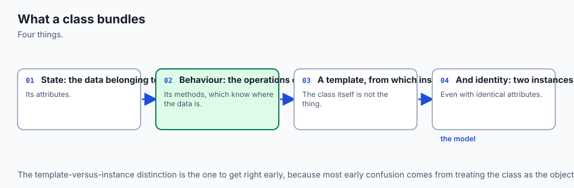

Think of a passport office. The office works from one template: what fields a passport carries, how many pages it has, what makes it valid, what happens when it is stamped. The template is not a passport. You cannot travel on it. It is the definition — the rules and the shape.

Every passport the office issues is a separate physical booklet made from that template. Each has its own holder, its own number, its own stamps. Two passports issued five minutes apart are two different objects in the world; filling one with stamps does nothing to the other. Yet both obey exactly the same rules, because both came from the same template.

That is the whole of today. A **class** is the template. An **object**, also called an **instance**, is one thing made from it. The class says what every instance will carry and what every instance can do; the instance carries its own values.

The part that surprises people is where the two halves live. The **state** — this passport's holder, this account's balance — lives on the instance, one separate copy each. The **behaviour** — the functions that read and change that state — lives on the class, one shared copy for everyone. Neither passport carries its own private copy of the rulebook; both consult the office's single copy. That split is not a detail. It is the mechanism, and once you can see it, everything else about classes stops being magic.

## Historical background

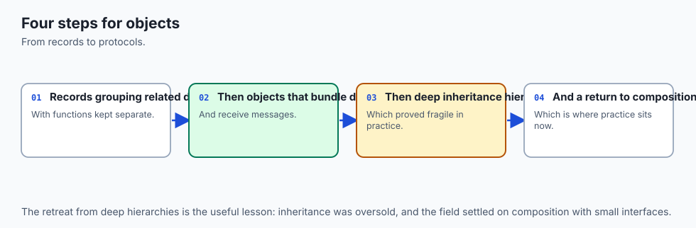

Classes came out of a simulation problem. In the early 1960s at the Norwegian Computing Center in Oslo, **Ole-Johan Dahl** and **Kristen Nygaard** were building tools to simulate real-world systems — ships moving through ports, that sort of thing. Simulating a world means representing many things of the same kind, each with its own state, all following the same rules. Their language **Simula 67** introduced classes and objects to express exactly that, and it is generally credited as the first object-oriented programming language. Dahl and Nygaard received both the ACM Turing Award and the IEEE John von Neumann Medal in 2001 for the work.

The idea was taken much further at **Xerox PARC** in the 1970s, where the **Smalltalk** team built a language in which everything — numbers, classes themselves — was an object communicating by messages. Smalltalk pushed object orientation from "a useful construct for simulation" into a whole way of structuring programs, and its influence runs through most of what came after.

Python has had classes from the beginning. Guido van Rossum released **Python 0.9.0 in February 1991**, and that first public release already included classes with inheritance, along with exceptions, functions, and the core data types. Classes were not bolted on later; they were part of the language's original design. That history explains something you will feel today: Python's object model is simple and exposed. You can look directly at the dictionaries that make an object work, which is exactly what you will do in the lab.

## What it is — and what it is not

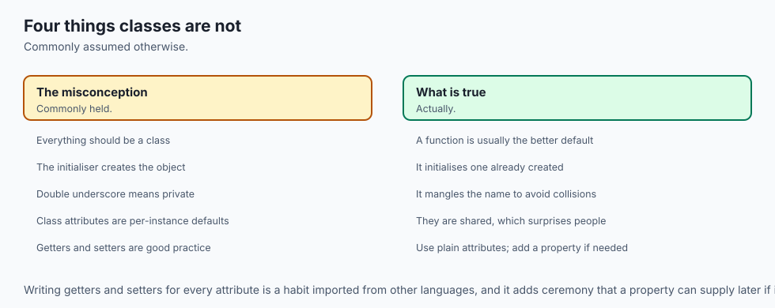

A class is a statement that creates one object — the class object — carrying a dictionary of names. Some of those names hold ordinary values (**class attributes**); most hold function objects (**methods**). Calling the class produces a new **instance**, which gets its own dictionary for its own state and a link back to the class where the shared behaviour lives.

The misconceptions here cost real time, so be precise about what a class is not.

| Common misconception | The reality |
| --- | --- |
| "A class is a place to group related functions." | If the functions do not share state, that is what a module is for. A class whose instances hold nothing is a namespace with extra typing. |
| "`__init__` is the constructor." | The object already exists when `__init__` runs. `__init__` receives the finished object as `self` and fills it in. It returns `None`; returning anything else is an error. |
| "`self` is a keyword." | It is an ordinary parameter name, the first one, filled in automatically by the call machinery. You could name it anything; everyone names it `self`. |
| "Methods are stored inside each object." | One function object per method lives on the class. A million instances share it. Only state is copied per instance. |
| "A double underscore makes an attribute private." | It renames it. `__pin` inside `class Vault` becomes `_Vault__pin`, which is reachable by anyone who types that name. It prevents accidents, not access. |
| "Classes make code faster." | They add an attribute lookup and a bound-method creation per call. You pay a small cost for organisation, and you should want to. |
| "Every group of related values deserves a class." | Only if there are rules to enforce or behaviour to attach. Otherwise a dict or a record type is clearer and shorter. |
| "A class attribute is a per-instance default." | For immutable values it behaves like one. For a list or dict it is one shared object, and mutating it through any instance changes it for all of them. |

## Why it was created and what problems it solves

**Classes exist because state and the rules governing it drift apart.** Your `withdraw` function knows the balance must stay non-negative. The dictionary does not. Anyone with a reference to it can break the rule without going near your function. Binding them together means the rule travels with the data.

**`self` is explicit because Python prefers visible mechanism to hidden mechanism.** In many languages an instance's fields are magically in scope inside a method. In Python they are reached through a named parameter, which means a method is an ordinary function whose first argument happens to be an object — and you can call it that way yourself, which you will do below. The cost is four extra characters; the benefit is that there is nothing to guess.

**The `@property` decorator exists so that adding a rule does not force a rewrite.** Suppose `balance` starts life as a plain attribute and later needs validation. Without properties, every reader would have to change from `acct.balance` to `acct.get_balance()`. With a property, the attribute keeps its name and syntax while gaining a function behind it — callers never notice.

**`@classmethod` exists because a class often needs more than one way to be built.** `__init__` takes the arguments that describe an object directly. But you may also want to build one from a CSV row, from a JSON payload, or from a database record. An alternative constructor receives the class itself as `cls` and returns a new instance, so `Account.from_csv_row("ada,120.50")` reads as what it is.

**`__repr__` exists so that debugging is possible.** An object without one prints as its class name and a memory address — no information at all about its state. A single method turns every print statement, every list display, and every debugger view into something readable.

## How it works


The architecture diagram shows the arrangement in full. On the left, the **class object** holds one dictionary containing `currency`, `accounts_opened`, and the function objects for `__init__`, `deposit`, `withdraw`, `describe`, `__repr__`, the `balance` property, the `from_csv_row` classmethod, and the `is_valid_amount` staticmethod. On the right, **two instances**, each with its own small dictionary of state and nothing else. The arrow between them is the rule that makes everything work: an attribute lookup checks the instance dictionary first, and falls back to the class dictionary when it finds nothing.

### A class is a template; an instance is a thing

Two instances of the same class are genuinely two objects:

```python
class Passport:
    def __init__(self, holder, number):
        self.holder = holder
        self.number = number


a = Passport("ada", "P1001")
b = Passport("bob", "P1002")
```

```text
a.holder: ada | b.holder: bob
a is b: False
id(a) == id(b): False
type(a) is type(b): True
a == b (no __eq__ defined): False
default repr of a: <__main__.Passport object at 0x...>
```

They hold different values, they are not the same object, and their identities differ — but `type(a) is type(b)` is `True`, because both were made from one template. One caution about that last line: the hex number in a default representation is the object's address in memory and it **changes on every run**. It has been shown as `0x...` here deliberately. Never write a test or copy an example that depends on it.

### `__init__` initializes; it does not construct

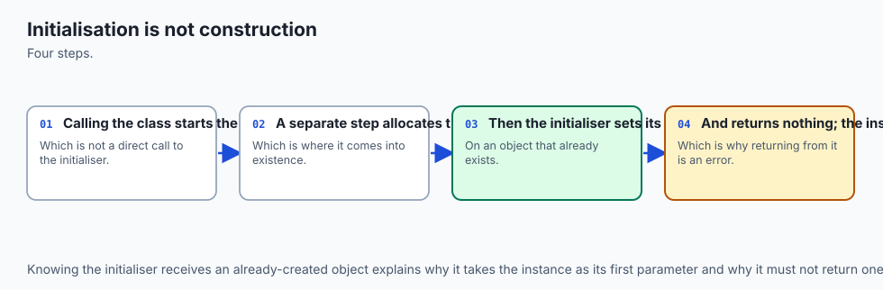

This distinction is not pedantry, and here is the proof:

```python
class Probe:
    def __init__(self, label):
        print("  inside __init__, self already exists")
        print("  type(self):", type(self).__name__)
        print("  vars(self) before I set anything:", vars(self))
        self.label = label
```

```text
  inside __init__, self already exists
  type(self): Probe
  vars(self) before I set anything: {}
__init__ returned: None
```

By the time your code runs, the object exists, has a type, and has an empty attribute dictionary waiting to be filled. `__init__` is handed that object as `self` and fills it in. It returns `None` — it is not producing the object, it is preparing one.

Why does the distinction matter in practice? Three consequences. First, `__init__` cannot decide to return a different object or a cached one; it can only configure what it was given. Second, if `__init__` raises, a partly-built object may already exist, so anything acquired earlier in it needs cleaning up. Third — most practically — an alternative constructor cannot be a second `__init__`. There is only one. That is precisely why `@classmethod` exists.

### `self` and the bound-method mechanism

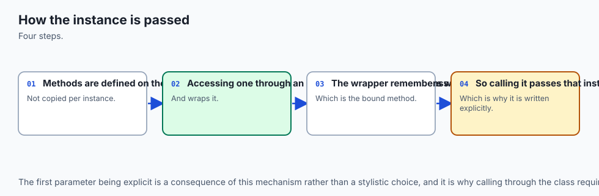

A method call has no magic in it. Watch:

```python
class Counter:
    def bump(self, amount):
        self.total = getattr(self, "total", 0) + amount
        return self.total


c = Counter()
```

```text
type(Counter.bump): function
type(c.bump): method
c.bump.__self__ is c: True
c.bump.__func__ is Counter.bump: True
c.bump(5)          -> 5
Counter.bump(c, 5) -> 10
```

Read that carefully, because it is the whole mechanism. Reached through the class, `bump` is a plain **function**. Reached through an instance, the same function comes back wrapped as a **bound method** — an object holding two references: `__func__`, the original function, and `__self__`, the instance it was reached through. Calling the bound method calls the function with `__self__` inserted as the first argument.

So `c.bump(5)` genuinely *is* `Counter.bump(c, 5)`. The last two lines prove it: both calls ran, both incremented the same counter, which is why the totals are 5 and then 10.


The flow diagram traces all eight steps for a real call. Python looks for `deposit` in the instance dictionary and does not find it, because instance dictionaries hold only state. It falls back to the class dictionary and finds the function. It creates a bound method. It calls it with `self` supplied. Your code then mutates that one instance's state, the property setter checks the rule, and the new balance is returned. Steps one to five are the language's sugar; steps six to eight are your code keeping the object's promise.

### Instance attributes versus class attributes

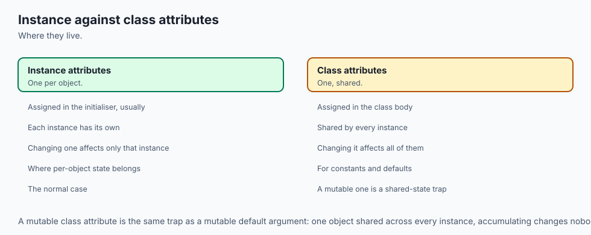

An attribute assigned inside `__init__` through `self` belongs to that instance. An attribute assigned in the class body belongs to the class and is shared. For an immutable value that is harmless and useful. For a **mutable** value it is the classic bug:

```python
class Office:
    country = "Norway"
    issued = []          # one list, created once, shared by everyone

    def __init__(self, city):
        self.city = city

    def issue(self, name):
        self.issued.append(name)
```

```text
oslo.issued: ['ada', 'bob']
bergen.issued: ['ada', 'bob']
same list object? True
it is really on the class: ['ada', 'bob']
vars(oslo): {'city': 'Oslo'}
'issued' in vars(oslo): False
```

The Oslo office issued one passport and the Bergen office issued one, and both now report two. The list was created **once**, when the class statement ran, and `self.issued.append(...)` never created anything on the instance — it looked `issued` up (missing on the instance, found on the class) and mutated the one shared list. The `vars(oslo)` line is the tell: the instance dictionary contains only `city`.

The fix is one line — create the list inside `__init__`:

```python
    def __init__(self, city):
        self.city = city
        self.issued = []
```

```text
fixed -> o2.issued: ['ada'] | b2.issued: ['bob']
fixed -> same list object? False
```

There is a related subtlety worth knowing. Reading a class attribute through an instance works, but **assigning** through an instance creates a new instance attribute that shadows it:

```text
oslo.country: Norway | 'country' in vars(oslo): False
after assigning to oslo.country, vars(oslo): {'city': 'Oslo', 'country': 'Norway (Oslo branch)'}
bergen.country still: Norway
```

Reads fall back to the class; writes always land on the instance. Only `Office.country = ...` changes it for everyone.

### Methods, staticmethods, and classmethods

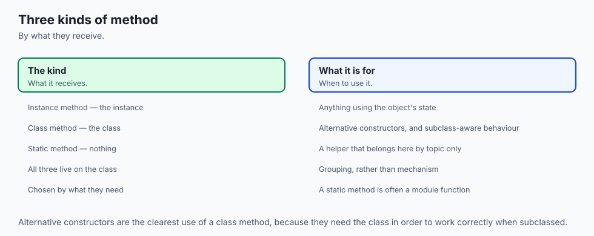

Three kinds of function can live on a class, and each earns its place differently.

```python
class Ticket:
    prefix = "TK"

    def __init__(self, number):
        self.number = number

    @staticmethod
    def is_valid_number(value):
        return isinstance(value, int) and value > 0

    @classmethod
    def from_csv_row(cls, row):
        parts = [f.strip() for f in row.split(",")]
        if len(parts) != 1:
            raise ValueError(f"expected one field, got {row!r}")
        return cls(int(parts[0]))

    def __repr__(self):
        return f"Ticket(number={self.number!r})"
```

```text
Ticket.is_valid_number(7): True
Ticket.is_valid_number(-7): False
Ticket.is_valid_number('7'): False
Ticket.from_csv_row('42'): Ticket(number=42)
type in the class dict -> is_valid_number: staticmethod
type in the class dict -> from_csv_row:   classmethod
from_csv_row('1,2') -> ValueError - expected one field, got '1,2'
```

An **instance method** takes `self` and needs one particular object. A **staticmethod** takes neither `self` nor `cls`; it is a plain function that belongs with the class conceptually — a validation rule, a unit conversion — and lives there so it can be found. A **classmethod** takes `cls`, the class itself, and its overwhelmingly common use is the alternative constructor: it builds and returns a new instance.

That `from_csv_row` is the direct tie back to Day 65. You now read a CSV row with `csv.DictReader`, hand each row to `Account.from_csv_row`, and get a list of validated objects instead of a list of dictionaries you hope are well-formed. The lab does exactly that with four rows and reports `loaded 4 accounts, total 2225.75 USD`.

### `__repr__` versus `__str__`

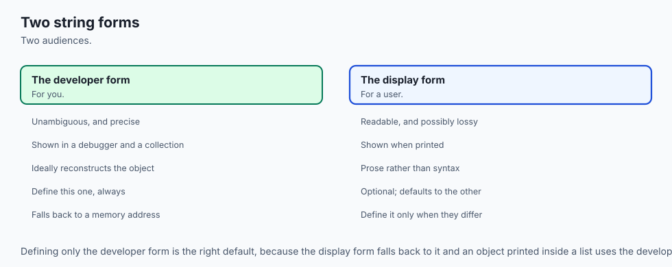

Two methods produce text, for two different audiences:

```python
class Money:
    def __init__(self, amount):
        self.amount = amount

    def __repr__(self):
        return f"Money(amount={self.amount!r})"

    def __str__(self):
        return f"{self.amount:.2f} USD"
```

```text
print(m)      -> 49.50 USD
repr(m)       -> Money(amount=49.5)
str(m)        -> 49.50 USD
in a list     -> [Money(amount=49.5)]
f-string uses str: 49.50 USD
no __str__ defined, print falls back to __repr__: ReprOnly(amount=49.5)
```

`__str__` is for a person reading output. `__repr__` is for you, debugging — it should be unambiguous, and by convention it should look like the code that would recreate the object. Note the fourth line: a list displays its elements with `__repr__`, never `__str__`, which is why a class without one produces a list of memory addresses when you print it.

The last line is the rule to remember: **define `__repr__` on every class you write.** If you define only `__repr__`, `str()` and `print()` fall back to it and everything is readable. If you define only `__str__`, your debugger and your lists stay useless. One of the two is worth ten times the other, and it is not the one beginners reach for first.

### Encapsulation, Python style

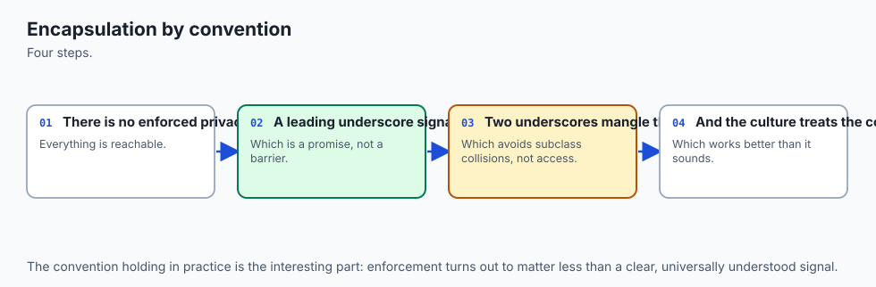

Python has no private attributes. It has two conventions and one mechanism.

A **single leading underscore** — `_balance` — means "this is internal; I may change it without warning." It is enforced entirely by other programmers reading it. Nothing stops access.

A **double leading underscore** triggers **name mangling**: inside `class Vault`, the name `__pin` is rewritten to `_Vault__pin`.

```python
class Vault:
    def __init__(self, pin):
        self._hint = "internal, by convention"
        self.__pin = pin

    def check(self, guess):
        return guess == self.__pin
```

```text
vars(v): {'_hint': 'internal, by convention', '_Vault__pin': '1234'}
v._hint reachable: internal, by convention
hasattr(v, '__pin'): False
hasattr(v, '_Vault__pin'): True
v.check('1234'): True
v.__pin -> AttributeError - 'Vault' object has no attribute '__pin'
```

The attribute is genuinely stored under the mangled name, so `v.__pin` fails from outside while `self.__pin` works inside the class. It is not a security feature — anyone can type `v._Vault__pin` — and its actual purpose is avoiding accidental name collisions between classes. Reach for a single underscore by default.

The real tool for enforcing rules is **`@property`**, which turns attribute syntax into a function call:

```python
class Passport2:
    def __init__(self, holder, pages):
        self.holder = holder
        self.pages = pages          # goes through the setter below

    @property
    def pages(self):
        return self._pages

    @pages.setter
    def pages(self, value):
        if not isinstance(value, int) or value < 1:
            raise ValueError(f"pages must be a positive integer, got {value!r}")
        self._pages = value

    @property
    def is_thick(self):
        return self._pages >= 48
```

```text
ok.pages: 32 | ok.is_thick: False
stored under: {'holder': 'ada', '_pages': 32}
rejected 0: pages must be a positive integer, got 0
rejected -3: pages must be a positive integer, got -3
rejected '32': pages must be a positive integer, got '32'
pages after three refusals: 32
computed property has no setter: AttributeError - property 'is_thick' of 'Passport2' object has no setter
```

Three invalid values were refused and the object still holds 32 — that is an **invariant** being defended. Note where the value really lives: `_pages`, in the instance dictionary, with `pages` a property on the class. Note too that `self.pages = pages` inside `__init__` goes through the setter, so the validation applies at creation as well as afterwards. And `is_thick` is a **computed** property with no setter, so it cannot fall out of sync with `_pages` and cannot be assigned at all.

### Building an object system from scratch

Here is the claim to test: a class is a dictionary of state plus a dictionary of functions, with syntax on top. Build one without the `class` keyword, using only closures from Day 58:

```python
def make_account(owner, balance=0.0):
    state = {"owner": owner, "balance": float(balance)}

    def deposit(amount):
        state["balance"] += float(amount)
        return state["balance"]

    def describe():
        return f"{state['owner']}: {state['balance']:.2f}"

    return {"deposit": deposit, "describe": describe, "state": state}
```

The returned dictionary is a **method table**; `state` is the **instance dictionary**, kept alive by the closure. Now the same thing with `class`, and both driven identically:

```text
hand['describe'](): ada: 150.00
sugar.describe():   ada: 150.00
identical: True

type(hand):         dict
type(sugar):        Account
type(Account):      type

hand's state:       {'owner': 'ada', 'balance': 150.0}
vars(sugar):        {'owner': 'ada', 'balance': 150.0}
sugar.__dict__ is vars(sugar): True

hand's method table: ['deposit', 'describe']
Account's methods:   ['deposit', 'describe']
'deposit' in vars(sugar): False

dir(sugar), non-dunder: ['balance', 'deposit', 'describe', 'owner']
dunder count on dir(sugar): 29

two hand objects share a function: False
two instances share one function:  True
```

Every line earns its place. The two versions produce **identical output**, so the class added no behaviour. `type(Account)` is `type` — the class is itself an object, made from a template of its own. `vars(sugar)` and the hand-built `state` hold **exactly the same dictionary contents**, which is the claim made concrete. `vars()` and `__dict__` are the same object, one a function and one an attribute. `dir()` shows the merged view a user sees — state and behaviour together — while `'deposit' in vars(sugar)` is `False`, proving the method was never on the instance at all.

The last two lines are what the class buys you. The hand-built version creates **fresh function objects for every account**, so a thousand accounts means three thousand functions. The class stores one function per method and shares it across every instance, which is why the arrow in the architecture diagram points from instance to class rather than duplicating anything.

## An everyday analogy

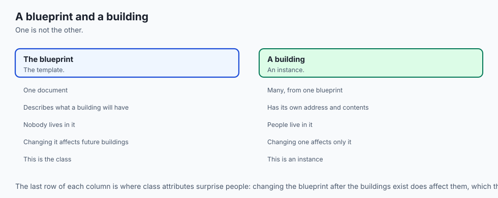

Return to the passport office and map the pieces exactly.

The **class** is the office's template and rulebook: what fields a passport carries, how many pages, what counts as valid. Nobody travels on the template.

Each **instance** is one issued booklet, with its own holder and its own stamps. `Passport("ada", "P1001")` is the office issuing one.

`__init__` is the **filling-in desk**, and this is where the initializer-not-constructor point becomes obvious. The blank booklet has already been printed and handed to the clerk. The clerk does not manufacture it; the clerk writes the holder's details into the booklet in front of them. That booklet is `self`.

`self` is **this booklet**, the one on the desk. Every rule in the rulebook is written about "the booklet", and the clerk supplies which one.

An **instance attribute** is something printed in one booklet: this holder, these stamps. A **class attribute** is something printed on the office wall: the issuing country, one copy for all. And the shared-mutable bug becomes obvious in these terms — if the office keeps one stamp page pinned to the wall instead of putting one in each booklet, every traveller's stamps appear in everyone's record.

A **method** is a procedure in the rulebook: *to stamp a passport, check pages remain, add the stamp, record the date.* One copy, applied to whichever booklet is on the desk.

A **staticmethod** is a rule that needs no booklet at all: *a passport number is two letters followed by four digits.* True regardless of whose passport it is.

A **classmethod** is an **alternative intake procedure**: *given a completed paper form, produce a passport.* It is handed the office itself, not a booklet, and its output is a new booklet.

A **property** is the **clerk at the counter**. The pages field looks like a slot you write into, but a person stands between you and it, and if you hand over minus three pages they refuse. That refusal is why the booklet is always valid.

**Name mangling** is writing a note in the margin under a long internal filing code. Determined people can look it up. It exists so two different departments do not overwrite each other's notes — not to keep secrets.

And the analogy shows what a class is *not*: an office with no rules, issuing booklets nobody checks, is just a stack of blank paper — a dict with extra ceremony.

## Examples in practice

Three shapes, all from the lab, all captured from real runs.

**One: the conversion, proved.** The lab's `compare.py` drives the dict version and the class version through an identical list of moves, then compares the results:

```text
--- same behaviour, two designs ---
dict version : ada: 130.00 (4 entries)
class version: ada: 130.00 (4 entries)
descriptions identical: True
histories identical:    True

--- what changed is what happens when a rule is broken ---
dict version accepted a negative balance: -500
class version refused it: balance cannot be negative (got -500.00)
class balance unchanged: 10.0
```

This is what a good refactor looks like: identical behaviour on the normal path, different behaviour when a rule is broken. The class did not add features; it removed the possibility of an invalid object.

**Two: the alternative constructor doing real work.** Feeding `examples/accounts.csv` through `Account.from_csv_row` — Day 65's parsing, today's objects:

```text
--- loading a CSV file through the alternative constructor ---
   Account(owner='ada', balance=100.00)
   Account(owner='bob', balance=250.50)
   Account(owner='cleo', balance=0.00)
   Account(owner='dev', balance=1875.25)
loaded 4 accounts, total 2225.75 USD
```

Four readable lines, because `__repr__` was defined. Without it those would be four memory addresses, and every one different on the next run.

**Three: the machinery, opened up.** The lab's `machinery.py` prints where everything lives:

```text
--- state lives on the instance ---
vars(ada): {'owner': 'ada', '_balance': 150.0, 'history': [('deposit', 50.0)]}
vars(bob): {'owner': 'bob', '_balance': 100.0, 'history': []}
'history' in ada.__dict__: True
'deposit' in ada.__dict__: False

--- behaviour lives on the class ---
class attributes and methods:
    accounts_opened -> int
    balance -> property
    currency -> str
    deposit -> function
    describe -> function
    from_csv_row -> classmethod
    is_valid_amount -> staticmethod
    withdraw -> function
Account.currency: USD
ada.currency (found on the class): USD
'currency' in ada.__dict__: False

--- a method call is a function call with self supplied ---
type(Account.deposit): function
type(ada.deposit): method
ada.deposit.__self__ is ada: True
ada.deposit.__func__ is Account.deposit: True
Account.deposit(ada, 10) moved the balance 150.00 -> 160.00
```

Read that against the architecture diagram and they are the same picture: two instance dictionaries holding only state, one class dictionary holding everything else, and lookups falling from instance to class.

## Implications: security, privacy, performance, scalability, and cost

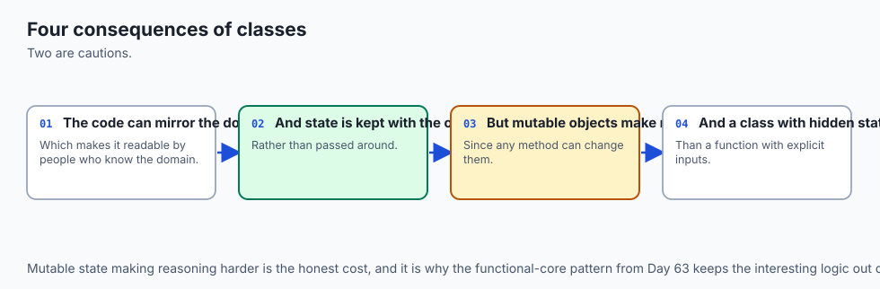

**Security.** Do not mistake underscores for access control. A single underscore is a note to other programmers; a double underscore is a rename anyone can undo by typing the mangled name. If a value must not leak — an API key, a password — the protection is not storing it in an attribute that lands in logs. Which brings up a real hazard of `__repr__`: it gets printed, logged, and included in exception messages. A `__repr__` that dumps a credential will put it in every log line that mentions the object. Show identifying state, never secrets.

**Privacy.** Objects tend to accumulate. A single class holding a user's name, address, and history means those fields travel together into every function, cache, and log that touches it. That is convenient and it is also how data ends up somewhere it should not be. Keep classes narrow, and be deliberate about what `__repr__` reveals.

**Performance.** Attribute access on an instance is a dictionary lookup, and a method call adds a bound-method object. Both are fast, and both are more work than a local variable. In a hot loop, `self.balance` read a million times is a million dictionary lookups; hoisting it into a local first is a standard fix when profiling says so — and only then. The `__init__` call itself is real work too, so creating millions of tiny objects is measurably slower than holding the same data in lists. Classes are for organisation, not speed.

**Memory.** Here is where the shared-behaviour design pays. Methods cost nothing per instance. What each instance costs is its own `__dict__` plus its values, which is why the from-scratch closure version is genuinely heavier: it copies every function per object. At a million objects the difference is large.

**Scalability of the code itself.** This is the real return. A dict-and-functions design grows by adding functions that each re-assume the shape of the data, so the number of places that must agree grows with every function. A class grows by adding methods next to the state and the invariant they maintain, so the rule stays in one place. That is the difference between a program you can still change at ten thousand lines and one you cannot.

**Cost.** Nothing today costs money. `class`, `property`, `staticmethod`, and `classmethod` are built into Python; `dataclasses`, `collections`, `typing`, and `enum` are in the standard library. The only paid tier anywhere in this area is commercial support for third-party validation libraries, and the libraries themselves are free and open source.

## Alternatives: free, open source, and commercial

A hand-written class is one of several ways to model structured data in Python, and it is not always the right one. Everything below except the last row is in the standard library at no cost; the last is free and open source, installed with `pip`.

| Option | What it is | When to choose it | Cost |
| --- | --- | --- | --- |
| plain `dict` | Keys to values, no schema, no rules | Short-lived, ad-hoc, or genuinely dynamic keys; parsed JSON you pass straight through | Free, built in |
| `collections.namedtuple` | A factory making immutable tuple subclasses with named fields | Fixed, immutable records; anywhere a tuple is already used and positions have become unreadable | Free, standard library |
| `typing.NamedTuple` | The same, declared as a class with annotations, and it can hold methods | An immutable record you want annotated, with defaults and a few small methods | Free, standard library |
| `dataclasses.dataclass` | A decorator that writes `__init__`, `__repr__`, and `__eq__` from annotations | A mutable bag of fields that needs little or no validation — the common case | Free, standard library |
| hand-written class | A class you write yourself | State with **invariants** to defend, or behaviour beyond storing fields | Free, built in |
| `enum.Enum` | A fixed set of named constant members | A field with a closed set of legal values — status, mode, role | Free, standard library |
| pydantic | A third-party library that validates and coerces data from annotations | Untrusted input crossing a boundary: API payloads, config files, model outputs | Free, open source (`pip install pydantic`) |

**Plain `dict` — how, with an example.** Reach for it when the data has no rules and a short life.

```python
p = {"holder": "ada", "number": "P1001", "pages": 32}
print(p["holder"], p["pages"])
p["pages"] = -3
```

```text
ada 32
nothing stopped the bad value: {'holder': 'ada', 'number': 'P1001', 'pages': -3}
a typo just adds a key: {'holder': 'ada', 'number': 'P1001', 'pages': -3, 'holdr': 'bob'}
```

Both failure modes in three lines: no validation, and a misspelled key silently creates a new one rather than raising.

**`collections.namedtuple` — how, with an example.** Choose it for immutable records, especially where tuples are already in play.

```python
from collections import namedtuple

Pass1 = namedtuple("Pass1", "holder number pages")
n = Pass1("ada", "P1001", 32)
```

```text
Pass1(holder='ada', number='P1001', pages=32)
n.holder: ada | n[0]: ada | tuple unpack: ada
_replace makes a new one: Pass1(holder='ada', number='P1001', pages=48)
immutable: AttributeError - can't set attribute
```

You get a readable `__repr__`, equality by value, and indexing and unpacking for free, because it really is a tuple. Changing a field means `_replace`, which returns a new object.

**`typing.NamedTuple` — how, with an example.** The same immutability, declared readably, with defaults and methods.

```python
from typing import NamedTuple


class Pass2(NamedTuple):
    holder: str
    number: str
    pages: int = 32

    def is_thick(self):
        return self.pages >= 48
```

```text
Pass2(holder='ada', number='P1001', pages=32)
t.is_thick(): False | default used: 32
still a tuple: True | equality by value: True
```

Choose this over `collections.namedtuple` in new code: same result, far more readable, and it takes methods.

**`dataclasses` — how, with an example.** Choose it when you want a mutable record and would otherwise write an `__init__` that only assigns arguments to attributes. Day 69 covers it properly; this is the shape.

```python
from dataclasses import dataclass, field


@dataclass
class Pass3:
    holder: str
    number: str
    pages: int = 32
    stamps: list = field(default_factory=list)
```

```text
Pass3(holder='ada', number='P1001', pages=32, stamps=[])
mutable, and __repr__/__eq__ written for you: Pass3(holder='ada', number='P1001', pages=48, stamps=[]) | True
default_factory gives each one its own list: ['OSL'] []
but no validation by default: Pass3(holder='ada', number='P1001', pages=-3, stamps=['OSL'])
```

Three things to notice. `__init__`, `__repr__`, and `__eq__` were written for you. `field(default_factory=list)` exists precisely because of today's shared-mutable bug — it creates a **new** list per instance. And the last line is the honest limit: a dataclass accepts minus three pages without complaint. It is a record, not a guarantee.

**A hand-written class — how, with an example.** Choose it the moment there is a rule to defend.

```python
class Pass4:
    def __init__(self, holder, number, pages=32):
        self.holder = holder
        self.number = number
        self.pages = pages
        self.stamps = []

    @property
    def pages(self):
        return self._pages

    @pages.setter
    def pages(self, value):
        if not isinstance(value, int) or value < 1:
            raise ValueError(f"pages must be a positive integer, got {value!r}")
        self._pages = value

    def stamp(self, port):
        if len(self.stamps) >= self._pages:
            raise ValueError("no pages left to stamp")
        self.stamps.append(port)
        return len(self.stamps)

    def __repr__(self):
        return f"Pass4(holder={self.holder!r}, pages={self._pages!r}, stamps={len(self.stamps)})"
```

```text
new:       Pass4(holder='ada', pages=32, stamps=0)
stamp ->   1
after:     Pass4(holder='ada', pages=32, stamps=1)
refused:   pages must be a positive integer, got -3
unchanged: Pass4(holder='ada', pages=32, stamps=1)
```

Compare that last line with the dataclass output above. Same fields; only this version guarantees they are sane.

**`enum.Enum` — how, with an example.** Choose it whenever a field has a closed set of legal values.

```python
from enum import Enum


class Status(Enum):
    VALID = "valid"
    EXPIRED = "expired"
    REVOKED = "revoked"
```

```text
Status.VALID | VALID | valid
compare by identity: True | membership: True
all members: ['VALID', 'EXPIRED', 'REVOKED']
from a stored string: Status.EXPIRED
an invalid state cannot be constructed: 'lost' is not a valid Status
```

The last line is the point. With plain strings, `"expird"` is a typo that flows through your program until something behaves oddly. With an enum it raises at the boundary, and `Status("expired")` is how you convert a value read from a CSV or JSON file into something checked.

**pydantic — the honest word.** Pydantic is a third-party library that generates validation from type annotations: you declare the shape, and it checks and coerces incoming data, raising a structured error listing every field that failed. It is free and open source, installed with `pip install pydantic`, and it is not in the standard library, so it is a dependency you are choosing. Choose it at boundaries where data is untrusted — an incoming API request, a config file, a structured response from a model — and where you want every validation failure reported at once rather than one at a time. Do not reach for it for internal objects whose values your own code produced; a property and a `ValueError` are enough there, cost nothing, and add no dependency. It is worth knowing about now because it appears throughout the AI tooling ecosystem, where validating model output against a declared schema is a routine need. This lab installs nothing, so pydantic is described here rather than demonstrated — the exact command above is the whole of getting started.

## Comparison with related concepts

| Concept A | Concept B | Key difference |
| --- | --- | --- |
| class | instance | The class is the template, created once by the `class` statement; an instance is one thing made from it, with its own `__dict__` |
| instance attribute | class attribute | Instance attributes live in the instance dictionary, one per object; class attributes live on the class, one shared — and a shared mutable one is the classic bug |
| `__init__` | a constructor | `__init__` receives an object that already exists and fills it in, returning `None`. It cannot choose what object to return |
| function | bound method | Reached through the class you get a function; reached through an instance you get a bound method holding `__func__` and `__self__` |
| instance method | `@staticmethod` | The method takes `self` and needs a particular object; the staticmethod takes neither `self` nor `cls` and just belongs with the class |
| `@staticmethod` | `@classmethod` | The classmethod receives the class as `cls`, which lets it build and return a new instance — the alternative-constructor pattern |
| `__repr__` | `__str__` | `__repr__` is unambiguous output for you, used by lists and debuggers; `__str__` is friendly output for a user. `print` falls back to `__repr__` |
| `_name` | `__name` | A single underscore is a convention with no enforcement; a double underscore is rewritten to `_Class__name`, which prevents collisions, not access |
| plain attribute | `@property` | Same syntax at the call site; the property routes reads and writes through functions, so a rule can be added without changing any caller |
| class | module | A module groups names once; a class is a template that can be instantiated many times, each with its own state |
| class | dataclass | A dataclass writes `__init__`, `__repr__`, and `__eq__` from annotations but validates nothing; write the class by hand when there is an invariant |
| class | `dict` | A dict is open storage with no rules; a class binds the rules to the state, so an invalid object cannot be created or reached |

## When to use it — and when not to

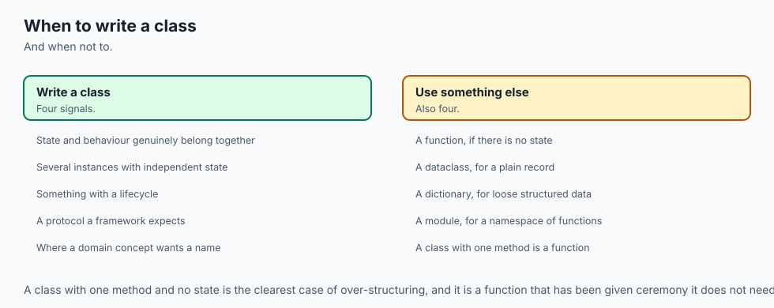

The decision is narrower than it first looks. Use this table.

| What you have | Use this | Why |
| --- | --- | --- |
| State **and** an invariant **and** two or more behaviours | A hand-written class | The rule lives with the data it governs, and cannot be bypassed |
| A bag of related fields with no rules, mutable | A dataclass | You get `__init__`, `__repr__`, and `__eq__` free without writing them |
| A bag of related fields, immutable | `typing.NamedTuple` | Immutability is the guarantee, and it is still a tuple where that helps |
| A field with a closed set of legal values | `enum.Enum` | An illegal value cannot be constructed at all |
| Untrusted data crossing a boundary | pydantic, or hand-written validation | Every failure reported at once, at the edge of your program |
| Short-lived or genuinely dynamic keys | A plain `dict` | A class would add ceremony and remove flexibility |
| Exactly one operation on some values | A function | There is no state to keep between calls |
| A set of related functions sharing no state | A module | That is what modules are for |

So: do not write a class as a namespace for loose functions — that is a module wearing a costume. Do not write a class where a dict will do, when there is no behaviour and no invariant. Do not write one expecting it to be faster; it will be slightly slower, and that is a fine trade for the organisation. And do not add `get_balance()` and `set_balance()` methods around a plain attribute — that is a habit from languages without properties, and in Python it just makes callers type more.

Do write one the moment you catch yourself passing the same dictionary into every function in a module, or writing a comment explaining which keys a dictionary must have, or fixing the same "somebody set this to a bad value" bug twice.

Tomorrow, Day 68, takes this further into inheritance and the rest of the dunder methods — how one class builds on another, and how `__eq__`, `__len__`, and their relatives let your objects work with the language's own operators. Everything there rests on the lookup rule you saw today.

And this is where the thread reaches your AI goal. Every framework you touch from here on is class-based. You will write `model = SomeModel(...)`, `tokenizer = Tokenizer.from_pretrained(...)`, `agent = Agent(tools=[...])`, `dataset = Dataset(...)`. Look at those again with today's eyes: `from_pretrained` is a classmethod alternative constructor, exactly like `from_csv_row`. The arguments to `__init__` are the state the object will carry. The attributes you inspect are in an instance `__dict__` you can print with `vars()`. The methods you call are functions on the class, and you can read their source because you now know where they live. When a library's documentation is thin — and it often is — the ability to open its source, find the `__init__`, and see what an object actually holds is the difference between copying an example and knowing what you are running.

## The AI connection

- **Classes bundle state with the operations on it**, which is the right model for anything
  with a lifecycle.
- **Every framework object you use is a class**, so reading their source requires this.
- **A model, a tokeniser and a dataset are all classes**, with state that persists between
  calls.
- **Not everything needs to be a class**, and a function is usually the better default.
- **The estimator interface from the machine learning course** is exactly this pattern,
  formalised.

## Knowledge check

Try these from memory before looking back:

1. Why is `__init__` an initializer rather than a constructor, and give one practical consequence of the difference.
2. Rewrite `acct.deposit(50)` as an explicit call through the class, and name the two attributes on the bound method that make it possible.
3. A class body contains `history = []`. Two instances are created and one appends to its history. What does the other one's history contain, and why?
4. When does a `@classmethod` earn its place over a `@staticmethod`, and what does each receive as its first argument?
5. If you can only define one of `__repr__` and `__str__`, which do you define, and what breaks if you choose the other?
6. What exactly does a double leading underscore do to an attribute name, and why is that not a security feature?
7. Give a case where a dataclass is the right choice and a case where it is not, in one sentence each.

## Hands-on exercise

The Day 67 lab converts a dict-plus-functions program into a class and then opens the hood on what a class actually is. Work in the lab directory; every command below is run from there.

First see the problem, then the fix:

```bash
python3 examples/account_dict.py
python3 examples/account.py
```

Watch the last line of each. The dict version accepts a direct edit that sets the balance to minus five hundred; the class version refuses the same edit.

Then prove the conversion changed nothing it should not have, reproduce the shared-attribute bug, build an object without the `class` keyword, and open the machinery:

```bash
python3 examples/compare.py
python3 examples/shared_bug.py
python3 examples/closure_object.py
python3 examples/machinery.py
```

Now open `starter/account.py` and work through its five numbered exercises in order — writing `__init__`, fixing the deliberate shared-list bug, adding `deposit` and `withdraw`, adding the validating `balance` property, and adding `__repr__` and `from_csv_row`. Then record what you observe in `starter/inspection-notes.md` for exercise 6. Run your work as you go:

```bash
python3 starter/account.py
bash tests/run_tests.sh
```

### Expected output

The heart of the lab is these two sessions side by side, captured from a real run:

```text
$ python3 examples/account_dict.py
ada: 120.00 (2 entries)
rejected: insufficient funds
after a direct edit: ada: -500.00 (2 entries)

$ python3 examples/account.py
ada: 120.00 (2 entries)
rejected: insufficient funds
rejected: balance cannot be negative (got -500.00)
after the refused edit: ada: 120.00 (2 entries)
repr: Account(owner='ada', balance=120.00)
```

The shared-attribute bug and its fix:

```text
$ python3 examples/shared_bug.py
--- buggy: one list shared by every instance ---
ada.history: [('ada', 10), ('bob', 20)]
bob.history: [('ada', 10), ('bob', 20)]
same list object? True
it lives on the class: [('ada', 10), ('bob', 20)]
instance __dict__ of ada: {'owner': 'ada'}

--- fixed: one list per instance ---
cleo.history: [('cleo', 10)]
dev.history: [('dev', 20)]
same list object? False
instance __dict__ of cleo: {'owner': 'cleo', 'history': [('cleo', 10)]}
```

And the from-scratch object next to the same thing written with `class`:

```text
--- same answers, different amount of sugar ---
outputs identical: True
hand-built keeps state in a captured dict; the class keeps it in the instance __dict__
hand-built copies every function per account; the class stores one function per method, shared
two hand-built accounts share no functions: False
two class instances share one function: True
```

With the starter still unfinished, the suite reports:

```text
28 checks, 0 failure(s).
```

With all five exercises complete, the same command runs the full class checks against your file too, and reports:

```text
34 checks, 0 failure(s).
```

Everything in this lab is deterministic except one thing, documented honestly in the lab's `expected-output/FIELDS.md`: an object printed without a custom `__repr__` shows a memory address that differs on every run. No captured output and no test depends on one.

### Validate your work

You are done when you can check every box:

- [ ] `python3 examples/account_dict.py` ends with a balance of `-500.00`, and `python3 examples/account.py` refuses that same edit.
- [ ] `python3 examples/compare.py` prints `descriptions identical: True` and `histories identical:    True`.
- [ ] `python3 examples/compare.py` reports `loaded 4 accounts, total 2225.75 USD`.
- [ ] `python3 examples/shared_bug.py` prints `same list object? True` for the buggy class and `False` for the fixed one.
- [ ] `python3 examples/machinery.py` shows `ada.deposit.__self__ is ada: True` and `ada.deposit.__func__ is Account.deposit: True`.
- [ ] Your `starter/account.py` runs with no `NotImplementedError` remaining.
- [ ] Two accounts you create have separate histories: `a.history is b.history` is `False`.
- [ ] Assigning a negative balance to your account raises `ValueError` and leaves the balance unchanged.
- [ ] `repr()` of your account reads `Account(owner='ada', balance=120.00)`, not a memory address.
- [ ] `Account.from_csv_row('cleo, 250.00')` returns an account, and `Account.from_csv_row('nonsense')` raises `ValueError`.
- [ ] `bash tests/run_tests.sh` prints `34 checks, 0 failure(s).` and exits 0.

### Troubleshooting

**`TypeError: deposit() missing 1 required positional argument`.** You called the method on the class rather than an instance — `Account.deposit(50)` instead of `acct.deposit(50)`. Through the class there is no `self` to supply, so you must pass it: `Account.deposit(acct, 50)`.

**`TypeError: __init__() takes 2 positional arguments but 3 were given`.** You forgot `self` in the method signature, so your first real argument is being bound to it. Every instance method's first parameter is `self`.

**One account's history shows another account's movements.** The shared-mutable class attribute. The list is at class level. Delete it from the class body and create `self.history = []` inside `__init__`.

**`AttributeError: 'Account' object has no attribute 'balance'`.** Usually the property getter returns `self.balance` instead of `self._balance`, or `__init__` never assigned it. If the getter names the property itself you get infinite recursion instead — the getter calls itself forever.

**`RecursionError: maximum recursion depth exceeded`.** The same cause. Inside the getter read `self._balance`; inside the setter write `self._balance`. The property is the public name, the underscore name is the storage.

**Your `__repr__` prints but `print(obj)` shows a memory address.** You spelled it `__repr__` with the wrong number of underscores, or defined it outside the class body. It needs exactly two on each side, and it must be indented inside the class.

**`AttributeError: 'Vault' object has no attribute '__pin'`.** Name mangling, working as designed. From outside the class the attribute is `_Vault__pin`. From inside, `self.__pin` works.

**The starter raises `NotImplementedError`.** Expected until you finish that exercise. Each unfinished method raises on purpose, so an empty method cannot be mistaken for a working one.

### Common mistakes

- **Forgetting `self` in a method signature.** The most common first-day error, and the resulting message names a count of arguments rather than the real cause.
- **Assigning a mutable default in the class body.** One list, shared forever. State goes in `__init__`.
- **Assuming a class attribute is a per-instance default.** Reads fall back to the class; a write always creates an instance attribute that shadows it.
- **Writing `get_x`/`set_x` pairs around a plain attribute.** Python has properties. Keep the attribute name and add the rule behind it.
- **Defining `__str__` and not `__repr__`.** Your lists and your debugger stay unreadable. If you write only one, write `__repr__`.
- **Putting a secret in `__repr__`.** It ends up in every log line and traceback that mentions the object.
- **Expecting a double underscore to be private.** It is a rename that prevents collisions, not access.
- **Making a class out of things with no invariant and no behaviour.** That is a dataclass or a dict, and either is shorter.
- **Validating in `__init__` only.** If the attribute can be reassigned later, the rule must live in a property setter, which `__init__` then goes through too.

## Practice assignment

Build `library.py` in the Day 63 shape — a pure core plus a thin shell — modelling a library's lending desk with two classes.

`Book` carries a title, an author, a copy count, and how many copies are currently lent. Its invariant: copies lent is never negative and never exceeds the total. Expose `lent` as a property whose setter defends both halves of that rule, expose `available` as a read-only computed property, give it a `__repr__` that shows the title and the availability, and give it a `from_csv_row` classmethod that builds a book from `title,author,copies` and raises `ValueError` on a row with the wrong number of fields.

`Library` holds a collection of books keyed by title. Its methods: `add(book)`, `lend(title)`, `accept_return(title)`, and `report()` returning a list of description strings. `lend` must raise a clear `ValueError` when the title is unknown or no copy is available. Add a class attribute `loan_days = 21` and a staticmethod `is_valid_title(value)` that rejects anything that is not a non-empty string.

Requirements: no function may take a dict of book fields as an argument — the objects carry their own state; every invariant is defended in a property setter rather than checked by callers; both classes define `__repr__`; and the CSV loading uses `csv.DictReader` from Day 65 rather than splitting on commas.

Then verify three specific things, from a real run rather than by inspection. First, that two `Book` objects made from the same class have separate state — print `vars()` of each. Second, that lending the last copy succeeds and the next attempt raises. Third, that `vars(Library)` shows `loan_days`, `is_valid_title`, and every method, while `vars(some_library)` shows only its books. That last check is today's central idea in one command.

## Extension challenge

**One: make the shared-mutable bug impossible to miss.** Write a function `audit(cls)` that takes a class and returns the names of every class attribute whose value is mutable — a list, dict, or set — by walking `vars(cls)` and checking each value's type. Run it against the lab's `shared_bug.py` and confirm it flags the buggy class and clears the fixed one. Then run it against a class of your own that you believe is correct.

**Two: build the object system further.** Extend the `make_account` closure version so it supports class attributes: give the factory a shared dictionary that all accounts consult when a name is missing from their own state, and write a `lookup(obj, name)` function that checks the instance state first and falls back to the shared dictionary — implementing by hand the arrow in today's architecture diagram. Then prove your `lookup` and Python's attribute access agree on the same set of names.

**Three: measure what a class costs.** Using `time.perf_counter`, compare creating one million dicts against creating one million instances of a simple class, and compare a million dictionary reads against a million attribute reads. Then use `sys.getsizeof` on one instance's `__dict__` versus the equivalent dict. Write down the four numbers with your machine and Python version next to them, exactly as this lesson does. You will have measured the real cost of the organisation you gained — and you will find it is small, which is the point.
