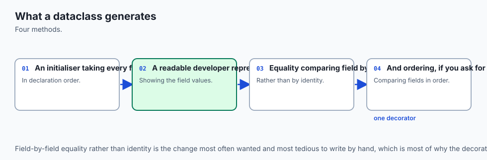
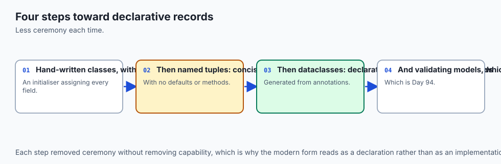
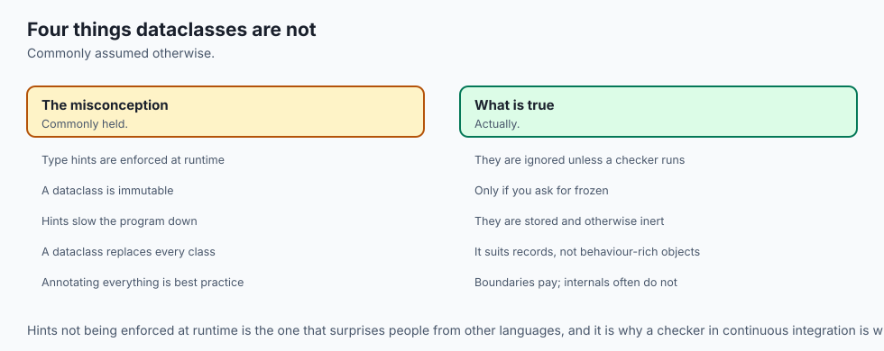
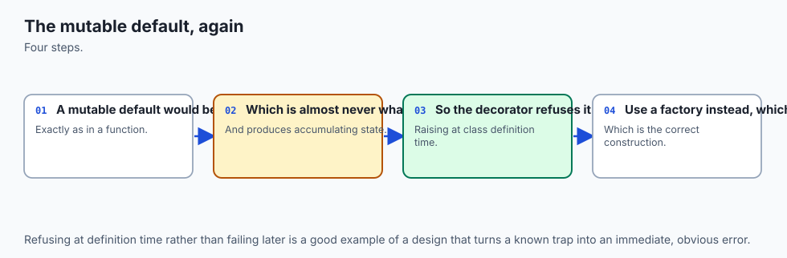
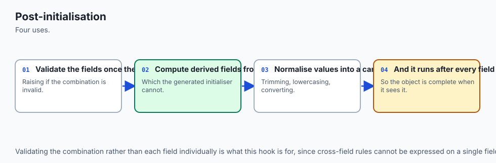
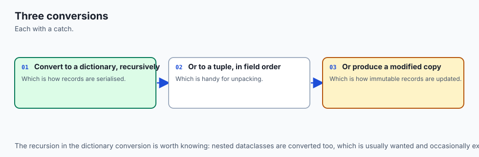
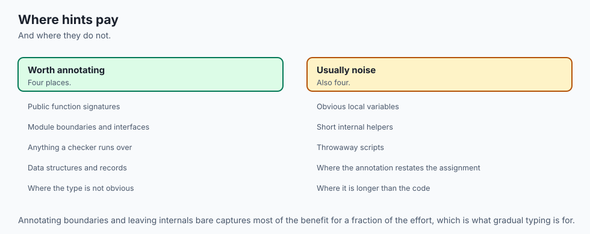
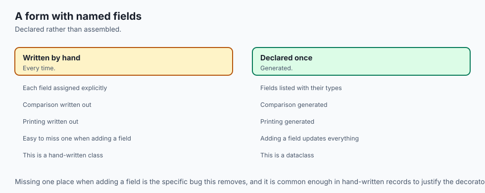
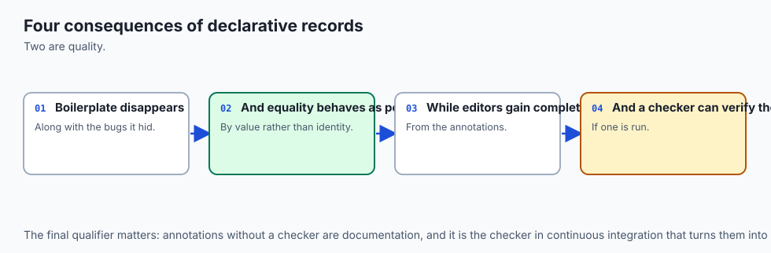
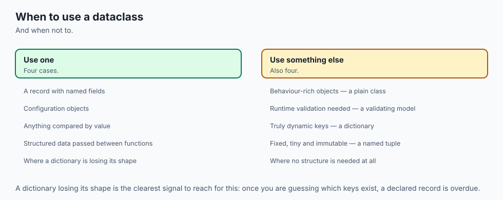

## Why this matters

Two days ago you wrote your first classes by hand, and yesterday you gave them dunder methods so they compared and printed sensibly. If you did that honestly, you noticed something tedious: for a class that holds four pieces of data, you wrote `__init__`, then `__repr__`, then `__eq__`, and in each one you typed the same four field names again. Four fields, four methods, the same names copied over and over. It is boring, and boring code is where mistakes hide — you add a fifth field, update `__init__`, and quietly forget `__eq__`, so from that moment two records that differ in the new field compare as equal and nothing tells you.

Today removes that whole category of work. A **dataclass** lets you declare the fields once, with their types, and have Python generate the methods. And because the declaration carries a type, the same line does double duty: it tells `@dataclass` what to generate, and it tells a reader — and a tool — what is supposed to go in that slot.

This matters for your AI goal in a very direct way. Nearly everything you will build in the second half of this course exchanges structured records: a request you send to a model, a tool definition a model is allowed to call, a training example, an evaluation result. Every one of those has a fixed set of fields with expected types, and every one of them arrives from or departs to somewhere outside your program — a file, a network boundary, another team's code.

When those shapes live in your head instead of in your code, the failures are the quiet kind again. A score that is a string `"0.9"` instead of the number `0.9` sorts wrong but never raises. A field you renamed in one place and not another produces `None` and a plausible-looking average. You will not find those by running the program; you find them weeks later in a result you cannot reproduce.

The concrete payoff is time. A typed dataclass turns a twenty-line hand-written class into five lines you can read at a glance, and a type checker turns a class of bug that used to cost you an afternoon of debugging into a message you get before you press run. Neither costs money; both cost a habit.

## The idea in plain language



Think of a **form** — the paper kind, the sort you fill in at a clinic or a bank. A form has labelled blanks: *Surname*, *Date of birth (DD/MM/YYYY)*, *Number of dependants*. Two quite different things are going on there, and today is about telling them apart.

The first is the **printed template**. Somebody designed this form once, decided which blanks exist and in what order, and printed a stack of identical copies. Every copy has exactly the same blanks in exactly the same places. That is what `@dataclass` does for you: you describe the blanks once, and it produces the template — the machinery that makes every instance have the same fields, print the same way, and compare the same way.

The second is the **label beside each blank**. *Date of birth (DD/MM/YYYY)* tells you what belongs there. But a printed label cannot stop you writing "next Tuesday" in the box. Paper does not check. For the entry to be checked, somebody has to read it: a **clerk** who takes the filled form, looks at each entry, and hands it back if the date is not a date.

That is exactly the relationship between annotations and type checkers in Python. `score: float` is the label on the blank. The Python interpreter is the paper: it prints the label, it remembers the label, and it will accept absolutely anything you write in the box. A **type checker** is the clerk: a separate program that reads your code without running it and tells you where an entry contradicts its label.

Carry that split through the whole day. The template is generated code; the label is documentation; the clerk is optional, external, and the only thing that actually enforces anything.

## Historical background



Both halves of today arrived deliberately, and later than you might expect.

Type hints came first. Python has always been dynamically typed, and the language's designers had long resisted bolting types on. What changed the argument was scale: large Python codebases became genuinely hard to navigate, and several teams had independently invented comment-based conventions for recording types. **PEP 484 — Type Hints**, authored by Guido van Rossum, Jukka Lehtosalo and Łukasz Langa, made it official and shipped in Python 3.5. Its most important decision is stated in the PEP itself: the annotations are for offline checkers and tooling, and Python will not enforce them at runtime. That was not an oversight or a first step toward enforcement — it was the design. Jukka Lehtosalo's checker, **mypy**, predates the PEP and is the reason its syntax looks the way it does; PEP 484 essentially standardised what mypy had already proven workable.

Dataclasses came next and were built on top of that foundation. **PEP 557 — Data Classes**, authored by Eric V. Smith, shipped in Python 3.7. The motivation is worth stating plainly, because it explains the design: people kept writing classes that were mostly a bag of attributes with `__init__`, `__repr__` and `__eq__` written out by hand, and the third-party **attrs** library had shown that generating those methods from declarations worked beautifully. PEP 557 brought a deliberately smaller version of that idea into the standard library. The clever part is that it did not invent a new declaration syntax: it reused the variable annotations that PEP 484's world had already made ordinary. That is why a dataclass field looks like a type hint — it *is* a type hint, being read by a decorator for a second purpose.

So the order matters. Annotations were added for external tools; `@dataclass` then found a runtime use for the same syntax. Understanding that history is what stops you expecting `score: float` to reject a string.

## What it is — and what it is not



A dataclass is an ordinary class whose boilerplate methods were generated for you from annotated field declarations. A type hint is a recorded, unenforced claim about what a name is supposed to hold. Neither is more magical than that, and the misconceptions are expensive enough to list.

| Common misconception | The reality |
| --- | --- |
| "`score: float` stops me assigning a string." | It does not. The interpreter stores the annotation and never compares any value to it. You can assign a string to it and nothing raises. |
| "A dataclass is a new kind of object." | It is a perfectly ordinary class. `@dataclass` writes some methods and attaches them; everything you learned on Days 67 and 68 still applies. |
| "Dataclasses are slower because of the magic." | The generation happens once, when the class is created. After that the methods are normal functions, and instances behave like any other object. |
| "`@dataclass` makes my object immutable." | Only `frozen=True` does. A plain dataclass is fully mutable. |
| "Type hints are only useful in big codebases." | Their best return is at boundaries — the shape of a record read from a file, or a function others call — and small programs have those too. |
| "A checker proves my program is correct." | It proves a specific class of claim: that values flow where their annotations say they may. Logic bugs, bad data, and anything typed `Any` sail straight past. |
| "Annotations slow the program down." | The cost is evaluating the annotation expression once at definition time. It is not consulted while your code runs. |
| "`@dataclass` validates my data." | It generates methods. Validation is something you write, in `__post_init__`, and it is the only enforcement that actually runs. |
| "I can give a field a default of `[]`." | A dataclass refuses outright, with a `ValueError`, because that one list would be shared by every instance. Use `field(default_factory=list)`. |

## Why it was created and what problems it solves

**`@dataclass` exists to delete repetition that cannot be deleted any other way.** The lab's `examples/records.py` contains the before and after side by side, and the comparison is the whole argument. `HandWrittenRecord` holds three fields — `prompt`, `expected`, `score` — and takes 22 lines, 18 of them actual code: the class statement, a four-line `__init__`, a five-line `__repr__`, and an eight-line `__eq__`. The name `prompt` appears in five distinct places in that block (the parameter list, the left of the assignment, the right of the assignment, the repr string, and the equality comparison — where it appears twice, once for each side), which is seven occurrences of one field name for one field.

The dataclass with the same three fields is five lines:

```python
@dataclass
class RealRecord:
    prompt: str
    expected: str
    score: float = 0.0
```

Eighteen lines to five, and `prompt` written once instead of seven times. That is not a cosmetic saving. Every one of those six extra mentions was a place where a rename could go half-done.

**Annotations exist to move knowledge out of your head and into the file.** Before them, the only way to learn that a function wanted a list of records rather than a single record was to read the body, or the docstring, and hope it was current. An annotation is checkable by a machine, so it cannot rot silently the way a comment can.

**`field()` exists because a single default value is not always what you want.** A default is evaluated once, when the class is created, and shared. That is fine for `0.0` and disastrous for `[]`. `field(default_factory=list)` says "call this to make a fresh default for each instance", which is the only correct way to give a field a mutable default.

**`__post_init__` exists because generation stops at the boilerplate.** `@dataclass` cannot know that your score must lie between zero and one. It gives you a hook that runs at the end of the generated `__init__`, which is where validation and derived fields belong.

**Type checkers exist because Python will not do this for you and something should.** Given that PEP 484 deliberately declined runtime enforcement, the value of the annotations depends entirely on a tool willing to read them. That is what mypy and pyright are for.

## How it works

![Diagram: how @dataclass turns annotated field declarations into a working class — the decorator reads the class's __annotations__ dictionary and the values beside each name, turns each annotated name into a Field object recording its name, type, and default or default_factory, generates __init__, __repr__ and __eq__ from that ordered list and attaches them to the class, and the finished class then builds instances that each get their own value for every field, with default_factory called once per instance so no two instances share a mutable default](./assets/dataclass-generation.svg)

The architecture diagram shows the four stages, and none of them involve magic.

**Stage one: you write declarations.** A class body containing annotated names and nothing else. Crucially, `prompt: str` on its own does not create a class attribute — it only records an annotation. That is why the class body can be nothing but declarations and still work.

**Stage two: the decorator reads `__annotations__`.** When Python finishes executing a class body it collects every annotated name into a dictionary on the class called `__annotations__`, in declaration order. `@dataclass` reads exactly that dictionary, plus whatever value happens to sit beside each name in the class body — a plain default like `0.0`, or a `field(...)` specification.

**Stage three: it builds a `Field` object per name.** Each one records the field's name, its annotation, and its default or default factory. These are real objects you can inspect afterwards with `dataclasses.fields()`, which is what makes the whole process checkable rather than mysterious.

**Stage four: it generates methods and attaches them to the class.** `__init__` gets one parameter per field, in declaration order, with defaulted fields last — and its final act is to call `__post_init__` if you defined one. `__repr__` produces `ClassName(field=value, ...)`. `__eq__` compares the tuple of field values, but only against the same class. On request it generates more: `frozen=True` adds a `__setattr__` that refuses assignment plus a `__hash__`; `order=True` adds the four comparison methods.

All of this runs **once**, when the class is created. Afterwards you have an ordinary class.

### The parameters that matter

`@dataclass` takes arguments that change what gets generated. These are the ones worth knowing on day one.

| Parameter | Default | What it does | When you want it |
| --- | --- | --- | --- |
| `eq` | `True` | Generates `__eq__` comparing all fields by value | Almost always; turn it off only if identity comparison is genuinely what you mean |
| `repr` | `True` | Generates a readable `__repr__` | Almost always — this is the one that pays off every time you debug |
| `frozen` | `False` | Blocks attribute assignment after construction, raising `FrozenInstanceError` | Values that must not change: keys, configuration, anything shared |
| `order` | `False` | Generates `__lt__`, `__le__`, `__gt__`, `__ge__` comparing fields in declaration order | When instances have a natural sort order — put the field you sort by first |
| `slots` | `False` | Generates a class using `__slots__`, so instances have no per-instance dictionary | Many small instances, where memory matters; it forbids adding attributes not declared as fields |
| `kw_only` | `False` | Makes every field keyword-only in the generated `__init__` | Records with many fields, where positional arguments become unreadable and a reordering silently changes meaning |

`frozen=True` deserves a note, because it links back to yesterday. Day 68 established the rule that anything used as a dictionary key or a set member needs `__hash__`, and that a hash must never change while the object is in use. A plain dataclass generates `__eq__`, and Python's rule is that defining `__eq__` removes the inherited `__hash__` — so a plain dataclass is *unhashable*. With `frozen=True`, assignment is blocked, so the field values can never change, so a generated hash can never go stale — and `@dataclass` generates one. That is why the lab's `RunKey` is frozen: it is used as a dictionary key. The captured run shows both halves:

```text
key: RunKey(suite='arithmetic', seed=7)
equal keys hash the same: True
usable as a dict key: 12
sorted by suite then seed: [RunKey(suite='arith', seed=1), RunKey(suite='arith', seed=9), RunKey(suite='geo', seed=2)]
assignment refused: FrozenInstanceError: cannot assign to field 'seed'
```

Note the sort: `order=True` compares fields in declaration order, and `RunKey` declares `suite` before `seed`, so `arith/1` and `arith/9` come before `geo/2`.

### The mutable default trap



This is the one dataclass behaviour that will surprise you, and it is worth meeting properly because it is a rescue from an older, nastier bug.

Start with the older bug, in a plain function. A default argument is evaluated **once**, when the `def` statement runs — not on each call. So a list default is one list, shared by every call that does not override it:

```python
def add_tag(tag, bucket=[]):
    bucket.append(tag)
    return bucket
```

Real output from the lab:

```text
plain function, call 1: ['math']
plain function, call 2: ['math', 'logic'] <- the list was shared
```

The second call was given no bucket, so it got the default — the *same* list the first call had already appended to. Nothing warned you. This bug has cost more debugging hours than almost any other Python gotcha, and it is silent by design.

Dataclasses refuse to let it happen. Write the equivalent as a field and the class will not even be created:

```python
@dataclass
class Broken:
    name: str
    tags: list[str] = []
```

Real output:

```text
dataclass refuses it: ValueError: mutable default <class 'list'> for field tags is not allowed: use default_factory
```

Read that carefully: the error arrives at **class creation**, before any instance exists, and the message names the fix. `@dataclass` can detect this because it inspects the defaults, and it knows a list, dict or set default would be shared. The fix is to hand it a callable that produces a fresh value each time:

```python
tags: list[str] = field(default_factory=list)
```

And the proof that it worked, again from the real run:

```text
default_factory gives each instance its own list:
  first.tags = ['math']
  second.tags = []
```

Two records, two independent lists. On the form analogy: `default_factory` is the instruction "print a fresh blank line here on every copy", rather than "everybody writes on this one shared sheet".

### `__post_init__`, validation, and derived fields



The generated `__init__` assigns the fields and then, if the class defines `__post_init__`, calls it with no arguments. That hook is where two things belong.

**Validation.** `@dataclass` generates no checks at all, so the annotation `score: float` will happily hold `3.0` or `"banana"`. If a rule matters, write it:

```python
def __post_init__(self) -> None:
    if not self.prompt.strip():
        raise ValueError("prompt must not be empty")
    if not 0.0 <= self.score <= 1.0:
        raise ValueError(f"score must be between 0.0 and 1.0, got {self.score}")
    self.prompt_length = len(self.prompt)
```

Real output when those rules fire:

```text
rejected (blank prompt): ValueError: prompt must not be empty
rejected (score out of range): ValueError: score must be between 0.0 and 1.0, got 3.0
```

This is the clerk, hired and placed inside your own class. It runs at runtime, it raises, and it is the only thing on this page that actually enforces anything while the program runs.

**Derived fields.** `prompt_length` is computed from `prompt`, so it should not be an `__init__` parameter at all. `field(init=False, repr=False, default=0)` says: leave it out of the constructor, leave it out of the repr, start it at zero — and `__post_init__` fills it in. The captured run shows the effect: `derived prompt_length: 18` for the prompt `Capital of France?`, which is indeed 18 characters, and the repr omits it:

```text
valid record: EvalRecord(prompt='Capital of France?', expected='Paris', score=1.0, tags=['geo'])
```

### `asdict`, `astuple`, and `replace`



Three helper functions turn dataclasses into the plumbing you learned on Day 65.

`asdict(record)` walks the instance recursively and returns plain dicts and lists — precisely what `json.dumps` accepts. `astuple(record)` does the same into tuples. Real output:

```text
asdict of one record: {'prompt': '2+2?', 'expected': '4', 'score': 0.5, 'tags': ['math'], 'prompt_length': 4}
astuple of one record: ('2+2?', '4', 0.5, ['math'], 4)
```

That makes serialisation a one-liner, and the Day 65 round trip clean:

```python
def records_to_json(records: list[EvalRecord]) -> str:
    return json.dumps([asdict(record) for record in records], indent=2, sort_keys=True)
```

There is deliberately **no** automatic reverse. JSON gives you dicts and you decide how to rebuild objects from them, which is the right place to skip derived fields and let `__post_init__` recompute them. Do that and the round trip is lossless — `rebuilt == original: True` in the captured output, which is a real assertion about value equality, made possible only because `@dataclass` generated `__eq__`.

`replace(record, score=0.9)` returns a **copy** with some fields changed. It works by calling the class's `__init__` with the merged arguments, which means `__post_init__` runs again and the new value is validated. That is the correct way to "modify" a frozen instance, and it is safer than mutation even when the class is not frozen.

### Type hints, properly

Now the other half of the day, and the single most important sentence in it: **Python does not check annotations at runtime.** Not "rarely", not "unless you configure it" — never.

![Flowchart: the two separate paths one annotated source file takes — on the static path a type checker reads the file without executing it, builds a model of every annotation, compares each expression and call against what those annotations promise, and reports contradictions before anything runs; on the runtime path the interpreter executes the file, evaluates each annotation and stores it in __annotations__ where tools such as @dataclass can read it, but never compares a value against one, so a function annotated to return a string can return a float and the program carries on until the failure surfaces somewhere else entirely](./assets/type-checking-flow.svg)

The flow diagram shows the two paths, and the lab proves the right-hand one directly. `examples/inspect_runtime.py` first shows what Python **stores**:

```text
EvalRecord.__annotations__ names: ['prompt', 'expected', 'score', 'tags', 'prompt_length']

dataclasses.fields(EvalRecord):
  prompt: str = (required)
  expected: str = (required)
  score: float = 0.0
  tags: list[str] = factory list()
  prompt_length: int = 0
```

Then it contradicts every one of those annotations and shows what Python does about it:

```text
assigned a str to .score -> 'not a number'
assigned an int to .tags  -> 17

double.__annotations__ names: ['number', 'return']
double('ab') -> 'abab'
```

Read that last line closely. `double` is annotated `(number: int) -> int` and its body is `number * 2`. Called with the string `'ab'`, it returns `'abab'` — a perfectly good string, from a function that promised an integer, and nothing anywhere objected. The annotation was recorded and ignored, exactly as the label on the form is printed and ignored by the paper.

### The syntax tour

Modern annotation syntax is small. This is essentially all of it you need for now.

| You want to say | You write |
| --- | --- |
| A list of integers | `list[int]` |
| A dictionary from name to score | `dict[str, float]` |
| A string, or nothing | `str \| None` |
| A pair of coordinates | `tuple[int, int]` |
| A tuple of any length, all integers | `tuple[int, ...]` |
| A function taking an int, returning a str | `Callable[[int], str]` |
| One of a fixed set of values | `Literal["train", "test"]` |
| A short name for a complex type | `Scores = dict[str, list[float]]` |
| Give up on checking this | `Any` |

A few notes that save confusion. The **built-in generics** — `list[int]`, `dict[str, float]` — are the current spelling; older code imports capitalised versions from `typing` and means the same thing. `X | None` is the modern way to write "optional"; you will meet `Optional[X]` in older code and it is identical. `Callable` comes from `typing` (or `collections.abc`). A **type alias** is just a variable holding a type, and it is the cheapest readability win available: `EvalScores = dict[str, list[float]]` written once beats that expression repeated in six signatures.

`Any` deserves a warning. It is not "some type"; it is "stop checking here". A value typed `Any` can be passed anywhere and have anything called on it, so it silently disables the checker for everything downstream. It is the right tool for genuinely dynamic boundaries and a bad habit everywhere else — reach for it deliberately, not to make an error message go away.

Two more worth naming now that you will meet properly later. **`TypedDict`** describes a dictionary with known keys and per-key types, which is how you type JSON-shaped data you must keep as a dict rather than converting to a class. And **`Protocol`** is the typing form of yesterday's lesson: Day 68 showed that Python cares whether an object *has* the right methods, not what it inherits from — duck typing. A `Protocol` writes that expectation down. Declare a protocol with a `read(self) -> str` method and any class with a matching `read` satisfies it, with no inheritance and no registration. It is structural typing: the shape is the type.

### Running a checker — and an honest note

A checker is a separate program you install and run over your source. The two you will meet are **mypy** and **pyright**; both read the same annotations, and the usual invocation is simply the tool's name followed by a path.

Here is the honest part, and it matters more than a screenshot would. **This lab installs nothing and uses no network, so no type checker is installed on the machine this lesson was written and verified on.** The lab's `examples/check_types.sh` looks for one and reports what it finds. On the authoring machine it found none, and printed exactly this:

```text
No static type checker is installed, so this optional step is skipped.

This lab needs no installs and no network, so that is a normal result.
A checker reads examples/scoring.py WITHOUT running it and reports
the two planted contradictions between the annotations and the code:
  * label() promises to return str but returns record.score, a float
  * main() passes one EvalRecord where mean_score wants list[EvalRecord]
```

So rather than quote a message that was never produced here, be precise about what a checker would *find*. `examples/scoring.py` is fully annotated and contains two deliberate contradictions. The first is a return-type error: `label` is declared `-> str` and its body returns `record.score`, which the annotations say is a `float`. The second is an argument-type error: `mean_score` is declared to take `list[EvalRecord]` and `main` passes `records[0]`, a single `EvalRecord`. A checker reports both, by file and line, without running the file. What it will *not* tell you is what the messages look like word for word — and neither will this lesson, because that would be inventing output.

You can still see the value of a checker without one installed, and this is why the lab's required exercise is the runtime-inspection one. Run `examples/scoring.py` and watch which bug bites. Bug two crashes: `mean_score` iterates a single record and Python raises. Bug one does not crash at all — `label` returns a float where a string was promised, and the program carries on with the wrong type until something far away breaks. That asymmetry *is* the argument. One bug costs you a traceback; the other costs you a wrong answer you may never notice. A checker finds both before either happens.

The value proposition is three things. You catch a class of bug **before running**, which is the difference between a message and an incident. Your editor gets real completions, because it knows what a name holds. And your signatures document themselves, in a form that cannot drift out of date without a tool noticing.

### Gradual typing: where hints pay, and where they are noise



PEP 484's design is **gradual typing**: annotate as much or as little as you like, and unannotated code is simply not checked. That is a licence to be strategic rather than exhaustive.

Hints pay for themselves at **boundaries and shapes**. Public function signatures — anything someone else calls, including future you — earn a hint because the signature is the contract. Data models earn one most of all, which is why a dataclass is the natural place to start typing a codebase: one annotated declaration documents the record for every reader, every editor, and every checker. Library code earns hints because its callers cannot see the body. And anything that crosses a boundary — parsed from a file, received over a network, handed to another team — earns them, because that is where your assumptions are least likely to hold.

Hints are noise in **throwaway and obvious code**. A ten-line script you will run once does not need them. Neither does an obvious local: `count: int = 0` tells nobody anything that `count = 0` did not. And an annotation so elaborate it needs its own explanation is usually telling you the data structure wants to be a class.

The habit that works: annotate the edges, leave the middle alone, and let the dataclasses carry most of the load.

### Building `@dataclass` from scratch

Nothing demystifies code generation like doing it. The lab's `examples/mini_dataclass.py` is a decorator in about forty lines that does what `@dataclass` does, and it is worth walking through because it makes stage two of the architecture diagram concrete.

It starts by reading exactly what the real decorator reads:

```python
names = list(getattr(cls, "__annotations__", {}))
defaults = {name: getattr(cls, name) for name in names if name in vars(cls)}
```

The first line is the field list, in declaration order, straight out of `__annotations__`. The second is the defaults: a name that *also* has a value in the class body — `score: float = 0.0` — has that value stored as a real class attribute, so `name in vars(cls)` distinguishes a defaulted field from a required one. Two lines, and the "what are the fields?" question is answered.

Then it builds three ordinary functions. `__init__` accepts `*args, **kwargs`, zips the positional arguments onto the names, folds in the keywords while rejecting unknown names and duplicates, and then walks the fields in order setting each from the supplied values, or the defaults, or raising `TypeError` for a missing one. `__repr__` joins `name=value!r` pairs inside `ClassName(...)`. `__eq__` returns `NotImplemented` unless the other object is the same class, then compares the two lists of field values. Finally it attaches all three and sets `cls.__hash__ = None`, which is precisely what the real `@dataclass` does when it generates `__eq__` without `frozen=True` — and now you know why that line is there.

The lab runs the mini version and the real one side by side. Real output:

```text
mini repr: MiniRecord(prompt='2+2?', expected='4', score=0.0)
real repr: RealRecord(prompt='2+2?', expected='4', score=0.0)
same repr shape (fields and formatting): True
mini equality works: True and differs: False
keyword arguments work: MiniRecord(prompt='a', expected='b', score=0.5)
missing argument: TypeError: MiniRecord() missing required argument 'expected'
```

Identical field formatting, working equality, working keyword arguments, and a `TypeError` on a missing argument. There is one honest difference, and the file says so in its own docstring: the real `@dataclass` generates **source text** and runs `exec` on it, which is how the generated `__init__` gets a genuine parameter list that `help()` can display. The mini version builds closures over `*args, **kwargs` instead — simpler to read, and behaviourally the same for everything the lab checks. That distinction is the last piece of the mystery: the real thing is not doing something you cannot do, it is doing the same thing one level more thoroughly.

## An everyday analogy



Hold the form all the way through, because every piece maps cleanly.

**The form template is the class.** Somebody sat down once, decided the blanks — *Prompt*, *Expected answer*, *Score*, *Tags* — and printed a stack of identical copies. `@dataclass` is the printer: you hand it the list of blanks and it produces the template, so every copy has the same fields in the same order and any two filled copies can be compared entry by entry.

**The label beside each blank is the annotation.** *Score (0.0–1.0)* tells a reader what belongs there. It is printed on the form, it is genuinely useful, and it is completely powerless. Paper does not read.

**The interpreter is the paper.** It faithfully carries every label — that is `__annotations__`, and it is why `@dataclass` can read the labels back to work out what the blanks are. It also accepts absolutely anything written in any box. Write "not a number" in the score blank and the paper takes it.

**A type checker is the clerk at the desk.** The clerk takes your filled form, reads each entry against its label, and hands it back before it is filed. Two things about this clerk matter. First, they are a separate person you have to actually hire — no clerk, no checking. Second, they work from the *form*, not from the filing cabinet: they catch the bad date before it is filed anywhere, which is the whole point of checking before running.

**`field(default_factory=list)` is "print a fresh blank line here on every copy"**, as against one shared sheet everybody scribbles on — which is exactly the mutable-default bug.

**`__post_init__` is a rule stamped on the form itself**: *this form is rejected at submission if the score is outside 0 to 1*. Unlike the label, that one is enforced, at submission time, by the form. It is the only enforcement in the whole analogy that does not require hiring anybody.

**`frozen=True` is laminating the finished form.** Nothing can be altered afterwards — which is exactly what makes it safe to file under a permanent index number, because the index can never disagree with the contents. That is the hash.

The one place the analogy needs care: a clerk can only check what the labels say. Label a blank "anything at all" — that is `Any` — and the clerk waves it through without looking. The clerk is not smarter than your labels.

## Examples in practice

**A tool schema.** This is the shape you will meet again when a model is allowed to call your code. The fields are the parameters, the annotations say what each accepts, and `Literal` pins one of them to a fixed set:

```python
from dataclasses import dataclass, field
from typing import Literal

@dataclass(frozen=True, kw_only=True)
class SearchTool:
    query: str
    top_k: int = 5
    mode: Literal["semantic", "keyword"] = "semantic"
    filters: dict[str, str] = field(default_factory=dict)
```

`kw_only=True` earns its place here: every call site must name its arguments, so `SearchTool(query="dataclasses", top_k=3)` cannot be silently miswritten by reordering. `frozen=True` means a request object cannot be mutated after it is built, so what you logged is what you sent.

**An evaluation record, round-tripped.** Straight from the lab, and the exact pattern Day 65 set up:

```python
import json
from dataclasses import asdict, dataclass, field

@dataclass
class EvalRecord:
    prompt: str
    expected: str
    score: float = 0.0
    tags: list[str] = field(default_factory=list)

def to_jsonl(records: list[EvalRecord]) -> str:
    return "\n".join(json.dumps(asdict(record), sort_keys=True) for record in records)
```

One expression per direction, and the annotation on `to_jsonl` tells the next reader exactly what goes in and comes out.

**A frozen key for counting.** Anywhere you need a compound dictionary key, a frozen dataclass beats a tuple because the fields have names:

```python
@dataclass(frozen=True, order=True)
class RunKey:
    suite: str
    seed: int

counts: dict[RunKey, int] = {RunKey("arithmetic", 7): 12}
```

Compare `counts[RunKey("arithmetic", 7)]` with `counts[("arithmetic", 7)]` — the first says what the parts mean, sorts sensibly because of `order=True`, and a checker can tell you when you get the parts backwards.

**Inspecting a class you did not write.** `dataclasses.fields()` works on any dataclass, which makes it a genuinely useful tool when you meet an unfamiliar record type:

```python
from dataclasses import fields

for spec in fields(SearchTool):
    print(spec.name, spec.type, spec.default)
```

**Validation at the edge.** The pattern that stops bad data spreading — parse once, at the boundary, and let `__post_init__` be the gate:

```python
@dataclass
class Example:
    text: str
    label: str

    def __post_init__(self) -> None:
        if self.label not in {"positive", "negative"}:
            raise ValueError(f"unknown label: {self.label!r}")

def load(path: str) -> list[Example]:
    return [Example(**row) for row in json.loads(open(path).read())]
```

Every record in the file is checked as it is built, and after `load` returns you know every `Example` in that list is valid — which is worth far more than checking again at each use.

## Implications: security, privacy, performance, scalability, and cost



**Security.** The important one: **a type hint is not a validation and must never be treated as one at a trust boundary.** Data arriving from a file, a request, or a model's output is untrusted regardless of what your annotations say about it, and a checker cannot help because it reasons about your source, not about runtime values. `Example(**row)` above will happily build an object from a dict of anything — it is `__post_init__` that makes it safe. Annotate for clarity; validate for safety; never confuse the two. Note also that `frozen=True` is a correctness guarantee against accidental mutation, not a security boundary — determined code can still reach past it.

**Privacy.** A generated `__repr__` prints **every field**, and that repr shows up in logs, tracebacks, and debugger output. Put an API key, a token, or a person's details in a dataclass and you have arranged for it to be printed the next time anything goes wrong. The fix is per-field and takes one argument: `api_key: str = field(repr=False)`. Get in the habit of asking, for each field, whether you would be comfortable seeing it in a log line — because you eventually will.

**Performance.** Generation happens once at class creation, so the cost is import time, not run time. Instances are ordinary objects. Where dataclasses do differ measurably is memory: `slots=True` removes the per-instance dictionary, which matters when you hold millions of small records. The honest guidance is to reach for it when you have measured a memory problem, not by default — it also forbids adding attributes that were not declared, which is a real behaviour change.

**Scalability.** The thing that scales here is not the runtime, it is the codebase. A hand-written record class costs you a maintenance liability per field per method; a dataclass costs one line per field, total. And a type checker's value grows with the number of call sites, because it verifies every one of them at once — which is exactly the work that becomes impossible to do by hand as a project grows.

**Cost.** Everything today is free. `dataclasses` and `typing` are in the standard library; mypy and pyright are free and open source. The only cost is the seconds a checker takes to run, against the hours of the bug it catches — and the specific bug class it catches, wrong-shaped data, is the expensive kind, because you pay for it in re-runs and wrong results rather than in a crash.

## Alternatives: free, open source, and commercial

There are several ways to define a typed data model in Python, and two mainstream checkers. Everything below is free; the split that matters is standard library versus a `pip` install.

| Option | What it is | When to choose it | Cost |
| --- | --- | --- | --- |
| Hand-written class | `__init__`, `__repr__`, `__eq__` typed out yourself | When construction is genuinely custom logic, not field assignment | Free, built in |
| `@dataclass` | Generates methods from annotated fields | The default for records: mutable or frozen, validated in `__post_init__` | Free, built in |
| `typing.NamedTuple` | An annotated, immutable tuple subclass | Small immutable records that should also unpack and index like tuples | Free, built in |
| `collections.namedtuple` | The older, untyped tuple factory | Legacy code; otherwise superseded by `typing.NamedTuple` | Free, built in |
| attrs | The third-party library that inspired dataclasses | When you want richer features: converters, per-field validators, more control | Free, open source (`pip install attrs`) |
| pydantic | Data models with **runtime** validation from annotations | Parsing untrusted input — API payloads, config, model output | Free, open source (`pip install pydantic`) |
| mypy | The reference static type checker | Command-line and CI checking; the checker PEP 484 grew up alongside | Free, open source |
| pyright | A fast checker, also the engine behind Pylance in VS Code | Editor-integrated checking with immediate feedback as you type | Free, open source |

**Hand-written class — how, and when.** You already know this one from Day 67. Choose it when the constructor does real work — normalising inputs, opening a resource, choosing between representations — rather than assigning fields. The moment `__init__` is nothing but `self.x = x` repeated, you are writing boilerplate a decorator should generate.

```python
class Temperature:
    def __init__(self, celsius):
        self.celsius = float(celsius)
        self.fahrenheit = self.celsius * 9 / 5 + 32
```

**`@dataclass` — how, and when.** The default choice for a record. Declare fields, add `frozen=True` if it is a value, add `__post_init__` if it has rules.

```python
from dataclasses import dataclass

@dataclass(frozen=True)
class Point:
    x: float
    y: float
```

**`typing.NamedTuple` — how, and when.** Choose it when you want an immutable record that is *also* a tuple: it unpacks, it indexes, and it compares to plain tuples. That last point is the trade-off — `Point(1, 2) == (1, 2)` is `True`, which is convenient in some code and a source of confusion in others. A frozen dataclass gives you immutability without tuple-ness.

```python
from typing import NamedTuple

class Point(NamedTuple):
    x: float
    y: float

p = Point(1.0, 2.0)
x, y = p            # unpacks like a tuple
print(p.x, p[0])    # 1.0 1.0
```

**`collections.namedtuple` — how, and when.** The original, from before annotations existed. It takes field names as strings and carries no type information at all. Choose it only when you meet it in existing code; for new code `typing.NamedTuple` does the same job and documents itself.

```python
from collections import namedtuple

Point = namedtuple("Point", ["x", "y"])
print(Point(1.0, 2.0).x)
```

**attrs — how, and when.** The library PEP 557 credits as its inspiration, still actively developed and still ahead of the standard library in features. Choose it when you want per-field converters and validators declared inline rather than assembled in `__post_init__`, or when you need control the stdlib does not expose.

```python
import attrs

@attrs.define
class Record:
    prompt: str
    score: float = attrs.field(default=0.0, converter=float)
```

The `converter=float` is the flavour of the thing: the value is coerced on the way in, which a dataclass cannot do without you writing it.

**pydantic — how, and when.** This is the one that changes the rules, and it is the reason today's lesson matters later. pydantic reads the same annotations and **enforces them at runtime**, raising a detailed error when input does not match. Choose it at any boundary where data arrives from outside your program.

```python
from pydantic import BaseModel

class EvalRecord(BaseModel):
    prompt: str
    score: float = 0.0

EvalRecord(prompt="2+2?", score="not a number")   # raises a validation error
```

That last line is the whole difference. In a dataclass it succeeds and stores the string; in pydantic it raises. Conceptually, pydantic is dataclasses plus the clerk built in — the labels are checked when the form is submitted, not only when someone chooses to inspect it.

**mypy — how, and when.** The reference checker, from the project whose work PEP 484 standardised. Choose it for command-line and continuous-integration checking, where you want one authoritative answer for the whole codebase. You install it with `pip install mypy` and run it over a path:

```bash
python3 -m mypy scoring.py
```

It exits non-zero when it finds errors, which is what makes it usable as a build step. **Not installed on this lab's machine by design** — the labs install nothing — so the lesson describes what it checks rather than quoting its output.

**pyright — how, and when.** A separate implementation, notable for speed and for being the engine inside Pylance, the Python extension for VS Code. Choose it when you want checking *while you type* rather than as a separate command, which for most people is where the habit actually sticks. Both read the same annotations, so it is reasonable to use pyright in your editor and mypy in CI.

## Comparison with related concepts

| Concept A | Concept B | Key difference |
| --- | --- | --- |
| `@dataclass` | Hand-written class | The decorator generates `__init__`, `__repr__` and `__eq__` from declarations; by hand you write and maintain all three, naming every field in each |
| `@dataclass` | `typing.NamedTuple` | A dataclass is a class and may be mutable; a NamedTuple is an immutable tuple that unpacks, indexes, and compares equal to plain tuples |
| `typing.NamedTuple` | `collections.namedtuple` | Same runtime object; the typing version declares fields with annotations, so tools can read the types |
| `@dataclass(frozen=True)` | Plain `@dataclass` | Frozen blocks assignment and therefore gets a generated `__hash__`; a plain dataclass defines `__eq__` and is consequently unhashable |
| `field(default=…)` | `field(default_factory=…)` | One value, created once and shared; versus a callable invoked per instance — the only correct way to default a list, dict or set |
| `__post_init__` | Type annotation | `__post_init__` runs and can raise; an annotation is recorded and never consulted |
| `@dataclass` | pydantic model | Same declaration syntax; pydantic validates and coerces at runtime, a dataclass does not |
| Type annotation | Docstring | Both document; only the annotation is machine-checkable, so only the annotation cannot silently rot |
| mypy | pyright | Different implementations of the same standard — mypy is the reference and a natural CI step, pyright is fast and drives editor feedback via Pylance |
| `Any` | A specific type | `Any` disables checking for that value and everything downstream of it; it is an escape hatch, not a description |
| `Protocol` | Base class inheritance | A protocol is satisfied by having the right methods (structural); inheritance requires declaring the relationship (nominal) |
| `asdict` | `__dict__` | `asdict` recurses into nested dataclasses and copies; `__dict__` is the raw instance dictionary, one level deep |

## When to use it — and when not to



Use a **dataclass** whenever a class is mostly a named bundle of fields — records, configuration, events, keys, requests, results. Add `frozen=True` when the object is a value that should not change after construction, and especially when it will be a dictionary key or set member. Add `order=True` when there is a natural sort. Add `__post_init__` the moment the record has a rule, and put derived fields there rather than making callers compute them. Reach for `kw_only=True` once a record has enough fields that positional construction stops being readable.

Do **not** use a dataclass when the class is mostly behaviour rather than data — a parser, a client, a coordinator with three methods and one attribute gains nothing. Do not use one when construction is genuinely custom logic. And do not reach for `slots=True` reflexively; it is a memory optimisation with a real behavioural cost.

Use **type hints** on public function signatures, on data models, on library code, and at every boundary where data enters your program. Skip them on throwaway scripts and obvious locals. Use `Any` only where the dynamism is real, and remember that every `Any` is a hole in the checking of everything it touches.

And be clear about which tool does which job, because this is the sentence to carry out of today: **annotations document, checkers verify, and only code you write — `__post_init__`, an explicit check, or a library like pydantic — enforces anything while your program is running.**

That is also the bridge to your AI work, and it is a shorter bridge than it looks. Typed dataclasses are how you write down the shape of things: the request you send to a model, the schema of a tool the model is allowed to call, a training example, an evaluation record. When you meet structured outputs and tool calling later in this course, the interface will turn out to be exactly this idea — you declare a typed schema, and you get validated objects back instead of a dictionary you have to inspect by hand.

The library that powers most of that machinery is pydantic, and pydantic is, in one line, dataclasses plus runtime validation: the same annotated declarations you wrote today, with the clerk finally standing at the desk. Everything you learned about fields, defaults, factories and `__post_init__` transfers directly. Tomorrow, Day 70, puts these pieces together to model a whole domain with objects.

## The AI connection

- **Type hints are documentation the tools can check**, which is what makes them worth
  writing.
- **Dataclasses remove boilerplate** and make data structures declarative rather than
  ceremonial.
- **Typed configuration catches errors before runtime**, which matters most in long-running
  jobs.
- **Every modern AI library is typed**, so reading their signatures requires this vocabulary.
- **A type hint is a promise a checker enforces**, which is stronger than a comment and cheaper
  than a test.

## Knowledge check

Answer from memory before looking back:

1. What two things does `@dataclass` read from your class body, and at what moment does it read them?
2. Why does `tags: list[str] = []` raise a `ValueError` in a dataclass, when the same default in a plain function signature raises nothing at all? Which of the two is more dangerous, and why?
3. A plain dataclass generates `__eq__`. Why does that make its instances unhashable, and what single argument fixes it?
4. Name the three things `dataclasses.fields()` can tell you about a field that the annotation alone cannot.
5. `double` is annotated `(number: int) -> int` and its body is `number * 2`. What happens when you call `double('ab')`, and what does that prove?
6. Where should validation live in a dataclass, and why can a type checker not do that job for you?
7. Give one place a type hint clearly earns its keep and one place it is noise, and say what distinguishes them.
8. In one sentence each: what does an annotation do, what does mypy do, what does pydantic do?

## Hands-on exercise

The Day 69 lab builds a small evaluation-record model twice — once by hand, once as a dataclass — proves the mutable-default trap in both its silent and its loud form, adds validation and a derived field, uses a frozen record as a dictionary key, round-trips through JSON, inspects what the interpreter really stores, and finally rebuilds `@dataclass` from scratch in about forty lines.

Work in the lab directory; every command below is run from there.

First see the finished reference:

```bash
python3 examples/demo.py
python3 examples/inspect_runtime.py
```

Then the optional checker step, which will tell you honestly whether one is installed:

```bash
bash examples/check_types.sh
```

Now open `starter/records.py` and work exercises 1 to 6 in order, then `starter/mini_dataclass.py` for exercise 7. Check your progress at any point:

```bash
python3 starter/demo.py
bash tests/run_tests.sh
```

### Expected output

A correct run of the reference produces this — captured from a real run on the authoring machine, and fully deterministic:

```text
1. Hand-written class vs dataclass
----------------------------------
hand-written repr: HandWrittenRecord(prompt='2+2?', expected='4', score=0.0)
dataclass repr:    EvalRecord(prompt='2+2?', expected='4', score=0.0, tags=[])
hand-written equal by value: True
dataclass equal by value:    True
dataclass differs when a field differs: False

2. The mutable default trap
---------------------------
plain function, call 1: ['math']
plain function, call 2: ['math', 'logic'] <- the list was shared
dataclass refuses it: ValueError: mutable default <class 'list'> for field tags is not allowed: use default_factory
default_factory gives each instance its own list:
  first.tags = ['math']
  second.tags = []

3. __post_init__ validation and a derived field
-----------------------------------------------
valid record: EvalRecord(prompt='Capital of France?', expected='Paris', score=1.0, tags=['geo'])
derived prompt_length: 18
rejected (blank prompt): ValueError: prompt must not be empty
rejected (score out of range): ValueError: score must be between 0.0 and 1.0, got 3.0

4. A frozen dataclass is hashable and orderable
-----------------------------------------------
key: RunKey(suite='arithmetic', seed=7)
equal keys hash the same: True
usable as a dict key: 12
sorted by suite then seed: [RunKey(suite='arith', seed=1), RunKey(suite='arith', seed=9), RunKey(suite='geo', seed=2)]
assignment refused: FrozenInstanceError: cannot assign to field 'seed'
```

and the inspection script, which is the proof of the day's central claim:

```text
dataclasses.fields(EvalRecord):
  prompt: str = (required)
  expected: str = (required)
  score: float = 0.0
  tags: list[str] = factory list()
  prompt_length: int = 0

What Python does NOT check
--------------------------
assigned a str to .score -> 'not a number'
assigned an int to .tags  -> 17

double.__annotations__ names: ['number', 'return']
double('ab') -> 'abab'
```

### Validate your work

You are done when every box is ticked:

- [ ] `python3 examples/demo.py` exits 0 and its section 2 shows both forms of the mutable-default problem: the plain function sharing one list, and the dataclass refusing `[]` with a `ValueError` naming `default_factory`.
- [ ] Section 3 rejects the blank prompt and the score of 3.0, and reports `derived prompt_length: 18`.
- [ ] Section 4 reports `equal keys hash the same: True` and refuses the assignment with `FrozenInstanceError`.
- [ ] Section 5 reports `rebuilt == original: True`.
- [ ] Section 7 reports `same repr shape (fields and formatting): True`.
- [ ] `python3 examples/inspect_runtime.py` shows `tags: list[str] = factory list()` and `double('ab') -> 'abab'` with no error raised.
- [ ] `bash examples/check_types.sh` exits 0 whether or not a checker is installed, and says clearly which happened.
- [ ] Your completed starter produces the same results as the reference.
- [ ] `bash tests/run_tests.sh` ends with `0 failure(s).` and exits 0.

### Troubleshooting

**`ValueError: mutable default <class 'list'> for field tags is not allowed`.** Working as intended — this is exercise 2's whole point. Replace `= []` with `= field(default_factory=list)`.

**`TypeError: non-default argument 'x' follows default argument`.** Fields with defaults must come after fields without them, because the generated `__init__` is an ordinary function signature. Reorder the declarations, or use `kw_only=True`.

**`__post_init__` never seems to run.** Check the spelling — two underscores each side — and check you did not also write your own `__init__`, which replaces the generated one and with it the call to `__post_init__`.

**`TypeError: unhashable type` when using a record as a dict key.** The class generated `__eq__` without being frozen, so it has no `__hash__`. Add `frozen=True`.

**`FrozenInstanceError` when you meant to update a field.** That is the guarantee working. Build a changed copy with `dataclasses.replace(record, field=value)` instead of assigning.

**Your annotation "does not work".** It is not supposed to do anything at runtime. Run `python3 examples/inspect_runtime.py` to see the annotation stored and then contradicted with no complaint. If you need enforcement, write it in `__post_init__`.

**`bash examples/check_types.sh` says no checker is installed.** That is a normal, expected result — this lab installs nothing. The script prints what a checker would find in `examples/scoring.py`. The required exercise is `inspect_runtime.py`, which proves the same point from the runtime side.

**The starter raises `NotImplementedError`.** Expected until you finish that exercise; each unfinished function raises on purpose so an empty one cannot pass for working.

### Common mistakes

- **Expecting the annotation to enforce anything.** It never does. This is the single most common misunderstanding, and `inspect_runtime.py` exists to cure it.
- **`= []` as a field default.** Caught loudly by a dataclass, silent and damaging in a plain function signature. Learn the fix once: `field(default_factory=list)`.
- **Forgetting `frozen=True` on something used as a key.** The `TypeError` arrives later, far from the class definition.
- **Mutating a field that other code holds a reference to** instead of making a copy with `replace`.
- **Putting a secret in a dataclass and forgetting `repr=False`.** The generated repr prints every field, straight into your logs.
- **Writing your own `__init__` in a dataclass**, which silently discards the generated one and the `__post_init__` call with it.
- **Assuming `asdict` has a reverse.** It does not; you write the rebuild, which is where you skip derived fields.
- **Sprinkling `Any` to silence a checker.** Each one switches checking off for everything downstream.

## Practice assignment

Build `evalstore.py`, a small module in the Day 63 shape — a pure, testable core plus a thin shell — that manages a store of evaluation records on disk.

Your spec: define a frozen, ordered dataclass `RunKey(suite: str, seed: int)` and a mutable dataclass `Result` with fields `key: RunKey`, `prompt: str`, `score: float`, `tags: list[str]`, and a derived `passed: bool` computed in `__post_init__` as `score >= 0.5`. Validate in `__post_init__` that the prompt is non-empty and the score lies between 0.0 and 1.0, raising `ValueError` with the offending value in the message. Give every function a full type annotation.

Then write four functions: `save(results: list[Result], path: str) -> None` using `asdict` and JSON Lines; `load(path: str) -> list[Result]` rebuilding each record and letting `__post_init__` recompute `passed`; `summarise(results: list[Result]) -> dict[RunKey, float]` returning the mean score per key; and `bump(result: Result, score: float) -> Result` returning a validated copy via `replace`.

Requirements: never write a mutable default directly; the derived field must not be an `__init__` parameter; `summarise` must be a pure function testable without touching the filesystem; and the round trip must satisfy `load(save(results)) == results`, which works only because `@dataclass` generated `__eq__`. Prove that equality with an assertion, not by eye.

Finally, add a `fields_report(cls) -> list[str]` function that uses `dataclasses.fields()` to describe any dataclass you hand it, and run it on both of your classes.

## Extension challenge

**One: make the mini decorator handle defaults properly.** The lab's `mini_dataclass` treats any class-body value as a default. Extend it to raise `ValueError` on a mutable default exactly as the real `@dataclass` does — detect `list`, `dict` and `set` instances — and to support a `default_factory` of your own design. Then add a `frozen=True` option that installs a `__setattr__` raising after construction, and confirm your version and the real one behave the same on every case in `tests/run_tests.sh`.

**Two: write the runtime checker yourself.** Build a decorator `@checked` that wraps a dataclass so that after `__init__` it walks `dataclasses.fields(self)` and raises `TypeError` for any value failing `isinstance` against its annotation. Handle the plain cases (`str`, `int`, `float`, `bool`) and decide deliberately what to do about `list[str]` — where `isinstance(value, list)` works but the element type does not. Writing that limitation down teaches exactly why pydantic is a substantial library rather than a decorator, and why PEP 484 left runtime enforcement out.

**Three: compare the four record types.** Implement the same three-field record as a hand-written class, a dataclass, a `typing.NamedTuple`, and a `collections.namedtuple`. For each, record in a comment: the lines of code, whether instances are mutable, whether they are hashable, whether they unpack like a tuple, whether they compare equal to a plain tuple with the same values, and what `repr` prints. Then write down which you would choose for a dictionary key, for a mutable working record, and for a function returning two values — with your reason for each.
