## Why this matters

Yesterday you built a domain model. It has value objects that refuse invalid amounts, an entity whose identity survives every change to its fields, a rule that says a basic member gets twelve check-ins a month and no more, and a repository that writes the whole thing to JSON and reads it back. It is about a hundred and eighty lines, and it is the largest single piece of code you have written in this course.

Now answer this honestly: how would you check, right now, that it still works? Not "does it import" — does it still *refuse* a thirteenth check-in, still reject a mismatched currency, still round-trip a club through JSON without losing a check-in date? The answer, today, is that you would run the demo program, read the output, and compare it against what you remember. That takes a couple of minutes and it works about as well as proofreading your own writing. Tomorrow you add a student tier. Now you have to check every one of those things again, and you will not, because it is a Tuesday and the change was three lines and it obviously could not have broken the currency check.

That is the exact shape of a **regression**: code that used to work and now does not, broken by a change made somewhere else, discovered by somebody other than you, at a moment you did not choose. Regressions are expensive in a specific and measurable way. The cost is not the fix — the fix is usually one line. The cost is the *search*. A bug caught by a test names the failing function, the line, and both sides of the comparison, and you fix it in the same minute you wrote it. The same bug caught in production arrives as "the April report looks wrong", and you spend a day reconstructing which of forty commits could have produced it, on data you cannot fully reproduce, with somebody asking for an estimate.

Here is why this matters specifically for the AI work this course is heading toward. A machine learning system is ordinary software wearing a lab coat. Long before any model exists, there is a pipeline of plain Python that loads records, strips whitespace, lowercases text, drops duplicates, splits documents into chunks, and encodes labels. Suppose the deduplication step has an off-by-one exactly like the one you will meet in today's lab, and quietly drops the last record of every batch. Nothing crashes. The training run completes. The metrics are slightly worse than you hoped, so you spend a week tuning the learning rate, changing the architecture, and reading papers — debugging the model, which was never the problem.

The model faithfully absorbed a corrupted dataset, because that is what models do. Twelve lines of tests on the preprocessing functions would have caught it in the second before it mattered. This is the single most common way that machine learning projects waste time, and it is a software engineering failure, not a machine learning one.

Today you learn the smallest possible version of the habit that prevents all of that, and the tool the Python world uses for it.

## The idea in plain language

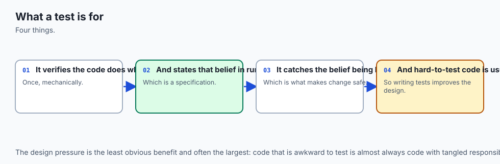

A **test** is a small program that runs another program and complains if the answer is wrong. That is the whole idea. There is nothing else in it.

Every test, in every language, in every framework ever written, has the same three parts, and they always come in the same order:

- **Arrange.** Build the inputs. Sometimes this is a whole paragraph of setup; more often it is a literal on the same line as the call.
- **Act.** Call the thing you are testing. Exactly once, ideally, so that when the test goes red you know precisely what was running.
- **Assert.** State what must be true. If it is, nothing happens. If it is not, the test fails loudly.

This pattern is called **arrange, act, assert**, and once you have seen it you will not be able to unsee it. Here is a complete test, using nothing but Python:

```python
result = word_count("The cat. The hat!")   # arrange and act
assert result == 4                          # assert
```

Put that in a file, run it with `python3`, and you have a test suite. If the assertion holds, the file prints nothing and the process exits with status 0. If it fails, Python raises `AssertionError` and the process exits with status 1. That is genuinely all a test runner needs: a thing that can be false, and an exit code a machine can read.

Understanding this is what makes pytest easy rather than mysterious. **pytest is not a new idea. It is an amplifier for the idea you already have.** You keep writing `assert`, exactly as above. What pytest adds is everything around the assertion: it finds your tests for you so you do not maintain a list, it runs all of them even after one fails so you learn about six problems in one run rather than one problem six times, it tells you *what the values actually were* when an assertion failed, and it produces a summary and an exit code that a build system can act on.

The analogy that runs through this lesson is a **factory test rig**. On a production line, a finished part gets clamped into a jig (arrange), the rig operates it (act), and a **go/no-go gauge** is applied (assert) — a physical block machined so that a correct part passes through one end and fails to enter the other. The gauge does not measure anything, produce a number, or express an opinion. It answers one question, the same way, every time, and it either lets the part onto the pallet or it does not. Keep that image; we will return to it, including to the most dangerous object in any factory, which is a gauge that every part fits through.

## Historical background

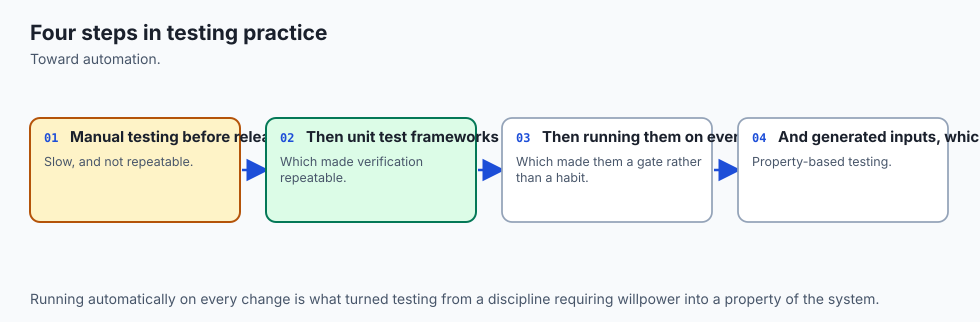

Automated testing is much older than any of the tools you will use. The idea of writing the check before the code, and of keeping every check runnable, was popularised by **Kent Beck**, who wrote a small testing framework for Smalltalk called **SUnit** in the mid-1990s. Beck and **Erich Gamma** ported the design to Java as **JUnit**, and JUnit's shape — a `TestCase` class you inherit from, methods whose names start with `test`, a family of assertion methods, and a runner that reports a count — was copied into essentially every language. The family became known as **xUnit**.

Python received its copy through **PyUnit**, contributed by Steve Purcell, which entered the standard library as the `unittest` module in Python 2.1. The same release brought **doctest**, written by Tim Peters, which took an entirely different angle: instead of a separate suite, it finds interactive examples inside your docstrings and checks that they still produce what the documentation claims. Both modules ship with Python to this day, and both still work; you will run each of them for real later in this lesson.

**pytest** grew out of a different tradition. It began as `py.test`, part of Holger Krekel's `py` library, in the orbit of the PyPy project, and its founding argument was that the xUnit shape imported a great deal of Java into a language that did not need it. Python already has an `assert` statement. Python already has plain functions. Why should a test be a method on a class that inherits from a framework base class, and why should comparing two values require you to remember the name `assertEqual` — and `assertAlmostEqual`, and `assertCountEqual`, and `assertRaises`, and the forty others? pytest's answer was to keep the bare `assert` and to solve the resulting problem — that a bare `assert` normally reports nothing useful — with a technique nobody had applied to testing before: rewriting the assertion at import time. `py.test` eventually became the standalone **pytest** project, and it is now the default choice for new Python projects by a very large margin.

This course pins **pytest 9.1.1**, verified on 2026-07-19 on Python 3.14.0. It is free and open source under the MIT licence — a fact you do not have to take on trust, since the package will tell you itself:

```bash
.venv/bin/pip show pytest
```

```text
Name: pytest
Version: 9.1.1
License-Expression: MIT
Requires: iniconfig, packaging, pluggy, pygments
```

Four small dependencies and no framework underneath them. That is the whole tree.

## What it is — and what it is not

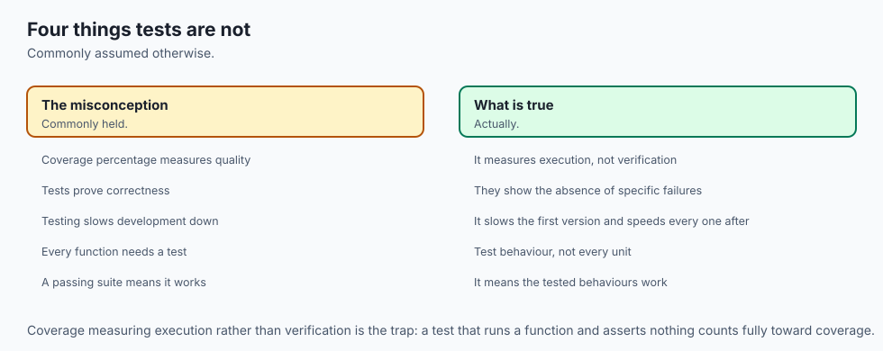

**pytest is a test runner**: a program that discovers test functions by name, imports and executes them, records what happened to each one, prints a report, and exits with a status code that describes the run as a whole.

It is **not** a testing library you write against, in the way `unittest` is. There is no base class, and for most tests there is nothing to import at all. It is **not** a replacement for thinking about what should be true — a runner will happily run a thousand assertions that prove nothing. It is **not** a guarantee of correctness: passing tests mean "none of the things I thought to check are broken", which is a considerably weaker and more useful claim than "the code is right". And it is **not** slow, heavy, or something you set up at the end of a project; the lab's whole nineteen-test suite runs in about a hundredth of a second.

| Common misconception | The reality |
| --- | --- |
| "Testing is what you do once the code is finished." | Tests are cheapest the moment you write the function, because that is when you still remember what it was supposed to do. |
| "A green suite means the code works." | It means the checks you wrote passed. A suite of four vacuous tests is green on completely broken code — you will watch that happen in the lab. |
| "pytest needs a special class or a framework to work." | A test is a plain function whose name starts with `test_`. pytest imports nothing into your file that you did not write. |
| "The bare `assert` is a beginner's shortcut; real frameworks use `assertEqual`." | The bare `assert` carries *more* information under pytest, because pytest rewrites it to show both sides. `assertEqual` exists because plain Python cannot. |
| "Tests double the amount of code to maintain." | Tests concentrate the maintenance. Without them, every change requires re-verifying by hand what a machine could verify in ten milliseconds. |
| "If a test is hard to write, the test framework is the problem." | Almost always the design is the problem. A function that needs six things arranged before it can be called is telling you it does six things. |

## Why it was created and what problems it solves

Each piece of a test runner exists to defeat a specific, boring failure of manual checking.

**Manual testing does not scale, and not linearly.** Checking a program by hand costs a fixed amount of attention per behaviour, and you must repeat all of it after every change. Ten behaviours checked by eye is a two-minute chore; a hundred behaviours is an afternoon nobody will spend, so it does not get done, so the last twenty behaviours are never checked again after the day they were written. Automation changes the shape of that curve: the cost of writing each check is paid once, and the cost of running all of them stays under a second more or less forever.

**Human verification is unreliable in a particular direction.** You do not check your own work neutrally; you check it hoping it is right, on the input you had in mind when you wrote it. The lab's `average_word_length` was, in its own words, "checked by eye on one paragraph of English prose, and shipped". The paragraph was not empty, so nobody divided by zero, so the bug survived. Tests are unreliable too, but their unreliability is fixed in place: a test checks the same thing every time whether or not you are tired.

**Failure needs to be legible.** A bare `assert` in a script tells you a line number and nothing else. That is fine when you wrote the line thirty seconds ago and catastrophic when you did not. Assertion rewriting exists entirely to close that gap.

**A build needs a yes-or-no answer.** Continuous integration cannot read a report; it reads an exit code. Every design decision about counting, summarising, and exiting flows from the fact that at the end of the run exactly one number leaves the process.

**Discovery removes a list nobody maintains.** If tests must be registered somewhere, then a test written on Friday and never registered is a test that does not run, and no one finds out for a year. Naming conventions — `test_*.py`, `test_*`, `Test*` — mean a file that exists is a file that runs.

## How it works


A pytest run has three phases with a hook in the middle: it works out where it is and what to run (configuration and collection), it runs it (the session), and it says what happened (reporting). The hook is assertion rewriting, and it happens during collection, at the moment each test module is imported.

### 1. A test is arrange, act, assert — nothing more

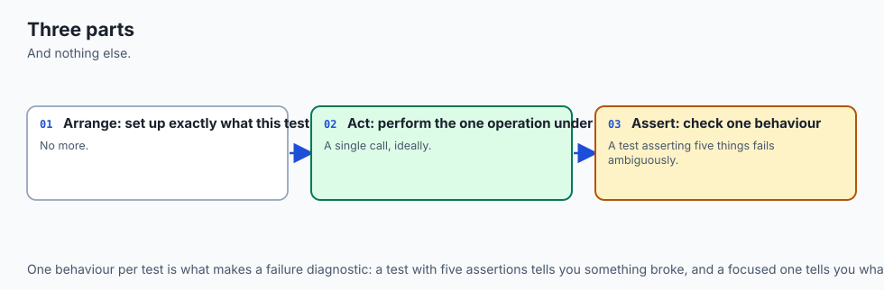

Here are two tests from the lab's reference suite, unabridged:

```python
def test_words_splits_on_punctuation_and_lowercases():
    assert words("The cat. The hat!") == ["the", "cat", "the", "hat"]


def test_word_count_of_the_sample_is_twelve(sample_text):
    assert word_count(sample_text) == 12
```

No imports beyond the module under test, no class, no decorator, no registration. The first test's arrangement is a string literal, so arrange and act share a line — normal and good. The second one takes a parameter called `sample_text`, and that parameter is not a value being passed in; it is a *request*. pytest looks for a fixture of that name, finds it in `conftest.py`, calls it, and hands the result over. Fixtures are tomorrow's subject; today you only need to recognise one when you see it.

Notice what the second test does *not* do: it does not compute the expected answer. The number 12 was counted by a human, by hand, and written down in a comment beside the sentence. This is the most important discipline in testing, and it has no tool support: **if the expected value came out of the code you are testing, the test agrees with the bug and proves nothing.**

### 2. Collection — how pytest finds the tests

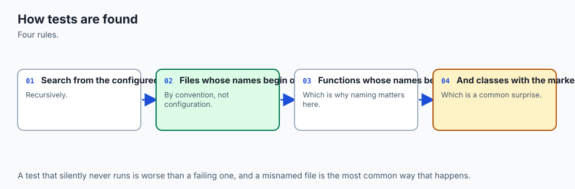

Run `pytest examples` and, before executing anything, pytest performs the following in order.

**It fixes the rootdir.** Starting from the paths you named on the command line, pytest walks *upward* looking for a configuration file — `pytest.ini`, `pyproject.toml`, `tox.ini`, or `setup.cfg`. The directory holding the first one it finds becomes the **rootdir**, and every path in the report is printed relative to it. This is why the lab puts a two-line `pytest.ini` in `examples/` and another in `starter/`: without them pytest would keep climbing and pick some ancestor directory you never chose, and your report would be full of long paths. The rootdir is printed in the header of every run, and reading it is the first thing to do when pytest behaves unexpectedly.

**It imports every `conftest.py` it can see**, from the rootdir down to the directory being collected. You never import this file and nothing names it; pytest finds it by its name alone and imports it before collection begins. Whatever it defines — fixtures, constants, hooks — becomes available to every test file beneath it.

**It matches by name.** Files called `test_*.py` or `*_test.py`; inside them, functions called `test_*`, and classes called `Test*` (which must not define an `__init__`, because pytest needs to instantiate them itself). Methods inside a collected class follow the same `test_*` rule. Everything else in the file is ignored — helper functions, constants, imports.

**It builds an item per test, with an id.** You can see exactly what was found without running anything:

```bash
pytest examples --collect-only -q
```

```text
test_textstats.py::test_words_splits_on_punctuation_and_lowercases
test_textstats.py::test_words_keeps_an_apostrophe_inside_a_word
...
test_textstats.py::TestTopWords::test_returns_exactly_n_items
test_textstats.py::TestTopWords::test_orders_by_frequency_then_alphabetically
...
19 tests collected in 0.01s
```

That `path::Class::name` string is a **test id**, and it is a first-class thing: you can paste one back on the command line to run exactly that test and nothing else. When a run behaves strangely, `--collect-only` is the first diagnostic, because roughly half of all confusing pytest sessions turn out to be "it never collected the file you thought it did".

### 3. Assertion rewriting — why the bare `assert` is enough

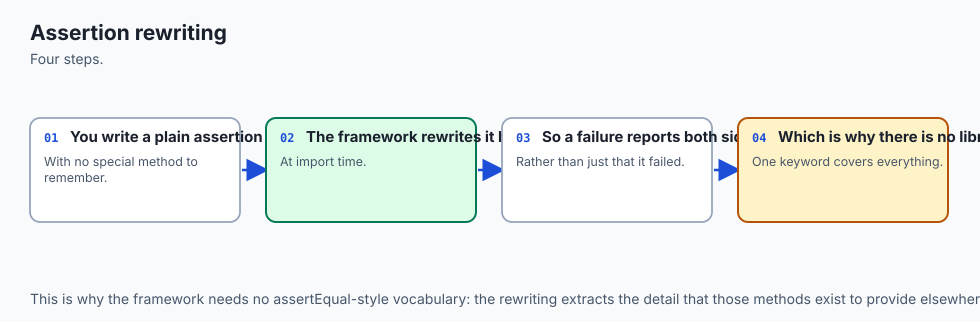

Plain Python is not generous when an assertion fails. Consider `assert add(1, 2) == 3` where `add` is wrong. Python evaluates the expression to `False` and raises `AssertionError`. It does not tell you what `add(1, 2)` returned, because by the time the statement failed that value has been evaluated, compared, and discarded. This is precisely why `unittest` has `assertEqual`: it is a *function*, so it receives both values as arguments and can therefore print them.

pytest solves the same problem differently, and here is the honest mechanical description: **pytest installs an import hook, and when it imports a test module it rewrites the module's `assert` statements before compiling them, so that a failing assertion can report both sides of the comparison.** The rewritten form stores the intermediate values in temporary variables as it evaluates the expression, and if the result is false it uses those saved values to build the explanation. Your source file is not modified; the rewriting happens in memory on the way to bytecode.

Two consequences follow, and both are worth knowing.

The first is what you gain. This is a real failure from the lab's deliberate-failure demo:

```text
    def test_a_simple_number_comparison():
>       assert add(1, 2) == 3
E       assert 4 == 3
E        +  where 4 = add(1, 2)
```

The `>` marks the failing line. The `E` lines are the explanation pytest reconstructed: the comparison was `4 == 3`, and the `4` came from calling `add(1, 2)`. You were not asked to phrase anything specially — you wrote `assert`, and got a small report.

The second is where it stops. Rewriting applies to test modules pytest collects (and, on request, to plugins and helper modules registered for it). A bare `assert` in a file pytest did not rewrite gets no explanation at all. The lab proves this by running the same broken assertion under `unittest`, which does no rewriting:

```text
FAIL: test_a_bare_assert_inside_unittest (__main__.ComparisonTests.test_a_bare_assert_inside_unittest)
----------------------------------------------------------------------
Traceback (most recent call last):
  File "<repo>/.../unittest_failure.py", line 30, in test_a_bare_assert_inside_unittest
    assert add(1, 2) == 3
           ^^^^^^^^^^^^^^
AssertionError
```

`AssertionError` and nothing else. The statement is identical; only the machinery around it differs. That is the entire value proposition of assertion rewriting, visible in one screen.

pytest also knows the shapes of common types and diffs them for you. A list mismatch names the index; a dict mismatch names the differing key and hides the identical ones; a string mismatch aligns the two strings and points at the character:

```text
E       AssertionError: assert ['the', 'cat'...', 'a', 'mat'] == ['the', 'cat'... 'the', 'mat']
E         At index 4 diff: 'a' != 'the'
E         Use -v to get more diff
```

```text
E       AssertionError: assert {'words': 12,...length': 3.83} == {'words': 12,...length': 3.83}
E         Omitting 2 identical items, use -vv to show
E         Differing items:
E         {'unique': 8} != {'unique': 9}
```

### 4. Execution and reporting

With items collected, the session runs each one in turn, in file order. For each item pytest resolves its fixtures, calls the function, and records the outcome. Then it prints, in this order: a header naming the platform, versions, rootdir, and config file; one progress character per test as it finishes; the full body of every failure; the **short test summary info** block listing failed test ids one per line; and one final summary line with the counts and the duration.

The progress characters are worth memorising, because they are how you read a running suite at a glance:

| Character | Meaning |
| --- | --- |
| `.` | passed |
| `F` | failed — an assertion was false |
| `E` | error — the test raised before or outside the assertion, or a fixture blew up |
| `s` | skipped — the test declined to run |
| `x` | expected failure, marked as such in advance |
| `X` | unexpectedly passed, when it was marked as an expected failure |

The distinction between `F` and `E` is real and useful. `F` means your code ran and gave the wrong answer. `E` means it did not get that far — a typo in an import, a fixture that raised, a missing file. `F` sends you to the logic; `E` sends you to the setup.

### 5. Reading the output fluently

Six flags cover almost everything you will do at the command line. All of them appear in the lab's captured session, so you can compare the same run under each.

| Flag | What it does | When you reach for it |
| --- | --- | --- |
| *(none)* | Header, dots, full tracebacks, summary | The default. Fine for a suite that passes |
| `-q` | Quiet: drops the header, keeps dots and the summary | Running constantly while you work; the output fits in a corner of the screen |
| `-v` | Verbose: one line per test, with its full id and outcome | Finding out exactly which tests exist and which one is red |
| `-x` | Stop after the first failure | A big red suite. Fix one thing at a time rather than reading forty tracebacks |
| `-k EXPR` | Run only tests whose id matches the expression | Iterating on one function. Supports `and`, `or`, `not` and substrings |
| `--tb=short` | Shorten each traceback to one frame plus the `E` lines | The failure bodies are long and you already know the code |

`-k` deserves a demonstration because it is the flag that changes how you work. The lab's suite has nineteen tests; five of them concern reading time:

```bash
pytest examples -q -k reading_time
```

```text
.....                                                                    [100%]
5 passed, 14 deselected in 0.01s
```

"Deselected" rather than "skipped": they were collected and then filtered out. The distinction matters when you are counting.

`--tb=line` is worth knowing as the extreme case — one line per failure, no context at all — and `--tb=no` suppresses failure bodies entirely, which combined with `-q` gives you a suite's status in two lines.

### 6. Exit codes, and why continuous integration depends on them

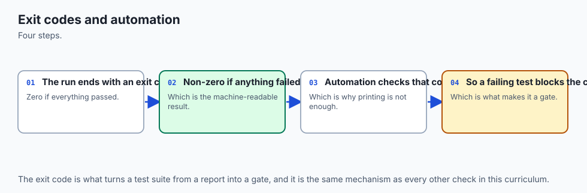

When pytest finishes, the report is for you and the **exit code** is for the machine. It is a single small integer, and it is the entire interface between your test suite and any automation that runs it.

| Code | Meaning |
| --- | --- |
| 0 | All collected tests passed |
| 1 | Tests ran and at least one failed |
| 2 | The run was interrupted — including a collection error |
| 3 | An internal error occurred while running tests |
| 4 | pytest was used wrongly on the command line |
| 5 | **No tests were collected** |

Code 5 is the one to burn into memory, and the lab pins it with a check of its own. Consider a build script written the obvious wrong way: run the tests, look for the word `FAILED` in the output, and ship if it is absent. Now somebody renames a directory, so the path in the build script no longer exists. pytest collects nothing, prints `no tests ran in 0.00s`, prints no failures whatsoever, and exits 5. The script sees no `FAILED`, declares success, and ships code that has not been tested since the rename. Nobody notices for months, because the build stayed green the whole time.

The correct discipline is one sentence long: **a build step succeeds if and only if the process exited 0.** Every shell, every CI system, and every `Makefile` already works this way by default — which means the only way to get this wrong is to go out of your way, and people do, constantly. In bash you can see the number yourself:

```bash
pytest examples -q ; echo $?
```

The lab's own `tests/run_tests.sh` ends with the line `[ "${failures}" -eq 0 ]`, which is bash for "the exit status of this script is 0 if that comparison held". No printing, no interpretation — the last thing the script does is *be* the answer.

### 7. What makes a test worth having

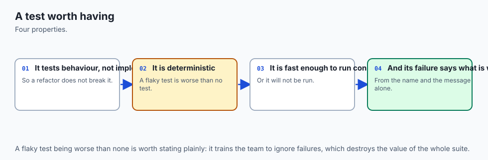


Four properties separate a test that earns its place from one that costs more than it gives.

**Fast.** Milliseconds, not seconds. This is not aesthetics: a suite that takes ten minutes is a suite you run once a day, which means you learn about failures in batches of thirty changes and cannot tell which one caused what. Speed is what buys you the tight loop.

**Deterministic.** Same result every time, from the same code. A test that depends on the current date, a random seed, the network, the order in which tests ran, or the speed of the machine is a **flaky test**, and flaky tests are worse than absent ones. A suite that fails one run in ten teaches everyone to re-run it instead of reading it, and on the day the failure is real, they will re-run it.

**Independent.** Any test can run alone, and any subset can run in any order. If `test_b` only passes after `test_a` has run, you have not written two tests; you have written one test in two pieces, and `-k` will lie to you about it.

**One reason to fail.** A test with a name and a single behaviour tells you what broke from the summary line alone, before you read anything else. `test_average_word_length_of_empty_text_is_zero` failing tells you the story in full. `test_everything` failing tells you nothing.

And then there is the anti-pattern that this lesson exists to make visible: **the test that passes no matter what the code does.** It is the go/no-go gauge that every part fits through — reassuring, official-looking, and load-bearing in exactly the moment it is worthless. It looks like this:

```python
def test_top_words_returns_something():
    assert top_words(TEXT, 2) is not None


def test_top_words_returns_a_list():
    assert isinstance(top_words(TEXT, 2), list)


def test_top_words_does_not_crash():
    top_words(TEXT, 2)
    assert True


def test_word_count_is_not_negative():
    assert word_count(TEXT) >= 0
```

Four green tests. All four are worthless. `is not None` is true of a wrong list; `isinstance` is true of a wrong list; "it ran" is not a specification; and a count is never negative whatever the bug. This is not a hypothetical: the lab ships those four tests and a script that breaks `top_words` on purpose and re-runs them. They stay green. The fifth test in that file — `assert top_words(TEXT, 2) == [("a", 3), ("b", 2)]` — is the same intent written so that it *can* fail, and it is the only one that notices.

Which gives you the one habit that makes the difference between having tests and having a test suite: **watch every test fail at least once, on purpose.** Write it and see it red before you make it green, or if you wrote it after the code, break the code deliberately and confirm the test catches it. A test you have never seen fail is a claim you have never checked.

## An everyday analogy

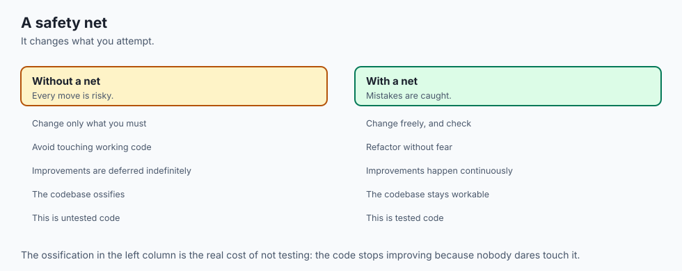

Go back to the factory floor.

A part comes off the line. The operator clamps it into a **jig** — a fixture that holds it in a known position, the same way every time. That is *arrange*, and it is also, not by coincidence, where pytest's word "fixture" comes from. The rig then does the one thing it is built to do: spin the shaft, apply the load, energise the coil. That is *act*. Finally the operator applies a **go/no-go gauge**: a piece of hardened steel machined so that a correctly sized part slides into the "go" end and refuses to enter the "no-go" end. That is *assert*. The gauge gives no reading, no opinion, and no nuance. It answers one question with one bit.

The rest of the analogy maps almost too neatly. The schedule of which gauges apply to which parts is *collection*, and a gauge that is not on the schedule is a gauge that never gets used, which is why the naming convention exists. The tally sheet at the end of the shift is the *report*. The stamp that lets the pallet leave the building is the *exit code* — and note that the pallet leaves on the stamp, not on the sheet, exactly as a deployment proceeds on the exit code and not on the output. When the gauge rejects a part, the useful rig tells you *by how much and where*; that is assertion rewriting, and the difference between "reject" and "0.04 mm over at the flange" is the difference between `AssertionError` and `assert 4 == 3, where 4 = add(1, 2)`.

The analogy also carries the failure modes. A gauge worn so loose that every part slides through is the vacuous test, and it is worse than no gauge at all, because the line now has a documented quality process that certifies nothing. A gauge that gives a different answer depending on the temperature of the room is the flaky test. A gauge that takes twenty minutes to apply is the slow test: it will be applied to one part in a hundred, then to none. And a quality inspector who checks parts by eye, on a good day, having had coffee, is manual testing — perfectly capable, entirely unrepeatable, and the reason the gauge was invented.

Where the analogy stops: a physical gauge measures the part that exists, while a test also *documents the part that should exist*. A well-named failing test is a specification somebody can read. That is a property software gets for free and metalwork does not.

## Examples in practice

Everything below is captured from real runs of the Day 71 lab on the authoring machine (macOS 26.5.1, Apple Silicon, Python 3.14.0, pytest 9.1.1, 2026-07-19). Absolute paths appear as `<repo>`.

**A passing run, in full.** This is what the header actually contains, and every line of it is diagnostic:

```text
$ pytest examples
============================= test session starts ==============================
platform darwin -- Python 3.14.0, pytest-9.1.1, pluggy-1.6.0
rootdir: <repo>/.../day-071-why-test-and-pytest-basics/examples
configfile: pytest.ini
plugins: cov-7.1.0, anyio-4.14.2
collected 19 items

examples/test_textstats.py ...................                           [100%]

============================== 19 passed in 0.01s ==============================
exit: 0
```

Nineteen dots, nineteen passed, exit 0. The `rootdir` and `configfile` lines say where pytest thinks it is; the `plugins` line lists whatever happens to be installed alongside pytest, and a clean lab environment built from the lab's `requirements.txt` shows no plugins line at all.

**The same run, quiet.** This is what you will actually live in:

```text
$ pytest examples -q
...................                                                      [100%]
19 passed in 0.01s
```

**A failure report.** Five deliberate failures, showing five different kinds of explanation. The first is the canonical one:

```text
=================================== FAILURES ===================================
_______________________ test_a_simple_number_comparison ________________________

    def test_a_simple_number_comparison():
>       assert add(1, 2) == 3
E       assert 4 == 3
E        +  where 4 = add(1, 2)

examples/failure-demo/test_failure_report.py:20: AssertionError
```

and the last shows what a missing exception looks like when you asked for one with `pytest.raises`:

```text
    def test_an_exception_that_was_not_raised():
>       with pytest.raises(ValueError):
             ^^^^^^^^^^^^^^^^^^^^^^^^^
E       Failed: DID NOT RAISE ValueError
```

Then the block that you should train yourself to read first, because it is the shortest complete account of the run:

```text
=========================== short test summary info ============================
FAILED examples/failure-demo/test_failure_report.py::test_a_simple_number_comparison
FAILED examples/failure-demo/test_failure_report.py::test_a_list_comparison
FAILED examples/failure-demo/test_failure_report.py::test_a_dict_comparison
FAILED examples/failure-demo/test_failure_report.py::test_a_string_comparison
FAILED examples/failure-demo/test_failure_report.py::test_an_exception_that_was_not_raised
============================== 5 failed in 0.02s ===============================
exit: 1
```

Five ids you can paste straight back onto the command line, and an exit code of 1.

**Stopping at the first failure.** With `-x` and `--tb=line`, the same five-failure suite becomes four lines:

```text
$ pytest examples/failure-demo -x -q --tb=line
F
E   assert 4 == 3
     +  where 4 = add(1, 2)
<repo>/.../test_failure_report.py:20: assert 4 == 3
=========================== short test summary info ============================
FAILED examples/failure-demo/test_failure_report.py::test_a_simple_number_comparison
!!!!!!!!!!!!!!!!!!!!!!!!!! stopping after 1 failures !!!!!!!!!!!!!!!!!!!!!!!!!!!
1 failed in 0.00s
exit: 1
```

**A suite proving it tests something.** This is the check that matters most in the whole lab. Copy the fixed module and its suite to a temporary directory, break exactly one line — `return len(words(text))` becomes `return len(words(text)) + 1` — and run again:

```text
$ pytest . -q --tb=line   # in a temp copy with word_count broken
....FF..........FF.                                                      [100%]
E   AssertionError: assert 13 == 12
     +  where 13 = word_count('The quick brown fox jumps over the lazy dog. The dog barks.')
E   AssertionError: assert 1 == 0
     +  where 1 = word_count('')
...
4 failed, 15 passed in 0.01s
exit: 1
```

Four tests noticed a one-character change, and each of them named the value it saw. That run is the evidence that the other fifteen green dots mean something.

**A run that collects nothing.** The most dangerous output in this lesson, because it looks harmless:

```text
$ cd $(mktemp -d) && pytest . -q

no tests ran in 0.00s
exit: 5
```

No failures. No errors. No tests. Exit 5.

**The vacuous demonstration.** Four worthless tests and one honest one, run against a knowingly broken `top_words`:

```text
--- the four vacuous tests, on the BROKEN module ---
....                                                                     [100%]
4 passed, 1 deselected in 0.00s
exit: 0

--- the one honest test, on the same BROKEN module ---
F                                                                        [100%]
E   AssertionError: assert [('a', 3)] == [('a', 3), ('b', 2)]
E     Right contains one more item: ('b', 2)
1 failed, 4 deselected in 0.01s
exit: 1

Point made: four green tests, one broken function, zero warnings.
```

## Implications: security, privacy, performance, scalability, and cost

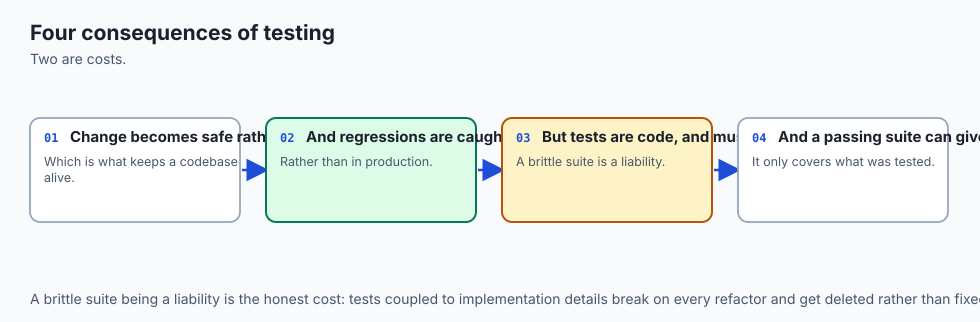

**Security.** Two facts about tests are security-relevant and routinely forgotten. The first: **test code is code**. pytest *imports* every file it collects, and importing a module runs its body — so a file named `test_anything.py` in a directory you point pytest at executes with your privileges before a single assertion is evaluated. `conftest.py` is imported automatically, without any file naming it, which makes it the quietest place in a Python repository to hide something that runs on every test invocation. Read the `conftest.py` diff in a pull request as carefully as you read the source diff.

The second: **`assert` disappears under `python -O`.** Python's optimise flag strips assertions from compiled code entirely. That is harmless for tests, which are never run optimised, and dangerous for runtime validation — a security check written as `assert user.is_admin` vanishes under `-O` and the program continues as though it had passed. Validate untrusted input with an explicit `if` and a raised exception, exactly as yesterday's domain model does; keep `assert` for tests. Tests themselves are also a security control in the ordinary sense: a test that pins "a negative amount is refused" is a regression guard on a rule an attacker would like to break.

**Privacy.** A failing assertion prints both sides of the comparison, and build logs are far more widely readable than production databases. A test that asserts on an object containing an API token puts that token in the log the first time it fails. Never put a real credential in a test file — test files are committed, and a committed secret is permanently leaked even after the commit is amended — and never test against production data. Day 74's boundary-stubbing is the structural fix: you remove the credential from the test entirely.

**Performance.** The lab's nineteen tests run in about 0.01 seconds, which is the point. Test speed is a feature you must actively defend, because slow tests are skipped tests. The main cost drivers are real input and output — files, sockets, databases, sleeps — which is exactly why a pure core is testable and an entangled one is not. The one performance cost pytest itself adds is collection: it imports every test module before running anything, so a large suite pays an import cost up front. That is why `-k` and passing an explicit test id matter in daily work.

**Scalability.** Tests scale a codebase in the dimension that actually binds: how many people can change it at once without breaking each other. A suite is a shared, executable statement of what must remain true, and it lets someone who has never read your module change it with a reasonable expectation of finding out if they were wrong. Uniform conventions are what make that work — `tests/` beside the package, `test_` prefixes, one test id per behaviour — so a stranger can find and run the relevant tests without asking anyone.

**Cost.** Writing tests costs time now to save time later, and the exchange rate is very favourable but not infinite. The floor is that a bug caught in the same minute costs minutes, and the same bug caught in production costs a day plus whatever the wrong answer did in the meantime. The real cost to watch is not writing tests but writing *bad* ones: vacuous tests cost maintenance and provide nothing, flaky tests cost trust, and slow tests cost the feedback loop that makes the rest worthwhile. Fewer, sharper tests beat more, vaguer ones on every axis.

## Alternatives: free, open source, and commercial

Four tools cover Python testing at this level. **All four are free and open source.** Two of them ship with Python and need no installation at all, which is worth knowing for the day you land on a machine where you cannot install anything.

| Tool | What it is | When to choose it | Cost |
| --- | --- | --- | --- |
| pytest | A test runner using plain functions and the bare `assert`, with assertion rewriting, fixtures, parametrisation, and a plugin ecosystem | The default for new Python projects, and what this course uses from here on | Free and open source (MIT); installed with `pip` |
| `unittest` | The standard library's xUnit framework: `TestCase` subclasses and named assertion methods | You cannot install packages, you are maintaining an existing xUnit suite, or you want zero dependencies | Free; ships with Python |
| `doctest` | The standard library's checker for interactive examples inside docstrings | Short, exact, illustrative examples that must stay true as documentation | Free; ships with Python |
| Hypothesis | Property-based testing: you state a property, it generates many inputs trying to falsify it, then shrinks any failure to a minimal case | When the input space is large and you can state a rule that holds for all of it | Free and open source; installed with `pip` |

**pytest — how to use it, with a worked example.** Install it into a virtual environment, write plain functions in `test_*.py`, run the directory:

```bash
python3 -m venv .venv
.venv/bin/pip install pytest==9.1.1
.venv/bin/pytest examples -q
```

```text
...................                                                      [100%]
19 passed in 0.01s
```

Choose it when you have any choice at all. The assertion reporting alone justifies it, and everything else — fixtures on Day 72, parametrisation, `pytest.raises`, `pytest.approx` — compounds from there.

**`unittest` — how to use it, with a worked example.** Subclass `unittest.TestCase`, name methods `test_*`, and use the assertion methods. Run it with `python3 -m unittest`. Here is a real run, with one deliberately wrong expectation so you can see both a pass and a failure:

```python
# test_mathy.py
import unittest
from mathy import clamp

class ClampTests(unittest.TestCase):
    def test_inside_range(self):
        self.assertEqual(clamp(5, 1, 10), 5)
    def test_below_range(self):
        self.assertEqual(clamp(-3, 1, 10), 0)   # wrong on purpose
```

```text
$ python3 -m unittest -v test_mathy
test_below_range (test_mathy.ClampTests.test_below_range) ... FAIL
test_inside_range (test_mathy.ClampTests.test_inside_range) ... ok

======================================================================
FAIL: test_below_range (test_mathy.ClampTests.test_below_range)
----------------------------------------------------------------------
Traceback (most recent call last):
  File "/private/tmp/d71x/test_mathy.py", line 8, in test_below_range
    self.assertEqual(clamp(-3, 1, 10), 0)
    ~~~~~~~~~~~~~~~~^^^^^^^^^^^^^^^^^^^^^
AssertionError: 1 != 0

----------------------------------------------------------------------
Ran 2 tests in 0.000s

FAILED (failures=1)
exit: 1
```

`AssertionError: 1 != 0` — both sides, because `assertEqual` is a function that received them. That is `unittest` doing its job well. The costs are visible in the same screen: a class you must inherit from, a differently named method for every kind of comparison, and no explanation at all for a bare `assert`. The genuine advantage is equally visible: nothing was installed, and this runs on any machine with Python. Note also that pytest will happily collect and run `unittest.TestCase` classes, so adopting pytest does not mean rewriting an existing suite.

**`doctest` — how to use it, with a worked example.** Write examples in a docstring using the interactive `>>>` prompt, with the expected output on the following line, and let a machine check them:

```python
def clamp(value, low, high):
    """Clamp value into [low, high].

    >>> clamp(5, 1, 10)
    5
    >>> clamp(-3, 1, 10)
    1
    >>> clamp(99, 1, 10)
    10
    """
    return max(low, min(value, high))
```

```text
$ python3 -m doctest -v mathy.py | tail -6
1 item passed all tests:
   3 tests in mathy.clamp
3 tests in 2 items.
3 passed.
Test passed.
exit: 0
```

Without `-v`, `python3 -m doctest mathy.py` prints nothing at all and exits 0 — silence means everything matched. Choose `doctest` when the example is short, exact, and genuinely worth putting in the documentation, because you get a tested example and a documented one for the price of one. Do not choose it when the result is long, unordered, or contains anything that varies between runs, such as a dictionary printed in an unstable order or an object whose repr includes a memory address: the comparison is character for character, so those cases fail forever. `doctest` also handles exceptions, matching on the traceback's final line, which the lab demonstrates on a `ValueError`.

**Hypothesis — how to use it, with a worked example.** Instead of naming one input, you state a property that should hold for all inputs of a type, and the library generates many examples trying to break it. If it finds one, it *shrinks* it to the smallest failing case before reporting:

```python
from hypothesis import given, strategies as st

@given(st.integers(), st.integers(), st.integers())
def test_clamp_result_is_always_within_bounds(value, low, high):
    if low > high:
        return
    assert low <= clamp(value, low, high) <= high
```

Choose Hypothesis when the input space is far too large to enumerate and you can state an invariant that must hold across all of it — round trips (`decode(encode(x)) == x`), sorting, parsing, arithmetic on money. Do not reach for it first: a property-based test is harder to write than an example-based one, and it complements rather than replaces the handful of concrete cases that document what the function is *for*. **Honesty about this example:** Hypothesis is not installed on the machine this lesson was written on, and nothing in this course's labs requires it, so unlike every other output on this page the snippet above is not accompanied by a captured run. Treat it as a shape to recognise, and verify the behaviour yourself against the project's documentation if you adopt it.

**What about paid tools?** There is no paid tier of any of the four. Money enters the picture one layer out, in *hosted continuous integration* — services that run your suite on every push — and even there the pricing is for compute minutes, not for the testing tool. Nothing in Week 11 requires a paid product of any kind.

## Comparison with related concepts

| Concept A | Concept B | Key difference |
| --- | --- | --- |
| A bare `assert` in a script | A pytest test | Same statement, same semantics. pytest adds discovery, isolation between tests, an explanation of the failure, and an exit code that summarises everything |
| pytest | `unittest` | pytest collects plain functions and rewrites `assert`; `unittest` needs a `TestCase` subclass and named assertion methods. pytest can run `unittest` suites; the reverse is not true |
| Unit test | Integration test | A unit test exercises one function or class in isolation, in milliseconds. An integration test exercises several parts together, including real files or services, and is slower and more fragile by nature |
| Test | Type check | A test asks "does this specific call give the right answer?" A type checker asks "could any call be wrong in this way?" — no execution required. Day 75 |
| Test | Lint rule | A test checks behaviour; a linter checks form. Both fail a build, but only one of them knows what your code is supposed to do. Day 76 |
| `F` in the output | `E` in the output | `F` is a failed assertion: the code ran and was wrong. `E` is an error: the code did not get that far. `F` sends you to the logic, `E` to the setup |
| Exit code 1 | Exit code 5 | 1 means tests ran and something failed. 5 means *no tests ran at all* — which a naive build script reads as success |
| Skipped | Deselected | Skipped tests were collected and chose not to run; deselected tests were filtered out by `-k` before running. Both appear in the counts, and confusing them makes the numbers lie |

## When to use it — and when not to

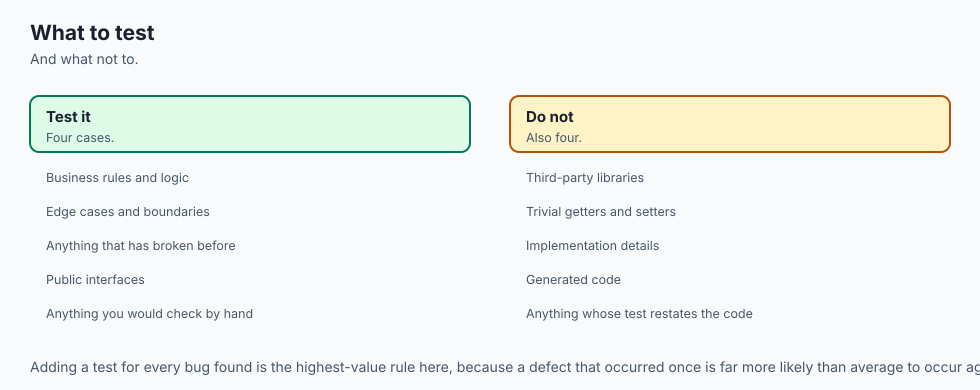

Write tests for anything whose answer you would otherwise have to check by hand more than twice. That includes every pure function with a rule in it — parsing, formatting, arithmetic, validation, tokenising, deduplication — and every invariant of a domain model, which is why yesterday's work is today's natural subject. Write them especially for the code that is boring: the small, obvious, "cannot possibly be wrong" transformations are where silent bugs live longest, because nobody looks at them again.

Write a test the moment you find a bug, before you fix it. Reproduce the bug as a failing test, watch it go red, then fix the code and watch it go green. You get three things for the price of one: proof that you understood the bug, proof that the fix works, and a permanent guard against it coming back — which is what a **regression test** is.

Do not write tests for code with no rules. A three-line script that reads a file, sums a column, and prints the answer does not need a suite; it needs to be run. Do not test the standard library or a third-party package — `sorted` works, and a test asserting that it does is maintenance with no upside. Do not write a test you cannot imagine failing; if you cannot describe the bug it would catch, you are writing a vacuous test and you should either sharpen it or delete it. And do not test through the layers you have not learned yet: today's tests are for pure functions and objects with no input or output of their own. Code that calls a network or a clock needs Day 74's techniques, and testing it without them produces the flaky suites that make people give up on testing entirely.

On layout, the conventions are worth adopting immediately because they are what let strangers navigate your project. Put a `tests/` directory beside the package it tests. Name files after the module under test: `textstats.py` gets `test_textstats.py`. Name each test after the behaviour it pins, in a full sentence with underscores — `test_average_word_length_of_empty_text_is_zero`, not `test_avg2` — because that name is what you will read in the summary at seven in the evening, and the whole point of the name is to make the failure legible without opening anything. Put shared setup in `conftest.py`. And do not give two test files in two directories the same name unless a package structure separates them, or you will meet the `import file mismatch` error the lab reproduces on purpose.

Here is where all of this points. When you start building AI systems, the untested-preprocessing failure from the top of this lesson stops being a story and becomes your Tuesday. Your pipeline will chunk documents, normalise text, deduplicate rows, encode labels, build prompts, and parse model responses — and every one of those is a pure function with rules, which is to say every one is exactly what today's lesson tests. The parts that are genuinely hard to test are the parts that call the model, because a language model is not a pure function: the same input can produce different output, and each call costs money and takes a second.

That is precisely why Day 74 exists. The strategy that makes AI systems testable is to draw the boundary at the model call, test your own logic exhaustively and deterministically on both sides of it, and stub the call itself. Later in the course you will meet **evaluation suites**, which are tests with fuzzy assertions — instead of `== 12` you assert that a score exceeds a threshold across a dataset — and every piece of discipline you build this week transfers unchanged: arrange, act, assert; one reason to fail; watch it fail once on purpose; and trust the exit code, not the output.

## The AI connection

- **Tests are what make change safe**, which is what allows a codebase to keep improving.
- **A test is a specification** of what the code should do, written in a form that runs.
- **AI code needs tests more than most**, because its failures are silent rather than loud.
- **The first test is the hardest**, and everything after it is cheap.
- **Untested code is code nobody can safely modify**, including its author six months later.

## Knowledge check

Answer from memory before looking back.

1. Name the three parts of every test, in order, and identify each one in `assert word_count("The cat. The hat!") == 4`.
2. pytest lets you use the bare `assert` where `unittest` needs `assertEqual`. Explain mechanically why, and say what pytest can therefore print that plain Python cannot.
3. Describe what pytest does between the moment you press Enter and the moment the first test function runs. Use the words *rootdir*, *conftest*, and *collection*.
4. A build script runs `pytest tests/` and ships if the output does not contain `FAILED`. Describe the exact circumstance under which it ships untested code, and give the exit code involved.
5. Four properties make a test worth having. Name them, and for each one name the failure that appears when it is missing.
6. What is wrong with `assert result is not None` as a test of a function that returns a list of pairs? Rewrite it so that it can fail.
7. Name one situation in which `doctest` is the right tool and one in which it is the wrong one, and say what makes the difference.

## Hands-on exercise

The Day 71 lab, **Your First Real Test Suite**, is built around a small module called `textstats` — five functions that count words, average their length, rank the most frequent, and estimate reading time. Two of the five are wrong. You are not asked to read the code until you spot the bugs; you are asked to write tests against the docstrings, which are the specification, and let the tests find them.

This is the first lab in the course that installs a dependency, so start there. From the lab directory:

```bash
python3 -m venv .venv
.venv/bin/pip install -r requirements/requirements.txt
.venv/bin/pytest --version
```

That last command should print `pytest 9.1.1`. It is also the only moment in the lab that touches the network; everything afterwards runs offline.

Now see the target. The `examples/` directory holds a finished reference suite, and running it is the first thing to do:

```bash
.venv/bin/pytest examples          # the full report
.venv/bin/pytest examples -q       # what you will actually live in
.venv/bin/pytest examples --collect-only -q   # every test id, nothing executed
.venv/bin/pytest examples -k reading_time     # five of the nineteen
```

Then read some failures, which is a skill you practise deliberately rather than by accident. The `failure-demo` directory contains five tests that fail on purpose, each showing a different kind of explanation:

```bash
.venv/bin/pytest examples/failure-demo
.venv/bin/pytest examples/failure-demo -x --tb=short
python3 examples/failure-demo/unittest_failure.py
```

Next, the demonstration that gives the day its point. `examples/vacuous-demo/` holds four tests that pass no matter what the code does, plus one honest test. The script breaks `top_words` in a temporary copy and runs both halves:

```bash
bash examples/vacuous-demo/prove_it.sh
```

Watch four green tests certify a broken function, then watch the fifth catch it.

Then the main work. Open `starter/test_textstats.py`. Exercise 1 is written for you; exercises 2 to 7 each end in a `pytest.skip(...)` line, so the suite runs from the first moment and reports skips rather than errors. Replace each skip with real assertions — the empty case for `words`, the hand-counted word count of the sample, the empty-text average, a known average using `pytest.approx`, four `top_words` cases inside a `Test*` class, and the reading-time rules including a `pytest.raises(ValueError, match="must be positive")`. Two of those tests are *supposed* to fail when you first write them correctly, because the module has two real bugs. Exercise 8 is where you repair `starter/textstats.py` — two lines, one in each broken function — and then deliberately re-break one of them to confirm your suite goes red and exits 1.

Finally, see testing without pytest at all, so you know what the tool is adding:

```bash
python3 examples/plain_asserts.py     # a suite made of nothing but assert
python3 examples/unittest_demo.py -v  # the same tests under the stdlib runner
python3 examples/doctest_demo.py      # tests living inside the docstrings
bash tests/run_tests.sh               # the lab's own checks
```

### Expected output

The reference suite, quiet:

```text
$ .venv/bin/pytest examples -q
...................                                                      [100%]
19 passed in 0.01s
```

The starter, before you have written anything — note that it already runs and already exits 0, because unfinished exercises are skips, not errors:

```text
$ .venv/bin/pytest starter -q
1 passed, 9 skipped in 0.01s
```

The canonical failure, from `failure-demo`:

```text
    def test_a_simple_number_comparison():
>       assert add(1, 2) == 3
E       assert 4 == 3
E        +  where 4 = add(1, 2)
```

And the lab's own suite, whose final line is the one to check:

```text
$ bash tests/run_tests.sh
...
47 checks, 0 failure(s).
```

A complete captured session — thirteen sections including every flag above, all four exit codes, the vacuous demonstration, and the `unittest` and `doctest` runs — is in the lab's `expected-output/sample-run.txt`.

### Validate your work

1. `.venv/bin/pytest examples -q` reports `19 passed` and exits 0.
2. `.venv/bin/pytest examples --collect-only -q` ends with `19 tests collected`, and five of those ids contain `::TestTopWords::`.
3. `.venv/bin/pytest examples -k reading_time` reports `5 passed, 14 deselected` — deselected, not skipped.
4. `.venv/bin/pytest examples/failure-demo` exits 1 and its report contains the line `E       assert 4 == 3`.
5. `pytest .` in an empty directory prints `no tests ran` and exits **5**. Check it with `echo $?` and remember the number.
6. `bash examples/vacuous-demo/prove_it.sh` ends with `Point made: four green tests, one broken function, zero warnings.` and exits 0.
7. With your exercises finished, `.venv/bin/pytest starter -q` reports `10 passed` and exits 0 — and then, with one line of `starter/textstats.py` re-broken on purpose, it exits 1. Do both. The second one is the one that proves the first meant something.
8. `bash tests/run_tests.sh` ends with `47 checks, 0 failure(s).` and exits 0.

### Troubleshooting

The lab's `troubleshooting.md` has the full list, all of it produced on purpose while building the lab. The five you are most likely to meet: `pytest: command not found`, which means you are not using the lab's `.venv/bin/pytest` and have not installed it; `no tests ran` with exit code 5, which means collection found nothing and is almost always a wrong path or a file not named `test_*.py`; `ModuleNotFoundError: No module named 'textstats'`, which means you ran pytest from inside `starter/` or from the repository root instead of from the lab directory; `fixture 'sample_text' not found`, which means the parameter name and the fixture name do not match exactly, since the match is by name and nothing else; and `import file mismatch` from running `pytest starter examples`, which is the lab's two identically named test files colliding — run one directory at a time.

### Common mistakes

- **Copying the expected value out of the implementation.** If you read `textstats.py` to decide what the answer should be, your test agrees with the bug. The docstrings are the specification; the sample sentence's twelve words were counted by hand for exactly this reason.
- **Deleting the exercise but leaving the `pytest.skip`.** A skipped test is reported as `s`, counts as neither pass nor fail, and lets an unfinished suite exit 0. That is deliberate scaffolding, and it becomes a lie the moment you write the assertion and leave the skip above it.
- **Assuming a failing test means you made a mistake.** Exercises 4 and 6 are supposed to fail. That is the suite doing its job on a module with two real bugs in it.
- **Comparing floats with `==`.** The sample's average word length is 46/12, which is 3.8333…, so `== 3.83` is a coin flip. Use `pytest.approx(3.83)`. This is the same warning you met about `0.1 + 0.2` on Day 70.
- **Using `pytest.raises` without `match=`.** `pytest.raises(ValueError)` passes if *any* `ValueError` is raised, including one from a typo in your own test. Pin the message.
- **Never watching a test fail.** Finish the lab and stop, and you have a green suite you have no evidence about. Break a line, run it, see red, undo. Ten seconds, and it is the difference between a test suite and a decoration.
- **Running `pytest` with no arguments from the lab directory.** It collects both `starter/` and `examples/`, which contain two files of the same name, and interrupts with a collection error and exit code 2.

## Practice assignment

Take the domain model you built for the Day 70 lab — the Northside Gym membership model, with its `Money`, `MembershipNumber`, `Plan`, `Member`, and `Club` — and give it the test suite it currently lacks. Copy the core into a fresh directory so this work is self-contained, add a `tests/` directory beside it with a `test_gym_core.py`, and write at least fifteen tests grouped by the object they concern, using a `Test*` class per object.

Cover, at minimum: every value object refusing at least one invalid value, with `pytest.raises(..., match=...)` pinning the message; `Money` addition succeeding within a currency and refusing across currencies; the entity comparing by identity, so that two members with the same name and different numbers are different and one member is still equal to itself after a rename; and the check-in limit accepting the twelfth check-in and refusing the thirteenth — a **boundary test**, which is where bugs cluster, and worth writing as two separate tests so a failure tells you which side broke.

Then do the part that makes it real. For each of your fifteen tests, break the specific line of the model that the test exists to guard, run `pytest -q`, and confirm that the test goes red and the process exits 1. Undo each break before making the next. Any test that stays green while its rule is broken is vacuous: rewrite it so it can fail. Your deliverable is the test file, the captured green run, and a short note listing each test alongside the one-line break that made it fail.

## Extension challenge

**Write a runner.** You now know exactly what a test runner does, so build a minimal one in about forty lines of standard-library Python and no pytest. It should take a directory, find every `test_*.py` file, import each one, find every module-level callable whose name starts with `test_`, call each in turn inside a `try`/`except AssertionError`, print a `.` or an `F` as it goes, print the names of the failures at the end, print a count, and exit 0 if and only if everything passed. Run it against the lab's `examples/` directory. Two things will happen: the tests that use the `sample_text` fixture will fail, because you did not implement fixtures — a precise, hands-on definition of what a fixture is, one day before you learn them properly — and every failure you do get will report `AssertionError` and nothing else, because you did not rewrite the assertions. Write down, in two sentences, what you would have to do to fix the second problem. That is the point of the exercise.

**Then measure your own suite honestly.** Take the practice assignment's suite and subject it to three audits. First, run it a hundred times in a loop (`for i in $(seq 100); do pytest -q || break; done`) and confirm it is green every time; anything less is a flaky test and you should find out which. Second, shuffle its meaning by running each test alone with its own test id and confirming every one still passes, which proves independence. Third — the hardest and most valuable — go through your model line by line and find one real rule that no test currently guards. Break it, watch the suite stay green, and then write the test that catches it. The number of times you can do that on your own code is the true measure of the suite, and it is a much more honest number than any count of tests.
