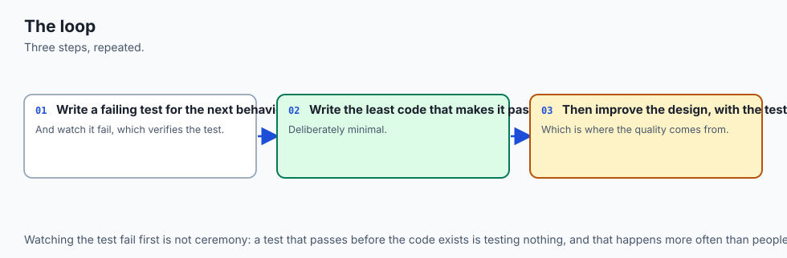
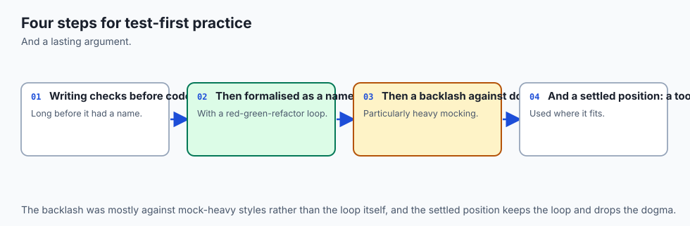
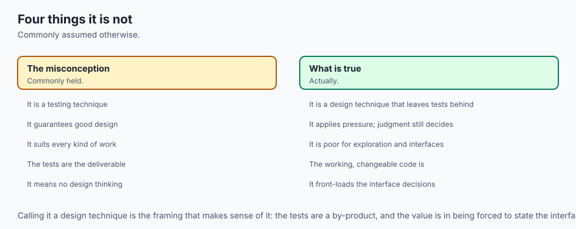
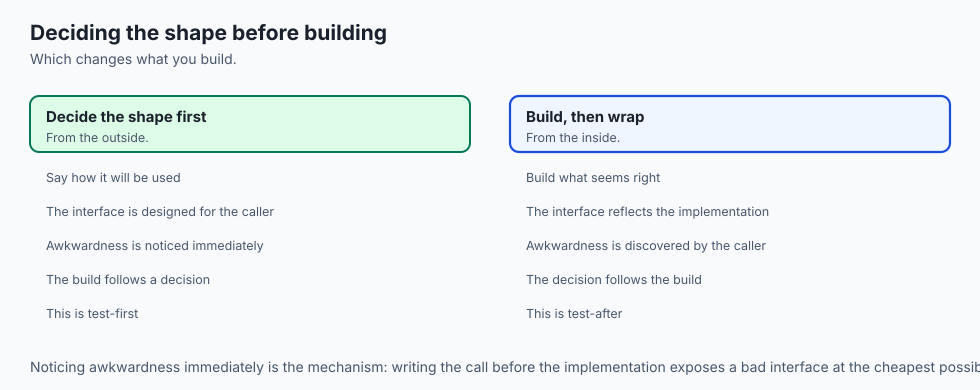
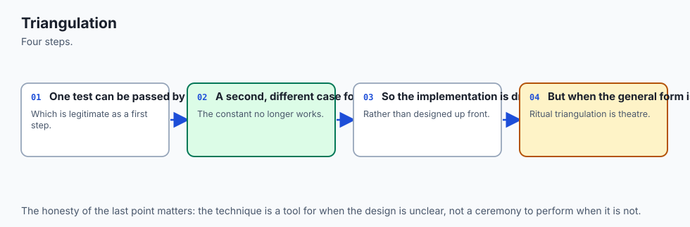
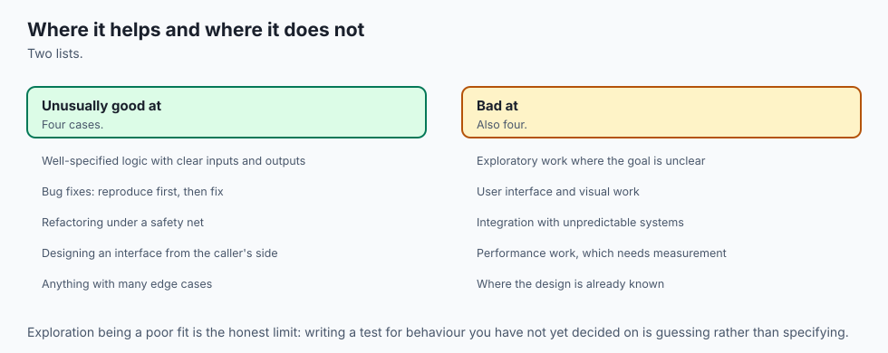
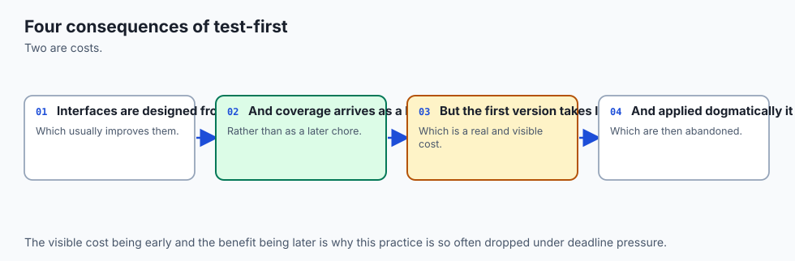
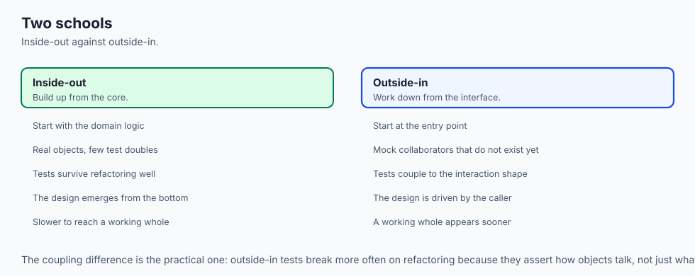
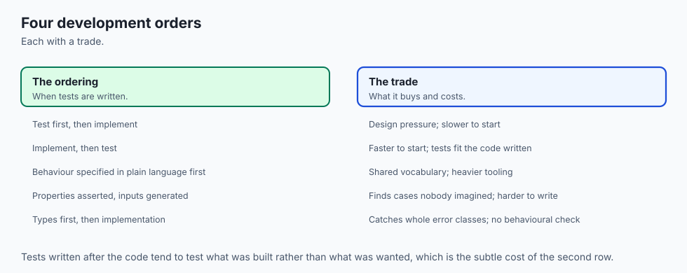
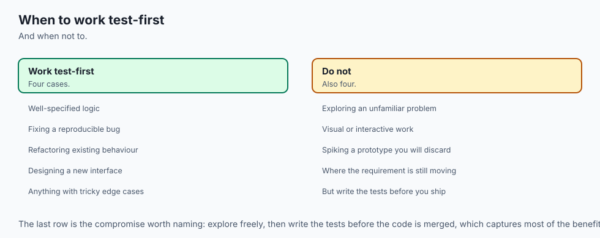

## Why this matters

Two days ago you learned why a test suite is worth having and how to write one with pytest. Yesterday you learned how to design tests that stay readable as they multiply — fixtures for the setup, parametrization for the cases, one clear reason to fail per test. Both of those days assumed something they never examined: that the code already existed, and you were writing tests *about* it.

Today changes only one thing, and it is the order. You write the test first. The code does not exist yet, the function has no name yet, and you write a test that calls it anyway, run it, and watch it fail.

That sounds like a small procedural detail. It is not, and here is the concrete consequence. On Day 71 you met the worst thing that can happen to a test suite: the test that always passes. An assertion that compares a value to itself. A `pytest.raises` block wrapped around a call that was never going to raise. A test that imports the wrong module and quietly asserts something true about the wrong object. Those tests are worse than no tests, because a green suite is not neutral — it is a claim. It tells you, and your reviewer, and the deploy pipeline, that the behaviour is checked. When the claim is false, everybody downstream acts on it.

There is exactly one moment in the life of a test at which you can obtain evidence that it is not one of those tests: the moment you see it fail for the reason you predicted. After that moment the evidence is gone forever, because a passing test looks identical whether it is wired to your code or to nothing at all. Test-driven development is, more than anything else, a discipline for making sure that moment always happens.

The money-and-time version of the argument is simpler. A bug caught by a test you wrote ten seconds ago costs you ten seconds: you know exactly what changed. The same bug found by a colleague in a code review costs an hour. Found by a user in production, it costs the afternoon plus the trust. And the AI version — which the last section of this lesson develops properly — is sharper still: when the implementation arrives from a code generator rather than from your fingers, the test you wrote *before* it arrived is the only part of the contract you can be certain you authored and actually read.

## The idea in plain language



Test-driven development is a loop with three steps, repeated until the feature is finished. The loop has a colour for each step, which is why it is usually called **red-green-refactor**.

1. **Red.** Write one small test for one behaviour the code does not have yet. Run the suite. Watch it fail, and read the failure message — it must fail for the reason you expected, not for a boring reason like a misspelled import.
2. **Green.** Write the least code that makes that test pass. Not the best code. Not the general code. The least. Run the suite again; everything, including every earlier test, must be green.
3. **Refactor.** Now improve the code — rename, extract, remove duplication — while changing no behaviour at all. Run the suite again. It must report the same number of passing tests as before. That is what makes the change a refactor rather than an untested edit.

Then go back to step 1 with the next behaviour, and a safety net that is now one test wider than it was.

Three things about this deserve emphasis before we go further, because they are what people get wrong.

**"The least code" is meant literally.** If a single test says `score([0] * 20) == 0`, then `return 0` is a legitimate green. It is obviously wrong as a bowling scorer and obviously right as a step, because the next test is what will kill it. Writing more than the tests demand is how you end up with branches nothing exercises.

**"Watch it fail" is not a formality.** It is the entire evidential basis of the technique. Every other benefit people claim for TDD is arguable; this one is not, because it is a matter of logic. An unfailed test is an untested test.

**Refactoring means changing structure without changing behaviour.** It does not mean "tidying up", and it certainly does not mean "rewriting the bit I did not like". If the output changes, it was not a refactor, and the passing suite you were leaning on was not actually holding your weight.

## Historical background



The practice as it is taught today was named and popularised by **Kent Beck** in the late 1990s, as one of the twelve practices of **Extreme Programming** — the method he described in *Extreme Programming Explained: Embrace Change* (Addison-Wesley, 1999). Beck had already built the tooling that made it comfortable: **SUnit** for Smalltalk, and then **JUnit** for Java, written with **Erich Gamma**. JUnit's design — a test is a method, the runner finds it, an assertion failure is a distinguishable outcome rather than a crash — is the ancestor of the `xUnit` family, and pytest is a distant, friendlier descendant of it. Beck set the practice out on its own in *Test-Driven Development: By Example* (Addison-Wesley, 2002), which is where the vocabulary this lesson uses — red-green-refactor, triangulation, fake it till you make it — was fixed.

Beck has consistently declined to claim he invented it. His account is that he rediscovered a much older idea, described in an early programming text, that you begin by writing down the output you expect and then write code until you get it. That is entirely plausible: on machines where a compile-and-run cycle took hours, deciding the expected answer in advance was ordinary prudence rather than a methodology. Historians of iterative development have documented test-first habits in projects going back to the 1960s. Treat the honest version as: **the practice is old, the name and the rhythm are Beck's, and the tooling that made it cheap is from the 1990s.**

The next part of the history matters just as much, and is often left out of introductions. **TDD is contested.** In 2014 the practice became the subject of a well-known public argument — "TDD is dead", in the phrasing of the blog post by **David Heinemeier Hansson**, the creator of Ruby on Rails, that started it — followed by a series of recorded conversations between Hansson, Beck and **Martin Fowler**. The disagreement was not really about whether tests are good. It was about whether *test-first*, specifically, and the design pressure it applies, is worth its costs in every kind of code, and about whether the isolation it encourages produces good designs or merely heavily-mocked ones.

The empirical literature has not settled it either. There have been many controlled experiments and industrial case studies on test-first versus test-after, and their results genuinely disagree with one another: some report fewer defects at some cost in time, some report no significant difference once the total number of tests written is held constant, and replications frequently fail to reproduce earlier findings. I am not going to quote a figure at you, because the honest summary is that no figure has held up well enough to quote, and this course does not print numbers it cannot stand behind.

So hold TDD the way a working engineer holds it: **a technique with a real mechanism and real costs, to be applied where its mechanism pays.** It is not a moral position, a certification, or a measure of professionalism. Anyone who presents it as one of those is selling something.

## What it is — and what it is not



**Test-driven development is the practice of writing a small failing test for each behaviour before writing the code that provides it, and of allowing the implementation to grow only in response to a test that is currently red.**

That is the whole definition. Everything else — triangulation, fake it till you make it, the London and Chicago schools — is technique inside that frame.

| What people think TDD is | What it actually is |
| --- | --- |
| "Writing lots of tests." | Writing tests in a particular *order*. A project can have thousands of tests and no TDD, and a project can be driven by tests and end up with a modest suite. |
| "A testing technique." | A *design* technique whose by-product happens to be a test suite. The design pressure comes from being the first caller of your own interface. |
| "You must have 100% coverage." | Coverage is a different idea, from a different day. TDD tends to produce decent coverage as a side effect, but chasing a coverage number is how you get tests that assert nothing. |
| "Never write code without a test first." | A rule for production logic, not a law of nature. Spikes, experiments and throwaway exploration are explicitly outside it — Beck's own writing says so. |
| "TDD means mocking everything." | That is one school (London/mockist, Day 74). The other school — classic, or Chicago — mocks almost nothing and tests through real collaborating objects. |
| "If the suite is green, the code is correct." | The suite is green means *the stated examples hold*. Correctness is a larger claim, and the tests you did not think to write are exactly the ones that would have caught the bug. |

And one thing it is emphatically **not**: a guarantee. A test-driven codebase can still be wrong, because you can only drive from examples you thought of. What it does guarantee — and this is a genuine, checkable guarantee — is that every test in the suite has been observed to fail and then observed to pass. No other process gives you that.

## Why it was created and what problems it solves

Five specific failures motivated the practice, and each maps to one part of the loop.

**The always-passing test.** Day 71's anti-pattern. You write a test after the code, it goes green immediately, and you never find out whether it would have gone red. Perhaps the assertion is trivially true. Perhaps `pytest` never collected the file because it is named wrongly. Perhaps the function you meant to exercise is shadowed by an import. The red step defeats all of these at once, because a test that cannot fail cannot show you red.

**Code with no callers but itself.** Write the implementation first and you design the interface from the inside, where every awkwardness is invisible because you are already holding all the context. The first time anyone else calls it, they discover it needs four arguments in a strange order, or that it returns `None` on failure and a dict on success. Writing the test first makes *you* that caller, at the one moment when the interface is still free to change: before it exists.

**The fear of changing working code.** Without a suite, every improvement to a working program is a gamble, so nobody takes it, so the code calcifies and the workarounds pile up. The refactor step exists to make structural improvement routine — you change the shape, run the suite, and the suite tells you within a second whether behaviour moved.

**Scope creep in the implementation.** Left to itself, an implementation acquires configuration flags, edge cases nobody asked for, and defensive branches for inputs that never arrive. "Only in response to a red test" is a hard budget on that.

**Debugging by archaeology.** When the whole feature is written before anything is run, the first failure could be anywhere in it. When you add one behaviour per cycle and run the suite every cycle, a new failure was caused by the handful of lines you just typed. The search space is always small.

## How it works

Here are the pieces in play during a single cycle, and the guarantee each one is responsible for.


And here is the loop drawn as a procedure, with the two decision points that make it a discipline rather than a slogan.


Now let us do it. Not describe it — do it.

### The kata: scoring a game of ten-pin bowling

A **kata** is a small exercise you repeat to practise a technique rather than to produce a useful artefact; the word is borrowed from martial arts, and the usage in programming comes from Dave Thomas's "code kata" writing in the early 2000s. The bowling scorer is the most-performed kata in the repertoire, because its rules are small enough to hold in your head and just twisted enough that the obvious implementation is wrong.

The rules you need, and no more. A game is ten frames. In each frame you get two rolls to knock down ten pins. Knock all ten down with the first roll and that is a **strike**: the frame scores ten *plus your next two rolls*, and you do not roll again in that frame. Knock all ten down across both rolls and that is a **spare**: the frame scores ten *plus your next one roll*. Otherwise the frame scores the pins you knocked down. If the tenth frame is a strike or a spare you roll bonus balls at the end of the list, and they count only as bonus.

The interface we are driving toward is one function: `score(rolls)` takes the pins knocked down by every roll of a completed game, in order, as a list of integers, and returns the total. Every output block below is a real captured pytest run — the same captures that ship in the lab, in `examples/cycles/`, recorded on the authoring machine with Python 3.14.0 and pytest 9.1.1 on 2026-07-19. The `rootdir` line shows the scratch directory the kata was performed in.

#### Cycle 1 — a gutter game scores zero

The smallest behaviour I can name: twenty rolls that knock down nothing.

```python
def test_a_gutter_game_scores_zero():
    assert bowling.score([0] * 20) == 0
```

There is no `score` function. There is no code at all in `bowling.py` except a docstring. Run it anyway.

```text
=================================== FAILURES ===================================
________________________ test_a_gutter_game_scores_zero ________________________

    def test_a_gutter_game_scores_zero():
>       assert bowling.score([0] * 20) == 0
               ^^^^^^^^^^^^^
E       AttributeError: module 'bowling' has no attribute 'score'

test_bowling.py:9: AttributeError
=========================== short test summary info ============================
FAILED test_bowling.py::test_a_gutter_game_scores_zero - AttributeError: modu...
============================== 1 failed in 0.01s ===============================
```

Read that failure properly, because it is the model for every red in the kata. It is an `AttributeError`, not an arithmetic disagreement — and that is *correct*. The test reached the real module and asked it for a name it does not have. The test is not broken; the module is incomplete. That distinction is what the right-reason check is for. If the message had said `ModuleNotFoundError: No module named 'bowlingg'`, that would be a boring failure — a typo in my test — and the flowchart says fix the test and run again, not write code.

Now the least code that passes:

```python
def score(rolls):
    return 0
```

```text
test_bowling.py .                                                        [100%]

============================== 1 passed in 0.01s ===============================
```

Yes, `return 0`. This is the technique Beck named **fake it till you make it**, and it is deliberate, not lazy: one example cannot distinguish a constant from a calculation, so a constant is exactly as much code as one example justifies. The next cycle is what removes it.

#### Cycle 2 — a game of all ones scores twenty

```python
def test_a_game_of_all_ones_scores_twenty():
    assert bowling.score([1] * 20) == 20
```

```text
    def test_a_game_of_all_ones_scores_twenty():
>       assert bowling.score([1] * 20) == 20
E       assert 0 == 20
E        +  where 0 = <function score at 0x107299c70>(([1] * 20))
E        +    where <function score at 0x107299c70> = bowling.score

test_bowling.py:13: AssertionError
=========================== short test summary info ============================
FAILED test_bowling.py::test_a_game_of_all_ones_scores_twenty - assert 0 == 20
========================= 1 failed, 1 passed in 0.01s ==========================
```

Two things to notice. The summary line says `1 failed, 1 passed` — the earlier test is still green, and every red from here on carries that running count with it, which turns out to be a useful integrity check. And pytest's assertion rewriting has taken my plain `assert` apart for me: it shows the value on the left, the function that produced it, and the argument it was given. That is Day 71's `assert` introspection doing the work that in other languages needs a special assertion method.

This second example is **triangulation**: two data points that no single constant can satisfy, which forces the fake to become a calculation. The least code that satisfies both:

```python
def score(rolls):
    return sum(rolls)
```

```text
============================== 2 passed in 0.01s ===============================
```

`sum(rolls)` is nowhere near a bowling scorer, and I know it. It is exactly as much as two examples demand, and the discomfort you feel here is the technique working: the code is being pulled forward by evidence rather than pushed forward by my assumptions about where it is going.

#### Cycle 3 — a strike adds the next two rolls

Now the rule that makes bowling interesting. A strike in frame 1, then a 3 and a 4, then nothing at all. Work the arithmetic by hand before running anything: frame 1 scores 10 + 3 + 4 = 17, frame 2 scores 3 + 4 = 7, frames 3 to 10 score 0. Total **24**. The 3 and the 4 are counted twice, on purpose — that is what a bonus is.

```python
def test_a_strike_adds_the_next_two_rolls():
    assert bowling.score([10, 3, 4] + [0] * 16) == 24
```

```text
    def test_a_strike_adds_the_next_two_rolls():
>       assert bowling.score([10, 3, 4] + [0] * 16) == 24
E       assert 17 == 24
E        +  where 17 = <function score at 0x10744dd20>(([10, 3, 4] + ([0] * 16)))

=========================== short test summary info ============================
FAILED test_bowling.py::test_a_strike_adds_the_next_two_rolls - assert 17 == 24
========================= 1 failed, 2 passed in 0.01s ==========================
```

`assert 17 == 24`. The sum of the list is 17; the score is 24; the difference is the double-counted bonus. This is the cycle where the *shape* of the implementation has to change, and notice that the test is what forced it. No amount of adding rolls together can express "the next two rolls count twice", so the function stops being an accumulator and becomes a walk over frames, with a roll index that advances by one after a strike and two otherwise:

```python
def score(rolls):
    total = 0
    roll = 0
    for _frame in range(10):
        if rolls[roll] == 10:
            total += 10 + rolls[roll + 1] + rolls[roll + 2]
            roll += 1
        else:
            total += rolls[roll] + rolls[roll + 1]
            roll += 2
    return total
```

```text
============================== 3 passed in 0.01s ===============================
```

Notice what did **not** happen: no spare branch appeared. I know perfectly well that spares are coming — I read the rules at the top of this section. No test asks for one, so it is not written. This is the part of the discipline that feels most artificial and is most valuable, because "I know we will need it" is the sentence that produces the branches nothing ever exercises.

#### Cycle 4 — a spare adds the next roll, and the first refactor

Five and five, then a 3, then nothing. Frame 1 scores 10 + 3 = 13, frame 2 scores 3 + 0 = 3, the rest score 0. Total **16**.

```python
def test_a_spare_adds_the_next_roll():
    assert bowling.score([5, 5, 3] + [0] * 17) == 16
```

```text
    def test_a_spare_adds_the_next_roll():
>       assert bowling.score([5, 5, 3] + [0] * 17) == 16
E       assert 13 == 16

=========================== short test summary info ============================
FAILED test_bowling.py::test_a_spare_adds_the_next_roll - assert 13 == 16
========================= 1 failed, 3 passed in 0.02s ==========================
```

`assert 13 == 16` — the frame walker scored the 5 and 5 as an ordinary open frame worth ten, and lost the three-pin bonus. The green is one `elif` inserted between the strike branch and the open frame, and the count goes to `4 passed`.

Now the step people skip. Four tests are green, which means for the first time there is a net worth standing on. So use it: pull the two conditions out into named helpers, `_is_strike(rolls, roll)` and `_is_spare(rolls, roll)`, and change nothing else.

```text
test_bowling.py ....                                                     [100%]

============================== 4 passed in 0.01s ===============================
```

Four before, four after, no failures. That run is the entire justification for calling the edit a refactor. Without it, "I only renamed things" is a claim about my own memory, and my memory is not a test runner. In the lab this capture is a separate file, `cycle-4-refactor.txt`, and the test runner checks that its passing count is identical to `cycle-4-green.txt` — a refactor that moves the count is not a refactor.

#### Cycle 5 — a roll outside zero to ten is refused

Up to here, every test has been about arithmetic. This one is about a *refusal*, and refusals are where writing the test first pays most, because a refusal that nobody stated becomes a silent acceptance. Bowling has ten pins; eleven is not a score, it is bad data.

```python
def test_a_roll_outside_zero_to_ten_is_refused():
    with pytest.raises(bowling.ScoringError):
        bowling.score([11] + [0] * 19)
    with pytest.raises(bowling.ScoringError):
        bowling.score([-1] + [0] * 19)
```

```text
    def test_a_roll_outside_zero_to_ten_is_refused():
>       with pytest.raises(bowling.ScoringError):
                           ^^^^^^^^^^^^^^^^^^^^
E       AttributeError: module 'bowling' has no attribute 'ScoringError'

test_bowling.py:25: AttributeError
========================= 1 failed, 4 passed in 0.02s ==========================
```

Another `AttributeError`, and again it is the right kind of failure: the test is demanding a name — an *exception class* — that the module has not got. This is the clearest possible illustration of "the test is the first consumer of your API". I have just decided, from the caller's side, that this module signals bad input by raising its own exception type rather than by returning `None`, or `-1`, or by raising a bare `ValueError` that a caller cannot distinguish from anybody else's `ValueError`. That decision was made in a test file, in one line, before a single line of implementation constrained it.

Note also the `import` style this depends on. The lab's test file uses `import bowling` and then `bowling.ScoringError`, not `from bowling import score, ScoringError`. With the `from` form, a missing name fails at *collection* time and takes every test in the file down with it — the summary would read `1 error` instead of `1 failed, 4 passed`, and the running count that makes each cycle legible would be gone.

The green defines the class and checks every roll before scoring anything:

```python
class ScoringError(Exception):
    """A list of rolls that cannot be scored, because it breaks a rule of bowling."""


def _check_pins(rolls):
    for pins in rolls:
        if pins < 0 or pins > 10:
            raise ScoringError(f"a roll knocks down 0 to 10 pins, got {pins}")
```

`5 passed`.

#### Cycle 6 — a frame of more than ten pins is refused

Seven pins and then five pins is twelve pins knocked down from a deck of ten. Each roll is individually legal; the pair is not.

```python
def test_a_frame_of_more_than_ten_pins_is_refused():
    with pytest.raises(bowling.ScoringError):
        bowling.score([7, 5] + [0] * 18)
```

```text
    def test_a_frame_of_more_than_ten_pins_is_refused():
>       with pytest.raises(bowling.ScoringError):
             ^^^^^^^^^^^^^^^^^^^^^^^^^^^^^^^^^^^
E       Failed: DID NOT RAISE ScoringError

test_bowling.py:32: Failed
========================= 1 failed, 5 passed in 0.02s ==========================
```

`DID NOT RAISE` is pytest's way of saying the code inside the `with` block finished normally when you had claimed it would refuse. It is a distinctive and very useful red, because it is the exact failure you would *never* have seen if you had written the check first and the test afterwards. The green puts the check inside the open-frame branch, the only place in the loop that can see both rolls of a frame at once. `6 passed`.

#### Cycle 7 — a game with the wrong number of rolls is refused

Nineteen gutter balls is not a game. Neither is twenty-one.

```python
def test_a_game_with_the_wrong_number_of_rolls_is_refused():
    with pytest.raises(bowling.ScoringError):
        bowling.score([0] * 19)
    with pytest.raises(bowling.ScoringError):
        bowling.score([0] * 21)
```

This red is the most instructive one in the whole kata, so here it is at length:

```text
    def test_a_game_with_the_wrong_number_of_rolls_is_refused():
        with pytest.raises(bowling.ScoringError):
>           bowling.score([0] * 19)

test_bowling.py:38: 
_ _ _ _ _ _ _ _ _ _ _ _ _ _ _ _ _ _ _ _ _ _ _ _ _ _ _ _ _ _ _ _ _ _ _ _ _ _ _ _ 

rolls = [0, 0, 0, 0, 0, 0, ...]

    def score(rolls):
        """Total score for a completed ten-frame game, given every roll in order."""
        _check_pins(rolls)
        total = 0
        roll = 0
        for _frame in range(10):
            if _is_strike(rolls, roll):
                total += 10 + rolls[roll + 1] + rolls[roll + 2]
                roll += 1
            else:
>               pins = rolls[roll] + rolls[roll + 1]
                                     ^^^^^^^^^^^^^^^
E               IndexError: list index out of range

bowling.py:18: IndexError
========================= 1 failed, 6 passed in 0.02s ==========================
```

The function did not refuse the short game. It **crashed** on it, with an `IndexError` from deep inside the loop, and pytest printed the whole function with an arrow at the offending line and the argument that produced it. An unhandled `IndexError` escaping through a public interface is a bug, not a refusal: it exposes the internals, it cannot be caught meaningfully by a caller, and it says nothing about what the caller did wrong. This cycle exists to convert that crash into a stated `ScoringError` — three of them, in fact: rolls that run out mid-game, a tenth-frame strike or spare with no bonus rolls behind it, and extra rolls after frame ten. It is the largest green in the kata, and it introduces the `bonus_rolls` bookkeeping that makes a perfect game twelve rolls long rather than ten. `7 passed`.

#### Cycle 8 — the two tests that pass immediately

Two famous examples remain: a perfect game, and a real scorecard. Add both at once, on purpose.

```python
def test_a_perfect_game_scores_three_hundred():
    assert bowling.score([10] * 12) == 300


def test_a_real_game_scores_133():
    rolls = [1, 4, 4, 5, 6, 4, 5, 5, 10, 0, 1, 7, 3, 6, 4, 10, 2, 8, 6]
    assert bowling.score(rolls) == 133
```

```text
test_bowling.py .........                                                [100%]

============================== 9 passed in 0.01s ===============================
```

Nine passed. No red at all. This is the moment the whole day has been building to, so be precise about what just happened: **those two tests have told you nothing.** They are green, and you have no evidence whatever that they are connected to `score`. They would look exactly the same if the file had been collected but the assertions were vacuous, or if `bowling` resolved to something else entirely.

So make them fail on purpose. Copy `bowling.py` to a scratch directory, replace `if _is_strike(rolls, roll):` with `if False:`, and run the same nine tests against the broken copy:

```text
test_bowling.py ..F....FF                                                [100%]
...
E                   bowling.ScoringError: a frame knocks down at most 10 pins, frame 1 has 20
...
=========================== short test summary info ============================
FAILED test_bowling.py::test_a_strike_adds_the_next_two_rolls - bowling.Scori...
FAILED test_bowling.py::test_a_perfect_game_scores_three_hundred - bowling.Sc...
FAILED test_bowling.py::test_a_real_game_scores_133 - bowling.ScoringError: a...
========================= 3 failed, 6 passed in 0.02s ==========================
```

There it is. Both of the new tests went red, and so did the strike test, and the reason is legible: with the strike branch disabled, a perfect game's first frame looks like an open frame of 10 + 10 = 20 pins, which the cycle-6 refusal correctly rejects. Now the two tests are worth keeping, because now they have failed once and passed once, which is exactly the same evidence every other test in the suite has.

That deliberate break has a name — **mutation testing**, testing the tests by changing the code — and the lab's runner does four of them automatically, which is why it can honestly claim the suite has teeth rather than merely asserting it.

Here is the finished record. Every line of it is a real summary line from a real run:

| Cycle | Behaviour | Red summary | Green summary |
| --- | --- | --- | --- |
| 1 | a gutter game scores zero | `1 failed` (`AttributeError`) | `1 passed` |
| 2 | all ones scores twenty | `1 failed, 1 passed` (`assert 0 == 20`) | `2 passed` |
| 3 | a strike adds the next two rolls | `1 failed, 2 passed` (`assert 17 == 24`) | `3 passed` |
| 4 | a spare adds the next roll | `1 failed, 3 passed` (`assert 13 == 16`) | `4 passed`, refactor also `4 passed` |
| 5 | a roll outside 0–10 is refused | `1 failed, 4 passed` (`AttributeError`) | `5 passed` |
| 6 | a frame over ten pins is refused | `1 failed, 5 passed` (`DID NOT RAISE`) | `6 passed` |
| 7 | the wrong number of rolls is refused | `1 failed, 6 passed` (`IndexError`) | `7 passed` |
| 8 | a perfect game and a real game | no red — that is the lesson | `9 passed`, then `3 failed, 6 passed` on a broken copy |

Look down the red column. Five distinct kinds of failure — a missing function, a wrong number, a wrong number again, a missing exception class, a refusal that did not happen, and a crash that should have been a refusal. Each one told me something different. That column is the actual product of test-driven development; the implementation is almost a by-product.

## An everyday analogy



You are building a house, room by room, and wiring a smoke alarm into each room as you finish it.

Every alarm has a test button. Pressing it is not a ritual: it is the only way to learn that *this* alarm, on *this* ceiling, is connected to power and will actually sound. An alarm you have never tested is a white plastic disc on a ceiling. It looks precisely like a working alarm. It offers precisely as much protection as a sticker.

The red step is the test button. You press it before you trust the room.

The green step is finishing the room's wiring — the least amount that makes the alarm work, not a rewiring of the whole house.

The refactor step is what an electrician does after the room passes: rerouting cable into the trunking, tidying the junction box, labelling the circuit. Structure improves, behaviour must not. And here is where the analogy earns its keep — after the tidying you press *every* alarm in the house again, not just the new one, because the way to discover that tidying the junction box disconnected the hallway is to press the hallway button, not to remember carefully.

Two extensions of the analogy carry real weight.

An alarm that beeps when you press its button but is mounted in a sealed cupboard passes its own test and protects nothing. That is a test that fails and passes correctly while asserting the wrong thing — the right-reason check narrows this, and nothing eliminates it. Judgment about *what* to assert is still yours.

And an alarm is a poor way to evaluate whether a room is pleasant to live in. It tells you about smoke, and nothing else. In the same way a green suite tells you the stated examples hold; it does not tell you the program is worth using, fast enough, or correct in the cases nobody imagined.

## Examples in practice

### Triangulation, and when it is theatre



**Triangulation** is deliberately writing a second (and sometimes third) example specifically to kill an over-simple implementation. Cycle 2 was pure triangulation: `[1] * 20 == 20` exists to make `return 0` untenable. The name is Beck's, borrowed from surveying — one bearing gives you a line, two give you a point.

It is a genuine technique when you do not yet know the general rule and want the examples to lead you to it. It becomes theatre when you *do* know the rule and are writing a second nearly-identical example as a performance of rigour. Adding `score([2] * 20) == 40` after `score([1] * 20) == 20` teaches nothing: the same line of code satisfies both, and you now have two tests that fail together forever. The useful question is: **is there an implementation that passes my existing tests and fails this new one?** If not, the new test is not triangulating, it is padding.

### Fake it till you make it, and when it is theatre

**Fake it till you make it** is returning a constant, or otherwise obviously insufficient code, to get to green quickly, and then generalising under the pressure of the next test. Cycle 1's `return 0` is the canonical case.

The honest argument for it is not that constants are good, it is that it separates two questions that are easier apart than together: *is my test wired up correctly?* and *what is the algorithm?* Going green fast answers the first before you start on the second, which means when the second turns out to be hard you are debugging one thing rather than two.

It is theatre when the algorithm is already obvious to you and faking it just adds two extra runs. If you know the answer is `sum(rolls)`, write `sum(rolls)`. Beck's own framing of this is that you have three ways to go from red to green — write the obvious implementation, fake it, or triangulate — and choosing between them is a judgement about how confident you are, not a fixed sequence.

### What test-driven development is bad at

An honest lesson has to draw the boundary, and it is not a small one.

**Exploratory work and spikes.** When you do not know whether an approach is even viable, the fastest path is to try it, badly, and look at the result. A spike is code written to answer a question, and the answer is the deliverable — the code is meant to be thrown away. Driving a spike with tests means specifying behaviour you have not decided on yet. Beck's advice, and mine, is: spike freely, then delete the spike and drive the real thing.

**Code whose shape you genuinely do not know.** TDD works beautifully when you can name the next behaviour. It works badly when the design question is "should this be one object or three, and which one owns the loop?" — because each guess costs you a suite of tests written against an interface you are about to abandon. Sketch first. Write tests when the shape stops moving.

**User interfaces.** The assertion is the problem. "Looks right", "is discoverable", "does not induce panic in a hurried user" are not expressible as assertions, and the parts that are expressible — this element has this class, this handler was called — tend to be the parts that change most and matter least. Test the logic behind the interface, which you can express; look at the interface with your eyes, which is what it is for.

**Performance work.** A test asserting "under 200 milliseconds" is a coin flip on a busy laptop and a different coin flip in CI. Performance is measured with a benchmark and a distribution, not asserted with an equality. Where you do want a guard, make it a wide one — an order of magnitude, not a percentage — and expect to maintain it.

**Anything where the assertion is the hard part.** This is the general case that the previous four are instances of. Rendering, machine-learning output quality, physical simulations, anything with floating-point tolerance, anything whose correct answer is "a reasonable-looking one". When you cannot cheaply say what "right" is, writing the test first does not clarify the problem, it postpones it.

### What it is unusually good at



The mirror image, stated just as plainly: **pure logic with a knowable contract.** Parsers. Scorers. Validators. Date and money arithmetic. State machines. Pricing rules. Anything where you can write down the answer for a given input before the code exists. The bowling kata is the best case in the world, which is precisely why it teaches the technique and does not prove its general worth.

## Implications: security, privacy, performance, scalability, and cost



**Security.** Writing the refusal first is a security practice, not only a design one. Cycles 5, 6 and 7 exist because a scorer that quietly totals `[11, -1, 99]` returns a number that *looks* like an answer, and downstream nothing distinguishes it from a real score. Most missing input validation is missing because nobody ever wrote the sentence "this input must be refused" anywhere — not in a test, not in a ticket, not in a comment. A failing test is the cheapest place in the world to write that sentence, and it is the only place that keeps checking.

There is a related trap worth knowing now. Python's `-O` flag strips `assert` statements out of the bytecode entirely. That is harmless inside tests, because pytest never runs with `-O`, but it is the reason you must never use a bare `assert` as a security check in shipped code. A refusal in production belongs in an explicit `raise` — which is exactly what `ScoringError` is.

And the most common way a real vulnerability ships is not a missing test. It is a test that failed and was *adjusted until it passed*. Weakening a red assertion makes the suite green and the program wrong, and the green suite then lends its authority to the bug.

**Privacy.** Test-first work tends to produce small, pure functions over explicit arguments, and pure functions are easy to test with invented data. That matters more than it sounds: teams that cannot test without a realistic database end up copying production data into development environments, which is how personal data leaks. The bowling kata handles lists of integers between 0 and 10, and that is a deliberate property — a test suite that needs no real data is a test suite that cannot spill any.

**Performance.** TDD has a small, steady cost in typing and a large, uneven cost in discipline; the suite it produces has an ongoing runtime cost every time you run it. The reference suite here runs in `0.01s`, which is the number that makes the whole loop viable — a suite you can run on every save changes your behaviour, and a suite that takes four minutes does not get run. Guard that number: it is the single most important non-functional property of a unit suite. When it starts to slip, the cause is almost always tests that touch a file, a socket or a clock, which is Day 74's territory.

**Scalability.** The technique's cost is roughly constant per behaviour, so it scales linearly with features — but the *value* scales with how often the code is changed by someone who did not write it. On a script you will run twice and delete, the suite is overhead. On a module three people will edit over two years, the suite is the only thing that makes the third edit safe. Judge by expected lifetime and number of hands, not by size.

**Cost.** Everything in this lesson and its lab is free and open source: Python, pytest (MIT-licensed), and the standard library. There is no paid tier of red-green-refactor. The real cost is time, and it is honest to say that it is not zero — you write more code, and some of it is code you will delete. The place that cost is recovered is not the first day of a project; it is the fifth month, in the changes you make without fear.

## Alternatives: free, open source, and commercial

Test-first is one point in a space of ways to decide *when* you write the checks and *what shape* they take. All the tools named here are free and open source, installed with `pip`; none has a paid tier that matters for this work.

### Classic (Chicago / inside-out) TDD



**What it is.** The style this lesson has taught. You drive from the inside out: start with the domain logic, use real objects for collaborators, and assert on *state* and return values. Test doubles are used only where the real thing is genuinely unavailable — a network, a clock, a payment provider.

**When to choose it.** Algorithms and domain logic; anything whose correctness is expressible as "given this input, the answer is that". It is the default, and it is where a beginner should start, because its tests survive refactoring: they say what the code does, not how it does it.

**How to use it.** Exactly the loop above, with plain pytest and no extra libraries.

**Worked example.** The whole bowling kata. `score` was never mocked, `_is_strike` was extracted in cycle 4 without a single test changing, and that survival is the point — no test knew `_is_strike` existed.

**Free vs paid.** pytest is free and open source under the MIT licence; version 9.1.1 is the one pinned by the lab and verified on the authoring machine on 2026-07-19.

### London-school (mockist, outside-in) TDD

**What it is.** You drive from the outside in: start at the entry point, replace every collaborator with a test double, and assert on the *interactions* — which methods were called, with what arguments. The design is discovered as a web of small objects with narrow, deliberately-designed interfaces.

**When to choose it.** Code whose job is coordination rather than calculation: a service that fetches, transforms and stores; a workflow with four steps in a fixed order. When the interesting behaviour *is* the sequence of calls, asserting on that sequence is asserting on what matters.

**How to use it.** `unittest.mock` from the standard library, or the `pytest-mock` wrapper around it. This is Day 74's whole subject, so it is only sketched here.

**Worked example.** Sketching the shape: driving a `send_receipt(order, mailer)` outside-in, your first test asserts that `mailer.send` was called once with the customer's address, before `Mailer` exists at all. The double defines the interface, and the real class is written to match it later.

**Free vs paid.** `unittest.mock` is in the standard library; `pytest-mock` is free and open source.

**The trade-off, stated honestly.** Interaction tests are coupled to *how* the code works, so they break when you refactor — which is precisely the case where classic tests would have protected you. Over-mocked suites can go green while the assembled system does not work at all, because nothing ever ran the real collaborators together. The two schools disagree about how much of that risk is worth the design pressure, and the disagreement is real and unresolved.

### Test-after development



**What it is.** Write the code, then write the tests. The overwhelmingly most common practice in the industry, and not a sin.

**When to choose it.** Exploratory code that has settled; a bug fix where you have already found the cause; existing code with no tests at all, where you are adding a net under something you did not write.

**How to use it.** Write the test, then — and this is the non-negotiable part — **break the code on purpose and watch the test fail.** Comment out a line, invert a condition, change a constant. Then put it back. That single extra step buys you the one guarantee test-first gives for free, and skipping it is the difference between test-after and self-deception.

**Worked example.** Cycle 8 of the kata is test-after, performed honestly. Two tests passed immediately; they were worth nothing until `if _is_strike(...)` became `if False:` and both went red.

**Free vs paid.** Free — it is a habit, not a tool.

### Behaviour-driven development (BDD)

**What it is.** A reframing of TDD around examples written in near-English, usually in Given/When/Then form, kept in a `.feature` file and bound to Python step functions. It grew out of TDD in the mid-2000s — Dan North's reframing of the practice around behaviour and vocabulary — with the explicit aim of letting non-programmers read and even write the examples.

**When to choose it.** When the specification genuinely needs to be read by someone who does not read Python — a domain expert, a regulator, a product owner who will argue about the rules. That is a real situation, and when you are in it BDD is excellent. When you are not in it, the extra indirection layer is cost with no payer.

**How to use it.** `pip install pytest-bdd` (a pytest plugin) or `behave` (a standalone runner). Both free and open source.

**Worked example.** The bowling kata's cycle 6 as a scenario:

```gherkin
Scenario: a frame cannot knock down more than ten pins
  Given a game with rolls 7 and 5 followed by eighteen gutter balls
  When I score the game
  Then scoring is refused
```

Each of those three lines maps to a Python function decorated with `@given`, `@when`, `@then`. The assertion is the same assertion; the sentence above it is the deliverable.

**Free vs paid.** `pytest-bdd` and `behave` are both free and open source. Commercial test-management platforms sell dashboards on top of the same file format; the format and the runners cost nothing.

### Property-based development with Hypothesis

**What it is.** Instead of stating one example, you state a *property* that must hold for all valid inputs, and the library generates hundreds of inputs trying to break it — then shrinks any failure to the smallest input that still fails.

**When to choose it.** When you can name an invariant more easily than an answer: round trips (`parse(render(x)) == x`), orderings, "the result is never negative", "the output is a permutation of the input". Superb for parsers, serialisers and numeric code. It complements TDD rather than replacing it: drive with examples, then add properties to attack the space between them.

**How to use it.** `pip install hypothesis`, then decorate a test with `@given` and a strategy.

**Worked example.** A property the bowling scorer must satisfy, and which none of our nine examples states:

```python
from hypothesis import given, strategies as st

@given(st.lists(st.integers(0, 0), min_size=20, max_size=20))
def test_any_gutter_game_scores_zero(rolls):
    assert bowling.score(rolls) == 0
```

That one is deliberately trivial. The interesting property is harder and worth thinking about: *a game with no strike and no spare scores exactly the sum of its rolls* — which requires generating only frames that total under ten, and is a genuinely good exercise once you have finished the kata.

**Free vs paid.** Hypothesis is free and open source. Its documentation is in this lesson's sources.

### Type-driven development with mypy

**What it is.** Letting the types, rather than the examples, drive the design: write the signature first, let the checker tell you which cases you have not handled, and make illegal states unrepresentable so that whole classes of test become unnecessary.

**When to choose it.** Alongside tests, never instead of them. Types eliminate an entire category of error — wrong shape, missing case, `None` where a value was required — without a single example being written. They cannot tell you that a strike adds the *next two* rolls rather than the next one, which is exactly what the kata's tests are for.

**How to use it.** `pip install mypy`, annotate, run `mypy`. Day 69 introduced annotations and demonstrated by runtime inspection that Python stores them and does not enforce them; Day 75 is the day the checker finally arrives to enforce them.

**Worked example.** `def score(rolls: list[int]) -> int:` is a small, real specification: it says the argument is a list of integers and the answer is an integer. Under a checker, `score("102")` is an error before the program runs — and no test in our suite covers that case.

**Free vs paid.** mypy is free and open source (version 2.3.0 verified on the authoring machine on 2026-07-19).

| Approach | Drives from | Asserts on | Best at | Weakest at |
| --- | --- | --- | --- | --- |
| Classic / Chicago TDD | one example at a time, inside out | state and return values | algorithms, domain rules | coordination-heavy code with slow collaborators |
| London / mockist TDD | the entry point, outside in | interactions between objects | workflows, adapters, service layers | surviving refactoring; the assembled whole |
| Test-after | finished code | whatever the code does | existing and exploratory code | proving the test can fail, unless you break the code on purpose |
| BDD | shared, near-English examples | the same assertions, wrapped in sentences | rules a non-programmer must read | anything with no such reader — pure overhead |
| Property-based | invariants over generated input | properties that hold for all inputs | parsers, round trips, numeric edges | behaviour that is a list of specific answers |
| Type-driven | signatures and data shapes | shapes, checked before running | eliminating whole categories of error | arithmetic and domain rules, which types cannot see |

## Comparison with related concepts

| Concept | What it means | How it relates to TDD |
| --- | --- | --- |
| Unit testing | Testing one small piece in isolation | The kind of test TDD usually produces. You can unit test without TDD, and you can drive with tests that are not strictly unit tests. |
| Regression suite | The accumulated body of tests re-run on every change to catch behaviour that used to work and now does not | The output of TDD, and the thing the refactor step leans on. Its value is proportional to how often you run it. |
| Refactoring | Changing structure without changing behaviour | The third step. Fowler's *Refactoring* (1999) and TDD are two halves of one working style — the tests are what make the refactoring safe. |
| Emergent design | Letting the design arrive through many small, test-forced changes rather than being drawn up front | The claimed pay-off of TDD. Cycle 3 is a real instance: the frame walk emerged because a test demanded it. How far this scales is one of the genuinely contested claims. |
| Continuous integration | Running the suite automatically on every push, on a neutral machine | The other consumer of your suite. TDD gives CI something worth running; CI is what stops "it passes on my machine". |
| Code coverage | The percentage of lines or branches a suite executes | A measurement, not a method. TDD tends to produce high coverage as a by-product; targeting coverage directly produces tests that execute lines without asserting anything about them. |
| Mutation testing | Deliberately breaking the code to see whether the suite notices | The generalisation of "watch it fail". Cycle 8 and the lab's runner both do it by hand. It is the only mechanical way to evaluate a suite you did not watch go red. |
| Specification | A statement of what a system must do | What a test *is*, in TDD. The difference from a document is that this specification is executable, and fails loudly when the code stops matching it. |

## When to use it — and when not to



Here is the reconciliation I would actually defend, having watched both the evangelism and the backlash.

**Write the test first when the behaviour has a knowable contract.** If you can state the answer before writing the code — a scorer, a parser, a validator, a pricing rule, a state machine, a refusal — then test-first costs almost nothing and pays immediately. You get a red you can read, an interface designed from the caller's side, and a net for the refactor.

**Write the test after when you are exploring.** When the question is "what shape should this even be?", tests written against a guess are a tax on changing your mind. Explore, sketch, throw it away, and put the net under it once the shape stops moving. Then break the code on purpose, watch the test go red, and put it back — that step is not optional in either order.

**Skip the test entirely when the code has no future.** A one-off script that reshapes a file you will never see again does not need a suite, and pretending otherwise is how the practice gets a bad name.

The failure mode on each side is symmetrical and worth naming. The dogmatic failure is performing the ritual: writing tests for constructors and getters, mocking everything in sight, producing eight hundred tests that break whenever anything is renamed and catch nothing. The lax failure is writing tests you have never seen fail, which is the same as writing no tests while believing you have.

**The goal is a suite you trust, not a ritual you performed.** Ask of each test: has this ever failed, and would it fail if the behaviour it names broke? If both answers are yes, it does not matter what order you wrote it in. If either answer is no, it does not matter how correctly you followed the loop.

### The AI thread

This is where the day pays off in the direction the rest of the course is heading.

When you generate code — from a model, from a template, from a colleague's pull request — the reviewing problem changes shape. The bottleneck stops being typing and becomes *judgement*: a plausible implementation arrives quickly, and it reads well, and reading well is not the same as being right. The most common way this goes wrong is subtle: the generated code and the generated tests agree with each other, because they came from the same guess about what you meant, and the suite goes green on a contract nobody ever decided.

Writing the failing test first is the direct answer. The test is the part of the contract you authored, in your own words, before any implementation existed to influence it. It states what the function is called, what it takes, what it returns and what it refuses — and then whatever produces the implementation has to satisfy *your* specification rather than its own. Cycle 5 of the kata is the model for this: the decision that bad input raises a module-specific `ScoringError` was made in a test file, in one line, before any code constrained it.

The same instinct, at a larger scale, becomes the **eval-first** workflow you will meet in the AI courses later in this programme. An evaluation suite is a test suite with fuzzy assertions: instead of `== 24` you have a rubric, a threshold, a judged comparison. Everything about today transfers — write the example before the system that answers it, know what "wrong" looks like before you look at the output, and never trust a green you have not seen go red. The one thing that does not transfer is determinism: a model call is not a pure function, which is exactly why tomorrow's lesson on mocking boundaries matters. You test *your* logic deterministically, and you put a stub where the non-deterministic thing used to be.

## The AI connection

- **Writing the test first clarifies what you are building**, which is most of its value.
- **A failing test is a specification**, and making it pass is the smallest possible increment.
- **It produces a test suite as a by-product**, rather than as a chore afterwards.
- **Prompt and evaluation work benefits from the same discipline**: define success before
  building.
- **It is a design tool more than a testing one**, which is why it changes the code that gets
  written.

## Knowledge check

1. State the red-green-refactor loop in three sentences, and say what the refactor step must not change.
2. Why is watching a test fail the only moment at which you can obtain evidence that the test is wired to the code it claims to test?
3. In cycle 1 the red was `AttributeError: module 'bowling' has no attribute 'score'`. Why is that the *right* reason to fail, and what would a *wrong* reason have looked like?
4. `return 0` passed cycle 1's test. Name the technique, and say exactly what removed the fake.
5. Cycle 8's two tests passed on the first run. What did that prove, and what had to be done before those tests were worth keeping?
6. Give two situations in which writing the test first is a poor choice, and say what makes them poor.
7. What is the difference between classic (Chicago) and London-school TDD, and what does the London school trade away?
8. Your colleague says "the suite is green, so the change is safe". Give the most precise correction you can that is still fair to them.

## Hands-on exercise

Perform the bowling kata yourself, from an empty module, one cycle at a time, and record the evidence.

The lab directory is `labs/sections/programming-with-python/day-073-test-driven-development/`. It contains `starter/cycles.md` — eight cycles, each giving you the exact test to add and a blank block to paste your red and green runs into — plus `starter/bowling.py`, which is deliberately empty, and `starter/test_bowling.py`, which has the imports and nothing else.

Install the one dependency, then work through the kata:

```bash
cd labs/sections/programming-with-python/day-073-test-driven-development
python3 -m venv .venv
.venv/bin/pip install -r requirements/requirements.txt
.venv/bin/pytest --version
cat starter/cycles.md
```

For each of the eight cycles: add **one** test function to `starter/test_bowling.py` (never two), run `.venv/bin/pytest starter/test_bowling.py`, paste the failure into the cycle's RED block, answer the one-sentence question underneath it, write the least code in `starter/bowling.py` that passes, run again, and paste that into the GREEN block. After cycle 4, do the refactor and paste that run too.

Do not read `examples/` until you have finished. The reference implementation, the reference suite and seventeen captured runs are all in there, and looking first turns the kata into a transcription exercise.

### Expected output

Your cycle 1 red should be recognisably this — the memory address and the timing will differ, and the `rootdir` will be your own directory:

```text
    def test_a_gutter_game_scores_zero():
>       assert bowling.score([0] * 20) == 0
               ^^^^^^^^^^^^^
E       AttributeError: module 'bowling' has no attribute 'score'

============================== 1 failed in 0.01s ===============================
```

Your green for cycle N must say exactly `N passed`. When the kata is finished, the reference suite runs like this:

```text
$ .venv/bin/pytest examples/test_bowling.py
============================= test session starts ==============================
platform darwin -- Python 3.14.0, pytest-9.1.1, pluggy-1.6.0
collected 9 items

test_bowling.py .........                                                [100%]

============================== 9 passed in 0.01s ===============================
```

And the lab's own runner, with the starter untouched, ends with:

```text
40 checks, 0 failure(s).
```

Once `starter/bowling.py` defines `score`, the runner grades your module against the *reference* suite as well, and reports `41 checks, 0 failure(s).`

### Validate your work

1. Every cycle in `starter/cycles.md` has a RED block containing a real failure and a GREEN block containing a real pass.
2. Each RED block shows exactly **one** failing test. Two means you wrote two tests in one cycle.
3. Each RED block from cycle 2 onward shows the earlier cycles still passing — cycle 5's red must read `1 failed, 4 passed`.
4. Cycle 4 has three blocks: red, green, and a refactor run showing the same `4 passed` as the green.
5. Cycle 8 has a green run showing `9 passed` **and** a run against a deliberately broken copy in which both new tests fail.
6. `bash tests/run_tests.sh` reports `0 failure(s).` and exits 0.
7. You answered all four questions at the bottom of `cycles.md` in your own words, before opening `examples/cycles/README.md`.

### Troubleshooting

- **`FAIL: pytest not found.`** — the runner checked an explicit `PYTEST` override, the lab's own `.venv`, and your `PATH`. Create the environment with the two commands above, or run `PYTEST=/path/to/pytest bash tests/run_tests.sh`.
- **`no tests ran in 0.01s`, exit code 5** — expected before cycle 1. There are no test functions yet; pytest reserves exit 5 for "nothing to run".
- **`ModuleNotFoundError: No module named 'bowling'`** — you ran pytest from the wrong directory. Run from the lab directory and name the file: `.venv/bin/pytest starter/test_bowling.py`.
- **`import file mismatch`** — you ran bare `.venv/bin/pytest`, which collects both `starter/test_bowling.py` and `examples/test_bowling.py`; two same-named modules with no package around them cannot both be imported. Name the one you want.
- **Cycle 5 shows `1 error` instead of `1 failed, 4 passed`** — you wrote `from bowling import score, ScoringError`. A missing name in a `from` import fails at collection and takes the whole file with it. Use `import bowling`.
- **`Failed: DID NOT RAISE ScoringError` after you wrote the check** — the check is in the wrong branch. A strike never reaches the open-frame path where the twelve-pin rule lives.

The lab's `troubleshooting.md` covers a dozen more, including what to do when your own recorded history does not chain correctly.

### Common mistakes

- **Writing two tests in one cycle.** The red then shows two failures, and neither of them pins down which line of your new code is responsible.
- **Skipping the red run** because "obviously it will fail". Sometimes it does not, and that is precisely the case you needed to know about.
- **Writing the general implementation at cycle 1.** You will pass cycles 1 to 4 in one go and learn nothing about how the tests would have forced the design.
- **Editing a test until it passes.** If a red will not go green, the code is wrong. Weakening the assertion converts a caught bug into a shipped one with a green suite vouching for it.
- **Calling an edit a refactor without re-running.** A refactor is defined by the identical passing count on either side of it. Without the second run, it is an untested edit with a flattering name.
- **Treating cycle 8's immediate green as success.** It is an unanswered question until you have seen those two tests fail.

## Practice assignment

Drive a second, different function entirely test-first, in a new file of your own, and keep the same evidence trail: one test per cycle, a pasted red, a pasted green.

**The function.** `roman(n)` converts an integer from 1 to 3999 into a Roman numeral string, and raises your own `RomanError` for anything outside that range. It is the second-most-performed kata for a good reason: the naive implementation and the correct one differ, and the tests are what expose the gap.

Suggested cycle order — resist reading ahead to the general algorithm:

1. `roman(1) == "I"`
2. `roman(2) == "II"` (triangulation kills the constant)
3. `roman(4) == "IV"` (the subtractive rule appears, and the shape changes)
4. `roman(9) == "IX"`
5. `roman(40) == "XL"` and `roman(90) == "XC"`
6. `roman(1994) == "MCMXCIV"`
7. `roman(0)` and `roman(4000)` both raise `RomanError`

Requirements: exactly one test per cycle; every red pasted into a `cycles.md` of your own with one sentence saying why it failed for the right reason; at least one deliberate refactor with matching counts on either side; and a final step in which you break your finished implementation on purpose — change one constant in your numeral table — and record which tests go red. If fewer than three go red, your examples are too close together, and cycle 6 is where you should have noticed.

Write two short paragraphs at the end: which cycle changed the *shape* of your implementation rather than adding to it, and one thing test-first made harder rather than easier. The second paragraph is the more valuable one, and an honest answer to it is worth more than a green suite.

## Extension challenge

**Mutation-test the reference suite properly, and find the gap.**

The lab's runner performs four mutations of `examples/bowling.py` and asserts that the suite notices each one. Your job is to find a mutation it does **not** notice — a change to `examples/bowling.py` that alters behaviour and yet leaves all nine tests green. Such a mutation exists; a suite of nine examples cannot possibly pin down every branch of that function.

Method: copy `examples/bowling.py` and `examples/test_bowling.py` into a scratch directory, change one thing at a time — a comparison operator, a boundary constant, a message, a `+ 1` — and run the suite. Keep a table of mutation, result, and what it tells you. A mutation the suite catches is a behaviour the suite pins down. A mutation it misses is a behaviour that is *not currently specified by any test*, which means nobody has decided it and the next person to touch that line is free to change it.

When you find a survivor, do the honest thing: write the test that kills it, watch it go red against the mutant, and watch it go green against the original. You will have added a genuinely new specification rather than a tenth restatement of an old one — which is the difference between a suite that grows and a suite that merely gets longer.

Then answer the question this raises. If nine carefully-driven tests still leave a gap, what does a green suite actually entitle you to claim? Write the answer in one sentence you would be willing to say to a reviewer. Tomorrow's lesson, on mocking and testing boundaries, starts from roughly that sentence.
