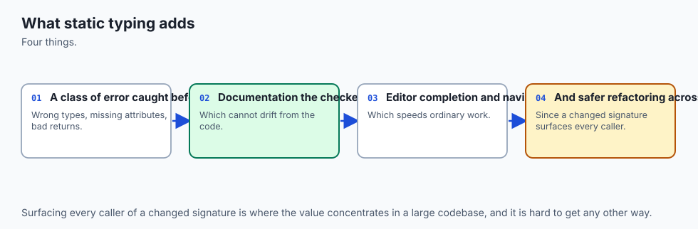
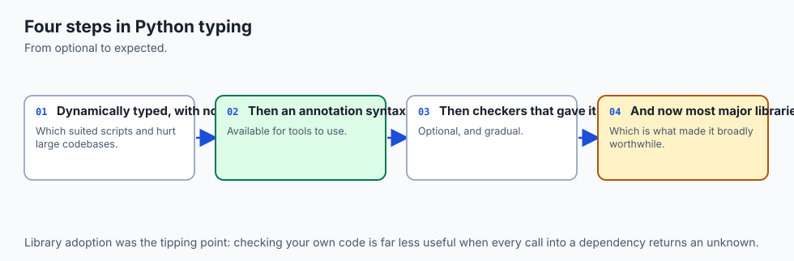
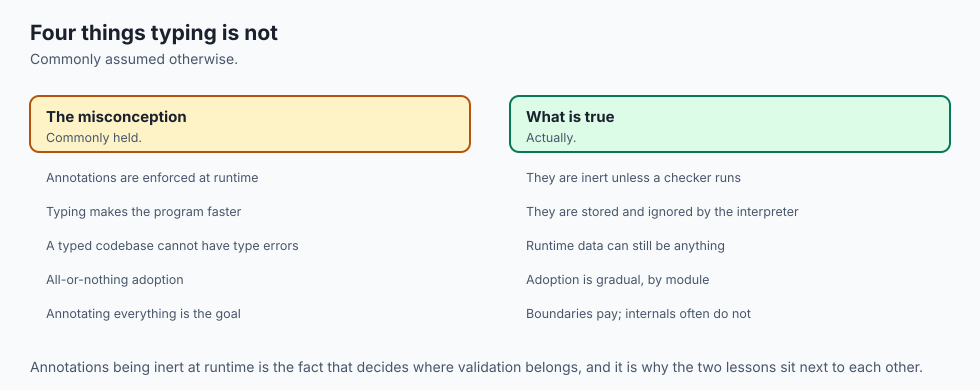
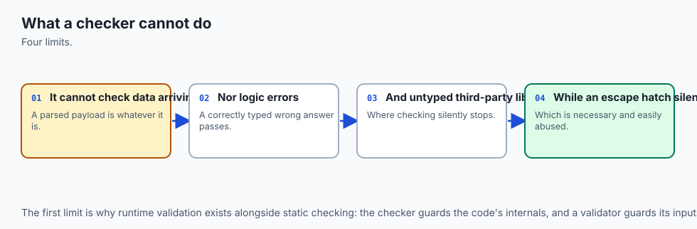
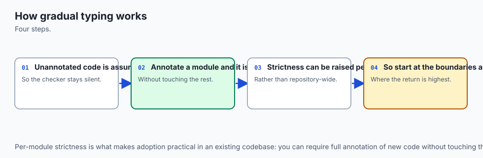
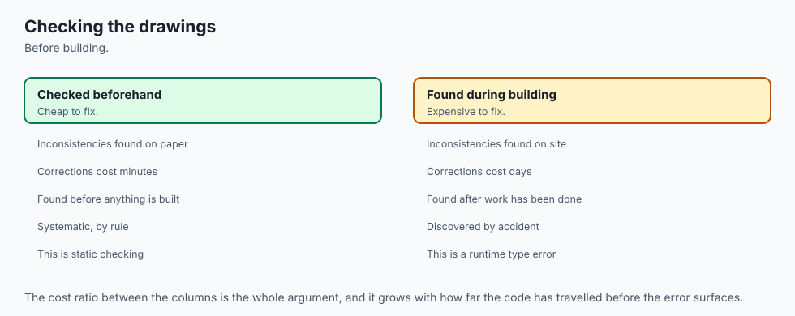
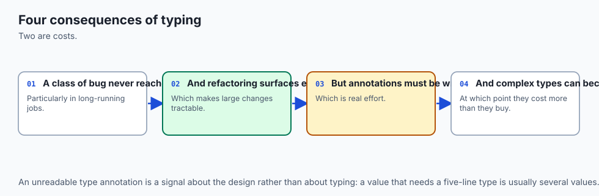
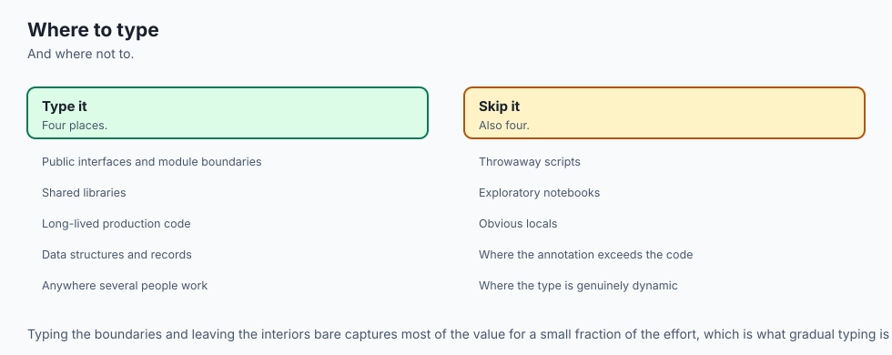

## Why this matters

Six days ago, on Day 69, this course made you a promise and then had to admit it could not keep it yet. That lesson taught you type annotations — `score: float`, `def find(name: str) -> Model | None`, `list[int]`, `dict[str, float]` — and then proved, with a real run, that Python stores every one of them in `__annotations__` and never once compares a value against them.

A function annotated to return an integer returned the string `'abab'` and nothing anywhere objected. The lesson said plainly that the point of an annotation is that a *separate program* reads it, and then it had to stop, because no such program was installed on the machine that lesson was written on. It refused to quote output it had not produced.

Today that program is installed. **mypy 2.3.0 (compiled: yes)**, verified on this machine on 19 July 2026 alongside Python 3.14.0. Every line of checker output in this lesson is a real capture from a real run, and today is the payoff to Day 69: you wrote the labels, and now you hire someone to read them.

Here is why that is worth a day of your life rather than a paragraph. You have just spent four days — Days 71 to 74 — learning to write tests. You can write a green suite. What no one has told you yet is the shape of the hole in a green suite, and it is a specific, measurable shape: **a test only exercises the paths it walks.** Today's lab hands you a module with eight passing tests and two real bugs.

The tests are not lazy or fake; they are perfectly reasonable tests. They simply never call the function with the argument that breaks it. mypy reads every path in the file, in about a second, and finds both:

```text
$ python3 -m mypy starter/catalog.py
starter/catalog.py:63: error: Item "None" of "Model | None" has no attribute "name"  [union-attr]
starter/catalog.py:63: error: Item "None" of "Model | None" has no attribute "context_tokens"  [union-attr]
starter/catalog.py:85: error: Argument 2 to "estimate_cost" has incompatible type "float"; expected "int"  [arg-type]
Found 3 errors in 1 file (checked 1 source file)
```

The first two are the same bug: a lookup that can return `None`, used as though it never could. That single bug class — **the missing `None` check** — is the most valuable thing a type checker catches, and it is precisely the bug tests miss most often, because the `None` case is the case nobody thought to write a test for. If they had thought of it, they would have handled it.

The concrete stakes for your AI work are these. Model pipelines are made of lookups that can fail: a model name that is not in your registry, a key absent from a JSON response, a cache miss, an optional field a provider stopped sending. Every one of those is an `X | None` flowing through code that assumes it is an `X`.

In a batch job over ten thousand records, the one record that trips it fails at record 8,417, forty minutes in, and you rerun the whole thing. The checker costs a second and no money at all — mypy is free and open source — and it tells you before you press run. That trade is the entire argument, and it is not close.

## The idea in plain language



Think about a building — and hold this image, because the whole lesson runs on it.

Before anyone breaks ground, the drawings go to a **plan check**. A person who will never lift a brick sits with the architect's drawings and reads them against a code of practice. They check that the beam carrying the second floor is specified for the load written above it. They check that the corridor is wide enough for the doors that open onto it. They check that every component named in the drawing exists and has published dimensions. They find contradictions *on paper* — a joist labelled to span four metres that the manufacturer's data sheet says spans three — and they hand the drawing back before a single piece of timber is cut.

Then, separately, the **builders** turn up and build what is drawn. The builders do not read the code of practice. They do not check the joist against its data sheet. If the drawing says four metres, they cut four metres, and the floor sags in year three.

That is the two-worlds model, and it is the single idea of today. Your annotated Python file is the drawing. mypy is the plan check: it reads the drawing, never runs it, and reports contradictions between what you wrote down and what your code actually does. The Python interpreter is the builders: it executes what is written, evaluates each annotation once into a dictionary nobody consults, and builds whatever you drew. The two never talk to each other. **Running mypy changes nothing about how your program behaves. Not running mypy changes nothing either.** The entire value of the check is that a human reads the report and edits the drawing.

Everything else today is detail on that picture. Typeshed is the catalogue of published data sheets for every standard component. A stub file is the data sheet for a component whose insides you cannot see. `Any` is a region of the drawing stamped *"by others"* — the plan checker skips it, and skips everything that connects to it.

Narrowing is a note on the drawing that says *"if this door is absent, stop here"*, which lets the checker prove that the rooms beyond it are reachable. And the honest limits are the ones any plan check has: it will not tell you the client wanted three bedrooms, that the soil is bad, or that the building is ugly. For that you need the site — which is what your tests are.

## Historical background



Python was born dynamically typed and its designers spent two decades declining to change that. What eventually shifted the argument was not elegance but scale: by the late 2000s there were Python codebases of millions of lines, and navigating them meant reading function bodies to learn what a parameter was supposed to be. Several teams had independently invented comment conventions to record types, and none of them were machine-checkable.

The first serious answer came before the standard did. **Jukka Lehtosalo** began mypy as doctoral work at the University of Cambridge, initially as a separate language with Python-like syntax, and then re-aimed it at Python itself. The decision to write types in Python's own annotation syntax rather than in comments or a new dialect is the reason the whole ecosystem looks the way it does today.

**PEP 484 — Type Hints** made it official. Authored by **Guido van Rossum, Jukka Lehtosalo and Łukasz Langa**, it was created in 2014 and shipped with Python 3.5. Two of its decisions matter more than everything else in it:

1. **The annotations are for offline tools, and Python will not enforce them at runtime.** This was not a compromise or a first step toward enforcement. It is stated in the PEP as the design. That single sentence is why Day 69's runtime demonstration worked, and why today needs a separate program at all.
2. **Typing is gradual.** You may annotate as much or as little as you like. An unannotated function is simply not checked, and annotated and unannotated code interoperate freely. Without this, no existing codebase could ever have adopted types, because the only migration available would have been to annotate every line before anything worked.

PEP 484 essentially standardised what mypy had already proven workable, which is why mypy is called the reference implementation: the tool came first and the specification described it.

The years since have been steady accretion rather than upheaval. **PEP 526** (Python 3.6) added variable annotations — the `score: float = 0.0` form that `@dataclass` later read. **PEP 544** (Python 3.8) added `Protocol`, giving structural typing a written form. **PEP 585** (Python 3.9) let you write `list[int]` instead of importing `List`. **PEP 604** (Python 3.10) added the `X | None` spelling for what used to be `Optional[X]`.

**PEP 561** defined how a third-party package declares that it ships type information, via a marker file named `py.typed`. And **typeshed**, the community repository of type stubs for the standard library and for packages that do not ship their own, grew into the shared asset that makes any of this useful — every checker reads it.

The version this lesson was verified against is mypy 2.3.0, which reports itself as `mypy 2.3.0 (compiled: yes)`. That parenthetical means the binary was compiled with mypyc — mypy compiled by itself — which is why it is fast enough to run on every save.

## What it is — and what it is not



mypy is a program that reads Python source files and reports where an expression contradicts the annotations around it. That is the whole job description. The misconceptions are expensive enough to list, and several of them are the reason people bounce off type checking and never come back.

| Common misconception | The reality |
| --- | --- |
| "mypy runs my code to check it." | It never executes a line. It parses your files into syntax trees and reasons about them. This is why checking a file is safe even if running it would not be, and why it cannot know anything about the data that will actually arrive. |
| "`mypy` passing means my code is correct." | It means values flow where their annotations allow. A function that computes the wrong answer with perfectly consistent types passes cleanly. |
| "A clean run means mypy checked everything." | On unannotated code, a clean run means mypy checked *nothing*. The lab's `untyped_first_run.py` is entirely unannotated and reports `Success: no issues found in 1 source file`. Under `--strict` the same unchanged file reports six errors. |
| "Adding types will slow my program down." | Annotations are evaluated once at definition time and then ignored. mypy is a separate command that runs on your machine and never ships with your program. |
| "I have tests, so I do not need a checker." | They catch different bug classes. The lab's suite is green over a module with a crash-on-`None` bug, because no test passes an unknown name. |
| "I have a checker, so I do not need tests." | mypy cannot tell you that `total()` adds when it should multiply. Types constrain shape; tests constrain behaviour. |
| "`# type: ignore` fixes the error." | It hides the message. Which is occasionally right and usually a decision you should have to justify in a comment. |
| "`Any` means 'any type is fine here'." | It means "stop checking here", and the hole spreads to everything the value flows into. |
| "mypy only helps in huge codebases." | Its best return is per *boundary*, not per line — anywhere a value can be absent, or arrives from a file or a network. Small programs have those too. |
| "The error message text is the important part." | The bracketed **error code** is. Messages get reworded between releases; codes are the stable, searchable, configurable identity of the check. |

## Why it was created and what problems it solves



**It exists because PEP 484 deliberately left the enforcement out.** Given a language that records your claims and never checks them, the claims are worth exactly as much as the tool that reads them. mypy is that tool, and the fact that annotations were designed *for* it rather than the other way round is why the fit is so clean.

**It solves the `None` problem, which is the big one.** Tony Hoare, who introduced the null reference to ALGOL W in 1965, later called it his billion-dollar mistake. Python's version is `None`, and the way it bites is always the same: a function that can return nothing, used by a caller who did not think about that case. Look at the lab's bug, which is four lines long:

```python
def find_model(name: str) -> Model | None:
    return CATALOG.get(name)


def describe(name: str) -> str:
    model = find_model(name)
    return f"{model.name}: {model.context_tokens:,} token context"
```

`find_model` is honest — `dict.get` returns `None` for a missing key, and the annotation says so. `describe` reads two attributes off the result without asking. Eight tests pass, because every test uses a name that exists. mypy reports it twice, once per attribute, both on line 63, both `[union-attr]`. **The annotation was already correct. What was missing was the reader.**

**It solves the "what does this function actually want?" problem.** Before annotations, learning that a function took a list of records rather than one record meant reading its body or trusting a docstring. A docstring rots silently; an annotation cannot, because a tool compares it against the code.

**It makes silent type drift loud.** Day 69's demonstration — a function annotated `-> int` returning `'abab'` — is the small version. The large version is a value that is a `str` in one module, gets `float()`-ed somewhere in the middle, and arrives as a number in a comparison that used to be a string comparison. Nothing raises. The result is just quietly different.

**It gives you a gate you can automate.** mypy exits non-zero when it finds errors, which means it can be a step in a build the same way a test run is. That is what Day 77 assembles, and it is the difference between a check you sometimes remember and a check that cannot be skipped.

**And it makes generated code reviewable.** This is the modern reason, and it is honest to name it. When a lot of code in a project was not written keystroke by keystroke by the person reviewing it, the reviewer's leverage is not reading every line — it is the gates. A typed signature is a machine-checked statement of what a function accepts and returns, and it holds whether the body was typed by a person or produced some other way.

## How it works



![Diagram: the architecture of a type check — mypy reads your annotated source, typeshed's bundled stubs for the standard library, whatever type information third-party packages ship as a py.typed marker or a separate stub package, and the settings in the tool.mypy table, then parses each file into a syntax tree, builds the import graph and loads the stubs it needs, and infers a type for every expression before comparing each call, return and assignment against what the annotations promise, producing a report of file, line, message and bracketed error code with a non-zero exit status — while the entirely separate runtime path has the interpreter evaluate each annotation once into __annotations__ and never compare a value against one, so the program behaves identically whether or not the checker ever ran](./assets/type-checking-architecture.svg)

### The three stages

**Parse.** Every file mypy is asked about is read as text and turned into a syntax tree. Nothing is imported in the runtime sense, nothing is executed, no module-level code runs. A file that would delete your home directory on import is perfectly safe to type-check.

**Build.** mypy follows the imports. For each imported module it needs type information from somewhere: your own annotated source, a bundled **typeshed** stub for anything in the standard library, a `py.typed` marker inside a third-party package that ships its own annotations, or a separate stub-only package. If it can find none of these, it says so — a real capture:

```text
$ python3 -m mypy missing_import.py
missing_import.py:1: error: Cannot find implementation or library stub for module named "definitely_not_a_real_package_xyz"  [import-not-found]
missing_import.py:1: note: See https://mypy.readthedocs.io/en/stable/running_mypy.html#missing-imports
Found 1 error in 1 file (checked 1 source file)
```

This stage is why mypy writes a `.mypy_cache/` directory. Re-checking a large project from scratch every time would be slow, so it caches the built representation of each module and rebuilds only what changed.

**Infer and check.** This is the part people underestimate. mypy does not only compare your annotations against each other — it works out a type for *every* expression, including hundreds you never annotated. Write `total = 0` and mypy knows `total` is an `int`. Write `names = [m.name for m in models]` where `models` is `list[Model]` and `Model.name` is a `str`, and it knows `names` is `list[str]` without you saying a word. Then it checks: does every call pass arguments the parameters accept, does every `return` produce what the signature promised, does every assignment put a compatible value in the name, does every attribute access exist on the thing you are accessing it on.

The output is a report and an exit status. Non-zero on errors, zero on success. That is the entire interface.

### Reading an error properly

Every mypy error has four parts, and beginners read them in exactly the wrong order.

```text
starter/catalog.py:85: error: Argument 2 to "estimate_cost" has incompatible type "float"; expected "int"  [arg-type]
```

- **`starter/catalog.py`** — the file.
- **`85`** — the line. Note carefully: this is the line where the *contradiction* appears, which is usually the call site, not the definition. The definition of `estimate_cost` is fine. Line 85 is where something wrong was handed to it.
- **`Argument 2 to "estimate_cost" has incompatible type "float"; expected "int"`** — the prose. Genuinely helpful, and genuinely unstable: message wording changes between mypy releases.
- **`[arg-type]`** — the **error code**, and the part that matters most.

The code matters more than the prose for four concrete reasons. It is **searchable** — pasting a whole message into a search engine finds your specific variable names; searching `mypy arg-type` finds the concept. It is **stable**, so a test suite or a script that greps for `[arg-type]` keeps working across releases, which is exactly why the lab's test suite asserts on codes and never on message text. It is **configurable**: you can enable, disable or escalate an individual code by name in your settings. And it is what a `# type: ignore` comment refers to — `# type: ignore[arg-type]` suppresses that code and nothing else.

Here are the five codes worth learning by name today, each with output captured from a real run of mypy 2.3.0 over a short file:

```python
# error_codes.py
from typing import Any


def label(score: float) -> str:
    return score


def setup() -> None:
    retries: int = 3
    retries = "three"


def caller() -> None:
    print(label("not a number"))


def loose(value: Any) -> str:
    return value.anything_at_all()
```

```text
$ python3 -m mypy error_codes.py
error_codes.py:7: error: Incompatible return value type (got "float", expected "str")  [return-value]
error_codes.py:12: error: Incompatible types in assignment (expression has type "str", variable has type "int")  [assignment]
error_codes.py:16: error: Argument 1 to "label" has incompatible type "str"; expected "float"  [arg-type]
Found 3 errors in 1 file (checked 1 source file)
```

Three errors from a five-function file — and read the fourth function again, because it is the most important thing on this page. `loose` takes an `Any`, calls a method on it that certainly does not exist, and declares it returns a `str`. **mypy said nothing about it.** We will come back to that.

| Error code | What it means | The typical cause |
| --- | --- | --- |
| `[arg-type]` | An argument does not match the parameter it was passed to | The wrong value reached a call, often after arithmetic changed its type |
| `[return-value]` | The value returned does not match the declared return type | The signature was updated and the body was not, or vice versa |
| `[assignment]` | A value was assigned to a name whose type does not allow it | A variable reused for a second purpose halfway down a function |
| `[union-attr]` | An attribute was accessed on a union where at least one member lacks it | The missing `None` check — the single most valuable catch |
| `[no-untyped-def]` | A function has no annotations (strict mode, or `disallow_untyped_defs`) | Code written before the module was typed |

### The type system, at the depth you need today

**Builtin generics.** `list[int]`, `dict[str, float]`, `tuple[int, int]`, `tuple[int, ...]`, `set[str]`. The container and what it contains. Older code imports capitalised `List` and `Dict` from `typing`; they mean the same thing and you should write the lowercase form in new code.

**`Optional[X]`, spelled `X | None`.** This is the centrepiece, so give it a paragraph rather than a line. `X | None` says the value is either an `X` or nothing. That is not a weakness in a signature — it is the signature being honest. `dict.get` returns `None` for a missing key; a database lookup returns nothing when the row is absent; a regular-expression match returns `None` when it does not match; a configuration option is present or it is not.

The value of writing `X | None` down is that the checker then **refuses to let you forget the second case**, at every single use, forever. There is no other tool in your kit that does that. Tests cannot, because a test for the `None` case only exists if someone thought of the `None` case, and if they had thought of it they would have handled it. This is the asymmetry that makes type checking worth the trouble even in small programs.

**`Union`.** `str | list[str]` means either. `X | None` is just the most common union. Anything you do with a union has to be valid for every member, unless you narrow first.

**Narrowing.** Which is how you make unions usable, and gets its own section below.

**`Any`.** Not "some type" — **"stop checking here"**. This is the cautionary demonstration of the day and it deserves to be run, not just read. Two functions with the identical bug, differing only in a return annotation:

```python
# any_hole.py
from typing import Any


def strict_lookup(key: str) -> dict[str, int]:
    return {"a": 1}


def loose_lookup(key: str) -> Any:
    return {"a": 1}


def use_strict() -> None:
    print(strict_lookup("a").total_count)


def use_loose() -> None:
    print(loose_lookup("a").total_count)
```

```text
$ python3 -m mypy any_hole.py
any_hole.py:13: error: "dict[str, int]" has no attribute "total_count"  [attr-defined]
Found 1 error in 1 file (checked 1 source file)
```

One error, not two. Line 13 is caught; line 17 is the *same bug* and is not mentioned. Both will raise `AttributeError` the moment they run. `Any` did not make line 17 correct — it made it invisible. And the hole is not local: anything you get out of an `Any` is itself `Any`, so it propagates through every variable it touches until something re-annotates it. The lab makes you prove this yourself with `starter/any_demo.py`, where changing one return annotation to `Any` takes a genuine `[union-attr]` error to `Success: no issues found in 1 source file` while the code still raises `AttributeError: 'NoneType' object has no attribute 'upper'` at runtime.

**`TypeVar` and generic functions.** `Any` forgets; a `TypeVar` remembers. A type variable is a placeholder meaning "whatever type came in, that same type goes out":

```python
T = TypeVar("T")


def first_or(items: list[T], fallback: T) -> T:
    return items[0] if items else fallback
```

Call it with `list[int]` and an `int` and mypy knows the result is an `int`. Call it with `list[str]` and a `str` and it knows the result is a `str`. Annotate the same function with `Any` and you get a function that accepts anything and tells you nothing.

**`Protocol` and structural typing.** A `Protocol` describes a *shape*, and anything with a matching shape satisfies it — no inheritance, no registration, no import relationship at all. This is the typed form of duck typing, and it pairs directly with what you built yesterday. Day 74 made code testable by **injecting** its dependencies: pass in the clock, pass in the repository, so a test can pass a fake. The obvious question that raises is how you annotate the parameter. Making both the real clock and the fake clock inherit from a shared base class works, but it forces the test double to know about a hierarchy. A `Protocol` does it without any of that:

```python
class Clock(Protocol):
    def now(self) -> float: ...


class FrozenClock:          # inherits from nothing, mentions Clock nowhere
    def __init__(self, value: float) -> None:
        self.value = value

    def now(self) -> float:
        return self.value


def stamp(clock: Clock, message: str) -> str:
    return f"[{clock.now():.1f}] {message}"
```

`FrozenClock` satisfies `Clock` by having the right method. And when it does not, mypy explains exactly which member is wrong — a real capture, from a `BrokenClock` whose `now` returns a string:

```text
tour_errors.py:44: error: Argument 1 to "stamp" has incompatible type "BrokenClock"; expected "Clock"  [arg-type]
tour_errors.py:44: note: Following member(s) of "BrokenClock" have conflicts:
tour_errors.py:44: note:     Expected:
tour_errors.py:44: note:         def now(self) -> float
tour_errors.py:44: note:     Got:
tour_errors.py:44: note:         def now(self) -> str
```

**`Literal`.** Pins a value to a fixed set of constants. A typo becomes an error rather than a shrug:

```text
tour_errors.py:10: error: Argument 1 to "search" has incompatible type "Literal['sematic']"; expected "Literal['semantic', 'keyword']"  [arg-type]
```

**`TypedDict`.** For JSON-shaped data you need to keep as a dict, it says which keys exist and what each holds. Misspell one and you get both halves of the story at once:

```text
tour_errors.py:18: error: Missing key "passed" for TypedDict "RunRecord"  [typeddict-item]
tour_errors.py:18: error: Extra key "passsed" for TypedDict "RunRecord"  [typeddict-unknown-key]
```

**`Final`.** Says a name is never rebound. `MAX_RETRIES: Final = 3`, and then:

```text
narrowing.py:4: error: Cannot assign to final name "MAX_RETRIES"  [misc]
```

**`NewType`.** Makes a distinct type out of an existing one, so two things that are both strings stop being interchangeable. `UserId = NewType("UserId", str)` and `SessionId = NewType("SessionId", str)` are both `str` at runtime and different types to mypy, which is how you catch an argument-order mistake a `(str, str)` signature could never see:

```text
tour_errors.py:28: error: Argument 1 to "audit" has incompatible type "SessionId"; expected "UserId"  [arg-type]
tour_errors.py:28: error: Argument 2 to "audit" has incompatible type "UserId"; expected "SessionId"  [arg-type]
```

**`cast`, with a warning.** `cast(str, value)` asserts a type to the checker and does **nothing at runtime** — no check, no conversion, no cost, no safety. It is you telling the checker to believe you. Sometimes you genuinely know something it cannot, and then a cast plus a comment explaining what you know is the right call. But reach for `isinstance` first every time, because `isinstance` narrows *and* checks, and a cast that turns out to be wrong fails somewhere else entirely, far from the lie.

### Narrowing: how a guard teaches the checker

![Flowchart: one str or None value moving through two versions of the same function — both begin with the checker knowing only that name is str or None and therefore refusing string methods on it; on the unguarded path the function goes straight to name.upper() and the checker reports Item None of str or None has no attribute upper with the error code union-attr on that exact line, the use rather than the definition; on the guarded path an if name is None early return removes one possibility, so from the next line the checker knows name is str, accepts name.upper(), and reports success — with a closing note that assert isinstance and an early raise narrow in exactly the same way](./assets/type-narrowing-flow.svg)

If `X | None` is the most valuable annotation, **narrowing** is the technique that makes it liveable. mypy follows the control flow of your function and updates what it knows about each name as it goes. Consider these two functions in one file:

```python
def greet(name: str | None) -> str:
    return name.upper()


def greet_guarded(name: str | None) -> str:
    if name is None:
        return "(anonymous)"
    return name.upper()
```

The real output names only the first:

```text
narrowing.py:8: error: Item "None" of "str | None" has no attribute "upper"  [union-attr]
```

`greet_guarded` is silent. Nothing about the annotation changed. What changed is that the `if name is None: return ...` **removed a possibility**, and from the line after it there is only one member of the union left, so `.upper()` is fine. That is narrowing, and it is worth being precise about what just happened: you did not write anything for the checker's benefit. You wrote the case you had forgotten. The checker's contribution was noticing it was missing.

The forms you will use constantly:

- **`if x is None: return`** — the early return. Handles the case and narrows everything below it.
- **`if x is None: raise ValueError(...)`** — same narrowing, when absence is genuinely an error.
- **`if not isinstance(raw, dict): raise ...`** — the boundary check. This is how you turn parsed JSON into something the checker will let you use, and it is the fix the lab's `load_settings` applies.
- **`assert isinstance(x, str)`** — narrows in one line. Use it where you can genuinely justify the assumption; remember that `assert` statements are removed when Python runs with `-O`, so an assert is a checker aid and a development check, never a validation of untrusted input.
- **`if x is not None and x.startswith("m")`** — `and` narrows within a single expression, left to right.

The lab's fix to bug A is one `if`, three lines, and it makes two `[union-attr]` errors disappear *and* gives the unknown-model case real behaviour instead of a crash. That is the pattern to internalise: the fix a checker asks for is almost always a fix a user would have wanted.

### Configuration in `pyproject.toml`

Command-line flags are how you experiment. A configuration file is how a project actually works, because it makes the settings the same for you, your colleagues, your editor and your build. mypy reads a `[tool.mypy]` table from `pyproject.toml`:

```toml
[tool.mypy]
python_version = "3.10"
strict = true
disallow_untyped_defs = true
warn_return_any = true
warn_unused_ignores = true
warn_unreachable = true
show_error_codes = true

[[tool.mypy.overrides]]
module = "legacy_importer.*"
disallow_untyped_defs = false
warn_return_any = false

[[tool.mypy.overrides]]
module = "some_untyped_dependency.*"
ignore_missing_imports = true
```

| Setting | What it does | Why you want it |
| --- | --- | --- |
| `python_version` | Which version's rules to check against | Stops you using syntax your deployment target does not have |
| `strict` | A bundle switching on roughly a dozen individual flags | The setting to aim at; get there module by module |
| `disallow_untyped_defs` | Every function must be annotated | Without it, an unannotated function's body is not checked at all, so a codebase can drift back to unchecked while the run stays green |
| `warn_return_any` | Returning `Any` from a function that promises a real type is an error | Catches `json.load()` flowing straight out of a loader — a very common real bug |
| `warn_unused_ignores` | An ignore comment that no longer suppresses anything is an error | The only thing that stops ignores accumulating for years |
| `warn_unreachable` | Reports code the checker can prove never runs | Usually means a narrowing guard is wrong |
| Per-module `[[tool.mypy.overrides]]` | Different settings for named modules | The adoption mechanism: strict everywhere, with a shrinking list of named exceptions |

That last row is the important one and it is easy to skim past. A per-module override list checked into your repository is a **work queue that cannot be forgotten**, because it is visible in a file everyone reads. An override with a comment saying who will remove it and roughly when is honest engineering. An override with no comment is a place where checking quietly stopped.

### `# type: ignore`, used responsibly

Sometimes mypy is wrong, or right about something you cannot fix today. The escape hatch is a comment, and there is one rule: **always carry the code.**

Write `# type: ignore[arg-type]`, never a bare `# type: ignore`. A bare ignore suppresses every error on that line forever, including the completely different error that appears there next year. A coded ignore suppresses exactly one thing, and mypy will tell you when you got the code wrong rather than silently obeying:

```text
$ python3 -m mypy ignores.py
ignores.py:2: error: Incompatible return value type (got "float", expected "str")  [return-value]
ignores.py:2: note: Error code "return-value" not covered by "type: ignore[arg-type]" comment
Found 1 error in 1 file (checked 1 source file)
```

That note is mypy being an excellent colleague: it noticed you were trying to silence something and told you that you silenced the wrong thing.

Then there is rot. An ignore written for a real problem outlives the problem. The code gets fixed, the library ships stubs, the signature changes — and the comment stays, quietly suppressing nothing, and nobody dares delete it because nobody knows whether it still does something. `warn_unused_ignores` is the cure, and it is not subtle about it:

```text
$ python3 -m mypy --warn-unused-ignores ignores.py
ignores.py:2: error: Unused "type: ignore" comment  [unused-ignore]
ignores.py:2: error: Incompatible return value type (got "float", expected "str")  [return-value]
ignores.py:2: note: Error code "return-value" not covered by "type: ignore[arg-type]" comment
ignores.py:10: error: Unused "type: ignore" comment  [unused-ignore]
Found 3 errors in 1 file (checked 1 source file)
```

Line 10's ignore was suppressing nothing at all, and now you know.

### Typing third-party code

Your code is not the only code mypy reads. When you `import` something, it needs type information for it, from one of four places:

1. **typeshed** — the community-maintained collection of stub files bundled with mypy, covering the entire standard library. This is why `json.load` is known to return `Any` and `pathlib.Path.read_text` is known to return `str` without you doing anything.
2. **The package itself.** A package that ships annotations and includes a `py.typed` marker file (the convention from PEP 561) is used directly.
3. **A stub-only package.** Some libraries publish their annotations separately as `.pyi` files in a companion package, usually named `types-something`. A stub file is a header: signatures and no bodies, exactly like a manufacturer's data sheet for a component you cannot open.
4. **Nothing.** Then you get `[import-not-found]` or `[import-untyped]`, and you have a decision to make.

The lazy answer to (4) is `--ignore-missing-imports`, and it does work:

```text
$ python3 -m mypy --ignore-missing-imports missing_import.py
Success: no issues found in 1 source file
```

Be careful with that `Success`. Silencing the import does not give mypy types for the package — everything from it becomes `Any`, so every value flowing out of that library is unchecked, along with everything downstream. Use it *per module* in your overrides table, after checking that no stub package exists, with a comment saying what you checked. Applying it globally is how a project ends up with a green checker and no checking.

## An everyday analogy



Hold the building plan check all the way through.

**The drawings are your source with its annotations.** Dimensions written on a drawing are exactly annotations: a claim, in a standard notation, about what a thing is. They are useful to every reader and they do not, by themselves, cut anything to length.

**The plan checker is mypy.** A separate person, hired separately, who reads the drawing and never visits the site. They work through it against a code of practice and hand back a list: *sheet 4, grid line C, this joist is specified to span further than its data sheet allows.* Sheet, grid line, description, and — this is the error code — the clause number of the rule that was broken. Experienced people cite the clause, because the clause is the same next year when the wording of the description has changed.

**The builders are the Python interpreter.** They build what is drawn. They do not read the code of practice, they do not check joists against data sheets, and they will build a floor that sags because the drawing said so. This is the two-worlds model, and it is why running your program tells you nothing about whether the plan check would pass, and vice versa.

**Typeshed is the catalogue of published data sheets** for every standard component — every steel section, every fastener, everything in the standard library. `py.typed` is a manufacturer saying "our published dimensions are trustworthy, use them". A stub-only package is somebody else measuring a manufacturer's component and publishing the data sheet the manufacturer never wrote.

**Gradual typing is a partially dimensioned drawing.** You are allowed to submit one. The plan checker checks the parts you dimensioned and skips the rest — which is exactly why a clean report on an undimensioned drawing means nothing at all, and exactly why `disallow_untyped_defs` exists.

**`Any` is a region stamped "by others".** The plan checker's eye slides straight over it, and over everything that connects to it. The stamp is sometimes correct and honest — a specialist subcontractor really is designing that part. It is much more often a way of making a difficult question go away.

**Narrowing is a note on the drawing.** *"If the survey shows rock at this level, stop and revise."* Once that note is there, the checker can follow the logic and confirm the beam beyond it is only ever built in the case where it works.

**The configuration file is which edition of the code of practice applies**, plus the schedule of legacy wings that are exempt. Written down, visible, and shrinking — or not written down, and then nobody knows what was checked.

**And the limits are a plan check's limits.** It will not tell you the client wanted three bedrooms and you drew two. It will not tell you the soil is bad. It will not tell you the building is ugly. For those you need the site, the survey and the client — which, in your project, are your tests, your data, and the person who asked for the thing. Where the analogy needs care: a plan checker can occasionally spot that a room labelled "bedroom" is too small to be one. mypy cannot. A `str` that must be an email address is, to mypy, exactly as good as any other `str`.

## Examples in practice

**A registry lookup that can miss.** The canonical shape, and the one you will write hundreds of times:

```python
def load_model_config(name: str) -> ModelConfig:
    config = REGISTRY.get(name)
    if config is None:
        raise KeyError(f"unknown model: {name!r}")
    return config
```

The guard does three jobs at once: it gives the caller a good error message, it narrows the type for everything below, and it satisfies the checker. Three jobs, one `if`.

**A parsing boundary, checked rather than merely annotated.** This is the fix the lab applies to `load_settings`, and it is the pattern for every piece of data that comes from outside your program:

```python
def load_settings(path: str) -> dict[str, float]:
    with open(path, encoding="utf-8") as handle:
        raw: object = json.load(handle)
    if not isinstance(raw, dict):
        raise ValueError(f"{path}: expected a JSON object at the top level")
    settings: dict[str, float] = {}
    for key, value in raw.items():
        if not isinstance(value, (int, float)) or isinstance(value, bool):
            raise ValueError(f"{path}: setting {key!r} is not a number")
        settings[str(key)] = float(value)
    return settings
```

Three things are happening. Binding to `raw: object` throws away the `Any` that `json.load` returns, so the checker starts caring again. The `isinstance` checks narrow, so the loop is allowed. And the `float(value)` conversion is the **value** check that no type system can do for you. Without the middle two lines, mypy under `warn_return_any` says `Returning Any from function declared to return "dict[str, float]"  [no-any-return]` — a promise you had not kept.

**A `Protocol` for an injected dependency, straight from Day 74.** Yesterday you injected a clock so tests could freeze time. Today you can type the parameter without making the fake inherit anything:

```python
class Repository(Protocol):
    def get(self, key: str) -> Record | None: ...
    def save(self, record: Record) -> None: ...


def sync(source: Repository, target: Repository, key: str) -> bool:
    record = source.get(key)
    if record is None:
        return False
    target.save(record)
    return True
```

Both your real repository and your in-memory test double satisfy `Repository` by having those methods. Note the `Record | None` return, and note that the `if record is None: return False` is what makes `target.save(record)` legal — the same narrowing again.

**A typed function is most of a tool definition.** Look at this signature:

```python
def search_documents(query: str, top_k: int = 5, mode: Literal["semantic", "keyword"] = "semantic") -> list[str]:
    ...
```

Read what is already written down: three parameters, their names, their types, which are required, which have defaults, and one of them restricted to two exact strings. That is a machine-readable description of what this function accepts. Later in this course, when a model is allowed to call your functions, the interface it is given is a schema of precisely this information — parameter names, types, requiredness, allowed values.

A well-typed signature is not *analogous* to a tool definition; it is most of one, already written, and the libraries that do this job read your annotations to build it. `Literal` in particular earns its keep here, because "one of these two strings" is a constraint a plain `str` cannot express to anybody, human or otherwise.

**A `TypeVar` in a real helper:**

```python
def batched(items: list[T], size: int) -> list[list[T]]:
    return [items[i:i + size] for i in range(0, len(items), size)]
```

`batched(prompts, 8)` gives `list[list[str]]`; `batched(records, 8)` gives `list[list[Record]]`. The checker tracks it through; `Any` would have thrown it away.

## Implications: security, privacy, performance, scalability, and cost



**Security — the honest version, in two halves.** The first half is that type checking is a *safe operation*. mypy reads your source and never executes it, so checking an unfamiliar file cannot run its module-level code. The second half is more important and is the one people get wrong: **a type is a claim about your source, never about your data.** `def send(to: str) -> None` is satisfied by `send("not an email")`, by `send("'; DROP TABLE users; --")`, and by a filename with `../../` in it. mypy will not blink at any of them.

Types constrain *shape*; only a runtime check constrains *value*. Two settings are worth naming as security-relevant because they turn checking off silently: `Any`, which un-checks everything downstream of it, and `--ignore-missing-imports`, which makes an entire third-party package unchecked. Both deserve a comment saying why. And nothing about running mypy sends your code anywhere: it runs locally, needs no account, no key, and no network after installation.

**Privacy.** The one thing worth knowing is that mypy writes a `.mypy_cache/` directory containing a processed representation of your source. Exclude it from version control — the lab's cleanup step removes it — and be aware that it exists on disk next to your project.

**Performance.** Nothing about your program's runtime changes; annotations are evaluated once at definition time and never consulted. The cost is the checker's own runtime, on your machine, and it is small: a lab-sized file checks in well under a second, and the `(compiled: yes)` in `mypy 2.3.0 (compiled: yes)` means the tool itself was compiled with mypyc, which is what makes it fast enough for a save hook. Large projects use the incremental cache; the first run is the slow one.

**Scalability.** This is where checking earns its keep disproportionately. A test verifies the paths it walks; a checker verifies every call site of a changed function at once. Rename a parameter or change a return type in a project with four hundred call sites and the checker enumerates every one that no longer fits, in seconds, exhaustively. There is no manual process that competes with that, and there is no test suite that does it either unless every one of those call sites happens to be covered.

**Cost.** Free. mypy is open source under the MIT licence, per the project's own documentation, and costs nothing personally or commercially. The real cost is a habit and a small amount of friction while you adopt it — and the thing you buy is the specific bug class that is most expensive to find later, because a `None` crash or a silently wrong type does not fail at the line that caused it.

## Alternatives: free, open source, and commercial

| Tool | What it is | Choose it when | Cost |
| --- | --- | --- | --- |
| **mypy** | The reference type checker, from the project PEP 484 grew out of | You want one authoritative answer for the whole codebase, and a build step that fails | Free, open source (MIT licence, per the project's documentation) |
| **Pyright** | A separate checker implementation from Microsoft, written in TypeScript | You want fast checking with strong inference, in an editor or on the command line | Free and open source |
| **Pylance** | The Visual Studio Code extension that runs Pyright for you as you type | You work in VS Code and want feedback on every keystroke | The extension is **proprietary**, but free to use |
| **ty** | A newer Python type checker from Astral, the makers of Ruff | You want to evaluate a newer entrant; check its own documentation for its current maturity before depending on it | Free, open source |
| **pyrefly** | A newer Python type checker from Meta | Same: worth evaluating, and worth reading its own documentation on readiness before adopting | Free, open source |
| **pydantic** | Runtime **value** validation built from the same annotations | Data arrives from outside your program and must be checked when it arrives | Free, open source |

**mypy — how, and when.** Install it, point it at a path, read the codes.

```bash
python3 -m pip install mypy
python3 -m mypy src/
python3 -m mypy --strict src/
```

Choose it as your project's authoritative checker and as a build gate, because it exits non-zero on errors and because its error codes are the ones the ecosystem's documentation and configuration are written around. It is the checker this course uses, and the one this lab pins at 2.3.0 so its captured output is exact.

**Pyright — how, and when.** Pyright is free and open source. It runs from the command line, and it is also the engine inside Pylance. Choose it when you want checking while you type — for most people that is where the habit actually sticks, because the feedback arrives before you have moved on. A common and entirely reasonable arrangement is Pyright in your editor and mypy in your build; they read the same annotations, so agreement is the normal case and disagreement is usually about a setting rather than about your code.

```bash
npx pyright src/
```

The precise licensing point, because it is often muddled: **Pyright itself is free and open source. The Pylance extension is proprietary software that is free to use.** Those are two different statements and both are true.

**ty and pyrefly — how, and when.** These are newer entrants, and the honest thing to do is describe them carefully rather than rank them. `ty` is a Python type checker from Astral, the team behind Ruff (which is tomorrow's lesson). `pyrefly` is a Python type checker from Meta. Both are free and open source, both aim at speed, and both are moving quickly.

This lesson deliberately quotes no version numbers, no benchmarks, and no readiness claims for either, because those would be out of date by the time you read this and because no run of either was performed on this machine. If you want to evaluate one, read its own documentation for its current state, run it beside mypy on a project you know, and compare what each reports. What transfers regardless of which you pick is everything in this lesson: the annotations are the same, `X | None` is the same, narrowing is the same, and the two-worlds model is the same.

**pydantic — how, and when, and the distinction that matters.** Day 70 already mentioned pydantic, and it is worth drawing the line sharply now, because "types" is doing two completely different jobs in these two tools.

mypy does **static type checking**: before you run, it reads your source and asks whether values flow where their annotations allow. It never sees a value. pydantic does **runtime value validation**: while you run, it takes actual data and checks it against a model, converting or raising as configured.

```python
from pydantic import BaseModel


class EvalRecord(BaseModel):
    prompt: str
    score: float


EvalRecord(prompt="2+2?", score="not a number")   # raises a validation error, at runtime
```

Two things follow. First, they are not alternatives — they are complements that happen to read similar declarations. mypy catches the missing `None` check in code you wrote; pydantic catches the malformed record in data you received. A serious project uses both, at different moments. Second, only pydantic can address the limit this lesson keeps returning to: a `str` that must be an email address. mypy cannot express that, ever, at any strictness setting. pydantic can, because it has the actual string in its hand.

## Comparison with related concepts

| Concept A | Concept B | Key difference |
| --- | --- | --- |
| Static type checking | Unit testing | The checker reads every path without running any; a test runs one path and checks the answer. Types constrain shape, tests constrain behaviour |
| mypy | The Python interpreter | mypy reads and never executes; the interpreter executes and never checks an annotation |
| `X \| None` | `X` | The union forces every use site to handle absence; the plain type quietly assumes it cannot happen |
| `Any` | `object` | `Any` disables checking — you may do anything with it. `object` stays checked — you may do almost nothing with it until you narrow |
| `Any` | `TypeVar` | `Any` forgets what came in; a `TypeVar` remembers it and carries it to the return type |
| `Protocol` | Base-class inheritance | Structural: satisfied by having the right methods. Nominal: satisfied by declaring the relationship |
| `isinstance` narrowing | `cast` | `isinstance` narrows *and* checks at runtime; `cast` narrows and does nothing at all at runtime |
| Error code | Error message | The code is stable, searchable and configurable; the message is prose that gets reworded between releases |
| `# type: ignore[code]` | bare `# type: ignore` | The coded form suppresses one thing and mypy tells you if you named the wrong one; the bare form suppresses everything on that line, forever |
| Default mode | `--strict` | Default mode skips unannotated functions entirely; strict makes missing annotations themselves an error |
| mypy | pydantic | Static checking of source before running, versus runtime validation of values while running |
| mypy | Ruff (tomorrow) | The checker asks whether types are consistent; a linter asks whether the code follows rules about style, imports and common errors |
| typeshed | `py.typed` | A community collection of stubs for code that ships none, versus a package declaring that its own annotations are usable |
| Type annotation | Docstring | Both document; only the annotation is machine-checked, so only the annotation cannot rot silently |

## When to use it — and when not to



**Use mypy on anything you will still be running in three months.** The specific places it pays best: any function that can return nothing, any code that parses external data, any module with more than a handful of callers, any library other people import, and any project where more than one person edits the code.

**Adopt it incrementally, because that is what gradual typing is for.** The migration that works looks like this. Install mypy and run it with default settings over your whole project; fix whatever it finds, which on unannotated code will be almost nothing. Add a `[tool.mypy]` table with `strict = true` and then add per-module overrides turning strictness *off* for every module that fails, so the run is green on day one. That override list is now your work queue, checked into the repository where nobody can forget it.

Delete entries one module at a time, annotating as you go, starting with the modules that have the most callers because those are where a wrong signature does the most damage. Put `mypy` in your build the moment the run is green, so the list can only shrink. What does **not** work is switching `strict = true` on globally in a large untyped codebase, staring at four thousand errors, and concluding that type checking is not for you.

**Do not use it as a substitute for tests, and do not let anyone tell you it is one.** State this plainly because it is the sentence to carry out of today: **types and tests catch different bug classes.** The lab is built to prove it in both directions. Eight tests pass over a module with a `None` crash waiting in it, because no test walks that path — tests missed it, mypy caught it.

And mypy reports `Success` on a function that computes a total by subtracting when it should add, because subtraction is perfectly type-correct — mypy misses it, a test catches it. A good project has both, and Day 77 is where you assemble them into a single gate that runs on every change.

**Skip it, or keep it light, on genuinely throwaway code**: a ten-line script you will run once, an exploratory notebook cell, a spike you intend to delete. Annotating those is real work for no return.

**Be honest about the limits, all of them.** mypy does not run your code, so it knows nothing about the data that will arrive. It cannot catch a wrong algorithm — a correct-looking function with the wrong formula passes cleanly. It cannot verify values: a `str` that must be an email, a `float` that must be a probability between zero and one, an `int` that must be positive. It cannot see anything behind an `Any`, and it cannot see anything at all inside a function you did not annotate unless you turn strictness on. And it is not a substitute for the four days of tests you just wrote.

**And here is the AI thread, which is more direct than it looks.** Two connections, both concrete. The first is about review. When a project contains a lot of code that a reviewer did not write line by line — and increasingly that describes ordinary work — the reviewer's leverage is not reading every character.

It is the gates: does it type-check, does it lint, do the tests pass. A typed signature is a machine-verified statement of what a function accepts and returns, and it holds regardless of how the body came to exist. That is why the "types and tests catch different bugs" point is not academic: they are two of the three gates that make unfamiliar code reviewable at all.

The second is about tool calling, and it is almost literal. Later in this course a model will be given a set of functions it is allowed to call, and the way it is told what each function accepts is a schema: parameter names, types, which are required, which have defaults, and which are restricted to a fixed set of values.

Look at that list and then look back at `def search_documents(query: str, top_k: int = 5, mode: Literal["semantic", "keyword"] = "semantic") -> list[str]`. Every item on the list is already there. A well-typed function is most of a tool definition, and the libraries that build those schemas do it by reading exactly the annotations you have been writing since Day 69. The habit you build today is not preparation for that work; it is the first half of it.

Tomorrow, Day 76, adds the third gate: Ruff, which mechanizes the readability judgements you made by hand on Day 61.

## The AI connection

- **Static typing catches a class of error before the code runs**, which is worth more in long
  jobs than short ones.
- **Types are checked documentation**, which does not drift the way comments do.
- **Gradual adoption works**: typing the boundaries captures most of the benefit.
- **Data pipelines benefit most**, because a wrong type propagates silently until something
  far away breaks.
- **A checker that runs in continuous integration** turns a convention into a gate.

## Knowledge check

Answer from memory before looking back.

1. Day 69 proved that Python stores annotations and ignores them. Given that, explain in one sentence what mypy actually does, and what changes about your program's behaviour when you run it.
2. A file with no annotations at all reports `Success: no issues found in 1 source file`. Why is that the most misleading result mypy can give you, and which single setting fixes it?
3. In `catalog.py:63: error: Item "None" of "Model | None" has no attribute "name"  [union-attr]`, name the four parts of the error, and give two reasons the code matters more than the prose.
4. Why is the missing `None` check the bug class where a checker most clearly beats a test suite? Your answer must explain why a test for that case usually does not exist.
5. Two functions contain the identical bug; one is annotated `-> dict[str, int]` and the other `-> Any`. mypy reports one error. Explain what `Any` did, and why the effect is not confined to that one function.
6. What does `if x is None: return` do for the checker, and why is it wrong to describe writing it as "adding code to please mypy"?
7. What is the difference between `# type: ignore` and `# type: ignore[union-attr]`, and what does `warn_unused_ignores` protect you from?
8. Name three bugs mypy cannot catch, and say which tool catches each.

## Hands-on exercise

Today's lab, **"Catch the Bug the Tests Missed"**, is the whole lesson in executable form. `starter/catalog.py` is fully annotated, ships with eight passing tests, and contains two real bugs that the suite never reaches. You run both tools over the same file, read the errors by their codes, fix the code, turn strictness up, and finish by proving mechanically that adding `Any` to one signature makes a caught error vanish while the code stays exactly as broken.

Install once, from the lab directory:

```bash
cd labs/sections/programming-with-python/day-075-static-typing-with-mypy
python3 -m venv .venv
.venv/bin/pip install -r requirements/requirements.txt
.venv/bin/mypy --version
.venv/bin/pytest --version
```

Then work the exercises in order:

```bash
# 0. What does a checker say about code with no annotations at all?
.venv/bin/mypy starter/untyped_first_run.py
.venv/bin/mypy --strict starter/untyped_first_run.py

# 1. Eight tests, all green, on the buggy module.
PYTHONPATH=starter .venv/bin/pytest -q starter/test_catalog.py

# 2. The same file, the other tool.
.venv/bin/mypy starter/catalog.py

# 3. Write down each error's file, line, message and code.
# 4-5. Fix bug A and bug B, re-running step 2 until it prints Success.
# 6. Turn strictness up and handle what it adds.
.venv/bin/mypy --strict starter/catalog.py

# 7. Prove the Any point yourself.
.venv/bin/mypy starter/any_demo.py

# The finished reference, at any point.
PYTHONPATH=examples python3 examples/demo.py
PYTHONPATH=examples python3 examples/typing_tour.py
.venv/bin/mypy --strict examples/catalog.py examples/typing_tour.py
.venv/bin/mypy --config-file examples/pyproject.toml examples/catalog.py

bash tests/run_tests.sh
```

### Expected output

Captured from a real run on the authoring machine — mypy 2.3.0 (compiled: yes), pytest 9.1.1, Python 3.14.0 — and fully deterministic apart from pytest's timing line.

The contrast the whole lab exists for, the same file through two tools:

```text
$ python3 -m pytest starter/test_catalog.py
........                                                                 [100%]
8 passed in 0.00s
(exit 0)

$ python3 -m mypy starter/catalog.py
starter/catalog.py:63: error: Item "None" of "Model | None" has no attribute "name"  [union-attr]
starter/catalog.py:63: error: Item "None" of "Model | None" has no attribute "context_tokens"  [union-attr]
starter/catalog.py:85: error: Argument 2 to "estimate_cost" has incompatible type "float"; expected "int"  [arg-type]
Found 3 errors in 1 file (checked 1 source file)
(exit 1)
```

What strict mode adds to that same unchanged file:

```text
$ python3 -m mypy --strict starter/catalog.py
starter/catalog.py:63: error: Item "None" of "Model | None" has no attribute "name"  [union-attr]
starter/catalog.py:63: error: Item "None" of "Model | None" has no attribute "context_tokens"  [union-attr]
starter/catalog.py:85: error: Argument 2 to "estimate_cost" has incompatible type "float"; expected "int"  [arg-type]
starter/catalog.py:88: error: Function is missing a type annotation  [no-untyped-def]
starter/catalog.py:103: error: Call to untyped function "format_price" in typed context  [no-untyped-call]
starter/catalog.py:117: error: Returning Any from function declared to return "dict[str, float]"  [no-any-return]
Found 6 errors in 1 file (checked 1 source file)
(exit 1)
```

And the result that surprises people most — a completely unannotated module under default settings, then the same file under `--strict`:

```text
$ python3 -m mypy starter/untyped_first_run.py
Success: no issues found in 1 source file
(exit 0)

$ python3 -m mypy --strict starter/untyped_first_run.py
starter/untyped_first_run.py:25: error: Function is missing a type annotation  [no-untyped-def]
starter/untyped_first_run.py:33: error: Function is missing a type annotation  [no-untyped-def]
starter/untyped_first_run.py:37: error: Function is missing a return type annotation  [no-untyped-def]
starter/untyped_first_run.py:37: note: Use "-> None" if function does not return a value
starter/untyped_first_run.py:38: error: Call to untyped function "load_prices" in typed context  [no-untyped-call]
starter/untyped_first_run.py:39: error: Call to untyped function "total" in typed context  [no-untyped-call]
starter/untyped_first_run.py:43: error: Call to untyped function "main" in typed context  [no-untyped-call]
Found 6 errors in 1 file (checked 1 source file)
(exit 1)
```

The fixed reference, clean under strict, with the suite still green:

```text
$ python3 -m mypy --strict examples/catalog.py examples/typing_tour.py
Success: no issues found in 2 source files
(exit 0)

$ python3 -m pytest examples/test_catalog.py
.........                                                                [100%]
9 passed in 0.00s
(exit 0)
```

### Validate your work

- [ ] `.venv/bin/mypy --version` prints `mypy 2.3.0 (compiled: yes)` and `.venv/bin/pytest --version` prints `pytest 9.1.1`.
- [ ] Before you change anything: the eight starter tests pass and exit 0, and `mypy starter/catalog.py` reports exactly three errors and exits 1.
- [ ] You can state, for each of those three errors, the file, the line and the code — without reading the message text. Two are `[union-attr]` and one is `[arg-type]`.
- [ ] After fixing bug A the `[union-attr]` errors are gone **and the tests still report `8 passed`** — proof that the fix touched nothing on any tested path.
- [ ] After fixing bug B, `mypy starter/catalog.py` prints `Success: no issues found in 1 source file`.
- [ ] `mypy --strict starter/catalog.py` adds `[no-untyped-def]`, `[no-untyped-call]` and `[no-any-return]`; after you annotate `format_price` and check the loaded object in `load_settings`, strict mode prints `Success` too.
- [ ] `mypy starter/any_demo.py` reports `[union-attr]`; after changing `lookup`'s return annotation to `Any` it prints `Success`, and the code still raises `AttributeError` when run. Nothing got safer.
- [ ] `mypy --config-file examples/pyproject.toml examples/catalog.py` passes, so you have run the checker from a real configuration file and not only from flags.
- [ ] `bash tests/run_tests.sh` ends with `33 checks, 0 failure(s).` and exits 0.

### Troubleshooting

**`mypy: command not found`.** The tool is installed inside the lab's virtual environment, not on your `PATH`. Use `.venv/bin/mypy`, or activate the environment first. The test suite finds it either way, and accepts `MYPY=/path/to/mypy` if you want to be explicit.

**`Cannot find implementation or library stub for module named ...`** — code `[import-not-found]`. mypy cannot locate type information for something you imported. Check the spelling first. If it is a real third-party package, look for a stub package before reaching for `--ignore-missing-imports`, and if you do silence it, do it per-module in your overrides table with a comment.

**`ModuleNotFoundError: No module named 'catalog'` when running pytest.** The tests import `catalog` directly, so the directory containing it must be on the import path: `PYTHONPATH=starter .venv/bin/pytest -q starter/test_catalog.py`.

**mypy reports nothing on a file you know is broken.** Almost always one of two things: the file has no annotations, so there is nothing to check against — run `--strict` and watch six errors appear on `untyped_first_run.py` — or the value involved is `Any`, which switched checking off. Both are the lesson, not a malfunction.

**`X | None` raises a `TypeError` when you run the file.** That syntax needs Python 3.10 or newer at runtime. Either upgrade, or add `from __future__ import annotations` at the top of the module, which is what the lab's files do.

**A `# type: ignore` did not suppress what you expected.** Read the note mypy prints: `Error code "return-value" not covered by "type: ignore[arg-type]" comment`. You named the wrong code. Fix the code in the brackets, and never write a bare ignore.

**New `[unused-ignore]` errors appeared after you fixed something.** That is `warn_unused_ignores` doing its job — the ignore is now suppressing nothing. Delete it.

**Results look stale.** Delete the incremental cache: `rm -rf .mypy_cache`. The only cost is a slower next run.

**Your editor and the command line disagree.** They are almost certainly using different settings, different Python versions, or different checkers — many editors run Pyright rather than mypy. Make the command line with your `[tool.mypy]` table authoritative, and configure the editor to match it.

### Common mistakes

- **Reading the message and ignoring the code.** The code is the stable, searchable, configurable identity of the check. Learn `[union-attr]`, `[arg-type]`, `[return-value]`, `[assignment]` and `[no-untyped-def]` by name.
- **Looking for the bug at the line of the definition.** mypy reports the line of the *contradiction*, which is usually the call site.
- **Silencing `[union-attr]` with an ignore comment.** That error is a real missing case. The fix is three lines of narrowing that also gives the `None` path real behaviour.
- **Reaching for `Any` to make a message go away.** You did not fix anything; you switched checking off for that value and everything downstream of it.
- **Writing a bare `# type: ignore`.** Always carry the code.
- **Reading `Success` on unannotated code as good news.** It means mypy did not look.
- **Turning on `strict = true` globally in a large untyped project** and giving up at the error count. Use per-module overrides as a shrinking work queue.
- **Assuming a checked codebase does not need tests.** A wrong formula is perfectly type-correct.
- **Assuming `name: str` means the string is safe, valid, or well-formed.** It means it is a string. Nothing more.

## Practice assignment

Build `catalog_service.py`, a small module in the Day 63 shape — a pure, testable core with a thin shell around it — that manages a catalogue of model records loaded from JSON. Every function must carry full annotations, and the finished module must pass `mypy --strict` with no ignore comments anywhere.

Your spec. Define a frozen dataclass `Model` with fields `name: str`, `context_tokens: int` and `price_per_million: float`. Define a `Protocol` named `Catalog` with two methods, `get(self, name: str) -> Model | None` and `names(self) -> list[str]`, and write two classes satisfying it without inheriting from it: `DictCatalog`, backed by a dictionary, and `EmptyCatalog`, which always returns `None`. Write `load_catalog(path: str) -> DictCatalog` that reads a JSON file and validates every record at the boundary — narrow with `isinstance`, raise `ValueError` naming the offending key, and make sure a `str` where a number belongs is rejected rather than annotated away.

Write `cheapest(catalog: Catalog, names: list[str]) -> Model | None` returning the lowest-priced model among those names, or `None` when none of them exist; every caller of it must then narrow the result. Write `describe(catalog: Catalog, name: str) -> str` that handles the missing case with a real message rather than a crash. Add `Mode = Literal["input", "output"]` and `estimate(catalog: Catalog, name: str, tokens: int, mode: Mode) -> float`. Add `MAX_BATCH: Final = 64`.

Requirements to check yourself against: no `Any` anywhere; no bare `# type: ignore`; `mypy --strict catalog_service.py` prints `Success`; a `[tool.mypy]` table in a `pyproject.toml` beside it reproduces that result via `--config-file`; and — the part that matters most — a pytest suite covering `cheapest` and `describe` including the case where the name is absent. When you are done, write two sentences in a comment at the top of the file: one bug your tests caught that mypy could not, and one bug mypy caught that your tests did not.

## Extension challenge

**One: measure the adoption cost honestly.** Take the largest Python program you have written since Day 43. Run `mypy` on it with default settings and record the error count. Run `mypy --strict` and record that count. Now classify every strict-mode error into one of two buckets: *missing annotation* and *real bug or real ambiguity*. Write down both totals and the ratio. That ratio is the honest answer to "is strict mode worth it on this code", and it will differ enormously between a script and a library — which is the point.

**Two: build the incremental adoption queue.** Add a `pyproject.toml` with `[tool.mypy]` and `strict = true`, then add one `[[tool.mypy.overrides]]` block per module that fails, turning off exactly the flags it needs to go green. Get the whole project passing. Then delete one override, fix that module properly, and commit. Do it three times. You have now performed, in miniature, the only migration strategy that works on a real codebase — and you have a file that tells anyone reading your repository exactly how much is left.

**Three: make an ignore rot, then catch it.** Add `# type: ignore[arg-type]` to a line where nothing is wrong. Run `mypy --strict` and watch `[unused-ignore]` appear. Now remove `warn_unused_ignores` from your config and run again with `--config-file`. Silence. Write one paragraph on how a codebase accumulates hundreds of ignores that nobody can safely remove, and what the one setting that prevents it is worth.

**Four: find the boundary between the two tools.** Write a function `def send_report(to: str, score: float) -> None`. Call it with `send_report("not an email", 4.2)` — an invalid address and a score outside any sane range. Confirm mypy is perfectly happy. Now write the runtime validation that catches both, first by hand with explicit checks, then with a pydantic model. Finish with one paragraph explaining, precisely, why no static type system was ever going to catch either of those, and where in a real program that validation belongs.
