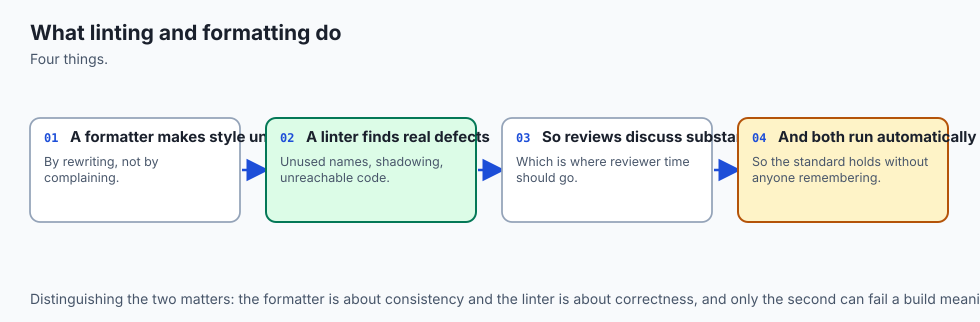
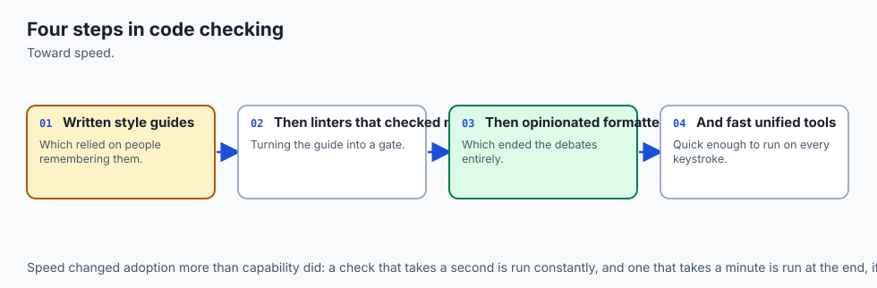
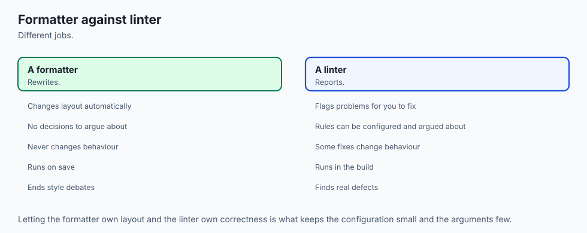
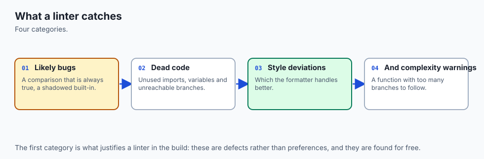
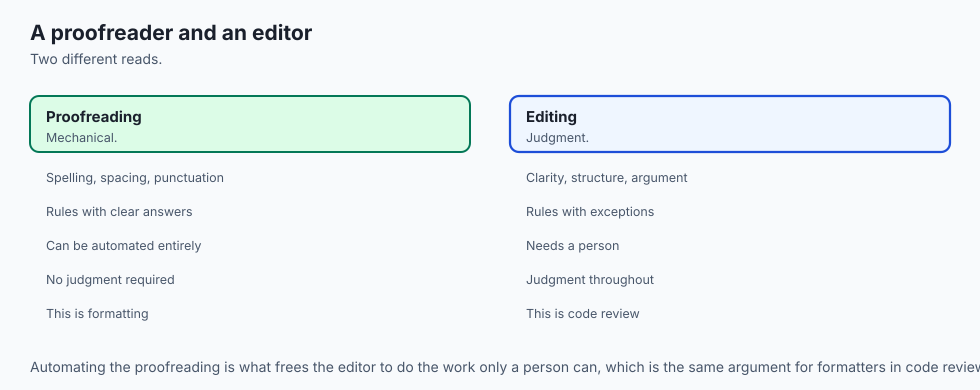
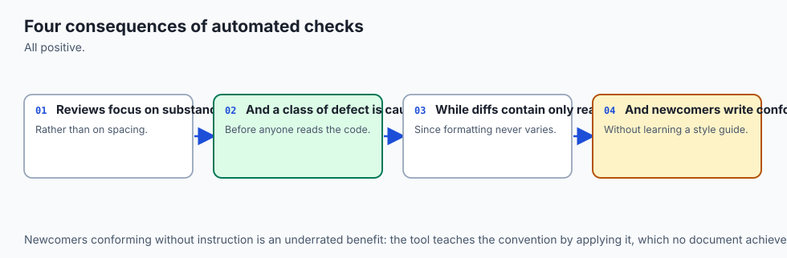
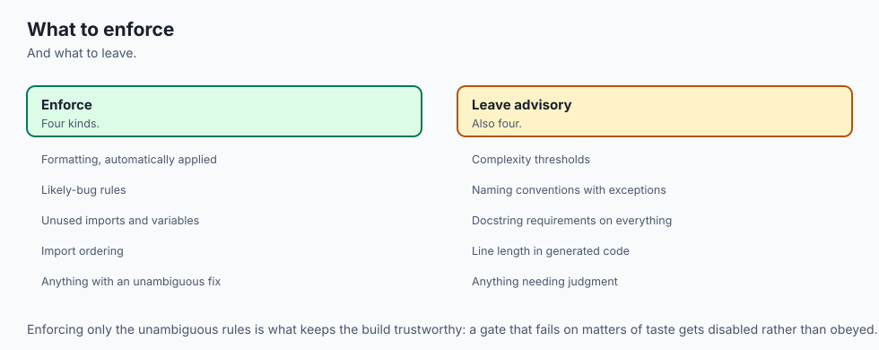

## Why this matters

On Day 61 you learned to write readable code, and every judgement in that lesson was yours to make. You decided that `l` should be called `scores`. You decided that a forty-line function was really four functions. You decided where the blank lines went and how the imports were ordered. That lesson ended with a promise: two robots — a formatter and a linter — could take the mechanical half of that work off your hands. Today you collect on the promise, and you find out exactly how much of it is mechanical and how much is still yours.

The stakes are two kinds, and they are different in size. The small one is waste. A code review that spends its first six comments on whether a dictionary literal should wrap after the opening brace has spent its attention on the one thing a computer could have settled for free, and the reviewer arrives at the actual logic tired. Multiply that by every review your team does for a year. The big one is bugs. Some real defects have a shape a machine can recognise without running the program — and today's lab is built around one of them.

A single Python function in that lab reads `def add_item(name, price_cents, basket=[]):`, and that default list is created once, when the `def` line runs, so every call that omits `basket` appends to the *same* list. Two shoppers, one trolley. The module's ten tests all pass. The code looks fine. A linter finds it in thirteen milliseconds, by rule code `B006`, on a machine you could buy second-hand.

The AI thread runs through both. As you move into the AI part of this course, more of the Python in front of you will arrive already written — generated, suggested, pasted from an example — rather than typed a character at a time. That changes where a reviewer's leverage is. You cannot personally read every line at that volume, and pretending otherwise is how a `basket=[]` gets into a request handler and starts leaking one user's data into the next user's response. What you *can* do is own the gate: decide which rules every line must pass before it merges, make the gate mechanical and fast, and spend your remaining human attention on the questions no rule can ask.

That is what today is about. It is also why consistent formatting stops being cosmetic — a diff that shows only what actually changed is what makes review possible at volume, and a diff polluted by re-quoted strings and re-wrapped lines is unreadable no matter how carefully you try.

## The idea in plain language



You now have four different tools that check your code, and they answer four genuinely different questions. Confusing them is the single most common mistake beginners make with all four.

- A **formatter** decides how code **looks**. It rewrites whitespace, quotes and line breaks so that every file in a project is laid out identically. It does not care whether the code is right. The correct attitude towards a formatter's opinions is: *whatever the tool says, stop arguing.*
- A **linter** flags suspicious **patterns**. It reads your source without running it and reports things that are usually mistakes — an import nobody uses, a variable assigned and never read, a mutable default argument. Each finding carries a **rule code** like `F401` or `B006`.
- A **type checker** (yesterday, Day 75) proves your **type claims** are consistent. If you annotated a function as returning `int` and one branch returns `None`, it says so, without running anything.
- A **test suite** (Days 71–74) checks **behaviour**. It runs the code on real inputs and compares the answers to what you said they should be.

Four tools, four classes of bug. The formatter catches an unreadable diff. The linter catches a shared basket. The type checker catches cents passed where euros were expected. The tests catch a tax rate of 21% where the law says 20%. No one of them can do another's job, and a codebase you can trust has passed all four.

**Ruff** is a single program, written in the Rust language and published by a company called Astral, that is both the formatter and the linter. One binary, one configuration file, one pass over your source. You will use two commands all day:

```bash
ruff format receipts.py   # rewrite the layout
ruff check receipts.py    # report the patterns
```

Everything else in this lesson is detail hanging off those two lines.

## Historical background



The history matters here more than usual, because Ruff's design is a direct response to the mess that came before it, and you will still meet the older tools in real projects.

The originals were small and single-purpose. **pycodestyle** (originally released under the name `pep8`) checked source against the layout rules of PEP 8 — indentation, whitespace, line length — and gave us the `E` and `W` code prefixes that survive to this day. **pyflakes**, written by the Divmod team, took the opposite approach: it deliberately ignored style entirely and looked only for likely *errors* — an undefined name, an import nobody uses, a variable assigned and never read. Its codes begin with `F`. The split is worth remembering, because it is the same split as formatter-versus-linter, drawn thirty years earlier.

**flake8** arrived as the aggregator: one command that ran pycodestyle and pyflakes together and merged their output. Its real contribution was a plugin system. Anyone could publish a package of extra rules, and hundreds of people did. **flake8-bugbear** added the `B` codes — suspicious patterns that are usually bugs, including `B006` for mutable argument defaults. **flake8-bandit** wrapped the security scanner bandit as the `S` codes. **flake8-simplify** added `SIM`, **pep8-naming** added `N`, **pyupgrade** added `UP` for syntax made obsolete by newer Python versions. This was enormously productive and also a maintenance problem: a serious project's requirements file grew a dozen linter plugins, each versioned separately, each capable of breaking the others.

**pylint**, older and heavier, took a different road entirely. Rather than pattern-matching source text, it builds a deeper model of your program and reasons across it. It is slower and noisier — but it genuinely finds things the others do not, and it is not obsolete.

**isort** solved one narrow problem, import ordering, and solved it well enough that "run isort" became a step everyone had.

Then, in 2018, **Black** changed the culture. Black is a formatter with almost no options, and that was the point: by refusing to be configurable, it made layout a settled question rather than a preference. You do not configure Black to match your taste; you adopt Black and your taste changes. Its default line length of 88 columns is now a de facto standard across the Python world, and the phrase "Black-formatted" became shorthand for "we do not discuss this in review." Ruff's formatter is deliberately designed to be Black-compatible: on ordinary code it produces the same output, so a project can move from one to the other without a mass reformat.

**Ruff** was first released in 2022. Its bet was that all of the above — pycodestyle, pyflakes, isort, the bugbear rules, pyupgrade, the naming rules, the bandit rules, and hundreds more — could be reimplemented in a single program written in Rust rather than Python, sharing one parse of your source. That bet paid off in two ways. First, one install and one configuration file instead of a dozen. Second, speed: because it is compiled and because it parses each file once for all rules rather than once per tool, it is far faster than the Python-implemented tools it replaces.

Be careful how you repeat that speed claim, including this course's version of it. On the machine that produced this lesson's captures, `ruff check` over a directory of 500 Python files totalling 38,500 lines took `real 0m0.033s`, and over a single file `real 0m0.013s`. Those are real numbers from a real `time` run — and they are *hardware*, not a benchmark. What is worth noticing is not the digits but the shape: five hundred files cost roughly twice a single file, not five hundred times, because process start-up dominates at this size. That is the property that makes a checker tolerable in an editor on every keystroke. Measure it yourself; the lab's Exercise 9 shows you how. Never quote a comparison against a tool you did not run.

## What it is — and what it is not



A **linter** is a program that reads your source code without executing it and reports patterns that are likely to be problems. The name is a small joke from 1978: Stephen Johnson's `lint` for C was named after the fluff a dryer's lint trap catches. Reading code without running it is called **static analysis** — static because the program is standing still.

A **formatter** is a program that rewrites your source into a canonical layout. It parses your code into a tree, throws your whitespace away, and prints the tree back out according to fixed rules. This is why a formatter is trustworthy: it is not editing text, it is re-printing structure.

Two properties of a good formatter are worth naming. It is **deterministic** — the same input always produces the same output, on every machine, in every checkout. And it is **idempotent** — formatting already-formatted code changes nothing. You will verify idempotence yourself in the lab, and the harness asserts it: the second `ruff format` run prints `1 file left unchanged`.

Now the "is not" list, because each of these misconceptions costs somebody a day.

| Common misconception | The reality |
| --- | --- |
| "The linter proves my code is correct." | It proves nothing about correctness. It recognises patterns. A program can be free of findings and compute entirely wrong answers — which is why the test suite is a separate gate. |
| "The formatter fixes my lint findings." | It fixes none of them. In this lab, `ruff format` tidies the spacing around `basket = []` into `basket=[]` and leaves the bug precisely where it was. |
| "Every finding is a bug." | Most findings are readability. In the lab's messy module, exactly one of ten findings is a defect that would ship. The other nine are about how the code reads — which is still worth fixing, but is a different claim. |
| "A finding means I did something wrong." | Sometimes the rule is wrong for your case. That is what a **false positive** is, and it is why suppression comments exist. A tool that is never wrong about anything is a tool that checks nothing interesting. |
| "More rules enabled means better code." | Past a point, more rules means a wall of noise everyone learns to scroll past — and a gate everyone ignores stops being a gate at all. |
| "`ruff check --fix` will finish the job." | It applies only the fixes it can prove are safe. The interesting ones are deliberately left to you. |

## Why it was created and what problems it solves

Four problems, in ascending order of importance.

**Style arguments in review are pure waste.** They are unwinnable — there is no fact of the matter about whether a wrapped argument list should be indented four spaces or aligned to the paren — and they are expensive, because they consume the reviewer's freshest attention on the least valuable question in the file. A formatter ends the argument by removing the choice. This is why Black's un-configurability was a feature rather than an oversight, and why the strongest possible advice about formatter settings is to change none of them.

**A class of real bug is mechanically detectable.** Not all bugs — most are about your problem domain, and no tool has ever heard of your problem domain. But an import nobody uses, a name that does not exist, a variable assigned and never read, `except:` with no exception type, a mutable default argument, a comparison to `None` with `==` instead of `is`: these have a shape. The shape can be matched. Matching it costs milliseconds and finds the defect before the reviewer, the test suite, or the customer does.

**Consistency makes diffs readable, and readable diffs make review possible.** If two people format the same file differently, the version-control diff between their commits shows every line either of them touched, and the two lines of real change are lost in three hundred lines of re-quoting. Once one formatter owns layout, a diff shows what changed and nothing else. At small scale this is a convenience. At the scale where a lot of code arrives generated rather than typed, it is the difference between review being feasible and review being theatre.

**Tool sprawl was its own tax.** Before Ruff, adopting the rule set this lesson uses meant installing flake8 plus four plugins plus isort plus Black, configuring them in three different file formats, and keeping seven version pins compatible. Every one of those was a reason a team said "later". Ruff's actual product is not any individual rule; it is that the whole set is one `pip install` and one table in a file you already have.

## How it works




### Reading code without running it

Both halves of Ruff start the same way: the file is parsed into an **abstract syntax tree**, a structured representation in which `if match == None:` is not a string of characters but a comparison node whose right-hand side is the `None` literal. Every rule is a question asked of that tree. The formatter then prints the tree back out with canonical whitespace; the linter walks it looking for the shapes its enabled rules describe. The single most important consequence is that neither tool runs your code, so neither can be fooled by, or can trigger, anything your program does at runtime. It also means that anything only knowable at runtime is invisible to both.

### The formatter

```bash
ruff format receipts.py          # rewrite the file in place
ruff format --diff receipts.py   # show what it would do, change nothing
ruff format --check receipts.py  # say whether it is already formatted; exit 1 if not
```

The first is what you run while working. The second is how you look before you leap. The third is the continuous-integration form: it edits nothing and exits non-zero if any file is unformatted, which fails the build and tells the author to run the formatter themselves.

Look at what the formatter actually changed in the lab's messy module — this is a real captured hunk from `ruff format --isolated --diff receipts.py`:

```text
-TAX_RATE = Decimal('0.20')
-LINE_PATTERN = re.compile(r'^(.+?)\s+([0-9]+)$')
+TAX_RATE = Decimal("0.20")
+LINE_PATTERN = re.compile(r"^(.+?)\s+([0-9]+)$")


-def add_item(name, price_cents, basket = []):
-    basket.append({'name': name, 'price_cents': price_cents})
+def add_item(name, price_cents, basket=[]):
+    basket.append({"name": name, "price_cents": price_cents})
```

Every line of that is appearance: single quotes to double quotes, whitespace removed around `=` in a keyword default. And there, in the middle, `basket = []` becoming `basket=[]` — the formatter tidying the spacing around a genuine bug and walking straight past it. That contrast is the clearest possible statement of what a formatter is for.

### The linter and its rule codes

A rule code is a letter prefix plus a number. The prefix names the family the rule came from, which is a direct fossil of the history above:

| Prefix | Family | What it is about | Example in this lesson |
| --- | --- | --- | --- |
| `E`, `W` | pycodestyle | PEP 8 layout and whitespace | `E501` line too long; `E711` comparison to `None` |
| `F` | pyflakes | Real errors found without running the code | `F401` unused import; `F841` unused local variable |
| `I` | isort | Import block order and grouping | `I001` import block is un-sorted |
| `B` | flake8-bugbear | Suspicious patterns that are usually bugs | `B006` mutable argument default |
| `SIM` | flake8-simplify | Code saying something the long way round | `SIM108` use a ternary instead of an if/else block |
| `UP` | pyupgrade | Syntax obsoleted by your target Python version | `UP031` use format specifiers instead of percent format |
| `N` | pep8-naming | `snake_case`, `CapWords`, `UPPER_CASE` | naming conventions from Day 61 |
| `S` | flake8-bandit | Common security mistakes | `S101` bare `assert` in shipped code |

You select families and individual rules in configuration:

```toml
[tool.ruff.lint]
select = ["E", "W", "F", "I", "B", "SIM", "UP", "N", "S"]
ignore = ["E501"]
```

`select` replaces the default set with exactly what you list. `extend-select` adds to whatever is already selected, which is what you want when a subdirectory needs one extra rule rather than a whole new policy. `ignore` removes specific codes from whatever `select` produced. A prefix matches everything under it: `select = ["E"]` takes every pycodestyle error rule, `select = ["E5"]` takes the `E5xx` group, `select = ["E501"]` takes exactly one.

Ruff's **default** selection, if you configure nothing, is deliberately small: `E4`, `E7`, `E9` and `F`. That is not an accident — a tool whose first run on an existing codebase prints four thousand complaints gets uninstalled. You can verify the smallness yourself. On the lab's messy module the default selection reports `Found 5 errors.`, and the wider selection this lesson uses reports `Found 10 errors.`:

```text
$ ruff check --isolated --select E,F,I,B,SIM,UP receipts.py
receipts.py:13:1: I001 [*] Import block is un-sorted or un-formatted
receipts.py:13:8: F401 [*] `json` imported but unused
receipts.py:14:25: F401 [*] `collections.Counter` imported but unused
receipts.py:22:42: B006 Do not use mutable data structures for argument defaults
receipts.py:29:17: E711 Comparison to `None` should be `cond is None`
receipts.py:36:5: F841 Local variable `skipped` is assigned to but never used
receipts.py:39:20: E711 Comparison to `None` should be `cond is None`
receipts.py:65:5: SIM108 Use ternary operator `label = 'found' if hits else 'missing'` instead of `if`-`else`-block
receipts.py:69:12: UP031 Use format specifiers instead of percent format
receipts.py:75:89: E501 Line too long (93 > 88)
Found 10 errors.
[*] 3 fixable with the `--fix` option (5 hidden fixes can be enabled with the `--unsafe-fixes` option).
```

Read the anatomy of one line. `receipts.py:22:42` is file, line, column. `B006` is the rule code. The `[*]` marker, present on `I001` and both `F401`s and absent from `B006`, means Ruff has a fix for that finding that it considers safe. And note the last line: three findings are safely fixable, five more become fixable if you opt in. Those two numbers are the subject of the next section.

Two more commands earn their place in your daily habits. `ruff check --statistics` collapses the report into counts per rule, which is how you decide what to attack first in an unfamiliar codebase:

```text
2	E711  	[ ] none-comparison
2	F401  	[*] unused-import
1	B006  	[ ] mutable-argument-default
1	E501  	[ ] line-too-long
1	F841  	[ ] unused-variable
1	I001  	[*] unsorted-imports
1	SIM108	[ ] if-else-block-instead-of-if-exp
1	UP031 	[ ] printf-string-formatting
```

And `ruff rule B006` prints the rule's full documentation — what it checks, why it is bad, an example, and a "Known problems" section that tells you honestly when the rule is wrong. That documentation is compiled into the binary, so it works with no network. It is the fastest way to learn a rule set, and it is what you should reach for the moment you meet an unfamiliar code, instead of guessing or switching the rule off.

### Autofix: the safe/unsafe line


Many findings come with a machine-applicable fix, and Ruff sorts those fixes into two bins.

A **safe fix** is one Ruff can argue preserves what the program does and throws away nothing — no comment, no code you might have meant. Deleting an import that provably nothing references is safe. Reordering an import block is safe. `ruff check --fix` applies these and only these.

An **unsafe fix** is one that might change behaviour, or might discard something. It is not "wrong"; it is "a human has to say yes." Rewriting `if x == None` to `if x is None` is unsafe, because for a hand-written class with a strange `__eq__` those genuinely differ. Rewriting `basket=[]` to `basket=None` plus an `if basket is None:` guard is unsafe for the most direct reason imaginable: it *does* change behaviour, on purpose, because the old behaviour was the bug. You opt in with `--unsafe-fixes`, and the correct habit is to preview first:

```bash
ruff check --select E,F,I,B,SIM,UP --diff --unsafe-fixes receipts.py   # look
ruff check --select E,F,I,B,SIM,UP --fix --unsafe-fixes receipts.py    # then leap
```

The lab proves the distinction rather than asserting it, and this is the single best thing in it. After the safe fix, `F401` is gone and `B006` is still there, and the ten behaviour tests are still green. After the unsafe fix, `B006` is gone — and a test *fails*. The test that fails is the one written to record the bug: it asserted `first is second`, and now two callers get two independent baskets. The harness asserts that failure as a passing check, with this label:

```text
ok: the unsafe fix changes behaviour, so the test that recorded the bug now fails
```

That check passes when pytest fails. It is proof that "unsafe" means something.

### Suppression, and per-file ignores

Sometimes the rule is right in general and wrong here. There are two instruments, and they operate at different scales.

A **suppression comment** turns off one rule on one line:

```python
import config  # noqa: F401 — re-exported for backwards compatibility
```

Name the code. Give the reason. A reviewer can check that in five seconds. Compare:

```python
import config  # noqa
```

A bare `noqa` silences *every* rule on that line, forever, including rules that did not exist when it was written and including security rules. Sprinkle a few hundred of those through a codebase and you have a set of blind spots nobody can audit. Ruff can police this for you: `PGH004` flags blanket `noqa` directives, and `RUF100` flags suppressions that no longer suppress anything, which is how you stop them accumulating as the code moves on. The lab demonstrates that suppression is genuinely surgical: with `import json  # noqa: F401` on line 1, `F401` disappears and an `E711` elsewhere in the same file still fires.

A **per-file ignore** relaxes a rule for a whole pattern of files, in configuration rather than in the source:

```toml
[tool.ruff.lint.per-file-ignores]
"test_*.py" = ["S101"]
```

This is the classic case. `S101` distrusts `assert`, correctly, because `python -O` strips assert statements — so an `assert` guarding a real invariant in shipped code can silently vanish. In a test file, `assert` *is* the mechanism and tests are never run under `-O`, so the rule is pure noise there and only there. Notice the shape of that decision: the rule was not deleted from `select`, and it was not added to the global `ignore`. It was relaxed exactly where it is wrong. Every rule you switch off globally is a rule that stops protecting the code where it still applied.

### A real configuration, read end to end

Here is the lab's reference `pyproject.toml`, with the reasoning intact. `pyproject.toml` is the standard place a Python project keeps its settings; Ruff walks up from the file it is checking and uses the nearest one it finds.

```toml
[tool.ruff]
line-length = 88
target-version = "py39"
extend-exclude = [".venv", "build", "dist"]

[tool.ruff.lint]
select = ["E", "W", "F", "I", "B", "SIM", "UP", "N", "S"]
ignore = ["E501"]

[tool.ruff.lint.per-file-ignores]
"test_*.py" = ["S101"]

[tool.ruff.format]
quote-style = "double"
indent-style = "space"
```

`line-length = 88` is Black's default and therefore Ruff's; the number matters far less than everybody using the same one. `target-version = "py39"` names the oldest Python this code must run on, and the `UP` rules obey it — they will not rewrite anything into syntax your target cannot parse. `extend-exclude` keeps the tools out of a virtual environment, which is full of other people's code whose style is none of your business.

The `ignore = ["E501"]` line deserves its own paragraph, because it looks like giving up and is not. Once a formatter owns line length, the only `E501` findings left are on things the formatter is *not permitted* to break — a long URL in a comment, a single long string literal — and breaking those by hand makes them worse. Ruff's own documentation recommends disabling `E501` when the formatter is in use. That is the standard to hold every `ignore` entry to: one sentence you can defend. An entry you cannot defend is a rule you should either obey or remove from `select`.

Finally, note `[tool.ruff.format]`. It has two settings here and they are both the defaults, written out so nobody has to look them up. That is roughly all there is to configure, on purpose. If you find yourself wanting more formatter knobs, the honest answer is the one Black established in 2018: stop arguing.

### Which rules are actually worth turning on

Everything so far is mechanism. This part is judgement, and it is the half that separates a working gate from a config file everyone learned to ignore.

Start small. `select = ["E", "F"]` on the first day is a defensible policy for any project, because those are layout and real errors, and almost nobody argues with either. Then grow deliberately: add `I` when you are tired of import diffs, `B` when someone has been bitten by a bugbear-shaped defect, `UP` when you raise your minimum Python version, `S` when you start handling anything that matters. Each addition is a decision with a reason, ideally written next to it — that is what the comments in the configuration above are for. A config file that records *why* is worth several times one that records only *what*.

The families to be careful with are the noisy ones. Docstring rules (`D`) will demand a docstring on every module, class and function including the obvious ones, and on an existing codebase that is thousands of findings on day one. Annotation rules (`ANN`) demand a type hint everywhere. Complexity rules (`C901`) put a hard numeric ceiling on branching, which is a real signal and also fires on the one genuinely complicated function that has to be complicated. None of these is a bad rule. They are rules that need a project already in shape, and turning them all on at once is the surest way to produce the failure mode this whole discipline exists to avoid.

That failure mode is worth naming precisely. **A lint configuration everyone has learned to ignore is worse than no linter at all**, because it costs the same to run, it fails builds for reasons nobody reads, and it teaches your team that a red check is normal. Once "the linter is always complaining" becomes the culture, the one finding that was a genuine `B006` scrolls past with the rest. Guard against it by keeping the rule set small enough that a clean run means something, and by treating a persistent finding as a decision to make — fix it, suppress it with a reason, or remove the rule — never as scenery.

## An everyday analogy



Think of a newly built house waiting to be signed off before anyone can move in. Four different people walk through it, and each has an entirely different clipboard.

The **decorator** comes first. He does not ask whether the house is safe or whether the plumbing works. He makes every room match: the same skirting, the same paint finish, the same switch plates in the same orientation. Whether he prefers brushed steel or white plastic is not a question anyone gets a vote on — the whole value of what he does is that every room comes out identical, so a visitor's eye slides over the finish and lands on the furniture. That is the **formatter**. And notice: he is happy to paint a room beautifully around a socket with no cover on it. He tidies the wall next to the hazard and moves on.

The **safety inspector** walks through next with a list of things that are usually a problem: an exposed wire, a missing handrail, a socket by the bath. He does not turn the taps on and he does not check that the house will stand up; he recognises *shapes*, from a list, quickly. That is the **linter**, and his list is his rule set. Some of his findings he can fix himself on the spot — screwing a cover plate back on changes nothing about the house except that it is now safe, so he does it and notes it. That is a **safe autofix**. Others he cannot: moving a socket means chasing a new channel through a wall, and while it is almost certainly the right call, it changes the house, so he needs the owner to say yes.

That is an **unsafe fix**. And sometimes he is simply wrong for this building — the "missing handrail" is beside a step that exists only in the drawing. So the owner signs a variance: *this specific hazard, on this specific step, waived, for this reason.* That is `# noqa: F401 — reason`. What the owner must never do is sign a blanket waiver saying "ignore anything you find on the ground floor," because that waiver will still be in force in ten years, covering hazards nobody has invented yet. That is the bare `noqa`.

The **structural engineer** is the third visitor. She does not look at paint or sockets. She checks that the loads add up: that the beam specified in the drawings can carry what the drawings say sits on it. She proves the *claims* are consistent with each other, on paper, without anyone standing on the floor. That is the **type checker** from Day 75 — and, exactly like her, it cannot tell you whether the building is the one you wanted.

The **commissioning engineer** is last, and he is the only one who actually turns things on. Taps, lights, boiler, every socket in turn. That is the **test suite**. He finds the things the other three could not possibly find — that the hot tap runs cold because two pipes were crossed — and he misses everything he did not think to try.

Four inspections, four clipboards, four different classes of defect. Handing any one of them the others' job is how houses get signed off with the hot tap running cold and a beautifully painted wall beside a live wire.

## Examples in practice

Everything below is a real capture from this day's lab, run with Ruff 0.15.22 and pytest 9.1.1 on Python 3.14.0, verified 2026-07-19.

**Step 1 — establish ground truth before touching anything.** The messy module works. Ten tests pin its behaviour, and the whole argument of the day depends on those tests staying green while the tools rewrite the file:

```text
$ pytest -q
..........                                                               [100%]
10 passed in 0.01s
```

**Step 2 — see what the default rule set finds.**

```text
$ ruff check --isolated receipts.py
receipts.py:13:8: F401 [*] `json` imported but unused
receipts.py:14:25: F401 [*] `collections.Counter` imported but unused
receipts.py:29:17: E711 Comparison to `None` should be `cond is None`
receipts.py:36:5: F841 Local variable `skipped` is assigned to but never used
receipts.py:39:20: E711 Comparison to `None` should be `cond is None`
Found 5 errors.
```

`--isolated` tells Ruff to ignore any configuration file it might find above the current directory and use its built-in defaults. Use it while you are learning which rule does what, so you are always seeing the rules you asked for rather than rules you inherited from somewhere up the tree. Notice what is *missing* from those five: no `B006`. The real bug in this file is outside the default selection until you ask for it.

**Step 3 — ask for more, and get the bug.** With `--select E,F,I,B,SIM,UP` the count goes from five to ten and `B006` appears, as shown in the "How it works" capture above. Eight distinct rule codes: `I001`, `F401`, `B006`, `E711`, `F841`, `SIM108`, `UP031`, `E501`.

**Step 4 — the formatter, and the proof it changed nothing that matters.** Run `ruff format`, then re-run the tests: still `10 passed`. Run the formatter a second time and it reports `1 file left unchanged` — idempotence, demonstrated rather than promised. Then re-run the linter on the formatted file, and `B006` and both `F401`s are still there, untouched. Formatting fixed no findings, and broke no behaviour. Both halves of that sentence are asserted by the harness.

**Step 5 — the safe autofix.** `ruff check --select E,F,I,B,SIM,UP --fix` removes the two unused imports and sorts the import block. `B006` survives. `pytest -q` still says `10 passed`. Ruff refused to touch the one finding that mattered, and it was right to.

**Step 6 — the unsafe fix, and the human decision.** `--fix --unsafe-fixes` rewrites the mutable default into the `basket=None` guard, rewrites both `== None` comparisons to `is None`, and collapses the if/else into a ternary. Now `pytest -q` fails — and the failing test is `test_default_basket_is_shared_between_calls`, which asserted `first is second`. This is the moment the whole lab is built around. Nine of the ten findings were about how the code reads. One was a defect that would have shipped. And the resolution is not a tool's to make: you confirm the new behaviour is the behaviour you want, then rewrite the test to assert `first is not second` and update its docstring so it no longer claims to document a defect. Correct code with a failing test is a test doing its job.

**Step 7 — retire the flags into a configuration.** Nobody types `--select E,F,I,B,SIM,UP` forever. Write the `pyproject.toml` shown earlier, and then:

```bash
ruff check .
ruff format --check .
pytest -q
```

`ruff check .` printing `All checks passed!` with no `--select` in sight means the configuration, not your memory, is carrying the rules. That is the whole point of the exercise.

Finally, the whole story in one command. The lab's harness runs 37 checks covering every claim above — the ground truth, the eight rule codes asserted by *code* rather than by message wording, the idempotence, the safe/unsafe distinction, the per-file ignore doing real work, and the suppression comment being surgical:

```text
37 checks, 0 failure(s).
```

### Where this meets code review

Put the two halves together and the payoff is a change in what a code review is *for*. The mechanical layer — layout, import order, unused names, the catalogue of known-suspicious shapes — is handled before a human ever opens the diff, by a gate that is fast, consistent, and never tired or diplomatic. What arrives at the reviewer is a diff that shows only real changes, in a layout identical to every other file, with the catalogue already cleared. The reviewer's attention, which is the scarcest thing in the process, goes where no rule can go: is this the right design? Does this name mean what it says? Is this the behaviour the customer asked for? Should this exist at all?

That reallocation is the answer to the AI question this lesson opened with. When a lot of code arrives generated rather than typed, reading every line stops being possible, and a reviewer who insists on it will simply read less carefully. The leverage moves from the keystroke to the gate: from *did I read this line* to *what must every line pass before it merges, and is that gate small enough that a clean run still means something*. Owning that gate is a skill, it is exercised in the `select` and `ignore` lists of a real project, and it is what today has been teaching.

## Implications: security, privacy, performance, scalability, and cost



**Security.** A linter is a security control, and not as a metaphor. The `S` family is derived from bandit and flags patterns with a history: `subprocess` calls with `shell=True`, `yaml.load` without a safe loader, `pickle` on untrusted input, hard-coded passwords, temporary files with predictable names, `assert` used as a runtime guard in shipped code. None of these is necessarily wrong; all of them deserve a second look, which is exactly what a finding is. The `B` family catches correctness traps that become security bugs under the right conditions, and `B006` is the clearest case in this course. A mutable default is shared state that outlives the call. In this lab it means two shoppers share a trolley. In `def handler(request, cache={})` in a web application, the same defect means data from one user's request is visible in the next user's response — a cross-request data leak that looks exactly as innocent as the line in the lab. Suppression comments are themselves a security surface: a bare `noqa` silences the security rules along with everything else, forever.

**Privacy.** Both tools run entirely on your machine. Ruff reads your files, writes a `.ruff_cache/` directory of hashes and analysis results next to them, and opens no network connection; `ruff rule` documentation is compiled into the binary rather than fetched. Nothing about your source leaves the computer. That is worth stating explicitly because it is *not* true of every code-analysis service on the market, several of which upload your repository to analyse it. Read what you are installing.

**Performance.** The number that matters for a linter is not throughput but latency, because the tool's real job is to run on every save, in your editor, without you noticing. Compiled speed and a single shared parse are what buy that. Two practical consequences: the whole-repository run costs about the same as the single-file run at small sizes, so you may as well check everything; and because it is fast enough to be pre-commit-hook-shaped, findings arrive before the commit rather than in CI ten minutes later.

**Scalability.** The thing that does *not* scale automatically is your rule set. A hundred-file project and a hundred-thousand-file project need the same discipline but different tactics: on a large existing codebase you adopt rules incrementally, using per-file ignores and directory-scoped configuration to bring one area up to standard at a time rather than declaring bankruptcy across the whole tree. The mistake is switching on everything, seeing forty thousand findings, and switching the tool off.

**Cost.** Ruff and pytest are both free and open source, distributed under the MIT licence — as stated by the projects themselves; verify it in the source you cite rather than taking it from memory. There is no paid tier, no seat licence, and no account. The real cost of this discipline is not money but attention: the minutes spent deciding what belongs in `select`, and the willingness to treat each remaining finding as a decision rather than as scenery. That cost is small and it is the entire cost.

## Alternatives: free, open source, and commercial

Every tool below is free and open source. Three of them are on the machine that captured this lesson's output; the rest are not, and this section says so plainly rather than inventing what they would have printed. If you want to compare, install them and run them on the same file — the lab's `expected-output/alternatives-run.txt` gives you the exact commands.

**Ruff — linter and formatter in one.** *What it is:* a single Rust binary reimplementing hundreds of rules from pycodestyle, pyflakes, isort, bugbear, pyupgrade, bandit and dozens of other plugins, plus a Black-compatible formatter. *When to choose it:* almost always, for a new project, and for an existing one unless you depend on a flake8 plugin Ruff has not reimplemented. *How to use it:* `pip install ruff`, then `ruff check .` and `ruff format .`, configured in `[tool.ruff]` in `pyproject.toml`. *Worked example, real capture:* on the lab's messy module, `ruff check --isolated --select E,F,I,B,SIM,UP receipts.py` reports ten findings across eight codes and exits 1; `ruff format --diff` shows every change is appearance-only; `ruff check --fix` clears three of them and leaves `B006` for a human. *Cost:* free, open source, MIT licence, no paid tier. Version 0.15.22 verified on 2026-07-19.

**flake8 plus plugins.** *What it is:* the long-standing aggregator that runs pycodestyle and pyflakes and any installed plugin, merging the output. *When to choose it:* when your project depends on a specific plugin with no Ruff equivalent, or when a large existing configuration would cost more to migrate than it is worth. *How to use it:* `pip install flake8`, configure in `setup.cfg` or `.flake8`, run `flake8 --max-line-length 88 receipts.py`. *Worked example:* on the module above it would report the same `F401`, `E711`, `F841` and `E501` findings — those are literally the rules Ruff reimplemented — plus whatever plugins you installed. **It is not installed on the machine that captured this lesson, so no output from it is shown anywhere in this lab, and none is invented.** *Cost:* free, open source.

**pylint.** *What it is:* the heavyweight. Rather than pattern-matching, it builds a deeper model of your program and reasons across modules. *When to choose it:* when you want findings the fast tools structurally cannot produce — cross-module unused code, too many arguments, missing docstrings, inference-based type confusion — and you can afford a slower, noisier run. Be fair to pylint: it genuinely finds things Ruff does not, and "it is slow and noisy" is a reason to run it in CI weekly rather than a reason to dismiss it. *How to use it:* `pip install pylint`, then `pylint receipts.py`, tuned in `.pylintrc` or `[tool.pylint]`. *Worked example:* on this module it would be expected to complain about missing function docstrings among other things — **expected, not captured: pylint is not installed here.** Run it yourself before believing anyone, including this course. *Cost:* free, open source.

**Black — formatter only.** *What it is:* the opinionated formatter that changed Python's culture in 2018 by being deliberately un-configurable. *When to choose it:* when you want formatting and nothing else, or when your project already uses it and is not ready to move. *How to use it:* `pip install black`, then `black .` or `black --diff receipts.py` for a preview and `black --check .` in CI. *Worked example:* on ordinary code Black and Ruff's formatter produce the same output — Ruff's formatter is explicitly designed for Black compatibility — so the diff shown earlier in this lesson is what you would expect from either. **Black is not installed here; that expectation comes from the design goal, not from a run on this machine.** *Cost:* free, open source.

**isort — imports only.** *What it is:* a tool that sorts and groups import statements: standard library, third party, first party, each block alphabetised. *When to choose it:* when you want import ordering without adopting a whole linter, or in an existing project that already uses it. *How to use it:* `pip install isort`, then `isort --diff receipts.py` to preview and `isort .` to apply. *Worked example:* Ruff's `I001` is the reimplementation of exactly this. On the lab's module, `ruff check --isolated --select I receipts.py` prints `receipts.py:13:1: I001 [*] Import block is un-sorted or un-formatted` and `--fix` sorts it — a real capture. The isort output itself is not shown, because **isort is not installed here.** *Cost:* free, open source.

**pre-commit — the harness, not a checker.** *What it is:* a framework that runs tools automatically on the files you are about to commit, configured in `.pre-commit-config.yaml` and installed into your repository's git hooks. *When to choose it:* as soon as more than one person works on the codebase, because it is what makes "we run the formatter" true rather than aspirational. *How to use it:* `pip install pre-commit`, write a config naming each hook repository and the revision to pin it to, then `pre-commit install`. Afterwards every `git commit` runs the hooks on the staged files and refuses the commit if one fails. *Worked example:* a Ruff-based configuration typically declares two hooks from Astral's hook repository — `ruff-check` with `--fix`, and `ruff-format` — pinned to a specific revision. **pre-commit is not installed on this machine, so no run of it is shown.** One security note that is not optional: pre-commit downloads and executes the hook repositories you name, so pin them to a specific revision and read what you are pinning. *Cost:* free, open source.

**The standard library's own tiny checkers.** Worth knowing because they need no install at all: `python3 -m py_compile receipts.py` tells you the file parses, and `python3 -m tabnanny receipts.py` prints nothing when your indentation is unambiguous and complains when it is not. Both were run for this lab's captures. They are not a substitute for a linter — they answer one question each — but on a machine where you cannot install anything, they are what you have.

## Comparison with related concepts

| Tool | Reads or runs your code? | The question it answers | A bug only it catches | Can it change your file? |
| --- | --- | --- | --- | --- |
| Formatter (`ruff format`) | Reads | How should this look? | An unreadable diff hiding a real change | Yes — layout only, deterministically |
| Linter (`ruff check`) | Reads | Is this pattern suspicious? | `basket=[]` shared across calls | Yes, with `--fix`, and only what it can prove |
| Type checker (mypy, Day 75) | Reads | Are the type claims consistent? | Passing cents where euros were expected | No |
| Test suite (pytest, Days 71–74) | Runs | Does it behave correctly? | A tax rate of 21% where the law says 20% | No |
| Code review (a human) | Reads | Is this the right thing to build? | The wrong feature, correctly implemented | No |

Two comparisons deserve spelling out.

**Linter versus type checker.** They overlap slightly and differ fundamentally. Both are static analysis; both read without running. But a linter matches *shapes* against a catalogue and does not need to understand your program, while a type checker performs *inference* across the whole call graph and needs your annotations to do it. A linter will tell you `F401` about an import in a file it has never seen before; only a type checker can tell you that the value flowing into argument three on line 240 could be `None` because of an early return on line 12 of another module.

**Linter versus tests.** A linter says "this pattern is usually a mistake" and is sometimes wrong about your code. A test says "on this input, the answer must be exactly this" and is never wrong about your code — it is only ever wrong about what you asked for. That difference is why a lint finding can reasonably be suppressed with a comment and a failing test can never be. It is also why the linter is cheap (it runs on every keystroke) and the suite is expensive (it runs your program), and why you want both.

**Formatter versus style guide.** PEP 8 is a document written for humans, full of judgement calls and one famous instruction to break its own rules when following them would hurt readability. A formatter is a program that implements one specific consistent interpretation of a subset of it. The formatter cannot rename `l` to `scores`, and PEP 8 cannot align three hundred files by Friday. Day 61 taught the guide; today automates the part of it a machine can reach.

## When to use it — and when not to



**Use a formatter always, from the first commit, with default settings.** There is no project too small and no argument worth having. Adopting one on an existing codebase is best done as a single commit that changes nothing but layout, recorded so that anyone using `git blame` can skip past it.

**Use a linter always, and start its rule set small.** `select = ["E", "F"]` on day one is defensible everywhere. Grow it deliberately, one family at a time, each with a reason you would write down.

**Put both in continuous integration in `--check` mode.** `ruff format --check .` and `ruff check --no-fix .` edit nothing and exit non-zero, which fails the build and puts the fix back where it belongs — with the author, before the review. Never let CI auto-fix and commit on your behalf; a build that rewrites your code is a build you cannot reason about.

**Use pre-commit hooks once more than one person is involved**, so that the gate runs before the commit exists rather than after the pull request does.

Now the honest other side.

**Do not turn on every rule family at once**, especially on an existing codebase. Forty thousand findings is not a quality initiative; it is the day your team learned to ignore the tool.

**Do not let the linter substitute for tests or for review.** A clean run says the catalogue is clear. It says nothing about whether the total is right, and nothing at all about whether you built the right thing.

**Do not reformat a file in the same commit as a logic change.** The diff becomes unreadable and the real change becomes invisible, which is precisely the harm formatting exists to prevent.

**Do not fight a false positive silently.** Fix it, suppress it with a named code and a reason, or remove the rule — but decide. A finding that has been on the screen for six months without anyone deciding is the seed of the failure mode described earlier.

**Do not apply `--unsafe-fixes` without reading the diff**, and never on a codebase without tests. The whole meaning of "unsafe" is that behaviour may move; a green suite before and after is the only evidence you will get that it did not.

**Do not chase a clean run in someone else's repository** as your first contribution. A pull request that reformats two hundred files is unreviewable, and it will be closed.

## The AI connection

- **Automated formatting ends style arguments permanently**, which is most of its value.
- **Linting catches real bugs**, not only style: unused variables and shadowed names are
  genuine defects.
- **Consistency makes diffs readable**, which makes review focus on substance.
- **Every serious Python project runs these**, so the conventions here are the ones you will
  meet.
- **A fast linter changes behaviour**, because a check that takes a second gets run and one
  that takes a minute does not.

## Knowledge check

1. State in one sentence each what a formatter, a linter, a type checker and a test suite prove — and name one bug class that only each of them catches.
2. Ruff's default selection on the lab's messy module reports five findings; `--select E,F,I,B,SIM,UP` reports ten. Which rule code is the genuine defect, and why is it outside the default set?
3. What does the `[*]` marker mean in a `ruff check` report, and what does its absence on `B006` tell you?
4. Explain the difference between a safe fix and an unsafe fix, using the `B006` fix as your example. Why is that particular fix classified unsafe even though it is correct?
5. What does it mean for a formatter to be idempotent, and what command output demonstrates it?
6. Why is `import x  # noqa` worse than `import x  # noqa: F401`? Name the two Ruff rules that help you police suppression comments.
7. The reference configuration puts `E501` in `ignore` while `E` is in `select`. Give the one-sentence justification.
8. Why is relaxing `S101` with a per-file ignore for `test_*.py` better than adding `S101` to the global `ignore` list?
9. Describe the failure mode of a lint configuration that has too many rules enabled, and say why it is worse than having no linter.
10. In CI you run `ruff format --check .` rather than `ruff format .`. What is the difference, and why does the choice matter?

## Hands-on exercise

The lab lives at `labs/sections/programming-with-python/day-076-linting-and-formatting-with-ruff/`. It gives you a small module that prices a shop receipt — eight functions, ten passing tests, and a style that is bad on purpose in eight distinct ways, one of which is a real bug.

Install the two pinned tools once, from the lab directory:

```bash
python3 -m venv .venv
.venv/bin/pip install -r requirements/requirements.txt
.venv/bin/ruff --version     # ruff 0.15.22
```

Then work through `starter/EXERCISES.md` from inside `starter/`: establish the ground truth with `pytest -q`, look at what the default rule set finds, widen the selection to `E,F,I,B,SIM,UP`, preview the formatter with `--diff` and prove its idempotence, apply the safe fixes, apply the unsafe ones and deal with the test that then fails, and finally retire every flag into a `pyproject.toml` of your own.

### Expected output

Ground truth, before anything touches the file:

```text
$ pytest -q
..........                                                               [100%]
10 passed in 0.01s
```

The widened selection, which is the centre of the exercise:

```text
$ ruff check --isolated --select E,F,I,B,SIM,UP receipts.py
receipts.py:13:1: I001 [*] Import block is un-sorted or un-formatted
receipts.py:13:8: F401 [*] `json` imported but unused
receipts.py:14:25: F401 [*] `collections.Counter` imported but unused
receipts.py:22:42: B006 Do not use mutable data structures for argument defaults
receipts.py:29:17: E711 Comparison to `None` should be `cond is None`
receipts.py:36:5: F841 Local variable `skipped` is assigned to but never used
receipts.py:39:20: E711 Comparison to `None` should be `cond is None`
receipts.py:65:5: SIM108 Use ternary operator `label = 'found' if hits else 'missing'` instead of `if`-`else`-block
receipts.py:69:12: UP031 Use format specifiers instead of percent format
receipts.py:75:89: E501 Line too long (93 > 88)
Found 10 errors.
[*] 3 fixable with the `--fix` option (5 hidden fixes can be enabled with the `--unsafe-fixes` option).
```

And the whole story, from the lab directory:

```text
$ bash tests/run_tests.sh
...
37 checks, 0 failure(s).
```

### Validate your work

1. `pytest -q` reports `10 passed` before you start. Write the number down; it is what you are protecting.
2. `ruff check --isolated receipts.py` reports `Found 5 errors.` and `ruff check --isolated --select E,F,I,B,SIM,UP receipts.py` reports `Found 10 errors.` Eight distinct codes appear in the second: `I001`, `F401`, `B006`, `E711`, `F841`, `SIM108`, `UP031`, `E501`.
3. Running `ruff format --isolated receipts.py` twice makes the second run print `1 file left unchanged`.
4. `pytest -q` still reports `10 passed` immediately after formatting, and again after the safe `--fix`.
5. After the safe `--fix`, `B006` is still in the report. That is the tool being correct, not failing.
6. After `--fix --unsafe-fixes`, exactly one test fails, and it is `test_default_basket_is_shared_between_calls`. You then rewrite it to assert `first is not second` and get back to `10 passed`.
7. With your own `starter/pyproject.toml` in place, all three of `ruff check .`, `ruff format --check .` and `pytest -q` succeed with no flags, and `ruff check .` prints `All checks passed!`.
8. Every entry in your `ignore` list has a comment giving a reason you would defend out loud.
9. From the lab directory, `bash tests/run_tests.sh` ends with `37 checks, 0 failure(s).` and exits 0.

### Troubleshooting

- **`ruff check` finds far less than the exercise says.** Almost always one of three things: you left out `--select` (the default set is only `E4`, `E7`, `E9`, `F`); you left out `--isolated`, so Ruff found a configuration file above you and used it instead of its defaults; or you already ran `--fix`, which edits in place, and the findings are gone because you removed them. `git checkout -- starter/` restores the original.
- **`ruff check` finds *more* than the exercise says.** Check `ruff --version`. Rules get added and fixes get promoted between releases, which is exactly why `requirements/requirements.txt` pins `0.15.22`.
- **`ruff format` did not fix my `E501`.** It usually does, by wrapping the call. When it cannot, the long thing is something it is not permitted to break — a single long string, a long URL in a comment. That is the argument for putting `E501` in `ignore` once a formatter owns line length.
- **The test in Exercise 6 fails and I do not know why.** That failure is the lab working. `test_default_basket_is_shared_between_calls` was written to assert the broken behaviour. Do not revert the fix; rewrite the test.
- **`ModuleNotFoundError: No module named 'receipts'`.** You ran pytest from the wrong directory. `cd` into `starter/`, `examples/messy/` or `examples/clean/` first.
- **My `pyproject.toml` seems to be ignored.** Two common slips: settings under a bare `[ruff]` table (that form belongs in a standalone `ruff.toml`), and `select` placed directly under `[tool.ruff]` instead of under `[tool.ruff.lint]`. Confirm what Ruff actually resolved with `ruff check --show-settings . | head -40`.

The lab's `troubleshooting.md` carries the full list, including the Windows path and what to do when `ruff check .` behaves differently in two sibling directories.

### Common mistakes

- **Treating the formatter as a fix for lint findings.** It fixes none of them. Watch it tidy `basket = []` into `basket=[]` and walk on.
- **Running `--fix --unsafe-fixes` without reading the diff first.** Preview with `--diff`. The whole meaning of "unsafe" is that behaviour may move.
- **Reverting the `B006` fix because a test failed.** The test was pinning a bug. The judgement — is the new behaviour the behaviour I want? — is the part no tool can do for you, and skipping it is skipping the lesson.
- **Reaching for a bare `noqa` at the first inconvenient finding.** Name the code, give the reason, or fix the problem.
- **Copying the reference `pyproject.toml` without reading it.** Every `ignore` entry you cannot justify in one sentence is a rule you should either obey or remove from `select`.
- **Forgetting `--isolated` while learning, then being surprised when two directories behave differently.** Configuration is per-directory-tree, not per-invocation.

## Practice assignment

Take a Python file you wrote earlier in this course — Day 63's small program, Day 70's domain model, or anything from Weeks 8 to 10 — and put it through the full gate. Do it in this order and keep notes.

1. **Establish ground truth.** If the file has tests, run them and record the number. If it does not, write three tests first that pin its current behaviour. You may not proceed without evidence.
2. **Run `ruff check --isolated` with the default selection** and record the findings. Then run with `--select E,W,F,I,B,SIM,UP` and record how many more appeared.
3. **For every distinct rule code you got, run `ruff rule <code>`** and write one sentence in your own words about what it means and whether you agree with it in this case. Reading the "Known problems" section of each rule is the point of this step.
4. **Format, then re-test.** Run `ruff format --diff` first and read every hunk. Apply it, re-run your tests, and confirm the number is unchanged.
5. **Fix safely, then unsafely.** Apply `--fix`, re-test. Preview `--diff --unsafe-fixes`, decide hunk by hunk, apply, re-test. Any test that fails is a decision, not an accident: write down what you decided and why.
6. **Write a `pyproject.toml` for that file's project.** Every `select` family gets a comment saying why it is there. Every `ignore` entry gets a sentence you would defend in review. Add one per-file ignore even if you have to invent a plausible need for it, so you have written the syntax once.
7. **Write the one-paragraph report.** How many findings were readability and how many were defects? Did any finding turn out to be a false positive? Which rule family gave you the most value per unit of noise, and which would you not enable again?

The deliverable is that paragraph plus the configuration file. The configuration is the artefact; the paragraph is the evidence you made decisions rather than accepted defaults.

## Extension challenge

Three, in ascending difficulty. Each has a verifiable result.

**One — build a minimal linter from first principles.** Write a Python script, using only the standard library, that reads a `.py` file with `ast.parse` and reports two things: every module-level import whose name never appears again in the file (your own `F401`), and every function argument whose default is a list, dict or set literal (your own `B006`). Report them as `path:line:col: X001 message`, exit 1 if there are findings and 0 if not. Run it on the lab's messy module and compare against Ruff's real output for the same two rules. When your line numbers agree, you have understood exactly what a linter is: a walk over a tree, matching shapes. Then go and find the first thing your version gets wrong — an import used only inside an f-string, or one used only in a type annotation — and appreciate how much of a mature rule is the edge cases.

**Two — measure the speed claim, and try to break the shape.** Follow the lab's Exercise 9 to `time` a run over one file and over 500 copies. Record both. Then find the largest directory of Python you have — a virtual environment's `site-packages` will do — and time a run over that. Write down the ratio of files to seconds at each of the three sizes, and describe in two sentences where process start-up stops dominating. Do not quote this course's numbers; quote yours, and say what hardware produced them.

**Three — adopt the gate on a codebase that is not ready for it.** Take a directory of your own older Python that has never been linted. Run the full selection and count the findings; the number will be discouraging, and that is the exercise. Now design an adoption plan that does not involve fixing them all: pick the smallest `select` that catches every genuine defect in the list, add per-file ignores that quarantine the worst files rather than the worst rules, write the plan as comments inside the `pyproject.toml`, and get to a clean run *without* switching off anything that found a real bug. Then write two sentences on which rules you had to give up and what you would need to change about the code before you could turn them back on. This is the actual job, and it is entirely about judgement — which is the half of today that the tool cannot do for you.
