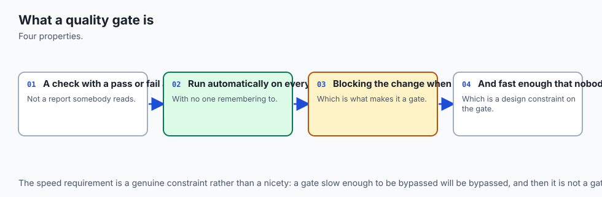
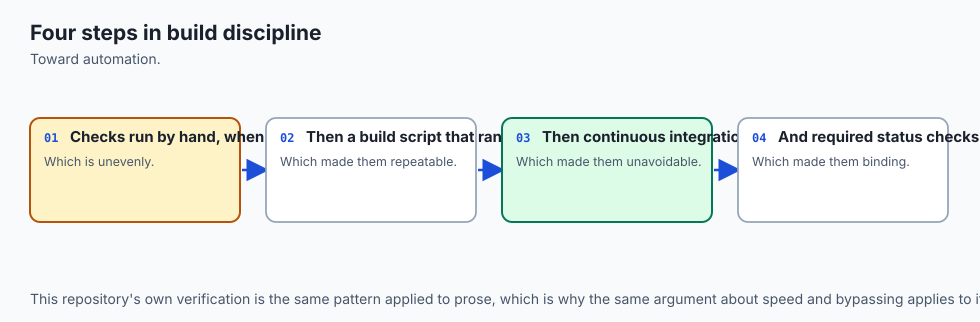
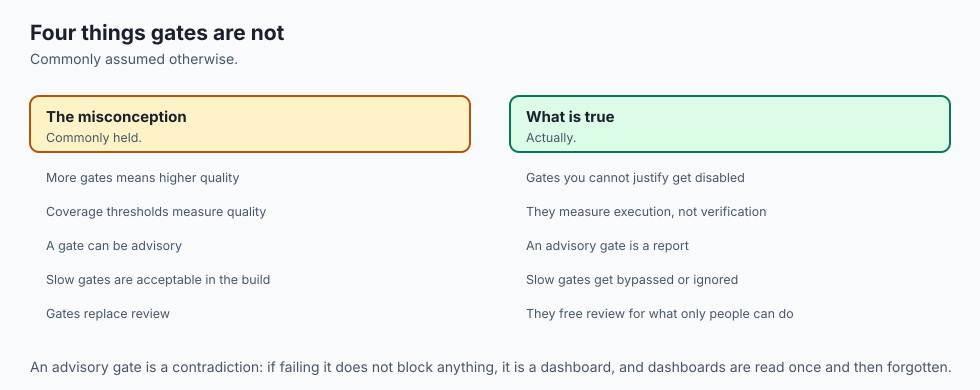
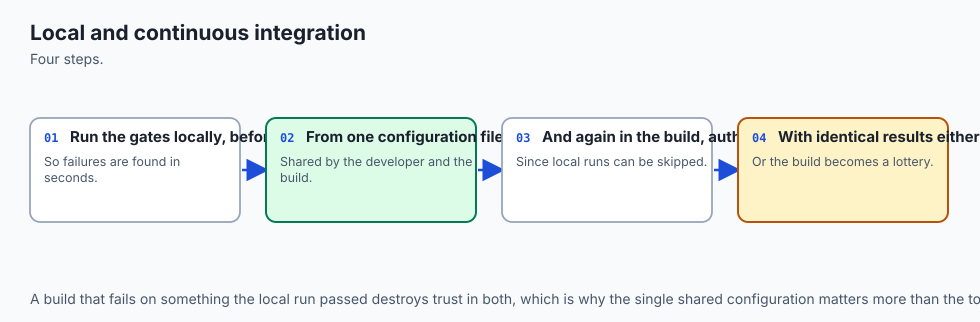
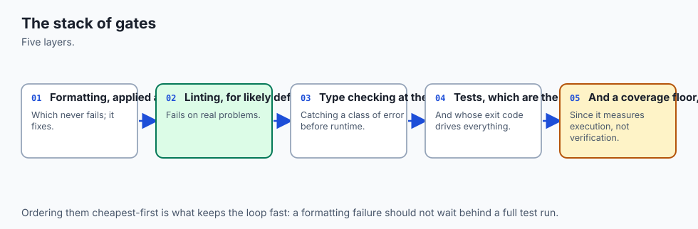
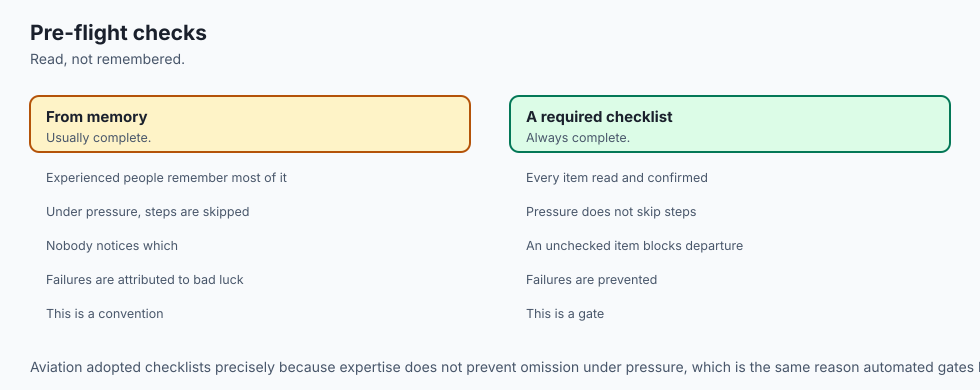
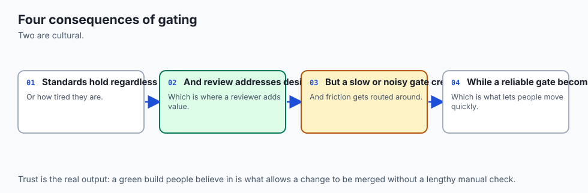
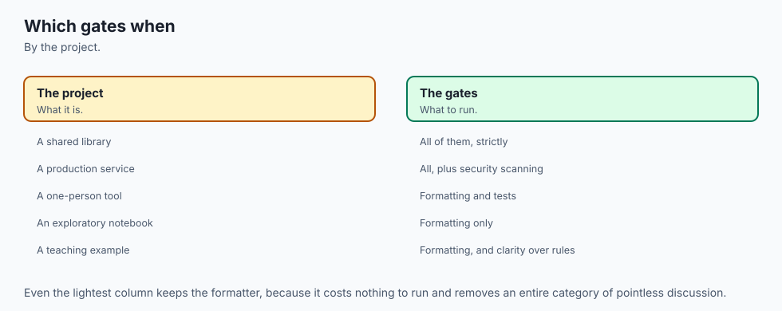

## Why this matters

For six days you have been handed tools. Day 71 gave you pytest and the first assertion. Day 72 gave you fixtures and parametrization, so one test could cover twenty cases. Day 73 gave you the discipline of writing the failing test first. Day 74 gave you mocking, so a boundary could be tested without crossing it. Day 75 gave you mypy, which finally checked the annotations Day 69 taught you to write. Day 76 gave you Ruff, which mechanised the readability judgements you were making by hand on Day 61.

Six tools. Six commands. And here is the uncomfortable truth about six commands: nobody runs six commands. They run one, usually the tests, usually only the tests they think they broke, usually only when something already looks wrong. Everything else drifts. A month later the type checker reports two hundred errors nobody has looked at, the formatter would rewrite half the files, and the coverage of the module everyone is afraid of is thirty percent — not because anyone decided that, but because no single moment ever forced the decision.

Today you build that moment. A **quality gate** is one command that runs every check and returns one number: zero if this change is safe to merge, non-zero if it is not. It runs identically on your laptop and on a build server you have never logged into. It is the thing a reviewer trusts before reading a line, the thing a new contributor runs on their first afternoon, and the thing that lets you say "yes, that is still true" about a promise you made six months ago.

The stakes are concrete. Without a gate, quality is a series of individual acts of virtue, and virtue does not survive a deadline. With a gate, quality is a property of the pipeline, and the pipeline does not get tired at 6pm on a Friday. And there is a second stake, closer to where this course is going: as more code is written by generation rather than by typing, the gate is where trust actually gets established. You cannot read every line of everything any more. You can insist that every line passes the same mechanical contract, regardless of who or what wrote it.

## The idea in plain language



A quality gate is a checkpoint with a yes-or-no answer.

The metaphor is exact and worth taking seriously. A gate is a physical thing at a specific place. It is closed by default. Something has to happen for it to open, and that something is the same for everybody. You do not negotiate with a gate, you do not explain to a gate that your change is small, and the gate does not care that it is late. It opens or it does not.

Three properties make a set of checks into a gate:

- **It is one command.** Not a wiki page listing five commands, not a habit, not a checklist in a pull-request template. One thing you type. If your gate is five commands, it is not a gate — it is a suggestion with extra steps, and it will be followed exactly as long as nobody is busy.
- **It returns one exit code.** Day 49 introduced exit codes: zero means success, anything else means failure, and every program on a Unix system agrees. That agreement is what lets a script, a hook, or a build server consume the answer without understanding a word of the output. Human-readable output is for you; the exit code is for the machine.
- **It runs the same way everywhere.** The command you run before committing is character-for-character the command the server runs after you push. If they differ, a green server tells you nothing about your laptop, and a red server tells you nothing you can reproduce.

Everything else — which checks, in what order, how strict — is negotiable and depends on the project. Those three properties are not.

The single-command property is the one people underrate. It matters more than any individual check in the gate. A project with only a test suite behind a single command is in far better shape than a project with tests, types, linting, formatting and coverage spread across five commands that three people know and nobody runs. The gate's value comes from being *unavoidable*, and only one command can be unavoidable.

## Historical background



The idea is older than software. The **assembly line stop cord** at Toyota — the *andon* cord, formalised in the Toyota Production System that Taiichi Ohno developed through the 1950s and 1960s — let any worker halt the entire line when they saw a defect. The insight was that a defect found at the station where it was made costs a fraction of the same defect found at final inspection, and orders of magnitude less than the same defect found by a customer. Every quality gate in software is an argument from that same cost curve.

The software version arrived in stages. **Make**, written by Stuart Feldman at Bell Labs in 1976, gave Unix a way to describe a build as a set of targets with dependencies — and, crucially, gave a project one command to type. In 1991 **Grady Booch** used the phrase *continuous integration* in *Object-Oriented Design with Applications*, describing frequent integration of a system's parts. **Kent Beck** made it a concrete daily practice in *Extreme Programming Explained* (1999), where continuous integration sits alongside test-first development and collective code ownership: integrate many times a day, and keep a build that always runs.

The tooling followed. **CruiseControl**, released as open source in 2001 by ThoughtWorks, was among the first widely used continuous-integration servers. **Hudson** appeared in 2005 and, after a governance dispute, was forked as **Jenkins** in 2011, which became the dominant self-hosted build server for a decade. **Travis CI** launched in 2011 as a hosted service closely tied to open-source repositories, and made free CI for public projects an expectation rather than a luxury. **GitHub Actions** became generally available in 2019, moving the workflow definition into the repository itself, as a file that is reviewed and versioned like any other.

**Martin Fowler**'s article "Continuous Integration" (first published in 2000, substantially revised in 2006) is the canonical statement of the practice, and it is worth noticing which of its rules are about tooling and which are about behaviour. "Automate the build" and "make the build self-testing" are tooling. "Everyone commits to the mainline every day" and "fix broken builds immediately" are behaviour. The tooling is the easy half.

Code coverage is older than most people assume. **Miller and Maloney** described the idea of measuring which parts of a program a test set exercises in a 1963 paper in *Communications of the ACM*. **Coverage.py**, the tool this lesson uses, was begun by Gareth Rees in 2001 and has been maintained by **Ned Batchelder** since 2004. It has had branch coverage since 2009. Which means that essentially every criticism of coverage-as-a-target has had sixty years to be made, and is still being ignored in weekly status meetings.

## What it is — and what it is not



A quality gate is a single, reproducible command that runs an ordered set of automated checks over a change and returns one exit code representing "safe to merge" or "not safe to merge".

It is **not** continuous integration. CI is *where* you run a gate — on a clean machine, automatically, on every push. The gate is the thing being run. A project can have an excellent gate and no CI (you run it yourself before pushing), or a CI service running nothing worth running. Confusing the two produces the most common failure in this area: a green build badge on a repository whose build checks nothing.

It is **not** a code review. A gate checks what a machine can check: layout, rule violations, type consistency, asserted behaviour, execution coverage. It cannot tell you the design is wrong, the abstraction is leaky, the variable name is misleading, or the feature is not what the user asked for. A gate's real job is to make review *cheaper* by removing everything mechanical from it, so a human's attention goes to the things only a human can judge.

It is **not** a guarantee of correctness, and the gap is not small. Every stage has a precise and limited claim, and the four-tool taxonomy from this week is what lets you state each one.

| Stage | What it proves | What it cannot prove |
| --- | --- | --- |
| Format | Every file matches one agreed layout | Nothing whatsoever about behaviour. A perfectly formatted program can be completely wrong |
| Lint | No construct on a fixed list of known-bad patterns appears | That the code is correct, safe, or well designed — only that it avoids a catalogue of past mistakes |
| Types | The annotations are internally consistent, and no call violates a declared signature | That the values actually arriving at runtime match the annotations. Data from a file, a network, or `Any` is unchecked |
| Tests | The specific cases you wrote behave as you asserted | Anything about the cases you did not write. The gap is invisible by construction |
| Coverage | Which lines and branches executed during the run | That anything was *verified*. This is the big one, and the next section is about it |

It is **not** bureaucracy — or rather, it becomes bureaucracy the moment a stage costs more attention than it saves. That judgement is the last third of this lesson, and it is the part that separates an engineer from a checklist.

## Why it was created and what problems it solves



Each property of a gate defeats a specific, recognisable failure.

**Without one command, checks do not run.** This is not a moral failing; it is a fact about attention. A five-command routine has five chances to be skipped, and skipping is silent. The single command removes the decision entirely — and, more subtly, makes the *cost* of the checks visible in one place. If your gate takes four minutes, you know it takes four minutes. If it is five commands, everyone experiences a vague sense that quality is slow and nobody can say why.

**Without one exit code, nothing downstream can consume the answer.** A hook, a build server, and a merge button all need a machine-readable verdict. "The output looked fine to me" cannot be automated. The exit code is the interface, and it is why the gate must never end with a summary that says FAILED while exiting 0 — an error so easy to make that this lab's test suite checks for it explicitly.

**Without identical execution everywhere, "works on my machine" survives.** That phrase is not a joke about incompetence; it is an accurate report about state. Your machine has an editor that reformats on save, a globally installed package you forgot about, an environment variable set two years ago, a file you created but never committed. A clean checkout on a throwaway machine has none of those. When the same command passes there, you have learned something real: the code alone is sufficient.

**Without a gate at the merge point, quality decays by default.** Every codebase is under constant pressure toward mess, because mess is what you get when you are in a hurry and nothing objects. A gate does not make people better; it makes the default state clean instead of dirty. That is a much more reliable mechanism than exhortation.

**Without a floor, decline is invisible.** Nobody ever decides to lower a project's test coverage. It happens one merged change at a time, each of which is individually reasonable. A floor turns a slow slide into a specific conversation on a specific day about a specific change, which is the only kind of conversation that ever produces a decision.

## How it works



Here is the whole architecture. Two machines, one gate, one configuration file, one exit code.


Read the diagram left to right. Two very different environments — your laptop, with all its accumulated state, and a clean virtual machine that will be destroyed in ninety seconds — invoke the *same* script. That script runs five stages in a fixed order. Each stage reads its settings from a table in one `pyproject.toml`, so the laptop and the server cannot disagree about what the rules are. The stages produce one exit code, and a repository setting called branch protection turns that exit code into a merge button that is either enabled or not.

### The order, argued from cost

The stages run cheapest-first, and the argument is entirely about the cost of feedback, not about importance.

| Stage | Command | Typical cost | Why it goes here |
| --- | --- | --- | --- |
| 1. Format | `ruff format --check .` | milliseconds | No code is executed and no imports are resolved. If layout is wrong you want to know before anything slower runs |
| 2. Lint | `ruff check .` | milliseconds | Parses each file once. Catches the unused import that would otherwise waste a reviewer's attention |
| 3. Types | `mypy` | ~a second, growing with the codebase | Must resolve imports and analyse the whole package. Slower than lint, faster than tests, and catches a whole class of errors before a test ever runs |
| 4. Tests | `coverage run -m pytest` | the dominant cost in any real project | Actually executes your code. Run under coverage measurement, which costs a little and makes stage 5 free |
| 5. Coverage | `coverage report` | instant | Reads the data stage 4 already collected and compares it against the floor |

A **build** stage belongs at the end when a project is distributed as a package: it proves the thing can actually be built and installed, which every earlier stage takes for granted. Today's lab has no build stage, because `pricekit` is never distributed — and saying that plainly is better than adding a stage that proves nothing.

The ordering has a second, quieter benefit. When the gate fails, the *first* failure is usually the cheapest to fix. A developer who sees "format" fail spends four seconds; a developer who sees "tests" fail spends four minutes. Putting the cheap failures first means the common case is cheap.

### Fail-fast, or run everything and report all

Both are defensible, and the right answer depends on who is waiting.

**Fail-fast** stops at the first red stage. It is right when the feedback loop is tight and the cost of a wasted run is your own patience: a pre-commit hook, or a local run while you iterate. There is no point spending forty seconds on the test suite to tell you something you will have to re-run anyway after fixing the formatting.

**Run everything and report all** completes every stage and lists every failure. It is right when a run is expensive to trigger and the person reading it is not sitting there watching: continuous integration, almost always. Making someone push, wait four minutes, fix the format error, push, wait four minutes, fix the lint error, push, wait four minutes is a cruelty that fail-fast inflicts and report-all avoids.

The lab's `check.sh` implements both, with report-all as the default and `--fail-fast` as a flag, which is the arrangement most projects converge on. Here is the mechanism, in full — this is the entire stage runner:

```bash
run_stage() {
  local name="$1"
  shift
  stage_count=$((stage_count + 1))
  printf '=== %s ===\n' "${name}"
  if "$@"; then
    printf 'PASS: %s\n\n' "${name}"
  else
    printf 'FAIL: %s\n\n' "${name}"
    failed_stages="${failed_stages} ${name}"
    if [ "${fail_fast}" = "yes" ]; then
      printf 'gate FAILED: %s\n' "${name}"
      exit 1
    fi
  fi
}
```

Note what it does *not* do: it does not `set -e`, because that would abort on the first failing stage and make report-all impossible. It records the failure, keeps going, and lets the verdict at the end decide the exit code. That is the whole difference between the two modes, in four lines.

### Coverage, honestly

Coverage deserves more space than the other four stages combined, because it is the most abused metric in the industry and the abuse is entirely avoidable once you know what the number means.

**Line coverage** is the fraction of executable lines that ran at least once during a test run. **Branch coverage** is the fraction of conditional *outcomes* that occurred — for an `if`, both the true path and the false path count separately. Branch coverage is strictly more informative, and it costs almost nothing to enable:

```toml
[tool.coverage.run]
branch = true
source = ["pricekit"]
```

Consider the difference concretely. Take a two-line function: `if x < 0: x = -x`, then `return x`. A single test passing `x = 5` executes both lines — the `if` line runs, evaluates false, and control reaches the `return`. Line coverage therefore reports 100%, even though the branch that flips the sign has never once been taken, and that branch is the only interesting thing in the function. Branch coverage counts the `if` as two outcomes, sees that only one occurred, and reports the gap. The cost of switching on `branch = true` is a few percent of run time; the cost of not switching it on is a metric that cannot see an untested `else`.

Running it takes two commands:

```bash
coverage run -m pytest     # record which lines and branches executed
coverage report            # print the table, and judge it against fail_under
```

Or one, through the `pytest-cov` plugin:

```bash
pytest --cov=pricekit --cov-branch --cov-report=term-missing
```

Here is a real report from the lab's reference project:

```text
Name                   Stmts   Miss Branch BrPart  Cover   Missing
------------------------------------------------------------------
pricekit/__init__.py       3      0      0      0   100%
pricekit/money.py         28      0     12      0   100%
pricekit/receipt.py       35      0     14      0   100%
------------------------------------------------------------------
TOTAL                     66      0     26      0   100%
```

Six columns, and every one earns its place. **Stmts** is executable statements found. **Miss** is how many never ran. **Branch** is conditional outcomes found — 26 of them, from 13 `if` statements. **BrPart** is partial branches: places where one direction was taken and the other never was, which is the column people forget and the one that usually holds the bug. **Cover** is the percentage. **Missing** lists the exact line numbers, and it is not a scolding — it is a worklist. Here is the same project's starter, before the tests are written:

```text
pricekit/receipt.py       35     27     14      0    16%   17, 26-31, 36-41, 46-51, 56-66
TOTAL                     66     27     26      0    55%
```

Those five line ranges are five rules that nothing exercises. Go and read line 17.

**Now the part everyone skips.** One hundred percent coverage proves that lines executed. It says absolutely nothing about whether anything was asserted. Here is a four-line module with a real bug in it:

```python
def promo_price(cents: int, is_member: bool) -> int:
    """Return the price a customer pays, in cents. Members are meant to get 10% off."""
    if is_member:
        return cents * 10 // 100
    return cents
```

Members are meant to get ten percent off. They are being charged ten percent *of* the price — a ninety percent discount. Now here is a test file for it:

```python
from promo import promo_price


def test_member_price_runs() -> None:
    promo_price(1000, True)


def test_non_member_price_runs() -> None:
    promo_price(1000, False)
```

Both branches execute. There is not one `assert` in the file. And here is the real, captured measurement:

```text
$ grep -cE '^[[:space:]]*assert ' test_promo_no_assertions.py
0

$ coverage run --branch --source=promo -m pytest test_promo_no_assertions.py -q
..                                                                       [100%]

$ coverage report --show-missing --fail-under=0
Name       Stmts   Miss Branch BrPart  Cover   Missing
------------------------------------------------------
promo.py       4      0      2      0   100%
------------------------------------------------------
TOTAL          4      0      2      0   100%
```

One hundred percent. Zero assertions. A module that would bankrupt the shop. Add one assertion per test and nothing about the coverage changes — only the verdict does:

```text
$ pytest test_promo_with_assertions.py -q
F.                                                                       [100%]
>       assert promo_price(1000, True) == 900
E       assert 100 == 900
```

This is not a contrived edge case. The realistic version is worse because it is less obvious: a test file that calls every function of a real module and checks nothing at all reports 84% of that module and 78% overall — comfortably enough to look responsible in a status meeting, and not one line of it verified anything.

So why keep a coverage floor at all? Because of what it *does* catch, which is decline. Set `fail_under = 95` and the number can never quietly slide: any change that adds a meaningful chunk of unexercised code turns the gate red on the day it is proposed, not six months later when someone finally looks. That is the **ratchet**: a floor that only ever moves up, raised deliberately when the real figure rises, and never lowered without a conversation that somebody has to have out loud.

Which gives the rule worth memorising. **A coverage target is a bad goal and a good alarm.** As a goal it is trivially gameable — assertion-free tests, tests of getters, `# pragma: no cover` sprinkled where it hurts — and chasing it produces exactly the tests that are cheapest to write and least worth having. As an alarm it is excellent, because "this change dropped coverage by four points" is a question worth asking every single time.

### One configuration file

Every stage above reads its settings from one `pyproject.toml`:

```toml
[tool.pytest.ini_options]
testpaths = ["tests"]
pythonpath = ["."]
addopts = "-q --strict-markers"

[tool.mypy]
files = ["pricekit"]
strict = true
show_error_codes = true

[tool.ruff]
line-length = 100
target-version = "py310"

[tool.ruff.lint]
select = ["E", "W", "F", "I", "UP", "B"]

[tool.coverage.run]
branch = true
source = ["pricekit"]

[tool.coverage.report]
show_missing = true
fail_under = 95
```

`pyproject.toml` was standardised by PEP 518 in 2016 as the place for build configuration, and PEP 621 in 2020 extended it to project metadata. Tools adopted the `[tool.<name>]` convention for their own settings, and the result is that a modern Python project can put everything in one file instead of scattering `.flake8`, `setup.cfg`, `mypy.ini`, `pytest.ini`, `.isort.cfg` and `.coveragerc` across the repository root.

The benefit is not tidiness. It is three specific things. A reviewer can see the entire standard on one screen, so "why is this rule on?" is answerable in one file. A new contributor has exactly one place to look, which removes a whole category of "I did not know we had that rule". And the settings cannot drift apart the way two files with overlapping concerns always eventually do — the classic being a `line-length` in one file and a `max-line-length` in another, silently disagreeing, with the formatter and the linter fighting each other on every commit.

Note what `files = ["pricekit"]` under `[tool.mypy]` buys: `check.sh` can call `mypy` with no arguments at all. The same for `testpaths` under pytest. Configuration in the file, not in the command, means the command is identical everywhere it runs — which is the property the whole gate is built on.

### The runner itself

`check.sh` is plain bash. It has no plugin system, no YAML, no daemon, and no network dependency. It is about a hundred lines including comments, and forty of those are the tool resolution and the stage runner. That is a feature: the gate is the most load-bearing script in a project, and load-bearing things should be readable in one sitting by anyone who might have to debug them at an awkward moment.

Two details in it are worth stealing.

**It resolves tools rather than assuming them.** A project's virtual environment, an explicit override, and whatever is on `PATH`, in that order — and if none of them produces the tool, it stops with instructions:

```bash
if ! path="$(resolve_tool "${tool}" "${override}")"; then
  echo "FAIL: ${tool} not found." >&2
  echo "  Install the gate's tools with:" >&2
  echo "    python3 -m venv .venv" >&2
  echo "    .venv/bin/pip install -r requirements/requirements.txt" >&2
  exit 1
fi
```

Stopping loudly matters more than it looks. The alternative — skipping a stage whose tool is missing — produces a gate that goes green while checking four things instead of five, and nobody finds out. A gate that silently does less than it claims is more dangerous than no gate, because people trust it.

**It never rewrites the code it judges.** `ruff format --check` reports; `ruff format` rewrites. The gate uses `--check`. A gate that edits your files while deciding whether to approve them cannot be trusted to have judged what you actually wrote, and in CI it would be modifying a checkout nobody will ever see.

### Pre-commit hooks

A **hook** is a script Git runs at a defined moment. The `pre-commit` hook runs before a commit is created and can refuse it by exiting non-zero. The `pre-commit` *framework* (a free, open-source tool that happens to share the name) manages these hooks from a configuration file, so a team can share them.

What belongs in one: **fast things only.** Formatting the staged files, linting the staged files, stripping trailing whitespace. Things that finish in well under a second on the handful of files you actually touched.

What does not belong: the full test suite, a type check of a large codebase, anything that talks to the network. Not because those are unimportant — they are the *most* important stages — but because of a mechanism that is entirely predictable. A hook that makes `git commit` take twenty seconds will be bypassed with `git commit --no-verify` within a week. Then you have no hook, and worse, you have taught yourself a reflex that will also skip the hook on the day it would have caught something. It is better to have a hook that does three cheap things reliably than a hook that does everything and is routinely disabled.

The honest framing: a pre-commit hook is a convenience, not a gate. It runs on your machine, on your staged files, and can be skipped by anyone at any time. The gate is `check.sh`, and the enforcement is in CI.

### Continuous integration

Continuous integration is the same gate, run automatically on a clean machine, on every push.

The word doing the work is **clean**. A CI runner is a fresh virtual machine with nothing on it but an operating system. The workflow checks out your repository at one exact commit, installs the pinned dependencies, and runs the gate. Nothing else is there: not your editor's settings, not the package you installed globally in 2024, not the file you created but never committed, not the environment variable in your shell profile.

That is why "works on my machine" is precisely what a clean checkout disproves. The phrase is not an admission of incompetence; it is an accurate report about hidden state. The clean checkout is an experiment that removes all of it and asks whether the code alone is sufficient. When the answer is no, the difference is real information — usually an uncommitted file or a missing pin — and you would never have found it by staring harder at your own machine.

Here is a complete, working workflow. **It is shown as a reference and is not executed anywhere in this course**: running it needs a hosting service, and today's lab runs entirely offline on your own machine. Everything else in this lesson is a real capture; this is a document.

```yaml
name: quality gate

on:
  push:
    branches: [main]
  pull_request:
    branches: [main]

concurrency:
  group: quality-gate-${{ github.ref }}
  cancel-in-progress: true

jobs:
  check:
    runs-on: ubuntu-latest
    strategy:
      fail-fast: false
      matrix:
        python-version: ["3.10", "3.11", "3.12"]
    steps:
      - name: Check out the repository
        uses: actions/checkout@v4

      - name: Set up Python ${{ matrix.python-version }}
        uses: actions/setup-python@v5
        with:
          python-version: ${{ matrix.python-version }}
          cache: pip

      - name: Install the gate's tools
        run: |
          python -m pip install --upgrade pip
          python -m pip install -r requirements/requirements.txt

      - name: Run the quality gate
        run: bash check.sh

      - name: Upload the coverage report
        if: always()
        uses: actions/upload-artifact@v4
        with:
          name: coverage-${{ matrix.python-version }}
          path: |
            .coverage
            htmlcov/
          if-no-files-found: ignore
          retention-days: 7
```

Line by line:

`on:` declares **when**. Two triggers, both necessary. `push` to `main` means the main line is always known-good, which is what lets anyone branch from it with confidence. `pull_request` means every proposed change is judged *before* it lands — and that is the run branch protection consumes.

`concurrency:` cancels a run when a newer commit arrives on the same branch. Nobody needs the verdict on a commit that has already been replaced, and queue time is the main reason gates feel slow.

`runs-on: ubuntu-latest` declares **what machine** — a clean, throwaway Linux virtual machine.

`strategy.matrix.python-version` is the **build matrix**: the whole job runs once per listed version, in parallel. This is how a promise gets checked. If your package's metadata says `requires-python = ">=3.10"`, that is a claim about three or four interpreters, and a claim nothing verifies is a claim that quietly stops being true. `fail-fast: false` here means "report every version's result", the same report-all argument as before, applied across the matrix instead of across the stages.

`actions/checkout@v4` is the **clean checkout** — the repository at exactly the commit under test, and nothing else.

`actions/setup-python@v5` installs the interpreter for this matrix leg. Pinning it means the gate does not silently change behaviour the week the runner image updates its default Python. `cache: pip` reuses downloaded wheels between runs, which is one of the cheapest speedups available.

The install step uses `requirements.txt` with exact pins. This matters more than it looks: an unpinned linter can release a new rule overnight and turn every open change red on a morning nobody chose. With a pin, upgrading a tool is a one-line commit that somebody reviews and that has its own green run.

`run: bash check.sh` is the whole point of the file. One line. The *same* line you run on your laptop. If CI ran a different set of commands, a green build would tell you nothing about what you ran locally, and a red one would be unreproducible.

The upload step keeps an **artifact** — a file produced by a run and kept for later inspection. `if: always()` runs it even when the gate failed, which is exactly when you want the coverage data.

And then the sentence that surprises people: **by itself, this workflow only reports.** It puts a red or green mark on a pull request. Whether anyone may merge past a red mark is decided by **branch protection**, a repository setting that requires named checks to pass before the merge button is enabled and forbids pushing straight to the protected branch. That setting lives in the repository's configuration, not in the workflow file, and it is the difference between a red mark everybody scrolls past and a merge that cannot happen. A gate without branch protection is a smoke alarm with the battery out.


## An everyday analogy



A commercial kitchen passes food through a line of checks before a plate leaves the pass, and every element of a quality gate has a counterpart there.

**Mise en place** is the format stage. Before service, everything is cut, labelled and in its assigned place. It has nothing to do with whether the food will taste good — a perfectly organised station can produce a terrible dish. What it does is make everything after it faster and make deviations visible instantly. That is exactly a formatter: no claim about correctness, an enormous claim about the cost of everything downstream.

**The allergen and stock checks** are the lint stage. A fixed list of known-bad things: this shellfish is out of date, that pan touched gluten. It is a catalogue of past disasters, and it catches precisely the things on the catalogue and nothing else. New disasters get added to the list after they happen, which is exactly how a linter's rule set grows.

**The recipe card** is the type stage. It states what goes in and what comes out. Checking a dish against the card catches "this is supposed to have three eggs and you used one" without anybody tasting anything. It cannot catch "the eggs were bad" — that is a claim about the actual ingredients arriving, not about the recipe's internal consistency, and it is precisely the gap between a type annotation and runtime data.

**Tasting** is the test suite. Somebody actually eats a spoonful, and this is the only check in the entire line that touches the real question. It is also the slowest and the most limited: you taste the sauce you decided to taste. The sauce nobody tasted is exactly as untasted as if there were no tasting policy at all.

**Counting how many pans were touched** is coverage. It tells you the sauce station was used and the grill was not, and that is genuinely useful — if a whole station was never touched during service, something is wrong. But it says nothing about whether anything was tasted. A kitchen where every pan is used and nothing is tasted scores a perfect pan-usage number and sends out inedible food. That is 100% coverage with no assertions, in aprons.

**The pass** — the counter where the head chef looks at every plate before it goes out — is branch protection. It is the physical place where the answer becomes binding. Remove it and every check upstream becomes advice.

And the analogy carries the failure modes too. A kitchen whose checks take longer than cooking stops doing them. A thermometer that reads wrong one time in ten gets ignored the day it is right — the flaky test. And a new chef arriving at a chaotic kitchen is not told "fix everything before you cook"; they are told "this station, from now on, is done properly", which is the ratchet.

## Examples in practice

Here is the gate in the lab, running on a clean project. Real captured output:

```text
$ bash check.sh
=== format ===
5 files already formatted
PASS: format

=== lint ===
All checks passed!
PASS: lint

=== types ===
Success: no issues found in 3 source files
PASS: types

=== tests ===
..........................................                               [100%]
42 passed in 0.02s
PASS: tests

=== coverage ===
Name                   Stmts   Miss Branch BrPart  Cover   Missing
------------------------------------------------------------------
pricekit/__init__.py       3      0      0      0   100%
pricekit/money.py         28      0     12      0   100%
pricekit/receipt.py       35      0     14      0   100%
------------------------------------------------------------------
TOTAL                     66      0     26      0   100%
PASS: coverage

=== gate PASSED ===
all 5 stages green — this change is safe to merge
```

Green is the boring half. The interesting question about any gate is whether it can go red, and the only way to know is to break something on purpose. The lab's test suite does this five times, once per stage, each in a fresh temporary copy of the project. Here is what each defect produces:

| Defect introduced | Stage that fails | What the tool says | Exit |
| --- | --- | --- | --- |
| `Money(0)` written as `Money( 0 )` | format only | `1 file would be reformatted, 4 files already formatted` | 1 |
| `import os` inserted into the import block | lint only | `I001 Import block is un-sorted`, `F401 'os' imported but unused` | 1 |
| `__str__` annotated `-> int` | types only | `error: Return type "int" of "__str__" incompatible with return type "str" in supertype "builtins.object" [override]` | 1 |
| `+ 1` added inside `Money.__add__` | tests only | `4 failed, 38 passed` — including `cents: 7801 != 7800` | 1 |
| an untested function appended to `receipt.py` | coverage only | `Coverage failure: total of 88 is less than fail-under=95` | 1 |

Look at the middle column. **Exactly one stage fails each time.** That is not luck — it is what a well-separated gate looks like, and it is why a red build tells you *where* to look rather than merely that something is wrong. If two stages had gone red for one defect, that would be an overlap worth understanding.

The coverage row is worth expanding, because it shows the ratchet working:

```text
Name                   Stmts   Miss Branch BrPart  Cover   Missing
------------------------------------------------------------------
pricekit/receipt.py       45      9     18      0    79%   71-79
------------------------------------------------------------------
TOTAL                     76      9     30      0    88%
Coverage failure: total of 88 is less than fail-under=95
```

Nine statements were added and never exercised. Nobody decided to lower this project's coverage from 100% to 88%; somebody just wrote a function and forgot the tests. The floor turned that from an invisible slide into a red gate on the day it happened, with the exact line range printed. That is the entire value proposition of a coverage floor, and it has nothing to do with the number 95.

And the fail-fast difference, on the same broken code, is visible in one glance: with `--fail-fast` the log stops after `FAIL: format` and the string `=== types ===` never appears; in the default mode all five stage headers print and the summary lists every failure. The lab's suite asserts exactly that — not the exit code, which is 1 either way, but the *absence* of the later stage headers.

Finally, the leading tools actually being used, rather than named. `ruff format --check .` and `ruff check .` are one binary doing two jobs. `mypy` is invoked with no arguments at all, because `files = ["pricekit"]` lives in the config. `coverage run -m pytest` wraps the suite; `coverage report` judges it. And `pytest --cov=pricekit --cov-branch --cov-report=term-missing` does the same measurement in one command through a plugin, printing the verdict as a sentence: `Required test coverage of 95.0% reached. Total coverage: 100.00%`. All five tools, all free, all configured in one file, all reachable from one script.

## Implications: security, privacy, performance, scalability, and cost



**Security.** Pinned tool versions are a security control, not merely a stability one. `ruff==0.15.22` rather than `ruff` is what stops the software that judges your code from changing without anybody reviewing the change — and a build tool runs with your permissions, on your files, on every machine that runs the gate. The same argument applies with more force in CI, where the gate runs automatically on a machine you cannot see; pin the tools and pin the actions the workflow uses. Two further points are worth stating plainly. A workflow triggered by a pull request from a fork is executing a stranger's configuration, which is why hosting services restrict what such runs can reach by default — do not loosen that without understanding why it was tight. And secrets belong in the hosting service's secret store, never in a workflow file, a `pyproject.toml`, or a test fixture. The most secure position is the one this lab is in: a gate that needs no secrets at all.

**Privacy.** A gate touches your source, and its artifacts leave your machine. Coverage data contains file paths and line numbers; test output can contain fixture data, which in a careless project means real customer records pasted into a test file years ago. Treat anything a workflow uploads as published to everyone who can read the repository, and treat a CI log as a place personal data must never reach.

**Performance.** The cost of a gate is measured in developer attention, and the exchange rate is brutal. A gate that takes ten seconds is run constantly, so defects are found seconds after they are made. A gate that takes ten minutes is run once, at the end, by somebody who has already moved on — and every failure now costs a context switch rather than a keystroke. The remedies in order of payoff: order the stages by cost (already done), cancel superseded runs, cache dependency downloads, use `--fail-fast` locally while leaving CI in report-all mode, and move genuinely slow checks out of the per-commit gate into a scheduled run. Measure before optimising: `time bash check.sh` usually shows the type and test stages dominating everything else combined.

**Scalability.** A gate scales with team size better than any amount of documentation, because it is the one form of coding standard that does not depend on anyone remembering it. It also scales badly in one specific way that is worth planning for: as a codebase grows, the test stage grows linearly and eventually stops being fast. The standard answers — running tests in parallel, splitting the suite across matrix legs, running only the tests affected by a change — all trade complexity for speed, and all should wait until a measurement demands them.

**Cost.** In money, essentially nothing. Every tool in this lesson is free and open source, and running the gate locally costs electricity. Hosted CI is free for public repositories; for private ones, hosting services include an allowance and bill beyond it, and the size and price of that allowance change over time — check the provider's current pricing page rather than trusting a number written in any lesson, including this one. The real cost is attention, and the real saving is too: every mechanical thing a gate catches is a thing a human reviewer did not have to spend a comment on.

## Alternatives: free, open source, and commercial

Five ways to run a gate, from the simplest thing that works to the most elaborate.

| Approach | What it is | When to choose it | Cost |
| --- | --- | --- | --- |
| A shell script or `Makefile` | A plain script listing the commands | Almost always, as the *inner* layer. Zero dependencies, runs anywhere, readable by anyone | Free; nothing to install |
| pre-commit | A framework that manages Git hooks from a config file | When a team wants the same fast checks to run automatically before every commit | Free and open source |
| tox / nox | Runners that create several isolated environments and run a command in each | When you must support multiple Python versions or dependency sets locally | Free and open source |
| Hosted CI (such as GitHub Actions) | A service that runs your gate on a clean machine on every push | As soon as more than one person contributes, or you want branch protection | Free for public repositories; metered for private ones |
| Hosted quality dashboards (SonarQube/SonarCloud, Codecov) | Services that store history, trends and per-line reports | When you want coverage trends over time, per-pull-request coverage diffs, or a security-focused rule set | Open-source or free tiers exist alongside paid plans |

**A shell script or `Makefile` — how, with an example.** Write the commands in a file and run the file. Be honest with yourself: **this is often enough**, and the industry's enthusiasm for more elaborate machinery frequently costs more than it returns. A `Makefile` version of today's gate is genuinely this small:

```makefile
.PHONY: check
check:
	ruff format --check .
	ruff check .
	mypy
	coverage run -m pytest
	coverage report
```

`make check` runs all five and stops at the first non-zero exit, because that is Make's default behaviour — so a `Makefile` gives you fail-fast for free and report-all with difficulty, which is the opposite of what the bash version does. Choose `make` if your project already uses it; choose a bash script if you want both modes and want to read the logic without knowing Make's rules. Either way, it is the same gate.

**pre-commit — how, with an example.** Write `.pre-commit-config.yaml`, run `pip install pre-commit`, then `pre-commit install` once. After that the hooks run on `git commit` over the staged files. Choose it when a team wants shared, automatic, fast checks; skip it if your gate is already fast and everyone runs it. A local-hook configuration, which uses the versions your project already pins rather than versions configured somewhere else:

```yaml
repos:
  - repo: local
    hooks:
      - id: ruff-format
        name: format with ruff
        entry: .venv/bin/ruff format
        language: system
        types: [python]
```

The more common style names a remote hook repository and a tag, which lets pre-commit manage isolated environments for each hook. That is convenient, but it means the version your hook runs and the version your gate runs are configured in two different files and can drift. Choose deliberately. Note also what is *absent* from that example: no pytest hook, for the `--no-verify` reason above.

**tox and nox — how, with an example.** Both create isolated virtual environments and run commands in each. `tox` is configured declaratively; `nox` is configured in Python, which suits anyone who would rather write a loop than a matrix. Choose either when you genuinely support several Python versions and want to check them *locally* rather than only in CI. A minimal `tox.ini`, in the classic form that every version of the tool understands (recent versions also accept the same settings under `[tool.tox]` in `pyproject.toml`, which keeps the one-config-file property intact):

```ini
[tox]
envlist = py310,py311,py312

[testenv]
deps = -r requirements/requirements.txt
commands = bash check.sh
```

Note the last line: `tox` is not a replacement for the gate, it is a way to run the gate several times. The composition is the point. The honest trade-off is that this requires those interpreters to be installed on your machine, which is real setup work, and for many projects the CI matrix already covers it.

**GitHub Actions — how, with an example.** The complete workflow is shown and explained line by line in the "How it works" section above, and shipped as a documented file in the lab. Choose it when the repository is already hosted on a service that runs it and you want branch protection. On cost, the accurate statement is: running workflows on public repositories is free; private repositories get an included allowance and are billed beyond it, with the size of the allowance and the rates set by the provider and changed from time to time. Anyone quoting you specific minute counts or prices from memory — a lesson, a blog post, an assistant — is quoting something that may already be out of date. Read the provider's pricing page.

**Hosted quality dashboards — how, with an example.** These take the output your gate already produces and give it history and a web interface. **Codecov** ingests a coverage report uploaded by a CI step and comments on each pull request with the coverage delta and the specific uncovered lines the change introduced — which is genuinely more useful than a single project-wide percentage, because it turns coverage into a per-change question. **SonarQube** is a static-analysis platform with its own rule sets, including security-focused ones, and a "quality gate" feature of its own that judges a project against configurable conditions; **SonarCloud** is the hosted version of the same engine. Usage in both cases is one extra step in the workflow that uploads a report and one setting that fails the build when the service's conditions are not met.

Accurately on cost: SonarQube has a free, open-source Community edition alongside paid commercial editions, and SonarCloud and Codecov both offer free tiers — commonly for open-source projects — alongside paid plans for private use. Specific prices and tier limits change; check the vendor's current pricing page rather than any figure quoted in a lesson. Choose a dashboard when trends over time or per-pull-request coverage diffs would genuinely change a decision. Skip it while your project is small: a percentage printed by `coverage report` and a floor in `pyproject.toml` deliver most of the value for none of the setup.

## Comparison with related concepts

| Concept A | Concept B | Key difference |
| --- | --- | --- |
| Quality gate | Continuous integration | The gate is *what* runs; CI is *where and when* it runs. A project can have either without the other, and both failures are common |
| Quality gate | Code review | The gate checks what a machine can check and is uniform for everyone; review checks design, naming and intent. The gate exists to make review cheaper, not to replace it |
| Pre-commit hook | Continuous integration | The hook is fast, local, advisory and skippable with `--no-verify`; CI is slower, remote, and — with branch protection — binding |
| CI workflow | Branch protection | The workflow produces a verdict; branch protection is what makes the verdict binding. Without it, the workflow is a notification |
| Line coverage | Branch coverage | Line coverage asks whether a line ran; branch coverage asks whether each conditional outcome occurred. The second finds the untested `else` the first cannot see |
| Coverage as a floor | Coverage as a target | A floor detects decline and costs nothing; a target invites gaming and produces the tests least worth having |
| Fail-fast | Report everything | Fail-fast saves time when the fix is immediate and local; report-all saves round trips when the run is expensive to trigger |
| Formatter | Linter | A formatter rewrites layout with no opinion about behaviour; a linter reports rule violations, many of which are about behaviour, and mostly does not rewrite |
| Type checking | Testing | Types prove a property for *all* inputs of a declared shape; tests prove a property for the specific inputs you wrote. Neither subsumes the other |
| Flaky test | Failing test | A failing test is information; a flaky test is noise that destroys trust in every other test around it |

## When to use it — and when not to



Build a gate as soon as a project has a second contributor, or a first user, or a lifespan longer than the afternoon. The cost is an hour and a hundred lines of bash, and the payoff starts on day two. If money, personal data, or anything irreversible passes through the code, build it before the second commit.

Do not build one for a throwaway script. A twenty-line file you will run once and delete does not need five stages and a `pyproject.toml`; running it and reading the output *is* the gate. The failure mode at this end is real: a project with more configuration than code, where every change requires satisfying machinery that protects nothing.

Between those extremes lies the judgement that this lesson exists to build.

**Which gates pay for themselves.** A stage earns its place when it catches, in practice, a class of mistake that people actually make, and when its output is actionable without interpretation. A formatter earns its place instantly, because layout arguments in code review are pure waste and the formatter ends them permanently. A linter earns its place through `F401`-class rules that catch real dead code. A type checker earns its place in proportion to how much of the codebase is annotated — on a fully annotated package it is enormously valuable; bolted onto an unannotated one it produces noise. A test suite earns its place by construction. Coverage earns its place as an alarm and loses it as a target.

A stage becomes **ceremony** when it fails on things nobody would have fixed anyway, when its failures are routinely overridden, or when the fix is "add an ignore comment" more often than "change the code". Watch for that last signal specifically: a rule whose main effect is generating suppression comments is a rule that is costing you attention and buying nothing. Turn it off. Turning off a bad rule is not a lowering of standards; it is the removal of a tax that was funding nothing.

**The cost of a slow gate, measured properly.** Not in seconds, but in what the seconds do to behaviour. Under about ten seconds, people run the gate while thinking, and it acts like a compiler. Around a minute, they run it before pushing, and the loop lengthens but survives. Past five minutes, they push and go do something else, which means every failure now costs a context switch — and context switches, not the five minutes, are the actual expense. Past twenty minutes, people start finding ways around it, and you are back to virtue. This is why speed is not a nice-to-have for a gate: below a threshold it changes how people work, and above it, it changes how people work around it.

**Flaky tests destroy trust faster than anything else.** A **flaky test** is one that passes and fails on the same code. It is worse than a missing test, and much worse than a failing one, for a reason that is entirely about humans: the first time it fails spuriously, someone re-runs the build. The second time, everyone learns that a red build might mean nothing. From then on, every genuine failure has to compete with that doubt, and the day a real bug turns the suite red, somebody hits re-run.

The discipline is uncomfortable and non-negotiable: **fix it or delete it, never retry it.** Automatic retries are the worst available option, because they convert a visible problem into an invisible one while making the suite slower. Find the cause — a real clock, a real network call, a shared temporary file, a test that depends on the order the suite happens to run in, a random seed nobody fixed — and remove it. Day 74's boundary mocking exists largely for this reason. If you cannot fix it today, delete the test and write down what it was checking. A deleted flaky test is an honest gap in your coverage. A retried flaky test is a lie with a green tick on it.

**Adopting a gate in an existing messy codebase.** Never "fix everything first". A project with two hundred type errors and no formatting will not stop for three weeks to become clean, and any plan that requires it to is a plan that will be abandoned, leaving the gate half-installed and disbelieved.

Use the **ratchet** instead. Freeze the current state, and require only that new code be clean:

- Set the coverage floor to the *current* number, not to 95. If the project is at 41%, `fail_under = 41`. It cannot get worse, and every genuine improvement is an opportunity to raise it by a point.
- Enable formatting on the whole repository in one commit that contains *nothing else*, so the diff is reviewable as "formatting only" and no behaviour change can hide in it.
- Turn on the linter with a small rule set that the codebase already almost satisfies, fix the handful of violations, and add rules one at a time afterwards.
- For types, check one package rather than the whole tree, and widen the `files` list as annotations arrive.
- Where a legacy area genuinely cannot be cleaned yet, exclude it explicitly and by name — never by turning the rule off globally. An explicit exclusion is a visible piece of debt with an address; a disabled rule is invisible debt.

Every one of those is the same move: make the current state the floor, and make decline impossible. Improvement then happens as a side effect of normal work rather than as a project that must be funded.

**Who the gate is really for.** Not the person who wrote the code — they already know it works, and they are the one the gate inconveniences. The gate is for the reviewer, who gets to spend their attention on design instead of whitespace. It is for the contributor who arrives in eight months, changes one line, and needs some way to know whether they broke something. It is for the person on call at 3am who needs to know that the last merge passed the same checks as every other merge. And it is for you in six months, when you have forgotten every invariant you are currently holding in your head, and the gate is the only thing still remembering them.

**And this is where the week's thread ends up in AI work.** The reason this lesson closes Week 11 rather than opening it is that a gate is only as good as the checks inside it, and you spent six days learning to write checks worth running.

As more code is generated rather than typed, the reviewing bottleneck moves. You cannot read every line of everything, and reading more slowly does not scale. What does scale is a mechanical contract that every change must satisfy regardless of its origin: it is formatted this way, it violates none of these rules, its annotations hold, these behaviours are asserted, this much of it is exercised. That contract is reviewable *once* — you read the gate, not every diff — and enforced automatically forever. Generated code makes the gate more valuable, not less, precisely because the generation is fast and the reading is not.

The same shape reappears later in this course under a different name. When you build systems around models, the gate becomes an **evaluation pipeline**: a fixed dataset, a set of metrics, a threshold, one command, one exit code. The subject changes — you are checking behaviour you cannot read line by line, with fuzzy assertions rather than exact equality, and with a non-deterministic system under test — but every structural lesson from today transfers unchanged. Order the checks by cost. Make it one command. Return one exit code. Keep a floor to catch decline, and never confuse the floor with the goal. Fix or delete the flaky evaluation rather than re-running it until it passes. And remember what a green run does and does not prove: that the cases you thought to check behaved as you asserted, and nothing at all about the cases you did not.

## The AI connection

- **Quality gates are what make standards hold** — a rule nobody checks stops being true.
- **Running checks locally and in continuous integration** is what makes them reliable rather
  than aspirational.
- **A gate that is slow gets bypassed**, which is a design constraint on the gates themselves.
- **This repository's own verification is exactly this pattern**, applied to content.
- **The gate should fail the change**, not report on it afterwards, or it is a dashboard.

## Knowledge check

Try these from memory before looking back:

1. State the three properties that make a set of checks into a gate, and explain why the single-command property matters more than any individual check in it.
2. Give the five stages in cost order and justify the ordering from the cost of feedback rather than from importance.
3. When is fail-fast the right mode, and when is report-everything? Name the context each one belongs to and the reason.
4. For each of format, lint, types, tests and coverage, state in one sentence what it cannot prove.
5. Explain, with the concrete mechanism, why 100% coverage does not mean the code is tested. Then explain why a coverage floor is still worth having.
6. What does a clean checkout disprove, and why is "works on my machine" an accurate report rather than an excuse?
7. What is the difference between a CI workflow and branch protection, and which one actually blocks a bad merge?
8. Your team inherits a codebase at 41% coverage with two hundred type errors. Describe the ratchet strategy in four concrete steps, and say what is wrong with "fix everything first".

## Hands-on exercise

Time to build a gate and then prove it has teeth. In the Day 77 lab you assemble the week's five tools into one `check.sh` over a small pricing library, configure all five stages in a single `pyproject.toml`, and then break the project on purpose — five times, once per stage — to confirm each stage can actually fail. Work in the lab directory; every command below is run from there.

Install the tools once (this is the only step needing the network):

```bash
python3 -m venv .venv
.venv/bin/pip install -r requirements/requirements.txt
.venv/bin/coverage --version
```

Run the finished gate and read its exit code:

```bash
cd examples
bash check.sh
echo "exit code: $?"
```

Now watch it go red on a single defect, then put the file back:

```bash
python3 - <<'PY'
from pathlib import Path
p = Path('pricekit/money.py')
p.write_text(p.read_text().replace(
    'from dataclasses import dataclass',
    'from dataclasses import dataclass\nimport os',
))
PY
bash check.sh
git checkout -- pricekit/money.py
```

Then the demonstration this lesson is really about — a test file with no assertions, a module with a real bug, and a coverage report reading 100%:

```bash
cd coverage-demo
grep -cE '^[[:space:]]*assert ' test_promo_no_assertions.py
coverage run --branch --source=promo -m pytest test_promo_no_assertions.py -q
coverage report --show-missing --fail-under=0
pytest test_promo_with_assertions.py -q
```

Finally, build the gate yourself. `starter/check.sh` ships with no stages at all, and `starter/pyproject.toml` with no tool tables. Complete exercises 1 to 5 in the script and 1b to 5b in the configuration, running the gate after each stage so you watch it grow. Exercise 5 will fail at 55% coverage — the starter deliberately ships tests for `money.py` and none for `receipt.py` — and clearing that floor means writing real tests. Then run the suite:

```bash
bash tests/run_tests.sh
```

### Expected output

The clean reference gate produces exactly this (a real captured run):

```text
=== format ===
5 files already formatted
PASS: format

=== lint ===
All checks passed!
PASS: lint

=== types ===
Success: no issues found in 3 source files
PASS: types

=== tests ===
..........................................                               [100%]
42 passed in 0.02s
PASS: tests

=== coverage ===
Name                   Stmts   Miss Branch BrPart  Cover   Missing
------------------------------------------------------------------
pricekit/__init__.py       3      0      0      0   100%
pricekit/money.py         28      0     12      0   100%
pricekit/receipt.py       35      0     14      0   100%
------------------------------------------------------------------
TOTAL                     66      0     26      0   100%
PASS: coverage

=== gate PASSED ===
all 5 stages green — this change is safe to merge
```

The unused-import defect fails at the lint stage only, reporting `I001` and `F401`, and exits 1. The coverage demonstration prints `0` assert statements and then `promo.py 4 0 2 0 100%`, and the same tests with one assertion each fail with `assert 100 == 900`. The test suite ends with `39 checks, 0 failure(s).`

### Validate your work

1. `bash check.sh` in `examples/` prints five `PASS:` lines and `gate PASSED`, and `echo $?` shows `0`.
2. Inserting `import os` into `pricekit/money.py` makes exactly one stage — lint — go red, and the gate exits 1.
3. `bash check.sh --fail-fast` on that same defect never prints `=== types ===`; the default mode does.
4. `grep -cE '^[[:space:]]*assert ' examples/coverage-demo/test_promo_no_assertions.py` prints `0`, and the coverage report for `promo.py` still reads `100%`.
5. `pytest examples/coverage-demo/test_promo_with_assertions.py -q` fails with `assert 100 == 900` — the bug that 100% coverage did not notice.
6. `examples/` contains no `.flake8`, `setup.cfg`, `mypy.ini`, `pytest.ini`, `.isort.cfg` or `.coveragerc`; every tool reads `pyproject.toml`.
7. Your finished `starter/check.sh` passes all five stages after you have written tests for `pricekit/receipt.py`.
8. `bash tests/run_tests.sh` ends with `39 checks, 0 failure(s).` and exits 0.

### Troubleshooting

The lab's `troubleshooting.md` covers the full list. The four you are most likely to meet: `FAIL: ruff not found`, which means the install has not run and the gate is correctly refusing to skip a stage silently; `ModuleNotFoundError: No module named 'pricekit'`, which means `pythonpath = ["."]` is missing from `[tool.pytest.ini_options]`; a format stage that flags files you never touched, which is almost always a missing `line-length` setting letting Ruff judge against its default of 88; and a coverage stage stuck at 55% in the starter, which is the floor doing precisely its job. Two entries there are worth reading even when nothing is broken — what to do about a slow gate, and what to do about a flaky test.

### Common mistakes

- **Writing a gate that cannot fail.** A `check.sh` that prints five green lines regardless is easy to write and impossible to notice. Always break something on purpose and confirm the exit code changes.
- **Swallowing an exit code.** Appending `|| true` to a stage, or ending with a summary that says FAILED while exiting 0, makes the whole gate decorative. The lab has an extension exercise that does this deliberately so you can watch the test suite catch it.
- **Letting the gate rewrite the code it is judging.** Use `ruff format --check`, never `ruff format`, inside a gate.
- **Putting the test suite in a pre-commit hook.** It works for about a week, and then everyone has `--no-verify` in their muscle memory.
- **Treating coverage as a target.** The number goes up, the tests get worse, and the module everyone is afraid of stays untested because writing those tests is hard and writing pointless ones is easy.
- **Adopting a gate by fixing everything first.** Freeze the current state as the floor instead, and require new code to be clean.
- **Retrying a flaky test.** It converts a visible problem into an invisible one and makes the suite slower while doing it.

## Practice assignment

Take a Python project you already have — one of your earlier days' labs is ideal, and Day 70's domain model is a particularly good subject — and put a gate on it from nothing.

Write `check.sh` with the five stages in cost order and both modes. Put every tool's configuration in one `pyproject.toml`, and delete any dotfile it replaces. Set `fail_under` to the project's *current* coverage figure rounded down, not to a number you wish were true — that is the ratchet, applied honestly on your own code. Then write a short `GATE.md` recording four things: the exact command, what each stage proves, what each stage cannot prove, and the rule your project will follow for changing the floor.

Now earn it. Introduce five defects, one at a time, each breaking exactly one stage, and capture the output of each run. If a defect trips two stages, work out why the overlap exists. If a defect trips none, you have found a stage that is not wired in — which is exactly the discovery this assignment is for.

Your deliverable is five files: `check.sh`, `pyproject.toml`, `GATE.md`, the captured output of a passing run, and the captured output of all five failing runs.

## Extension challenge

Three extensions, each of which forces a genuine judgement rather than more typing.

**Measure the gate, then argue the ordering from your own numbers.** Wrap `run_stage` so it prints the elapsed time for each stage, run the gate ten times, and look at both the totals and the spread. Now re-derive the ordering from your measurements instead of from this lesson's claim. Would you still put types before tests on *your* project? Write down the answer and the number that justifies it. Then ask the harder question: at your measured total, which of the four behaviour regimes described above is your team in — compiler-like, pre-push, context-switch, or working-around-it?

**Build the ratchet as code.** Write a small script that reads the current coverage percentage from `coverage json`, compares it against the `fail_under` value in `pyproject.toml`, and refuses the commit if coverage has *dropped* — even when it is still above the floor. This is strictly stronger than a static floor, because it catches a change that takes a project from 98% to 96% while the floor sits at 95. Then decide, and write down, whether you would actually adopt it: it is more correct and it is also more annoying, and knowing which of those wins on a given project is the judgement this whole lesson is about.

**Add a stage the week did not cover, and justify it in one sentence.** Candidates: a dependency-vulnerability scan, a check that every public function has a docstring, a check that no file exceeds a line count, a build step, a check that the README's commands still run. For whichever you pick, write the single sentence that says what class of mistake it catches that no existing stage catches — and if you cannot write that sentence honestly, that is your answer, and the correct move is to not add the stage. Knowing when to leave a gate alone is the same skill as knowing what to put in it.
