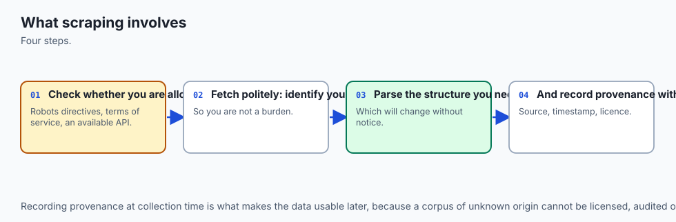
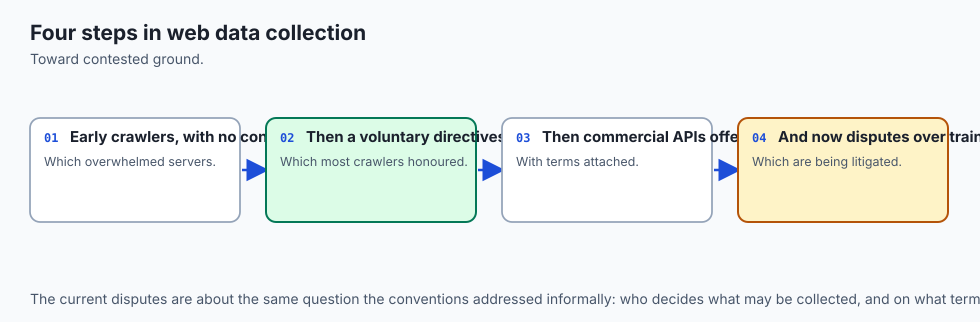
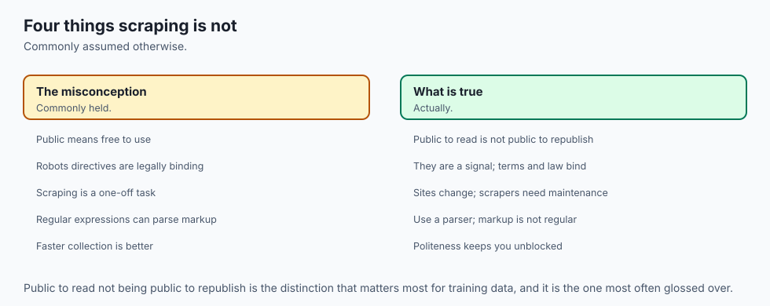
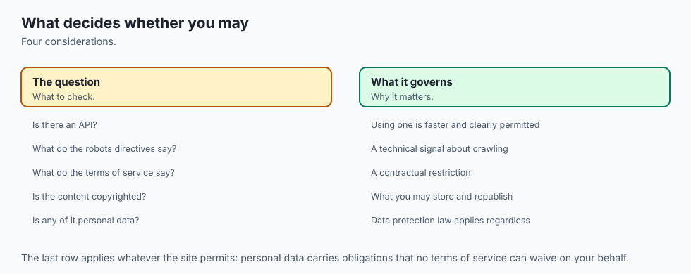
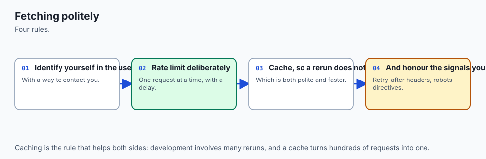
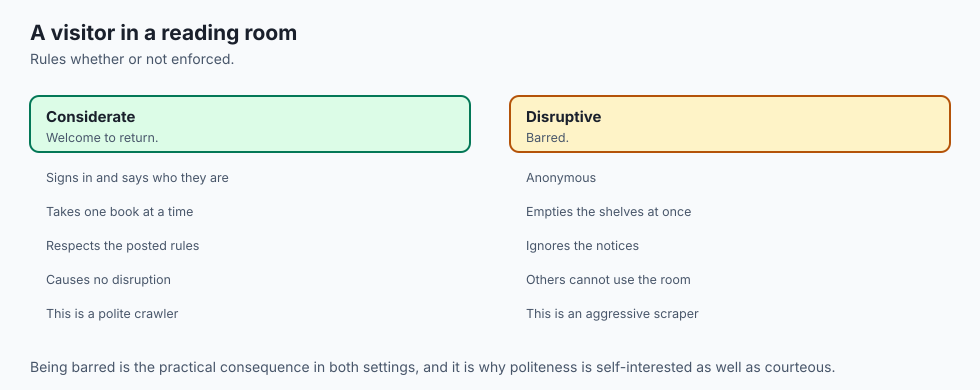
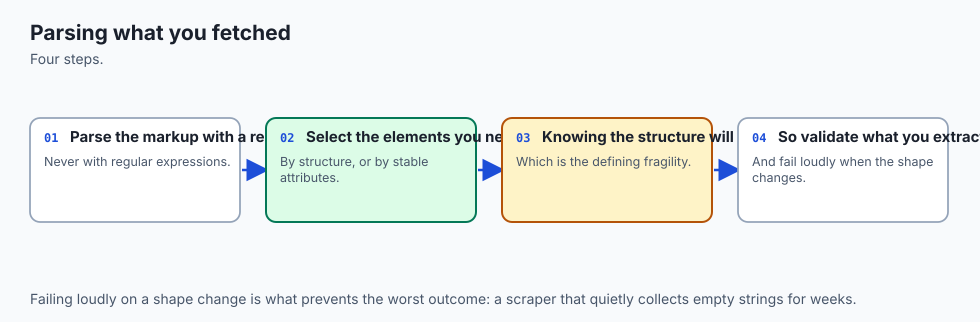
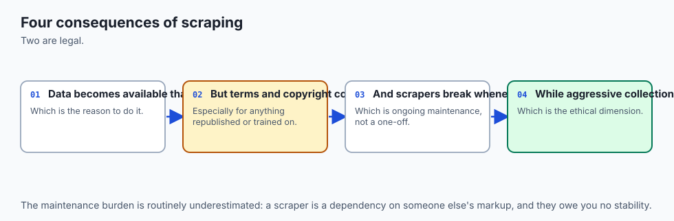
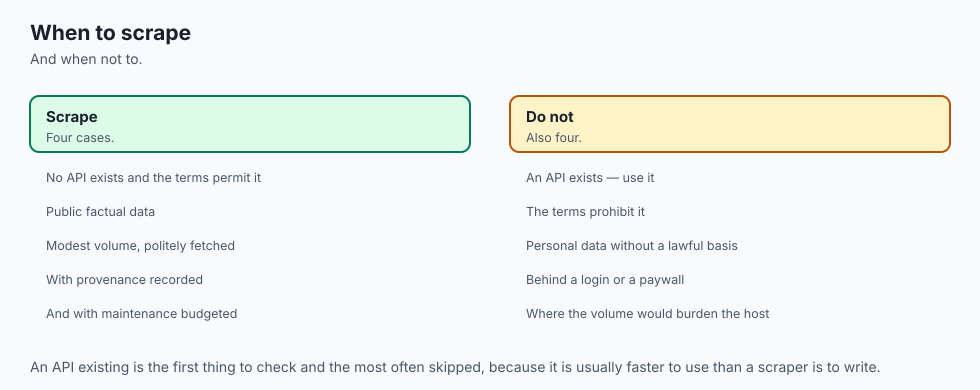

## Why this matters

Yesterday you learned to ask a server for something and get bytes back. Today you learn what to do when those bytes are a web page written for a human eye — and, just as importantly, when to put the keyboard down and not write the program at all.

Here is the practical reason this lands in an AI course rather than a web-development one. Almost every large model you will ever use, and almost every retrieval system you will ever build, sits on top of text that somebody crawled off the web. The dataset you fine-tune on next year will have a provenance section, and somebody will have to write it.

The retrieval corpus you assemble for a question-answering system will contain documents whose licences differ, whose owners never heard of you, and some of which mention named people. When you reach Course05 and Course06 and the words "dataset governance", "data provenance" and "consent" appear on the slide, they will not be new ethics bolted onto engineering you already knew. They will be exactly the questions on this page, asked at a thousand times the scale, by which point the decisions are expensive to reverse.

The engineering consequences are equally concrete and arrive much sooner. A scraper without a delay is indistinguishable, from the far end, from a small denial-of-service attack; the person on call at 2 a.m. cannot tell your curiosity from an attack, and their first move is to block your address range. A scraper without a cache re-downloads the same twelve pages every time you fix a typo in your parser, which is forty requests to somebody else's server to fix your own bug.

A scraper that chains `.text` onto a lookup that found nothing crashes on row 4,812 of a run that had already taken an hour. And a scraper written against a page's HTML is a scraper you have signed up to maintain forever, because that page is a user interface and nobody sends you a deprecation notice before renaming a `div`.

By the end of today you will be able to decide whether to scrape at all, honour a site's published rules in code rather than in a comment, extract data from messy real HTML without crashing, follow pagination to the end, cache what you fetch so a re-run costs the source nothing, and write the result to a CSV. You will also be able to say, out loud and accurately, what you do not know about the legal position — because that turns out to be a professional skill rather than a gap.

## The idea in plain language



**Web scraping** is writing a program that reads a web page and pulls structured data out of it. The page was written to be looked at: a browser turns it into headings, tables and prices for a person. Your program does something narrower — it finds the parts it cares about and writes them into a file, a spreadsheet, or a database.

The honest reason scraping exists is worth stating plainly, because a lot of confused thinking follows from getting it wrong. Scraping exists because the data is *visible to a human but not offered in a machine-readable form*. Somebody publishes a catalogue, a timetable, a register, a price list. You can see every number with your own eyes. But there is no download link, no API, no export button — so the only route from their screen to your spreadsheet is a program that reads the screen. Scraping is a workaround for a missing interface. It is not a right, it is not theft, and it is not clever: it is what you do when the front door is a window.

That framing already tells you three things. First, if the machine-readable form *does* exist, use it — an API or a data dump is faster, more stable, explicitly permitted, and does not break when a designer changes a CSS class. Second, because scraping is a workaround, you are operating on somebody else's infrastructure without their explicit invitation, which puts the burden of good behaviour entirely on you. Third, because you are reading a user interface, your program will break, and the only question is whether it breaks loudly or silently.

The word in today's title is "responsibly", and it has to be earned rather than tacked on at the end. So the order of this lesson is deliberate. Before any technique, we cover the rules a site publishes and how to honour them in code; the fact that terms of service are a contract question no library can answer; rate limiting as a matter of not degrading a service other people are using; identifying yourself honestly; the special weight of personal data; copyright in the words and pictures you extract; and the plain statement that the legal position varies by jurisdiction and by case.

Then we cover the alternatives you should exhaust before writing a single line. Only then do we get to `BeautifulSoup`, CSS selectors and pagination — because knowing how to do a thing is not the same as having decided to do it.

## Historical background



The web was barely a year old as a public phenomenon when the problem appeared. In 1993 and 1994, the first automated programs to walk the web — variously called robots, spiders, wanderers or crawlers — began indexing pages, and immediately began overwhelming the small, slow servers of the day. A server that could comfortably serve a few dozen human readers an hour would collapse under a robot that requested every page as fast as the network allowed.

In 1994 **Martijn Koster**, a Dutch software engineer working on early web indexing, proposed a solution that was almost aggressively simple: a plain text file at a fixed location, `/robots.txt`, in which a site's operator lists the paths that automated clients should not fetch. There was no committee and no standards body. It was a convention agreed on a mailing list, and it worked because the alternative — every site building its own blocking machinery — was worse for everyone.

That convention ran the web's crawler etiquette for nearly three decades before finally being written down as a formal standard: **RFC 9309, the Robots Exclusion Protocol**, published by the IETF in 2022. Twenty-eight years is an unusually long time for a de facto standard to survive unaltered, and it survived because it is honest about what it is: a request, not a lock.

The tooling grew up alongside. Perl dominated early text extraction because the web's first generation of automation was Perl's home ground, and regular expressions were the obvious hammer. Python's **Beautiful Soup**, written by Leonard Richardson and named after the poem in *Alice's Adventures in Wonderland*, made a different bet: rather than matching patterns in a string, build a tree from the markup — even when the markup is broken — and let people walk it. The version you install today is Beautiful Soup 4, distributed as `beautifulsoup4` and imported as `bs4`, and that name mismatch has confused every single person who has ever installed it.

Two other threads matter. On the parsing side, `lxml` wrapped the mature C libraries `libxml2` and `libxslt`, bringing genuine XPath and considerable speed to Python; browsers, meanwhile, converged on a single specified algorithm for parsing real-world HTML, which the `html5lib` library implements in Python. On the framework side, **Scrapy** arrived in the late 2000s as a full crawling framework rather than a parsing library — scheduling, concurrency, retries, pipelines and throttling, in one opinionated package.

The most recent chapter is the one that pushed scraping back into the news. As the web moved to JavaScript-heavy applications, a growing share of pages arrived at the browser nearly empty and filled themselves in afterwards, which meant a plain HTTP fetch returned markup containing none of the data. Browser-automation tools built for testing — Selenium first, then Playwright and Puppeteer — became scraping tools by adoption.

And separately, the assembly of enormous text corpora for training language models turned "who crawled this, under what rules, and may it be used for that?" from a niche question into a live one that sites, publishers, courts and regulators are all still working through. That question is not settled, and this lesson will not pretend otherwise.

## What it is — and what it is not



Web scraping is the automated extraction of structured data from documents intended for human display. It has a close relative that people constantly conflate with it: **crawling** is the act of discovering and following links across a site or the wider web, and scraping is the act of pulling fields out of a page once you have it. A search engine crawls enormous numbers of pages and scrapes very little from each. A price monitor crawls almost nothing and scrapes a lot. Most real jobs are a small crawl feeding a focused scrape, which is exactly what today's lab builds.

What scraping is *not* is worth more of your attention, because every item below is a belief that gets people into genuine trouble.

| Common misconception | The reality |
| --- | --- |
| "It is public, so I can take it." | Visibility and permission are different questions. A page can be freely readable and still be copyrighted, still be covered by terms you accepted, and still contain personal data whose collection is regulated. "I could see it" answers none of those. |
| "`robots.txt` blocks me from that page." | It blocks nothing. It is a text file stating a preference; your program chooses to honour it. A server that must not serve a page uses authentication, not a text file. |
| "If there is no `robots.txt`, there are no rules." | A missing `robots.txt` means no crawl preferences are published. Copyright, terms of service and data-protection law are all still there. |
| "Scraping is illegal." | Nothing that simple is true. The legal position depends on your jurisdiction, the site's terms, what you collect, how you collect it, and what you then do with it — and it has changed repeatedly. This lesson is not legal advice. |
| "Scraping is always legal, it is just reading a website." | Equally untrue, and for the same reasons in reverse. |
| "A regular expression is fine for simple HTML." | HTML that looks simple is not. Attribute order varies, classes come in lists, tags nest, entities encode characters, whitespace is decorative. You will see three of these break a careful regular expression later in this lesson, on markup a browser renders perfectly. |
| "My scraper works, so the job is done." | Your scraper works *today*, against *today's* markup. It is now a maintenance commitment with no upstream release notes. |
| "Caching is a performance optimisation." | Caching is primarily an ethical control. It is what makes your twentieth parser iteration cost the site nothing. |
| "Being polite means going slowly." | Politeness is a bundle: a delay, a cache, an honest identity, a narrow field list, backing off when the server says to, and stopping when asked. Slowness alone is not enough. |

And one more distinction, because it is the single most common failure mode: scraping is not *reading a data source*. It is reading a **user interface**. The markup you rely on exists to make a page look right, not to expose data, and no one is obliged to keep it stable for you. Everything brittle about scrapers follows from that one fact.

## Why it was created and what problems it solves



The problem scraping solves is a gap, and it is worth naming the gap precisely: **the data is published but not offered.**

Consider the categories where this happens over and over. A municipal authority publishes planning applications as a paginated table on a website; the data exists as records in their system, but the only public form is HTML. A retailer lists products with prices; the prices come from a database, but no customer-facing export exists. A university publishes a course timetable. A regulator publishes a register of licensed firms. A conference publishes its schedule. In every case, a machine-readable form exists *somewhere upstream*, and the published artefact is a rendering of it. Scraping is the reconstruction of the upstream data from its rendering — which is why it is always a little lossy and always a little fragile.

Scraping solves four recurring problems.

**Access to data that has no interface.** This is the core case. Without scraping, the only route is manual copying, which does not scale past a few dozen rows and is more error-prone than code.

**Aggregation across sources that will never agree on a format.** Comparing prices across five shops, or vacancies across ten job boards, means normalising five or ten different renderings into one shape. Even where each site has an API, the shapes differ; where they do not, scraping is the only leveller.

**Monitoring change over time.** A snapshot is one thing; a daily record of how a set of values moved is a different and often more valuable thing, and no site provides the history.

**Research corpora.** This is the one that leads straight into your AI work. Every large text collection assembled from the web — for language modelling, for retrieval, for linguistic study — came from crawling, and every one of them inherited the questions in this lesson. The scale changes the arithmetic completely: a decision that is trivially fine for twelve rows of a catalogue can be a significant matter at ten billion pages, both technically and legally. Learning the discipline at twelve rows is much cheaper than learning it at ten billion.

It is worth being clear about what scraping does *not* solve. It does not give you data you were not permitted to have. It does not give you a stable interface. It does not give you the upstream data's structure, only whatever survived the rendering. And it does not give you the right to redistribute what you collected.

## How it works



We will take this in the order that matters: permission, then alternatives, then technique.



Read that diagram as a claim about cost. Everything above the cache costs the site something. Everything below it costs only you. The single most useful structural decision you can make is to put the cache as early as possible, because the parser is the part you will run twenty times.

### The responsibilities, in order

**1. `robots.txt`, and how to actually honour it.**

Every site may publish a file at the fixed path `/robots.txt` — always at the root of the host, never anywhere else. It is plain text, it is grouped by `User-agent`, and its main directives are `Disallow` and `Allow`. Here is the one the lab ships, which is a realistic small example:

```text
User-agent: *
Disallow: /private/
Crawl-delay: 1

User-agent: GreedyBot
Disallow: /

Sitemap: /sitemap.txt
```

That says: any client at all should stay out of `/private/`; a client calling itself `GreedyBot` should stay out of everything; a delay of one second between requests is requested; and there is a sitemap listing the pages the site would like you to know about.

Python parses this for you. `urllib.robotparser` is standard library — nothing to install:

```python
import urllib.robotparser
from urllib.parse import urljoin

# `base` is whatever site you are working with. In the lab it is the local
# test server on 127.0.0.1, at the port the operating system assigned this
# run — which is why nothing here hard-codes a port number.
parser = urllib.robotparser.RobotFileParser()
parser.set_url(urljoin(base, "/robots.txt"))
parser.read()                                    # fetches and parses
parser.can_fetch("MyBot/1.0", urljoin(base, "/catalogue/page-1.html"))
```

`can_fetch` takes the User-Agent string *and* the URL, because the rules are per-client. Note what `read()` does: it opens its own connection with urllib's default headers, which means the site cannot tell it was you. In the lab we do it differently — fetch `robots.txt` with our own session and our own `User-Agent`, then hand the lines to the parser:

```python
response = session.get(robots_url, headers={"User-Agent": USER_AGENT}, timeout=10)
if response.status_code == 200:
    parser.parse(response.text.splitlines())
elif response.status_code in (401, 403):
    parser.disallow_all = True     # RFC 9309: treat the whole site as off limits
else:
    parser.allow_all = True        # 404 means no rules published
```

Those three branches are not pedantry. RFC 9309 says that if fetching `robots.txt` is refused with an authentication or forbidden status, a crawler should treat the entire site as disallowed; if it is simply absent, everything is permitted. Getting the "unavailable" case wrong in the permissive direction is how a well-meaning crawler ends up somewhere it was told not to go.

**2. What a crawl delay means.**

`Crawl-delay` is a widely-supported extension rather than part of RFC 9309 proper, and it means: *wait this many seconds between consecutive requests to this site.* One second between requests is a rate of one request per second, which is roughly the speed of a fast human clicking. Python exposes it, and returns `None` when the site declares nothing:

```python
delay = parser.crawl_delay("MyBot/1.0")   # 1, or None
```

`crawl_delay()` and its sibling `request_rate()` have been available since Python 3.6. Two gotchas: `RobotFileParser` only accepts whole-number delays, so a fractional value in a site's file is silently ignored and you get `None`; and when you get `None`, the correct response is to pick a conservative default yourself, not to conclude that no delay was requested and hammer away. The lab defaults to one second.

**3. Terms of service — a contract question, not a technical one.**

`robots.txt` is machine-readable. A site's terms of service are not, and there is no library that will ever read them for you. They are prose written by lawyers, they frequently address automated access explicitly, and in many jurisdictions accepting them creates a contractual obligation independent of anything to do with copyright or computer-misuse law. Some sites permit scraping for personal research and forbid it commercially; some forbid it entirely; some require attribution; some impose a rate limit in the terms that differs from the one in `robots.txt`.

The engineering point is that this is a human's job and it happens before you open your editor. The professional point is that "I did not read them" has never been a good position, and "my program read `robots.txt`, so I was compliant" confuses two entirely different documents.

**4. Rate limiting and backoff — because other people are using that server.**

Think about what a request costs the far end: a database query or two, some template rendering, some bandwidth, and a slot in a connection pool that a human reader could have used. One request is nothing. Ten thousand in a minute is an outage, and the person it hurts is not the site's owner — it is the next reader who gets a timeout.

So: put a delay between requests, and honour what the server tells you. HTTP has a status code for exactly this, **429 Too Many Requests**, and a header, **`Retry-After`**, which gives either a number of seconds or a date. A 503 with a `Retry-After` means the same thing. Day 78's retry-with-backoff machinery is the right tool; the addition today is that backoff is not only about your own reliability, it is about the other users of a shared resource.

Three practical rules. Run one request at a time against a given host unless you have specific permission to do more — concurrency is where polite scrapers turn impolite fastest. Schedule large jobs for the site's quiet hours where you can work them out. And if you get blocked, treat that as an answer rather than an obstacle: rotating addresses or forging headers to get around a block converts an etiquette problem into something much worse.

**5. Identify yourself honestly.**

Send a `User-Agent` that says what your program is and how to reach you:

```python
USER_AGENT = "HarbourCatalogueLab/1.0 (course exercise; contact: scraper-owner@example.com)"
```

This is one of the highest-value lines in a scraper and it takes ten seconds to write. A site operator looking at their logs at 3 a.m. and seeing an unfamiliar client hammering a page has exactly two options: block it, or find out who it is. If your string names your program and gives an address, you get an email asking you to slow down. If it is blank, or a copied browser string pretending to be Chrome, you get blocked — and rightly, because a client disguising itself as a browser has told the operator something about its intentions.

The same principle applies to everything else you might be tempted to fake. Do not forge a `Referer`. Do not rotate through addresses to evade a rate limit. Do not work around a login. Each of those is a step from "reading a public page with a program" toward "circumventing a control", and that step is precisely where the legal picture in most jurisdictions changes character.

**6. Personal data and privacy.**

If what you are collecting includes information about identifiable people — names, photographs, profiles, reviews, posts, addresses, whatever links back to a person — you are in a materially different situation, and the rule to hold onto is this: **"publicly visible" is not the same as "free to collect, store and republish".**

Those are three separate acts and data-protection regimes treat them separately. A person who posted a review under their name consented to it appearing on that site, next to that product, for readers of that site. They did not thereby consent to appearing in your database, being cross-referenced with a second site, being retained for five years, or being republished somewhere they cannot see. Aggregation itself changes the character of the data: a hundred individually unremarkable public facts about one person become a profile, and a profile is a different thing from its parts.

There is also the question of whether *you* now hold personal data, with everything that follows: a purpose you can state, a retention period, a way to delete it on request, and a duty to keep it safe. That is not a burden you want to acquire by accident on a Saturday afternoon. The practical rule: if people are in your data, stop before you write the loop, work out whether you need that field at all, and prefer not collecting it to collecting it and being careful. The best protection for personal data is not to have it.

**7. Copyright in what you extract.**

Publishing something on the web does not put it in the public domain. Article text, photographs, reviews, descriptions and illustrations are typically protected by copyright, held by the author or the site. Extracting a copy is a reproduction; republishing it is a distribution. Whether any given use is permitted depends on the jurisdiction and on doctrines with different names and different scope in each — fair use, fair dealing, text-and-data-mining exceptions, database rights — and those doctrines are actively contested for exactly the uses this lesson is about.

There is a rough heuristic worth knowing, though it is a starting point and not a rule. Facts are generally not copyrightable, while their expression usually is. That a product costs £42.00 is a fact; the three-paragraph description of it is expression. Scraping numbers to compute a statistic sits on much firmer ground than mirroring an article. This is why the advice "scrape the minimum you need" is not only an engineering rule about maintenance — the smaller and more factual your extract, the fewer of these questions you are in.

**8. The plain statement, which you should be able to make yourself.**

The legal position on web scraping varies by jurisdiction, by the terms of the specific site, by what is collected, by how it is collected, and by what is done with it afterwards. It has changed several times and will change again.

**This lesson is not legal advice, and neither is any blog post, forum answer, or model output you will find on the subject.** What this lesson gives you is the engineering discipline that keeps you out of the easy trouble and a clear enough picture of the questions to recognise when you need a real answer from someone qualified to give one. Being able to say that precisely, rather than either "scraping is illegal" or "it is public so it is fine", is what a professional sounds like.

### Exhaust the alternatives first


Before you write anything, spend ten minutes looking for the machine-readable form. It exists more often than people expect, and every one of these options is better than scraping on every axis that matters: it is faster, it is stable, it is explicitly permitted, and it does not break when a designer touches the stylesheet.

**An official API.** Look for a `/api` path, a developer or documentation link in the footer, or a section of the site aimed at partners. Many public bodies and most large services have one. An API gives you JSON you can parse with `response.json()` — no parser, no selectors, no breakage when the layout changes. It usually gives you a documented rate limit, which converts "how fast is polite?" from a judgement call into a number.

**A published data dump or export.** Statistical agencies, public registers, transport authorities and many research sites publish periodic CSV, JSON or database exports precisely so that people stop scraping them. One download can replace an entire crawler.

**An RSS or Atom feed.** For anything that publishes items over time — news, blogs, job boards, release notes, forums — a feed is a purpose-built machine-readable version of exactly the page you were about to scrape. Look in the page's `<head>` for `<link rel="alternate" type="application/rss+xml">`, or try `/feed` and `/rss`.

**A bulk download or a sitemap.** `robots.txt` frequently names a `Sitemap:`, which is a machine-readable list of the site's pages. Even when you do end up scraping, the sitemap is a better source of URLs than a crawl loop: it does not miss pages, it does not need pagination logic, and it keeps working when the site adds a fourth page. The lab's fixture site publishes one, and one of the extension exercises is to use it instead of crawling.

**Ask.** This is the option people skip and it works startlingly often. A short, specific email — who you are, which fields you need, what for, how often — frequently produces either a dump, credentials to a private API, or an explicit yes. It costs one message. The worst realistic outcome is a clear no, and a clear no is genuinely useful information: it tells you where you stand before you have invested a week.

Only when all of those come up empty is a scraper the right answer.

### Why an HTML parser beats a regular expression

Now the technique. The first thing to internalise is that you do not pattern-match HTML with a regular expression, and the reason is not stylistic.

Here is a real example from the lab's fixture site. The naive regular expression is not a straw man — it is what a careful person writes first, and it is anchored on the actual markup:

```python
NAME_RE = re.compile(r'<td class="name">([^<]*)</td>')
```

Against the first row it works perfectly:

```html
<td class="name">Brass Sextant</td>
```

Now here are three other rows from the same page. Every one of them is valid HTML that a browser renders without complaint, and every one of them defeats that expression in a different way:

```html
<td class="name featured">Mariner Astrolabe</td>
<td class="name">Ink &amp; Quill Set</td>
<td class="name">Vellum Notebook <span class="badge">new</span></td>
```

The first has two classes. `class` holds a *list*, and a CSS selector for `.name` matches a class that is present in that list — but the literal string `class="name"` does not appear in the markup at all, so the regular expression matches nothing and the row silently vanishes. The second contains an HTML *entity*: `&amp;` is how a literal ampersand is written in markup. The regular expression hands you `Ink &amp; Quill Set`, which is not the product's name and will look wrong in every downstream file. The third has a nested tag, and `[^<]*` stops dead at the `<` of the `<span>`, so this row silently vanishes too.

Run the comparison in the lab and here is what actually comes out:

```text
regular expression found: 10 names
BeautifulSoup found: 12 names

missed by the regular expression: 4
  'Mariner Astrolabe'
  'Ink & Quill Set'
  'Vellum Notebook'
  'Linen Thread Spool'
```

Two rows missing, one value wrong, and one wrapped in the whitespace the HTML author used for indentation. Notice the failure mode: it does not raise. It returns ten plausible-looking names and you have no signal that two are gone. A parser fails loudly or not at all; a regular expression fails quietly, which is much worse.

The underlying reason is structural. HTML is a nested, tolerant, ambiguous format, and a regular expression describes a flat pattern in a string. Attribute order can vary; quotes can be single, double or absent; tags can be unclosed and browsers will still render them; comments and script blocks can contain anything at all. A parser handles all of that once, correctly, in code that thousands of people have already debugged. Use one.

### Beautiful Soup basics

Install it as `beautifulsoup4`; import it as `bs4`. That mismatch is the first thing that catches everyone:

```python
from bs4 import BeautifulSoup

soup = BeautifulSoup(html, "html.parser")
```

The second argument names the parsing backend, and you should always pass it explicitly — omit it and Beautiful Soup picks the best one installed, which means your program behaves differently on a machine with `lxml` than on one without. `"html.parser"` is Python's own, ships with the standard library, needs no compiler and is the right default for a job this size. We will cover the alternatives shortly.

The object you get back is a tree of `Tag` objects, and there are three things you do with it: find nodes, walk between nodes, and pull values out of nodes.

### `find` and `find_all` versus `select`

Beautiful Soup gives you two ways to locate elements, and they overlap heavily.

The **method style** searches by tag name and attributes:

```python
soup.find("td")                              # first td anywhere, or None
soup.find_all("td")                          # every td, as a list
soup.find("td", class_="price")              # class_ with an underscore: class is a keyword
soup.find_all("tr", attrs={"data-sku": True})  # every tr that HAS a data-sku attribute
soup.find("a", string="Next")                # matched by its text
```

The **CSS-selector style** uses the same selector language you would use in a stylesheet, or in your browser's developer tools:

```python
soup.select_one("td.price")                  # first match, or None
soup.select("table.catalogue tr.item")       # every match, as a list
soup.select("nav.pager a.next")              # descendant combinator
soup.select("tr.item > td.name")             # direct child only
soup.select("a[href]")                       # any anchor that has an href
soup.select('td[class~="name"]')             # class list contains "name"
```

| Consideration | `find` / `find_all` | `select` / `select_one` |
| --- | --- | --- |
| Reads like | Python | the selector you already know from CSS |
| Returns nothing found | `None` / empty list | `None` / empty list |
| Class handling | `class_="name"` matches a class in the list | `.name` matches a class in the list |
| Multi-level conditions | nested calls, or a lambda | one string, `"table.catalogue tr.item td.price"` |
| Where you got the selector | you write it by hand | you can copy it out of browser developer tools |
| Matching on text | `string=` / `text=` supported | not supported; CSS cannot match text |
| Best for | one attribute condition, or a text match | anything structural |

In practice: use `select` for structure, because it is one readable string and it is the same thing you tested in your browser's element inspector; use `find` when you need to match on text or on a computed condition. Do not agonise, and do not mix styles inside one function without reason.

The two most important facts about both APIs are the same fact twice. `find` and `select_one` return `None` when nothing matches — they do not raise. And `find_all` and `select` return an *empty list* — they do not raise either. This is a gift and a trap, and we return to it in a moment.

### Navigating the tree

Once you have a node, you can move around from it:

```python
row = soup.select_one("tr.item")

row.parent                 # the enclosing tbody
row.contents               # direct children, including whitespace text nodes
row.children               # the same, as an iterator
row.descendants            # everything below, depth first
row.find_next_sibling("tr")     # the next tr at this level
row.find_previous_sibling()     # the one before
row.find_parent("table")        # nearest enclosing table
```

`find_next_sibling` earns its place in a specific, common layout: a definition list or a two-column table where the label and the value are siblings rather than parent and child. `"find the cell whose text is 'Price', then take the next cell"` is often the only stable way to read such a page, because the value cell has no class of its own.

Be aware that `contents` and `children` include whitespace text nodes — the newlines and indentation between tags. `row.contents[0]` is very often a string of spaces rather than the first cell you wanted, which is why selecting by name or class is more robust than indexing by position.

### Text and attributes

Two ways to get a value out of a node, and they are not interchangeable.

**Text**, for what the reader sees:

```python
cell.get_text()                  # every descendant's text, concatenated
cell.get_text(strip=True)        # with surrounding whitespace removed
cell.get_text(" ", strip=True)   # joined with a space rather than glued together
cell.string                      # the text ONLY if there is exactly one child string
```

Three things happen here that you should expect. Entities are already decoded — `&amp;` became `&` when the parser built the tree, so you never handle them yourself. Whitespace is preserved as written unless you strip it, and HTML authors indent for readability, which is why `TOO-003` in the lab arrives as `'\n          Linen Thread Spool\n        '` without `strip=True`. And `get_text` collects the text of **every** descendant, so a decorative `<span class="badge">new</span>` inside a name cell becomes part of the name. Notice the difference the separator makes: `get_text(strip=True)` on that cell produces `Vellum Notebooknew`, glued together, while `get_text(" ", strip=True)` produces `Vellum Notebook new`. Neither is the product name. The fix is to name your exclusions:

```python
for extra in cell.select("span.badge"):
    extra.extract()             # removes it from the tree
name = cell.get_text(" ", strip=True)       # 'Vellum Notebook'
```

**Attributes**, for what the markup carries:

```python
row["data-sku"]             # raises KeyError if absent
row.get("data-sku")         # None if absent
row.get("data-sku", "")     # a default
link.get("href")            # relative, almost always
```

`data-` attributes are frequently the most stable thing on a page, because they exist for the site's own JavaScript rather than for presentation — a redesign changes classes far more often than it changes a `data-sku`. When one is available, prefer it as your identifier.

A link's `href` is usually relative, and you must resolve it against the page you found it on:

```python
from urllib.parse import urljoin

absolute = urljoin(current_page_url, link.get("href"))
```

`urljoin` handles `page-2.html`, `/catalogue/page-2.html`, `../index.html` and a fully absolute URL correctly, and you will get all four from real sites. String concatenation handles exactly one of those cases.

### Handling a missing element without crashing

This is the single most common scraping bug, so it gets its own section.

```python
price = row.select_one("td.price").get_text(strip=True)
```

That line works on every row until it meets one where the price cell is absent, and then `select_one` returns `None`, and `None.get_text` raises `AttributeError: 'NoneType' object has no attribute 'get_text'`. If that happens on row 4,812 of a job that has been running for an hour, you lose the hour.

The reason it happens constantly is that real pages are not uniform. A product is out of stock and the price is suppressed. A record is incomplete. A row is a promotional banner rather than a product. An older page predates a field that was added last year. The fixture in the lab has exactly this: `NAV-003 Brass Compass` on page 2 has no `td.price` element at all.

The fix is four lines, and getting it right is what separates a script from a program:

```python
def cell_text(row, selector, *, drop=None):
    cell = row.select_one(selector)
    if cell is None:
        return None                  # absent is an ordinary answer, not an error
    if drop:
        for extra in cell.select(drop):
            extra.extract()
    return cell.get_text(" ", strip=True)
```

Three principles are packed in there. **Never chain onto a lookup you have not checked** — no `.get_text()`, no `.string`, no `["href"]` directly on a `select_one` result. **Return `None`, do not raise**, because the caller knows what a missing price means and the extractor does not. And **treat "absent" and "empty" the same way**, because `float("")` raises just as readily as `None.get_text()` does:

```python
price = float(price_text) if price_text else None
```

Then decide, deliberately and once, what a missing field means for your data. Sometimes it means skip the row. Sometimes it means store `None` and carry on. Sometimes it means the page changed and you should stop. The important thing is that it is a decision in your code rather than an exception in your traceback. The lab stores `None`, and the CSV writes an empty field rather than the string `None` — because a CSV containing the four characters `None` is a CSV that the next program will load as text.

There is a companion check worth adding to anything you run more than once: if more than some fraction of rows are missing a field they used to have, raise. A scraper that quietly starts writing twelve empty prices a day is worse than one that crashes, because you will not notice for a month.

### Pagination

Almost every listing worth scraping is paginated. There are three common shapes.

**A "next" link**, which is the easiest and the most robust to follow. You do not need to know how many pages there are or how they are numbered; you follow the link until there is not one:

```python
def next_page_url(html, current_url):
    soup = BeautifulSoup(html, "html.parser")
    link = soup.select_one("nav.pager a.next")
    if link is None:
        return None                       # the last page has no next link
    return urljoin(current_url, link.get("href"))
```

The fixture's last page carries `<span class="next disabled">Next</span>` instead of an anchor, which is what real sites do — the control is still visually present, it just is not a link any more. `a.next` finds nothing, `select_one` returns `None`, the loop ends. This is the missing-element pattern again, being useful rather than dangerous.

**A page-number parameter**, like `?page=3`. Tempting to loop over, and the trap is knowing when to stop. Do not hard-code the count; the site will add a page. Stop when a page yields zero items, or when the page you get back is identical to the one before.

**Infinite scroll**, where a page loads more content as you scroll. There is no HTML pagination to follow, because the browser is calling an internal endpoint as you go. Open your browser's network tab, watch what it calls, and you will very often find a clean JSON API sitting right there — which is the best possible outcome, because you can call it directly and stop scraping HTML altogether.

Whatever the shape, three guards belong in the loop, and the lab has all three:

```python
while url is not None and len(seen) < max_pages:
    if url in seen:
        break                                  # a pagination cycle
    if urlparse(url).netloc != origin.netloc:
        raise OffSite(url)                     # a link that left the site
    seen.add(url)
```

The cycle guard matters because "next" links that eventually point backwards are common enough to be unremarkable, and an unbounded loop will fetch the same two pages until somebody blocks you. The host guard matters because a template variable picking up the wrong base, or a mirror linked from a footer, will happily walk your crawler onto a site whose `robots.txt` you never read. The lab has a fixture page whose "next" link points at another host, and a test that asserts the crawl refuses it rather than following it.

### Caching, so re-running your parser costs the source nothing

You will get the parser wrong. Everyone does — a selector that matched three of four rows, a field you forgot to strip, a conversion that fails on one page. Each fix means running the program again. Without a cache, each run re-downloads every page, and the site pays for your debugging.

A cache fixes this completely and is about twenty lines:

```python
def get(self, url):
    path = self._path_for(url)          # sha256 of the URL, as a filename
    if path.exists():
        self.hits += 1
        return path.read_text(encoding="utf-8")
    self.misses += 1
    return None

def put(self, url, text):
    self._path_for(url).write_text(text, encoding="utf-8")
```

And in the fetch function, the order of operations *is* the ethics:

```python
if not robots.allows(url):          # 1. permission — before any socket
    raise DisallowedByRobots(url)
if cache is not None:               # 2. cache — a hit costs the site nothing
    cached = cache.get(url)
    if cached is not None:
        return cached
if wait > 0:                        # 3. the delay — paid only by a real fetch
    sleeper(wait)
response = session.get(url, headers={"User-Agent": user_agent}, timeout=timeout)
```

Notice that the crawl delay is inside the cache miss. Sleeping before returning a cached page would be politeness theatre — no request is being made, so there is nobody to be polite to. In the lab, the first run makes three page requests and asks to wait one second three times; the second run makes **zero** page requests and asks to wait zero times.

Two design notes. First, key the cache by the full URL, hashed, so filenames are safe on every filesystem; keep a small `index.json` mapping filenames back to URLs so the directory is readable by a human rather than being thirty-two hex characters of mystery. Second — and this is the part people get wrong — **do not cache `robots.txt`.** Permission is not a fact about a page, it is a statement of somebody's current intent, and they are allowed to change it. The lab re-fetches `robots.txt` on every run, which is why its second run makes exactly one request instead of none. That one request is the point.

A cache is also a copy of somebody else's content sitting on your disk, and it inherits every question the original had: how long you keep it, whether it contains personal data, whether it belongs in version control. It does not. Give it an expiry, keep it out of your repository, and delete it when the job it was made for is done.

### Brittleness, and the maintenance argument

The last technical fact is the one that should shape your ambitions: **a scraper is a liability you have signed up to maintain.**

It breaks when the page's HTML structure changes, when a CSS class is renamed in a redesign, when a field moves into JavaScript, when pagination changes shape, when a cookie banner starts intercepting the first request, when the site adds rate limiting, when it blocks your address, when the URL scheme changes, or when the site simply goes away. None of those events comes with a warning, because you are not a customer of an interface — you are reading a user interface that exists for somebody else's readers. An API can deprecate a field with six months' notice. A `div` cannot.

Three consequences follow, and they are the whole reason this section exists.

**Scrape the minimum you need.** Every field you extract is another selector that can break. If your question needs sku and price, do not also collect the description, the image URL, the reviews and the breadcrumb trail because they were there. Less data is less breakage, less storage, fewer copyright questions and fewer privacy questions, all at once.

**Fail loudly.** Add assertions about shape, not just about values: this page should yield between one and fifty rows; at least ninety per cent of rows should have a price; the header row should still say "Price". A scraper that raises the day after a redesign has told you something useful. One that writes an empty CSV has told you nothing and will do so daily until somebody notices.

**Budget for the maintenance before you start.** The honest question is not "can I scrape this?" but "am I willing to fix this every few months for as long as I need the data?" If the answer is no, that is a strong argument for going back to the alternatives section and trying harder to find an API — or for asking whether you need the data at all.

## An everyday analogy



Think of a large public reference library, and carry it all the way through, because every piece of today maps onto it exactly.

The library is open to the public. You can walk in, take a volume off the shelf, and read it. Nobody checks your identity at the door, and nothing is locked. That is a website: published, readable, unlocked.

Inside the entrance there is a notice board. It says which rooms are open to visitors, which are staff-only, and asks that you not use the photocopier for more than a few pages at a time. Nothing on that board is a lock. The staff-only room has an ordinary door, and you could walk through it.

**That notice board is `robots.txt`**: a published statement of what the operator would like, honoured by people who intend to be welcome back. And note the two lessons that follow from the door being unlocked — as a visitor, honour the board; as someone who will one day run a library, understand that a notice is not a lock, and anything that genuinely must not be read needs a key.

Near the board is a laminated card of the library's conditions of use: no commercial reproduction, no removing volumes, no systematic copying of the collection. Nobody reads it, and everybody is bound by it. **That is the terms of service** — prose, in a different place from the notice board, addressed to a person rather than a program. There is no machine that can read it for you.

The photocopier limit is **rate limiting**. It exists not because the library resents you, but because there is one machine and other people are queuing. Monopolising it for four hours is not against the law; it is simply taking something from everyone else in the room. When the attendant asks you to pause and let someone else through, that is a **429**, and the sensible response is to pause, not to find a second copier.

Signing the visitors' book at the desk is your **`User-Agent`**. If the attendant later wonders who was in the map room all afternoon, a legible name and a phone number gets you a polite phone call. A blank line, or somebody else's name, gets you barred.

Photographing every page of a book and taking it home is where **copyright** enters. The library let you read it. That was never the same as letting you reproduce it. And the reading room's card index, if it recorded which patrons borrowed which books, would be **personal data** — visible to a member of staff, and nonetheless not something you may copy, keep, and combine with the index from the library across town.

Then there are the two doors people forget. The librarian at the desk will, if you ask, tell you that the entire catalogue is available as a printed index in the back room, or on a disc, or by post — that is the **API, the data dump and the feed**. And they will sometimes just hand you what you need if you explain what you are researching. **Asking works.** The people who spend three days photographing shelves are frequently the ones who never asked.

Finally, the analogy explains **brittleness** better than any technical account. You are not reading a database; you are reading a *room*. Shelves get reorganised, signage gets replaced, the map collection moves upstairs. Your careful notes about "third shelf from the window, second row" describe the arrangement of the furniture, and nobody is going to warn you before the furniture moves. Which is exactly why you write down as few landmarks as the job requires, and why your notes should shout when the room looks wrong rather than quietly recording nothing.

## Examples in practice



Everything below is captured from the lab, running against a fixture site served from `127.0.0.1` on a port the operating system chose. Nothing here touched the internet.

**Asking permission, and getting different answers for different clients.** The fixture `robots.txt` disallows `/private/` for everyone and refuses `GreedyBot` everything:

```text
1. Permission
   allowed  /catalogue/page-1.html   -> True
   allowed  /private/internal-notes.html -> False
   crawl delay declared               -> 1.0 s
   allowed for GreedyBot              -> False
```

**Sorting a page's links by permission before following any of them.** Page 1 links to the disallowed page, and the crawl refuses it rather than never noticing it:

```text
2. Links on page 1, sorted by permission
   allowed: /catalogue/page-2.html
   REFUSED: /private/internal-notes.html
   fetching it anyway raises DisallowedByRobots on /private/internal-notes.html
```

**The crawl, cold.** Three pages, twelve items, and one item that has no price element at all:

```text
3. First run — cold cache
   pages requested: 3 ['/catalogue/page-1.html', '/catalogue/page-2.html', '/catalogue/page-3.html']
   cache misses:    3, hits: 0
   sleeps asked for: [1.0, 1.0, 1.0] (seconds, from Crawl-delay)
   items found:     12

   sku      price     name
   NAV-001    42.00   Brass Sextant
   NAV-002   128.50   Mariner Astrolabe
   STA-001    12.75   Ink & Quill Set
   STA-002     9.99   Vellum Notebook
   NAV-003   (none)   Brass Compass
   STA-003     4.20   Sealing Wax Sticks
   TOO-001     6.50   Bookbinder's Awl
   TOO-002     5.25   Bone Folder
   TOO-003     3.80   Linen Thread Spool
   MAP-001    88.00   Coastal Chart Portfolio
   MAP-002    64.40   Star Atlas
   MAP-003    27.15   Harbour Plan Set
   items with no price cell: ['NAV-003'] — handled, not crashed
```

Look at four of those rows against the markup they came from. `NAV-002` had `class="name featured"` and was found anyway. `STA-001` had `Ink &amp; Quill Set` and arrived decoded. `STA-002` had a `<span class="badge">new</span>` inside the cell and arrived without it. `TOO-003` was wrapped in newlines and indentation and arrived stripped. And `NAV-003` had no price element whatsoever and produced `None` instead of an `AttributeError`.

**The crawl, warm.** The same program, immediately afterwards, with the cache in place:

```text
4. Second run — warm cache
   requests this run:      ['/robots.txt']
   page requests this run: 0 []
   cache hits: 3, misses: 0
   same items as the first run: True
```

Zero page requests. The one request is `robots.txt`, deliberately never cached. That single line is the difference between a scraper you can iterate on and one that costs somebody else money every time you fix a bug.

**The output**, written with the `csv` module so a comma inside a product name cannot corrupt the file:

```text
5. Output
   wrote catalogue.csv (13 lines including the header)
   | sku,name,price,stock,source_path
   | NAV-001,Brass Sextant,42.00,7,/catalogue/page-1.html
   | NAV-002,Mariner Astrolabe,128.50,2,/catalogue/page-1.html
   | STA-001,Ink & Quill Set,12.75,31,/catalogue/page-1.html
   ...
   | MAP-003,Harbour Plan Set,27.15,9,/catalogue/page-3.html
```

**And the check that matters most**, taken from the server's own access log rather than from the scraper's claims about itself:

```text
6. What the server saw, across every run above
   total requests: 7
   requests for /private/internal-notes.html: 0
```

The private page is linked from page 1. The server would have served it to anyone who asked. Nobody asked. That is what "responsibly" means when it is implemented rather than described, and it is why the lab's harness counts requests server-side: a scraper can claim anything in a docstring, but it cannot fake somebody else's log.

## Implications: security, privacy, performance, scalability, and cost



**Security.** Everything you extract is untrusted input, and the fact that it looks like a price does not make it one. Never interpolate scraped text into a shell command, a SQL query, or a file path; use parameter binding and the `csv` module, both of which quote correctly and neither of which you can forget to call. Be aware that a CSV cell beginning with `=`, `+`, `-` or `@` is interpreted as a formula by common spreadsheet software when the file is opened, which turns a scraped product name into a small attack on whoever opens your export.

On the parsing side, Beautiful Soup builds a tree and executes nothing, and `html.parser` is pure Python, so the parser itself is not an attack surface — but if you reach for browser automation later, you are running somebody else's JavaScript on your machine, which is a genuinely different risk. Finally, the security lesson that runs in the other direction: `robots.txt` is not access control. When you build servers, put authentication in front of anything that must not be read.

**Privacy.** Covered above, and it bears repeating in one line because it is the thing people get wrong: publicly visible is not the same as free to collect, store and republish. Aggregation changes the character of data — a hundred unremarkable public facts about a person become a profile. If you hold personal data you have acquired duties about purpose, retention, deletion and security, and you do not want to acquire them by accident. The cheapest privacy control in existence is not collecting the field.

**Performance.** The dominant cost in a scraper is waiting: for the network, and for your own crawl delay. Parsing is cheap by comparison, and choosing a faster parser will not make a polite scraper meaningfully faster, because you are sleeping between requests on purpose. What *does* change your wall-clock time is the cache, and by a factor that grows with every iteration. Reuse one `requests.Session` so connections are kept alive rather than renegotiated per page. Do not reach for concurrency against a single host: it is the one optimisation that improves your numbers by degrading somebody else's service.

**Scalability.** Scraping scales badly, and the badness is structural rather than technical. At ten pages you can hold the whole thing in your head. At ten thousand you need a queue, deduplication, retries, resumability, per-host politeness, and monitoring — which is the point at which a framework like Scrapy starts to earn its complexity. But the sharper limit is ethical rather than technical: a job that is obviously harmless at one page per second becomes a serious imposition at a thousand, and the questions about copyright and personal data get harder as the corpus grows, not easier. Scale is exactly where "I checked `robots.txt`" stops being a sufficient answer.

**Cost.** Your costs are compute, bandwidth, storage and — dominating everything — your own time maintaining a program with no upstream stability guarantee. But the cost that engineers systematically ignore is the one they impose on the site, which is real, is paid by someone else, and is invisible from your terminal. The cache is the single control that reduces it most, and it is free.

**And the AI thread.** Training corpora and retrieval indexes are assembled by crawling, which means every question in this lesson reappears there at a scale where the answers are expensive. Where did this document come from? Under what licence? Did the source's `robots.txt` permit that crawl on that date? Does it contain personal data, and can it be removed if someone asks? Can this corpus be redistributed, or only the model trained on it?

Those are the questions that will appear in Course05 and Course06 under the heading of dataset governance, and they are not new material — they are today's material, multiplied. Which is why the habit to build now is recording provenance alongside the data itself: the source URL, the date, and the rules in force when you fetched it. The lab's CSV carries a `source_path` column for exactly that reason. It costs one column, and it is the difference between a dataset you can answer questions about and one you cannot.

## Alternatives: free, open source, and commercial

Every option below is free and open source. There is no paid tier of any of them; the commercial market in this area is in hosted crawling and proxy services rather than in the parsing libraries themselves, and none of it is needed for the work in this course.

One honest note first, because it matters more than the comparison: **only `beautifulsoup4` (version 4.15.0) is installed on the machine this lesson was written on.** The other tools below are described from their documented behaviour, and no output is quoted for any of them, because output that was not produced by running something is a fabrication. Where a claim would need a benchmark to support it, this section says so instead of inventing a number.

**Beautiful Soup with the `html.parser` backend — the default, and the right one for today.**

*When to choose it:* almost always, to begin with. No compiler, no wheels to fail, no C library, works identically everywhere Python does, and its API is the friendliest of the lot.

*How to use it:*

```python
from bs4 import BeautifulSoup
soup = BeautifulSoup(html, "html.parser")
rows = soup.select("table.catalogue tr.item")
```

*Worked example:* the entire lab. Twelve items across three pages, including one row with a missing cell, one with a second class, one with an entity and one with a nested tag, extracted correctly.

*Cost:* free, MIT licence.

**Beautiful Soup with the `lxml` backend — the same API, a faster and stricter engine.**

*When to choose it:* when you are parsing many megabytes of HTML and profiling shows parsing is genuinely your bottleneck — which, in a polite scraper that sleeps between requests, it usually is not. Also when you want more consistent handling of badly broken markup than `html.parser` gives you.

*How to use it:* `pip install lxml`, then change one string:

```python
soup = BeautifulSoup(html, "lxml")
```

*Worked example:* the change above is the entire migration. Every selector and every method in this lesson continues to work unaltered, which is the point of Beautiful Soup's backend abstraction.

*Cost:* free, BSD licence. The practical cost is installation: `lxml` is a binary wheel wrapping `libxml2`, so on an unusual platform or an old Python you can find yourself needing a compiler.

*Honest note:* `lxml` is documented and widely reported as substantially faster than `html.parser`. This lesson does not quote a multiplier, because no benchmark was run here and repeating someone else's number as if it were measured would be dishonest. If speed matters to you, measure it on your own documents.

**`lxml` used directly, with XPath.**

*When to choose it:* when you need **XPath** specifically. XPath is a query language for tree documents and it can express things CSS selectors cannot — most usefully, selecting on text content and walking back up the tree. `"find the cell whose text is 'Price', then take its following sibling"` is a single XPath expression and is awkward in CSS.

*How to use it:*

```python
from lxml import html as lxml_html

tree = lxml_html.fromstring(page_source)
names = tree.xpath('//tr[@class="item"]/td[contains(@class, "name")]/text()')
price = tree.xpath('//td[text()="Price"]/following-sibling::td[1]/text()')
```

*Worked example:* the second expression is the case that makes XPath worth learning — a label-and-value layout where the value cell has no class of its own, so there is nothing for a CSS selector to grip. `following-sibling::td[1]` says "the first `td` after this one at the same level".

*Cost:* free, BSD licence.

**`selectolax` — a fast, minimal parser.**

*When to choose it:* when you are parsing a very large number of documents and you have measured that parsing dominates. It wraps a C HTML parser and exposes a deliberately small API centred on CSS selectors.

*How to use it:*

```python
from selectolax.parser import HTMLParser

tree = HTMLParser(html)
for node in tree.css("tr.item"):
    name_node = node.css_first("td.name")
    name = name_node.text(strip=True) if name_node else None
```

*Worked example:* the pattern above is the same missing-element discipline as Beautiful Soup's, in a different vocabulary — `css_first` returns `None` exactly as `select_one` does, and you must check it exactly as carefully.

*Cost:* free, MIT licence.

*Honest note:* it is described by its authors as a fast parser and is chosen for throughput. It has a narrower API than Beautiful Soup — no `find_all` with text matching, no tree-mutation conveniences — which is a deliberate trade. No timing figures are quoted here because none were measured on this machine.

**Scrapy — the framework, for crawls at scale.**

*When to choose it:* when the job is a *crawl* rather than a scrape. When you need scheduling, deduplication of URLs, automatic retries, concurrency with per-domain politeness, resumable jobs, and a pipeline to clean and store items — Scrapy gives you all of that as configuration rather than as code you write and debug. Below roughly a few hundred pages it is more machinery than the problem needs.

*How to use it:* you write a spider class rather than a script.

```python
import scrapy

class CatalogueSpider(scrapy.Spider):
    name = "catalogue"
    start_urls = [urljoin(base, "/catalogue/page-1.html")]
    custom_settings = {
        "ROBOTSTXT_OBEY": True,
        "DOWNLOAD_DELAY": 1.0,
        "USER_AGENT": "MyCrawler/1.0 (contact: me@example.com)",
        "AUTOTHROTTLE_ENABLED": True,
    }

    def parse(self, response):
        for row in response.css("tr.item"):
            yield {
                "sku": row.attrib.get("data-sku"),
                "name": row.css("td.name::text").get(default="").strip(),
                "price": row.css("td.price::text").get(),
            }
        next_page = response.css("nav.pager a.next::attr(href)").get()
        if next_page is not None:
            yield response.follow(next_page, callback=self.parse)
```

*Worked example:* read those four settings, because they are the whole argument for the framework. `ROBOTSTXT_OBEY` makes robots compliance a switch rather than code you might forget; `DOWNLOAD_DELAY` and `AUTOTHROTTLE_ENABLED` give you politeness and adaptive backoff without writing either. Everything Scrapy makes into a setting, you wrote by hand today — which is exactly why writing it by hand first was worth doing.

*Cost:* free, BSD licence.

**Playwright (or Selenium, or Puppeteer) — driving a real browser.**

*When to choose it:* only when the data genuinely is not in the HTML you receive. Some pages arrive nearly empty and are filled in by JavaScript; a plain `requests.get` on such a page returns markup with no data in it. Browser automation runs a real browser engine, executes the page's scripts, and hands you the resulting DOM.

*How to use it:*

```python
from playwright.sync_api import sync_playwright

with sync_playwright() as p:
    browser = p.chromium.launch()
    page = browser.new_page()
    page.goto(urljoin(base, "/catalogue/page-1.html"))
    page.wait_for_selector("tr.item")
    html = page.content()          # now hand this to BeautifulSoup as usual
    browser.close()
```

*Worked example:* note the last two lines of the block. Once you have `page.content()`, everything else in this lesson applies unchanged — browser automation solves the *fetching* problem and gives the parsing problem straight back to you.

*Cost:* free, Apache 2.0 licence.

*The honest note this section exists for:* **a page that requires a headless browser is an expensive page to scrape, and usually a sign that you should be looking for an API.** You are now running a full browser engine per page — hundreds of megabytes of memory, seconds instead of milliseconds, a large binary to install and keep updated, and a much harder time in continuous integration.

And there is a strong clue in the situation itself: if the page fills itself in with JavaScript, it is fetching that data from an endpoint, and that endpoint usually returns clean JSON. Open your browser's network tab, find the request, and call it directly. You will trade a fragile browser-automation pipeline for a two-line `requests` call, which is one of the best trades available in this whole subject.

| Tool | Best for | API style | Install | Licence | Cost |
| --- | --- | --- | --- | --- | --- |
| Beautiful Soup + `html.parser` | almost every small-to-medium job | `find` / `select` | pure Python | MIT | free |
| Beautiful Soup + `lxml` | the same code, larger documents | `find` / `select` | binary wheel | MIT + BSD | free |
| `lxml` direct | XPath, text-based and upward queries | XPath | binary wheel | BSD | free |
| `selectolax` | very high document throughput | CSS only | binary wheel | MIT | free |
| Scrapy | crawls of hundreds to millions of pages | spider classes + settings | pure Python | BSD | free |
| Playwright | pages whose data is not in the HTML | browser automation | package + browser binaries | Apache 2.0 | free |

## Comparison with related concepts

| Concept | What it does | How it differs from scraping | When you want it instead |
| --- | --- | --- | --- |
| **Web API** | serves data in a machine-readable format, by design | a supported interface with documented stability, permission and rate limits | always, when one exists |
| **RSS / Atom feed** | a machine-readable list of recent items | purpose-built for exactly the "what is new" question | anything that publishes over time |
| **Data dump / bulk export** | one file containing the whole dataset | one request instead of thousands; no parsing of markup | whenever the publisher offers one |
| **Crawling** | discovering and following links | crawling finds pages, scraping extracts fields from them | when you do not know the URLs in advance |
| **Search-engine indexing** | crawling at web scale to build an index | scale, and the goal is retrieval rather than structured fields | never, as a beginner project |
| **Screen scraping (terminal / desktop)** | reading a terminal or GUI application's output | same idea, older medium, same brittleness | legacy systems with no other interface |
| **ETL** | extract, transform, load between known systems | ETL usually starts from a system you control or have credentials for | internal data pipelines |
| **Robotic process automation** | scripting a user interface to perform actions | RPA *acts* — it clicks, submits, buys; scraping only reads | automating workflows, not gathering data |
| **`urllib.request`** | fetching a URL with the standard library | this is the fetch step only; no parsing, no politeness | Day 78 covered it; it is what `robotparser.read()` uses |

Two of those deserve a second look. The distinction between **scraping and RPA** is the sharpest ethical line in the table: reading a page and *acting* on it — submitting a form, buying a ticket, posting content — are different activities with different consequences, and terms of service that tolerate the first frequently prohibit the second in strong terms. And the distinction between **crawling and scraping** matters practically, because the two have different failure modes: a bad crawler visits places it should not, and a bad scraper produces wrong data silently. Today's lab makes you build one small example of each, with a test for each failure mode.

## When to use it — and when not to



**Use scraping when:**

- You have genuinely checked for an API, a data dump, a feed and a sitemap, and none exists.
- `robots.txt` permits the paths you need, and you have read the terms of service yourself.
- The data is factual — prices, counts, dates, statuses — rather than expressive content you would be reproducing.
- No identifiable people are involved, or you have a clear and lawful basis for the ones who are.
- The volume is modest and you can go at a polite pace and still finish in a reasonable time.
- You are willing to maintain the program for as long as you need the data.
- You only need a few fields, and you can name them before you start.

**Do not scrape when:**

- An API, feed or bulk download exists. This is not a close call.
- `robots.txt` disallows the path, or the terms of service prohibit automated access.
- You would have to log in, defeat a bot check, forge headers, or rotate addresses to get in. Each of those converts "reading a public page" into "circumventing a control", and that is where the legal character changes.
- The data is substantially personal, and you cannot articulate a lawful basis and a retention period.
- You intend to republish substantial expressive content rather than derive facts from it.
- The site is small enough that your traffic would be a noticeable share of its load.
- You need the data to be reliable at a fixed time every day, and nobody is on the hook to fix the scraper when it breaks at 4 a.m.
- The page needs a headless browser and you have not yet looked for the JSON endpoint that browser is calling.

**And the judgement call in one sentence:** if you would be uncomfortable explaining your scraper to the person who runs the site — the rate, the fields, the frequency, the purpose — that discomfort is data, and it is usually pointing at either a conversation you should have or a program you should not write.

## The AI connection

- **Scraping is how much training data is actually collected**, which makes its ethics a
  practical concern.
- **Robots directives and terms of service** are the boundary between collection and misuse.
- **Rate limiting is a courtesy and a requirement**, and ignoring it gets you blocked or sued.
- **Scraped data carries licence and provenance obligations**, which propagate to anything
  trained on it.
- **A scraper that identifies itself** is the difference between a good citizen and an
  attacker.

## Knowledge check

Work through these before the exercise; each corresponds to something the lab's tests actually assert.

1. A site has no `robots.txt` at all. What does that permit, and what does it not change?
2. Why does this lesson fetch `robots.txt` with its own session and `User-Agent` rather than calling `RobotFileParser.read()`?
3. `parser.crawl_delay(agent)` returns `None`. What should your scraper do, and what should it not conclude?
4. Give three distinct ways a valid HTML page can defeat `re.compile(r'<td class="name">([^<]*)</td>')`. For each, say whether the failure is loud or silent.
5. What exactly do `select_one` and `select` return when nothing matches, and what is the single most common bug that follows from it?
6. Why does the lab's fetch function sleep *after* checking the cache rather than before?
7. Why is `robots.txt` the one response the lab deliberately never caches?
8. A crawl loop follows `a.next` until it is absent. Name two additional guards the loop needs, and what goes wrong without each.
9. Your scraper writes a CSV in which a missing price appears as the four characters `None`. Why is that a bug rather than a cosmetic issue?
10. How would you prove — to someone sceptical — that your scraper never requested a disallowed path? Why is your own log insufficient?

## Hands-on exercise

Open the Day 79 lab and build the scraper described there against the **Harbour Chandlery**, a three-page fixture catalogue served from `127.0.0.1` on a port the operating system assigns at run time. Nothing you run today reaches the internet.

Set it up:

```bash
cd labs/sections/programming-with-python/day-079-web-scraping-responsibly
python3 -m venv .venv
.venv/bin/pip install -r requirements/requirements.txt
```

Then read the site's rules, exactly as you would on a real site, and watch the parser beat the regular expression:

```bash
cat examples/fixtures/robots.txt
PYTHONPATH=examples .venv/bin/python3 examples/regex_vs_parser.py
PYTHONPATH=examples .venv/bin/python3 examples/demo.py catalogue.csv
```

Now do the work. `starter/catalogue_scraper.py` has six numbered exercises; `RobotsPolicy.load` is left finished as a worked model of the style expected. Complete them in order, running the suite against **your** module after each one:

```bash
SCRAPER_MODULE=starter .venv/bin/pytest tests -q
```

1. **Permission.** `RobotsPolicy.allows` and `.crawl_delay_seconds`, on top of `urllib.robotparser`.
2. **Extract the table.** `parse_items`, with `soup.select("table.catalogue tr.item")`.
3. **Survive the missing element.** `_cell_text` — `select_one`, a `None` check, an optional exclusion, `get_text(" ", strip=True)`.
4. **Pagination.** `next_page_url` and the `scrape_catalogue` loop, stopping when the site says there is no next page.
5. **The cache.** `ResponseCache.get` and `.put`, so a second run makes zero page requests.
6. **The CSV.** `write_csv`, with an empty field where a price is missing.

Finally, run the whole harness:

```bash
bash tests/run_tests.sh
```

### Expected output

You begin at `33 failed, 1 passed` and finish at `34 passed`. The harness then reports:

```text
51 checks, 0 failure(s).
```

The three lines inside it worth reading carefully:

```text
  ok: the disallowed path was requested ZERO times, per the server's own log
  ok: a second run makes ZERO page requests
  ok: the naive regex finds only 10 of the 12 names
```

And the demo's final section, which is the whole lesson in four lines:

```text
6. What the server saw, across every run above
   total requests: 7
   requests for /private/internal-notes.html: 0
```

One line in `expected-output/test-run.txt` legitimately differs on your machine — the two ephemeral port numbers in section 1. That is the check passing, not drifting.

### Validate your work

1. `bash tests/run_tests.sh` exits 0 and prints `51 checks, 0 failure(s).`
2. `SCRAPER_MODULE=starter .venv/bin/pytest tests -q` reports `34 passed`.
3. `grep '^NAV-003' catalogue.csv` shows an **empty** price field, not the word `None`.
4. `grep 'Ink & Quill Set' catalogue.csv` finds the decoded ampersand.
5. Section 7 of the harness confirms three cache hits and zero misses on the second run.
6. Section 1 confirms that no absolute URL with a hostname appears anywhere in `examples/`, `starter/` or `tests/`.

### Troubleshooting

- **`ModuleNotFoundError: No module named 'bs4'`** — you install `beautifulsoup4` and import `bs4`. Different names, same package. If `pip show` finds it and `import` does not, you installed into a different interpreter; use `.venv/bin/python3` explicitly.
- **`ModuleNotFoundError: No module named 'catalogue_scraper'`** — the example scripts import each other by name, so prefix direct invocations with `PYTHONPATH=examples`.
- **`AttributeError: 'NoneType' object has no attribute 'get_text'`** — Exercise 3, working exactly as designed. `select_one` found nothing and returned `None`.
- **`ValueError: could not convert string to float: ''`** — the same bug in a hat. Treat "cell absent" and "cell empty" identically.
- **A proxy error on a loopback address** — if `HTTP_PROXY` or `ALL_PROXY` is set, `requests` may route even loopback traffic through it. Run with `NO_PROXY=127.0.0.1`.
- **`Address already in use`** — should be impossible; the server binds port `0` on purpose. You have edited `fixture_server.py`.

### Common mistakes

- **Chaining onto an unchecked lookup.** `row.select_one("td.price").get_text()` is the bug this entire lab is built around.
- **Caching `robots.txt` along with everything else.** It makes the second run make zero requests, which looks tidier and is wrong. Permission is re-checked, never remembered.
- **Sleeping before the cache check.** Your suite becomes slow, and you are waiting out of politeness to a server you are not contacting.
- **Stopping pagination on a count.** `while len(items) < 12` passes today and misses page 4 forever.
- **Reaching for `time.sleep` inside the fetch function instead of taking a `sleeper` parameter.** Day 74's rule. A hard-coded clock makes a one-second delay cost your test suite one real second per page, and a suite that takes a minute is a suite nobody runs.
- **Writing the CSV by joining strings with commas.** A product name containing a comma or a quote will corrupt the file. Use the `csv` module.
- **Trusting your own logs for the ethics assertion.** The harness counts requests on the *server* side for a reason: a scraper cannot fake somebody else's log.
- **Collecting every field on the page because it was there.** Every extra selector is another thing to fix after the next redesign.

## Practice assignment

Take the discipline off the fixture site and apply it to something of your own, in three parts. Part one has no code in it at all, and it is the part that matters.

**Part 1 — the decision, written down.** Pick a real site whose data you would genuinely find useful. Do not scrape it yet. Produce a short written record answering, in order:

- Is there an API, a data dump, an RSS feed, or a sitemap? Say where you looked — `/robots.txt` for a `Sitemap:` line, the page `<head>` for a feed link, the footer for a developer link, the site's search for "export" or "API". Quote what you found.
- What does `/robots.txt` say for the exact paths you want, for a client identified as yours? Fetch it and quote the relevant lines.
- What do the terms of service say about automated access? Quote the sentence, or record that there are none published.
- What rate is appropriate, and how did you arrive at that number?
- Does the data include identifiable people? If yes, stop here and write down why you are stopping. That is a complete and correct answer to this assignment.
- What is the minimum set of fields that answers your question? Name them.

If any of the first four answers rules the project out, say so and pick a different site. Reaching "do not scrape" quickly is a success, not a failure.

**Part 2 — the scraper.** Only if part 1 came out clear, write it, reusing the lab's structure: a `RobotsPolicy`, a `ResponseCache`, a `fetch_text` that checks permission before it opens a socket, pure parsing functions that take HTML and return objects, and an injected `sleeper` so your tests do not wait. Extract only the fields you named in part 1. Send a `User-Agent` that names your program and gives a contact address. Record the source URL and the fetch date alongside every row — that is your provenance, and it is the habit that pays off later.

**Part 3 — the tests, offline.** Save two or three real pages as fixture files, and write a test suite that runs entirely against those files with no network at all. Include, at minimum: a page with a missing field; a check that pagination terminates; and a check that your extractor returns `None` rather than raising when a selector matches nothing. Then add the shape assertion from the lesson — fail loudly if fewer than ninety per cent of rows have the field they are supposed to have.

Deliverables: the written decision record, the scraper, the fixture-based test suite, and one paragraph naming the three things most likely to break it and how you would find out.

## Extension challenge

Five, in rough order of difficulty.

**1. Use the sitemap instead of crawling.** The fixture's `robots.txt` names `/sitemap.txt`. Fetch it, scrape only the pages it lists, and compare the result with the crawl. Then add a fourth catalogue page to the fixtures and see which of the two approaches finds it with no code change. Write down which you would ship, and why.

**2. Make the cache expire, and defend the exception.** Store a fetch timestamp beside each cached body and treat anything older than an hour as a miss. Then write a comment explaining why you would not apply the same rule to `robots.txt` — if you cannot explain it, re-read the caching section.

**3. Make the rate limit survive a restart.** The lab's crawl delay is per-process, so running your program twice in quick succession sends two requests back to back. Record the timestamp of the last request in a file, and make two consecutive runs still respect one request per second between them. This is the difference between a polite program and a polite process.

**4. Break the site and make the scraper fail well.** Rename `td.price` to `td.cost` in one fixture page. Your scraper should report which page and which rows it could not read — not silently write a CSV full of empty prices. Add the shape check: fail loudly if more than half the rows are missing a field. Then answer, in a comment, how long it would have taken you to notice without that check.

**5. Prove the negative twice.** The harness proves the disallowed path was never requested by reading the server's log. Add a second, independent proof from the other side: wrap the `requests.Session` so it records every URL it is asked for, and assert on that list too. Two independent measurements of the same claim is how you catch a test that has quietly stopped testing anything — which is the Week 11 lesson arriving exactly where it is needed.
