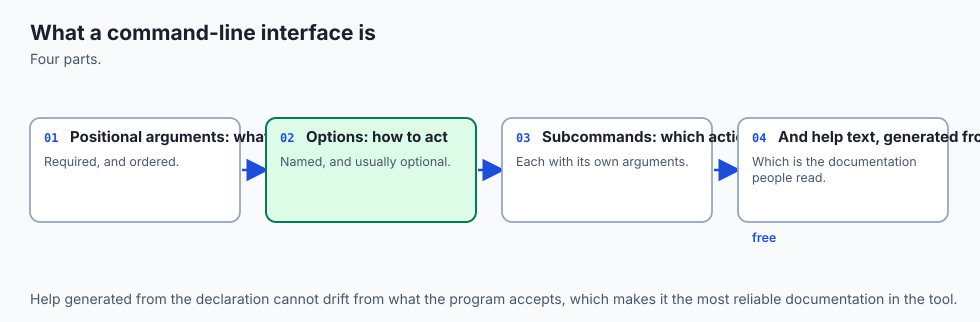
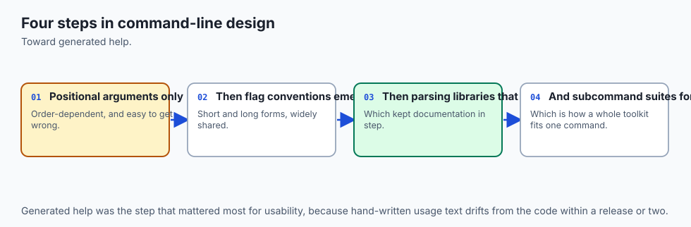
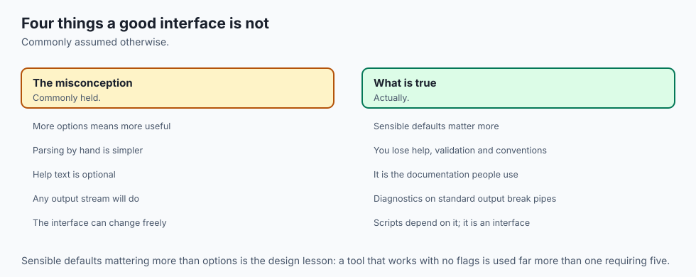
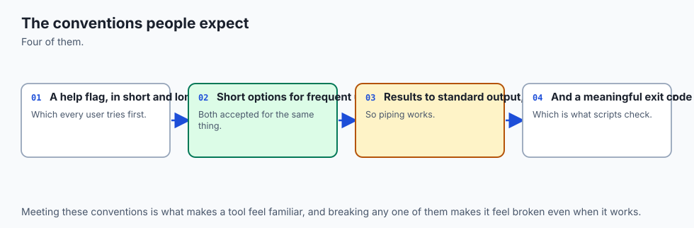
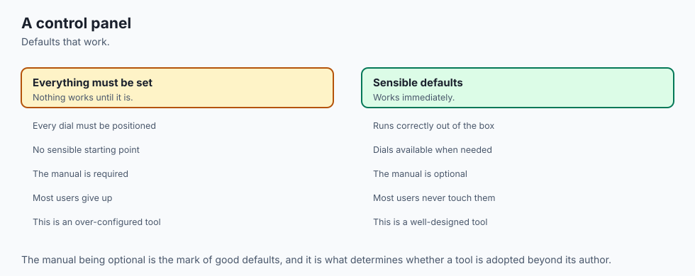
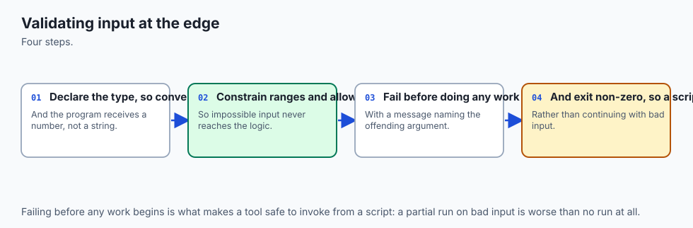
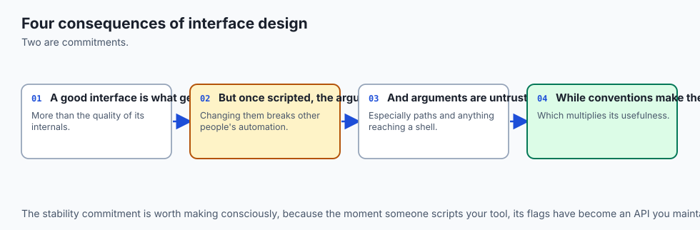
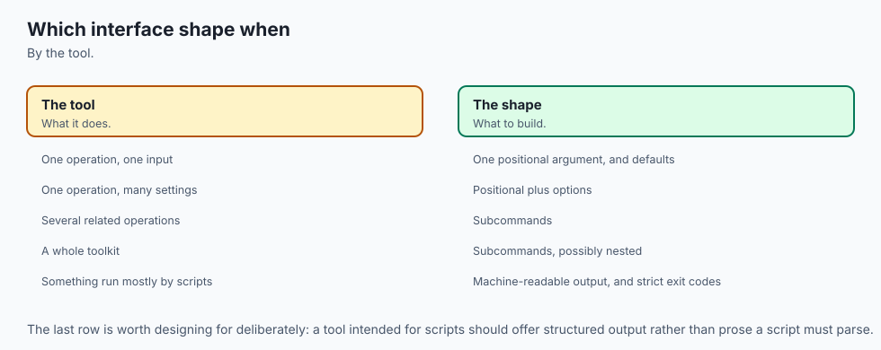

## Why this matters

On Day 56 you built a data-driven command-line tool by reading `sys.argv` yourself. It worked. For what it did — one positional argument, no options — it was the right call, and reaching for a parsing library there would have been more machinery than the job needed.

Days 78 and 79 have now given you things worth wrapping in a command: a script that fetches something over HTTP, a script that extracts structured data out of a page. Right now those live as files you edit before each run, with the URL sitting in a variable near the top and the output path a few lines below it.

That is fine for a program with one user who is also its author and who remembers, this week, which variable to change. It stops being fine the first time someone else needs to run it, or the first time *you* need to run it in six months, or the first time it has to run unattended at three in the morning as a scheduled job — which is where Day 81 goes.

The gap between those two states is not a gap in your Python. It is a gap in the *interface*. And the thing worth internalising today, before any syntax, is this: **a command line is a user interface**. It is a screen with no pixels. The same care you would give a form — clear labels, sensible defaults, validation at the point of entry, an error message that says what to do rather than what went wrong, a confirmation before anything irreversible — belongs here, and for exactly the same reasons.

The consequences of skipping that care are concrete and they cost money. A tool with no `--dry-run` on its destructive path deletes the wrong directory once, and once is enough. A tool that prints its errors to standard output instead of standard error poisons every pipeline it appears in, and the corruption is silent — the downstream program receives an error message where it expected data, and does something confident and wrong with it.

A tool that always exits 0 cannot be automated at all, because the scheduler has no way to know it failed; you find out days later from the absence of a report nobody was watching for. A tool whose date argument is a string that gets parsed somewhere in the middle produces a traceback at the user, which is a bug report addressed to the wrong person.

Each of those is a line or two of `argparse`. That is the deal on offer today.

And there is a thread running from here to the AI work later in this course, which is worth flagging now and will be picked up properly at the end. When you eventually expose one of your Python functions to an AI model as a *tool* — so the model can decide to call it — what you write is a schema: the function's name, a description of what it does, and for each parameter a name, a type, a description, and whether it is required. That is, structurally, exactly what `add_argument` is. Learning to describe a callable precisely enough that a stranger can use it correctly from the outside is the habit; argparse is where you build it.

## The idea in plain language



A command-line program receives, at the moment it starts, a list of strings. That is all. Everything else — options, flags, subcommands, values, defaults — is a *convention* built on top of that list, and the whole job of an argument parser is to turn the list into something structured you can reason about.

Those conventions are worth naming precisely, because the words get used loosely and the distinctions matter.

A **positional argument** is identified by *where* it appears. In `cp source.txt backup.txt`, the first path is the source and the second is the destination because of their positions, not their names. Positional arguments are usually required, and there are usually few of them, because a user cannot be expected to remember an order longer than about two.

An **option** is identified by *name*, so it can appear anywhere and in any order. Options have a long form (`--verbose`) and often a short form (`-v`). An option that takes a value — `--store notes.json` — is sometimes just called an option; one that takes no value and simply turns something on — `--dry-run` — is usually called a **flag**. The distinction is small but it changes how you declare it.

A **subcommand** is a first positional argument that selects an entire second interface. `git commit` and `git log` share the program `git` but accept completely different options. Once a tool has more than about three verbs, subcommands are how it stays comprehensible, and **dispatch** is the mechanism that routes a parsed subcommand to the function that implements it.

An **exit code** is the single number a program hands back to whatever launched it. Zero means it worked. Anything else means it did not. This is not a suggestion; it is the mechanism by which `&&` in a shell decides whether to run the next command, and by which a scheduler decides whether to raise an alarm.

And there are three streams, not two. **Standard output** is where the program's *result* goes — the thing a person or another program actually wanted. **Standard error** is where *diagnostics* go: progress notes, warnings, error messages. **Standard input** is where a value can arrive from another program instead of from the command line. Keeping the first two apart is what allows `mytool > results.json` to produce a clean file even while the tool is chattering at you on screen.

`argparse` is Python's standard-library answer to all of this. You *declare* your interface — here is a positional called `text`, here is an option called `--on` whose value must be a date, here are five subcommands — and argparse does the rest: parsing, type conversion, validation, error messages, exit codes, and the entire `--help` screen, generated from the same declarations that do the parsing, which is precisely why the help can never drift out of date with the behaviour.

## Historical background



The conventions you are about to follow are older than Python, older than most of the people using them, and their oddities are historical rather than designed.

The single-dash short option — `-v`, `-l`, `-a` — comes from **Unix at Bell Labs in the early 1970s**. Terminals were slow and typing was expensive, so options were single letters, and letters could be clustered: `ls -la` means the same as `ls -l -a`. That clustering rule is why short options are single characters to this day, and why `-la` cannot be a long option name.

The double-dash long option — `--verbose` — arrived much later, from the **GNU project in the 1980s**, as a deliberate readability fix. A script full of `-x -f -q` is unreadable six months on; `--extract --file --quiet` explains itself. The convention that settled is: offer both, use the short one interactively, use the long one in scripts. GNU also established `--help` and `--version` as options every program should have, and the bare `--` that means "everything after this is a positional argument, even if it starts with a dash" — which is how you delete a file genuinely named `-rf`.

The **exit code** convention is as old as Unix itself: 0 for success, non-zero for failure, with the specific non-zero value free for the program to define. Some conventions grew on top — `grep` returns 1 for "no lines matched" and 2 for a real error, a distinction it is worth copying because "nothing found" is genuinely not the same event as "something broke".

Python's own history here is a story of three libraries. **`getopt`** came first, a thin wrapper over the C function of the same name; it parses, and does nothing else — no help, no types, no error messages. **`optparse`** arrived in Python 2.3 (2003), written by Greg Ward, and was a large improvement: it generated help text and handled types.

But it could not do positional arguments at all, and it could not do subcommands. **`argparse`** was written by Steven Bethard to fix exactly those gaps, was accepted through **PEP 389**, and entered the standard library in **Python 3.2**, released in 2011. `optparse` was deprecated in the same release. `getopt` and `optparse` both still exist and both still work; neither is what you should reach for now.

That 2011 date is worth holding on to, because it is the strongest practical argument for argparse over anything else: a tool you write with it runs on any Python 3 anyone is likely to have, with no install step, no version pin, and no network.

## What it is — and what it is not



`argparse` is a declarative library for describing a command-line interface. You state what arguments exist, what types they hold, which are required, and what each one means; argparse turns a list of strings into a namespace of typed values, and handles everything that goes wrong in between.

It is **not** a framework. It does not structure your program, own your main loop, or ask you to inherit from anything. `build_parser()` returns an object; what you do with the parsed result is entirely your business.

It is **not** a validation library in general. `type=` gives you a hook for each argument, which is genuinely useful and where a great deal of the value lives, but argparse knows nothing about relationships between arguments beyond mutual exclusion. "This option is required only when that other one is set" is your code, in the handler, not the parser's.

It is **not** an output library. It formats help text and usage errors and nothing else. Colour, tables, progress bars, spinners — none of that is argparse's concern, and if you want them you are looking at `rich` or writing escape codes by hand.

It is **not** the only choice, and today's Alternatives section takes the competitors seriously rather than dismissing them.

And a command-line interface is **not** a lesser sibling of a graphical one. It is a different interface with different strengths: it is scriptable, composable, diffable, reviewable, and remotely operable over a connection too slow for anything else. A well-made command-line tool is a better interface than a badly made window, and it stays useful for decades.

| Common misconception | The reality |
| --- | --- |
| "argparse is for big programs; my script is small." | The break-even point is roughly the second optional flag. Below that, `sys.argv` is fine; above it, hand-parsing starts producing silently wrong answers. |
| "I will add `--help` text later." | The help *is* the interface. Users who cannot discover a feature do not have it, and `help=` costs one string at the moment you already know the answer. |
| "Exit codes are for shell scripts, not for me." | Every scheduler, CI system, and `&&` in existence reads them. A tool that always exits 0 cannot be automated at all. |
| "Printing errors with `print()` is fine." | It is not. It puts diagnostics into the result stream, which corrupts every pipeline the tool ever appears in — silently. |
| "`--dry-run` is a nice-to-have." | For anything destructive it is the difference between a mistake and an incident. It is also the only feature users check before trusting you. |
| "Subcommands are complicated." | `add_subparsers` plus `set_defaults(func=...)` is about six lines and removes every branch on the command name from your program. |

## Why it was created and what problems it solves

The honest way to make this argument is to run it rather than assert it. The lab ships `examples/by_hand.py`, a hand-rolled parser for a modest interface — one positional and two options — written the way people really write them:

```python
def parse_by_hand(argv):
    text, tag, dry_run = None, None, False
    i = 0
    while i < len(argv):
        item = argv[i]
        if item == "--dry-run":
            dry_run = True
        elif item == "--tag":
            i += 1
            tag = argv[i]          # IndexError if the user forgot the value
        elif text is None:
            text = item
        i += 1
    return {"text": text, "tag": tag, "dry_run": dry_run}
```

Nothing there is a straw man. It is about as good as a hand-rolled parser gets before you start writing a real one. Run it against eight command lines a user might type on their first afternoon, and this is the actual captured output:

```text
  $ notes add 'buy milk' --tag=shopping
      text='buy milk' tag=None dry_run=False
      --flag=value form: the tag is silently lost

  $ notes add 'buy milk' -t shopping
      text='buy milk' tag=None dry_run=False
      short form: -t is swallowed as the text

  $ notes add 'buy milk' --drynrun
      text='buy milk' tag=None dry_run=False
      a typo: accepted in silence, and does nothing

  $ notes add 'buy milk' --tag
      IndexError: list index out of range
      a missing value: IndexError, and a traceback

8 ordinary command lines, 4 of them handled wrongly.
```

Look at the failure *modes*, not the count. Three of the four are silent. The user typed `--tag=shopping`, which is standard on every Unix system in the world, and the program cheerfully proceeded with no tag and said nothing. The user typed `--drynrun` and the program ran for real. Silence is the worst possible failure mode for a user interface, because the user has no signal that anything is wrong and no reason to look.

And this parser, at four wrong answers out of eight, still has no `--help`, no usage message, no exit code 2, no type conversion, and no way to refuse an option it does not recognise. Every one of those is a line of argparse. Here is the same interface, correctly:

```python
add.add_argument("text")
add.add_argument("-t", "--tag", action="append")
add.add_argument("--dry-run", action="store_true")
```

Three lines, and all eight command lines are handled correctly — including `--tag=shopping`, including the clustered short form, including refusing `--drynrun` with a message and exit 2, including telling the user that `--tag` expects one argument rather than crashing.

The deeper problem argparse solves is one of *placement*. In the hand-rolled version, validation happens wherever you remember to put it — which is to say, in some handlers and not others, and never in the one added last. With argparse, conversion and validation happen at the parser, which is the single narrowest point in the program, before any of your logic runs. A value that is wrong never gets inside. This is the same argument Day 70 made for validating in `__post_init__` so an invalid object cannot exist; here it is moved out one more layer, to the process boundary.

## How it works



Here is the shape of a properly built tool. Read the top half first — the parser and its handlers — and then the ring of surfaces around it.


### The parser is a declaration

```python
parser = argparse.ArgumentParser(
    prog="notes",
    description="Keep short notes in a JSON file you can read with your own eyes.",
    epilog="Examples:\n  notes add 'ring the dentist' --tag health --on 2026-03-01\n",
    formatter_class=argparse.RawDescriptionHelpFormatter,
)
```

`prog` is what appears in every usage line. Without it argparse uses the file name, so your users read `usage: notes.py` — which tells them you never looked. `description` shows above the options, `epilog` below them, and `RawDescriptionHelpFormatter` is what stops argparse from re-wrapping your epilog and destroying its line breaks. Four keywords; the difference between a tool and a script.

### `add_argument` is where the interface actually lives

Every argument is one call, and the keywords each do one job:

| Keyword | What it does | Example |
| --- | --- | --- |
| `type=` | converts the string, and validates it by raising | `type=iso_date` turns `'2026-03-01'` into a `date` |
| `choices=` | restricts to a fixed set, *and* lists them in the usage line | `choices=["table", "json"]` |
| `default=` | the value when the option is absent | `default="table"` |
| `required=` | forces an *option* to be given (positionals are required by default) | `required=True` |
| `nargs=` | how many values: a number, `"?"`, `"*"`, or `"+"` | `nargs="+"` gives a list of one or more |
| `action="store_true"` | a flag: present means `True`, absent means `False` | `--dry-run` |
| `action="append"` | collects repeats into a list | `-t python -t writing` gives `["python", "writing"]` |
| `metavar=` | what the value is called in the help | `metavar="YYYY-MM-DD"` |
| `help=` | the one-line description in `--help` | always write it |

Two of those deserve a longer look.

**`type=` is your validation hook, not just a converter.** It takes any callable that accepts a string. Pass `int` and you get integers; pass your own function and you get anything you like — with the crucial property that raising `argparse.ArgumentTypeError` inside it produces a proper usage message and exit 2 rather than a traceback:

```python
def iso_date(text: str) -> date:
    try:
        return datetime.strptime(text, "%Y-%m-%d").date()
    except ValueError:
        raise argparse.ArgumentTypeError(
            f"{text!r} is not a date in YYYY-MM-DD form (for example 2026-03-01)"
        ) from None
```

The captured result of a user getting this wrong:

```text
$ python3 notes.py add 'x' --on 2026-13-01 --store notes.json
usage: notes add [-h] [--store PATH] [-v | -q] [-t TAG] [--on YYYY-MM-DD]
                 [--dry-run]
                 text
notes add: error: argument --on: '2026-13-01' is not a date in YYYY-MM-DD form (for example 2026-03-01)
exit: 2
```

Read what that gives the user: the usage line reminding them of the shape, the exact argument that was wrong, the exact value that was wrong, and what a right one looks like. Compare it with `ValueError: time data '2026-13-01' does not match format '%Y-%m-%d'` and a fifteen-line traceback, which is what happens if you let the conversion happen in your handler instead.

**`default=None` is a deliberate choice, not laziness.** If `--store` defaults to `"notes.json"` you can never tell whether the user said `--store notes.json` or said nothing. Default it to `None` and the difference is visible, which is what makes the environment-variable fallback possible at all.

### Subcommands, and the dispatch pattern

This is the day's single most useful technique.

```python
subcommands = parser.add_subparsers(
    title="subcommands", dest="command", metavar="<command>", required=True,
)

add = subcommands.add_parser("add", parents=[parent], help="add one note")
add.add_argument("text")
add.add_argument("--on", type=iso_date, metavar="YYYY-MM-DD")
add.set_defaults(func=cmd_add, parser=add)
```

`set_defaults` stores arbitrary values on the namespace that parsing produces. Storing the *handler function itself* means that after `args = parser.parse_args(argv)`, the attribute `args.func` **is** the right function. Dispatch becomes one line, with no branch on the command name anywhere in the program:

```python
return args.func(args, streams)
```

Adding a sixth subcommand touches one `add_parser` block and adds one function. Nothing else in the program knows the set of commands grew. That is the whole benefit, and it is why every tool of this shape is built this way.

Two details that bite people. `required=True` on `add_subparsers` is what makes running bare `notes` produce a usage message and exit 2; without it, parsing succeeds with no subcommand and your program dies later on `AttributeError: 'Namespace' object has no attribute 'func'`. And `--dry-run` on the command line becomes `args.dry_run` in Python, because a dash is not legal in an identifier.

### Shared options, via a parent parser

Five subcommands all needing `--store`, `-v` and `-q` should not mean five copies. Define them once on a parent and inherit:

```python
parent = argparse.ArgumentParser(add_help=False)   # add_help=False is essential
storage = parent.add_argument_group("storage options", "where the notes live ...")
storage.add_argument("--store", metavar="PATH", default=None, help="...")

loudness = parent.add_argument_group("output options").add_mutually_exclusive_group()
loudness.add_argument("-v", "--verbose", action="store_true", help="...")
loudness.add_argument("-q", "--quiet", action="store_true", help="...")
```

`add_help=False` matters: a parser gets `-h` automatically, the child inherits it, and then the child tries to add its own — which raises at import time, before your program does anything.

An **argument group** changes nothing about parsing. It changes only how `--help` is laid out, which is reason enough, because your help output is the documentation most users will ever read. A **mutually exclusive group** does change parsing: passing both members is a usage error, handled for you, with a message naming both options:

```text
$ python3 notes.py list -v -q --store notes.json
usage: notes list [-h] [--store PATH] [-v | -q] [--format {table,json}]
                  [-t TAG] [--since YYYY-MM-DD] [-n N]
notes list: error: argument -q/--quiet: not allowed with argument -v/--verbose
exit: 2
```

Notice the `[-v | -q]` in the usage line — argparse documented the exclusion itself. A hand-written `if verbose and quiet:` check would give you neither the usage line nor the exit code.

### The journey of one command line


The thing to take from that diagram is the dashed branch. Steps one through four all happen before a single line of your own logic runs, and any of them can end the program with exit 2. That branch runs far more often than the happy path, because users mistype more than they succeed — and it is the branch almost nobody tests.

### Exit codes, and `parser.error()`

The convention this course uses, which is a common and defensible one:

| Code | Meaning | Who produces it |
| --- | --- | --- |
| 0 | it worked | your handler returns 0 |
| 1 | a refusal the tool understood: no such note, unreadable file | your handler, via an exception `main` catches |
| 2 | a usage error: unknown option, bad value, missing argument | argparse, automatically |

`parser.error("message")` prints usage plus your message on standard error and exits 2. Use it for usage problems you can only detect at run time — the lab's example is `add -` requested when standard input is a terminal, which argparse cannot know at parse time but which is unambiguously a usage error.

The structural rule that makes this testable: **handlers return an integer, they do not call `sys.exit`.** Only the very last line of the program does that:

```python
if __name__ == "__main__":
    sys.exit(main())
```

A handler that calls `sys.exit` cannot be tested in-process without catching `SystemExit` everywhere.

### Standard input, and detecting a terminal

The convention that a lone `-` means "read from standard input" is older than Python and is what lets a tool join a pipeline:

```python
if args.text == "-":
    if streams.stdin_is_a_terminal():
        args.parser.error("'-' was given but standard input is a terminal; pipe something in")
    text = streams.stdin.read().strip()
```

The terminal check is the part people skip, and skipping it produces the worst bug in this whole lesson: with nothing piped in, `read()` blocks, the program sits there silently, and the user has no idea whether it is working, hung, or waiting. `isatty()` turns a mystery into a sentence.

This convention has a second use worth knowing: a secret passed as `--token abc123` is visible in the process list to every user on the machine and lands in your shell history in plain text. Read it from standard input instead and neither happens.

### Two streams, and why the separation is load-bearing

Results go to standard output. Diagnostics go to standard error. Here is that rule made visible, captured from a real run:

```text
$ python3 notes.py list --format json -v --store notes.json > result.json 2> chatter.txt
$ head -4 result.json      # standard output: the RESULT, still valid JSON
[
  {
    "date": "2026-03-01",
    "id": 1,
$ cat chatter.txt          # standard error: the DIAGNOSTIC
2 note(s) from notes.json
```

`-v` asked for chatter and got it — on the other stream, leaving the JSON on standard output undisturbed and still parseable. Had the chatter gone to standard output, `result.json` would be a file that looks like JSON, is not JSON, and fails somewhere downstream with an error message about an unexpected token that names nothing useful.

There is one more wrinkle. Python line-buffers standard output when it is a terminal and block-buffers it when it is a pipe or a file, while standard error is unbuffered. Write to both without flushing in between and the order looks right on screen and scrambles the moment you redirect. Call `stdout.flush()` before writing a diagnostic. This is why so many build-server logs are interleaved nonsense.

### `--dry-run` as a first-class feature

For anything destructive, `--dry-run` is not a convenience. Two rules make it a real guarantee rather than a claim:

1. **Do the reads and the checks for real.** A dry run that skips validation will happily promise you an impossible deletion.
2. **Never reach the write.** Return before the save.

```python
if args.dry_run:
    for note_id in doomed:
        streams.stdout.write(f"would remove note {note_id}\n")
    streams.stdout.flush()
    streams.stderr.write(f"dry run: {len(doomed)} note(s) would be removed; {path} was not touched\n")
    return 0
```

Note the split: the ids go to standard output because they are a *result* a person could pipe onward; the summary goes to standard error because it is a *diagnostic*. And note how you prove it — by hashing the file before and after:

```text
$ shasum -a 256 notes.json
c112b7e42cf886f911baa54b62a57b348e501328ddb6ec749f62c5023d70dca0 notes.json

$ python3 notes.py remove 2 --dry-run --store notes.json
would remove note 2
dry run: 1 note(s) would be removed; notes.json was not touched

$ shasum -a 256 notes.json
c112b7e42cf886f911baa54b62a57b348e501328ddb6ec749f62c5023d70dca0 notes.json
```

Identical hashes. A `--dry-run` that has never been checked this way is a claim, and it is the kind of claim people trust right up until it turns out to be false.

### Configuration precedence

When the same setting can come from four places, users expect one order, and it is the order of increasing specificity:

**built-in defaults → config file → environment variables → command-line flags.**

The flag wins because it is the most specific statement of intent — the user typed it just now, for this run. The environment is next because it is per-session. The config file is per-project. The built-in default is what you get when nobody has said anything.

`parser.set_defaults(**values_from_config)` slots a config file straight in, which is neater than any hand-rolled merge. The environment layer needs the `default=None` trick from earlier:

```python
def store_path(args):
    if args.store is not None:        # the flag: most specific
        return Path(args.store)
    if os.environ.get("NOTES_STORE"): # the environment
        return Path(os.environ["NOTES_STORE"])
    return Path("notes.json")         # the built-in default
```

### Testing a command line

`parse_args` taking an explicit list is what makes all of this testable:

```python
def parse_args(argv=None):
    return build_parser().parse_args(argv)
```

Defaulting to `None` means argparse falls back to `sys.argv[1:]`, so the real program stays convenient. But every test passes its own list and never touches a global. That is Day 74's injection argument, applied to the command line — and the same idea one layer further gives you a `Streams` object so `io.StringIO` can stand in for the terminal.

You need both kinds of test, and they prove different things. A **subprocess** test is the only honest way to observe an exit code or to prove the two streams are separate — you capture them to two different files and assert on each. An **in-process** test is a hundred times faster, gives a real traceback, and can assert on the parsed namespace, which a subprocess can never see.

## An everyday analogy



Think of your program as the trade counter at a busy hardware shop.

**The counter itself is the interface.** Customers do not come behind it. Everything they want has to be expressible across that counter, which means the way the counter is arranged determines what is possible.

**The department is the subcommand.** You do not walk in and describe your problem in general. You go to Timber, or to Fixings, or to Returns — and each has its own forms, its own staff, its own rules. `notes add` and `notes remove` are two different departments that happen to share a shopfront.

**What you hand over is a positional argument.** At Returns you put the item on the counter. Nobody needs a label saying "this is the item"; its position on the counter says so. That is why positionals are unlabelled, and why more than two of them starts going wrong — a counter covered in unlabelled objects is a counter where the clerk has to guess.

**The form you fill in holds the options.** Each box has a name, so the order you fill them in does not matter. Some boxes are tick-only — "gift receipt: yes/no" is `action="store_true"`. Some have a fixed list of allowed answers printed beside them, which is `choices=`. Some can take more than one entry, which is `action="append"`. And the form has a default at the bottom: leave it blank and you get the standard option, which is `default=`.

**Validation happens at the counter, not in the stockroom.** The clerk checks the form *before* walking away: the date is a date, the quantity is a number greater than zero, the finish you asked for is one they stock. This is `type=` and `choices=`, and the reason it matters is that a form with a wrong date, waved through, becomes a problem three rooms away where nobody can see the customer to ask. A good clerk hands the form back with the specific box circled and an example of what should be in it. A bad one disappears into the stockroom and comes back an hour later with a Latin phrase.

**The sign on the wall is `--help`.** Written once, kept accurate because it is generated from the same rules the clerk follows, and read by every customer who is not already an expert.

**Goods come over the counter; conversation happens beside it.** The clerk hands you the timber — that is standard output, the thing you came for. While doing it they might say "we only had the two-metre lengths left" — that is standard error. If they wrote that remark on the delivery note and slid it into the stack of timber, the next person down the line would try to build with it. That is precisely what printing an error to standard output does to a pipeline.

**The stamped docket is the exit code.** Green stamp, everything went through. Red stamp, it did not. The customer's accounting system reads the stamp, not the conversation, which is why a tool that always exits 0 is a counter that stamps everything green including the refusals.

**`--dry-run` is asking "can you just check whether you have it, before you cut anything?"** The clerk does all the real checks — stock, dimensions, price — and cuts nothing. Every good counter offers this. It is also the thing that makes customers trust the counter with the irreversible jobs.

**Configuration precedence is the order of authority.** The shop has standard practice (built-in defaults). Your firm has an account with agreed terms (the config file). Today you are on a particular job with particular instructions (environment variables). And what you just said out loud, standing at the counter, overrides all of it (command-line flags) — because it is the most specific thing anybody has said, and it was said most recently.

The analogy has one honest limit, worth naming so you do not over-extend it. A shop clerk can ask a clarifying question; a command-line tool, when run from a script, cannot. Everything must be expressible in the one line the user types. That constraint is exactly why the interface has to be so carefully designed, and why the help has to be so good.

## Examples in practice



The lab builds `notes`, a tool with five subcommands over a small JSON store. Here is what the finished thing looks like from the outside — all of it captured from real runs.

The help screen, which is the tool's entire user manual and which you did not write by hand:

```text
$ python3 notes.py --help
usage: notes [-h] [--version] <command> ...

Keep short notes in a JSON file you can read with your own eyes.

options:
  -h, --help  show this help message and exit
  --version   print the version and exit

subcommands:
  <command>
    add       add one note
    list      list notes
    search    find notes containing text
    export    write every note to standard output
    remove    delete notes by id

Examples:
  notes add 'ring the dentist' --tag health --on 2026-03-01
  echo 'from a pipe' | notes add - --tag inbox
  notes list --format json | python3 -m json.tool
  notes remove 3 --dry-run

Exit codes: 0 success, 1 refusal, 2 usage error.
```

A subcommand's help, showing the argument groups doing their job:

```text
$ python3 notes.py add --help
usage: notes add [-h] [--store PATH] [-v | -q] [-t TAG] [--on YYYY-MM-DD]
                 [--dry-run]
                 text

Add one note. Use '-' as the text to read it from standard input.

positional arguments:
  text             the note text, or '-' to read standard input

options:
  -h, --help       show this help message and exit
  -t, --tag TAG    attach a tag; repeat the option for more than one
  --on YYYY-MM-DD  the date to file the note under (default: today)
  --dry-run        say what would happen without writing anything

storage options:
  where the notes live. Precedence: --store, then $NOTES_STORE, then
  ./notes.json

  --store PATH     path to the JSON store (default: $NOTES_STORE or
                   ./notes.json)

output options:
  -v, --verbose    explain what is happening, on standard error
  -q, --quiet      print nothing on success
```

Every word of that came from the `add_argument` calls that also do the parsing. There is no separate documentation to fall out of date, which is a property worth a great deal over a tool's life.

Adding notes, including one that arrives through a pipe:

```text
$ python3 notes.py add 'ring the dentist' --tag health --on 2026-03-01 --store notes.json
added note 1

$ python3 notes.py add 'argparse turns a script into a tool' -t python -t writing --on 2026-03-02 --store notes.json
added note 2

$ echo 'from a pipe' | python3 notes.py add - --tag inbox --on 2026-03-03 --store notes.json
added note 3
```

Note the two `-t` flags on the second command: `action="append"` collected them into `["python", "writing"]`.

Listing, in two formats:

```text
$ python3 notes.py list --store notes.json
ID  DATE        TAGS            TEXT
------------------------------------
 1  2026-03-01  health          ring the dentist
 2  2026-03-02  python,writing  argparse turns a script into a tool
 3  2026-03-03  inbox           from a pipe

$ python3 notes.py export --format csv --store notes.json
id,date,tags,text
1,2026-03-01,health,ring the dentist
2,2026-03-02,python;writing,argparse turns a script into a tool
3,2026-03-03,inbox,from a pipe
```

And the failures, which are where the design shows. Three different problems, three different exit codes:

```text
$ python3 notes.py frobnicate --store notes.json
usage: notes [-h] [--version] <command> ...
notes: error: argument <command>: invalid choice: 'frobnicate' (choose from add, list, search, export, remove)
exit: 2

$ python3 notes.py remove 99 --store notes.json
notes: no note with id 99 in notes.json
exit: 1

$ python3 notes.py search kangaroo --store notes.json
exit: 1
```

The first is a usage error argparse caught, and it *lists the legal choices* — that is `choices=` doing three jobs at once. The second is a refusal the tool itself understood, so it exits 1 with a plain sentence and no traceback. The third is `grep`'s convention: nothing matched, which is not an error, so no message at all, but a non-zero code so a script can branch on it.

## Implications: security, privacy, performance, scalability, and cost



**Security.** The command line is a trust boundary. Sometimes the stranger passing arguments is a scheduled job assembling them from somewhere else. Every `type=` callable is a gate on that boundary, and validating at the parser means a dangerous shape never exists inside your program at all.

Three rules matter more than the rest. First: **never build a shell command by formatting user input into a string.** `subprocess.run(["grep", pattern, path])` passes a list, the operating system hands the arguments to the program directly, and no shell ever sees them. `subprocess.run(f"grep {pattern} {path}", shell=True)` means a pattern containing a semicolon is not a pattern any more, it is a second command.

Second: **treat path arguments with suspicion** — a path from a less trusted source can be `../../.ssh/config` or a symbolic link, and a tool that accepts one should resolve it and confirm it lands where it should. Third: **secrets do not belong in arguments**, because arguments are visible in the process list to every user on the machine and land in shell history in plain text; use an environment variable, a `--token-file`, or standard input.

**Privacy.** A tool that logs the arguments it was invoked with — which is a reasonable thing to want — will log whatever was in them. If that includes a customer identifier, a file path containing a person's name, or a search query, it is now in a log file with a different retention policy and a different audience. Decide deliberately what gets logged, and consider redacting known-sensitive options.

**Performance.** argparse is not a performance concern. Building a parser with five subcommands and thirty arguments takes well under a millisecond, and it happens once. The cost that *is* worth knowing is Python's interpreter startup, roughly tens of milliseconds — irrelevant for a tool you run by hand, and worth measuring if something calls your tool in a loop ten thousand times. In that case the answer is usually to give the tool a mode that processes many inputs in one run, not to make the parser faster.

**Scalability.** Here scalability means *interface* scalability: how the tool copes with growing from three commands to thirty. Subcommands plus `set_defaults` scale well, because each new verb is one `add_parser` block and one function, and nothing else in the program changes. Two things scale badly and are worth avoiding early: more than about two positional arguments, because users cannot remember the order; and flags whose meaning depends on other flags, because that combinatorial space cannot be documented in a help screen.

**Cost.** argparse is free, in the only two senses that matter. It costs nothing to license, and it costs nothing to *depend on* — no install, no version pin, no supply-chain surface, no dependency that might be abandoned in three years. For a tool you intend to still work in a decade, that second kind of free is the more valuable one.

## Alternatives: free, open source, and commercial

Four real options, plus the honest "no library at all" case. Everything here is free and open source; there is no paid tier in this space, which is itself worth noting — nobody sells you a command-line parser.

Two notes on what was actually verified on the authoring machine, so you can weigh the examples: `argparse` and `sys` are standard library, so they are always present. `click` **is** installed here at version 8.4.2 — it arrived indirectly as a dependency of `uvicorn`, which Week 12 installs for Day 82 — so the click output below is a genuine capture. `typer` and `docopt` are **not** installed here, so the code shown for them is described from their documented interfaces and no output is quoted for either. That distinction is deliberate: it is better to say plainly which examples were run than to present all of them as if they were.

### `argparse` — standard library, free

**What it is.** Python's built-in declarative argument parser, in the standard library since Python 3.2 (2011).

**When to choose it.** When you want zero dependencies; when the tool must run on a machine you do not control; when you are writing something that has to still work in ten years; when the tool is part of a larger project that is trying to keep its dependency list short. This is the default choice, and it should take a positive reason to move off it.

**How to use it.** Build a parser, declare arguments, parse, dispatch — as throughout this lesson.

**Worked example** (real capture, from the lab):

```text
$ python3 notes.py --version
notes 1.0.0
$ python3 notes.py add 'x' --on 2026-13-01 --store notes.json ; echo "exit $?"
notes add: error: argument --on: '2026-13-01' is not a date in YYYY-MM-DD form (for example 2026-03-01)
exit 2
```

**Free vs paid.** Free, open source, part of Python itself. No paid tier exists.

### `click` — free and open source

**What it is.** A third-party library that builds the interface from **decorators** on your handler functions rather than from a separate parser object. Created by Armin Ronacher, the author of Flask.

**When to choose it.** When the tool is large enough that keeping the parser declaration and the handler in the same place is a real readability win; when you want its extras — prompting for missing values, confirmation prompts, coloured output through `click.secho`, progress bars, and generated shell completion for bash, zsh and fish, which argparse does not provide at all. Also when you are already in an ecosystem that uses it.

**How to use it.** Decorate a function with `@click.command()` (or `@click.group()` for subcommands), then one `@click.option` or `@click.argument` per parameter. The decorated function's parameters *are* the parsed values.

**Worked example** (real capture, click 8.4.2 on the authoring machine):

```python
@click.group()
@click.version_option("1.0.0", prog_name="notes")
def cli():
    """Keep short notes in a JSON file you can read with your own eyes."""

@cli.command()
@click.argument("text")
@click.option("-t", "--tag", multiple=True, help="attach a tag; repeatable")
@click.option("--on", type=click.DateTime(formats=["%Y-%m-%d"]))
@click.option("--dry-run", is_flag=True)
def add(text, tag, on, dry_run):
    """Add one note."""
    click.echo(f"add text={text!r} tags={list(tag)} on={on} dry_run={dry_run}")
```

```text
$ python3 click_demo.py add "buy milk" -t shopping --on 2026-03-01
add text='buy milk' tags=['shopping'] on=2026-03-01 00:00:00 dry_run=False

$ python3 click_demo.py add "x" --on 2026-13-01 ; echo "exit $?"
Error: Invalid value for '--on': '2026-13-01' does not match the format '%Y-%m-%d'.
exit 2
```

Two things to notice from that capture. click exits 2 on a bad value, exactly as argparse does — the conventions are shared, not invented per library. And `click.DateTime` gives you a `datetime`, not a `date`, which is why the output shows `00:00:00`; the argparse version with a custom `iso_date` gives you exactly the type you asked for. Neither is wrong; they are different defaults.

**Free vs paid.** Free, open source, BSD licence. Installed with `pip install click`. No paid tier.

### `typer` — free and open source

**What it is.** A library built on top of click that derives the entire interface from **Python type hints** on your function signature. Created by Sebastián Ramírez, the author of FastAPI — which is why it will feel familiar when FastAPI arrives on Day 82.

**When to choose it.** When your team already writes thorough type hints and runs mypy (Day 75), because then the interface declaration is *already written* and typer just reads it. It is the least duplication of the four options. Choose against it when you need to run somewhere you cannot install two packages, or when you want the argument declaration to be visibly separate from the function's Python signature.

**How to use it.** Annotate the function; typer reads the annotations. A `str` parameter with no default is a required positional; one with a default becomes an option; a `bool` becomes a flag; an `enum` becomes `choices`; a `datetime` gets parsed for you.

```python
import typer

app = typer.Typer()

@app.command()
def add(text: str, tag: list[str] = typer.Option([]), dry_run: bool = False) -> None:
    """Add one note."""
    typer.echo(f"add {text!r} tags={tag} dry_run={dry_run}")
```

That is the whole declaration: `text` is a required positional because it has no default, `--tag` is repeatable because it is a list, and `--dry-run` is a flag because it is a bool. Connect this back to Day 75 — the type hints you were writing for the type checker turn out to be a machine-readable description of the function, and typer is one of several things that can read it. Hold that thought for the end of this lesson.

**Not verified here:** typer is not installed on this machine, so no output is quoted for it. The code above follows typer's documented interface; run it yourself after `pip install typer` if you want to see it work.

**Free vs paid.** Free, open source, MIT licence. Installed with `pip install typer`, which brings click with it. No paid tier.

### `docopt` — free and open source, but largely dormant

**What it is.** An inversion of the usual idea: you write the **help text** in the module docstring, in the standard Unix usage format, and docopt parses *that* to derive the interface. The documentation is the specification.

**When to choose it.** Honestly: rarely, now. The idea is genuinely elegant and worth understanding, and for a small script with a fixed interface it produces very readable source. But the original Python package has seen little activity for years, and choosing a dormant dependency for something as load-bearing as your argument parsing is a decision to make with open eyes rather than by accident. Community forks exist; check the state of whichever one you would actually install rather than trusting a name.

**How to use it.**

```python
"""notes.

Usage:
  notes add <text> [--tag=<tag>] [--dry-run]
  notes list [--format=<fmt>]

Options:
  --tag=<tag>      attach a tag
  --format=<fmt>   output format [default: table]
"""
from docopt import docopt

arguments = docopt(__doc__)
```

`arguments` comes back as a dictionary keyed by the strings in the usage text — `arguments["<text>"]`, `arguments["--dry-run"]`. Note the consequence: there is no type conversion and no custom validation hook, so everything is a string and every check is yours to write.

**Not verified here:** docopt is not installed on this machine, so no output is quoted.

**Free vs paid.** Free, open source, MIT licence. No paid tier.

### Plain `sys.argv` — always available, sometimes correct

**What it is.** Reading the list yourself, as on Day 56.

**When to choose it.** When the script takes at most one or two positional arguments and no options at all, and you are the only user. `python3 report.py sales.csv` genuinely does not need a parser, and adding one would be ceremony.

**How to use it.**

```python
import sys

if len(sys.argv) != 2:
    print(f"usage: {sys.argv[0]} INPUT.csv", file=sys.stderr)
    raise SystemExit(2)
path = sys.argv[1]
```

Note that even this minimal version does the three things that matter: a usage message, on standard error, with exit 2. If you are going to hand-roll, hand-roll that much.

**When to stop.** The moment you want a second optional flag. That is the point `by_hand.py` demonstrates, and it is not a matter of taste — it is where silent wrong answers begin.

**Free vs paid.** Free; it is a list.

### Choosing between them

| | `argparse` | `click` | `typer` | `docopt` | `sys.argv` |
| --- | --- | --- | --- | --- | --- |
| Install needed | none | `pip install click` | `pip install typer` | `pip install docopt` | none |
| Style | declarative calls | decorators | type hints | usage text | manual |
| Subcommands | yes | yes | yes | yes | by hand |
| Type conversion | `type=` callable | rich built-ins | from annotations | none | by hand |
| Shell completion | not provided | generated | generated | not provided | no |
| Prompts and colour | not provided | built in | built in | not provided | no |
| Maintenance | Python core | active | active | largely dormant | not applicable |
| Best for | anything that must just run | large interactive tools | typed codebases | small fixed scripts | one-argument scripts |

## Comparison with related concepts

**Command-line arguments versus environment variables.** Arguments are per-invocation and explicit; they appear in the shell history and the process list, which makes them auditable and makes them a bad place for secrets. Environment variables are per-session and implicit; they are inherited by child processes, invisible in the command you typed, and consequently much harder to debug when they are wrong. The working rule: arguments for what changes per run, environment for what changes per machine or per session, and a config file for what changes per project.

**A command-line interface versus a graphical one.** The CLI is scriptable, composable, remotely operable, and its invocations can be recorded in a file, reviewed in a pull request, and replayed exactly. The GUI is discoverable — you can find a feature you did not know existed by looking. Neither dominates. The pairing that works is a good CLI with a good `--help`, which buys back much of the discoverability without giving up any of the scriptability.

**A CLI versus a web API.** Day 82 builds an HTTP API, and the two are more alike than they look. Both take structured input from an untrusted caller, validate it at the boundary, do work, return a result and a status code. `--format json` is `Accept: application/json`; exit codes are HTTP status codes; `--help` is the OpenAPI schema. The differences are that a CLI runs as a process and dies, while an API runs as a service and persists, and that a CLI's caller is usually on the same machine. If today's design discipline feels familiar in two days, that is why.

**`argparse` versus `logging`.** They meet at `-v` and `-q`. The clean arrangement is for the flags to set the *level*, and for every message in the program to go through `logging` at an appropriate level, rather than for the flags to be checked at each print site. That way adding a third verbosity level is a change in one place.

**Parsing versus validating.** `type=int` parses; `positive_int` parses *and* validates. Getting the shape right is not the same as getting the value right, and the second failure is usually the more expensive one. This is the same distinction Day 82's pydantic models will make at the HTTP boundary.

| Concept | Belongs to | Fails how | Right response |
| --- | --- | --- | --- |
| Unknown option | the parser | exit 2, usage on standard error | refuse; never ignore |
| Wrong-shaped value | `type=` callable | exit 2, usage on standard error | `ArgumentTypeError` naming the value |
| Value outside a fixed set | `choices=` | exit 2, legal values listed | `choices=` does it for you |
| Two options that conflict | mutually exclusive group | exit 2, both named | let argparse do it |
| A rule spanning arguments | your handler | exit 1 or `parser.error()` | your check, stated once |
| Something the world refused | your handler | exit 1, message on standard error | a domain exception `main` catches |

## When to use it — and when not to



**Use argparse when** the program has more than one optional flag; when anyone other than you will run it; when it needs to run unattended, where exit codes are the only thing anyone can react to; when it belongs in a pipeline; when it does anything destructive and therefore needs `--dry-run`; when you want zero dependencies; or when the tool will outlive your memory of it, which is sooner than you think.

**Reach for click or typer instead when** the tool is large and interactive — prompts, confirmations, coloured output, progress bars — or when you need generated shell completion, or when your codebase is thoroughly typed and typer would let the annotations you already write do double duty. These are positive reasons to add a dependency, and they are real.

**Skip the parser entirely when** the script takes one or two positional arguments and nothing else, and you are its only user. Write the three-line usage check shown earlier and move on. Ceremony that buys nothing is still a cost.

**Do not use a CLI at all when** the interaction is genuinely conversational and exploratory, where a notebook serves better; when the audience cannot be expected to open a terminal; or when the thing needs to run continuously and be called by other machines, which is a web service and is Day 82.

And two habits to resist. Do not add options "in case someone wants them" — every option is a permanent commitment, a line of help text, and a combination someone will eventually pass alongside another one you never considered. And do not invent conventions. If every other tool spells it `-v`, spell it `-v`. A clever interface that nobody can guess is a worse interface than a dull one that everybody can, and following convention is not a lack of imagination; it is respect for the fact that your user has forty other tools to remember.

## The AI connection

- **A good command-line interface makes a tool usable by other people**, which is what turns a
  script into software.
- **Arguments, options and subcommands** are a design surface, not just parsing.
- **Helpful error messages and defaults** determine whether the tool is adopted.
- **Every training and evaluation script is a command-line tool**, so these conventions
  matter daily.
- **A tool that documents itself** through help text needs far less external documentation.

## Knowledge check

Answer these before opening the lab. The quiz that ships with this lesson covers the same ground with explanations.

1. What is the difference between a positional argument and an option, and why should a tool have very few positionals?
2. What does `set_defaults(func=cmd_add)` make possible, and what does it remove from your program?
3. Why should a custom `type=` callable raise `argparse.ArgumentTypeError` rather than `ValueError`?
4. A command fails. When should it exit 1, and when should it exit 2?
5. Your tool writes a JSON result and also a progress message. Which goes where, and what breaks if you get it wrong?
6. What does `default=None` on `--store` buy you that `default="notes.json"` does not?
7. What must a `--dry-run` implementation still do, and what must it never do?
8. Why does `parse_args` take an explicit list rather than reading `sys.argv` itself?

## Hands-on exercise

Build the parser for a small tool from nothing, in one file, in about fifteen minutes. This is deliberately smaller than the lab: the goal is to feel the four core pieces — a parser, a subcommand, a custom type, and dispatch — with nothing else in the way.

Create `tiny.py`:

```python
#!/usr/bin/env python3
"""tiny — a two-subcommand tool, to feel the shape of argparse."""

import argparse
import sys


def even_int(text: str) -> int:
    """A custom type= that converts AND validates."""
    try:
        value = int(text)
    except ValueError:
        raise argparse.ArgumentTypeError(f"{text!r} is not a whole number") from None
    if value % 2 != 0:
        raise argparse.ArgumentTypeError(f"{value} is not even")
    return value


def cmd_double(args) -> int:
    print(args.number * 2)
    return 0


def cmd_halve(args) -> int:
    if args.dry_run:
        print(f"would halve {args.number}", file=sys.stderr)
        return 0
    print(args.number // 2)
    return 0


def build_parser() -> argparse.ArgumentParser:
    parser = argparse.ArgumentParser(
        prog="tiny", description="Double or halve an even number."
    )
    parser.add_argument("--version", action="version", version="%(prog)s 1.0.0")
    subcommands = parser.add_subparsers(dest="command", required=True)

    double = subcommands.add_parser("double", help="double the number")
    double.add_argument("number", type=even_int, help="an even whole number")
    double.set_defaults(func=cmd_double)

    halve = subcommands.add_parser("halve", help="halve the number")
    halve.add_argument("number", type=even_int, help="an even whole number")
    halve.add_argument("--dry-run", action="store_true", help="say what would happen")
    halve.set_defaults(func=cmd_halve)

    return parser


def main(argv=None) -> int:
    args = build_parser().parse_args(argv)
    return args.func(args)


if __name__ == "__main__":
    sys.exit(main())
```

Then run these seven commands, checking `$?` after each one:

```bash
python3 tiny.py --help          ; echo "exit $?"
python3 tiny.py double 10       ; echo "exit $?"
python3 tiny.py halve 10        ; echo "exit $?"
python3 tiny.py halve 10 --dry-run  ; echo "exit $?"
python3 tiny.py double 7        ; echo "exit $?"
python3 tiny.py frobnicate 10   ; echo "exit $?"
python3 tiny.py                 ; echo "exit $?"
```

### Expected output

```text
$ python3 tiny.py double 10
20
exit 0

$ python3 tiny.py halve 10 --dry-run
would halve 10
exit 0

$ python3 tiny.py double 7
usage: tiny double [-h] number
tiny double: error: argument number: 7 is not even
exit 2

$ python3 tiny.py
usage: tiny [-h] [--version] {double,halve} ...
tiny: error: the following arguments are required: command
exit 2
```

Two things to look at closely. `double 7` was rejected by *your* function, and argparse turned that rejection into a usage message with the right exit code — you wrote the rule, argparse wrote the presentation. And bare `tiny.py` produced a usage error rather than an `AttributeError`, which is `required=True` doing its job.

### Validate your work

1. `python3 tiny.py --help` exits **0** and lists both subcommands.
2. `python3 tiny.py double 10` prints `20` and exits **0**.
3. `python3 tiny.py double 7` exits **2** and the message says `7 is not even`.
4. `python3 tiny.py double 7 2>/dev/null` prints **nothing at all** — the error was on standard error, where it belongs. Check this one; it is the whole stream-separation rule in a single command.
5. `python3 tiny.py halve 10 --dry-run > out.txt` leaves `out.txt` **empty**, because the dry-run message is a diagnostic.
6. `python3 tiny.py frobnicate 10` exits **2** and lists the legal choices.
7. `python3 tiny.py` exits **2**, not with a traceback. Delete `required=True` and run it again to see what that keyword prevents, then put it back.

### Troubleshooting

**`AttributeError: 'Namespace' object has no attribute 'func'`** — either a `set_defaults(func=...)` is missing from a subparser, or `required=True` is missing from `add_subparsers` and you ran the program with no subcommand.

**`TypeError: 'int' object is not callable`** — you wrote `type=even_int()` with parentheses, which calls the function immediately. Pass the function itself: `type=even_int`.

**A traceback instead of a usage message** — you raised `ValueError` where `ArgumentTypeError` was needed, or the conversion is happening in your handler rather than in a `type=` callable.

**`usage: tiny.py` instead of `usage: tiny`** — `prog="tiny"` is missing from the `ArgumentParser` call.

**`double 7` is accepted** — `type=even_int` is missing from that subparser's `add_argument`. Each subparser declares its own arguments; they are not shared unless you use a parent parser.

### Common mistakes

- **Calling `sys.exit()` inside a handler.** Return an integer and let `main` be the only place that exits. A handler that exits cannot be tested in-process.
- **Writing errors with `print()`.** That is standard output. Use `file=sys.stderr`, or a stream you were handed.
- **Forgetting `help=`.** It costs one string, at the exact moment you already know the answer, and it is the only documentation most users will read.
- **Assuming `--dry-run` becomes `args.dry-run`.** It becomes `args.dry_run`; a dash is not legal in a Python identifier.
- **Validating in the handler instead of at the parser.** Everything you check at the parser is something no handler ever has to think about again.
- **Inventing option names.** `-v` means verbose and `-q` means quiet everywhere else; make them mean that here too.

## Practice assignment

Complete the lab: build `notes`, a five-subcommand tool over a JSON store, working through the eight numbered exercises in `starter/notes.py`. The suite goes from 76 checks to 133 when you finish, because it then holds your file to exactly the same standard as the reference.

The parts that will teach you the most, and what to watch for in each:

1. **The two custom types** (`iso_date`, `positive_int`). Give each failure its own message. "Not a whole number" and "not at least 1" are different problems and a user should not have to guess which one they hit.
2. **The parent parser and its two group kinds.** An argument group changes only the help layout; a mutually exclusive group changes parsing. Know which you used and why. Remember `add_help=False`.
3. **The five subparsers and the dispatch.** When you finish, search your file for `if args.command`. There should be none. If there is one, `set_defaults` is not being used properly.
4. **Reading from standard input on `add -`.** Implement the terminal check first, before the read. Then run `python3 starter/notes.py add -` with nothing piped in and confirm it exits 2 with a sentence rather than hanging.
5. **`--dry-run` on `remove`.** Return before the write; keep the validation. Then prove it with `shasum -a 256` before and after, exactly as the lesson does.

Then answer these three in writing, in a comment at the top of your file — they are the design questions the code cannot answer for you:

- Your `search` exits 1 when nothing matched. Argue for or against that choice in two sentences. (There is a real argument both ways. `grep` does it; many tools do not.)
- The tool puts shared options *after* the subcommand (`notes add x --store s.json`). `git` puts some *before* (`git --no-pager log`). Which did you prefer, and what would it cost to support both?
- Name one option you were tempted to add and decided not to. Say why. Restraint in an interface is a design act, and it is the one nobody writes down.

## Extension challenge

Pick one. Each is a genuine step past the lab, and each produces something you would keep.

**1. Wrap Day 78 or Day 79 in a real command.** Take the script you wrote for `requests` or for scraping and give it a proper interface: a positional for the target, `--output` with a `-` convention meaning standard output, `--format`, `--timeout` with a `type=positive_float`, `-v`/`-q`, and a `--dry-run` that reports what it *would* fetch without fetching. Then run it in a pipeline: `yourtool --output - | python3 -m json.tool`. If that works, the tool is composable, which is the property that makes it worth having.

**2. Add a config file, in the right layer.** Implement `~/.notesrc` as a small JSON file and slot it into the precedence chain: defaults, then config file, then `$NOTES_STORE`, then `--store`. Use `parser.set_defaults(**from_config)` rather than a hand-rolled merge, and write a test for each of the four layers that proves the one above it wins. The tests are the interesting part: precedence is exactly the kind of thing everyone believes they implemented correctly.

**3. Write the same tool twice.** Implement three of the five subcommands in `click` and, if you install it, in `typer`. Then write down, honestly, what each version cost you and what it bought: lines of code, dependency count, how the help output differs, how the error messages differ, how hard each was to test. Having built the same interface three ways, you will have an opinion worth holding rather than one you inherited.

**4. Build the completion by hand.** argparse generates no shell completion. Write a bash completion function that offers the five subcommand names, install it in your own shell, and use it. Then read what `argcomplete` would have done for you and decide, explicitly, whether the dependency is worth it. Deciding *not* to add a dependency is a real engineering act, and it is one you should have practised at least once.

---

### Where this leads: the AI thread

Return to the thing flagged at the very start.

Later in this course you will give an AI model access to your own functions — a search over your documents, a lookup in your database, a call to an internal service. The mechanism for that is a **tool schema**: a machine-readable description you hand to the model, saying here is a function called `search_notes`, here is what it does, here are its parameters, and for each one a name, a type, a human-readable description, and whether it is required.

Look at that list again and then look back at `add_argument`. They are the same list. `prog` and `description` are the tool's name and purpose. Each `add_argument` is a parameter with a `type=`, a `help=` description, a `default=`, and a required-or-not. `choices=` is an enumeration. The generated `--help` output is the schema in human-readable form; the schema is the same thing in a form a model can read.

The parallel goes further than the shape. The reason a tool schema has to be *precise* is that the model, like a stranger at your counter, has only the description to go on. It cannot read your source, cannot ask a clarifying question mid-call, and will make its best guess from whatever words you gave it.

A parameter documented as `help="the date"` will be passed dates in six formats. A parameter documented as `help="the date to file the note under, as YYYY-MM-DD"` will not. That is the identical discipline as writing help text for a human who will never read your code — and today is where you build the habit, on a user who complains, before applying it to one who does not.

The validation argument transfers wholesale too. You would not let an unvalidated `--limit` reach a database query; you should not let an unvalidated model-supplied `limit` reach it either. In both cases the defence is the same and sits in the same place: convert and validate at the boundary, so that nothing past the boundary has to wonder.

Day 75's type hints, today's `add_argument` declarations, Day 82's pydantic models, and the tool schemas you will write later are four dialects of one sentence: *describe the callable precisely enough that something on the outside can use it correctly*. Today you said that sentence to a person typing at a terminal. The next few weeks say it to a type checker, then to an HTTP client, and eventually to a model. Learn it once, properly, here — where the feedback is immediate and the stakes are a usage message rather than a wrong answer delivered with confidence.
