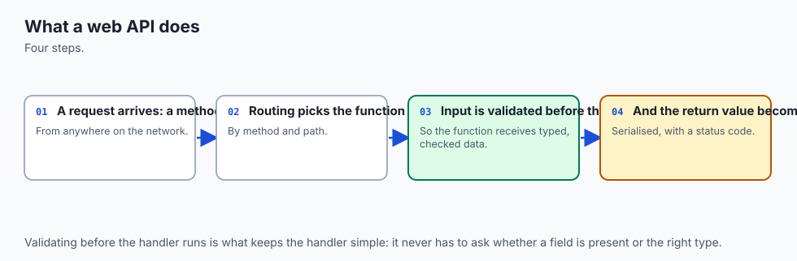
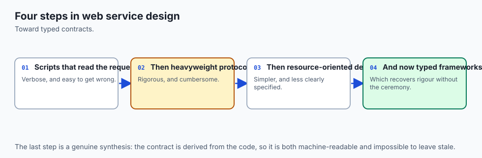
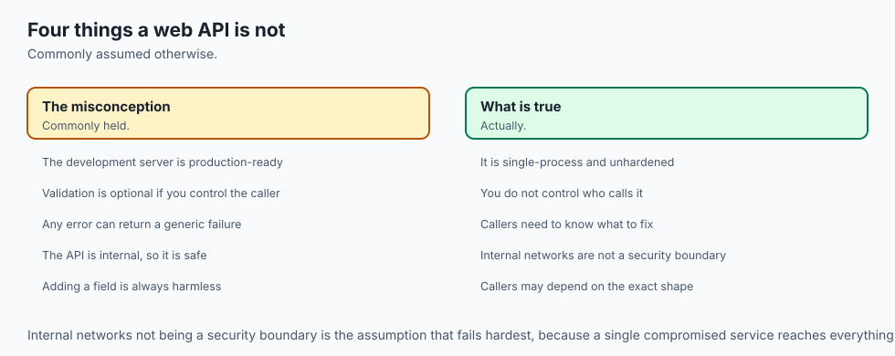
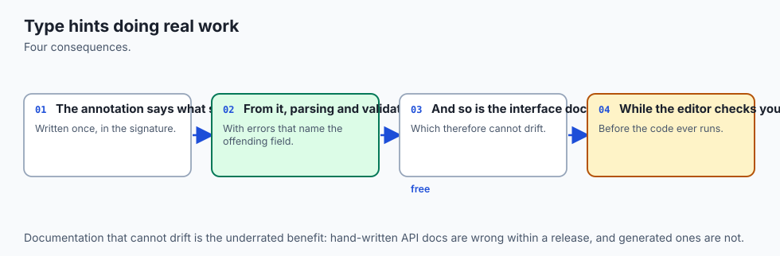
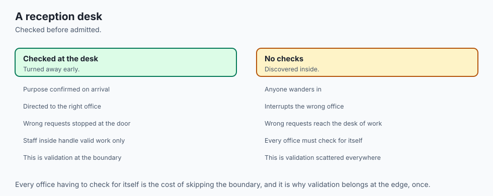
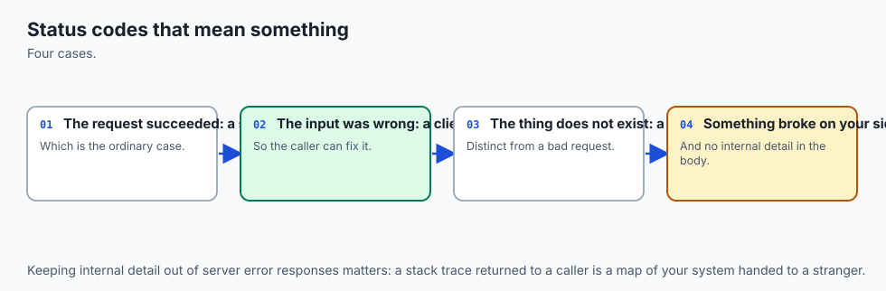
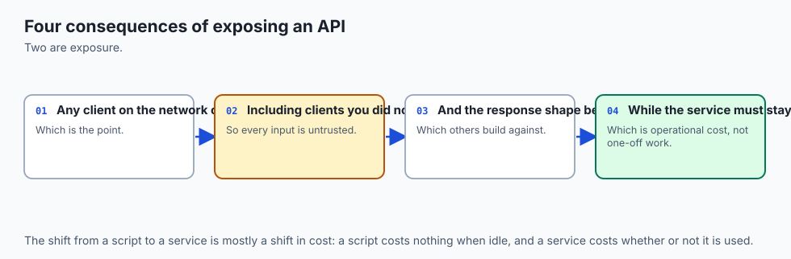
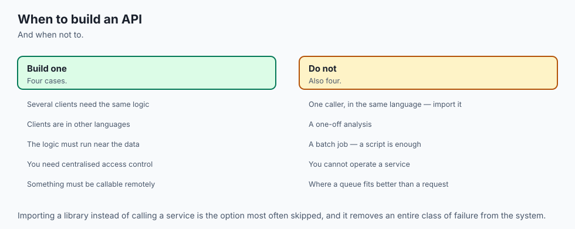

## Why this matters

Four days ago, on Day 78, you learned to be a client. You sent a request and something answered. You read a status code and decided what it meant. You looked at headers you did not write, parsed a JSON body you did not design, and set a timeout because a server on the other side of the world might never reply. Every one of those things was somebody else's decision, arriving at your program as a fact.

Today the arrow reverses. **You become the server.** Every status code, every header, every field in every JSON body is now something you choose — and are answerable for. Nobody hands you a 404; you decide that a missing bookmark is a 404 rather than an empty list or a crash. Nobody hands you a `Content-Type`; you decide what you produce. When your response is confusing, no upstream provider is at fault. That inversion is the whole of today, and it is a bigger step than it sounds, because a server has an obligation a client does not: **it must behave correctly for a caller it has never met and cannot inspect.**

Here is the concrete shape of that obligation, and it is the reason this lesson exists at all. On Day 75 you ran mypy, and mypy is superb at one thing and structurally incapable of another. It reads your source before you run and finds where your code contradicts its own annotations. It never sees a value. That lesson said, in as many words, that a `str` which must be an email address is — to mypy, at any strictness setting — exactly as good as any other `str`, and that the complement to a static checker is a library that validates actual data at runtime, and it named pydantic and moved on, because pydantic was not installed.

Today pydantic arrives, and not because we went looking for it. **It arrives as a dependency of FastAPI**: `pip install fastapi` installs it whether you name it or not, because FastAPI is, more than anything else, a machine for turning your type annotations into runtime validation. The version that landed here is **pydantic 2.13.4**, read from the installed package metadata rather than assumed, alongside **fastapi 0.139.2**, **uvicorn 0.51.0**, **httpx 0.28.1**, **pytest 9.1.1** and **Python 3.14.0**. Every line of output quoted in this lesson is a real capture from a real run on this machine on 19 July 2026.

So the sentence worth carrying out of today is this: **you write one annotation, and it now causes checking to happen at runtime, at the boundary, against a stranger's data.** Days 67 to 70 taught you to model a domain with classes; Day 75 taught you to declare types. Both of those were, in a sense, notes to yourself and to your tools. Today the same declarations become an enforced contract with the outside world — and an error message that tells the stranger exactly which field they got wrong.

The stakes for your AI work are direct and near. A model is served over exactly this: an inference endpoint is a `POST` with a validated request body, a declared response model, a timeout, and a status code chosen on purpose. When you later expose a function to an agent as a tool, you write a name, a description and a typed parameter schema — and the OpenAPI document FastAPI generates for you today is machine-readable in precisely the same way, for precisely the same reason. Today you are not learning a web framework as a detour from AI. You are learning the shape every model, every tool and every agent integration is delivered in.

## The idea in plain language



A **web page** and a **web API** travel over the same wire, using the same protocol, and are built for two different audiences.

A web page is for a person. It arrives as HTML, a browser lays it out, and the whole question is whether a human can find what they came for. If you rename a heading from "Sign in" to "Log in", nothing breaks — a person reads the new word and carries on.

A **web API** is for a machine. It arrives as data, usually JSON, and no browser lays it out because nothing is being looked at. On the other end is a program that was written weeks ago by somebody who has never spoken to you, and that program does not read. It knows that the answer contains a field called `title` and it will take `response["title"]`. Rename that field to `name` and every one of those programs breaks at once, at three in the morning, without warning.

That is the single difference from which everything else today follows: **because the client is a machine, the contract matters more than the appearance.** A web page can be pretty and vague. An API must be plain and exact. Its whole value is that the same request produces the same shape of answer tomorrow.

A web API is therefore made of four kinds of decision, and you make all four:

1. **What things exist** — the *resources*. A bookmark. A model. A conversation. Each addressed by a path: `/bookmarks`, `/bookmarks/bm-0001`.
2. **What can be done to them** — the *methods*. `GET` to read, `POST` to create, `PATCH` to change part, `DELETE` to remove.
3. **What a caller may send and will receive** — the *schemas*. Which fields, of which types, with which constraints, which are required.
4. **How the result is reported** — the *status code*. 200 for here-it-is, 201 for I-made-it, 204 for done-and-nothing-to-say, 404 for no-such-thing, 422 for your-request-was-malformed, 500 for I-broke.

FastAPI's contribution is that you express items 3 and 4 as ordinary Python type annotations and decorator arguments, and it does the rest: it converts the text in the URL into the type you declared, checks the body against the model you declared, produces a precise error when they do not match, filters what you return down to the fields you declared, and writes a machine-readable specification of all of it that you never touch.

## Historical background



The idea that computers should call each other over HTTP is older than most working programmers, and the first serious attempts were far heavier than what you will write today.

Through the late 1990s the dominant approach was **remote procedure call over XML**. XML-RPC, published by **Dave Winer** in 1998, wrapped a function call and its arguments in XML and posted it to a single URL. **SOAP** grew out of the same effort and became a large, formal family of specifications with its own description language, WSDL, and a tooling industry around it. The model was: the network is a way to call a function somewhere else, and everything — the method name, the arguments, the errors — lives inside the message body. HTTP was a pipe. Its verbs and status codes were mostly unused; everything was a `POST` to one endpoint, and a failure came back as a `200 OK` containing an XML fault.

Then, in **2000**, **Roy Fielding** submitted a doctoral dissertation at the University of California, Irvine, titled *Architectural Styles and the Design of Network-based Software Architectures*. Chapter 5 of it describes an architectural style he named **REST** — Representational State Transfer. Fielding was not inventing a new protocol; he had co-authored the HTTP specification, and his dissertation is in large part an argument about *why the web already worked*, expressed as a set of constraints: a uniform interface, statelessness between requests, addressable resources, and responses that say whether they may be cached.

The practical consequence was a reversal. Instead of one URL and a function name in the body, you get **many URLs, one per thing**, and you use the protocol's own verbs to act on them. HTTP stops being a pipe and starts being the interface.

Two clarifications that matter, because both are widely misstated:

- **REST is not a standard.** There is no REST specification, no compliance test, no version number. It is a description of an architectural style in a thesis. What the industry calls "a REST API" is really a loose family of conventions — resources as nouns, methods as verbs, JSON bodies, meaningful status codes — and most real APIs, including good ones, satisfy some of Fielding's constraints and ignore others. He later wrote publicly that an API without hypermedia controls is not REST at all, which would disqualify the overwhelming majority of things called REST APIs today. Saying "loosely RESTful" is more honest than pretending otherwise, and nobody will think less of you for it.
- **HTTP itself is a standard, and a current one.** The version people cite from memory, RFC 2616 from 1999, was replaced in 2014 and again in 2022. **RFC 9110, HTTP Semantics**, is the current definition of the methods and status codes you will use today.

On the Python side, the plumbing evolved in two steps. **PEP 333**, authored by **Phillip J. Eby** in 2003, defined **WSGI** — a single agreed calling convention between a Python web application and whatever server hosted it. Before WSGI, every framework needed an adapter for every server; after it, any WSGI application ran on any WSGI server, and Flask and Django both live in that world. WSGI is *synchronous* by design: one request occupies one worker until it finishes.

**ASGI** is the asynchronous successor, developed by **Andrew Godwin** out of the work that became Django Channels. It keeps the same idea — one agreed calling convention — while allowing a handler to be a coroutine, so a request that is merely *waiting* for a database or another service can yield the worker to somebody else. FastAPI is an ASGI framework, and **uvicorn** is the ASGI server this lab pins.

The framework itself is recent. **FastAPI was created by Sebastián Ramírez and first released in 2018.** It is deliberately thin: it sits on **Starlette**, the ASGI toolkit written by **Tom Christie** at Encode, for routing, middleware and the test client, and on **pydantic**, created by **Samuel Colvin** in 2017, for everything to do with data. FastAPI's own contribution is the join between them — reading a function signature and deciding what is a path parameter, what is a query parameter, what is the request body, and what should be injected, then generating a specification from all of it.

pydantic's second version, released in 2023, rewrote the validation core in Rust as a separate package, `pydantic-core`. That is why the error messages you will see today have stable machine-readable `type` strings like `string_too_short` and `int_parsing`: they come from a compiled core with a defined vocabulary, not from formatted prose.

Finally, the specification format. **OpenAPI** began life as **Swagger**, created by **Tony Tam** at Wordnik around 2010 as a way to describe an HTTP API in a machine-readable document. In 2015 the specification was donated to the Linux Foundation, the **OpenAPI Initiative** was formed, and Swagger the specification became OpenAPI while Swagger continued as the name of a family of tools. The document FastAPI generated for the lab reports itself as OpenAPI `3.1.0`.

## What it is — and what it is not



FastAPI is a Python library that turns annotated functions into HTTP endpoints, validates everything crossing the boundary, and publishes a machine-readable description of the result. That is the whole job description. The misconceptions below are expensive, and several of them are why people ship an API that works on their laptop and leaks on the internet.

| Common misconception | The reality |
| --- | --- |
| "FastAPI is a web server." | It is not. It is an application. **uvicorn** is the server: it owns the socket, speaks HTTP, and calls your application. In the lab there is no server at all, because `TestClient` calls the application directly. |
| "The annotations are documentation, like on Day 69." | Not any more. At import time pydantic compiles each annotation into a validator, and that validator runs against real data on every request. An annotation now causes work to happen. |
| "pydantic replaces mypy." | They ask different questions at different moments. mypy asks whether *your code* contradicts its own annotations, before you run, without ever seeing a value. pydantic asks whether *a stranger's data* satisfies them, while running, holding the actual bytes. An API needs both. |
| "If it validates the input, it is secure." | Validation is not authorization. A perfectly well-formed `DELETE` from someone with no right to delete is still a deletion. Authentication and permission checks are separate work that no model gives you. |
| "Declaring what I return is just paperwork." | It is the filter that stops internal fields leaving the process. In the lab, deleting one `response_model=` line puts a server-side secret into every response, and the code still "works". |
| "A 500 is how you tell a client they sent something wrong." | 4xx means the caller's request was at fault; 5xx means you were. Getting this backwards means every monitoring dashboard you ever build reports your users' typos as your outages. |
| "`async def` makes handlers faster." | It makes them *concurrent while waiting*. A handler that does pure computation gains nothing and can make things worse by blocking the event loop. |
| "REST is a standard I can be compliant with." | There is no REST specification to comply with. There are conventions, and there is HTTP, which *is* specified. |
| "The interactive docs page is the API." | The docs page is a rendering. The API is the OpenAPI JSON document — the machine-readable part is the part that matters, and the pretty page is generated from it. |
| "I will add tests once it runs." | An in-process test suite costs you nothing here: no server to start, no port to choose, no readiness loop, no cleanup. The lab's 42 tests run in under a second. |

## Why it was created and what problems it solves

Before FastAPI, writing a Python API meant writing the same four kinds of glue by hand, in every handler, forever. It is worth seeing what that glue looks like, because the value of the framework is precisely the code you no longer write.

A handler that receives a JSON body and must not trust it has to do all of this:

```python
def create_bookmark(raw_body: bytes):
    try:
        data = json.loads(raw_body)
    except json.JSONDecodeError:
        return 400, {"error": "body is not valid JSON"}
    if not isinstance(data, dict):
        return 400, {"error": "body must be an object"}
    title = data.get("title")
    if title is None:
        return 400, {"error": "title is required"}
    if not isinstance(title, str):
        return 400, {"error": "title must be a string"}
    if not 1 <= len(title) <= 80:
        return 400, {"error": "title must be 1 to 80 characters"}
    url = data.get("url")
    ...
```

Fourteen lines and we have checked one field of one endpoint, produced an error format nobody else's code can parse reliably, and stopped at the first problem so the caller has to make five round trips to learn about five mistakes. Multiply by every field, every endpoint, every developer who writes it slightly differently, and you have the actual state of a great many production APIs.

FastAPI's answer is that all of that is derivable from a declaration you would want to write anyway:

```python
class BookmarkCreate(BaseModel):
    model_config = ConfigDict(extra="forbid")
    title: str = Field(min_length=1, max_length=80)
    url: HttpUrl
    tags: list[str] = Field(default_factory=list, max_length=8)
```

That is the whole of the fourteen lines above, plus the ones for `url` and `tags`, plus reporting every problem at once, plus a stable machine-readable error format, plus a published schema. The specific problems it solves, in order of how much they will bite you:

**It removes the gap between what you meant and what you check.** In hand-written glue, the docstring says one thing and the `if` statements say another, and they drift within a month. Here they are the same object, so they cannot.

**It makes the error message useful to a machine.** A hand-rolled `{"error": "title must be 1 to 80 characters"}` is prose. The caller's program cannot act on prose; it can only log it and give up. The 422 body is structured, and every entry names the field.

**It closes the loop mypy could not.** This is the point Days 70 and 75 kept circling. A static checker proves your code is self-consistent; nothing about that proof survives contact with data arriving from a stranger. The boundary is exactly where static checking runs out, and it is exactly where pydantic starts.

**It stops the leak.** Separate input and output models are a security control, not an aesthetic preference. The most common data leak in real APIs is a handler that returns the database row, and the row has one more column than the author remembered.

**It publishes the contract without anybody maintaining it.** Hand-written API documentation is wrong within two sprints — not because people are careless, but because the documentation and the code are two artifacts that must be changed together and only one of them breaks a test when it is not. A generated schema cannot drift, because there is nothing to drift from.

## How it works



![Diagram: the architecture of a FastAPI application — a client sends bytes to an ASGI server that owns the socket, the server hands a request to the application, and inside it a routing table picks one path operation, dependency resolution calls each Depends function so storage and the clock arrive as arguments, pydantic validation converts and checks the path, query and body against your annotations and is the only place a 422 is produced, your handler runs and calls the domain layer behind it, and response-model serialization filters the result down to the declared output fields before a status code and JSON body travel back out — while an unhandled exception anywhere becomes a 500 whose body is five words and whose traceback stays in the server log, and the same routes and models feed a generated OpenAPI schema off to the side that nobody wrote](./assets/api-architecture.svg)

### The application object and a first path operation

Everything begins with one object.

```python
from fastapi import FastAPI

app = FastAPI(title="Bookmarks API", version="1.0.0")


@app.get("/health")
async def health() -> dict[str, str]:
    return {"status": "ok"}
```

`app` is the application. The decorator `@app.get("/health")` registers a **path operation**: the pairing of one HTTP method with one path pattern and the function that answers it. FastAPI stores that pairing in a routing table, and at request time the table is consulted before any of your code runs. If nothing matches the path you get a 404; if the path matches but the method does not, a 405. Your function is never entered in either case, which is worth knowing the first time you spend twenty minutes debugging a handler that was never called.

### Running it for real

The application does nothing on its own. It needs an ASGI server to own the socket and speak HTTP:

```bash
uvicorn api:app --reload --host 127.0.0.1 --port 8123 --app-dir examples
```

`api:app` means "the object named `app` in the module named `api`". `--reload` restarts on a file change and is for development only. `--host 127.0.0.1` binds the loopback interface, so only your own machine can reach it. That command really was run while writing this lesson, and it really printed this:

```text
INFO:     Started server process [35291]
INFO:     Waiting for application startup.
INFO:     Application startup complete.
INFO:     Uvicorn running on http://127.0.0.1:8123 (Press CTRL+C to quit)
INFO:     127.0.0.1:56570 - "GET /health HTTP/1.1" 200 OK
INFO:     127.0.0.1:56571 - "POST /bookmarks HTTP/1.1" 201 Created
```

**The lab does not do this, and that is deliberate.** A test that starts a server has to choose a port, which may already be taken; wait for readiness, which invites either a flaky sleep or a polling loop; and shut the process down even when the test fails, or leave a stray server running. FastAPI's `TestClient` removes all of it by driving the application object in-process, through httpx, with no socket opened at all. Every stage in the diagram above happens identically — routing, dependencies, validation, your handler, serialization — because the only thing removed is the wire. That makes it the cleanest possible expression of this week's rule that tests must not touch the network, and it is why the lab's 42 tests finish in under a second with nothing to clean up.

### Path parameters, and the fact that everything is text

A path parameter is a named piece of the path:

```python
@app.get("/items/{item_id}")
def read_item(item_id: int) -> dict[str, object]:
    return {"item_id": item_id, "python_type": type(item_id).__name__}
```

The URL `/items/7` carries the *character* `7`, not the number seven. HTTP has no types; a URL is text. The annotation `item_id: int` is what turns one into the other, and the handler receives a real `int`. Here is the actual response:

```text
$ GET /items/7
200
{
  "item_id": 7,
  "python_type": "int"
}
```

And when the text cannot become an `int`, the handler is not entered at all:

```text
$ GET /items/seven
422
{
  "detail": [
    {
      "type": "int_parsing",
      "loc": [
        "path",
        "item_id"
      ],
      "msg": "Input should be a valid integer, unable to parse string as an integer",
      "input": "seven"
    }
  ]
}
```

Read that body carefully, because you will read hundreds of them. `type` is the machine-readable rule that was broken. `loc` is the location of the offending value — here, the `item_id` component of the path. `msg` is for a human. `input` is what was rejected. Nothing in it is prose your code has to guess at.

### Query parameters, defaults, and optionality

Any parameter in the signature that is *not* part of the path and is not a pydantic model becomes a query parameter. A default makes it optional:

```python
@app.get("/search")
def search(
    q: str,
    page: int = 1,
    verbose: bool = False,
    sort: Annotated[str | None, Query(max_length=16)] = None,
) -> dict[str, object]:
    return {"q": q, "page": page, "verbose": verbose, "sort": sort}
```

`q` has no default, so it is required. `page`, `verbose` and `sort` have defaults, so they are optional, and the defaults are what the handler sees when nothing was sent:

```text
$ GET /search?q=fastapi
200
{
  "q": "fastapi",
  "page": 1,
  "verbose": false,
  "sort": null
}
```

Omit the required one and you get the same structured refusal, with `"type": "missing"` and `"loc": ["query", "q"]`. Booleans accept the spellings a URL actually carries — `true`, `1`, `yes`, `on` and their opposites — and arrive as real Python booleans:

```text
$ GET /search?q=x&verbose=yes&page=3
200
{
  "q": "x",
  "page": 3,
  "verbose": true,
  "sort": null
}
```

`Annotated[str | None, Query(max_length=16)]` is how you attach a constraint. The `Annotated` form keeps the type where a type belongs and puts the metadata beside it, which means mypy still reads the annotation as `str | None` and FastAPI reads the extra part. Both tools get what they need from one declaration.

### Request bodies, and the moment worth dwelling on

A parameter annotated with a pydantic model is the request body:

```python
class BookmarkCreate(BaseModel):
    model_config = ConfigDict(extra="forbid")
    title: str = Field(min_length=1, max_length=80)
    url: HttpUrl
    tags: list[str] = Field(default_factory=list, max_length=8)


@app.post("/bookmarks")
def create_bookmark(payload: BookmarkCreate) -> ...:
    ...
```

**Stop here, because this is the sentence the whole day turns on.**

On Day 69 you wrote `def find(name: str) -> Model | None` and then proved, by running it, that Python stores that annotation in `__annotations__` and never compares a value against it. A function annotated to return an integer returned the string `'abab'` and nothing objected. On Day 75 you installed a program that reads those annotations before you run, and it caught real bugs — but it never saw a value, and it never could.

Here, the same syntax does a third thing. When this module is imported, pydantic reads the annotations on `BookmarkCreate` and compiles them into a validator. When a request arrives, that validator runs against the actual bytes a stranger sent, and it either produces a real `BookmarkCreate` object with a real `str` and a real parsed URL, or it refuses and the handler is never entered. **The annotation is no longer a note. It is executable.**

That is the exact complement Day 75 could only describe:

| | mypy (Day 75) | pydantic (today) |
| --- | --- | --- |
| When it runs | Before your program runs | While your program runs |
| What it reads | Your source code | Actual incoming data |
| The question it asks | Does this code contradict its own annotations? | Does this data satisfy them? |
| Does it see a value? | Never | Always — it is holding the bytes |
| What it produces | A report and an exit status | A validated object, or a 422 |
| Whose mistake it catches | Yours | Your caller's |
| Can it check that a string is a URL? | No, at any strictness setting | Yes, and it normalises it |
| What it costs at runtime | Nothing — it never ships | Microseconds per request |

Neither is optional in a serious service, and they are not alternatives. mypy stops you shipping a handler that would crash on the `None` path. pydantic stops a stranger's malformed record from reaching that handler in the first place. You need both because **the caller is a stranger**: everything inside your process you can reason about statically, and nothing arriving from outside it you can.

### Validation errors and the 422

FastAPI answers a failed validation with **422**, a status code originally defined for WebDAV in RFC 4918 as "Unprocessable Entity" and carried into RFC 9110 as "Unprocessable Content". It means: I understood the request and its syntax was fine, but the *contents* are wrong. That is genuinely different from a 400, which means the request itself was malformed, and different again from a 404 or a 403.

The body is the interesting part. Here is a real response to a request with two bad fields at once:

```text
POST /bookmarks   (empty title, and the url is not a url)
  -> 422
     {
       "detail": [
         {
           "type": "string_too_short",
           "loc": [
             "body",
             "title"
           ],
           "msg": "String should have at least 1 character",
           "input": "",
           "ctx": {
             "min_length": 1
           }
         },
         {
           "type": "url_parsing",
           "loc": [
             "body",
             "url"
           ],
           "msg": "Input should be a valid URL, relative URL without a base",
           "input": "not a url",
           "ctx": {
             "error": "relative URL without a base"
           }
         }
       ]
     }
```

Three things to notice. **`detail` is a list**, and there are two entries, because validation reports everything wrong at once rather than stopping at the first problem — the caller fixes both mistakes in one round trip instead of two. **`loc` is a path**, not a name: `["body", "title"]`, `["query", "limit"]`, `["path", "item_id"]`, and for a nested model something like `["body", "author", "email"]`. And **`type` is stable and machine-readable**, which is why the lab's tests assert on `string_too_short` rather than on the English sentence beside it — the sentence is prose and may be reworded, exactly as Day 75 argued about mypy's error codes.

There is a fourth thing, quieter and more important: with `extra="forbid"`, a field the model does not declare is a 422 rather than being silently dropped. Sending `{"titel": "..."}` becomes an error you can see instead of an afternoon wondering why the title never changed. And a client trying to set its own `id` gets `"type": "extra_forbidden"` — which is a security control, not a nicety.

### Response models, and how you stop a leak

Declaring what you *return* matters as much as declaring what you accept, and for a reason that is not obvious until it bites you.

The lab's stored record carries a server-side secret:

```python
class StoredBookmark(BaseModel):
    id: str
    title: str
    url: HttpUrl
    tags: list[str]
    created_at: datetime
    owner_token: str      # internal — must never leave the process


class BookmarkOut(BaseModel):
    id: str
    title: str
    url: HttpUrl
    tags: list[str]
    created_at: datetime
```

The handler returns the *stored* object — the one with the secret in it — and that is safe, because of one line in the decorator:

```python
@app.post("/bookmarks", response_model=BookmarkOut, status_code=201)
def create_bookmark(...) -> StoredBookmark:
    ...
    return record
```

`response_model=BookmarkOut` filters the returned object down to the declared fields before serialization. The handler returns the truth; the declaration decides what the caller is entitled to see. The lab prints the proof:

```text
  stored owner_token : secret-owner-token
  owner_token in the response body? False
  the secret string in the response body? False
```

Delete that one line and the same code still "works" — every test about creating a bookmark still passes, and a secret is now in every response. This is why the lab asserts the field's **absence** by key and by raw substring on every route that returns a bookmark, and why the test harness deletes the line from a copy of the application and demands that the suite go red. An assertion that cannot fail is protecting nothing.

The generated schema tells the same story from the other side: `components.schemas.BookmarkOut.properties` lists `created_at, id, tags, title, url` and nothing else, so the *published contract* does not admit the field either.

### Status codes chosen on purpose

The status code is not decoration; it is the part of the answer a machine reads first.

| Code | Meaning | When you choose it | What must be true |
| --- | --- | --- | --- |
| 200 OK | Here is the thing | Reads, and updates that return the updated object | There is a body |
| 201 Created | I made a new thing | `POST` that creates a resource | Send a `Location` header naming the new resource |
| 204 No Content | Done, and deliberately nothing to say | `DELETE` that succeeded | The body must be **empty** |
| 400 Bad Request | Your request was malformed | Broken JSON, a nonsensical combination of parameters | Not for field-level validation — that is 422 |
| 401 Unauthorized | I do not know who you are | No or bad credentials | You have an authentication scheme |
| 403 Forbidden | I know who you are and you may not | Authenticated but not permitted | You have authorization, not just authentication |
| 404 Not Found | No such thing | A lookup that found nothing | An answer, not a crash |
| 409 Conflict | That clashes with the current state | Creating a duplicate; a lost-update conflict | You can say what conflicted |
| 422 Unprocessable Content | Your fields are wrong | Any validation failure | The body names every offending field |
| 429 Too Many Requests | Slow down | Rate limiting | Ideally a `Retry-After` header |
| 500 Internal Server Error | **I** broke | An unhandled exception | The body says nothing else |
| 503 Service Unavailable | I am down or overloaded | Maintenance, dependency outage | Temporary by implication |

The line that matters most is between **4xx and 5xx**: 4xx says the caller's request was at fault, 5xx says you were. Get it backwards and every monitoring dashboard you ever build will report your users' typos as your outages, and your real outages will hide among them.

Two specifics worth internalising. A **201** should carry a `Location` header naming the thing you just made, so the caller does not have to guess the URL — and the lab asserts that the header is not decorative by immediately fetching it. A **204** must have an empty body; that is what the code means, so the handler returns a bare `Response` rather than a model.

### Error handling, and why a traceback must never reach a client

For a known negative answer, raise:

```python
raise HTTPException(status_code=404, detail=f"No bookmark with id {bookmark_id!r}")
```

The caller receives a small, predictable body:

```text
GET  /bookmarks/nope     (does not exist)
  -> 404
     {
       "detail": "No bookmark with id 'nope'"
     }
```

That is an *answer*. Nothing crashed; a lookup found nothing and said so.

An *unknown* failure is different. If a handler raises something you did not anticipate, the framework turns it into a 500 whose body is five words:

```text
$ GET /ratio/1/0
500
'Internal Server Error'
```

The `ZeroDivisionError` behind it is real, and its traceback is printed on the server where you can read it. It is not sent. That asymmetry is deliberate and non-negotiable: **a traceback names your file paths, your line numbers, your framework versions and the values of your local variables**, and every one of those is a gift to somebody probing your service. It also tells an ordinary caller nothing they can act on. The lab asserts, explicitly, that the 500 body contains no filename, no exception name and no traceback.

Be careful with `detail` strings too. Echoing back an id the caller just sent is fine. Echoing something they did *not* send — an internal message, a filename, a query — is how a helpful error becomes a disclosure.

### Dependency injection with `Depends`

Day 74 argued that anything crossing a boundary should arrive as an argument rather than be reached for, because a thing passed in can be replaced in a test and a thing reached for cannot. `Depends` is that argument with framework support.

```python
def get_storage() -> Storage:
    return JsonFileStorage(Path(os.environ.get("BOOKMARKS_FILE", "bookmarks.json")))


def get_now() -> datetime:
    return datetime.now(tz=UTC)


StorageDep = Annotated[Storage, Depends(get_storage)]
NowDep = Annotated[datetime, Depends(get_now)]


@app.get("/bookmarks/{bookmark_id}", response_model=BookmarkOut)
def get_bookmark(bookmark_id: str, storage: StorageDep) -> StoredBookmark:
    ...
```

The mechanism is simpler than the name suggests. `Depends(f)` means "call `f` and pass me the result". FastAPI does that per request, caching the result within one request if the same dependency is asked for twice. Dependencies can themselves have dependencies, so a `get_current_user` can depend on a `get_settings`, and the chain is resolved for you.

The payoff is the test. `app.dependency_overrides` is a dictionary mapping a dependency function to whatever you want instead, consulted on every request:

```python
app.dependency_overrides[api.get_storage] = lambda: InMemoryStorage()
app.dependency_overrides[api.get_now] = lambda: datetime(2026, 7, 19, 9, 30, tzinfo=UTC)
app.dependency_overrides[api.get_new_id] = lambda: f"bm-{next(counter):04d}"
```

Nothing inside the application is patched, and no handler contains a flag saying "if testing". The handlers ask for storage and receive storage; they cannot tell which one. That is why the lab's `created_at` is a value you can assert on, why the first bookmark is always `bm-0001`, and why the whole suite touches no file at all — a claim the harness verifies by searching the lab directory for a stray `bookmarks.json` afterwards.

Note also what `get_storage` does *not* do: it does not contain a path literal. The path comes from the environment, which is the same rule Day 78 stated for API tokens and which applies to every secret a server holds.

### The generated schema, and why a machine-readable contract is the point

You have declared, in ordinary Python, every path, every method, every parameter with its type and constraints, every request model, every response model and every status code. FastAPI assembles all of that into an OpenAPI document and serves it at `/openapi.json`. The lab's, in full, is checked in as `expected-output/openapi.json`; here is its shape:

```text
  openapi version : 3.1.0
  title / version : Bookmarks API 1.0.0
  /bookmarks                   GET, POST
  /bookmarks/{bookmark_id}     DELETE, GET, PATCH
  /health                      GET
  component schemas: BookmarkCreate, BookmarkOut, BookmarkUpdate, HTTPValidationError, HealthOut, ValidationError
  BookmarkOut fields: created_at, id, tags, title, url
```

Nobody wrote that document, and nobody can forget to update it, because there is nothing to update — it is derived from the code that runs. FastAPI also serves an interactive page at `/docs`, rendered from that same document, where a reader can expand any endpoint and send a real request from the browser. That page is convenient. **The document is the point.** From it, a tool can generate a typed client in another language, a contract test, a mock server, or a tool definition for a model — none of which requires a human to explain your API to anyone.

That last one is worth saying plainly, since it is where this course is going. When you expose a function to an agent, you provide a name, a description and a typed parameter schema so the model can decide when to call it and with what. A generated OpenAPI document is that same information, for every endpoint you have, produced automatically from annotations you wrote for other reasons.

### `async def`, to exactly the depth you need today

A path operation may be `def` or `async def`, and both work:

```python
@app.get("/health")
async def health(storage: StorageDep) -> HealthOut:
    return HealthOut(status="ok", bookmarks=len(storage.all()))
```

Here is the entire rule for today. **`async def` matters when the handler *waits* on input or output** — a database, another service, a file — because while it waits, the event loop can run somebody else's request on the same worker. A handler that only computes gains nothing from being a coroutine.

There is one trap worth knowing before you meet it: inside an `async def` handler, a *blocking* call — an ordinary synchronous database driver, `time.sleep`, a large file read — blocks the whole event loop and therefore every other request on that worker. If your library is synchronous, use a plain `def` handler; FastAPI runs those in a thread pool, so blocking is contained.

You do not need to understand the event loop today, and this lesson deliberately does not teach it. Write `def` unless you are awaiting something. That is enough to be correct for a long time.

## An everyday analogy



Hold this picture, because the rest of the lesson runs on it.

A shop has two entrances. At the front is the **shop window**, and it is for people. It has lighting, a layout, a sign. If the sign is reworded from "Sign in" to "Log in", nobody breaks; a person reads the new words. That is a web page.

At the back is the **goods-inwards desk**, and it is for trucks. A driver you have never met arrives with a delivery note. There is a clerk at a hatch, a spec sheet pinned to the wall, and a rack of numbered stamps. Nothing about this entrance is decorative, because nothing here is being looked at by anyone who can adapt.

Every part of today is at that desk.

**The bays are resources.** Each one has an address — bay 12, shelf D — and you refer to a delivery by its bay rather than by a description. `/bookmarks/bm-0001` is a shelf address.

**The delivery note has an action box, and it is a verb.** Deliver, collect, amend, return. `POST`, `GET`, `PATCH`, `DELETE`. The action is on the *note*, not the bay: the bay is a noun and does not change.

**The clerk checks the note against the spec sheet before anything is wheeled inside.** That is pydantic. The check happens at the hatch, and this is the whole reason the desk exists. If the quantity box is blank and the origin address is not an address, the clerk does not accept the pallet and sort it out later. The truck never enters the building. **Nothing is stored.** The clerk hands the note back with every faulty line circled — all of them, in one go, not one per visit — which is the `detail` list of a 422.

**The stamps are status codes.** Accepted-and-shelved with the shelf number written on the receipt: 201 with a `Location`. Removed, nothing further to say: 204. No such shelf: 404. Note rejected at the hatch: 422. And the one nobody wants: a shelf collapsed inside the warehouse, and all the driver is told is "we have a problem here" — 500 — because the driver does not get to hear which racking failed, in which aisle, holding whose stock. **That is not rudeness; it is that the internal layout of your warehouse is not the driver's business, and a stranger who learns it can use it.**

**The outgoing docket lists only what the customer is entitled to know.** Your internal stock code, the name of the supplier who undercut everyone, the shelf's real capacity — those stay inside. The docket is a *different form* from the internal record, printed from it deliberately. That is the response model, and the day it becomes the same form is the day your internal codes are on every customer's desk.

**The clerk is handed the ledger and the wall clock; they do not wander off to find them.** That is `Depends`. And because the ledger is handed over, a training exercise can hand over a *practice* ledger and a *stopped* clock, and the clerk performs exactly the same checks, in exactly the same order, on a real note — while nothing real is moved and nothing real is written down. That is `TestClient` with `dependency_overrides`, and it is why an in-process test is a real test rather than a simulation.

**The spec sheet on the wall is the OpenAPI document.** It is not a summary somebody typed up; it is printed from the same rules the clerk applies, so it cannot describe a check that is not performed. Any haulier's computer can read it and fill the note correctly first time.

The analogy has one honest limit, and it is the same one the security section makes: **the clerk checks the note, not the driver.** A perfectly correct delivery note in the hands of somebody with no right to be at your loading bay is still a stranger at your loading bay. Validation is not authorization. The desk needs a second question — *who are you, and may you?* — and no amount of form-checking answers it.

## Examples in practice



The lab builds a bookmarks API end to end, and every fragment below is real output from it. What follows is a tour of the finished thing; the exercise section tells you how to build it yourself.

### The complete resource

```python
@app.post("/bookmarks", response_model=BookmarkOut, status_code=status.HTTP_201_CREATED)
def create_bookmark(
    payload: BookmarkCreate,
    storage: StorageDep,
    now: NowDep,
    new_id: NewIdDep,
    owner_token: OwnerTokenDep,
    response: Response,
) -> StoredBookmark:
    record = StoredBookmark(
        id=new_id,
        title=payload.title,
        url=payload.url,
        tags=payload.tags,
        created_at=now,
        owner_token=owner_token,
    )
    storage.add(record)
    response.headers["Location"] = f"/bookmarks/{record.id}"
    return record
```

Six parameters, and only one of them came from the caller. `payload` is the validated body; the other four were injected. That is the shape to aim for: a handler whose arguments are all already correct, so its first line is business logic rather than defensive parsing.

Creating one:

```text
POST /bookmarks   (a valid body)
  -> 201
  -> Location: /bookmarks/bm-0001
     {
       "id": "bm-0001",
       "title": "The FastAPI documentation",
       "url": "https://fastapi.tiangolo.com/",
       "tags": [
         "python",
         "web"
       ],
       "created_at": "2026-07-19T09:30:00Z"
     }
```

Notice that the URL came back with a trailing slash that was not sent. `HttpUrl` does not merely accept or reject; it **normalises**, so downstream code sees one spelling of a URL rather than five. Validation's second job is canonicalisation, and it is the one people forget until an assertion fails.

### Filtering, and a constrained query parameter

```python
@app.get("/bookmarks", response_model=list[BookmarkOut])
def list_bookmarks(
    storage: StorageDep,
    tag: Annotated[str | None, Query(...)] = None,
    limit: Annotated[int, Query(ge=1, le=100)] = 20,
) -> list[StoredBookmark]:
    items = storage.all()
    if tag is not None:
        items = [b for b in items if tag in b.tags]
    return items[:limit]
```

```text
GET  /bookmarks?tag=validation
  -> 200
     [
       {
         "id": "bm-0002",
         "title": "The pydantic documentation",
         "url": "https://docs.pydantic.dev/latest/",
         "tags": [
           "python",
           "validation"
         ],
         "created_at": "2026-07-19T09:30:00Z"
       }
     ]
```

And the constraint doing its work:

```text
GET  /bookmarks?limit=0   (out of range)
  -> 422
     {
       "detail": [
         {
           "type": "greater_than_equal",
           "loc": [
             "query",
             "limit"
           ],
           "msg": "Input should be greater than or equal to 1",
           "input": "0",
           "ctx": {
             "ge": 1
           }
         }
       ]
     }
```

`"input": "0"` is a string, because that is what a query string carries. The conversion to `int` succeeded; the range check is what failed.

### The refusal that is a security control

```text
POST /bookmarks   (a client trying to choose its own id)
  -> 422
     {
       "detail": [
         {
           "type": "extra_forbidden",
           "loc": [
             "body",
             "id"
           ],
           "msg": "Extra inputs are not permitted",
           "input": "admin"
         }
       ]
     }
```

`BookmarkCreate` has no `id` field, and `extra="forbid"` turns sending one into an error rather than a shrug. An API that accepts a client's id lets a caller overwrite somebody else's record by guessing; an API that accepts a client's `created_at` lets a caller rewrite history.

### Partial update, deletion, and the emptiness of a 204

```text
PATCH /bookmarks/bm-0001  (title only)
  -> 200
     {
       "id": "bm-0001",
       "title": "FastAPI docs",
       "url": "https://fastapi.tiangolo.com/",
       ...
     }

DELETE /bookmarks/bm-0002
  -> 204
     (empty body)

GET  /bookmarks/bm-0002  (after deletion)
  -> 404
     {
       "detail": "No bookmark with id 'bm-0002'"
     }
```

The partial update works because `payload.model_dump(exclude_unset=True)` reports which fields the caller *actually sent* — genuinely different from which fields are `None`, since a caller may legitimately send a null on purpose.

### Testing it, in-process

```python
@pytest.fixture
def client(storage, monkeypatch):
    counter = itertools.count(1)
    api.app.dependency_overrides[api.get_storage] = lambda: storage
    api.app.dependency_overrides[api.get_now] = lambda: FROZEN_NOW
    api.app.dependency_overrides[api.get_new_id] = lambda: f"bm-{next(counter):04d}"
    with TestClient(api.app) as test_client:
        yield test_client
    api.app.dependency_overrides.clear()


def test_a_valid_create_returns_the_response_model_shape(client):
    body = client.post("/bookmarks", json=VALID).json()
    assert set(body) == {"id", "title", "url", "tags", "created_at"}
    assert body["id"] == "bm-0001"
    assert body["created_at"] == "2026-07-19T09:30:00Z"
```

Forty-two tests of this kind, and they finish in a quarter of a second:

```text
============================== 42 passed in 0.24s ==============================
```

The reference suite also runs behind a guard that replaces `socket.socket.connect` and `socket.create_connection` with functions that raise, and the harness proves that guard is armed by writing a throwaway test that deliberately tries to connect and demanding it fail. That is what "no network" means when it is a claim rather than an intention.

### Free tools you can use against it today

Once the server is running, three free things read the generated schema without you writing a client. The browser at `/docs` gives you the interactive page; `curl` — which you met on Day 78 — will fetch `/openapi.json`; and `python3 -c "import json,urllib.request; ..."` will pretty-print it with nothing installed at all. None of these needs an account, a key or a paid tier.

## Implications: security, privacy, performance, scalability, and cost



**Security starts with the distinction the analogy ended on: validation is not authorization.** Every request in the lab's API is validated, and every request is completely unauthenticated. A well-formed `DELETE` from a stranger is still a stranger deleting your data. Authentication (*who are you?*) and authorization (*may you?*) are separate work, and no pydantic model provides either. FastAPI has good support for adding them — security dependencies that slot into the same `Depends` mechanism — and the moment you add one, every existing test must supply a credential, which is precisely when authentication stops being free.

**Never trust a client-supplied identifier.** The id, the creation time and any internal token are server-generated. This is not fussiness; it is the difference between "create a bookmark" and "overwrite bookmark number 7, whoever owns it".

**Declare what you return, or leak it.** The most common data leak in real APIs is a handler that returns the storage record, and the record has one more field than the author remembered — a password hash, an internal note, another user's email, a flag that reveals your schema. `response_model` is one line, which is exactly why it is easy to omit, which is exactly why you assert on the *absence* of the field rather than trusting the line to still be there next month.

**A traceback is never a response.** Covered above, and worth repeating because the failure mode is silent: a 500 whose body is a stack trace looks helpful in development and is a map of your internals in production.

**CORS deserves one honest paragraph.** Cross-Origin Resource Sharing is a *browser* mechanism: a page loaded from one origin may not read a response from another origin unless that origin's headers permit it. It protects the user's browser session, and it does nothing whatsoever against `curl`, a script, or any non-browser client. Setting `allow_origins=["*"]` to silence a frontend error is a decision about which web pages may read your data — not a security measure in general, and, if your API uses cookies, a decision with real consequences. Middleware you do not need is its own risk; the lab adds none, because it has no browser frontend.

**Secrets come from the environment.** A value in source is a value in version control, in every clone, in every backup and in every screen-share.

**Privacy** is mostly about what you log. It is very easy to log the request body for debugging and thereby write every user's personal data into a log file with a different retention policy and a different access list than your database. Log identifiers, log status codes, log timings; think hard before logging bodies.

**Performance.** Validation costs microseconds per request and pydantic v2's core is compiled, so for anything doing real work it is not your bottleneck; your database and your outbound calls are. `async def` buys concurrency *while waiting*, which is why an API that mostly waits on other services benefits and one that mostly computes does not. The blocking-call trap is worth repeating: a synchronous call inside an `async def` handler stalls every other request on that worker.

**Scalability.** ASGI applications scale horizontally: run more worker processes, put a load balancer in front. That works only if your application is **stateless between requests** — one of Fielding's constraints, and the practical reason for it. Keep session state in a database or a cache, never in a module-level dictionary, or the second worker will not know what the first one did. The lab's `JsonFileStorage` is deliberately honest about its own limit: it rewrites the whole file per call, which is fine for hundreds of records and wrong for millions, and two simultaneous writes can lose one. Week 13's database work is the answer.

**Cost.** The software is free: FastAPI, Starlette, pydantic, uvicorn, httpx and pytest are all MIT-licensed, developed in the open, with no paid tier, no account and no key. What costs money is *running* it — a machine, or a container, or a serverless invocation — and that cost is driven by how long each request occupies a worker. Which is the practical reason to care about the `async def` question at all, and the reason a timeout on every outbound call (Day 78) is a cost control as much as a reliability one: a request stuck waiting forever is a worker you are paying for and cannot use.

## Alternatives: free, open source, and commercial

Five ways to serve HTTP from Python. **All five are free and open source**; none has a paid tier, a licence fee or an account requirement, and the money in this space is in hosting rather than in the frameworks.

**Two honest notes before the list.** Only FastAPI (0.139.2, with uvicorn 0.51.0 and pydantic 2.13.4) and the standard library are installed on the machine this lesson was written on, so those are the only two with quoted output. **Flask, Django, Django REST Framework and Litestar are not installed here**, so what follows describes them from their design and documentation and quotes no output for them. That is the house rule: describe accurately, invent nothing.

### FastAPI — installed here

**What it is.** An ASGI framework built on Starlette and pydantic, whose distinguishing idea is that your type annotations generate the validation, the serialization and the OpenAPI schema.

**When to choose it.** When the thing you are building is an API rather than a website; when the payload shapes matter and you want them checked; when you want a machine-readable contract without maintaining one; when handlers wait on other services. This is the default choice for serving a model.

**How to use it.** `pip install fastapi uvicorn`, create an `app`, decorate functions with `@app.get(...)` and friends, declare bodies as pydantic models, run with `uvicorn module:app`, test with `TestClient`.

**A worked example** — a complete, runnable API in ten lines:

```python
from fastapi import FastAPI
from pydantic import BaseModel, Field

app = FastAPI()


class Prompt(BaseModel):
    text: str = Field(min_length=1, max_length=2000)
    temperature: float = Field(default=0.7, ge=0.0, le=2.0)


@app.post("/generate", status_code=200)
def generate(prompt: Prompt) -> dict[str, str]:
    return {"completion": prompt.text.upper()}
```

That already rejects an empty prompt, rejects a temperature of 5, converts a JSON number to a float, and publishes a schema — which is why it is a fair sketch of a real inference endpoint.

**Free vs paid.** Free and open source, MIT-licensed. No paid tier exists.

### Flask — not installed here

**What it is.** A small, synchronous WSGI framework created by **Armin Ronacher** in 2010, built on Werkzeug and Jinja2. Famously minimal: routing, request and response objects, templating, and very little else, with functionality added through a large ecosystem of extensions.

**When to choose it.** When you want a tiny amount of HTTP around some Python and no opinions; when the project mixes HTML pages and a few JSON endpoints; when your team already knows it; when the surrounding libraries are synchronous anyway. It remains an excellent choice for a small internal service.

**How to use it.** `pip install flask`, create an `app`, decorate functions with `@app.route(...)`, return a string or a dict, run with `flask run`.

**A worked example**, in the shape Flask's own documentation uses:

```python
from flask import Flask, request, jsonify

app = Flask(__name__)


@app.post("/generate")
def generate():
    data = request.get_json()
    text = data.get("text")
    if not isinstance(text, str) or not text:
        return jsonify({"error": "text is required"}), 400
    return jsonify({"completion": text.upper()})
```

The difference from the FastAPI version is the point of the comparison: the validation is yours to write, the error format is yours to invent, and no schema is generated. For two fields that is fine; for forty it is the fourteen-lines-per-field problem from earlier in this lesson.

**Free vs paid.** Free and open source, BSD-licensed.

### Django plus Django REST Framework — not installed here

**What it is.** Django is a large, batteries-included web framework created at the *Lawrence Journal-World* newspaper in Lawrence, Kansas, by **Adrian Holovaty** and **Simon Willison**, released publicly in 2005. It brings its own ORM, migrations, authentication, permissions and an automatic admin interface. **Django REST Framework**, created by **Tom Christie**, is the standard library on top of it for building APIs, with serializers, viewsets, permission classes and a browsable API.

**When to choose it.** When the application is much more than an API — user accounts, an admin interface, complex relational data, a long institutional life. If you would want the ORM, the migrations, the auth system and the admin regardless, adding DRF is far less work than assembling equivalents around a smaller framework.

**How to use it.** `pip install django djangorestframework`, `django-admin startproject`, define models, define serializers, define viewsets, register them with a router.

**A worked example**, in DRF's characteristic shape:

```python
from rest_framework import serializers, viewsets
from .models import Bookmark


class BookmarkSerializer(serializers.ModelSerializer):
    class Meta:
        model = Bookmark
        fields = ["id", "title", "url", "tags", "created_at"]


class BookmarkViewSet(viewsets.ModelViewSet):
    queryset = Bookmark.objects.all()
    serializer_class = BookmarkSerializer
```

Note `fields` — DRF makes the same input/output split this lesson insists on, by listing the fields a serializer exposes. Same discipline, different spelling.

**Free vs paid.** Both free and open source; Django is BSD-licensed and DRF is BSD-licensed. Commercial support and hosting exist from third parties, but the software costs nothing.

### Litestar — not installed here

**What it is.** An ASGI framework that began as **Starlite** and was renamed Litestar. It occupies similar ground to FastAPI — type annotations, validation, generated OpenAPI — with a more opinionated structure, first-class support for several validation backends rather than pydantic alone, and layered dependency injection.

**When to choose it.** When you want FastAPI's model but prefer more structure out of the box for a larger application, or when you specifically want a validation library other than pydantic.

**How to use it.** `pip install litestar`, define handlers with its route decorators, register them on a `Litestar` application object, run under any ASGI server.

**A worked example**, in the shape its documentation uses:

```python
from dataclasses import dataclass
from litestar import Litestar, post


@dataclass
class Prompt:
    text: str


@post("/generate")
async def generate(data: Prompt) -> dict[str, str]:
    return {"completion": data.text.upper()}


app = Litestar([generate])
```

**Free vs paid.** Free and open source, MIT-licensed.

### The standard library's `http.server` — installed everywhere

**What it is.** A minimal HTTP server in the Python standard library. No framework, no dependencies, nothing to install ever.

**When to choose it.** For the genuinely trivial case: a one-endpoint internal helper, a fixture server for a test (which is exactly what Day 79's lab used it for), a five-minute diagnostic. And — the reason it is in this list — as a learning exercise, because writing even two routes with it makes the framework's contribution unmistakable.

**How to use it.** Subclass `BaseHTTPRequestHandler`, implement `do_GET` or `do_POST`, write the status line, the headers and the body yourself.

**A worked example**, the same endpoint one more time:

```python
import json
from http.server import BaseHTTPRequestHandler, HTTPServer


class Handler(BaseHTTPRequestHandler):
    def do_POST(self):
        if self.path != "/generate":
            self.send_response(404)
            self.end_headers()
            return
        length = int(self.headers.get("Content-Length", 0))
        try:
            data = json.loads(self.rfile.read(length))
        except json.JSONDecodeError:
            self.send_response(400)
            self.end_headers()
            return
        text = data.get("text")
        if not isinstance(text, str) or not text:
            self.send_response(422)
            self.end_headers()
            self.wfile.write(b'{"detail": "text is required"}')
            return
        body = json.dumps({"completion": text.upper()}).encode()
        self.send_response(200)
        self.send_header("Content-Type", "application/json")
        self.send_header("Content-Length", str(len(body)))
        self.end_headers()
        self.wfile.write(body)
```

Twenty-eight lines for one route with the weakest possible validation, no schema, no dependency injection, and routing done with an `if`. Count the lines and you have measured what FastAPI is worth.

**Free vs paid.** Part of Python. Free, and already on your machine.

### Choosing between them

| | FastAPI | Flask | Django + DRF | Litestar | `http.server` |
| --- | --- | --- | --- | --- | --- |
| Model | ASGI, async-native | WSGI, synchronous | WSGI (ASGI-capable) | ASGI, async-native | Raw stdlib |
| Validation | Automatic, from annotations | You write it | Serializers you declare | Automatic, from annotations | You write it |
| OpenAPI schema | Generated | Via an extension | Via an extension | Generated | None |
| Dependency injection | Built in | Not built in | Not built in | Built in | None |
| Brings a database layer | No | No | Yes, its own ORM | No | No |
| Admin interface | No | No | Yes | No | No |
| Best fit | APIs, model serving | Small services, mixed HTML and JSON | Large applications with users and admin | Structured APIs | Trivial or throwaway |
| Installed here | **Yes**, 0.139.2 | No | No | No | Yes, stdlib |
| Licence and cost | MIT, free | BSD, free | BSD, free | MIT, free | Python, free |

## Comparison with related concepts

**A web API versus a web page.** The same protocol, two audiences. A page is rendered for a person and may change its wording freely; an API is parsed by a program and may not change its field names without breaking every caller. That is why an API needs a *version* and a *contract* and a page mostly does not.

**REST versus RPC.** RPC — XML-RPC, gRPC, JSON-RPC — models the network as calling a function somewhere else: one endpoint, a method name in the payload. REST models it as acting on addressable resources with the protocol's own verbs. RPC often wins where the operation genuinely is a verb with no natural noun ("recalculate the index"); REST wins where the domain is full of things you create, read, change and remove. Most real systems mix both and call the whole thing REST.

**REST versus GraphQL.** GraphQL exposes one endpoint and lets the client specify the exact shape it wants, which solves the over-fetching problem — many small REST calls, or one big response with fields nobody needed — at the cost of a more complex server, harder caching (HTTP caching keys on the URL, and there is only one) and a much larger surface for a client to accidentally ask something expensive.

**pydantic versus dataclasses (Day 69).** A dataclass generates `__init__`, `__repr__` and `__eq__` from annotations and performs **no validation whatsoever**: `Point(x="hello")` is a perfectly good dataclass instance. A pydantic model looks similar and validates and converts on construction. Use a dataclass for a value inside your program that you constructed correctly; use a pydantic model at a boundary where the value came from outside.

**pydantic versus mypy.** The table in the "How it works" section is the full answer: before-versus-during, source-versus-data, your-mistake-versus-your-caller's. They are complements, not competitors.

**Validation versus authorization.** Repeated deliberately because it is the confusion with the worst consequences. Well-formed and permitted are different questions, answered by different code.

**`TestClient` versus a live server test.** `TestClient` exercises routing, dependencies, validation, your handler and serialization — everything except the socket and the HTTP wire format. What it therefore cannot catch is a problem in the server layer itself: a proxy configuration, a TLS setting, a header your load balancer strips. In practice you write hundreds of in-process tests and a handful of live smoke tests against a deployed environment, and this week's rule is about the first kind.

**ASGI versus WSGI.** One agreed calling convention between application and server, in two generations. WSGI is synchronous — one request occupies one worker for its whole life. ASGI allows coroutines, so a waiting request can yield. Flask and Django grew up in the WSGI world; FastAPI and Litestar are ASGI-native.

**Middleware versus a dependency.** Middleware wraps *every* request and response and sees them as raw HTTP — the right place for request logging, CORS headers, or compression. A dependency runs for *the routes that ask for it* and sees typed Python — the right place for the current user, a database session or settings. If you find yourself inspecting paths inside middleware to decide whether to act, you probably wanted a dependency.

## When to use it — and when not to



**Use FastAPI when:**

- You are serving a model, a dataset, or any capability another program will call. This is the case that motivates the whole day.
- The shapes of your payloads matter and you want them checked at the boundary rather than trusted.
- You want a machine-readable contract other teams and other tools can consume without a conversation.
- Your handlers spend their time waiting on other services, so async concurrency is real rather than theoretical.
- You want an in-process test suite that runs in a second with nothing to start and nothing to clean up.

**Reach for something else when:**

- **You are building a website, not an API.** If the output is HTML for people, Django or Flask with a template engine is a better fit, and Django's admin alone may be worth the whole framework.
- **You need the batteries.** If you want an ORM, migrations, an auth system and an admin interface, Django plus DRF gives you a coherent set rather than five separately-chosen libraries.
- **The task is genuinely trivial and short-lived.** A single-endpoint helper you will delete next week does not need a dependency; `http.server` is already installed.
- **The work is one long computation, not a request/response.** A four-hour training job behind an HTTP request is a design error whatever framework you use. The correct shape is a job queue: the endpoint accepts the work, returns 202 with a job id, and a separate worker does it.
- **Your whole stack is synchronous and staying that way.** You can absolutely use FastAPI with plain `def` handlers, but if nothing awaits anything and the team knows Flask, the honest gain is validation and the schema rather than performance.
- **There is no boundary.** Two modules in one process should call each other with function calls. Serialising to JSON and back to talk to yourself is a cost with no benefit.

And one that is not about frameworks at all: **do not put an API in front of something you have not decided how to secure.** The moment an endpoint exists, it can be called by anyone who can reach it. Deciding on authentication after deployment is how the news is made.

## The AI connection

- **Serving a model means writing an API**, which makes this lesson directly applicable.
- **Schema validation at the boundary** catches bad input before it reaches the logic.
- **Automatic documentation from types** is what makes an API usable by other teams.
- **Async request handling matters** when calls are slow, which model calls always are.
- **The same framework serves machine learning models** in the deployment course, unchanged.

## Knowledge check

1. Your API accepts `POST /bookmarks` and a caller sends `{"title": "", "url": "nope"}`. Name the status code, say how many entries appear in `detail`, and say whether the handler ran.
2. What is the difference between a 422 and a 500, in terms of whose mistake each one reports? Why does confusing them ruin monitoring?
3. `response_model=BookmarkOut` is on a handler that returns a `StoredBookmark` containing `owner_token`. What appears in the response body, and what would appear if you deleted that one argument?
4. A `DELETE` succeeds. Which status code, and what must the body contain?
5. Explain, in one sentence each, what mypy checks and what pydantic checks, and why a public API needs both.
6. Why does `TestClient` need no port number, no readiness wait and no shutdown handling?
7. `app.dependency_overrides[api.get_now] = lambda: FROZEN_NOW` appears in a test fixture. What problem is it solving, and which earlier day's argument is it an instance of?
8. A colleague says their API is "fully REST compliant". What is wrong with that sentence?
9. When does `async def` actually help a path operation, and what is the one thing you must not do inside one?
10. Someone sets `allow_origins=["*"]` to fix a browser error and reports that the API is now "open but safe, since CORS is configured". What is wrong with that reasoning?

Answers, briefly. (1) 422, two entries, and no — the handler is never entered and nothing is stored. (2) 4xx is the caller's mistake, 5xx is yours; confusing them means your users' typos appear as your outages and your real outages hide among them. (3) Five fields and no `owner_token`; deleting the argument puts the secret in every response while every existing test still passes. (4) 204, and the body must be empty. (5) mypy checks that your source does not contradict its own annotations, before running, never seeing a value; pydantic checks that incoming data satisfies those annotations, while running, holding the bytes — you need both because the caller is a stranger. (6) Because it calls the application object directly in the same process rather than over a socket.

(7) It freezes the clock so `created_at` is a value a test can assert on; it is Day 74's inject-the-boundary argument applied to time. (8) There is no REST specification to be compliant with — it is an architectural style described in a dissertation, and almost every "REST API" satisfies only some of its constraints. (9) When the handler waits on input or output; you must not make a blocking call inside one, because it stalls the event loop for every other request on that worker. (10) CORS is a browser mechanism that governs which web pages may read a response; it does nothing against a script or `curl`, and it is not an access-control system.

## Hands-on exercise

![Flowchart: one POST traced from raw bytes through routing, body parsing and pydantic validation — the branch where an invalid field stops the request before the handler is ever entered and returns a 422 whose detail is a list with one entry per problem, each naming a type, the exact field in loc, a human-readable message and the rejected input — then, for a valid body, dependency resolution, the handler running with real typed objects, response-model serialization dropping the internal owner token, and a 201 with a Location header and a five-field JSON body leaving the process, with a side panel recording that a static type checker ran before any of this on the source rather than the data and asked a completely different question](./assets/request-validation-flow.svg)

The lab is **"Serve Something Real"**. You build the bookmarks API this lesson has been quoting, and you test it entirely in-process.

Set up once:

```bash
cd labs/sections/programming-with-python/day-082-a-first-web-api-with-fastapi
python3 -m venv .venv
.venv/bin/pip install -r requirements/requirements.txt
.venv/bin/python3 -c "import fastapi, pydantic; print(fastapi.__version__, pydantic.VERSION)"
```

See the finished thing answer real requests, then see where you start from:

```bash
.venv/bin/python3 examples/demo.py
.venv/bin/pytest examples
.venv/bin/pytest starter
```

`starter/app.py` is deliberately the naive version — one shared model for input and output, a module-level dictionary for storage, every response a 200, and a missing bookmark a `KeyError`. Eight numbered exercises turn it into the reference implementation:

1. Constrain `title` to 1–80 characters and change `url` from `str` to `HttpUrl`.
2. Split the one model into `BookmarkCreate`, `StoredBookmark` and `BookmarkOut`, add `extra="forbid"`, and put `response_model=BookmarkOut` on every handler that returns a bookmark.
3. Make creation a 201 and set a `Location` header.
4. Add `tag` and `limit` query parameters, with `limit` constrained to 1–100.
5. Replace the `KeyError` with `HTTPException(status_code=404, ...)`.
6. Add `PATCH` (partial update) and `DELETE` (204, empty body).
7. Replace the module-level dictionary with injected dependencies for storage, the clock and the id source.
8. Run `starter/schema.py` and read the contract your application now publishes.

Each exercise has one or two tests waiting for it, marked `@pytest.mark.skip` with the exercise named in the reason. Do the exercise, delete that skip line, rerun `pytest starter`.

### Expected output

Before you begin, the starter suite is honest about its state:

```text
starter/test_app.py::test_health_is_ok_and_counts_bookmarks PASSED       [ 10%]
starter/test_app.py::test_an_empty_title_is_422_naming_the_field SKIPPED [ 20%]
...
========================= 1 passed, 9 skipped in 0.13s =========================
```

`starter/schema.py` reports the same honestly:

```text
Component schemas: Bookmark, HTTPValidationError, ValidationError

No BookmarkOut schema yet — Exercise 2 creates it.
```

When you are finished, the full harness prints eight sections and ends:

```text
39 checks, 0 failure(s).
```

The reference suite it runs reports:

```text
============================== 42 passed in 0.24s ==============================
```

### Validate your work

Run these in order; each is something you can check yourself rather than take on trust.

1. `.venv/bin/pytest examples` exits 0 and reports `42 passed`.
2. `python3 examples/demo.py` prints `-> 201` and `Location: /bookmarks/bm-0001` for the first creation.
3. In the same output, the request with two bad fields prints **two** entries under `detail` — one with `"loc": ["body", "title"]` and one with `"loc": ["body", "url"]`.
4. `owner_token in the response body? False` appears near the end. Now delete `response_model=BookmarkOut,` from the create route in `examples/api.py`, rerun, and watch it become `True`. **Put the line back.** That thirty-second experiment is the most valuable thing in the lab.
5. `python3 starter/schema.py` exits 0 and, after Exercise 2, prints `No leak: owner_token is stored but never declared as output.`
6. Search `expected-output/openapi.json` for `owner_token`. It is not there.
7. `bash tests/run_tests.sh` ends `39 checks, 0 failure(s).` and exits 0.
8. `find . -name 'bookmarks.json'` finds nothing.

### Troubleshooting

**`ModuleNotFoundError: No module named 'fastapi'`** — you ran a different Python from the one you installed into. Use `.venv/bin/pytest` and `.venv/bin/python3`, or set `PYTEST=` for the harness, which then uses the interpreter beside it.

**`ModuleNotFoundError: No module named 'api'`** — the lab's modules import each other by bare name, which needs their directory on `sys.path`. Both `conftest.py` files arrange it, so pytest always works; scripts run directly insert it themselves.

**`StarletteDeprecationWarning: Using 'httpx' with 'starlette.testclient' is deprecated`** — real, expected, harmless with these pins. Starlette 1.3.1 is signalling that a future release prefers `httpx2`. Everything passes today; the two `pytest.ini` files filter that one message by its exact text so captured output stays readable.

**A 422 you did not expect** — read `detail[0].loc`. `["body", "title"]` is the body; `["query", "limit"]` is the query string; `["path", "item_id"]` is the URL. The three usual causes are an empty title, a `url` that is not absolute, and a field the model does not declare.

**An assertion about a URL fails by one character** — `HttpUrl` normalises. Send `https://fastapi.tiangolo.com` and you get back `https://fastapi.tiangolo.com/`. Assert the normalised form.

**`KeyError` and a 500 instead of a 404** — that is Exercise 5, not yet done.

**A 500 whose body is just `Internal Server Error`** — correct behaviour. The traceback is on the server side. `TestClient` re-raises into your test by default, which is more useful while debugging; pass `raise_server_exceptions=False` to see what a real client sees.

**`created_at` differs on every run** — expected until Exercise 7. Inject the clock and a test can freeze it.

**`AssertionError: the real JsonFileStorage was constructed in a test`** — your override key is wrong. It must be the dependency *function object*, `api.get_storage`, not a string and not a re-imported copy.

**`NetworkAccessAttempted`** — the guard did its job; something tried to open a socket. Nothing in this lab should.

### Common mistakes

- **Using one model for input and output.** It is fewer lines and a security bug: the caller can set fields they should not, and you return fields they should not see.
- **Returning a 200 for a creation.** Correct-ish and lazy. 201 with a `Location` header tells the caller both that it worked and where the new thing lives.
- **Putting a body on a 204.** The code means "nothing to say". Return a bare `Response`.
- **Catching an exception and returning a 200 with `{"error": ...}`.** Now every client must parse the body to discover whether the call worked, and every dashboard reports 100% success. Use the status code; that is what it is for.
- **Letting a traceback into a response.** Convenient in development, a map of your internals in production.
- **Reaching for a global instead of injecting.** A module-level dictionary or a module-level database handle cannot be replaced in a test. Injecting it takes one line and buys the entire suite.
- **Asserting on the English message instead of the `type`.** `msg` is prose and may be reworded; `string_too_short` is the stable identity — the same argument Day 75 made about mypy's error codes.
- **Forgetting the leak check.** A test that a field is *present* fails loudly when you break it. A field that leaks is invisible until someone asserts on its **absence**.
- **Assuming validation covers authorization.** It does not, and the failure is silent until it is very loud.
- **`async def` everywhere by default.** Only helps when the handler waits; actively harmful if it then makes a blocking call.

## Practice assignment

Build a second API of your own, from an empty file, without copying the lab. Suggested resource: **prompt templates** — a `name`, a `body` with a length bound, a `model` restricted to a small set of allowed values, and a server-generated `id` and `created_at`.

Requirements:

1. Five routes: create, list with at least one filter, get one, partial update, delete.
2. Three pydantic models — create, stored, output — with at least one field stored and never returned.
3. At least three distinct validation rules, one of which is a `Literal` restricting `model` to a fixed set of strings. Send a bad value and read the `type` in the 422.
4. Correct status codes throughout, including a 201 with a `Location` header and a 204 with an empty body.
5. `HTTPException` for every not-found case.
6. Two injected dependencies, both overridden in the tests.
7. A pytest suite driven by `TestClient` that includes a leak check asserting the internal field's **absence** — and confirm the check is real by deleting the `response_model` argument, watching that test fail, and putting it back.
8. A test that reads `/openapi.json` and asserts your five routes and your chosen status codes are in it.

You are finished when the suite passes, the schema matches what you meant to promise, and you can state — without looking — which status code each route returns and why.

## Extension challenge

Pick any two.

**Write it twice.** Implement two of your routes with `http.server` and nothing else: parse the path, read the body, validate by hand, choose the status code, write the JSON, set `Content-Type` and `Content-Length`. Then count the lines against the FastAPI version and write down what the framework was worth, in your own words. This is the from-scratch exercise, and it is the fastest way to stop treating any of this as magic.

**Add authentication and feel the cost.** Write a `require_api_key` dependency that raises `HTTPException(401)` when a header is missing, and apply it to the write routes. Watch every existing write test fail until it supplies the header. That failure is the lesson: authentication is not a setting, it is a change to your contract, and the tests are what tell you so.

**Version the API.** Move every route under `/v1/` using an `APIRouter` with a prefix, verify the generated schema still lists everything, and then think about what you would actually do the day a field has to change shape — a `/v2/`, an optional new field, or a deprecation window. Write down which and why.

**Break the leak filter deliberately, in three places.** Add an `internal_note` field to your stored model. Confirm every existing test still passes. Then write the tests that would have caught it — on the create response, on the list response, and on the schema. Now you know what a green suite does and does not tell you, which was Day 71's argument arriving at a boundary.

**Serve a model-shaped endpoint.** Write a `POST /generate` that takes a prompt with a length bound and a temperature constrained to 0.0–2.0, and returns a response model containing the completion, a token count and the model name. Do not call any real model; return a deterministic transformation. The point is the shape — a validated request body, a declared response model, a chosen status code — because that is what an inference endpoint is, and you have now written one.

Whichever you pick, notice what you have actually acquired today. You can define a contract, enforce it against a stranger, report a failure in a form a machine can act on, refuse to leak, and publish a description of all of it that no human maintains. **That is what serving a model is.** When you expose a function to an agent later in this course — a name, a description, a typed parameter schema, a validated call, a structured result — you will be doing exactly what you did today, and the only new thing will be who is reading the schema.
