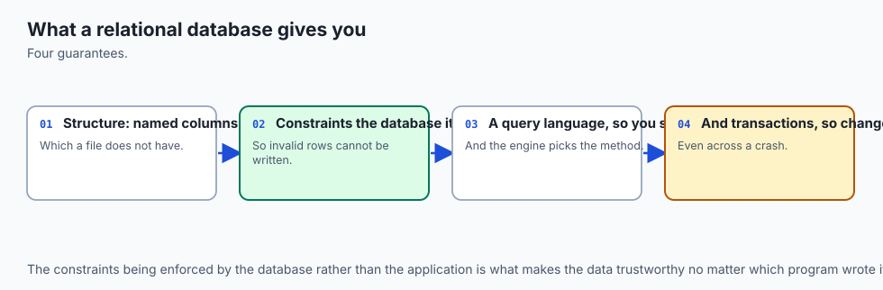
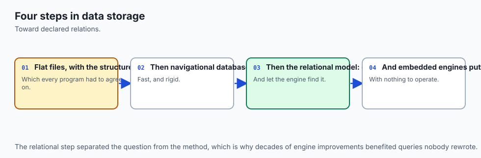
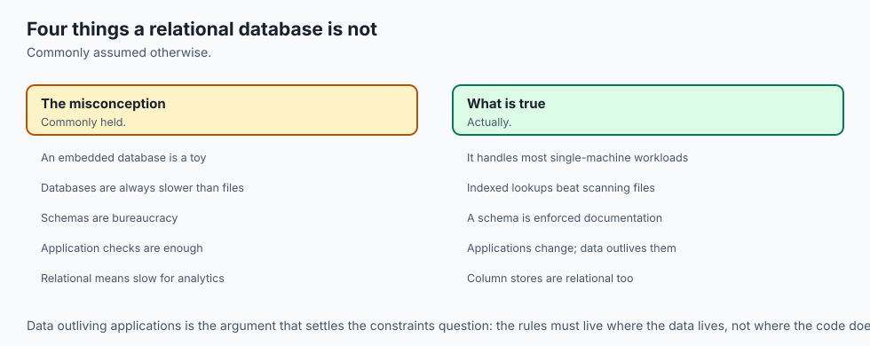
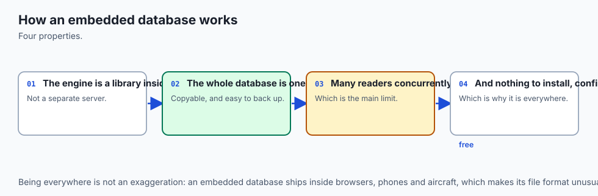
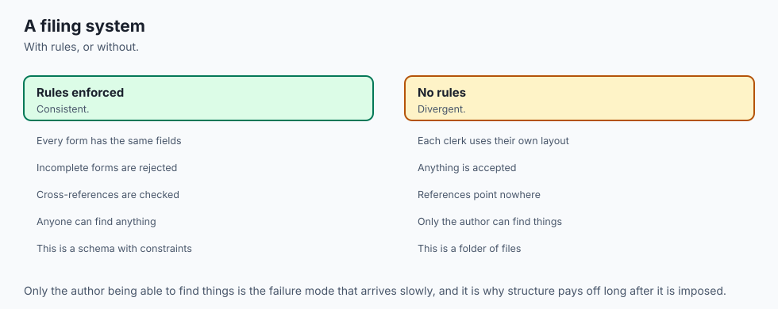
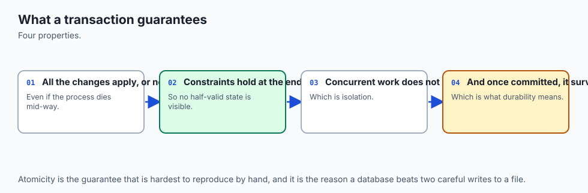
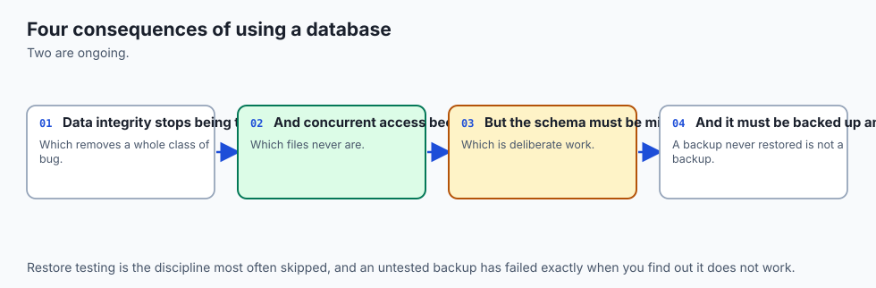
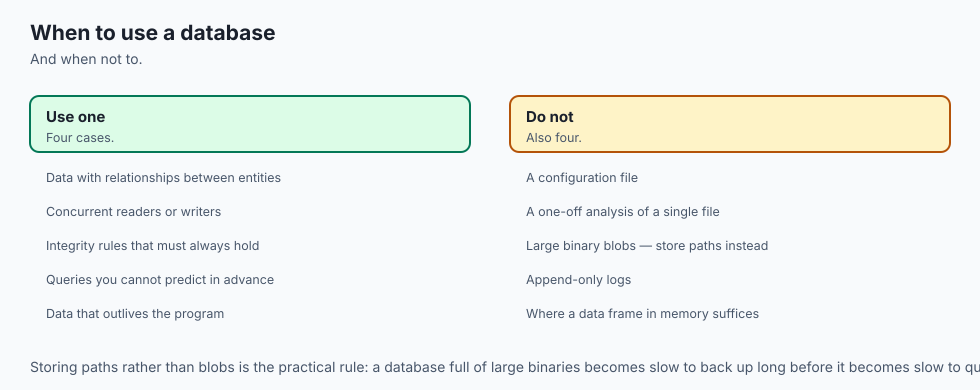

## Why this matters

Yesterday you shipped a toolkit that kept its state in a JSON file, written atomically. That was the right decision, and today you find out exactly where it stops being the right decision — not by argument, but by measurement.

Here is the state file from Week 12, grown up a little. It holds loans: which book, which member, when it was borrowed, when it is due, whether it has come back. A member returns a book, so one field on one record changes from `null` to a date. Twenty-seven bytes.

This is what it costs to change those twenty-seven bytes, measured on the authoring machine by `examples/json_pain.py` in today's lab:

```text
       10 loans: file     1,712 bytes | changed  27 bytes | read+wrote      3,416 bytes to do it
    1,000 loans: file   170,584 bytes | changed  27 bytes | read+wrote    341,160 bytes to do it
   50,000 loans: file 8,622,249 bytes | changed  27 bytes | read+wrote 17,244,490 bytes to do it
```

Seventeen megabytes moved to change twenty-seven bytes. And that is the *cheerful* failure, because at least it is only slow. Three more, from the same run:

**Nothing stops a lie.** Store a loan naming member 999, when there is no member 999, and `json.dump` writes it without hesitation: `stored happily: member_id=999`. It has no opinion about what a member id means, because a file has no idea what a member is. That row will sit in your data until some report six months from now produces a blank name and nobody can work out why.

**Two writers, one lost update.** Writer A reads the file and marks a loan returned. Writer B reads the same file a millisecond later and adds a new loan. Both write the whole file back, both atomically, both apparently successfully. Afterwards: `loan 1 returned_on: None`. A's work is gone. The atomic write from Day 84 protected the *file* from being torn in half; it never claimed to protect two readers who raced over it, and it cannot.

**And a question with no cheap answer.** "Which loans are overdue?" means parsing 8,622,241 bytes and examining every one of 50,000 records, every time you ask, whether three rows match or thirty thousand. There is no shortcut available, because the file has no index — and it has no index because it does not know that `due_on` is a date, or that dates have an order, or that you will ever want to ask.

Four failures, and they are not four different problems. They are one problem: **the file does not know what the data means.** Everything a database gives you follows from telling it.

This is the beginning of Week 13, and it matters to your AI work for a reason that only sounds like a slogan until you have hit it: every dataset you will train on, every embedding you will search, every evaluation log you will compare against last week's, and every fine-tuning corpus you will version lives in a database before it reaches a model. And the retrieval half of retrieval-augmented generation — the *R* — is a query. Learning to write one is not a detour from AI. It is most of the plumbing.

## The idea in plain language



A **relational database** stores your data as **tables**. That is the whole of the plain-language version, and the interesting part is what a table turns out to mean.

A table has **columns**, which are named and have a declared type, and **rows**, each of which supplies one value per column. The `books` table you build today has columns `book_id`, `title`, `author`, `year` and `copies`, and one row per book. Nothing surprising so far — it is a spreadsheet.

The three ideas that make it more than a spreadsheet are these.

**Every row is identified by a key.** The `book_id` column is the table's **primary key**: no two rows may share a value, and no row may leave it empty. That is not a naming convention or a comment. It is a rule the engine enforces on every write, from every program, forever, including the script somebody writes next year that has never heard of your validation code.

**Tables refer to each other by key.** The `loans` table does not contain a copy of the book's title. It contains a `book_id`, declared to *reference* `books`, so a loan of a book that does not exist is a write the database refuses. That refusal is the single most valuable thing on this page, because it is the failure from the last section — `stored happily: member_id=999` — turned into an error at the moment it happens rather than a mystery six months later.

**You ask for what you want, not how to find it.** This is the part that feels like a trick the first time. You write:

```sql
SELECT title, author, year FROM books WHERE year < 1980 ORDER BY year;
```

and you have described a *result*, not a procedure. Nowhere did you say whether to scan every row or consult an index, in what order to test the conditions, or how to sort. The engine decides all of that, decides it again tomorrow when the data has changed shape, and may reach a different conclusion — while returning exactly the same rows. That is what **declarative** means, and it is the whole reason SQL has outlived every language it was supposed to be replaced by.

The formal word for a table is a **relation**, and it is where "relational" comes from. It does not mean "tables relate to each other", which is the guess almost everybody makes. A relation, in the mathematical sense Codd borrowed, is a **set of tuples**: an unordered collection of rows, each of which is a fixed sequence of values drawn from named domains. Unordered matters. A table has no first row unless you ask for one with `ORDER BY`, and a query that appears to return rows in insertion order is a query getting lucky.

## Historical background



Before 1970, data on a computer was reached by following it. The dominant designs — the hierarchical model, exemplified by IBM's IMS, and the network model standardised by CODASYL — stored explicit pointers from record to record, and a program navigated them one link at a time. It worked, and it had a defect that got worse every year: the program's code encoded the physical arrangement of the data. Reorganise the storage to make one report faster and every program that touched it needed rewriting.

**Edgar F. Codd**, a British-born mathematician working at IBM's San Jose Research Laboratory, published the paper that ended that arrangement: **"A Relational Model of Data for Large Shared Data Banks"**, in *Communications of the ACM*, in **June 1970**. Its proposal was radical in an unusual direction — it *removed* things. No pointers. No navigation. Data as relations, in the mathematical sense, and queries expressed as operations on sets. The reader would say what they wanted and the system would work out how to get it.

The key phrase in the paper's own framing is **data independence**: the idea that how data is stored should be changeable without breaking the programs that use it. Every index you will ever add is an exercise of that freedom. You change the storage; no query changes; the answers are identical and the work is different.

IBM built a research system called **System R** to find out whether the idea could be made fast. Along the way, **Donald D. Chamberlin** and **Raymond F. Boyce** designed a query language for it called SEQUEL — Structured English Query Language — which was renamed **SQL** after a trademark conflict, and which is the language you are about to write. Around the same time, at the University of California, Berkeley, **Michael Stonebraker** and **Eugene Wong** built **Ingres**, an independent relational system whose descendants include PostgreSQL.

Codd received the **Turing Award in 1981**. SQL became an ANSI standard in **1986** and an ISO standard the following year, and has been revised many times since; in practice every engine implements the standard's core and then diverges, which is why "SQL" is better understood as a family than as a language.

**SQLite** — the engine you will use today — was written by **D. Richard Hipp** and first released in **2000**. Its design goal was almost the opposite of System R's: not a large shared data bank, but a database that needed no server at all, that lived in one file, and that could be linked directly into a program. Hipp placed the source code in the **public domain** rather than licensing it, which is unusual even among free software and is part of why it ended up in more or less everything: browsers, phones, aircraft, and the Python installation on your machine.

That last fact is worth pausing on. You already have a relational database. You have had one since Day 1 of this course. It shipped with Python.

## What it is — and what it is not



A **relational database** is a system that stores data as tables of typed columns, enforces a written-down set of rules about that data on every write, and answers declarative queries about it. **SQLite** is one implementation of that: an embedded, serverless, zero-configuration, single-file relational database that runs inside your own process.

It is **not a server.** There is no daemon to start, no port to open, no user account, no password, no configuration file anywhere on your machine. `sqlite3 library.db` on a path that does not exist creates the database on the first write, and `rm library.db` removes it completely. This is the property that surprises people who learned databases from PostgreSQL first, and it is the reason SQLite is a sensible first database rather than a toy one.

It is **not a toy, either.** SQLite's own documentation makes the comparison precisely: it does not compete with client-server databases, it competes with `fopen()`. The question it answers is not "should this application use SQLite or PostgreSQL" but "should this application write its own file format or use a database". Framed that way, an enormous amount of software should be using it and is not.

It is **not statically typed**, and this genuinely does surprise people. A column declared `INTEGER` will accept the text `'not-a-number'` and store it as text, quietly, in a column whose declared type says otherwise. There is a fix — `STRICT` tables — and there is a section below about exactly what happens and why.

It is **not a spreadsheet**, though the picture is similar. A spreadsheet's cell can hold anything, its rules live in your head, and its ordering is part of its meaning. A table's column has a type and constraints, its rules are enforced by the engine, and its rows have no order at all until a query gives them one.

It is **not the only shape a database can take**, and the Alternatives section takes that seriously. Document stores, key-value stores, column stores and graph databases all exist because the relational model is a trade, not a law.

| It is | It is not |
| --- | --- |
| A set of tables with typed columns and enforced rules | A file format with a schema written in a comment |
| A promise the engine keeps on every write, from every program | A convention the current code happens to follow |
| Declarative: you state the result you want | A loop you write and maintain yourself |
| An ordinary file you can copy, mail, and delete with `rm` | A service with a port, a password and a process |
| Dynamically typed by default, strictly typed on request | A system that checks every value against its column, unless you ask |
| Transactional: a group of writes lands whole or not at all | A guarantee that each individual statement succeeded |
| Concurrent for readers, serialised for writers | A distributed system, or safe on a network filesystem |

## Why it was created and what problems it solves

Each property below earns its place by defeating one of the four failures the first section measured. It is worth walking them in that order, because "best practice" is not a reason and "I watched this cost me a day" is.

**The schema defeats the lie.** `member_id INTEGER NOT NULL REFERENCES members(member_id)` is not documentation. Attempt the write that JSON accepted without comment and the engine answers:

```text
Runtime error: FOREIGN KEY constraint failed (19)
```

The lab does this seven times, once for each kind of rule — a foreign key twice, `NOT NULL`, `UNIQUE`, two `CHECK` constraints and a duplicate primary key — and then counts the rows to prove that a refused write changes nothing at all. This is validation that applies to *every writer*, which is a category of guarantee that application code fundamentally cannot provide.

**The page defeats the rewrite.** A database file is divided into fixed-size **pages**; on both SQLite builds on the authoring machine, 4,096 bytes each. Changing one field rewrites the page holding that row, not the file. That is the difference between 4 kilobytes and 8.6 megabytes, and it is why the cost of an update stops depending on how much data you have.

**The transaction defeats the lost update.** Two writers do not both get the whole file. One takes a write lock, makes its change, commits; the other then works from the result. And a group of writes becomes one indivisible act:

```text
inside the transaction:  loans 8, copies_of_book_3 2
after ROLLBACK:          loans 7, copies_of_book_3 3
```

Borrowing a book is two facts — a new loan row, and one fewer copy on the shelf — and neither is true on its own. A transaction is how you say that.

**The index defeats the scan.** An index is an ordered structure the engine maintains alongside the table, so that finding the matching rows is a descent through a tree rather than a walk through everything. Crucially, adding one changes **no answer**. In the lab you can watch the planner change its mind about the same query while the four rows it returns stay identical:

```text
QUERY PLAN
|--SCAN books
`--USE TEMP B-TREE FOR ORDER BY
```

```text
QUERY PLAN
`--SEARCH books USING INDEX books_year (year>? AND year<?)
```

That is Codd's data independence, sixty years on and visible in one command.

## How it works




Read it top to bottom. Your program calls a library, in its own process. Inside the library, a front end turns text into a program; a virtual machine runs that program; underneath, three storage layers turn row requests into byte ranges on a disk. At the bottom, two files.

### The layers, one at a time

**The interface** is the set of C functions everything else calls: prepare a statement, bind values to it, step it, finalise it. Python's `sqlite3` module is a thin wrapper over exactly these, which is why `cursor.execute(...)` followed by iteration maps so cleanly onto "prepare, then step until done".

**The tokenizer** splits SQL text into keywords, identifiers, operators and literals. **The parser** assembles those tokens into a tree and rejects anything that is not valid SQL. A syntax error never reaches any of the layers below.

**The code generator**, together with the **query planner**, is where declarative becomes procedural. It decides which index to use, in which order to test conditions, how to perform a sort. Its output is a small program in SQLite's own **bytecode**, and that program is what a *prepared statement* actually is — which is why preparing once and running many times with different bound values is faster: you skip six layers on every repeat.

**The virtual machine** executes that bytecode one instruction at a time. It is a register machine with instructions for opening a cursor on a table, seeking, reading a column, comparing, and emitting a row. Every `step` runs instructions until one row is ready, which is why a query over ten million rows can start returning results immediately and never hold them all in memory.

**The B-tree layer** is where a table stops being rows and starts being pages. Both tables and indexes are stored as B-trees — ordered trees whose nodes are pages — which is what makes a keyed lookup a short descent rather than a scan.

**The pager** caches pages in memory, decides what to write and when, takes the locks, and implements rollback. **Every ACID guarantee is made here.** Nothing above the pager knows what a transaction is.

**The OS interface** performs the actual `open`, `read`, `write`, `fsync` and locking calls, and is the layer that gets swapped out to make SQLite run on an operating system it has never met.

And beneath all of it, the artefacts: **`library.db`**, plus either a **rollback journal** (`library.db-journal`) or a **write-ahead log** (`library.db-wal`), depending on mode. The rollback journal, which is the default, holds the *original* content of the pages a transaction is about to change, so an interrupted commit can be undone. A write-ahead log inverts it: new content is appended to the log first and folded back into the database later, which lets readers carry on while a writer works.

### The file, proved rather than asserted

The file format is documented, so you can check it yourself rather than believe a lesson. The first sixteen bytes of every SQLite database are the ASCII string `SQLite format 3` followed by one NUL byte; bytes 16 and 17 are the page size, big-endian; bytes 28 to 31 are the page count. `examples/file_facts.py` opens the file in binary mode and reads them:

```text
first 16 B:  b'SQLite format 3\x00'
hex:         53 51 4c 69 74 65 20 66 6f 72 6d 61 74 20 33 00
matches the documented magic string: True

page size (header bytes 16-17):  4,096 bytes
page count (header bytes 28-31): 7
pages * page size:               28,672 bytes
```

Seven pages, 28,672 bytes, and `ls -l` agrees. Three tables, three indexes, twenty rows: one ordinary file you could copy with `cp` and mail to somebody.

### Types: dynamic, with affinity

Most databases refuse a value whose type does not match its column. SQLite does not. A column's declared type is an **affinity** — a preference the engine applies when it can and abandons when it cannot — and the value keeps its own **storage class** regardless. There are five storage classes:

| Storage class | Holds | Notes |
| --- | --- | --- |
| `NULL` | Nothing, meaningfully | Not zero, not an empty string: the absence of a value |
| `INTEGER` | A signed integer | Stored in 1, 2, 3, 4, 6 or 8 bytes depending on magnitude |
| `REAL` | A floating-point number | An 8-byte IEEE 754 value |
| `TEXT` | A string | Stored in the database's encoding |
| `BLOB` | Bytes, exactly as given | The engine does not interpret them at all |

And five affinities — `TEXT`, `NUMERIC`, `INTEGER`, `REAL` and `BLOB` — which a column gets from the rules SQLite applies to its declared type name. The consequences are best seen than described. Five inserts into a table whose `year` column is declared `INTEGER`:

```text
┌────┬──────────────┬────────────┬─────────────────────────┬─────────────┐
│ id │     year     │ year_class │          title          │ title_class │
├────┼──────────────┼────────────┼─────────────────────────┼─────────────┤
│ 1  │ 1970         │ integer    │ converted to integer    │ text        │
│ 2  │ not-a-number │ text       │ stored as text          │ text        │
│ 3  │ 1975         │ integer    │ float that fits         │ text        │
│ 4  │ 1975.5       │ real       │ float that does not fit │ text        │
│ 5  │ 1968         │ integer    │ 42                      │ text        │
└────┴──────────────┴────────────┴─────────────────────────┴─────────────┘
```

Row 1: the text `'1970'` was converted, because the conversion is lossless. Row 2: `'not-a-number'` could not be, so it was stored as text — in a column declared `INTEGER`, with no error, no warning and no log line. Row 3: the float `1975.0` fits in an integer, so it became one. Row 4: `1975.5` does not, so it stayed real. Row 5: the integer `42` went into a `TEXT` column and became the string `'42'`.

Row 2 is the one that costs you an afternoon, and here is how:

```text
rows_matching_year_lt_2000 = 4
rows_total                 = 5
```

In SQLite's sort order, every `INTEGER` sorts before every `TEXT`. So the row holding `'not-a-number'` can never satisfy `year < 2000`. Five rows in, four rows out, and nothing anywhere said so. This is not a bug — it is documented, deliberate, and the reason SQLite runs on devices with no room for a type system. But it means a `SELECT` can silently give you an incomplete answer.

The fix is a **STRICT table**, added to SQLite in version 3.37.0. Every column must be declared as one of `INT`, `INTEGER`, `REAL`, `TEXT`, `BLOB` or `ANY`, and the engine enforces it:

```text
Runtime error: cannot store TEXT value in INTEGER column tight.year (19)
```

Note carefully what `STRICT` does *not* change: the lossless conversion still happens, so `'1970'` still becomes the integer `1970`. `STRICT` refuses values that genuinely are not the declared type, not values that can be converted without losing anything.

### ACID, one letter at a time

| Letter | What it promises | What it buys you here |
| --- | --- | --- |
| **Atomicity** | A transaction happens entirely or not at all | The loan row and the decremented copy count land together, or neither does |
| **Consistency** | A transaction moves the database from one valid state to another | Every constraint holds before and after; a write that would break one is refused, not repaired later |
| **Isolation** | Concurrent transactions do not see each other's partial work | The lost update from the first section cannot happen: one writer at a time, and readers never see a half-finished change |
| **Durability** | Once committed, it survives a crash | The journal or WAL plus `fsync` mean a power cut at the wrong instant leaves the old state or the new one, never a mixture |

Isolation is the one worth dwelling on, because it names the exact failure that Day 84's atomic write could not prevent. An atomic write protects a file from being torn in half. Isolation protects *two transactions* from each other. They are different problems and only one of them can be solved with `os.replace`.

Be honest about the limits. SQLite gives you many concurrent readers and **one writer at a time**, for the whole database, not per table. `PRAGMA journal_mode = WAL` lets readers proceed while a writer works, which helps enormously and does not change the one-writer rule. And SQLite's locking depends on the operating system's file locking, which is unreliable on network filesystems — its own documentation says so, and a database on a network share is a database you will eventually corrupt.

### The life of one query


Follow one statement across it. `SELECT title, author, year FROM books WHERE year < 1980 ORDER BY year` arrives as a string with no guarantee of being valid. It is tokenized and parsed. The planner chooses — with no index on `year`, it chooses `SCAN books` plus a temporary B-tree for the sort; add an index and it chooses `SEARCH books USING INDEX books_year` instead, for the same four rows. The choice is compiled to bytecode. The virtual machine runs it, asking the pager for pages; the pager answers from its cache or reads 4,096 bytes from the file. Rows come back one at a time, one per step.

You wrote the first box. Everything after it is the loop you would otherwise have written by hand — which brings us to writing it by hand.

### Building the engine from scratch

The fastest way to stop finding SQL mysterious is to implement the part of it you actually use. Almost every `SELECT` you will write this week is three operations, and they are the ones Codd's relational algebra calls restriction and projection, plus a sort:

```python
def restrict(rows, predicate):
    """WHERE. One pass, every row, no cleverness."""
    kept = []
    for row in rows:
        if predicate(row):
            kept.append(row)
    return kept


def project(rows, columns):
    """The column list after SELECT."""
    return [{column: row[column] for column in columns} for row in rows]


def order_by(rows, key, descending=False):
    """ORDER BY — and NULLs have to be decided, not assumed."""
    return sorted(
        rows,
        key=lambda row: (row[key] is None, row[key] if row[key] is not None else 0),
        reverse=descending,
    )
```

Three details in those twelve lines are worth more than the lines themselves.

`restrict` calls the predicate on **every row**, always, whether one matches or all of them do. That is what "full table scan" means, and writing it makes the cost visible in a way that reading about indexes does not.

`order_by` cannot simply sort, because Python refuses to compare `None` with an integer. Somebody has to **decide** where NULLs go. The version above puts them last; SQLite's own default in an ascending sort puts them **first**. Neither is wrong, and the difference is exactly the kind of thing that makes two "identical" queries disagree.

And the pipeline order — restrict, then project, then sort — is a *cost* decision, not a correctness one. Sorting four rows after filtering is cheaper than sorting fifty thousand before it. Choosing that order is precisely the job you hand to the query planner the moment you write SQL instead.

Then the payoff. The lab runs the hand-written scan and the equivalent `SELECT` over the same six books and requires them to match:

```text
by hand (table_scan.py)                      | by SQL (SELECT ...)
---------------------------------------------+---------------------------------------------
1968  The Art of Computer Programming        | 1968  The Art of Computer Programming
1970  A Relational Model of Data             | 1970  A Relational Model of Data
1975  The Mythical Man-Month                 | 1975  The Mythical Man-Month
1976  A Discipline of Programming            | 1976  A Discipline of Programming

IDENTICAL: 4 rows, same values, same order.
```

Not "similar". Identical, asserted mechanically, exiting non-zero if they ever differ. SQL is not a different kind of answer. It is your loop, written by somebody who has spent twenty-five years making it fast.

### The walkthrough

Everything above is one file and four commands. The shell's **dot-commands** — `.tables`, `.schema`, `.mode`, `.headers`, `.quit` — are instructions to the shell program, not SQL: no semicolon, no trailing comment on the same line, and no other SQLite client understands them.

```text
sqlite> .tables
books    loans    members

sqlite> .mode box
sqlite> .headers on
sqlite> SELECT title, year FROM books ORDER BY year;
```

And then the question the JSON file could not answer cheaply, answered in one statement across three tables:

```text
┌──────────────┬──────────────────────────────┬────────────┬───────────┐
│   borrower   │             book             │    due     │ days_late │
├──────────────┼──────────────────────────────┼────────────┼───────────┤
│ Ada Lovelace │ The Mythical Man-Month       │ 2026-06-22 │ 55        │
│ Grace Hopper │ A Discipline of Programming  │ 2026-07-26 │ 21        │
│ Ada Lovelace │ Structure and Interpretation │ 2026-08-10 │ 6         │
└──────────────┴──────────────────────────────┴────────────┴───────────┘
```

You never said how. (The `JOIN` that spans the three tables is Day 87's subject; it appears today because the point of today is that spanning them is still *one request*.)

## An everyday analogy



Think of the difference as the gap between **a notebook and a properly run lending library**.

**The notebook** is your JSON file. One book, lines written in order, everything about everything. It has real virtues: you can read it with your own eyes, it needs no training to use, and there is exactly one thing to carry home. It is the right tool for a small collection and a single librarian, and reaching past it too early is a genuine mistake, not a cautious one.

Its limits arrive together, and each one maps onto a measurement from the first section. To correct a single entry cleanly you **copy the whole book out again** — that is the 8.6 megabytes. Nothing stops you writing a borrower's card number that belongs to nobody, because the notebook is paper and paper has no opinions — that is `member_id=999`. If two assistants both take the notebook home to update it, **one of their evenings is lost** when the books are reconciled — that is the lost update, and note that each of them wrote perfectly carefully. And to find every overdue loan you **read every line**, every time, because the notebook has no order but the order things happened in.

**The library** is the database, and it is not one artefact but a system with rules.

The **shelves** are the tables: books here, membership records there, loan slips somewhere else, each holding one kind of thing. **The membership number** is the primary key — the thing that identifies a person even when two of them are called Ada, and the thing a loan slip records rather than copying out a name and address that will be wrong within a year.

**The rules at the desk** are the constraints, and the crucial thing about them is *where they live*. They are not in the head of the librarian on duty. They are the procedure: no loan without a valid membership number, no two members on one number, no due date before the borrowing date. The relief member of staff on a Saturday follows the same rules, because the rules belong to the library and not to whoever is standing at the desk. That is the difference between validation in your application code and a constraint in your schema.

**The card catalogue** is the index. It contains no books. Every fact it holds is also on the shelves, and removing it would change nothing about what the library *contains* — only about how long it takes to find anything. This is why adding an index never changes an answer, and it is worth sitting with, because it is the piece people find genuinely surprising.

**The stamped slip and the counter** are the transaction. A loan means both a slip in the tray and a mark against the shelf copy, and a borrowing that did one without the other has left the library in a state that is not true. You do them as one act, and if the second cannot be done, you undo the first.

**And the reading room** is the concurrency model. Any number of people may read at once, and while somebody is reshelving that section, only one of them may be doing it. Which is exactly SQLite: many readers, one writer.

The analogy has one honest limit, and it is worth naming rather than hiding. A library is a building with staff — a shared service, which is what a client-server database is. SQLite is not that. SQLite is more like a **private study whose entire contents are one box file**, run under the same rules, that you carry with you and hand to somebody else complete. All the rules hold; the building does not exist.

## Examples in practice



Everything below is a real capture from today's lab, on the authoring machine, offline.

**Both SQLite versions, and why they differ.** Run these two commands right now:

```text
$ sqlite3 --version
3.51.0 2025-06-12 13:14:41 f0ca7bba1c5e232e5d279fad6338121ab55af0c8c68c84cdfb18ba5114dcaapl (64-bit)

$ python3 -c "import sqlite3; print(sqlite3.sqlite_version)"
3.53.3
```

Two different SQLite libraries on one machine, and nothing is misconfigured. The shell is a program that links its own copy; the Python module is a different program that links its own. Both read and write the same file format — a database written by one is opened by the other with no conversion, which is exactly the guarantee the documented file format exists to provide. The version that matters is whichever belongs to the program you are running. The lab's test suite reports both and deliberately does **not** assert they are equal; writing that assertion would have meant either a failing suite or a false claim.

**The schema refusing seven writes**, each naming its rule:

```text
=== 1. A typo in a member id. There is no member 999. ===
Runtime error: FOREIGN KEY constraint failed (19)
=== 3. A member with no name ===
Runtime error: NOT NULL constraint failed: members.name (19)
=== 4. A second member with an address already in use ===
Runtime error: UNIQUE constraint failed: members.email (19)
=== 5. A negative number of copies ===
Runtime error: CHECK constraint failed: copies >= 0 (19)
```

And then the count, which is the part that matters: `6 / 4 / 7 / 2` — books, members, loans, and the copy count of book 1, all exactly as before. A refused write changes nothing.

**The rule that is switched off until you ask.** SQLite defaults `PRAGMA foreign_keys` to OFF, for backward compatibility, **per connection**. The lab runs the identical rejected statement with the pragma off and requires it to be *accepted*:

```text
ok: with foreign_keys OFF the SAME bad write is accepted — the rule is opt-in
```

Write `PRAGMA foreign_keys = ON;` at the top of every script and `connection.execute("PRAGMA foreign_keys = ON")` in every Python connection. Without it, `REFERENCES` is a comment.

**A transaction undoing itself:**

```text
inside the transaction:  loans 8, copies_of_book_3 2
after ROLLBACK:          loans 7, copies_of_book_3 3
after COMMIT:            loans 8, copies_of_book_3 2
```

**And from Python, atomicity across a failure.** `with connection:` commits on success and rolls back on any exception. One good insert followed by one that violates a foreign key:

```text
transaction refused: FOREIGN KEY constraint failed
loans before: 7, after: 7
```

The good write was undone with the bad one. Atomicity is not "each statement worked"; it is "the group did".

**A hostile value, passed as a parameter:**

```text
looking up a member whose name is an attempted injection:
  value: "Ada'; DROP TABLE loans; --"
  rows returned: 0
  loans table still has 7 rows
```

The value was never parsed as SQL. It was a string, and the engine compared it to a column. That is the entirety of SQL injection defence, and it costs one character: `?` instead of an f-string. Two precisions, because half-understood advice is what gets people hurt. Escaping is *not* the fix — writing your own quote-doubling means being right about every dialect quirk forever. And parameters are for *values*, not identifiers: you cannot write `ORDER BY ?`, and if a column name must be chosen at runtime, validate it against an allow-list you wrote.

**The whole thing behind one command:**

```text
44 checks, 0 failure(s).
```

## Implications: security, privacy, performance, scalability, and cost



**Security.** The single largest item is SQL injection, and it has one answer: pass values as parameters and never build a statement out of a string. Everything else is secondary, and worth knowing precisely. A SQLite database has **no users, no roles and no passwords** — filesystem permissions *are* the access control, so `chmod 600` a database holding anything private. It is **not encrypted**; the contents are readable with `strings`, and encrypted builds exist as separate products. **Deleting a row does not scrub its bytes** — the space is marked free and reused later; `VACUUM` rebuilds the file and `PRAGMA secure_delete = ON` overwrites, neither on by default. And opening a database file from an untrusted source is not the innocent act that opening a text file is: the format is complex, and a deliberately corrupted file is an attack surface. Treat one you were sent the way you would treat any other untrusted input.

**Privacy.** A schema is a written-down decision about what you keep, which makes it the best place you will ever get to make that decision deliberately. A database makes accumulation cheap and querying cheaper, so the discipline has to come from you: store the fields you need rather than the fields you were offered, decide how long rows live *before* you write the first one, and remember that a `members` table with names and addresses carries every obligation any other record about a person does — including being able to delete it, which is a schema question as much as a policy one, because a foreign key from `loans` decides whether you can.

**Performance.** For anything the size of today's lab, everything is instant and reasoning about speed is a waste of your attention. What is worth internalising instead are the shapes. An unindexed `WHERE` is a full scan, and its cost grows with the table. An indexed lookup is a descent, and its cost grows with the *logarithm* of the table — which is why the gap between them widens forever. An index costs space and makes every write slower, because the index must be maintained too, so indexing everything is its own mistake. Reads are cheap and writes take a lock. And `EXPLAIN QUERY PLAN` is how you find out what is actually happening rather than what you assume: use it before optimising anything.

**Scalability.** SQLite scales further than its reputation and stops in specific, knowable places. The documented limits are enormous — a database may hold terabytes — and the practical ceilings arrive long before them. **Write concurrency is the real one**: one writer at a time for the whole database. WAL mode lets readers continue during a write and does not change that. **The network filesystem is the other**: SQLite relies on the operating system's file locking, which is unreliable over NFS and SMB, and a database on a network share is a database you will eventually corrupt. The moment you need several machines writing, or per-user access control, or a connection over a network, you have described a client-server database and should use one.

**Cost.** SQLite is free, and unusually so: its source is in the **public domain** rather than under a licence, so there is no attribution requirement and nothing to comply with. Python and its `sqlite3` module are free. There is no server to pay for and no instance to leave running by accident — which, over a year, is a larger saving than it sounds for a personal project. PostgreSQL, MySQL, MariaDB and DuckDB are all free and open source too; you pay for hardware, or for somebody to run them for you. Managed and commercial database services charge, on models that change often enough that any figure printed in a lesson may already be wrong: **read the vendor's current pricing page rather than trusting this one.**

## Alternatives: free, open source, and commercial

Five options, honestly. The headline first: **for a single application on a single machine, SQLite is very often the correct answer, and reaching past it is a common and expensive mistake.**

| Option | Shape | When to choose it | Cost |
| --- | --- | --- | --- |
| SQLite | Embedded, one file, in your process | One machine, one application, moderate write concurrency | Free; public domain |
| PostgreSQL | Client-server, general purpose | Several clients, users and permissions, network access, strict typing | Free and open source |
| MySQL / MariaDB | Client-server, general purpose | Same, especially where the hosting or ecosystem expects it | Free and open source |
| DuckDB | Embedded, column-oriented, analytical | Aggregating over millions of rows on one machine | Free and open source |
| Oracle, SQL Server, managed cloud services | Commercial or hosted | Somebody else operates it, or you need vendor support and tooling | Paid; check current pricing |

**SQLite.** Choose it when one application on one machine owns the data: a desktop or mobile app, a command-line tool's state, a website with modest write traffic, an analysis you want to be able to hand to somebody as a file, or — as Day 84's fifth extension exercise suggests — the state file of an automation that has outgrown JSON. How to use it: nothing to install, and

```bash
sqlite3 library.db < schema.sql
```

Concretely: today's whole lab, from an empty directory to three tables and a three-table query, with no server, no port and no credential. Move on from it when several machines must write, when you need per-user permissions inside the database, or when the data must be reached over a network. Free; **public domain**, which means no licence obligations at all.

**PostgreSQL.** A client-server relational database with a reputation for correctness, strict typing, rich extensions and an unusually good implementation of the SQL standard. Choose it when several clients write concurrently, when you need roles and permissions inside the database, when the data outlives any one application, or when you want types that actually enforce themselves without opting in. How to use it — it is a service, so there is a server to run and then:

```bash
psql --host=127.0.0.1 --port=5432 --username=you library
```

Concretely: a web application whose data must survive redeploys and be readable by a separate analytics job. Its cost is operational rather than financial: a process to keep alive, back up, upgrade and secure. Free and open source, under the PostgreSQL Licence.

**MySQL and MariaDB.** MySQL is a long-established client-server database; MariaDB is a community fork of it and the two remain broadly compatible. Choose either when your hosting, framework or team already assumes it — which is a genuinely good reason and not a lazy one, because the operational knowledge around you is worth more than a feature comparison. How to use it:

```bash
mysql --host=127.0.0.1 --user=you --password library
```

Concretely: a WordPress or Django site on shared hosting, where MySQL is what the host provides. Both are free and open source; MySQL is also sold under a commercial licence by its owner, which matters if you intend to embed it in a product you distribute.

**DuckDB.** The most interesting contrast with SQLite, because it makes almost the same trade in almost the opposite direction. Like SQLite it is embedded, serverless, and lives in one file or in memory. Unlike SQLite it stores data **by column rather than by row**, which is the right layout for analysis: summing one column across ten million rows touches only that column's data. Choose it when your questions are analytical — aggregate, group, join large tables, read Parquet or CSV directly — and when they are about *many rows and few columns*. How to use it:

```bash
duckdb analysis.duckdb
```

Concretely: computing statistics over an evaluation log with millions of rows, on your laptop, without a cluster. Choose SQLite instead when the work is transactional — many small reads and writes touching whole rows, which is what an application does. The rule of thumb worth remembering: **SQLite for the application, DuckDB for the analysis**, and it is entirely normal to use both. Free and open source, under the MIT Licence.

**Oracle Database, Microsoft SQL Server, and managed cloud offerings.** The commercial tier splits in two. Oracle and SQL Server are long-established commercial engines with deep tooling, formal support contracts and large existing installations — you meet them because an organisation already runs one, and the reason to choose one is usually that reason. Managed cloud services take an engine, often PostgreSQL or MySQL, and run it for you: provisioning, backups, patching, failover and monitoring become somebody else's job. Choose the managed route when operating a database is not work you want to own, and understand the trade: your data lives on somebody else's infrastructure, some administrative control is not yours, and moving away later is real work. All of these are paid, on licensing and usage models that change; several offer free tiers with conditions. **No price, tier or allowance is quoted here because none was verified — read the vendor's current pricing page.**

## Comparison with related concepts

| Concept A | Concept B | Key difference |
| --- | --- | --- |
| Relation | Table | The same thing. "Relation" is the mathematical term — a set of tuples — and is where "relational" comes from; it does not mean "tables relate to each other" |
| Row | Tuple | The same thing again, from two vocabularies. A tuple is ordered by column position; a row is usually addressed by column name |
| Primary key | Candidate key | A candidate key is any column set that uniquely identifies a row. The primary key is the one you chose. `email` is a candidate key; `member_id` is the primary key, because a key should not change and an address does |
| Primary key | Unique index | `UNIQUE` also forbids duplicates, but permits NULL and does not identify the row. A primary key is a statement of identity |
| Schema | Validation code | Both check writes. Only the schema checks writes made by programs you have never seen, including next year's |
| Constraint | Index | A constraint changes which writes are allowed. An index changes only how long a read takes — no answer moves |
| Declarative | Imperative | SQL says what result you want; a loop says what steps to take. The engine may choose different steps tomorrow for the identical query |
| Type affinity | Static typing | An affinity is a preference the engine applies when it can. A static type is a rule. `STRICT` turns the first into the second |
| Storage class | Declared type | The storage class is what a value actually is; the declared type is what the column asked for. `typeof()` reports the first |
| NULL | Zero or empty string | NULL means "no value". It is not equal to anything, including itself, which is why you write `IS NULL` and not `= NULL` |
| Transaction | Atomic file write | An atomic write stops a file being torn in half. A transaction stops two *writers* seeing each other's half-finished work. Day 84 had the first; only a database gives the second |
| ACID | Durability alone | `fsync` gives you the D. Atomicity, consistency and isolation need a transaction manager, which is what the pager is |
| Rollback journal | Write-ahead log | A journal stores the old pages so a change can be undone; a WAL stores new pages so readers can keep using the old ones. WAL allows readers during a write; neither allows two writers |
| SQLite | PostgreSQL | Embedded in your process against a server you connect to. SQLite's own position is that it competes with `fopen`, not with Postgres |
| SQLite | DuckDB | Row-oriented and transactional against column-oriented and analytical. Application against analysis |
| Page | Row | A page is the fixed-size unit the engine reads and writes — 4,096 bytes here. A row lives inside one, and one page usually holds many rows |
| B-tree | Sorted list | Both are ordered. A B-tree is arranged in pages so a lookup is a short descent with few disk reads, which a sorted list in memory does not need to care about |

## When to use it — and when not to



**Use a database — any database — the moment more than one of these is true.** The data outlives the program that wrote it. More than one thing writes it. It has rules you would otherwise enforce by hand in every writer. You will ask questions of it that you cannot enumerate today. It is larger than you want to hold in memory. Or you need a change to be all-or-nothing.

**Keep the file** when none of those hold. A configuration file is a file. A single-run script's output is a file. A cache you can rebuild is a file. Something a human is expected to read and edit is a file, and turning it into a database makes it worse. Day 84's `feedkit` state file was the right choice for `feedkit`, and it would have been wrong to open this course's automation week by reaching for SQLite.

The honest signal for the switch is not size. It is the first time you write a loop over the whole file to answer a question, or the first time you find yourself validating a relationship by hand.

**Choose SQLite over a server when** one application on one machine owns the data. That covers vastly more cases than the industry's habits suggest: desktop and mobile applications, command-line tools, a personal or small-team website, a data analysis you want to hand over as a single file, and every automation whose state has outgrown JSON. The deciding question is not "how much data" but "how many writers, and where do they live".

| Signal | SQLite | A client-server database |
| --- | --- | --- |
| Writers | One process, or a few on one machine | Many, and concurrently |
| Where they run | The same machine as the file | Anywhere on a network |
| Access control | The filesystem's permissions are enough | You need users and roles inside the database |
| Operations you want to own | None: no process to keep alive | You accept running, backing up and upgrading a service |
| Data lifetime | Tied to one application, or portable as a file | Outlives any one application; several read it |
| Deployment | Copy the file | Provision, configure, secure, monitor |
| Analytics over millions of rows | Consider DuckDB instead | Or a warehouse, depending on scale |

**Do not use SQLite when** several machines must write; when you need per-user permissions inside the database; when the file would live on a network filesystem, where the locking it depends on is unreliable and corruption is a matter of time; or when write concurrency is the workload rather than an occasional event. Each of those is a description of a client-server database, and the right response is to use one rather than to work around SQLite's design.

And do not use a relational database at all when your data genuinely is not relational: a pure key-value cache, a document with no fixed shape and no cross-references, or a graph whose whole purpose is traversal depth. Those models exist because the relational trade is a trade. But be suspicious of reaching for them early — a very large amount of "our data is not relational" turns out, on inspection, to be a schema nobody wanted to write down.

### Where this goes next in AI work

Every dataset you train on is a table before it is a tensor. Every evaluation run you compare against last week's is rows with a run id, a timestamp and a score — which is Day 84's structured log, given a schema and made queryable. Every fine-tuning corpus needs versioning, deduplication and the ability to answer "which examples went into this model", and all three of those are queries. Every feature store is a database with a fashionable name.

And the retrieval half of retrieval-augmented generation is, precisely, a **query**. A vector search finds candidate chunks by similarity; then something has to filter them by permission, by date, by document, by tenant — and that something is a `WHERE` clause. The systems that do this well are relational databases with a vector index bolted on, not the reverse, and the reason is exactly the reason this lesson exists: the hard parts of a retrieval system are constraints, joins and transactions, all of which were solved in 1970 and none of which need solving again.

There is one thing that genuinely changes. In an AI pipeline, re-running a step can cost real money in inference calls rather than milliseconds of CPU — so "which documents have I already embedded?" stops being a tidiness question and becomes a line on an invoice. That is a primary key doing its job, and it is the same primary key you are about to declare on `books`.

## The AI connection

- **Most organisational data lives in a relational database**, which makes SQL unavoidable.
- **Schema design decides what questions can be asked cheaply**, long before any query is
  written.
- **Constraints enforce correctness at the storage layer**, which no amount of application
  code replaces.
- **Every AI project pulls its training data from a database**, usually a relational one.
- **A file-based database removes the operational burden** while keeping the full query
  language.

## Knowledge check

Try these from memory before looking back:

1. Name the four failures of a JSON file that a database fixes, and for each one name the database feature that fixes it and roughly what it costs.
2. What does the word "relational" actually refer to? Define a relation, a tuple and a candidate key, and explain why `email` was not chosen as the primary key of `members`.
3. Explain what "declarative" means by describing something you did *not* write when you wrote a `SELECT`. Then say what `EXPLAIN QUERY PLAN` shows you and why the same query may be planned differently tomorrow.
4. Walk the seven layers of SQLite from your program to the disk, and say which layer makes the ACID guarantees.
5. A column is declared `INTEGER` and you insert the text `'not-a-number'`. What happens, what does `typeof()` report afterwards, and what happens when you then run `WHERE year < 2000`? What exactly does a `STRICT` table change, and what does it not change?
6. Give the four letters of ACID and one concrete consequence of each for the `loans` table. Which one names a failure that Day 84's atomic write could not prevent, and why not?
7. `PRAGMA foreign_keys` defaults to OFF. What is the consequence, what is the scope of the setting, and where must you turn it on?
8. Give three signals that a project should move from a file to a database, and three signals it should move from SQLite to a client-server database. Then name a case where the file is still correct.

## Hands-on exercise

Build a database from an empty directory, and prove what it gives you that a file did not. In the Day 85 lab you make the JSON file fail with measurements, write a schema for `books`, `members` and `loans`, read the file header's bytes yourself, implement `WHERE`, the column list and `ORDER BY` by hand, and assert mechanically that SQL returns exactly what your loop does.

There is nothing to install. Check what you have:

```bash
sqlite3 --version
python3 -c "import sqlite3; print(sqlite3.sqlite_version)"
```

Read both numbers, and notice whether they agree. On the authoring machine they do not, and that is normal — two programs, two copies of the library, one file format.

Run the whole harness first:

```bash
bash tests/run_tests.sh
echo "exit code: $?"
```

Then work through it by hand, in a scratch copy:

```bash
mkdir -p scratch && cp examples/* scratch/ && cd scratch

python3 json_pain.py                       # measure the four costs first

sqlite3 library.db < schema.sql            # the database did not exist a moment ago
sqlite3 library.db < seed.sql
ls -l library.db
python3 file_facts.py library.db           # read the 16-byte header yourself

sqlite3 library.db < queries.sql           # dot-commands, then real SQL
sqlite3 library.db < constraints_demo.sql  # seven refusals; exits 1 on purpose
sqlite3 typing.db < typing_demo.sql        # affinity, then STRICT; also exits 1

python3 table_scan.py                      # the engine you wrote
python3 scan_vs_sql.py library.db          # and the proof they agree
python3 library_py.py library.db           # parameters, rows, transactions
```

Then build it yourself. `starter/schema.sql` ships with the `books` table written out as a worked model and eight numbered exercises: the `members` table, the candidate-key question, the `loans` table with its two `REFERENCES` clauses, a `CHECK`, an index, a `STRICT` table, a seeded transaction, and the overdue query. `starter/table_scan.py` has three: `restrict`, `project` and `order_by`. Each one names the check in `tests/run_tests.sh` that will confirm it.

### Expected output

The harness ends with a real captured line:

```text
44 checks, 0 failure(s).
```

`file_facts.py` prints `matches the documented magic string: True`, a page size of 4,096, a page count of 7, and a product of 28,672 bytes that equals what `ls -l` reports. `constraints_demo.sql` produces seven `Runtime error` lines naming `FOREIGN KEY`, `NOT NULL`, `UNIQUE` and `CHECK`, then reports `6 / 4 / 7 / 2` — unchanged. `typing_demo.sql` shows `not-a-number` stored with a `typeof` of `text` in a column declared `INTEGER`, a `WHERE year < 2000` matching 4 of 5 rows, and then:

```text
Runtime error: cannot store TEXT value in INTEGER column tight.year (19)
```

`scan_vs_sql.py` prints `IDENTICAL: 4 rows, same values, same order.` and exits 0. The overdue query returns three rows with `days_late` of 55, 21 and 6.

### Validate your work

1. `bash tests/run_tests.sh` ends with `44 checks, 0 failure(s).` and exits 0.
2. Both version commands print a `3.x` number; they need not print the same one.
3. Page size times page count equals the size `ls -l` reports, and the first sixteen bytes are `b'SQLite format 3\x00'`.
4. Seven bad writes are refused, and the row counts afterwards are `6 / 4 / 7 / 2`.
5. Re-running the foreign-key write with `PRAGMA foreign_keys = OFF` **accepts** it.
6. The `STRICT` table refuses `'not-a-number'` and still accepts `'1970'` as an integer.
7. `python3 scan_vs_sql.py library.db` exits 0 — and exits 1 if you break one line of `restrict`, `project` or `order_by`. Try it, then put it back.
8. A `ROLLBACK` of a two-statement transaction restores *both* the loan count and the `copies` column.
9. `python3 library_py.py library.db` reports `loans before: 7, after: 7` after a failed `with connection:` block.
10. `find . -name "*.db"` inside the lab finds nothing after cleanup.

### Troubleshooting

The lab's `troubleshooting.md` has the full list. The five you are most likely to meet: the two SQLite version numbers disagreeing, which is normal and not a fault; `UNIQUE constraint failed: books.book_id`, which means you applied `seed.sql` twice — delete the file and start again; `FOREIGN KEY constraint failed`, which is the lab working, while the *same* write being **accepted** means `PRAGMA foreign_keys` is off on that connection; a query returning fewer rows than you expect, which is almost always type affinity and is diagnosed with `SELECT year, typeof(year) FROM books`; and `no such table`, which usually means `sqlite3.connect` created an empty database next door because the path was relative. Also worth reading before you need it: `Usage: .headers on|off`, which means you put a `--` comment on the same line as a dot-command.

### Common mistakes

- **Leaving `PRAGMA foreign_keys` off.** The most consequential mistake here. Off, `REFERENCES` enforces nothing, and it is off by default, per connection.
- **Building SQL with an f-string.** One character of extra typing ends SQL injection; nothing else does.
- **Trusting a declared type.** `INTEGER` is an affinity, not a rule. Use `STRICT` when you want a rule.
- **Comparing with `= NULL`.** NULL is not equal to anything, including itself. Use `IS NULL`.
- **Using double quotes for a string.** In SQL, double quotes mean an identifier. `'Ada'` is text; `"Ada"` is a column that probably does not exist.
- **Assuming row order without `ORDER BY`.** A relation is a set. Rows arriving in insertion order is luck, and it will change the day the planner picks a different index.
- **Putting the database on a network filesystem.** SQLite depends on the operating system's file locking, which is unreliable there. This corrupts data eventually.
- **Indexing everything.** An index costs space and slows every write. Measure with `EXPLAIN QUERY PLAN` first.
- **Using `date('now')` in a fixture.** It makes today's capture stop matching tomorrow. Write the date down.

## Practice assignment

Take something you currently keep in a file — Day 84's `feedkit-state.json` is the obvious candidate, but a personal expense log, a reading list, a workout record or a collection of anything will do — and move it into SQLite properly.

**Before writing any SQL, write the schema out in prose.** What are the things? What identifies each one? Which facts about them are you keeping, and which are you choosing not to keep? Which relationships exist, and in which direction? Which values must never be missing, and which are legitimately unknown? That last distinction is the one people skip, and it is the difference between a `NOT NULL` column and one where NULL means something specific.

Then build it. Every table gets a primary key. Every reference between tables gets a `REFERENCES` clause, and `PRAGMA foreign_keys = ON` at the top of every script. At least one `CHECK` that expresses a rule you would otherwise have written in Python. At least one column where you deliberately chose `STRICT` over affinity, and a comment saying why. Seed it inside a single transaction.

Then migrate your real data in, from the file, with a Python script that reads the old format and writes the new one — using parameters, never string formatting. Expect the migration to fail on rows the old file was happy to hold. **Those failures are the point.** Keep a list of them; that list is the argument for this whole lesson, written by your own data.

Finally, ask it three questions you could not cheaply ask the file, and write down for each what the file version would have cost. Then run `EXPLAIN QUERY PLAN` on all three, add an index, and run them again — noting carefully that the answers did not move.

**Your deliverable is the schema file, the migration script, the list of rows that failed to migrate, and the three queries with their before-and-after plans.**

## Extension challenge

Three extensions, each forcing a judgement rather than more typing.

**Break the type system on purpose, and then defend against it.** Take a table with an `INTEGER` column and write a small script that inserts a mixture of good integers and plausible-looking rubbish — `'12'`, `'12 '`, `'twelve'`, `''`, `None`, `12.0`, `12.5`. Predict each result before you run it, then check with `typeof()`. Now write a `SELECT` with a `WHERE` on that column and work out precisely which rows have gone missing and why. Then convert the table to `STRICT` and repeat, and record which of your seven values are now refused. Finally, answer the design question in writing: given that `STRICT` exists, why is it not the default, and what would break if it were?

**Find the point where the index starts to matter, by measuring it.** Generate loan tables of 1,000, 100,000 and 1,000,000 rows. Time the overdue query with no index, then with one, then look at `EXPLAIN QUERY PLAN` for both. Plot or tabulate the four numbers. Then do the other half, which is the half people skip: time an `INSERT` of 10,000 rows with the index present and absent. You now have both sides of the trade in numbers you produced. Write one sentence saying at what size you would add that index to a real project, and why.

**Design the schema for something genuinely hard, and defend it.** Pick a domain with real ambiguity: a library where a title has several physical copies and a loan is of a copy rather than a title; a recipe collection where an ingredient appears in many recipes with different quantities; a course where a student may enrol twice in different years. Write the tables. Then attack your own design: name three facts your schema cannot express, three writes it would wrongly allow, and one question it makes needlessly expensive. Fix what is worth fixing and write down, explicitly, what you chose to leave broken and why. **A schema you can criticise is a schema you understand**, and being able to say what your model deliberately does not capture is the skill this whole week is building toward.
