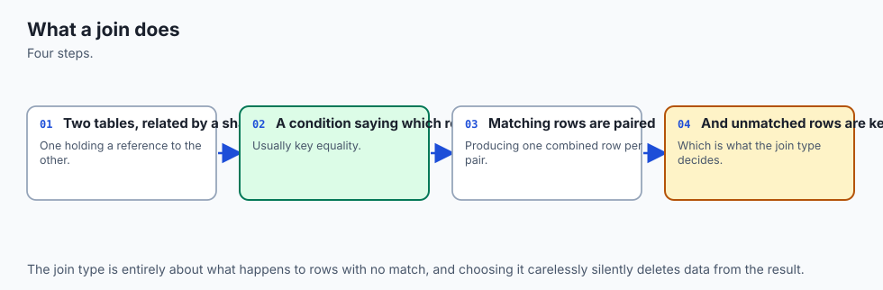
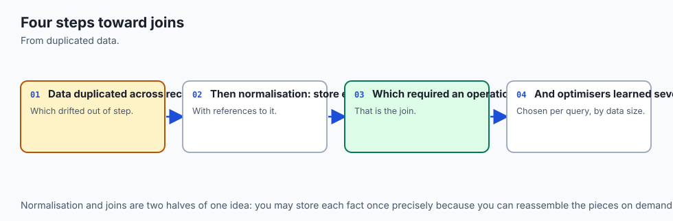
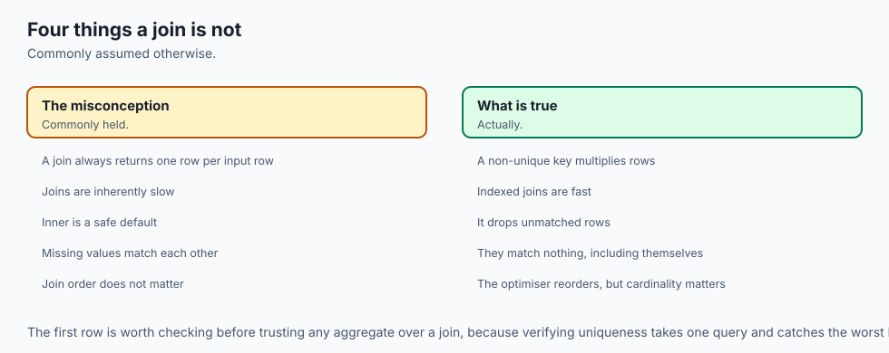
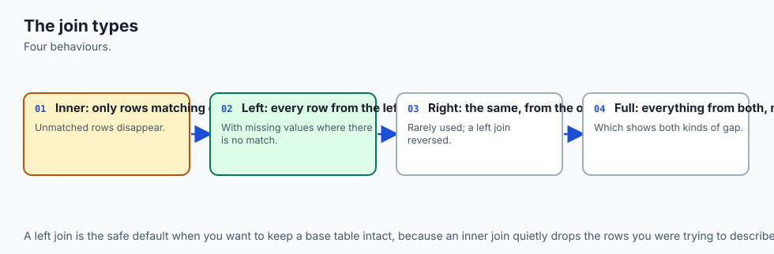
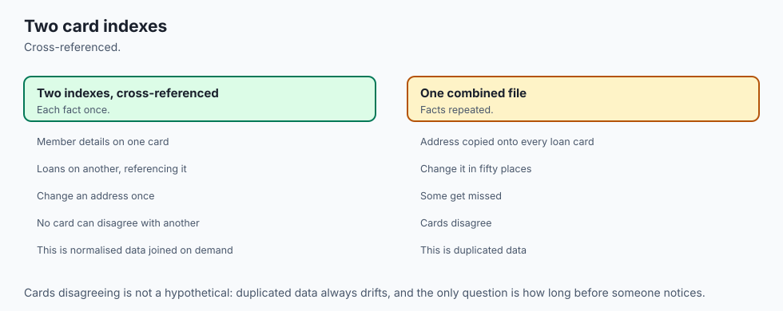
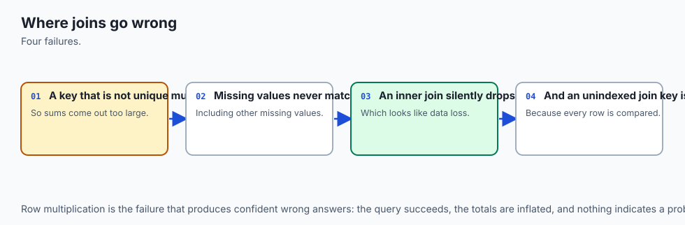
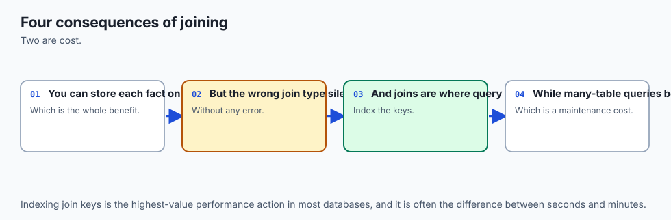
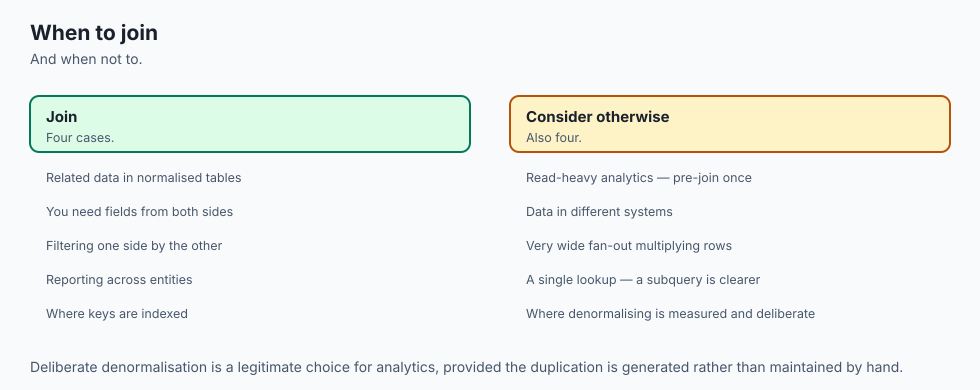

## Why this matters

Two days ago you learned that a database is made of tables. Yesterday you learned to ask one table a question. Today you find out why anybody split the data across several tables in the first place — because until you feel that, joins look like bureaucracy invented to make simple questions hard.

Here is the thing worth being blunt about, and it is not really about libraries or bookshops. Every retrieval system you will build in the second half of this course has the same shape. You embed a document, you chunk it, you store the chunks, and when a question arrives you find the nearest chunks and hand them to a model. That is the part everybody talks about.

The part nobody talks about is that **the chunk on its own is nearly useless.** A retrieved passage that says "the deductible was raised to £750 effective from the start of the quarter" is worth almost nothing until you can also say: which document it came from, which version of that document, who is allowed to see it, when it was last updated, and whether it has since been superseded. None of those facts live in the chunk. They live in the row the chunk came from, in the permissions table, in the documents table, in the ingestion log.

Tying them back together is a join. If your retrieval system cannot do it, you will ship a system that confidently quotes a policy that was withdrawn eight months ago, or — considerably worse — quotes one team's confidential document to somebody in another team, because the permission check lived in a table you never joined to.

The costs are specific, and they show up in four places.

**Wrong answers that look right.** A join with a missing condition returns *more* rows than it should, silently. A join that should have been an outer join returns *fewer*, silently. Neither raises an error. You get a number, it is plausible, and it is wrong. Today's lab has a query that reports every library member's borrowing count and quietly omits the member who has borrowed nothing — which is exactly the member a "who should we email?" report needed to find.

**Data that contradicts itself.** Store an author's name on every one of their book rows and you have promised to update all of them, forever, in lockstep. You will miss one. Then the database holds two different names for one person, no error was raised, and there is nothing in the file marking which one is right.

**Queries that fall off a cliff.** Forget one join condition between two tables of ten thousand rows and you have asked for a hundred million rows. The database will honestly try. At the scale of today's lab that is a wrong answer; on a shared server it is an outage.

**Silent corruption you inherit.** SQLite — which is what your first several data projects will use, and what is embedded in your phone, your browser and most of the software on your machine — does **not enforce foreign keys unless you ask it to, on every single connection**. A schema full of `REFERENCES` clauses that nobody switched on has been accumulating broken references for as long as it has existed. You will prove this yourself today, in the shell and in Python, by inserting a row that should be impossible and watching it succeed.

## The idea in plain language



Start with the mistake, because the mistake is the motivation.

You are cataloguing a library. The obvious thing is one table, one row per book, with everything you know about the book on that row — including who wrote it:

| title | published_year | author_name | author_birth_year |
| --- | --- | --- | --- |
| The C Programming Language | 1978 | Brian W. Kernighan | 1942 |
| The C Programming Language | 1978 | Dennis M. Ritchie | 1941 |
| The Practice of Programming | 1999 | Brian W. Kernighan | 1942 |
| The Practice of Programming | 1999 | Rob Pike | 1956 |
| The Mythical Man-Month | 1975 | Frederick P. Brooks Jr. | 1931 |

Three books, five rows, and Brian W. Kernighan's date of birth written down twice. That duplication is not merely untidy. It causes three specific failures, and they have had names since the early 1970s.

**The update anomaly.** The library learns that the author prefers the shorter form of his name. Somebody updates the row they were looking at — the C book — and stops, because as far as they can see the job is done. Run this and watch:

```sql
UPDATE catalog_wide
   SET author_name = 'Brian Kernighan'
 WHERE title = 'The C Programming Language'
   AND author_name = 'Brian W. Kernighan';
```

The database now holds two names for one human being. No error. No warning. Nothing marks which is right. From the lab's captured output:

```text
--- update anomaly: rename the author on one book only ---
author_name         author_birth_year
------------------  -----------------
Brian Kernighan     1942
Brian W. Kernighan  1942
```

**The insertion anomaly.** The library wants to record Donald E. Knuth as an author, having catalogued none of his books yet. There is nowhere to put him. Every column in this table is `NOT NULL`, because a row *is* a book. You cannot record the author without inventing a book for him to have written. A fact about the world has no home in your schema.

**The deletion anomaly.** The library withdraws its only copy of *The Mythical Man-Month*. Delete the row, and you have also deleted the only record that Frederick P. Brooks Jr. exists — his name, his year of birth, all of it. You meant to remove a book and you removed a person.

All three have one cause: **the table is about two different kinds of thing at once.** Fix it by splitting, so each table is about exactly one kind of thing and every fact is written down in exactly one place.

| Anomaly | In the wide table | After splitting |
| --- | --- | --- |
| Rename an author | Update N rows, miss one, and the database contradicts itself with no error | Update one row in `authors`. There is no second copy to miss |
| Record an author with no books | Impossible — every book column is `NOT NULL` | Insert into `authors`. Books are a separate question |
| Withdraw the last book by an author | The author's details are deleted along with it | Delete from `books`. The author row is untouched |
| Store a book's title | Once | Once |
| Ask "who wrote this?" | Read one row | **Join two or three tables** |

Look at the last row. Splitting fixed three problems and created one: the pieces now need putting back together on demand.

**That is a join.** A join takes rows from two tables and produces the pairs that belong together, according to a rule you supply. Nothing is stored joined. The result is assembled when you ask, and thrown away when you are done.

Everything else today is detail on two questions: *which rows come out*, and *what happens to the ones that match nothing*.

## Historical background



The relational model was published in **June 1970**, by **Edgar F. Codd**, a British computer scientist working at IBM's San Jose Research Laboratory, in a *Communications of the ACM* paper called *A Relational Model of Data for Large Shared Data Banks*. The systems of the day — IBM's IMS, the CODASYL network databases — required a program to *navigate* to data by following pre-built pointers, which meant a program was welded to the physical layout of the file. Codd's argument was that data should be described as relations, and retrieved by stating properties of the rows you want, leaving the system to work out how. The join is what makes that possible: with it, relationships can be values in the data rather than pointers in the storage.

Codd went on to develop **normalization** in a sequence of papers through **1971 and 1972**, giving the first, second and third normal forms — a staged procedure for removing exactly the anomalies in the section above. **Boyce–Codd normal form** followed in **1974**, from Codd and **Raymond F. Boyce**.

The query language arrived alongside. Boyce and **Donald D. Chamberlin** designed **SEQUEL** at IBM in **1974**, for the **System R** prototype. The name was later shortened to SQL after a trademark conflict, and it became an ANSI standard in **1986**.

The join syntax has a history worth knowing, because you will meet both forms in real code. Early SQL had no `JOIN` keyword at all. You listed tables separated by commas and put the matching rule in the `WHERE` clause:

```sql
SELECT b.title, a.name
  FROM books b, book_authors ba, authors a
 WHERE ba.book_id  = b.book_id
   AND a.author_id = ba.author_id;
```

The explicit `JOIN ... ON` form, and outer joins, were standardised in **SQL-92**. Both forms are still legal and, for an inner join, produce identical results — the lab's test suite asserts they are byte-for-byte the same. The explicit form is better anyway, for a reason that has nothing to do with fashion: it separates *how the tables connect* from *which rows you want*. With the comma form those two ideas are mixed together in one `WHERE` clause, so deleting a line while filtering can silently turn a careful three-table join into a cartesian product. There is also no comma-form spelling of an outer join that is portable, which is why the old `*=` and `(+)` operators different vendors invented were eventually deprecated.

**SQLite** was written by **D. Richard Hipp** and first released in **August 2000**. It is public domain — not merely open source but released without copyright — which is one reason it ended up embedded in essentially everything.

And one date matters more than the rest for today. SQLite gained foreign key constraint *enforcement* only in **version 3.6.19, released on 14 October 2009** — nine years after its first release. Because a decade of databases and applications already existed that would break under enforcement, it was added **disabled by default**, and it is still disabled by default now. The documentation is direct about it: "Foreign key constraints are disabled by default (for backwards compatibility), so must be enabled separately for each database connection." That sentence has cost a great many people a great deal of debugging.

## What it is — and what it is not



A **join** is an operation that combines rows from two tables into a single result, pairing each row on the left with the rows on the right that satisfy a condition — the **join predicate**. The tables are not modified. Nothing is stored. The result exists for the duration of the query.

A **primary key** is the column, or set of columns, that identifies a row uniquely within its table. A **foreign key** is a column whose values are required to appear as a primary key in another table.

That word "required" deserves precision, because a foreign key promises less than people assume. What it actually promises:

- Every non-NULL value in this column exists as a key in the parent table.
- You cannot insert a child row referencing a parent that is not there.
- You cannot delete a parent that still has children, unless the schema says what should happen instead — `ON DELETE CASCADE` to remove them, `ON DELETE SET NULL` to orphan them deliberately, `ON DELETE RESTRICT` to refuse.

What it does **not** promise, and each of these catches somebody out:

- **It does not create an index.** This surprises nearly everyone. Declaring `book_id INTEGER REFERENCES books(book_id)` builds no index on `book_id`, so every join across it, and every integrity check on the child side, scans the whole table. You must add the index yourself. The lab's schema does, explicitly, with a comment saying why.
- **It does not make the join happen.** A foreign key is a constraint, not a relationship the database traverses for you. You still write the `JOIN`. The key only guarantees the join will find something.
- **It does not require the value to be present at all.** A nullable foreign key can be NULL, which means "this row references nothing". The lab's `members.referred_by` is exactly that: the members who joined without a referral.
- **In SQLite, it does not promise anything until you enable it.** See below. This is the single most important practical fact in the lesson.

A join is also **not** a merge, a copy, or a permanent link. And a join is **not** free — the database is doing real work to match the rows, which is why the last third of this lesson is about which algorithm it picks.

| It is | It is not |
| --- | --- |
| An operation that assembles rows on demand | A stored connection between tables |
| Driven by a predicate you write in `ON` | Something the foreign key performs for you |
| Able to invent NULLs, in the outer forms | Limited to rows that exist in both tables |
| A choice between real algorithms with real costs | A free lookup |
| A foreign key: a promise about values | A foreign key: an index, or a guarantee SQLite keeps by default |
| Symmetric for `INNER`, asymmetric for `LEFT` | Order-independent in every form |

## Why it was created and what problems it solves

The join exists because normalization creates a need that has to be paid for somewhere, and paying for it at query time is better than paying for it at write time.

Consider the alternative that people reach for when they have not thought about it: store the data pre-joined, the way the wide table did. It is genuinely faster to read. One row, no matching, no algorithm. And the price is the three anomalies — plus a fourth that only shows up later, which is that you can no longer answer questions you did not anticipate when you designed the table. The wide table can tell you who wrote a book. It cannot tell you which authors have written nothing, because it has no way to represent one.

So the relational answer is: store each fact once, in the table it belongs to, and reassemble on demand. The reassembly is the join, and its design goal is to make the reassembly *general* — one mechanism that answers questions you had not thought of when you designed the schema.

The specific problems each join type solves:

**`INNER JOIN` solves "show me the pairs that go together."** It is the default meaning of "join". Rows that match come through; rows that match nothing are dropped from both sides.

**`LEFT OUTER JOIN` solves "show me everything on the left, whether or not it has a match."** This is the one that answers questions about *absence*, and absence is where the interesting business questions live. Which customers have never ordered? Which products were never reviewed? Which documents have no permissions row — and are therefore either visible to everybody or nobody, depending on a default nobody checked?

**The junction table solves "many things relate to many things."** A book has several authors and an author has several books. Neither table can hold the key, because a column holds one value. So the relationship gets a table of its own.

**`LEFT JOIN` plus `IS NULL` solves "find the rows with no match."** This deserves memorising as a unit, because it is not obvious the first several times. You keep every left row, then filter down to the ones where the right-hand columns came back NULL — which can only happen when there was nothing to match.

**The self-join solves "relate a table's rows to other rows in the same table."** Employees to managers, members to whoever referred them, replies to the comment they answer.

And one problem the join **created**, which is fair to state alongside: it made it easy to write a query whose cost is the product of two table sizes rather than their sum. That is the accidental cartesian product, and it has taken down more production systems than almost any other single SQL mistake.

## How it works



Here is the schema the rest of this lesson uses: five tables, their keys, and the cardinality of every relationship.


Read it as three separate patterns, because that is all there ever is.

### One-to-many: the key goes on the many side

One book has many loans. One member has many loans. The rule is unvarying and it is worth saying out loud because people get it backwards: **the foreign key lives on the "many" side.**

```sql
CREATE TABLE loans (
  loan_id     INTEGER PRIMARY KEY,
  book_id     INTEGER NOT NULL REFERENCES books(book_id),
  member_id   INTEGER NOT NULL REFERENCES members(member_id),
  borrowed_on TEXT    NOT NULL,
  returned_on TEXT
);
```

`book_id` sits in `loans`, not a list of loans inside `books`. The reason is that a column holds one value. If you tried to put the relationship on the "one" side you would need a list in a cell, and the moment you have a list in a cell you have lost the ability to index it, join on it, or constrain it — you have a text field that happens to contain commas.

### Many-to-many: it needs a table of its own

A book has several authors; an author has several books. Neither side can hold the key. So the relationship becomes a table:

```sql
CREATE TABLE book_authors (
  book_id   INTEGER NOT NULL REFERENCES books(book_id)     ON DELETE CASCADE,
  author_id INTEGER NOT NULL REFERENCES authors(author_id) ON DELETE RESTRICT,
  PRIMARY KEY (book_id, author_id)
);
```

Two details earn their place. The primary key is **the pair**, which is what makes it impossible to attach the same author to the same book twice — a constraint you would otherwise have to enforce in application code and would eventually get wrong. And the two `ON DELETE` clauses differ on purpose: deleting a book should remove its authorship rows (`CASCADE`), but deleting an author who still has books should be refused (`RESTRICT`), because it is almost certainly a mistake.

A junction table is not a special kind of object. It is **two one-to-many relationships back to back**, which is why joining across it always takes two `JOIN` clauses.

### The join itself, row by row


The mechanics, stated once and precisely. For each row on the left, the database finds every row on the right where the predicate is true, and emits one output row per matching pair. Three consequences follow, and all three surprise people:

- A left row matching **three** right rows produces **three** output rows. Joining does not preserve your row count.
- A left row matching **nothing** produces **no** output row under `INNER JOIN`.
- Under `LEFT OUTER JOIN`, that unmatched left row produces **one** output row, with every right-hand column set to NULL.

That NULL is worth pausing on. **It is not stored anywhere.** No table contains it. The join invents it, on the spot, to fill the columns that had no matching row. This is why yesterday's three-valued logic matters so much today: those manufactured NULLs then flow into every `WHERE` clause and every aggregate downstream, and they behave exactly as Day 86 said they would.

### The join types, and exactly which rows survive

| Join type | Left rows with a match | Left rows with no match | Right rows with no match | Row count on the lab's data |
| --- | --- | --- | --- | --- |
| `INNER JOIN` | kept, one row per pair | **dropped** | **dropped** | 7 book-author pairs |
| `LEFT OUTER JOIN` | kept, one row per pair | **kept**, right columns NULL | dropped | 8 (adds Knuth) |
| `RIGHT OUTER JOIN` | dropped if unmatched | dropped | **kept**, left columns NULL | mirror of the above |
| `FULL OUTER JOIN` | kept | **kept**, right NULL | **kept**, left NULL | union of both |
| `CROSS JOIN` | every left row paired with every right row | n/a — no predicate | n/a | 4 × 7 = **28** |

Two practical notes. `LEFT` and `RIGHT` are mirror images, so `RIGHT JOIN` is never necessary — swap the table order and use `LEFT`. Most working SQL contains almost no `RIGHT JOIN`, and that is a readability decision rather than a technical one: it is easier to reason about a query where the table you care about is always named first. And SQLite gained `RIGHT` and `FULL OUTER JOIN` only in version 3.39.0 (2022); it had `LEFT` from the beginning, which tells you which one people actually needed.

### The anti-join: `LEFT JOIN` plus `IS NULL`

Memorise this shape. It answers every "which ones have none?" question you will ever be asked.

```sql
SELECT a.author_id, a.name
  FROM authors AS a
  LEFT JOIN book_authors AS ba ON ba.author_id = a.author_id
 WHERE ba.author_id IS NULL;
```

Real output from the lab:

```text
author_id  name
---------  ---------------
7          Donald E. Knuth
```

The logic in one sentence: keep every author, then keep only the ones where the right-hand side came back NULL — which can happen for exactly one reason, that there was nothing to match. The same shape finds the books never borrowed (`104 · The Practice of Programming`) and the members who have never borrowed (`Eli Nakamura`).

### Joins with `GROUP BY`, and the zero-count trap

Now the mistake almost everybody makes at least once. Count each member's loans:

```sql
SELECT m.name, count(l.loan_id) AS loans
  FROM members AS m
  LEFT JOIN loans AS l ON l.member_id = m.member_id
 GROUP BY m.member_id, m.name;
```

```text
member          loans
--------------  -----
Ada Okafor      2
Bruno Salgado   2
Chandra Iyer    1
Dana Whitfield  1
Eli Nakamura    0
```

Two separate decisions had to be right to get that zero, and getting either wrong produces a plausible, wrong report.

**The join must be `LEFT`.** With `INNER JOIN`, Eli Nakamura is not in the output at all — she has no loans, so she has no rows to be grouped. A report of "loans per member" that silently omits the members with no loans is precisely backwards, because those are the members the report was probably commissioned to find.

**The count must be of a right-hand column.** Switch `count(l.loan_id)` to `count(*)` and Eli's row reads **1**:

```text
=== 7b. count(*) instead of count(l.loan_id) — the wrong answer ===
member          loans_wrong
--------------  -----------
Eli Nakamura    1
```

`count(*)` counts rows, and the NULL-extended row the outer join manufactured for her is still a row. `count(l.loan_id)` counts non-NULL values of that column, and aggregate functions skip NULLs — so it correctly reports zero. Yesterday's lesson on NULL semantics, arriving with a bill.

### `ON` versus `WHERE`, which is genuinely subtle

This is the one to slow down for. On an *inner* join, a predicate in `ON` and the same predicate in `WHERE` give identical results, and you can move it around freely. On an *outer* join they are completely different, because the outer join's NULL-filling happens **after** `ON` and **before** `WHERE`.

Same question — "for each member, which books do they currently have out?" — written both ways.

Predicate in `ON`:

```sql
SELECT m.name, l.loan_id
  FROM members AS m
  LEFT JOIN loans AS l
         ON l.member_id = m.member_id
        AND l.returned_on IS NULL;
```

```text
member          loan_id
--------------  -------
Ada Okafor      2
Bruno Salgado   6
Chandra Iyer    4
Dana Whitfield
Eli Nakamura
```

Five members, five rows. Correct.

The same predicate moved to `WHERE`:

```text
member         loan_id
-------------  -------
Ada Okafor     2
Bruno Salgado  6
Chandra Iyer   4
Eli Nakamura
```

Four rows — and it is wrong in **both directions at once**, which is what makes it such a good example.

**Dana Whitfield has vanished.** She is a member in good standing who has returned everything she borrowed. Her rows were never NULL-extended, because she does have loans — they simply all carry a `returned_on` date. So every one of her rows failed the `WHERE` test, and with no surviving row she disappeared from the result entirely. The outer join did its job; the filter then undid it.

**Eli Nakamura is still there** — showing an empty `loan_id`, as though she had a book out. She has never borrowed anything in her life. Her row *was* NULL-extended by the outer join, and `returned_on IS NULL` is perfectly true of a manufactured NULL, so the filter kept her. A false positive dressed as a result.

One misplaced predicate; a member wrongly dropped and a member wrongly kept. The rule to carry away:

- **`ON` decides what counts as a match.** Filters on the right-hand table belong here.
- **`WHERE` filters the finished result.** Filters on the left-hand table belong here.
- The exception that proves it: `WHERE right.key IS NULL` is deliberate, and is the anti-join above. It works *because* it collapses the outer join down to the unmatched rows.

### Self-joins

A table joined to itself, with two aliases so the query can tell the copies apart:

```sql
SELECT m.name AS member, r.name AS referred_by
  FROM members AS m
  LEFT JOIN members AS r ON r.member_id = m.referred_by;
```

```text
member          referred_by
--------------  -------------
Ada Okafor
Bruno Salgado   Ada Okafor
Chandra Iyer    Ada Okafor
Dana Whitfield  Bruno Salgado
Eli Nakamura
```

`LEFT` matters here for the same reason as always: with `INNER JOIN`, the two members nobody referred disappear and five rows become three.

### Three or more tables

Joins chain. Each `JOIN` adds one table and one predicate, and the rule of thumb is that **N tables need at least N−1 join conditions.** Drop one and the result multiplies: the lab's test suite asserts that removing a single condition from the three-table books-authors join turns 7 correct rows into **49**.

```sql
SELECT m.name, b.title, a.name
  FROM loans        AS l
  JOIN members      AS m  ON m.member_id  = l.member_id
  JOIN books        AS b  ON b.book_id    = l.book_id
  JOIN book_authors AS ba ON ba.book_id   = b.book_id
  JOIN authors      AS a  ON a.author_id  = ba.author_id
 WHERE l.returned_on IS NULL;
```

Three loans are outstanding. This returns **four rows**, because one of the books has two authors and each gets a row. That is not a bug and `SELECT DISTINCT` is usually the wrong fix, because it hides the question instead of answering it. Decide what one output row is supposed to *mean*. If it means "one loan", do not join to authors; aggregate them with `group_concat` instead.

### The SQLite fact that will bite you

Everything above assumed foreign keys mean something. In SQLite, by default, **they do not.**

Here is the proof, run in one `sqlite3` session against the lab's database — and it must be one session, because the setting is per connection:

```text
--- 1. what the pragma says on a brand-new connection ---
setting              value
-------------------  -----
PRAGMA foreign_keys  0

--- 2. insert a loan for member 999, who does not exist ---
rows_inserted
-------------
1

--- 3. the orphan row is really there ---
loan_id  book_id  member_id
-------  -------  ---------
900      101      999
```

A loan belonging to a member who does not exist, inserted without complaint, into a schema that explicitly declares `member_id INTEGER NOT NULL REFERENCES members(member_id)`.

The database will tell you, if you ask:

```text
--- 4. and the database will tell you, if you ask it to check ---
table  rowid  parent   fkid
-----  -----  -------  ----
loans  900    members  0
```

Now enable enforcement and run the identical statement:

```text
--- 5. clean up, enable enforcement, and try the identical insert ---
setting              value
-------------------  -----
PRAGMA foreign_keys  1

--- 6. the same statement, now rejected ---
Runtime error near line 43: FOREIGN KEY constraint failed (19)
```

Three properties of that pragma matter, and the SQLite documentation is explicit about all three:

1. **It is per connection.** Every new connection starts with it off. Setting it in one shell session does nothing for the next.
2. **It is not stored in the database file.** There is no way to mark a database as "always enforce". The application must say so, every time it connects.
3. **It is a no-op inside a transaction**, and — this is the part that wastes afternoons — *attempting it does not return an error; it simply has no effect.*

That third property has a nasty interaction with Python. The `sqlite3` module opens transactions for you around writes, so a pragma issued after your first `INSERT` is silently ignored:

```text
--- 2. the trap: the pragma is a no-op inside an open transaction ---
connection.in_transaction: True
pragma set, but it reads back as: 0
after commit(), setting it again reads back as: 1
the same insert now raises IntegrityError: FOREIGN KEY constraint failed
```

The habit that avoids it entirely is one line, issued first:

```python
connection = sqlite3.connect("library.db")
connection.execute("PRAGMA foreign_keys = ON")   # first, before anything else
```

### Building the join yourself

The join is not magic. It is one of a small number of algorithms, and the planner picks between them. Here are the two that matter, in plain Python over lists of dictionaries.

**The nested-loop join.** The obvious one: for every left row, scan every right row.

```python
def nested_loop_join(left, right, left_key, right_key):
    pairs, comparisons = [], 0
    for left_row in left:
        for right_row in right:
            comparisons += 1
            if left_row[left_key] == right_row[right_key]:
                pairs.append((left_row, right_row))
    return pairs, comparisons
```

Cost: n × m. Six loans against five members is 30 comparisons.

**The hash join.** Index one side once, then look each row of the other side up.

```python
def hash_join(left, right, left_key, right_key):
    index, operations = defaultdict(list), 0
    for right_row in right:              # build phase
        operations += 1
        index[right_row[right_key]].append(right_row)
    pairs = []
    for left_row in left:                # probe phase
        operations += 1
        for right_row in index.get(left_row[left_key], ()):
            pairs.append((left_row, right_row))
    return pairs, operations
```

Cost: n + m. Six loans and five members is 11 operations. Real captured output:

```text
nested-loop join: 6 rows, 30 key comparisons
hash join:        6 rows, 11 operations
  (6 x 5 = 30 against 6 + 5 = 11; the gap widens as the square)

nested-loop == SQL: True
hash        == SQL: True
nested-loop == hash: True
```

Both produce the same six rows, and both match what SQLite produces, exactly. The difference is entirely in the cost, and the shape of that difference is the whole point: at 6 × 5 it is 30 against 11, which is nothing. At 10,000 × 10,000 it is a hundred million against twenty thousand. **One grows as the product; the other as the sum.**

The outer join, in this vocabulary, is a two-line change — when a left row finds no matches, emit it anyway, paired with `None`:

```python
matches = index.get(left_row[left_key], [])
if matches:
    pairs.extend((left_row, match) for match in matches)
else:
    pairs.append((left_row, None))
```

`None` is precisely what SQL calls NULL. That is the entire mechanism.

You can watch the real planner choose. `EXPLAIN QUERY PLAN` says `SCAN` when it will read every row and `SEARCH` when it will jump straight to the matching ones through an index:

```text
--- inner join on an indexed foreign key ---
QUERY PLAN
|--SCAN l USING COVERING INDEX idx_loans_member
`--SEARCH m USING INTEGER PRIMARY KEY (rowid=?)

--- a cartesian product: two SCANs and nothing tying them together ---
QUERY PLAN
|--SCAN books
`--SCAN authors
```

The first is a nested-loop join where the inner scan has been replaced by an index lookup — which is why the index on every foreign key column matters so much, and why it is a genuine problem that declaring the foreign key does not create one. The second is your missing join condition, visible before you run the query.

## An everyday analogy



Think of a hotel's front desk on a busy evening.

The hotel keeps two ledgers. One lists **guests**: name, home address, loyalty number. The other lists **stays**: which room, which nights, what rate. The reason they are separate ledgers is the reason your data is in separate tables — a guest who comes four times a year should have their address written down once, not four times, because otherwise the evening they move house you have to find and correct four entries and you will miss one.

Each stay entry carries a guest number. That number is the foreign key, and it lives in the stays ledger — on the "many" side — because one guest has many stays.

**A join is the receptionist working with both ledgers open.** Someone asks "who is in room 402 tonight?" She finds the stay, reads the guest number, and looks that number up in the guest ledger. Two ledgers, one answer, assembled on the spot and not written down anywhere.

The join types are what she does when a lookup fails.

**Inner join:** she is asked to list every occupied room with the guest's name, and only reports rows where both halves were found.

**Left outer join:** she is asked to list **every guest on the loyalty programme** with tonight's room, if any. Guests not staying tonight still appear — with the room column blank. That blank is the NULL, and notice it is not written in either ledger. It is a gap she creates in the act of putting them side by side.

**The anti-join:** "which loyalty members are *not* staying tonight?" She goes down the full guest list and reports only the ones whose room came back blank. Every "who has none of these?" question is that shape.

**The cartesian product:** a new hire is told to "match the guests with the stays", forgets to match on the guest number, and produces every guest paired with every stay. Two hundred guests and three hundred stays gives sixty thousand slips of paper, each individually plausible. The database does exactly this, just as fast and just as uncomplainingly.

**`ON` against `WHERE`:** the instruction "list every loyalty member, and their room if they are staying tonight" is `ON` — the tonight condition is part of *what counts as a match*. The instruction "list every loyalty member, then cross off the ones not staying tonight" is `WHERE` — and it is a different instruction, which produces a different list.

**The foreign key** is the desk's standing rule that no stay may be recorded against a guest number not in the guest ledger. And now the analogy earns its keep for SQLite: the rule is printed in the staff handbook, but **it is only actually applied if the receptionist on duty decides to check**. Each new receptionist starts their shift not checking, and there is no way to write "always check" into the ledger itself — you have to tell each one, at the start of every shift. That is `PRAGMA foreign_keys = ON`, per connection, every time. Any stay slips recorded during a shift when nobody was checking are still sitting in the ledger, pointing at guests who never existed.

Where the analogy stops: a receptionist gets slower in a straight line as the ledgers grow, while a database can pick a smarter method — the hash join is the receptionist first sorting tonight's stays into pigeonholes by guest number, so that each lookup is one glance rather than a scan of the whole ledger.

## Examples in practice



Three shapes you will actually write, using the tools as they are used.

**Reporting on absence, in SQLite.** The most valuable query shape in this lesson, because the answer is not visible in any single table:

```sql
SELECT b.book_id, b.title
  FROM books AS b
  LEFT JOIN loans AS l ON l.book_id = b.book_id
 WHERE l.loan_id IS NULL;
```

```text
book_id  title
-------  ---------------------------
104      The Practice of Programming
```

The acquisitions budget question — "what did we buy that nobody wants?" — is this query, and no amount of querying `books` alone will answer it.

**A retrieval system tying a chunk back to its source, in PostgreSQL.** This is the shape from the opening, written out. The vector search finds candidate chunks; the join supplies everything that makes them usable:

```sql
SELECT c.chunk_text,
       d.title,
       d.updated_at,
       d.version
  FROM chunks AS c
  JOIN documents AS d ON d.doc_id = c.doc_id
  JOIN acl       AS p ON p.doc_id = d.doc_id
 WHERE p.group_id = $1
   AND d.superseded_by IS NULL
 ORDER BY c.embedding <=> $2
 LIMIT 10;
```

Two of those joins are the security boundary. Remove the `acl` join and the query still runs, still returns ten plausible chunks, and now returns them to anybody. That is the concrete form of "a join can create — or fail to enforce — a disclosure that none of its inputs describes".

**Measuring N+1 rather than repeating the slogan.** The lab answers one question two ways over 500 members and 2,000 loans, and reports real numbers:

```text
N+1 loop:  501 queries      0.79 ms
one join:    1 queries      0.44 ms

same answer: True
```

Look honestly at that. 501 queries against 1 — a 500-fold difference in query count — produced a difference of about 0.35 milliseconds. Not 500-fold. Under 2×.

That is not an argument for writing N+1 loops, but it is an argument against reciting the rule without understanding it. The cost of a query is dominated by what surrounds it, and in an *embedded* database a query is a function call inside your own process. SQLite's own documentation makes this argument at length on its page *The N+1 Query Problem*, and it is worth reading precisely because it contradicts advice you will hear repeated with great confidence. Across a network, each of those 501 queries is a round trip — at a very ordinary 1 ms, that is half a second against essentially nothing, and the rule is entirely right. **The correct answer depends on a fact about your deployment, not on a rule about joins.** Timings vary by machine and by run; the query counts do not, which is why the lab asserts the counts.

## Implications: security, privacy, performance, scalability, and cost



**Privacy: the join is the disclosure.** Each table in the lab is fairly harmless alone. `books` is a catalogue. `members` is a mailing list. `loans` is integers and dates. The join produces "this named person read this named book on this date" — which is exactly the record that reading-privacy protections exist for. A join can create a disclosure that none of its inputs contains, so **the unit to reason about when deciding who may see what is the query, not the table.** This generalises well beyond libraries: it is the whole of the re-identification problem.

**Security: foreign keys are integrity, not access control.** They stop a loan pointing at a nobody. They do not authenticate, authorise, or protect the file — anyone who can read the database file can read every row, because it is an ordinary file with ordinary permissions and no encryption. Protection is filesystem permissions, disk encryption, or not storing it.

**Security: parameterise, and know the one thing you cannot.** Every query today is a literal you wrote, so there is nothing to inject. The moment a value comes from outside, use a placeholder — `WHERE name = ?` with the value passed separately — because that value never reaches the parser at all. The exception worth knowing: **table and column names cannot be parameterised.** If one ever comes from outside your program, check it against a hard-coded allow-list.

**Performance: index every foreign key.** Declaring the key creates no index. Without one, each join across it is a full scan, and the difference is exactly the nested-loop-versus-hash gap from earlier — cost growing as the product rather than the sum.

**Performance: the cartesian product is a denial of service.** Two 10,000-row tables joined without a condition is 100 million rows, and the database will honestly try. `EXPLAIN QUERY PLAN` shows it as two bare `SCAN`s before you run anything, and a `LIMIT` on exploratory queries costs nothing.

**Scalability: joins are the thing that gets hard first.** A join needs both sides reachable, which is why they are cheap on one machine and expensive across a network, and why distributed databases put so much effort into avoiding them. It is also the honest reason document databases became popular: they trade the anomalies back for not having to join. That is a real trade, in both directions.

**Cost: normalization moves cost from writes to reads, and it is usually right.** Normalized means write once, read with a join. Denormalized means write many times, read directly. The second is faster to read and pays with the three anomalies plus the questions you can no longer ask. Denormalize deliberately, when you have measured, and write down what will keep the copies in step.

## Alternatives: free, open source, and commercial

The relational model is close to universal, so most of this is portability rather than genuine alternatives — with one real exception at the end.

**SQLite** — *free, public domain.* Today's tool, and the right default for anything embedded, single-machine, or under a few hundred gigabytes. Choose it when you want zero administration and a database that is one file you can copy. Full inner, left, cross and self joins; `RIGHT` and `FULL OUTER JOIN` since 3.39.0 (2022). The catch is today's headline: **foreign keys are off by default and must be enabled per connection.** No server to install, no cost, no paid tier.

**PostgreSQL** — *free, open source (PostgreSQL licence); paid only as hosting.* Choose it when more than one process writes concurrently, when you want strict types, or when you need `FULL OUTER JOIN`, window functions and CTEs used heavily. **Foreign keys are enforced by default** — there is no pragma and no opt-in; a violating insert is rejected from the first day. The join syntax is identical to what you have written today. Two differences worth knowing: `FULL OUTER JOIN` has been supported for far longer, and Postgres will genuinely choose between nested-loop, hash and merge joins based on statistics, which you can inspect with `EXPLAIN ANALYZE`. Worked example — the same anti-join, unchanged:

```sql
SELECT a.author_id, a.name
  FROM authors a
  LEFT JOIN book_authors ba ON ba.author_id = a.author_id
 WHERE ba.author_id IS NULL;
```

Free to run yourself forever; managed hosting is where money appears, and prices change often enough that you should read the provider's current page rather than trust a figure written here.

**MySQL / MariaDB** — *free, open source (GPL-2.0; MySQL also sold commercially by Oracle); MariaDB is the community fork.* Choose it for the enormous ecosystem, or because your host offers it and nothing else. **Foreign keys are enforced by default** — but with a real caveat that has bitten a generation: only on the InnoDB storage engine. The older MyISAM engine parses `FOREIGN KEY` clauses and *silently ignores them*, which is the same trap as SQLite's pragma wearing different clothes. InnoDB has been the default since MySQL 5.5, so this mainly matters for inherited schemas. Joins are standard; MySQL lacked `FULL OUTER JOIN` for a long time and the usual workaround is a `UNION` of a left and a right join.

**DuckDB** — *free, open source (MIT).* An embedded database like SQLite, but column-oriented and built for analytics. Choose it when your joins are large aggregations over files rather than small lookups — it will join Parquet or CSV files directly, without loading them first:

```sql
SELECT a.name, count(*)
  FROM 'books.parquet' b
  JOIN 'book_authors.parquet' ba ON ba.book_id = b.book_id
  JOIN 'authors.parquet' a ON a.author_id = ba.author_id
 GROUP BY a.name;
```

Same join syntax, and it is genuinely much faster on large analytical joins because it processes columns in batches rather than rows one at a time. It is not a replacement for SQLite in a transactional application. No paid tier for the database itself.

**No database at all: dictionaries in Python.** Entirely legitimate for small, in-memory, one-off work — and it is exactly what you implement in the lab. Choose it when the data fits comfortably in memory, the task runs once, and adding a database would be more machinery than the problem deserves.

```python
by_member = {m["member_id"]: m for m in members}
for loan in loans:
    member = by_member.get(loan["member_id"])       # your hash join
    name = member["name"] if member else None       # your LEFT JOIN
```

What you give up, and it is worth being honest: no constraints, no durability, no concurrent access, no query planner, and every one of the three anomalies is now your problem to avoid by hand. Free, in that there is nothing to install; expensive in maintenance the moment the data outgrows the assumption.

**And the trap that lives in that alternative: N+1 queries.** The moment your "no database" instinct meets a real database, it turns into a loop that queries per row:

```python
for member in connection.execute("SELECT * FROM members"):
    loans = connection.execute(
        "SELECT count(*) FROM loans WHERE member_id = ?", (member[0],)
    ).fetchone()
```

That is 1 + N queries where a single `LEFT JOIN ... GROUP BY` would do. As the lab measures, the penalty on an embedded database is real but small — 501 queries against 1 cost about 0.79 ms against 0.44 ms — and across a network it is one round trip per row, which is the difference between imperceptible and unusable. Read SQLite's own page on this; it argues the case for the embedded side honestly, and a nuance you understand is worth more than a rule you repeat.

## Comparison with related concepts

| Concept | What it does | How it differs from a join |
| --- | --- | --- |
| `UNION` | Stacks two result sets **vertically** | A join adds *columns* to rows; `UNION` adds *rows*. Requires the same column count and compatible types |
| Subquery in `WHERE` | Filters using another query's results | Returns nothing from the inner table. `WHERE id IN (SELECT ...)` filters; a join *brings the columns along* |
| `EXISTS` | Tests whether a matching row exists | Semi-join: filters without multiplying rows. Often the better choice when you only want "is there one?" and a join would duplicate |
| `NOT EXISTS` | Tests that no matching row exists | The other spelling of the anti-join. Safer than `NOT IN`, which returns nothing at all if the subquery yields a single NULL |
| CTE (`WITH`) | Names an intermediate result | Structuring, not matching. Frequently wraps joins to make them readable |
| Window function | Computes across related rows without collapsing them | Neither combines tables nor removes rows; adds a column computed over a partition |
| Foreign key | Constrains values to exist in a parent | A promise about data; the join is the operation. Neither implies the other |
| Index | Speeds up finding rows by a column | Changes the *algorithm* a join can use; does not change its result |
| `VIEW` | A stored query, often a join | Saves the query text, not the result. Runs afresh each time |
| Denormalization | Deliberately storing data pre-joined | The trade you make to *avoid* joining, paid for with the three anomalies |

The one worth dwelling on is `NOT IN` against `NOT EXISTS`, because it is where today's material collides hardest with yesterday's. `WHERE member_id NOT IN (SELECT member_id FROM loans)` gives the right answer on the lab's data — the test asserts it — but only because no `loans.member_id` is NULL. Let a single NULL into that subquery and `NOT IN` returns **no rows at all**, because `x NOT IN (1, 2, NULL)` evaluates to unknown rather than true. `NOT EXISTS` and the `LEFT JOIN ... IS NULL` idiom are both immune. This is the most common way Day 86's three-valued logic ruins somebody's afternoon.

## When to use it — and when not to



**Use a join when** the fact you need lives in another table — which, in a properly normalized schema, is most of the time. Use `LEFT JOIN` specifically whenever the answer needs to include things that have none of something: the customers who never ordered, the members who never borrowed, the documents with no permissions row.

**Use `EXISTS` instead** when you only want to know whether a match exists and do not need columns from the other table. It expresses the intent better and cannot accidentally multiply your rows.

**Do not join when you only need a key you already have.** If `loans.member_id` is what you want, take it from `loans`. Joining to `members` to read a column you were already holding is a common reflex and pure cost.

**Do not use a join to enforce access control on its own.** A missing `acl` join is a query that runs perfectly and returns data to the wrong person. Filter at a level where forgetting it fails closed rather than open.

**Do not normalize to the last drop for its own sake.** Normalization is a tool for eliminating anomalies, not a score. If a lookup table of three values that never change is making every query longer, inline it and write down why.

**Denormalize deliberately, and only with a plan for keeping the copies in step.** A cached `loan_count` on `members` is a perfectly reasonable engineering decision — provided you can name every path that changes a loan and say how each one updates the count. If you cannot, you have chosen the update anomaly on purpose.

**And when the data does not fit the relational model at all**, notice that rather than fighting it. Deep hierarchies, wildly variable documents and pure key-value workloads are all things other stores do better. That is a real trade with a real cost — you give up the constraints and the ad-hoc queries — but it is a choice, not a failure.

### Where this goes next in AI work

Come back to the opening, now that the mechanism is in place.

A retrieval-augmented system stores chunks and their embeddings. The chunk is the *least* important row in the design. Around it sit the document it came from, the version of that document, the access-control entry deciding who may see it, the ingestion record saying when it was last refreshed, and the evaluation results saying whether it has ever produced a good answer. Every one of those is a join away.

That is not incidental plumbing; the joins are where the correctness lives.

Miss the `superseded_by IS NULL` condition and your assistant confidently quotes a policy that was withdrawn eight months ago — with a citation, which makes it worse, because a citation is what people use to decide whether to check. Miss the permissions join and it quotes one team's confidential document to another team. Get the freshness join wrong and it cannot tell you *how* stale its answer is, which means it cannot tell you when not to trust it.

And the anti-join is the shape of every quality question worth asking about a pipeline. Which documents were ingested but never embedded — `LEFT JOIN embeddings ... WHERE embedding_id IS NULL`? Which embeddings point at a document that has since been deleted? Which of your evaluation questions has no retrieved chunk at all, meaning the retriever failed silently rather than badly? Every one of those is `LEFT JOIN` plus `IS NULL`, and every one of them is invisible if you only ever query one table.

One more, because it connects directly to today's headline. If you build that pipeline on SQLite — and for a first RAG prototype you very likely will — and you never issue `PRAGMA foreign_keys = ON`, then chunks pointing at deleted documents will accumulate silently, for months. Your retriever will return them. They will have no title, no date, and no permissions, and your code will fill those gaps with defaults. Nothing will error. This is not hypothetical: it is the default behaviour of the most widely deployed database in the world, and today you proved it in six lines.

## The AI connection

- **Joins are how normalised data is reassembled**, and they are where row counts silently
  explode.
- **Join type determines what is kept**, which is a correctness decision rather than a
  preference.
- **A join on a non-unique key multiplies rows**, which corrupts any downstream aggregate.
- **Assembling a training set is a sequence of joins**, each one an opportunity to duplicate
  or to lose rows.
- **Checking row counts either side of a join** is the cheapest defence against a whole class
  of error.

## Knowledge check

Try these from memory before looking back.

1. Name the three anomalies a single wide table causes, and for each one give a concrete example of the damage. Which of the three is most dangerous, and why is "it raises no error" the answer?
2. Where does the foreign key go in a one-to-many relationship, and why can it not go on the other side? Answer in terms of what a column can hold.
3. Why does a many-to-many relationship need a third table? What is its primary key, and what does that key prevent?
4. State exactly which rows an `INNER JOIN` keeps and which a `LEFT OUTER JOIN` keeps. Where does the NULL in an outer join's right-hand columns come from — which table is it stored in?
5. Write the `LEFT JOIN` plus `IS NULL` idiom from memory and say what it finds. Why does it work — what is the only circumstance that can make the right-hand column NULL?
6. A per-member loan count returns 1 for a member who has borrowed nothing. Name the two separate mistakes that could cause it, and give the fix for each.
7. Explain the difference between putting `l.returned_on IS NULL` in `ON` and in `WHERE` on a `LEFT JOIN`. Using the lesson's data, name the member wrongly dropped and the member wrongly kept, and say why each happens.
8. What is `PRAGMA foreign_keys` set to on a brand-new SQLite connection? Give the three properties of that setting, and describe the trap that makes it silently fail in Python.
9. Compare a nested-loop join and a hash join: how does each work, what does each cost, and what does the planner print in `EXPLAIN QUERY PLAN` when it has chosen an indexed nested loop?
10. Why does declaring a foreign key not make your joins fast? What must you do as well, and what happens if you do not?

## Hands-on exercise

The Day 87 lab, *Connecting the Tables*, runs today's argument as a sequence you execute. Work in the lab directory; every command below is run from there. Nothing needs installing and nothing touches the network.

Start with the whole harness:

```bash
bash tests/run_tests.sh
echo "exit code: $?"
```

Then walk the argument in order. First the mistake:

```bash
sqlite3 anomalies.db < examples/01_wide_table.sql
rm -f anomalies.db
```

Then the split, and the fact worth remembering from today. The foreign-key proof must be **one** `sqlite3` session, because the pragma is per connection — two invocations would prove nothing:

```bash
rm -f library.db
sqlite3 library.db < examples/02_schema.sql
sqlite3 library.db < examples/03_seed.sql
sqlite3 library.db < examples/04_foreign_keys.sql; echo "exit: $?"
```

Then every join type, the two hand-written join algorithms, the Python pragma trap, the measured N+1 comparison, and the planner:

```bash
sqlite3 library.db < examples/05_joins.sql
python3 examples/06_join_from_scratch.py library.db
python3 examples/07_foreign_keys_python.py
python3 examples/08_n_plus_one.py
sqlite3 library.db < examples/09_query_plans.sql
```

Then do it yourself. `starter/` holds nine numbered exercises. Six are SQL queries that **run as they stand and are each wrong in one specific, named way** — the comment above each says what is wrong, what to change, and which check verifies it. Three are the join algorithms in Python, and that file reports its own pass and fail lines.

```bash
bash starter/01_build.sh
sqlite3 starter/library.db < starter/02_exercises.sql
python3 starter/03_join_from_scratch.py
```

### Expected output

The harness ends with a real captured line:

```text
75 checks, 0 failure(s).
```

The foreign-key proof prints `PRAGMA foreign_keys  0` on a fresh connection, then inserts a loan for member 999 **successfully** (`rows_inserted 1`), then shows the orphan row, then finds it with `PRAGMA foreign_key_check`, then prints `PRAGMA foreign_keys  1`, then fails the identical insert with `Runtime error near line 43: FOREIGN KEY constraint failed (19)` — and **exits non-zero, on purpose.**

The Python version adds the trap:

```text
connection.in_transaction: True
pragma set, but it reads back as: 0
after commit(), setting it again reads back as: 1
the same insert now raises IntegrityError: FOREIGN KEY constraint failed
```

The joins produce 7 book-author pairs from the inner join, 28 from `books CROSS JOIN authors`, 8 from the left join of authors to books, and exactly one row each for the three anti-joins (`Donald E. Knuth`, `104 · The Practice of Programming`, `Eli Nakamura`). Loans per member reads Ada 2, Bruno 2, Chandra 1, Dana 1, **Eli 0** — and switching to `count(*)` reports **1** for Eli, while switching to an inner join drops her row entirely. Moving `returned_on IS NULL` from `ON` to `WHERE` takes the result from 5 rows to 4, losing Dana Whitfield and keeping Eli Nakamura.

The hand-written joins print:

```text
nested-loop join: 6 rows, 30 key comparisons
hash join:        6 rows, 11 operations

nested-loop == SQL: True
hash        == SQL: True
nested-loop == hash: True
```

And the starter reports `0 of 3 exercises complete.` with exit 1 before you begin, `3 of 3` with exit 0 when you are done.

### Validate your work

1. `bash tests/run_tests.sh` ends with `75 checks, 0 failure(s).` and exits 0.
2. The wide table leaves **two different spellings** of one author's name, having raised no error, and zero rows mentioning Brooks after his only book is withdrawn.
3. `examples/04_foreign_keys.sql` inserts the orphan successfully with the pragma off, rejects the identical statement with it on, and exits non-zero.
4. The inner join across the junction returns **7** rows; `books CROSS JOIN authors` returns **28**; dropping one condition from the three-table join returns **49**.
5. The left join of authors to books returns **8** rows, the extra being Donald E. Knuth with both right-hand columns NULL.
6. The three anti-joins each find exactly one row, and they are the three named above.
7. Loans per member gives Eli **0** with `count(l.loan_id)`, **1** with `count(*)`, and no row at all with `JOIN`.
8. Moving the predicate from `ON` to `WHERE` goes from 5 rows to 4 — Dana dropped, Eli kept.
9. The self-join keeps 5 members with `LEFT JOIN` and 3 with `JOIN`; the four-table join returns 4 rows for 3 outstanding loans.
10. `06_join_from_scratch.py` prints `True` on all three comparison lines and exits 0.
11. `08_n_plus_one.py` prints `501` and `1` queries with `same answer: True`.
12. After the harness finishes, `ls library.db` finds nothing — it built and removed everything in a temporary directory.

### Troubleshooting

The lab's `troubleshooting.md` has the full list. The ones you are most likely to meet: **`no such table`**, which usually means SQLite silently *created* an empty database from a mistyped filename rather than complaining — check `.tables` before assuming your schema failed. **A `FOREIGN KEY constraint failed` that never happens**, which is the pragma being off; remember it is per connection, is not stored in the file, and must be reissued every time. **A pragma that reads back as `0` in Python**, which is it being ignored inside an open transaction — issue it as the first statement after connecting.

**A join returning far more rows than either table has**, which is a missing join condition; N tables need at least N−1 of them. **A `LEFT JOIN` behaving like an inner one**, which is a predicate that has drifted into the `WHERE` clause. And **counts of 1 where you expected 0**, which is `count(*)` counting the NULL-extended row.

### Common mistakes

- **Forgetting a join condition.** The result multiplies instead of erroring. Count your `ON` clauses: N tables, at least N−1.
- **Using `INNER JOIN` for a report about absence.** The rows you are looking for are exactly the ones an inner join removes.
- **`count(*)` after a `LEFT JOIN`.** Counts the manufactured NULL row as 1. Count a right-hand column.
- **A right-table predicate in `WHERE` on an outer join.** Silently collapses it to an inner join — and, as the lab shows, can wrongly *keep* rows at the same time as wrongly dropping them.
- **Assuming SQLite enforces your foreign keys.** It does not, until you say so, on every connection.
- **Setting the pragma after your first write in Python.** It is a documented no-op inside a transaction and returns no error.
- **Expecting a foreign key to create an index.** It does not. Every join across an unindexed key is a full scan.
- **`SELECT DISTINCT` to hide duplicate rows from a many-to-many.** It hides the question. Decide what one output row should mean.
- **`NOT IN` with a subquery that can contain NULL.** Returns nothing at all, silently. Use `NOT EXISTS` or the `LEFT JOIN ... IS NULL` idiom.
- **Joining to a table to read a column you already have.** Pure cost.

## Practice assignment

Design and build a small relational schema of your own, from data you actually have — the podcasts you subscribe to and their episodes, your photo library and its tags, the repositories you have starred and their languages, a reading list.

**Start by writing the wide table.** One table, everything in it, deliberately denormalized. Then commit all three anomalies against it, in SQL, and capture the output. Rename something and miss a row. Try to insert an entity that has no child rows yet and find there is nowhere to put it. Delete a row and watch a second fact disappear with it. You will understand the rest far better for having broken it yourself first.

**Then normalize it.** At least four tables, with at least one one-to-many, at least one many-to-many with a proper junction table keyed on the pair, and at least one nullable foreign key. Write the schema with real `REFERENCES` clauses, sensible `ON DELETE` behaviour, and **an index on every foreign key column** — then say in a comment why that index is not created for you.

**Then prove the constraint is real.** Insert a deliberate orphan with `PRAGMA foreign_keys` off and show it succeeding. Enable it, run the identical statement, and capture the rejection. Save both outputs; that pair of captures is the most valuable artefact in the assignment.

**Then write six queries**, and for each one write down the answer you expect *before* you run it:

1. An inner join across your junction table.
2. A left outer join that keeps rows with no match.
3. An anti-join finding entities with none of something.
4. A per-group count where at least one group must correctly show **zero**.
5. A join across three or more tables.
6. A query where you deliberately move a predicate from `ON` to `WHERE` on an outer join, and record how the result changes.

Where any answer differs from your prediction, write down why. Those are the ones you actually learned from.

**Your deliverable** is the schema, the two anomaly captures, the six queries with their real output, and one paragraph on the privacy question: name a join over your own schema that produces a record more sensitive than any of its input tables. Every schema has one. Finding it is the point.

## Extension challenge

Three extensions, each forcing a judgement rather than more typing.

**Implement a sort-merge join, and work out when a planner would choose it.** Add a third algorithm to the lab's Python file: sort both sides by the join key, then walk them with two pointers, advancing whichever is behind. Count its operations alongside the nested-loop and hash versions. The interesting part is not the code, it is the analysis. Sorting costs n log n, so on the face of it a hash join should always win — and yet real planners choose merge joins constantly. Work out why, and the answer will lead you to a fact about indexes: an index *is* a sorted copy of a column, so if both sides are already indexed on the join key the sort is free and merge becomes the cheapest option available. Write down what that implies about which indexes to create.

**Inherit a broken database, and find out what enabling the pragma does and does not do.** With `PRAGMA foreign_keys` **off**, insert several orphan rows across different tables. Now answer three questions by experiment rather than by guessing. Does `PRAGMA foreign_keys = ON` retroactively reject the rows already there, or only future statements? What does `PRAGMA foreign_key_check` report, and is it enough to repair from? And — the one that matters — if you were handed a SQLite database that some application had been writing to for three years without ever enabling the pragma, what would you actually run, in what order, to find out how bad it is? Write that as a checklist. You will use it one day.

**Do the N+1 arithmetic for a deployment, and let it change your answer.** Take the lab's measured numbers — 501 queries at 0.79 ms against 1 query at 0.44 ms, in-process — and recompute the same workload for a client-server database with a 1 ms network round trip, then again with a 20 ms one for a database in another region. Then read SQLite's own page on the N+1 query problem and decide, in writing, which design you would choose for each of three deployments: an embedded database in a desktop application, a Postgres instance in the same datacentre, and a managed database three time zones away. State what changed between them. The point of the exercise is that the answer is not the same three times, and an engineer who knows *why* it differs is worth considerably more than one who has memorised the rule.
