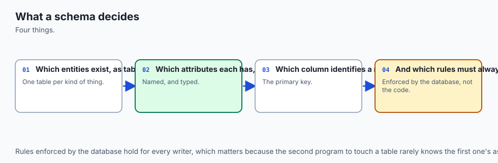
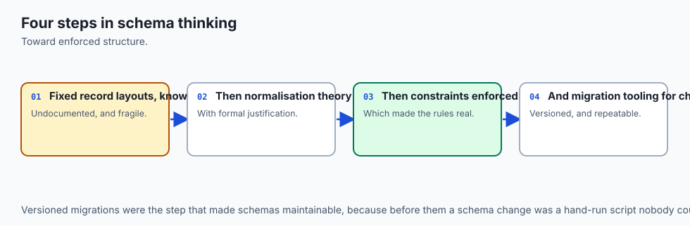
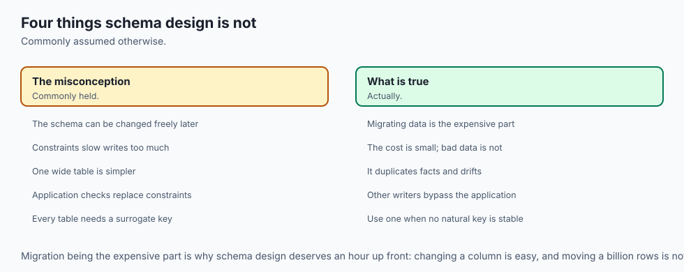
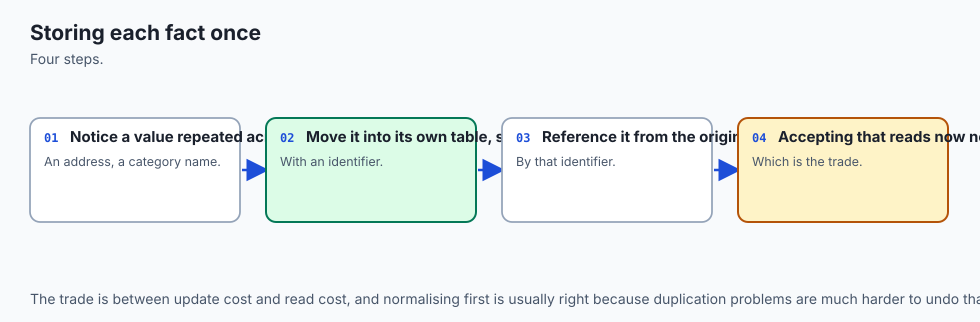
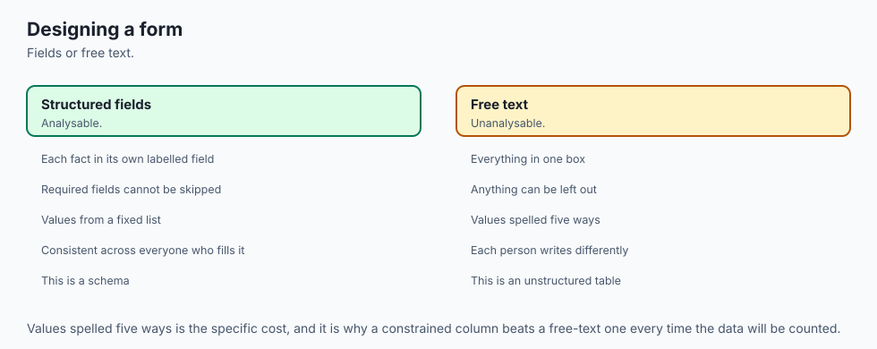
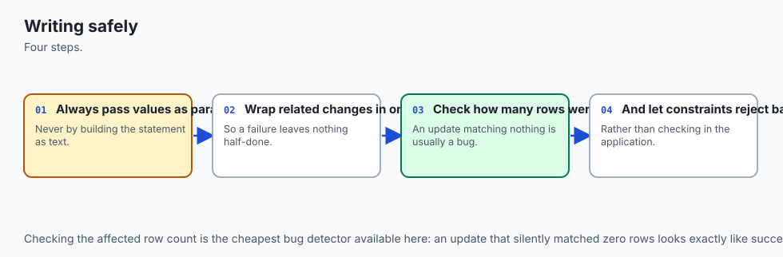
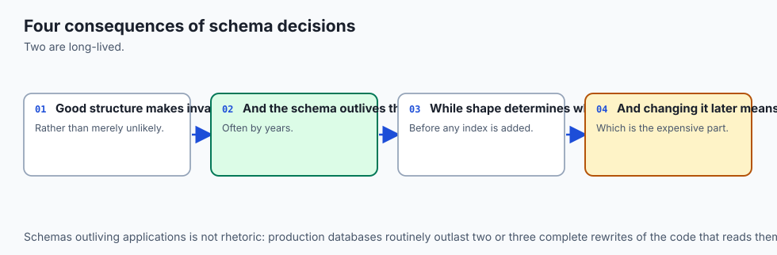
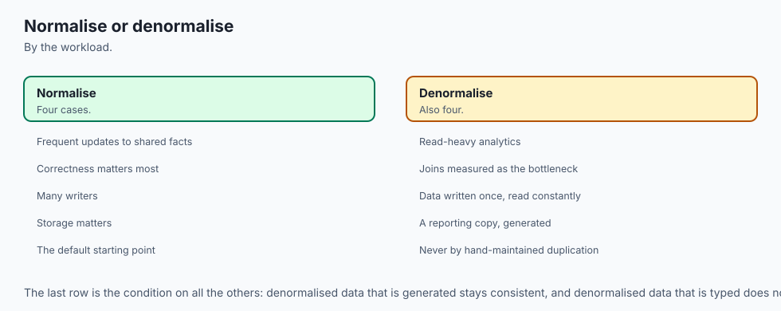

## Why this matters

For three days you have been reading. Day 85 gave you the relational model and SQLite, Day 86 gave you `SELECT` with filtering, sorting and grouping, and Day 87 gave you keys, relationships and joins. All of it was safe. The worst a wrong `SELECT` can do is give you a wrong answer, and you can always run it again.

Today that symmetry breaks. Today you change data.

Here is the single most expensive statement in the whole of SQL, and it is four words long:

```sql
UPDATE loans SET returned = 1;
```

You meant `WHERE id = 2`. You were closing one loan. Your finger left before the clause did. There is no confirmation prompt, no "are you sure", no dry run by default. The database does exactly what you said, immediately and completely, and then reports success.

Against the twelve-row library database in today's lab, that statement produces this — a real capture, not an illustration:

```text
--- before: how many loans are outstanding? ---
outstanding=8
returned=4

--- the SELECT you should write first ---
the SELECT matches 1 row(s)

--- the statement with the WHERE clause forgotten ---
UPDATE changed 12 row(s)

--- after ---
outstanding=0
returned=12
```

One row intended. Twelve changed. Eleven of them wrong.

And now the part that actually costs you. Those eight destroyed rows were not filled with garbage you could spot. They were filled with `1` — a completely plausible value, the same value the correct row got. Nothing looks broken. No query errors. No log line. The library simply believes every book has come back, and it will go on believing that until somebody asks where a book is and nobody can say. On a real system the gap between the mistake and the discovery is measured in weeks, and by then your backups have rotated.

This is why today is not really a lesson about `INSERT`, `UPDATE` and `DELETE`. Those take twenty minutes. Today is about the two questions that separate people who can be trusted with a production database from people who cannot: *how do I make sure the statement I run is the statement I meant?*, and *how do I build a schema that refuses the bad row in the first place?*

The second question is where your AI work lives. Every dataset you will ever train on sits in a table. A table without constraints will happily accept the same example twice, a row with no label, and a test-set row that has leaked into training. Months later the model underperforms, and the model gets blamed — because the schema is not where anybody thinks to look.

## The idea in plain language



Three ideas carry the whole day, and they stack.

**A constraint is a promise the database keeps for you.** When you write `NOT NULL` on a column, you are not asking politely. You are declaring that a row without that value cannot exist, and from then on SQLite enforces it against every program, every script, every console session and every colleague, forever. Your application's validation only protects the writes that go through your application. The schema protects all of them.

**A transaction is a boundary around a group of statements.** Inside it, changes are real to you and invisible to everyone else. At the end you choose: `COMMIT` makes them permanent, `ROLLBACK` makes them never have happened. The value is not that you can undo — it is that a multi-step change can never be found half-done. There is no moment when the money has left one account and not arrived at the other.

**A schema is a design that changes over time, and that change needs to be an artefact.** Your first table is wrong. Everyone's first table is wrong. The question is not how to get it right, it is how to change it later without a two-hour outage and a hand-typed script somebody runs from their laptop at midnight. The answer is a migration: a numbered file, applied in order, inside a transaction, recorded so it is never applied twice.

The through-line connecting them is one sentence, and it is worth keeping: **make the wrong thing impossible, and make the risky thing reversible.** A constraint does the first. A transaction does the second. A migration does both to your schema.

## Historical background



**Edgar F. Codd**, working at IBM's San Jose Research Laboratory, published "A Relational Model of Data for Large Shared Data Banks" in *Communications of the ACM* in **1970**. Days 85 to 87 built on the model it describes. But Codd's paper was not only about how to *store* data — it was about integrity, and about keeping the rules of a domain in the data rather than scattered across the programs that touch it.

**Normalization** is Codd's too. He introduced first, second and third normal form in his early 1970s papers, and later work with **Raymond F. Boyce** produced the stronger Boyce-Codd normal form. The word chosen is telling: it comes from the same instinct as "normalizing" diplomatic relations. Codd was not describing a performance technique. He was describing how to arrange facts so that each one is stated exactly once, and so that updating a fact cannot leave two copies of it disagreeing.

**Transactions** arrived from a different direction: they were an operational necessity before they were a theory. The properties we now name were codified by **Jim Gray** in the 1970s, and the acronym **ACID** — atomicity, consistency, isolation, durability — was coined by **Theo Härder** and **Andreas Reuter** in their 1983 paper "Principles of Transaction-Oriented Database Recovery". Gray received the Turing Award in 1998 for this work.

**SQLite** itself was written by **D. Richard Hipp**, first released in **August 2000**. Its design choices matter today. SQLite is in the public domain rather than merely open source. It is transactional, including for schema changes — you can roll back a `CREATE TABLE`, which is the property that makes today's migration runner safe. And it has always been unusually permissive about types, an early decision that the `STRICT` tables of 2021 finally gave you a way to opt out of.

`UPSERT` came much later, in SQLite **3.24.0 (2018-06-04)**, borrowing its syntax from PostgreSQL. `RETURNING` and `DROP COLUMN` both arrived in **3.35.0 (2021-03-12)**. Generated columns appeared in **3.31.0 (2020-01-22)**. And `ALTER TABLE ... ALTER COLUMN` for setting and dropping `NOT NULL` is very new indeed: **3.53.0 (2026-04-09)**. That last date is worth holding on to, because it explains something you are about to see on your own machine.

## What it is — and what it is not



**Schema design is not typing out columns.** It is deciding which facts exist, where each one is stated, and what makes a row invalid. The column list falls out of those decisions; it is the last step, not the first.

**A constraint is not validation.** They look similar and they are not the same thing at all. Validation is a courtesy to a user: a friendly message, before anything is attempted, in one program. A constraint is a guarantee about the data: enforced for every writer, with a blunt error, forever. You want both, and when they disagree the schema is right — because the schema is the one that was still enforced during the incident.

**A transaction is not a lock, and it is not an undo button.** It is a boundary. Its promise is about *grouping*, not about safety in general. A `COMMIT` after a `WHERE`-less `UPDATE` commits the mistake perfectly.

**And atomicity does not mean what most people think it means.** This is worth stating plainly, because nearly everyone has it backwards, including people who have used databases for years: **an error does not roll back your transaction.** A constraint violation undoes only the *failing statement*. The transaction stays open. If the next thing you send is `COMMIT`, you commit everything that had already succeeded.

Here is that, run for real:

```sql
BEGIN;
UPDATE books SET copies = copies + 10 WHERE id = 1;   -- succeeds
UPDATE books SET copies = -1 WHERE id = 5;            -- CHECK constraint failed
COMMIT;
```

Book 1 started with 3 copies. After that script it has **13**. The error was reported, the second statement changed nothing, and the `COMMIT` kept the first one anyway. Change the last line to `ROLLBACK` and book 1 is back to 3. Run the same script with `sqlite3 -bail` and the shell stops at the error, so `COMMIT` is never reached — which is what you want for anything that changes a schema.

Atomicity is a promise about the boundary *you* control. It is not a promise that the database will guess where the boundary should have been.

| It is | It is not |
| --- | --- |
| A rule the database enforces against every writer | A check in your application's save function |
| A boundary you open and close deliberately | An automatic undo when something goes wrong |
| A numbered migration file, applied in order, recorded | A hand-typed `ALTER TABLE` run on the server |
| A design where each fact is stated once | A table with every column somebody once asked for |
| `ROLLBACK` after reading `changes()` | Hoping |

## Why it was created and what problems it solves

Take the library schema and ask what each constraint is actually defending against.

**`NOT NULL` defends against the missing fact.** A member with no email is not a member you can contact. Without the constraint the row exists, every report that joins on it silently drops it or shows a blank, and the bug surfaces in a mail merge six months later.

**`UNIQUE` defends against the duplicate that inflates your numbers.** Two rows for one ISBN means the same book counted twice in every aggregate you ever run. In a training set it is worse: a duplicated example that lands in both train and test makes your reported accuracy a lie, in the flattering direction, which is the direction nobody investigates.

**`CHECK` defends against the impossible value.** `copies >= 0` says you cannot own minus one of something. `due_on >= borrowed_on` says time runs forwards. `label IN ('positive', 'negative', 'neutral')` says there are exactly three classes. Each is a sentence about the world that would otherwise live in a comment, where it can drift, or in a wiki, where it can be forgotten.

**`DEFAULT` defends against the tedious omission.** `joined_on TEXT NOT NULL DEFAULT (date('now'))` means every row has a joining date and no writer has to remember to supply it.

**`PRIMARY KEY` defends against the row you cannot address.** Without one, "update that row" has no precise meaning, and two identical rows are indistinguishable.

**Foreign keys defend against the reference to nothing.** And here is the one that catches people out, which Day 87 introduced and which is worth proving rather than believing: **SQLite does not enforce foreign keys unless you ask.** `PRAGMA foreign_keys` defaults to off, it is set per connection, and it cannot be stored in the file. A schema full of `REFERENCES` clauses opened without that pragma is decoration.

From the lab, with enforcement off:

```text
--- 0. with foreign_keys OFF ---
foreign_keys = 0
deleted member 1: 1 row(s)
her loans still present: 2
those loans are now orphans, and nothing objected
```

Two loans now point at a member who does not exist. Nothing errored. `PRAGMA foreign_key_check` will find them afterwards — it is the audit to run after any bulk load — but only if you think to run it.

Turn the pragma on, and the delete rules mean something:

```text
--- 2. CASCADE: deleting a member ---
loans total before      = 12
member 3 loans before   = 3
members deleted        = 1
loans total after      = 9
```

Read those numbers carefully. `changes()` reported **1**. Three rows were deleted. A cascade is real but it is not counted, which is precisely why an unintended one is so easy to miss: the number you read back does not mention the damage.

`ON DELETE RESTRICT` is the opposite choice. Deleting a book that is out on loan fails with `FOREIGN KEY constraint failed`, and the right response to that is a human thinking, not a retry.

Choosing between them is never "which is safer". It is: **what does the child row mean once the parent is gone?** A loan with no borrower is not a fact about anything, so `CASCADE`. A book that is out on loan is evidence that somebody is holding it, so `RESTRICT`. An article whose author closed their account is still an article, so `SET NULL`.


Read that diagram downward. Each layer catches something the one above it missed, and each one has a documented way through. Only the second layer applies to every writer, which is why it wins ties.

## How it works



### Writing rows: every useful shape of INSERT

Start with the one rule that survives schema change: **always name the columns.** `INSERT INTO books VALUES (...)` breaks silently the day somebody adds a column. `INSERT INTO books (isbn, title, author, copies) VALUES (...)` does not.

Many rows belong in one statement:

```sql
INSERT INTO books (isbn, title, author, copies) VALUES
    ('978-0321751041', 'The Art of Computer Programming', 'Donald Knuth', 1),
    ('978-1491950357', 'Building Microservices',          'Sam Newman',   2),
    ('978-0134494166', 'Clean Architecture',              'Robert Martin',1);
```

That is not merely shorter. It is *one statement*, so it is one implicit transaction: all three rows arrive or none do. Three separate statements are three transactions, and an interruption can land between them.

Rows can also be built from rows you already have, without a round trip through your program:

```sql
INSERT INTO loan_archive (loan_id, member_name, book_title, borrowed_on, archived_on)
SELECT l.id, m.name, b.title, l.borrowed_on, '2026-08-16'
FROM   loans l
JOIN   members m ON m.id = l.member_id
JOIN   books   b ON b.id = l.book_id
WHERE  l.returned = 1;
```

`RETURNING` hands back what the database decided — the generated id, the `DEFAULT`-filled column — instead of making you run a second `SELECT` that could race with somebody else:

```sql
INSERT INTO members (name, email)
VALUES ('Gita Prasad', 'gita@library.test')
RETURNING id, name, joined_on;
```

```text
id  name         joined_on
--  -----------  ----------
7   Gita Prasad  2026-08-16
```

Nobody supplied `joined_on`. The `DEFAULT` did.

### UPSERT, and why it is not insert-then-update

A catalogue feed arrives. Some books you know, one you do not. Without `UPSERT` you have two bad options: let the `UNIQUE` violation happen and catch it, or ask first and then decide — and between the asking and the deciding, another connection can insert the row.

```sql
INSERT INTO books (isbn, title, author, copies) VALUES
    ('978-0131103627', 'The C Programming Language', 'Kernighan and Ritchie', 5),
    ('978-0201633610', 'Design Patterns',            'Gamma and others',      6),
    ('978-1098100964', 'Fundamentals of Data Engineering', 'Reis and Housley', 2)
ON CONFLICT(isbn) DO UPDATE SET
    copies = excluded.copies,
    title  = excluded.title;
```

```text
--- 5. UPSERT: before ---
978-0131103627 copies=3
978-0201633610 copies=2

--- 5. UPSERT: after ---
978-0131103627 copies=5
978-0201633610 copies=6
978-1098100964 copies=2
```

Two updated, one inserted, in one statement and one trip. The difference from insert-then-update is not convenience, it is **atomicity**: there is no window between checking and acting.

The one thing to get right is `excluded`. The SQLite documentation puts it exactly: column names in a `DO UPDATE` refer to the *original unchanged value*, and to use the value that would have been inserted you add the `excluded.` qualifier. So `copies = excluded.copies` means "take the new value" and `copies = copies` would mean "keep the old one". Getting that backwards is the usual first mistake, and it is silent.

`ON CONFLICT ... DO NOTHING` is the other half — insert if new, leave alone if not.

### Changing rows, and removing them

Prefer an expression to a literal:

```sql
UPDATE books SET copies = copies + 2 WHERE id = 5;
```

`copies = copies + 2` is computed by the database from the value present at the moment of the write. `copies = 4` is computed by you, from a value you read earlier, which may already be stale. The expression form has no gap for anyone to change the row in.

Subqueries work too, which is how a derived column gets filled:

```sql
UPDATE members
SET    loan_count = (SELECT count(*) FROM loans WHERE loans.member_id = members.id);
```

`DELETE` deserves its own paragraph, because it is the least recoverable thing here. An `UPDATE` that goes wrong leaves rows you can inspect and often repair. A `DELETE` that goes wrong leaves nothing — no marker, no bin, no history. The only copy is your backup.

Which is why **soft delete** is usually what you actually wanted:

```sql
ALTER TABLE members ADD COLUMN deleted_at TEXT;
UPDATE members SET deleted_at = '2026-08-16' WHERE id = 6;
```

The row stays. Foreign keys still resolve, history still adds up, and the accident is one `UPDATE` away from being undone. The cost is real and must be said out loud: every query that reads the table now has to remember `WHERE deleted_at IS NULL`, and the day somebody forgets, deleted members reappear in a report.

### Transactions, and the byte-for-byte proof


The mechanism is simpler than it sounds. On `BEGIN`, SQLite copies the *original* pages it is about to modify into a rollback journal beside the database file. Your changes then go into the database file itself. While the transaction is open, both versions exist: the new pages in the file, the originals in the journal.

`COMMIT` deletes the journal — there is nothing left to undo with, so the change is permanent. `ROLLBACK` copies the original pages back over the new ones. Undo is not a clever algorithm; it is putting the saved pages back.

That is a testable claim, so the lab tests it. Take a SHA-256 of the file, run three destructive statements inside a transaction, confirm *inside* that they took effect, roll back, take the hash again:

```text
  ok: inside the transaction the changes are completely real (loans=9 members=7)
  ok: the database file is byte-for-byte identical after ROLLBACK (6139bedc...)
  ok: every row is identical after ROLLBACK (full dump comparison)
```

Identical. Not equivalent, not close — the same bytes. (That claim is made in rollback-journal mode, which is what the lab observes and prints. In WAL mode the state lives across the main file and its `-wal` sidecar, so comparing only the `.db` file would be the wrong test.)

This is what makes the SELECT-first routine safe enough to rely on:

1. Take a copy of the file.
2. Write the statement as a `SELECT` with the exact `WHERE` clause you intend.
3. Run it. Read the row count. Is that the number you expected?
4. Keep the `WHERE` clause byte for byte and change only the head of the statement.
5. Do it inside `BEGIN`. Check `changes()`. If it does not match step 3, `ROLLBACK`.

Fifteen seconds, and it converts today's opening disaster into a non-event.

### Constraints as executable documentation

The lab builds the same training-data table twice. The loose one takes everything:

```text
rows accepted by the loose table: 6
duplicated texts:  1
rows with no label: 1
distinct split values: train,Testing
token_count declared INTEGER, actually holding: integer,text
not one of these raised an error
```

Look at that last pair of lines. A column declared `INTEGER` is holding text, because in an ordinary SQLite table the declared type is only an *affinity* — a preference, not a rule. And `'Testing'` will escape every filter you write as `WHERE split = 'test'`, which is how a test row ends up in your training set.

The constrained version refuses all of it, and — this is the part that makes constraints better documentation than comments — **it tells you the rule at the moment you break it**:

```text
UNIQUE constraint failed: examples_strict.text
NOT NULL constraint failed: examples_strict.label
CHECK constraint failed: split IN ('train', 'validation', 'test')
CHECK constraint failed: label IN ('positive', 'negative', 'neutral')
CHECK constraint failed: length(trim(text)) > 0
cannot store TEXT value in INTEGER column examples_strict.token_count
CHECK constraint failed: token_count > 0
```

A comment saying "split must be train, validation or test" can be wrong. That message cannot.

| Constraint | The sentence it encodes | What it prevents |
| --- | --- | --- |
| `NOT NULL` | this fact is required | rows that quietly vanish from joins and reports |
| `UNIQUE` | this fact appears once | double-counting; a duplicate example in train and test |
| `CHECK` | this value is in range or in a set | negative copies, a due date before the borrow date, an invented class label |
| `DEFAULT` | if unsupplied, use this | inconsistent rows from writers who forgot a column |
| `PRIMARY KEY` | this row is addressable | ambiguity about which row you meant |
| `FOREIGN KEY` | this reference resolves | orphans — but only with `PRAGMA foreign_keys = ON` |
| `STRICT` | this column holds its declared type | the word `banana` sitting in an `INTEGER` column |

`STRICT` deserves a precise description rather than a slogan, because it is more nuanced than "wrong types are rejected". It converts *losslessly* and refuses everything else. Verified on this machine: `'7'` into an `INTEGER` column stores `7`; `4.0` stores `4`; `'banana'` and `3.5` are both refused. It is the modern default worth choosing, and it costs nothing.

### Normalization, concretely

Normalization is taught abstractly far too often. Here it is on the library schema, one form at a time.

**First normal form: no repeating groups; one value per cell.** The unnormalized version:

```text
members
id  name         borrowed_books
1   Ada Okonkwo  "Algorithms, Clean Code, Effective Java"
```

Now find everyone who has *Clean Code*. You are writing `LIKE '%Clean Code%'`, which also matches *Clean Coder*. Delete one book from one member and you are doing string surgery. 1NF says: one value per cell, so the list becomes rows in a `loans` table.

**Second normal form: no partial dependency on part of a composite key.** Suppose `loans` were keyed on `(book_id, member_id)` and also carried `book_title`. The title depends on `book_id` alone — half the key. So the title is repeated in every loan of that book, and correcting a typo means updating every one of them, and missing one means the database now holds two different titles for one book. 2NF says: `book_title` belongs in `books`, keyed by `book_id`.

**Third normal form: no dependency between non-key columns.** Add `member_email` to `loans`. It depends on `member_id`, which is not the key — it is another ordinary column. When Ada changes her email, every loan row is stale. 3NF says: `member_email` belongs in `members`.

| Form | The rule | The library version | What goes wrong without it |
| --- | --- | --- | --- |
| 1NF | one value per cell | `borrowed_books` as a comma-separated string becomes rows in `loans` | you cannot query, join or delete a single item without string surgery |
| 2NF | no dependency on part of a key | `book_title` moves out of `loans` into `books` | one book, several spellings of its title |
| 3NF | no dependency between non-key columns | `member_email` moves out of `loans` into `members` | changing an email leaves every old loan stale |

The unifying idea, and the only one worth memorising: **state each fact exactly once.** Every normal form is a different way of catching a fact that got stated twice, and every anomaly is two copies disagreeing.

**Then, deliberately, denormalize.** The lab adds `loan_count` to `members` — a value that could always be recomputed from `loans`. It buys a fast answer to a common question and it costs you the obligation to keep it true forever. That is the trade, and it is a real one; make it on purpose, with a note saying why, and with something that keeps it honest.

Which is what **generated columns** are for. A generated column is defined by an expression over the other columns of the same row, so it cannot disagree with the data it is derived from:

```sql
ALTER TABLE loans ADD COLUMN loan_days INTEGER
    GENERATED ALWAYS AS (CAST(julianday(due_on) - julianday(borrowed_on) AS INTEGER)) VIRTUAL;
```

`VIRTUAL` computes on read; `STORED` computes on write. `ALTER TABLE ADD COLUMN` can only add `VIRTUAL` ones, because adding a `STORED` column would mean rewriting every existing row, and `ADD COLUMN` never does that. Try to write to one and SQLite says `cannot UPDATE generated column`. It cannot drift, which is exactly what `loan_count` cannot promise — and note that you *cannot* make `loan_count` a generated column, because the expression may only reference the same row.

One gotcha: `PRAGMA table_info` does not list generated columns. Only `PRAGMA table_xinfo` does.

### Changing the schema: what ALTER TABLE can actually do

The SQLite documentation is blunt about the scope: the command "allows these alterations of an existing table: it can be renamed; a column can be renamed; a column can be added to it; or a column can be dropped from it."

Four operations. That is the portable set, and the lab probes for all of them rather than trusting anyone's memory.

| Operation | Supported | Note |
| --- | --- | --- |
| `RENAME TO` | yes | rewrites references in other tables' definitions |
| `RENAME COLUMN` | yes | since 3.25.0 |
| `ADD COLUMN` | yes | cheap: no existing row is rewritten. A `NOT NULL` column needs a non-null `DEFAULT` |
| `DROP COLUMN` | yes | since 3.35.0 |
| `ALTER COLUMN ... SET/DROP NOT NULL` | **version-dependent** | added in 3.53.0 (2026-04-09) |
| add a `CHECK` constraint | no | rebuild the table |
| add a `UNIQUE` constraint | no | rebuild, or add a unique index |
| add a `FOREIGN KEY` | no | rebuild the table |

That "version-dependent" row is not hedging. On the authoring machine, the `sqlite3` shell links SQLite **3.51.0** and Python's `sqlite3` module links **3.53.3** — two different libraries on one computer. So `ALTER TABLE t ALTER COLUMN a SET NOT NULL` is a syntax error in one and perfectly valid in the other, on the same afternoon. The lab's test asserts that your build agrees with *its own version number*, which is a check that stays correct on an older or newer machine.

Check yours before relying on anything beyond the four:

```bash
sqlite3 :memory: 'SELECT sqlite_version();'
python3 -c 'import sqlite3; print(sqlite3.sqlite_version)'
```

For everything else there is one documented procedure, and it is worth knowing by heart: **create the table you wanted, copy the rows, drop the old table, rename the new one into its place.**

```sql
PRAGMA foreign_keys = OFF;      -- outside the transaction; it is a no-op inside one
BEGIN;
  CREATE TABLE loans_new ( ...the ENTIRE definition, plus the new rule... ) STRICT;
  INSERT INTO loans_new (id, book_id, member_id, borrowed_on, due_on, returned)
  SELECT id, book_id, member_id, borrowed_on, due_on, returned FROM loans;
  DROP TABLE loans;
  ALTER TABLE loans_new RENAME TO loans;
COMMIT;
PRAGMA foreign_key_check;       -- audit before trusting it again
PRAGMA foreign_keys = ON;
```

Four things about that, each of which is a mistake somebody has made:

**One transaction.** Between `DROP TABLE loans` and the rename there is a moment when your database has no `loans` table. Outside a transaction, a power cut there has destroyed it. Inside, that moment is invisible to everyone.

**The entire definition.** Every column, every default, every existing constraint, both foreign keys. Whatever you forget to retype is silently gone — and it will not error, which is what makes this the most common way to lose a constraint.

**Foreign keys off, outside the transaction.** With enforcement on, `DROP TABLE` fires the delete rules of anything referencing it. `PRAGMA foreign_keys` is a no-op inside a transaction, so it must go outside.

**Audit afterwards.** Nothing was checking while enforcement was off. `PRAGMA foreign_key_check` is how you find out whether the rebuild left anything dangling.

Run against the lab's data, all twelve rows survive, both foreign keys survive, `foreign_key_check` reports zero violations, and a 200-day loan is now refused:

```text
CHECK constraint failed: julianday(due_on) - julianday(borrowed_on) <= 90
```

### Building a migration runner from first principles

You now know how to make a schema change. The remaining question is how to make it *the same way, everywhere, exactly once* — on your laptop, on a colleague's, on a server, without anyone hand-typing anything.

That is a migration runner, and it is about 150 lines. The lab builds one.

The design rests on `PRAGMA user_version`: a 32-bit integer in the database header that SQLite never uses for anything itself. It is yours, and — the crucial part — **it is covered by transactions like any other write.** So applying a migration is:

```sql
BEGIN;
  <the migration's statements>
  PRAGMA user_version = 3;
COMMIT;
```

If anything fails, the rollback undoes the schema change *and* the version bump together. There is no state where the change half-happened but the database claims to be at the new version. That is the whole safety property, and it only works because SQLite's DDL is transactional — you can roll back a `CREATE TABLE`.

Verified, by breaking a migration on purpose:

```text
  applying 005: 005_broken.sql ... FAILED
error: 005_broken.sql: unrecognized token: "!"
error: rolled back; database is still at version 4
```

The version did not move, and the table the broken file created before its syntax error does not exist.

Idempotence falls straight out of the design. Run it again:

```text
current version: 4
latest available: 4
up to date -- 0 migration(s) applied
```

The runner also refuses malformed migration sets *before* writing anything: a file not named `NNN_description.sql`, two files claiming the same version, or a file containing its own `BEGIN`/`COMMIT` — because a stray `COMMIT` inside a migration would end the runner's transaction early and quietly break the all-or-nothing guarantee.

One discipline goes with it: **an applied migration is history.** You change history by adding to it, never by editing a file somebody has already run.

## An everyday analogy



Think of a library's accession desk — the counter where new books are processed before they reach the shelves.

**The constraints are the desk's rules, printed and laminated.** Every book needs a catalogue number. No two books get the same one. A donation date cannot be in the future. These are not suggestions to the person on duty; they are conditions for the book getting through at all. It does not matter whether today's volunteer is experienced or whether it is their first shift — the rules are the same, because they belong to the desk and not to the person. That is a schema constraint. Your application's validation is the friendly note the volunteer keeps in their own pocket: helpful, and it leaves with them.

**A transaction is the trolley.** Repairs come back from the bindery in a batch: five books, each needing a shelf. You do not carry them one at a time, because half a batch on the shelves and half in the corridor is worse than none — nobody can tell which. You load the trolley, wheel it out, and shelve them together. If the fire alarm goes, the trolley goes back, whole. `COMMIT` is shelving the trolley. `ROLLBACK` is wheeling it back.

And the analogy extends to the surprise. If the fourth book will not fit its shelf, that does not by itself put the other four back on the trolley — you are standing there holding a decision. Shelve the rest anyway, or take them all back? A constraint error is exactly that moment. The database has stopped, and it is waiting for your `COMMIT` or your `ROLLBACK`. It will not choose for you.

**Normalization is deciding where each fact is written down.** The author's name goes on the author card, once. If it is also written on every book's card, then correcting a misspelling means finding every book they wrote, and the one you miss is now a second, disagreeing author. State each fact once, point at it from everywhere else.

**A migration is the accession register.** Numbered entries, in order, never erased. To find out what a shelf looks like, you replay the register. To make a change, you add the next entry — you do not go back and rewrite entry 47, because other branches have already copied it.

And **the `WHERE`-less `UPDATE`** is stamping every book in the building "returned" because you meant to stamp the one in your hand. The stamp works perfectly. That is the problem.

## Examples in practice



Everything below was run for real on the authoring machine on 2026-08-16 and is captured in the lab's `expected-output/` directory.

**The mistake, and the discipline that prevents it.** The lab's harness measures both:

```text
  ok: the SELECT you meant to write matches 1 row (1)
  ok: the WHERE-less UPDATE hits every row in the table (12)
  ok: SELECT-first, WHERE kept: the UPDATE changes exactly 1 row (1)
  ok: the other 7 outstanding loans are untouched (7)
```

**Every constraint firing.** Seven bad rows, seven refusals, and afterwards the table still holds exactly the four clean rows it started with:

```text
  ok: UNIQUE catches the duplicated example
  ok: NOT NULL catches the missing label
  ok: CHECK catches the invented split value
  ok: CHECK catches the label that is not one of the classes
  ok: CHECK catches text that is nothing but spaces
  ok: STRICT catches the word banana in an INTEGER column
  ok: CHECK catches a token count of zero
  ok: after 7 rejected rows the table still holds exactly 4 (4)
```

**Foreign keys, off and on:**

```text
  ok: foreign key enforcement is OFF unless you ask for it (0)
  ok: with the pragma off, deleting a parent leaves orphaned children (2)
  ok: PRAGMA foreign_key_check finds those 2 orphans afterwards (2)
  ok: ON DELETE CASCADE takes the 3 child loans with the member (members_deleted=1 loans_left=9)
  ok: ON DELETE RESTRICT refuses to delete a borrowed book
```

**The transaction surprise, both ways round:**

```text
  ok: the FAILING statement changed nothing (1)
  ok: but an error does NOT roll back the transaction — COMMIT kept the +10 (13)
  ok: ending the same script with ROLLBACK undoes the +10 as well (3)
  ok: sqlite3 -bail stops at the first error and exits non-zero (1)
```

**The rebuild, preserving everything:**

```text
  ok: every row survived the rebuild (12 seeded + 1 inserted after) (13)
  ok: both foreign keys survived the drop and rename (2)
  ok: PRAGMA foreign_key_check reports no violations after the rebuild (0)
  ok: the new CHECK constraint is in the stored schema (1)
  ok: the old constraints are still there too (1)
```

**And the runner, applied then idempotent then atomic on failure:**

```text
  ok: it applies all four migrations
  ok: PRAGMA user_version is now 4 (4)
  ok: running it again applies NOTHING — this is idempotence
  ok: a failing migration exits non-zero (1)
  ok: the version did NOT advance (4)
  ok: the table created before the error does NOT exist (0)
```

The full run ends `101 checks, 0 failure(s).`

## Implications: security, privacy, performance, scalability, and cost



**Security.** Constraints are a security control, not only a correctness one. A `CHECK` is the last thing standing between a bug — or an attacker — and a permanently wrong row, because it runs for every program, every script and every console session, forever.

The urgent rule for the moment a schema sits behind a web form: **build statements with bound parameters, never string formatting.**

```python
cur.execute("UPDATE loans SET returned = 1 WHERE id = ?", (loan_id,))     # correct
cur.execute(f"UPDATE loans SET returned = 1 WHERE id = {loan_id}")        # injectable
```

The second form is where a `loan_id` of `1 OR 1=1` becomes today's opening disaster, executed by a stranger. Constraints limit the damage — a `CHECK` still refuses an impossible value — but they do not prevent it.

**Privacy.** Soft delete and privacy pull in opposite directions, and you should notice the tension rather than discover it during an audit. A soft delete keeps the row. If the row is a person who asked to be forgotten, keeping it may be exactly the wrong thing. The usual resolution is to distinguish *retiring* a record from *erasing personal data*: keep the row and its relationships, null out or hash the identifying columns. Decide which you mean before you write the column.

**Performance.** Constraints cost something on write. `UNIQUE` and `PRIMARY KEY` are usually implemented with an index that must be maintained; a `CHECK` is an expression evaluated per row. Both are cheap, and the trade is almost always worth it — the constraint you removed for speed is the one that would have caught the bad load. Normalization moves cost from writes to reads (more joins), denormalization moves it back (more duplication to maintain). Day 89 is about measuring rather than guessing.

**Scalability.** The lesson that scales worst is the hand-run schema change. Two databases that both say "version 5" but have different tables in them is an entire category of outage, and it is exactly what a duplicate migration number produces — which is why the runner refuses that case before writing anything.

**Cost.** The expensive thing here is not storage. It is the incident: the hours spent reconstructing which rows were wrong, the trust lost in a dataset nobody can now vouch for, and the models retrained because a duplicate leaked across a split. A constraint costs one line, once.

## Alternatives: free, open source, and commercial

### The four ways people manage schema change

**Write the runner yourself.** What today's lab does. *When to choose it:* a small project, a single database, a team that wants to understand the mechanism; anything embedded, where a dependency is a real cost. *How:* number your `.sql` files, track `PRAGMA user_version`, apply each higher one in a transaction. *Example:* `python3 examples/migrate.py --db app.db --dir examples/migrations`, twice, and watch the second run do nothing. *Cost:* free, and about 150 lines you now maintain. *Limit:* one integer holds no history — you cannot ask when a migration ran or who ran it.

**Plain SQL files plus a version table.** The same idea with a table instead of the pragma: a `schema_migrations` table with one row per applied file. *When to choose it:* when you want the history that `user_version` cannot hold, or when your database has no equivalent pragma — which is most of them. *How:* on startup, read the applied names, run the rest, insert a row per migration inside the same transaction. *Cost:* free. *Limit:* you must bootstrap the table itself, and you must keep its writes inside the migration's transaction or you have reintroduced the bug the design exists to prevent.

**Alembic.** The migration tool from the SQLAlchemy project. *Honest disclosure: Alembic is not installed on the authoring machine, nothing in this lesson or lab runs it, and no output from it is shown here.* What it is documented to do is autogenerate a migration by comparing your models against the live database, and manage branching and merging of migration histories. *When to choose it:* you are already using SQLAlchemy, or you have several developers producing migrations in parallel and need real branch and merge support. *Example of the shape:* `alembic revision --autogenerate -m "add deleted_at"` then `alembic upgrade head`. *Cost:* free and open source. *Limit:* autogeneration is a draft, not an answer — it reliably misses things a rebuild-based change implies, and every generated migration needs reading before it is run.

**Django migrations.** Built into the Django web framework, driven by changes to model classes. *When to choose it:* you are building a Django application; then this is simply the answer and reaching for anything else is a mistake. *Example of the shape:* `python manage.py makemigrations` then `python manage.py migrate`. *Cost:* free and open source. *Limit:* it is not usable outside Django, and the generated migrations are Python objects rather than SQL, which is more portable across database engines and less transparent when you want to know exactly what will run.

| Approach | Choose it when | History kept | Cost |
| --- | --- | --- | --- |
| Your own runner | small project, embedded use, or you want to understand it | one integer | free, ~150 lines to maintain |
| SQL files + version table | you need to know when and what, on any engine | one row per migration | free |
| Alembic | you use SQLAlchemy, or need branch and merge | full, with branching | free and open source |
| Django migrations | you are building a Django app | full, in Python | free and open source |

### How other engines differ, stated carefully

Two differences matter when you move off SQLite, and I want to be precise about the basis for each.

**`ALTER TABLE` is far more capable elsewhere.** SQLite's documented set is four operations. PostgreSQL and MySQL both support adding and dropping constraints directly, which means the create-copy-drop-rename rebuild is largely a SQLite-specific discipline. That is a good reason to *know* the rebuild rather than to fear it: it teaches you exactly what a schema change costs, which the one-line version hides.

**Transactional DDL differs, and this one deserves a caveat.** SQLite's DDL is transactional — I verified that directly for this lesson: a `CREATE TABLE` and a `PRAGMA user_version` bump inside a failed transaction both disappear on rollback, which is the property today's runner depends on. PostgreSQL is widely documented as also having transactional DDL, and MySQL historically did not, committing implicitly around schema statements. **I have not run PostgreSQL or MySQL here, and neither vendor's documentation is among this lesson's cited sources, so treat those two statements as a pointer to check in their current documentation rather than as verified facts.** Version-specific behaviour in this area has changed over time and is exactly the kind of claim that ages badly.

The practical consequence, if it holds for your engine: on a database without transactional DDL, a migration that fails half-way leaves the schema half-changed, and your runner needs a recovery story rather than relying on rollback. That is a design difference, not a detail.

## Comparison with related concepts

**Constraint versus validation.** The distinction the whole lesson turns on. Validation is per-application, friendly, and skippable. A constraint is per-database, blunt, and unavoidable. Use validation for the message and the constraint for the guarantee. When they disagree, the schema is right.

**`UPSERT` versus insert-then-update.** Both end with the right row. Only `UPSERT` has no window in between for another connection to act, and only `UPSERT` is one statement and therefore one implicit transaction.

**Transaction versus lock.** A transaction is about grouping *your* statements. A lock is about excluding *other* connections. They interact, and they solve different problems.

**Soft delete versus hard delete.** Hard delete is honest and irreversible. Soft delete is reversible and imposes a filter on every future query. Choose hard when the row is genuinely noise; soft when it is history, referenced elsewhere, or when an accident must be survivable.

**Denormalized column versus generated column.** Both store a derived value. A denormalized column is written by your code and can drift out of agreement with its source. A generated column is computed by the database and cannot. Prefer generated whenever the expression fits inside a single row — and note that the moment you need `count(*)` over another table, it does not, which is exactly when you take on the maintenance burden knowingly.

**`user_version` versus a migrations table.** One integer, no bootstrap, no history. Versus one row per migration, with names and timestamps, at the cost of a table you must create before you can read it. Both are correct; only one can tell you what happened last Tuesday.

**Normalization versus denormalization.** Not opposites and not a spectrum you slide along by feel. Normalize first, because it is the form in which the data cannot contradict itself. Denormalize afterwards, deliberately, against a measurement, with something that keeps the copy honest.

## When to use it — and when not to



**Add a constraint whenever you can write the rule as a sentence about the world.** "Every example has a label." "A due date is not before a borrow date." "A label is one of these three." If you can say it, encode it. The cost is a line; the benefit is every writer forever.

**Do not use a `CHECK` for a rule that needs more than one row.** SQLite's documentation is explicit that a `CHECK` expression may not contain a subquery. "No member may have more than five books out" is not a `CHECK`; it is a trigger, or a rule your application enforces, and you should know which you chose.

**Use a transaction for any change that is more than one statement**, and for any single statement you are not completely certain about. The cost is two words.

**Do not hold a transaction open while you wait for something slow** — a network call, a user's decision. You are holding locks the whole time, and on a shared database that is how one careless script stops everybody.

**Use soft delete when the row is history or is referenced elsewhere.** Use hard delete when it is genuinely noise, and when a privacy obligation means keeping it is the wrong answer.

**Normalize to third normal form as the default.** It is where most schemas belong, and moving away from it should be a decision with a reason and a measurement — not a habit.

**Denormalize when you have measured a problem**, and pair it with something that keeps the copy true: a generated column if the expression fits in one row, a trigger if it does not, a scheduled reconciliation if neither works. A denormalized column with no mechanism behind it is a bug with a delay on it.

**Use a migration runner from your second machine onward.** For a database that exists only on your laptop and that you would happily delete, a `.sql` file you run by hand is fine. The moment a colleague, a server or a deployment enters the picture, hand-run changes stop being viable — because "which changes has *that* database had?" becomes a question nobody can answer.

**Do not reach for Alembic or Django migrations first.** Reach for them when you have felt the specific problem they solve: parallel migration branches, or a framework that already owns your models. Reaching earlier buys you a dependency and a mental model you have no way to evaluate.

And the habit underneath all of it, worth more than any single technique on this page: **before every `UPDATE` and every `DELETE`, write the `SELECT` and read the row count.** It costs fifteen seconds. It is the difference between one row and twelve.

Which brings the day back to your AI work, because the same sentence applies with the nouns changed. A training-data table without constraints will accept a duplicated example, a null label, and a leaked test row — silently, every time. Months later a model underperforms, an evaluation looks suspiciously good, and a team spends a fortnight on architecture, hyperparameters and learning rates. Nobody opens the schema, because the schema is not where anybody thinks to look. **Data quality is a schema decision**, made once, at the moment you write `CREATE TABLE`, and enforced from then on by something that does not get tired at three in the morning.

## The AI connection

- **Schema design is the most consequential decision in a data system**, and it is expensive
  to change later.
- **Constraints are correctness guarantees**, enforced regardless of which application writes.
- **Normalisation reduces duplication**, and denormalisation buys read speed — both are
  deliberate.
- **Every feature store is a schema decision**, which is why this matters for model work.
- **Migrations are how schemas change safely**, and doing them by hand is how data is lost.

## Knowledge check

1. `UPDATE loans SET returned = 1;` runs against a table of 12 rows and you intended to change 1. How many rows are now wrong, and why is this failure harder to spot than a crash?
2. Inside `BEGIN`, statement one succeeds and statement two fails a `CHECK`. You then send `COMMIT`. What is the state of statement one's change, and why?
3. What does `excluded.copies` mean inside `ON CONFLICT ... DO UPDATE`, and what would plain `copies` mean?
4. Why is `UPDATE books SET copies = copies + 1` safer than reading the value and writing `copies = 4`?
5. Name the four operations SQLite's `ALTER TABLE` documentation lists, and the documented procedure for anything else.
6. Why must `PRAGMA foreign_keys = OFF` be issued *outside* the transaction during a table rebuild?
7. Why does the migration runner put the `PRAGMA user_version` bump inside the same transaction as the migration's statements?
8. Your `members` table has `member_email` copied into `loans`. Which normal form does that violate, and what goes wrong?
9. What can a generated column guarantee that a denormalized column cannot, and what is the one thing it cannot express?
10. `PRAGMA table_info('loans')` shows 6 columns but you added 2 generated ones. Where are they?

## Hands-on exercise

Build the database, prove the rollback, and make a constraint fire. Ten minutes, in the lab directory.

```bash
cd labs/sections/programming-with-python/day-088-inserting-updating-and-schema-design

# 1. Build it, and take a copy FIRST. This is the habit.
sqlite3 library.db < examples/seed.sql
cp library.db library-backup.db

# 2. Measure the mistake, against a throwaway file.
cp library.db scratch.db
sqlite3 scratch.db < examples/01-the-expensive-mistake.sql
rm scratch.db

# 3. Prove a rollback changes nothing, by hand.
cp library.db scratch.db
shasum -a 256 scratch.db
sqlite3 scratch.db "BEGIN; UPDATE loans SET returned = 1;
                    DELETE FROM loans WHERE id <= 3; ROLLBACK;"
shasum -a 256 scratch.db

# 4. Make a constraint fire, and read what it says.
sqlite3 scratch.db "INSERT INTO books (isbn,title,author,copies)
                    VALUES ('978-0131103627','Duplicate','Nobody',1);"
sqlite3 scratch.db "UPDATE books SET copies = -1 WHERE id = 1;"

# 5. Watch a foreign key do nothing, then do something.
sqlite3 scratch.db "DELETE FROM books WHERE id = 8;"                        # succeeds
sqlite3 scratch.db "PRAGMA foreign_keys = ON; DELETE FROM books WHERE id = 7;"

# 6. Run the migration runner twice. The second run is the point.
python3 examples/migrate.py --db app.db --dir examples/migrations
python3 examples/migrate.py --db app.db --dir examples/migrations

# 7. The whole suite.
bash tests/run_tests.sh; echo "exit: $?"
```

### Expected output

Step 2 prints `UPDATE changed 12 row(s)` after reporting that the SELECT matched 1.

Step 3 prints the **same hash twice**:

```text
6139bedc812f001558f3529e3b24dae67c7dcd44f1097e564178fa74d379d761
6139bedc812f001558f3529e3b24dae67c7dcd44f1097e564178fa74d379d761
```

Step 4 gives two different, specific errors:

```text
Error: stepping, UNIQUE constraint failed: books.isbn (19)
Error: stepping, CHECK constraint failed: copies >= 0 (19)
```

Step 5 shows the default biting: the first delete **succeeds** (enforcement is off), the second fails with `FOREIGN KEY constraint failed`.

Step 6, second run:

```text
current version: 4
latest available: 4
up to date -- 0 migration(s) applied
```

Step 7 ends `101 checks, 0 failure(s).` and exits 0.

### Validate your work

- The two hashes in step 3 are character-for-character identical.
- Step 4 produced two errors naming *different* constraints, and `SELECT count(*) FROM books` is still 8.
- In step 5 the first delete succeeded and the second did not — if both failed, you have a `PRAGMA foreign_keys = ON` somewhere you did not expect.
- `sqlite3 app.db "PRAGMA user_version;"` prints `4` after both runs of step 6.
- The final line of step 7 reads exactly `101 checks, 0 failure(s).`

### Troubleshooting

- **`no such table: loans`** — you are in the wrong directory, or step 1 did not run.
- **Both deletes in step 5 fail** — something turned enforcement on. It is per connection; check for a `PRAGMA` earlier in the same invocation.
- **The two hashes differ** — you are almost certainly in WAL mode, where state lives across the `.db` and its `-wal` sidecar. Check with `PRAGMA journal_mode;`. The lab prints the mode it observed for exactly this reason.
- **`shasum: command not found`** — use `sha256sum` on Linux.
- **Step 6's second run applies everything again** — you passed a different `--db` path the second time.
- **`Error: near "ALTER"`** — your `sqlite3` predates the operation you tried. Check `SELECT sqlite_version();` and use the rebuild.

### Common mistakes

- **Practising on the real database.** Step 1's `cp` is the first line for a reason.
- **Writing the `UPDATE` first and adding the `WHERE` after.** Write the `SELECT`, run it, read the count, then change the head of the statement. The order is the safety.
- **Assuming a constraint error rolled back your transaction.** It undid the failing statement only. Send `ROLLBACK` explicitly, or use `sqlite3 -bail`.
- **Trusting `REFERENCES` without the pragma.** Every connection, every time.
- **Forgetting a column or constraint when retyping a table in a rebuild.** It does not error. It just silently drops the rule.
- **Editing a migration that has already been applied.** Add the next one instead.
- **Reading `changes()` after a cascade.** It counts only the row you named, not the children that went with it.

## Practice assignment

Design and migrate a schema for a small **model-training-run tracker** — a table of experiments, each with a dataset, a set of hyperparameters and a result — and prove it refuses bad data.

1. **Design it on paper first.** Write down each rule as an English sentence before you write any SQL: "every run belongs to a dataset", "a learning rate is greater than zero", "a run's status is one of queued, running, done or failed", "no two runs share a name". You should have at least eight sentences.
2. **Normalize to third normal form.** Datasets get their own table. A run references a dataset. Do not copy the dataset's name or row count into the runs table — and when you are tempted to, write down which normal form that would violate.
3. **Write it as migration 001**, using `STRICT` tables, and turn each of your sentences into a constraint. Anything you cannot express — "a run may not start before its dataset was created" needs another row — note as an application rule, explicitly.
4. **Apply it with the runner**, then run the runner a second time and confirm it applies nothing.
5. **Prove every constraint.** For each sentence from step 1, write the statement that violates it and record the real error message. If a sentence has no statement that fails, it is not enforced and you should know that.
6. **Then change your mind, twice.** Migration 002: add a `notes` column (an `ADD COLUMN`, cheap). Migration 003: add a constraint that `ALTER TABLE` cannot add, using the rebuild — and preserve every row and every foreign key. Verify with `PRAGMA foreign_key_check` and a row count taken before and after.
7. **Add a generated column** for something derived within a row — a duration from two timestamps, say — and confirm you cannot write to it.
8. **Break a migration on purpose** and confirm the runner leaves the version where it was and creates none of the file's tables.

Deliverables: the migration files, a `README.md` listing each English sentence next to the constraint that enforces it and the error it produces, and a transcript of the runner applying, then not applying, then refusing the broken migration.

## Extension challenge

**Give the runner a memory, then find out what it costs you.**

`PRAGMA user_version` holds one integer. That is enough to answer "which migrations have run?" and nothing else. Extend the runner with a `schema_migrations` table recording the filename, the time it was applied and how long it took — written inside the same transaction as the migration, so the two can never disagree.

Then answer the questions that make it interesting:

1. **The bootstrap problem.** The table recording migrations must itself be created by something. What creates it, and what happens on a database where it does not yet exist but `user_version` is already 4? Handle that case; it is the one real users hit.
2. **Disagreement.** If `user_version` says 4 and the table has five rows, which is right? Write the check that detects it and decide what the runner should do — and note that "pick one" is not an answer until you can say why.
3. **A checksum per migration.** Store a hash of each file's contents when applied. On every later run, verify that the file on disk still matches what was applied. This catches the most damaging thing that can happen to a migration set: somebody edits an applied migration, so two databases at "version 3" have different schemas and nothing anywhere says so.
4. **Then decide against some of it.** You have now rebuilt a good part of what Alembic does. Write down, honestly, which of these three features you would keep for a one-person project and which you added because it was interesting. That judgement — knowing when the simple thing was already enough — is the actual skill.

If you want one more, harder: make the runner **safe to run twice at the same time**, from two processes. Work out what happens today if two runners start against the same database simultaneously, then fix it, then write down why the fix you chose does not generalise to two machines sharing a network filesystem.
