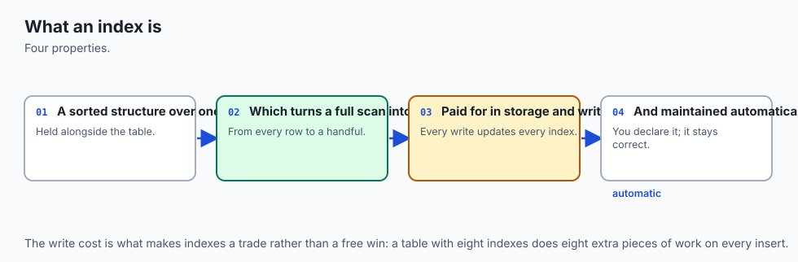
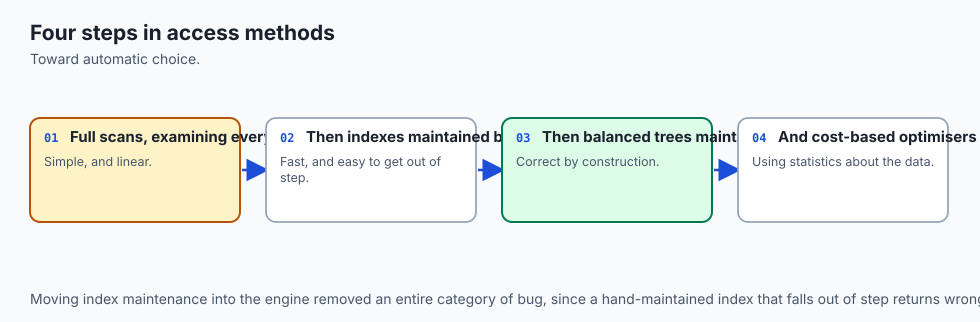
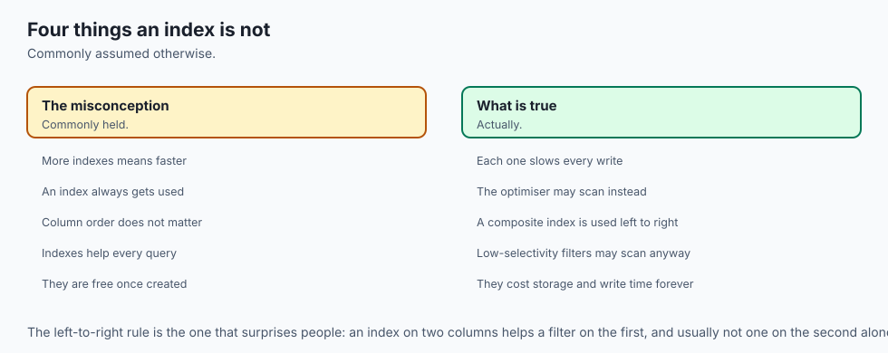
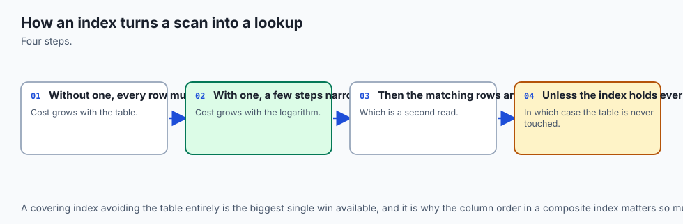
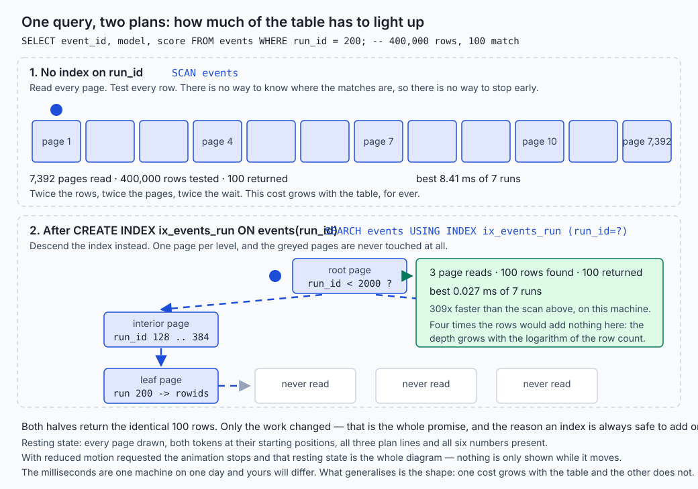
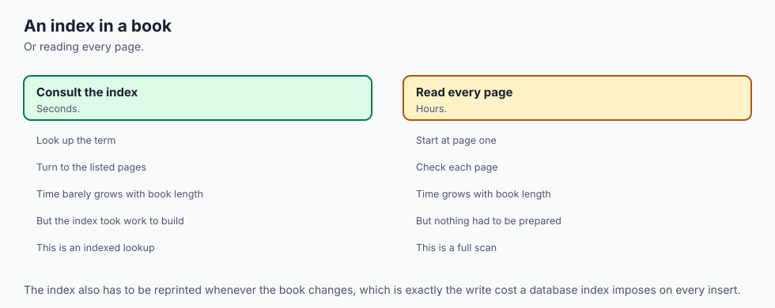
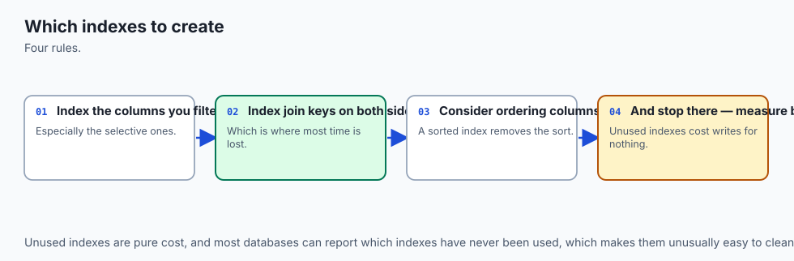
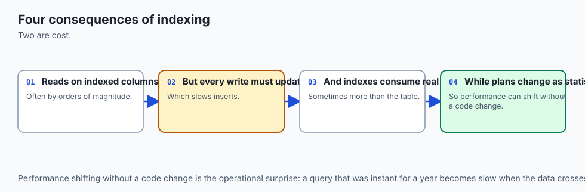
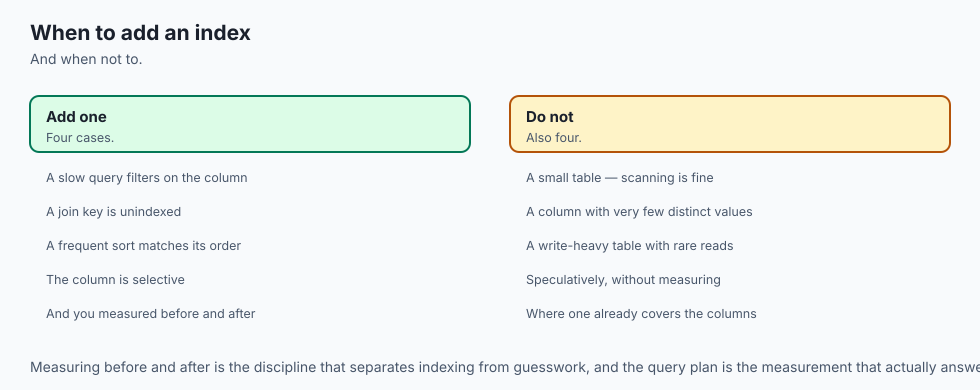

## Why this matters

Four days ago you built a database with six books in it and every query was instant. Today you build one with four hundred thousand rows in it, and one of the queries you already know how to write takes 8.41 milliseconds instead of 0.027. Same query. Same answer. Three hundred times the work.

That is the whole of today, and it is the moment most people's relationship with databases quietly goes wrong. A query that was fine in development becomes a query that is not fine in production, nobody can point at what changed, and the fix turns into folklore: someone says "add an index", someone else says "too many indexes are slow", and both are repeating something they have never measured.

So today you measure. Here is the central result from this lesson's lab, on the authoring machine, offline, from `examples/lookup.py`:

```text
     rows |  scan best |  seek best |   faster |  scan median |  seek median | matched
--------------------------------------------------------------------------------------
   25,000 |       0.31 |      0.028 |      11x |         0.31 |        0.028 |     100
  100,000 |       1.96 |      0.027 |      73x |         2.06 |        0.028 |     100
  200,000 |       4.13 |      0.028 |     149x |         4.16 |        0.029 |     100
  400,000 |       8.41 |      0.027 |     309x |         8.47 |        0.029 |     100
```

Read the columns rather than the digits. The scan column doubles when the table doubles, and will keep doubling for as long as you keep adding rows. The seek column does not move. That gap is not a constant factor you can plan around; it is a gap that widens for ever, and the only thing that decided which column your query lands in was one line of SQL nobody had written yet.

The `matched` column is the other half of the point. **100, every time.** Adding the index changed the amount of work and did not change a single row of the answer. That is what makes indexes safe to add and safe to drop, and it is why this is one of the very few performance topics where the right move is genuinely reversible.

This matters to your AI work sooner than you would guess. A retrieval system that cannot find the right thousand rows quickly is a retrieval system nobody uses, and the "find the right thousand" step is almost never pure vector similarity — it is similarity plus a filter on tenant, permission, document, date or language. Those filters are `WHERE` clauses over ordinary columns, and whether they are answered by a seek or by a scan of every embedding you own is decided by exactly the material below.

## The idea in plain language



An index is **a second, sorted copy of one or more of your columns, kept alongside the table, with a pointer back to the full row**.

That sentence contains everything. Take it apart.

**A copy.** The values are already in the table; the index does not move them or replace them. It duplicates them. This is why an index costs disk space, why it makes writes slower, and why dropping one loses no information at all.

**Sorted.** This is the part that does the work. The table is stored in whatever order the rows arrived. The index is stored in order of the column you named. Something sorted can be searched by halving: look at the middle, decide which half contains what you want, throw the other half away, repeat. Something unsorted can only be searched by looking at all of it.

**A pointer back.** An index on `run_id` holds pairs — a `run_id` and a `rowid` that identifies the full row. Find the key in the index and the rowid tells you where the rest of the row lives. Unless, and this is the best case, the index already contains every column your query asked for, in which case the trip back never happens.

Everything else today follows from those three words. Indexes make reads fast **because sorted things can be halved**. They make writes slower **because a copy has to be kept up to date**. They cost disk **because a copy is a copy**. And they are sometimes ignored by the engine **because a sorted list of values can only answer questions about those exact values** — ask about a function of them, or about a match whose beginning is unknown, and the ordering has nothing to offer.

Two words describe the two things that can happen when a query runs, and SQLite prints them for you:

- **SCAN** — walk the whole thing, testing every row. Cost grows with the size of the table.
- **SEARCH** — descend a tree to the rows that match. Cost grows with the *logarithm* of the size of the table, which is to say it barely grows at all.

Getting from the first to the second is the entire skill.

## Historical background



The problem is older than relational databases. Before 1970, files on mainframes were reached through **ISAM** — indexed sequential access method — which kept data in order and maintained a separate index to it, and which had the awkward property that inserting a record in the middle either shifted everything after it or went into an "overflow area" that got slower every year until somebody reorganised the file by hand.

The structure that fixed that was published in 1972 by **Rudolf Bayer** and **Edward M. McCreight**, working at Boeing's research laboratories, in a paper in the journal *Acta Informatica* describing what they called the **B-tree**. Its design goal was specific: keep a large ordered index on a disk, where a read means fetching a whole block, and keep it balanced through insertions and deletions without ever needing a rebuild. The trick is that every node is a whole block holding many keys rather than the two of a binary tree, and that the tree grows at the *root* rather than at the leaves, so every leaf stays the same distance from the top. Bayer and McCreight never settled the question of what the B stands for, and it is still argued about.

The B-tree is one of the most durable pieces of engineering in computing. SQLite, PostgreSQL, MySQL's InnoDB, and the filesystems underneath all of them use it or a close variant, more than fifty years on.

The second half of today's material — the engine deciding *whether* to use your index — arrived with **System R**, the same IBM project that produced SQL. In 1979, **Patricia Selinger** and colleagues published "Access Path Selection in a Relational Database Management System", which established that a database should not merely have indexes but should **estimate the cost of the alternatives and choose**. That paper invented the cost-based query optimizer, and every `EXPLAIN QUERY PLAN` you run today is a descendant of it. The reason your index is sometimes ignored is that the planner did the arithmetic and concluded that reading the whole table was cheaper — which is often correct, and is the behaviour Selinger's paper was written to produce.

The through-line back to Day 85 is Codd's **data independence**: you can change how data is stored without changing the programs that use it. An index is that promise in its purest form. You add a storage structure; no query changes; the answers are identical; the work is different.

## What it is — and what it is not



An **index** is a persistent, sorted, auxiliary data structure — in SQLite, a B-tree of the same 4,096-byte pages the table uses — that maps values of one or more columns to the rows containing them.

It is **not part of the data**. Drop every index in your database and you have lost nothing except speed. This is the property that makes today's material low-risk: an index is the only performance change you will make this year that cannot corrupt anything.

It is **not a hint**. You do not tell the engine to use an index; you create one and the planner decides. It may decide differently tomorrow, on the same query, because the data changed shape. That is by design.

It is **not free**. It costs pages on disk, and it costs time on every insert, update and delete that touches the columns it covers. On the authoring machine, five indexes made a bulk insert **11.7 times slower** and the file **2.4 times larger** for the same rows. Both figures are measured in the lab and neither shows up in the timings people usually look at.

It is **not a general speed control**. It makes lookups, ranges, sorts and joins on the indexed columns faster. It does nothing at all for a query that reads most of the table anyway, and reaching for one when your query genuinely needs all the rows is a way of adding cost without adding speed.

It is **not automatic in SQLite** beyond a specific, useful minimum: every ordinary table already has one index nobody typed, the **rowid** B-tree that *is* the table, and every `PRIMARY KEY` and `UNIQUE` constraint quietly creates one so it can enforce itself.

| It is | It is not |
| --- | --- |
| A second sorted copy of some columns, plus a rowid | A rearrangement of the table itself |
| A pure speed change: no answer moves | A change you have to test for correctness the way you would test a schema change |
| Something the planner may or may not use | An instruction the engine obeys |
| Paid for on every write, for ever | A one-off cost at creation time |
| Useful for equality, ranges, sorts, joins and prefixes | Useful for a function of the column, or a match with an unknown beginning |
| Reversible with one `DROP INDEX` | Something to be afraid of |

## Why it was created and what problems it solves

Each of the following is a real problem with a measured answer, and each one is a section of the lab.

**A lookup that grows with the table.** Without an index, `WHERE run_id = 200` reads all 7,392 pages and tests all 400,000 rows to return 100. That is `SCAN events`, and it takes 8.41 ms here. The index makes it three page reads and 0.027 ms — `SEARCH events USING INDEX ix_events_run`. The problem the index solves is not slowness; it is that the slowness *compounds*.

**A sort of everything to return twenty rows.** `ORDER BY created_on LIMIT 20` with no help produces this plan:

```text
SCAN events / USE TEMP B-TREE FOR ORDER BY
```

SQLite built a throwaway tree, sorted 400,000 rows into it, and handed back the first twenty. Measured: 13.978 ms. An index on `created_on` is already in that order, so there is nothing to sort — it walks twenty entries and stops. Measured: 0.007 ms.

**A trip back to the table you did not need.** If every column a query mentions is already in the index, the rowid pointer never has to be followed. The planner announces this in one word:

```text
SEARCH events USING COVERING INDEX ix_run_score (run_id=?)
```

**An index over rows nobody asks about.** In the lab's data, 39,598 of 400,000 rows have `status = 'failed'` — 9.9%. An index over all 400,000 `created_on` values costs 1,857 pages. A **partial** index, `CREATE INDEX ... ON events(created_on) WHERE status = 'failed'`, covers only those rows and costs **186 pages**: a tenth of the size, doing the whole job for the query that matters.

**Choosing between two usable indexes.** With indexes on both `run_id` (100 rows per distinct value) and `status` (133,334 rows per distinct value), only one of them is worth seeking. `ANALYZE` writes exactly those numbers into `sqlite_stat1` so the planner has facts rather than a guess.

## How it works




Read the diagram left to right, then down.

### The table is already a tree

In SQLite, an ordinary table **is** a B-tree keyed by `rowid` — a 64-bit integer SQLite assigns to every row unless you take it over by declaring a column `INTEGER PRIMARY KEY`, which makes that column the rowid rather than adding a second one. So a lookup by rowid is already a seek, today, with nothing created. That is why `WHERE event_id = 123456` on an `INTEGER PRIMARY KEY` is instant on any table of any size, and why the first question to ask about a slow lookup is whether it could have been by primary key.

A **scan** walks the leaf pages of that tree in order, reading each 4,096-byte page and testing every row on it. The lab's table is 7,392 pages, so a scan is 7,392 page reads and 400,000 comparisons, whether the answer is one row or all of them.

### The index is a second tree

`CREATE INDEX ix_run ON events(run_id)` builds another B-tree. Its keys are `(run_id, rowid)` pairs, sorted, and it holds nothing else — no model, no status, no score. On the lab's data it cost **1,070 pages, 4,382,720 bytes, 14% of the table**.

A **seek** starts at the root page of that tree, compares the value it wants against the keys there, follows one pointer to one child page, and repeats. It reads one page per level.

### Why the depth grows so slowly

This is the arithmetic that makes the whole thing work, and it is worth doing rather than accepting.

A page is 4,096 bytes. An index entry on an integer column is small — call it roughly 100 entries per page, which is the right order for this data. Then:

| Levels | Entries reachable | Page reads for a seek |
| --- | --- | --- |
| 1 | 100 | 1 |
| 2 | 10,000 | 2 |
| 3 | 1,000,000 | 3 |
| 4 | 100,000,000 | 4 |

**Fan-out** is that "roughly 100": how many children a node has. Because the tree branches a hundred ways at every level rather than two, a hundredfold increase in rows adds a *single* page read. A million rows is three or four reads. A hundred million rows is four or five. This is why the seek column in the opening table refused to move, and why it will keep refusing.

Compare that with the scan, whose cost is the row count divided by rows per page, with no logarithm anywhere in it.

### Watching one query take both routes



The picture is the measurement. Above, the whole table has to light up. Below, three pages do.

`EXPLAIN QUERY PLAN` is how you find out which one you are getting, and it costs nothing to run — it plans the query and prints the plan instead of executing it:

```sql
EXPLAIN QUERY PLAN
SELECT event_id, model, score FROM events WHERE run_id = 200;
```

```text
QUERY PLAN
`--SCAN events
```

```text
QUERY PLAN
`--SEARCH events USING INDEX ix_events_run (run_id=?)
```

**Read the first word, not the index name.** This is the single most common misreading in the whole topic, and today's lab contains a real example of it:

```text
SCAN events USING COVERING INDEX ix_run_status
```

That plan names an index. It is still a scan — the planner decided the index was a narrower thing to walk end to end than the table, which is a real improvement (7.281 ms against about 13) and is still linear in the number of rows. Only `SEARCH` means a descent.

### Composite indexes and the leftmost prefix

An index on `(run_id, status)` is sorted by `run_id` first, and by `status` only *within* one `run_id`. That single fact determines everything it can and cannot do. From the lab, one index and four queries:

| Query | Plan | Time (best of 7) |
| --- | --- | --- |
| `WHERE run_id = ? AND status = ?` | `SEARCH ... (run_id=? AND status=?)` | 0.004 ms |
| `WHERE run_id = ?` | `SEARCH ... (run_id=?)` | 0.004 ms |
| `WHERE status = ?` | `SCAN events USING COVERING INDEX` | 7.281 ms |
| `WHERE status = ? AND run_id = ?` | `SEARCH ... (run_id=? AND status=?)` | 0.004 ms |

The first and last are the same query written in two orders, and they get the same plan: **the order you write conditions in `WHERE` is irrelevant.** The order of *columns in the index* is what decides. The third can seek on nothing, because a list of pairs sorted by the first value tells you nothing about where the second value's matches are.

The rule that follows is called the **leftmost prefix**: an index on `(a, b, c)` can serve queries on `a`, on `(a, b)` and on `(a, b, c)`, and cannot seek on `b`, on `c`, or on `(b, c)`.

### When an index is present and unusable

Five real cases from the lab, all with the index sitting right there.

| Query shape | Plan | Best | Fix |
| --- | --- | --- | --- |
| `WHERE trace_id = ?` | `SEARCH` | 0.003 ms | — the baseline |
| `WHERE lower(trace_id) = ?` | `SCAN` | 24.608 ms | an index on `lower(trace_id)` — then 0.004 ms |
| `WHERE substr(trace_id, 4) = ?` | `SCAN` | 12.946 ms | an expression index, or store that part as a column |
| `WHERE trace_id LIKE '%080-72'` | `SCAN` | 13.384 ms | none; reverse the column, or use full-text search |
| `WHERE run_id = ? OR score > ?` | `SCAN events` | 12.896 ms | index every branch, or rewrite as `UNION` |

The cause is the same in each: an index holds the column's values, and the query asked about something else — a transformed value, a match with an unknown beginning, a condition with an unindexed alternative.

Two of these deserve the honest version rather than the folklore.

**A prefix `LIKE` also scans, by default.** `WHERE trace_id LIKE 'tr-40708%'` looks bracketable and takes 9.447 ms anyway, because SQLite's `LIKE` is case-insensitive by default while an ordinary index is sorted in binary order, and a case-insensitive match cannot be answered from a case-sensitive ordering. Write it as the range it really is and it seeks in 0.004 ms:

```sql
WHERE trace_id >= 'tr-40708' AND trace_id < 'tr-40709'
```

Or set `PRAGMA case_sensitive_like = ON` and the planner performs precisely that rewrite by itself.

**`OR` is not automatically fatal.** When every branch has an index, SQLite runs each and merges the results:

```text
MULTI-INDEX OR / INDEX 1 / SEARCH events USING INDEX ix_run (run_id=?)
               / INDEX 2 / SEARCH events USING INDEX ix_trace (trace_id=?)
```

That took 0.019 ms. One unindexed branch and the whole thing collapses to a scan, because a row failing the indexed test might still pass the other one. **An `OR` is only as indexed as its worst branch.**

### Selectivity, cardinality, and what `ANALYZE` writes down

**Cardinality** is how many distinct values a column has. **Selectivity** is the consequence: how many rows the average distinct value matches. `ANALYZE` measures both and writes them into a table called `sqlite_stat1`:

```text
ix_run         400,000 rows, about     100 rows per distinct value
ix_status      400,000 rows, about 133,334 rows per distinct value
```

That second number is why an index on `status` is close to useless for `WHERE status = 'ok'`. Seeking would find a third of the table and then make a third of a million jumps back into it for the rest of each row — genuinely more expensive than reading the table straight through. The planner declining your index is usually the planner being right.

Be honest about what `ANALYZE` did in this lab: **nothing visible**. The plan was the same before and after, because SQLite's built-in heuristic had already picked the more selective of the two indexes on this evenly distributed data. `ANALYZE` replaced a good guess with a measured number. It earns its keep on skewed data and on tables whose shape changed after their indexes were built — run it after a big load, and check whether anything moved rather than assuming it did.

### Building the idea from scratch

Before any of that, the same idea in fifteen lines of Python, because a claim about B-trees is easier to believe once you have watched a list behave the same way. `examples/scan_vs_bisect.py` finds a value two ways:

```python
def scan(data, target):
    """A table scan: look at every element until you find it."""
    for position, value in enumerate(data):
        if value == target:
            return position
    return -1


def seek(data, target):
    """An index seek: binary search over the same values, kept sorted."""
    position = bisect.bisect_left(data, target)
    if position < len(data) and data[position] == target:
        return position
    return -1
```

Both answer identically — the script raises if they ever disagree — and it counts comparisons as well as timing them, because the count is the same on every machine in every year while the microseconds are not:

```text
          n |   scan us | bisect us |   faster |  scan steps | bisect steps | log2(n)
-------------------------------------------------------------------------------------
      1,000 |      6.05 |     0.131 |      46x |         494 |         10.0 |    10.0
     10,000 |     67.33 |     0.176 |     383x |       5,027 |         13.4 |    13.3
    100,000 |    651.39 |     0.261 |    2497x |      49,460 |         16.7 |    16.6
  1,000,000 |   7978.41 |     1.027 |    7768x |     605,052 |         19.9 |    19.9
```

A thousand times the data costs the scan **1,225 times** the steps and costs the binary search **twice**: ten comparisons became twenty. The bisect column tracks `log2(n)` to within a rounding error, because that is what it is. Everything a B-tree adds on top of this — pages, fan-out, staying balanced through inserts — is about making it work on a disk. The shape was already here.

## An everyday analogy



Think of **a thick reference book with an index at the back**.

The **body of the book** is the table. It is in the order the author wrote it, which is a real order but not one that helps you find the word "hysteresis". Finding it by reading is a scan: you start at page one and you keep going, and a book twice as long takes twice as long.

The **index at the back** is the index. Every fact in it is already in the body — remove the index and the book still contains everything it contained — and it is **sorted**, alphabetically, which the body is not. You find "hysteresis" by opening roughly where the Hs are, then narrowing, in a handful of glances rather than nine hundred page turns. Then the entry gives you **page 412**, and 412 is the rowid: the way back to where the actual content lives.

The rest follows without strain.

**A covering index** is an index entry that already tells you what you wanted. "Hysteresis, magnetic — *see also* Barkhausen effect, p. 412". If your question was only "what is this related to", you have your answer and you never turn to page 412. This is the fastest case in a database for exactly the same reason: the trip to the table did not happen.

**The leftmost prefix** is a catalogue sorted by surname, then forename. You can find every Lovelace instantly, and every Lovelace, Ada instantly. You cannot find every Ada, because the Adas are scattered one to a surname through the whole drawer. Nothing is wrong with the catalogue; you asked it a question its ordering does not answer.

**A partial index** is a separate short index of just the illustrations. It is a fraction of the size, it answers "which page has the diagram of a B-tree" perfectly, and it is no use whatsoever for finding a word in the text. That is not a defect: it is what you asked for, at a tenth of the paper.

**A function on the column** is looking up a word you have translated. The index is in English; you are searching for the German. The book cannot help, however carefully it was indexed, and the fix is either to search in English or to bind a German index into the back as well.

**The write cost** is the part people forget, and the analogy makes it obvious. Add a paragraph to page 300, and every index at the back that mentions anything in that paragraph has to be corrected. One index, a small chore. Five indexes, five chores, on every edit, for ever. Measured in the lab: **11.7 times slower** to insert the same 100,000 rows with five indexes present.

And the honest limit of the analogy: a book's index is written once and printed, while a database's index is maintained live, transactionally, on every write, and stays correct even if the machine loses power halfway through. That maintenance is the entire cost — and the entire reason you can trust it.

## Examples in practice



Everything below is a real capture from today's lab, on the authoring machine, offline, with no third-party package involved.

**Check what you are running first.** The query planner lives inside the SQLite library, so which library you are using can change which plan you get:

```text
$ sqlite3 --version
3.51.0 2025-06-12 13:14:41 f0ca7bba1c5e232e5d279fad6338121ab55af0c8c68c84cdfb18ba5114dcaapl (64-bit)

$ python3 -c "import sqlite3; print(sqlite3.sqlite_version)"
3.53.3
```

Two different SQLite libraries on one machine, as on Day 85, and still not a misconfiguration. The lab's suite reports both and deliberately does not assert they are equal.

**The table under test**, from `examples/generate.py`:

```text
built events.db
  rows:            400,000
  distinct run_id: 4,000 (100 events each)
  page size:       4,096 bytes
  pages:           7,392
  file size:       30,277,632 bytes
  named indexes:   none — that is on purpose
```

**One index, four sizes** — the table at the top of this lesson. And a detail worth having: the lab drops the index and re-times the scan afterwards, because the indexed run has an unfair advantage from the pages the scan just warmed:

```text
     25,000 rows: first     0.31 ms | after dropping the index     0.32 ms
    400,000 rows: first     8.41 ms | after dropping the index     8.31 ms
```

Close enough that the comparison was fair. A measurement you have not tried to break is not evidence.

**The sort that disappears:**

```text
  no index on created_on
    plan : [SCAN] SCAN events / USE TEMP B-TREE FOR ORDER BY
    time : best    13.978 ms
  with an index on created_on
    plan : [SCAN] SCAN events USING COVERING INDEX ix_created
    time : best     0.007 ms
```

Note that the second plan is still labelled a scan — of twenty entries, because of the `LIMIT`. The temporary B-tree is what vanished, and it was doing all the work.

**The partial index, in pages:**

```text
  rows in the table        : 400,000
  rows the partial covers  : 39,598 (9.9%)
  a full index on created_on costs 1,857 pages (7,606,272 bytes)
  the partial index costs          186 pages (761,856 bytes)
```

**The bill for all of it**, from `examples/write_cost.py` — two identical 100,000-row tables, one given five indexes, then the same further 100,000 rows inserted into each, three trials apiece:

```text
configuration    | indexes |   best ms |  median ms |  worst ms
---------------------------------------------------------------
bare             |       0 |      53.9 |       54.0 |      54.1
indexed          |       5 |     632.3 |      642.5 |     658.4
```

11.7 times slower to write, and the file 2.4 times larger for the same rows. **Read that next to the read measurements, not instead of them.** An index that turns a 9 ms scan into a 0.03 ms seek on a query you run a thousand times an hour obviously earns a slower insert. An index nothing queries is pure cost, paid on every write, for ever, and it will never appear in any timing you are looking at.

**And the whole thing behind one command:**

```text
40 checks, 0 failure(s).
```

None of those forty checks asserts a millisecond figure — which is a lesson in itself, and the next section of the lab README explains why.

## Implications: security, privacy, performance, scalability, and cost



**Security.** The item people miss: **an index is a copy of your data.** `CREATE INDEX ix_email ON members(email)` writes every address in the table into a second sorted structure inside the same file. So scrubbing a column is not enough if an index over it survives; an expression index on `lower(email)` or `substr(card, -4)` stores whatever that expression computed, in the clear; and a partial index is a compact, sorted list of exactly the rows it covers, which is useful and is also a tidy summary of something you may not want summarised. Retention policies apply to indexes, and `DROP INDEX` then `VACUUM` is the sequence that actually removes the bytes. Beyond that: values as parameters, never string-built SQL — and note that parameters cannot name identifiers, so `CREATE INDEX ... ON events(?)` is impossible and a runtime column name must be validated against an allow-list you wrote. Never let untrusted input trigger a `CREATE INDEX`; it is a schema change, it is not cheap, and an endpoint that lets a stranger start one is a denial-of-service tool.

**Privacy.** The same argument as Day 85, sharpened. An index makes a question cheap, and cheap questions get asked. "Which users did X" is a policy decision when it takes ten seconds and a habit when it takes a millisecond. Index the queries your product needs; notice when you are indexing a query whose only purpose is to make surveillance convenient. And one timing note worth knowing before you build something that answers untrusted queries: if an attacker can time your answers, the difference between a seek and a scan can leak what your data contains.

**Performance.** Three things generalise from today. First, the shapes: scan cost grows with the table, seek cost grows with its logarithm, and the gap widens for ever. Second, **measure before and after, with more than one run**, and report best and median together — if the spread is bigger than the difference you are claiming, you have measured your laptop. Third, `EXPLAIN QUERY PLAN` before you optimise anything: the most common cause of an index that did not help is an index that was never used, and it takes one command to find out.

**Scalability.** Indexes are what let a table keep growing without every query getting slower, and they are not what lets a table grow without limit. The write cost is real and compounds: a table with a dozen indexes has a dozen structures to update on every insert, and in SQLite, where there is one writer at a time for the whole database, a slow write is felt by everything else. There is a point — usually somewhere in the tens of millions of rows on one machine — where the answer stops being another index and starts being partitioning, archiving old rows, or a different engine. Notice when you are adding the fifth index to the same table; that is usually the signal that the schema or the query is the problem.

**Cost.** Indexes cost disk and write throughput, and both are measurable today rather than in production next quarter — the lab gives you both numbers on your own machine. In a managed or cloud database those become line items: storage you rent, and write capacity you are billed for. SQLite itself is free and public domain; PostgreSQL, MySQL, MariaDB and DuckDB are all free and open source, and their index features cost nothing extra. Managed services and commercial engines charge on models that change often enough that any figure printed in a lesson may already be wrong: **read the vendor's current pricing page rather than trusting this one.**

## Alternatives: free, open source, and commercial

SQLite gives you one kind of index and does it well. The alternatives below matter because they answer "which index" differently, and because one of them answers it with "none".

| Option | What its indexing looks like | When to choose it | Cost |
| --- | --- | --- | --- |
| SQLite | One B-tree index type; partial, expression, covering, `UNIQUE`; `EXPLAIN QUERY PLAN` | One machine, one application; you want the whole story in one file | Free; public domain |
| PostgreSQL | Several index types — B-tree, hash, GIN, GiST, BRIN — plus `EXPLAIN ANALYZE` | The query shapes are varied: text search, arrays, JSON, geometry, ranges | Free and open source |
| MySQL / InnoDB | B-tree, with the table itself clustered on the primary key | The stack already assumes it; range scans by primary key dominate | Free and open source |
| DuckDB | Columnar storage with zone maps; usually no index at all | Analytical questions over millions of rows on one machine | Free and open source |
| Vector indexes | Approximate nearest-neighbour structures over embeddings | Similarity search, alongside — not instead of — the above | Varies; free libraries and paid services both exist |

**SQLite.** Choose it for everything this course has been building: one application, one machine, a file you can hand to somebody. Its index toolkit is smaller than PostgreSQL's and covers the great majority of real needs. How to use it:

```sql
CREATE INDEX ix_events_run ON events(run_id);
EXPLAIN QUERY PLAN SELECT * FROM events WHERE run_id = 200;
```

Concretely: today's entire lab. Move past it when several machines must write, or when your queries need an index type it does not have. Free, and in the public domain, so there is nothing to comply with.

**PostgreSQL.** The reason to reach for it here is that **one index type is not always the right one**. A B-tree is the general answer; a **GIN** index is built for values that contain many searchable items, which is what makes full-text search and JSON containment fast; a **GiST** index supports geometric and range queries where "close to" and "overlaps" are the operations; **BRIN** is a tiny index for enormous tables whose rows arrive roughly in order of the indexed column; a **hash** index does equality only, and does it in one step. Its other advantage is diagnostic: `EXPLAIN ANALYZE` does not merely print the plan, it *runs* the query and reports estimated against actual row counts at every step — which is how you discover that the planner's estimate was wrong, something `EXPLAIN QUERY PLAN` cannot tell you. How to use it:

```sql
EXPLAIN ANALYZE SELECT * FROM events WHERE run_id = 200;
CREATE INDEX ix_events_tags ON events USING GIN (tags);
```

Concretely: a table of documents where you need both `WHERE tenant_id = ?` and full-text search over the body — two index types, one table. Free and open source under the PostgreSQL Licence; the cost is operational, since you are running a server.

**MySQL and MariaDB.** The distinctive fact is that InnoDB **clusters the table on its primary key**: the rows are physically stored in primary-key order inside the primary key's B-tree, which is closer to SQLite's rowid table than it first appears. The consequence is worth knowing — a secondary index stores the *primary key*, not a physical pointer, so every secondary-index lookup that needs more columns costs a second descent through the primary key's tree, and a wide primary key makes every secondary index bigger. `EXPLAIN` is the diagnostic, and its `type`, `key` and `rows` columns are the ones to read. How to use it:

```sql
EXPLAIN SELECT * FROM events WHERE run_id = 200;
CREATE INDEX ix_events_run ON events (run_id);
```

Concretely: a busy application on shared hosting where MySQL is what the host provides, and where choosing a compact primary key is the single highest-leverage schema decision. Free and open source; MySQL is also sold under a commercial licence, which matters if you distribute it inside a product.

**DuckDB.** The most interesting entry, because for many questions its answer to "which index should I create" is **none, and you should stop worrying about it**. DuckDB stores data by column rather than by row, so a query that touches three columns of a forty-column table reads only those three. It keeps **zone maps** — min and max values per block of rows — which let it skip entire blocks without any index at all: if a block's `created_on` runs from January to March and you asked for June, the block is never read. That is not a seek and it is not a scan of everything; it is a scan with most of the work skipped, and for analytical queries it is frequently better than either. How to use it:

```sql
SELECT model, count(*), avg(score) FROM events GROUP BY model;
```

No index, no plan to tune. Concretely: computing statistics over an evaluation log of tens of millions of rows on a laptop. Choose SQLite instead when the workload is transactional — many small reads and writes touching whole rows. The rule from Day 85 holds: SQLite for the application, DuckDB for the analysis. Free and open source under the MIT Licence.

**Vector indexes.** An honest forward reference rather than a summary, because this course covers them properly later. A vector index solves the same problem as everything above — do not look at all of them — for a different question: not "which rows equal this value" but "which rows are *nearest* this point in a few hundred or a few thousand dimensions". The structures are different because the question is different, and most of them are *approximate*: they trade a small chance of missing a true nearest neighbour for an enormous reduction in work, which is a trade a B-tree never makes. What carries over from today is the part that matters most in practice: a real retrieval query is a similarity search **and** a filter on tenant, permission, date or document, and the filter is an ordinary `WHERE` clause that wants an ordinary index. Systems doing this well are usually relational databases with vector search added, rather than the reverse. Free libraries and open-source engines exist, and so do paid managed services; costs and capabilities are moving quickly enough that quoting either here would be inventing detail.

## Comparison with related concepts

| Concept A | Concept B | Key difference |
| --- | --- | --- |
| SCAN | SEARCH | The two words `EXPLAIN QUERY PLAN` uses. `SCAN` walks everything; `SEARCH` descends to the matches. `SCAN ... USING INDEX` is still a scan |
| Index | Constraint | A `UNIQUE` constraint changes which writes are allowed and creates an index to enforce itself. An ordinary index changes only how long a read takes |
| Index | The table | In SQLite the table is itself a B-tree, keyed by rowid. An index is a second one, keyed by your columns |
| rowid | `INTEGER PRIMARY KEY` | Declaring a column `INTEGER PRIMARY KEY` makes it *become* the rowid rather than adding a second key. Any other primary key type creates a separate index |
| Covering index | Ordinary index | A covering index contains every column the query mentioned, so the rowid pointer is never followed and the table is never opened |
| Composite index | Two single-column indexes | One index on `(a, b)` can seek on `a` and on `(a, b)`. Two separate indexes can each seek on their own column, and SQLite will generally use one of them, not both |
| Leftmost prefix | Condition order in `WHERE` | The order of columns in the index decides what it can serve. The order of conditions in the query is irrelevant |
| Partial index | Full index | A partial index covers only rows matching its own `WHERE` clause: far smaller, and unusable for a query the planner cannot prove falls inside it |
| Expression index | Column index | An index on `lower(x)` stores the lowercased values. The query must use the same expression, character for character in meaning |
| Selectivity | Cardinality | Cardinality is how many distinct values a column has; selectivity is how many rows the average one matches. High cardinality means high selectivity means an index worth using |
| `ANALYZE` | `VACUUM` | `ANALYZE` measures your data and writes statistics for the planner. `VACUUM` rebuilds the file to reclaim space. Different jobs entirely |
| `EXPLAIN QUERY PLAN` | `EXPLAIN` | The first prints the plan in human-readable form. The second prints SQLite's actual bytecode, which is a debugging tool for the engine rather than for you |
| B-tree | Binary tree | A binary tree node has two children; a B-tree node is a whole disk page with many. That is why the B-tree's depth grows so slowly and why it was invented for disks |
| Index seek | Table scan with a `LIMIT` | A `LIMIT` stops early only if the rows are already in the order you asked for. Without an index, `ORDER BY ... LIMIT 20` still sorts everything first |
| Read cost | Write cost | Every index trades the second for the first. Measured here: 309x faster on one read, 11.7x slower on a bulk insert |

## When to use it — and when not to



**Add an index when** a query you actually run appears as `SCAN` in its plan, the table is large enough for that to matter, and the condition is selective — it picks out a small fraction of the rows. Those three together, not any one alone.

**Add one without hesitation** for a foreign key column you join or filter on, for a column you frequently sort by with a `LIMIT`, and for any column you look rows up by one at a time. Those are the cases that pay reliably.

**Do not add one when** the table is small, when the query returns most of the table anyway, when the column has few distinct values, or — most commonly — when you have not looked at the plan and are guessing. An index added on a hunch is a permanent write cost bought with no evidence.

| Signal | Add the index | Leave it alone |
| --- | --- | --- |
| Plan for a real query | `SCAN` on a large table | Already `SEARCH`, or the table is tiny |
| Rows returned | A small fraction of the table | Most of it |
| Distinct values in the column | Many — high cardinality | Two or three |
| How often the query runs | Constantly, or in a user-facing path | Once a month in a report you can wait for |
| Write volume on the table | Modest, or reads dominate | Write-heavy, and this index serves nothing |
| Evidence | You measured before and after | Somebody suggested it |

**When not to reach for an index at all.** If the query needs every row, no index will help and the honest answers are a better query, fewer columns, a summary table, or a columnar engine like DuckDB. If the slowness is a leading-wildcard text search, you need full-text search rather than a B-tree — SQLite ships FTS5 for exactly that. If it is similarity over embeddings, you need a vector index, which is a different structure for a different question. And if you are on the fifth index for one table, the problem is probably the schema or the query and not the absence of a sixth.

**The judgement, stated plainly.** Indexes are not free and the right number is not "as many as possible" or "as few as possible" — it is **the ones your real queries need, and no others**. That number is discoverable, on your own machine, in about a minute, with `EXPLAIN QUERY PLAN` and a timer. Everything else is opinion.

### Where this goes next in AI work

The retrieval half of retrieval-augmented generation is a query, and the part of it that decides whether the system is usable is rarely the model. It is whether the right thousand rows can be found quickly.

Consider the shape of a real retrieval call: find chunks similar to this question, **belonging to this tenant, that this user may read, from documents not archived, written after this date**. The similarity part is a vector index. Every other clause is a `WHERE` over ordinary columns, and it is exactly today's material — a composite index on `(tenant_id, archived, created_on)` that seeks, or a scan of every embedding you own that does not. Filter first and the vector search runs over thousands of candidates; filter afterwards and it runs over millions and then throws most of the work away.

The same applies to everything around the model. An evaluation log you compare week over week is `WHERE run_id = ?` — the query measured all through this lesson. A deduplicated fine-tuning corpus is a `UNIQUE` index doing its job on every insert. "Which documents have I already embedded?" is a primary-key lookup, and getting it wrong means paying for the same inference twice, which is a line on an invoice rather than a few milliseconds.

And the vector index you meet later is this idea with a different distance function. The question changes from "where is this exact value in a sorted list" to "what is near this point in a space with hundreds of dimensions", and the answer is still: build a structure that lets you avoid looking at all of them. You have now built that structure twice — once with `bisect` over a list, once with `CREATE INDEX` over four hundred thousand rows — and measured both. The third time will not be mysterious.

## The AI connection

- **Indexes are the difference between a query taking milliseconds and minutes**, at the same
  data size.
- **Every index speeds reads and slows writes**, which makes them a deliberate trade rather
  than a default.
- **Reading a query plan** is the skill that turns performance work from guessing into
  diagnosis.
- **Vector indexes follow the same logic**, trading build cost and write speed for query
  speed.
- **An unindexed join on a large table** is the single most common cause of a slow data
  pipeline.

## Knowledge check

Try these from memory before looking back:

1. Define an index in one sentence containing the words "copy", "sorted" and "pointer", then use that sentence to explain why an index makes reads faster, makes writes slower, and costs disk.
2. What is the difference between `SCAN` and `SEARCH` in a query plan? What does `SCAN events USING COVERING INDEX ix_trace` mean, and why is it the most commonly misread line in the whole topic?
3. A table has a million rows and an index with a fan-out of about 100. How many page reads does a seek cost, and how many does a scan cost? What happens to each number when the table reaches a hundred million rows?
4. State the leftmost-prefix rule. Given one index on `(a, b, c)`, say which of these can seek and which cannot: `WHERE a = ?`; `WHERE b = ?`; `WHERE a = ? AND c = ?`; `WHERE c = ? AND b = ? AND a = ?`.
5. What makes an index "covering", what does the planner print when it happens, and why is it the fastest case? Name one reason to add a column to an index that you never filter on.
6. Give four reasons a present index goes unused, and the fix for each where one exists. Which of the four has no fix, and what do you use instead?
7. Explain selectivity and cardinality, and why an index on a column with three distinct values is usually worse than reading the table. What does `ANALYZE` write, where does it write it, and what did it change in this lesson's lab?
8. You have measured a query at 8.41 ms before an index and 0.027 ms after. Name three reasons that number might not reproduce on somebody else's machine, and state what generalises instead.
9. Why does this lesson's test suite refuse to assert any millisecond figure, and what does it assert in place of one?

## Hands-on exercise

Generate a large table, measure it, index it, measure it again — and believe nothing you did not time. The Day 89 lab builds 400,000 seeded rows, times the same lookup at four table sizes with and without an index, proves the leftmost-prefix rule query by query, builds a covering index and a partial index, makes an index unusable five different ways, and measures what all of it cost on the way in.

There is nothing to install. Check what you have, and read both numbers:

```bash
sqlite3 --version
python3 -c "import sqlite3; print(sqlite3.sqlite_version)"
```

Run the whole harness first:

```bash
bash tests/run_tests.sh
echo "exit code: $?"
```

Then work through it by hand, in a scratch copy:

```bash
mkdir -p scratch && cp examples/* scratch/ && cd scratch

python3 scan_vs_bisect.py         # the idea, with no database in sight
python3 generate.py events.db     # 400,000 rows, deliberately un-indexed
ls -l events.db

python3 lookup.py events.db       # the central measurement, four table sizes
python3 composite.py events.db    # prefix, covering, ORDER BY, partial, ANALYZE
python3 blocked.py events.db      # five ways to make an index unusable
python3 write_cost.py             # and what all of it cost on the way in

sqlite3 events.db < plans.sql     # the same story in the shell
```

Then build it yourself. `starter/measure.py` ships with five numbered exercises — best and median, a timing helper that runs a query more than once, an `EXPLAIN QUERY PLAN` helper, the `is_seek` check that must not be fooled by a plan naming your index, and the `CREATE INDEX` itself. `starter/indexes.sql` has six: the single-column index, the composite one and its prefix rule, the covering one, the one that removes a sort, the partial one, and the expression index that rescues a wrapped column. Each names the check in `tests/run_tests.sh` that will confirm it.

### Expected output

The harness ends with a real captured line:

```text
40 checks, 0 failure(s).
```

`lookup.py` prints `matched` of 100 at all four table sizes, with the scan column growing roughly in step with the table — 0.31, 1.96, 4.13, 8.41 ms — and the seek column flat at about 0.027 ms. `scan_vs_bisect.py` prints bisect step counts of 10.0, 13.4, 16.7 and 19.9 against `log2(n)` of 10.0, 13.3, 16.6 and 19.9; those are counted rather than timed, so they must match on your machine too. `composite.py` shows the composite index seeking for `run_id` alone and **scanning** for `status` alone, a partial index at 186 pages against a full one at 1,857, and `ix_run` at about 100 rows per distinct value against `ix_status` at 133,334. `blocked.py` shows `lower(trace_id) = ?` scanning at 24.608 ms and seeking at 0.004 ms once an expression index exists. `write_cost.py` reports the five-index insert as 11.7 times slower and the file 2.4 times larger.

**Your milliseconds will differ from all of those.** The plans, the row counts, the page counts and the step counts will not.

### Validate your work

1. `bash tests/run_tests.sh` ends with `40 checks, 0 failure(s).` and exits 0.
2. Both version commands print a `3.x` number; they need not print the same one.
3. In `lookup.py`, `matched` is 100 at every size, the scan column grows with the table, and the seek column does not.
4. The plan before the index contains `SCAN events`; after it, `SEARCH events USING INDEX ix_events_run (run_id=?)`.
5. The composite index seeks for both columns and for the leading column alone, and scans for the trailing column alone.
6. `SELECT score FROM events WHERE run_id = ?` reports `COVERING INDEX` once the index is `(run_id, score)`.
7. `USE TEMP B-TREE FOR ORDER BY` is present without an index on `created_on` and absent with one.
8. The partial index costs 186 pages against 1,857 for the full one, and is not used for the same date range without `status = 'failed'`.
9. `python3 write_cost.py` reports the indexed insert several times slower and the file several times larger.
10. `python3 measure.py mine.db` exits non-zero and names the next exercise until all five are done.
11. `find . -name "*.db"` inside the lab finds nothing after cleanup.

### Troubleshooting

The lab's `troubleshooting.md` has the full list. The five you are most likely to meet: **your numbers not matching the captures**, which is expected and is what `expected-output/FIELDS.md` exists to sort out; **a plan naming your index that is still slow**, which means you read the index name instead of the first word — `SCAN ...

USING INDEX` is still a walk over everything; **an index that changed nothing**, which is a function around the column, the wrong leading column, a leading wildcard, one bare branch of an `OR`, a partial index the planner cannot prove applies, or a column too unselective to be worth seeking; **a difference too small to see**, which is nearly always a table under about 50,000 rows or a machine too busy — look at the `spread` figure beside every timing; and **`no such table: events`**, which means `sqlite3.connect` created an empty database next door because the path was relative.

### Common mistakes

- **Reading the index name instead of the first word of the plan.** `SCAN events USING COVERING INDEX ix_trace` is a scan. Only `SEARCH` is a seek.
- **Timing one run.** One sample on a real machine measures the machine. Run it several times and report best and median together; if the spread swamps the difference, you have not shown anything.
- **Forgetting `fetchall()` inside the timed block.** `execute()` alone barely works — the rows are produced as you step through them — so a scan looks misleadingly fast.
- **Measuring on a small table.** Below roughly 50,000 rows there is nothing to see, and concluding "indexes do not help" from that is the most expensive mistake on this page.
- **Assuming the second column of a composite index is searchable.** It is not, unless the first is fixed. An index on `(a, b)` cannot seek on `b`.
- **Wrapping the column in a function and expecting the index to cope.** `lower(x)`, `date(x)`, `substr(x, …)` and `x * 2` all put the answer outside what the sorted order contains.
- **Indexing everything.** Five indexes made the lab's bulk insert 11.7 times slower and the file 2.4 times larger. An index nothing queries is pure cost that no timing you look at will ever reveal.
- **Adding an index without looking at the plan first, or without looking again afterwards.** Half of the indexes in the world are never used by anything, and their owners do not know which half.
- **Asserting a duration in a test.** It will fail on somebody else's laptop for reasons that have nothing to do with your code. Assert the shape.

## Practice assignment

Take a table you already have — the library database from Day 85 grown to a realistic size, an export of something you keep, or a table you generate — and get it to at least 200,000 rows. Then produce a written, measured index report on it.

**First, write down the queries.** Not every query that is possible: the five or six your application actually runs, in the words of the application. This is the step people skip, and skipping it is how databases end up with indexes nobody needs and none of the ones they do.

**Second, measure every one of them with no indexes at all.** Best and median of at least five runs, with the spread reported, and `EXPLAIN QUERY PLAN` captured for each. You now have a baseline that you produced.

**Third, design the indexes and predict the outcome before you run anything.** For each proposed index, write down in advance: which queries it should help, whether you expect `SEARCH` or `SCAN`, whether it will cover, and roughly what you expect the speed-up to be. Then create them and check your predictions. **Being wrong is the valuable outcome here** — the ones you got wrong are the ones you have actually learned something from, so record them.

**Fourth, measure the cost.** Time a bulk insert of ten thousand rows with the indexes present and absent. Record the page count of the database in both states. You now have both sides of the trade in numbers of your own.

**Fifth, delete the ones that did not earn their place**, and say why in one sentence each.

**Your deliverable is a short report: the queries, the before-and-after plans and timings, the predictions you got wrong, the write cost, and the final list of indexes with one sentence of justification for each.** Anyone reading it should be able to disagree with you using your own numbers.

## Extension challenge

Three extensions, each forcing a judgement rather than more typing.

**Find the point where an index starts to matter, and defend the number.** Run the lookup measurement at 1,000, 5,000, 10,000, 50,000, 100,000 and 1,000,000 rows. Plot or tabulate the scan time, the seek time, and the spread of each. Somewhere near the bottom the difference disappears into the noise — find that size on your machine. Then answer the design question in writing: given that below that size an index is measurably pointless, why would you still add one to a table you expect to grow? What does that tell you about when to make the decision?

**Make the planner refuse a perfectly good index, then change its mind with data alone.** Build an index on a column with three distinct values and confirm the planner ignores it for an equality query. Run `ANALYZE` and read `sqlite_stat1`. Now, without touching the query or the index, edit the *data* so that one of the three values becomes rare — a hundred rows in a million. Re-run `ANALYZE` and the plan. Write down what changed and why, and then answer this: what does that tell you about testing query performance on a copy of your data that is not shaped like production?

**Design the index set for something genuinely hard, and then attack it.** Take a retrieval-flavoured table: document chunks with a tenant id, a permission level, a language, a created date, a source document id, and a text body. Write down six queries a real retrieval service would run against it, then design the smallest set of indexes that serves all six. Now attack your own design: name a query it makes needlessly expensive, name an index in it that two of the six could share if you reordered its columns, name a column you were tempted to index and should not, and state what the whole set costs on every insert. Fix what is worth fixing and write down explicitly what you chose to leave slow and why. **An index set you can criticise is an index set you understand**, and being able to say which queries you have deliberately decided not to make fast is the judgement this whole day is building toward.
