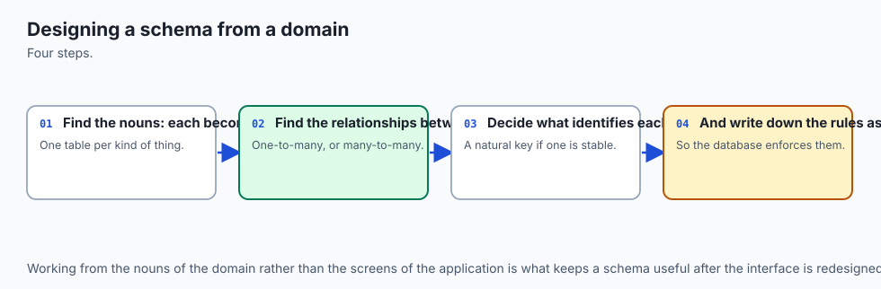
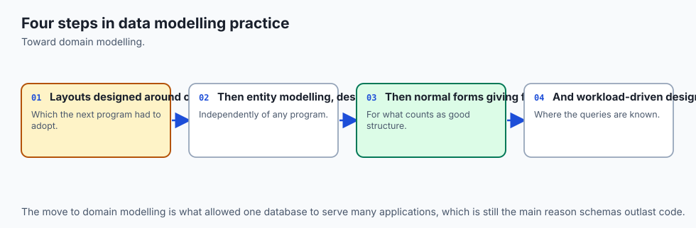
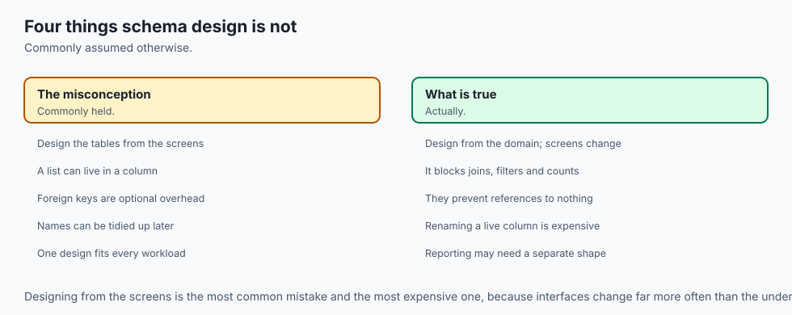
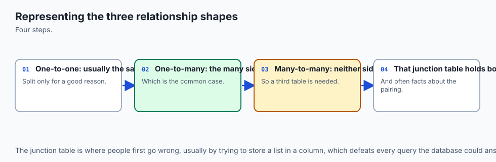
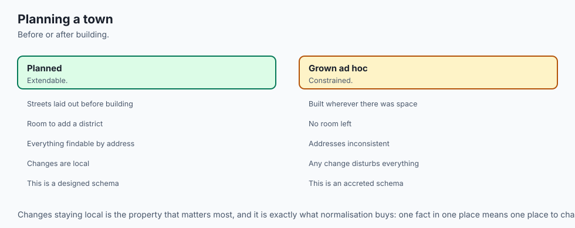
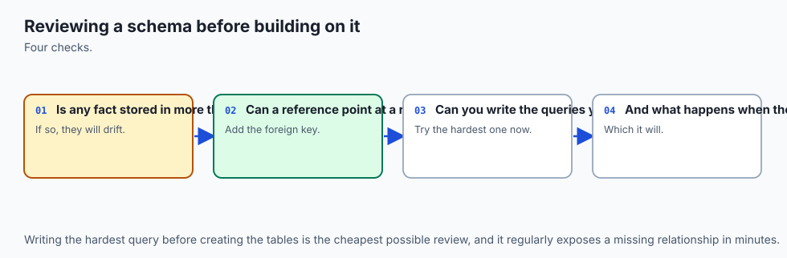
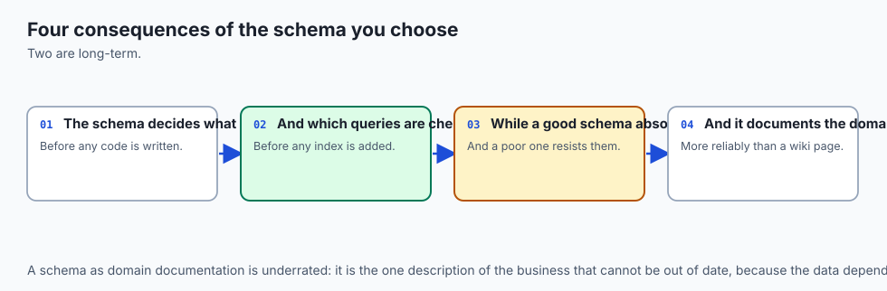
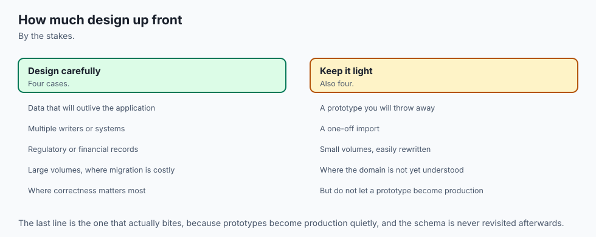

## Why this matters

For six days you have been given schemas. Today you write one, from a paragraph of prose handed to you by somebody who has never heard the word.

That is the actual job. Nobody is ever going to send you a `CREATE TABLE` statement and ask you to run it. They are going to say "we lend books, some of them have more than one author, and members sometimes leave owing us money", and every table you create after that is an interpretation of that sentence which you will be living with for years.

Here is why it matters more than it looks, and it is worth being blunt. **The questions you can ask cheaply later are fixed by the shape you choose now.**

Not "made easier". Fixed. If you store an author's name as a comma-separated string on the book row, then "which authors have we never lent out?" is not a slow query — it is not a query at all. You will write a Python loop that splits strings, and it will be wrong the first time an author's name contains a comma. If you store a fine as a floating-point number of pounds, then "what do our members owe us in total?" has an answer that drifts, and there is no index, no rewrite and no faster machine that fixes it. If you delete a book row when the book falls apart, then "what did this member borrow in 2024?" returns rows with a blank title, forever.

None of those failures announce themselves. They are all discovered six months later by somebody who needed an answer and could not get one.

The cost is concrete and it lands in four places. **Rewriting is expensive** — changing a schema that has data in it means a migration, a backfill, and a deployment where the old code and the new schema have to coexist (Day 88 showed you what that involves). **Wrong answers look right** — a report that quietly omits the members who borrowed nothing is a plausible number that is wrong, and nobody checks a plausible number. **Some questions become impossible** rather than merely slow, and that is a category difference. And **the correction arrives late**, because a schema is only tested by the questions people eventually ask, which is always more questions than you anticipated.

The AI connection is not a stretch, and it is the reason this day sits where it does. Every dataset a model trains on and every corpus a retrieval system indexes started as somebody's schema decision. Somebody decided whether a document had one author or many; whether the timestamp was the creation time or the ingestion time; whether a deleted record left a row behind; whether the label was an enumeration or free text. Every one of those decisions is now permanently baked into what you can filter on, join to, deduplicate by, or evaluate against. When you cannot answer "which of these training examples came from a source we have since lost the rights to?", the reason is almost never the model. It is that nobody put the column there.

## The idea in plain language



The whole process is five stages, and the only hard part is that each one is a decision you have to justify rather than a mechanical transformation.


Follow one sentence all the way through, because that is what the diagram does and it is the entire method in miniature.

**Stage 1, the requirement.** *"Some books have more than one author. The order matters — the cover credits them in a particular order and so should we."*

**Stage 2, the entities.** A book is a thing. An author is a thing. "Credited on" is a relationship between them, and it goes many-to-many: a book has several authors, an author has several books. That is three nouns, and one of them is a relationship rather than a table you were expecting.

**Stage 3, the logical schema.** `books`, `authors`, and — because neither side can hold the key, since a column holds one value — a third table `book_authors`. Its key is the *pair*. And it needs a column of its own, `author_position`, because the second sentence said the order matters and the order is a fact about the relationship rather than about the book or about the author.

**Stage 4, the physical schema.** Now the types, the constraints and the indexes. `PRIMARY KEY (book_id, author_id)`, so the same author cannot be credited twice. `UNIQUE (book_id, author_position)`, so two authors cannot both be second. `ON DELETE CASCADE` towards books and `ON DELETE RESTRICT` towards authors, because deleting a book should take its credits with it while deleting an author who still has books is almost certainly a mistake. And an index on `author_id`, because a foreign key creates none.

**Stage 5, the query.** Join across the junction, group by book, filter with `HAVING count(*) > 1`.

**Stage 6, the report.** `The C Programming Language — 2 authors: Brian W. Kernighan, Dennis M. Ritchie`. In that order, because of stage 3, because of the second half of stage 1.

Read it backwards and you have a review checklist that catches most schema problems before they ship: **every column at stage 4 should trace back to a sentence at stage 1**, and **every question at stage 6 should be answerable from stage 4 alone**. A column with no sentence behind it is speculation. A question your schema cannot answer is a schema that is not finished.

## Historical background



The vocabulary in that process is older than most of the software you use, and knowing where it came from stops it feeling arbitrary.

**Edgar F. Codd** published *A Relational Model of Data for Large Shared Data Banks* in *Communications of the ACM* in **June 1970**, while working at IBM's San Jose Research Laboratory. He followed it with **normalization** through **1971 and 1972**, giving the first, second and third normal forms as a staged procedure for removing update, insertion and deletion anomalies, and — with **Raymond F. Boyce** — Boyce–Codd normal form in **1974**. Day 88 covered what those forms say; today they are the background hum behind "each table is about one kind of thing".

The **entity-relationship model** — the boxes-and-lines vocabulary of entities, attributes and relationships that stage 2 above uses — was introduced by **Peter Chen** in **1976**, in *The Entity-Relationship Model: Toward a Unified View of Data*, published in the first issue of *ACM Transactions on Database Systems*. Chen's contribution was a modelling layer that sat *above* any particular database, which is exactly why the diagram you draw on paper is still useful when the target is SQLite, PostgreSQL, or a document store.

The three-schema idea — that a **conceptual** model, a **logical** schema and a **physical** schema are different artifacts with different audiences — came out of the **ANSI/SPARC** committee's work in **1975**. It is why stages 3 and 4 above are separate. Stage 3 is portable and about meaning; stage 4 is about a specific engine and its types.

Two later dates matter for the querying half. **Common table expressions and window functions** were standardised in **SQL:1999** and **SQL:2003** respectively, decades after the basics. SQLite added recursive CTEs in **3.8.3 (2014)** and window functions in **3.25.0 (2018)**. On the machine this lesson was written on, `sqlite3 --version` reports **3.51.0**, and Python's bundled library reports **3.53.3** — both comfortably past those floors, which the lab checks before it runs anything.

And the format that runs through today's schema: **ISO 8601** was first published in **1988**, consolidating a pile of national date notations into `YYYY-MM-DD`. Its critical property for a database with no date type is that the notation sorts correctly as plain text — a design choice, not a coincidence.

## What it is — and what it is not



**Schema design** is the activity of deciding what tables exist, what columns they have, which values are legal, and how the tables relate — such that the questions your users will ask are answerable, and the states your data cannot legally be in are unrepresentable.

Three distinctions do real work.

A **conceptual model** is entities and relationships in the language of the business. A **logical schema** is tables, columns and keys, still independent of any engine. A **physical schema** is the `CREATE TABLE` statements for one specific database, with its types, its constraint syntax and its indexes. You can skip straight to the third and often should for something small — but when a design goes wrong, it is nearly always because a *conceptual* mistake was never noticed, and you cannot see a conceptual mistake in a wall of DDL.

An **entity** is a thing with an independent existence. An **attribute** is a fact about one entity. The test that resolves nearly every case: *does it exist before and after the row that mentions it, does it have facts of its own, and is it referred to by more than one row?* An author passes all three, so it is an entity. A published year passes none, so it is an attribute. A category passes the first and the third, so it is an entity — and once it can contain other categories, it is an entity with a relationship to itself.

Now what schema design is **not**.

It is not normalization. Normalization is one tool inside it, and a schema that is in third normal form can still be a bad schema — storing money as a float, using a timestamp format that does not sort, or having no way to represent a book that has not been catalogued yet.

It is not permanent. Day 88's migrations exist precisely because it is not. What you are buying with care today is not permanence; it is *cheaper change* and *fewer silent wrong answers*.

It is not the same as the object model in your code. Day 93 will show an ORM mapping classes to tables, and the mapping is never one-to-one — a junction table with its own column is the standard place where the two views come apart.

And a schema is **not** a security control. Constraints stop bad *data*. They do nothing about a bad *reader*.

| It is | It is not |
| --- | --- |
| A set of decisions, each with a defensible alternative | A mechanical transformation of the requirements |
| Judged by the questions it can answer cheaply | Judged by how normalized it is |
| Three artifacts — conceptual, logical, physical | One wall of `CREATE TABLE` statements |
| Changeable, at a cost that rises with data volume | Permanent, or free to change |
| A statement about what data is legal | A statement about who may read it |
| Where NULL means something specific, chosen | Where NULL is whatever happened to be missing |

## Why it was created and what problems it solves

The design process exists because the alternative — writing tables as you need them — produces a database that answers exactly the questions you happened to think of, and no others.

The specific failures it prevents are worth naming, because each one has a decision attached.

**"We cannot ask that."** The single wide table with `author_name` on every book row cannot answer "which authors have never been borrowed?", because it has no way to represent an author who is not on a book. Splitting entities out solves it.

**"The number is wrong and nobody noticed."** A total that is off by a penny per transaction because money is a float. A report that omits members with no loans because somebody wrote `JOIN` where `LEFT JOIN` was needed. Both are silent. Integer minor units and a habit of testing the zero case solve them.

**"Two rows disagree."** Storing derived data — a queue position, a cached count, a duplicated name — means promising to update it everywhere, forever. The database cannot enforce that promise, so it is not a promise. Deriving instead of storing solves it.

**"The date sorts wrong."** `'01/08/2026'` sorts before `'02/07/2025'` as text. ISO 8601 in UTC solves it, and does so well enough that you can then write `CHECK (due_at > borrowed_at)` and have the database enforce chronology for you.

**"We deleted it and lost the history."** Hard-deleting a book removes the title from every past loan. Soft delete solves it — and immediately creates its own problem, which is that every present-tense query must now remember to filter.

**"The join is slow."** Declaring a foreign key creates no index (Day 87), so every join across it scans (Day 89). Writing the index yourself solves it.

And one problem the process *creates*, which is fair to state: it takes time up front, and the time is spent arguing about things that will not visibly matter for months. That is a real cost. The mitigation is that the arguments are short if you have a checklist, which is what today is.

## How it works



Here is the schema the process produces, from the brief the lab hands you.


Now the decisions, one at a time. Each has a genuine argument on both sides.

### Requirements to entities: the mapping table

Do this literally, on paper, before any SQL. Underline the nouns in the brief, then decide what each one is.

| Phrase in the brief | It is | Why | Where it lands |
| --- | --- | --- | --- |
| "we lend books" | entity | Exists independently, referred to by many loans | `books` |
| "a thirteen-digit ISBN" | attribute | A fact about one book, no life of its own | `books.isbn13` |
| "categories nest" | entity, self-referencing | Contains other categories, so it is a tree | `categories.parent_id` |
| "some books have more than one author" | entity + relationship | An author outlives any one book | `authors` + `book_authors` |
| "the order matters" | attribute **of the relationship** | Not a fact about the book, nor about the author | `book_authors.author_position` |
| "we withdraw it… but keep old loans" | attribute, soft delete | The row must survive its own removal | `books.withdrawn_at` |
| "members are on one of three tiers" | closed enumeration | Small, stable set | `CHECK (tier IN (...))` |
| "if it comes back late we charge a fine" | attribute, money | Integer minor units | `loans.fine_pence` |
| "several members waiting, served in order" | entity | Has its own timestamp and status | `reservations` |
| "a queue position" | **derived, not stored** | A function of `reserved_at` and `status` | computed with `ROW_NUMBER` |

The last row is the one worth arguing about, and we will come back to it, having got it wrong first.

### Surrogate keys versus natural keys

A **natural key** is a value that already identifies the row in the world: an ISBN, an email address, a national insurance number. A **surrogate key** is a number the database made up.

The argument for natural keys is genuinely good. There is no extra column. A child row carrying `isbn13` is readable without a join — you can look at `book_authors` and know which book it is. And the uniqueness is real rather than asserted.

The argument for surrogate keys wins anyway, for three reasons that keep recurring:

- **Natural keys change.** People change their email address. Publishers reissue with a new ISBN. Changing a natural key means updating every child row that references it, in lockstep, or having a foreign key that no longer resolves.
- **Natural keys are sometimes absent.** *Frankenstein* was printed in 1818. There is no ISBN, and a primary key cannot be NULL. One book without one is enough to kill the design.
- **Natural keys are sometimes wrong.** Catalogue staff mistype thirteen digits. Under a natural key, correcting one character is a cascade.

The failure mode of getting this wrong is not subtle: you discover it the day a member changes their email address and their entire loan history detaches. The failure mode of getting it *too* right — a surrogate key and nothing else — is duplicates, because nothing stops two rows for the same book.

So: **surrogate key as the primary key, natural key as a `UNIQUE` constraint.** You get the stability and the integrity guarantee both.

```sql
book_id INTEGER PRIMARY KEY,
isbn13  TEXT UNIQUE
        CHECK (isbn13 IS NULL OR
               isbn13 GLOB '[0-9][0-9][0-9][0-9][0-9][0-9][0-9][0-9][0-9][0-9][0-9][0-9][0-9]'),
```

In SQLite specifically, `INTEGER PRIMARY KEY` is an alias for the internal rowid, so the surrogate key costs nothing at all in storage — it is the row's address either way.

### When a junction table earns columns of its own

A junction table for a many-to-many relationship is often a pure link: two foreign keys, keyed on the pair, nothing else. Day 87's version was exactly that.

It stops being a pure link the moment the *relationship itself* has an attribute. The test: **is this fact about the left thing, the right thing, or the pairing?**

`author_position` is about the pairing. Kernighan is not "second"; he is second *on that book* and first on another. There is nowhere else for it to live.

The clearest case in the lab is `loans`. It looks like a junction table between books and members, and it is not — a loan has a borrow date, a due date, a return date and a fine. Once a relationship has four attributes and a lifecycle, it has stopped being a link and become an entity, and it deserves its own surrogate key rather than a composite one. The signal to watch for: **the same pair can occur more than once.** Ada can borrow the same book twice, so `(book_id, member_id)` cannot be the key, so it is not a junction table.

### Dates and times in a database with no date type

SQLite has no date type. `datatype3.html` in its documentation is explicit: there are five storage classes — NULL, INTEGER, REAL, TEXT and BLOB — and dates are stored as one of TEXT, REAL or INTEGER by convention.

The default that should be your default: **ISO 8601 text, in UTC, `YYYY-MM-DDTHH:MM:SSZ`.**

Three properties earn it:

1. **It sorts.** Lexicographic order is chronological order, because every field is fixed-width and ordered most-significant first. Range queries, `ORDER BY`, `MIN`, `MAX` and comparison all work on plain text.
2. **It is unambiguous.** `01/08/2026` is the first of August in London and the eighth of January in Chicago. `2026-08-01` is one date everywhere.
3. **It is readable.** You can look at the database file and know what the value means, which is worth more at three in the morning than any storage efficiency.

Because it sorts as text, the format decision pays for itself immediately in constraints:

```sql
borrowed_at TEXT NOT NULL CHECK (borrowed_at LIKE '____-__-__T__:__:__Z'),
due_at      TEXT NOT NULL CHECK (due_at      LIKE '____-__-__T__:__:__Z'),
CHECK (due_at > borrowed_at)
```

The `LIKE` pattern uses `_` to match exactly one character, so it enforces the shape. The last line enforces chronology — and it only works *because* of the format.

And UTC, always, in the database. Storing local time means storing an ambiguity: an hour that occurs twice a year when the clocks go back, and a comparison between two rows that means nothing if they were written in different places. Convert at the edges, for display.

This is the honest place to say that this is a simplification. Time zones, daylight saving, leap seconds, "the same wall-clock time next month" and the difference between an instant and a calendar date are genuinely difficult, and **Day 95 treats time properly**. Today's rule — ISO 8601, UTC, text — is the right default and will carry you a long way; it is not the whole subject.

### Money is an integer

Day 70 established why `0.1 + 0.2` is not `0.3` in binary floating point. It is still not, in SQLite:

```text
sqlite> SELECT CASE WHEN 0.1 + 0.2 = 0.3 THEN 'yes' ELSE 'no' END;
no
```

So money is stored as an **integer count of minor units** — pence here — and it stays an integer through every sum and every comparison. It is divided by 100 exactly once, at the point of display, in the formatter.

```sql
fine_pence INTEGER NOT NULL DEFAULT 0 CHECK (fine_pence >= 0),
```

The lab's fines are 220, 190 and 300 pence. Summed as integers that is exactly 710, and the report prints `GBP 7.10`. Summed as floats it is close, and "close" in a fines ledger is how you end up with an account that cannot be reconciled and nobody able to say when it stopped being right.

### Enumerations: `CHECK` constraint or lookup table

`tier` is one of `standard`, `student`, `staff`. Two ways to say so.

| | `CHECK (tier IN (...))` | Lookup table + foreign key |
| --- | --- | --- |
| Cost to write | One line | A table, a foreign key, an index |
| Cost to query | Nothing | A join, or a denormalized copy |
| Adding a value | `ALTER TABLE`, a migration | `INSERT` |
| Extra facts per value | Impossible | Natural — label, loan allowance, sort order |
| Values chosen by | A developer, in a deployment | An administrator, at runtime |

The rule that follows: **`CHECK` when the set is small, closed, and changes about as often as the code does. A lookup table when the set will grow, or when a value needs facts of its own.**

Three membership tiers that change once a decade are a `CHECK`. Book categories — which the brief says get added, renamed and moved — are a table, and in fact are a whole tree. Both are in the lab's schema, which is the point: the same schema uses both, correctly, for different reasons.

### Nullable columns as a decision

A NULL should mean something you chose, and you should be able to say what.

The lab's schema has four nullable columns and each one means something different:

- `authors.birth_year` — **unknown.** Julie Sussman's year of birth is not published. Inventing one to avoid a NULL would put a false fact in the database to satisfy a preference about column definitions.
- `books.isbn13` — **does not apply.** The 1818 book was printed before ISBNs existed.
- `categories.parent_id` — **top level.** Not missing at all; this is a positive fact about the world.
- `loans.returned_at` — **not yet.** The state "still out" is encoded by the absence of the date.

That last one deserves a warning, because the tempting alternative is worse. Adding an `is_returned` boolean *as well as* the date gives you two columns encoding one fact, and two columns that can disagree. One column, one meaning.

Everything else is `NOT NULL`, and that is also a decision: it says the fact is always known at insert time.

### Soft delete versus hard delete

**Hard delete** removes the row. **Soft delete** sets a column — `withdrawn_at`, `left_at` — and leaves it.

The brief forces soft delete twice: withdrawn books must still resolve in old loan records, and a departed member's outstanding fine has to survive them leaving.

The cost is immediate and permanent: **every present-tense query must now remember to filter.** The one that forgets does not error. It reports a number that is quietly wrong.

```text
=== 1. How many books are on the shelves, and how many are out? ===
in_collection  on_loan_now  rows_in_books
-------------  -----------  -------------
7              4            8
```

Seven and eight. The difference is the withdrawn book, and it is one forgotten `WHERE` clause away from being the answer.

Two mitigations, and they are partial rather than complete. A **view** gives the filter one definition and a name:

```sql
CREATE VIEW current_collection AS
  SELECT book_id, isbn13, title, published_year, category_id, acquisition_cost_pence
    FROM books
   WHERE withdrawn_at IS NULL;
```

And a habit: decide *per question* which filter applies, rather than assuming. The lab's question 5 — fines owed — deliberately includes members who have left, because a debt does not stop existing when somebody cancels their membership. Question 6 — most active borrowers — excludes them, because they are not members any more. **Which soft-delete filter applies is a property of the question, not of the table**, and that is the whole cost, stated exactly.

### The decision made, rejected, and revised

Here is one taken the wrong way first, because that is how it actually happens.

The brief says several members can be waiting for the same book and are served in the order they asked. The natural reading is a queue with positions, so the first attempt stored one:

```sql
CREATE TABLE reservations_v1 (
  reservation_id INTEGER PRIMARY KEY,
  book_id        INTEGER NOT NULL,
  member_id      INTEGER NOT NULL,
  reserved_at    TEXT    NOT NULL,
  queue_position INTEGER NOT NULL CHECK (queue_position >= 1),
  status         TEXT    NOT NULL DEFAULT 'waiting'
);
```

Three members join the queue: positions 1, 2, 3. Then the member at position 2 cancels, and the application marks the reservation cancelled without renumbering — because renumbering is a second statement somebody has to remember to write, in every code path that can cancel:

```text
--- so the queue now reads 1, 3: there is no position 2 ---
positions_now
-------------
1, 3
```

Then a fourth member joins. The code appends "the count of people waiting, plus one" — a perfectly reasonable line, written months later by somebody who has not read this file. There are two people waiting, so the new one is third:

```text
--- the damage, stated as a number: duplicate positions in one queue ---
queue_position  members_at_this_position
--------------  ------------------------
3               2
```

Two people at position 3, nobody at position 2, and **no error raised at any point.**

The diagnosis: `queue_position` is *derived data*. It is a function of `reserved_at` and `status`. Storing derived data means promising to recompute it everywhere either input changes, forever, in every code path that will ever exist. The database cannot enforce that promise, so it is not a promise — it is a hope.

The revision is to remove the column and compute the position at query time:

```sql
SELECT member_id,
       ROW_NUMBER() OVER (PARTITION BY book_id ORDER BY reserved_at) AS queue_position
  FROM reservations
 WHERE status = 'waiting'
 ORDER BY queue_position;
```

After the same two cancellations, this is correct by construction — because there is nothing stored to be wrong:

```text
member_id  queue_position
---------  --------------
1          1
2          2
```

The rule it bought: **store what you are told; derive what follows from it.** A column that can be computed from other columns is a column that can disagree with them. The exception is deliberate denormalization for measured performance, and then you write down every path that must maintain it.

### Querying it back: subqueries

A **scalar subquery** returns one row and one column and can go anywhere a value can:

```sql
SELECT (SELECT count(*) FROM books WHERE withdrawn_at IS NULL) AS in_collection,
       (SELECT count(*) FROM loans WHERE returned_at IS NULL)  AS on_loan_now;
```

A **correlated subquery** refers to the outer query, so it is conceptually re-evaluated per outer row. That is the shape `EXISTS` uses.

### `EXISTS` versus `IN` versus a join

All three can answer "which current members have never borrowed?", and they are not equivalent.

| Construct | Returns | Multiplies rows? | The trap |
| --- | --- | --- | --- |
| `NOT EXISTS (...)` | Boolean, stops at the first match | No | None worth knowing |
| `NOT IN (SELECT ...)` | Boolean over a list of values | No | **Returns nothing at all** if the subquery yields one NULL |
| `LEFT JOIN ... WHERE key IS NULL` | Rows | Yes, before the filter | Builds every pair, then discards nearly all of them |
| `JOIN` | Rows, with columns | Yes | Duplicates the left row once per match |

The rule: **use a join when you need columns from the other table. Use `EXISTS` when you only need to know whether a row is there.** `EXISTS` says what the English sentence says, cannot accidentally multiply your rows, and is immune to the `NOT IN` NULL trap that Day 86's three-valued logic sets.

```sql
SELECT m.full_name, m.tier
  FROM members AS m
 WHERE m.left_at IS NULL
   AND NOT EXISTS (SELECT 1 FROM loans AS l WHERE l.member_id = m.member_id);
```

```text
Eli Nakamura|student
```

### Common table expressions, and one that recurses

A **common table expression** is a named subquery written before the query that uses it. It buys nothing the database could not do with nested subqueries; it buys readability, which is the entire point, and it lets you refer to the same intermediate result twice.

The version that is not merely cosmetic is **`WITH RECURSIVE`**. The lab's categories form a tree: Fiction contains Science Fiction, which contains Cyberpunk. "Everything under Fiction, at any depth" cannot be written as a join, because the number of joins you would need is the depth of the tree and you do not know the depth of the tree.

```sql
WITH RECURSIVE subtree(category_id, name, depth) AS (
      SELECT category_id, name, 0
        FROM categories
       WHERE name = 'Fiction'
  UNION ALL
      SELECT c.category_id, c.name, s.depth + 1
        FROM categories AS c
        JOIN subtree    AS s ON c.parent_id = s.category_id
)
SELECT s.depth, s.name, count(b.book_id)
  FROM subtree AS s
  LEFT JOIN books AS b ON b.category_id = s.category_id AND b.withdrawn_at IS NULL
 GROUP BY s.category_id, s.depth, s.name
 ORDER BY s.depth, s.name;
```

```text
0|Fiction|0
1|Gothic|1
1|Science Fiction|1
2|Cyberpunk|1
```

The anchor before `UNION ALL` selects the starting row. The recursive part joins the table to the CTE, finding the children of everything found so far, and stops when a pass adds nothing. The `depth` column is carried by hand, because SQL will not tell you how many passes it took. Note also that the withdrawn filter is in the `ON` clause rather than the `WHERE` clause — Day 87's rule, and moving it would silently drop the categories with no books.

### Window functions, and the problem `GROUP BY` cannot solve

A **window function** computes a value across a set of related rows — a **partition** — **without collapsing them**. That single sentence is the whole difference from an aggregate, and it is the difference that matters.

"The two most active borrowers in each tier" is the classic case. `GROUP BY tier` can give you the maximum loan count per tier. It cannot give you the top two *people*, because the aggregation has already thrown the names away. The lab measures the collapse: the `GROUP BY` version returns **3** rows, one per tier, and the answer needs **5**.

```sql
WITH per_member AS (
  SELECT m.member_id, m.full_name, m.tier, count(l.loan_id) AS loan_count
    FROM members AS m
    LEFT JOIN loans AS l ON l.member_id = m.member_id
   WHERE m.left_at IS NULL
   GROUP BY m.member_id, m.full_name, m.tier
),
ranked AS (
  SELECT tier, full_name, loan_count,
         ROW_NUMBER() OVER (PARTITION BY tier ORDER BY loan_count DESC, full_name) AS position
    FROM per_member
)
SELECT tier, position, full_name, loan_count
  FROM ranked WHERE position <= 2 ORDER BY tier, position;
```

```text
staff|1|Chandra Iyer|4
standard|1|Ada Okafor|3
standard|2|Dana Whitfield|2
student|1|Bruno Salgado|4
student|2|Eli Nakamura|0
```

Three things in that output are worth pausing on. The `LEFT JOIN` is what keeps Eli Nakamura, who has borrowed nothing, in the ranking at all. `count(l.loan_id)` rather than `count(*)` is what makes her count **0** rather than 1 — both Day 87 traps, arriving inside a window query. And the whole thing is two steps because a window function cannot be filtered in `WHERE`: it is computed *after* `WHERE` and after `GROUP BY`, so to filter on its result you compute it in a CTE and filter outside.

`ROW_NUMBER` always gives 1, 2, 3 with no gaps and breaks ties arbitrarily unless you tell it how. `RANK` gives equal values the same number and then skips — 1, 1, 3. Choose by what a tie should mean: a queue position must be unique, so `ROW_NUMBER`; a leaderboard should show a genuine tie, so `RANK`.

`SUM(...) OVER (ORDER BY ...)` is a running total. The default frame when `ORDER BY` is present is everything up to and including the current row, which is exactly a cumulative sum — and omitting the `ORDER BY` silently gives you the grand total on every row instead:

```text
2026-05|2|6
2026-06|3|9
2026-07|3|12
2026-08|2|14
```

### Views, honestly

A view is a saved query. `CREATE VIEW current_collection AS SELECT ... WHERE withdrawn_at IS NULL` and every report can say `FROM current_collection`.

What it buys: a **name** for a piece of reasoning, and **consistency**, because every report that uses it filters the same way. What it does not buy: **speed**. A view stores the query text, not its result. It is expanded into whatever query uses it and runs afresh every time. A materialized view — which does store the result — is a different feature that SQLite does not have.

### The report

The last stage is a Python script that opens the database through the repository pattern from Day 90 — one method per question, every value bound rather than interpolated — and prints something a person would read.

```python
class LibraryRepository:
    def __init__(self, path):
        self.connection = sqlite3.connect(str(path))
        self.connection.execute("PRAGMA foreign_keys = ON")   # first, always
        self.connection.row_factory = sqlite3.Row

    def overdue_loans(self, now):
        return self._rows("""
            SELECT m.full_name, b.title, l.due_at,
                   CAST(julianday(?) - julianday(l.due_at) AS INTEGER) AS days_overdue
              FROM loans   AS l
              JOIN members AS m ON m.member_id = l.member_id
              JOIN books   AS b ON b.book_id   = l.book_id
             WHERE l.returned_at IS NULL AND l.due_at < ?
             ORDER BY days_overdue DESC
        """, (now, now))
```

Two details are load-bearing. Nothing outside the repository knows SQLite exists, so the formatting code physically cannot build a query out of string concatenation. And **the report instant is a parameter with a default, not a clock reading** — a report whose answer changes depending on when it runs cannot be tested, cannot be reproduced, and cannot be compared with last month's copy.

```text
4. Overdue loans
----------------
   10 days  Bruno Salgado    The Left Hand of Darkness
            was due 2026-08-05T13:00:00Z
    5 days  Chandra Iyer     Neuromancer
            was due 2026-08-10T10:00:00Z

5. Fines outstanding
--------------------
    GBP 4.10  Ada Okafor       (current)
    GBP 3.00  Farida Haddad    (left)
    GBP 7.10  TOTAL
```

## An everyday analogy



Think about designing the forms and filing cabinets for a small clinic before it opens.

The doctor tells you what happens in prose: patients register, they book appointments, some appointments get cancelled, prescriptions have several medicines on them and the order on the label matters, and people move house.

**Stage 2 is deciding which of those nouns gets a cabinet.** A patient gets one — they exist between visits, they have facts of their own, several appointments refer to them. A patient's *height* does not get a cabinet; it goes on the patient's card. This is the entity-versus-attribute test, and it is exactly as easy and as easy to get wrong in a clinic as in a database.

**The surrogate key is the patient number on the card.** You could file by name, and small practices used to. Then two people are both called Sarah Chen, one of them gets married and changes her name, and every cross-reference in every other cabinet is now pointing at a name that no longer exists. So you assign a number that means nothing and never changes, and you keep the name on the card where it can be corrected without consequence.

**The junction table with its own column is the prescription line.** A prescription is not simply "this patient, these medicines" — each line has a dose and a position on the label. Those facts belong to the pairing of prescription and medicine, not to either alone, so they go on the line rather than on the medicine card or the prescription cover sheet.

**The date format is the rule on the wall saying to write dates as year-month-day.** It looks like pedantry until the day somebody files by date and discovers that `01/08` and `08/01` interleave into nonsense. The rule exists so the drawer is in order simply by being in order.

**Money in pence is the rule that the petty-cash book is kept in whole pence, never in fractions of a pound.** Every accountant has this rule and it is the same reason.

**Soft delete is the archive drawer.** A patient who leaves the practice does not get shredded — their file moves to the archive, because the prescriptions they were issued still have to be findable. And the price is exactly the price in the database: every time somebody asks "how many patients do we have?", they now have to remember to say "in the current drawer". The receptionist who forgets does not get an error; they get a number that is too big, and they read it out at the meeting.

**The derived queue position is the mistake.** Writing "you are third in line" on the appointment card feels helpful, and it is right until somebody cancels. Then card three says three, card four says four, and there is nobody second. The fix is the one the lab makes: do not write the position down. Count the cards in the drawer, in date order, when somebody asks.

**A view is the standing instruction pinned to the drawer** — "when anybody asks for the current patient list, it means this drawer, filtered like this". It saves you re-explaining. It does not make the counting faster, because somebody still has to count.

Where the analogy runs out: the clinic can quietly tolerate an inconsistency for years, because a human reading the file usually notices something is off. A database will not notice, will not tell you, and will hand the wrong number to a report that gets emailed to a board.

## Examples in practice



Three shapes you will write within a week of finishing this.

**Auditing a pipeline for gaps, with the anti-join.** Every ingestion system needs this, and the shape is the same one Day 87 taught:

```sql
SELECT d.doc_id, d.title
  FROM documents AS d
 WHERE NOT EXISTS (SELECT 1 FROM embeddings AS e WHERE e.doc_id = d.doc_id);
```

"Which documents were ingested but never embedded?" If your retriever is silently missing a fifth of your corpus, this is the query that finds out, and there is no way to write it against a single table.

**Deduplicating with a window function.** You have several rows per entity and want the most recent one — the top-N-per-group problem again, with N of 1:

```sql
WITH ranked AS (
  SELECT *, ROW_NUMBER() OVER (PARTITION BY source_url ORDER BY fetched_at DESC) AS rn
    FROM raw_documents
)
SELECT * FROM ranked WHERE rn = 1;
```

This is the single most common use of `ROW_NUMBER` in data work, and it is worth memorising as a unit. `GROUP BY source_url` with `max(fetched_at)` gives you the timestamp but not the row it came from.

**A running total for a report, in PostgreSQL.** Same syntax, different engine — the window-function standard is genuinely portable:

```sql
SELECT month,
       loans_started,
       sum(loans_started) OVER (ORDER BY month) AS running_total
  FROM monthly_loans;
```

The one difference worth knowing when you move this to PostgreSQL: `month` there would be a real `date` truncated with `date_trunc('month', borrowed_at)` rather than a text `strftime('%Y-%m', ...)`, and the ordering would be a date ordering rather than a string one. It gives the same answer, for a slightly better reason.

## Implications: security, privacy, performance, scalability, and cost



**Privacy: what you store is the ceiling on what can leak.** The brief does not ask for a member's date of birth, home address or reading interests, so the schema has no columns for them. A column that does not exist cannot be joined, exported, indexed by mistake, or handed over. This is the cheapest privacy control there is and it is only available at design time.

**Privacy: soft delete keeps data you may have been asked to remove.** `members.left_at` means a departed member is still a row, with their name and email, indefinitely, in every backup. The brief has a good reason — an outstanding fine survives the membership — but "deleting is inconvenient" is not that reason. Decide in advance what a departed row may retain and for how long, and write the deletion job at the same time as the soft-delete column.

**Privacy: the query is the disclosure boundary, not the table.** The overdue report produces "this named person has this named book and is ten days late". Each table alone is harmless; the join is the reading record. When you decide who may run what, reason about the query.

**Security: constraints stop bad data, not bad readers.** Every `CHECK`, `UNIQUE` and `REFERENCES` here refuses an impossible row — the lab proves eleven of them do. None of them stops somebody who can read the file, because a SQLite database is an ordinary file with ordinary permissions and no encryption.

**Security: the repository is a structural control.** With every statement inside `LibraryRepository`, the formatting code has no connection object in scope, so it *cannot* build a query by concatenation. That is a property of the structure rather than of anybody's discipline, which is the kind of security control that survives a rushed afternoon.

**Performance: index what the questions need, not what looks important.** Nine indexes exist in this schema and every one traces to a query. Seven are on foreign-key columns, because declaring a foreign key creates no index. Two are partial — `loans(due_at) WHERE returned_at IS NULL` covers the "what is out right now" questions over a table that grows forever while the outstanding set stays small.

**Performance: a window function is not free.** It sorts each partition. On a large table, `ROW_NUMBER() OVER (PARTITION BY x ORDER BY y)` is dramatically faster than the correlated-subquery alternative, but it is not free, and an index on `(x, y)` is what makes it cheap. Day 89's habit applies: measure with `EXPLAIN QUERY PLAN` rather than guessing.

**Scalability: the schema decides what can be sharded.** A design where every query joins six tables is fine on one machine and expensive across several. Deep hierarchies walked by recursive CTEs are the first thing to hurt. This is not a reason to avoid them at library scale; it is a reason to know which of your questions are the ones that will not survive growth.

**Cost: the schema is the cheapest thing to change today and the most expensive thing to change in a year.** Adding a column to an empty table is one statement. Adding it to a table with a hundred million rows, in production, with old code still running, is a project. The time spent on the mapping table at the top of this lesson is the highest-leverage half hour in the whole exercise.

## Alternatives: free, open source, and commercial

Four genuinely different ways to do this work, and the last one is a real alternative rather than a variation.

**By hand, on paper, then straight to SQL** — *free.* What this lesson does, and the right default for anything you can hold in your head. **When to choose it:** fewer than about fifteen tables, one or two people, and a schema you will read more often than you will present. **How:** write the mapping table of phrases to entities, sketch the boxes and lines, then write the `CREATE TABLE` statements with a comment above each decision saying what the alternative was. **Concrete example:** the lab's `examples/01_schema.sql`, where every constraint carries its reasoning. **Free vs paid:** entirely free; the cost is that the diagram lives in your head or on a photograph of a whiteboard.

**A dedicated modelling tool** — *free and paid options both.* **dbdiagram.io** and **DBML** let you write a text description and get a diagram; **SchemaSpy** (Apache-2.0) and **SchemaCrawler** (free) generate diagrams *from an existing database*, which is the direction that cannot drift; **pgModeler** (GPL) and **MySQL Workbench** (GPL) do forward and reverse engineering; **DB Browser for SQLite** (GPL/MPL) will open today's file and draw it. **When to choose one:** more than a handful of tables, or more than a handful of people, or any situation where somebody who does not read SQL has to approve the design. **How:** describe the schema in the tool's text format and export both the diagram and the DDL, or point a reverse-engineering tool at the built database and regenerate the picture in CI. **Concrete example:** running SchemaSpy against `library.db` produces the entity-relationship diagram from the database itself, so it cannot disagree with reality. **Free vs paid:** SchemaSpy, SchemaCrawler, pgModeler and MySQL Workbench are free and open source; dbdiagram.io and the commercial tools have free tiers and paid plans whose prices change often enough that you should read their current pricing page rather than trust a figure written here. **The honest catch:** a hand-drawn diagram starts drifting from the database the day after you draw it. If you use a tool, prefer the ones that generate the picture *from* the schema.

**PostgreSQL, where the types are real** — *free, PostgreSQL licence; you pay only for hosting.* The same design, with several of today's workarounds replaced by features. **When to choose it:** more than one process writing concurrently, or when you want the database to enforce what SQLite makes you enforce by convention. **How:** the same `CREATE TABLE` statements with different types. **Concrete example** — the same three columns:

```sql
withdrawn_at TIMESTAMPTZ,                       -- a real instant, not text
is_active    BOOLEAN NOT NULL DEFAULT true,     -- a real boolean, not 0/1
tier         membership_tier NOT NULL,          -- CREATE TYPE membership_tier AS ENUM (...)
fine         NUMERIC(10,2) NOT NULL DEFAULT 0   -- exact decimal, not integer pence
```

What changes, concretely: `TIMESTAMPTZ` stores an instant and converts on the way in and out, so the `LIKE '____-__-__T...'` check disappears and time-zone handling becomes the database's problem rather than yours. A native `enum` replaces the `CHECK`, and adding a value is `ALTER TYPE`. `NUMERIC` is exact decimal arithmetic, so money can be stored in pounds without drifting — though integer minor units remains a perfectly good choice, and is what most payment systems use. Foreign keys are enforced by default, with no pragma. And Postgres has materialized views, so a view *can* buy you speed there. **Free vs paid:** free to run yourself forever; managed hosting is where money appears.

**An ORM** — *free, open source.* SQLAlchemy, Django's ORM and Peewee all express this schema as Python classes and generate the DDL and the migrations. **When to choose it:** an application where the same objects are used throughout, and where migrations need to be version-controlled alongside the code. **How:** declare the model classes, let the tool generate the migration, review the generated SQL before applying it. **Concrete example:** in SQLAlchemy, today's junction table is an association *object* rather than a plain `secondary=` table, precisely because it has `author_position` — which is the standard place where the object view and the table view come apart. **Day 93 covers this properly**, and this is an honest forward reference rather than a summary: today gives you the ability to read what an ORM emits and say whether it is right. Learning it the other way round means that when a generated query is slow or a generated migration does something surprising, you have no way in. **Free vs paid:** all free and open source.

**Just keep it in JSON files** — *free.* Argued fairly, because it is the right answer more often than database people admit. **When to choose it:** the data fits comfortably in memory, one process touches it, the shape is a document rather than a set of relationships, and the whole thing is small enough to read with your eyes. Configuration, a personal reading list, the output of a one-off scrape. **How:** one file per collection, `json.load` at startup, `json.dump` at the end. **Concrete example:**

```python
books = json.load(open("books.json"))
by_author = collections.defaultdict(list)
for book in books:
    for author in book["authors"]:          # nesting is free here
        by_author[author].append(book["title"])
```

Look at what that buys: nesting the authors inside the book is trivial, and no junction table is needed at all. Now cost it honestly. **No constraints** — nothing stops a negative fine, a duplicate id, or a tier nobody has heard of. **No transactions** — a crash halfway through a write leaves a truncated file, and the lab's seven tables would be seven files that can disagree with each other. **No concurrency** — two processes writing means one of them loses. **Every query is a program** — the ten questions in the lab become ten Python functions, and questions 6, 8 and 9 become genuinely difficult; the recursive one is a graph traversal you write yourself.

**No indexes** — every lookup is a scan, and you will end up building dictionaries by hand, which is an index you now maintain. **Migration is a rewrite script** with no rollback. The honest summary: JSON is cheaper than a database until the moment you need a second question answered about the same data, and then it is more expensive forever. SQLite is one file too, needs no server, and gives you all of the above for the same deployment cost — which is why "it's just a file" is not actually an argument against it.

## Comparison with related concepts

| Concept | What it does | How it differs from schema design |
| --- | --- | --- |
| Normalization | Removes update, insertion and deletion anomalies | One tool inside the design. A fully normalized schema can still store money as a float |
| Entity-relationship modelling | Names entities, attributes and relationships | The conceptual stage. Says nothing about types, constraints or indexes |
| Data modelling | Often used for the conceptual and logical stages together | Broader; schema design ends at running DDL |
| Migration | Changes a schema that already has data | What you do *after*. Day 88. Good design makes migrations rarer, not unnecessary |
| Indexing | Makes existing queries faster | Does not change any answer. Day 89 |
| `GROUP BY` | Collapses rows into one per group | A window function computes across rows **without** collapsing them |
| Subquery | A query nested inside another | A CTE is a subquery given a name and written first; a recursive CTE can refer to itself |
| View | A saved query | Names a piece of reasoning; stores no data and buys no speed |
| Materialized view | A saved query **and** its result | Real speed, real staleness. Not available in SQLite |
| Denormalization | Deliberately storing data more than once | The opposite trade, taken on purpose after measurement, with a written plan for keeping copies in step |
| Schema-on-read | Store raw, impose structure when querying | Moves the decision from write time to read time — and to every reader, separately, forever |

The one worth dwelling on is the last. "Schema-on-read" sounds like it avoids today's work. It does not; it distributes it. Every consumer now decides independently what a field means, and they will disagree. The decision does not go away by being deferred — it goes away by being made once, in one place, which is what a schema is.

## When to use it — and when not to



**Do the full process when** the data will outlive the program that wrote it, when more than one person or process will query it, when there is money or a person's record in it, or when you cannot yet list every question that will be asked. That last one is the real test — a schema's job is to answer questions you have not thought of.

**Skip most of it when** the data is genuinely throwaway: a scratch table for one analysis, a cache you can rebuild, a scrape you will parse once. Write the tables you need and move on. Ceremony proportional to consequence.

**Reach for a lookup table instead of a `CHECK`** when the set of values will grow, or when a value needs facts of its own. Reach for the `CHECK` when it is small, closed, and changes with the code.

**Choose soft delete when** history has to survive the deletion — and only when. Every soft-delete column is a permanent tax on every present-tense query, and a permanent question about data retention.

**Do not store derived data** unless you have measured that you need to, and can name every code path that must maintain it. If you cannot name them, you have chosen the update anomaly on purpose.

**Do not reach for a window function** when a plain `GROUP BY` answers the question. If you only need one number per group, aggregate. Window functions are for when you need the rows *and* something computed across them.

**Do not normalize to the last drop for its own sake.** Normalization removes anomalies; it is not a score. A three-row lookup table of values that never change, joined into every query, may be worth inlining — write down why.

**And do not let a modelling tool decide.** A generated diagram is a picture of your decisions, not a substitute for making them. If the tool produces something you cannot justify in a sentence, the design is not finished.

### Where this goes next in AI work

Come back to the opening now that the mechanism is in place.

Every dataset a model trains on, and every corpus a retrieval system indexes, started as somebody's schema decision — and the decisions are the same ones you made today, in the same order.

Somebody decided whether a document had **one author or many**, which is the difference between being able to ask "what have we ingested from this source?" and not. Somebody decided whether the timestamp was **creation time or ingestion time**, which decides whether you can answer "was this model trained on anything published after the cutoff?". Somebody decided whether a deleted record left a **row behind**, which decides whether you can prove a document was removed rather than merely stopped being returned. Somebody decided whether the label was an **enumeration or free text**, which decides whether your evaluation set has three classes or three hundred near-duplicate spellings of three classes.

Every one of those is invisible until somebody needs the answer, and by then the fix is a migration over the whole corpus — which for a training set means re-deriving everything downstream of it.

The querying half matters just as much, because the questions worth asking about a pipeline are almost all today's shapes. Which documents were ingested but never embedded is `NOT EXISTS`. The most recent version of each document is `ROW_NUMBER` partitioned by source and ordered by fetch time — deduplication is the top-N-per-group problem wearing a different hat. Corpus growth over time is `SUM ... OVER`. The full hierarchy of a taxonomy your labels hang off is a recursive CTE. A model's per-class performance ranked within each data source is a window function over a partition, and it is not expressible with `GROUP BY` at all.

And the honest final point, which is the one to carry. **The most expensive mistakes in a data system are not the slow queries.** A slow query is a problem you can see, measure and fix. The expensive mistake is the column that was never created, discovered eighteen months later by somebody who needed to answer a question and found that the answer had never been written down. There is no index for that. There is only the half hour you spent, at the start, mapping sentences to entities and asking what each of them will one day need to be asked.

## The AI connection

- **Designing and querying a real schema is where the database lessons become concrete**.
- **The schema encodes the domain's rules**, and a good one makes invalid states impossible to
  store.
- **Query patterns should inform the design**, because a schema optimised for writing can be
  painful to read.
- **This is the layer under every retrieval and feature system**, whatever sits on top.
- **A schema someone else can read** is what makes the data usable beyond its author.

## Knowledge check

Try these from memory before looking back.

1. Give the five stages from a paragraph of requirements to a running query, and say what artifact each one produces. What are the two checks you run backwards through them?
2. State the test for whether something is an entity rather than an attribute, and apply it to: an author, a published year, a book category, and a reservation.
3. Argue for natural keys, then argue for surrogate keys, then say which the lesson chooses and what it does with the loser. What are the three failure modes of a natural primary key?
4. When does a many-to-many junction table need columns of its own? Give the test in one sentence, and say what signal tells you the junction has actually become an entity.
5. SQLite has no date type. What format does the lesson use, and what three properties earn it? Which `CHECK` constraint becomes possible *because* of that format?
6. Why is money an integer? Show the SQLite expression that demonstrates the problem, and say where exactly the division by 100 belongs.
7. Give the rule for choosing between a `CHECK` constraint and a lookup table for an enumeration. Which does the lab use for membership tier, which for category, and why the difference?
8. Name the four nullable columns in the lab's schema and say what each NULL means. Why is adding an `is_returned` boolean alongside `returned_at` a mistake?
9. What does soft delete cost, in exact terms? Give a question from the lab that must include soft-deleted rows and one that must exclude them, and say what that proves.
10. Explain why `queue_position` was removed from the reservations table. What is the general rule, and what is its one exception?
11. Compare `EXISTS`, `IN` and a join for "which members have never borrowed". When is each the right choice, and what is the trap in `NOT IN`?
12. What can a recursive CTE do that no number of joins can? Name the two parts of one and say what the `depth` column is for.
13. State in one sentence what a window function does that `GROUP BY` cannot. Then explain why the top-two-per-tier query has to be written in two steps.
14. What is the difference between `ROW_NUMBER` and `RANK`, and how do you choose? What happens to `SUM(...) OVER ()` if you omit the `ORDER BY`?
15. What does a view buy you, and what does it not? What would you need instead for the thing it does not buy?

## Hands-on exercise

The Day 91 lab, *From Requirements to Report*, hands you the brief and asks you to build the whole thing. Work in the lab directory; every command is run from there. Nothing needs installing and nothing touches the network.

Start with the harness, which should be green before you change anything:

```bash
bash tests/run_tests.sh
echo "exit code: $?"
```

Then read `starter/00_brief.md` — twice, before writing any SQL — and find out where you stand:

```bash
bash starter/03_check.sh
```

It will report `0 of 16 exercises complete.` and tell you exactly what is missing. Then do the work: three tables are written for you as worked examples in `starter/01_schema.sql`, and four tables plus the indexes and the views are yours. The ten questions live in `starter/02_questions.sql` with the required columns and row order stated above each one. Re-run the checker as often as you like.

When you have finished — and only then — read the reference and the reasoning:

```bash
rm -f library.db
sqlite3 library.db < examples/01_schema.sql
sqlite3 library.db < examples/02_seed.sql
sqlite3 library.db < examples/03_questions.sql
sqlite3 rejected.db < examples/04_rejected_design.sql
python3 examples/05_report.py library.db
python3 examples/05_report.py library.db '2026-09-01T09:00:00Z'
rm -f library.db rejected.db
```

### Expected output

The harness ends with a real captured line:

```text
72 checks, 0 failure(s).
```

and exits 0. The starter reports `0 of 16 exercises complete.` with exit 1 before you begin and `16 of 16 exercises complete.` with exit 0 when you are done.

The ten answers are exact. The collection is **7 books with 4 out on loan** — while `books` holds **8** rows, the difference being the withdrawn one. Exactly one current member has never borrowed (`Eli Nakamura`). Three books have more than one author, with SICP's three names in credited order. Two loans are overdue, by **10** and **5** whole days. Fines are **4.10** and **3.00**, the second owed by a member who has left. The top-two-per-tier ranking has **five** rows and includes Eli Nakamura with **0**. The Neuromancer queue puts Ada Okafor **second**, not third, because the cancelled reservation occupies no slot. The monthly running total reaches **14**. The recursive walk finds Fiction and its three descendants, with Cyberpunk at **depth 2**. And exactly one author has never been borrowed: `Donald E. Knuth`.

The rejected design ends with **two members at position 3** and no error raised anywhere.

The report totals the fines at `GBP 7.10`. Run it again with `'2026-09-01T09:00:00Z'` and the two overdue loans grow from 10 and 5 days to **26 and 21**, and two more join them — proving the instant is a parameter rather than a clock reading.

### Validate your work

1. `bash tests/run_tests.sh` ends with `72 checks, 0 failure(s).` and exits 0.
2. The schema creates seven tables, two views and **nine explicit indexes** — a foreign key creates none of its own.
3. `book_authors` is keyed on the **pair** and carries `author_position`; `books` has no author column at all. This is the check that fails if the many-to-many relationship is modelled wrongly.
4. `isbn13` is `UNIQUE` and **nullable**, and exactly one book — *Frankenstein*, 1818 — legitimately has none.
5. Eleven impossible rows are refused, including a loan due before it was borrowed, a negative fine, a mis-shaped timestamp, an unknown tier, and a hard delete of a book that has loan history.
6. Question 1 answers 7 and 4, while `SELECT count(*) FROM books` answers 8.
7. Question 6 includes Eli Nakamura with 0, which requires both a `LEFT JOIN` and `count(l.loan_id)` rather than `count(*)`.
8. The `GROUP BY`-only version of question 6 collapses to **3** rows against the **5** the answer needs.
9. `examples/04_rejected_design.sql` exits **0** — nothing errored — and ends with two members at position 3.
10. After the harness finishes, `ls library.db` finds nothing: everything was built and removed in a temporary directory.

### Troubleshooting

`troubleshooting.md` has the full list, grouped by the message you actually see. The ones you are most likely to meet: **`near "OVER": syntax error`**, which means your `sqlite3` predates 3.25.0 and has no window functions — the suite checks for this first, on purpose. **`no such table`**, which usually means SQLite silently *created* an empty database from a mistyped filename; run `.tables` before assuming your schema failed. **A `CHECK` that never fires**, which is either a column-level check trying to see another column (it must be written at table level) or `CHECK (x <> 'bad')` being *unknown* rather than false when `x` is NULL.

**`CHECK constraint failed` on a timestamp**, which is the shape rule doing its job: a space instead of the `T`, or a single-digit month, is refused deliberately. **`misuse of window function`**, which is a window function in a `WHERE` clause — compute it in a CTE and filter outside. **`SUM ... OVER` giving the same number on every row**, which is a missing `ORDER BY` inside `OVER (...)`. **A recursive CTE returning one row**, which is the join in the recursive part being the wrong way round. And **a total of `7.099999999999999`**, which is money having left integer arithmetic somewhere.

### Common mistakes

- **Making the natural key the primary key.** It changes, it is sometimes absent, and it is sometimes mistyped. Surrogate primary key, natural key as `UNIQUE`.
- **Turning an entity into an attribute.** An author as a text column on `books` makes "which authors have never been borrowed?" unanswerable rather than slow.
- **A junction table with its own surrogate id instead of the pair as its key.** Nothing then stops the same author being credited twice on one book.
- **Leaving the relationship's own attribute off the junction.** The credit order belongs nowhere else, and there is no query that recovers it later.
- **Storing dates in a local format.** They do not sort, they are ambiguous, and every ordering constraint you might have written becomes impossible.
- **Storing local time instead of UTC.** One hour a year occurs twice, and two rows written in different places cannot be compared.
- **Money as `REAL`.** The total drifts, silently, and no index fixes it.
- **A boolean alongside the date that already encodes it.** Two columns for one fact are two columns that can disagree.
- **Soft-deleting and then forgetting the filter.** The count is too big and nothing errors.
- **Storing derived data.** The queue position, the cached count, the duplicated name. If the database cannot enforce it, it is a hope.
- **`NOT IN` with a subquery that can contain NULL.** Returns nothing at all, silently.
- **Reaching for `SELECT DISTINCT` to hide the duplication a many-to-many produces.** Decide what one output row is supposed to mean instead.
- **Trying to filter a window function in `WHERE`.** It is computed after `WHERE`. Compute in a CTE, filter outside.
- **Assuming a foreign key created an index.** It did not, and every join across it scans.

## Practice assignment

Design and build a schema of your own, from a domain you actually know, going through all five stages and keeping every intermediate artifact.

**Start by writing the brief in prose, as a non-technical person would.** A paragraph or two. Podcasts and episodes; a recipe collection with ingredients and substitutions; a football league with fixtures, results and transfers; your photo library with albums, people and places. Write it before you know what the tables will be, and do not sneak schema vocabulary into it.

**Then produce the mapping table.** Every underlined phrase in your brief, what it is (entity, attribute, relationship, derived), why, and where it lands. This artifact is worth more than the SQL, because it is the one you can show somebody who does not read SQL.

**Then write the logical schema**, with at least: one one-to-many relationship, one many-to-many with a junction table **that carries at least one attribute of its own**, one self-referencing hierarchy, one enumeration, one money column, one timestamp column, and one soft-delete column. Say in a comment why each nullable column is nullable.

**Then make one decision, badly, on purpose, and break it.** Store something derived. Use a natural key as a primary key and then change the value. Store a date in a format that does not sort. Then write the SQL that demonstrates the failure, capture its output, and write the revision. That pair of captures is the most valuable artefact in the assignment, and it is the only part of this that cannot be faked by copying a schema you found.

**Then write ten questions in plain English** and answer each with one query. At least one must need a CTE, at least one must need a recursive CTE, at least one must need a window function, and at least one must have an answer of zero for some group — which is where you find out whether your join and your `count()` are both right. Write down the answer you expect *before* running each one.

**Then write the report script**, with a repository class, every value bound, and the report instant as a parameter with a default rather than a clock reading.

**Your deliverable** is the brief, the mapping table, the schema with its reasoning, the broken-and-revised decision with both captures, the ten questions with their real output, and one paragraph naming a question your schema *cannot* answer and what you would have to change to make it possible. Every schema has one. Finding it before somebody asks is the whole skill.

## Extension challenge

Three extensions, each forcing a judgement rather than more typing.

**Introduce physical copies and find out how much of your schema was assuming.** The brief quietly assumes one copy per title; real libraries own three copies of the popular ones. Add `copies(copy_id, book_id, acquired_at, condition)` and move the loan's foreign key from `book_id` to `copy_id`. Now rewrite all ten questions. Some are unchanged. Some need one more join. At least one becomes genuinely ambiguous — "how many books are out?" now has two different correct answers, and which one the library means is a question you have to go and ask. Write down which questions changed, which became ambiguous, and what you would ask. The lesson here is that a schema encodes assumptions you did not know you were making, and the way you find them is by changing one.

**Answer the top-two-per-tier question three ways and measure.** Write it with `ROW_NUMBER`, then with a correlated subquery counting how many members in the same tier borrowed more, then with a self-join and a `HAVING` clause. Confirm all three give the same five rows. Then run `EXPLAIN QUERY PLAN` on each, and generate ten thousand members and a hundred thousand loans and time them. Write a paragraph on which you would maintain, which you would ship, and — the interesting part — whether those are the same answer. The correlated subquery is the version people wrote for the twenty years before window functions were standardised, and knowing what it costs is what makes the window function feel like a tool rather than a syntax.

**Take the whole thing to PostgreSQL and write down every difference.** Translate the schema: `TIMESTAMPTZ` instead of ISO 8601 text, a native `enum` instead of the `CHECK`, `NUMERIC` or integer pence for money — decide which and justify it, `BOOLEAN` where you used 0 and 1, `GENERATED ALWAYS AS IDENTITY` instead of `INTEGER PRIMARY KEY`. Then translate the ten queries and note which ones changed and which did not. Most of the window functions and CTEs will not change at all, which tells you something about what is standard and what is SQLite. Then answer three questions in writing: what did the stronger types buy you, what did they cost you in flexibility, and — the one that matters — would you still have started in SQLite? There is a defensible answer either way, and an engineer who can give it is worth considerably more than one who has a favourite database.
