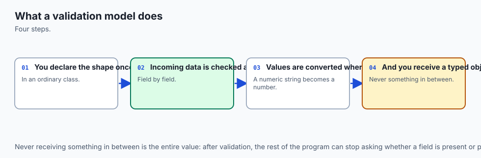
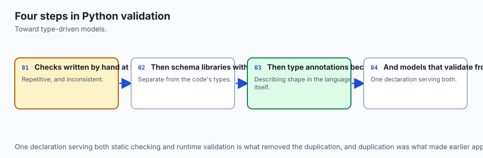
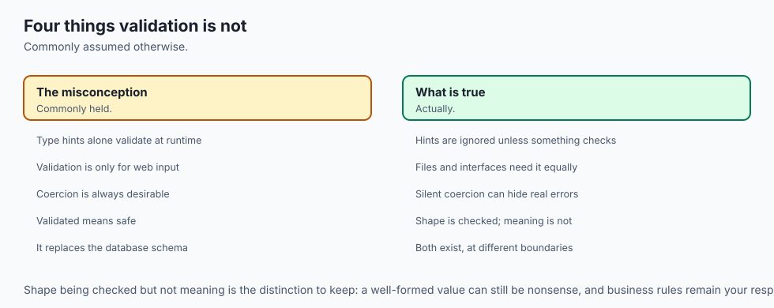
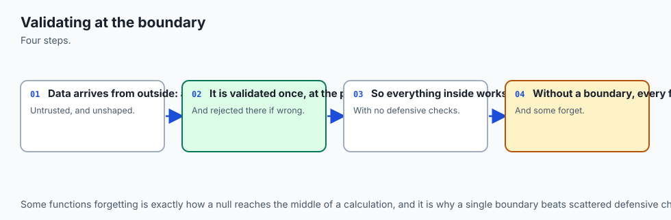
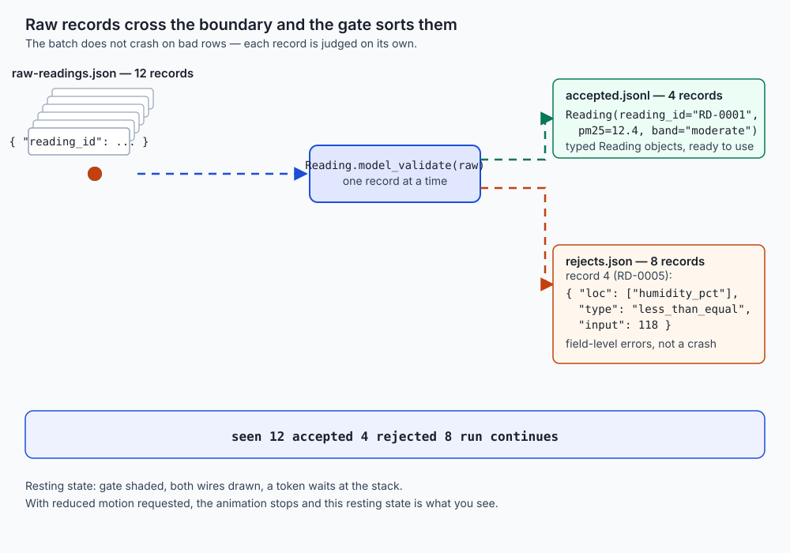
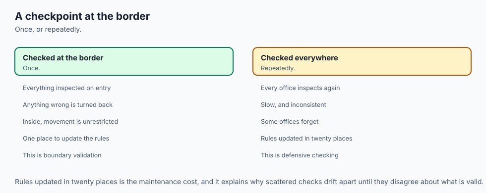
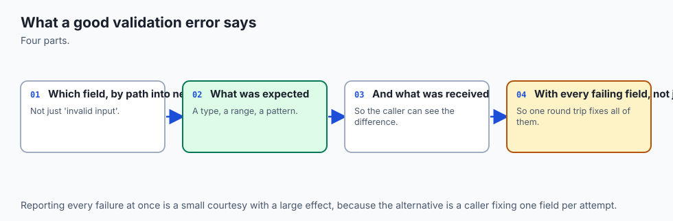
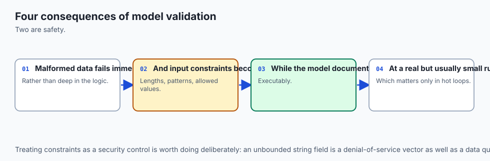
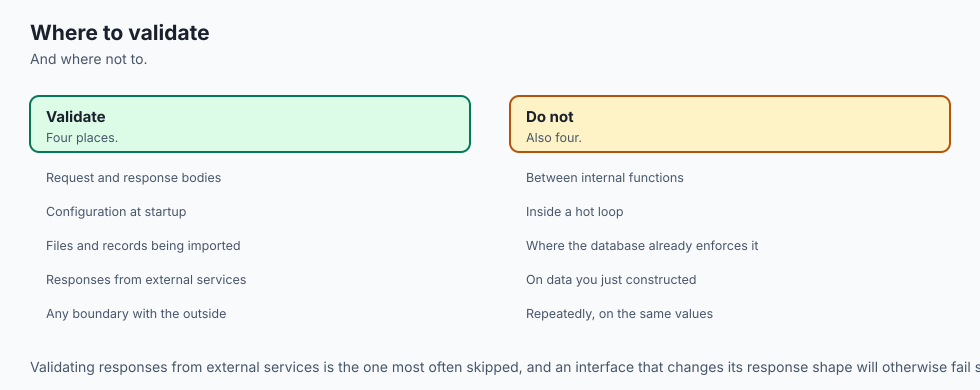

## Why this matters

Here is a bug I want you to feel before we name anything.

A nightly job reads a sensor feed, averages the readings, and writes one number to a dashboard. It has run for eight months. This morning the number is 41.

Nobody panics, because 41 is plausible. It is a Tuesday. Somebody notices a week later, when a different report disagrees, and the investigation takes two days. The cause turns out to be one record in one file, in which the humidity field arrived as `118` instead of `61`. Nothing threw. Nothing logged. The average absorbed it, the dashboard drew it, and a plausible wrong number sat on a screen for nine days.

Now the second bug, from the same job, three weeks later. A different record has `"pm2_5": "not-measured"` where a number belonged. This time something *did* throw:

```
Traceback (most recent call last):
  ...
ValueError: could not convert string to float: 'not-measured'
```

The job died on record four of twelve thousand. The other 11,996 records — the good ones — were not processed. Nobody learned about any of the *other* problems in the file, because the run never got that far. The next morning somebody fixed record four, re-ran it, and it died on record nine hundred.

Those two bugs look opposite and they are the same bug. **Nothing in that program had ever been told what a valid record is.** So the first bad value was accepted and the second one was fatal, and which one you got was an accident of what happened to be wrong.

Here is the framing that fixes both, and it is worth taking away even if you never write a line of pydantic:

> **A program's boundary is where data stops being your problem and starts being your responsibility.**

Everything crossing that line — a JSON body, a CSV row, an environment variable, a config file, a message off a queue, a language model's reply — is untrusted until something checks it. Not untrusted in the sense of hostile, necessarily. Untrusted in the sense that *you did not make it and you cannot vouch for it*, and the moment you pass it inward, every assumption downstream is one you have taken on personally.

The cost of getting this wrong lands in four places, and they are worth naming separately because they need different fixes.

**Wrong answers look right.** This is the expensive one. An out-of-range humidity does not announce itself; it just moves an average. The failure is silent, so the clock on discovery starts whenever somebody happens to compare two numbers.

**One bad record ends the run.** The opposite failure, and the one that wastes people rather than corrupting data. A pipeline that raises on the first malformed row processes nothing and tells you about exactly one problem.

**The rules live nowhere.** When "valid" is expressed as scattered `if` statements, it is enforced in four of the five places that build a record, and nobody can tell you which four. Adding a field means editing every one of them, and the fifth is found by an outage.

**The errors are unusable.** `ValueError: could not convert string to float: 'not-measured'` does not say which record, which field, or what else was wrong in the same file. Whoever owns the source data cannot act on it.

Today's tool fixes all four at once, and the reason it can is almost embarrassing: **you were already writing the rules down.** Every time you annotate `humidity_pct: int`, you have stated a rule. pydantic's whole proposition is to take that annotation — which the type checker reads before your program runs, and then throws away — and enforce it at runtime, on every value that crosses.

This is also the day the rest of the week rests on. Day 98's section project is a pipeline, and a pipeline without a gate is a pipeline that either lies or dies.

## The idea in plain language



Think of your program as a country and its boundary as the border.

Data arriving at the border is a shipment with a declaration attached. The declaration claims the crate contains twelve micrograms of particulate matter, taken at a station called `ST-KLM`, at six in the morning on the fifteenth of August. Your job at the border is to decide, before the crate goes anywhere, whether the declaration is true and whether the contents are legal.

There are three ways to run a border, and every codebase has tried all three.

**Wave everything through.** Fast, cheap, and the reason the dashboard said 41.

**Inspect by hand, crate by crate.** One officer, one written procedure, one paragraph per item. It works. It is also where the procedure and the crates drift apart, slowly, until the officer is checking things that no longer arrive and waving through things that do.

**Publish the rules and check every crate against them.** The rules exist once, in one place, as a document. Every crate is checked against that same document. When the rules change, they change in one place. When a crate fails, the rejection notice cites the rule, names the item, and lists *every* problem with the shipment rather than the first.

That third one is a schema, and pydantic is a way of writing it in the annotations you were writing anyway.


And here is the part that makes today fit into the course rather than sit beside it. You have now met all three members of a family, and they are usually taught as if they were rivals:

- **The type checker, before it runs** (Day 75). Reads your annotations statically. Catches code that could never work.
- **The validator, as data arrives** (today). Reads the same annotations at runtime. Catches data that is wrong now.
- **The database constraint, as data is stored** (Day 88). Catches anything that reached the table by any route at all.

They are not rivals and they are not redundant. Each one catches something the others *structurally cannot*, and the word "structurally" is doing real work there — it is not that the others are less thorough, it is that they are not present at the right moment. We will make that precise shortly.

## Historical background



Python has had optional type annotations since PEP 3107 in 2006, but for years they were syntax without a consumer — you could write `def f(x: int)` and the interpreter would store the annotation in `f.__annotations__` and do absolutely nothing with it. PEP 484 in 2014 gave them a meaning, the `typing` module gave them a vocabulary, and static checkers gave them teeth. The [Python `typing` documentation](https://docs.python.org/3/library/typing.html) is still explicit that the runtime does not enforce them; they are for tools.

That left a gap that was obvious in hindsight. Programs had, sitting right there in the source, a machine-readable description of what every value was supposed to be — and at the boundary, where it mattered most, nobody was reading it.

Several projects filled the gap from different directions. `marshmallow` (2013) came from the web world and asked you to declare a schema class separately from your data class. `attrs` (2015) came from the "classes are too much boilerplate" direction and added validators as an option. `jsonschema` came from the standards direction, implementing a language-independent specification. `cerberus` took the "rules as a dictionary" approach. Python's own `dataclasses` arrived in 3.7 (2018) and deliberately stopped short: they generate `__init__`, `__repr__` and `__eq__` from annotations and, as the [`dataclasses` documentation](https://docs.python.org/3/library/dataclasses.html) makes clear, they do not validate anything.

pydantic's bet, made in 2017, was different and slightly cheeky: **the annotation is the schema.** Not a schema derived from the annotation, not a schema declared alongside it — the annotation itself. Write `humidity_pct: int` and you have declared a runtime rule.

The bet paid off for a reason that had little to do with validation. FastAPI adopted pydantic as its request and response layer, and suddenly the same annotation was doing four jobs at once: it told the type checker what the value was, validated the incoming request, generated the OpenAPI schema, and serialised the response. The [FastAPI documentation](https://fastapi.tiangolo.com/) is built entirely on that idea, and Day 82's 422 responses were pydantic errors rendered as JSON — you have already read one, before you knew what it was.

Version 2, released in 2023, rewrote the validation core in Rust as a separate package, `pydantic-core`. The [pydantic documentation](https://docs.pydantic.dev/latest/) states this plainly as the architecture. I am going to be careful here, because performance claims are where technical writing usually starts inventing things: **the Rust core is a documented fact about how the library is built; the specific speed multiplier you may have seen quoted is not something I measured, and I am not going to repeat a number I did not produce.** What I *can* tell you from this machine is that the reference suite in today's lab — 47 tests, several hundred validations — completes in 0.34 seconds, and that validation never showed up as something worth thinking about at this scale.

Version 2 also changed the API, and the change is worth knowing because half the tutorials you will find online are still v1. This lesson uses v2 throughout:

| The v1 way | The v2 way |
| --- | --- |
| `@validator("field")` | `@field_validator("field")` |
| `@root_validator` | `@model_validator` |
| `Model.parse_obj(data)` | `Model.model_validate(data)` |
| `instance.dict()` | `instance.model_dump()` |
| `instance.json()` | `instance.model_dump_json()` |
| `class Config:` inside the model | `model_config = ConfigDict(...)` |
| `parse_obj_as(list[T], data)` | `TypeAdapter(list[T]).validate_python(data)` |

If you find an answer online using the left column, it is not wrong, it is old. Translate it.

## What it is — and what it is not



pydantic **is** a runtime validation and serialization library. You declare a class; it builds a validator from the annotations; you feed it untrusted data; you get back either a typed object or an exception describing every problem.

It **is not** a static type checker. It runs when your program runs, on real values. Day 75's checker runs before, on code. They read the same annotations for different purposes and neither replaces the other.

It **is not** an ORM. Day 93's SQLAlchemy models describe rows in tables and know how to load and save them. A pydantic model describes a shape and knows how to check it. They are frequently used together — the API layer validates with pydantic and persists with SQLAlchemy — and the fact that both are called "models" has confused a great many people.

It **is not** a parser in the byte-handling sense. Something else turns bytes into `dict`s and `list`s — `json.load`, a CSV reader, an HTTP framework. pydantic starts once you have Python objects. (It does offer `model_validate_json`, which parses and validates in one step, but the parsing is still parsing.)

It **is not** a serialization format. JSON is a format. `model_dump_json` produces JSON. pydantic is the thing in the middle that decides what is allowed to become JSON and what a JSON document is allowed to become.

It **is not** an authorization check. A record can be perfectly valid and still be one this caller has no business submitting. Validation asks "is this well-formed?"; authorization asks "are you allowed?". Conflating them is a classic way to build a system that is careful about the wrong thing.

And one more, because it is the most common misconception among people who have used it a little: **it is not a coercion library that happens to validate.** The coercion is real and it is the part people notice first, but the coercion rules are a deliberate, conservative policy that we are about to look at closely — and you can turn the whole thing off.

## Why it was created and what problems it solves

Let me show you the "before" honestly, because the argument only works if the hand-written version is written fairly rather than as a straw man.

Here is boundary validation done by hand. It works. It is roughly what every codebase grows.

```python
def validate_reading_by_hand(raw):
    problems = []
    if not isinstance(raw, dict):
        return None, ["record is not an object"]
    clean = {}

    reading_id = raw.get("reading_id")
    if reading_id is None:
        problems.append("reading_id is missing")
    elif not isinstance(reading_id, str):
        problems.append("reading_id is not a string")
    else:
        clean["reading_id"] = reading_id

    station = raw.get("station")
    if station is None:
        problems.append("station is missing")
    elif not isinstance(station, dict):
        problems.append("station is not an object")
    else:
        code = station.get("code")
        if not isinstance(code, str):
            problems.append("station.code is missing or not a string")
        else:
            clean["station_code"] = code

    pm = raw.get("pm2_5")
    if pm is None:
        problems.append("pm2_5 is missing")
    else:
        try:
            clean["pm25"] = float(pm)
        except (TypeError, ValueError):
            problems.append("pm2_5 is not a number")

    # ... and one more block per field, forever
    return (None, problems) if problems else (clean, [])
```

Note what is *right* about it. It collects problems rather than raising on the first — that is the good instinct, and it is rarer than it should be. It distinguishes absent from malformed. It returns a clean record.

Now note what it cannot do, and be precise, because "it's verbose" is not an argument.

Run it over the lab's twelve-record batch and it accepts ten and rejects two. The pydantic schema over the same batch rejects seven. The four extra rejections are:

| Record | What is wrong | Why the hand-written version misses it |
| --- | --- | --- |
| 4 | `humidity_pct` is 118 | There is no range check anywhere. Adding one means another `if`, and another, per field, per bound. |
| 6 | `station.code` is `"ST-north"` | There is no pattern check. It is a string, and a string is all the code asked for. |
| 8 | `recorded_at` is `"15/08/2026 10:00"` | Nothing looks at the timestamp at all. Adding date handling means picking a parser and a policy. |
| 9 | `pm2_5` is 612.5 with no explanatory note | A rule spanning two fields. There is no natural place to put it, so it goes at the end and gets forgotten. |

And the deeper problems, which no amount of extra `if` statements fix:

- **The rules live in a function, so they are enforced only where the function is called.** Add a second code path that builds a reading and you have a second, unvalidated boundary. Nothing tells you.
- **The errors are prose.** `"pm2_5 is not a number"` cannot be counted, grouped, alerted on, or turned into a report that says "43 records failed the same rule". A machine cannot act on a sentence.
- **There is no schema to publish.** You cannot hand this function to a front-end team, generate documentation from it, or use it to constrain a language model's output.
- **It rots.** Not metaphorically. A field gets renamed in the model and not in the validator, and the validator silently stops checking it, because `raw.get("humidty_pct")` returns `None` just like an absent key.

Here is the same thing declared:

```python
StationCode = Annotated[str, StringConstraints(pattern=r"^ST-[A-Z]{3}$")]
Percent     = Annotated[int, Field(ge=0, le=100)]
Micrograms  = Annotated[float, Field(ge=0.0, le=1000.0)]

class Station(BaseModel):
    model_config = ConfigDict(extra="forbid", str_strip_whitespace=True, frozen=True)
    code: StationCode
    name: str = Field(min_length=1, max_length=60)
    elevation_m: int = Field(ge=-500, le=9000)

class Reading(BaseModel):
    model_config = ConfigDict(extra="forbid", str_strip_whitespace=True,
                              validate_assignment=True, populate_by_name=True)
    reading_id: Annotated[str, StringConstraints(pattern=r"^RD-\d{4}$")]
    station: Station
    recorded_at: datetime
    pm25: Micrograms = Field(alias="pm2_5")
    temperature_c: float = Field(ge=-90.0, le=60.0)
    humidity_pct: Percent
    operator: str | None
    notes: str | None = None
```

That is the complete set of rules, in one place, checked identically everywhere, generating its own JSON Schema, producing machine-readable errors — and shorter than the hand-written version that checked four fields.

## How it works



### What happens at instantiation

When you define a `BaseModel` subclass, pydantic reads the class's annotations at *class creation time* and builds a validator — in v2, a compiled schema handed to the Rust core. That happens once, when the module is imported. Validating a record then runs that prepared validator rather than interpreting your annotations afresh, which is where the speed comes from.

Three ways in, and the difference matters:

```python
Reading(reading_id="RD-0042", ...)          # keyword arguments
Reading.model_validate(raw_dict)            # a dict — the boundary case
Reading.model_validate_json(raw_text)       # parse and validate in one step
```

At the boundary you almost always want the second or third, because the data arrived as a document, not as keyword arguments.

### Coercion, and the surprise everyone gets

This is where beginners are ambushed, so rather than describe the rules I am going to show you what this machine actually said when asked. Every row below is a real `TypeAdapter(...).validate_python(...)` call in pydantic 2.13.4, run twice — once in the default mode and once with `strict=True`:

```
input                    declared as  lax (default)                      strict=True
----------------------------------------------------------------------------------------
'42'                     int          42                                 refused: int_type
'42.0'                   int          42                                 refused: int_type
'  42  '                 int          42                                 refused: int_type
'forty-two'              int          refused: int_parsing               refused: int_type
42.0                     int          42                                 refused: int_type
42.7                     int          refused: int_from_float            refused: int_type
True                     int          1                                  refused: int_type
'3.14'                   float        3.14                               refused: float_type
3                        float        3.0                                3.0
42                       str          refused: string_type               refused: string_type
None                     str          refused: string_type               refused: string_type
'yes'                    bool         True                               refused: bool_type
'true'                   bool         True                               refused: bool_type
1                        bool         True                               refused: bool_type
'2026-08-15T06:00:00Z'   datetime     datetime.datetime(2026, 8, 15, 6, 0, tzinfo=TzInfo(0)) refused: datetime_type
'15/08/2026'             date         refused: date_from_datetime_parsing refused: date_type
1786773600               datetime     datetime.datetime(2026, 8, 15, 6, 0, tzinfo=TzInfo(0)) refused: datetime_type
'[1, 2]'                 list[int]    refused: list_type                 refused: list_type
(1, 2)                   list[int]    [1, 2]                             refused: list_type
set[1, 2]                list[int]    [1, 2]                             refused: list_type
```

Read that table twice; there is more in it than there looks.

**The organising rule of lax mode is not "convert anything plausible".** It is closer to *convert when the conversion is unambiguous and loses nothing*. `"42"` to `42` loses nothing, so it happens. `42.7` to `42` would discard the `.7`, so it is refused with `int_from_float`. And note the row that surprises people most: `"42.0"` as an `int` **is** accepted, because the fractional part is zero and therefore nothing is lost. That is consistent, once you see the rule.

**Four specific things to carry away:**

1. `True` validates as the integer `1`. `bool` genuinely is a subclass of `int` in Python, and this is the one lax rule I would call genuinely hazardous — a checkbox arriving where a count was expected is a bug that survives to production.
2. `42` does **not** validate as a `str`. Coercion is not symmetric; numbers do not become strings by default, because that direction is almost always a mistake rather than a convenience.
3. `'yes'` validates as `True`. There is a fixed set of accepted spellings, and it does not include everything you might guess.
4. `int` to `float` is the one conversion **strict mode still allows**. Everything else in the strict column is a refusal.

**When to use strict mode:** when a wrong guess is worse than a rejection. Money, identifiers, anything from a source that is supposed to be well typed already — a database row, another service's response, a message from a system you control. **When to stay lax:** when everything genuinely arrives as text and coercing it is the whole job. A CSV has no types. A query string has no types. An environment variable has no types. Refusing to coerce there means writing the coercion yourself, worse.

You can request strictness at three scopes: `Model.model_validate(data, strict=True)` for one call, `Field(strict=True)` for one field, `ConfigDict(strict=True)` for a whole model. Per-field is the most useful in practice: strict on the identifier and the amount, lax on everything else.

### `Field`, `Annotated`, and saying it once

`Field` carries constraints, defaults, aliases and documentation:

```python
name: str = Field(min_length=1, max_length=60, description="Human-readable site name")
elevation_m: int = Field(ge=-500, le=9000)
pm25: float = Field(alias="pm2_5")
```

The problem with writing `Field(ge=0, le=100)` inline is that the moment you need it on a second field you repeat it, and the moment you need it on a ninth you get one of them wrong. `Annotated` fixes that by letting you name the constrained type:

```python
Percent = Annotated[int, Field(ge=0, le=100)]
humidity_pct: Percent
battery_pct: Percent
signal_pct: Percent
```

This is the modern idiom and it is worth adopting as a default. Static type checkers see through `Annotated` to the underlying `int`, so you keep everything Day 75 gave you; pydantic sees the metadata and enforces it. `Percent` now means something in your codebase, which is a documentation win as much as a validation one.

### Nested models and lists of models

Nesting requires nothing special. Declare a field as another model, and pydantic validates it in its own right:

```python
class Reading(BaseModel):
    station: Station     # validated as a Station
```

The important consequence is in the error report. A failure inside the nested model produces `loc = ("station", "code")` — the path, not just the field. On a list, the index leads: `loc = (1, "station")` means the second element. That path is what lets a report point at a specific place in a specific record in a large document.

### Required, optional, nullable — three different things

These get collapsed into one idea constantly, and the confusion is expensive. Look at these two lines:

```python
operator: str | None          # REQUIRED and NULLABLE
notes: str | None = None      # OPTIONAL and nullable
```

They differ in exactly one character-sequence — the default — and that difference is the whole distinction.

| | Key may be absent? | Value may be `null`? | Example |
| --- | --- | --- | --- |
| Required, not nullable | No | No | `reading_id: str` |
| Required, nullable | No | Yes | `operator: str \| None` |
| Optional, not nullable | Yes | No | `retries: int = 3` |
| Optional, nullable | Yes | Yes | `notes: str \| None = None` |

**Nullable is about the type. Optional is about the default. They are independent.** All four combinations are meaningful and all four are used.

The confusion has a historical cause worth knowing: the older spelling `Optional[str]` means *nullable*, not *optional*, which is precisely backwards from the English word. `X | None` is clearer and is what you should write now.

You never have to argue about this, because the schema will tell you:

```
required fields : ['humidity_pct', 'operator', 'pm2_5', 'reading_id', 'recorded_at', 'station', 'temperature_c']
```

`operator` is there. `notes` is not. Settled.

### Reading a `ValidationError` properly

This is the single most practically useful section of the day.

A `ValidationError` reports **every problem it found in one pass**, not the first. Feed it a record broken in three ways and you get three entries:

```
pydantic: 3 validation error(s)
  station.elevation_m
    type=int_parsing input='high'
  pm2_5
    type=float_parsing input='unreadable'
  humidity_pct
    type=int_type input=None
```

One round trip, three fixes. Compare that to the hand-written `float()` that raised on the first one.

`exc.errors()` gives you a list of dictionaries, each carrying four keys:

| Key | What it is | Assert on it? |
| --- | --- | --- |
| `loc` | A tuple locating the problem: `("humidity_pct",)`, `("station", "code")`, `(1, "station")` | **Yes** |
| `type` | A symbolic name for the rule broken: `float_parsing`, `less_than_equal`, `extra_forbidden` | **Yes** |
| `input` | The offending value, echoed back | In a report, yes. In a test, rarely. |
| `msg` | English prose: "Input should be a valid number" | **Never** |

**Assert on `type` and `loc`. Never on `msg`.** The prose is not a stable API. A library is entitled to improve a sentence in any release, and a suite that greps error text passes right up until somebody rewords a message, then fails for a reason that has nothing to do with your code.

Day 82 made exactly this point about a FastAPI 422 body — and it is not an analogy, it is *literally the same structure*, serialised to JSON. If you learned then to read `detail[0].loc` and `detail[0].type` rather than the message, you already had today's habit.

Two details worth knowing before they bite:

- **`loc` uses the alias**, not the field name. If `pm25` carries `alias="pm2_5"`, the error says `("pm2_5",)`. That is correct and deliberate: the report has to name the key the caller actually sent, or it is useless to whoever owns the file. It also means a test asserting `("pm25",)` will fail.
- **`type` names have their own shape worth checking rather than assuming.** In this lab a model-wide `frozen=True` reports `frozen_instance`, not the per-field `frozen_field`. I found that out by running it, and it is a nice small demonstration of why "assert on `type`" does not mean "guess the `type`".

### Validators: field and model, before and after

Constraints handle "this value must be in this range". Validators handle everything else.

```python
@field_validator("recorded_at", mode="after")
@classmethod
def timestamp_must_carry_a_timezone(cls, value: datetime) -> datetime:
    if value.tzinfo is None:
        raise ValueError("recorded_at must include a timezone offset")
    return value
```

Two modes, and the choice is mechanical once you see it:

- **`mode="before"`** runs on the raw input, before pydantic's own parsing. Use it to *repair* — to accept a legacy date format and hand back a real `datetime`, to split a string into a list, to unwrap a value some upstream system double-encoded.
- **`mode="after"`** runs on the already-validated, already-typed value. Use it to *check* something the type system cannot express, or to normalise — the lab turns a whitespace-only note into `None`, because an empty string is not a note.

You raise a plain `ValueError`. You never construct a `ValidationError` yourself; pydantic catches your `ValueError` and folds it into the report as an entry of type `value_error` located at that field.

`model_validator` is the same idea one level up, for rules no single field can carry:

```python
@model_validator(mode="after")
def a_high_reading_must_be_explained(self) -> "Reading":
    if self.pm25 > 500.0 and not (self.notes and self.notes.strip()):
        raise ValueError("a pm25 reading above 500 requires a note explaining it")
    return self
```

Above 500 micrograms the instrument is either witnessing something serious or misbehaving, and the difference is not in the number — so the schema demands that a human wrote down which it was. That rule needs to see two fields at once, so it cannot live on either. Its error carries an **empty `loc`**, which is exactly right: no single field is at fault, the combination is.

### `computed_field`

A property that is serialised but never accepted as input:

```python
@computed_field
@property
def band(self) -> str:
    if self.pm25 <= 12.0: return "good"
    if self.pm25 <= 35.4: return "moderate"
    ...
```

`band` now appears in `model_dump()` and in the generated JSON Schema. It cannot be set. Consumers get the derived label without every consumer re-deriving it, and nobody can lie about it.

### Serialization, and where the round trip breaks

```python
reading.model_dump()        # Python objects; recorded_at stays a datetime
reading.model_dump_json()   # a JSON string; recorded_at becomes ISO 8601 text
```

The [ISO 8601](https://en.wikipedia.org/wiki/ISO_8601) rendering is what makes the JSON form portable — most-significant-first at fixed widths, so it also sorts correctly as text, which Day 91 leaned on.

Both take `by_alias`, `include`, `exclude` and `exclude_none`, and that is where you decide what an outward-facing extract may contain. Excluding the operator's name at the serialiser rather than in six call sites is the whole reason those arguments exist.

Now the part people get wrong. **`Model.model_validate(instance.model_dump())` is not guaranteed to work.** Here is this machine refusing it:

```
model_validate(model_dump())                  -> refused: band [extra_forbidden]
model_validate(model_dump(by_alias, -band))   -> accepted
```

Three reasons the round trip is asymmetric, and all three are correct behaviour:

1. **Computed fields go out and cannot come in.** `band` is serialised because a consumer wants it, and refused on the way back because `extra="forbid"` is doing its job. Nothing computed is an input.
2. **Aliases point the other way on output.** `model_dump()` uses field names; validation expects alias names. Hence `by_alias=True`.
3. **Normalising validators change the value on purpose.** A trimmed string or a blanked note means the object is deliberately not identical to what arrived.

The bug is not any of the three. The bug is assuming they compose.

### `TypeAdapter`: validation for things that are not models

Not everything you need to check is a model. A list of integers, a dict keyed by station code, a bare `datetime`, a union:

```python
TypeAdapter(list[int]).validate_python(["1", "2"])   # -> [1, 2]
TypeAdapter(list[int]).dump_json([1, 2])             # -> b'[1,2]'
TypeAdapter(list[Reading]).validate_python(rows)     # a whole batch in one call
```

Validating a batch through a `TypeAdapter` is the concise option, and its errors carry the element index first: `loc[0]=(1, 'station')` means the second element's station. Note the trade-off, because it decides which one you want: **a `TypeAdapter` over the whole list raises once for the whole list.** If you want the run to continue past a bad element — and at a gate you do — you validate element by element instead.

### The `model_config` options that change behaviour

Most configuration is style. Four are not:

| Option | Default | What it changes |
| --- | --- | --- |
| `extra` | `"ignore"` | `"forbid"` turns an unexpected key from a silent discard into an `extra_forbidden` error. This is how a misspelled field name gets caught. Set it deliberately; it is a security setting, not a preference. |
| `frozen` | `False` | `True` makes the model immutable. Assignment raises with type `frozen_instance`. Good for value objects that should never be edited after they cross the boundary. |
| `str_strip_whitespace` | `False` | `True` trims every string on the way in. Removes an entire class of "why doesn't this match?" bug from human-entered and CSV-sourced data. |
| `validate_assignment` | `False` | `True` re-validates on every attribute assignment, so an object that was legal when built cannot be made illegal afterwards. Costs a validation per write. |

`populate_by_name=True` is the other one worth knowing: it lets an aliased field be filled by *either* name, which is what you want when one model serves both an external feed and your own internal callers.

### Validation as a data-quality gate

Everything so far has been about one record. This is about a batch, and it is the part that makes the day matter.



The rule is easy to state and easy to get wrong:

> **One bad record must not end the run.**

The shape is small:

```python
def run_gate(records):
    result = GateResult()
    seen_ids = {}
    for index, raw in enumerate(records):
        raw_id = raw.get("reading_id") if isinstance(raw, dict) else None
        try:
            reading = Reading.model_validate(raw)
        except ValidationError as exc:
            result.rejected.append(Rejection(index, raw_id, tidy(exc.errors())))
            continue                      # <- the entire lesson is this line
        first_seen = seen_ids.get(reading.reading_id)
        if first_seen is not None:
            result.rejected.append(Rejection(index, reading.reading_id, [{
                "loc": ["reading_id"], "type": "duplicate_id",
                "msg": f"reading_id already used by record {first_seen}",
                "input": reading.reading_id}]))
            continue
        seen_ids[reading.reading_id] = index
        result.accepted.append(reading)
    return result
```

Five things are load-bearing in there, and none of them are the validation:

1. **`except ... continue`.** The record is refused; the loop is not.
2. **The id is pulled from the raw record *before* validating**, so a record that fails can still be named.
3. **The duplicate check lives here and not in the schema**, because uniqueness is a property of the *batch*. No per-record model can see it. This is why a gate is a place and not just a model — and it is exactly the seam where a database `UNIQUE` constraint earns its keep as a third layer.
4. **Both counts are kept.** "8 rejected" is a number you can trend, alert on and threshold.
5. **The errors are kept structured.** `loc` and `type` per rejection, so the report can be grouped and counted rather than merely read.

And the piece people leave out: a gate should be able to **fail the build**. The lab's `--fail-over` flag exits non-zero when the reject rate crosses a line you chose. A gate that can never fail is a log line.

## An everyday analogy



Return to the border, and follow one shipment all the way through, because every piece of machinery in this lesson has a counterpart there.

A crate arrives with a **declaration** — that is the raw dict. The **published tariff schedule**, which says what may enter and in what quantities, is the model. It exists once, it is written down, and it applies identically to every crate, which is the difference between a rule and a habit.

The officer checks the declaration against the schedule. Some discrepancies are **resolved rather than refused**: the declaration says weight `"340"` in text and the schedule wants a number, and everyone agrees what that means, so it is read as 340 and noted. That is lax coercion. But a declared weight of "about half a tonne" is not resolved, because resolving it would mean guessing, and a guess written into a customs record is worse than a rejection. That is `int_parsing` refusing `"forty-two"`.

Some borders run **strict**: the declaration must be on the correct form, in the correct units, with no interpretation whatsoever. Slower, more rejections, and exactly right when the cargo is valuable enough that a wrong guess costs more than a delay.

A crate containing **another crate** is opened and checked in its own right, and the rejection notice says *which* inner crate — `station.code`, not just "something inside was wrong".

The notice itself is the interesting part. A good one lists **every** problem with the shipment, because sending the shipper home to fix one thing and come back is how a queue forms. It cites the **rule number** — that is `type` — and the **line on the declaration** — that is `loc`. It also includes a sentence in plain language for the human reading it, and that sentence is *not* what the shipper's software should be programmed against, because the wording gets revised and the rule numbers do not.

Some rules cannot be checked line by line. "Perishable goods require a refrigeration certificate" needs two lines at once, and the notice for it cannot point at either line alone — so it is filed against the shipment. That is `model_validator` and its empty `loc`.

Meanwhile the border does not close because one crate failed. **Twelve arrive, four pass, eight are held**, and at the end of the day there is a log: which crates, which rules, which declared values. If more than a set fraction of a day's shipments are held, that is escalated — because a spike in rejections usually means something changed upstream, not that eight shippers independently became careless.

Finally, and this is the bit that makes the analogy earn its place: the border is **not the only control**. There are rules about what may be manufactured in the first place (the type checker), and rules the warehouse enforces about what may sit on a shelf (the database constraint). A crate that came in through a side entrance never met the border officer — and that is precisely the case the warehouse rule exists for.

## Examples in practice



### The from-scratch build

Before using the tool, build the toy. The point is not to compete with pydantic; it is to make every decision pydantic makes *for* you visible, by making you make it yourself.

The core is small. A model is an ordinary class whose annotations describe its fields:

```python
def declared_fields(model):
    hints = typing.get_type_hints(model)
    return {name: hint for name, hint in hints.items() if not name.startswith("_")}
```

Already there is a lesson. Use `typing.get_type_hints`, not `model.__annotations__` — because under `from __future__ import annotations` every annotation is a *string* until something resolves it. That single detail is why hand-rolled validators so often work in one module and mysteriously fail in another.

Second decision: **what does "present" mean?**

```python
class _Missing:
    __slots__ = ()
    def __repr__(self): return "MISSING"
    def __bool__(self): return False

MISSING = _Missing()
```

You need a sentinel, because `None` cannot do this job. A field explicitly set to `null` and a field nobody wrote are two different facts about the world, and if absence is represented by `None` you have thrown one of them away before you started. This is *exactly* the required-versus-nullable distinction, arrived at from the implementation side.

Third: **which conversions are allowed?** An explicit table, and every entry is a judgement:

```python
COERCIONS = {
    (str, int): _str_to_int,
    (str, float): _str_to_float,
    (int, float): _int_to_float,
}
```

And the absences matter more than the presences. `(float, int)` is refused because it loses information silently. `(bool, int)` is refused because `isinstance(True, int)` is `True` in Python and letting a checkbox arrive where a count was wanted is a bug that survives to production — which means the naive check has to come *before* the `isinstance` test, or every `True` in the input quietly becomes a perfectly acceptable `1`. `(str, bool)` is refused because there is no single right answer; every codebase picks differently, so this one picks nothing.

Fourth, and the one that looks easy: **collect all errors, do not raise on the first.** It sounds like a small change from `raise` to `errors.append`. It is not, and here is why:

- After a field fails, you must **keep going** rather than return — but you must also not build the object, because it would be half-formed.
- A nested model returns a *list* of errors that have to be **spliced in with their paths rewritten**, so `("code",)` from inside `Station` becomes `("station", "code")` at the top.
- Extra-key detection has to happen **after** the field loop, because you only know which keys are unexpected once you know which are expected.
- Every error needs a **stable shape** — `loc`, `type`, `msg`, `input` — decided up front, or callers cannot write anything against it.

About two hundred lines, and it does five things: finds the fields, decides what present means, applies a coercion policy, recurses into nesting, and collects everything. Over the lab's batch it rejects 3 of 12.

The pydantic schema rejects 7 — and the four extra rejections are a range, a pattern, a date format and a cross-field rule. **None of those are exotic.** Each one would be a function the toy needs hand-written, per field, and kept correct forever. That is the argument, and it is only convincing because you built the toy first.

### The gate on a real batch

```
read      12 records from raw-readings.json
accepted  4
rejected  8

  record 2 (RD-0003): operator [missing]
  record 3 (RD-0004): pm2_5 [float_parsing]
  record 4 (RD-0005): humidity_pct [less_than_equal]
  record 5 (RD-0006): humidity_pct [missing]; humidty_pct [extra_forbidden]
  record 6 (RD-0007): station.code [string_pattern_mismatch]
  record 7 (RD-0001): reading_id [duplicate_id]
  record 8 (RD-0009): recorded_at [datetime_from_date_parsing]
  record 9 (RD-0010): <record> [value_error]

wrote accepted.jsonl and rejects.json to out/
```

Read the rejections; each one teaches something different.

**Record 5** shows the misspelling caught *twice*: `humidty_pct` is an unexpected key, and `humidity_pct` is now missing. Under the default `extra="ignore"` you would get only the second half, and the record would look like it simply forgot a field. The pair of errors is what tells you it was a typo rather than an omission.

**Record 6** shows the nested path. `station.code`, not "something in the station".

**Record 7** is the duplicate, and note which one is rejected: the *second* occurrence, at index 7. The first `RD-0001` was accepted and kept. That ordering is a policy decision the gate makes explicitly.

**Record 9** has an empty `loc`, rendered as `<record>`. That is the cross-field rule.

And the last line of the counts is the whole point: **the process exited 0.** A batch two-thirds bad produced four good records and a report.

### The same schema in an API

You have already used this without knowing. A FastAPI endpoint that declares a pydantic model as its body parameter runs exactly this validation on every request, and a failure becomes a 422 whose `detail` is the same list of entries with the same `loc` and `type`. The [FastAPI documentation](https://fastapi.tiangolo.com/) builds the whole request layer on it. Day 82's `detail[0].loc == ["body", "title"]` was this, with `"body"` prepended to say which part of the request the path is relative to.

### The thing not shown here

`pydantic-settings` is the companion package for loading configuration from environment variables and `.env` files into a validated model — which is a genuinely good idea, because an environment variable is a boundary and `os.environ.get("PORT")` returning `None` at 3am is a rite of passage nobody enjoys. It is a **separate distribution** and it is not installed in this lab. I am describing it from its documentation and **reproducing no output from it**, and the lab's test harness asserts that it really is absent so that this statement cannot quietly become false.

## Implications: security, privacy, performance, scalability, and cost



**Security: `extra="forbid"` is a security setting.** The default is `"ignore"`, which silently drops unexpected keys. The mild consequence is the lost typo. The serious one is **mass assignment**: if a model is ever built from user-supplied data and has a field the user should not control — `is_admin`, `owner_id`, `price` — then whether an unexpected key is ignored or forbidden is the difference between a vulnerability and a 422. Set it deliberately.

**Security: validation is not authorization.** A perfectly valid record can be one this caller has no business submitting. Keep the two checks separate and run both.

**Security: unbounded input and hostile regexes.** An unconstrained `str` will happily try to validate a 500 MB field; set `max_length` on anything crossing a real boundary. And `StringConstraints(pattern=...)` compiles a regular expression, which a carelessly written pattern can be made to backtrack catastrophically on. The two patterns in the lab — `^ST-[A-Z]{3}$` and `^RD-\d{4}$` — are anchored, fixed-length and free of nested quantifiers, which is what makes them safe. Prefer that shape.

**Privacy: the reject report is the leak.** This is the one people do not see coming. Every error entry carries `input` — *the value that failed* — by design, because a report you cannot act on is useless. That is fine when the bad value is `118`. It is not fine when the bad value is a password submitted into the wrong field, a full card number that failed a length check, or an identifier that failed a pattern. Three rules follow: decide where the report goes before deciding what it contains; redact `input` for fields you have classified as sensitive; and never log the whole raw record on failure. Note that a `missing` error's `input` *is* the entire record — that is pydantic's behaviour, and it is exactly the case to redact on a real feed.

**Privacy: quarantine is durable storage of unvetted data.** Writing rejected records somewhere so the source can be repaired is good practice, and it means you now hold a file of exactly the data you were unable to vet. Give it a retention period and an access rule on day one, not after the first audit.

**Performance.** v2's validation core is written in Rust and shipped as `pydantic-core`; that is a documented architectural fact, and I am stating it as such rather than as a benchmark. What I measured on this machine is narrow and I will not stretch it: the lab's 47-test suite, running several hundred validations, completes in 0.34 seconds. At this scale validation is not a cost worth thinking about. At millions of records per run it becomes one, and the honest advice is the same as always — measure your own workload, because the shape of your models matters more than any published multiplier.

Two structural performance notes that hold regardless: model construction happens once at import, so the per-record cost is running a prepared validator rather than interpreting annotations; and `validate_assignment=True` costs a validation on every attribute write, which is invisible on a record you build once and real in a loop that mutates.

**Scalability.** The gate pattern as written loads the batch into memory. For a genuinely large file, rewrite `run_gate` to take an iterator and yield results — the validation is unchanged, only the plumbing moves. Keep the counters exact, because they are what you alert on.

**Cost.** pydantic is MIT-licensed, free, with no paid tier, no account and no service. The real cost of this day is a design cost: deciding where your boundaries are. Most codebases have more of them than anyone realises, and half the value of learning this is the audit it prompts.

## Alternatives: free, open source, and commercial

I ran **pydantic 2.13.4** for this lesson, on Python 3.14.0. Every output quoted above came from that. **I did not run any of the others** — they are not installed in this lab, and everything below is described from documentation and from the shape of each library's published API. Where I would be guessing, I say so.

**pydantic** — *free, open source, MIT.* Choose it when the data crosses a boundary, when you want the annotation and the schema to be the same thing, and when you want JSON Schema out for free. Use `BaseModel` for structures and `TypeAdapter` for anything else. Its weakness is that it is opinionated about coercion, which is a feature at a text boundary and an irritation when you wanted strict types and forgot to ask.

```python
class Station(BaseModel):
    code: Annotated[str, StringConstraints(pattern=r"^ST-[A-Z]{3}$")]
```

**dataclasses with manual validation** — *free, standard library.* Choose it when the data is already yours, the object is internal, and the checks are one or two `__post_init__` assertions. Zero dependencies is a real argument in a library that others will install. The [`dataclasses` documentation](https://docs.python.org/3/library/dataclasses.html) is clear that no validation is provided; `__post_init__` is the hook you get.

```python
@dataclass
class Station:
    code: str
    def __post_init__(self):
        if not re.match(r"^ST-[A-Z]{3}$", self.code):
            raise ValueError("bad station code")
```

The moment you write the third such block, you are writing the "before" from earlier in this lesson.

**attrs** — *free, open source, MIT.* Predates dataclasses and is more powerful: converters, validators, slots, and a `field(validator=...)` API. Choose it when you want rich class-building and are content to write validation as small functions. It is not primarily a boundary tool — there is no JSON Schema generation — so it and pydantic are aimed at different problems more than they compete.

**marshmallow** — *free, open source, MIT.* The schema is a separate class from the data class. Choose it when you want that separation deliberately — several serializations of one object, or a schema that must vary by context — or when you are already in an ecosystem built around it. The cost is that the schema and the class can drift, which is the exact problem pydantic's "the annotation is the schema" bet was made to avoid.

**cerberus** — *free, open source, ISC.* Rules as a plain dictionary rather than as a class. Choose it when the rules are *data* — loaded from a config file, assembled at runtime, edited by someone who does not write Python. That is a genuinely different requirement and it is the case where a class-based library fights you.

**jsonschema** — *free, open source, MIT.* Implements the JSON Schema standard, so the schema is language-independent and can be shared with a front end, a Go service and a test suite. Choose it when the contract must be shared across languages. The trade-off is that you validate a `dict` and get a `dict` back — no typed Python object at the end. A common and sensible pairing is to author in pydantic and *publish* `model_json_schema()` for other languages to consume.

**TypedDict with a static checker** — *free, standard library plus a checker.* Describes the shape of a dictionary for Day 75's checker. Choose it when the data genuinely is a dictionary throughout and the checking you want is static. Be clear-eyed about the limit: **it does nothing at runtime.** A `TypedDict` will not notice that the JSON you just loaded has a string where an int belongs. It is a Day 75 tool, not a Day 94 one, and confusing the two is how a codebase ends up believing it validates.

| | Runtime check | Typed object out | JSON Schema out | Rules as data | Standard library |
| --- | --- | --- | --- | --- | --- |
| pydantic | Yes | Yes | Yes | No | No |
| dataclasses + manual | Only what you write | Yes | No | No | Yes |
| attrs | Yes | Yes | No | No | No |
| marshmallow | Yes | Via a separate class | Partly | No | No |
| cerberus | Yes | No — dicts | No | Yes | No |
| jsonschema | Yes | No — dicts | It *is* the schema | Yes | No |
| TypedDict + checker | **No** | No — dicts | No | No | Yes |

All seven are free and open source. There is no commercial validation library worth naming in this space, which is itself informative: the problem is well enough understood, and the open-source options are good enough, that nobody has managed to sell one.

## Comparison with related concepts

**Validation versus parsing.** Parsing turns bytes into structure and asks nothing about meaning. `json.loads('{"humidity_pct": 118}')` succeeds perfectly. Validation asks whether the structure makes sense. You need both, in that order, and a library that blurs them tends to give you confusing errors when the input was not even JSON.

**Validation versus type checking.** Day 75's checker reads annotations before the program runs and never sees data. pydantic reads the same annotations at runtime and sees nothing else. A `TypedDict` gives you the first with none of the second; a bare `isinstance` check gives you the second with none of the first. The reason it feels like they should be one thing is that they share a notation — and sharing the notation is precisely pydantic's contribution.

**Validation versus database constraints.** The one that gets argued about, so let us be precise about who catches what.

| | Runs | Catches | Cannot catch |
| --- | --- | --- | --- |
| Type checker (Day 75) | Before the program runs | Code that could never work: an `int` added to a `str` | Anything about actual data — it never sees a byte |
| Validator (Day 94) | As data arrives | Data wrong now, with a field-level report a caller can act on | Anything that reaches storage without passing through it |
| Database constraint (Day 88) | As data is stored | Anything reaching the table by any route: a migration, a manual `UPDATE`, another service | Anything about data it never receives; and it cannot give a caller a field-level report |

The middle column is why "the model already checks it, drop the `NOT NULL`" is bad advice. The model protects the path through your application. The constraint protects the table from *every* path, including the ones you did not write and the ones that do not exist yet. Anyone proposing to drop one is proposing that a future mistake go uncaught.

The right-hand column is why the reverse advice is equally bad. A `CHECK` constraint gives the caller an opaque integrity violation. It cannot say "field `humidity_pct` failed rule `less_than_equal`, you sent 118", and it certainly cannot report eight problems at once.

**Validation versus assertions.** An `assert` states something you believe is already true and can be compiled away with `-O`. A validator states something you are checking because you do not believe it yet. Using `assert` at a boundary is a real bug, because in an optimised run the check disappears.

**Validation versus tests.** A test checks your code against data you chose. A validator checks data you did not choose against your code. They fail at different times, for different people, and neither substitutes for the other.

## When to use it — and when not to



**Use it at every boundary, and be generous about what counts as one.** An HTTP request body, obviously. Also: a config file, an environment variable, a CSV, a webhook payload, a message off a queue, another service's response, a language model's output, and the results of a database query if the schema is older than your model. If you did not create the value in this process, it is a boundary.

**Use it when the rules need to be published.** JSON Schema out for free means a front-end team, a documentation page and a generation constraint can all read the same contract.

**Use it when errors need to be actionable by somebody else.** `loc` plus `type` is a report a data owner can work from. A `ValueError` with a sentence is not.

**Use it when the same rules apply in several places.** The value is proportional to the number of places that would otherwise each need their own check.

**Do not use it for values you created three lines ago.** Validating your own freshly-built internal object is ceremony. Boundaries are places, not habits, and applying validation everywhere devalues it exactly where it matters.

**Do not use it in a hot inner loop over data you already validated.** Validate at the boundary, then trust the typed object. If a profiler shows validation inside a tight loop, the fix is usually that the boundary is in the wrong place.

**Do not reach for it in a library where a dependency would be unwelcome.** A small utility package that other people install has a real argument for `dataclasses` and a few explicit checks.

**Do not use it as an authorization layer, an ORM, or a business-rules engine.** A `model_validator` expressing a rule that genuinely varies by caller, by tenant, or by time of day belongs in code that can see those things. The test is whether the rule is a property of the *data* or a property of the *situation*.

**Do not use it if the rules must be edited by non-programmers at runtime.** That is cerberus's case, and it is a legitimate one.

A rule of thumb that has served well: **if the data came from outside this process, validate it; if it came from inside, trust it.** Almost every argument about where to put validation dissolves once you can say which side of that line the value is on.

## The AI connection

- **Validation at the boundary is what keeps bad data out of a system**, rather than
  discovering it downstream.
- **A schema is executable documentation**, checked on every request rather than trusted.
- **Structured model output is validated exactly this way**, which is the direct link to the
  AI courses.
- **Failing loudly at the edge** is far better than a silent wrong value propagating.
- **The same library validates API requests and model responses**, which is why it appears in
  both halves of this curriculum.

## Knowledge check

Before the quiz, check yourself against these. If any answer is hazy, the section it comes from is worth re-reading.

1. What are the four keys on a `ValidationError` entry, and which two should a test assert on? Why is the third one useful in a report but rarely in a test, and why should the fourth never be asserted on at all?
2. `operator: str | None` and `notes: str | None = None`. A record arrives with neither key. What happens to each, and which single property accounts for the difference?
3. Which of these does lax mode accept: `"42"` as an `int`, `"42.0"` as an `int`, `42.7` as an `int`, `True` as an `int`, `42` as a `str`? State the organising rule rather than memorising the list.
4. Which conversion does strict mode still allow?
5. A rule says a reading above 500 requires an explanatory note. Which decorator, which mode, and what `loc` does its error carry?
6. Why does `Model.model_validate(instance.model_dump())` sometimes fail? Name all three causes.
7. Your model has `pm25` with `alias="pm2_5"`. A bad value arrives. What is the error's `loc`, and why that one?
8. Name one mistake the database constraint catches that the validator structurally cannot, and one the validator catches that the constraint structurally cannot.
9. Why is `extra="forbid"` described as a security setting rather than a preference?
10. In the gate, why is the record's id pulled from the raw dictionary *before* validating?

## Hands-on exercise

The lab is **Guard the Boundary**. You are handed twelve air-quality records, eight of them wrong in eight different realistic ways, and you build the gate that lets the good ones through without ever crashing.

Work in this order — it is the order the lesson took, and each step earns the next:

1. **Run `starter/byhand.py`.** This is the "before": validation written longhand. It accepts 10 of 12. Count what it never looks at.
2. **Read `examples/scratch_validator.py`**, then run `examples/scratch_demo.py`. The miniature validator collects every error rather than raising on the first, and rejects 3 of 12. Find the four records it waves through and say, for each, which rule it lacks.
3. **Run `examples/coercion.py`.** Predict five rows before you look. Most people get `"42.0"` as an `int` and `True` as an `int` wrong.
4. **Work exercises 1-6 in `starter/models.py`**: the `Annotated` types, the nested `Station`, the `Reading` with its alias and its required/optional/nullable trio, two `field_validator`s, the cross-field `model_validator`, and the `computed_field`. Delete one `@pytest.mark.skip` line as each starts to pass.
5. **Run `examples/serialize.py`** and watch the round trip fail, then work out from the output why.
6. **Work exercises 7-10 in `starter/gate.py`**: the result types, `run_gate` with its `except ... continue`, the batch-level duplicate rule, and the two output files.
7. **Run `bash tests/run_tests.sh`.**

Every assertion you write must be on `type` or `loc`. If you find yourself reaching for `msg`, stop — that is the habit today exists to prevent.

### Expected output

`python3 examples/gate.py`:

```
read      12 records from raw-readings.json
accepted  4
rejected  8

  record 2 (RD-0003): operator [missing]
  record 3 (RD-0004): pm2_5 [float_parsing]
  record 4 (RD-0005): humidity_pct [less_than_equal]
  record 5 (RD-0006): humidity_pct [missing]; humidty_pct [extra_forbidden]
  record 6 (RD-0007): station.code [string_pattern_mismatch]
  record 7 (RD-0001): reading_id [duplicate_id]
  record 8 (RD-0009): recorded_at [datetime_from_date_parsing]
  record 9 (RD-0010): <record> [value_error]

wrote accepted.jsonl and rejects.json to out/
```

`python3 examples/scratch_demo.py`, the two lines that carry the argument:

```
from scratch : accepted 9, rejected 3
pydantic     : accepted 5, rejected 7
```

`python3 examples/serialize.py`, the round-trip section:

```
model_validate(model_dump())                  -> refused: band [extra_forbidden]
model_validate(model_dump(by_alias, -band))   -> accepted
```

`bash tests/run_tests.sh` ends with:

```
62 checks, 0 failure(s).
```

Full captures of every script are in the lab's `expected-output/` directory. Read `expected-output/FIELDS.md` first — it says which lines are fixed and which may legitimately differ on your machine.

### Validate your work

1. `python3 -c "import pydantic; print(pydantic.VERSION)"` prints `2.13.4` from the lab's environment.
2. `pytest tests -q` ends `47 passed`.
3. `pytest starter -q` ends `1 passed, 9 skipped` before you begin, and `10 passed` when every exercise is done.
4. `python3 examples/gate.py` **exits 0** on a batch that is two-thirds bad, and `out/rejects.json` names all eight refusals with `loc`, `type`, `msg` and `input`.
5. `python3 examples/gate.py --fail-over 0.1; echo $?` prints `1`.
6. `bash tests/run_tests.sh` reports `62 checks, 0 failure(s).` and exits 0.

Check number 4 is the one that matters. If the gate raises, nothing else in the lab is worth much.

### Troubleshooting

**`ModuleNotFoundError: No module named 'pydantic'`** — the interpreter running the script is not the one the packages were installed into. Create the lab's virtual environment and run everything through `.venv/bin/python3`, or point the harness at an interpreter you already have with `PYTHON=... PYTEST=... bash tests/run_tests.sh`.

**The error's `loc` says `pm2_5` but my field is `pm25`** — correct and deliberate. `loc` names the key the caller sent, because the report has to be usable by whoever owns the source file. Assert on `("pm2_5",)`.

**`band [extra_forbidden]` when I feed a dump back in** — `band` is a computed field, serialised on the way out and refused on the way in. The trip that works is `model_validate(model_dump(by_alias=True, exclude={"band"}))`.

**`value_error` with an empty `loc`** — that is the `model_validator`. Its `loc` is empty because no single field is at fault.

**`datetime_from_date_parsing` on a date that looks fine** — `15/08/2026 10:00` is unambiguous to a human and ambiguous to a parser. If you must accept a local format, parse it yourself in a `field_validator(mode="before")` and hand pydantic a real `datetime`.

**A naive timestamp is refused with `value_error`, not a parse error** — `2026-08-15T06:00:00` parses fine as a `datetime`; it just has no timezone, which is caught one step later by the field validator.

**`ModuleNotFoundError: No module named 'models'`** — run `python3 examples/gate.py` from the lab directory, or `cd examples && python3 gate.py`. The scripts import by bare name.

**`out/` keeps reappearing** — `gate.py` writes there by default. `rm -rf out`, or pass `--out-dir`.

The lab's `troubleshooting.md` has the full list, with the exact messages this lab produces.

### Common mistakes

**Asserting on `msg`.** The most common and the most seductive, because the test reads beautifully and passes today. It breaks on an upgrade for a reason unrelated to your code. Use `type` and `loc`.

**Letting the gate raise "just for now".** The `except ValidationError: ... continue` is the entire exercise. A gate that raises on the first bad record is not a gate.

**Pulling the id after validating.** If you read `reading.reading_id` inside the `try`, a record that fails validation cannot be named in the report — which is the one case the report exists for.

**Confusing optional with nullable.** `X | None` makes a field nullable. A default makes it optional. Check `model_json_schema()["required"]` rather than reasoning about it.

**Expecting the schema to catch the duplicate.** It cannot. Uniqueness is a property of the batch, and no per-record model can see it.

**Leaving `extra` at its default.** Then `humidty_pct` vanishes silently and the record merely looks incomplete. Set `extra="forbid"` deliberately.

**Assuming the round trip is symmetric.** It is not, for three separate correct reasons.

**Reaching for `float()` inside a validator to "help".** If you find yourself repairing values in `mode="after"`, ask whether the repair belongs in `mode="before"` or whether it should be a rejection. Silent repair is how you get a defaulted humidity that is indistinguishable from a measured one.

## Practice assignment

Apply the day to something of your own, and make the rules earn their place.

Take a real, messy dataset you have to hand — an export from a service you use, a CSV somebody emailed you, the output of an earlier day's lab. If you have nothing, use a public data file you can download once.

1. **Look before modelling.** Open it and write down, in prose, ten rules you believe hold. Include at least one range, one pattern, one required-and-nullable field, and one rule spanning two fields.
2. **Model it.** Write a pydantic model expressing all ten. Use `Annotated` for any constraint that appears more than once. Set `extra="forbid"` from the start.
3. **Run it over the whole file with a gate.** Do not let it raise. Emit the valid records and write a report.
4. **Read the report and be surprised.** Some of your ten rules will be wrong, and this is the point of the assignment: at least one thing you were certain about will turn out not to hold in the data. Decide, for each, whether the rule was wrong or the data is.
5. **Group the rejections by `type` and by `loc`** and produce a count per rule. A gate that says "1,204 rejected" is less useful than one that says "1,198 of them failed the same pattern on the same field", which usually means one upstream change rather than 1,198 mistakes.
6. **Add a threshold** and make the script exit non-zero when the reject rate crosses it. Pick the number and write down why.
7. **Write four tests**: one asserting a specific `type` at a specific `loc`; one proving a valid record produces the values you expect; one proving the run completes with a non-zero reject count rather than raising; and one asserting `model_json_schema()["required"]` contains exactly the fields you intended.

Write a short note answering: which of your ten rules was wrong, how the data told you, and which rule you would have missed entirely without the report.

## Extension challenge

Pick one. Each is a real pattern rather than an exercise.

**1. Structured output with a retry loop.** Take a schema and use `model_json_schema()` as the contract for a text-generating system. Parse the reply, validate it, and on failure feed the `ValidationError` entries back as the next instruction. Count the attempts. This loop is the standard pattern in production systems, and building it will teach you more about why `loc` and `type` are structured than any amount of reading.

**2. Discriminated unions.** Extend the feed with `calibration` records that have a different shape. Model both with `Field(discriminator="type")` and confirm the errors name the right branch. Then remove the discriminator and look at the error report you get instead — it is a mess, and that mess is the argument for the feature.

**3. Make the gate streaming.** Rewrite `run_gate` to take an iterator and yield results, so a ten-million-row file never has to fit in memory. Keep the counts exact and the report complete.

**4. Quarantine and repair.** Write rejects to `out/quarantine.jsonl`, then write a second script that reads the quarantine, applies exactly one repair rule, re-validates, and reports how many were rescued. Then write down the retention policy for that file — that part is not optional.

**5. Schema stability tests.** Snapshot `model_json_schema()` to a file and add a test that fails when it changes. A schema change is an API change; make it visible in review rather than in an incident.

**6. Build the fourth layer.** Add SQLAlchemy models (Day 93) with `NOT NULL`, `UNIQUE` and `CHECK` matching your pydantic rules. Then deliberately insert a bad row *bypassing* the pydantic model and watch the constraint catch it. That demonstration is worth more than the paragraph in this lesson.

**7. Compare a peer honestly.** Express one model in `attrs` or `marshmallow`, install it, and write down three things that were harder and one that was easier. Then decide whether you would switch, and why not.

## The AI thread

This is one of the most load-bearing days in the course, and the reason is that modern AI practice is *made of* this problem.

**Structured output is exactly this problem, with a worse source.** When you ask a language model for JSON, what comes back is text that claims to be JSON. It may have a trailing comma. It may be wrapped in a code fence. It may have invented a field, dropped a required one, returned `"unknown"` where a number belonged, or produced a perfectly formed object whose values are wrong in ways only a range check will catch. **A schema is what decides whether the reply is usable**, and the fact that pydantic generates JSON Schema for free is why the same model class can be the prompt constraint, the parser and the check. The retry loop — validate, and on failure hand the model its own `ValidationError` entries as the next instruction — works precisely because those entries are structured, name a `loc` and a `type`, and report every problem at once rather than one per round trip. Everything you learned today about reading errors properly is load-bearing there.

**Tool calling is a validated argument object.** When a model calls a function, the arguments arrive as a JSON object generated by a system that does not execute your code and has no idea what your function requires. Between the model and the function there is a schema, and if there is not, there is a bug waiting. The schema you hand the model to describe the tool and the schema you validate its call against should be the same object — which is exactly the "the annotation is the schema" bet from 2017, arriving somewhere nobody anticipated.

**Every dataset reaching training passes a gate like this one, or fails silently.** This is the part I most want to land. A corpus with 0.3% malformed records does not crash anything. It trains. The model learns from the malformed records too, and nothing anywhere reports a number. Every filtering, deduplication and quality-scoring step in a data pipeline is a validation gate with a policy attached, and the difference between a pipeline that says "rejected 41,204 of 3.1M, 39,880 of them for the same rule on the same field" and one that says nothing is the difference between a dataset you can reason about and one you can only hope about.

**And the evaluation problem is the same problem again.** When a model's output is scored, the scorer parses something. If the parse or the validation fails and the failure is swallowed, the score is computed over the subset that happened to parse — and that subset is not random, because outputs fail to parse for reasons correlated with being bad. A silent validation failure in an evaluation harness produces a number that is too high, looks plausible, and is believed.

The through-line of the day holds all the way down: **untrusted input needs a place with a name where somebody decided what valid means.** Whether the sender is a sensor, a vendor's export, a user's form, another team's service or a language model, the answer is the same shape. Declare the rules once. Enforce them at the boundary. Report every problem, not the first. Count what you refused. And never, ever let a bad record quietly become a plausible number on somebody's screen.
