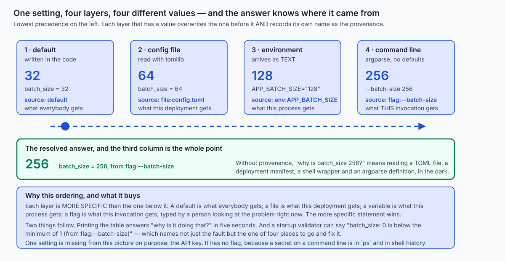

## Why this matters

Here is a script that works. It is six lines long and there is nothing wrong with it.

```python
print("starting preparation")
print("using API key " + API_KEY)
print("processing record " + str(record["id"]))
print("skipping record " + str(record["id"]) + ": empty text")
print("kept " + str(len(kept)) + " of " + str(len(records)) + " records")
print("done")
```

You run it on your laptop. You watch the lines go past. They tell you exactly what you wanted to know. This is not a bad program and the person who wrote it was not careless.

Tomorrow it runs at 04:00 on a machine you have no terminal on. It runs again at 05:00. Its output is appended to a file that already holds one hundred and sixty-seven other runs from this week. At 09:20 somebody who is not you opens that file, because a downstream report has the wrong number in it, and they need to know what happened.

Every one of those six lines is now useless, and each fails differently.

**`processing record 3` — which run?** There are a hundred and sixty-eight of them in that file and they are textually identical. There is nothing to filter on, nothing to group by, no way to say "show me only Tuesday's 04:00 run".

**`skipping record 2: empty text` — when?** No timestamp. The line above it might be from three hours earlier. Ordering within one file is not enough, because two runs interleave the moment anything runs in parallel.

**`could not write output` — how bad?** It is exactly the same shape of text as `processing record 3`. `grep` cannot tell them apart, so no alerting rule can either, so nobody was woken and nobody was emailed, and the failure sat there for five hours.

**All six — how do you turn them down?** You edit the source and you deploy. That is the only mechanism there is, because the decision to print is baked into every call site. And "edit the source and deploy" is exactly the change nobody wants to make while something is already broken.

**And line 2 is a security incident.** The API key is now in the terminal scrollback, in the log file, in whatever CI job captured stdout, and in the ticket somebody pastes it into at 09:25. Not a lint failure. An incident, with a rotation, a disclosure conversation, and an audit of everywhere that file was copied to — and log files are the most-copied artifact a running system produces.

The sentence this whole day hangs on is this one:

> **`print` is for you, at your desk, right now. Logging is for whoever is awake when it breaks.**

They are different jobs. `print` is a debugging aid with a lifetime of about four minutes; a log is evidence with a lifetime of months, read by a stranger under time pressure who cannot ask you anything.

Then the second half, which is the same idea pointed the other way. Logging is how the program tells you what it did. **Configuration is how you tell the program what to do.** And it has the identical failure mode: when nobody can answer "why is it doing that?", the reason is almost never mysterious. It is that a value came from one of four places and nothing recorded which.

For AI work specifically, and this is not a stretch: **a training run you cannot reconstruct is an anecdote, not a result.** The hyperparameters are configuration. The data version is configuration. The seed is configuration. The model name and the prompt template are configuration. And the run log is the only evidence that survives of what actually happened. If your evaluation number is good and you cannot say which data snapshot produced it, you have a number, not a finding — and the next person to try will get a different number and neither of you will know why.

## The idea in plain language

The `logging` module has a reputation for being confusing. It is not confusing; it is **four separate objects**, and every single confusing thing about it follows from people believing it is one object.


**A logger** is the thing you call. It has a name, and the names are dotted, so `myapp.loader` is a child of `myapp` which is a child of the root. It has a level, and that level is the *first* gate.

**A handler** is a destination. Standard output. A file. A rotating file. A syslog socket. A queue. A logger can have several, and each handler has its *own* level, which is the *second* gate.

**A formatter** turns a record into text. It belongs to a handler, not to a logger, which is why the same call can appear as a friendly line on your console and as a JSON object in a file, at the same moment, with no code change.

**A filter** decides whether a record continues, and — this is the part that gets used in practice — may *edit* it on the way through. That is what makes redaction possible at all.

Now follow one call and every surprising behaviour falls out of the picture.

You write `log.info("kept %d of %d", 4, 6)` on `myapp.loader`. First the **logger's level** is checked. If INFO is below it, nothing happens: no record is built, nothing is formatted, no argument is even rendered. That is the cheapest possible exit and it is why lazy formatting matters.

If it passes, a `LogRecord` is created — a plain object holding the template, the arguments, the level, the logger's name, the timestamp, the file and line, and whatever you passed through `extra=`. Note what it is *not*: it is not a string yet. Nothing has been formatted.

Then **this logger's filters** run. Then the record walks *up* the hierarchy — `myapp.loader`, `myapp`, root — and **every handler it passes emits it**. This is propagation, and it is where duplicates come from: a handler on `myapp` and a handler on the root means one call and two lines.

At each handler, the **handler's level** is checked, then the **handler's filters** run, then the **formatter** renders the text, then it is written.

Two things in that walk are not what people assume, and both were measured while this lesson was written rather than taken on trust.

**The ancestors' levels are not re-checked on the way up** — only their handlers are used. So `myapp` set to WARNING does not stop a DEBUG record from `myapp.loader` reaching `myapp`'s handler.

**The ancestors' filters are not applied at all.** A filter on `myapp` runs for calls made *on `myapp`* and for nothing else. Since every well-behaved module calls `logging.getLogger(__name__)` and is therefore a descendant, a redacting filter placed on your top-level logger protects almost nothing while looking like it protects everything. Put it on each **handler**.

The configuration half is simpler and has one idea in it: **four layers, in precedence order, and every value remembers which layer it came from.**



Defaults in the code, then a config file, then environment variables, then command-line flags. Each layer that has a value overwrites the one below it *and records its own name*. So the resolved answer is not `256`; it is `256, from flag:--batch-size`. Those are different facts and only the second one is useful at 03:00.

## Historical background

Both halves of today have a specific origin, and knowing them stops the design feeling arbitrary.

**Severity levels are older than Python by two decades.** They come from **syslog**, written by **Eric Allman** in the early 1980s as part of Sendmail at Berkeley, and they were so obviously useful that everything else adopted them. Syslog was not formally specified until **RFC 3164** in 2001 — which documented existing practice rather than defining it — and was properly standardised as **RFC 5424** in **2009**.

RFC 5424 defines eight severities, and they are worth seeing because Python's five are a deliberate subset:

| Syslog code | Name | Python's equivalent |
| --- | --- | --- |
| 0 | Emergency: system is unusable | — |
| 1 | Alert: action must be taken immediately | — |
| 2 | Critical: critical conditions | CRITICAL (50) |
| 3 | Error: error conditions | ERROR (40) |
| 4 | Warning: warning conditions | WARNING (30) |
| 5 | Notice: normal but significant | — |
| 6 | Informational | INFO (20) |
| 7 | Debug | DEBUG (10) |

Note the direction, because it catches everybody once: **in syslog a lower number is more severe; in Python a higher number is more severe.** Python's numbers go up in tens precisely so you can insert your own level between two of them, which is occasionally the right thing to do and usually is not.

**Python's `logging` module** arrived in **Python 2.3 (2003)**, designed by **Vinay Sajip** and specified in **PEP 282**, with **Trent Mick** as co-author. Its architecture — separate loggers, handlers, formatters and filters, with a dotted hierarchy and propagation — is openly modelled on **log4j**, the Java logging framework created by **Ceki Gülcü**. That inheritance explains a great deal about the module, including the parts people find un-Pythonic: the `camelCase` method names like `setLevel` and `addHandler` are log4j's, and they have been kept for twenty years because breaking them would break every Python program ever written.

**`dictConfig`** — configuring the whole thing from one dictionary — came later, in **Python 2.7 and 3.2 (2010-2011)**, specified in **PEP 391**, also by Vinay Sajip. The motivation is worth noting because it is exactly today's theme: the older `fileConfig` used a bespoke INI format that could not express everything the API could, and a dictionary can come from JSON, from YAML, or — as of Python 3.11 — from TOML, which means your logging configuration can live in the same file as the rest of your configuration and be diffed in review like any other data.

On the configuration side, the document that shaped current practice is **The Twelve-Factor App**, written by **Adam Wiggins** and published in **2011** while he was at Heroku. Its third factor is titled *Config*, and its argument is one sentence long: **store configuration in the environment**. The reasoning is that configuration is what varies between deployments — staging against production, your laptop against the cluster — while code is what does not, and the two must therefore not be mixed. It is the reason environment variables are a layer at all rather than an afterthought, and it is also, as we will see, wrong about a couple of things.

And `tomllib`, the standard library's TOML reader, arrived in **Python 3.11 (2022)**. TOML itself was created by **Tom Preston-Werner** in 2013, explicitly as a configuration format — which is why it has real types, real dates, and no execution semantics whatsoever.

## What it is — and what it is not

**Logging** is the practice of emitting a stream of structured, severity-tagged, timestamped events from a running program, to destinations chosen by configuration rather than by the code that emits them.

Read that definition again with the emphasis on the last clause, because it is the whole difference from `print`. The call site says *what happened and how bad it is*. It does **not** say where the message goes, whether it is written at all, or what it looks like. Those three decisions belong to configuration, and moving them there is what makes the same program debuggable on your laptop and quiet in production without a single edit.

**Configuration** is the set of values that vary between deployments of the same code, resolved once at startup, from layered sources, with validation.

Both definitions carry a lot of weight in the small words. "Resolved once at startup" rules out reading `os.environ` in the middle of a function, which is how a program ends up behaving differently in two places for reasons nobody can find. "With validation" rules out discovering that `BATCH_SIZE=0` is a problem at 03:00 rather than at deployment.

Now what these things are **not**.

**Logging is not `print` with extra steps.** The mechanical difference is a level and a timestamp. The structural difference is that the decision about what is worth seeing has moved out of the source code. That difference is what lets an operator ask for INFO and above without a deployment, and what lets you ask for DEBUG on one module for ten minutes while you hunt something.

**Logging is not tracing, and it is not metrics.** A log line is an event with text. A metric is a number over time — how many requests, how long, how many failed — and answering "is it slow?" from log lines means counting them, which is the wrong tool. A trace follows one request through several services and stitches the spans together. All three are useful; they are not substitutes; and a log that is really a metric in disguise (`log.info("latency was %f", t)` a million times) is expensive and hard to query.

**Logging is not an audit trail.** An audit trail has legal or compliance requirements about completeness, immutability and retention. Logs get rotated away, dropped under load, and lost when a container dies. If you need to prove that something happened, write it to a durable store, in a transaction, deliberately.

**A log is not a debugger.** If you can attach a debugger, attach a debugger. Logging is what you have on a machine where you cannot.

**Configuration is not code.** This is the rule that matters most for security. A configuration file must be *data*, parsed by a parser — TOML, JSON, YAML. Configuring a program by importing a Python file is arbitrary code execution with extra steps, and it looks harmless right up until the file comes from somewhere you did not expect.

**Configuration is not secrets management.** Secrets are configuration in the sense that they vary per deployment, and they are emphatically not configuration in the sense that they can live in a file in your repository. A secrets manager gives you rotation, expiry and access logs. An environment variable gives you none of those, and is still much better than a file in the repository.

**Configuration is not feature flags.** Feature flags change at runtime, per user, without a restart, and they have their own machinery. Everything today resolves once at startup and then does not change, which is a simplification you should make deliberately rather than by accident.

| It is | It is not |
| --- | --- |
| A stream of severity-tagged events with a queryable shape | `print` with a timestamp bolted on |
| Four objects — logger, handler, formatter, filter | One object with a lot of methods |
| Configured at the edge of the program, once | Configured at every call site |
| Values resolved from layers, with provenance recorded | One `os.environ.get` per question, scattered |
| A parser reading a data file | An `import` of a Python module named `settings` |
| A seatbelt against a secret escaping | Permission to log the secret |

## Why it was created and what problems it solves

The `logging` module exists because everybody had already written the worse version of it, badly, six times.

Before it, every serious Python project had a module called `log.py` with a function called `log_message` that took a string and a number, checked a global, and wrote to a file. They were all subtly different, none of them composed, and when you imported two libraries that each had one you got two log files with two formats and no way to line them up. That is precisely the problem log4j had solved for Java, and PEP 282's argument was largely "let us have that, once, in the standard library, so libraries can log without imposing anything on the application that uses them".

That last clause is the design constraint that explains the whole architecture, and it is worth stating plainly because it is not obvious:

> **A library must be able to emit log records without deciding where they go. An application must be able to decide where all records go without knowing which libraries emitted them.**

The dotted hierarchy and propagation exist to satisfy exactly that. A library calls `logging.getLogger(__name__)` and logs. It attaches no handler, chooses no format, opens no file, and — critically — configures nothing globally. The records propagate up to the root, where the *application* has attached a handler, and the application's choice wins for everything. The library has no opinion and needs none.

This is also why the duplicate-message problem exists. It is not a bug; it is the price of that design. If handlers did not accumulate up the tree, an application could not catch a library's records at the root. Since they do, adding a handler both to your own logger *and* to the root gives you two copies of everything.

The configuration half solves a different pain with a similar shape. The Twelve-Factor argument was made against a specific bad practice that was normal in 2011: shipping `config/production.py`, `config/staging.py` and `config/development.py` inside the repository and choosing between them with an import. Three problems, all of them real:

1. **The secrets are in the repository.** Forever, in the history, in every clone, in every backup, after somebody deletes the line.
2. **Adding a deployment means editing code.** A new environment needs a new file and a release.
3. **The mapping from deployment to configuration lives in the code**, so you cannot change one without changing the other, which is the definition of coupling.

Environment variables fix all three: they are set outside the code, per process, by whatever launches it, and nothing about them is committed.

What layering adds on top is the ability to be specific without being repetitive. Defaults mean the program runs with nothing set. A file means the team shares the boring values without typing them. The environment means the deployment differs. A flag means *this run right now* differs, because somebody is standing at a terminal trying something.

And provenance — the part that most implementations skip — solves the failure that costs the most time in practice. Not "the value is wrong", which you notice quickly. **"The value is not what I set it to, and I have four places to look."** Recording where each value came from turns a twenty-minute archaeology exercise into printing a table.

## How it works

### The two-level rule, and the message that vanishes

This is the single most common logging question there is, so it goes first.

```python
log = logging.getLogger("trap")
log.setLevel(logging.DEBUG)          # the logger will accept DEBUG

handler = logging.StreamHandler(stream)
handler.setLevel(logging.WARNING)    # the handler will not emit it
log.addHandler(handler)

log.debug("this vanishes")
log.info("so does this")
log.warning("this gets through")
```

Three calls. One line of output. Captured from the lab:

```text
logger level:  DEBUG   (logging.getLogger('trap').level -> DEBUG)
handler level: WARNING (log.handlers[0].level -> WARNING)
--- three calls were made; this is what came out ---
WARNING  trap             this warning gets through
```

No error. No warning about the warning. The two dropped records simply did not happen.

The rule is: **a record must pass the logger's level AND then each handler's level, and they are different objects.** People set the logger to DEBUG, see nothing, and conclude that logging is broken. Logging is doing exactly what it was told by two different instructions, one of which they did not give.

The diagnostic is three lines and worth memorising:

```python
print(logging.getLevelName(log.level),
      [logging.getLevelName(h.level) for h in log.handlers],
      log.propagate)
```

A related trap: a logger whose level is `NOTSET` (which is the default, and is `0`) does not mean "log everything". It means **"ask my parent"**, walking up until it finds an ancestor that has set one. The root's default is WARNING. So a brand-new logger in a program that never configured anything is effectively at WARNING, which is why `log.info(...)` in a fresh script produces nothing at all and `log.warning(...)` produces a bare line on stderr — that bare line comes from the *last-resort handler*, which exists so that a warning is never silently lost.

### Propagation, and seeing everything twice

```python
root = logging.getLogger()                 # a handler here
app  = logging.getLogger("myapp")          # and a handler here
logging.getLogger("myapp.loader").info("loaded 3 files")
```

One call. From the lab:

```text
--- what the myapp handler wrote ---
MYAPP    | myapp.loader | loaded 3 files
--- what the root handler wrote ---
ROOT     | myapp.loader | loaded 3 files
```

The record travels up: `myapp.loader` (no handlers, nothing written), `myapp` (one handler, one line), root (one handler, one more line). Note that both lines say `myapp.loader` — the record keeps the name of the logger it was created on, which is what makes the hierarchy useful for filtering.

The usual cause is `logging.basicConfig()`, which is a convenience function that **quietly attaches a handler to the root logger**. It also does nothing at all if the root already has one, which is why calling it twice appears to work the first time and be ignored the second.

Two fixes, and they are not equivalent:

```python
logging.getLogger("myapp").propagate = False   # fix 1
```

Right for a **library** that must not have its records escape into an application it knows nothing about — although a library should usually not do even this, and should simply attach no handlers and let the application decide.

```python
# fix 2: attach handlers in exactly ONE place
```

Right for an **application**, because the alternative is a tree of loggers each holding an opinion about where its output goes, and no single place to change any of it.

### Choosing a level honestly

The question is not "how alarming does this feel". It is **"who is this line for, and what do they do about it?"**

| Level | Numeric | Who it is for | What they do |
| --- | --- | --- | --- |
| DEBUG | 10 | You, tracing your own code | Read it while hunting something; off in production |
| INFO | 20 | The operator | Confirm normal life: the run started, this many records |
| WARNING | 30 | The operator, later | Notice a pattern. Nobody gets up |
| ERROR | 40 | Somebody on call | Look at it. Work did not happen |
| CRITICAL | 50 | Somebody on call, now | The process is going down |

Concretely, from the lab:

```text
DEBUG    ( 10)  retrieved 128 rows from the cache in one query
INFO     ( 20)  run 4711 started: model=small-encoder data=2026-08-01 seed=7
WARNING  ( 30)  upstream returned 429; retrying in 2s (attempt 2 of 5)
ERROR    ( 40)  could not write the output file; this batch produced nothing
CRITICAL ( 50)  no disk space remains; shutting down
```

The failure mode to avoid has a name: **level inflation**. If routine events are logged at WARNING because they felt important while you were writing them, the warnings stop being read, and the one that mattered is invisible in the noise. A level is a **promise to the reader about what it costs them to ignore this line**. Break that promise often enough and the levels carry no information at all.

The sharpest test for the ERROR/WARNING boundary: *did work fail to happen?* A retry that succeeded is a WARNING — something surprising occurred and the outcome was still correct. A retry that exhausted its attempts is an ERROR, because a batch produced nothing.

### `exception()`, and what `error(str(e))` throws away

Inside an `except` block, this is what most people write:

```python
except ValueError as error:
    log.error("could not parse batch size: %s", str(error))
```

and this is what it gives the person on call:

```text
ERROR    could not parse batch size: invalid literal for int() with base 10: 'sixty-four'
```

Here is the same failure through `log.exception()`:

```text
ERROR    could not parse batch size
Traceback (most recent call last):
  File "<lab>/examples/02_logging_architecture.py", line 279, in demo_d
    parse_batch_size("sixty-four")
    ~~~~~~~~~~~~~~~~^^^^^^^^^^^^^^
  File "<lab>/examples/02_logging_architecture.py", line 259, in parse_batch_size
    return int(text)
ValueError: invalid literal for int() with base 10: 'sixty-four'
```

The first version says a value was bad. The second says **which line of which function was called with it, and by whom**. On a machine you cannot attach a debugger to, that is the difference between a fix and a guess.

`log.exception(msg)` is exactly `log.error(msg, exc_info=True)`. It reads the exception currently being handled out of the interpreter, so it takes no exception argument, and it must be called *inside* the `except` block. Outside one, pass the exception explicitly: `log.error("...", exc_info=error)`.

And `str(e)` loses the **type** as well. The example above happens to name `int()` in its message; plenty of exceptions have empty messages, and `str(e)` then logs an empty string next to your text, which reads as a bug in your logging rather than a bug in your program.

### Lazy formatting, and what it actually saves

```python
log.info("saw %s", n)        # lazy: the template and the argument, separately
log.info(f"saw {n}")         # eager: the string is built before info() is called
```

The f-string is evaluated *before* `info` is called, because that is what an argument is. Measured in the lab, with a class that counts how often something asked for its string form:

```text
1000 suppressed DEBUG calls with %s formatting: 0 renders
1000 suppressed DEBUG calls with an f-string:   1000 renders
```

So what it saves is exactly this: **the cost of rendering arguments for records nobody wanted.** On a hot path with expensive `repr`s — a dataframe, a model object, a large dict — that is essentially the whole cost of the logging call. On a small integer it is nearly nothing, and it would be dishonest to sell it as a performance technique in general.

There is a second reason that applies always, and it is the better one. The unformatted template survives onto the record as `record.msg`. A structured backend can therefore group every occurrence of `"batch complete: %d records"` as **one event** with varying arguments, which is what makes "how often did this happen today?" a query rather than a regular expression. An f-string destroys that grouping by baking the number into the text.

### Structured logging, and why a log you cannot parse is a log nobody will query

A free-text log is readable by one person looking at one file. The moment there are ten thousand lines across four machines, the question stops being "read this" and becomes "count the ERRORs from run 4711 grouped by event". That is a query, and a query needs fields.

Writing a JSON formatter is one subclass with one method:

```python
class JsonFormatter(logging.Formatter):
    def format(self, record):
        payload = {
            "ts": iso_utc(record.created),
            "level": record.levelname,
            "logger": record.name,
            "event": record.getMessage(),
        }
        payload.update(self.static_fields)          # run_id, service, version
        for key, value in vars(record).items():     # everything from extra=
            if key not in STANDARD_KEYS:
                payload[key] = value
        if record.exc_info:
            payload["exc_type"] = record.exc_info[0].__name__
            payload["traceback"] = self.formatException(record.exc_info)
        return json.dumps(payload, default=str)
```

Real output from the lab:

```text
{"ts": "2026-08-16T12:34:53.430Z", "level": "INFO", "logger": "app.prepare", "event": "batch complete", "run_id": "run-4711", "batch": 1, "kept": 61}
```

Four decisions in there are worth naming.

**One object per line.** Every log-shipping tool ever written reads a stream of lines; a multi-line JSON document is a parsing problem for the reader.

**`event` is the message, and it should be low-cardinality.** `"batch complete"` groups; `"batch 1 complete"` does not.

**`run_id` is a static field on the formatter**, so it is stamped on every line without any call site remembering to. Anything that must appear everywhere belongs there.

**The traceback is its own field**, not glued onto the message, so a parser never has to guess where one ends and the other begins.

The timestamp is ISO 8601 in UTC — the same argument Day 91 made for storing dates in SQLite. Fixed-width, most-significant-first, so text order is chronological order, so `sort` on a log file does the right thing.

And the honest cost: **JSON logs are unpleasant to read with your eyes.** The standard answer is two handlers — a human formatter on the console and JSON to the file or the collector. Same records, two renderings, because the formatter belongs to the handler.

### Never log a secret — and the two ways a filter fails

A filter is the right kind of object for redaction, because a filter may *edit* the record as it passes:

```python
class RedactingFilter(logging.Filter):
    PLACEHOLDER = "***redacted***"

    def filter(self, record):
        record.msg = self.scrub(record.msg)
        record.args = self._scrub_value(record.args)
        for key, value in list(vars(record).items()):
            if key not in STANDARD_KEYS:
                setattr(record, key, self._scrub_value(value))
        return True
```

Redact by **value**, not by key name. Key-name redaction ("hide anything called `password`") misses `log.info("calling %s", url_with_token)`, which is how secrets actually escape.

Attached to a handler, it closes four routes at once. From the lab:

```text
{"level": "INFO", "event": "calling upstream with key ***redacted***"}
{"level": "INFO", "event": "hard-coded into the message: ***redacted***"}
{"level": "INFO", "event": "config loaded", "api_key": "***redacted***"}
{"level": "INFO", "event": "headers built", "headers": {"Authorization": "Bearer ***redacted***"}}
```

Now the two ways it fails, both of which were found by measurement while writing this lesson and both of which are asserted by the lab's test suite so that a future Python changing them fails the build rather than quietly making this page wrong.

**Failure one: a filter on a logger does not protect records from child loggers.** Attach the redactor to `myapp` and log from `myapp.loader`, and the secret goes straight out. A logger's filters run only for calls made *on that logger object*; propagation consults the ancestors' handlers, not their filters. Since every module does the right thing and calls `getLogger(__name__)`, essentially all of your records are propagated records. **Attach redaction to each handler.**

**Failure two: a secret inside an exception message survives.** Measured:

```text
  the secret survives inside the traceback field: True
```

Because the traceback is rendered by the **formatter**, from the `exc_info` tuple, *after* every filter has already run. The filter never sees that text. Two fixes: scrub in the formatter as well as in the filter — which works, because by then the traceback is text — or, better, **never put a credential in an exception message**, which removes it from the exception object rather than from one of its renderings.

The rule underneath both: **a redacting filter is a seatbelt, not permission to drive at a wall.** Do not log the secret.

### `dictConfig`, and rotation

`dictConfig` is the configuration form worth learning, because it makes the entire logging setup **data**:

```python
{
  "version": 1,
  "disable_existing_loggers": False,
  "formatters": {
    "console": {"format": "%(asctime)s %(levelname)-8s %(name)-14s %(message)s"},
    "json":    {"()": "applog.JsonFormatter", "static_fields": {"run_id": run_id}},
  },
  "filters": {"redact": {"()": "applog.RedactingFilter", "secrets": [api_key]}},
  "handlers": {
    "console": {"class": "logging.StreamHandler", "level": "INFO",
                "formatter": "console", "filters": ["redact"],
                "stream": "ext://sys.stdout"},
    "file":    {"class": "logging.handlers.RotatingFileHandler", "level": "DEBUG",
                "formatter": "json", "filters": ["redact"],
                "filename": "app.log", "maxBytes": 900, "backupCount": 3},
  },
  "loggers": {"app": {"level": "DEBUG", "handlers": ["console", "file"],
                      "propagate": False}},
  "root": {"level": "WARNING", "handlers": ["console"]},
}
```

Because it is a dictionary, it can come from the same TOML file as the rest of your configuration, be kept in version control, be diffed in review, and be swapped per environment without touching a line of Python. `"()"` names a callable, and every other key becomes a keyword argument to it — which is how a custom formatter or filter gets configured from data.

One trap: **`disable_existing_loggers` defaults to `True`**, which silences every logger that already existed when the call is made, including the ones libraries create at import time. Set it to `False` unless you specifically want that.

Rotation, from a real run with an absurdly small `maxBytes` to force it:

```text
maxBytes=900, backupCount=3. After 40 more records:
  app.log         429 bytes, 3 lines
  app.log.1       858 bytes, 6 lines
  app.log.2       858 bytes, 6 lines
  app.log.3       858 bytes, 6 lines
```

`app.log` is the live one; when it exceeds `maxBytes` it becomes `app.log.1`, the old `.1` becomes `.2`, and the file that would have become `.4` is **deleted**. `backupCount` is how much history you keep and everything past it is gone for good.

`TimedRotatingFileHandler` is the same idea keyed on the clock. Rolled over by hand in the lab, because waiting for midnight is impractical:

```text
  files after one rollover: 2
    daily.log                the live file
    daily.log.2026-08-16     rolled, named by date
```

Size-based rotation bounds your **disk**; time-based rotation bounds your **search**, because "the log for Tuesday" is one file. Choose by which question you ask more often.

And now the honest part, which is the same conclusion Day 81 reached about scheduling and Day 84 reached about packaging. **For a long-running service, writing your own log files is usually the wrong default.** Log to stdout and let whatever already supervises your process collect it. Four reasons:

- **In-process rotation is racy across processes.** Two workers with `RotatingFileHandler` on one file will rename it out from under each other. The documented answer involves a `QueueHandler` and a single writing process, and it exists because the simple thing does not work.
- **The supervisor already does it**, uniformly, for every service on the machine, with one retention policy you can audit.
- **A container has no persistent disk to rotate onto** anyway.
- **stdout composes.** `your-app | grep ERROR` works. A file handler inside the process composes with nothing.

File rotation is right for a scheduled job on a machine with a disk and no supervisor, for a desktop application, or for a deliberately separate audit trail with its own retention rules. Those are real cases; they are not the default.

### The four layers, and provenance

Now the configuration half, built from scratch. The whole design is two dataclasses:

```python
@dataclass(frozen=True)
class Setting:
    name: str
    kind: str                       # "str" | "int" | "bool"
    default: Any
    env: str | None = None
    flag: str | None = None
    choices: tuple[Any, ...] | None = None
    minimum: int | None = None
    secret: bool = False

@dataclass(frozen=True)
class Resolved:
    name: str
    value: Any
    source: str                     # "default" | "file:..." | "env:..." | "flag:..."
    raw: str | None = None
    secret: bool = False
```

`Resolved` is the whole idea. A value and its provenance, together, because they are useless apart.

The resolution is one loop with four blocks, each of which overwrites `value` and `source`. Give one setting a different value in all four layers at once and add them one at a time — this is the real output:

```text
  nothing but the code      batch_size = 32    from default
  + the config file         batch_size = 64    from file:config.toml
  + the environment         batch_size = 128   from env:APP_BATCH_SIZE
  + the flag                batch_size = 256   from flag:--batch-size
```

The ordering is not arbitrary, and you should be able to justify it: **each layer is more specific than the one below it.** A default is what everybody gets. A file is what this deployment gets. A variable is what this process gets. A flag is what *this invocation* gets, typed by a person looking at the problem right now. The more specific statement wins — the same rule CSS uses and the same rule your shell uses.

And then the payoff, which is one table:

```text
setting       value            came from
------------  ---------------  ------------------------
log_level     'DEBUG'          flag:--log-level
batch_size    256              flag:--batch-size
model_name    'small-encoder'  file:config.toml
seed          7                env:APP_SEED
dry_run       False            file:config.toml
data_version  '2026-08-01'     file:config.toml
api_key       ***redacted***   env:APP_API_KEY
```

Seven settings, five different provenances, one screen. Without that third column, "why is `batch_size` 256?" means reading a TOML file, a deployment manifest, a shell wrapper and an `argparse` definition, in the dark, under pressure.

Note `api_key`: its **source** is printed and its **value** is not. Those are two different questions and only one of them is dangerous. "Is the key set, and did it come from the environment?" is exactly what you need at 03:00.

### `tomllib`, and the type problem

```python
with path.open("rb") as handle:       # BINARY mode. This catches everybody once.
    table = tomllib.load(handle)
```

`tomllib` has been in the standard library since 3.11 and is **read-only** — there is no `tomllib.dump`. That is a deliberate scope decision and it is fine, because a program almost always reads its configuration and almost never writes it.

The advantage a typed file format has over the environment is concrete: **TOML has real types.**

```text
    from config.toml: batch_size = 64 (int), dry_run = False (bool)
```

No conversion. Whereas everything from the environment is a string, and a string is not a type. The trap, in one line:

```text
    bool("false")  ->  True
```

Every non-empty string is truthy in Python. So the naive conversion turns the word `false` into on, silently, and the feature you switched off stays switched on. No error, no warning, just the wrong behaviour — which is why this deserves a function with an explicit table of words and a refusal for everything else:

```text
    to_bool('true'  ) -> True
    to_bool('false' ) -> False
    to_bool('maybe' ) -> refused: expected one of ['0', '1', 'false', 'no', 'off', 'on', 'true', 'yes'], got 'maybe'
```

And a related subtlety with real consequences: **a missing environment variable and an empty one are different.**

```text
  not set at all             value='small-encoder'    source=file:config.toml
  set to the empty string    value=''                 source=env:APP_MODEL_NAME (set but empty)
  set to a value             value='large-encoder'    source=env:APP_MODEL_NAME
```

The distinction is made by asking `"APP_MODEL_NAME" in environ` rather than `os.environ.get("APP_MODEL_NAME")`. `.get` returns `None` for never-set and `""` for set-to-empty, and the usual idiom then collapses both:

```python
name = os.environ.get("APP_MODEL_NAME") or "tiny-baseline"   # loses the difference
```

It matters because an empty variable is almost never an accident. It is a deployment template that filled in nothing, a secret injection that failed, or a person who meant to clear a value. Treating all three as "unset" hides all three.

### Validating at startup

A bad configuration value has two possible moments of discovery: the second the process starts, or the first time the code path that uses it runs — which may be hours later, in the middle of the night, halfway through a job. Choose the first.

```text
  3 problems found, all of them at once:
    - log_level: 'VERBOSE' is not one of ['DEBUG', 'INFO', 'WARNING', 'ERROR', 'CRITICAL'] (from flag:--log-level)
    - batch_size: 0 is below the minimum of 1 (from flag:--batch-size)
    - seed: -1 is below the minimum of 0 (from env:APP_SEED)
```

Two decisions in those messages. They are reported **all at once**, because fixing configuration one error per run is miserable and pushes people towards guessing. And every one names its **provenance**: "batch_size must be at least 1" tells you what is wrong; "`batch_size: 0 is below the minimum of 1 (from flag:--batch-size)`" tells you where to go and change it. The second costs one extra field on a dataclass.

## An everyday analogy

An aircraft carries two recorders, and it will not push back from the gate until a checklist has been completed. Those are the two halves of today, on one aeroplane.

**The flight data recorder** is your structured log. It does not record prose; it records *parameters* — altitude, heading, engine settings — each stamped with a time and tied to *this flight*. Nobody reads it during the flight. It exists entirely for the person who will read it afterwards, who was not on board and cannot ask the crew anything. That is precisely the reader a log line has, and it is why a line without a timestamp, a severity and a run identifier is not evidence.

**The cockpit voice recorder** is your DEBUG stream: everything said, continuously, on a short loop that overwrites itself. Enormously useful, far too voluminous to keep forever, and it is deliberately allowed to be overwritten. That is log rotation, and `backupCount` is the length of the loop.

**The severity of a message is a promise about what happens next.** A caution chime is not a warning horn, and a warning horn is not a stick shaker. Crews are trained on the difference and the difference is the entire point. When an aircraft chimed for routine events, crews learned to ignore chimes — the aviation industry has a name for this problem and has spent decades designing it out. That is level inflation, and your log has the same disease when everything is a WARNING.

**The pre-flight checklist** is startup validation. Nobody wants to discover a bad setting at altitude. The checklist is run on the ground, all of it, and it refuses to proceed if a value is wrong. And crucially it is a *challenge and response* — the value is read back aloud, so that "who set this and to what?" has an answer. That read-back is your provenance table.

**Where the analogy breaks**, and it is worth saying because a leaky analogy is worse than none. An aircraft's recorders are legally mandated, tamper-resistant, and survive a crash; your log file does not, gets rotated away, and vanishes when a container dies. If you need something to survive, write it to a durable store deliberately. A log is evidence in the ordinary sense, not in the legal one.

And redaction has no aviation counterpart at all. There is nothing on an aircraft analogous to a credential that must be recorded nowhere. That part of today is its own thing.

## Examples in practice

### The whole day in one program

The lab's `06_run_manifest.py` joins both halves. It resolves configuration through four layers, validates it, and then writes the **manifest** as its first log line — the configuration, plus the provenance of every value, with the secret absent:

```text
{"ts": "2026-08-16T12:37:14.272Z", "level": "INFO", "logger": "run", "event": "run started", "run_id": "run-4711", "config": {"log_level": "INFO", "batch_size": 64, "model_name": "small-encoder", "seed": 7, "dry_run": false, "data_version": "2026-08-01", "api_key": "***redacted***"}, "provenance": {"log_level": "default", "batch_size": "file:config.toml", "model_name": "file:config.toml", "seed": "env:APP_SEED", "dry_run": "file:config.toml", "data_version": "file:config.toml", "api_key": "env:APP_API_KEY"}}
{"ts": "...", "level": "INFO", "logger": "run", "event": "step complete", "run_id": "run-4711", "step": 1, "loss": 1.003238}
{"ts": "...", "level": "INFO", "logger": "run", "event": "step complete", "run_id": "run-4711", "step": 2, "loss": 0.668175}
{"ts": "...", "level": "INFO", "logger": "run", "event": "step complete", "run_id": "run-4711", "step": 3, "loss": 0.506509}
{"ts": "...", "level": "INFO", "logger": "run", "event": "artifact written", "run_id": "run-4711", "artifact": "small-encoder.bin"}
{"ts": "...", "level": "INFO", "logger": "run", "event": "run finished", "run_id": "run-4711", "steps": 3, "final_loss": 0.506509}
```

And then the command to repeat it, derived from the log rather than from anybody's memory:

```text
  python3 examples/06_run_manifest.py \
      --seed 7 --batch-size 64 \
      --model-name small-encoder --data-version 2026-08-01
```

The lab's test suite runs that second command and asserts the final loss comes out at `0.506509` again. That assertion is the point of the whole day: the log was sufficient.

Note also that the JSON goes to **stdout** and the human summary goes to **stderr**. Two streams, two audiences, no interleaving — so `program | jq` works and a person watching still sees prose.

### `logging.basicConfig` — the convenience, and its two surprises

For a script, one line is genuinely enough:

```python
logging.basicConfig(level=logging.INFO,
                    format="%(asctime)s %(levelname)-8s %(name)s %(message)s")
```

Two things it does that are worth knowing. It configures the **root** logger, which is why every module's `getLogger(__name__)` suddenly starts producing output. And it **does nothing if the root already has a handler**, unless you pass `force=True` — which is why a second call appears to be ignored, and why calling it inside a library is antisocial.

### The alternatives, actually used

What follows is what each tool looks like in practice. **Only `python-dotenv` was run here**; the rest are described from their documentation, and no output is reproduced for them, because they are not installed on this machine.

**`structlog`** is the most-used third-party logging library and its central idea is genuinely different: you bind context to a logger and it travels with every subsequent call.

```python
log = structlog.get_logger().bind(run_id="run-4711")
log = log.bind(batch=3)
log.info("batch complete", kept=61)     # carries run_id and batch automatically
```

That solves a real problem — threading a request id through forty call sites — which the standard library answers less elegantly with `LoggerAdapter` or a `contextvars`-based filter. **Free, open source (Apache 2.0 / MIT dual).** Choose it when your program has request-scoped or run-scoped context that must appear on every line. It interoperates with the standard library rather than replacing it.

**`loguru`** takes the opposite position: one importable `logger`, no configuration ceremony.

```python
from loguru import logger
logger.add("app.log", rotation="500 MB", retention="10 days", serialize=True)
logger.info("batch complete")
```

Genuinely pleasant for a script or a personal tool, and the rotation and retention arguments are nicer than anything in the standard library. **Free, open source (MIT).** The cost is that it is *not* the standard library's architecture, so a library that uses loguru imposes loguru on its users — which is exactly the coupling PEP 282 was written to prevent. Applications, yes; libraries, no.

**`python-json-logger`** does precisely the forty lines you write in the lab.

```python
handler.setFormatter(jsonlogger.JsonFormatter("%(asctime)s %(levelname)s %(message)s"))
```

**Free, open source (BSD).** Choose it when you want JSON logs and nothing else changed. Having written the formatter once, you will find nothing surprising in it — which is the argument for writing it once.

**`pydantic-settings`** is the configuration answer for anyone already using pydantic, which Day 94 covered:

```python
class Settings(BaseSettings):
    batch_size: int = 32
    api_key: SecretStr
    model_config = SettingsConfigDict(env_prefix="APP_", env_file=".env")

settings = Settings()      # reads env, .env, then defaults; validates; raises on bad input
```

**Free, open source (MIT).** It gives you typed coercion, validation with good error messages, nested models, and `SecretStr`, whose `repr` deliberately does not show the value — the same instinct as our provenance table's `***redacted***`. Choose it for any service of real size. What it does not give you out of the box is the **provenance** of each value, which is the one thing this day insists on; you can get close with `model_config` introspection, but it is not the headline feature.

**`dynaconf`** goes furthest: multiple file formats, environments, layered overrides, Vault and Redis integration. **Free, open source (MIT).** Choose it when you genuinely have many environments and many formats. For a single service it is more machinery than the problem has.

**`python-dotenv`** is the small one, and it is the one that happened to be installed on the machine this lesson was written on, so here is a real run of **version 1.2.2**:

```text
python-dotenv 1.2.2
dotenv_values('.env') -> {'APP_MODEL_NAME': 'large-encoder', 'APP_BATCH_SIZE': '256', 'APP_DRY_RUN': 'false'}
APP_BATCH_SIZE before: None
APP_BATCH_SIZE after:  '256' type: str
APP_DRY_RUN after:     'false' -> bool(): True
load_dotenv() overrides an existing variable? set-by-the-real-environment
with override=True: large-encoder
```

Read the last three lines carefully, because they are the whole of what this library is.

`APP_BATCH_SIZE` arrives as the **string** `'256'` — `python-dotenv` puts values into `os.environ`, and `os.environ` holds strings, so every type problem in this lesson survives it untouched. And `bool('false')` is still `True`. It solves the *delivery* of values, not their *interpretation*.

By default `load_dotenv()` **does not override** a variable that is already set — the real environment wins, which is the correct precedence and worth knowing, since `override=True` reverses it and is usually a mistake in a deployed process.

**Free, open source (BSD).** Choose it for local development, so each developer has a `.env` that is in `.gitignore` and never in the repository. Do not use it in production, where the environment is set by the thing that starts your process.

| Tool | Solves | Free? | Ran here? |
| --- | --- | --- | --- |
| stdlib `logging` | Everything, verbosely | Yes (PSF) | Yes — everything in this lesson |
| `structlog` | Bound context per logger | Yes (Apache 2.0 / MIT) | No — not installed |
| `loguru` | Zero-ceremony logging for applications | Yes (MIT) | No — not installed |
| `python-json-logger` | JSON formatting, nothing else | Yes (BSD) | No — not installed |
| stdlib `argparse` + `os.environ` + `tomllib` | The four layers, by hand | Yes (PSF) | Yes — the lab's resolver |
| `pydantic-settings` | Typed, validated settings | Yes (MIT) | No — not installed |
| `python-dotenv` | Loading a `.env` into the environment | Yes (BSD) | **Yes — v1.2.2, output above** |
| `dynaconf` | Many formats, many environments, secret backends | Yes (MIT) | No — not installed |

## Implications: security, privacy, performance, scalability, and cost

**Security.** A secret in a log line is an incident, and the reason is the copying. Within minutes of anything going wrong, a log excerpt is in a ticket, a chat message, a screenshot, a CI artifact and three people's scrollback, and every copy has to be found before a rotation is complete. Hence the four rules, in order of value: do not log the secret; do not put a secret in an exception message; redact by value on every handler; and scrub in the formatter too if you can afford it. And on the configuration side: no secret in a file in the repository, ever, because deleting the line does not remove it from the history — and **no secret as a command-line flag**, because command-line arguments are visible in `ps` to every other user on the machine and land in the shell history file. That is why the lab's `api_key` setting deliberately has no flag.

**Privacy.** Logs are where personal data leaks by accident rather than by design, because nobody thinks of a log as a data store. `log.debug("request: %r", request)` will happily record an email address, a home address, a payment token and a search query, and then keep them for ninety days in a system with no access controls and no deletion process. Two habits fix most of it: log identifiers rather than contents (`user_id=4711`, never `email=...`), and treat retention as a decision you make once rather than a default you inherit. A field you never log cannot leak.

**Performance.** Logging is cheap and it is not free. A suppressed record costs one integer comparison — that is the logger's level check, and it is why lazy formatting matters, because the *argument rendering* is the expensive part and lazy formatting skips it entirely. An emitted record costs formatting plus a write; `StreamHandler` writes are I/O and, on a hot path, are the thing to worry about rather than the record construction. If logging is genuinely on your critical path, `QueueHandler` moves the emitting to another thread. Do not reach for that until you have measured, and remember the ordering rule from Day 89: measure, then optimise.

**Scalability.** At one machine, a file is fine. At ten, you need the lines to be parseable and to carry enough identity to be reassembled — which is what `run_id`, the logger name and the ISO 8601 timestamp are for. The transition that hurts is going from free text to structure *after* you already have terabytes of the former, so choose JSON earlier than feels necessary. Two failure modes at scale are worth knowing about in advance: a log line per item in a large loop will out-cost the work itself, and in-process file rotation across multiple processes is racy — which is the second reason, after the container one, that stdout plus a supervisor wins.

**Cost.** This is the part people meet unexpectedly. Hosted log platforms charge by ingested volume, so a DEBUG line in a hot loop is a line item on an invoice. The lever is the level, and it is the reason the level has to be configurable without a deployment: turn DEBUG on for ten minutes on one service, then turn it off. Two cheaper habits: sample the high-volume events rather than dropping them entirely, and put the detail in *fields* rather than in longer messages, since a queryable field is worth more per byte than prose. No prices are quoted here because they change and would be wrong by the time you read this.

**And the cost of the alternative**, which is the one that never appears on an invoice: the hours spent reconstructing what happened from a log that could not answer, and the decisions made on numbers nobody could reproduce.

## Alternatives: free, open source, and commercial

The tools table above covers the libraries with when-to-choose-it, how-to-use-it and free-versus-paid for each, so this section takes the *architectural* alternatives — the choices you make before you pick a library.

**No logging at all — `print` to stdout.** Genuinely correct for a script that runs for four seconds under your supervision and is thrown away. It costs nothing and needs no setup. It stops being correct the moment the program runs anywhere you are not, and the migration cost grows with every call site.

**`warnings` instead of `logging`.** The standard library's `warnings` module is for telling a *developer* that their code will break — a deprecated argument, a risky default. It is not for runtime events. The two are often confused because both produce yellow-ish text; the test is audience. A developer reading their own code at development time, or an operator reading a running system?

**Writing your own logger.** Everybody does this once. It is forty lines and it works. What you lose is the thing the module's architecture exists for: a library cannot log through your logger without importing your application, and the moment you depend on a library that uses the standard `logging` module you have two systems, two formats, and no way to line them up. Write the *formatter* and the *filter* yourself — as this lab does — and let the module own the plumbing.

**Configuration by import — `from settings import BATCH_SIZE`.** Fast to write, and the objection is not aesthetic: a Python file is executable, so your configuration can now do anything, including things you did not intend when the file came from somewhere unexpected. It also cannot be read by anything that is not Python, which rules out your deployment tooling.

**Configuration by JSON or YAML instead of TOML.** JSON is universal and has no comments, which for a human-edited configuration file is a genuine loss. YAML is comfortable to write and has a large surface area of surprises — the classic being that unquoted `no` parses as boolean false in YAML 1.1 — and needs a third-party parser. TOML is in the standard library from 3.11, has comments, has real types, and has no execution semantics. For a config file that humans edit, TOML is the current best default; for machine-to-machine data, JSON.

**Environment-only configuration**, the strict Twelve-Factor reading. It is a good default and it has limits worth naming, since this lesson cites the document. Environment variables are flat, so nested structure has to be faked with prefixes and underscores. They are all strings, so every type problem in this lesson applies. They are inherited by child processes, which is occasionally a leak. And they are awkward to review, because there is no file to diff. A file for the structured, shared, non-secret values plus the environment for what varies per deployment and for secrets is the arrangement most teams converge on, and it is what the lab builds.

**A configuration service — Consul, etcd, a cloud parameter store.** Right when configuration must change without a restart, or when many services share values. It buys you dynamic reconfiguration and audit; it costs you a network dependency at startup, a new failure mode, and the question of what your program does when the service is unreachable. Do not take that on for a program that could read a file.

## Comparison with related concepts

| Concept | What it is | When it is the right tool | How it differs from today |
| --- | --- | --- | --- |
| Logging | Severity-tagged events with text and fields | "What happened, and in what order?" | The subject of today |
| Metrics | Numbers over time, aggregated | "How many, how fast, how often?" | Counting log lines is the wrong way to get a rate |
| Tracing | One request's path across services, as spans | "Where did the 400ms go?" | Logs are per-process; a trace stitches processes together |
| Audit trail | Durable, complete, immutable record | "Prove this happened" | Logs are lossy by design and get rotated away |
| `print` | Text to stdout | A four-second script you are watching | No level, no time, no identity, not configurable |
| `warnings` | Developer-facing notices about code | Deprecations, risky defaults | Audience is the developer, not the operator |
| Exceptions | Control flow for failures | Something cannot proceed | An exception *changes* what happens; a log records it |
| Configuration | Values that vary per deployment | Anything that differs between environments | Resolved once at startup |
| Feature flags | Values that vary per user, at runtime | Gradual rollout, kill switches | Change without a restart; different machinery |
| Secrets management | Credentials, with rotation and audit | Anything that grants access | Never in a file in the repository |
| CLI arguments | Per-invocation input | What this run should do | The top configuration layer, not a separate idea |

Two of those comparisons deserve a sentence more.

**Logging against exceptions** is the pairing people most often get wrong, in both directions. Catching an exception, logging it, and continuing as though nothing happened is how a program produces confidently wrong output — if the work did not happen, the caller needs to know, and a log line does not tell the caller anything. Conversely, letting every exception propagate and relying on the crash to be informative works fine for a script and badly for a service that is meant to survive one bad record out of a million. The rule that resolves it: **log at the level that can decide what to do.** Deep in a helper, raise. At the boundary where a decision is possible — the batch loop, the request handler — catch, `log.exception(...)`, and then explicitly choose to skip, retry or abort.

**Configuration against CLI arguments** is not a real distinction, and treating it as one is the source of a lot of duplicated code. Flags are simply the highest-precedence layer. Building them as a separate system — `argparse` here, `os.environ` there, a config file somewhere else, each read at the point of use — is how a program acquires four sources of truth and no way to reconcile them.

## When to use it — and when not to

**Use full logging** when the program runs unattended, when anybody other than you will read its output, when it runs more than once so runs must be distinguishable, when failures need to be diagnosable after the fact, or when the level might need to change without a deployment. Any one of those is sufficient.

**`print` is fine** in a script that runs for a few seconds while you watch it, in a teaching example where the machinery would obscure the point, and — importantly — for a program's actual **output**. A command-line tool that prints a report should print the report to stdout. The report is not a log line and should not be formatted like one. The lab's `06_run_manifest.py` splits them deliberately: JSON events on stdout, the human summary on stderr.

**Use structured JSON logging** when the log will be searched by anything other than a human eye, when there is more than one machine, or when you want to count events rather than read them. **Use plain text** when a person is the only consumer, on their own terminal — and note that these are not exclusive, because two handlers with two formatters give you both from the same records.

**Use file rotation** for a scheduled job on a machine with a disk and no supervisor, for a desktop application, or for a deliberately separate audit trail. **Use stdout** for anything supervised, containerised, or multi-process — which is most services.

**Use the full four-layer resolver** when a program is deployed to more than one environment, when several people run it with different settings, or when reproducing a past run matters, which for anything model-related it always does. **Do not build it** for a script with two constants at the top of the file; a constant is a perfectly good configuration mechanism for a program with one deployment, and the honest cost of the resolver is roughly two hundred lines you now maintain.

**Do not log** inside a tight numeric loop without sampling; inside an exception handler that then re-raises, which produces the same failure logged five times as it climbs the stack; personal data you have not decided to retain; or anything you would not want in a screenshot.

**Do not configure** things that are not deployment-varying. A setting that has had the same value everywhere for two years is not configuration; it is a constant with extra machinery and an extra way to be wrong. Every setting is a small permanent tax: a line in the file, a line in the docs, a value to validate, and one more thing that can differ between two machines for reasons nobody remembers.

## Knowledge check

1. A logger is set to DEBUG and a debug call produces no output at all, with no error. Name the two most likely causes and the one-line check that distinguishes them.
2. One `log.info` call produces two identical lines. What is the mechanism, and what are the two fixes — and which belongs in a library rather than an application?
3. Why does `log.exception("...")` take no exception argument, and what breaks if you call it outside an `except` block?
4. What does `log.info("saw %s", n)` save over `log.info(f"saw {n}")` when the record is emitted rather than suppressed?
5. A redacting filter is attached to `logging.getLogger("myapp")` and the secret still reaches the log from `myapp.loader`. Why, and where should the filter go?
6. Why does a secret inside an exception message survive a redacting filter that scrubs `record.msg`, `record.args` and the `extra=` fields?
7. Put the four configuration layers in precedence order and give the one-sentence justification for that ordering.
8. `APP_DEBUG=false` is set. What does `bool(os.environ["APP_DEBUG"])` return, and what should the code do instead?
9. What is the difference between `APP_MODEL` being unset and being set to the empty string, and which expression tells them apart?
10. Why must a validation message name the *provenance* of a bad value and not just the setting?

## Hands-on exercise

Work through the lab: `labs/sections/programming-with-python/day-097-logging-and-configuration/`.

Twelve exercises across two files, plus five demonstration scripts to read afterwards.

```bash
cd labs/sections/programming-with-python/day-097-logging-and-configuration

# 1. It should be green before you change anything.
bash tests/run_tests.sh
echo "exit code: $?"

# 2. Read the brief: starter/00_brief.md

# 3. Find out where you stand. It will say 0 of 12, and say why for each one.
bash starter/03_check.sh

# 4. Exercises 1-6 in starter/01_logging.py:
#      1  a module logger from logging.getLogger(__name__)
#      2  convert the print-based function, with the right levels and lazy
#         formatting, returning its result rather than printing it
#      3  a logger and handler that BOTH pass DEBUG
#      4  a failure logged with exception(), traceback attached
#      5  a JSON formatter with ts, level, logger, event and every extra= field
#      6  a redacting filter: message, args, and values nested in a dict

# 5. Exercises 7-12 in starter/02_config.py:
#      7  to_bool, refusing anything ambiguous
#      8  load_toml, in binary mode, tolerating a missing file
#      9  the four layers, in precedence order
#     10  a missing environment variable told apart from an empty one
#     11  provenance recorded for every value
#     12  startup validation naming the setting AND the layer, plus safe_dict

# 6. Then read the reference, in this order:
python3 examples/01_prints.py
python3 examples/02_logging_architecture.py
python3 examples/03_structured_logging.py
python3 examples/04_config_resolver.py
python3 examples/05_dictconfig_and_rotation.py
APP_API_KEY=sk-live-9f2c4a7b1e63 APP_SEED=7 python3 examples/06_run_manifest.py
```

### Expected output

The harness ends with a real captured line and exits 0:

```text
86 checks, 0 failure(s).
```

The starter reports honestly at both ends:

```text
0 of 12 exercises complete.     (exit 1, before you begin)
12 of 12 exercises complete.    (exit 0, for the reference answers)
```

The two-level trap: three calls, one line.

```text
--- three calls were made; this is what came out ---
WARNING  trap             this warning gets through
```

Lazy against eager, measured:

```text
1000 suppressed DEBUG calls with %s formatting: 0 renders
1000 suppressed DEBUG calls with an f-string:   1000 renders
```

The four layers, one setting, four values:

```text
  nothing but the code      batch_size = 32    from default
  + the config file         batch_size = 64    from file:config.toml
  + the environment         batch_size = 128   from env:APP_BATCH_SIZE
  + the flag                batch_size = 256   from flag:--batch-size
```

Missing against empty, told apart:

```text
  not set at all             value='small-encoder'    source=file:config.toml
  set to the empty string    value=''                 source=env:APP_MODEL_NAME (set but empty)
  set to a value             value='large-encoder'    source=env:APP_MODEL_NAME
```

### Validate your work

1. `bash tests/run_tests.sh` ends with `86 checks, 0 failure(s).` and exits 0.
2. `bash starter/03_check.sh` reports `12 of 12 exercises complete.` and exits 0.
3. Exercise 2's "preparation done" record still contains a `%` placeholder in `record.msg` — the checker asserts this, because an f-string would have baked the number in and destroyed the grouping.
4. Exercise 3's logger is at DEBUG **and** its single handler is at DEBUG, and a debug call reaches the buffer.
5. Exercise 4's record has `exc_info` set and its rendered form contains both `Traceback` and `ValueError`; `log_parse_failure` returns `False` for bad input and `True` for good.
6. Exercise 5's lines parse with `json.loads` and carry `ts`, `level`, `logger`, `event`, the static `run_id`, and every `extra=` field — with `ts` ending in `Z`.
7. Exercise 6 leaves the secret **nowhere** in the captured output, with the placeholder appearing at least three times: from the message, from the arguments, and from inside a nested dict.
8. Exercise 9 resolves `batch_size` to 32, 64, 128, 256 as the layers are added.
9. Exercise 12 reports exactly two problems for the bad configuration, each naming its setting and its `flag:` source, with no secret in any message, and `safe_dict()["api_key"]` is `***redacted***`.
10. `find . -type d -name __pycache__` finds nothing, and there is no `app.log` in the lab directory.

### Troubleshooting

**Nothing comes out at all.** The logger's level, a handler's level, an ancestor with `propagate = False`, a filter returning `False`, or no handler anywhere. Print all three at once: `log.level`, `[h.level for h in log.handlers]`, `log.propagate`.

**Everything comes out twice.** A handler on your logger and a handler on the root, usually because `basicConfig()` was called somewhere. Inspect `logging.getLogger().handlers`.

**`ValueError: unsupported format character`.** A literal `%` in a message that also has `%s` arguments. Write `%%`.

**`Attempt to overwrite 'message' in LogRecord`.** An `extra=` key collides with an attribute the record already has. Rename it.

**`--- Logging error ---` on stderr.** A formatter or filter of yours raised. The logging module catches it deliberately so that a logging bug cannot take your program down; the traceback under that banner is the real one.

**`TypeError: File must be opened in binary mode`.** `tomllib.load` needs `open(path, "rb")`. This catches everybody exactly once.

**A flag you did not pass overrides your environment variable.** You gave `argparse` a `default=`, so "not passed" and "passed the default" became indistinguishable. Set every flag's argparse default to `None` and do the layering yourself.

**The redacting filter appears to do nothing.** It is on a logger and the record came from a child, or the secret is inside an exception message. Both are covered above and both are demonstrated in `examples/03_structured_logging.py`.

### Common mistakes

**Setting the logger's level and stopping there.** The handler has one too. This is the single most common logging mistake there is.

**Calling `basicConfig()` in a library.** It configures the *root* logger, which belongs to the application. A library attaches no handlers and configures nothing.

**Using an f-string in a log call.** It costs you the suppressed-record saving and, more importantly, the ability of a structured backend to group occurrences of the same event.

**`log.error(str(e))`.** Throws away the traceback and the exception type — the two things that make the difference between a fix and a guess.

**Catching, logging, and continuing.** If work did not happen, the caller needs to know. A log line informs nobody in the program.

**Putting the redacting filter on a logger.** It looks like whole-application protection and covers only calls made directly on that logger object.

**Putting a secret in a config file or a command-line flag.** The first is in your repository forever; the second is in `ps` and in shell history.

**`os.environ.get("X") or default`.** Collapses "never set" and "set to empty" into one answer, and there are situations where you need to tell them apart.

**Validating a setting where it is used rather than at startup.** That is how a typo in a deployment becomes a 03:00 failure.

**Logging a request or response object wholesale.** It is the most reliable way to put personal data and credentials into a system with no retention policy.

## Practice assignment

Take a program you have already written in this course — Day 84's automation toolkit is the intended target, and Day 82's API or Day 90's database work will do — and give it the two things it is missing.

1. **Replace every `print` with a logging call at a level you can justify.** For each one, write a one-line comment saying who the line is for and what they do about it. If you cannot answer, the line probably should not exist.
2. **Configure logging in exactly one place**, with `dictConfig`, and give it two handlers: a human formatter on the console at INFO and a JSON formatter at DEBUG going to stdout or a file. Same records, two renderings.
3. **Add a run id** stamped by the formatter onto every line as a static field. Take it from configuration with a default.
4. **Resolve every constant in the program through the four layers**, using the lab's `appconfig.py` or your own. Every value must report its provenance.
5. **Validate at startup.** Every constraint you can state — a range, a set of choices, a path that must exist — checked before any work begins, with messages that name the setting and its layer.
6. **Log the manifest as the first event**, and prove it is enough: run the program, take *only its log*, reconstruct the command, run it again, and compare the outputs.

Deliverables: the modified program, the `dictConfig` dictionary, one captured log from a successful run, one from a run that failed configuration validation, and a short note on the two logging calls whose level you found hardest to choose and why you settled where you did.

The bar to hit: **somebody who has never seen the program should be able to say what it was configured with, and why each value was what it was, from the log alone.**

## Extension challenge

Pick one. Each is a genuinely open question rather than an exercise with an answer at the back.

**1. Close the traceback hole properly.** The lesson shows a formatter that scrubs its finished line. That works and it is a rendering-level fix. Design a *source*-level one: a lint rule, a custom exception base class, or a wrapper that raises credential-free exceptions. Then measure the cost of each approach on a real codebase and write down which you would actually adopt and why.

**2. Add context propagation without `structlog`.** Use `contextvars` and a filter to attach a request id or run id to every record emitted anywhere in a call tree, including from libraries you do not control. Get it right under `asyncio` — Day 96's material — and then explain in a paragraph what `structlog`'s `bind` is doing that your version is not.

**3. Make configuration reloadable, and find out what breaks.** Add a signal handler that re-resolves configuration and applies the new log level. Then enumerate honestly which settings *cannot* safely change at runtime — a database path already opened, a thread pool already sized — and design the mechanism that stops somebody changing them. The interesting part is the list, not the code.

**4. Cost the log.** Instrument one of your programs to count log lines by level and estimate bytes per run. Then work out what a hundred instances would produce per day, and which single event accounts for most of it. Propose a sampling strategy for that event and state what you lose by sampling it.

**5. Multi-process rotation, done properly.** Build the `QueueHandler` plus single-listener arrangement the standard library documents, for two worker processes writing one rotating log. Then write down what you bought, what you added — a queue, a listener, a new way to lose records at shutdown — and whether you would use it in preference to stdout and a supervisor.

## The AI thread

A training run you cannot reconstruct is an anecdote, not a result.

That sentence sounds like a slogan until you have lived it, and everybody who works with models lives it eventually. The number was good. It was better than the number from three weeks ago. Somebody asks which change produced it — the new data snapshot, the learning-rate change, the different seed, the base model that was silently updated upstream — and the honest answer is that nobody knows, because nothing recorded it. The run happened. There is no evidence of what it was.

Every one of those things is configuration in exactly the sense this lesson means: **a value that varies between runs of the same code.** The hyperparameters are configuration. The data version is configuration. The seed is configuration — and a run that does not state its seed cannot be repeated even by the person who ran it. The prompt template is configuration. The model name is configuration, and it is the sneakiest one, because a hosted model behind a stable name can change underneath you, so "which model?" is really "which model, on which date?", which is why the run's *timestamp* is part of its identity too.

And the run log is the only evidence that survives. Not the notebook, which has been re-executed twice since. Not the terminal, which has been closed. Not memory, which is generous about what it remembers. The log — which is why the manifest goes in as the first line, with the provenance of every value, before any work begins.

This is also the honest reason to care about the boring parts of today. The `run_id` on every line is what lets you separate two runs in one file. The ISO 8601 UTC timestamp is what lets you order events across machines. The JSON shape is what lets you ask "what was the loss at step 400 in every run that used seed 7?" rather than reading. The level is what lets you turn DEBUG on for one run and off for the next thousand without redeploying. None of it is exciting and all of it is what makes an experiment an experiment rather than an occurrence.

The security half lands harder here than almost anywhere else. AI code is unusually full of credentials — provider keys, dataset tokens, registry passwords — and it is unusually full of hastily written scripts that print things while somebody debugs an integration at eleven at night. `print(f"calling {url_with_token}")` is one line, and it is how keys end up in notebook outputs that get committed, in CI logs that are public, and in screenshots pasted into chat. An API key in a log line is a real incident, with a rotation and a disclosure conversation, and the reason to build the redacting filter today is that the failure it prevents costs far more than the seatbelt does.

And there is a version of all this you will meet again on Day 98 and beyond, under a different name. Experiment trackers exist. They are useful. What they are, underneath, is exactly what you built today: a configuration manifest and a structured run log, given a web page. Having written the small version by hand, you will know what the tool is doing for you, what it is not doing, and — when it inevitably cannot answer a question you need answered — where the answer would have to come from.
