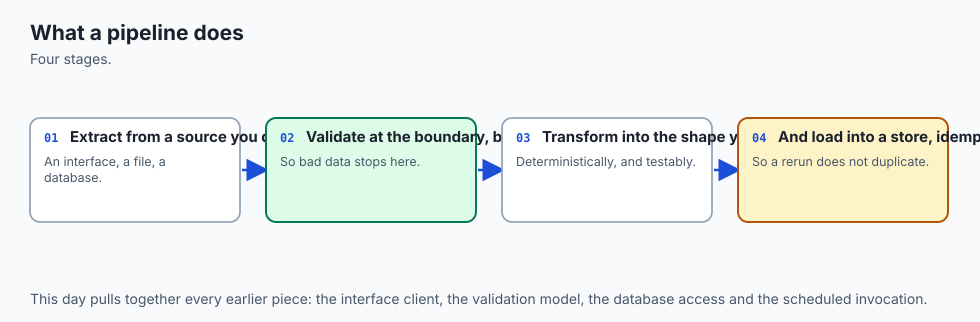
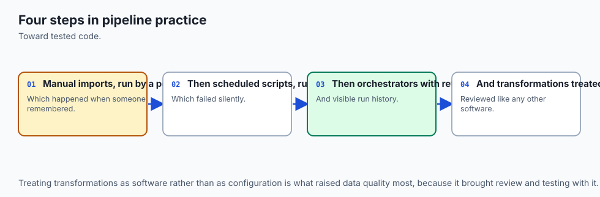
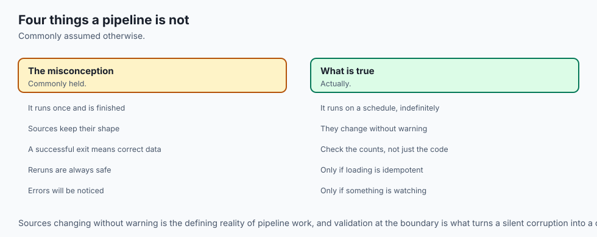
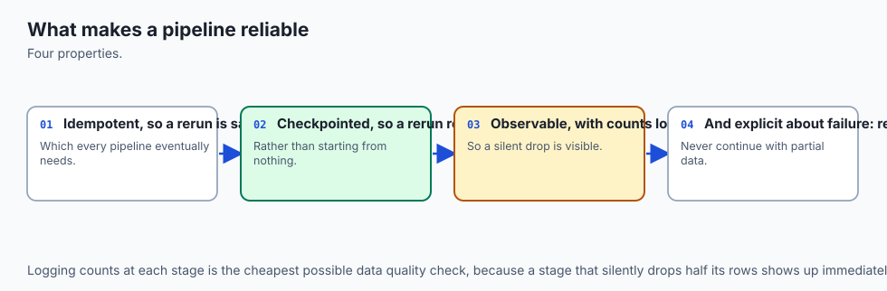
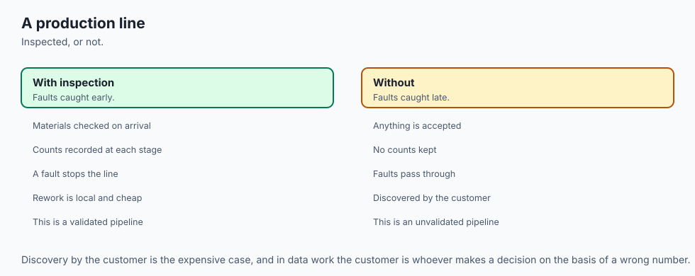
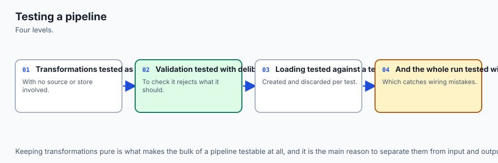
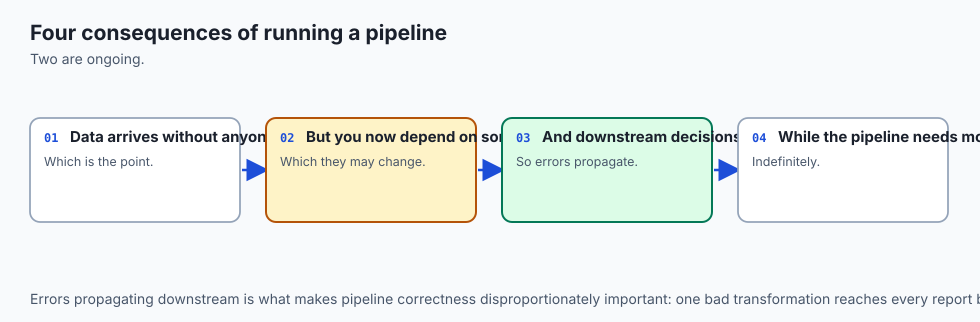
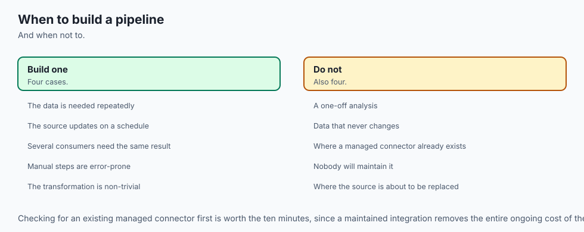

## Why this matters

It is 03:00. A small Python program wakes up, fetches yesterday's readings from three weather stations, writes them to a database, and prints a summary that somebody will look at over breakfast.

At 03:00:04, station charlie returns `500 Internal Server Error`.

Here is what happens next, in the version of this program that most people write first. The `requests` call raises. The traceback goes to a log file nobody reads. The process exits with status 1. `cron` sees a non-zero exit, does what cron does with it — which is, by default, nothing you will notice — and the run is over. Alpha and bravo, both of which answered perfectly, are not stored. The breakfast summary is yesterday's, unchanged, and looks exactly like a summary. Nobody notices for eleven days.

That is not a bug in anybody's code. Every line of that program is correct. It is a bug in what the program *promised*, and the promise was never written down, so nobody noticed it was missing.

Now the second version. Somebody has been bitten, so this one catches the exception and carries on. It stores alpha and bravo, logs "charlie failed", and exits 0. It runs again at 04:00, and this time charlie is fine, so it stores charlie's records too — along with a second copy of alpha's and bravo's, because nothing in the design says a record can only be stored once. By Friday the table has 340 rows describing 71 readings, every average in the breakfast summary is wrong by an amount that varies by station, and the summary still looks exactly like a summary.

**This is the shape of the whole subject.** A pipeline is not a script that moves data. It is a set of promises about what happens when something goes wrong — and the reason it deserves a section project rather than a chapter is that every promise you make costs something somewhere else, and you cannot see the cost from inside a single function.

The costs land in four specific places, and they are worth naming before we start.

**Money and time.** A pipeline that cannot be safely rerun turns every failure into an investigation. How far did the 03:00 run get? Which records are already stored? Is it safe to run it again, or do I need to delete something first? Those questions are expensive precisely when you are least equipped to answer them, which is at 03:20 on a Tuesday.

**Silence.** Every failure mode described above produced *no error*. The breakfast summary looked like a summary. This is the defining property of data bugs and the reason they are found late: a wrong number is indistinguishable from a right one until somebody who knows the domain looks at it.

**Compounding.** Bad data does not sit still. It gets averaged, joined, exported, and — for our purposes — trained on. The cost of a corrupted record is not the record; it is everything downstream that quietly incorporated it.

**Trust, which does not come back.** Once a team has discovered that the pipeline was double-counting for a month, every number it produces is questioned for a year, including the correct ones.

And the AI connection is not a stretch, because this is the shape of every data pipeline that feeds a model. Swap "readings" for "training examples" and every promise in this lesson decides whether your dataset is trustworthy. We will come back to that properly at the end, because it deserves more than a sentence.

## The idea in plain language



Five stages. Each one has exactly one job and exactly one promise about failure.


**1. Ingest.** Bring the data in. *The promise: every fetch has a deadline, only failures worth retrying are retried, and a source that never answers does not take the run down with it.* (Days 78 and 84.)

**2. Validate.** Decide what is allowed in. *The promise: every bad record is collected, counted and explained well enough to fix the source — never the first one only.* (Day 94.)

**3. Store.** Put it somewhere durable. *The promise: running the pipeline twice stores the data once.* (Days 88, 91 and 93.)

**4. Report.** Answer the question the pipeline exists for. *The promise: the report instant is a parameter, not a clock reading, so the answer is the same tomorrow.* (Days 86, 91 and 95.)

**5. Observe.** Say what happened. *The promise: one structured line per stage, one run id through all of them, and an exit code a scheduler can act on without reading English.* (Days 81 and 97.)

Read those five promises again and notice what they have in common: **not one of them is about the happy path.** On a good day, with three healthy sources and clean data, a fifteen-line script does exactly what this pipeline does. Everything we are about to build exists for the bad day, and the bad day is most days once you have more than one source.

There is one more idea underneath all five, and it is the one to hold on to if you only keep one thing from today.

**Idempotence is the property that makes everything else recoverable.** If running the pipeline twice is safe, then almost every failure has the same remedy: *run it again.* The 03:00 run died halfway? Run it again. The source was down? Run it again. You deployed a bug and had to roll back? Run it again. The laptop was asleep at 3 a.m.? Run it again. Without that property, each of those is a separate investigation with a separate answer, and the answer usually involves someone writing a one-off `DELETE` statement at speed, which is how the really expensive incidents start.

## Historical background



The word "pipeline" comes from Douglas McIlroy's proposal for Unix pipes, implemented by Ken Thompson in 1973 at Bell Labs. McIlroy's note on the whiteboard — that programs should be joined like garden hose, output of one to input of the next — is the ancestor of everything in this lesson, and `cat readings.json | validate | store` is a genuine data pipeline in exactly the sense we mean.

What Unix pipes did not give you was durability or memory. A pipe is a stream; if the third program in the chain dies, the data that had already flowed through it is gone, and there is no way to ask "what did we process yesterday?" Batch processing systems on mainframes had already been solving that problem for two decades by then, with job control languages and restart points, and the tension between the two traditions — the elegant composable stream and the durable restartable job — is still visible in every tool in this area.

The ETL acronym — extract, transform, load — dates from the data-warehousing work of the 1970s and 1980s and became standard vocabulary through the 1990s. It maps almost exactly onto our first three stages, which is a good sign that the division is not arbitrary. The modern reordering to ELT — load first, transform inside the warehouse — became popular in the 2010s once warehouse storage and compute became cheap enough that keeping the raw data was no longer the expensive option. dbt, which we will look at later, is the best-known tool built on that reordering.

The orchestrators are recent by comparison. Apache Airflow began at Airbnb in 2014, became an Apache Software Foundation project, and made "a directed acyclic graph of tasks, written in Python" the default mental model for a generation of data engineers. Prefect (2018) and Dagster (2019) were both, in part, arguments with Airflow's design — Prefect about the ergonomics of writing tasks as ordinary functions, Dagster about treating the *assets* a pipeline produces as the thing you schedule rather than the tasks that produce them.

The idea of idempotence is much older than any of it and comes from mathematics, where an idempotent operation is one satisfying *f(f(x)) = f(x)*. The term was introduced by the American mathematician Benjamin Peirce in 1870, in work on linear associative algebra. Its arrival in distributed systems vocabulary is much later and entirely practical: once a message can be delivered twice, the only sane defence is to make handling it twice harmless.

## What it is — and what it is not



A data pipeline **is** a program that moves data from where it is produced to where it is asked questions, in stages, with defined behaviour when a stage fails.

A data pipeline **is not** a synonym for the tool you run it with. This is the single most common confusion in the area, and it costs teams months. Airflow is not a pipeline; it is a thing that runs pipelines. If you take the program built in today's lab and schedule it in Airflow, you have exactly the same pipeline with a nicer user interface around it. Every promise in this lesson would still need to be implemented by you, in your code. An orchestrator supplies scheduling, dependency ordering, per-task retry, run history and a web view — all valuable, none of them a substitute for deciding what happens when a record is malformed.

A pipeline **is not** the same as a data *flow* diagram. The arrows are the easy part.

It **is not** necessarily large, distributed, or streaming. A 300-line Python program that runs once an hour on one machine and writes to a SQLite file is a pipeline, and it is the right pipeline for a very large number of real problems. Scale is a reason to change the design, not a prerequisite for having one.

And a pipeline **is not** a transformation function with error handling bolted on afterwards. That is the version everybody writes first, and its distinguishing feature is that the error handling was designed after the happy path, by somebody debugging, under pressure. The promises come first here for exactly that reason.

Here is the distinction that matters most, stated as a table, because the left-hand column is what people mean when they say "I built a pipeline" and the right-hand column is what the word ought to mean.

| A script that moves data | A pipeline |
| --- | --- |
| Fetches, and raises if the fetch fails | Fetches with a deadline, retries what is worth retrying, and returns partial success as a value |
| Validates by crashing on the first bad record | Collects every bad record with a field path and a reason, and keeps going |
| Inserts what it was given | Inserts what is new, enforced by the schema and counted by the application |
| Prints the current state | Reports on a window ending at an instant you passed in |
| Prints progress for a human watching | Emits one structured line per stage with a run id, for a human who was asleep |
| Exits 0 unless it crashed | Exits 0, 3 or 1 — and the scheduler can tell the difference |
| Must not be run twice | Is *designed* to be run twice, which is what makes every failure recoverable |

## Why it was created and what problems it solves

Every promise on that right-hand column exists because somebody lost data without it. Taking them one at a time, with the concrete failure each one prevents:

**Timeouts exist because a request has no natural upper bound.** `urllib.request.urlopen` and `requests.get` both accept a `timeout`, and both default to waiting indefinitely if you do not pass one. A server that accepts your connection and then goes quiet will hold your 03:00 job open until somebody notices at 09:00, and by then the 04:00 and 05:00 runs are queued behind it or, worse, running concurrently.

**Bounded retry exists because transient failures are the majority.** Most 500s and 503s from a service you do not control are a bad moment, not a bad URL. But *unbounded* retry converts one broken source into a run that never terminates, and synchronised retry across many clients is how a briefly unwell service is finished off.

**Partial success as a value exists because raising throws away good work.** If four of five sources answered, a pipeline that raises has discarded four sources' worth of data to report one failure.

**Collecting validation errors exists because the first one is not informative.** When a source starts sending 3,942 bad records, "the first record failed at field `humidity_pct`" is a bug report with a sample size of one. "3,942 rejected, 3,940 of them `humidity_pct` out of range" is a message you can forward to whoever owns the sensor, and they can fix it today.

**The idempotence key exists because at-least-once delivery is the norm.** Sources resend. Networks duplicate. Runs overlap. Somebody triggers a manual rerun. The only defence that survives all of those is to define what makes two arriving records *the same record*, and to let the database enforce it.

**The parameterised report instant exists because a function that reads the clock cannot be tested.** It also cannot be backfilled, and cannot answer "what did the 3 a.m. run see?".

**The run id exists because logs from concurrent runs interleave.** Without one you can say "something failed"; with one you can say which run, and then find every line it wrote.

**The distinct exit code exists because a scheduler reads exactly one thing from your program.** Not the log. Not the report. The integer.

## How it works



Now we build it, stage by stage. Each stage gets its contract first — what goes in, what comes out, what it promises — and only then its code. That order is deliberate: a contract you can state in a sentence is a contract you can test, and code written before its contract tends to acquire the contract its implementation happened to have.

Everything below is from the lab, which runs entirely offline against a fixture server bound to `127.0.0.1` on a port the kernel chooses. The fixture server is hostile on purpose: one station answers cleanly, one fails twice and then recovers, one fails permanently and quotes your API token back at you inside its error body, and one name is simply wrong.

### Stage 1 — Ingest

**Contract.** In: a base URL, a list of source names, a token, a timeout, an attempt budget. Out: one result per source, each either records or an error, never an exception. Promise: every call has a deadline; only failures worth retrying are retried; a dead source does not end the run.

The result type comes first, because it is where "partial success is a value" actually lives:

```python
@dataclass(frozen=True)
class FetchResult:
    source: str
    ok: bool
    records: list[dict] = field(default_factory=list)
    attempts: int = 0
    status: int | None = None
    error: str = ""
    retried: bool = False
```

Then the retry policy, written down as data rather than buried in an `if`:

```python
#: Status codes worth a second attempt. Everything else is a decision, not luck.
RETRYABLE_STATUS = frozenset({429, 500, 502, 503, 504})
```

That set is the whole of the "retry only what is worth retrying" promise. A 500 says the server had a bad moment. A 404 says your URL is wrong, and it will be just as wrong in fifty milliseconds. 429 is retryable because it is the server explicitly asking you to slow down, which is precisely what backoff does.

And the loop:

```python
while tried < attempts:
    tried += 1
    try:
        status, payload = _get_json(url, token=token, timeout=timeout)
    except urllib.error.HTTPError as exc:
        with exc:                      # HTTPError is a FILE OBJECT
            last_status = exc.code
            body = exc.read().decode("utf-8", errors="replace")
        ...
        if exc.code not in RETRYABLE_STATUS:
            break
    except (urllib.error.URLError, TimeoutError, OSError) as exc:
        last_error = f"{type(exc).__name__}: {exc}"
    else:
        return FetchResult(source=source, ok=True, records=..., attempts=tried)
    if tried < attempts:
        sleep(backoff * (2 ** (tried - 1)))
```

Three things in that fragment are worth stopping on.

`sleep` is a **parameter** with a default of `time.sleep`. The tests pass a no-op. A retry policy you cannot test without waiting is a retry policy nobody tests.

`with exc:` is there because `urllib.error.HTTPError` is a file object. Read its body without closing it and you leak a socket — which, in a process that runs once an hour forever, is a slow resource exhaustion that nothing warns you about in production. This was not a planned teaching point: the lab's `pytest.ini` turns warnings into errors, and the very first run of the starter suite failed with `ResourceWarning`. The strict setting found a real defect in the first version of this lesson's own code. That is the argument for the strict setting, made better by accident than it could have been on purpose.

And the failure path **returns** rather than raises. `fetch_all` runs the loop over every source and hands back a list. Nothing about a broken charlie is allowed to reach into alpha's data.

Here is what that policy does against the lab's fixture server, captured from a real run:

```
  bravo    attempts=3  ok=True  status=200  (500 twice, then 200)
  delta    attempts=1  ok=False  status=404  (404, and it will stay 404)
```

### Stage 2 — Validate

**Contract.** In: the raw records, grouped by source. Out: a list of accepted models and a list of rejections, each rejection naming the source, the position, the record's id, and every problem with its field path. Promise: nothing gets through that the store would have to argue with, every failure is collected, and one bad record never ends the run.

The model is Day 94, written strictly on purpose:

```python
class Reading(BaseModel):
    model_config = ConfigDict(extra="forbid", str_strip_whitespace=True)

    station_id: str = Field(min_length=1, max_length=32)
    reading_id: str = Field(min_length=1, max_length=64)
    observed_at: datetime
    temperature_c: float = Field(ge=-90.0, le=60.0)
    humidity_pct: int = Field(ge=0, le=100)

    @field_validator("observed_at")
    @classmethod
    def must_be_absolute(cls, value: datetime) -> datetime:
        if value.tzinfo is None:
            raise ValueError("observed_at must carry a UTC offset")
        return value.astimezone(timezone.utc)
```

`extra="forbid"` deserves a defence, because it is the setting people turn off first. A source that starts sending a field you have never seen has *changed shape*, and that is an event. Ignoring it silently is how a schema drift goes unnoticed for a quarter, and it is the same reasoning that makes an API reject unexpected parameters rather than dropping them.

The gate itself is the part that separates a pipeline from a script, and it is four lines:

```python
for index, raw in enumerate(raw_records):
    try:
        accepted.append(Reading.model_validate(raw))
    except ValidationError as error:
        rejected.append(Rejection(source, index, identifier, _problems(error)))
```

`ValidationError.errors()` gives you a list of dicts, each with a `loc` tuple naming the field path and a `msg`. Flatten those into `"field: message"` strings and a rejection becomes a message somebody can act on:

```
CONSIDERED 6 ACCEPTED 2 REJECTED 4
REJECT x[1] bad-temp: temperature_c: Input should be a valid number, unable to parse string as a number
REJECT x[2] bad-hum: humidity_pct: Input should be less than or equal to 100
REJECT x[3] naive: observed_at: Value error, observed_at must carry a UTC offset
REJECT x[4] extra: battery_pct: Extra inputs are not permitted
REASONS {'battery_pct': 1, 'humidity_pct': 1, 'observed_at': 1, 'temperature_c': 1}
```

Six records in, four rejected, and the run continued. That `REASONS` line is the one you actually page through at 09:00: it is the rejection count per field, worst first, and it is what turns "the pipeline had problems" into "station x has started sending a battery reading we do not model".

### Stage 3 — Store

**Contract.** In: accepted models and a run id. Out: how many were considered, how many were new, how many were already held, and how many rows the table now has. Promise: running twice stores once.

Everything turns on one line of the schema:

```python
__table_args__ = (
    UniqueConstraint("station_id", "reading_id", name="uq_readings_idempotence"),
    CheckConstraint("humidity_pct BETWEEN 0 AND 100", name="ck_readings_humidity"),
    CheckConstraint("temperature_dc BETWEEN -900 AND 600", name="ck_readings_temperature"),
    CheckConstraint("length(observed_at) = 20", name="ck_readings_observed_at_iso"),
    Index("ix_readings_observed_at", "observed_at"),
)
```

`(station_id, reading_id)` is the **idempotence key**: the pair the source itself assigns, identifying a record by *what it is* rather than by when it arrived. Choosing it is a modelling decision, not a technical one — it is an answer to "what would make two arriving records the same record?" — and it is worth arguing about with whoever owns the source, because if they reuse ids you have a much bigger problem than deduplication.

Two other Day 91 habits are visible in that schema and worth naming. Temperature is stored as an **integer count of deci-Celsius** — 18.4 becomes 184 — with the division by ten happening at the display edge and nowhere else, because a float on disk is a rounding argument waiting to happen. Timestamps are stored as **ISO 8601 text in UTC**, twenty characters, because that format puts the fields in most-significant-first order at fixed widths, which means comparing the strings compares the instants. The `CHECK (length(observed_at) = 20)` is a cheap guard on the format that keeps the ordering property true.

Now the insert, and this is the part with the subtlety:

```python
already = existing_keys(session, keys)          # layer 1: what we already hold
rows = [... for reading in readings if key not in already and key not in seen_in_batch]
if rows:
    statement = sqlite_insert(StoredReading).on_conflict_do_nothing(
        index_elements=["station_id", "reading_id"]              # layer 2
    )
    session.execute(statement, rows)
    session.commit()
```

**Two layers, two different jobs, and this is the most valuable thing in the day.**

Layer 2 — the `UNIQUE` constraint and `ON CONFLICT DO NOTHING` — keeps the **data** right. It holds even when your code is wrong, even when two copies of the job overlap, even when somebody writes to the table from a notebook. It is a guarantee the database makes, and it is the only kind of guarantee that survives your application being wrong.

Layer 1 — the pre-check — keeps the **report** honest. And it is easy to argue that it is redundant, because layer 2 already prevents the duplicate. Here is the measurement that ends the argument. In the lab, deleting only layer 1 and rerunning the harness produces this diff on the second run's log line:

```
< "event": "stage.store", "considered": 7, "inserted": 0, "duplicates_skipped": 7, "total_rows": 6
> "event": "stage.store", "considered": 7, "inserted": 6, "duplicates_skipped": 1, "total_rows": 6
```

`total_rows` is **still 6**. The database was never wrong. The pipeline was lying about its own work — reporting six inserts where it made none — and a pipeline that misreports how much it did is much worse than one that errors, because nobody investigates a run that says it succeeded. Six of the harness's 84 checks fail on that change, and none of them is a check on the data.

### Stage 4 — Report

**Contract.** In: a session, a report instant, a window length, the list of stations you expect. Out: per-station counts and temperature statistics for the window, plus anything that looks implausible. Promise: the same inputs give the same output, today and next year.

The whole promise is one keyword argument:

```python
def build_report(session, *, report_at: str, window_hours: int, stations: list[str]) -> Report:
    end = _parse_instant(report_at)
    start = end - timedelta(hours=window_hours)
```

`report_at` is a parameter, not `datetime.now()`. That one change buys three separate things, and it is worth being explicit about all three because people usually only see the first. It makes the report **testable**, because the whole function becomes a pure function of the stored rows and one argument. It makes a **backfill** possible — asking for last Tuesday is the same code path, not a special mode. And it gives you an **incident timeline**: when somebody asks what the failing 03:00 run saw, you can reproduce it exactly.

The report also carries the one check the validation gate structurally cannot make:

```python
if minutes <= JUMP_WINDOW_MINUTES and abs(change) > JUMP_THRESHOLD_DC:
    found.append(SuspectJump(...))
```

Station bravo reports 41.3 Celsius five minutes after 15.0 Celsius. Every field is legal — 41.3 is a temperature that exists on Earth, humidity is a plausible 74 per cent, the timestamp has an offset. A field validator sees one record and has no way to know about the previous one. This is the category of failure called **valid but wrong**, and what you do about it is a design decision worth taking seriously.

The pipeline stores it and **flags** it. It does not drop it, and the reasoning is worth stating as a principle: *a visible anomaly that somebody must look at is strictly better than an invisible gap that nobody will.* A dropped record leaves a hole indistinguishable from a sensor that was simply not reporting, from a network failure, from a hundred other causes. The 41.3 is reportable precisely because it is wrong. Tightening the range until it is excluded is worse still — you would start rejecting real readings from real hot places, trading a visible anomaly for silent data loss.

And here is the report, from a real run:

```
Station readings report
  as of        2026-08-16T12:00:00Z
  window       12h, from 2026-08-16T00:00:00Z
  in window    5 of 6 stored readings

  station      readings     min C     max C    mean C
  ------------ -------- --------- --------- ---------
  alpha               2      18.4      19.0      18.7
  bravo               3      13.6      41.3      23.3
  charlie             0         -         -         -

  suspect readings (1) — stored and flagged, not dropped:
  bravo: +26.3 C in 5 minutes (2026-08-16T11:45:00Z -> 2026-08-16T11:50:00Z)
```

Look at the charlie row. Zero readings, reported explicitly rather than omitted. A station that quietly disappears from a report is exactly how a source goes dark for a month, and the fix costs one parameter: pass in the stations you *expect*, not just the ones you found.

### Stage 5 — Observe

**Contract.** In: everything the other four stages did. Out: one structured line per stage on stderr, a row in a `runs` table, and an exit code. Promise: somebody who was asleep can reconstruct the run.

The logger emits one JSON object per line, and takes its clock as a parameter for the same reason the report does:

```python
record = {"ts": self.clock(), "level": level, "run_id": self.run_id, "event": event}
record.update(redact(fields, self.secrets))
self.stream.write(json.dumps(record) + "\n")
```

Two design decisions in three lines.

**`run_id` is in the record construction**, not passed by each caller, so it cannot be omitted. Without it, a system with two overlapping runs can tell you that something failed but not which run — the difference between "this run failed" and "something failed".

**Redaction is a filter, not a discipline.** This is the one most people get wrong, and the lab is built to prove why. The fixture server's charlie returns a 500 whose body reads `upstream credentials rejected for token demo-token-value`. Nobody wrote code to log the token. The pipeline logged an *error string*, and the error string happened to contain the secret — and real services do this constantly. Every discipline-based defence fails here, because the code that logged it is not wrong. So `redact` walks every string value at any depth inside lists and dicts and replaces every known secret:

```
raw error body from charlie : upstream credentials rejected for token demo-token-value
after the log redactor      : upstream credentials rejected for token ***redacted***
```

Configuration is the other half of the stage, and it follows the Twelve-Factor App's third factor — configuration lives in the environment, not in the code — with four ordered layers: defaults, then a TOML file, then environment variables, then explicit command-line flags. The part people skip is the fourth column of this table:

```
setting                value                  source
---------------------  ---------------------  ------------
api_token              ***redacted***         environment
base_url               http://127.0.0.1:8080  default
database_url           sqlite:///pipeline.db  default
log_level              warning                environment
report_at              <unset>                default
retry_attempts         3                      file
retry_backoff_seconds  0.05                   default
sources                alpha,bravo,charlie    file
timeout_seconds        3.0                    file
window_hours           24                     command line
```

Knowing that `timeout_seconds` is 3.0 is half an answer at 03:00. Knowing it is 3.0 *because the deployment's config file says so and nobody overrode it* is the whole answer. Note also that the secret's **source** is printed and its **value** never is: where a credential came from is operationally important, and what it is never is.

Finally, the exit code — which is the pipeline's entire interface to whatever started it:

```python
if failed or outcome.rejected:
    status, code = "partial_success", EXIT_PARTIAL   # 3
else:
    status, code = "success", EXIT_SUCCESS           # 0
```

with `EXIT_FAILURE` (1) when no source answered at all. Three outcomes, three codes. **Collapsing 3 into 0 is how a source goes dark for a month** — every run looks green and the missing quarter of your data is found by somebody who needed it. **Collapsing 3 into 1 is the opposite failure and just as damaging**: everything pages, people build filters to hide the alert, and a genuine total failure arrives inside noise nobody reads.

### Where concurrency belongs, and where it does not

Day 96 gave the distinction this decision needs: waiting work versus computing work.

**The fetch is waiting work.** Three sources fetched one after another spend nearly all their wall-clock time blocked on a socket, and running them concurrently — `ThreadPoolExecutor`, or `asyncio.gather` — is close to free. With three sources it is a rounding error; with fifty it is the difference between a run that fits in its hour and one that does not. This is where concurrency in a pipeline earns its keep, and essentially the only place.

**The validation is not.** At this size it is microseconds of CPU per record, and a thread pool would spend more on coordination than it saves. It is also, thanks to the GIL, not parallel CPU work in the first place unless you reach for processes — at which point you are paying to serialise every record across a process boundary to save microseconds. If you ever *do* have enough records for validation to matter, the answer is usually a faster validator or fewer records, not more threads.

**The store is a single writer by design.** SQLite permits one writer at a time. Two concurrent writers buy you `database is locked`, not throughput. And this is not really a SQLite limitation so much as an honest exposure of something true of every store: the ordering guarantees you want from a database are the same guarantees that make concurrent writes expensive.

The lab keeps the fetch sequential, and it says so rather than pretending the choice was forced: with three sources against a loopback server the difference is not measurable, and determinism in the captured output was worth more than milliseconds. Being able to say *why* you did not use concurrency is as much a skill as using it.

## An everyday analogy



Think of the pipeline as a **hospital pathology lab** receiving samples from clinics around the city. Carry it all the way through; it holds surprisingly precisely.

**Ingest is the courier round.** The van visits five clinics. One clinic is closed today. The courier does not abandon the round and drive back empty — that would be raising an exception — and does not sit outside the closed clinic until it opens, which is retrying without a bound. The courier waits a reasonable time (the timeout), tries the door twice more (bounded retry), notes "clinic 3 closed" on the sheet, and delivers the other four clinics' samples. A courier who came back with nothing because one door was locked would not be a courier for long.

**Validate is the receiving bench.** Every sample is checked against the request form before it goes anywhere near a machine: is it labelled, is the tube the right type, does the volume make sense? A sample that fails is set aside *with a note saying which check it failed*, and the bench keeps working through the tray. It does not stop the entire morning's intake because tube seventeen is unlabelled — and crucially, the note is written for the clinic that sent it, not for the technician. "Tube 17 rejected: no patient identifier" is something the clinic can fix. "Error at receiving" is not.

**Store is the sample registry.** Every sample gets an accession number, and here is the point: the number comes from the *request form*, not from the order of arrival. If the same sample arrives twice — the courier did an extra run, the clinic sent a duplicate — the registry recognises the accession number and does not create a second record. That accession number is the idempotence key, and the registry's refusal to duplicate it is a `UNIQUE` constraint. The technician *also* checks the list before booking anything in, which is the application-level pre-check, and the reason both exist is that the technician can be interrupted mid-check and the registry cannot.

**Report is the daily summary for the consultant.** And it is *as of* a stated time — "results received up to 12:00" — not "as of whenever you happen to be reading this". That stated cut-off is what lets two people looking at the same report agree they are looking at the same thing, and what lets you reproduce yesterday's summary tomorrow.

**Observe is the day book.** One line per stage of the round, all under one job number, so that when a consultant asks on Thursday what happened to a sample on Tuesday, the answer is a lookup rather than an interview. And the day book has a rule: patient identifiers do not go in it. Not because the technicians are careful — because the book has a column format that does not have a place for them.

The analogy has one more piece that matters. The receiving bench cannot catch a sample that is correctly labelled, correctly filled, and taken from the wrong patient. Every check passes. Only something with more context — a result wildly inconsistent with the patient's history — can see it, and when it does, the answer is to **flag it for a human**, never to quietly discard it. That is the valid-but-wrong record, and it is why the pipeline's suspect check lives in the report rather than the gate.

## Examples in practice



The lab runs the whole pipeline twice against one database. Here is the entire day in one block, captured from a real run:

```
  records fetched      run 1:  9    run 2:  9
  records accepted     run 1:  7    run 2:  7
  records rejected     run 1:  2    run 2:  2
  rows inserted        run 1:  6    run 2:  0
  duplicates skipped   run 1:  1    run 2:  7
  rows in the store    run 1:  6    run 2:  6
  reports identical    True
  exit codes identical True
```


Every number there is worth a sentence.

**Nine fetched, both runs.** Idempotence is not achieved by fetching less. The pipeline does exactly the same work; it stores different amounts. That is worth internalising, because the instinct is to make the second run *skip* things, and that instinct produces a pipeline that depends on remembering what it did — which is the state you were trying to avoid having.

**One duplicate on run 1, seven on run 2.** Run 1's single duplicate is a record repeating an earlier record's key *inside one payload* — the source sent it twice. Run 2's seven are the seven records already held from run 1. Same mechanism, two entirely different causes, and a design that only handles one of them handles neither reliably.

**Six rows, both runs.** The invariant. This is the sentence you would put in a code review: *however many times you run it, the store holds six.*

**Exit code 3, both runs.** Charlie is still dark and the two malformed records are still malformed. Idempotence does not turn a partial success into a success, and it should not.

And the structured log for run 1, in full, because the shape is the point:

```
{"ts": "...", "level": "info",    "run_id": "run-cli000001", "event": "run.start", ...}
{"ts": "...", "level": "info",    "run_id": "run-cli000001", "event": "ingest.source_recovered", "source": "bravo", "attempts": 3}
{"ts": "...", "level": "warning", "run_id": "run-cli000001", "event": "ingest.source_failed", "source": "charlie", "attempts": 3, "status": 500, "error": "upstream credentials rejected for token ***redacted***"}
{"ts": "...", "level": "info",    "run_id": "run-cli000001", "event": "stage.ingest", "sources_ok": 2, "sources_failed": 1, "records_fetched": 9, "attempts_total": 7}
{"ts": "...", "level": "warning", "run_id": "run-cli000001", "event": "validate.rejected", "reading_id": "a-3", "problems": ["temperature_c: Input should be a valid number, unable to parse string as a number"]}
{"ts": "...", "level": "info",    "run_id": "run-cli000001", "event": "stage.validate", "records_in": 9, "accepted": 7, "rejected": 2, "reasons": {"humidity_pct": 1, "temperature_c": 1}}
{"ts": "...", "level": "info",    "run_id": "run-cli000001", "event": "stage.store", "considered": 7, "inserted": 6, "duplicates_skipped": 1, "total_rows": 6}
{"ts": "...", "level": "info",    "run_id": "run-cli000001", "event": "stage.report", "readings_in_window": 5, "suspect_readings": 1}
{"ts": "...", "level": "info",    "run_id": "run-cli000001", "event": "stage.observe", "status": "partial_success", "exit_code": 3}
{"ts": "...", "level": "warning", "run_id": "run-cli000001", "event": "run.end", "status": "partial_success", "exit_code": 3, "stored_total": 6}
```

One line per stage, one run id throughout, one warning per thing a human should look at, and the token redacted at the one place it would have escaped.

### Backfilling a missed day

You discover on Thursday that Tuesday's 03:00 run never happened — the machine was asleep, or the schedule was disabled, or the deploy that morning broke it. What do you do?

With this design: **you run it again with Tuesday's parameters.** That is the entire procedure. The store is idempotent, so any overlap with data you already hold changes nothing; the report instant is a parameter, so asking for Tuesday's window is the same code path as asking for today's; the run gets its own id, so you can see afterwards exactly which rows the backfill wrote.

Without either of those two properties, the same task becomes: work out precisely which records are missing, write a one-off script to fetch only those, hope your reasoning about the boundary was right, and then hope nobody triggers the normal run at the same time. That is the difference the two properties buy, and it is the reason they are worth building before you need them rather than after.

The one honest caveat: this works because the source can still serve Tuesday's records. If your source only ever offers "the last hour", no amount of idempotence saves you, and the fix is a different design — store the raw payloads as they arrive, and treat parsing as a separate, rerunnable stage. That is the ELT reordering mentioned earlier, and it is the main reason people adopt it.

## Implications: security, privacy, performance, scalability, and cost



**Security.** The validation gate is not only a quality control; it is the boundary between an untrusted source and your storage. `extra="forbid"` makes a change in the source's shape a visible event. Length limits bound what one broken or malicious source can write into your table. And every value that reaches the database goes through SQLAlchemy's parameter binding — which does *not* protect `text()` with an f-string in it, and cannot bind an identifier, so a user-chosen sort column still needs an allow-list you control.

**Retry is an amplification risk.** Three attempts against a struggling service is three times the load at the moment it can least afford it, and a fleet of clients retrying in lockstep is a thundering herd that finishes off a service which was only briefly unwell. Backoff helps; jitter — randomising the wait — helps more; honouring `Retry-After` when the server sends it is simply doing what you were asked.

**Privacy.** Two habits matter more than any tool. First, redaction lives in the logger, because the leak you will actually suffer is an upstream error message quoting your credential back at you, and no amount of care at the call site prevents that. Second, a structured log is easier to keep clean than a prose one, precisely because the fields are named: you can write a rule about a field, and you cannot write a rule about a sentence.

**Performance.** The interesting numbers in a pipeline are almost never the ones people measure. Wall-clock time is dominated by waiting on sources, which is why concurrency belongs in the fetch and nowhere else. The number that actually predicts trouble is *records per run*, because it decides whether your validate-then-insert pattern still fits in memory, and whether your single batched insert is still a single batched insert. The lab handles nine records; the pattern holds to a few hundred thousand on a laptop, and stops holding when the accepted list no longer fits in RAM — at which point you stream in chunks and the idempotence key becomes more valuable, not less, because a chunked run can now fail halfway.

**Scalability.** Index the column the report filters on, which here is `observed_at` — Day 89's lesson, and worth re-checking with `EXPLAIN QUERY PLAN` when the table grows. Be aware that the idempotence pre-check is itself a query, and a naive version that fetches every stored key will stop being free at some size; the lab's version filters by the stations in the current batch, which is a first refinement rather than a final answer.

**Cost.** The largest cost in this design is not compute; it is *the cost of a wrong number*. Every promise in this lesson is bought with a small amount of code and paid back in incidents that do not happen. The one genuinely expensive habit is storing raw payloads as well as parsed records — worth it when your sources cannot serve history, and a real storage bill when they can.

## Alternatives: free, open source, and commercial

Six ways to do the thing this lesson does. **Only the first one was actually run here.** Everything said about the other five is described from their documentation, and no output, benchmark or price is reproduced for any of them. The lab's test suite asserts that none of them is installed, so that statement cannot go quietly stale.

| Option | Choose it when | How it works | One concrete example | Free vs paid |
| --- | --- | --- | --- | --- |
| **A scheduled Python process** (this lesson) | One machine, a handful of sources, no dependencies between tasks, and a team that would rather own 300 lines than a platform | An ordinary CLI, run by `cron`, `launchd` or `systemd`; state lives in the database; the exit code is the interface | `pipeline.py --sources alpha,bravo,charlie --report-at 2026-08-16T12:00:00Z` → exit 3 | Entirely free; the only cost is the machine it runs on |
| **Apache Airflow** | You have many pipelines with dependencies between tasks, and you need run history, per-task retry and a shared UI across a team | You write a DAG in Python; a scheduler component walks it, dispatching tasks to executors and recording every run in its own metadata database | A DAG with `ingest >> validate >> store >> report` as four tasks, each retryable on its own | Apache-2.0, free to self-host. Managed offerings exist from cloud vendors and from Astronomer; no prices quoted here |
| **Dagster** | Your mental model is "what data assets exist and are they fresh?" rather than "what tasks ran"; you want typed inputs and outputs and strong local testing | You declare *assets* and their dependencies; Dagster works out the tasks needed to materialise them, and tracks lineage between them | `@asset def readings(): ...` and `@asset def daily_report(readings): ...` — the dependency is the function argument | Apache-2.0, free to self-host. Dagster+ is the vendor's commercial hosted product; no prices quoted here |
| **Prefect** | You want ordinary Python functions to become a workflow with minimal ceremony, and dynamic structure decided at runtime | Decorate functions with `@task` and `@flow`; a Prefect worker executes them and reports state to a server or to Prefect Cloud | `@flow def nightly(): store(validate(ingest()))` — the flow is just a function that calls tasks | Apache-2.0, free to self-host. Prefect Cloud is the vendor's commercial hosted product; no prices quoted here |
| **dbt** | The *transform* half specifically, and your data already lives in a warehouse you can run SQL against | You write `SELECT` statements as models in SQL files; dbt works out the dependency graph from the references between them, materialises them as tables or views, and runs tests you declare in YAML | A `models/daily_readings.sql` containing a `SELECT` that references `{{ ref('raw_readings') }}` | dbt Core is Apache-2.0 and free. dbt Cloud is the vendor's commercial product; no prices quoted here. Note it does not do ingest — it is the T, not the E or the L |
| **`cron` plus a shell script** | Genuinely simple, genuinely one-off tasks where the whole job is "run this and put the output there" | A crontab line runs a script; you get exactly what the shell gives you | `0 3 * * * /usr/local/bin/fetch.sh >> /var/log/fetch.log 2>&1` | Free and already installed. The honest limit is that shell gives you no structured errors, no validation, no idempotence and no report — you will rebuild all four badly |

The judgement to take away is not a ranking. It is this: **an orchestrator supplies none of the five promises in this lesson.** Airflow, Dagster and Prefect would all happily run today's program unchanged, and not one of them would have written the retry policy, the validation gate, the idempotence key, the parameterised report instant or the exit-code scheme. What they supply is what happens *around* pipelines — scheduling, dependency ordering, per-task retry, run history, a UI, and a place for many pipelines to live together.

So the honest signals that you have outgrown a scheduled Python process are specific: **dependencies between tasks** that you find yourself encoding as sleep-and-hope; **per-task retry**, where re-running the whole thing is too expensive and you want to retry only the stage that failed; **backfill as a first-class operation**, where you want to fill three months of history with bounded parallelism and a progress view; **more than one machine**, because the work no longer fits on one; and **more than a handful of pipelines**, at which point the shared UI and run history stop being a luxury. If none of those is true, adding an orchestrator adds a component to operate and answers no question you were asking.

## Comparison with related concepts

| Concept | How it differs from a pipeline | Where they meet |
| --- | --- | --- |
| **ETL / ELT** | A vocabulary for the *order* of the middle stages — transform before loading, or after — not a claim about failure behaviour | Our ingest, validate and store are E, T and L; the promises are what the acronym leaves out |
| **A batch job** | A batch job is any program run on a schedule over a set of inputs; a pipeline is a batch job with stages and stated failure behaviour | Every pipeline here is a batch job; not every batch job is a pipeline |
| **A streaming system** (Kafka, Flink) | Processes records as they arrive rather than in scheduled batches; latency is seconds, and the "run" is continuous | Idempotence matters *more*, not less: at-least-once delivery is the default guarantee, so consumers must be built to handle duplicates |
| **An orchestrator** | Runs pipelines; supplies scheduling, dependencies, per-task retry, history and a UI | It would run today's program unchanged, and would supply none of its five promises |
| **A message queue** | Moves individual messages between services with delivery guarantees; no notion of a run | The idempotence key is the same idea a queue consumer needs, for the same reason |
| **A transaction** | Makes a *unit of work* atomic within one run — all of it or none of it | Complementary and often confused: a rollback undoes an uncommitted unit; idempotence makes a *completed* previous run harmless to repeat |
| **A migration** (Day 88) | Changes the schema, runs once, and is not usually rerunnable | Both need a durable record of what has already been applied — a migrations table is an idempotence key by another name |
| **A test suite** | Asserts things about code, in a controlled environment | A validation gate is a test suite for *data*, in production, at runtime — and its failures are reports rather than build breaks |

The pair worth dwelling on is transactions and idempotence, because reaching for the wrong one is common. A transaction guarantees that the six inserts in *this* run all happen or none do. It says nothing at all about the previous run. Idempotence guarantees that repeating a completed run adds nothing. You want both, and neither substitutes for the other: a perfectly transactional pipeline run twice still doubles your data.

## When to use it — and when not to



**Build the full five-stage version when** the data matters enough that a wrong number would be noticed; when the source is outside your control and therefore allowed to fail; when the job is scheduled rather than triggered by a human who is watching; when more than one person will eventually rely on the output; or when you can imagine ever needing to re-run it for a past period.

That set of conditions is met more often than people expect. The most common mistake in this area is not over-engineering — it is writing the fifteen-line script for something that met every one of those conditions, and paying for it in the second month.

**Do not build it when** the thing genuinely is a one-off: a single import you will run once, from a file you already have on disk, checked by eye before anybody uses it. A validation gate and an idempotence key on a one-off import is ceremony. Be honest with yourself about "one-off", though — the number of one-off scripts still running in production three years later is not small.

**Do not reach for an orchestrator when** you have one pipeline, one machine, and no dependencies between tasks. You will spend more time operating the orchestrator than you spent writing the pipeline, and it will not have made a single one of your five promises for you.

**Do reach for one when** the specific signals from the alternatives section appear: task-level dependencies, task-level retry, backfill as an operation rather than an argument, multiple machines, or enough pipelines that shared history and a UI stop being a luxury.

**Reconsider the whole shape when** your source cannot serve history. Everything in this lesson assumes you can ask again for what you missed. If your source only offers "right now", store the raw payloads as they arrive and make parsing a separate rerunnable stage — you will trade storage cost for the ability to fix a parsing bug retroactively, which is usually a very good trade.

And **reconsider the store** when the questions change. Day 92's trade-offs are still live: this pipeline uses a relational table because the report asks aggregate questions across a window and a key-value store would make that a full scan. If your only question were ever "give me the latest reading for station X", the answer would be different.

### The AI thread

This is the shape of every data pipeline that feeds a model. Swap "readings" for "training examples" and the five promises decide, entirely, whether your dataset is trustworthy.

**Ingest** is your crawl or your export, and a source that silently fails for a fortnight is a fortnight-shaped hole in your training distribution that nothing in your training code will ever mention. **Store** is the deduplication step, and it is not a nicety: duplicated examples are one of the best-documented ways to distort a model, inflating the weight of whatever happened to arrive twice and, when the duplicate lands on both sides of the split, leaking your test set into training. An idempotence key on your examples is the same UNIQUE constraint doing the same job. **Report** is your dataset statistics, and if it reads the clock you cannot compare this week's distribution against last week's, which means you cannot detect drift. **Observe** is the run id that lets you answer "which crawl produced this example?" — which is the question you will be asked, eventually, about licensing, about provenance, or about why a particular behaviour appeared in a particular checkpoint.

But the stage that earns its place most decisively is **validate**, and it is worth being precise about why.

A corrupted feature does not announce itself in training. There is no exception. Loss still goes down. The model still converges. It converges on something slightly wrong, and you find out weeks later from an evaluation metric that is inexplicably worse than the last run, and then you spend a week bisecting code that was never the problem. The validation gate is the difference between a bad record being caught at the boundary — with a field name, a reason and a count, in a log line written the night it arrived — and being caught by an inference in month three of a project. That is not a difference in tidiness. It is the difference between a five-minute fix and a week.

There is a version of this argument people find easy to nod along to and hard to act on, so here it is as a concrete claim you can test on your own work: **the most expensive bug you will hit in an AI project is more likely to be in the data pipeline than in the model.** Not because models are simple, but because model bugs are loud and data bugs are silent, and silence is what makes something expensive.

## The AI connection

- **A complete pipeline is the deliverable**, and building one exercises every lesson in the
  course at once.
- **The joins between stages are where failures live**, not inside the stages themselves.
- **Reproducibility, validation and logging** are what separate a pipeline from a sequence of
  scripts.
- **Every AI system sits on a data pipeline like this one**, whatever the model on top.
- **The test is whether it runs unattended tomorrow**, which is a much higher bar than running
  once today.

## Knowledge check

Eight questions on this day's material are in `quiz.yml`, and two of them are the ones to be sure of before moving on: why idempotence makes failures recoverable, and which stage a given failure belongs to. If you can answer both from first principles rather than recall — the first by naming the class of failures that collapse into "run it again", the second by asking what each stage can *see* — the day has landed.

## Hands-on exercise

The lab is `labs/sections/programming-with-python/day-098-section-project-a-complete-data-pipeline/`. Read its `README.md`, then work through `starter/00_brief.md`.

You inherit a pipeline that **runs**. It fetches, validates, stores, reports and exits. Point it at a healthy source on a good day and you would never know anything was wrong with it. Nine numbered exercises turn each of its five stages into a stage that keeps a promise.

```bash
cd labs/sections/programming-with-python/day-098-section-project-a-complete-data-pipeline
python3 -m venv .venv
.venv/bin/pip install -r requirements/requirements.txt
export PYTHONPATH=examples

.venv/bin/python examples/demo_run.py    # the whole thing, twice, narrated
.venv/bin/pytest starter -q              # 1 passed, 9 skipped — the starting line
bash tests/run_tests.sh                  # 84 checks
```

Do the exercises in order. Each one names the exact change in a docstring in `starter/stages.py`, and each has a test that says whether the promise now holds.

### Expected output

The starting line, before you change anything:

```
.sssssssss                                                               [100%]
1 passed, 9 skipped in 0.64s
```

The one passing test proves the skeleton runs end to end and *reports its own failure* — it aborts at the first malformed record, which is exercise 3, and you can see the problem before you have written a line.

The whole pipeline, twice, from `demo_run.py`:

```
  rows inserted        run 1:  6    run 2:  0
  duplicates skipped   run 1:  1    run 2:  7
  rows in the store    run 1:  6    run 2:  6
  reports identical    True
  exit codes identical True
```

The retry policy:

```
  bravo    attempts=3  ok=True  status=200  (500 twice, then 200)
  delta    attempts=1  ok=False  status=404  (404, and it will stay 404)
```

And the whole suite:

```
84 checks, 0 failure(s).
```

### Validate your work

1. **The second run stores nothing.** Run the CLI twice against the same database with different `--run-id` values. The second `stage.store` line says `inserted: 0` and `total_rows` is unchanged.
2. **The exit code is 3, not 0.** `echo "exit=$?"` after a run where charlie is dark. A partially successful run must not look like a clean one.
3. **The reports are byte-identical.** `diff` the two runs' stdout. Section 7 of the harness does this for you.
4. **No secret in the log.** `grep demo-token-value` finds nothing; `grep redacted` finds the line where it would have leaked.
5. **Every rejection names its field.** Not "invalid record" — `humidity_pct: Input should be less than or equal to 100`.
6. **All ten starter tests pass.** `.venv/bin/pytest starter -q` after removing the last `@exercise(...)` decorator.

### Troubleshooting

- **`ResourceWarning` or an unraisable exception in pytest.** `urllib.error.HTTPError` is a file object; reading its body without closing it leaks a socket. Use `with exc:`. `starter/pytest.ini` turns warnings into errors precisely so you meet this today rather than in month three.
- **The run dies with a `ValidationError`.** That is the skeleton's designed failure and it is exercise 3. Collect, do not abort.
- **`inserted` is 6 on the second run but `total_rows` is still 6.** You have one layer of idempotence, not two. The data is fine and the report is lying.
- **`report_at must carry a UTC offset`.** You passed `2026-08-16T12:00:00` without the `Z`. A timestamp with no offset is an instant plus somebody's assumption (Day 95).
- **A 404 source takes three attempts.** You filled in `RETRYABLE_STATUS` but did not use it to break out of the loop.
- **`sqlite3.OperationalError: database is locked`.** Two writers. In a pipeline this usually means two copies of your scheduled job overlapped — a scheduling problem (Day 81's lock file), not a database one.

`troubleshooting.md` in the lab covers every error by stage.

### Common mistakes

- **Deduplicating on the whole record instead of a key.** Identity is not content. Ask what should happen when the source *corrects* a reading: same key, different value. Either answer is defensible; not having one is not.
- **Idempotence in the application only.** The pre-check and the insert are not atomic. Two overlapping runs will both pass the check.
- **Idempotence in the schema only.** The data stays right and the reported counts go wrong, which is the harder bug to notice.
- **Retrying without a timeout.** Retry bounds *failures*; a timeout bounds *time*. Without one, `attempts=3` can still hang forever on attempt one.
- **Dropping the valid-but-wrong record.** You have replaced a visible anomaly with an invisible gap.
- **Omitting the station that returned nothing.** That is how a source goes dark for a month.
- **Exit 0 whenever the process did not crash.** The exit code is not a crash indicator; it is the only sentence the scheduler can read.
- **"We should use Airflow for this."** Airflow would run this same program. Ask which of the five promises it would have supplied.

## Practice assignment

Take a source you actually care about — an RSS feed, a public dataset that updates, an export from a tool you use — and build a five-stage pipeline for it. Not a script. A pipeline.

Write the five contracts *first*, in a file called `CONTRACTS.md`, one paragraph each, before any code:

1. What does ingest promise when the source is slow, absent, or returns something unexpected?
2. What does the gate accept, and what does a rejection message contain?
3. **What is your idempotence key, and why is it the right one?** Defend it against the case where the source corrects a record it already sent you.
4. What question does the report answer, and what is its instant?
5. What does one run leave behind that somebody could read on Thursday?

Then build it, and prove it: run it twice and show that the second run stores nothing. That last step is the deliverable. Anybody can write five stages; the proof is the second run.

## Extension challenge

Add a **dead-letter store**.

Right now, rejected records are logged and then gone. Store them instead — the raw payload, the reasons, the source, the run id, the timestamp — in a `rejected_readings` table beside the good ones. Then answer the questions that come with it, because they are the interesting part:

1. **What is the idempotence key for a rejection?** The record has an id, but the record was rejected precisely because it might be malformed. What if the id itself is missing?
2. **What happens when a rejection is later accepted?** Somebody fixes the source, you replay the dead letters, and one of them now validates. Does the rejection row stay as history, or disappear? Argue for one.
3. **What is the replay operation, exactly?** Re-validate the stored payloads, store the ones that now pass, and — critically — do it in a way that is itself safe to run twice.
4. **When does a dead-letter store become a liability?** A table of everything that ever failed grows without bound and contains, by definition, your least-trusted data. What is your retention rule and what does it cost you?

If you find question 2 harder than the code, that is the correct reaction, and it is the point of the exercise. It is the same question this whole day has been circling: a pipeline is not the transformations. It is the promises, and the promises are decisions somebody has to make.
